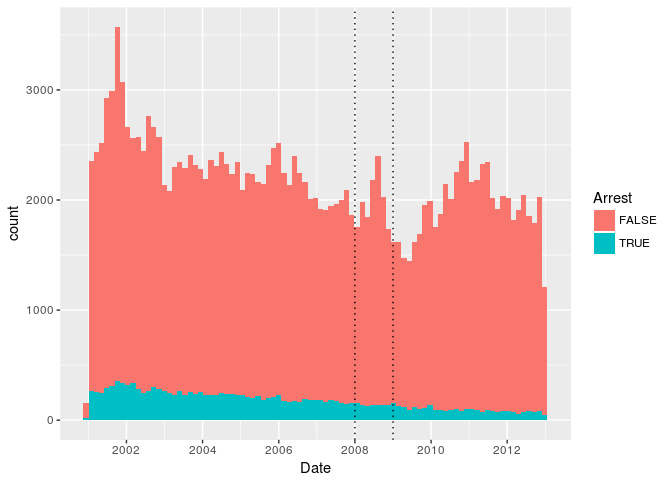
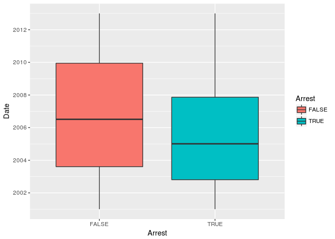

# Assignment 1 _An Analytical Detective


Problem 1.1 - Loading the Data
1 point possible (graded)
Read the dataset mvtWeek1.csv into R, using the read.csv function, and call the data frame "mvt". Remember to navigate to the directory on your computer containing the file mvtWeek1.csv first. It may take a few minutes to read in the data, since it is pretty large. Then, use the str and summary functions to answer the following questions.

How many rows of data (observations) are in this dataset?


```r
require(dplyr)
```

```
## Loading required package: dplyr
```

```
## 
## Attaching package: 'dplyr'
```

```
## The following objects are masked from 'package:stats':
## 
##     filter, lag
```

```
## The following objects are masked from 'package:base':
## 
##     intersect, setdiff, setequal, union
```

```r
require(tidyr)
```

```
## Loading required package: tidyr
```

```r
require(ggplot2)
```

```
## Loading required package: ggplot2
```

```r
require(lubridate)
```

```
## Loading required package: lubridate
```

```
## 
## Attaching package: 'lubridate'
```

```
## The following object is masked from 'package:base':
## 
##     date
```

```r
df <- read.csv('mvtWeek1.csv')
dim(df)
```

```
## [1] 191641     11
```
Problem 1.2 - Loading the Data
1 point possible (graded)
How many variables are in this dataset?

```r
str(df)
```

```
## 'data.frame':	191641 obs. of  11 variables:
##  $ ID                 : int  8951354 8951141 8952745 8952223 8951608 8950793 8950760 8951611 8951802 8950706 ...
##  $ Date               : Factor w/ 131680 levels "10/10/01 0:00",..: 37302 37300 37300 37300 37299 37297 37296 37295 37291 37290 ...
##  $ LocationDescription: Factor w/ 78 levels "ABANDONED BUILDING",..: 72 72 62 72 72 72 72 72 72 72 ...
##  $ Arrest             : logi  FALSE FALSE FALSE FALSE FALSE TRUE ...
##  $ Domestic           : logi  FALSE FALSE FALSE FALSE FALSE FALSE ...
##  $ Beat               : int  623 1213 1622 724 211 2521 423 231 1021 1215 ...
##  $ District           : int  6 12 16 7 2 25 4 2 10 12 ...
##  $ CommunityArea      : int  69 24 11 67 35 19 48 40 29 24 ...
##  $ Year               : int  2012 2012 2012 2012 2012 2012 2012 2012 2012 2012 ...
##  $ Latitude           : num  41.8 41.9 42 41.8 41.8 ...
##  $ Longitude          : num  -87.6 -87.7 -87.8 -87.7 -87.6 ...
```

Problem 1.3 - Loading the Data
1 point possible (graded)
Using the "max" function, what is the maximum value of the variable "ID"?


```r
max(df$ID)
```

```
## [1] 9181151
```
Problem 1.4 - Loading the Data
1 point possible (graded)
What is the minimum value of the variable "Beat"?

```r
min(df$Beat
    )
```

```
## [1] 111
```
Problem 1.5 - Loading the Data
1 point possible (graded)
How many observations have value TRUE in the Arrest variable (this is the number of crimes for which an arrest was made)?

```r
table(df$Arrest)
```

```
## 
##  FALSE   TRUE 
## 176105  15536
```
Problem 1.6 - Loading the Data
1 point possible (graded)
How many observations have a LocationDescription value of ALLEY?

```r
sum(df$LocationDescription=='ALLEY')
```

```
## [1] 2308
```
Problem 2.1 - Understanding Dates in R
1 point possible (graded)
In many datasets, like this one, you have a date field. Unfortunately, R does not automatically recognize entries that look like dates. We need to use a function in R to extract the date and time. Take a look at the first entry of Date (remember to use square brackets when looking at a certain entry of a variable).

In what format are the entries in the variable Date?

```r
df$Date[nrow(df)/2]
```

```
## [1] 5/21/06 13:00
## 131680 Levels: 10/10/01 0:00 10/10/01 0:01 10/10/01 0:30 ... 9/9/12 9:50
```
Problem 2.2 - Understanding Dates in R
1 point possible (graded)
Now, let's convert these characters into a Date object in R. In your R console, type

DateConvert = as.Date(strptime(mvt$Date, "%m/%d/%y %H:%M"))

This converts the variable "Date" into a Date object in R. Take a look at the variable DateConvert using the summary function.

What is the month and year of the median date in our dataset? Enter your answer as "Month Year", without the quotes. (Ex: if the answer was 2008-03-28, you would give the answer "March 2008", without the quotes.)

```r
DateYear = as.Date(strptime(df$Date,"%m/%d/%y %H:%M"))
summary(DateYear)
```

```
##         Min.      1st Qu.       Median         Mean      3rd Qu. 
## "2001-01-01" "2003-07-10" "2006-05-21" "2006-08-23" "2009-10-24" 
##         Max. 
## "2012-12-31"
```

```r
median(DateYear)
```

```
## [1] "2006-05-21"
```
Problem 2.3 - Understanding Dates in R
1 point possible (graded)
Now, let's extract the month and the day of the week, and add these variables to our data frame mvt. We can do this with two simple functions. Type the following commands in R:

```r
df
```

```
##             ID           Date
## 1      8951354 12/31/12 23:15
## 2      8951141 12/31/12 22:00
## 3      8952745 12/31/12 22:00
## 4      8952223 12/31/12 22:00
## 5      8951608 12/31/12 21:30
## 6      8950793 12/31/12 20:30
## 7      8950760 12/31/12 20:10
## 8      8951611 12/31/12 20:00
## 9      8951802 12/31/12 19:00
## 10     8950706 12/31/12 18:00
## 11     8951585 12/31/12 18:00
## 12     8951230 12/31/12 17:00
## 13     8955530 12/31/12 16:30
## 14     8950570 12/31/12 16:20
## 15     8954231 12/31/12 16:15
## 16     8950703 12/31/12 16:00
## 17     8954418 12/31/12 16:00
## 18     8951685 12/31/12 16:00
## 19     8950586 12/31/12 14:36
## 20     8951367 12/31/12 13:45
## 21     8950549 12/31/12 13:15
## 22     8950318 12/31/12 10:00
## 23     8950477  12/31/12 9:30
## 24     8950502  12/31/12 9:00
## 25     8950307  12/31/12 8:20
## 26     8950161  12/31/12 8:05
## 27     8950414  12/31/12 7:05
## 28     8950417  12/31/12 7:00
## 29     8950164  12/31/12 7:00
## 30     8950087  12/31/12 6:50
## 31     8950555  12/31/12 5:45
## 32     8950313  12/31/12 3:00
## 33     8953484  12/31/12 3:00
## 34     8950693  12/31/12 3:00
## 35     8950179  12/31/12 2:00
## 36     8950136  12/31/12 1:00
## 37     9124818  12/31/12 0:01
## 38     8950626  12/31/12 0:00
## 39     8950676  12/31/12 0:00
## 40     8950575  12/31/12 0:00
## 41     8950474 12/30/12 23:00
## 42     8950273 12/30/12 22:30
## 43     8968675 12/30/12 22:00
## 44     8950093 12/30/12 22:00
## 45     8950088 12/30/12 21:00
## 46     8950297 12/30/12 20:00
## 47     8950665 12/30/12 20:00
## 48     8949895 12/30/12 19:46
## 49     8949936 12/30/12 18:30
## 50     8976358 12/30/12 18:30
## 51     8950674 12/30/12 18:30
## 52     8950545 12/30/12 18:00
## 53     8950463 12/30/12 18:00
## 54     8950583 12/30/12 18:00
## 55     8950159 12/30/12 16:00
## 56     8949932 12/30/12 15:30
## 57     8950210 12/30/12 15:00
## 58     8951754 12/30/12 15:00
## 59     8950515 12/30/12 15:00
## 60     8949557 12/30/12 15:00
## 61     8955355 12/30/12 12:00
## 62     8949564 12/30/12 11:40
## 63     8949509 12/30/12 11:00
## 64     8955672 12/30/12 11:00
## 65     8950691  12/30/12 9:00
## 66     8949871  12/30/12 8:20
## 67     8949314  12/30/12 8:20
## 68     8949366  12/30/12 8:15
## 69     8950022  12/30/12 8:00
## 70     8949844  12/30/12 7:15
## 71     8949258  12/30/12 7:05
## 72     8949695  12/30/12 6:47
## 73     8949217  12/30/12 4:50
## 74     8950494  12/30/12 3:00
## 75     8950331  12/30/12 3:00
## 76     8949483  12/30/12 2:00
## 77     8949779  12/30/12 1:30
## 78     8949135  12/30/12 1:00
## 79     8949358  12/30/12 1:00
## 80     8949806  12/30/12 1:00
## 81     8949479  12/30/12 0:30
## 82     8949094  12/30/12 0:30
## 83     8949392  12/30/12 0:30
## 84     8949213  12/30/12 0:01
## 85     8949144  12/30/12 0:00
## 86     8949625  12/30/12 0:00
## 87     9042047 12/29/12 23:30
## 88     8949031 12/29/12 23:11
## 89     8949367 12/29/12 21:00
## 90     8948976 12/29/12 20:30
## 91     8950125 12/29/12 19:30
## 92     8949409 12/29/12 18:30
## 93     8949852 12/29/12 18:00
## 94     8950280 12/29/12 18:00
## 95     8948759 12/29/12 17:30
## 96     8948749 12/29/12 17:00
## 97     8948893 12/29/12 17:00
## 98     8948698 12/29/12 16:15
## 99     8949686 12/29/12 16:00
## 100    8948734 12/29/12 14:00
## 101    8949749 12/29/12 12:00
## 102    8950256 12/29/12 12:00
## 103    8948422 12/29/12 11:30
## 104    8948633 12/29/12 11:30
## 105    8948861 12/29/12 11:00
## 106    8948504 12/29/12 11:00
## 107    8948353 12/29/12 10:00
## 108    8950594  12/29/12 9:00
## 109    8948409  12/29/12 8:30
## 110    8948332  12/29/12 8:00
## 111    8948432  12/29/12 7:00
## 112    8948608  12/29/12 7:00
## 113    8948739  12/29/12 7:00
## 114    9046824  12/29/12 7:00
## 115    8948789  12/29/12 6:00
## 116    8948245  12/29/12 5:30
## 117    8948622  12/29/12 5:00
## 118    8948853  12/29/12 4:00
## 119    8948874  12/29/12 4:00
## 120    8948258  12/29/12 3:30
## 121    8948282  12/29/12 3:30
## 122    8948283  12/29/12 3:00
## 123    9007491  12/29/12 3:00
## 124    8949038  12/29/12 2:00
## 125    8948191  12/29/12 1:00
## 126    8948652  12/29/12 1:00
## 127    8951518 12/28/12 23:45
## 128    8948819 12/28/12 23:00
## 129    8948343 12/28/12 22:30
## 130    8948591 12/28/12 22:30
## 131    8948278 12/28/12 21:45
## 132    8948285 12/28/12 21:30
## 133    8948444 12/28/12 21:30
## 134    8948136 12/28/12 21:00
## 135    8948419 12/28/12 21:00
## 136    8948421 12/28/12 20:30
## 137    8948255 12/28/12 20:30
## 138    8948059 12/28/12 20:00
## 139    8948145 12/28/12 20:00
## 140    8948473 12/28/12 20:00
## 141    8949418 12/28/12 19:45
## 142    8950282 12/28/12 19:00
## 143    8948060 12/28/12 18:30
## 144    8948205 12/28/12 18:25
## 145    8949020 12/28/12 18:00
## 146    8948279 12/28/12 18:00
## 147    8948515 12/28/12 18:00
## 148    8948497 12/28/12 18:00
## 149    8949312 12/28/12 18:00
## 150    8948930 12/28/12 18:00
## 151    8948457 12/28/12 17:30
## 152    8948364 12/28/12 16:00
## 153    8954564 12/28/12 16:00
## 154    8948558 12/28/12 15:00
## 155    8962131 12/28/12 15:00
## 156    8948433 12/28/12 15:00
## 157    8949275 12/28/12 14:30
## 158    8948424 12/28/12 14:00
## 159    8953388 12/28/12 14:00
## 160    8947767 12/28/12 13:45
## 161    8947677 12/28/12 13:30
## 162    8947412 12/28/12 12:30
## 163    8948465 12/28/12 12:00
## 164    8950170 12/28/12 11:00
## 165    8947171 12/28/12 10:34
## 166    8948776 12/28/12 10:00
## 167    9002580  12/28/12 9:00
## 168    8947413  12/28/12 9:00
## 169    8947295  12/28/12 8:00
## 170    8947164  12/28/12 8:00
## 171    8947025  12/28/12 7:45
## 172    8947233  12/28/12 7:00
## 173    8947659  12/28/12 7:00
## 174    8946785  12/28/12 6:33
## 175    8953198  12/28/12 6:00
## 176    8946942  12/28/12 5:40
## 177    8947263  12/28/12 5:30
## 178    8954234  12/28/12 5:00
## 179    8947246  12/28/12 3:00
## 180    8953211  12/28/12 2:00
## 181    8947523  12/28/12 1:30
## 182    8947590  12/28/12 1:00
## 183    8948127  12/28/12 1:00
## 184    8946753  12/28/12 0:01
## 185    8947887  12/28/12 0:01
## 186    8954069 12/27/12 23:15
## 187    8946549 12/27/12 23:15
## 188    8947236 12/27/12 23:00
## 189    8947998 12/27/12 23:00
## 190    8946566 12/27/12 23:00
## 191    8946644 12/27/12 22:30
## 192    8946574 12/27/12 22:00
## 193    8947735 12/27/12 22:00
## 194    8948338 12/27/12 21:00
## 195    8947158 12/27/12 21:00
## 196    8946575 12/27/12 20:00
## 197    8947600 12/27/12 19:30
## 198    8947605 12/27/12 19:00
## 199    8947736 12/27/12 19:00
## 200    8946287 12/27/12 18:00
## 201    8946280 12/27/12 15:45
## 202    8948762 12/27/12 14:00
## 203    8946736 12/27/12 14:00
## 204    8946334 12/27/12 14:00
## 205    8946073 12/27/12 13:45
## 206    8946143 12/27/12 13:30
## 207    8945923 12/27/12 12:45
## 208    8946400 12/27/12 12:30
## 209    8946058 12/27/12 12:00
## 210    8945746 12/27/12 11:20
## 211    8945860 12/27/12 11:00
## 212    8946739 12/27/12 10:45
## 213    8945877 12/27/12 10:45
## 214    8945802 12/27/12 10:00
## 215    8946213  12/27/12 8:00
## 216    8946218  12/27/12 7:50
## 217    8946269  12/27/12 7:40
## 218    8946210  12/27/12 7:00
## 219    8946390  12/27/12 7:00
## 220    8945179  12/27/12 6:45
## 221    8945163  12/27/12 6:07
## 222    8946442  12/27/12 5:30
## 223    8945560  12/27/12 4:30
## 224    8946122  12/27/12 2:00
## 225    8945432  12/27/12 2:00
## 226    8947304  12/27/12 1:30
## 227    8948339  12/27/12 1:00
## 228    8945193  12/27/12 0:01
## 229    8951778  12/27/12 0:01
## 230    8945136 12/26/12 23:40
## 231    8945676 12/26/12 23:00
## 232    8945740 12/26/12 23:00
## 233    8946079 12/26/12 23:00
## 234    8945630 12/26/12 22:00
## 235    8945427 12/26/12 21:30
## 236    8946147 12/26/12 21:00
## 237    8945485 12/26/12 20:30
## 238    8945177 12/26/12 20:30
## 239    8946261 12/26/12 19:00
## 240    8945384 12/26/12 18:00
## 241    8949486 12/26/12 17:30
## 242    8946266 12/26/12 17:00
## 243    8945279 12/26/12 17:00
## 244    8945080 12/26/12 16:30
## 245    8946580 12/26/12 16:00
## 246    8949525 12/26/12 15:00
## 247    8945431 12/26/12 14:30
## 248    8945493 12/26/12 14:00
## 249    8944690 12/26/12 13:45
## 250    8944577 12/26/12 13:00
## 251    8944797 12/26/12 11:00
## 252    8950098 12/26/12 11:00
## 253    8944628 12/26/12 10:00
## 254    8944507  12/26/12 9:48
## 255    8945809  12/26/12 9:30
## 256    8944774  12/26/12 8:00
## 257    8944937  12/26/12 8:00
## 258    8944948  12/26/12 5:00
## 259    8957307  12/26/12 1:00
## 260    8944175  12/26/12 1:00
## 261    8944631 12/25/12 22:00
## 262    8944265 12/25/12 22:00
## 263    8944290 12/25/12 22:00
## 264    8944096 12/25/12 21:00
## 265    8944262 12/25/12 21:00
## 266    8944123 12/25/12 20:00
## 267    8944048 12/25/12 18:00
## 268    8967291 12/25/12 18:00
## 269    8944046 12/25/12 18:00
## 270    8943982 12/25/12 17:20
## 271    8944025 12/25/12 16:30
## 272    8946077 12/25/12 15:30
## 273    8944024 12/25/12 15:00
## 274    8943931 12/25/12 14:00
## 275    8944887 12/25/12 14:00
## 276    8947671 12/25/12 12:30
## 277    8946872 12/25/12 12:00
## 278    8944630 12/25/12 12:00
## 279    8943877 12/25/12 10:00
## 280    8943770 12/25/12 10:00
## 281    8950180  12/25/12 8:30
## 282    8943780  12/25/12 5:00
## 283    8946340  12/25/12 2:00
## 284    8943781  12/25/12 1:00
## 285    8954470  12/25/12 1:00
## 286    8945596  12/25/12 0:01
## 287    8944054  12/25/12 0:00
## 288    8956738  12/25/12 0:00
## 289    8943604 12/24/12 23:30
## 290    8943563 12/24/12 23:30
## 291    8943595 12/24/12 21:55
## 292    8944263 12/24/12 20:00
## 293    8943477 12/24/12 19:45
## 294    8943946 12/24/12 19:00
## 295    8943294 12/24/12 16:00
## 296    8948718 12/24/12 16:00
## 297    8943322 12/24/12 15:55
## 298    8943432 12/24/12 15:00
## 299    8943955 12/24/12 14:00
## 300    8960548 12/24/12 12:00
## 301    9125365 12/24/12 12:00
## 302    8942978  12/24/12 9:30
## 303    8943152  12/24/12 9:20
## 304    8942945  12/24/12 7:30
## 305    8943006  12/24/12 7:00
## 306    8944276  12/24/12 3:30
## 307    8950670  12/24/12 2:00
## 308    8943514  12/24/12 2:00
## 309    8943602  12/24/12 0:01
## 310    8943057  12/24/12 0:01
## 311    8943398  12/24/12 0:00
## 312    8942909 12/23/12 22:30
## 313    8943031 12/23/12 22:00
## 314    8943399 12/23/12 21:30
## 315    8947711 12/23/12 21:30
## 316    8944327 12/23/12 20:53
## 317    8954339 12/23/12 20:00
## 318    8946264 12/23/12 18:00
## 319    8942448 12/23/12 17:00
## 320    8942661 12/23/12 17:00
## 321    8942695 12/23/12 17:00
## 322    8942520 12/23/12 16:45
## 323    8942542 12/23/12 16:15
## 324    8943019 12/23/12 14:30
## 325    8942371 12/23/12 14:15
## 326    8942348 12/23/12 14:00
## 327    8942233 12/23/12 12:30
## 328    8942543 12/23/12 11:00
## 329    8942467 12/23/12 10:00
## 330    8942113  12/23/12 9:10
## 331    8942114  12/23/12 9:00
## 332    8943956  12/23/12 7:00
## 333    8942925  12/23/12 7:00
## 334    8942121  12/23/12 6:30
## 335    8942052  12/23/12 2:00
## 336    8942471  12/23/12 2:00
## 337    8942848  12/23/12 1:00
## 338    8942231  12/23/12 0:01
## 339    8943417  12/23/12 0:00
## 340    8949628 12/22/12 23:45
## 341    8941928 12/22/12 23:30
## 342    8942648 12/22/12 23:00
## 343    8942364 12/22/12 23:00
## 344    8946331 12/22/12 22:00
## 345    8946895 12/22/12 22:00
## 346    8942084 12/22/12 21:00
## 347    8941814 12/22/12 20:20
## 348    8942891 12/22/12 20:00
## 349    8942177 12/22/12 20:00
## 350    8946403 12/22/12 18:00
## 351    8941861 12/22/12 18:00
## 352    8942090 12/22/12 18:00
## 353    8941840 12/22/12 17:00
## 354    8944127 12/22/12 14:00
## 355    8941490 12/22/12 14:00
## 356    8942187 12/22/12 14:00
## 357    8944313 12/22/12 13:00
## 358    8941398 12/22/12 12:30
## 359    8941321 12/22/12 12:00
## 360    8941437 12/22/12 10:30
## 361    8950580  12/22/12 9:00
## 362    8941862  12/22/12 9:00
## 363    8941310  12/22/12 9:00
## 364    8942431  12/22/12 9:00
## 365    8941619  12/22/12 8:00
## 366    8953032  12/22/12 7:00
## 367    8946115  12/22/12 7:00
## 368    8941107  12/22/12 5:20
## 369    8941484  12/22/12 3:00
## 370    8941091  12/22/12 2:45
## 371    8941420  12/22/12 1:55
## 372    8941061  12/22/12 1:49
## 373    8941384  12/22/12 1:45
## 374    8941786  12/22/12 1:00
## 375    8941057  12/22/12 0:35
## 376    8941272 12/21/12 23:30
## 377    8941268 12/21/12 23:00
## 378    8943274 12/21/12 22:30
## 379    8941058 12/21/12 22:00
## 380    8941460 12/21/12 22:00
## 381    8941108 12/21/12 22:00
## 382    8941761 12/21/12 22:00
## 383    8941439 12/21/12 22:00
## 384    8943320 12/21/12 22:00
## 385    8941189 12/21/12 21:00
## 386    8940994 12/21/12 20:55
## 387    8941614 12/21/12 20:25
## 388    8941167 12/21/12 20:00
## 389    8942483 12/21/12 20:00
## 390    8941240 12/21/12 19:00
## 391    8943062 12/21/12 19:00
## 392    8941070 12/21/12 19:00
## 393    8942671 12/21/12 18:00
## 394    8941220 12/21/12 18:00
## 395    8942372 12/21/12 18:00
## 396    8941480 12/21/12 17:00
## 397    8948539 12/21/12 17:00
## 398    8940710 12/21/12 16:45
## 399    8940832 12/21/12 16:30
## 400    8941204 12/21/12 16:00
## 401    8940629 12/21/12 16:00
## 402    8940765 12/21/12 15:30
## 403    8941720 12/21/12 15:10
## 404    8940888 12/21/12 15:00
## 405    8956157 12/21/12 14:00
## 406    8940655 12/21/12 12:45
## 407    8940638 12/21/12 11:00
## 408    8940390 12/21/12 10:30
## 409    8940627 12/21/12 10:00
## 410    8940221  12/21/12 9:30
## 411    8940214  12/21/12 9:30
## 412    8941244  12/21/12 9:25
## 413    8940415  12/21/12 9:00
## 414    8940582  12/21/12 9:00
## 415    8953244  12/21/12 9:00
## 416    8940349  12/21/12 9:00
## 417    8940346  12/21/12 8:00
## 418    8945975  12/21/12 8:00
## 419    8939763  12/21/12 7:40
## 420    8939826  12/21/12 7:20
## 421    8940658  12/21/12 7:00
## 422    8941501  12/21/12 7:00
## 423    8939693  12/21/12 6:45
## 424    8939894  12/21/12 6:30
## 425    8940805  12/21/12 6:00
## 426    8939634  12/21/12 5:30
## 427    8941819  12/21/12 3:30
## 428    8941519  12/21/12 3:00
## 429    8939825  12/21/12 2:00
## 430    8941066  12/21/12 2:00
## 431    8939743  12/21/12 0:30
## 432    8939578  12/21/12 0:15
## 433    8939610  12/21/12 0:03
## 434    8940497  12/21/12 0:01
## 435    8950118  12/21/12 0:00
## 436    8939873  12/21/12 0:00
## 437    8940356  12/21/12 0:00
## 438    8940746  12/21/12 0:00
## 439    8943138  12/21/12 0:00
## 440    8940845 12/20/12 23:00
## 441    8946093 12/20/12 23:00
## 442    8939584 12/20/12 23:00
## 443    8942428 12/20/12 23:00
## 444    8941465 12/20/12 22:00
## 445    8941905 12/20/12 21:30
## 446    8939737 12/20/12 21:00
## 447    8939745 12/20/12 20:30
## 448    8940007 12/20/12 20:00
## 449    8940149 12/20/12 19:00
## 450    8939972 12/20/12 18:30
## 451    8939523 12/20/12 18:10
## 452    8940101 12/20/12 17:00
## 453    8940345 12/20/12 16:30
## 454    8939336 12/20/12 15:20
## 455    8939319 12/20/12 15:00
## 456    9005905 12/20/12 14:00
## 457    8951428 12/20/12 12:20
## 458    9062945 12/20/12 12:00
## 459    8939097 12/20/12 12:00
## 460    8939162 12/20/12 11:00
## 461    8950403 12/20/12 11:00
## 462    8980787 12/20/12 10:00
## 463    8940280 12/20/12 10:00
## 464    8951152  12/20/12 9:37
## 465    8965120  12/20/12 9:00
## 466    8939908  12/20/12 8:00
## 467    8938858  12/20/12 8:00
## 468    8943305  12/20/12 7:30
## 469    8940802  12/20/12 7:00
## 470    8938293  12/20/12 6:30
## 471    8938656  12/20/12 6:00
## 472    8939322  12/20/12 4:00
## 473    8938356  12/20/12 2:30
## 474    8939414  12/20/12 2:00
## 475    8939254  12/20/12 1:30
## 476    8938704  12/20/12 1:00
## 477    8938368  12/20/12 0:01
## 478    8938728  12/20/12 0:00
## 479    8938706  12/20/12 0:00
## 480    8938772 12/19/12 23:50
## 481    8940798 12/19/12 23:30
## 482    8938330 12/19/12 23:00
## 483    8938085 12/19/12 22:30
## 484    8938036 12/19/12 22:30
## 485    8939022 12/19/12 22:00
## 486    8940089 12/19/12 22:00
## 487    8938299 12/19/12 21:00
## 488    8940054 12/19/12 21:00
## 489    8943843 12/19/12 21:00
## 490    8940298 12/19/12 20:30
## 491    8939051 12/19/12 20:00
## 492    8938445 12/19/12 20:00
## 493    8938848 12/19/12 19:20
## 494    8937902 12/19/12 17:30
## 495    8938564 12/19/12 16:30
## 496    8937759 12/19/12 16:00
## 497    8944068 12/19/12 16:00
## 498    8938712 12/19/12 16:00
## 499    8939134 12/19/12 15:20
## 500    8940514 12/19/12 15:00
## 501    8941682 12/19/12 14:30
## 502    8938717 12/19/12 13:45
## 503    9065372 12/19/12 12:00
## 504    8938291 12/19/12 10:00
## 505    8943444  12/19/12 9:00
## 506    8944018  12/19/12 9:00
## 507    8937800  12/19/12 8:30
## 508    8938245  12/19/12 7:45
## 509    8938680  12/19/12 7:09
## 510    8937779  12/19/12 6:00
## 511    8939330  12/19/12 6:00
## 512    8936750  12/19/12 2:00
## 513    8937219  12/19/12 1:00
## 514    8937038  12/19/12 0:30
## 515    8938827  12/19/12 0:01
## 516    8937627  12/19/12 0:00
## 517    8937458  12/19/12 0:00
## 518    8936790 12/18/12 23:15
## 519    8937021 12/18/12 23:00
## 520    8936798 12/18/12 23:00
## 521    8936978 12/18/12 22:40
## 522    8936693 12/18/12 22:30
## 523    8942933 12/18/12 22:00
## 524    8937682 12/18/12 21:00
## 525    8937784 12/18/12 20:00
## 526    8936518 12/18/12 20:00
## 527    8936405 12/18/12 20:00
## 528    8937009 12/18/12 20:00
## 529    8938721 12/18/12 20:00
## 530    8937423 12/18/12 20:00
## 531    8938927 12/18/12 20:00
## 532    8937126 12/18/12 19:30
## 533    8937878 12/18/12 19:00
## 534    8936644 12/18/12 19:00
## 535    8936687 12/18/12 18:15
## 536    8936233 12/18/12 18:15
## 537    8937163 12/18/12 18:00
## 538    8938239 12/18/12 18:00
## 539    8937130 12/18/12 16:30
## 540    8939024 12/18/12 15:00
## 541    8936117 12/18/12 13:30
## 542    8946706 12/18/12 12:20
## 543    8936293 12/18/12 12:00
## 544    8936208 12/18/12 11:00
## 545    8935783  12/18/12 9:15
## 546    8936206  12/18/12 8:50
## 547    8937372  12/18/12 8:00
## 548    8936231  12/18/12 8:00
## 549    8936272  12/18/12 7:30
## 550    8936085  12/18/12 6:00
## 551    8936136  12/18/12 6:00
## 552    8935310  12/18/12 3:00
## 553    8935397  12/18/12 2:30
## 554    8935112  12/18/12 2:30
## 555    8937196  12/18/12 2:00
## 556    8935187  12/18/12 1:30
## 557    8935314  12/18/12 1:00
## 558    8935313  12/18/12 1:00
## 559    8935582  12/18/12 0:30
## 560    8936855  12/18/12 0:01
## 561    8935526  12/18/12 0:00
## 562    8935391 12/17/12 23:30
## 563    8935172 12/17/12 23:00
## 564    8935095 12/17/12 22:32
## 565    8935185 12/17/12 22:30
## 566    8936278 12/17/12 21:30
## 567    8950479 12/17/12 21:30
## 568    8935768 12/17/12 21:00
## 569    8935395 12/17/12 21:00
## 570    8936055 12/17/12 21:00
## 571    8935184 12/17/12 21:00
## 572    8935018 12/17/12 20:30
## 573    8935533 12/17/12 19:00
## 574    8936209 12/17/12 19:00
## 575    8936416 12/17/12 18:30
## 576    8935989 12/17/12 18:00
## 577    8935087 12/17/12 18:00
## 578    8935606 12/17/12 17:30
## 579    8946181 12/17/12 17:00
## 580    8934685 12/17/12 16:00
## 581    8970731 12/17/12 15:00
## 582    8935980 12/17/12 13:41
## 583    8943243 12/17/12 13:30
## 584    8939174 12/17/12 13:00
## 585    9112677 12/17/12 12:00
## 586    8934494 12/17/12 10:00
## 587    8935687  12/17/12 9:30
## 588    8936122  12/17/12 9:00
## 589    8946284  12/17/12 9:00
## 590    8934827  12/17/12 8:30
## 591    8934204  12/17/12 7:40
## 592    8934243  12/17/12 6:00
## 593    8934563  12/17/12 5:00
## 594    8933515  12/17/12 3:00
## 595    8933516  12/17/12 2:00
## 596    8934692  12/17/12 2:00
## 597    8941564  12/17/12 1:00
## 598    8934020  12/17/12 1:00
## 599    8938403  12/17/12 0:00
## 600    8934521  12/17/12 0:00
## 601    8934061 12/16/12 23:00
## 602    8934067 12/16/12 23:00
## 603    8934033 12/16/12 23:00
## 604    8934600 12/16/12 22:00
## 605    8936074 12/16/12 22:00
## 606    8933732 12/16/12 22:00
## 607    8933794 12/16/12 21:30
## 608    8934348 12/16/12 21:00
## 609    8933723 12/16/12 21:00
## 610    8933584 12/16/12 21:00
## 611    8934069 12/16/12 21:00
## 612    8935092 12/16/12 20:30
## 613    8934914 12/16/12 20:00
## 614    8933249 12/16/12 20:00
## 615    8933880 12/16/12 20:00
## 616    8933286 12/16/12 19:45
## 617    8933332 12/16/12 19:30
## 618    8934973 12/16/12 19:00
## 619    8933393 12/16/12 19:00
## 620    8934629 12/16/12 19:00
## 621    8933420 12/16/12 19:00
## 622    8933308 12/16/12 18:00
## 623    8934876 12/16/12 16:00
## 624    8933209 12/16/12 15:00
## 625    8933419 12/16/12 15:00
## 626    8934064 12/16/12 14:30
## 627    8934597 12/16/12 14:00
## 628    8932996 12/16/12 10:30
## 629    8933432  12/16/12 9:00
## 630    8949671  12/16/12 9:00
## 631    8932991  12/16/12 9:00
## 632    8974545  12/16/12 8:00
## 633    8933300  12/16/12 7:06
## 634    8932788  12/16/12 5:00
## 635    8932888  12/16/12 4:00
## 636    8932629  12/16/12 4:00
## 637    8932621  12/16/12 3:15
## 638    8932771  12/16/12 1:00
## 639    8933203 12/15/12 23:45
## 640    8933026 12/15/12 23:30
## 641    8933184 12/15/12 22:00
## 642    8932654 12/15/12 21:30
## 643    8937216 12/15/12 21:00
## 644    8933261 12/15/12 20:30
## 645    8932666 12/15/12 19:30
## 646    8932690 12/15/12 19:20
## 647    8932521 12/15/12 18:30
## 648    8933774 12/15/12 17:00
## 649    8942349 12/15/12 17:00
## 650    8932804 12/15/12 15:30
## 651    8933024 12/15/12 15:30
## 652    8941527 12/15/12 15:00
## 653    8961532 12/15/12 15:00
## 654    8932085 12/15/12 13:30
## 655    8932546 12/15/12 13:00
## 656    8969273 12/15/12 11:00
## 657    8936898 12/15/12 11:00
## 658    8932007 12/15/12 10:00
## 659    8933784 12/15/12 10:00
## 660    8931955  12/15/12 9:30
## 661    8932226  12/15/12 8:30
## 662    8931772  12/15/12 8:30
## 663    8931888  12/15/12 7:30
## 664    8931856  12/15/12 5:00
## 665    8932941  12/15/12 4:00
## 666    8931901  12/15/12 3:30
## 667    8932228  12/15/12 3:30
## 668    8931922  12/15/12 3:15
## 669    8932948  12/15/12 3:00
## 670    8932049  12/15/12 3:00
## 671    8931795  12/15/12 3:00
## 672    8931938  12/15/12 1:30
## 673    8931822  12/15/12 1:00
## 674    8931952  12/15/12 1:00
## 675    8931895  12/15/12 1:00
## 676    8931821  12/15/12 0:01
## 677    8931774  12/15/12 0:01
## 678    8931905  12/15/12 0:01
## 679    8931858  12/15/12 0:01
## 680    8932317  12/15/12 0:00
## 681    8932003  12/15/12 0:00
## 682    8931778 12/14/12 23:00
## 683    8934785 12/14/12 23:00
## 684    8932532 12/14/12 23:00
## 685    8931890 12/14/12 22:00
## 686    8931597 12/14/12 22:00
## 687    8931750 12/14/12 22:00
## 688    8931855 12/14/12 21:30
## 689    8931708 12/14/12 21:00
## 690    8933487 12/14/12 21:00
## 691    8933119 12/14/12 20:00
## 692    8931941 12/14/12 20:00
## 693    8931758 12/14/12 18:30
## 694    8931751 12/14/12 18:00
## 695    8932229 12/14/12 18:00
## 696    8933039 12/14/12 18:00
## 697    8931554 12/14/12 17:00
## 698    8931591 12/14/12 16:00
## 699    8931776 12/14/12 16:00
## 700    8931099 12/14/12 15:35
## 701    8931996 12/14/12 15:30
## 702    8931067 12/14/12 13:30
## 703    8931123 12/14/12 12:55
## 704    8936895 12/14/12 12:30
## 705    8932748 12/14/12 11:45
## 706    8931111 12/14/12 11:00
## 707    8932010 12/14/12 10:45
## 708    8931773 12/14/12 10:00
## 709    8931396  12/14/12 9:00
## 710    8934631  12/14/12 9:00
## 711    8931231  12/14/12 9:00
## 712    8930653  12/14/12 9:00
## 713    8931208  12/14/12 8:00
## 714    8931395  12/14/12 7:30
## 715    8930710  12/14/12 6:07
## 716    8931836  12/14/12 5:00
## 717    8939413  12/14/12 5:00
## 718    8931094  12/14/12 4:00
## 719    8930126  12/14/12 1:45
## 720    8930377  12/14/12 1:30
## 721    8932223  12/14/12 1:00
## 722    8930462  12/14/12 0:10
## 723    8932031  12/14/12 0:01
## 724    8932050 12/13/12 23:30
## 725    8931161 12/13/12 23:20
## 726    8931252 12/13/12 23:00
## 727    8931102 12/13/12 23:00
## 728    8935222 12/13/12 23:00
## 729    8930742 12/13/12 22:30
## 730    8947714 12/13/12 22:00
## 731    8973119 12/13/12 21:00
## 732    8944476 12/13/12 20:00
## 733    8932203 12/13/12 19:30
## 734    8940222 12/13/12 19:00
## 735    8930494 12/13/12 19:00
## 736    8929955 12/13/12 19:00
## 737    8930410 12/13/12 19:00
## 738    8930197 12/13/12 18:00
## 739    8930167 12/13/12 18:00
## 740    8933783 12/13/12 18:00
## 741    8929953 12/13/12 17:30
## 742    8932930 12/13/12 17:00
## 743    8931127 12/13/12 17:00
## 744    8930213 12/13/12 16:45
## 745    8936535 12/13/12 16:45
## 746    8930954 12/13/12 16:30
## 747    8929946 12/13/12 16:00
## 748    8932179 12/13/12 13:00
## 749    8931526 12/13/12 12:00
## 750    8931452 12/13/12 11:30
## 751    8929129 12/13/12 11:20
## 752    8929060  12/13/12 9:50
## 753    8929045  12/13/12 9:00
## 754    8928865  12/13/12 9:00
## 755    8929226  12/13/12 9:00
## 756    8929399  12/13/12 8:00
## 757    8929691  12/13/12 6:00
## 758    8929764  12/13/12 5:45
## 759    8929260  12/13/12 5:30
## 760    8929028  12/13/12 5:10
## 761    8930050  12/13/12 4:00
## 762    8929504  12/13/12 1:48
## 763    8929044  12/13/12 1:00
## 764    8929548  12/13/12 0:00
## 765    8929115  12/13/12 0:00
## 766    8929500  12/13/12 0:00
## 767    8938098 12/12/12 23:30
## 768    8929139 12/12/12 23:00
## 769    8929867 12/12/12 23:00
## 770    8931237 12/12/12 23:00
## 771    8929664 12/12/12 22:00
## 772    8929431 12/12/12 21:30
## 773    8928480 12/12/12 21:00
## 774    8928717 12/12/12 20:00
## 775    8928541 12/12/12 19:00
## 776    8968539 12/12/12 19:00
## 777    8932198 12/12/12 19:00
## 778    8928860 12/12/12 19:00
## 779    8933009 12/12/12 18:40
## 780    8931030 12/12/12 16:00
## 781    8930344 12/12/12 15:15
## 782    8928275 12/12/12 15:00
## 783    8931432 12/12/12 13:00
## 784    8927931 12/12/12 12:45
## 785    8933969 12/12/12 12:10
## 786    8942837 12/12/12 12:00
## 787    8927387 12/12/12 11:25
## 788    8927976 12/12/12 11:00
## 789    8934175 12/12/12 10:30
## 790    8927868 12/12/12 10:30
## 791    8931244 12/12/12 10:00
## 792    8927971 12/12/12 10:00
## 793    8927892  12/12/12 9:15
## 794    8932062  12/12/12 9:00
## 795    8928162  12/12/12 9:00
## 796    8936044  12/12/12 8:00
## 797    8928243  12/12/12 7:40
## 798    8927272  12/12/12 6:00
## 799    8929822  12/12/12 4:00
## 800    8929653  12/12/12 4:00
## 801    8927996  12/12/12 0:00
## 802    8928697 12/11/12 23:00
## 803    8926795 12/11/12 23:00
## 804    8947145 12/11/12 22:00
## 805    8927958 12/11/12 22:00
## 806    8929491 12/11/12 22:00
## 807    8926690 12/11/12 21:30
## 808    8927386 12/11/12 21:30
## 809    8926744 12/11/12 21:11
## 810    8927321 12/11/12 20:00
## 811    8926876 12/11/12 20:00
## 812    8927235 12/11/12 19:15
## 813    8942839 12/11/12 19:00
## 814    8926714 12/11/12 18:08
## 815    8926794 12/11/12 17:30
## 816    8927435 12/11/12 17:30
## 817    8931236 12/11/12 17:00
## 818    8926757 12/11/12 17:00
## 819    8931997 12/11/12 17:00
## 820    8926506 12/11/12 16:00
## 821    8928493 12/11/12 16:00
## 822    8927116 12/11/12 16:00
## 823    8936783 12/11/12 12:00
## 824    8930058 12/11/12 12:00
## 825    8926450 12/11/12 11:00
## 826    8929967 12/11/12 11:00
## 827    8926146 12/11/12 10:20
## 828    8926265  12/11/12 9:15
## 829    8926348  12/11/12 8:30
## 830    8926239  12/11/12 6:00
## 831    8926247  12/11/12 6:00
## 832    8928806  12/11/12 5:30
## 833    8944868  12/11/12 5:00
## 834    8927281  12/11/12 5:00
## 835    8927042  12/11/12 2:30
## 836    8925354  12/11/12 1:00
## 837    8925821  12/11/12 1:00
## 838    8925401  12/11/12 0:30
## 839    8926008  12/11/12 0:01
## 840    8926323 12/10/12 23:45
## 841    8925652 12/10/12 23:00
## 842    8928403 12/10/12 21:00
## 843    8925708 12/10/12 21:00
## 844    8925764 12/10/12 21:00
## 845    8927532 12/10/12 20:00
## 846    8928385 12/10/12 20:00
## 847    8925550 12/10/12 19:00
## 848    8925444 12/10/12 19:00
## 849    8925972 12/10/12 19:00
## 850    8925077 12/10/12 18:30
## 851    8925483 12/10/12 17:30
## 852    8925166 12/10/12 17:10
## 853    8924882 12/10/12 17:00
## 854    8924812 12/10/12 15:30
## 855    8924780 12/10/12 14:30
## 856    8924968 12/10/12 13:00
## 857    8926464 12/10/12 11:30
## 858    8924588 12/10/12 11:00
## 859    8924786 12/10/12 10:30
## 860    8963164 12/10/12 10:00
## 861    8938563  12/10/12 9:00
## 862    8925039  12/10/12 9:00
## 863    8923923  12/10/12 8:50
## 864    8924958  12/10/12 8:12
## 865    8925931  12/10/12 7:00
## 866    8923772  12/10/12 6:30
## 867    8925098  12/10/12 6:00
## 868    8924680  12/10/12 3:00
## 869    8924692  12/10/12 0:30
## 870    8980510  12/10/12 0:01
## 871    8931317  12/10/12 0:00
## 872    8923946  12/10/12 0:00
## 873    8927973  12/10/12 0:00
## 874    8924605  12/10/12 0:00
## 875    8924606  12/9/12 23:00
## 876    8924403  12/9/12 23:00
## 877    8930381  12/9/12 22:30
## 878    8925787  12/9/12 22:30
## 879    8923586  12/9/12 22:00
## 880    8928334  12/9/12 22:00
## 881    8924173  12/9/12 22:00
## 882    8925360  12/9/12 21:00
## 883    8924720  12/9/12 21:00
## 884    8924275  12/9/12 19:00
## 885    8924639  12/9/12 19:00
## 886    8924887  12/9/12 18:30
## 887    8934591  12/9/12 18:00
## 888    8925251  12/9/12 18:00
## 889    8923453  12/9/12 17:25
## 890    8925855  12/9/12 17:00
## 891    8924831  12/9/12 16:00
## 892    8923318  12/9/12 15:30
## 893    8923390  12/9/12 14:30
## 894    8925639  12/9/12 14:00
## 895    8950224  12/9/12 14:00
## 896    8926560  12/9/12 13:30
## 897    8923224  12/9/12 12:00
## 898    8923784  12/9/12 12:00
## 899    8923077  12/9/12 11:50
## 900    8924575   12/9/12 9:15
## 901    8923315   12/9/12 8:00
## 902    8923549   12/9/12 3:30
## 903    8923608   12/9/12 1:00
## 904    8922956   12/9/12 0:01
## 905    8922889  12/8/12 22:00
## 906    8924055  12/8/12 22:00
## 907    8922792  12/8/12 21:45
## 908    8930310  12/8/12 21:30
## 909    8923641  12/8/12 21:00
## 910    8923023  12/8/12 20:30
## 911    8922793  12/8/12 20:15
## 912    8922908  12/8/12 19:30
## 913    8922531  12/8/12 19:25
## 914    8923536  12/8/12 19:00
## 915    8923781  12/8/12 19:00
## 916    8934942  12/8/12 18:00
## 917    8922516  12/8/12 18:00
## 918    8923830  12/8/12 18:00
## 919    8923281  12/8/12 17:30
## 920    8922928  12/8/12 16:00
## 921    8923232  12/8/12 14:00
## 922    8922321  12/8/12 12:00
## 923    8926275  12/8/12 12:00
## 924    8923842  12/8/12 11:00
## 925    8973414   12/8/12 9:20
## 926    8923767   12/8/12 8:00
## 927    8922057   12/8/12 7:45
## 928    8921937   12/8/12 7:15
## 929    8922161   12/8/12 7:00
## 930    8921906   12/8/12 6:00
## 931    8921902   12/8/12 5:57
## 932    8924833   12/8/12 4:00
## 933    8922016   12/8/12 4:00
## 934    8922904   12/8/12 3:30
## 935    8922506   12/8/12 3:30
## 936    8922071   12/8/12 3:00
## 937    8922072   12/8/12 3:00
## 938    8922765   12/8/12 2:40
## 939    8922109   12/8/12 2:00
## 940    8922758   12/8/12 2:00
## 941    8922093   12/8/12 2:00
## 942    8941356   12/8/12 0:01
## 943    8921986  12/7/12 23:00
## 944    8921716  12/7/12 22:40
## 945    8922710  12/7/12 22:00
## 946    8922069  12/7/12 22:00
## 947    8921989  12/7/12 22:00
## 948    8921689  12/7/12 21:45
## 949    8922077  12/7/12 21:00
## 950    8922390  12/7/12 20:30
## 951    8921617  12/7/12 19:50
## 952    8922243  12/7/12 19:15
## 953    8922065  12/7/12 19:00
## 954    8923488  12/7/12 19:00
## 955    8922085  12/7/12 18:30
## 956    8921749  12/7/12 18:00
## 957    8924177  12/7/12 18:00
## 958    8921379  12/7/12 17:35
## 959    8921494  12/7/12 17:10
## 960    8921418  12/7/12 17:10
## 961    8923354  12/7/12 16:00
## 962    8926277  12/7/12 14:00
## 963    8921404  12/7/12 13:40
## 964    8921414  12/7/12 13:30
## 965    8964141  12/7/12 12:00
## 966    8920822  12/7/12 10:30
## 967    8921550  12/7/12 10:20
## 968    8921531   12/7/12 9:00
## 969    8920800   12/7/12 9:00
## 970    8921435   12/7/12 9:00
## 971    8922260   12/7/12 8:00
## 972    8921493   12/7/12 7:56
## 973    8920441   12/7/12 7:50
## 974    8921968   12/7/12 7:00
## 975    8924168   12/7/12 7:00
## 976    8920311   12/7/12 6:30
## 977    8921598   12/7/12 6:00
## 978    8920673   12/7/12 5:50
## 979    8920238   12/7/12 5:45
## 980    8921561   12/7/12 5:40
## 981    8923056   12/7/12 5:00
## 982    8922184   12/7/12 2:30
## 983    8920232   12/7/12 2:30
## 984    8921373   12/7/12 2:00
## 985    8920146   12/7/12 0:01
## 986    8920241   12/7/12 0:01
## 987    8930693   12/7/12 0:00
## 988    8920738  12/6/12 23:30
## 989    8920853  12/6/12 23:30
## 990    8921113  12/6/12 23:30
## 991    8921325  12/6/12 23:00
## 992    8922292  12/6/12 23:00
## 993    8925760  12/6/12 22:00
## 994    8920194  12/6/12 22:00
## 995    8920411  12/6/12 21:30
## 996    8920094  12/6/12 20:40
## 997    8920805  12/6/12 20:00
## 998    8920689  12/6/12 20:00
## 999    8920799  12/6/12 20:00
## 1000   8921638  12/6/12 19:30
## 1001   8920782  12/6/12 19:30
## 1002   8921445  12/6/12 19:00
## 1003   8920437  12/6/12 18:00
## 1004   8920987  12/6/12 18:00
## 1005   8920714  12/6/12 18:00
## 1006   8920255  12/6/12 17:40
## 1007   8920398  12/6/12 17:00
## 1008   8919918  12/6/12 16:15
## 1009   8921023  12/6/12 16:00
## 1010   8921426  12/6/12 15:50
## 1011   8919601  12/6/12 13:30
## 1012   8920100  12/6/12 13:00
## 1013   9023713  12/6/12 12:00
## 1014   9023717  12/6/12 12:00
## 1015   9023719  12/6/12 12:00
## 1016   8919394   12/6/12 9:10
## 1017   8918809   12/6/12 9:00
## 1018   8919758   12/6/12 8:25
## 1019   8918806   12/6/12 8:15
## 1020   8919808   12/6/12 7:20
## 1021   8918678   12/6/12 5:30
## 1022   8922565   12/6/12 5:30
## 1023   8918863   12/6/12 3:00
## 1024   8918849   12/6/12 3:00
## 1025   8919235   12/6/12 1:00
## 1026   8918619   12/6/12 1:00
## 1027   8919521   12/6/12 0:01
## 1028   8919615   12/6/12 0:01
## 1029   8922357   12/6/12 0:00
## 1030   8918646  12/5/12 23:00
## 1031   8918647  12/5/12 23:00
## 1032   8919076  12/5/12 23:00
## 1033   8919868  12/5/12 22:30
## 1034   8920120  12/5/12 22:00
## 1035   8919759  12/5/12 22:00
## 1036   8919330  12/5/12 22:00
## 1037   8919850  12/5/12 21:30
## 1038   8918790  12/5/12 21:30
## 1039   8918400  12/5/12 21:30
## 1040   8918529  12/5/12 21:00
## 1041   8929700  12/5/12 20:00
## 1042   8918202  12/5/12 19:30
## 1043   8919997  12/5/12 19:00
## 1044   8918512  12/5/12 19:00
## 1045   8918838  12/5/12 19:00
## 1046   8918290  12/5/12 18:30
## 1047   8918943  12/5/12 18:05
## 1048   8919813  12/5/12 18:00
## 1049   8918893  12/5/12 18:00
## 1050   8918538  12/5/12 18:00
## 1051   8919051  12/5/12 17:30
## 1052   8919162  12/5/12 17:00
## 1053   8918468  12/5/12 17:00
## 1054   8918565  12/5/12 17:00
## 1055   8961722  12/5/12 16:00
## 1056   8917919  12/5/12 15:00
## 1057   8919141  12/5/12 15:00
## 1058   8917956  12/5/12 13:30
## 1059   8917621  12/5/12 12:30
## 1060   8922302  12/5/12 12:00
## 1061   8918098  12/5/12 11:30
## 1062   8925229  12/5/12 10:00
## 1063   8918086   12/5/12 9:00
## 1064   8936462   12/5/12 8:20
## 1065   8918366   12/5/12 7:30
## 1066   8917978   12/5/12 5:30
## 1067   8920326   12/5/12 5:00
## 1068   8918551   12/5/12 2:00
## 1069   8916646   12/5/12 2:00
## 1070   8929835   12/5/12 1:00
## 1071   8924746   12/5/12 0:01
## 1072   8917760   12/5/12 0:01
## 1073   8917087   12/5/12 0:00
## 1074   8917980   12/5/12 0:00
## 1075   8918273  12/4/12 23:00
## 1076   8917183  12/4/12 22:30
## 1077   8917413  12/4/12 22:30
## 1078   8917529  12/4/12 22:00
## 1079   8918101  12/4/12 22:00
## 1080   8917526  12/4/12 22:00
## 1081   8916672  12/4/12 22:00
## 1082   8917172  12/4/12 22:00
## 1083   8928346  12/4/12 21:00
## 1084   8917379  12/4/12 21:00
## 1085   8916693  12/4/12 20:30
## 1086   8917421  12/4/12 20:30
## 1087   8918135  12/4/12 20:00
## 1088   8918075  12/4/12 20:00
## 1089   8922372  12/4/12 20:00
## 1090   8916596  12/4/12 19:30
## 1091   8916567  12/4/12 19:00
## 1092   8917004  12/4/12 18:00
## 1093   8919060  12/4/12 18:00
## 1094   8917686  12/4/12 18:00
## 1095   8917211  12/4/12 16:30
## 1096   8917086  12/4/12 16:00
## 1097   8916211  12/4/12 16:00
## 1098   8916104  12/4/12 10:30
## 1099   8917857  12/4/12 10:20
## 1100   8915549   12/4/12 9:55
## 1101   8915192   12/4/12 9:05
## 1102   8915592   12/4/12 9:00
## 1103   8916515   12/4/12 9:00
## 1104   8916365   12/4/12 9:00
## 1105   8916227   12/4/12 9:00
## 1106   8924635   12/4/12 8:45
## 1107   8916157   12/4/12 8:00
## 1108   8916486   12/4/12 7:00
## 1109   8916316   12/4/12 3:00
## 1110   8916054   12/4/12 3:00
## 1111   8916037   12/4/12 2:00
## 1112   8914929   12/4/12 2:00
## 1113   8915705   12/4/12 2:00
## 1114   8914872   12/4/12 1:30
## 1115   8915553   12/4/12 0:45
## 1116   8915730   12/4/12 0:01
## 1117   8915392   12/4/12 0:00
## 1118   8919553   12/4/12 0:00
## 1119   8915729  12/3/12 23:00
## 1120   8914687  12/3/12 22:20
## 1121   8915285  12/3/12 22:00
## 1122   8914920  12/3/12 22:00
## 1123   8914785  12/3/12 22:00
## 1124   8915541  12/3/12 22:00
## 1125   8915552  12/3/12 22:00
## 1126   8914671  12/3/12 21:00
## 1127   8915072  12/3/12 21:00
## 1128   8915046  12/3/12 20:30
## 1129   8914847  12/3/12 20:00
## 1130   8916226  12/3/12 20:00
## 1131   8915547  12/3/12 20:00
## 1132   8915469  12/3/12 19:30
## 1133   8915545  12/3/12 19:00
## 1134   8921102  12/3/12 19:00
## 1135   8914828  12/3/12 19:00
## 1136   8915040  12/3/12 18:30
## 1137   8918792  12/3/12 18:00
## 1138   8921455  12/3/12 18:00
## 1139   8919554  12/3/12 18:00
## 1140   8914689  12/3/12 17:30
## 1141   8917583  12/3/12 17:00
## 1142   8914690  12/3/12 17:00
## 1143   8914586  12/3/12 17:00
## 1144   8914871  12/3/12 16:10
## 1145   8914448  12/3/12 14:00
## 1146   8914160  12/3/12 13:30
## 1147   8930428  12/3/12 13:00
## 1148   8917024  12/3/12 12:00
## 1149   8914317   12/3/12 9:00
## 1150   8914319   12/3/12 8:00
## 1151   8914562   12/3/12 7:30
## 1152   8915799   12/3/12 7:00
## 1153   8913204   12/3/12 6:45
## 1154   8913256   12/3/12 6:00
## 1155   8913013   12/3/12 4:00
## 1156   9074370   12/3/12 2:30
## 1157   8913538   12/3/12 2:00
## 1158   8929832   12/3/12 2:00
## 1159   8912959  12/2/12 23:45
## 1160   8918124  12/2/12 23:30
## 1161   8916159  12/2/12 22:30
## 1162   8912924  12/2/12 22:00
## 1163   8913052  12/2/12 22:00
## 1164   8913015  12/2/12 22:00
## 1165   8913203  12/2/12 22:00
## 1166   8914243  12/2/12 22:00
## 1167   8913208  12/2/12 22:00
## 1168   8913046  12/2/12 21:30
## 1169   8912856  12/2/12 20:45
## 1170   8913051  12/2/12 19:00
## 1171   8918513  12/2/12 19:00
## 1172   8913455  12/2/12 19:00
## 1173   8914166  12/2/12 19:00
## 1174   8913266  12/2/12 19:00
## 1175   8914657  12/2/12 18:30
## 1176   8913017  12/2/12 18:00
## 1177   8912530  12/2/12 17:30
## 1178   8926245  12/2/12 17:00
## 1179   8912842  12/2/12 16:30
## 1180   8914862  12/2/12 16:30
## 1181   8913019  12/2/12 16:30
## 1182   8912901  12/2/12 16:00
## 1183   8913134  12/2/12 15:30
## 1184   8912544  12/2/12 15:00
## 1185   8912774  12/2/12 15:00
## 1186   8912675  12/2/12 15:00
## 1187   8927143  12/2/12 13:00
## 1188   8912622  12/2/12 13:00
## 1189   8913034  12/2/12 12:30
## 1190   8974652  12/2/12 12:00
## 1191   8914287  12/2/12 11:00
## 1192   8912358  12/2/12 10:50
## 1193   8929593  12/2/12 10:00
## 1194   8921263   12/2/12 9:45
## 1195   8912984   12/2/12 9:00
## 1196   8912495   12/2/12 8:30
## 1197   8912903   12/2/12 8:00
## 1198   8912105   12/2/12 6:50
## 1199   8912125   12/2/12 6:15
## 1200   8912346   12/2/12 5:30
## 1201   8912294   12/2/12 5:30
## 1202   8912538   12/2/12 5:00
## 1203   8912532   12/2/12 3:00
## 1204   8912237   12/2/12 2:00
## 1205   8912182   12/2/12 1:30
## 1206   8912165   12/2/12 1:00
## 1207   8912068   12/2/12 0:01
## 1208   8912386  12/1/12 23:30
## 1209   8926390  12/1/12 22:30
## 1210   8912301  12/1/12 22:30
## 1211   8912321  12/1/12 22:05
## 1212   8912184  12/1/12 22:00
## 1213   8912488  12/1/12 22:00
## 1214   8912298  12/1/12 21:30
## 1215   8911843  12/1/12 21:00
## 1216   8915123  12/1/12 21:00
## 1217   8919935  12/1/12 21:00
## 1218   8912980  12/1/12 20:30
## 1219   8948342  12/1/12 20:00
## 1220   8911921  12/1/12 20:00
## 1221   8912349  12/1/12 19:30
## 1222   8912339  12/1/12 19:00
## 1223   8912803  12/1/12 19:00
## 1224   8911933  12/1/12 17:30
## 1225   8911709  12/1/12 17:00
## 1226   8916993  12/1/12 17:00
## 1227   8912128  12/1/12 16:30
## 1228   8911966  12/1/12 15:00
## 1229   8914532  12/1/12 14:30
## 1230   8958280  12/1/12 12:00
## 1231   8911393  12/1/12 11:00
## 1232   8911706  12/1/12 11:00
## 1233   8924673  12/1/12 11:00
## 1234   8924759  12/1/12 11:00
## 1235   8911450   12/1/12 9:00
## 1236   8912877   12/1/12 9:00
## 1237   8912763   12/1/12 9:00
## 1238   8911359   12/1/12 8:46
## 1239   8911188   12/1/12 7:00
## 1240   8913915   12/1/12 5:00
## 1241   8914986   12/1/12 1:58
## 1242   8911606   12/1/12 1:00
## 1243   8911753   12/1/12 0:15
## 1244   8918184   12/1/12 0:01
## 1245   8911373   12/1/12 0:00
## 1246   8911418   12/1/12 0:00
## 1247   8911603   12/1/12 0:00
## 1248   8911009 11/30/12 22:30
## 1249   8911230 11/30/12 22:00
## 1250   8911215 11/30/12 22:00
## 1251   8911295 11/30/12 22:00
## 1252   8910908 11/30/12 22:00
## 1253   8911239 11/30/12 22:00
## 1254   8914147 11/30/12 21:30
## 1255   8911169 11/30/12 21:00
## 1256   8911072 11/30/12 21:00
## 1257   8911678 11/30/12 20:30
## 1258   8911098 11/30/12 20:30
## 1259   8911049 11/30/12 20:00
## 1260   8911073 11/30/12 19:00
## 1261   8911657 11/30/12 19:00
## 1262   8910589 11/30/12 18:19
## 1263   8911453 11/30/12 18:00
## 1264   8910643 11/30/12 17:05
## 1265   8911466 11/30/12 17:00
## 1266   8910424 11/30/12 15:30
## 1267   8915230 11/30/12 14:05
## 1268   8911291 11/30/12 11:30
## 1269   8927323  11/30/12 9:37
## 1270   8910068  11/30/12 9:00
## 1271   8909562  11/30/12 8:30
## 1272   8912810  11/30/12 8:00
## 1273   8909602  11/30/12 7:30
## 1274   8910374  11/30/12 6:48
## 1275   8910500  11/30/12 6:45
## 1276   8910258  11/30/12 6:30
## 1277   8910198  11/30/12 2:00
## 1278   8909955  11/30/12 2:00
## 1279   8909312  11/30/12 1:00
## 1280   8909264  11/30/12 0:01
## 1281   8913848  11/30/12 0:00
## 1282   8910211  11/30/12 0:00
## 1283   8910471  11/30/12 0:00
## 1284   8909944  11/30/12 0:00
## 1285   8909201 11/29/12 23:00
## 1286   8910401 11/29/12 23:00
## 1287   8909323 11/29/12 23:00
## 1288   8909166 11/29/12 23:00
## 1289   8909546 11/29/12 23:00
## 1290   8910672 11/29/12 22:30
## 1291   8934753 11/29/12 22:00
## 1292   8921621 11/29/12 22:00
## 1293   8911171 11/29/12 22:00
## 1294   8909764 11/29/12 22:00
## 1295   8909457 11/29/12 22:00
## 1296   8910385 11/29/12 21:00
## 1297   8910091 11/29/12 21:00
## 1298   8909270 11/29/12 20:00
## 1299   8910616 11/29/12 19:30
## 1300   8909779 11/29/12 19:00
## 1301   8909782 11/29/12 18:30
## 1302   8909069 11/29/12 18:00
## 1303   8908958 11/29/12 18:00
## 1304   8909811 11/29/12 17:30
## 1305   8908689 11/29/12 17:10
## 1306   8911881 11/29/12 17:00
## 1307   8908708 11/29/12 16:30
## 1308   8908950 11/29/12 16:30
## 1309   8908635 11/29/12 16:00
## 1310   8909583 11/29/12 16:00
## 1311   8908586 11/29/12 15:00
## 1312   8912548 11/29/12 12:00
## 1313   8910298 11/29/12 11:00
## 1314   8908678  11/29/12 9:00
## 1315   8920404  11/29/12 9:00
## 1316   8909498  11/29/12 8:00
## 1317   8908953  11/29/12 8:00
## 1318   8908559  11/29/12 7:30
## 1319   8907724  11/29/12 7:30
## 1320   8911452  11/29/12 7:00
## 1321   8909577  11/29/12 7:00
## 1322   8916040  11/29/12 7:00
## 1323   8907701  11/29/12 6:55
## 1324   8908490  11/29/12 6:10
## 1325   8907494  11/29/12 4:00
## 1326   8907762  11/29/12 3:00
## 1327   8908750  11/29/12 3:00
## 1328   8914787  11/29/12 3:00
## 1329   8908836  11/29/12 1:00
## 1330   8909072  11/29/12 1:00
## 1331   8908138  11/29/12 0:01
## 1332   8908011  11/29/12 0:01
## 1333   8908182 11/28/12 23:45
## 1334   8907500 11/28/12 23:45
## 1335   8907552 11/28/12 22:30
## 1336   8908123 11/28/12 22:00
## 1337   8908034 11/28/12 22:00
## 1338   8910631 11/28/12 22:00
## 1339   8908081 11/28/12 22:00
## 1340   8907626 11/28/12 21:00
## 1341   8907214 11/28/12 21:00
## 1342   8908038 11/28/12 21:00
## 1343   8908600 11/28/12 20:00
## 1344   8907122 11/28/12 19:55
## 1345   8909503 11/28/12 19:45
## 1346   8907413 11/28/12 19:30
## 1347   8907645 11/28/12 19:30
## 1348   8907530 11/28/12 19:00
## 1349   8907803 11/28/12 19:00
## 1350   8908364 11/28/12 19:00
## 1351   8907507 11/28/12 18:12
## 1352   8906896 11/28/12 17:30
## 1353   8907550 11/28/12 17:30
## 1354   8908068 11/28/12 17:00
## 1355   8907813 11/28/12 16:30
## 1356   8906822 11/28/12 16:00
## 1357   8907331 11/28/12 15:30
## 1358   8906812 11/28/12 14:30
## 1359   8907392 11/28/12 14:00
## 1360   8906494 11/28/12 14:00
## 1361   8906871 11/28/12 13:00
## 1362   8907145 11/28/12 12:15
## 1363   8910728 11/28/12 12:00
## 1364   8906834 11/28/12 10:00
## 1365   8907246 11/28/12 10:00
## 1366   8907318 11/28/12 10:00
## 1367   8906714  11/28/12 9:00
## 1368   8905694  11/28/12 7:35
## 1369   8905835  11/28/12 7:00
## 1370   8906136  11/28/12 6:30
## 1371   8907154  11/28/12 6:15
## 1372   8906330  11/28/12 6:15
## 1373   8907814  11/28/12 4:30
## 1374   8908543  11/28/12 3:00
## 1375   8906865  11/28/12 3:00
## 1376   8906771  11/28/12 3:00
## 1377   8905455  11/28/12 1:45
## 1378   8908069  11/28/12 1:00
## 1379   8916723  11/28/12 1:00
## 1380   8905586  11/28/12 1:00
## 1381   8906274  11/28/12 0:05
## 1382   8905596 11/27/12 23:55
## 1383   8906045 11/27/12 23:30
## 1384   8906277 11/27/12 23:30
## 1385   8905506 11/27/12 22:00
## 1386   8908098 11/27/12 21:30
## 1387   8905869 11/27/12 21:30
## 1388   8905602 11/27/12 21:00
## 1389   8905477 11/27/12 21:00
## 1390   8905318 11/27/12 21:00
## 1391   8914428 11/27/12 20:00
## 1392   8905288 11/27/12 19:50
## 1393   8907205 11/27/12 19:40
## 1394   8905209 11/27/12 19:20
## 1395   8949353 11/27/12 18:12
## 1396   8905508 11/27/12 18:00
## 1397   8907176 11/27/12 17:30
## 1398   8906735 11/27/12 17:15
## 1399   8911374 11/27/12 17:00
## 1400   8905449 11/27/12 14:30
## 1401   8907864 11/27/12 14:10
## 1402   8904812 11/27/12 13:00
## 1403   8904901 11/27/12 12:45
## 1404   8905229 11/27/12 12:30
## 1405   8906189 11/27/12 12:00
## 1406   8905067 11/27/12 11:07
## 1407   8916270 11/27/12 11:00
## 1408   8905346 11/27/12 11:00
## 1409   8905322 11/27/12 10:30
## 1410   8905812 11/27/12 10:00
## 1411   8904855  11/27/12 9:00
## 1412   8914247  11/27/12 9:00
## 1413   8905285  11/27/12 9:00
## 1414   8904932  11/27/12 8:00
## 1415   8919655  11/27/12 6:00
## 1416   8905147  11/27/12 6:00
## 1417   8904322  11/27/12 5:30
## 1418   8904361  11/27/12 5:00
## 1419   8907763  11/27/12 3:00
## 1420   8904628  11/27/12 3:00
## 1421   8904157  11/27/12 2:30
## 1422   8908747  11/27/12 2:00
## 1423   8904314  11/27/12 1:00
## 1424   8904439  11/27/12 0:30
## 1425   8904371  11/27/12 0:01
## 1426   8904083  11/27/12 0:00
## 1427   8904543  11/27/12 0:00
## 1428   8904348 11/26/12 23:55
## 1429   8903788 11/26/12 23:30
## 1430   8904365 11/26/12 23:30
## 1431   8904335 11/26/12 22:30
## 1432   8904070 11/26/12 22:00
## 1433   8904381 11/26/12 22:00
## 1434   8904987 11/26/12 22:00
## 1435   8905458 11/26/12 22:00
## 1436   8905170 11/26/12 22:00
## 1437   8904304 11/26/12 21:30
## 1438   8904317 11/26/12 20:30
## 1439   8910415 11/26/12 20:00
## 1440   8904015 11/26/12 20:00
## 1441   8903568 11/26/12 19:00
## 1442   8904707 11/26/12 19:00
## 1443   8904346 11/26/12 18:30
## 1444   8905428 11/26/12 18:20
## 1445   8903418 11/26/12 17:43
## 1446   8903399 11/26/12 17:40
## 1447   8905276 11/26/12 17:40
## 1448   8911625 11/26/12 17:30
## 1449   8905266 11/26/12 17:00
## 1450   8904247 11/26/12 15:30
## 1451   8908801 11/26/12 15:00
## 1452   8904986 11/26/12 15:00
## 1453   8905324 11/26/12 15:00
## 1454   8903427 11/26/12 14:00
## 1455   8903332 11/26/12 13:30
## 1456   8905117 11/26/12 12:01
## 1457   8909552 11/26/12 11:22
## 1458   8903347 11/26/12 11:00
## 1459   8905465 11/26/12 10:30
## 1460   8903699 11/26/12 10:00
## 1461   8902903  11/26/12 9:45
## 1462   8903553  11/26/12 9:15
## 1463   8903049  11/26/12 9:00
## 1464   8903584  11/26/12 9:00
## 1465   8902945  11/26/12 9:00
## 1466   8903326  11/26/12 8:50
## 1467   8903387  11/26/12 8:30
## 1468   8903360  11/26/12 8:00
## 1469   8903288  11/26/12 3:40
## 1470   8902293  11/26/12 2:45
## 1471   8903174  11/26/12 2:00
## 1472   8911286  11/26/12 2:00
## 1473   8902683  11/26/12 1:30
## 1474   8902213  11/26/12 1:00
## 1475   8903607  11/26/12 1:00
## 1476   8903412 11/25/12 23:30
## 1477   8902110 11/25/12 23:00
## 1478   8902144 11/25/12 22:50
## 1479   8903410 11/25/12 22:30
## 1480   8902294 11/25/12 22:30
## 1481   8902914 11/25/12 22:00
## 1482   8902700 11/25/12 22:00
## 1483   8902729 11/25/12 22:00
## 1484   8902377 11/25/12 22:00
## 1485   8903215 11/25/12 21:00
## 1486   8903056 11/25/12 21:00
## 1487   8902117 11/25/12 20:45
## 1488   8908576 11/25/12 20:00
## 1489   8902321 11/25/12 20:00
## 1490   8904385 11/25/12 20:00
## 1491   8902845 11/25/12 19:30
## 1492   8902326 11/25/12 19:30
## 1493   8902109 11/25/12 19:30
## 1494   8902479 11/25/12 19:00
## 1495   8902296 11/25/12 19:00
## 1496   8902480 11/25/12 19:00
## 1497   8901924 11/25/12 18:00
## 1498   8902504 11/25/12 17:30
## 1499   8918324 11/25/12 17:30
## 1500   8902447 11/25/12 17:00
## 1501   8902218 11/25/12 16:00
## 1502   8910633 11/25/12 16:00
## 1503   8902224 11/25/12 16:00
## 1504   8902610 11/25/12 16:00
## 1505   8901901 11/25/12 15:30
## 1506   8902926 11/25/12 14:30
## 1507   8902300 11/25/12 13:00
## 1508   8901744 11/25/12 12:00
## 1509   8915195 11/25/12 12:00
## 1510   8903230 11/25/12 12:00
## 1511   8904583 11/25/12 12:00
## 1512   8901445 11/25/12 10:30
## 1513   8901846 11/25/12 10:00
## 1514   8901386  11/25/12 9:00
## 1515   8901528  11/25/12 9:00
## 1516   8901299  11/25/12 4:00
## 1517   8902216  11/25/12 3:00
## 1518   8902693  11/25/12 2:30
## 1519   8901476  11/25/12 1:15
## 1520   8901458  11/25/12 1:00
## 1521   8901556  11/25/12 0:01
## 1522   8942513  11/25/12 0:00
## 1523   8901799  11/25/12 0:00
## 1524   8901124 11/24/12 23:40
## 1525   8901141 11/24/12 23:26
## 1526   8904368 11/24/12 23:14
## 1527   8901934 11/24/12 23:00
## 1528   8901427 11/24/12 22:30
## 1529   8901380 11/24/12 22:20
## 1530   8901499 11/24/12 22:00
## 1531   8902394 11/24/12 22:00
## 1532   8901120 11/24/12 21:30
## 1533   8905405 11/24/12 21:00
## 1534   8904230 11/24/12 21:00
## 1535   8901353 11/24/12 21:00
## 1536   8901590 11/24/12 20:00
## 1537   8901059 11/24/12 18:30
## 1538   8901457 11/24/12 18:30
## 1539   8900926 11/24/12 18:30
## 1540   8918929 11/24/12 18:00
## 1541   8900917 11/24/12 18:00
## 1542   8903602 11/24/12 17:30
## 1543   8901387 11/24/12 17:30
## 1544   8936849 11/24/12 16:00
## 1545   8944601 11/24/12 15:30
## 1546   8901384 11/24/12 15:00
## 1547   8901363 11/24/12 15:00
## 1548   8924837 11/24/12 14:30
## 1549   8900855 11/24/12 14:30
## 1550   8900699 11/24/12 14:10
## 1551   8900923 11/24/12 14:00
## 1552   8901675 11/24/12 13:30
## 1553   8903300 11/24/12 13:30
## 1554   8902600 11/24/12 13:00
## 1555   8901176 11/24/12 12:00
## 1556   8906014 11/24/12 10:00
## 1557   8904354 11/24/12 10:00
## 1558   8900444  11/24/12 9:00
## 1559   8903223  11/24/12 5:00
## 1560   8900363  11/24/12 4:13
## 1561   8900304  11/24/12 3:10
## 1562   8900319  11/24/12 2:45
## 1563   8900474  11/24/12 2:00
## 1564   8900470  11/24/12 1:10
## 1565   8901919  11/24/12 1:00
## 1566   8900774  11/24/12 0:01
## 1567   8900680  11/24/12 0:00
## 1568   8904705  11/24/12 0:00
## 1569   8900839  11/24/12 0:00
## 1570   8901496 11/23/12 23:30
## 1571   8900383 11/23/12 23:00
## 1572   8900796 11/23/12 23:00
## 1573   8900440 11/23/12 22:30
## 1574   8900465 11/23/12 22:30
## 1575   8900135 11/23/12 22:20
## 1576   8902649 11/23/12 22:00
## 1577   8900696 11/23/12 22:00
## 1578   8900754 11/23/12 21:00
## 1579   8900702 11/23/12 21:00
## 1580   8900491 11/23/12 20:30
## 1581   8900084 11/23/12 20:00
## 1582   8900678 11/23/12 20:00
## 1583   8900690 11/23/12 20:00
## 1584   8900385 11/23/12 20:00
## 1585   8900892 11/23/12 20:00
## 1586   8902153 11/23/12 19:00
## 1587   8900716 11/23/12 19:00
## 1588   8900509 11/23/12 19:00
## 1589   8914561 11/23/12 18:30
## 1590   8900049 11/23/12 17:30
## 1591   8900252 11/23/12 17:00
## 1592   8901820 11/23/12 16:00
## 1593   8899817 11/23/12 15:00
## 1594   8899856 11/23/12 15:00
## 1595   8903046 11/23/12 15:00
## 1596   8899533 11/23/12 10:00
## 1597   8899759 11/23/12 10:00
## 1598   8899710  11/23/12 8:05
## 1599   8899938  11/23/12 6:45
## 1600   8899860  11/23/12 2:00
## 1601   8899835  11/23/12 1:30
## 1602   8899558  11/23/12 1:15
## 1603   8900093  11/23/12 1:00
## 1604   8899333  11/23/12 0:30
## 1605   8899518  11/23/12 0:01
## 1606   9166887  11/23/12 0:01
## 1607   8899559  11/23/12 0:00
## 1608   8899437 11/22/12 23:00
## 1609   8900026 11/22/12 23:00
## 1610   8900417 11/22/12 22:00
## 1611   8899723 11/22/12 22:00
## 1612   8922935 11/22/12 21:30
## 1613   8900071 11/22/12 21:30
## 1614   8900129 11/22/12 21:00
## 1615   8899201 11/22/12 20:00
## 1616   8899102 11/22/12 18:20
## 1617   8899312 11/22/12 18:00
## 1618   8899126 11/22/12 18:00
## 1619   8899199 11/22/12 17:30
## 1620   8900083 11/22/12 17:00
## 1621   8899079 11/22/12 14:00
## 1622   8899617 11/22/12 14:00
## 1623   8900225 11/22/12 14:00
## 1624   8899307 11/22/12 14:00
## 1625   8899027 11/22/12 13:30
## 1626   8901831 11/22/12 12:30
## 1627   8898924 11/22/12 10:30
## 1628   8899793 11/22/12 10:00
## 1629   8898976  11/22/12 8:30
## 1630   8898770  11/22/12 7:30
## 1631   8899072  11/22/12 7:00
## 1632   8898714  11/22/12 6:15
## 1633   8898895  11/22/12 4:30
## 1634   8899044  11/22/12 0:30
## 1635   8900558  11/22/12 0:01
## 1636   8898790  11/22/12 0:01
## 1637   8898747  11/22/12 0:01
## 1638   8898894  11/22/12 0:00
## 1639   8898537 11/21/12 23:00
## 1640   8898503 11/21/12 22:30
## 1641   8898828 11/21/12 22:00
## 1642   8899018 11/21/12 22:00
## 1643   8898812 11/21/12 21:30
## 1644   8902895 11/21/12 21:00
## 1645   8898737 11/21/12 20:30
## 1646   8908655 11/21/12 20:00
## 1647   8902035 11/21/12 20:00
## 1648   8899488 11/21/12 20:00
## 1649   8898985 11/21/12 20:00
## 1650   8898379 11/21/12 18:15
## 1651   8898993 11/21/12 18:00
## 1652   8899025 11/21/12 17:00
## 1653   8898082 11/21/12 15:18
## 1654   8903541 11/21/12 15:00
## 1655   8898479 11/21/12 13:00
## 1656   8902780 11/21/12 11:30
## 1657   8898183 11/21/12 10:00
## 1658   8897581  11/21/12 8:45
## 1659   8897466  11/21/12 8:40
## 1660   8897900  11/21/12 8:00
## 1661   8897521  11/21/12 8:00
## 1662   8898106  11/21/12 7:40
## 1663   8899076  11/21/12 6:00
## 1664   8897904  11/21/12 5:00
## 1665   8902225  11/21/12 3:00
## 1666   8897671  11/21/12 2:45
## 1667   8897536  11/21/12 2:00
## 1668   8908667  11/21/12 0:01
## 1669   8897271 11/20/12 23:55
## 1670   8897799 11/20/12 23:30
## 1671   8897688 11/20/12 23:30
## 1672   8897802 11/20/12 23:00
## 1673   8897294 11/20/12 23:00
## 1674   8897988 11/20/12 22:00
## 1675   8897468 11/20/12 22:00
## 1676   8897399 11/20/12 22:00
## 1677   8897249 11/20/12 21:30
## 1678   8897527 11/20/12 21:00
## 1679   8898150 11/20/12 21:00
## 1680   8897023 11/20/12 20:57
## 1681   8897197 11/20/12 20:30
## 1682   8897298 11/20/12 20:00
## 1683   8897053 11/20/12 19:05
## 1684   8897108 11/20/12 19:00
## 1685   8898861 11/20/12 19:00
## 1686   8897391 11/20/12 19:00
## 1687   8896899 11/20/12 17:33
## 1688   8900046 11/20/12 17:00
## 1689   8898149 11/20/12 17:00
## 1690   8899737 11/20/12 17:00
## 1691   8896759 11/20/12 16:30
## 1692   8897738 11/20/12 16:00
## 1693   8896765 11/20/12 15:30
## 1694   8896842 11/20/12 15:00
## 1695   8897050 11/20/12 13:00
## 1696   8896833 11/20/12 13:00
## 1697   8899028 11/20/12 12:30
## 1698   8896802 11/20/12 12:00
## 1699   8898880 11/20/12 12:00
## 1700   8896581 11/20/12 11:30
## 1701   8902811 11/20/12 10:30
## 1702   8906637 11/20/12 10:00
## 1703   9019376 11/20/12 10:00
## 1704   8896704 11/20/12 10:00
## 1705   8896369  11/20/12 8:45
## 1706   8901892  11/20/12 8:00
## 1707   8903469  11/20/12 8:00
## 1708   8896889  11/20/12 7:30
## 1709   8896665  11/20/12 7:10
## 1710   8897812  11/20/12 7:00
## 1711   8898579  11/20/12 4:00
## 1712   8896194  11/20/12 3:00
## 1713   8899017  11/20/12 2:00
## 1714   8895377  11/20/12 1:00
## 1715   8900181  11/20/12 0:35
## 1716   8895449  11/20/12 0:30
## 1717   8895578  11/20/12 0:15
## 1718   8896576  11/20/12 0:01
## 1719   8896178 11/19/12 23:00
## 1720   8895684 11/19/12 22:20
## 1721   8895912 11/19/12 22:00
## 1722   8895951 11/19/12 22:00
## 1723   8896206 11/19/12 22:00
## 1724   8895489 11/19/12 22:00
## 1725   8895550 11/19/12 22:00
## 1726   8897945 11/19/12 22:00
## 1727   8908779 11/19/12 21:00
## 1728   8896169 11/19/12 21:00
## 1729   8895551 11/19/12 21:00
## 1730   8895581 11/19/12 21:00
## 1731   8895843 11/19/12 21:00
## 1732   8898995 11/19/12 20:00
## 1733   8895765 11/19/12 20:00
## 1734   8895172 11/19/12 19:30
## 1735   8896713 11/19/12 19:30
## 1736   8898006 11/19/12 19:00
## 1737   8895244 11/19/12 19:00
## 1738   8895415 11/19/12 18:30
## 1739   8896724 11/19/12 18:30
## 1740   8896442 11/19/12 18:00
## 1741   8896101 11/19/12 18:00
## 1742   8897265 11/19/12 18:00
## 1743   8895300 11/19/12 16:00
## 1744   8898337 11/19/12 15:00
## 1745   8903296 11/19/12 13:00
## 1746   8896720 11/19/12 12:30
## 1747   8896542 11/19/12 10:30
## 1748   8900833 11/19/12 10:00
## 1749   8895985  11/19/12 9:15
## 1750   8899600  11/19/12 9:00
## 1751   8897073  11/19/12 8:30
## 1752   8909012  11/19/12 7:00
## 1753   8894242  11/19/12 6:00
## 1754   8893767  11/19/12 3:00
## 1755   8893605  11/19/12 1:00
## 1756   8893663  11/19/12 1:00
## 1757   8894344  11/19/12 0:01
## 1758   8893648  11/19/12 0:01
## 1759   8894049  11/19/12 0:00
## 1760   8896624  11/19/12 0:00
## 1761   8894105 11/18/12 23:15
## 1762   8894162 11/18/12 23:15
## 1763   8894250 11/18/12 23:00
## 1764   8894319 11/18/12 22:45
## 1765   8893884 11/18/12 22:00
## 1766   8901658 11/18/12 21:20
## 1767   8894326 11/18/12 21:00
## 1768   8895296 11/18/12 21:00
## 1769   8893593 11/18/12 21:00
## 1770   8894133 11/18/12 20:00
## 1771   8898037 11/18/12 20:00
## 1772   8894058 11/18/12 20:00
## 1773   8894820 11/18/12 19:30
## 1774   8894734 11/18/12 19:00
## 1775   8893375 11/18/12 18:00
## 1776   8896583 11/18/12 16:00
## 1777   8895685 11/18/12 14:50
## 1778   8893367 11/18/12 14:00
## 1779   8898528 11/18/12 14:00
## 1780   8893348 11/18/12 14:00
## 1781   8896752 11/18/12 13:30
## 1782   8892988 11/18/12 11:35
## 1783   8892936 11/18/12 10:35
## 1784   8893019 11/18/12 10:30
## 1785   8894665  11/18/12 9:55
## 1786   8892952  11/18/12 9:30
## 1787   8899853  11/18/12 9:00
## 1788   8901125  11/18/12 9:00
## 1789   8894114  11/18/12 9:00
## 1790   8897815  11/18/12 8:00
## 1791   8893484  11/18/12 5:00
## 1792   8892831  11/18/12 4:30
## 1793   8892805  11/18/12 2:00
## 1794   8893268  11/18/12 2:00
## 1795   8892633  11/18/12 0:30
## 1796   8893179  11/18/12 0:30
## 1797   8893233  11/18/12 0:30
## 1798   8892897  11/18/12 0:30
## 1799   8892701  11/18/12 0:30
## 1800   8893668  11/18/12 0:00
## 1801   8892884 11/17/12 23:30
## 1802   8893284 11/17/12 23:00
## 1803   8892784 11/17/12 23:00
## 1804   8892736 11/17/12 22:30
## 1805   8892750 11/17/12 22:00
## 1806   8892792 11/17/12 22:00
## 1807   8892782 11/17/12 22:00
## 1808   8893025 11/17/12 22:00
## 1809   8892554 11/17/12 21:30
## 1810   8894812 11/17/12 20:00
## 1811   8892714 11/17/12 19:00
## 1812   8945707 11/17/12 19:00
## 1813   8892263 11/17/12 18:30
## 1814   8892916 11/17/12 18:00
## 1815   8892479 11/17/12 17:30
## 1816   8892396 11/17/12 16:13
## 1817   8892119 11/17/12 16:05
## 1818   8904898 11/17/12 16:00
## 1819   8894293 11/17/12 15:00
## 1820   8921611 11/17/12 15:00
## 1821   8892202 11/17/12 14:00
## 1822   8894940 11/17/12 13:45
## 1823   8891919 11/17/12 11:00
## 1824   8897103 11/17/12 11:00
## 1825   8892626 11/17/12 10:47
## 1826   8891816 11/17/12 10:30
## 1827   8893147  11/17/12 9:00
## 1828   8898786  11/17/12 8:30
## 1829   8892187  11/17/12 8:00
## 1830   8892132  11/17/12 8:00
## 1831   8892369  11/17/12 8:00
## 1832   8892170  11/17/12 4:00
## 1833   8892040  11/17/12 4:00
## 1834   8891784  11/17/12 3:00
## 1835   8891732  11/17/12 3:00
## 1836   8891987  11/17/12 3:00
## 1837   8898870  11/17/12 3:00
## 1838   8891709  11/17/12 3:00
## 1839   8891740  11/17/12 2:30
## 1840   8891713  11/17/12 1:00
## 1841   8891773  11/17/12 0:20
## 1842   8895068  11/17/12 0:00
## 1843   8892538 11/16/12 23:30
## 1844   8891976 11/16/12 22:00
## 1845   8891857 11/16/12 22:00
## 1846   8891620 11/16/12 22:00
## 1847   8891716 11/16/12 22:00
## 1848   8892085 11/16/12 22:00
## 1849   8894338 11/16/12 21:30
## 1850   8891584 11/16/12 21:30
## 1851   8892008 11/16/12 21:00
## 1852   8892344 11/16/12 21:00
## 1853   8891865 11/16/12 20:30
## 1854   8891720 11/16/12 20:00
## 1855   8891869 11/16/12 20:00
## 1856   8891589 11/16/12 19:30
## 1857   8892126 11/16/12 19:00
## 1858   8891993 11/16/12 17:22
## 1859   8919751 11/16/12 17:20
## 1860   8891291 11/16/12 17:00
## 1861   8891340 11/16/12 14:35
## 1862   8891778 11/16/12 14:30
## 1863   8891384 11/16/12 14:00
## 1864   8891422 11/16/12 14:00
## 1865   8893001 11/16/12 13:30
## 1866   8895022 11/16/12 13:00
## 1867   8890777 11/16/12 10:00
## 1868   8891842  11/16/12 8:00
## 1869   8891215  11/16/12 7:55
## 1870   8891162  11/16/12 7:00
## 1871   8891208  11/16/12 7:00
## 1872   8890130  11/16/12 6:20
## 1873   8891082  11/16/12 6:00
## 1874   8892469  11/16/12 5:55
## 1875   8893094  11/16/12 5:45
## 1876   8890847  11/16/12 5:00
## 1877   8890311  11/16/12 2:30
## 1878   8890949  11/16/12 2:00
## 1879   8890382  11/16/12 0:01
## 1880   8889814 11/15/12 23:11
## 1881   8889785 11/15/12 22:29
## 1882   8891835 11/15/12 22:15
## 1883   8890546 11/15/12 22:00
## 1884   8891119 11/15/12 22:00
## 1885   8890406 11/15/12 22:00
## 1886   8895860 11/15/12 21:30
## 1887   8890312 11/15/12 21:30
## 1888   8890686 11/15/12 21:00
## 1889   8890164 11/15/12 21:00
## 1890   8893047 11/15/12 19:40
## 1891   8890174 11/15/12 18:30
## 1892   8890479 11/15/12 18:30
## 1893   8892474 11/15/12 18:00
## 1894   8889781 11/15/12 18:00
## 1895   8891230 11/15/12 18:00
## 1896   8889792 11/15/12 17:00
## 1897   8890047 11/15/12 17:00
## 1898   8898823 11/15/12 17:00
## 1899   8892038 11/15/12 17:00
## 1900   8892471 11/15/12 17:00
## 1901   8890321 11/15/12 17:00
## 1902   8891290 11/15/12 16:30
## 1903   8891764 11/15/12 16:00
## 1904   8891002 11/15/12 16:00
## 1905   8890734 11/15/12 16:00
## 1906   8889545 11/15/12 15:00
## 1907   8890450 11/15/12 14:00
## 1908   8917878 11/15/12 12:00
## 1909   9159341 11/15/12 12:00
## 1910   8889493 11/15/12 10:30
## 1911   8888713 11/15/12 10:00
## 1912   8890889 11/15/12 10:00
## 1913   8891448 11/15/12 10:00
## 1914   8895671  11/15/12 9:30
## 1915   8895218  11/15/12 9:00
## 1916   8893410  11/15/12 9:00
## 1917   8993809  11/15/12 8:00
## 1918   8889378  11/15/12 7:30
## 1919   8889794  11/15/12 7:30
## 1920   8888585  11/15/12 7:30
## 1921   8892854  11/15/12 7:00
## 1922   8923071  11/15/12 7:00
## 1923   8889741  11/15/12 4:45
## 1924   8892264  11/15/12 3:00
## 1925   8890550  11/15/12 1:00
## 1926   8888582  11/15/12 0:30
## 1927   8911287 11/14/12 23:59
## 1928   8891146 11/14/12 23:30
## 1929   8888221 11/14/12 22:30
## 1930   8895064 11/14/12 22:00
## 1931   8892125 11/14/12 22:00
## 1932   8888251 11/14/12 22:00
## 1933   8888028 11/14/12 21:45
## 1934   8888252 11/14/12 21:30
## 1935   8888880 11/14/12 21:30
## 1936   8888116 11/14/12 21:00
## 1937   8888298 11/14/12 21:00
## 1938   8888087 11/14/12 21:00
## 1939   8888997 11/14/12 20:00
## 1940   8889476 11/14/12 19:30
## 1941   8888892 11/14/12 18:46
## 1942   9010095 11/14/12 18:40
## 1943   8887959 11/14/12 18:25
## 1944   8887802 11/14/12 18:00
## 1945   8888120 11/14/12 18:00
## 1946   8888112 11/14/12 18:00
## 1947   8911808 11/14/12 18:00
## 1948   8888914 11/14/12 17:30
## 1949   8887732 11/14/12 16:00
## 1950   8887754 11/14/12 16:00
## 1951   9012460 11/14/12 16:00
## 1952   8891981 11/14/12 16:00
## 1953   8887930 11/14/12 15:22
## 1954   8888278 11/14/12 11:00
## 1955   8888927 11/14/12 10:30
## 1956   8887793 11/14/12 10:00
## 1957   8888146  11/14/12 7:30
## 1958   8886779  11/14/12 7:30
## 1959   8887889  11/14/12 5:30
## 1960   8886778 11/13/12 23:00
## 1961   8886618 11/13/12 22:00
## 1962   8886527 11/13/12 22:00
## 1963   8887892 11/13/12 22:00
## 1964   8887500 11/13/12 21:30
## 1965   8886516 11/13/12 21:00
## 1966   8887957 11/13/12 21:00
## 1967   8886422 11/13/12 21:00
## 1968   8886570 11/13/12 21:00
## 1969   8887123 11/13/12 21:00
## 1970   8888882 11/13/12 21:00
## 1971   8887126 11/13/12 21:00
## 1972   8889400 11/13/12 20:30
## 1973   8886292 11/13/12 20:30
## 1974   8886571 11/13/12 20:30
## 1975   8886426 11/13/12 20:00
## 1976   8887620 11/13/12 20:00
## 1977   8889604 11/13/12 20:00
## 1978   8892050 11/13/12 20:00
## 1979   8887124 11/13/12 20:00
## 1980   8888509 11/13/12 20:00
## 1981   8887571 11/13/12 19:30
## 1982   8887419 11/13/12 19:00
## 1983   8887202 11/13/12 18:30
## 1984   8886542 11/13/12 18:30
## 1985   8886101 11/13/12 18:00
## 1986   8887209 11/13/12 18:00
## 1987   8886731 11/13/12 18:00
## 1988   8886496 11/13/12 17:00
## 1989   8887715 11/13/12 16:30
## 1990   8886690 11/13/12 15:30
## 1991   8887171 11/13/12 15:00
## 1992   8886501 11/13/12 14:00
## 1993   8886002 11/13/12 13:00
## 1994   8886411 11/13/12 13:00
## 1995   8886125 11/13/12 12:30
## 1996   8886680 11/13/12 11:30
## 1997   8885807 11/13/12 11:00
## 1998   8885933  11/13/12 9:30
## 1999   8912523  11/13/12 8:30
## 2000   8886086  11/13/12 5:30
## 2001   8969959  11/13/12 5:29
## 2002   8885141  11/13/12 5:00
## 2003   8885730  11/13/12 2:48
## 2004   8885411  11/13/12 1:30
## 2005   8885042  11/13/12 1:00
## 2006   8885058  11/13/12 0:01
## 2007   8885212 11/12/12 23:30
## 2008   8885256 11/12/12 22:30
## 2009   8885033 11/12/12 22:00
## 2010   8885053 11/12/12 22:00
## 2011   8886077 11/12/12 21:30
## 2012   8885151 11/12/12 21:30
## 2013   8885298 11/12/12 19:00
## 2014   8884725 11/12/12 18:40
## 2015   8884677 11/12/12 18:00
## 2016   8884880 11/12/12 18:00
## 2017   8885146 11/12/12 18:00
## 2018   8896444 11/12/12 18:00
## 2019   8885108 11/12/12 18:00
## 2020   8885659 11/12/12 17:30
## 2021   8884715 11/12/12 17:00
## 2022   8884999 11/12/12 17:00
## 2023   8893104 11/12/12 16:00
## 2024   8885006 11/12/12 16:00
## 2025   8884799 11/12/12 13:00
## 2026   8884541 11/12/12 13:00
## 2027   8884995 11/12/12 12:30
## 2028   8884903 11/12/12 12:30
## 2029   8884443 11/12/12 11:45
## 2030   8884347 11/12/12 11:12
## 2031   8888818  11/12/12 9:00
## 2032   9100606  11/12/12 9:00
## 2033   8886024  11/12/12 7:45
## 2034   8887119  11/12/12 7:00
## 2035   8884767  11/12/12 6:00
## 2036   8890534  11/12/12 6:00
## 2037   8886653  11/12/12 6:00
## 2038   8884633  11/12/12 5:30
## 2039   8884263  11/12/12 5:00
## 2040   8884699  11/12/12 4:30
## 2041   8884044  11/12/12 3:00
## 2042   8886171  11/12/12 2:30
## 2043   8884114  11/12/12 1:30
## 2044   8891300  11/12/12 0:30
## 2045   8884135  11/12/12 0:30
## 2046   8884187 11/11/12 22:50
## 2047   8886498 11/11/12 22:00
## 2048   8884393 11/11/12 22:00
## 2049   8884333 11/11/12 21:40
## 2050   8884025 11/11/12 21:30
## 2051   8884477 11/11/12 21:00
## 2052   8884344 11/11/12 21:00
## 2053   8887562 11/11/12 20:00
## 2054   8884404 11/11/12 20:00
## 2055   8883940 11/11/12 20:00
## 2056   8884083 11/11/12 19:30
## 2057   8884220 11/11/12 19:00
## 2058   8884222 11/11/12 19:00
## 2059   8884712 11/11/12 19:00
## 2060   8884397 11/11/12 17:00
## 2061   8883731 11/11/12 14:30
## 2062   8883446 11/11/12 14:00
## 2063   8883596 11/11/12 14:00
## 2064   8883702 11/11/12 12:30
## 2065   8883333 11/11/12 12:00
## 2066   8888439 11/11/12 12:00
## 2067   8884177 11/11/12 12:00
## 2068   8885154 11/11/12 11:00
## 2069   8884250 11/11/12 10:45
## 2070   8883254 11/11/12 10:00
## 2071   8960450  11/11/12 9:51
## 2072   8887114  11/11/12 9:00
## 2073   8883565  11/11/12 8:30
## 2074   8883509  11/11/12 8:00
## 2075   8884148  11/11/12 7:30
## 2076   8892711  11/11/12 7:30
## 2077   8884107  11/11/12 6:00
## 2078   8883523  11/11/12 5:45
## 2079   8883364  11/11/12 5:00
## 2080   8883586  11/11/12 1:00
## 2081   8882945  11/11/12 0:35
## 2082   8883211  11/11/12 0:00
## 2083   8884047 11/10/12 23:30
## 2084   8882875 11/10/12 23:00
## 2085   8883300 11/10/12 22:00
## 2086   8883239 11/10/12 22:00
## 2087   8883066 11/10/12 22:00
## 2088   8883124 11/10/12 22:00
## 2089   8884932 11/10/12 22:00
## 2090   8884489 11/10/12 22:00
## 2091   8889806 11/10/12 21:45
## 2092   8882893 11/10/12 21:40
## 2093   8883532 11/10/12 21:00
## 2094   8886155 11/10/12 21:00
## 2095   8883434 11/10/12 20:00
## 2096   8882852 11/10/12 20:00
## 2097   8883608 11/10/12 19:40
## 2098   8883667 11/10/12 19:00
## 2099   8883451 11/10/12 18:30
## 2100   8883386 11/10/12 18:30
## 2101   8883375 11/10/12 18:30
## 2102   8882578 11/10/12 17:44
## 2103   8884461 11/10/12 16:00
## 2104   8882573 11/10/12 14:00
## 2105   8882517 11/10/12 12:00
## 2106   8882222 11/10/12 10:00
## 2107   8897476  11/10/12 9:00
## 2108   8882061  11/10/12 8:30
## 2109   8883780  11/10/12 8:00
## 2110   8882063  11/10/12 7:30
## 2111   8881946  11/10/12 5:00
## 2112   8881991  11/10/12 2:00
## 2113   8881990  11/10/12 2:00
## 2114   8882311  11/10/12 1:00
## 2115   8881948  11/10/12 1:00
## 2116   8882071  11/10/12 1:00
## 2117   8882085  11/10/12 0:01
## 2118   8882343  11/9/12 23:30
## 2119   8881814  11/9/12 23:30
## 2120   8882251  11/9/12 23:30
## 2121   8882096  11/9/12 22:30
## 2122   8883578  11/9/12 22:30
## 2123   8882184  11/9/12 22:30
## 2124   8882116  11/9/12 22:00
## 2125   8882192  11/9/12 21:45
## 2126   8882000  11/9/12 21:15
## 2127   8882086  11/9/12 21:00
## 2128   8882004  11/9/12 21:00
## 2129   8881899  11/9/12 20:45
## 2130   8967781  11/9/12 20:35
## 2131   8883008  11/9/12 20:30
## 2132   8882287  11/9/12 20:30
## 2133   8888114  11/9/12 20:30
## 2134   8881929  11/9/12 19:30
## 2135   8881823  11/9/12 19:30
## 2136   8883501  11/9/12 19:00
## 2137   8881962  11/9/12 19:00
## 2138   8881752  11/9/12 19:00
## 2139   8884789  11/9/12 18:45
## 2140   8896811  11/9/12 18:30
## 2141   8882066  11/9/12 18:30
## 2142   8881543  11/9/12 18:20
## 2143   8882404  11/9/12 17:30
## 2144   8881411  11/9/12 17:00
## 2145   8882619  11/9/12 16:00
## 2146   8889099  11/9/12 15:00
## 2147   8882423  11/9/12 14:00
## 2148   8881618  11/9/12 14:00
## 2149   8884111  11/9/12 12:00
## 2150   8881283  11/9/12 12:00
## 2151   8881301  11/9/12 12:00
## 2152   8916178  11/9/12 10:00
## 2153   8881416   11/9/12 9:20
## 2154   8882142   11/9/12 9:00
## 2155   8880945   11/9/12 9:00
## 2156   8881826   11/9/12 8:30
## 2157   8887320   11/9/12 8:00
## 2158   8887498   11/9/12 8:00
## 2159   8881344   11/9/12 7:30
## 2160   8881186   11/9/12 7:00
## 2161   8882290   11/9/12 2:00
## 2162   8881529   11/9/12 1:00
## 2163   8882190   11/9/12 1:00
## 2164   8889516   11/9/12 0:01
## 2165   8880888   11/9/12 0:00
## 2166   8881054   11/9/12 0:00
## 2167   8889712  11/8/12 22:00
## 2168   8892129  11/8/12 22:00
## 2169   8880855  11/8/12 22:00
## 2170   8881343  11/8/12 22:00
## 2171   8881371  11/8/12 22:00
## 2172   8880491  11/8/12 21:00
## 2173   8880774  11/8/12 20:00
## 2174   8880098  11/8/12 18:30
## 2175   8880314  11/8/12 18:00
## 2176   8881233  11/8/12 18:00
## 2177   8880137  11/8/12 17:00
## 2178   8881483  11/8/12 17:00
## 2179   8880261  11/8/12 16:30
## 2180   8903494  11/8/12 15:00
## 2181   8879872  11/8/12 14:50
## 2182   8879906  11/8/12 14:30
## 2183   8880438  11/8/12 13:46
## 2184   8879896  11/8/12 13:32
## 2185   8879746  11/8/12 13:00
## 2186   8884757  11/8/12 12:30
## 2187   8879544  11/8/12 11:50
## 2188   8879229  11/8/12 10:00
## 2189   8881679   11/8/12 9:00
## 2190   8883387   11/8/12 8:30
## 2191   8879541   11/8/12 8:30
## 2192   8893259   11/8/12 8:00
## 2193   8882529   11/8/12 7:30
## 2194   8879743   11/8/12 7:00
## 2195   8879748   11/8/12 6:00
## 2196   8879712   11/8/12 4:00
## 2197   8880470   11/8/12 4:00
## 2198   8879113   11/8/12 3:00
## 2199   8879477   11/8/12 3:00
## 2200   8879368   11/8/12 1:00
## 2201   8879427  11/7/12 23:30
## 2202   8881037  11/7/12 23:00
## 2203   8879222  11/7/12 23:00
## 2204   8878721  11/7/12 22:20
## 2205   8879230  11/7/12 22:00
## 2206   8885150  11/7/12 22:00
## 2207   8884101  11/7/12 22:00
## 2208   8881003  11/7/12 22:00
## 2209   8879006  11/7/12 21:00
## 2210   8879961  11/7/12 21:00
## 2211   8878729  11/7/12 20:30
## 2212   8880093  11/7/12 20:30
## 2213   8879511  11/7/12 20:30
## 2214   8879051  11/7/12 20:00
## 2215   8879227  11/7/12 19:30
## 2216   8885349  11/7/12 17:00
## 2217   8879219  11/7/12 16:30
## 2218   8878858  11/7/12 15:00
## 2219   8890931  11/7/12 15:00
## 2220   8879567  11/7/12 14:00
## 2221   8878473  11/7/12 13:30
## 2222   8878555  11/7/12 13:15
## 2223   8880240  11/7/12 11:00
## 2224   8878429   11/7/12 9:00
## 2225   8877916   11/7/12 8:00
## 2226   8878630   11/7/12 7:15
## 2227   8878481   11/7/12 6:00
## 2228   8878392   11/7/12 5:30
## 2229   8879528   11/7/12 2:00
## 2230   8877753   11/7/12 1:45
## 2231   8879449   11/7/12 0:01
## 2232   8877781  11/6/12 23:30
## 2233   8877656  11/6/12 23:00
## 2234   8877571  11/6/12 23:00
## 2235   8877720  11/6/12 23:00
## 2236   8877402  11/6/12 22:30
## 2237   8877438  11/6/12 22:00
## 2238   8877792  11/6/12 22:00
## 2239   8877660  11/6/12 22:00
## 2240   8880698  11/6/12 21:30
## 2241   8877392  11/6/12 21:00
## 2242   8885503  11/6/12 20:30
## 2243   8880373  11/6/12 20:30
## 2244   8878693  11/6/12 20:00
## 2245   8877750  11/6/12 19:40
## 2246   8878071  11/6/12 19:30
## 2247   8877912  11/6/12 19:15
## 2248   8879473  11/6/12 19:00
## 2249   8877458  11/6/12 19:00
## 2250   8877577  11/6/12 18:30
## 2251   8877306  11/6/12 18:30
## 2252   8878140  11/6/12 18:00
## 2253   8881152  11/6/12 18:00
## 2254   8877339  11/6/12 17:45
## 2255   8878347  11/6/12 17:00
## 2256   8877644  11/6/12 16:30
## 2257   8877299  11/6/12 14:45
## 2258   8877063  11/6/12 14:20
## 2259   8877133  11/6/12 12:00
## 2260   8878412  11/6/12 12:00
## 2261   8876683  11/6/12 11:50
## 2262   8877194  11/6/12 10:50
## 2263   8876562  11/6/12 10:20
## 2264   8876952   11/6/12 9:30
## 2265   8877040   11/6/12 9:00
## 2266   8909668   11/6/12 8:00
## 2267   8876237   11/6/12 5:00
## 2268   8876933   11/6/12 4:00
## 2269   8876501   11/6/12 4:00
## 2270   8876664   11/6/12 0:00
## 2271   8876911   11/6/12 0:00
## 2272   8876505  11/5/12 23:00
## 2273   8877076  11/5/12 23:00
## 2274   8889514  11/5/12 22:30
## 2275   8876536  11/5/12 22:00
## 2276   8876704  11/5/12 21:30
## 2277   8876637  11/5/12 21:00
## 2278   8876814  11/5/12 21:00
## 2279   8876651  11/5/12 20:30
## 2280   8875988  11/5/12 20:00
## 2281   8876070  11/5/12 19:30
## 2282   8882243  11/5/12 19:00
## 2283   8875824  11/5/12 18:50
## 2284   8875823  11/5/12 18:00
## 2285   8875960  11/5/12 18:00
## 2286   8877181  11/5/12 17:00
## 2287   8876280  11/5/12 16:00
## 2288   8875649  11/5/12 14:45
## 2289   8876333  11/5/12 14:30
## 2290   8876725  11/5/12 14:00
## 2291   8875509  11/5/12 13:30
## 2292   8877012  11/5/12 12:40
## 2293   8876634  11/5/12 12:30
## 2294   8875729  11/5/12 11:00
## 2295   8875205  11/5/12 10:00
## 2296   8876528   11/5/12 9:30
## 2297   8875214   11/5/12 9:07
## 2298   8875680   11/5/12 9:00
## 2299   8880284   11/5/12 9:00
## 2300   8875226   11/5/12 8:00
## 2301   8875834   11/5/12 7:30
## 2302   8875112   11/5/12 7:30
## 2303   8875869   11/5/12 7:00
## 2304   8880588   11/5/12 7:00
## 2305   8875420   11/5/12 6:30
## 2306   8878517   11/5/12 5:00
## 2307   8875290   11/5/12 4:00
## 2308   8874567   11/5/12 3:30
## 2309   8876082   11/5/12 2:55
## 2310   8874547   11/5/12 1:30
## 2311   8878875   11/5/12 0:00
## 2312   8875091   11/5/12 0:00
## 2313   8874808   11/5/12 0:00
## 2314   8875688  11/4/12 23:59
## 2315   8875604  11/4/12 23:30
## 2316   8875339  11/4/12 23:30
## 2317   8874838  11/4/12 23:00
## 2318   8875115  11/4/12 23:00
## 2319   8874423  11/4/12 22:50
## 2320   8874408  11/4/12 22:50
## 2321   8874663  11/4/12 22:00
## 2322   8912768  11/4/12 22:00
## 2323   8874575  11/4/12 21:00
## 2324   8874452  11/4/12 21:00
## 2325   8875034  11/4/12 20:30
## 2326   8874563  11/4/12 19:30
## 2327   8887860  11/4/12 19:00
## 2328   8875030  11/4/12 19:00
## 2329   8874417  11/4/12 18:30
## 2330   8874926  11/4/12 18:30
## 2331   8876348  11/4/12 18:30
## 2332   8874978  11/4/12 18:30
## 2333   8874193  11/4/12 17:20
## 2334   8904933  11/4/12 16:00
## 2335   8874600  11/4/12 16:00
## 2336   8878507  11/4/12 15:00
## 2337   8877257  11/4/12 15:00
## 2338   8875697  11/4/12 14:00
## 2339   8874262  11/4/12 13:30
## 2340   8874993  11/4/12 13:30
## 2341   8874722  11/4/12 13:00
## 2342   8874274  11/4/12 12:45
## 2343   8886776  11/4/12 12:00
## 2344   8881613  11/4/12 12:00
## 2345   8877303   11/4/12 9:00
## 2346   8879082   11/4/12 7:00
## 2347   8874222   11/4/12 2:35
## 2348   8873810   11/4/12 2:00
## 2349   8874995   11/4/12 1:30
## 2350   8874645   11/4/12 1:30
## 2351   8873603   11/4/12 1:23
## 2352   8873950   11/4/12 1:00
## 2353   8873524   11/4/12 0:44
## 2354   8921753   11/4/12 0:44
## 2355   8875253  11/3/12 23:30
## 2356   8873967  11/3/12 23:00
## 2357   8873838  11/3/12 23:00
## 2358   8873648  11/3/12 22:53
## 2359   8873727  11/3/12 22:00
## 2360   8874733  11/3/12 21:00
## 2361   8874170  11/3/12 20:30
## 2362   8875245  11/3/12 20:00
## 2363   8873846  11/3/12 20:00
## 2364   8874019  11/3/12 20:00
## 2365   8897318  11/3/12 19:30
## 2366   8873837  11/3/12 19:00
## 2367   8873756  11/3/12 19:00
## 2368   8873289  11/3/12 17:50
## 2369   8874965  11/3/12 17:30
## 2370   8873454  11/3/12 17:00
## 2371   8874061  11/3/12 17:00
## 2372   8873361  11/3/12 17:00
## 2373   8873631  11/3/12 16:00
## 2374   8873195  11/3/12 15:00
## 2375   8873996  11/3/12 15:00
## 2376   8873258  11/3/12 15:00
## 2377   8874195  11/3/12 14:30
## 2378   8873214  11/3/12 14:00
## 2379   8990126  11/3/12 14:00
## 2380   8873386  11/3/12 13:30
## 2381   8873052  11/3/12 13:20
## 2382   8873565  11/3/12 12:00
## 2383   8874976  11/3/12 12:00
## 2384   8891150  11/3/12 11:00
## 2385   8874411  11/3/12 10:30
## 2386   8874088   11/3/12 9:00
## 2387   8877296   11/3/12 8:45
## 2388   8874063   11/3/12 8:43
## 2389   8873165   11/3/12 8:00
## 2390   8872760   11/3/12 6:50
## 2391   8872665   11/3/12 3:30
## 2392   8872975   11/3/12 3:00
## 2393   8872969   11/3/12 2:30
## 2394   8872711   11/3/12 2:10
## 2395   8872819   11/3/12 1:00
## 2396   8872850   11/3/12 1:00
## 2397   8872537   11/3/12 0:59
## 2398   8872797   11/3/12 0:30
## 2399   8875155   11/3/12 0:15
## 2400   8873039   11/3/12 0:00
## 2401   8873122   11/3/12 0:00
## 2402   8873207  11/2/12 23:00
## 2403   8872809  11/2/12 23:00
## 2404   8872938  11/2/12 23:00
## 2405   8872919  11/2/12 23:00
## 2406   8872494  11/2/12 22:55
## 2407   8872808  11/2/12 22:30
## 2408   8873125  11/2/12 22:30
## 2409   8873938  11/2/12 22:00
## 2410   8873004  11/2/12 21:30
## 2411   8872876  11/2/12 21:00
## 2412   8872952  11/2/12 21:00
## 2413   8872712  11/2/12 21:00
## 2414   8872667  11/2/12 21:00
## 2415   8873021  11/2/12 20:00
## 2416   8872817  11/2/12 20:00
## 2417   8872518  11/2/12 19:40
## 2418   8875159  11/2/12 19:00
## 2419   8872725  11/2/12 19:00
## 2420   8873261  11/2/12 18:00
## 2421   8872923  11/2/12 17:00
## 2422   8873976  11/2/12 16:00
## 2423   8872865  11/2/12 16:00
## 2424   8872526  11/2/12 16:00
## 2425   8983927  11/2/12 15:30
## 2426   8875318  11/2/12 15:00
## 2427   8874657  11/2/12 15:00
## 2428   8875954  11/2/12 14:00
## 2429   8872300  11/2/12 12:45
## 2430   8874240  11/2/12 11:00
## 2431   8887762  11/2/12 10:00
## 2432   8873087  11/2/12 10:00
## 2433   8871118   11/2/12 8:15
## 2434   8871217   11/2/12 6:00
## 2435   8871897   11/2/12 3:00
## 2436   8876447   11/2/12 2:00
## 2437   8871794   11/2/12 2:00
## 2438   8870986   11/2/12 1:40
## 2439   8871469   11/2/12 1:00
## 2440   8871749   11/2/12 0:30
## 2441   8873511   11/2/12 0:00
## 2442   8871347  11/1/12 23:00
## 2443   8871944  11/1/12 23:00
## 2444   8871508  11/1/12 22:30
## 2445   8871042  11/1/12 22:30
## 2446   8870969  11/1/12 22:00
## 2447   8870900  11/1/12 21:40
## 2448   8870923  11/1/12 21:00
## 2449   8871179  11/1/12 21:00
## 2450   8873791  11/1/12 20:30
## 2451   8871359  11/1/12 20:00
## 2452   8871735  11/1/12 20:00
## 2453   8873843  11/1/12 20:00
## 2454   8871420  11/1/12 19:30
## 2455   8871032  11/1/12 19:10
## 2456   8871241  11/1/12 19:00
## 2457   8870797  11/1/12 18:15
## 2458   8879701  11/1/12 17:10
## 2459   8873183  11/1/12 17:00
## 2460   8871123  11/1/12 16:30
## 2461   8870496  11/1/12 16:15
## 2462   8872803  11/1/12 16:00
## 2463   8872179  11/1/12 16:00
## 2464   8884078  11/1/12 15:30
## 2465   8871155  11/1/12 15:00
## 2466   8871496  11/1/12 13:00
## 2467   8871227  11/1/12 13:00
## 2468   8870866  11/1/12 12:30
## 2469   8870476  11/1/12 12:30
## 2470   8870484  11/1/12 11:00
## 2471   8870033  11/1/12 10:30
## 2472   8870415  11/1/12 10:30
## 2473   8873086  11/1/12 10:00
## 2474   8871663   11/1/12 8:00
## 2475   8869528   11/1/12 2:30
## 2476   8871536   11/1/12 2:00
## 2477   8872848   11/1/12 1:00
## 2478   8869559   11/1/12 0:01
## 2479   8870358 10/31/12 23:00
## 2480   8870595 10/31/12 23:00
## 2481   8870626 10/31/12 23:00
## 2482   8869816 10/31/12 22:30
## 2483   8869729 10/31/12 22:00
## 2484   8870167 10/31/12 22:00
## 2485   8870443 10/31/12 22:00
## 2486   8869597 10/31/12 22:00
## 2487   8869735 10/31/12 22:00
## 2488   8869660 10/31/12 22:00
## 2489   8870003 10/31/12 21:30
## 2490   8869302 10/31/12 21:00
## 2491   8870091 10/31/12 21:00
## 2492   8870518 10/31/12 21:00
## 2493   8869828 10/31/12 19:30
## 2494   8869813 10/31/12 19:00
## 2495   8871910 10/31/12 19:00
## 2496   8869262 10/31/12 18:40
## 2497   8898574 10/31/12 18:00
## 2498   8870077 10/31/12 18:00
## 2499   8873687 10/31/12 18:00
## 2500   8869874 10/31/12 17:00
## 2501   8870737 10/31/12 16:00
## 2502   8870014 10/31/12 16:00
## 2503   8869834 10/31/12 14:00
## 2504   8870765 10/31/12 14:00
## 2505   8868919 10/31/12 13:00
## 2506   8913096 10/31/12 12:33
## 2507   8878595 10/31/12 12:00
## 2508   8869560 10/31/12 10:30
## 2509   8868158  10/31/12 9:00
## 2510   8868451  10/31/12 7:35
## 2511   8869292  10/31/12 6:00
## 2512   8868963  10/31/12 6:00
## 2513   8867979  10/31/12 4:45
## 2514   8869741  10/31/12 4:30
## 2515   8869028  10/31/12 4:00
## 2516   8868647  10/31/12 1:00
## 2517   8897161  10/31/12 0:01
## 2518   8868931  10/31/12 0:00
## 2519   8868703  10/31/12 0:00
## 2520   8867887 10/30/12 21:00
## 2521   8868193 10/30/12 21:00
## 2522   8867845 10/30/12 21:00
## 2523   8873908 10/30/12 20:00
## 2524   8868276 10/30/12 20:00
## 2525   8870325 10/30/12 19:30
## 2526   8867634 10/30/12 19:00
## 2527   8868415 10/30/12 19:00
## 2528   8868894 10/30/12 18:00
## 2529   8867885 10/30/12 17:30
## 2530   8867905 10/30/12 17:00
## 2531   8869040 10/30/12 16:00
## 2532   8867650 10/30/12 16:00
## 2533   8867879 10/30/12 15:00
## 2534   8869410 10/30/12 13:30
## 2535   8868887 10/30/12 13:00
## 2536   8867557 10/30/12 12:00
## 2537   8866878 10/30/12 11:20
## 2538   8868928 10/30/12 10:30
## 2539   8867280 10/30/12 10:00
## 2540   8867338 10/30/12 10:00
## 2541   8867662  10/30/12 9:00
## 2542   8866874  10/30/12 8:30
## 2543   8868654  10/30/12 8:00
## 2544   8867474  10/30/12 8:00
## 2545   8868984  10/30/12 7:00
## 2546   8867723  10/30/12 4:00
## 2547   8867031  10/30/12 4:00
## 2548   8866745  10/30/12 4:00
## 2549   8866655  10/30/12 2:30
## 2550   9003781  10/30/12 0:01
## 2551   8867145  10/30/12 0:00
## 2552   8866622 10/29/12 23:40
## 2553   8866441 10/29/12 23:00
## 2554   8866630 10/29/12 23:00
## 2555   8867843 10/29/12 22:30
## 2556   8866439 10/29/12 22:30
## 2557   8866300 10/29/12 21:00
## 2558   8867228 10/29/12 21:00
## 2559   8870470 10/29/12 20:30
## 2560   8866615 10/29/12 20:30
## 2561   8866709 10/29/12 20:12
## 2562   8867369 10/29/12 20:10
## 2563   8868110 10/29/12 20:00
## 2564   8866902 10/29/12 20:00
## 2565   8866275 10/29/12 20:00
## 2566   8866340 10/29/12 19:45
## 2567   8866442 10/29/12 19:00
## 2568   8866283 10/29/12 19:00
## 2569   8866696 10/29/12 19:00
## 2570   8882417 10/29/12 18:00
## 2571   8866636 10/29/12 18:00
## 2572   8866092 10/29/12 18:00
## 2573   8868286 10/29/12 18:00
## 2574   8866575 10/29/12 17:15
## 2575   8867043 10/29/12 16:30
## 2576   8889408 10/29/12 16:12
## 2577   8867231 10/29/12 16:00
## 2578   8865883 10/29/12 14:15
## 2579   8870870 10/29/12 13:00
## 2580   8865572 10/29/12 10:30
## 2581   8869977 10/29/12 10:00
## 2582   8870316 10/29/12 10:00
## 2583   8865594  10/29/12 9:15
## 2584   8867672  10/29/12 8:00
## 2585   8879304  10/29/12 8:00
## 2586   8865321  10/29/12 7:00
## 2587   8865122  10/29/12 6:00
## 2588   8866072  10/29/12 6:00
## 2589   8864879  10/29/12 5:40
## 2590   8865223  10/29/12 4:30
## 2591   8865172  10/29/12 3:00
## 2592   8943158  10/29/12 3:00
## 2593   8864796  10/29/12 0:46
## 2594   8865825  10/29/12 0:01
## 2595   8865160  10/29/12 0:00
## 2596   8864792 10/28/12 23:30
## 2597   8865349 10/28/12 22:30
## 2598   8864803 10/28/12 22:30
## 2599   8865155 10/28/12 22:30
## 2600   8865135 10/28/12 22:00
## 2601   8864917 10/28/12 22:00
## 2602   8865237 10/28/12 22:00
## 2603   8866320 10/28/12 22:00
## 2604   8984748 10/28/12 22:00
## 2605   8864736 10/28/12 22:00
## 2606   8865165 10/28/12 21:00
## 2607   8864957 10/28/12 20:30
## 2608   8872270 10/28/12 20:00
## 2609   8865747 10/28/12 19:30
## 2610   8867233 10/28/12 19:00
## 2611   8864741 10/28/12 19:00
## 2612   8864738 10/28/12 19:00
## 2613   8868300 10/28/12 18:00
## 2614   8864608 10/28/12 17:55
## 2615   8865828 10/28/12 15:00
## 2616   8873404 10/28/12 15:00
## 2617   8864462 10/28/12 14:45
## 2618   8864554 10/28/12 13:30
## 2619   8864521 10/28/12 13:00
## 2620   8864274 10/28/12 12:20
## 2621   8867645 10/28/12 11:00
## 2622   8865476 10/28/12 10:30
## 2623   8864358 10/28/12 10:30
## 2624   8867757  10/28/12 6:00
## 2625   8863855  10/28/12 3:15
## 2626   8864391  10/28/12 3:00
## 2627   8864439  10/28/12 1:00
## 2628   8863926  10/28/12 0:40
## 2629   8877612  10/28/12 0:40
## 2630   8864543  10/28/12 0:01
## 2631   8864270  10/28/12 0:00
## 2632   8863995 10/27/12 23:30
## 2633   8864139 10/27/12 23:00
## 2634   8866373 10/27/12 23:00
## 2635   8864175 10/27/12 23:00
## 2636   8864352 10/27/12 22:45
## 2637   8865110 10/27/12 22:30
## 2638   8863996 10/27/12 22:00
## 2639   8864039 10/27/12 22:00
## 2640   8863697 10/27/12 21:40
## 2641   8864502 10/27/12 21:30
## 2642   8864711 10/27/12 21:00
## 2643   8864688 10/27/12 21:00
## 2644   8870812 10/27/12 20:00
## 2645   8864299 10/27/12 19:30
## 2646   8863847 10/27/12 18:00
## 2647   8864325 10/27/12 18:00
## 2648   8864224 10/27/12 18:00
## 2649   8863654 10/27/12 18:00
## 2650   8864125 10/27/12 17:40
## 2651   8864092 10/27/12 17:30
## 2652   8865144 10/27/12 17:00
## 2653   8864248 10/27/12 15:30
## 2654   9016605 10/27/12 15:00
## 2655   8864062 10/27/12 15:00
## 2656   8864021 10/27/12 14:30
## 2657   8863476 10/27/12 12:30
## 2658   8865601 10/27/12 12:00
## 2659   8863982 10/27/12 12:00
## 2660   8864547 10/27/12 10:30
## 2661   8864213 10/27/12 10:00
## 2662   8863553  10/27/12 8:00
## 2663   8865043  10/27/12 7:16
## 2664   8863143  10/27/12 5:00
## 2665   8869546  10/27/12 2:00
## 2666   8862823  10/27/12 1:45
## 2667   8862946  10/27/12 1:00
## 2668   8864209  10/27/12 1:00
## 2669   8882620  10/27/12 1:00
## 2670   8863254  10/27/12 0:30
## 2671   8866639  10/27/12 0:10
## 2672   8867251  10/27/12 0:01
## 2673   8862963  10/27/12 0:01
## 2674   8863022  10/27/12 0:01
## 2675   8862949  10/27/12 0:00
## 2676   8863232 10/26/12 23:00
## 2677   8863327 10/26/12 22:30
## 2678   8863139 10/26/12 22:00
## 2679   8863121 10/26/12 22:00
## 2680   8863624 10/26/12 21:45
## 2681   8862838 10/26/12 21:39
## 2682   8862776 10/26/12 21:30
## 2683   8863024 10/26/12 21:00
## 2684   8863140 10/26/12 20:00
## 2685   8868907 10/26/12 20:00
## 2686   8867306 10/26/12 20:00
## 2687   8863179 10/26/12 20:00
## 2688   8864300 10/26/12 20:00
## 2689   8862580 10/26/12 20:00
## 2690   8863586 10/26/12 19:30
## 2691   8862757 10/26/12 19:20
## 2692   8863276 10/26/12 18:00
## 2693   8865529 10/26/12 18:00
## 2694   8877253 10/26/12 17:30
## 2695   8863041 10/26/12 17:10
## 2696   8863119 10/26/12 16:30
## 2697   8862918 10/26/12 16:00
## 2698   8863665 10/26/12 15:00
## 2699   8865900 10/26/12 15:00
## 2700   8862230 10/26/12 14:30
## 2701   8862699 10/26/12 14:30
## 2702   8862547 10/26/12 14:00
## 2703   8862292 10/26/12 13:00
## 2704   8862537 10/26/12 13:00
## 2705   8862675 10/26/12 13:00
## 2706   8864320 10/26/12 12:00
## 2707   8865606 10/26/12 11:27
## 2708   8862321 10/26/12 10:00
## 2709   8862343 10/26/12 10:00
## 2710   8862270  10/26/12 8:00
## 2711   8861661  10/26/12 7:00
## 2712   8862330  10/26/12 6:00
## 2713   8861406  10/26/12 5:50
## 2714   8863099  10/26/12 5:38
## 2715   8861387 10/25/12 23:30
## 2716   8863292 10/25/12 23:00
## 2717   8861191 10/25/12 22:25
## 2718   8861650 10/25/12 22:00
## 2719   8861719 10/25/12 22:00
## 2720   8862575 10/25/12 21:30
## 2721   8863146 10/25/12 21:30
## 2722   8861252 10/25/12 21:15
## 2723   8861160 10/25/12 21:00
## 2724   8863634 10/25/12 21:00
## 2725   8861263 10/25/12 20:30
## 2726   8861529 10/25/12 20:00
## 2727   8861427 10/25/12 19:00
## 2728   8862503 10/25/12 18:30
## 2729   8861051 10/25/12 18:00
## 2730   8861398 10/25/12 18:00
## 2731   8879974 10/25/12 17:30
## 2732   8861397 10/25/12 17:30
## 2733   8863167 10/25/12 17:30
## 2734   8864154 10/25/12 17:00
## 2735   8861193 10/25/12 17:00
## 2736   8862247 10/25/12 17:00
## 2737   8861156 10/25/12 15:30
## 2738   8861565 10/25/12 15:00
## 2739   8860704 10/25/12 12:30
## 2740   8875841 10/25/12 12:00
## 2741   8982048 10/25/12 12:00
## 2742   8865967 10/25/12 12:00
## 2743   8860974 10/25/12 10:30
## 2744   8884879 10/25/12 10:00
## 2745   8865335  10/25/12 8:30
## 2746   8861251  10/25/12 8:00
## 2747   8860012  10/25/12 8:00
## 2748   8861221  10/25/12 7:00
## 2749   8860440  10/25/12 7:00
## 2750   8860991  10/25/12 7:00
## 2751   8864033  10/25/12 6:15
## 2752   8860237  10/25/12 5:00
## 2753   8860730  10/25/12 5:00
## 2754   8865769  10/25/12 3:00
## 2755   8860316  10/25/12 2:00
## 2756   8861083  10/25/12 0:01
## 2757   8860084  10/25/12 0:00
## 2758   8860254 10/24/12 23:59
## 2759   8862121 10/24/12 23:30
## 2760   8861649 10/24/12 23:30
## 2761   8863542 10/24/12 23:00
## 2762   8864037 10/24/12 23:00
## 2763   8867275 10/24/12 23:00
## 2764   8861997 10/24/12 22:30
## 2765   8863765 10/24/12 22:00
## 2766   8861369 10/24/12 22:00
## 2767   8861605 10/24/12 21:45
## 2768   8860370 10/24/12 21:30
## 2769   8878955 10/24/12 21:30
## 2770   8859738 10/24/12 21:30
## 2771   8860773 10/24/12 21:00
## 2772   8859783 10/24/12 20:30
## 2773   8860006 10/24/12 20:30
## 2774   8859734 10/24/12 20:20
## 2775   8860122 10/24/12 20:00
## 2776   8860354 10/24/12 20:00
## 2777   8859501 10/24/12 19:30
## 2778   8863417 10/24/12 19:00
## 2779   8859735 10/24/12 18:55
## 2780   8861464 10/24/12 17:00
## 2781   8861513 10/24/12 16:00
## 2782   8861158 10/24/12 15:30
## 2783   8862310 10/24/12 15:10
## 2784   8861910 10/24/12 15:00
## 2785   8870596 10/24/12 14:00
## 2786   8858959 10/24/12 13:45
## 2787   8861339 10/24/12 13:30
## 2788   8859195 10/24/12 13:00
## 2789   8859344 10/24/12 12:00
## 2790   8859364 10/24/12 12:00
## 2791   8859976 10/24/12 10:30
## 2792   8860287 10/24/12 10:00
## 2793   8859263  10/24/12 9:15
## 2794   8859421  10/24/12 9:00
## 2795   8865320  10/24/12 9:00
## 2796   8859480  10/24/12 9:00
## 2797   8859343  10/24/12 8:35
## 2798   9130493  10/24/12 8:15
## 2799   8858511  10/24/12 8:00
## 2800   8860028  10/24/12 7:00
## 2801   8858413  10/24/12 7:00
## 2802   8858418  10/24/12 6:30
## 2803   8859278  10/24/12 6:20
## 2804   8858893  10/24/12 5:00
## 2805   8858595  10/24/12 4:50
## 2806   8858614  10/24/12 4:40
## 2807   8858936  10/24/12 2:00
## 2808   8858731  10/24/12 0:01
## 2809   8858189  10/24/12 0:00
## 2810   8859111 10/23/12 23:00
## 2811   8858597 10/23/12 22:00
## 2812   8857894 10/23/12 21:07
## 2813   8858699 10/23/12 21:00
## 2814   8858494 10/23/12 21:00
## 2815   8857931 10/23/12 20:30
## 2816   8858109 10/23/12 20:30
## 2817   8857893 10/23/12 20:20
## 2818   8859225 10/23/12 20:00
## 2819   8858210 10/23/12 19:30
## 2820   8858150 10/23/12 19:00
## 2821   8857814 10/23/12 18:15
## 2822   8857946 10/23/12 17:00
## 2823   8858596 10/23/12 16:30
## 2824   8857880 10/23/12 16:00
## 2825   8858326 10/23/12 16:00
## 2826   8862760 10/23/12 15:00
## 2827   8857835 10/23/12 14:00
## 2828   8857716 10/23/12 13:30
## 2829   8876654 10/23/12 13:00
## 2830   8863109 10/23/12 12:00
## 2831   8857424 10/23/12 10:00
## 2832   8869754  10/23/12 9:00
## 2833   8857075  10/23/12 8:00
## 2834   8857778  10/23/12 7:00
## 2835   8858006  10/23/12 7:00
## 2836   8857709  10/23/12 6:00
## 2837   8858447  10/23/12 4:30
## 2838   8858935  10/23/12 3:00
## 2839   8857583  10/23/12 2:30
## 2840   8899834  10/23/12 2:00
## 2841   8857879  10/23/12 1:00
## 2842   8857072  10/23/12 0:30
## 2843   8856652  10/23/12 0:05
## 2844   8856668  10/23/12 0:01
## 2845   8857713 10/22/12 23:30
## 2846   8857281 10/22/12 23:00
## 2847   8857522 10/22/12 22:30
## 2848   8856965 10/22/12 22:00
## 2849   8857997 10/22/12 22:00
## 2850   8873579 10/22/12 21:00
## 2851   8858679 10/22/12 21:00
## 2852   8857098 10/22/12 21:00
## 2853   8857271 10/22/12 21:00
## 2854   8858954 10/22/12 21:00
## 2855   8856428 10/22/12 19:10
## 2856   8857063 10/22/12 19:00
## 2857   8856530 10/22/12 18:30
## 2858   8856720 10/22/12 18:30
## 2859   8856972 10/22/12 18:00
## 2860   8856730 10/22/12 16:45
## 2861   8856317 10/22/12 16:00
## 2862   8857141 10/22/12 13:30
## 2863   8856058 10/22/12 13:00
## 2864   8859104 10/22/12 13:00
## 2865   8857520 10/22/12 13:00
## 2866   8917113 10/22/12 12:00
## 2867   8855705 10/22/12 11:15
## 2868   8856872 10/22/12 11:00
## 2869   8857167 10/22/12 11:00
## 2870   8855727 10/22/12 10:30
## 2871   8867248 10/22/12 10:00
## 2872   8859108  10/22/12 8:00
## 2873   8856196  10/22/12 7:05
## 2874   8856021  10/22/12 7:00
## 2875   8856170  10/22/12 6:30
## 2876   8856674  10/22/12 5:25
## 2877   8855674  10/22/12 1:00
## 2878   8855250  10/22/12 0:01
## 2879   8855353  10/22/12 0:00
## 2880   8855669  10/22/12 0:00
## 2881   8855655  10/22/12 0:00
## 2882   8862468 10/21/12 23:59
## 2883   8856077 10/21/12 23:30
## 2884   8855238 10/21/12 23:00
## 2885   8855359 10/21/12 22:30
## 2886   8855349 10/21/12 22:00
## 2887   8856113 10/21/12 22:00
## 2888   8855630 10/21/12 21:30
## 2889   8855639 10/21/12 21:30
## 2890   8855505 10/21/12 21:30
## 2891   8855489 10/21/12 21:30
## 2892   8855248 10/21/12 21:30
## 2893   8856282 10/21/12 21:00
## 2894   8858703 10/21/12 21:00
## 2895   8855026 10/21/12 20:30
## 2896   8855081 10/21/12 20:30
## 2897   8857124 10/21/12 20:00
## 2898   8855150 10/21/12 19:30
## 2899   8863392 10/21/12 19:00
## 2900   8855604 10/21/12 19:00
## 2901   8855346 10/21/12 19:00
## 2902   8855709 10/21/12 18:30
## 2903   8863321 10/21/12 18:30
## 2904   8855169 10/21/12 18:00
## 2905   8855358 10/21/12 18:00
## 2906   8855781 10/21/12 17:00
## 2907   8856140 10/21/12 17:00
## 2908   8856084 10/21/12 17:00
## 2909   8860852 10/21/12 15:00
## 2910   8863716 10/21/12 15:00
## 2911   8854689 10/21/12 14:50
## 2912   8854673 10/21/12 13:00
## 2913   8873911 10/21/12 12:00
## 2914   8854514 10/21/12 11:45
## 2915   8859409 10/21/12 11:30
## 2916   8854896  10/21/12 9:00
## 2917   8856398  10/21/12 8:00
## 2918   8858951  10/21/12 3:00
## 2919   8856735  10/21/12 2:00
## 2920   8854121  10/21/12 1:30
## 2921   8854339  10/21/12 1:00
## 2922   8854457  10/21/12 1:00
## 2923   8854329  10/21/12 0:01
## 2924   8854842  10/21/12 0:00
## 2925   8885175 10/20/12 23:00
## 2926   8854607 10/20/12 22:30
## 2927   8854831 10/20/12 22:30
## 2928   8854258 10/20/12 22:00
## 2929   8854128 10/20/12 22:00
## 2930   8854317 10/20/12 22:00
## 2931   8855679 10/20/12 22:00
## 2932   8854144 10/20/12 21:30
## 2933   8858399 10/20/12 21:00
## 2934   8854142 10/20/12 20:00
## 2935   8854358 10/20/12 20:00
## 2936   8854467 10/20/12 19:30
## 2937   8855667 10/20/12 19:30
## 2938   8854908 10/20/12 18:38
## 2939   8884331 10/20/12 18:00
## 2940   8857061 10/20/12 17:00
## 2941   8854345 10/20/12 16:00
## 2942   8853931 10/20/12 15:00
## 2943   8853919 10/20/12 15:00
## 2944   8853763 10/20/12 15:00
## 2945   8854757 10/20/12 14:30
## 2946   8853645 10/20/12 13:30
## 2947   8871785 10/20/12 13:00
## 2948   8853502 10/20/12 12:00
## 2949   8853350 10/20/12 11:00
## 2950   8853271  10/20/12 8:00
## 2951   8853340  10/20/12 8:00
## 2952   8853641  10/20/12 7:00
## 2953   8853649  10/20/12 7:00
## 2954   8853655  10/20/12 6:50
## 2955   8853504  10/20/12 3:00
## 2956   8853569  10/20/12 3:00
## 2957   8853579  10/20/12 3:00
## 2958   8853150  10/20/12 1:30
## 2959   8854691  10/20/12 0:00
## 2960   8856032  10/20/12 0:00
## 2961   8853378  10/20/12 0:00
## 2962   8853288 10/19/12 23:50
## 2963   8854652 10/19/12 23:15
## 2964   8853355 10/19/12 23:00
## 2965   8854289 10/19/12 22:00
## 2966   8853596 10/19/12 22:00
## 2967   8854764 10/19/12 22:00
## 2968   8871374 10/19/12 21:00
## 2969   8853624 10/19/12 21:00
## 2970   8853223 10/19/12 21:00
## 2971   8853221 10/19/12 20:00
## 2972   8858279 10/19/12 19:30
## 2973   8852963 10/19/12 19:00
## 2974   8855035 10/19/12 19:00
## 2975   8857554 10/19/12 18:00
## 2976   8853374 10/19/12 18:00
## 2977   8852591 10/19/12 16:45
## 2978   8852693 10/19/12 16:30
## 2979   8852639 10/19/12 15:30
## 2980   8853003 10/19/12 13:30
## 2981   8852862 10/19/12 13:30
## 2982   8852460 10/19/12 13:15
## 2983   8852549 10/19/12 12:30
## 2984   8852317 10/19/12 12:30
## 2985   8855692 10/19/12 12:00
## 2986   8853546 10/19/12 10:00
## 2987   8875716 10/19/12 10:00
## 2988   8852789  10/19/12 9:00
## 2989   8852142  10/19/12 9:00
## 2990   8852855  10/19/12 7:00
## 2991   8854468  10/19/12 6:00
## 2992   8863344  10/19/12 5:00
## 2993   8852517  10/19/12 1:30
## 2994   8851454  10/19/12 1:00
## 2995   8851800  10/19/12 0:30
## 2996   8852584 10/18/12 23:30
## 2997   8851580 10/18/12 23:30
## 2998   8852418 10/18/12 23:00
## 2999   8852609 10/18/12 22:00
## 3000   8851681 10/18/12 22:00
## 3001   8851586 10/18/12 22:00
## 3002   8853903 10/18/12 21:30
## 3003   8851321 10/18/12 20:45
## 3004   8851360 10/18/12 20:30
## 3005   8851451 10/18/12 20:30
## 3006   8851572 10/18/12 20:00
## 3007   8851654 10/18/12 20:00
## 3008   8851519 10/18/12 19:00
## 3009   8851712 10/18/12 18:30
## 3010   8851428 10/18/12 18:15
## 3011   8852125 10/18/12 18:00
## 3012   8851263 10/18/12 17:15
## 3013   8851692 10/18/12 17:00
## 3014   8854806 10/18/12 16:30
## 3015   8854996 10/18/12 16:00
## 3016   8851237 10/18/12 15:30
## 3017   8850944 10/18/12 14:30
## 3018   8851016 10/18/12 14:00
## 3019   8851044 10/18/12 13:50
## 3020   8851507 10/18/12 13:45
## 3021   8858675 10/18/12 13:00
## 3022   8853567 10/18/12 13:00
## 3023   8853808 10/18/12 13:00
## 3024   8853643 10/18/12 12:30
## 3025   8852246 10/18/12 12:00
## 3026   8850701 10/18/12 11:30
## 3027   8851880 10/18/12 11:00
## 3028   8851057 10/18/12 11:00
## 3029   8851308 10/18/12 10:30
## 3030   8857603  10/18/12 9:00
## 3031   8851028  10/18/12 8:30
## 3032   8850883  10/18/12 8:00
## 3033   8850652  10/18/12 7:40
## 3034   8850589  10/18/12 7:00
## 3035   8851004  10/18/12 7:00
## 3036   8851230  10/18/12 6:40
## 3037   8850277  10/18/12 6:30
## 3038   8851403  10/18/12 5:45
## 3039   8924691  10/18/12 5:30
## 3040   8855069  10/18/12 5:00
## 3041   8850222  10/18/12 4:30
## 3042   8851796  10/18/12 4:00
## 3043   8850431  10/18/12 4:00
## 3044   8850502 10/17/12 23:00
## 3045   8852175 10/17/12 22:00
## 3046   8850247 10/17/12 21:40
## 3047   8850871 10/17/12 21:00
## 3048   8850007 10/17/12 21:00
## 3049   8851067 10/17/12 20:30
## 3050   8849846 10/17/12 20:00
## 3051   8850366 10/17/12 20:00
## 3052   8853085 10/17/12 20:00
## 3053   8850971 10/17/12 19:15
## 3054   8850573 10/17/12 19:05
## 3055   8849662 10/17/12 18:10
## 3056   8857854 10/17/12 18:00
## 3057   8850955 10/17/12 18:00
## 3058   8851307 10/17/12 17:00
## 3059   8852621 10/17/12 16:30
## 3060   8850048 10/17/12 16:30
## 3061   8851245 10/17/12 16:30
## 3062   8862196 10/17/12 16:00
## 3063   8849618 10/17/12 16:00
## 3064   8850869 10/17/12 15:30
## 3065   8849641 10/17/12 13:00
## 3066   8849453 10/17/12 13:00
## 3067   8850031 10/17/12 12:40
## 3068   8879881 10/17/12 12:00
## 3069   8866046 10/17/12 12:00
## 3070   8851879 10/17/12 11:20
## 3071   8849075  10/17/12 9:00
## 3072   8848850  10/17/12 9:00
## 3073   8849572  10/17/12 9:00
## 3074   8855549  10/17/12 8:00
## 3075   8849687  10/17/12 7:30
## 3076   8852964  10/17/12 7:00
## 3077   8849586  10/17/12 6:30
## 3078   8848479  10/17/12 5:30
## 3079   8848484  10/17/12 4:15
## 3080   8849297  10/17/12 4:00
## 3081   8849184  10/17/12 2:00
## 3082   8848689  10/17/12 1:30
## 3083   8849071  10/17/12 1:00
## 3084   8849469  10/17/12 0:01
## 3085   8849298  10/17/12 0:01
## 3086   8853578  10/17/12 0:00
## 3087   8848488 10/16/12 23:30
## 3088   8848651 10/16/12 23:00
## 3089   8852784 10/16/12 23:00
## 3090   8848965 10/16/12 22:00
## 3091   8849050 10/16/12 22:00
## 3092   8848605 10/16/12 22:00
## 3093   8848513 10/16/12 22:00
## 3094   8848532 10/16/12 21:50
## 3095   8848593 10/16/12 21:30
## 3096   8849139 10/16/12 21:30
## 3097   8849541 10/16/12 21:00
## 3098   8848409 10/16/12 19:30
## 3099   8848878 10/16/12 19:00
## 3100   8850853 10/16/12 18:45
## 3101   8856816 10/16/12 18:00
## 3102   8850046 10/16/12 18:00
## 3103   8848410 10/16/12 18:00
## 3104   8848022 10/16/12 17:30
## 3105   8848411 10/16/12 16:00
## 3106   8848130 10/16/12 16:00
## 3107   8847961 10/16/12 15:30
## 3108   8848171 10/16/12 15:00
## 3109   8848335 10/16/12 14:00
## 3110   8847982 10/16/12 14:00
## 3111   8924825 10/16/12 13:00
## 3112   8847794 10/16/12 13:00
## 3113   8867418 10/16/12 13:00
## 3114   8848044 10/16/12 13:00
## 3115   8847397 10/16/12 11:45
## 3116   8847973 10/16/12 11:00
## 3117   8847454  10/16/12 9:55
## 3118   8849553  10/16/12 9:00
## 3119   8847230  10/16/12 8:00
## 3120   8851103  10/16/12 8:00
## 3121   8847265  10/16/12 8:00
## 3122   9019177  10/16/12 7:45
## 3123   8847879  10/16/12 7:00
## 3124   8848092  10/16/12 7:00
## 3125   8847930  10/16/12 4:15
## 3126   8847552  10/16/12 4:00
## 3127   8847330  10/16/12 3:30
## 3128   8846880  10/16/12 3:30
## 3129   8847600  10/16/12 0:00
## 3130   8846926 10/15/12 22:30
## 3131   8847127 10/15/12 21:30
## 3132   8849212 10/15/12 21:00
## 3133   8852104 10/15/12 20:30
## 3134   8847120 10/15/12 20:00
## 3135   8847485 10/15/12 20:00
## 3136   8846918 10/15/12 18:50
## 3137   8847123 10/15/12 18:00
## 3138   8847759 10/15/12 17:30
## 3139   8849455 10/15/12 17:00
## 3140   8848074 10/15/12 17:00
## 3141   8846316 10/15/12 16:00
## 3142   8876639 10/15/12 16:00
## 3143   8846698 10/15/12 14:00
## 3144   8847186 10/15/12 13:30
## 3145   8849447 10/15/12 13:00
## 3146   8846312 10/15/12 13:00
## 3147   8847651 10/15/12 11:00
## 3148   8847369 10/15/12 10:00
## 3149   8848560 10/15/12 10:00
## 3150   8846356  10/15/12 9:30
## 3151   8845657  10/15/12 9:00
## 3152   8925997  10/15/12 9:00
## 3153   8845687  10/15/12 8:45
## 3154   8846668  10/15/12 8:30
## 3155   8845527  10/15/12 7:30
## 3156   8846670  10/15/12 7:20
## 3157   8846425  10/15/12 7:10
## 3158   8861536  10/15/12 6:30
## 3159   8846191  10/15/12 6:00
## 3160   8845441  10/15/12 5:00
## 3161   8854041  10/15/12 4:30
## 3162   8852011  10/15/12 4:00
## 3163   8845263  10/15/12 3:55
## 3164   8845851  10/15/12 3:00
## 3165   8846354  10/15/12 3:00
## 3166   8845833  10/15/12 1:00
## 3167   8846844  10/15/12 1:00
## 3168   8845749  10/15/12 0:00
## 3169   8847343 10/14/12 23:50
## 3170   8845586 10/14/12 22:15
## 3171   8845472 10/14/12 22:00
## 3172   8845295 10/14/12 21:00
## 3173   8845576 10/14/12 21:00
## 3174   8846606 10/14/12 20:30
## 3175   8846502 10/14/12 20:00
## 3176   8845293 10/14/12 20:00
## 3177   8845678 10/14/12 19:30
## 3178   8846564 10/14/12 19:00
## 3179   8845676 10/14/12 19:00
## 3180   8846273 10/14/12 18:30
## 3181   8844894 10/14/12 17:30
## 3182   8846405 10/14/12 17:00
## 3183   8863010 10/14/12 15:00
## 3184   8845957 10/14/12 13:00
## 3185   8844970 10/14/12 12:30
## 3186   8844513 10/14/12 10:50
## 3187   8852473 10/14/12 10:00
## 3188   8844393  10/14/12 8:00
## 3189   8845929  10/14/12 8:00
## 3190   8848219  10/14/12 7:00
## 3191   8844382  10/14/12 5:30
## 3192   8888145  10/14/12 3:57
## 3193   8844339  10/14/12 3:30
## 3194   8844500  10/14/12 3:00
## 3195   8844520  10/14/12 3:00
## 3196   8845029  10/14/12 2:30
## 3197   8844307  10/14/12 2:30
## 3198   8844222  10/14/12 2:10
## 3199   8845759  10/14/12 2:00
## 3200   8844380  10/14/12 2:00
## 3201   8845448  10/14/12 0:30
## 3202   8852381  10/14/12 0:30
## 3203   8844987  10/14/12 0:30
## 3204   8845717  10/14/12 0:01
## 3205   8844522  10/14/12 0:00
## 3206   8844792  10/14/12 0:00
## 3207   8846242 10/13/12 22:30
## 3208   8860265 10/13/12 22:30
## 3209   8848214 10/13/12 21:30
## 3210   8844604 10/13/12 21:00
## 3211   8844464 10/13/12 21:00
## 3212   8844031 10/13/12 20:10
## 3213   8846802 10/13/12 20:00
## 3214   8844132 10/13/12 19:47
## 3215   8843997 10/13/12 19:26
## 3216   8844100 10/13/12 18:30
## 3217   8844613 10/13/12 17:30
## 3218   8844168 10/13/12 17:00
## 3219   8844039 10/13/12 16:00
## 3220   8844488 10/13/12 16:00
## 3221   8843872 10/13/12 15:30
## 3222   8847359 10/13/12 15:00
## 3223   8844640 10/13/12 14:30
## 3224   8844002 10/13/12 14:30
## 3225   8843686 10/13/12 13:00
## 3226   8844145 10/13/12 10:00
## 3227   8843584  10/13/12 6:00
## 3228   8844111  10/13/12 6:00
## 3229   8843891  10/13/12 2:30
## 3230   8844010  10/13/12 1:00
## 3231   8843547  10/13/12 0:01
## 3232   8874780 10/12/12 23:30
## 3233   8843598 10/12/12 23:00
## 3234   8843912 10/12/12 23:00
## 3235   8843629 10/12/12 22:30
## 3236   8843447 10/12/12 22:00
## 3237   8843687 10/12/12 22:00
## 3238   8844017 10/12/12 22:00
## 3239   8844846 10/12/12 22:00
## 3240   8843556 10/12/12 22:00
## 3241   8844147 10/12/12 21:35
## 3242   8843536 10/12/12 21:30
## 3243   8847467 10/12/12 21:00
## 3244   8846765 10/12/12 21:00
## 3245   8843475 10/12/12 20:00
## 3246   8843745 10/12/12 20:00
## 3247   8845718 10/12/12 19:30
## 3248   8843006 10/12/12 19:15
## 3249   8843573 10/12/12 19:00
## 3250   8843721 10/12/12 18:00
## 3251   8845658 10/12/12 18:00
## 3252   8843572 10/12/12 18:00
## 3253   8843414 10/12/12 18:00
## 3254   8842933 10/12/12 17:00
## 3255   8843173 10/12/12 17:00
## 3256   8843020 10/12/12 16:45
## 3257   8842769 10/12/12 16:44
## 3258   8842844 10/12/12 16:30
## 3259   8842817 10/12/12 16:30
## 3260   8844504 10/12/12 16:30
## 3261   8842740 10/12/12 16:00
## 3262   8847882 10/12/12 16:00
## 3263   8843015 10/12/12 15:30
## 3264   8843709 10/12/12 14:00
## 3265   8857874 10/12/12 13:35
## 3266   8849450 10/12/12 12:00
## 3267   8844592 10/12/12 10:55
## 3268   8842895  10/12/12 9:00
## 3269   8851047  10/12/12 9:00
## 3270   8842673  10/12/12 9:00
## 3271   8842550  10/12/12 9:00
## 3272   8847418  10/12/12 9:00
## 3273   8843708  10/12/12 8:00
## 3274   8842168  10/12/12 7:13
## 3275   8842994  10/12/12 7:00
## 3276   8842882  10/12/12 4:55
## 3277   8843376  10/12/12 4:00
## 3278   8852610  10/12/12 3:00
## 3279   8842076  10/12/12 2:00
## 3280   8842387  10/12/12 2:00
## 3281   8842363  10/12/12 1:30
## 3282   8844729  10/12/12 0:30
## 3283   8841996  10/12/12 0:01
## 3284   8850535 10/11/12 23:00
## 3285   8845108 10/11/12 23:00
## 3286   8843380 10/11/12 22:15
## 3287   8842490 10/11/12 22:00
## 3288   8842356 10/11/12 21:30
## 3289   8841671 10/11/12 21:30
## 3290   8841981 10/11/12 21:00
## 3291   8841607 10/11/12 20:30
## 3292   8842904 10/11/12 19:30
## 3293   8841515 10/11/12 18:30
## 3294   8841965 10/11/12 18:00
## 3295   8841982 10/11/12 18:00
## 3296   8851097 10/11/12 17:00
## 3297   8842659 10/11/12 16:30
## 3298   8844665 10/11/12 16:00
## 3299   8842258 10/11/12 16:00
## 3300   8841256 10/11/12 15:28
## 3301   8841163 10/11/12 14:30
## 3302   8842898 10/11/12 12:00
## 3303   8842100 10/11/12 11:00
## 3304   8841358  10/11/12 8:15
## 3305   8840566  10/11/12 8:07
## 3306   8841673  10/11/12 8:00
## 3307   8841508  10/11/12 6:00
## 3308   8841428  10/11/12 5:00
## 3309   8840951  10/11/12 3:00
## 3310   8841340  10/11/12 3:00
## 3311   8841985  10/11/12 2:30
## 3312   8840864  10/11/12 1:00
## 3313   8840979  10/11/12 0:30
## 3314   8840269  10/11/12 0:06
## 3315   8841374  10/11/12 0:01
## 3316   8840865  10/11/12 0:00
## 3317   8840672 10/10/12 23:00
## 3318   8840673 10/10/12 22:30
## 3319   8840857 10/10/12 22:00
## 3320   8843427 10/10/12 22:00
## 3321   8846396 10/10/12 21:45
## 3322   8840781 10/10/12 21:00
## 3323   8840096 10/10/12 20:30
## 3324   8841221 10/10/12 20:00
## 3325   8846303 10/10/12 19:30
## 3326   8840352 10/10/12 19:30
## 3327   8849481 10/10/12 19:00
## 3328   8840040 10/10/12 18:30
## 3329   8840790 10/10/12 18:30
## 3330   8841481 10/10/12 18:30
## 3331   8840856 10/10/12 18:00
## 3332   8846114 10/10/12 18:00
## 3333   8840859 10/10/12 18:00
## 3334   8840828 10/10/12 17:30
## 3335   8848485 10/10/12 17:00
## 3336   8851300 10/10/12 16:30
## 3337   8911580 10/10/12 16:00
## 3338   8839733 10/10/12 16:00
## 3339   8840804 10/10/12 16:00
## 3340   8841113 10/10/12 14:00
## 3341   8885287 10/10/12 13:00
## 3342   8977110 10/10/12 12:00
## 3343   8839484  10/10/12 9:30
## 3344   8843756  10/10/12 9:00
## 3345   8842284  10/10/12 8:30
## 3346   8838968  10/10/12 8:15
## 3347   8840274  10/10/12 7:53
## 3348   8839756  10/10/12 6:00
## 3349   8839927  10/10/12 4:00
## 3350   8838581  10/10/12 3:30
## 3351   8838893  10/10/12 3:00
## 3352   8839384  10/10/12 3:00
## 3353   8839007  10/10/12 2:00
## 3354   8839051  10/10/12 0:00
## 3355   8839766  10/9/12 23:00
## 3356   8838828  10/9/12 23:00
## 3357   8840025  10/9/12 22:30
## 3358   8840387  10/9/12 22:00
## 3359   8838489  10/9/12 21:00
## 3360   8838468  10/9/12 21:00
## 3361   8843028  10/9/12 21:00
## 3362   8839422  10/9/12 21:00
## 3363   8839191  10/9/12 21:00
## 3364   8839111  10/9/12 21:00
## 3365   8839389  10/9/12 20:00
## 3366   8840091  10/9/12 19:45
## 3367   8841335  10/9/12 19:00
## 3368   8862274  10/9/12 18:00
## 3369   8838316  10/9/12 17:00
## 3370   8838209  10/9/12 17:00
## 3371   8857979  10/9/12 16:00
## 3372   8843685  10/9/12 16:00
## 3373   8838457  10/9/12 16:00
## 3374   8843607  10/9/12 16:00
## 3375   8838175  10/9/12 16:00
## 3376   8882198  10/9/12 15:00
## 3377   8839225  10/9/12 15:00
## 3378   8843429  10/9/12 14:00
## 3379   8837888  10/9/12 13:00
## 3380   8872308  10/9/12 12:15
## 3381   8837929  10/9/12 12:00
## 3382   8838059  10/9/12 11:00
## 3383   8838354  10/9/12 10:57
## 3384   8853524  10/9/12 10:00
## 3385   8839759  10/9/12 10:00
## 3386   8837344   10/9/12 9:30
## 3387   8837482   10/9/12 8:30
## 3388   8837565   10/9/12 8:00
## 3389   8837884   10/9/12 7:00
## 3390   8838178   10/9/12 6:15
## 3391   8837346   10/9/12 2:00
## 3392   8836947   10/9/12 1:50
## 3393   8838234   10/9/12 0:00
## 3394   8837440  10/8/12 23:30
## 3395   8837561  10/8/12 22:30
## 3396   8836896  10/8/12 22:00
## 3397   8838093  10/8/12 22:00
## 3398   8840818  10/8/12 22:00
## 3399   8837014  10/8/12 20:00
## 3400   8837024  10/8/12 19:00
## 3401   8836618  10/8/12 18:15
## 3402   8838105  10/8/12 18:00
## 3403   8837031  10/8/12 18:00
## 3404   8836671  10/8/12 17:15
## 3405   8836678  10/8/12 16:15
## 3406   8836560  10/8/12 16:00
## 3407   8852832  10/8/12 15:00
## 3408   8836424  10/8/12 14:30
## 3409   8836228  10/8/12 14:00
## 3410   8843532  10/8/12 11:30
## 3411   8836010  10/8/12 11:00
## 3412   8836795  10/8/12 10:00
## 3413   8859171   10/8/12 9:00
## 3414   8836634   10/8/12 9:00
## 3415   8841298   10/8/12 8:30
## 3416   8835995   10/8/12 8:15
## 3417   8835941   10/8/12 7:00
## 3418   8836976   10/8/12 5:35
## 3419   8836053   10/8/12 0:00
## 3420   8835952   10/8/12 0:00
## 3421   8836004   10/8/12 0:00
## 3422   8835826  10/7/12 23:00
## 3423   8836623  10/7/12 22:35
## 3424   8835813  10/7/12 22:00
## 3425   8836637  10/7/12 22:00
## 3426   8835989  10/7/12 21:00
## 3427   8836078  10/7/12 20:00
## 3428   8835680  10/7/12 19:00
## 3429   8847083  10/7/12 19:00
## 3430   8836059  10/7/12 18:45
## 3431   8835511  10/7/12 18:20
## 3432   8835447  10/7/12 18:00
## 3433   8835828  10/7/12 18:00
## 3434   8835435  10/7/12 17:30
## 3435   8836044  10/7/12 17:00
## 3436   8835673  10/7/12 17:00
## 3437   8836012  10/7/12 16:00
## 3438   8843050  10/7/12 16:00
## 3439   8835547  10/7/12 12:00
## 3440   8844516  10/7/12 12:00
## 3441   8836611  10/7/12 10:46
## 3442   8835253  10/7/12 10:00
## 3443   8845155  10/7/12 10:00
## 3444   8835346   10/7/12 8:00
## 3445   8838197   10/7/12 8:00
## 3446   8836696   10/7/12 4:00
## 3447   8835116   10/7/12 3:15
## 3448   8835366   10/7/12 2:00
## 3449   8835299   10/7/12 2:00
## 3450   8836046   10/7/12 1:00
## 3451   8844446   10/7/12 0:01
## 3452   8835424  10/6/12 22:00
## 3453   8835991  10/6/12 21:30
## 3454   8834822  10/6/12 21:00
## 3455   8835132  10/6/12 20:00
## 3456   8835644  10/6/12 19:00
## 3457   8835844  10/6/12 19:00
## 3458   8835002  10/6/12 19:00
## 3459   8837131  10/6/12 18:30
## 3460   8835216  10/6/12 18:00
## 3461   8834879  10/6/12 17:20
## 3462   8835509  10/6/12 14:00
## 3463   8836549  10/6/12 12:00
## 3464   8834636  10/6/12 12:00
## 3465   8835122  10/6/12 11:35
## 3466   8838038  10/6/12 11:15
## 3467   8834164  10/6/12 10:04
## 3468   8845974  10/6/12 10:00
## 3469   8837932  10/6/12 10:00
## 3470   8834511   10/6/12 9:00
## 3471   8834341   10/6/12 9:00
## 3472   8835201   10/6/12 9:00
## 3473   8835560   10/6/12 9:00
## 3474   8834622   10/6/12 8:00
## 3475   8834461   10/6/12 8:00
## 3476   8834050   10/6/12 5:00
## 3477   8834314   10/6/12 5:00
## 3478   8836253   10/6/12 3:00
## 3479   8834393   10/6/12 3:00
## 3480   8843384   10/6/12 1:30
## 3481   8834048   10/6/12 1:30
## 3482   8836758   10/6/12 0:50
## 3483   8876410   10/6/12 0:01
## 3484   8834386   10/6/12 0:01
## 3485   8834045   10/6/12 0:00
## 3486   8834294  10/5/12 23:30
## 3487   8834016  10/5/12 23:30
## 3488   8834516  10/5/12 23:00
## 3489   8834305  10/5/12 23:00
## 3490   8834068  10/5/12 23:00
## 3491   8834060  10/5/12 23:00
## 3492   8833908  10/5/12 22:00
## 3493   8834437  10/5/12 21:30
## 3494   8833849  10/5/12 21:00
## 3495   8834754  10/5/12 21:00
## 3496   8834198  10/5/12 20:30
## 3497   8835208  10/5/12 20:00
## 3498   8834073  10/5/12 20:00
## 3499   8834099  10/5/12 19:30
## 3500   8834336  10/5/12 19:00
## 3501   8836095  10/5/12 19:00
## 3502   8834200  10/5/12 18:00
## 3503   9116199  10/5/12 17:30
## 3504   8833591  10/5/12 17:30
## 3505   8856033  10/5/12 17:00
## 3506   8837893  10/5/12 17:00
## 3507   8833824  10/5/12 16:30
## 3508   8835168  10/5/12 16:15
## 3509   8835131  10/5/12 16:00
## 3510   8834585  10/5/12 16:00
## 3511   8833739  10/5/12 14:00
## 3512   8833657  10/5/12 14:00
## 3513   8833478  10/5/12 13:10
## 3514   8833853  10/5/12 13:00
## 3515   8833592  10/5/12 12:45
## 3516   8832993  10/5/12 10:50
## 3517   8833060  10/5/12 10:00
## 3518   8852028  10/5/12 10:00
## 3519   8870546   10/5/12 9:00
## 3520   8839817   10/5/12 9:00
## 3521   8833685   10/5/12 8:40
## 3522   8832858   10/5/12 8:00
## 3523   8833197   10/5/12 8:00
## 3524   8833949   10/5/12 8:00
## 3525   8833340   10/5/12 8:00
## 3526   8832795   10/5/12 6:30
## 3527   8833156   10/5/12 6:00
## 3528   8832984   10/5/12 6:00
## 3529   8836770   10/5/12 5:00
## 3530   8851928   10/5/12 3:00
## 3531   8832897   10/5/12 3:00
## 3532   8832916  10/4/12 23:00
## 3533   8843176  10/4/12 23:00
## 3534   8833433  10/4/12 22:00
## 3535   8832966  10/4/12 21:30
## 3536   8832676  10/4/12 21:00
## 3537   8832537  10/4/12 21:00
## 3538   8832880  10/4/12 21:00
## 3539   8840943  10/4/12 21:00
## 3540   8832859  10/4/12 20:45
## 3541   8832402  10/4/12 20:30
## 3542   8832843  10/4/12 20:00
## 3543   8833510  10/4/12 19:00
## 3544   8833716  10/4/12 18:30
## 3545   8834618  10/4/12 18:00
## 3546   8834126  10/4/12 18:00
## 3547   8832115  10/4/12 17:30
## 3548   8836720  10/4/12 17:00
## 3549   8832144  10/4/12 16:30
## 3550   8832864  10/4/12 16:00
## 3551   8831992  10/4/12 15:00
## 3552   8832194  10/4/12 15:00
## 3553   8832301  10/4/12 14:00
## 3554   8832140  10/4/12 14:00
## 3555   8881468  10/4/12 13:00
## 3556   8832167  10/4/12 13:00
## 3557   8835434  10/4/12 12:00
## 3558   8834464  10/4/12 12:00
## 3559   8833297  10/4/12 11:30
## 3560   8831994   10/4/12 9:30
## 3561   8832097   10/4/12 7:30
## 3562   8834391   10/4/12 7:00
## 3563   8831982   10/4/12 6:00
## 3564   8830980   10/4/12 4:00
## 3565   8830921   10/4/12 2:50
## 3566   8831925   10/4/12 2:00
## 3567   8833632   10/4/12 1:00
## 3568   8831236  10/3/12 23:30
## 3569   8830873  10/3/12 23:30
## 3570   8831298  10/3/12 23:23
## 3571   8830915  10/3/12 23:00
## 3572   8831079  10/3/12 22:30
## 3573   8830914  10/3/12 22:30
## 3574   8831254  10/3/12 22:00
## 3575   8831202  10/3/12 21:30
## 3576   8830983  10/3/12 21:00
## 3577   8830878  10/3/12 21:00
## 3578   8830926  10/3/12 20:30
## 3579   8832868  10/3/12 20:00
## 3580   8844389  10/3/12 20:00
## 3581   8833107  10/3/12 20:00
## 3582   8833450  10/3/12 20:00
## 3583   8836263  10/3/12 19:30
## 3584   8832380  10/3/12 19:00
## 3585   8831796  10/3/12 17:35
## 3586   8830880  10/3/12 16:00
## 3587   8830517  10/3/12 14:00
## 3588   8847341  10/3/12 13:00
## 3589   8835338  10/3/12 13:00
## 3590   8830351  10/3/12 12:00
## 3591   8837065  10/3/12 11:00
## 3592   8834287   10/3/12 8:00
## 3593   8830684   10/3/12 8:00
## 3594   8831807   10/3/12 7:00
## 3595   8831598   10/3/12 5:00
## 3596   8829811  10/2/12 22:30
## 3597   8856201  10/2/12 22:30
## 3598   8829594  10/2/12 22:30
## 3599   8829420  10/2/12 22:00
## 3600   8829980  10/2/12 22:00
## 3601   8832769  10/2/12 22:00
## 3602   8831879  10/2/12 21:30
## 3603   8829004  10/2/12 21:30
## 3604   8829799  10/2/12 21:00
## 3605   8829077  10/2/12 21:00
## 3606   8833729  10/2/12 19:30
## 3607   8834477  10/2/12 19:15
## 3608   8831604  10/2/12 18:30
## 3609   8829219  10/2/12 18:00
## 3610   8830981  10/2/12 18:00
## 3611   8831092  10/2/12 18:00
## 3612   8828900  10/2/12 17:15
## 3613   8828935  10/2/12 17:00
## 3614   8829729  10/2/12 17:00
## 3615   8828580  10/2/12 14:00
## 3616   8829605  10/2/12 14:00
## 3617   8828508  10/2/12 11:00
## 3618   8828236   10/2/12 9:20
## 3619   8828818   10/2/12 8:30
## 3620   8829017   10/2/12 6:30
## 3621   8828570   10/2/12 1:00
## 3622   8827938   10/2/12 0:30
## 3623   8827534   10/2/12 0:01
## 3624   8827760  10/1/12 23:00
## 3625   8827729  10/1/12 23:00
## 3626   8828810  10/1/12 23:00
## 3627   8846657  10/1/12 23:00
## 3628   8828223  10/1/12 22:45
## 3629   8827313  10/1/12 22:40
## 3630   8828135  10/1/12 22:30
## 3631   8827535  10/1/12 22:00
## 3632   8827528  10/1/12 21:30
## 3633   8828133  10/1/12 21:00
## 3634   8828878  10/1/12 21:00
## 3635   8827116  10/1/12 19:30
## 3636   8827085  10/1/12 19:20
## 3637   8827682  10/1/12 19:00
## 3638   8827564  10/1/12 18:00
## 3639   8827064  10/1/12 18:00
## 3640   8827877  10/1/12 17:30
## 3641   8827005  10/1/12 16:00
## 3642   8827269  10/1/12 15:30
## 3643   8831129  10/1/12 14:00
## 3644   8827040  10/1/12 12:00
## 3645   8826276  10/1/12 11:00
## 3646   8826210  10/1/12 10:00
## 3647   8826950  10/1/12 10:00
## 3648   8897583   10/1/12 9:00
## 3649   8826884   10/1/12 9:00
## 3650   8827876   10/1/12 9:00
## 3651   8826279   10/1/12 8:00
## 3652   8830441   10/1/12 7:00
## 3653   8848177   10/1/12 6:00
## 3654   8826268   10/1/12 3:00
## 3655   8825712   10/1/12 2:30
## 3656   8826195   10/1/12 2:00
## 3657   8827114   10/1/12 0:01
## 3658   8847811   10/1/12 0:00
## 3659   8825894  9/30/12 23:59
## 3660   8826799  9/30/12 23:00
## 3661   8825888  9/30/12 23:00
## 3662   8826193  9/30/12 23:00
## 3663   8825819  9/30/12 21:00
## 3664   8825481  9/30/12 19:30
## 3665   8830141  9/30/12 19:00
## 3666   8825998  9/30/12 17:00
## 3667   8827675  9/30/12 16:30
## 3668   8825317  9/30/12 15:00
## 3669   8825122  9/30/12 13:30
## 3670   8829043  9/30/12 13:00
## 3671   8825295  9/30/12 11:30
## 3672   8825359  9/30/12 11:00
## 3673   8826001  9/30/12 11:00
## 3674   8828528   9/30/12 8:30
## 3675   8830546   9/30/12 8:00
## 3676   8834582   9/30/12 6:00
## 3677   8826248   9/30/12 6:00
## 3678   8825220   9/30/12 5:00
## 3679   8824833   9/30/12 3:30
## 3680   8824881   9/30/12 2:30
## 3681   8824801   9/30/12 1:30
## 3682   8824623   9/30/12 0:05
## 3683   8825037   9/30/12 0:01
## 3684   8825989  9/29/12 23:45
## 3685   8849068  9/29/12 23:30
## 3686   8824848  9/29/12 23:00
## 3687   8830456  9/29/12 23:00
## 3688   8824926  9/29/12 22:00
## 3689   8965130  9/29/12 20:45
## 3690   8824363  9/29/12 20:30
## 3691   8827520  9/29/12 20:26
## 3692   8825020  9/29/12 20:00
## 3693   8825771  9/29/12 20:00
## 3694   8827565  9/29/12 19:30
## 3695   8825159  9/29/12 19:00
## 3696   8824558  9/29/12 18:30
## 3697   8827212  9/29/12 18:00
## 3698   8843856  9/29/12 18:00
## 3699   8824358  9/29/12 17:30
## 3700   8827880  9/29/12 17:00
## 3701   8826886  9/29/12 16:00
## 3702   8830212  9/29/12 15:00
## 3703   8824057  9/29/12 14:00
## 3704   8842766  9/29/12 14:00
## 3705   8825357  9/29/12 13:00
## 3706   8824146  9/29/12 12:00
## 3707   8823832  9/29/12 10:25
## 3708   8824046  9/29/12 10:00
## 3709   8824498   9/29/12 9:00
## 3710   8825036   9/29/12 7:30
## 3711   8828662   9/29/12 4:30
## 3712   8823612   9/29/12 4:04
## 3713   8823889   9/29/12 4:00
## 3714   8823869   9/29/12 4:00
## 3715   8827067   9/29/12 4:00
## 3716   8823835   9/29/12 3:00
## 3717   8823756   9/29/12 2:45
## 3718   8824197   9/29/12 2:30
## 3719   8830814   9/29/12 2:30
## 3720   8823698   9/29/12 1:30
## 3721   8823623   9/29/12 0:00
## 3722   8823914  9/28/12 23:30
## 3723   8823753  9/28/12 23:00
## 3724   8823879  9/28/12 22:30
## 3725   8827522  9/28/12 22:30
## 3726   8827078  9/28/12 22:00
## 3727   8824033  9/28/12 22:00
## 3728   8824034  9/28/12 21:30
## 3729   8825073  9/28/12 20:30
## 3730   8824916  9/28/12 20:00
## 3731   8823856  9/28/12 20:00
## 3732   8823474  9/28/12 19:45
## 3733   8826077  9/28/12 19:30
## 3734   8823700  9/28/12 19:30
## 3735   8823982  9/28/12 19:00
## 3736   8829997  9/28/12 19:00
## 3737   8825871  9/28/12 18:00
## 3738   8825541  9/28/12 18:00
## 3739   8823773  9/28/12 17:00
## 3740   8823752  9/28/12 17:00
## 3741   8825985  9/28/12 17:00
## 3742   8824653  9/28/12 17:00
## 3743   8823142  9/28/12 16:40
## 3744   8823199  9/28/12 16:30
## 3745   8823340  9/28/12 16:00
## 3746   8822669  9/28/12 12:30
## 3747   8823800  9/28/12 12:20
## 3748   8825285  9/28/12 11:10
## 3749   8822123   9/28/12 8:45
## 3750   8822984   9/28/12 7:30
## 3751   8823027   9/28/12 6:00
## 3752   8822933   9/28/12 5:30
## 3753   8822151   9/28/12 5:00
## 3754   8822996   9/28/12 3:00
## 3755   8830301   9/28/12 1:00
## 3756   8823697   9/28/12 0:30
## 3757   8821885   9/28/12 0:01
## 3758   8823004  9/27/12 23:30
## 3759   8822424  9/27/12 23:30
## 3760   8822563  9/27/12 23:00
## 3761   8827413  9/27/12 23:00
## 3762   8822302  9/27/12 22:30
## 3763   8822640  9/27/12 21:00
## 3764   8822641  9/27/12 21:00
## 3765   8836565  9/27/12 20:30
## 3766   8822289  9/27/12 20:00
## 3767   8825949  9/27/12 20:00
## 3768   8821929  9/27/12 19:30
## 3769   8823008  9/27/12 19:00
## 3770   8825364  9/27/12 19:00
## 3771   8828883  9/27/12 18:30
## 3772   8911437  9/27/12 18:00
## 3773   8823193  9/27/12 16:00
## 3774   8821380  9/27/12 14:40
## 3775   8821327  9/27/12 10:00
## 3776   9016579  9/27/12 10:00
## 3777   8823146   9/27/12 8:00
## 3778   8820819   9/27/12 7:00
## 3779   8820735   9/27/12 6:00
## 3780   8820890   9/27/12 6:00
## 3781   8820184   9/27/12 1:00
## 3782   8898878   9/27/12 0:01
## 3783   8821198  9/26/12 23:30
## 3784   8820497  9/26/12 23:30
## 3785   8820384  9/26/12 23:00
## 3786   8820386  9/26/12 23:00
## 3787   8820332  9/26/12 22:00
## 3788   8820185  9/26/12 22:00
## 3789   8820469  9/26/12 22:00
## 3790   8820788  9/26/12 21:30
## 3791   8821586  9/26/12 21:00
## 3792   8820068  9/26/12 21:00
## 3793   8834438  9/26/12 20:00
## 3794   8820427  9/26/12 20:00
## 3795   8822978  9/26/12 20:00
## 3796   8819832  9/26/12 19:30
## 3797   8820772  9/26/12 19:00
## 3798   8820032  9/26/12 19:00
## 3799   8819970  9/26/12 19:00
## 3800   8821457  9/26/12 18:30
## 3801   8821305  9/26/12 18:00
## 3802   8827521  9/26/12 17:15
## 3803   8820426  9/26/12 17:00
## 3804   8820260  9/26/12 16:00
## 3805   8820094  9/26/12 15:00
## 3806   8819887  9/26/12 15:00
## 3807   8819740  9/26/12 14:00
## 3808   8821769  9/26/12 13:00
## 3809   8819981  9/26/12 13:00
## 3810   8858458  9/26/12 12:00
## 3811   8819546  9/26/12 12:00
## 3812   8821891  9/26/12 10:00
## 3813   8819077   9/26/12 9:30
## 3814   8822394   9/26/12 9:00
## 3815   8844771   9/26/12 9:00
## 3816   8818853   9/26/12 8:30
## 3817   8820036   9/26/12 8:00
## 3818   8819714   9/26/12 7:30
## 3819   8819131   9/26/12 6:50
## 3820   8821645   9/26/12 6:30
## 3821   8819697   9/26/12 6:00
## 3822   8819295   9/26/12 2:00
## 3823   8820060   9/26/12 1:30
## 3824   8820051  9/25/12 23:45
## 3825   8818967  9/25/12 23:30
## 3826   8819557  9/25/12 23:00
## 3827   8818429  9/25/12 22:30
## 3828   8824981  9/25/12 22:00
## 3829   8819891  9/25/12 22:00
## 3830   8818594  9/25/12 21:10
## 3831   8819961  9/25/12 21:00
## 3832   8819196  9/25/12 21:00
## 3833   8819165  9/25/12 20:50
## 3834   8818428  9/25/12 20:30
## 3835   8818772  9/25/12 20:30
## 3836   8819070  9/25/12 20:15
## 3837   8819089  9/25/12 20:00
## 3838   8824986  9/25/12 19:30
## 3839   8818606  9/25/12 19:15
## 3840   8818267  9/25/12 19:15
## 3841   8818644  9/25/12 19:00
## 3842   8818605  9/25/12 19:00
## 3843   8818719  9/25/12 18:00
## 3844   8818022  9/25/12 16:00
## 3845   8818205  9/25/12 15:30
## 3846   8823928  9/25/12 15:30
## 3847   8818749  9/25/12 14:15
## 3848   8820812  9/25/12 14:00
## 3849   8834592  9/25/12 11:00
## 3850   8818141  9/25/12 10:00
## 3851   8820338  9/25/12 10:00
## 3852   8817965   9/25/12 9:00
## 3853   8818188   9/25/12 8:00
## 3854   8818321   9/25/12 7:30
## 3855   8817300   9/25/12 6:30
## 3856   8818168   9/25/12 5:15
## 3857   8817238   9/25/12 3:00
## 3858   8817469   9/25/12 0:15
## 3859   8818296  9/24/12 23:30
## 3860   8817988  9/24/12 23:20
## 3861   8823692  9/24/12 23:00
## 3862   8817385  9/24/12 22:30
## 3863   8818216  9/24/12 22:30
## 3864   8818072  9/24/12 22:00
## 3865   8818604  9/24/12 22:00
## 3866   8817427  9/24/12 21:00
## 3867   8830311  9/24/12 21:00
## 3868   8817139  9/24/12 20:30
## 3869   8818166  9/24/12 19:00
## 3870   8816680  9/24/12 18:30
## 3871   8817276  9/24/12 18:00
## 3872   8821375  9/24/12 18:00
## 3873   8817010  9/24/12 17:30
## 3874   8817009  9/24/12 17:00
## 3875   8817118  9/24/12 17:00
## 3876   8827238  9/24/12 16:00
## 3877   8817615  9/24/12 13:00
## 3878   8815952  9/24/12 12:30
## 3879   8817369  9/24/12 11:30
## 3880   8816330  9/24/12 11:30
## 3881   8818112   9/24/12 7:00
## 3882   8829344   9/24/12 7:00
## 3883   8815368   9/24/12 6:00
## 3884   8815532   9/24/12 0:01
## 3885   8815572  9/23/12 23:59
## 3886   8816710  9/23/12 23:00
## 3887   8821886  9/23/12 23:00
## 3888   8817595  9/23/12 21:30
## 3889   8815228  9/23/12 21:00
## 3890   8816543  9/23/12 21:00
## 3891   8893378  9/23/12 20:00
## 3892   8815774  9/23/12 19:30
## 3893   8815040  9/23/12 19:28
## 3894   8815326  9/23/12 19:00
## 3895   8815116  9/23/12 19:00
## 3896   8816370  9/23/12 16:00
## 3897   8815591  9/23/12 16:00
## 3898   8814797  9/23/12 15:00
## 3899   8814826  9/23/12 14:40
## 3900   8814915  9/23/12 14:15
## 3901   8815011  9/23/12 13:30
## 3902   8815156  9/23/12 12:00
## 3903   8815089  9/23/12 11:00
## 3904   8820550  9/23/12 10:00
## 3905   8815641   9/23/12 9:00
## 3906   8814611   9/23/12 6:15
## 3907   8814803   9/23/12 5:00
## 3908   8815942   9/23/12 4:00
## 3909   8814461   9/23/12 3:00
## 3910   8814442   9/23/12 1:30
## 3911   8814337   9/23/12 0:47
## 3912   8814303   9/23/12 0:15
## 3913   8814833   9/23/12 0:10
## 3914   8814638  9/22/12 23:30
## 3915   8814246  9/22/12 23:15
## 3916   8814479  9/22/12 23:00
## 3917   8814458  9/22/12 22:00
## 3918   8815096  9/22/12 22:00
## 3919   8814425  9/22/12 22:00
## 3920   8831122  9/22/12 22:00
## 3921   8815071  9/22/12 21:00
## 3922   8814594  9/22/12 21:00
## 3923   8814522  9/22/12 20:15
## 3924   8814092  9/22/12 19:52
## 3925   8814570  9/22/12 19:30
## 3926   8814955  9/22/12 19:00
## 3927   8814801  9/22/12 18:00
## 3928   8814767  9/22/12 18:00
## 3929   8814340  9/22/12 18:00
## 3930   8814048  9/22/12 18:00
## 3931   8818003  9/22/12 17:00
## 3932   8815751  9/22/12 17:00
## 3933   8917880  9/22/12 15:00
## 3934   8814558  9/22/12 15:00
## 3935   8813758  9/22/12 14:15
## 3936   8814430  9/22/12 12:51
## 3937   8813729  9/22/12 12:30
## 3938   8814322  9/22/12 11:00
## 3939   8814944  9/22/12 11:00
## 3940   8817611  9/22/12 10:00
## 3941   8825199  9/22/12 10:00
## 3942   8813524  9/22/12 10:00
## 3943   8814054   9/22/12 9:45
## 3944   8813825   9/22/12 9:30
## 3945   8814453   9/22/12 9:00
## 3946   8816963   9/22/12 9:00
## 3947   8813445   9/22/12 8:23
## 3948   8813826   9/22/12 8:15
## 3949   8815686   9/22/12 8:00
## 3950   8814251   9/22/12 6:30
## 3951   8858009   9/22/12 4:26
## 3952   8813655   9/22/12 4:00
## 3953   8813859   9/22/12 3:30
## 3954   8813622   9/22/12 2:00
## 3955   8813782   9/22/12 2:00
## 3956   8815689   9/22/12 1:00
## 3957   8813517   9/22/12 1:00
## 3958   8814931   9/22/12 1:00
## 3959   8824778   9/22/12 0:01
## 3960   8813666  9/21/12 23:00
## 3961   8813473  9/21/12 23:00
## 3962   8813300  9/21/12 22:30
## 3963   8813336  9/21/12 22:30
## 3964   8814243  9/21/12 22:00
## 3965   8813558  9/21/12 22:00
## 3966   8814055  9/21/12 22:00
## 3967   8813842  9/21/12 22:00
## 3968   8813771  9/21/12 22:00
## 3969   8813359  9/21/12 21:30
## 3970   8813382  9/21/12 21:30
## 3971   8813381  9/21/12 21:00
## 3972   8813522  9/21/12 21:00
## 3973   8813126  9/21/12 20:55
## 3974   8813578  9/21/12 20:30
## 3975   8816648  9/21/12 20:30
## 3976   8813565  9/21/12 20:30
## 3977   8814370  9/21/12 20:00
## 3978   8814879  9/21/12 20:00
## 3979   8813390  9/21/12 20:00
## 3980   8813143  9/21/12 19:00
## 3981   8813540  9/21/12 19:00
## 3982   8816527  9/21/12 19:00
## 3983   8813219  9/21/12 18:00
## 3984   8816368  9/21/12 17:30
## 3985   8813335  9/21/12 17:00
## 3986   8812917  9/21/12 17:00
## 3987   8813829  9/21/12 17:00
## 3988   8813021  9/21/12 15:45
## 3989   8812889  9/21/12 15:45
## 3990   8813735  9/21/12 15:30
## 3991   8812969  9/21/12 14:26
## 3992   8812931  9/21/12 14:00
## 3993   8812728  9/21/12 13:30
## 3994   8817902  9/21/12 12:30
## 3995   8812844  9/21/12 12:00
## 3996   8817147  9/21/12 12:00
## 3997   8812995  9/21/12 11:00
## 3998   8816326  9/21/12 10:30
## 3999   8849505  9/21/12 10:00
## 4000   8813161   9/21/12 8:45
## 4001   8822227   9/21/12 8:30
## 4002   8813168   9/21/12 8:06
## 4003   8812850   9/21/12 7:15
## 4004   8813097   9/21/12 6:30
## 4005   8812769   9/21/12 2:30
## 4006   8825808   9/21/12 0:00
## 4007   8811972   9/21/12 0:00
## 4008   8812561  9/20/12 21:30
## 4009   8811757  9/20/12 21:30
## 4010   8812320  9/20/12 21:00
## 4011   8811969  9/20/12 20:30
## 4012   8812182  9/20/12 20:00
## 4013   8812063  9/20/12 20:00
## 4014   8867986  9/20/12 19:20
## 4015   8812863  9/20/12 19:00
## 4016   8811611  9/20/12 19:00
## 4017   8821341  9/20/12 18:00
## 4018   8813974  9/20/12 18:00
## 4019   8811602  9/20/12 17:00
## 4020   8812947  9/20/12 16:45
## 4021   8811233  9/20/12 14:30
## 4022   8812767  9/20/12 14:00
## 4023   8811214  9/20/12 13:00
## 4024   8811435  9/20/12 12:00
## 4025   8822738  9/20/12 11:30
## 4026   8811028  9/20/12 11:20
## 4027   8812389  9/20/12 11:00
## 4028   8810805   9/20/12 9:40
## 4029   8811241   9/20/12 9:37
## 4030   8817338   9/20/12 9:10
## 4031   8811471   9/20/12 9:00
## 4032   8816074   9/20/12 9:00
## 4033   8812331   9/20/12 9:00
## 4034   8811575   9/20/12 8:30
## 4035   8815222   9/20/12 8:30
## 4036   8810934   9/20/12 7:30
## 4037   8810649   9/20/12 7:30
## 4038   8819045   9/20/12 6:10
## 4039   8810149   9/20/12 2:00
## 4040   8811555   9/20/12 2:00
## 4041   8810502   9/20/12 2:00
## 4042   8810120   9/20/12 1:04
## 4043   8811336   9/20/12 0:01
## 4044   8812290   9/20/12 0:00
## 4045   8810096  9/19/12 23:55
## 4046   8810394  9/19/12 22:30
## 4047   8811131  9/19/12 22:00
## 4048   8810662  9/19/12 22:00
## 4049   8811849  9/19/12 22:00
## 4050   8810392  9/19/12 21:00
## 4051   8815192  9/19/12 21:00
## 4052   8810850  9/19/12 20:30
## 4053   8810811  9/19/12 20:30
## 4054   8811450  9/19/12 20:00
## 4055   8811279  9/19/12 20:00
## 4056   8811191  9/19/12 20:00
## 4057   8809986  9/19/12 20:00
## 4058   8810460  9/19/12 20:00
## 4059   8809876  9/19/12 19:05
## 4060   8810848  9/19/12 18:00
## 4061   8862545  9/19/12 18:00
## 4062   8810746  9/19/12 17:00
## 4063   8810065  9/19/12 17:00
## 4064   8810556  9/19/12 17:00
## 4065   8810636  9/19/12 16:30
## 4066   8811560  9/19/12 16:00
## 4067   8809585  9/19/12 15:30
## 4068   8831165  9/19/12 15:00
## 4069   8809617  9/19/12 15:00
## 4070   8979670  9/19/12 13:30
## 4071   8810855  9/19/12 11:00
## 4072   8811127  9/19/12 11:00
## 4073   8809677  9/19/12 10:00
## 4074   8809481   9/19/12 9:30
## 4075   8892786   9/19/12 9:04
## 4076   8812722   9/19/12 9:00
## 4077   8809055   9/19/12 9:00
## 4078   8812303   9/19/12 8:30
## 4079   8811410   9/19/12 6:30
## 4080   8810627   9/19/12 6:15
## 4081   8808769   9/19/12 5:15
## 4082   8809157   9/19/12 1:00
## 4083   8808395  9/18/12 23:12
## 4084   8811142  9/18/12 23:00
## 4085   8808792  9/18/12 23:00
## 4086   8809583  9/18/12 23:00
## 4087   8808795  9/18/12 22:00
## 4088   8809575  9/18/12 22:00
## 4089   8809336  9/18/12 21:00
## 4090   8809856  9/18/12 20:00
## 4091   8808030  9/18/12 18:00
## 4092   8812292  9/18/12 18:00
## 4093   8808360  9/18/12 17:15
## 4094   8815941  9/18/12 17:00
## 4095   8809209  9/18/12 16:30
## 4096   8808061  9/18/12 16:08
## 4097   8807843  9/18/12 11:00
## 4098   8807852   9/18/12 9:00
## 4099   8808094   9/18/12 9:00
## 4100   8809511   9/18/12 8:15
## 4101   8808093   9/18/12 7:00
## 4102   8808225   9/18/12 4:15
## 4103   8806811   9/18/12 0:01
## 4104   8807259  9/17/12 23:59
## 4105   8807688  9/17/12 23:30
## 4106   8807174  9/17/12 23:00
## 4107   8807441  9/17/12 22:00
## 4108   8808287  9/17/12 22:00
## 4109   8808092  9/17/12 22:00
## 4110   8807137  9/17/12 21:00
## 4111   8807514  9/17/12 20:30
## 4112   8807451  9/17/12 20:00
## 4113   8807055  9/17/12 19:00
## 4114   8808197  9/17/12 18:45
## 4115   8807254  9/17/12 18:30
## 4116   8806715  9/17/12 18:30
## 4117   8807996  9/17/12 17:30
## 4118   8807485  9/17/12 15:30
## 4119   8807782  9/17/12 13:30
## 4120   8806436  9/17/12 12:30
## 4121   8815012  9/17/12 12:00
## 4122   8807308  9/17/12 11:45
## 4123   8806521  9/17/12 10:00
## 4124   8809973   9/17/12 9:00
## 4125   8808777   9/17/12 8:00
## 4126   8805603   9/17/12 8:00
## 4127   8805778   9/17/12 8:00
## 4128   8812070   9/17/12 7:00
## 4129   8806141   9/17/12 6:50
## 4130   8806499   9/17/12 6:30
## 4131   8805653   9/17/12 6:00
## 4132   8806671   9/17/12 6:00
## 4133   8806267   9/17/12 5:00
## 4134   8806119   9/17/12 5:00
## 4135   8805594   9/17/12 4:30
## 4136   8807409   9/17/12 3:00
## 4137   8808959   9/17/12 2:00
## 4138   8805659   9/17/12 2:00
## 4139   8805072  9/16/12 23:00
## 4140   8807952  9/16/12 22:50
## 4141   8806525  9/16/12 22:30
## 4142   8806505  9/16/12 22:30
## 4143   8805630  9/16/12 22:30
## 4144   8811800  9/16/12 21:40
## 4145   8821251  9/16/12 21:00
## 4146   8807959  9/16/12 21:00
## 4147   8805862  9/16/12 21:00
## 4148   8806194  9/16/12 21:00
## 4149   8805613  9/16/12 20:00
## 4150   8805536  9/16/12 20:00
## 4151   8805528  9/16/12 20:00
## 4152   8808120  9/16/12 19:00
## 4153   8816626  9/16/12 18:00
## 4154   8808034  9/16/12 18:00
## 4155   8804759  9/16/12 17:00
## 4156   8804889  9/16/12 17:00
## 4157   8804845  9/16/12 15:46
## 4158   8805621  9/16/12 15:30
## 4159   8804714  9/16/12 14:45
## 4160   8804686  9/16/12 14:15
## 4161   8812803  9/16/12 14:00
## 4162   8805482  9/16/12 13:00
## 4163   8804948  9/16/12 13:00
## 4164   8812334  9/16/12 12:00
## 4165   8805516  9/16/12 10:03
## 4166   8804989  9/16/12 10:00
## 4167   8805734   9/16/12 9:00
## 4168   8804840   9/16/12 8:30
## 4169   8804446   9/16/12 8:00
## 4170   8804246   9/16/12 5:43
## 4171   8805319   9/16/12 4:00
## 4172   8804148   9/16/12 2:56
## 4173   8804842   9/16/12 2:00
## 4174   8804116   9/16/12 1:00
## 4175   8804475   9/16/12 1:00
## 4176   8804499   9/16/12 1:00
## 4177   8804488   9/16/12 1:00
## 4178   8806238   9/16/12 1:00
## 4179   8804296   9/16/12 1:00
## 4180   8804258   9/16/12 0:30
## 4181   8804497   9/16/12 0:00
## 4182   8804517   9/16/12 0:00
## 4183   8804280  9/15/12 23:30
## 4184   8804119  9/15/12 23:00
## 4185   8804909  9/15/12 23:00
## 4186   8804501  9/15/12 21:30
## 4187   8804043  9/15/12 21:30
## 4188   8804270  9/15/12 21:00
## 4189   8804287  9/15/12 20:00
## 4190   8804365  9/15/12 20:00
## 4191   8804390  9/15/12 20:00
## 4192   8804295  9/15/12 19:00
## 4193   8804264  9/15/12 15:00
## 4194   8803987  9/15/12 14:00
## 4195   8803933  9/15/12 13:00
## 4196   8804481  9/15/12 12:00
## 4197   8804675  9/15/12 11:55
## 4198   8803525  9/15/12 11:30
## 4199   8803567  9/15/12 11:00
## 4200   8811194   9/15/12 9:00
## 4201   8803250   9/15/12 8:40
## 4202   8803563   9/15/12 8:00
## 4203   8803227   9/15/12 8:00
## 4204   8803893   9/15/12 6:00
## 4205   8803770   9/15/12 4:00
## 4206   8809243   9/15/12 4:00
## 4207   8803816   9/15/12 4:00
## 4208   8803920   9/15/12 3:00
## 4209   8803266   9/15/12 3:00
## 4210   8803554   9/15/12 1:00
## 4211   8803666   9/15/12 0:30
## 4212   8803011   9/15/12 0:02
## 4213   8804745   9/15/12 0:00
## 4214   8803532  9/14/12 23:00
## 4215   8803516  9/14/12 22:00
## 4216   8803056  9/14/12 22:00
## 4217   8803338  9/14/12 22:00
## 4218   8803835  9/14/12 21:00
## 4219   8803519  9/14/12 21:00
## 4220   8907832  9/14/12 20:30
## 4221   8970097  9/14/12 20:00
## 4222   8807175  9/14/12 20:00
## 4223   8802879  9/14/12 20:00
## 4224   8803225  9/14/12 19:30
## 4225   8803627  9/14/12 19:00
## 4226   8803924  9/14/12 19:00
## 4227   8802428  9/14/12 16:00
## 4228   8804806  9/14/12 16:00
## 4229   8802581  9/14/12 14:30
## 4230   8804670  9/14/12 14:00
## 4231   8803262  9/14/12 12:30
## 4232   8816218  9/14/12 10:45
## 4233   8803733  9/14/12 10:33
## 4234   8826511  9/14/12 10:00
## 4235   8805003   9/14/12 9:40
## 4236   8839536   9/14/12 9:00
## 4237   8812946   9/14/12 9:00
## 4238   8810676   9/14/12 9:00
## 4239   8805873   9/14/12 9:00
## 4240   8802453   9/14/12 5:20
## 4241   8802105   9/14/12 5:00
## 4242   8802515   9/14/12 3:00
## 4243   8803923   9/14/12 3:00
## 4244   8802490   9/14/12 2:00
## 4245   8802693   9/14/12 2:00
## 4246   8804679   9/14/12 2:00
## 4247   8802863   9/14/12 1:00
## 4248   8853153   9/14/12 0:30
## 4249   8801431   9/14/12 0:01
## 4250   8801378   9/14/12 0:01
## 4251   8804657   9/14/12 0:01
## 4252   8817767   9/14/12 0:00
## 4253   8801622   9/14/12 0:00
## 4254   8802351   9/14/12 0:00
## 4255   8802348   9/14/12 0:00
## 4256   8801930   9/14/12 0:00
## 4257   8802653  9/13/12 23:45
## 4258   8803253  9/13/12 23:30
## 4259   8802612  9/13/12 23:00
## 4260   8801636  9/13/12 22:15
## 4261   8801423  9/13/12 22:00
## 4262   8802338  9/13/12 22:00
## 4263   8801998  9/13/12 22:00
## 4264   8801428  9/13/12 22:00
## 4265   8801729  9/13/12 21:30
## 4266   8802036  9/13/12 21:30
## 4267   8801989  9/13/12 21:30
## 4268   8801567  9/13/12 21:00
## 4269   8801995  9/13/12 20:45
## 4270   8801381  9/13/12 20:00
## 4271   8801295  9/13/12 20:00
## 4272   8802344  9/13/12 20:00
## 4273   8802317  9/13/12 20:00
## 4274   8801262  9/13/12 19:40
## 4275   8802353  9/13/12 19:00
## 4276   8806404  9/13/12 19:00
## 4277   8801144  9/13/12 18:55
## 4278   8801616  9/13/12 18:00
## 4279   8801045  9/13/12 17:40
## 4280   8801117  9/13/12 17:00
## 4281   8801606  9/13/12 17:00
## 4282   8800991  9/13/12 16:00
## 4283   8801072  9/13/12 15:00
## 4284   8801073  9/13/12 14:30
## 4285   8870398  9/13/12 12:00
## 4286   8800830  9/13/12 12:00
## 4287   8807496  9/13/12 12:00
## 4288   8800745  9/13/12 10:20
## 4289   8800416   9/13/12 8:16
## 4290   8799958   9/13/12 7:45
## 4291   8801236   9/13/12 7:00
## 4292   8801091   9/13/12 6:00
## 4293   8799949   9/13/12 6:00
## 4294   8799750   9/13/12 3:58
## 4295   8800038   9/13/12 2:00
## 4296   8801895   9/13/12 2:00
## 4297   8801380   9/13/12 1:30
## 4298   8799712   9/13/12 1:00
## 4299   8799877   9/13/12 0:05
## 4300   8803259   9/13/12 0:00
## 4301   8802960  9/12/12 23:00
## 4302   8799548  9/12/12 22:50
## 4303   8800037  9/12/12 22:00
## 4304   8799757  9/12/12 22:00
## 4305   8799978  9/12/12 22:00
## 4306   8800402  9/12/12 21:30
## 4307   8800390  9/12/12 21:30
## 4308   8800969  9/12/12 21:00
## 4309   8800091  9/12/12 21:00
## 4310   8799791  9/12/12 20:30
## 4311   8799800  9/12/12 20:00
## 4312   8800031  9/12/12 20:00
## 4313   8800053  9/12/12 20:00
## 4314   8800612  9/12/12 19:30
## 4315   8799460  9/12/12 19:00
## 4316   8850045  9/12/12 18:00
## 4317   8800970  9/12/12 17:30
## 4318   8799643  9/12/12 17:00
## 4319   8800030  9/12/12 17:00
## 4320   8801403  9/12/12 16:30
## 4321   8800481  9/12/12 16:00
## 4322   8799065  9/12/12 16:00
## 4323   8800367  9/12/12 15:30
## 4324   8799563  9/12/12 13:00
## 4325   8798845  9/12/12 11:25
## 4326   8799007  9/12/12 10:00
## 4327   8804959  9/12/12 10:00
## 4328   8799456   9/12/12 9:00
## 4329   8798699   9/12/12 9:00
## 4330   8798369   9/12/12 8:50
## 4331   8798824   9/12/12 8:00
## 4332   8799462   9/12/12 7:30
## 4333   8799472   9/12/12 7:25
## 4334   8799051   9/12/12 7:00
## 4335   8799153   9/12/12 6:30
## 4336   8798284   9/12/12 4:30
## 4337   8898784   9/12/12 4:14
## 4338   8798707   9/12/12 3:30
## 4339   8798663   9/12/12 1:00
## 4340   8799625  9/11/12 23:30
## 4341   8798039  9/11/12 22:30
## 4342   8798032  9/11/12 22:30
## 4343   8797993  9/11/12 22:00
## 4344   8801088  9/11/12 22:00
## 4345   8797736  9/11/12 22:00
## 4346   8798206  9/11/12 22:00
## 4347   8798490  9/11/12 21:00
## 4348   8798555  9/11/12 21:00
## 4349   8797792  9/11/12 20:00
## 4350   8797639  9/11/12 19:50
## 4351   8798701  9/11/12 19:00
## 4352   8798154  9/11/12 19:00
## 4353   8798511  9/11/12 18:00
## 4354   8806250  9/11/12 17:00
## 4355   8797439  9/11/12 14:15
## 4356   8808894  9/11/12 12:00
## 4357   8798607  9/11/12 11:59
## 4358   8799352  9/11/12 10:00
## 4359   8832855   9/11/12 9:30
## 4360   8797075   9/11/12 9:00
## 4361   8797386   9/11/12 8:00
## 4362   8798211   9/11/12 8:00
## 4363   8797631   9/11/12 6:00
## 4364   8796620   9/11/12 5:50
## 4365   8799378   9/11/12 5:45
## 4366   8797104   9/11/12 5:00
## 4367   8796312   9/11/12 2:25
## 4368   8797399   9/11/12 1:15
## 4369   8880970  9/10/12 23:30
## 4370   8796924  9/10/12 22:15
## 4371   8796622  9/10/12 22:00
## 4372   8797384  9/10/12 22:00
## 4373   8796343  9/10/12 22:00
## 4374   8797376  9/10/12 22:00
## 4375   8797018  9/10/12 22:00
## 4376   8796228  9/10/12 22:00
## 4377   8796909  9/10/12 22:00
## 4378   8796921  9/10/12 22:00
## 4379   8819237  9/10/12 21:00
## 4380   8796670  9/10/12 21:00
## 4381   8796074  9/10/12 20:05
## 4382   8809394  9/10/12 20:00
## 4383   8796162  9/10/12 20:00
## 4384   8796581  9/10/12 20:00
## 4385   8796331  9/10/12 19:00
## 4386   8797409  9/10/12 18:00
## 4387   8796033  9/10/12 17:00
## 4388   8796766  9/10/12 17:00
## 4389   8809614  9/10/12 17:00
## 4390   8796122  9/10/12 16:30
## 4391   8796016  9/10/12 16:30
## 4392   8797768  9/10/12 15:30
## 4393   8796151  9/10/12 15:30
## 4394   8796662  9/10/12 15:30
## 4395   8796120  9/10/12 15:00
## 4396   8796999  9/10/12 14:30
## 4397   8796984  9/10/12 14:30
## 4398   8826712  9/10/12 14:00
## 4399   8796261  9/10/12 13:15
## 4400   8875517  9/10/12 13:00
## 4401   8795935  9/10/12 12:50
## 4402   8795788  9/10/12 10:00
## 4403   8797480   9/10/12 8:30
## 4404   8796090   9/10/12 7:30
## 4405   8794872   9/10/12 7:00
## 4406   8796079   9/10/12 6:30
## 4407   8806143   9/10/12 5:30
## 4408   8794632   9/10/12 4:50
## 4409   8794844   9/10/12 4:00
## 4410   8795825   9/10/12 3:00
## 4411   8796138   9/10/12 3:00
## 4412   8794608   9/10/12 0:01
## 4413   8794863   9/10/12 0:00
## 4414   8794984   9/9/12 23:00
## 4415   8794761   9/9/12 23:00
## 4416   8803560   9/9/12 23:00
## 4417   8795256   9/9/12 22:00
## 4418   8795617   9/9/12 22:00
## 4419   8794742   9/9/12 21:30
## 4420   8795541   9/9/12 21:00
## 4421   8796240   9/9/12 21:00
## 4422   8804376   9/9/12 21:00
## 4423   8794918   9/9/12 20:00
## 4424   8795973   9/9/12 20:00
## 4425   8795708   9/9/12 20:00
## 4426   8795211   9/9/12 19:00
## 4427   8795442   9/9/12 19:00
## 4428   8795491   9/9/12 17:30
## 4429   8830203   9/9/12 17:00
## 4430   8795819   9/9/12 17:00
## 4431   8800130   9/9/12 16:00
## 4432   8795925   9/9/12 16:00
## 4433   8794853   9/9/12 14:00
## 4434   8794653   9/9/12 14:00
## 4435   8794246   9/9/12 14:00
## 4436   8796636   9/9/12 12:15
## 4437   8794733   9/9/12 12:00
## 4438   8806758   9/9/12 12:00
## 4439   8794725   9/9/12 10:30
## 4440   8793903   9/9/12 10:00
## 4441   8794315   9/9/12 10:00
## 4442   8795716    9/9/12 9:50
## 4443   8793748    9/9/12 8:20
## 4444   8794370    9/9/12 7:00
## 4445   8793780    9/9/12 5:15
## 4446   8800866    9/9/12 3:30
## 4447   8793853    9/9/12 3:00
## 4448   8795902    9/9/12 3:00
## 4449   8797356    9/9/12 1:00
## 4450   8797990    9/9/12 0:01
## 4451   8793732   9/8/12 23:00
## 4452   8796985   9/8/12 23:00
## 4453   8793740   9/8/12 22:30
## 4454   8794114   9/8/12 22:00
## 4455   8793719   9/8/12 22:00
## 4456   8793421   9/8/12 21:30
## 4457   8794079   9/8/12 21:00
## 4458   8794983   9/8/12 21:00
## 4459   8794043   9/8/12 21:00
## 4460   8793575   9/8/12 20:30
## 4461   8793839   9/8/12 20:30
## 4462   8794282   9/8/12 20:00
## 4463   8793882   9/8/12 19:30
## 4464   8797483   9/8/12 18:00
## 4465   8793925   9/8/12 17:00
## 4466   8793737   9/8/12 16:00
## 4467   8793432   9/8/12 15:00
## 4468   8793564   9/8/12 15:00
## 4469   8793559   9/8/12 15:00
## 4470   8794105   9/8/12 15:00
## 4471   8793657   9/8/12 14:30
## 4472   8805605   9/8/12 14:00
## 4473   8800957   9/8/12 13:00
## 4474   8793175   9/8/12 12:00
## 4475   8792841   9/8/12 11:40
## 4476   8793606   9/8/12 11:00
## 4477   8800791    9/8/12 9:00
## 4478   8800789    9/8/12 9:00
## 4479   8800780    9/8/12 9:00
## 4480   8792974    9/8/12 7:30
## 4481   8792625    9/8/12 7:00
## 4482   8792838    9/8/12 7:00
## 4483   8793402    9/8/12 7:00
## 4484   8803807    9/8/12 7:00
## 4485   8793016    9/8/12 6:00
## 4486   8793033    9/8/12 5:30
## 4487   8792574    9/8/12 4:00
## 4488   8792535    9/8/12 3:37
## 4489   8793744    9/8/12 3:10
## 4490   8795459    9/8/12 2:00
## 4491   8797401    9/8/12 2:00
## 4492   8792939    9/8/12 2:00
## 4493   8792680    9/8/12 1:30
## 4494   8793704    9/8/12 1:00
## 4495   8793035    9/8/12 1:00
## 4496   8793549    9/8/12 0:30
## 4497   8792541    9/8/12 0:15
## 4498   8792702    9/8/12 0:01
## 4499   8797159    9/8/12 0:01
## 4500   8792590   9/7/12 23:30
## 4501   8792916   9/7/12 23:30
## 4502   8797629   9/7/12 23:15
## 4503   8792894   9/7/12 23:00
## 4504   8792507   9/7/12 23:00
## 4505   8792480   9/7/12 23:00
## 4506   8792508   9/7/12 22:30
## 4507   8792569   9/7/12 22:30
## 4508   8792732   9/7/12 22:20
## 4509   8792880   9/7/12 22:00
## 4510   8792659   9/7/12 21:30
## 4511   8792950   9/7/12 21:20
## 4512   8792310   9/7/12 20:40
## 4513   8792848   9/7/12 20:30
## 4514   8792570   9/7/12 20:00
## 4515   8792965   9/7/12 20:00
## 4516   8793418   9/7/12 19:30
## 4517   8792288   9/7/12 19:00
## 4518   8792103   9/7/12 18:25
## 4519   8792224   9/7/12 18:02
## 4520   8792125   9/7/12 17:35
## 4521   8792368   9/7/12 17:00
## 4522   8792129   9/7/12 13:00
## 4523   8791796   9/7/12 13:00
## 4524   8813036   9/7/12 10:30
## 4525   8791857    9/7/12 9:50
## 4526   8791764    9/7/12 9:30
## 4527   8795863    9/7/12 9:00
## 4528   8812414    9/7/12 9:00
## 4529   8808533    9/7/12 9:00
## 4530   8791982    9/7/12 8:30
## 4531   8826283    9/7/12 8:00
## 4532   8793827    9/7/12 8:00
## 4533   8794032    9/7/12 8:00
## 4534   8791988    9/7/12 6:00
## 4535   8791348    9/7/12 4:00
## 4536   8792654    9/7/12 3:00
## 4537   8792117    9/7/12 2:00
## 4538   8792108    9/7/12 2:00
## 4539   8794464    9/7/12 1:30
## 4540   8791285    9/7/12 0:01
## 4541   8791559    9/7/12 0:00
## 4542   8790900   9/6/12 23:30
## 4543   8791588   9/6/12 23:00
## 4544   8970728   9/6/12 22:39
## 4545   8791066   9/6/12 22:10
## 4546   8791477   9/6/12 22:00
## 4547   8791717   9/6/12 22:00
## 4548   8792115   9/6/12 22:00
## 4549   8792390   9/6/12 21:00
## 4550   8791489   9/6/12 20:00
## 4551   8791865   9/6/12 20:00
## 4552   8791523   9/6/12 18:30
## 4553   8792128   9/6/12 18:00
## 4554   8791644   9/6/12 18:00
## 4555   8791802   9/6/12 17:30
## 4556   8791713   9/6/12 16:30
## 4557   8791590   9/6/12 14:40
## 4558   8790294   9/6/12 14:30
## 4559   8790774   9/6/12 13:30
## 4560   8791913   9/6/12 12:00
## 4561   8792138    9/6/12 8:00
## 4562   8789514    9/6/12 8:00
## 4563   8790775    9/6/12 8:00
## 4564   8797586    9/6/12 7:00
## 4565   8790271    9/6/12 7:00
## 4566   8789244    9/6/12 6:30
## 4567   8789765    9/6/12 2:30
## 4568   8795714    9/6/12 1:30
## 4569   8790923    9/6/12 1:30
## 4570   8789569   9/5/12 23:30
## 4571   8790173   9/5/12 23:30
## 4572   8790422   9/5/12 23:15
## 4573   8790642   9/5/12 23:00
## 4574   8791443   9/5/12 22:45
## 4575   8789326   9/5/12 22:30
## 4576   8791472   9/5/12 22:00
## 4577   8791230   9/5/12 22:00
## 4578   8797504   9/5/12 21:30
## 4579   8789377   9/5/12 21:30
## 4580   8789212   9/5/12 20:30
## 4581   8788889   9/5/12 20:28
## 4582   8790012   9/5/12 20:00
## 4583   8790560   9/5/12 18:00
## 4584   8793089   9/5/12 17:30
## 4585   8791418   9/5/12 17:00
## 4586   8790137   9/5/12 15:00
## 4587   8817692   9/5/12 13:00
## 4588   8850435   9/5/12 12:00
## 4589   8791335   9/5/12 12:00
## 4590   8791975   9/5/12 11:00
## 4591   8801816   9/5/12 10:50
## 4592   8788707   9/5/12 10:00
## 4593   8788011    9/5/12 8:50
## 4594   8788675    9/5/12 8:30
## 4595   8788318    9/5/12 8:00
## 4596   8788307    9/5/12 8:00
## 4597   8788720    9/5/12 7:35
## 4598   8787956    9/5/12 7:00
## 4599   8788376    9/5/12 7:00
## 4600   8787804    9/5/12 5:30
## 4601   8789124    9/5/12 1:25
## 4602   8787594    9/5/12 1:00
## 4603   8787509    9/5/12 0:10
## 4604   8800001    9/5/12 0:00
## 4605   8787729   9/4/12 23:30
## 4606   8787504   9/4/12 23:00
## 4607   8788259   9/4/12 22:00
## 4608   8787727   9/4/12 22:00
## 4609   8787382   9/4/12 21:00
## 4610   8788460   9/4/12 20:30
## 4611   8787272   9/4/12 20:20
## 4612   8788656   9/4/12 19:30
## 4613   8792275   9/4/12 18:30
## 4614   8787610   9/4/12 17:00
## 4615   8790890   9/4/12 17:00
## 4616   8790261   9/4/12 15:00
## 4617   8791833   9/4/12 13:30
## 4618   8789862   9/4/12 13:00
## 4619   8787493   9/4/12 12:30
## 4620   8804480   9/4/12 12:00
## 4621   8788554   9/4/12 12:00
## 4622   8786886   9/4/12 11:50
## 4623   8786809   9/4/12 11:30
## 4624   8786930   9/4/12 11:30
## 4625   8787144    9/4/12 7:00
## 4626   8787412    9/4/12 7:00
## 4627   8787550    9/4/12 7:00
## 4628   8787158    9/4/12 6:40
## 4629   8786154    9/4/12 6:30
## 4630   8786109    9/4/12 6:30
## 4631   8787164    9/4/12 6:00
## 4632   8786630    9/4/12 2:30
## 4633   8785973    9/4/12 1:00
## 4634   8786195    9/4/12 0:01
## 4635   8786040    9/4/12 0:01
## 4636   8791546   9/3/12 23:30
## 4637   8786545   9/3/12 23:30
## 4638   8786434   9/3/12 23:25
## 4639   8807265   9/3/12 23:10
## 4640   8786681   9/3/12 23:00
## 4641   8787602   9/3/12 23:00
## 4642   8786439   9/3/12 22:30
## 4643   8786791   9/3/12 22:30
## 4644   8785942   9/3/12 22:30
## 4645   8786504   9/3/12 22:00
## 4646   8786463   9/3/12 22:00
## 4647   8787780   9/3/12 22:00
## 4648   8788177   9/3/12 22:00
## 4649   8786271   9/3/12 21:00
## 4650   8785970   9/3/12 21:00
## 4651   8786211   9/3/12 21:00
## 4652   8789202   9/3/12 20:00
## 4653   8787349   9/3/12 19:00
## 4654   8785565   9/3/12 18:40
## 4655   8786029   9/3/12 18:00
## 4656   8786720   9/3/12 17:00
## 4657   8787215   9/3/12 16:00
## 4658   8785971   9/3/12 15:00
## 4659   8863825   9/3/12 14:00
## 4660   8786552   9/3/12 13:30
## 4661   8785975   9/3/12 13:00
## 4662   8882450   9/3/12 13:00
## 4663   8789141   9/3/12 13:00
## 4664   8786658   9/3/12 11:30
## 4665   8816120   9/3/12 10:00
## 4666   8799136   9/3/12 10:00
## 4667   8785296    9/3/12 9:00
## 4668   8785382    9/3/12 9:00
## 4669   8787733    9/3/12 9:00
## 4670   8787485    9/3/12 9:00
## 4671   8786959    9/3/12 6:00
## 4672   8785188    9/3/12 4:00
## 4673   8784956    9/3/12 3:30
## 4674   8784898    9/3/12 3:00
## 4675   8784930    9/3/12 2:40
## 4676   8785020    9/3/12 2:00
## 4677   8784975    9/3/12 2:00
## 4678   8785121    9/3/12 1:00
## 4679   8785118    9/3/12 1:00
## 4680   8785556    9/3/12 1:00
## 4681   8784782    9/3/12 0:15
## 4682   8785611   9/2/12 23:30
## 4683   8785627   9/2/12 23:00
## 4684   8788825   9/2/12 22:00
## 4685   8784665   9/2/12 21:40
## 4686   8785057   9/2/12 20:00
## 4687   8784626   9/2/12 20:00
## 4688   8784984   9/2/12 19:30
## 4689   8785046   9/2/12 18:00
## 4690   8785009   9/2/12 15:00
## 4691   8785066   9/2/12 12:00
## 4692   8784658   9/2/12 12:00
## 4693   8785079   9/2/12 11:45
## 4694   8784450   9/2/12 10:00
## 4695   8784060    9/2/12 8:00
## 4696   8784428    9/2/12 7:30
## 4697   8804196    9/2/12 5:15
## 4698   8783895    9/2/12 2:30
## 4699   8783905    9/2/12 2:30
## 4700   8833910    9/2/12 2:11
## 4701   8783902    9/2/12 1:30
## 4702   8783907    9/2/12 1:30
## 4703   8783901    9/2/12 1:00
## 4704   8783898    9/2/12 1:00
## 4705   8784081    9/2/12 1:00
## 4706   8787280    9/2/12 0:30
## 4707   8785765    9/2/12 0:01
## 4708   8785226    9/2/12 0:01
## 4709   8784703   9/1/12 23:30
## 4710   8783904   9/1/12 23:00
## 4711   8909818   9/1/12 22:00
## 4712   8784002   9/1/12 22:00
## 4713   8784242   9/1/12 21:00
## 4714   8784270   9/1/12 21:00
## 4715   8784108   9/1/12 20:00
## 4716   8785027   9/1/12 19:30
## 4717   8783737   9/1/12 19:30
## 4718   8783835   9/1/12 17:00
## 4719   8784089   9/1/12 17:00
## 4720   8784296   9/1/12 16:30
## 4721   8783615   9/1/12 15:00
## 4722   8783402   9/1/12 14:40
## 4723   8784360   9/1/12 14:00
## 4724   8786053   9/1/12 11:00
## 4725   8784033   9/1/12 10:00
## 4726   8881503    9/1/12 9:00
## 4727   8783725    9/1/12 9:00
## 4728   8784175    9/1/12 8:30
## 4729   8792930    9/1/12 8:30
## 4730   8815402    9/1/12 8:00
## 4731   8783185    9/1/12 4:00
## 4732   8791969    9/1/12 3:40
## 4733   8782737    9/1/12 2:10
## 4734   8783096    9/1/12 1:00
## 4735   8787024    9/1/12 0:30
## 4736   8785967    9/1/12 0:30
## 4737   8782816    9/1/12 0:30
## 4738   9074795    9/1/12 0:01
## 4739   8782988    9/1/12 0:00
## 4740   8786561    9/1/12 0:00
## 4741   8782991  8/31/12 23:00
## 4742   8782884  8/31/12 23:00
## 4743   8783359  8/31/12 23:00
## 4744   8782767  8/31/12 22:40
## 4745   8787159  8/31/12 22:00
## 4746   8782935  8/31/12 22:00
## 4747   8782945  8/31/12 22:00
## 4748   8782778  8/31/12 22:00
## 4749   8783181  8/31/12 21:00
## 4750   8793947  8/31/12 20:00
## 4751   8782924  8/31/12 20:00
## 4752   8783428  8/31/12 20:00
## 4753   8785732  8/31/12 18:00
## 4754   8787236  8/31/12 18:00
## 4755   8782462  8/31/12 18:00
## 4756   8784000  8/31/12 17:11
## 4757   8785478  8/31/12 17:00
## 4758   8785869  8/31/12 16:00
## 4759   8782318  8/31/12 15:19
## 4760   8782406  8/31/12 14:30
## 4761   8783189  8/31/12 14:15
## 4762   8783442  8/31/12 14:00
## 4763   8782217  8/31/12 13:30
## 4764   8782177  8/31/12 12:00
## 4765   8790325  8/31/12 12:00
## 4766   8781837  8/31/12 11:40
## 4767   8783222  8/31/12 11:00
## 4768   8781866  8/31/12 10:30
## 4769   8783290  8/31/12 10:00
## 4770   8783318  8/31/12 10:00
## 4771   8783319  8/31/12 10:00
## 4772   8781518   8/31/12 8:30
## 4773   8782038   8/31/12 8:20
## 4774   8781370   8/31/12 8:00
## 4775   8781758   8/31/12 7:45
## 4776   8781804   8/31/12 7:00
## 4777   8781826   8/31/12 6:00
## 4778   8795373   8/31/12 6:00
## 4779   8782021   8/31/12 6:00
## 4780   8782066   8/31/12 4:00
## 4781   8782571   8/31/12 2:34
## 4782   8781517   8/31/12 1:00
## 4783   8781695   8/31/12 1:00
## 4784   8782179   8/31/12 0:01
## 4785   8781277  8/30/12 23:30
## 4786   8781631  8/30/12 23:00
## 4787   8781105  8/30/12 23:00
## 4788   8781785  8/30/12 22:30
## 4789   8781161  8/30/12 22:30
## 4790   8782644  8/30/12 22:00
## 4791   8781640  8/30/12 22:00
## 4792   8781179  8/30/12 22:00
## 4793   8781803  8/30/12 21:00
## 4794   8781185  8/30/12 20:40
## 4795   8782600  8/30/12 20:00
## 4796   8784174  8/30/12 20:00
## 4797   8781339  8/30/12 19:30
## 4798   8806142  8/30/12 19:00
## 4799   8780670  8/30/12 18:06
## 4800   8782115  8/30/12 18:00
## 4801   8781927  8/30/12 18:00
## 4802   8791846  8/30/12 18:00
## 4803   8781909  8/30/12 17:00
## 4804   8783043  8/30/12 16:30
## 4805   8780678  8/30/12 16:00
## 4806   8780538  8/30/12 15:30
## 4807   8780897  8/30/12 15:00
## 4808   8781281  8/30/12 14:00
## 4809   8787431  8/30/12 13:00
## 4810   8785277  8/30/12 12:22
## 4811   8782013  8/30/12 12:20
## 4812   8780528   8/30/12 9:00
## 4813   8780106   8/30/12 7:00
## 4814   8779970   8/30/12 6:30
## 4815   8779915   8/30/12 5:43
## 4816   8779597   8/30/12 2:00
## 4817   8779674   8/30/12 1:00
## 4818   8789469   8/30/12 0:01
## 4819   8780071   8/30/12 0:00
## 4820   8780033  8/29/12 23:15
## 4821   8780103  8/29/12 23:00
## 4822   8779172  8/29/12 22:30
## 4823   8779744  8/29/12 22:00
## 4824   8780104  8/29/12 22:00
## 4825   8779760  8/29/12 21:00
## 4826   8779067  8/29/12 20:30
## 4827   8779994  8/29/12 20:00
## 4828   8780095  8/29/12 19:30
## 4829   8779079  8/29/12 19:00
## 4830   8779029  8/29/12 19:00
## 4831   8779804  8/29/12 18:30
## 4832   8806845  8/29/12 18:00
## 4833   8779755  8/29/12 17:30
## 4834   8780335  8/29/12 17:00
## 4835   8780032  8/29/12 17:00
## 4836   8780958  8/29/12 16:30
## 4837   8778891  8/29/12 15:35
## 4838   8788345  8/29/12 15:00
## 4839   8778974  8/29/12 13:35
## 4840   8780379  8/29/12 13:30
## 4841   8778929  8/29/12 12:30
## 4842   8786354  8/29/12 12:00
## 4843   8778775  8/29/12 10:00
## 4844   8779988  8/29/12 10:00
## 4845   8778623   8/29/12 8:30
## 4846   8778422   8/29/12 8:00
## 4847   8779180   8/29/12 6:30
## 4848   8777751   8/29/12 6:00
## 4849   8777498   8/29/12 1:00
## 4850   8777408   8/29/12 0:45
## 4851   8777998   8/29/12 0:10
## 4852   8778033   8/29/12 0:00
## 4853   8777487  8/28/12 23:00
## 4854   8777804  8/28/12 23:00
## 4855   8778085  8/28/12 22:30
## 4856   8780020  8/28/12 22:00
## 4857   8784187  8/28/12 22:00
## 4858   8777361  8/28/12 21:20
## 4859   8778180  8/28/12 21:00
## 4860   8777481  8/28/12 21:00
## 4861   8777462  8/28/12 20:30
## 4862   8777368  8/28/12 20:30
## 4863   8777212  8/28/12 20:00
## 4864   8783465  8/28/12 19:30
## 4865   8784306  8/28/12 19:00
## 4866   8778110  8/28/12 19:00
## 4867   8778715  8/28/12 18:00
## 4868   8778181  8/28/12 18:00
## 4869   8779152  8/28/12 18:00
## 4870   8777093  8/28/12 16:30
## 4871   8777006  8/28/12 16:00
## 4872   8779378  8/28/12 16:00
## 4873   8781742  8/28/12 16:00
## 4874   8777133  8/28/12 11:00
## 4875   8776779   8/28/12 8:00
## 4876   8776262   8/28/12 8:00
## 4877   8775733   8/28/12 7:30
## 4878   8827106   8/28/12 2:00
## 4879   8776355   8/28/12 2:00
## 4880   8777627   8/28/12 1:00
## 4881   8776481   8/28/12 1:00
## 4882   8775867   8/28/12 0:30
## 4883   8776818   8/28/12 0:01
## 4884   8776786  8/27/12 23:30
## 4885   8775481  8/27/12 22:30
## 4886   8776110  8/27/12 22:00
## 4887   8777148  8/27/12 21:00
## 4888   8776207  8/27/12 20:05
## 4889   8777015  8/27/12 20:00
## 4890   8776805  8/27/12 19:59
## 4891   8775376  8/27/12 19:50
## 4892   8776825  8/27/12 19:00
## 4893   8775882  8/27/12 18:00
## 4894   8783227  8/27/12 17:00
## 4895   8775154  8/27/12 16:25
## 4896   8774909  8/27/12 16:20
## 4897   8775545  8/27/12 16:00
## 4898   8775535  8/27/12 16:00
## 4899   8776295  8/27/12 14:30
## 4900   8774912  8/27/12 13:00
## 4901   8774359  8/27/12 10:30
## 4902   8781145  8/27/12 10:00
## 4903   8777679  8/27/12 10:00
## 4904   8774862  8/27/12 10:00
## 4905   8774381   8/27/12 9:30
## 4906   8775100   8/27/12 8:00
## 4907   8782541   8/27/12 8:00
## 4908   8774009   8/27/12 7:30
## 4909   8774400   8/27/12 7:00
## 4910   8777543   8/27/12 7:00
## 4911   8773858   8/27/12 7:00
## 4912   8778226   8/27/12 5:30
## 4913   8776737   8/27/12 5:00
## 4914   8774044   8/27/12 3:00
## 4915   8775241   8/27/12 3:00
## 4916   8773978   8/27/12 1:00
## 4917   8775196   8/27/12 0:10
## 4918   8773954   8/27/12 0:00
## 4919   8775528  8/26/12 23:00
## 4920   8773710  8/26/12 22:00
## 4921   8773802  8/26/12 22:00
## 4922   8773747  8/26/12 22:00
## 4923   8773731  8/26/12 22:00
## 4924   8775351  8/26/12 21:30
## 4925   8774233  8/26/12 21:00
## 4926   8774684  8/26/12 20:30
## 4927   8774239  8/26/12 20:00
## 4928   8773468  8/26/12 19:00
## 4929   8774299  8/26/12 18:20
## 4930   8773548  8/26/12 18:00
## 4931   8773449  8/26/12 16:00
## 4932   8787140  8/26/12 15:00
## 4933   8773241  8/26/12 14:10
## 4934   8773402  8/26/12 13:00
## 4935   8775227  8/26/12 12:30
## 4936   8773420   8/26/12 8:30
## 4937   8783320   8/26/12 6:00
## 4938   8773425   8/26/12 5:00
## 4939   8773201   8/26/12 4:30
## 4940   8772805   8/26/12 4:30
## 4941   8772698   8/26/12 2:45
## 4942   8772993   8/26/12 2:30
## 4943   8772612   8/26/12 1:30
## 4944   8772998   8/26/12 1:00
## 4945   8772725   8/26/12 1:00
## 4946   8775240   8/26/12 0:01
## 4947   8772787   8/26/12 0:01
## 4948   8772801   8/26/12 0:01
## 4949   8774084   8/26/12 0:00
## 4950   8772619  8/25/12 23:59
## 4951   8773266  8/25/12 23:30
## 4952   8773245  8/25/12 23:30
## 4953   8774212  8/25/12 23:00
## 4954   8773036  8/25/12 23:00
## 4955   8773099  8/25/12 23:00
## 4956   8773070  8/25/12 23:00
## 4957   8772631  8/25/12 22:30
## 4958   8772829  8/25/12 21:00
## 4959   8772916  8/25/12 20:41
## 4960   8778970  8/25/12 20:30
## 4961   8773520  8/25/12 20:00
## 4962   8773092  8/25/12 19:00
## 4963   8773047  8/25/12 19:00
## 4964   8772233  8/25/12 18:30
## 4965   8772297  8/25/12 18:30
## 4966   8772675  8/25/12 18:00
## 4967   8772324  8/25/12 17:13
## 4968   8772156  8/25/12 15:45
## 4969   8772141  8/25/12 15:00
## 4970   8782159  8/25/12 14:00
## 4971   8775263  8/25/12 13:00
## 4972   8774739  8/25/12 13:00
## 4973   8771911  8/25/12 12:30
## 4974   8776906  8/25/12 12:00
## 4975   8775957  8/25/12 10:30
## 4976   8772067  8/25/12 10:00
## 4977   8778881   8/25/12 9:00
## 4978   8772203   8/25/12 5:00
## 4979   8772109   8/25/12 3:30
## 4980   8771817   8/25/12 1:00
## 4981   8771977   8/25/12 1:00
## 4982   8771922   8/25/12 0:10
## 4983   8771633  8/24/12 23:00
## 4984   8771915  8/24/12 23:00
## 4985   8771919  8/24/12 21:30
## 4986   8773910  8/24/12 21:00
## 4987   8780079  8/24/12 21:00
## 4988   8771702  8/24/12 20:30
## 4989   8771995  8/24/12 20:00
## 4990   8772107  8/24/12 19:30
## 4991   8771714  8/24/12 19:00
## 4992   8771067  8/24/12 18:15
## 4993   8774327  8/24/12 18:00
## 4994   8773648  8/24/12 18:00
## 4995   8773375  8/24/12 18:00
## 4996   8771371  8/24/12 18:00
## 4997   8772173  8/24/12 17:00
## 4998   8770990  8/24/12 15:55
## 4999   8770915  8/24/12 15:00
## 5000   8770913  8/24/12 14:40
## 5001   8771743  8/24/12 14:05
## 5002   8779633  8/24/12 13:00
## 5003   8771740  8/24/12 11:42
## 5004   8771438  8/24/12 11:00
## 5005   8770867   8/24/12 8:30
## 5006   8786185   8/24/12 8:05
## 5007   8770306   8/24/12 8:00
## 5008   8770332   8/24/12 8:00
## 5009   8771304   8/24/12 8:00
## 5010   8770978   8/24/12 7:30
## 5011   8827076   8/24/12 6:18
## 5012   8771316   8/24/12 6:00
## 5013   8770452   8/24/12 6:00
## 5014   8770979   8/24/12 4:30
## 5015   8771139   8/24/12 4:00
## 5016   8773384   8/24/12 4:00
## 5017   8770617   8/24/12 4:00
## 5018   8769908   8/24/12 2:52
## 5019   8769893   8/24/12 1:30
## 5020   8770782   8/24/12 0:00
## 5021   8769966   8/24/12 0:00
## 5022   8770791   8/24/12 0:00
## 5023   8770175  8/23/12 23:30
## 5024   8769815  8/23/12 23:00
## 5025   8769921  8/23/12 23:00
## 5026   8769912  8/23/12 23:00
## 5027   8770561  8/23/12 23:00
## 5028   8770777  8/23/12 23:00
## 5029   8770397  8/23/12 22:30
## 5030   8786637  8/23/12 21:30
## 5031   8771669  8/23/12 21:00
## 5032   8770431  8/23/12 21:00
## 5033   8770197  8/23/12 21:00
## 5034   8769644  8/23/12 20:50
## 5035   8786413  8/23/12 20:45
## 5036   8770832  8/23/12 20:00
## 5037   8770825  8/23/12 20:00
## 5038   8771170  8/23/12 20:00
## 5039   8771168  8/23/12 20:00
## 5040   8770612  8/23/12 18:30
## 5041   8771946  8/23/12 18:00
## 5042   8769373  8/23/12 18:00
## 5043   8811422  8/23/12 17:00
## 5044   8770917  8/23/12 17:00
## 5045   8769660  8/23/12 16:00
## 5046   8769779  8/23/12 15:30
## 5047   8771620  8/23/12 14:00
## 5048   8769031   8/23/12 9:00
## 5049   8769365   8/23/12 7:40
## 5050   8768755   8/23/12 7:00
## 5051   8769595   8/23/12 6:30
## 5052   8770334   8/23/12 5:00
## 5053   8768265   8/23/12 2:00
## 5054   8768277   8/23/12 1:00
## 5055   8789581   8/23/12 0:30
## 5056   8768223   8/23/12 0:30
## 5057   8768482   8/23/12 0:00
## 5058   8775488  8/22/12 23:30
## 5059   8769190  8/22/12 23:00
## 5060   8769376  8/22/12 23:00
## 5061   8823740  8/22/12 22:55
## 5062   8768225  8/22/12 22:30
## 5063   8768324  8/22/12 22:00
## 5064   8768960  8/22/12 22:00
## 5065   8768013  8/22/12 20:50
## 5066   8769019  8/22/12 20:30
## 5067   8767986  8/22/12 18:00
## 5068   8769195  8/22/12 18:00
## 5069   8767803  8/22/12 18:00
## 5070   8768252  8/22/12 18:00
## 5071   8767867  8/22/12 15:30
## 5072   8767578  8/22/12 14:40
## 5073   8768421  8/22/12 13:00
## 5074   8767516  8/22/12 12:35
## 5075   8767612  8/22/12 12:00
## 5076   8767343  8/22/12 11:53
## 5077   8767327  8/22/12 11:30
## 5078   8776370  8/22/12 11:00
## 5079   8768700  8/22/12 10:45
## 5080   8767651   8/22/12 9:00
## 5081   8771798   8/22/12 8:30
## 5082   8767233   8/22/12 8:20
## 5083   8767379   8/22/12 8:00
## 5084   8766806   8/22/12 7:30
## 5085   8767742   8/22/12 6:50
## 5086   8768203   8/22/12 5:40
## 5087   8766400   8/22/12 5:30
## 5088   8767912   8/22/12 4:00
## 5089   8773113   8/22/12 3:00
## 5090   8767715   8/22/12 0:45
## 5091   8769316  8/21/12 23:45
## 5092   8766402  8/21/12 23:00
## 5093   8766808  8/21/12 23:00
## 5094   8767915  8/21/12 23:00
## 5095   8767212  8/21/12 22:30
## 5096   8766764  8/21/12 22:30
## 5097   8767740  8/21/12 22:30
## 5098   8766282  8/21/12 22:30
## 5099   8772012  8/21/12 22:00
## 5100   8766368  8/21/12 22:00
## 5101   8766618  8/21/12 22:00
## 5102   8766963  8/21/12 21:30
## 5103   8767191  8/21/12 21:00
## 5104   8767526  8/21/12 21:00
## 5105   8767182  8/21/12 19:00
## 5106   8766121  8/21/12 19:00
## 5107   8766803  8/21/12 18:30
## 5108   8768204  8/21/12 18:30
## 5109   8765958  8/21/12 18:15
## 5110   8766131  8/21/12 17:30
## 5111   8766307  8/21/12 17:00
## 5112   8765895  8/21/12 15:40
## 5113   8765973  8/21/12 15:00
## 5114   8765897  8/21/12 12:00
## 5115   8765910  8/21/12 12:00
## 5116   8766296  8/21/12 12:00
## 5117   8768178  8/21/12 11:20
## 5118   8769401  8/21/12 10:00
## 5119   8765661  8/21/12 10:00
## 5120   8765827   8/21/12 9:00
## 5121   8775079   8/21/12 9:00
## 5122   8769069   8/21/12 8:30
## 5123   8765179   8/21/12 7:00
## 5124   8764908   8/21/12 6:30
## 5125   8764718   8/21/12 1:45
## 5126   8778208  8/20/12 23:50
## 5127   8773319  8/20/12 23:00
## 5128   8768510  8/20/12 21:30
## 5129   8764805  8/20/12 21:00
## 5130   8765258  8/20/12 20:15
## 5131   8765499  8/20/12 20:00
## 5132   8764511  8/20/12 19:00
## 5133   8764637  8/20/12 18:00
## 5134   8764155  8/20/12 15:35
## 5135   8764377  8/20/12 15:30
## 5136   8765768  8/20/12 15:00
## 5137   8764737  8/20/12 15:00
## 5138   8764298  8/20/12 14:20
## 5139   8779224  8/20/12 14:00
## 5140   8771018  8/20/12 14:00
## 5141   8765435  8/20/12 13:30
## 5142   8764208  8/20/12 13:00
## 5143   8763976  8/20/12 13:00
## 5144   8764252  8/20/12 12:00
## 5145   8765392  8/20/12 12:00
## 5146   8772131  8/20/12 12:00
## 5147   8764240  8/20/12 10:30
## 5148   8763971  8/20/12 10:00
## 5149   8764739   8/20/12 9:00
## 5150   8800105   8/20/12 8:00
## 5151   8763363   8/20/12 7:50
## 5152   8763435   8/20/12 6:30
## 5153   8763644   8/20/12 5:30
## 5154   8763242   8/20/12 5:00
## 5155   8764733   8/20/12 4:00
## 5156   8763338   8/20/12 1:00
## 5157   8763069   8/20/12 1:00
## 5158   8763489   8/20/12 0:30
## 5159   8763043   8/20/12 0:15
## 5160   8764123   8/20/12 0:00
## 5161   8764545   8/20/12 0:00
## 5162   8763309  8/19/12 23:45
## 5163   8763102  8/19/12 22:30
## 5164   8763145  8/19/12 22:30
## 5165   8763244  8/19/12 22:00
## 5166   8763240  8/19/12 22:00
## 5167   8764050  8/19/12 21:30
## 5168   8763061  8/19/12 21:00
## 5169   8764130  8/19/12 20:00
## 5170   8766119  8/19/12 20:00
## 5171   8763028  8/19/12 19:30
## 5172   8764332  8/19/12 19:00
## 5173   8764498  8/19/12 18:00
## 5174   8762669  8/19/12 18:00
## 5175   8762589  8/19/12 16:00
## 5176   8770953  8/19/12 15:30
## 5177   8763098  8/19/12 15:00
## 5178   8842302  8/19/12 12:00
## 5179   8762549  8/19/12 11:00
## 5180   8763310  8/19/12 11:00
## 5181   8764017  8/19/12 11:00
## 5182   8762464  8/19/12 10:30
## 5183   8762473  8/19/12 10:15
## 5184   8762399  8/19/12 10:00
## 5185   8762803   8/19/12 8:00
## 5186   8764444   8/19/12 7:00
## 5187   8762009   8/19/12 3:30
## 5188   8766346   8/19/12 2:30
## 5189   8762494   8/19/12 2:00
## 5190   8813608   8/19/12 1:00
## 5191   8764259   8/19/12 0:01
## 5192   8762538  8/18/12 22:30
## 5193   8763926  8/18/12 22:30
## 5194   8762109  8/18/12 22:00
## 5195   8762136  8/18/12 22:00
## 5196   8773379  8/18/12 22:00
## 5197   8762979  8/18/12 21:45
## 5198   8762079  8/18/12 21:30
## 5199   8762760  8/18/12 20:00
## 5200   8762241  8/18/12 20:00
## 5201   8761597  8/18/12 18:30
## 5202   8762083  8/18/12 18:30
## 5203   8765385  8/18/12 18:00
## 5204   8862262  8/18/12 16:00
## 5205   8767913  8/18/12 16:00
## 5206   8761648  8/18/12 15:45
## 5207   8761484  8/18/12 15:45
## 5208   8761650  8/18/12 15:45
## 5209   8762477  8/18/12 15:00
## 5210   8761514  8/18/12 12:00
## 5211   8761370  8/18/12 11:00
## 5212   8761274  8/18/12 10:15
## 5213   8761446  8/18/12 10:00
## 5214   8762364  8/18/12 10:00
## 5215   8764397   8/18/12 8:00
## 5216   8761503   8/18/12 7:15
## 5217   8761200   8/18/12 6:30
## 5218   8761253   8/18/12 6:00
## 5219   8760990   8/18/12 4:15
## 5220   8761010   8/18/12 3:00
## 5221   8761729   8/18/12 2:00
## 5222   8761242   8/18/12 0:30
## 5223   8760873   8/18/12 0:15
## 5224   8761179   8/18/12 0:01
## 5225   8761397   8/18/12 0:01
## 5226   8761046   8/18/12 0:00
## 5227   8761220  8/17/12 23:59
## 5228   8761055  8/17/12 23:35
## 5229   8761176  8/17/12 23:30
## 5230   8760935  8/17/12 23:30
## 5231   8761871  8/17/12 22:00
## 5232   8760626  8/17/12 22:00
## 5233   8761180  8/17/12 22:00
## 5234   8761094  8/17/12 22:00
## 5235   8761052  8/17/12 21:15
## 5236   8761039  8/17/12 21:00
## 5237   8788482  8/17/12 21:00
## 5238   8762164  8/17/12 20:00
## 5239   8761998  8/17/12 20:00
## 5240   8761310  8/17/12 19:00
## 5241   8763045  8/17/12 19:00
## 5242   8760549  8/17/12 18:00
## 5243   8761101  8/17/12 17:00
## 5244   8761047  8/17/12 17:00
## 5245   8760766  8/17/12 16:00
## 5246   8760437  8/17/12 16:00
## 5247   8764812  8/17/12 15:00
## 5248   8761103  8/17/12 15:00
## 5249   8760391  8/17/12 14:15
## 5250   8760346  8/17/12 13:40
## 5251   8760641  8/17/12 13:00
## 5252   8760311  8/17/12 11:30
## 5253   8760662   8/17/12 9:15
## 5254   8759391   8/17/12 8:30
## 5255   8760071   8/17/12 8:30
## 5256   8760393   8/17/12 8:00
## 5257   8761019   8/17/12 7:52
## 5258   8760428   8/17/12 7:10
## 5259   8760375   8/17/12 5:00
## 5260   8759883   8/17/12 4:00
## 5261   8759133   8/17/12 3:30
## 5262   8759145   8/17/12 1:20
## 5263   8759116   8/17/12 1:00
## 5264   8760160   8/17/12 0:00
## 5265   8759067  8/16/12 23:30
## 5266   8759297  8/16/12 23:00
## 5267   8760349  8/16/12 22:30
## 5268   8786216  8/16/12 22:00
## 5269   8760668  8/16/12 22:00
## 5270   8759066  8/16/12 21:30
## 5271   8759197  8/16/12 21:30
## 5272   8761710  8/16/12 21:00
## 5273   8760874  8/16/12 21:00
## 5274   8758915  8/16/12 21:00
## 5275   8758889  8/16/12 21:00
## 5276   8759408  8/16/12 20:30
## 5277   8759568  8/16/12 20:30
## 5278   8759654  8/16/12 20:20
## 5279   8759153  8/16/12 20:00
## 5280   8761243  8/16/12 19:00
## 5281   8759725  8/16/12 19:00
## 5282   8807268  8/16/12 18:00
## 5283   8759138  8/16/12 18:00
## 5284   8761452  8/16/12 16:00
## 5285   8760154  8/16/12 14:00
## 5286   8758862  8/16/12 13:00
## 5287   8759137  8/16/12 12:30
## 5288   8776122  8/16/12 10:00
## 5289   8759958   8/16/12 9:00
## 5290   8760992   8/16/12 8:30
## 5291   8759489   8/16/12 7:00
## 5292   8758905   8/16/12 6:50
## 5293   8758907   8/16/12 5:00
## 5294   8757748   8/16/12 3:30
## 5295   8757600   8/16/12 3:00
## 5296   8757781   8/16/12 1:00
## 5297   8759479   8/16/12 1:00
## 5298   8757913   8/16/12 0:05
## 5299   8761958   8/16/12 0:01
## 5300   8758762   8/16/12 0:00
## 5301   8757782  8/15/12 23:50
## 5302   8758030  8/15/12 23:00
## 5303   8759275  8/15/12 23:00
## 5304   8758106  8/15/12 22:00
## 5305   8758071  8/15/12 22:00
## 5306   8758290  8/15/12 22:00
## 5307   8757341  8/15/12 21:45
## 5308   8758641  8/15/12 21:30
## 5309   8758031  8/15/12 21:30
## 5310   8757601  8/15/12 21:00
## 5311   8758232  8/15/12 21:00
## 5312   8757995  8/15/12 21:00
## 5313   8758509  8/15/12 20:30
## 5314   8757740  8/15/12 20:30
## 5315   8757604  8/15/12 20:30
## 5316   8758070  8/15/12 20:00
## 5317   8763077  8/15/12 20:00
## 5318   8758699  8/15/12 19:00
## 5319   8769746  8/15/12 18:30
## 5320   8757474  8/15/12 18:00
## 5321   8759750  8/15/12 17:30
## 5322   8759927  8/15/12 17:00
## 5323   8852301  8/15/12 17:00
## 5324   8757199  8/15/12 16:30
## 5325   8757000  8/15/12 15:55
## 5326   8757219  8/15/12 12:30
## 5327   8761236  8/15/12 12:00
## 5328   8758305  8/15/12 12:00
## 5329   8756869  8/15/12 12:00
## 5330   8756891  8/15/12 12:00
## 5331   8756991  8/15/12 12:00
## 5332   8757367  8/15/12 11:30
## 5333   8765235  8/15/12 11:30
## 5334   8757161  8/15/12 10:00
## 5335   8758015  8/15/12 10:00
## 5336   8759954  8/15/12 10:00
## 5337   8758521   8/15/12 9:00
## 5338   8758206   8/15/12 9:00
## 5339   8778703   8/15/12 8:00
## 5340   8825175   8/15/12 7:30
## 5341   8756919   8/15/12 7:30
## 5342   8761252   8/15/12 7:00
## 5343   8761105   8/15/12 7:00
## 5344   8756329   8/15/12 7:00
## 5345   8755995   8/15/12 5:40
## 5346   8782828   8/15/12 5:00
## 5347   8756474   8/15/12 4:25
## 5348   8757774   8/15/12 2:30
## 5349   8902674   8/15/12 1:30
## 5350   8756458   8/15/12 1:30
## 5351   8756182   8/15/12 0:01
## 5352   8755897   8/15/12 0:01
## 5353   8756077   8/15/12 0:00
## 5354   8756517   8/15/12 0:00
## 5355   8758368  8/14/12 23:00
## 5356   8756400  8/14/12 23:00
## 5357   8755771  8/14/12 22:30
## 5358   8755662  8/14/12 22:15
## 5359   8756117  8/14/12 22:00
## 5360   8756268  8/14/12 22:00
## 5361   8756165  8/14/12 21:30
## 5362   8759787  8/14/12 21:00
## 5363   8755847  8/14/12 21:00
## 5364   8755932  8/14/12 21:00
## 5365   8756482  8/14/12 21:00
## 5366   8756817  8/14/12 19:00
## 5367   8756789  8/14/12 19:00
## 5368   8755675  8/14/12 19:00
## 5369   8767869  8/14/12 17:30
## 5370   8755829  8/14/12 16:30
## 5371   8755261  8/14/12 15:30
## 5372   8755228  8/14/12 14:40
## 5373   8755904  8/14/12 14:00
## 5374   8760133  8/14/12 14:00
## 5375   8759298  8/14/12 14:00
## 5376   8756252  8/14/12 13:00
## 5377   8755803  8/14/12 11:40
## 5378   8754719  8/14/12 10:45
## 5379   8756568  8/14/12 10:00
## 5380   8755589  8/14/12 10:00
## 5381   8758835   8/14/12 9:30
## 5382   8755216   8/14/12 8:25
## 5383   8763333   8/14/12 8:00
## 5384   8756594   8/14/12 8:00
## 5385   8755777   8/14/12 8:00
## 5386   8755617   8/14/12 7:15
## 5387   8754706   8/14/12 4:54
## 5388   8755264   8/14/12 4:25
## 5389   8757046   8/14/12 4:10
## 5390   8754437   8/14/12 3:30
## 5391   8755467   8/14/12 0:01
## 5392   8754190   8/14/12 0:01
## 5393   8754393  8/13/12 22:30
## 5394   8755674  8/13/12 22:30
## 5395   8755492  8/13/12 20:30
## 5396   8754376  8/13/12 20:30
## 5397   8754047  8/13/12 20:30
## 5398   8755076  8/13/12 20:00
## 5399   8756367  8/13/12 20:00
## 5400   8754963  8/13/12 18:30
## 5401   8755668  8/13/12 18:00
## 5402   9083344  8/13/12 18:00
## 5403   8753616  8/13/12 17:00
## 5404   8753940  8/13/12 17:00
## 5405   8754413  8/13/12 17:00
## 5406   8753828  8/13/12 16:50
## 5407   8753927  8/13/12 16:00
## 5408   8753578  8/13/12 15:50
## 5409   8753782  8/13/12 15:15
## 5410   8753807  8/13/12 15:00
## 5411   8753671  8/13/12 13:15
## 5412   8755380  8/13/12 12:00
## 5413   8755622  8/13/12 12:00
## 5414   8753746  8/13/12 10:00
## 5415   8753677   8/13/12 9:00
## 5416   8784493   8/13/12 9:00
## 5417   8753647   8/13/12 8:45
## 5418   8755673   8/13/12 8:30
## 5419   8753685   8/13/12 5:50
## 5420   8752418   8/13/12 5:00
## 5421   8752432   8/13/12 3:30
## 5422   8754137   8/13/12 2:00
## 5423   8754040   8/13/12 0:50
## 5424   8752594   8/13/12 0:30
## 5425   8752698   8/13/12 0:01
## 5426   8764922  8/12/12 23:45
## 5427   8752583  8/12/12 23:30
## 5428   8752732  8/12/12 23:00
## 5429   8752995  8/12/12 23:00
## 5430   8752822  8/12/12 23:00
## 5431   8752840  8/12/12 22:00
## 5432   8753107  8/12/12 22:00
## 5433   8753391  8/12/12 22:00
## 5434   8752204  8/12/12 21:40
## 5435   8813810  8/12/12 21:30
## 5436   8752345  8/12/12 21:30
## 5437   8752156  8/12/12 21:15
## 5438   8753496  8/12/12 21:00
## 5439   8754663  8/12/12 21:00
## 5440   8752773  8/12/12 20:30
## 5441   8752031  8/12/12 19:30
## 5442   8752774  8/12/12 19:00
## 5443   8752361  8/12/12 18:45
## 5444   8763378  8/12/12 18:40
## 5445   8751893  8/12/12 16:00
## 5446   8752238  8/12/12 16:00
## 5447   8753771  8/12/12 16:00
## 5448   8932131  8/12/12 15:58
## 5449   8753089  8/12/12 14:00
## 5450   8752823  8/12/12 14:00
## 5451   8755052  8/12/12 14:00
## 5452   8751788  8/12/12 12:30
## 5453   8758840  8/12/12 12:30
## 5454   8778106  8/12/12 12:00
## 5455   8752179  8/12/12 12:00
## 5456   8784072  8/12/12 10:50
## 5457   8755513  8/12/12 10:00
## 5458   8755034   8/12/12 9:00
## 5459   8751502   8/12/12 7:45
## 5460   8751672   8/12/12 7:00
## 5461   8752988   8/12/12 6:00
## 5462   8752072   8/12/12 4:00
## 5463   8751479   8/12/12 2:30
## 5464   8757786   8/12/12 2:00
## 5465   8751992   8/12/12 2:00
## 5466   8751599   8/12/12 1:00
## 5467   8751626   8/12/12 1:00
## 5468   8751645   8/12/12 0:30
## 5469   8751656  8/11/12 23:30
## 5470   8751188  8/11/12 23:00
## 5471   8751817  8/11/12 23:00
## 5472   8751552  8/11/12 22:50
## 5473   8753757  8/11/12 22:00
## 5474   8751720  8/11/12 22:00
## 5475   8751848  8/11/12 21:00
## 5476   8751086  8/11/12 20:50
## 5477   8752226  8/11/12 20:00
## 5478   8753456  8/11/12 20:00
## 5479   8751824  8/11/12 19:30
## 5480   8757225  8/11/12 18:30
## 5481   8751819  8/11/12 18:00
## 5482   8751192  8/11/12 17:00
## 5483   8750892  8/11/12 15:00
## 5484   8751104  8/11/12 11:00
## 5485   8751341  8/11/12 10:30
## 5486   8750714  8/11/12 10:30
## 5487   8750857   8/11/12 9:00
## 5488   8750572   8/11/12 8:00
## 5489   8750466   8/11/12 7:30
## 5490   8750356   8/11/12 2:15
## 5491   8750481   8/11/12 1:30
## 5492   8751967   8/11/12 1:00
## 5493   8750882   8/11/12 1:00
## 5494   8750812   8/11/12 0:30
## 5495   8750847   8/11/12 0:30
## 5496   8750443   8/11/12 0:01
## 5497   8750220   8/11/12 0:00
## 5498   8750567   8/11/12 0:00
## 5499   8750223  8/10/12 23:50
## 5500   8750519  8/10/12 23:30
## 5501   8750407  8/10/12 23:00
## 5502   8751538  8/10/12 23:00
## 5503   8751632  8/10/12 22:30
## 5504   8750907  8/10/12 22:00
## 5505   8750728  8/10/12 21:15
## 5506   8750112  8/10/12 21:00
## 5507   8750619  8/10/12 20:00
## 5508   8750501  8/10/12 20:00
## 5509   8750558  8/10/12 20:00
## 5510   8751841  8/10/12 19:00
## 5511   8750780  8/10/12 19:00
## 5512   8750031  8/10/12 18:30
## 5513   8752827  8/10/12 18:30
## 5514   8750172  8/10/12 18:00
## 5515   8750185  8/10/12 18:00
## 5516   8750578  8/10/12 18:00
## 5517   8751071  8/10/12 17:30
## 5518   8749892  8/10/12 17:30
## 5519   8750596  8/10/12 17:00
## 5520   8750699  8/10/12 16:30
## 5521   8778583  8/10/12 16:00
## 5522   8778668  8/10/12 14:00
## 5523   8749685  8/10/12 13:30
## 5524   8749773  8/10/12 13:30
## 5525   8749626  8/10/12 10:00
## 5526   8749269   8/10/12 8:00
## 5527   8749609   8/10/12 7:00
## 5528   8749675   8/10/12 7:00
## 5529   8753536   8/10/12 7:00
## 5530   8750580   8/10/12 6:00
## 5531   8749566   8/10/12 2:30
## 5532   8749721   8/10/12 1:00
## 5533   8748660   8/10/12 1:00
## 5534   8749221   8/9/12 23:30
## 5535   8749822   8/9/12 23:00
## 5536   8749260   8/9/12 23:00
## 5537   8748547   8/9/12 22:45
## 5538   8752035   8/9/12 22:30
## 5539   8749569   8/9/12 22:30
## 5540   8749225   8/9/12 22:30
## 5541   8748686   8/9/12 22:00
## 5542   8749623   8/9/12 22:00
## 5543   8749446   8/9/12 21:30
## 5544   8750324   8/9/12 21:30
## 5545   8749338   8/9/12 21:00
## 5546   8749727   8/9/12 21:00
## 5547   8749772   8/9/12 21:00
## 5548   8749205   8/9/12 20:00
## 5549   8750073   8/9/12 19:00
## 5550   8754029   8/9/12 19:00
## 5551   8748593   8/9/12 17:30
## 5552   8748097   8/9/12 17:00
## 5553   8748072   8/9/12 17:00
## 5554   8748637   8/9/12 17:00
## 5555   8756527   8/9/12 17:00
## 5556   8839847   8/9/12 16:00
## 5557   8749035   8/9/12 16:00
## 5558   8748195   8/9/12 15:00
## 5559   8749564   8/9/12 15:00
## 5560   8748110   8/9/12 14:45
## 5561   8758742   8/9/12 13:00
## 5562   8765198   8/9/12 12:30
## 5563   8750515   8/9/12 11:30
## 5564   8749346   8/9/12 11:00
## 5565   8748201   8/9/12 10:30
## 5566   8748426   8/9/12 10:00
## 5567   8747483    8/9/12 9:30
## 5568   8748359    8/9/12 8:45
## 5569   8748282    8/9/12 8:22
## 5570   8749690    8/9/12 6:00
## 5571   8749365    8/9/12 5:00
## 5572   8760454    8/9/12 4:30
## 5573   8747723    8/9/12 4:30
## 5574   8747230    8/9/12 4:00
## 5575   8748732    8/9/12 1:30
## 5576   8748258    8/9/12 1:30
## 5577   8748261    8/9/12 1:00
## 5578   8748116    8/9/12 1:00
## 5579   8747730    8/9/12 0:01
## 5580   8748089    8/9/12 0:01
## 5581   8747261    8/9/12 0:00
## 5582   8747262   8/8/12 23:00
## 5583   8747443   8/8/12 23:00
## 5584   8747266   8/8/12 23:00
## 5585   8747117   8/8/12 21:00
## 5586   8747253   8/8/12 21:00
## 5587   8749622   8/8/12 21:00
## 5588   8750998   8/8/12 21:00
## 5589   8748007   8/8/12 20:00
## 5590   8747849   8/8/12 20:00
## 5591   8746949   8/8/12 18:00
## 5592   8746918   8/8/12 17:30
## 5593   8750028   8/8/12 17:00
## 5594   8759051   8/8/12 17:00
## 5595   8746858   8/8/12 14:30
## 5596   8746835   8/8/12 14:00
## 5597   8763995   8/8/12 13:48
## 5598   8746364   8/8/12 12:30
## 5599   8746911   8/8/12 10:30
## 5600   8746574   8/8/12 10:00
## 5601   8747971    8/8/12 8:30
## 5602   8748005    8/8/12 8:00
## 5603   8766994    8/8/12 8:00
## 5604   8745578    8/8/12 7:30
## 5605   8746434    8/8/12 5:00
## 5606   8747364    8/8/12 3:00
## 5607   8746630    8/8/12 2:15
## 5608   8748823    8/8/12 2:00
## 5609   8745895    8/8/12 1:30
## 5610   8745788    8/8/12 0:30
## 5611   8745548    8/8/12 0:30
## 5612   8748010    8/8/12 0:30
## 5613   8746600   8/7/12 23:55
## 5614   8745812   8/7/12 23:00
## 5615   8746106   8/7/12 23:00
## 5616   8745183   8/7/12 22:45
## 5617   8746648   8/7/12 22:00
## 5618   8745854   8/7/12 22:00
## 5619   8745994   8/7/12 22:00
## 5620   8745359   8/7/12 22:00
## 5621   8750502   8/7/12 22:00
## 5622   8746092   8/7/12 21:30
## 5623   8758419   8/7/12 21:00
## 5624   8745995   8/7/12 20:00
## 5625   8746740   8/7/12 19:45
## 5626   8745866   8/7/12 19:00
## 5627   8745030   8/7/12 18:22
## 5628   8745754   8/7/12 18:00
## 5629   8744919   8/7/12 18:00
## 5630   8745736   8/7/12 17:30
## 5631   8746564   8/7/12 17:30
## 5632   8744711   8/7/12 17:00
## 5633   8752801   8/7/12 15:30
## 5634   8763933   8/7/12 12:00
## 5635   8743784    8/7/12 9:30
## 5636   8877998    8/7/12 8:00
## 5637   8744580    8/7/12 8:00
## 5638   8746032    8/7/12 8:00
## 5639   8750971    8/7/12 8:00
## 5640   8743942    8/7/12 7:00
## 5641   8746273    8/7/12 5:00
## 5642   8746646    8/7/12 4:49
## 5643   8744552    8/7/12 2:00
## 5644   8749054    8/7/12 1:00
## 5645   8743783    8/7/12 0:01
## 5646   8743968    8/7/12 0:00
## 5647   8744307   8/6/12 23:00
## 5648   8743752   8/6/12 21:15
## 5649   8745099   8/6/12 21:00
## 5650   8743001   8/6/12 19:40
## 5651   8742968   8/6/12 19:07
## 5652   8743084   8/6/12 19:00
## 5653   8743781   8/6/12 19:00
## 5654   8743398   8/6/12 17:00
## 5655   8758427   8/6/12 17:00
## 5656   8742817   8/6/12 16:00
## 5657   8742752   8/6/12 15:20
## 5658   8742751   8/6/12 15:00
## 5659   8742698   8/6/12 14:20
## 5660   8793075   8/6/12 12:00
## 5661   8744874   8/6/12 10:00
## 5662   8742847    8/6/12 9:00
## 5663   8743615    8/6/12 8:00
## 5664   8742988    8/6/12 7:10
## 5665   8741516    8/6/12 3:40
## 5666   8744064    8/6/12 2:30
## 5667   8742090    8/6/12 2:00
## 5668   8741854    8/6/12 0:01
## 5669   8743240    8/6/12 0:01
## 5670   8744013    8/6/12 0:00
## 5671   8741945    8/6/12 0:00
## 5672   8741966   8/5/12 23:50
## 5673   8741376   8/5/12 23:30
## 5674   8742914   8/5/12 23:15
## 5675   8742869   8/5/12 23:00
## 5676   8741626   8/5/12 22:30
## 5677   8743089   8/5/12 22:00
## 5678   8741412   8/5/12 21:50
## 5679   8743137   8/5/12 21:30
## 5680   8741289   8/5/12 21:00
## 5681   8741164   8/5/12 18:30
## 5682   8743130   8/5/12 18:00
## 5683   8741027   8/5/12 17:00
## 5684   8741276   8/5/12 14:30
## 5685   8742943   8/5/12 14:00
## 5686   8743872   8/5/12 13:30
## 5687   8743819   8/5/12 13:30
## 5688   8740683   8/5/12 12:30
## 5689   8740984   8/5/12 12:30
## 5690   8754557   8/5/12 12:00
## 5691   8743834   8/5/12 11:10
## 5692   8740676   8/5/12 10:45
## 5693   8742911   8/5/12 10:30
## 5694   8746321   8/5/12 10:00
## 5695   8743432    8/5/12 7:00
## 5696   8740542    8/5/12 6:08
## 5697   8742117    8/5/12 6:00
## 5698   8791411    8/5/12 5:00
## 5699   8740368    8/5/12 4:55
## 5700   8740561    8/5/12 3:00
## 5701   8740927    8/5/12 3:00
## 5702   8742894    8/5/12 2:30
## 5703   8740805    8/5/12 1:00
## 5704   8740622    8/5/12 0:00
## 5705   8740829   8/4/12 22:30
## 5706   8740556   8/4/12 22:00
## 5707   8741094   8/4/12 22:00
## 5708   8740888   8/4/12 22:00
## 5709   8741076   8/4/12 22:00
## 5710   8742901   8/4/12 20:00
## 5711   8749831   8/4/12 20:00
## 5712   8740060   8/4/12 18:00
## 5713   8739965   8/4/12 17:45
## 5714   8739838   8/4/12 17:14
## 5715   8740063   8/4/12 17:00
## 5716   8740579   8/4/12 16:00
## 5717   8741062   8/4/12 16:00
## 5718   8739788   8/4/12 15:15
## 5719   8745363   8/4/12 12:41
## 5720   8740889   8/4/12 12:00
## 5721   8739484    8/4/12 9:40
## 5722   8739563    8/4/12 9:30
## 5723   8739416    8/4/12 7:45
## 5724   8739343    8/4/12 7:00
## 5725   8739904    8/4/12 7:00
## 5726   8739220    8/4/12 4:30
## 5727   8741125    8/4/12 4:00
## 5728   8740258    8/4/12 4:00
## 5729   8739809    8/4/12 3:30
## 5730   8739550    8/4/12 3:00
## 5731   8739470    8/4/12 2:00
## 5732   8742960    8/4/12 2:00
## 5733   8739971    8/4/12 1:00
## 5734   8739369    8/4/12 0:30
## 5735   8739709    8/4/12 0:01
## 5736   8740836    8/4/12 0:00
## 5737   8739651   8/3/12 23:50
## 5738   8739318   8/3/12 23:00
## 5739   8739549   8/3/12 23:00
## 5740   8739367   8/3/12 22:30
## 5741   8739334   8/3/12 22:30
## 5742   8739292   8/3/12 22:30
## 5743   8739587   8/3/12 22:00
## 5744   8739051   8/3/12 22:00
## 5745   8739595   8/3/12 22:00
## 5746   8742563   8/3/12 22:00
## 5747   8739601   8/3/12 22:00
## 5748   8739468   8/3/12 21:30
## 5749   8739248   8/3/12 21:00
## 5750   8739452   8/3/12 21:00
## 5751   8739394   8/3/12 20:45
## 5752   8739043   8/3/12 20:30
## 5753   8753946   8/3/12 20:00
## 5754   8739880   8/3/12 20:00
## 5755   8739509   8/3/12 19:00
## 5756   8739694   8/3/12 19:00
## 5757   8739358   8/3/12 18:30
## 5758   8739782   8/3/12 18:00
## 5759   8738681   8/3/12 17:10
## 5760   8738534   8/3/12 17:00
## 5761   8741102   8/3/12 17:00
## 5762   8738677   8/3/12 17:00
## 5763   8739446   8/3/12 16:30
## 5764   8738689   8/3/12 14:00
## 5765   8739179   8/3/12 14:00
## 5766   8741082   8/3/12 14:00
## 5767   8740067   8/3/12 13:30
## 5768   8787922   8/3/12 11:30
## 5769   8742731   8/3/12 10:30
## 5770   8739061   8/3/12 10:00
## 5771   8738877   8/3/12 10:00
## 5772   8738450   8/3/12 10:00
## 5773   8738099    8/3/12 9:30
## 5774   8738271    8/3/12 9:00
## 5775   8738057    8/3/12 9:00
## 5776   8737748    8/3/12 7:45
## 5777   8742144    8/3/12 7:00
## 5778   8738074    8/3/12 6:58
## 5779   8738317    8/3/12 5:00
## 5780   8737966    8/3/12 5:00
## 5781   8739772    8/3/12 4:00
## 5782   8737720    8/3/12 0:30
## 5783   8739347    8/3/12 0:01
## 5784   8737965   8/2/12 23:30
## 5785   8741561   8/2/12 23:00
## 5786   8737993   8/2/12 22:15
## 5787   8755251   8/2/12 22:00
## 5788   8739415   8/2/12 22:00
## 5789   8738827   8/2/12 21:00
## 5790   8737418   8/2/12 21:00
## 5791   8737346   8/2/12 21:00
## 5792   8737742   8/2/12 19:00
## 5793   8737715   8/2/12 19:00
## 5794   8745438   8/2/12 17:00
## 5795   8736937   8/2/12 13:30
## 5796   8736864   8/2/12 12:30
## 5797   8740710   8/2/12 12:00
## 5798   8737326   8/2/12 12:00
## 5799   8737556   8/2/12 11:00
## 5800   8738522   8/2/12 11:00
## 5801   8737630    8/2/12 9:30
## 5802   8736661    8/2/12 9:30
## 5803   9124501    8/2/12 9:00
## 5804   8736406    8/2/12 9:00
## 5805   8737325    8/2/12 9:00
## 5806   8737361    8/2/12 9:00
## 5807   8737631    8/2/12 9:00
## 5808   8736500    8/2/12 8:30
## 5809   8736407    8/2/12 8:00
## 5810   8737139    8/2/12 7:30
## 5811   8737027    8/2/12 7:00
## 5812   8737821    8/2/12 7:00
## 5813   8785184    8/2/12 7:00
## 5814   8740428    8/2/12 4:00
## 5815   8736154    8/2/12 3:00
## 5816   8736385    8/2/12 2:00
## 5817   8736890    8/2/12 2:00
## 5818   8743156    8/2/12 1:00
## 5819   8738713    8/2/12 1:00
## 5820   8737004    8/2/12 1:00
## 5821   8736463    8/2/12 1:00
## 5822   8736136    8/2/12 0:01
## 5823   8736143    8/2/12 0:00
## 5824   8736623   8/1/12 23:00
## 5825   8736966   8/1/12 23:00
## 5826   8735816   8/1/12 23:00
## 5827   8736066   8/1/12 22:30
## 5828   8736704   8/1/12 22:00
## 5829   8736086   8/1/12 22:00
## 5830   8736682   8/1/12 22:00
## 5831   8736051   8/1/12 21:00
## 5832   8736142   8/1/12 21:00
## 5833   8737827   8/1/12 20:00
## 5834   8736791   8/1/12 20:00
## 5835   8737726   8/1/12 19:00
## 5836   8735416   8/1/12 19:00
## 5837   8744019   8/1/12 19:00
## 5838   8735930   8/1/12 18:30
## 5839   8737434   8/1/12 18:00
## 5840   8736065   8/1/12 18:00
## 5841   8736606   8/1/12 18:00
## 5842   8739288   8/1/12 17:30
## 5843   8737422   8/1/12 16:00
## 5844   8736123   8/1/12 15:30
## 5845   8763458   8/1/12 14:30
## 5846   8740776   8/1/12 14:00
## 5847   8734918   8/1/12 13:45
## 5848   8859119   8/1/12 12:00
## 5849   8758198   8/1/12 12:00
## 5850   8734526    8/1/12 9:50
## 5851   8735714    8/1/12 9:30
## 5852   8762121    8/1/12 9:00
## 5853   8801137    8/1/12 9:00
## 5854   8734599    8/1/12 9:00
## 5855   8734941    8/1/12 8:00
## 5856   8740735    8/1/12 8:00
## 5857   8735510    8/1/12 7:20
## 5858   8753731    8/1/12 6:00
## 5859   8733989    8/1/12 2:50
## 5860   8735423    8/1/12 2:00
## 5861   8735228    8/1/12 2:00
## 5862   8739598    8/1/12 2:00
## 5863   8734774    8/1/12 1:15
## 5864   8733966    8/1/12 0:30
## 5865   8734007    8/1/12 0:01
## 5866   8788982    8/1/12 0:01
## 5867   8734355  7/31/12 23:30
## 5868   8733991  7/31/12 23:00
## 5869   8735646  7/31/12 23:00
## 5870   8734127  7/31/12 22:30
## 5871   8734616  7/31/12 22:00
## 5872   8739080  7/31/12 22:00
## 5873   8733732  7/31/12 21:45
## 5874   8733902  7/31/12 21:30
## 5875   8739792  7/31/12 21:30
## 5876   8736392  7/31/12 21:00
## 5877   8734651  7/31/12 20:30
## 5878   8734014  7/31/12 20:00
## 5879   8735610  7/31/12 20:00
## 5880   8747722  7/31/12 20:00
## 5881   8769187  7/31/12 20:00
## 5882   8734478  7/31/12 19:30
## 5883   8735148  7/31/12 19:00
## 5884   8734212  7/31/12 19:00
## 5885   8734041  7/31/12 18:40
## 5886   8733615  7/31/12 18:30
## 5887   8734650  7/31/12 18:30
## 5888   8736327  7/31/12 18:00
## 5889   8734126  7/31/12 18:00
## 5890   8733565  7/31/12 17:00
## 5891   8733542  7/31/12 16:00
## 5892   8739908  7/31/12 16:00
## 5893   8734232  7/31/12 14:30
## 5894   8733673  7/31/12 13:00
## 5895   8734476  7/31/12 12:00
## 5896   8733374  7/31/12 12:00
## 5897   8733078  7/31/12 12:00
## 5898   8732941  7/31/12 10:20
## 5899   8732765  7/31/12 10:15
## 5900   8733969  7/31/12 10:00
## 5901   8733580   7/31/12 9:00
## 5902   8740708   7/31/12 8:00
## 5903   8733256   7/31/12 7:45
## 5904   8813482   7/31/12 7:23
## 5905   8733087   7/31/12 7:00
## 5906   8737999   7/31/12 6:36
## 5907   8734405   7/31/12 5:30
## 5908   8735869   7/31/12 4:00
## 5909   8733067   7/31/12 2:30
## 5910   8784138   7/31/12 2:30
## 5911   8732117   7/31/12 1:45
## 5912   8732674   7/31/12 1:30
## 5913   8732717   7/31/12 1:00
## 5914   8732948   7/31/12 1:00
## 5915   8734032   7/31/12 0:30
## 5916   8733060   7/31/12 0:01
## 5917   8732143   7/31/12 0:01
## 5918   8732819   7/31/12 0:00
## 5919   8732605  7/30/12 23:00
## 5920   8732314  7/30/12 22:00
## 5921   8733089  7/30/12 22:00
## 5922   8733109  7/30/12 22:00
## 5923   8733119  7/30/12 22:00
## 5924   8733453  7/30/12 22:00
## 5925   8732951  7/30/12 22:00
## 5926   8733049  7/30/12 22:00
## 5927   8731955  7/30/12 22:00
## 5928   8731934  7/30/12 21:30
## 5929   8733327  7/30/12 21:30
## 5930   8731978  7/30/12 20:00
## 5931   8733865  7/30/12 20:00
## 5932   8732821  7/30/12 20:00
## 5933   8732291  7/30/12 19:30
## 5934   8732046  7/30/12 19:15
## 5935   8732313  7/30/12 19:00
## 5936   8732794  7/30/12 18:30
## 5937   8732564  7/30/12 18:00
## 5938   8732416  7/30/12 18:00
## 5939   8731603  7/30/12 18:00
## 5940   8733356  7/30/12 17:00
## 5941   8732950  7/30/12 17:00
## 5942   8731512  7/30/12 16:30
## 5943   8731654  7/30/12 16:00
## 5944   8731783  7/30/12 15:00
## 5945   8732019  7/30/12 14:30
## 5946   8731761  7/30/12 13:30
## 5947   8732008  7/30/12 12:30
## 5948   8742355  7/30/12 12:00
## 5949   8740571  7/30/12 12:00
## 5950   8735152  7/30/12 12:00
## 5951   8751612   7/30/12 9:00
## 5952   8732655   7/30/12 8:00
## 5953   8731723   7/30/12 7:45
## 5954   8731569   7/30/12 7:00
## 5955   8730771   7/30/12 6:15
## 5956   8749671   7/30/12 5:00
## 5957   8730908   7/30/12 3:00
## 5958   8730532   7/30/12 2:00
## 5959   8731228   7/30/12 2:00
## 5960   8730190  7/29/12 23:30
## 5961   8731630  7/29/12 23:00
## 5962   8732125  7/29/12 23:00
## 5963   8730580  7/29/12 22:30
## 5964   8730192  7/29/12 22:30
## 5965   8741683  7/29/12 22:30
## 5966   8733501  7/29/12 22:30
## 5967   8730405  7/29/12 22:30
## 5968   8730075  7/29/12 22:15
## 5969   8730172  7/29/12 22:00
## 5970   8738951  7/29/12 22:00
## 5971   8730744  7/29/12 22:00
## 5972   8731399  7/29/12 21:30
## 5973   8730387  7/29/12 21:00
## 5974   8730866  7/29/12 20:00
## 5975   8731396  7/29/12 19:00
## 5976   8731996  7/29/12 19:00
## 5977   8730117  7/29/12 17:45
## 5978   8731945  7/29/12 17:30
## 5979   8733271  7/29/12 17:30
## 5980   8730759  7/29/12 17:00
## 5981   8738122  7/29/12 15:28
## 5982   8730042  7/29/12 15:00
## 5983   8734639  7/29/12 14:30
## 5984   8732620  7/29/12 12:13
## 5985   8744762  7/29/12 12:00
## 5986   8736963  7/29/12 11:50
## 5987   8968930  7/29/12 11:00
## 5988   8729471  7/29/12 10:15
## 5989   8729639   7/29/12 4:00
## 5990   8729109   7/29/12 0:01
## 5991   8729926  7/28/12 23:00
## 5992   8729567  7/28/12 22:00
## 5993   8729345  7/28/12 22:00
## 5994   8731234  7/28/12 22:00
## 5995   8729050  7/28/12 18:00
## 5996   8754660  7/28/12 16:00
## 5997   8732146  7/28/12 15:00
## 5998   8729147  7/28/12 15:00
## 5999   8728447  7/28/12 12:00
## 6000   8729040  7/28/12 10:00
## 6001   8736527  7/28/12 10:00
## 6002   8728483   7/28/12 9:30
## 6003   8731667   7/28/12 9:00
## 6004   8730683   7/28/12 9:00
## 6005   8748084   7/28/12 9:00
## 6006   8728341   7/28/12 8:00
## 6007   8728232   7/28/12 5:30
## 6008   8728014   7/28/12 5:00
## 6009   8745624   7/28/12 5:00
## 6010   8728342   7/28/12 4:00
## 6011   8733257   7/28/12 3:00
## 6012   8727962   7/28/12 1:00
## 6013   8728250   7/28/12 1:00
## 6014   8728011   7/28/12 1:00
## 6015   8728419   7/28/12 0:01
## 6016   8728442  7/27/12 23:00
## 6017   8729372  7/27/12 23:00
## 6018   8737847  7/27/12 23:00
## 6019   8728100  7/27/12 23:00
## 6020   8728453  7/27/12 22:00
## 6021   8729173  7/27/12 22:00
## 6022   8728389  7/27/12 21:30
## 6023   8728052  7/27/12 21:00
## 6024   8728098  7/27/12 21:00
## 6025   8727870  7/27/12 21:00
## 6026   8728644  7/27/12 20:30
## 6027   8727551  7/27/12 20:00
## 6028   8728012  7/27/12 20:00
## 6029   8728756  7/27/12 20:00
## 6030   8729780  7/27/12 20:00
## 6031   8727751  7/27/12 19:00
## 6032   8730930  7/27/12 18:00
## 6033   8728278  7/27/12 18:00
## 6034   8729416  7/27/12 18:00
## 6035   8728608  7/27/12 18:00
## 6036   8727561  7/27/12 17:40
## 6037   8727687  7/27/12 17:00
## 6038   8728256  7/27/12 16:30
## 6039   8730936  7/27/12 16:00
## 6040   8728111  7/27/12 14:00
## 6041   8727319  7/27/12 13:51
## 6042   8734664  7/27/12 12:00
## 6043   8727452  7/27/12 12:00
## 6044   8727350  7/27/12 12:00
## 6045   8727128  7/27/12 12:00
## 6046   8727308  7/27/12 11:00
## 6047   8727378  7/27/12 11:00
## 6048   8727741   7/27/12 8:30
## 6049   8726823   7/27/12 8:00
## 6050   8727722   7/27/12 6:30
## 6051   8726238   7/27/12 3:00
## 6052   8727684   7/27/12 3:00
## 6053   8726919   7/27/12 2:00
## 6054   8727486   7/27/12 2:00
## 6055   8726651   7/27/12 0:30
## 6056   8726486   7/27/12 0:00
## 6057   8728527  7/26/12 23:00
## 6058   8726133  7/26/12 22:30
## 6059   8726838  7/26/12 22:00
## 6060   8727218  7/26/12 22:00
## 6061   8727211  7/26/12 22:00
## 6062   8727317  7/26/12 22:00
## 6063   8725773  7/26/12 20:30
## 6064   8726320  7/26/12 20:30
## 6065   8727127  7/26/12 20:00
## 6066   8741415  7/26/12 19:00
## 6067   8727229  7/26/12 19:00
## 6068   8725733  7/26/12 18:15
## 6069   8729915  7/26/12 17:00
## 6070   8727538  7/26/12 17:00
## 6071   8725674  7/26/12 16:20
## 6072   8727298  7/26/12 15:00
## 6073   8725559  7/26/12 13:30
## 6074   8725579  7/26/12 12:50
## 6075   8725416  7/26/12 12:02
## 6076   8727429  7/26/12 11:30
## 6077   8725164  7/26/12 11:20
## 6078   8725465  7/26/12 11:06
## 6079   8725491  7/26/12 11:00
## 6080   8731408  7/26/12 10:00
## 6081   8773973   7/26/12 9:48
## 6082   8725337   7/26/12 9:00
## 6083   8727294   7/26/12 9:00
## 6084   8725005   7/26/12 8:45
## 6085   8725000   7/26/12 8:40
## 6086   8725435   7/26/12 8:15
## 6087   8737212   7/26/12 8:00
## 6088   8728612   7/26/12 8:00
## 6089   8727075   7/26/12 8:00
## 6090   8725049   7/26/12 6:00
## 6091   8728287   7/26/12 6:00
## 6092   8724988   7/26/12 2:40
## 6093   8732673   7/26/12 2:00
## 6094   8725795   7/26/12 2:00
## 6095   8724584   7/26/12 2:00
## 6096   8724419   7/26/12 1:50
## 6097   8724326   7/26/12 1:30
## 6098   8724828   7/26/12 1:00
## 6099   8725713   7/26/12 0:45
## 6100   8724856   7/26/12 0:01
## 6101   8724671   7/26/12 0:00
## 6102   8724620   7/26/12 0:00
## 6103   8724944  7/25/12 23:00
## 6104   8724464  7/25/12 23:00
## 6105   8727272  7/25/12 23:00
## 6106   8749916  7/25/12 22:30
## 6107   8725406  7/25/12 22:20
## 6108   8724378  7/25/12 22:20
## 6109   8724493  7/25/12 22:00
## 6110   8725325  7/25/12 22:00
## 6111   8725245  7/25/12 21:00
## 6112   8737165  7/25/12 21:00
## 6113   8725539  7/25/12 21:00
## 6114   8724523  7/25/12 20:30
## 6115   8724731  7/25/12 20:00
## 6116   8724521  7/25/12 20:00
## 6117   8724167  7/25/12 19:00
## 6118   8724781  7/25/12 19:00
## 6119   8724852  7/25/12 18:30
## 6120   8725902  7/25/12 18:00
## 6121   8725841  7/25/12 17:00
## 6122   8725454  7/25/12 16:30
## 6123   8723705  7/25/12 16:00
## 6124   8724608  7/25/12 15:00
## 6125   8725121  7/25/12 12:00
## 6126   8724597  7/25/12 12:00
## 6127   8725036  7/25/12 12:00
## 6128   8723808  7/25/12 11:30
## 6129   8723603   7/25/12 9:30
## 6130   8723836   7/25/12 8:00
## 6131   8733575   7/25/12 7:00
## 6132   8723897   7/25/12 7:00
## 6133   8723659   7/25/12 7:00
## 6134   8731389   7/25/12 5:59
## 6135   8723378   7/25/12 4:00
## 6136   8722425   7/25/12 0:00
## 6137   8722977  7/24/12 23:50
## 6138   8722966  7/24/12 22:00
## 6139   8723373  7/24/12 22:00
## 6140   8723573  7/24/12 22:00
## 6141   8722628  7/24/12 22:00
## 6142   8723602  7/24/12 22:00
## 6143   8723600  7/24/12 22:00
## 6144   8723478  7/24/12 21:00
## 6145   8722659  7/24/12 21:00
## 6146   8722905  7/24/12 21:00
## 6147   8722980  7/24/12 20:30
## 6148   8722969  7/24/12 20:00
## 6149   8723359  7/24/12 19:00
## 6150   8722183  7/24/12 18:00
## 6151   8722441  7/24/12 18:00
## 6152   8722371  7/24/12 18:00
## 6153   8728846  7/24/12 17:30
## 6154   8725656  7/24/12 17:30
## 6155   8722004  7/24/12 17:00
## 6156   8722501  7/24/12 17:00
## 6157   8723131  7/24/12 16:30
## 6158   8723783  7/24/12 16:00
## 6159   8722713  7/24/12 16:00
## 6160   8722484  7/24/12 16:00
## 6161   8721765  7/24/12 15:30
## 6162   8722100  7/24/12 14:45
## 6163   8722423  7/24/12 14:40
## 6164   8734984  7/24/12 14:30
## 6165   8733325  7/24/12 13:00
## 6166   8721615  7/24/12 12:55
## 6167   8721776  7/24/12 11:45
## 6168   8723688  7/24/12 11:30
## 6169   8721802  7/24/12 11:00
## 6170   8723617   7/24/12 9:30
## 6171   8722351   7/24/12 9:00
## 6172   8722211   7/24/12 8:00
## 6173   8723244   7/24/12 7:00
## 6174   8722175   7/24/12 6:30
## 6175   8721743   7/24/12 2:30
## 6176   8720779   7/24/12 1:30
## 6177   8721868   7/24/12 1:00
## 6178   8720768   7/24/12 0:45
## 6179   8762258   7/24/12 0:30
## 6180   8721370   7/24/12 0:01
## 6181   8720849   7/24/12 0:01
## 6182   8721447   7/24/12 0:00
## 6183   8723604   7/24/12 0:00
## 6184   8722199  7/23/12 23:30
## 6185   8808822  7/23/12 23:00
## 6186   8720630  7/23/12 23:00
## 6187   8720855  7/23/12 23:00
## 6188   8722233  7/23/12 22:37
## 6189   8721596  7/23/12 22:30
## 6190   8721209  7/23/12 22:00
## 6191   8722055  7/23/12 22:00
## 6192   8721628  7/23/12 22:00
## 6193   8720654  7/23/12 21:30
## 6194   8721859  7/23/12 21:30
## 6195   8721188  7/23/12 21:00
## 6196   8720942  7/23/12 20:30
## 6197   8720793  7/23/12 20:00
## 6198   8729158  7/23/12 20:00
## 6199   8721896  7/23/12 19:30
## 6200   8720393  7/23/12 18:00
## 6201   8720481  7/23/12 18:00
## 6202   8794701  7/23/12 15:00
## 6203   8720056  7/23/12 12:45
## 6204   8721344  7/23/12 12:30
## 6205   8721810  7/23/12 11:00
## 6206   8721306  7/23/12 10:00
## 6207   8719636   7/23/12 9:50
## 6208   8738104   7/23/12 9:15
## 6209   8719535   7/23/12 8:00
## 6210   8721841   7/23/12 7:30
## 6211   8719433   7/23/12 7:30
## 6212   8720377   7/23/12 7:00
## 6213   8719520   7/23/12 7:00
## 6214   8719580   7/23/12 6:00
## 6215   8721394   7/23/12 5:14
## 6216   8751726   7/23/12 3:00
## 6217   8718952   7/23/12 0:40
## 6218   8718929   7/23/12 0:15
## 6219   8719558   7/23/12 0:00
## 6220   8718933  7/22/12 23:30
## 6221   8720124  7/22/12 21:30
## 6222   8723739  7/22/12 21:30
## 6223   8719491  7/22/12 20:30
## 6224   8719132  7/22/12 20:30
## 6225   8718936  7/22/12 20:00
## 6226   8719110  7/22/12 20:00
## 6227   8719109  7/22/12 19:30
## 6228   8740864  7/22/12 19:00
## 6229   8720278  7/22/12 17:30
## 6230   8718883  7/22/12 17:30
## 6231   8718443  7/22/12 16:00
## 6232   8718442  7/22/12 16:00
## 6233   8735184  7/22/12 16:00
## 6234   8719697  7/22/12 14:00
## 6235   8719505  7/22/12 12:30
## 6236   8718522  7/22/12 11:30
## 6237   8719890  7/22/12 11:00
## 6238   8723136  7/22/12 11:00
## 6239   8718408   7/22/12 6:30
## 6240   8718151   7/22/12 4:00
## 6241   8718680   7/22/12 4:00
## 6242   8717830   7/22/12 2:30
## 6243   8718161   7/22/12 2:00
## 6244   8718631   7/22/12 1:30
## 6245   8726242   7/22/12 1:00
## 6246   8718152   7/22/12 1:00
## 6247   8718506   7/22/12 0:00
## 6248   8717780  7/21/12 23:30
## 6249   8718885  7/21/12 23:20
## 6250   8718535  7/21/12 23:00
## 6251   8718153  7/21/12 22:00
## 6252   8735490  7/21/12 22:00
## 6253   8718162  7/21/12 22:00
## 6254   8719306  7/21/12 20:30
## 6255   8720921  7/21/12 20:00
## 6256   8728325  7/21/12 19:00
## 6257   8718602  7/21/12 18:30
## 6258   8717443  7/21/12 18:00
## 6259   8723179  7/21/12 18:00
## 6260   8744870  7/21/12 18:00
## 6261   8717343  7/21/12 17:00
## 6262   8723956  7/21/12 17:00
## 6263   8717177  7/21/12 15:40
## 6264   8717435  7/21/12 13:05
## 6265   8721348  7/21/12 12:30
## 6266   8723001  7/21/12 12:00
## 6267   8719112  7/21/12 12:00
## 6268   8718427  7/21/12 12:00
## 6269   8716910  7/21/12 11:15
## 6270   8721590   7/21/12 8:00
## 6271   8726781   7/21/12 7:05
## 6272   8717399   7/21/12 5:00
## 6273   8716730   7/21/12 3:30
## 6274   8717433   7/21/12 3:30
## 6275   8717650   7/21/12 2:30
## 6276   8718120   7/21/12 2:00
## 6277   8727454   7/21/12 1:30
## 6278   8716527   7/21/12 1:00
## 6279   8716478   7/21/12 0:01
## 6280   8716805   7/21/12 0:01
## 6281   8716858   7/21/12 0:00
## 6282   8716634   7/21/12 0:00
## 6283   8716648  7/20/12 23:45
## 6284   8716516  7/20/12 23:30
## 6285   8720127  7/20/12 23:30
## 6286   8716974  7/20/12 22:00
## 6287   8716902  7/20/12 22:00
## 6288   8717515  7/20/12 22:00
## 6289   8717048  7/20/12 22:00
## 6290   8717155  7/20/12 22:00
## 6291   8717287  7/20/12 21:00
## 6292   8717148  7/20/12 20:00
## 6293   8716810  7/20/12 20:00
## 6294   8716952  7/20/12 20:00
## 6295   8759032  7/20/12 19:00
## 6296   8717273  7/20/12 17:00
## 6297   8739670  7/20/12 17:00
## 6298   8716073  7/20/12 15:00
## 6299   8716151  7/20/12 14:30
## 6300   8716136  7/20/12 13:00
## 6301   8716244  7/20/12 12:00
## 6302   8716797  7/20/12 12:00
## 6303   8715972   7/20/12 9:00
## 6304   8716113   7/20/12 8:00
## 6305   8715392   7/20/12 8:00
## 6306   8716117   7/20/12 7:30
## 6307   8716213   7/20/12 7:20
## 6308   8716940   7/20/12 6:30
## 6309   8716166   7/20/12 6:10
## 6310   8716931   7/20/12 6:10
## 6311   8715967   7/20/12 5:45
## 6312   8716191   7/20/12 5:30
## 6313   8716149   7/20/12 5:00
## 6314   8716303   7/20/12 4:00
## 6315   8714805   7/20/12 2:40
## 6316   8715246   7/20/12 1:30
## 6317   8715206   7/20/12 1:30
## 6318   8715471   7/20/12 0:38
## 6319   8728078   7/20/12 0:02
## 6320   8715854   7/20/12 0:01
## 6321   8716144   7/20/12 0:01
## 6322   8714682  7/19/12 23:00
## 6323   8715781  7/19/12 23:00
## 6324   8715248  7/19/12 23:00
## 6325   8715765  7/19/12 23:00
## 6326   8722067  7/19/12 23:00
## 6327   8715934  7/19/12 22:50
## 6328   8715930  7/19/12 22:00
## 6329   8717502  7/19/12 21:00
## 6330   8715175  7/19/12 20:50
## 6331   8715310  7/19/12 20:00
## 6332   8715002  7/19/12 20:00
## 6333   8714880  7/19/12 20:00
## 6334   8714972  7/19/12 20:00
## 6335   8715323  7/19/12 19:00
## 6336   8717111  7/19/12 19:00
## 6337   8715909  7/19/12 18:00
## 6338   8715938  7/19/12 17:00
## 6339   8716100  7/19/12 17:00
## 6340   8722065  7/19/12 16:30
## 6341   8720325  7/19/12 16:00
## 6342   8748815  7/19/12 14:30
## 6343   8714766  7/19/12 14:00
## 6344   8714443  7/19/12 13:00
## 6345   8715518  7/19/12 13:00
## 6346   8714607  7/19/12 13:00
## 6347   8715358  7/19/12 12:38
## 6348   8714378  7/19/12 12:30
## 6349   8714304  7/19/12 12:30
## 6350   8715100  7/19/12 12:00
## 6351   8715989  7/19/12 11:45
## 6352   8717175  7/19/12 10:30
## 6353   8716107   7/19/12 9:00
## 6354   8714318   7/19/12 6:00
## 6355   8713250   7/19/12 5:40
## 6356   8713855   7/19/12 4:00
## 6357   8713322   7/19/12 2:00
## 6358   8713260   7/19/12 1:00
## 6359   8713945   7/19/12 0:08
## 6360   8713681   7/19/12 0:05
## 6361   8714248  7/18/12 23:50
## 6362   8713099  7/18/12 23:20
## 6363   8713749  7/18/12 23:00
## 6364   8713142  7/18/12 21:00
## 6365   8713697  7/18/12 21:00
## 6366   8713572  7/18/12 21:00
## 6367   8713229  7/18/12 20:30
## 6368   8714131  7/18/12 19:45
## 6369   8713054  7/18/12 19:30
## 6370   8717873  7/18/12 19:00
## 6371   8713777  7/18/12 18:30
## 6372   8713436  7/18/12 17:50
## 6373   8713650  7/18/12 17:40
## 6374   8718154  7/18/12 17:00
## 6375   8713135  7/18/12 16:44
## 6376   8712999  7/18/12 16:00
## 6377   8721991  7/18/12 16:00
## 6378   8721649  7/18/12 13:30
## 6379   8712486  7/18/12 13:30
## 6380   8715032  7/18/12 12:00
## 6381   8712451  7/18/12 11:00
## 6382   8740549   7/18/12 8:10
## 6383   8712701   7/18/12 7:00
## 6384   8713643   7/18/12 7:00
## 6385   8715402   7/18/12 7:00
## 6386   8712819   7/18/12 6:00
## 6387   8711749   7/18/12 6:00
## 6388   8711759   7/18/12 5:30
## 6389   8711971   7/18/12 4:00
## 6390   8751780   7/18/12 4:00
## 6391   8711823   7/18/12 3:00
## 6392   8712132   7/18/12 1:30
## 6393   8711491   7/18/12 0:45
## 6394   8711633   7/18/12 0:01
## 6395   8711903   7/18/12 0:00
## 6396   8712844   7/18/12 0:00
## 6397   8711634   7/18/12 0:00
## 6398   8711939  7/17/12 22:00
## 6399   8711628  7/17/12 21:00
## 6400   8713626  7/17/12 21:00
## 6401   8712338  7/17/12 20:00
## 6402   8712268  7/17/12 20:00
## 6403   8711424  7/17/12 19:30
## 6404   8712277  7/17/12 18:30
## 6405   8763347  7/17/12 18:00
## 6406   8715544  7/17/12 18:00
## 6407   8712313  7/17/12 17:30
## 6408   8711086  7/17/12 17:23
## 6409   8711882  7/17/12 17:00
## 6410   8711894  7/17/12 16:30
## 6411   8711711  7/17/12 16:30
## 6412   8807912  7/17/12 16:00
## 6413   8763700  7/17/12 15:00
## 6414   8710554  7/17/12 12:00
## 6415   8710861  7/17/12 12:00
## 6416   8710708  7/17/12 10:30
## 6417   8711776  7/17/12 10:17
## 6418   8711926  7/17/12 10:17
## 6419   8711951  7/17/12 10:17
## 6420   8710168   7/17/12 9:20
## 6421   8710506   7/17/12 8:00
## 6422   8710889   7/17/12 8:00
## 6423   8711069   7/17/12 7:30
## 6424   8710772   7/17/12 7:15
## 6425   8711167   7/17/12 7:00
## 6426   8710856   7/17/12 6:00
## 6427   8712862   7/17/12 5:40
## 6428   8710587   7/17/12 4:30
## 6429   8709874   7/17/12 3:00
## 6430   8710075  7/16/12 23:00
## 6431   8710136  7/16/12 22:30
## 6432   8710442  7/16/12 22:30
## 6433   8738619  7/16/12 20:20
## 6434   8711194  7/16/12 20:00
## 6435   8714289  7/16/12 19:00
## 6436   8711857  7/16/12 18:00
## 6437   8709886  7/16/12 17:00
## 6438   8709846  7/16/12 15:00
## 6439   8714688  7/16/12 15:00
## 6440   8709489  7/16/12 15:00
## 6441   8713893  7/16/12 14:00
## 6442   8712613  7/16/12 12:00
## 6443   8709246  7/16/12 11:30
## 6444   8727271  7/16/12 11:00
## 6445   8709313   7/16/12 9:00
## 6446   8714064   7/16/12 9:00
## 6447   8709653   7/16/12 8:30
## 6448   8709274   7/16/12 8:00
## 6449   8713357   7/16/12 6:45
## 6450   8711283   7/16/12 3:00
## 6451   8710526   7/16/12 2:13
## 6452   8708873   7/16/12 2:00
## 6453   8708236   7/16/12 1:30
## 6454   8708174   7/16/12 1:00
## 6455   8709824   7/16/12 1:00
## 6456   8709310   7/16/12 0:00
## 6457   8709578  7/15/12 22:30
## 6458   8709205  7/15/12 22:30
## 6459   8710412  7/15/12 22:30
## 6460   8708881  7/15/12 22:15
## 6461   8708492  7/15/12 21:45
## 6462   8708255  7/15/12 21:30
## 6463   8707967  7/15/12 21:00
## 6464   8708328  7/15/12 20:30
## 6465   8746778  7/15/12 20:12
## 6466   8707767  7/15/12 20:00
## 6467   8708475  7/15/12 20:00
## 6468   8709294  7/15/12 19:40
## 6469   8707769  7/15/12 19:40
## 6470   8708574  7/15/12 19:00
## 6471   8709591  7/15/12 19:00
## 6472   8709521  7/15/12 19:00
## 6473   8708355  7/15/12 18:00
## 6474   8712835  7/15/12 18:00
## 6475   8708641  7/15/12 17:00
## 6476   8708293  7/15/12 17:00
## 6477   8708176  7/15/12 17:00
## 6478   8710967  7/15/12 17:00
## 6479   8708107  7/15/12 15:15
## 6480   8708893  7/15/12 15:00
## 6481   8708788  7/15/12 14:00
## 6482   8758918  7/15/12 14:00
## 6483   8709444  7/15/12 12:00
## 6484   8707675  7/15/12 12:00
## 6485   8707345  7/15/12 12:00
## 6486   8759507  7/15/12 12:00
## 6487   8707532  7/15/12 11:00
## 6488   8707829   7/15/12 7:00
## 6489   8708469   7/15/12 7:00
## 6490   8707669   7/15/12 6:30
## 6491   8709226   7/15/12 5:30
## 6492   8735186   7/15/12 4:00
## 6493   8710950   7/15/12 3:00
## 6494   8706922   7/15/12 2:30
## 6495   8714051   7/15/12 2:00
## 6496   8707027   7/15/12 1:40
## 6497   8708715   7/15/12 1:00
## 6498   8707242   7/15/12 0:01
## 6499   8707326   7/15/12 0:00
## 6500   8707271  7/14/12 23:00
## 6501   8707117  7/14/12 22:00
## 6502   8708058  7/14/12 22:00
## 6503   8711239  7/14/12 22:00
## 6504   8707149  7/14/12 21:00
## 6505   8706923  7/14/12 20:00
## 6506   8708719  7/14/12 20:00
## 6507   8706801  7/14/12 18:00
## 6508   8706489  7/14/12 17:50
## 6509   8706523  7/14/12 17:33
## 6510   8706417  7/14/12 17:00
## 6511   8801239  7/14/12 17:00
## 6512   8706354  7/14/12 16:13
## 6513   8722123  7/14/12 16:00
## 6514   8707814  7/14/12 14:30
## 6515   8706315  7/14/12 14:00
## 6516   8706855  7/14/12 14:00
## 6517   8788710  7/14/12 13:00
## 6518   8713103  7/14/12 12:00
## 6519   8707461  7/14/12 11:00
## 6520   8723754  7/14/12 10:00
## 6521   8779694   7/14/12 8:00
## 6522   8706621   7/14/12 7:45
## 6523   8708857   7/14/12 5:30
## 6524   8705974   7/14/12 5:00
## 6525   8706129   7/14/12 3:30
## 6526   8706551   7/14/12 3:00
## 6527   8706387   7/14/12 2:23
## 6528   8705948   7/14/12 1:00
## 6529   8708497   7/14/12 0:00
## 6530   8708427  7/13/12 23:00
## 6531   8709527  7/13/12 22:00
## 6532   8709622  7/13/12 21:41
## 6533   8706511  7/13/12 21:00
## 6534   8705392  7/13/12 21:00
## 6535   8705676  7/13/12 21:00
## 6536   8706275  7/13/12 21:00
## 6537   8705734  7/13/12 20:00
## 6538   8705975  7/13/12 20:00
## 6539   8705960  7/13/12 20:00
## 6540   8708023  7/13/12 19:30
## 6541   8705856  7/13/12 19:00
## 6542   8706281  7/13/12 19:00
## 6543   8708472  7/13/12 18:00
## 6544   8709499  7/13/12 18:00
## 6545   8706006  7/13/12 16:30
## 6546   8705248  7/13/12 15:00
## 6547   8705184  7/13/12 15:00
## 6548   8706451  7/13/12 15:00
## 6549   8709654  7/13/12 15:00
## 6550   8705067  7/13/12 14:10
## 6551   8705339  7/13/12 14:00
## 6552   8706080  7/13/12 13:30
## 6553   8778704  7/13/12 13:00
## 6554   8705247  7/13/12 11:00
## 6555   8809168  7/13/12 11:00
## 6556   8705103  7/13/12 10:00
## 6557   8705418  7/13/12 10:00
## 6558   8704992  7/13/12 10:00
## 6559   8704264   7/13/12 9:30
## 6560   8705143   7/13/12 9:30
## 6561   8704464   7/13/12 9:00
## 6562   8704346   7/13/12 8:05
## 6563   8706220   7/13/12 8:00
## 6564   8706317   7/13/12 8:00
## 6565   8707637   7/13/12 8:00
## 6566   8711158   7/13/12 8:00
## 6567   8705851   7/13/12 7:40
## 6568   8707535   7/13/12 7:30
## 6569   8704573   7/13/12 7:15
## 6570   8705197   7/13/12 7:00
## 6571   8705223   7/13/12 7:00
## 6572   8705156   7/13/12 5:45
## 6573   8705032   7/13/12 5:15
## 6574   8705338   7/13/12 2:45
## 6575   8704002   7/13/12 1:00
## 6576   8704503   7/13/12 0:01
## 6577   8707062   7/13/12 0:01
## 6578   8704901   7/13/12 0:00
## 6579   8704256   7/13/12 0:00
## 6580   8703850  7/12/12 23:10
## 6581   8704551  7/12/12 22:40
## 6582   8705094  7/12/12 22:30
## 6583   8704813  7/12/12 22:00
## 6584   8704921  7/12/12 22:00
## 6585   8704129  7/12/12 21:30
## 6586   8705283  7/12/12 21:30
## 6587   8704538  7/12/12 21:00
## 6588   8704664  7/12/12 20:30
## 6589   8707960  7/12/12 20:00
## 6590   8709396  7/12/12 19:00
## 6591   8744821  7/12/12 19:00
## 6592   8703980  7/12/12 19:00
## 6593   8703942  7/12/12 18:30
## 6594   8703926  7/12/12 18:30
## 6595   8704998  7/12/12 16:00
## 6596   8704039  7/12/12 16:00
## 6597   8703572  7/12/12 15:30
## 6598   8703389  7/12/12 15:00
## 6599   8703687  7/12/12 14:00
## 6600   8703511  7/12/12 14:00
## 6601   8705840  7/12/12 13:00
## 6602   8705049  7/12/12 13:00
## 6603   8703457  7/12/12 12:00
## 6604   8704957  7/12/12 12:00
## 6605   8703377  7/12/12 10:00
## 6606   8703364  7/12/12 10:00
## 6607   8703199   7/12/12 9:30
## 6608   8703228   7/12/12 9:30
## 6609   8706808   7/12/12 9:00
## 6610   8703826   7/12/12 7:45
## 6611   8703322   7/12/12 7:30
## 6612   8704941   7/12/12 5:00
## 6613   8702181   7/12/12 3:00
## 6614   8716770   7/12/12 1:30
## 6615   8702182   7/12/12 0:01
## 6616   8703029   7/12/12 0:01
## 6617   8703128   7/12/12 0:00
## 6618   8706252   7/12/12 0:00
## 6619   8702591   7/12/12 0:00
## 6620   8702128  7/11/12 23:28
## 6621   8707662  7/11/12 23:00
## 6622   8702273  7/11/12 22:00
## 6623   8702580  7/11/12 20:30
## 6624   8702034  7/11/12 20:00
## 6625   8702699  7/11/12 20:00
## 6626   8702646  7/11/12 20:00
## 6627   8702645  7/11/12 20:00
## 6628   8703223  7/11/12 19:15
## 6629   8702335  7/11/12 19:00
## 6630   8701872  7/11/12 18:30
## 6631   8701691  7/11/12 16:00
## 6632   8708398  7/11/12 16:00
## 6633   8701595  7/11/12 15:50
## 6634   8702054  7/11/12 15:40
## 6635   8703038  7/11/12 15:30
## 6636   8702262  7/11/12 15:30
## 6637   8702171  7/11/12 14:40
## 6638   8701424  7/11/12 14:30
## 6639   8703156  7/11/12 14:15
## 6640   8701680  7/11/12 14:00
## 6641   8701562  7/11/12 13:00
## 6642   8701573  7/11/12 12:00
## 6643   8830202   7/11/12 8:11
## 6644   8701518   7/11/12 7:30
## 6645   8709089   7/11/12 6:43
## 6646   8701535   7/11/12 6:00
## 6647   8701225   7/11/12 5:45
## 6648   8701970   7/11/12 5:45
## 6649   8701686   7/11/12 5:30
## 6650   8701537   7/11/12 5:30
## 6651   8703605   7/11/12 5:30
## 6652   8701771   7/11/12 2:00
## 6653   8703183   7/11/12 0:30
## 6654   8701213   7/11/12 0:00
## 6655   8700601  7/10/12 23:00
## 6656   8701703  7/10/12 22:30
## 6657   8700757  7/10/12 22:00
## 6658   8700926  7/10/12 22:00
## 6659   8700446  7/10/12 22:00
## 6660   8700664  7/10/12 22:00
## 6661   8701205  7/10/12 22:00
## 6662   8700610  7/10/12 21:00
## 6663   8700641  7/10/12 21:00
## 6664   8702035  7/10/12 21:00
## 6665   8701750  7/10/12 21:00
## 6666   8704148  7/10/12 21:00
## 6667   8700999  7/10/12 20:30
## 6668   8702087  7/10/12 20:00
## 6669   8700508  7/10/12 18:00
## 6670   8700093  7/10/12 17:30
## 6671   8700690  7/10/12 17:00
## 6672   8700141  7/10/12 16:30
## 6673   8702170  7/10/12 16:30
## 6674   8704537  7/10/12 16:00
## 6675   8700286  7/10/12 16:00
## 6676   8701548  7/10/12 12:00
## 6677   8700506  7/10/12 11:40
## 6678   8713221  7/10/12 10:00
## 6679   8699885   7/10/12 8:31
## 6680   8704609   7/10/12 8:00
## 6681   8699386   7/10/12 5:00
## 6682   8700752   7/10/12 4:12
## 6683   8701356   7/10/12 3:00
## 6684   8699101   7/10/12 3:00
## 6685   8699869   7/10/12 2:30
## 6686   8698794   7/10/12 2:30
## 6687   8699403   7/10/12 2:00
## 6688   8699065   7/10/12 1:00
## 6689   8699322   7/10/12 1:00
## 6690   8699446   7/10/12 1:00
## 6691   8699423   7/10/12 0:01
## 6692   8698987   7/9/12 23:00
## 6693   8700353   7/9/12 23:00
## 6694   8699942   7/9/12 23:00
## 6695   8699333   7/9/12 22:00
## 6696   8699712   7/9/12 22:00
## 6697   8699714   7/9/12 22:00
## 6698   8698397   7/9/12 21:00
## 6699   8698923   7/9/12 21:00
## 6700   8698994   7/9/12 20:30
## 6701   8698575   7/9/12 20:20
## 6702   8699076   7/9/12 20:00
## 6703   8698374   7/9/12 19:30
## 6704   8702267   7/9/12 18:00
## 6705   8699759   7/9/12 17:00
## 6706   8698662   7/9/12 17:00
## 6707   8699846   7/9/12 17:00
## 6708   8699781   7/9/12 17:00
## 6709   8699269   7/9/12 15:00
## 6710   8698293   7/9/12 15:00
## 6711   8698402   7/9/12 13:20
## 6712   8709243   7/9/12 13:00
## 6713   8714524   7/9/12 12:01
## 6714   8699380   7/9/12 11:45
## 6715   8698021   7/9/12 11:00
## 6716   8699057   7/9/12 11:00
## 6717   8897922   7/9/12 10:00
## 6718   8697895    7/9/12 8:00
## 6719   8697182    7/9/12 7:15
## 6720   8707518    7/9/12 7:00
## 6721   8698247    7/9/12 7:00
## 6722   8698058    7/9/12 6:25
## 6723   8697004    7/9/12 5:00
## 6724   8699632    7/9/12 2:00
## 6725   8896246    7/9/12 1:50
## 6726   8697075    7/9/12 1:30
## 6727   8697579    7/9/12 0:05
## 6728   8696947    7/9/12 0:02
## 6729   8696972    7/9/12 0:01
## 6730   8697724    7/9/12 0:00
## 6731   8697494    7/9/12 0:00
## 6732   8697918    7/9/12 0:00
## 6733   8698447    7/9/12 0:00
## 6734   8696837   7/8/12 23:50
## 6735   8810380   7/8/12 23:30
## 6736   8696895   7/8/12 23:30
## 6737   8697074   7/8/12 23:00
## 6738   8697568   7/8/12 23:00
## 6739   8697437   7/8/12 23:00
## 6740   8700820   7/8/12 23:00
## 6741   8697148   7/8/12 22:30
## 6742   8698784   7/8/12 22:00
## 6743   8701571   7/8/12 22:00
## 6744   8697532   7/8/12 22:00
## 6745   8697597   7/8/12 22:00
## 6746   8697067   7/8/12 22:00
## 6747   8697066   7/8/12 22:00
## 6748   8697837   7/8/12 21:30
## 6749   8697094   7/8/12 21:00
## 6750   8697502   7/8/12 19:30
## 6751   8697023   7/8/12 19:00
## 6752   8697948   7/8/12 19:00
## 6753   8698306   7/8/12 19:00
## 6754   8696965   7/8/12 19:00
## 6755   8697072   7/8/12 18:00
## 6756   8704119   7/8/12 18:00
## 6757   8698546   7/8/12 18:00
## 6758   8705057   7/8/12 15:00
## 6759   8698119   7/8/12 13:50
## 6760   8706486   7/8/12 13:00
## 6761   8696419   7/8/12 13:00
## 6762   8696259   7/8/12 12:20
## 6763   8696027   7/8/12 11:30
## 6764   8696560   7/8/12 10:00
## 6765   8699323   7/8/12 10:00
## 6766   8696206   7/8/12 10:00
## 6767   8696395    7/8/12 8:00
## 6768   8695986    7/8/12 7:00
## 6769   8696312    7/8/12 7:00
## 6770   8698057    7/8/12 3:30
## 6771   8695812    7/8/12 2:30
## 6772   8696114    7/8/12 2:00
## 6773   8700259    7/8/12 0:01
## 6774   8697899   7/7/12 23:59
## 6775   8695964   7/7/12 23:00
## 6776   8695562   7/7/12 22:30
## 6777   8695520   7/7/12 22:10
## 6778   8699773   7/7/12 22:00
## 6779   8697220   7/7/12 22:00
## 6780   8695820   7/7/12 22:00
## 6781   8695816   7/7/12 22:00
## 6782   8698880   7/7/12 22:00
## 6783   8699089   7/7/12 21:00
## 6784   8695513   7/7/12 19:30
## 6785   8696033   7/7/12 19:30
## 6786   8697012   7/7/12 19:00
## 6787   8701094   7/7/12 18:30
## 6788   8695267   7/7/12 18:30
## 6789   8695325   7/7/12 16:00
## 6790   8694951   7/7/12 14:00
## 6791   8695454   7/7/12 14:00
## 6792   8695893   7/7/12 14:00
## 6793   8695035   7/7/12 13:30
## 6794   8694902   7/7/12 11:30
## 6795   8697547    7/7/12 9:00
## 6796   8694953    7/7/12 7:00
## 6797   8716807    7/7/12 7:00
## 6798   8694686    7/7/12 6:00
## 6799   8694606    7/7/12 4:30
## 6800   8694714    7/7/12 4:00
## 6801   8696576    7/7/12 4:00
## 6802   8696427    7/7/12 4:00
## 6803   8694673    7/7/12 3:00
## 6804   8694532    7/7/12 2:00
## 6805   8694852    7/7/12 1:30
## 6806   8694713    7/7/12 1:00
## 6807   8694796    7/7/12 0:05
## 6808   8698195    7/7/12 0:00
## 6809   8697733   7/6/12 22:30
## 6810   8694378   7/6/12 22:15
## 6811   8694918   7/6/12 22:00
## 6812   8694291   7/6/12 22:00
## 6813   8774887   7/6/12 21:30
## 6814   8694934   7/6/12 21:00
## 6815   8694689   7/6/12 21:00
## 6816   8694692   7/6/12 21:00
## 6817   8694882   7/6/12 20:00
## 6818   8695346   7/6/12 19:30
## 6819   8694957   7/6/12 19:00
## 6820   8696995   7/6/12 19:00
## 6821   8704463   7/6/12 19:00
## 6822   8724054   7/6/12 17:00
## 6823   8694465   7/6/12 16:00
## 6824   8694973   7/6/12 16:00
## 6825   8704495   7/6/12 16:00
## 6826   8694675   7/6/12 15:00
## 6827   8693980   7/6/12 13:00
## 6828   8694044   7/6/12 12:00
## 6829   8697499   7/6/12 12:00
## 6830   8701040   7/6/12 11:00
## 6831   8695314   7/6/12 10:00
## 6832   8698972    7/6/12 9:20
## 6833   8694249    7/6/12 8:42
## 6834   8705051    7/6/12 8:00
## 6835   8693249    7/6/12 8:00
## 6836   8693906    7/6/12 7:00
## 6837   8696738    7/6/12 5:45
## 6838   8694243    7/6/12 5:30
## 6839   8694163    7/6/12 4:00
## 6840   8693702    7/6/12 2:30
## 6841   8696127    7/6/12 2:30
## 6842   8693099    7/6/12 2:01
## 6843   8693631    7/6/12 1:00
## 6844   8693551    7/6/12 1:00
## 6845   8693675    7/6/12 0:15
## 6846   8693101    7/6/12 0:15
## 6847   8693289    7/6/12 0:00
## 6848   8694283    7/6/12 0:00
## 6849   8694927   7/5/12 23:00
## 6850   8694029   7/5/12 23:00
## 6851   8693263   7/5/12 22:30
## 6852   8694008   7/5/12 22:30
## 6853   8693512   7/5/12 22:00
## 6854   8693381   7/5/12 20:00
## 6855   8693164   7/5/12 20:00
## 6856   8693915   7/5/12 20:00
## 6857   8693175   7/5/12 19:30
## 6858   8694254   7/5/12 18:00
## 6859   8692950   7/5/12 18:00
## 6860   8693100   7/5/12 17:00
## 6861   8693768   7/5/12 17:00
## 6862   8692418   7/5/12 15:00
## 6863   8697569   7/5/12 15:00
## 6864   8693039   7/5/12 14:00
## 6865   8693017   7/5/12 13:30
## 6866   8692034   7/5/12 11:00
## 6867   8693013   7/5/12 10:30
## 6868   8692019   7/5/12 10:15
## 6869   8691874    7/5/12 9:20
## 6870   8692857    7/5/12 8:00
## 6871   8692756    7/5/12 6:00
## 6872   8691840    7/5/12 5:00
## 6873   8691696    7/5/12 4:30
## 6874   8692640    7/5/12 3:00
## 6875   8691479    7/5/12 2:40
## 6876   8691405    7/5/12 2:00
## 6877   8691482    7/5/12 1:30
## 6878   8691601    7/5/12 1:00
## 6879   8691606    7/5/12 0:05
## 6880   8692739    7/5/12 0:00
## 6881   8692164   7/4/12 23:00
## 6882   8697107   7/4/12 23:00
## 6883   8692473   7/4/12 23:00
## 6884   8692949   7/4/12 22:48
## 6885   8692446   7/4/12 22:30
## 6886   8691744   7/4/12 22:30
## 6887   8691759   7/4/12 22:30
## 6888   8691661   7/4/12 22:30
## 6889   8692527   7/4/12 22:30
## 6890   8691431   7/4/12 22:00
## 6891   8691979   7/4/12 21:00
## 6892   8691804   7/4/12 21:00
## 6893   8692461   7/4/12 20:40
## 6894   8692472   7/4/12 20:00
## 6895   8691231   7/4/12 19:00
## 6896   8693389   7/4/12 18:00
## 6897   8691320   7/4/12 18:00
## 6898   8694634   7/4/12 17:17
## 6899   8699046   7/4/12 15:00
## 6900   8691833   7/4/12 14:00
## 6901   8693611   7/4/12 12:00
## 6902   8694844   7/4/12 12:00
## 6903   8707557   7/4/12 12:00
## 6904   8721892    7/4/12 9:00
## 6905   8692887    7/4/12 6:00
## 6906   8691024    7/4/12 5:00
## 6907   8803091    7/4/12 1:00
## 6908   8690792    7/4/12 1:00
## 6909   8690373    7/4/12 1:00
## 6910   8691007    7/4/12 0:10
## 6911   8690630    7/4/12 0:05
## 6912   8691078    7/4/12 0:00
## 6913   8690580   7/3/12 22:35
## 6914   8690482   7/3/12 22:30
## 6915   8690455   7/3/12 22:30
## 6916   8692016   7/3/12 21:30
## 6917   8690859   7/3/12 21:30
## 6918   8690242   7/3/12 21:30
## 6919   8690537   7/3/12 21:00
## 6920   8692403   7/3/12 20:10
## 6921   8690006   7/3/12 19:40
## 6922   8690443   7/3/12 19:30
## 6923   8701658   7/3/12 19:00
## 6924   8690596   7/3/12 18:30
## 6925   8690492   7/3/12 18:00
## 6926   8696031   7/3/12 18:00
## 6927   8689729   7/3/12 17:10
## 6928   8692245   7/3/12 17:00
## 6929   8690001   7/3/12 14:45
## 6930   8695272   7/3/12 14:00
## 6931   8689505   7/3/12 13:15
## 6932   8697686   7/3/12 12:45
## 6933   8691134   7/3/12 12:30
## 6934   8867067   7/3/12 12:00
## 6935   8689498   7/3/12 10:00
## 6936   8688999    7/3/12 9:35
## 6937   8689696    7/3/12 9:00
## 6938   8697188    7/3/12 9:00
## 6939   8689786    7/3/12 8:15
## 6940   8727528    7/3/12 8:00
## 6941   8689490    7/3/12 7:30
## 6942   8693791    7/3/12 7:00
## 6943   8689615    7/3/12 7:00
## 6944   8689650    7/3/12 6:45
## 6945   8690122    7/3/12 6:00
## 6946   8689882    7/3/12 5:15
## 6947   8689160    7/3/12 5:00
## 6948   8688809    7/3/12 3:30
## 6949   8690067    7/3/12 3:00
## 6950   8692642    7/3/12 2:00
## 6951   8689517    7/3/12 1:00
## 6952   8688856   7/2/12 23:00
## 6953   8688601   7/2/12 23:00
## 6954   8689158   7/2/12 22:30
## 6955   8689544   7/2/12 22:00
## 6956   8689938   7/2/12 21:00
## 6957   8688643   7/2/12 21:00
## 6958   8688730   7/2/12 21:00
## 6959   8688437   7/2/12 20:30
## 6960   8690882   7/2/12 20:00
## 6961   8689140   7/2/12 19:00
## 6962   8688768   7/2/12 19:00
## 6963   8688313   7/2/12 18:00
## 6964   8691611   7/2/12 18:00
## 6965   8688869   7/2/12 17:00
## 6966   8688483   7/2/12 16:30
## 6967   8687934   7/2/12 15:45
## 6968   8688312   7/2/12 15:30
## 6969   8688156   7/2/12 15:24
## 6970   8688028   7/2/12 15:00
## 6971   8689787   7/2/12 15:00
## 6972   8691785   7/2/12 14:00
## 6973   8687936   7/2/12 13:30
## 6974   8687877   7/2/12 13:20
## 6975   8688000   7/2/12 12:00
## 6976   8687909   7/2/12 12:00
## 6977   8688041   7/2/12 11:30
## 6978   8690611   7/2/12 11:00
## 6979   8689147   7/2/12 10:55
## 6980   8687439   7/2/12 10:30
## 6981   8687550    7/2/12 9:30
## 6982   8774456    7/2/12 9:00
## 6983   8687988    7/2/12 8:00
## 6984   8692441    7/2/12 8:00
## 6985   8687700    7/2/12 8:00
## 6986   8696311    7/2/12 7:00
## 6987   8688001    7/2/12 6:45
## 6988   8688068    7/2/12 6:10
## 6989   8686875    7/2/12 3:00
## 6990   8686937    7/2/12 2:30
## 6991   8688146    7/2/12 2:00
## 6992   8686999    7/2/12 2:00
## 6993   8687038    7/2/12 1:00
## 6994   8686736    7/2/12 0:07
## 6995   8739789    7/2/12 0:01
## 6996   8686924   7/1/12 23:59
## 6997   8687648   7/1/12 23:50
## 6998   8687333   7/1/12 23:30
## 6999   8686933   7/1/12 23:30
## 7000   8688121   7/1/12 22:00
## 7001   8687162   7/1/12 22:00
## 7002   8688054   7/1/12 22:00
## 7003   8686486   7/1/12 20:30
## 7004   8686888   7/1/12 20:00
## 7005   8689752   7/1/12 19:00
## 7006   8687368   7/1/12 18:30
## 7007   8686771   7/1/12 18:30
## 7008   8688351   7/1/12 18:00
## 7009   8686469   7/1/12 17:00
## 7010   8695905   7/1/12 16:00
## 7011   8703370   7/1/12 15:00
## 7012   8710674   7/1/12 15:00
## 7013   8686180   7/1/12 14:45
## 7014   8704801   7/1/12 14:00
## 7015   8686089   7/1/12 13:30
## 7016   8686311   7/1/12 13:20
## 7017   8686356   7/1/12 13:00
## 7018   8688031   7/1/12 12:30
## 7019   8687360   7/1/12 11:30
## 7020   8687653   7/1/12 11:00
## 7021   8687340   7/1/12 11:00
## 7022   8698221   7/1/12 10:30
## 7023   8686739    7/1/12 8:45
## 7024   8690908    7/1/12 8:00
## 7025   8702321    7/1/12 8:00
## 7026   8694566    7/1/12 6:00
## 7027   8685841    7/1/12 4:00
## 7028   8776930    7/1/12 4:00
## 7029   8686144    7/1/12 3:00
## 7030   8686210    7/1/12 1:00
## 7031   8685923    7/1/12 0:01
## 7032   8685766    7/1/12 0:01
## 7033   8686198  6/30/12 23:00
## 7034   8685528  6/30/12 22:00
## 7035   8686146  6/30/12 22:00
## 7036   8685802  6/30/12 21:30
## 7037   8686187  6/30/12 19:30
## 7038   8773989  6/30/12 19:00
## 7039   8685617  6/30/12 18:30
## 7040   8686216  6/30/12 18:00
## 7041   8687332  6/30/12 17:00
## 7042   8685040  6/30/12 14:45
## 7043   8689017  6/30/12 13:30
## 7044   8693091  6/30/12 13:00
## 7045   8684981  6/30/12 13:00
## 7046   8685004  6/30/12 13:00
## 7047   8685936  6/30/12 12:00
## 7048   8687939  6/30/12 12:00
## 7049   8725403  6/30/12 12:00
## 7050   8687292  6/30/12 11:46
## 7051   8684827  6/30/12 11:30
## 7052   8684718  6/30/12 10:15
## 7053   8684732   6/30/12 8:15
## 7054   8689754   6/30/12 7:30
## 7055   8687959   6/30/12 6:00
## 7056   8688993   6/30/12 3:00
## 7057   8685596   6/30/12 2:50
## 7058   8685001   6/30/12 2:00
## 7059   8685244   6/30/12 1:10
## 7060   8687589   6/30/12 1:00
## 7061   8684734   6/30/12 0:01
## 7062   8685051   6/30/12 0:01
## 7063   8693526  6/29/12 23:15
## 7064   8684795  6/29/12 23:00
## 7065   8746738  6/29/12 23:00
## 7066   8689646  6/29/12 23:00
## 7067   8684805  6/29/12 23:00
## 7068   8686397  6/29/12 22:45
## 7069   8685321  6/29/12 22:30
## 7070   8684632  6/29/12 22:30
## 7071   8684750  6/29/12 22:30
## 7072   8689157  6/29/12 22:00
## 7073   8684814  6/29/12 22:00
## 7074   8684886  6/29/12 22:00
## 7075   8684383  6/29/12 22:00
## 7076   8684621  6/29/12 21:30
## 7077   8684832  6/29/12 21:30
## 7078   8685108  6/29/12 20:30
## 7079   8684812  6/29/12 20:23
## 7080   8684631  6/29/12 20:00
## 7081   8689659  6/29/12 20:00
## 7082   8684422  6/29/12 19:30
## 7083   8684889  6/29/12 19:00
## 7084   8684758  6/29/12 18:45
## 7085   8684164  6/29/12 18:30
## 7086   8684626  6/29/12 18:30
## 7087   8688141  6/29/12 18:00
## 7088   8685208  6/29/12 18:00
## 7089   8685379  6/29/12 18:00
## 7090   8684238  6/29/12 18:00
## 7091   8685042  6/29/12 17:30
## 7092   8684646  6/29/12 17:00
## 7093   8737907  6/29/12 17:00
## 7094   8686238  6/29/12 15:00
## 7095   8685335  6/29/12 14:00
## 7096   8683916  6/29/12 13:20
## 7097   8683658  6/29/12 13:00
## 7098   8683845  6/29/12 12:30
## 7099   8687311  6/29/12 12:20
## 7100   8683705  6/29/12 12:00
## 7101   8683542  6/29/12 11:00
## 7102   8684973  6/29/12 11:00
## 7103   8684221  6/29/12 11:00
## 7104   8689896  6/29/12 10:30
## 7105   8724677  6/29/12 10:00
## 7106   8686082   6/29/12 9:00
## 7107   8684072   6/29/12 9:00
## 7108   8685964   6/29/12 8:40
## 7109   8683992   6/29/12 6:00
## 7110   8688280   6/29/12 5:00
## 7111   8682974   6/29/12 2:00
## 7112   8684034   6/29/12 1:30
## 7113   8684738   6/29/12 1:30
## 7114   8684799   6/29/12 1:00
## 7115   8683938   6/29/12 0:10
## 7116   8683194   6/29/12 0:01
## 7117   8683243   6/29/12 0:00
## 7118   8683055  6/28/12 23:00
## 7119   8683244  6/28/12 23:00
## 7120   8684317  6/28/12 22:00
## 7121   8683084  6/28/12 22:00
## 7122   8684086  6/28/12 21:30
## 7123   8683199  6/28/12 21:00
## 7124   8682793  6/28/12 19:00
## 7125   8682814  6/28/12 19:00
## 7126   8682608  6/28/12 16:30
## 7127   8682469  6/28/12 15:45
## 7128   8682391  6/28/12 15:00
## 7129   8682344  6/28/12 14:30
## 7130   8694684  6/28/12 14:00
## 7131   8682234  6/28/12 13:30
## 7132   9006075  6/28/12 13:00
## 7133   8682457  6/28/12 13:00
## 7134   8682445  6/28/12 12:45
## 7135   8682724  6/28/12 12:45
## 7136   8685700  6/28/12 12:35
## 7137   8686165  6/28/12 12:00
## 7138   8682654  6/28/12 11:15
## 7139   8682934  6/28/12 11:00
## 7140   8682649   6/28/12 7:30
## 7141   8682552   6/28/12 7:30
## 7142   8682455   6/28/12 6:30
## 7143   8681545   6/28/12 6:15
## 7144   8683656   6/28/12 6:00
## 7145   8685132   6/28/12 6:00
## 7146   8684594   6/28/12 5:30
## 7147   8681591   6/28/12 5:30
## 7148   8682770   6/28/12 4:00
## 7149   8681521   6/28/12 2:30
## 7150   8681694   6/28/12 1:30
## 7151   8681562   6/28/12 1:00
## 7152   8681261   6/28/12 0:40
## 7153   8690295   6/28/12 0:01
## 7154   8681421  6/27/12 23:39
## 7155   8682772  6/27/12 23:30
## 7156   8682557  6/27/12 23:00
## 7157   8681941  6/27/12 23:00
## 7158   8681191  6/27/12 22:30
## 7159   8681629  6/27/12 22:00
## 7160   8682433  6/27/12 22:00
## 7161   8682645  6/27/12 22:00
## 7162   8682086  6/27/12 21:30
## 7163   8681487  6/27/12 21:30
## 7164   8853581  6/27/12 21:00
## 7165   8681696  6/27/12 21:00
## 7166   8681950  6/27/12 21:00
## 7167   8682412  6/27/12 20:00
## 7168   8692467  6/27/12 18:30
## 7169   8681528  6/27/12 18:30
## 7170   8681377  6/27/12 18:00
## 7171   8682087  6/27/12 18:00
## 7172   8684110  6/27/12 18:00
## 7173   8681828  6/27/12 17:00
## 7174   8681529  6/27/12 17:00
## 7175   8681419  6/27/12 16:30
## 7176   8682435  6/27/12 16:25
## 7177   8682139  6/27/12 16:00
## 7178   8683912  6/27/12 16:00
## 7179   8680693  6/27/12 16:00
## 7180   8680665  6/27/12 15:00
## 7181   8680721  6/27/12 13:30
## 7182   8680654  6/27/12 13:30
## 7183   8810253  6/27/12 13:15
## 7184   8680671  6/27/12 13:15
## 7185   8683411  6/27/12 10:00
## 7186   8680144   6/27/12 9:55
## 7187   8681916   6/27/12 9:30
## 7188   8680529   6/27/12 9:00
## 7189   8682849   6/27/12 9:00
## 7190   8680697   6/27/12 8:00
## 7191   8680905   6/27/12 7:00
## 7192   8681236   6/27/12 6:30
## 7193   8680096   6/27/12 6:20
## 7194   8742739   6/27/12 6:15
## 7195   8680754   6/27/12 6:00
## 7196   8680799   6/27/12 5:00
## 7197   8680987   6/27/12 5:00
## 7198   8680818   6/27/12 2:00
## 7199   8680165   6/27/12 1:00
## 7200   8679744   6/27/12 0:01
## 7201   8681574   6/27/12 0:00
## 7202   8680183   6/27/12 0:00
## 7203   8679827  6/26/12 23:30
## 7204   8681154  6/26/12 23:30
## 7205   8682441  6/26/12 22:10
## 7206   8679548  6/26/12 22:00
## 7207   8679767  6/26/12 22:00
## 7208   8680335  6/26/12 21:00
## 7209   8679922  6/26/12 21:00
## 7210   8679473  6/26/12 21:00
## 7211   8680720  6/26/12 21:00
## 7212   8689189  6/26/12 21:00
## 7213   8684989  6/26/12 20:30
## 7214   8679917  6/26/12 20:30
## 7215   8679980  6/26/12 20:00
## 7216   8679853  6/26/12 20:00
## 7217   8703144  6/26/12 20:00
## 7218   8679981  6/26/12 20:00
## 7219   8679746  6/26/12 19:30
## 7220   8679398  6/26/12 19:30
## 7221   8680207  6/26/12 19:00
## 7222   8708694  6/26/12 18:43
## 7223   8679254  6/26/12 18:30
## 7224   8688090  6/26/12 18:00
## 7225   8684053  6/26/12 18:00
## 7226   8680656  6/26/12 18:00
## 7227   8680202  6/26/12 18:00
## 7228   8680278  6/26/12 18:00
## 7229   8679842  6/26/12 16:00
## 7230   8682419  6/26/12 16:00
## 7231   8681098  6/26/12 15:00
## 7232   8680658  6/26/12 15:00
## 7233   8684174  6/26/12 13:30
## 7234   8679266  6/26/12 12:20
## 7235   8679461   6/26/12 9:00
## 7236   8678928   6/26/12 9:00
## 7237   8678866   6/26/12 9:00
## 7238   8678513   6/26/12 9:00
## 7239   8703504   6/26/12 9:00
## 7240   8678191   6/26/12 9:00
## 7241   8678873   6/26/12 7:45
## 7242   8678180   6/26/12 7:15
## 7243   8680717   6/26/12 7:00
## 7244   8684109   6/26/12 3:30
## 7245   8678241   6/26/12 2:00
## 7246   8678176   6/26/12 1:30
## 7247   8678667   6/26/12 0:30
## 7248   8931957   6/26/12 0:01
## 7249   8705253   6/26/12 0:01
## 7250   8678617   6/26/12 0:00
## 7251   8681372   6/26/12 0:00
## 7252   8678914  6/25/12 23:30
## 7253   8678011  6/25/12 23:30
## 7254   8678230  6/25/12 23:00
## 7255   8678920  6/25/12 23:00
## 7256   8678885  6/25/12 22:30
## 7257   8678894  6/25/12 22:00
## 7258   8678160  6/25/12 22:00
## 7259   8678896  6/25/12 22:00
## 7260   8678265  6/25/12 20:00
## 7261   8679030  6/25/12 20:00
## 7262   8678497  6/25/12 20:00
## 7263   8682808  6/25/12 19:30
## 7264   8677668  6/25/12 17:00
## 7265   8679361  6/25/12 17:00
## 7266   8678007  6/25/12 17:00
## 7267   8678141  6/25/12 17:00
## 7268   8678816  6/25/12 17:00
## 7269   8677485  6/25/12 16:30
## 7270   8689692  6/25/12 16:30
## 7271   8677488  6/25/12 16:00
## 7272   8678819  6/25/12 15:30
## 7273   8679433  6/25/12 14:45
## 7274   8677519  6/25/12 13:30
## 7275   8679250  6/25/12 13:00
## 7276   8676987  6/25/12 12:55
## 7277   8677478  6/25/12 12:30
## 7278   8677425  6/25/12 12:00
## 7279   8677134  6/25/12 12:00
## 7280   8679024  6/25/12 12:00
## 7281   8676995  6/25/12 11:30
## 7282   8810314  6/25/12 10:00
## 7283   8693200  6/25/12 10:00
## 7284   8709278   6/25/12 9:30
## 7285   8676622   6/25/12 8:45
## 7286   8676668   6/25/12 8:30
## 7287   8712404   6/25/12 8:00
## 7288   8679099   6/25/12 8:00
## 7289   8676536   6/25/12 7:10
## 7290   8680653   6/25/12 7:00
## 7291   8682425   6/25/12 7:00
## 7292   8676974   6/25/12 6:30
## 7293   8684887   6/25/12 5:00
## 7294   8676163   6/25/12 3:00
## 7295   8677233   6/25/12 2:50
## 7296   8676405   6/25/12 2:10
## 7297   8676271   6/25/12 2:00
## 7298   8683987   6/25/12 0:01
## 7299   8676372   6/25/12 0:00
## 7300   8676474   6/25/12 0:00
## 7301   8676307  6/24/12 23:00
## 7302   8676756  6/24/12 22:30
## 7303   8682226  6/24/12 22:00
## 7304   8677428  6/24/12 21:45
## 7305   8676680  6/24/12 21:00
## 7306   8676363  6/24/12 21:00
## 7307   8683558  6/24/12 21:00
## 7308   8684761  6/24/12 20:30
## 7309   8676266  6/24/12 20:00
## 7310   8683252  6/24/12 19:00
## 7311   8677556  6/24/12 19:00
## 7312   8681086  6/24/12 18:30
## 7313   8675840  6/24/12 18:30
## 7314   8677965  6/24/12 18:00
## 7315   8676365  6/24/12 18:00
## 7316   8675770  6/24/12 17:20
## 7317   8682655  6/24/12 16:00
## 7318   8675812  6/24/12 15:40
## 7319   8675678  6/24/12 14:30
## 7320   8677383  6/24/12 14:00
## 7321   8676233  6/24/12 13:30
## 7322   8675737  6/24/12 13:30
## 7323   8675736  6/24/12 13:00
## 7324   8676138  6/24/12 13:00
## 7325   8679283  6/24/12 13:00
## 7326   8675617  6/24/12 12:00
## 7327   8675496   6/24/12 6:43
## 7328   8675527   6/24/12 6:00
## 7329   8677338   6/24/12 5:00
## 7330   8688562   6/24/12 3:45
## 7331   8675051   6/24/12 2:48
## 7332   8689161   6/24/12 2:30
## 7333   8675483   6/24/12 1:00
## 7334   8682801   6/24/12 1:00
## 7335   8675361   6/24/12 1:00
## 7336   8675623   6/24/12 0:00
## 7337   8677864   6/24/12 0:00
## 7338   8675053  6/23/12 23:55
## 7339   8675815  6/23/12 23:00
## 7340   8675382  6/23/12 23:00
## 7341   8678051  6/23/12 22:09
## 7342   8675431  6/23/12 22:00
## 7343   8680813  6/23/12 21:30
## 7344   8675468  6/23/12 21:30
## 7345   8675357  6/23/12 21:01
## 7346   8675294  6/23/12 20:30
## 7347   8674846  6/23/12 20:30
## 7348   8674731  6/23/12 19:00
## 7349   8676769  6/23/12 19:00
## 7350   8675921  6/23/12 18:00
## 7351   8677401  6/23/12 16:30
## 7352   8674396  6/23/12 16:00
## 7353   8674702  6/23/12 15:00
## 7354   8675461  6/23/12 14:20
## 7355   8674426  6/23/12 14:00
## 7356   8674596  6/23/12 14:00
## 7357   8674929  6/23/12 13:30
## 7358   8674246  6/23/12 13:10
## 7359   8675016  6/23/12 13:00
## 7360   8674177  6/23/12 12:30
## 7361   8674233  6/23/12 12:01
## 7362   8676491  6/23/12 11:15
## 7363   8674544  6/23/12 11:00
## 7364   8674443   6/23/12 9:00
## 7365   8676236   6/23/12 8:30
## 7366   8675596   6/23/12 8:00
## 7367   8675181   6/23/12 7:00
## 7368   8673876   6/23/12 5:00
## 7369   8675498   6/23/12 5:00
## 7370   8674593   6/23/12 4:45
## 7371   8673871   6/23/12 4:33
## 7372   8674402   6/23/12 4:00
## 7373   8674242   6/23/12 2:30
## 7374   8674291   6/23/12 1:00
## 7375   8674296   6/23/12 1:00
## 7376   8674147   6/23/12 1:00
## 7377   8674161   6/23/12 1:00
## 7378   8674179   6/23/12 1:00
## 7379   8673854   6/23/12 1:00
## 7380   8688598   6/23/12 1:00
## 7381   8674129   6/23/12 0:30
## 7382   8673936   6/23/12 0:30
## 7383   8673772   6/23/12 0:20
## 7384   8676473   6/23/12 0:01
## 7385   8674070   6/23/12 0:00
## 7386   8674419  6/22/12 23:30
## 7387   8674292  6/22/12 23:30
## 7388   8673930  6/22/12 23:00
## 7389   8674152  6/22/12 23:00
## 7390   8674301  6/22/12 22:30
## 7391   8674373  6/22/12 21:00
## 7392   8674290  6/22/12 20:00
## 7393   8673468  6/22/12 19:10
## 7394   8673286  6/22/12 19:06
## 7395   8673342  6/22/12 19:00
## 7396   8673945  6/22/12 19:00
## 7397   8676671  6/22/12 18:00
## 7398   8674148  6/22/12 18:00
## 7399   8674559  6/22/12 18:00
## 7400   8673782  6/22/12 18:00
## 7401   8673264  6/22/12 17:30
## 7402   8673323  6/22/12 16:00
## 7403   8673158  6/22/12 15:00
## 7404   8673357  6/22/12 14:30
## 7405   8673168  6/22/12 14:30
## 7406   8673489  6/22/12 14:30
## 7407   8673039  6/22/12 14:30
## 7408   8676385  6/22/12 14:00
## 7409   8677465  6/22/12 13:00
## 7410   8673232  6/22/12 12:02
## 7411   8679154  6/22/12 12:00
## 7412   8672681  6/22/12 11:35
## 7413   8708667  6/22/12 11:15
## 7414   8673205  6/22/12 10:00
## 7415   8682377   6/22/12 9:00
## 7416   8673058   6/22/12 7:42
## 7417   8672563   6/22/12 7:15
## 7418   8672762   6/22/12 7:00
## 7419   8677794   6/22/12 7:00
## 7420   8672629   6/22/12 5:30
## 7421   8672126   6/22/12 3:30
## 7422   8677714   6/22/12 3:00
## 7423   8672099   6/22/12 2:30
## 7424   8672603   6/22/12 2:00
## 7425   8672334   6/22/12 1:00
## 7426   8673783   6/22/12 0:30
## 7427   8673028  6/21/12 23:00
## 7428   8672037  6/21/12 22:30
## 7429   8675655  6/21/12 22:00
## 7430   8674309  6/21/12 22:00
## 7431   8674293  6/21/12 21:00
## 7432   8673924  6/21/12 21:00
## 7433   8672676  6/21/12 21:00
## 7434   8671713  6/21/12 20:55
## 7435   8671674  6/21/12 20:45
## 7436   8671718  6/21/12 20:40
## 7437   8672553  6/21/12 20:30
## 7438   8672078  6/21/12 20:00
## 7439   8672193  6/21/12 20:00
## 7440   8677363  6/21/12 19:45
## 7441   8673215  6/21/12 19:00
## 7442   8677395  6/21/12 19:00
## 7443   8672753  6/21/12 18:15
## 7444   8671492  6/21/12 17:00
## 7445   8671417  6/21/12 16:50
## 7446   8673007  6/21/12 16:00
## 7447   8675626  6/21/12 16:00
## 7448   8671795  6/21/12 14:30
## 7449   8683249  6/21/12 13:40
## 7450   8671587  6/21/12 13:00
## 7451   8671424  6/21/12 12:00
## 7452   8671183  6/21/12 10:00
## 7453   8672369   6/21/12 9:15
## 7454   8672362   6/21/12 9:00
## 7455   8671269   6/21/12 7:30
## 7456   8671401   6/21/12 6:45
## 7457   8671457   6/21/12 6:10
## 7458   8672382   6/21/12 6:00
## 7459   8673102   6/21/12 6:00
## 7460   8671265   6/21/12 5:00
## 7461   8670371   6/21/12 1:30
## 7462   8670739   6/21/12 1:00
## 7463   8948414  6/20/12 23:30
## 7464   8669849  6/20/12 23:00
## 7465   8669928  6/20/12 22:00
## 7466   8670361  6/20/12 22:00
## 7467   8670629  6/20/12 22:00
## 7468   8671794  6/20/12 22:00
## 7469   8675376  6/20/12 22:00
## 7470   8670365  6/20/12 21:30
## 7471   8671494  6/20/12 21:00
## 7472   8669927  6/20/12 21:00
## 7473   8678937  6/20/12 21:00
## 7474   8671543  6/20/12 20:30
## 7475   8681268  6/20/12 20:00
## 7476   8670631  6/20/12 20:00
## 7477   8670012  6/20/12 19:00
## 7478   8670546  6/20/12 19:00
## 7479   8670399  6/20/12 19:00
## 7480   8669675  6/20/12 18:30
## 7481   8669580  6/20/12 17:00
## 7482   8677215  6/20/12 17:00
## 7483   8703473  6/20/12 17:00
## 7484   8670506  6/20/12 16:00
## 7485   8671197  6/20/12 16:00
## 7486   8671771  6/20/12 15:45
## 7487   8670533  6/20/12 14:30
## 7488   8669443  6/20/12 12:30
## 7489   8672949  6/20/12 12:00
## 7490   8669583  6/20/12 11:00
## 7491   8669720  6/20/12 10:30
## 7492   8669525   6/20/12 9:30
## 7493   8671371   6/20/12 9:00
## 7494   8669411   6/20/12 8:00
## 7495   8704501   6/20/12 8:00
## 7496   8669402   6/20/12 7:00
## 7497   8670612   6/20/12 7:00
## 7498   8668900   6/20/12 3:00
## 7499   8669758   6/20/12 1:51
## 7500   8670553   6/20/12 1:15
## 7501   8668655   6/20/12 1:00
## 7502   8668261   6/20/12 0:00
## 7503   8668682  6/19/12 23:30
## 7504   8668847  6/19/12 23:30
## 7505   8669764  6/19/12 22:30
## 7506   8673859  6/19/12 22:00
## 7507   8670392  6/19/12 22:00
## 7508   8670663  6/19/12 22:00
## 7509   8669306  6/19/12 22:00
## 7510   8668329  6/19/12 22:00
## 7511   8668886  6/19/12 22:00
## 7512   8668371  6/19/12 22:00
## 7513   8668624  6/19/12 22:00
## 7514   8668336  6/19/12 21:00
## 7515   8669582  6/19/12 21:00
## 7516   8668135  6/19/12 20:30
## 7517   8668821  6/19/12 20:00
## 7518   8669722  6/19/12 20:00
## 7519   8668529  6/19/12 19:00
## 7520   8673197  6/19/12 19:00
## 7521   8670646  6/19/12 18:00
## 7522   8673427  6/19/12 18:00
## 7523   8670350  6/19/12 17:30
## 7524   8667963  6/19/12 17:00
## 7525   8667656  6/19/12 16:00
## 7526   8667970  6/19/12 14:00
## 7527   8667499  6/19/12 14:00
## 7528   8668555  6/19/12 12:50
## 7529   8678782  6/19/12 12:00
## 7530   8667032  6/19/12 10:00
## 7531   8666639   6/19/12 7:15
## 7532   8668710   6/19/12 7:00
## 7533   8668854   6/19/12 6:00
## 7534   8670031   6/19/12 4:00
## 7535   8666285   6/19/12 3:45
## 7536   8667748   6/19/12 3:00
## 7537   8667030   6/19/12 2:00
## 7538   8666710   6/19/12 2:00
## 7539   8666327   6/19/12 2:00
## 7540   8666505   6/19/12 0:30
## 7541   8668647   6/19/12 0:30
## 7542   8666461  6/18/12 23:30
## 7543   8667207  6/18/12 23:00
## 7544   8666436  6/18/12 23:00
## 7545   8666434  6/18/12 22:30
## 7546   8666364  6/18/12 22:30
## 7547   8666514  6/18/12 22:30
## 7548   8667654  6/18/12 22:30
## 7549   8666592  6/18/12 22:20
## 7550   8666516  6/18/12 22:00
## 7551   8666628  6/18/12 22:00
## 7552   8667509  6/18/12 22:00
## 7553   8669259  6/18/12 22:00
## 7554   8667792  6/18/12 21:30
## 7555   8666354  6/18/12 21:30
## 7556   8666564  6/18/12 21:00
## 7557   8667242  6/18/12 21:00
## 7558   8667161  6/18/12 21:00
## 7559   8667380  6/18/12 20:00
## 7560   8667498  6/18/12 20:00
## 7561   8667751  6/18/12 20:00
## 7562   8672634  6/18/12 20:00
## 7563   8683817  6/18/12 19:30
## 7564   8669831  6/18/12 17:00
## 7565   8667299  6/18/12 16:00
## 7566   8666238  6/18/12 15:00
## 7567   8670574  6/18/12 12:30
## 7568   8668083  6/18/12 11:30
## 7569   8665597  6/18/12 11:25
## 7570   8666329  6/18/12 10:46
## 7571   8667873  6/18/12 10:30
## 7572   8673257  6/18/12 10:00
## 7573   8665958   6/18/12 9:00
## 7574   8664771   6/18/12 8:30
## 7575   8665791   6/18/12 7:45
## 7576   8665159   6/18/12 7:30
## 7577   8664728   6/18/12 5:50
## 7578   8668118   6/18/12 5:00
## 7579   8665288   6/18/12 3:00
## 7580   8664551   6/18/12 2:00
## 7581   8664415   6/18/12 1:45
## 7582   8664321   6/18/12 0:40
## 7583   8665368  6/17/12 23:00
## 7584   8664683  6/17/12 22:00
## 7585   8664399  6/17/12 21:30
## 7586   8665942  6/17/12 21:00
## 7587   8691139  6/17/12 21:00
## 7588   8665341  6/17/12 21:00
## 7589   8665238  6/17/12 21:00
## 7590   8664391  6/17/12 19:30
## 7591   8665819  6/17/12 19:30
## 7592   8664331  6/17/12 19:00
## 7593   8664330  6/17/12 18:00
## 7594   8669491  6/17/12 18:00
## 7595   8671240  6/17/12 17:30
## 7596   8663884  6/17/12 16:00
## 7597   8663852  6/17/12 15:00
## 7598   8664121  6/17/12 14:30
## 7599   8663818  6/17/12 13:45
## 7600   8665579  6/17/12 13:30
## 7601   8667694  6/17/12 13:00
## 7602   8670672  6/17/12 12:00
## 7603   8666234  6/17/12 12:00
## 7604   8663769  6/17/12 11:45
## 7605   8663939  6/17/12 11:00
## 7606   8669288  6/17/12 10:00
## 7607   8663774   6/17/12 9:00
## 7608   8699342   6/17/12 8:00
## 7609   8663525   6/17/12 6:00
## 7610   8667419   6/17/12 4:00
## 7611   8682600   6/17/12 4:00
## 7612   8664597   6/17/12 0:01
## 7613   8663407   6/17/12 0:00
## 7614   8663597  6/16/12 23:45
## 7615   8663640  6/16/12 23:40
## 7616   8663439  6/16/12 23:00
## 7617   8667912  6/16/12 22:30
## 7618   8664488  6/16/12 22:00
## 7619   8672316  6/16/12 21:30
## 7620   8663652  6/16/12 21:30
## 7621   8663698  6/16/12 21:00
## 7622   8663888  6/16/12 20:30
## 7623   8663387  6/16/12 20:00
## 7624   8663540  6/16/12 20:00
## 7625   8663328  6/16/12 19:00
## 7626   8663799  6/16/12 18:30
## 7627   8665578  6/16/12 18:30
## 7628   8663058  6/16/12 18:30
## 7629   8663555  6/16/12 17:30
## 7630   8663961  6/16/12 17:00
## 7631   8673035  6/16/12 17:00
## 7632   8665082  6/16/12 15:30
## 7633   8663073  6/16/12 13:00
## 7634   8668681  6/16/12 12:30
## 7635   8663032  6/16/12 11:50
## 7636   8662972  6/16/12 11:30
## 7637   8663077  6/16/12 11:00
## 7638   8662871  6/16/12 10:55
## 7639   8662489  6/16/12 10:40
## 7640   9139222  6/16/12 10:00
## 7641   8664233  6/16/12 10:00
## 7642   8662521   6/16/12 9:30
## 7643   8665932   6/16/12 9:00
## 7644   8662717   6/16/12 7:00
## 7645   8662835   6/16/12 7:00
## 7646   8662326   6/16/12 6:40
## 7647   8662853   6/16/12 4:00
## 7648   8662545   6/16/12 0:30
## 7649   8663381   6/16/12 0:30
## 7650   8662599   6/16/12 0:15
## 7651   8662944  6/15/12 23:45
## 7652   8662028  6/15/12 23:20
## 7653   8665358  6/15/12 23:00
## 7654   8662043  6/15/12 22:30
## 7655   8662128  6/15/12 22:30
## 7656   8662446  6/15/12 22:00
## 7657   8662176  6/15/12 22:00
## 7658   8662641  6/15/12 22:00
## 7659   8662515  6/15/12 22:00
## 7660   8662120  6/15/12 21:35
## 7661   8662448  6/15/12 20:00
## 7662   8663079  6/15/12 20:00
## 7663   8662772  6/15/12 19:00
## 7664   8662095  6/15/12 18:30
## 7665   8668981  6/15/12 18:00
## 7666   8661990  6/15/12 17:35
## 7667   8661799  6/15/12 17:00
## 7668   8694758  6/15/12 16:30
## 7669   8662040  6/15/12 16:00
## 7670   8661580  6/15/12 16:00
## 7671   8674499  6/15/12 16:00
## 7672   8661641  6/15/12 15:40
## 7673   8662626  6/15/12 15:30
## 7674   8662911  6/15/12 15:02
## 7675   8661552  6/15/12 15:00
## 7676   8663375  6/15/12 15:00
## 7677   8661657  6/15/12 15:00
## 7678   8661556  6/15/12 14:30
## 7679   8676408  6/15/12 14:00
## 7680   8661476  6/15/12 13:00
## 7681   8661611  6/15/12 13:00
## 7682   8661856  6/15/12 13:00
## 7683   8663989  6/15/12 13:00
## 7684   8661759  6/15/12 12:45
## 7685   8661642  6/15/12 12:05
## 7686   8672274  6/15/12 12:00
## 7687   9085427  6/15/12 12:00
## 7688   8661486  6/15/12 11:15
## 7689   8661044  6/15/12 10:50
## 7690   8662552   6/15/12 9:00
## 7691   8666153   6/15/12 8:00
## 7692   8661619   6/15/12 8:00
## 7693   8664172   6/15/12 8:00
## 7694   8662662   6/15/12 5:00
## 7695   8661020   6/15/12 4:00
## 7696   8660595   6/15/12 3:00
## 7697   8661720   6/15/12 2:30
## 7698   8660525   6/15/12 2:00
## 7699   8663907   6/15/12 0:01
## 7700   8660940   6/15/12 0:01
## 7701   8660777   6/15/12 0:00
## 7702   8661540  6/14/12 22:30
## 7703   8668121  6/14/12 22:30
## 7704   8663309  6/14/12 22:00
## 7705   8665567  6/14/12 22:00
## 7706   8661283  6/14/12 22:00
## 7707   8660418  6/14/12 21:15
## 7708   8660675  6/14/12 20:00
## 7709   8660445  6/14/12 19:15
## 7710   8660016  6/14/12 18:00
## 7711   8661517  6/14/12 18:00
## 7712   8660073  6/14/12 18:00
## 7713   8660785  6/14/12 18:00
## 7714   8674600  6/14/12 17:00
## 7715   8659961  6/14/12 16:45
## 7716   8662346  6/14/12 16:30
## 7717   8660766  6/14/12 16:00
## 7718   8660818  6/14/12 16:00
## 7719   8661707  6/14/12 16:00
## 7720   8667359  6/14/12 14:00
## 7721   8659882  6/14/12 14:00
## 7722   8659965  6/14/12 13:40
## 7723   8659687  6/14/12 13:00
## 7724   8659663  6/14/12 13:00
## 7725   8660201  6/14/12 13:00
## 7726   8666494  6/14/12 12:50
## 7727   8706159  6/14/12 12:00
## 7728   8659507  6/14/12 12:00
## 7729   8660491  6/14/12 11:45
## 7730   8659327  6/14/12 10:45
## 7731   8660137  6/14/12 10:30
## 7732   8659973  6/14/12 10:00
## 7733   8659659   6/14/12 9:00
## 7734   8912352   6/14/12 8:00
## 7735   8660056   6/14/12 8:00
## 7736   8659110   6/14/12 7:00
## 7737   8659816   6/14/12 6:00
## 7738   8661160   6/14/12 5:00
## 7739   8659993   6/14/12 4:00
## 7740   8659255   6/14/12 0:01
## 7741   8659331  6/13/12 23:30
## 7742   8658824  6/13/12 23:00
## 7743   8672602  6/13/12 22:30
## 7744   8660527  6/13/12 22:00
## 7745   8659817  6/13/12 22:00
## 7746   8659744  6/13/12 21:00
## 7747   8658895  6/13/12 20:30
## 7748   8658249  6/13/12 20:15
## 7749   8660233  6/13/12 20:00
## 7750   8658830  6/13/12 20:00
## 7751   8660469  6/13/12 19:15
## 7752   8660101  6/13/12 19:00
## 7753   8698288  6/13/12 18:00
## 7754   8679641  6/13/12 17:00
## 7755   8660314  6/13/12 17:00
## 7756   8657897  6/13/12 17:00
## 7757   8661401  6/13/12 16:00
## 7758   8660328  6/13/12 15:00
## 7759   8660093  6/13/12 15:00
## 7760   8665623  6/13/12 14:00
## 7761   8669440  6/13/12 13:00
## 7762   8658771  6/13/12 12:00
## 7763   8657831  6/13/12 11:30
## 7764   8679758  6/13/12 11:30
## 7765   8668036   6/13/12 9:00
## 7766   8657571   6/13/12 7:00
## 7767   8656981   6/13/12 7:00
## 7768   8656758   6/13/12 7:00
## 7769   8657680   6/13/12 6:50
## 7770   8658230   6/13/12 6:00
## 7771   8684797   6/13/12 6:00
## 7772   8658509   6/13/12 5:45
## 7773   8657344   6/13/12 5:15
## 7774   8656952   6/13/12 2:00
## 7775   8657820  6/12/12 23:30
## 7776   8657551  6/12/12 23:15
## 7777   8656974  6/12/12 23:00
## 7778   8657111  6/12/12 23:00
## 7779   8657101  6/12/12 22:30
## 7780   8659404  6/12/12 22:15
## 7781   8656765  6/12/12 22:00
## 7782   8657941  6/12/12 21:00
## 7783   8657318  6/12/12 21:00
## 7784   8657113  6/12/12 20:15
## 7785   8657552  6/12/12 20:00
## 7786   8656854  6/12/12 20:00
## 7787   8656269  6/12/12 19:30
## 7788   8657250  6/12/12 19:30
## 7789   8657500  6/12/12 19:00
## 7790   8658124  6/12/12 19:00
## 7791   8657762  6/12/12 19:00
## 7792   8656653  6/12/12 18:00
## 7793   8659252  6/12/12 18:00
## 7794   8657093  6/12/12 17:30
## 7795   8659473  6/12/12 17:00
## 7796   8656670  6/12/12 17:00
## 7797   8660778  6/12/12 15:30
## 7798   8660935  6/12/12 15:15
## 7799   8675374  6/12/12 15:00
## 7800   8655950  6/12/12 14:27
## 7801   8657390  6/12/12 14:00
## 7802   8669740  6/12/12 14:00
## 7803   8656311  6/12/12 13:30
## 7804   8656012  6/12/12 13:15
## 7805   8703185  6/12/12 13:00
## 7806   8662812  6/12/12 10:00
## 7807   8662325   6/12/12 9:26
## 7808   8656187   6/12/12 8:40
## 7809   8680600   6/12/12 8:00
## 7810   8656111   6/12/12 8:00
## 7811   8656215   6/12/12 8:00
## 7812   8657976   6/12/12 8:00
## 7813   8656356   6/12/12 7:00
## 7814   8656277   6/12/12 6:35
## 7815   8722367   6/12/12 6:00
## 7816   8655185   6/12/12 6:00
## 7817   8656186   6/12/12 5:00
## 7818   8655667   6/12/12 3:45
## 7819   8654752   6/12/12 3:00
## 7820   8658251   6/12/12 1:00
## 7821   8654613   6/12/12 0:30
## 7822   8660106   6/12/12 0:00
## 7823   8655097  6/11/12 23:30
## 7824   8655905  6/11/12 23:30
## 7825   8655132  6/11/12 23:00
## 7826   8655448  6/11/12 23:00
## 7827   8654785  6/11/12 22:30
## 7828   8655238  6/11/12 22:00
## 7829   8655106  6/11/12 22:00
## 7830   8655407  6/11/12 21:30
## 7831   8655459  6/11/12 21:00
## 7832   8655940  6/11/12 21:00
## 7833   8654703  6/11/12 21:00
## 7834   8655537  6/11/12 20:15
## 7835   8655221  6/11/12 20:00
## 7836   8655915  6/11/12 20:00
## 7837   8658244  6/11/12 20:00
## 7838   8656440  6/11/12 19:00
## 7839   8654375  6/11/12 18:45
## 7840   8662435  6/11/12 18:00
## 7841   8654166  6/11/12 16:00
## 7842   8667422  6/11/12 14:00
## 7843   8655628  6/11/12 14:00
## 7844   8654320  6/11/12 13:30
## 7845   8656314  6/11/12 12:30
## 7846   8654221  6/11/12 11:00
## 7847   8653475  6/11/12 10:15
## 7848   8654547  6/11/12 10:00
## 7849   8656321  6/11/12 10:00
## 7850   8653672   6/11/12 9:00
## 7851   8653959   6/11/12 9:00
## 7852   8654102   6/11/12 9:00
## 7853   8653864   6/11/12 8:30
## 7854   8653333   6/11/12 8:10
## 7855   8655968   6/11/12 8:00
## 7856   8654159   6/11/12 7:00
## 7857   8653271   6/11/12 7:00
## 7858   8656037   6/11/12 6:30
## 7859   8653181   6/11/12 4:30
## 7860   8653367   6/11/12 1:00
## 7861   8652791   6/11/12 0:30
## 7862   8658413   6/11/12 0:30
## 7863   8659227   6/11/12 0:01
## 7864   8653398  6/10/12 22:30
## 7865   8652724  6/10/12 21:45
## 7866   8652739  6/10/12 21:30
## 7867   8653792  6/10/12 21:00
## 7868   8653787  6/10/12 20:00
## 7869   8653543  6/10/12 20:00
## 7870   8654054  6/10/12 20:00
## 7871   8654283  6/10/12 18:00
## 7872   8657765  6/10/12 16:00
## 7873   8652301  6/10/12 15:00
## 7874   8652367  6/10/12 14:20
## 7875   8652981  6/10/12 13:00
## 7876   8652659  6/10/12 12:00
## 7877   8653079  6/10/12 12:00
## 7878   8659041  6/10/12 12:00
## 7879   8657285  6/10/12 11:15
## 7880   8654195  6/10/12 11:00
## 7881   8652388  6/10/12 11:00
## 7882   8652357  6/10/12 10:00
## 7883   8652111  6/10/12 10:00
## 7884   8652568   6/10/12 9:30
## 7885   8676143   6/10/12 9:00
## 7886   8654204   6/10/12 9:00
## 7887   8652091   6/10/12 6:00
## 7888   8651881   6/10/12 6:00
## 7889   8653478   6/10/12 4:00
## 7890   8651677   6/10/12 1:30
## 7891   8651748   6/10/12 1:00
## 7892   8651617   6/10/12 0:35
## 7893   8652015   6/9/12 23:59
## 7894   8651673   6/9/12 23:04
## 7895   8651667   6/9/12 23:00
## 7896   8653112   6/9/12 22:00
## 7897   8653525   6/9/12 22:00
## 7898   8684868   6/9/12 22:00
## 7899   8651725   6/9/12 21:45
## 7900   8651620   6/9/12 21:15
## 7901   8665602   6/9/12 21:00
## 7902   8667530   6/9/12 21:00
## 7903   8651662   6/9/12 20:30
## 7904   8698465   6/9/12 20:30
## 7905   8651946   6/9/12 20:00
## 7906   8652232   6/9/12 20:00
## 7907   8653382   6/9/12 19:00
## 7908   8651594   6/9/12 18:45
## 7909   8651335   6/9/12 18:00
## 7910   8652251   6/9/12 17:30
## 7911   8660047   6/9/12 17:30
## 7912   8652324   6/9/12 17:00
## 7913   8659742   6/9/12 17:00
## 7914   8651188   6/9/12 16:00
## 7915   8651253   6/9/12 15:30
## 7916   8653551   6/9/12 14:00
## 7917   8651192   6/9/12 12:42
## 7918   8651014   6/9/12 12:00
## 7919   8650895   6/9/12 12:00
## 7920   8733179   6/9/12 12:00
## 7921   8651746   6/9/12 11:30
## 7922   8676738    6/9/12 9:20
## 7923   8676746    6/9/12 9:20
## 7924   8650955    6/9/12 9:00
## 7925   8659302    6/9/12 9:00
## 7926   8658321    6/9/12 9:00
## 7927   8651234    6/9/12 8:30
## 7928   8652198    6/9/12 2:00
## 7929   8651046    6/9/12 1:00
## 7930   8650724    6/9/12 1:00
## 7931   8650655    6/9/12 1:00
## 7932   8650731    6/9/12 0:01
## 7933   8650764    6/9/12 0:01
## 7934   8650653    6/9/12 0:00
## 7935   8931969   6/8/12 23:30
## 7936   8651277   6/8/12 22:30
## 7937   8651139   6/8/12 22:15
## 7938   8651835   6/8/12 22:00
## 7939   8651189   6/8/12 22:00
## 7940   8650789   6/8/12 22:00
## 7941   8650520   6/8/12 22:00
## 7942   8650552   6/8/12 22:00
## 7943   8650477   6/8/12 21:00
## 7944   8650377   6/8/12 20:45
## 7945   8757220   6/8/12 20:10
## 7946   8650900   6/8/12 20:00
## 7947   8650812   6/8/12 20:00
## 7948   8650778   6/8/12 20:00
## 7949   8651066   6/8/12 20:00
## 7950   8651031   6/8/12 18:30
## 7951   8651304   6/8/12 18:00
## 7952   8650046   6/8/12 18:00
## 7953   8654411   6/8/12 18:00
## 7954   8651078   6/8/12 16:00
## 7955   8649999   6/8/12 15:00
## 7956   8650433   6/8/12 13:30
## 7957   8650604   6/8/12 13:30
## 7958   8649974   6/8/12 13:00
## 7959   8651350   6/8/12 13:00
## 7960   8649709   6/8/12 12:15
## 7961   8651147   6/8/12 12:00
## 7962   8652356   6/8/12 12:00
## 7963   8650838   6/8/12 11:00
## 7964   8662753   6/8/12 10:00
## 7965   8653978    6/8/12 9:00
## 7966   8649733    6/8/12 9:00
## 7967   8649696    6/8/12 9:00
## 7968   8649530    6/8/12 9:00
## 7969   8649563    6/8/12 9:00
## 7970   8650274    6/8/12 9:00
## 7971   8654500    6/8/12 9:00
## 7972   8650730    6/8/12 9:00
## 7973   8650677    6/8/12 9:00
## 7974   8649966    6/8/12 8:45
## 7975   8715199    6/8/12 8:17
## 7976   8650003    6/8/12 8:00
## 7977   8649671    6/8/12 7:00
## 7978   8652056    6/8/12 7:00
## 7979   8649854    6/8/12 7:00
## 7980   8650140    6/8/12 6:15
## 7981   8656098    6/8/12 6:00
## 7982   8654062    6/8/12 6:00
## 7983   8693724    6/8/12 6:00
## 7984   8662490    6/8/12 5:50
## 7985   8649261    6/8/12 3:00
## 7986   8649108    6/8/12 1:00
## 7987   8649263    6/8/12 0:01
## 7988   8654279    6/8/12 0:00
## 7989   8649283   6/7/12 23:30
## 7990   8648839   6/7/12 23:00
## 7991   8648680   6/7/12 22:37
## 7992   8648837   6/7/12 22:30
## 7993   8649643   6/7/12 22:30
## 7994   8652672   6/7/12 22:30
## 7995   8649618   6/7/12 22:00
## 7996   8654722   6/7/12 22:00
## 7997   8648660   6/7/12 21:55
## 7998   8649577   6/7/12 21:00
## 7999   8649527   6/7/12 21:00
## 8000   8650248   6/7/12 21:00
## 8001   8649325   6/7/12 20:00
## 8002   8649711   6/7/12 19:00
## 8003   8649917   6/7/12 18:30
## 8004   8649698   6/7/12 18:00
## 8005   8648513   6/7/12 17:30
## 8006   8771038   6/7/12 17:30
## 8007   8648488   6/7/12 17:30
## 8008   8656140   6/7/12 17:00
## 8009   8654068   6/7/12 16:00
## 8010   8648288   6/7/12 15:30
## 8011   8648412   6/7/12 15:00
## 8012   8647779   6/7/12 12:00
## 8013   8647932    6/7/12 9:00
## 8014   8648221    6/7/12 9:00
## 8015   8648689    6/7/12 9:00
## 8016   8648172    6/7/12 8:30
## 8017   8648631    6/7/12 7:30
## 8018   8648215    6/7/12 7:00
## 8019   8649157    6/7/12 7:00
## 8020   8647913    6/7/12 6:00
## 8021   8647173    6/7/12 5:40
## 8022   8647187    6/7/12 4:05
## 8023   8647302    6/7/12 4:00
## 8024   8648040    6/7/12 2:00
## 8025   8657356    6/7/12 2:00
## 8026   8648245    6/7/12 1:00
## 8027   8647554    6/7/12 0:30
## 8028   8647127    6/7/12 0:15
## 8029   9163509    6/7/12 0:01
## 8030   8650819    6/7/12 0:01
## 8031   8647288    6/7/12 0:01
## 8032   8647290    6/7/12 0:01
## 8033   8647215   6/6/12 23:30
## 8034   8647967   6/6/12 23:00
## 8035   8647186   6/6/12 22:30
## 8036   8647174   6/6/12 22:00
## 8037   8648140   6/6/12 22:00
## 8038   8647897   6/6/12 22:00
## 8039   8649227   6/6/12 22:00
## 8040   8649136   6/6/12 22:00
## 8041   8647289   6/6/12 21:30
## 8042   8647536   6/6/12 21:30
## 8043   8647499   6/6/12 21:20
## 8044   8648309   6/6/12 21:00
## 8045   8650255   6/6/12 19:30
## 8046   8647387   6/6/12 18:30
## 8047   8647542   6/6/12 18:00
## 8048   8647183   6/6/12 18:00
## 8049   8647191   6/6/12 17:00
## 8050   8646684   6/6/12 16:00
## 8051   8647248   6/6/12 15:00
## 8052   8646738   6/6/12 14:15
## 8053   8647189   6/6/12 14:02
## 8054   8646486   6/6/12 14:00
## 8055   8665703   6/6/12 14:00
## 8056   8646574   6/6/12 13:30
## 8057   8646947   6/6/12 11:30
## 8058   8646735   6/6/12 11:00
## 8059   8652334   6/6/12 11:00
## 8060   8646519   6/6/12 10:30
## 8061   8646867    6/6/12 9:00
## 8062   8650207    6/6/12 8:30
## 8063   8646901    6/6/12 8:00
## 8064   8647086    6/6/12 8:00
## 8065   8654663    6/6/12 7:00
## 8066   8648289    6/6/12 7:00
## 8067   8646026    6/6/12 7:00
## 8068   8646561    6/6/12 6:20
## 8069   8647063    6/6/12 6:00
## 8070   8646824    6/6/12 5:40
## 8071   8646081    6/6/12 5:00
## 8072   8646536    6/6/12 4:00
## 8073   8646005    6/6/12 4:00
## 8074   8646487    6/6/12 1:00
## 8075   8648476    6/6/12 1:00
## 8076   8655970    6/6/12 0:01
## 8077   8646893    6/6/12 0:01
## 8078   8645551    6/6/12 0:01
## 8079   8646317    6/6/12 0:00
## 8080   8645949    6/6/12 0:00
## 8081   8645928    6/6/12 0:00
## 8082   8645898    6/6/12 0:00
## 8083   8646206   6/5/12 23:35
## 8084   8645553   6/5/12 22:00
## 8085   8646527   6/5/12 20:00
## 8086   8645436   6/5/12 19:30
## 8087   8647297   6/5/12 19:00
## 8088   8648745   6/5/12 18:45
## 8089   8649797   6/5/12 18:00
## 8090   8645157   6/5/12 13:40
## 8091   8645432   6/5/12 13:00
## 8092   8650545   6/5/12 12:00
## 8093   8644410   6/5/12 11:00
## 8094   8649840    6/5/12 9:00
## 8095   8644730    6/5/12 8:30
## 8096   8644984    6/5/12 8:00
## 8097   8644696    6/5/12 8:00
## 8098   8647527    6/5/12 8:00
## 8099   8645314    6/5/12 7:00
## 8100   8646386    6/5/12 6:45
## 8101   8643971    6/5/12 6:30
## 8102   8645848    6/5/12 2:00
## 8103   8650668    6/5/12 1:00
## 8104   8690130    6/5/12 0:01
## 8105   8644729    6/5/12 0:00
## 8106   8644111    6/5/12 0:00
## 8107   8644550   6/4/12 23:55
## 8108   8644287   6/4/12 23:00
## 8109   8643938   6/4/12 22:00
## 8110   8644214   6/4/12 22:00
## 8111   8644086   6/4/12 20:30
## 8112   8644134   6/4/12 20:00
## 8113   8644803   6/4/12 19:30
## 8114   8643986   6/4/12 19:30
## 8115   8644108   6/4/12 19:00
## 8116   8648442   6/4/12 19:00
## 8117   8667154   6/4/12 19:00
## 8118   8655896   6/4/12 19:00
## 8119   8645893   6/4/12 18:00
## 8120   8644107   6/4/12 17:00
## 8121   8643843   6/4/12 17:00
## 8122   8644216   6/4/12 16:00
## 8123   8644120   6/4/12 15:30
## 8124   8644791   6/4/12 15:00
## 8125   8643234   6/4/12 14:20
## 8126   8643749   6/4/12 14:15
## 8127   8646059   6/4/12 14:00
## 8128   8643526   6/4/12 14:00
## 8129   8644873   6/4/12 11:00
## 8130   8672997   6/4/12 11:00
## 8131   8643295   6/4/12 10:45
## 8132   8643612    6/4/12 7:49
## 8133   8642854    6/4/12 7:00
## 8134   8644637    6/4/12 7:00
## 8135   8643257    6/4/12 5:45
## 8136   8644672    6/4/12 5:30
## 8137   8646640    6/4/12 4:00
## 8138   8643426    6/4/12 1:30
## 8139   8642533    6/4/12 0:45
## 8140   8642557    6/4/12 0:30
## 8141   8644273    6/4/12 0:01
## 8142   8642195    6/4/12 0:00
## 8143   8646382    6/4/12 0:00
## 8144   8643420    6/4/12 0:00
## 8145   8642392   6/3/12 23:45
## 8146   8643090   6/3/12 23:15
## 8147   8645389   6/3/12 23:00
## 8148   8643428   6/3/12 23:00
## 8149   8643534   6/3/12 23:00
## 8150   8642373   6/3/12 22:30
## 8151   8642182   6/3/12 22:00
## 8152   8643540   6/3/12 22:00
## 8153   8643397   6/3/12 22:00
## 8154   8643579   6/3/12 22:00
## 8155   8642368   6/3/12 21:30
## 8156   8642386   6/3/12 21:00
## 8157   8642671   6/3/12 21:00
## 8158   8643946   6/3/12 20:30
## 8159   8643972   6/3/12 20:30
## 8160   8642973   6/3/12 20:30
## 8161   8643370   6/3/12 20:00
## 8162   8642541   6/3/12 20:00
## 8163   8643511   6/3/12 20:00
## 8164   8652359   6/3/12 18:30
## 8165   8644786   6/3/12 18:30
## 8166   8642193   6/3/12 18:00
## 8167   8644950   6/3/12 17:00
## 8168   8650068   6/3/12 16:00
## 8169   8642328   6/3/12 16:00
## 8170   8641761   6/3/12 16:00
## 8171   8641884   6/3/12 15:30
## 8172   8641841   6/3/12 15:30
## 8173   8641917   6/3/12 14:00
## 8174   8641835   6/3/12 13:30
## 8175   8645932   6/3/12 12:00
## 8176   8641677   6/3/12 10:00
## 8177   8641551   6/3/12 10:00
## 8178   8643418    6/3/12 9:00
## 8179   8642540    6/3/12 8:00
## 8180   8649691    6/3/12 8:00
## 8181   8641232    6/3/12 3:30
## 8182   8641292    6/3/12 3:00
## 8183   8642154    6/3/12 2:00
## 8184   8649953    6/3/12 1:00
## 8185   8641733    6/3/12 0:00
## 8186   8641973   6/2/12 23:15
## 8187   8641443   6/2/12 23:00
## 8188   8641344   6/2/12 23:00
## 8189   8641567   6/2/12 23:00
## 8190   8644423   6/2/12 23:00
## 8191   8641118   6/2/12 22:00
## 8192   8641674   6/2/12 21:30
## 8193   8643608   6/2/12 21:00
## 8194   8641496   6/2/12 21:00
## 8195   8646604   6/2/12 21:00
## 8196   8641056   6/2/12 20:00
## 8197   8644820   6/2/12 20:00
## 8198   8641493   6/2/12 19:00
## 8199   8641137   6/2/12 18:40
## 8200   8641172   6/2/12 17:30
## 8201   8642078   6/2/12 16:45
## 8202   8640733   6/2/12 13:00
## 8203   8640739   6/2/12 12:45
## 8204   8640697   6/2/12 12:30
## 8205   8645253   6/2/12 12:00
## 8206   8645316   6/2/12 12:00
## 8207   8640377   6/2/12 11:00
## 8208   8641166   6/2/12 11:00
## 8209   8644268   6/2/12 11:00
## 8210   8640972   6/2/12 10:30
## 8211   8640968   6/2/12 10:00
## 8212   8640349    6/2/12 9:30
## 8213   8640303    6/2/12 9:00
## 8214   8640949    6/2/12 7:30
## 8215   8641229    6/2/12 7:00
## 8216   8640667    6/2/12 6:00
## 8217   8640342    6/2/12 4:30
## 8218   8640621    6/2/12 4:00
## 8219   8640645    6/2/12 4:00
## 8220   8641454    6/2/12 3:30
## 8221   8640661    6/2/12 3:00
## 8222   8642911    6/2/12 2:20
## 8223   8640065    6/2/12 2:00
## 8224   8640648    6/2/12 1:30
## 8225   8640240    6/2/12 1:00
## 8226   8640330    6/2/12 0:30
## 8227   8650744    6/2/12 0:01
## 8228   8657637    6/2/12 0:01
## 8229   8640189   6/1/12 23:00
## 8230   8640335   6/1/12 23:00
## 8231   8640155   6/1/12 22:00
## 8232   8640231   6/1/12 22:00
## 8233   8643293   6/1/12 22:00
## 8234   8641071   6/1/12 20:30
## 8235   8644524   6/1/12 20:00
## 8236   8639960   6/1/12 20:00
## 8237   8639830   6/1/12 19:50
## 8238   8643292   6/1/12 18:00
## 8239   8639658   6/1/12 17:30
## 8240   8640965   6/1/12 17:00
## 8241   8640186   6/1/12 17:00
## 8242   8644153   6/1/12 16:30
## 8243   8816574   6/1/12 16:00
## 8244   8650040   6/1/12 16:00
## 8245   8640411   6/1/12 15:00
## 8246   8765647   6/1/12 15:00
## 8247   8639711   6/1/12 14:00
## 8248   8646293   6/1/12 12:30
## 8249   8660985   6/1/12 11:40
## 8250   8640510   6/1/12 11:30
## 8251   8639586   6/1/12 11:00
## 8252   8639220   6/1/12 10:15
## 8253   8642464   6/1/12 10:00
## 8254   8715146    6/1/12 9:00
## 8255   8670523    6/1/12 9:00
## 8256   8639561    6/1/12 9:00
## 8257   8639168    6/1/12 8:00
## 8258   8639304    6/1/12 8:00
## 8259   8639727    6/1/12 7:30
## 8260   8639382    6/1/12 7:00
## 8261   8639612    6/1/12 7:00
## 8262   8642832    6/1/12 3:00
## 8263   8640246    6/1/12 3:00
## 8264   8641997    6/1/12 2:00
## 8265   8810363    6/1/12 2:00
## 8266   8639473    6/1/12 1:00
## 8267   8640713    6/1/12 1:00
## 8268   8638617    6/1/12 1:00
## 8269   8638727    6/1/12 0:01
## 8270   8638625    6/1/12 0:00
## 8271   8638577  5/31/12 23:00
## 8272   8638579  5/31/12 23:00
## 8273   8642984  5/31/12 22:00
## 8274   8666963  5/31/12 22:00
## 8275   8638632  5/31/12 22:00
## 8276   8638832  5/31/12 21:00
## 8277   8639606  5/31/12 20:35
## 8278   8639829  5/31/12 20:30
## 8279   8639704  5/31/12 20:00
## 8280   8638820  5/31/12 19:10
## 8281   8640239  5/31/12 19:00
## 8282   8638382  5/31/12 18:00
## 8283   8638920  5/31/12 18:00
## 8284   8639410  5/31/12 18:00
## 8285   8640216  5/31/12 18:00
## 8286   8639407  5/31/12 18:00
## 8287   8639611  5/31/12 17:00
## 8288   8638631  5/31/12 16:00
## 8289   8638674  5/31/12 15:30
## 8290   8638441  5/31/12 14:00
## 8291   8639813  5/31/12 14:00
## 8292   8638945  5/31/12 13:20
## 8293   8638483  5/31/12 13:00
## 8294   8637858  5/31/12 12:25
## 8295   8638821  5/31/12 12:00
## 8296   8638066  5/31/12 12:00
## 8297   8637721  5/31/12 11:56
## 8298   8638079  5/31/12 11:30
## 8299   8637835  5/31/12 11:20
## 8300   8639872  5/31/12 10:30
## 8301   8638296  5/31/12 10:00
## 8302   8638623  5/31/12 10:00
## 8303   8643312   5/31/12 9:30
## 8304   8638986   5/31/12 9:00
## 8305   8640634   5/31/12 9:00
## 8306   8638726   5/31/12 8:30
## 8307   8639503   5/31/12 8:30
## 8308   8640495   5/31/12 8:30
## 8309   8638185   5/31/12 8:00
## 8310   8638003   5/31/12 6:00
## 8311   8638285   5/31/12 1:30
## 8312   8637031   5/31/12 0:45
## 8313   8638228   5/31/12 0:01
## 8314   8637024  5/30/12 23:33
## 8315   8637731  5/30/12 23:30
## 8316   8637895  5/30/12 23:30
## 8317   8636980  5/30/12 23:15
## 8318   8638805  5/30/12 23:00
## 8319   8638640  5/30/12 22:30
## 8320   8637644  5/30/12 22:30
## 8321   8637092  5/30/12 22:00
## 8322   8639394  5/30/12 22:00
## 8323   8639135  5/30/12 22:00
## 8324   8638413  5/30/12 21:00
## 8325   8638353  5/30/12 21:00
## 8326   8637036  5/30/12 20:30
## 8327   8640831  5/30/12 19:30
## 8328   8637723  5/30/12 19:00
## 8329   8654252  5/30/12 18:00
## 8330   8712696  5/30/12 17:41
## 8331   8637111  5/30/12 16:30
## 8332   8636481  5/30/12 16:30
## 8333   8637058  5/30/12 16:00
## 8334   8639776  5/30/12 15:00
## 8335   8638973  5/30/12 15:00
## 8336   8636476  5/30/12 15:00
## 8337   8636587  5/30/12 14:30
## 8338   8636610  5/30/12 13:00
## 8339   8636469  5/30/12 12:00
## 8340   8638585  5/30/12 10:00
## 8341   8639164  5/30/12 10:00
## 8342   8636728   5/30/12 9:00
## 8343   8638480   5/30/12 9:00
## 8344   8636474   5/30/12 8:00
## 8345   8636844   5/30/12 8:00
## 8346   8636602   5/30/12 7:30
## 8347   8637950   5/30/12 7:30
## 8348   8636108   5/30/12 7:00
## 8349   8654036   5/30/12 7:00
## 8350   8637119   5/30/12 6:30
## 8351   8638408   5/30/12 6:00
## 8352   8643331   5/30/12 5:00
## 8353   8636658   5/30/12 5:00
## 8354   8644794   5/30/12 4:00
## 8355   8636533   5/30/12 3:00
## 8356   8635928   5/30/12 2:00
## 8357   8636487   5/30/12 2:00
## 8358   8640337   5/30/12 0:50
## 8359   8635860   5/30/12 0:30
## 8360   8635911   5/30/12 0:30
## 8361   8635953   5/30/12 0:00
## 8362   8640712   5/30/12 0:00
## 8363   8636277  5/29/12 23:45
## 8364   8636118  5/29/12 23:30
## 8365   8635273  5/29/12 23:30
## 8366   8636597  5/29/12 23:00
## 8367   8635611  5/29/12 22:30
## 8368   8636437  5/29/12 22:00
## 8369   8635884  5/29/12 22:00
## 8370   8635559  5/29/12 22:00
## 8371   8635711  5/29/12 21:00
## 8372   8635162  5/29/12 20:30
## 8373   8635165  5/29/12 20:00
## 8374   8635425  5/29/12 19:00
## 8375   8635315  5/29/12 18:00
## 8376   8644977  5/29/12 18:00
## 8377   8636939  5/29/12 17:30
## 8378   8635532  5/29/12 16:30
## 8379   8636221  5/29/12 16:00
## 8380   8635463  5/29/12 15:30
## 8381   8635946  5/29/12 15:00
## 8382   8636483  5/29/12 15:00
## 8383   8634768  5/29/12 15:00
## 8384   8635667  5/29/12 15:00
## 8385   8637413  5/29/12 14:23
## 8386   8634652  5/29/12 13:00
## 8387   8634922  5/29/12 13:00
## 8388   8684389  5/29/12 12:00
## 8389   8635066  5/29/12 11:00
## 8390   8636068  5/29/12 10:30
## 8391   8634657  5/29/12 10:30
## 8392   8635396   5/29/12 9:00
## 8393   8635640   5/29/12 9:00
## 8394   8635380   5/29/12 8:00
## 8395   8635003   5/29/12 7:24
## 8396   8633850   5/29/12 7:10
## 8397   8639693   5/29/12 7:00
## 8398   8633960   5/29/12 7:00
## 8399   8636793   5/29/12 6:00
## 8400   8636734   5/29/12 4:30
## 8401   8634842   5/29/12 2:30
## 8402   8633861   5/29/12 1:00
## 8403   8633634   5/29/12 0:30
## 8404   8638175   5/29/12 0:01
## 8405   8633689   5/29/12 0:00
## 8406   8633698  5/28/12 23:45
## 8407   8633665  5/28/12 23:30
## 8408   8634263  5/28/12 23:30
## 8409   8633966  5/28/12 23:15
## 8410   8633440  5/28/12 22:45
## 8411   8633714  5/28/12 22:00
## 8412   8633871  5/28/12 22:00
## 8413   8633895  5/28/12 22:00
## 8414   8634277  5/28/12 22:00
## 8415   8634275  5/28/12 22:00
## 8416   8636345  5/28/12 22:00
## 8417   8635343  5/28/12 22:00
## 8418   8634168  5/28/12 21:30
## 8419   8633688  5/28/12 21:00
## 8420   8642773  5/28/12 21:00
## 8421   8643123  5/28/12 21:00
## 8422   8634209  5/28/12 21:00
## 8423   8633418  5/28/12 20:00
## 8424   8634448  5/28/12 19:00
## 8425   8638274  5/28/12 19:00
## 8426   8634616  5/28/12 18:30
## 8427   8638275  5/28/12 18:00
## 8428   8634416  5/28/12 18:00
## 8429   8633741  5/28/12 17:00
## 8430   8635683  5/28/12 17:00
## 8431   8634240  5/28/12 16:00
## 8432   8633102  5/28/12 15:37
## 8433   8644998  5/28/12 15:00
## 8434   8635105  5/28/12 14:00
## 8435   8633327  5/28/12 13:00
## 8436   8632992  5/28/12 12:00
## 8437   8634775  5/28/12 12:00
## 8438   8632861  5/28/12 11:40
## 8439   8633097  5/28/12 10:30
## 8440   8635763  5/28/12 10:00
## 8441   8632857   5/28/12 8:00
## 8442   8632656   5/28/12 7:50
## 8443   8633070   5/28/12 7:00
## 8444   8632978   5/28/12 7:00
## 8445   8633243   5/28/12 4:30
## 8446   8633489   5/28/12 2:00
## 8447   8632801   5/28/12 2:00
## 8448   8632626   5/28/12 1:30
## 8449   8632693   5/28/12 1:00
## 8450   8632775   5/28/12 0:05
## 8451   8636815   5/28/12 0:01
## 8452   8632959  5/27/12 23:00
## 8453   8633149  5/27/12 22:30
## 8454   8632776  5/27/12 22:00
## 8455   8632797  5/27/12 22:00
## 8456   8652734  5/27/12 21:00
## 8457   8632793  5/27/12 21:00
## 8458   8633991  5/27/12 19:00
## 8459   8632428  5/27/12 19:00
## 8460   8632214  5/27/12 18:00
## 8461   8631951  5/27/12 17:00
## 8462   8632535  5/27/12 16:00
## 8463   8632602  5/27/12 15:00
## 8464   8632452  5/27/12 13:00
## 8465   8632190  5/27/12 12:30
## 8466   8632006  5/27/12 12:00
## 8467   8631814  5/27/12 10:00
## 8468   8632433  5/27/12 10:00
## 8469   8638635  5/27/12 10:00
## 8470   8636014   5/27/12 8:30
## 8471   8632047   5/27/12 8:00
## 8472   8632728   5/27/12 7:30
## 8473   8631724   5/27/12 7:00
## 8474   8631935   5/27/12 3:00
## 8475   8632071   5/27/12 2:00
## 8476   8632464   5/27/12 1:30
## 8477   8631779   5/27/12 1:30
## 8478   8637225   5/27/12 1:00
## 8479   8631545   5/27/12 1:00
## 8480   8631455   5/27/12 0:01
## 8481   8631771  5/26/12 23:45
## 8482   8631701  5/26/12 23:00
## 8483   8631362  5/26/12 22:30
## 8484   8634983  5/26/12 22:00
## 8485   8636873  5/26/12 22:00
## 8486   8631948  5/26/12 22:00
## 8487   8631689  5/26/12 22:00
## 8488   8631785  5/26/12 21:00
## 8489   8643103  5/26/12 21:00
## 8490   8631453  5/26/12 19:00
## 8491   8631179  5/26/12 18:30
## 8492   8636530  5/26/12 18:00
## 8493   8631169  5/26/12 18:00
## 8494   8631010  5/26/12 16:55
## 8495   8636441  5/26/12 16:00
## 8496   8631018  5/26/12 15:50
## 8497   8631049  5/26/12 15:50
## 8498   8631229  5/26/12 15:00
## 8499   8643050  5/26/12 14:30
## 8500   8638191  5/26/12 14:00
## 8501   8633767  5/26/12 12:00
## 8502   8630640  5/26/12 10:30
## 8503   8630656  5/26/12 10:00
## 8504   8630671   5/26/12 9:30
## 8505   8633115   5/26/12 9:00
## 8506   8631588   5/26/12 9:00
## 8507   8630766   5/26/12 8:00
## 8508   8635024   5/26/12 8:00
## 8509   8656087   5/26/12 8:00
## 8510   8648030   5/26/12 7:00
## 8511   8650781   5/26/12 6:30
## 8512   8630555   5/26/12 6:00
## 8513   8630478   5/26/12 5:05
## 8514   8631662   5/26/12 5:00
## 8515   8630421   5/26/12 3:30
## 8516   8630522   5/26/12 3:30
## 8517   8636332   5/26/12 3:06
## 8518   8639941   5/26/12 3:00
## 8519   8630663   5/26/12 2:30
## 8520   8630972   5/26/12 0:30
## 8521   8630554  5/25/12 23:45
## 8522   8634217  5/25/12 23:30
## 8523   8630568  5/25/12 23:00
## 8524   8630242  5/25/12 23:00
## 8525   8630737  5/25/12 22:35
## 8526   8630680  5/25/12 22:30
## 8527   8630520  5/25/12 22:30
## 8528   8630596  5/25/12 22:00
## 8529   8630566  5/25/12 22:00
## 8530   8630880  5/25/12 21:30
## 8531   8630205  5/25/12 21:30
## 8532   8632210  5/25/12 21:30
## 8533   8630433  5/25/12 21:30
## 8534   8630901  5/25/12 20:50
## 8535   8636376  5/25/12 19:00
## 8536   8630836  5/25/12 18:30
## 8537   8630830  5/25/12 18:30
## 8538   8630824  5/25/12 18:30
## 8539   8630352  5/25/12 18:00
## 8540   8629885  5/25/12 17:00
## 8541   8630281  5/25/12 17:00
## 8542   8630264  5/25/12 16:00
## 8543   8630605  5/25/12 15:00
## 8544   8629693  5/25/12 13:10
## 8545   8629640  5/25/12 12:57
## 8546   8630871  5/25/12 12:30
## 8547   8633031  5/25/12 12:00
## 8548   8629916  5/25/12 11:30
## 8549   8629629  5/25/12 10:25
## 8550   8632454  5/25/12 10:00
## 8551   8629615  5/25/12 10:00
## 8552   8629873   5/25/12 9:45
## 8553   8629802   5/25/12 9:00
## 8554   8635543   5/25/12 9:00
## 8555   8634051   5/25/12 8:30
## 8556   8629602   5/25/12 8:00
## 8557   8629710   5/25/12 8:00
## 8558   8629679   5/25/12 8:00
## 8559   8629836   5/25/12 8:00
## 8560   8629922   5/25/12 6:25
## 8561   8630459   5/25/12 5:35
## 8562   8628964   5/25/12 4:35
## 8563   8635727   5/25/12 3:30
## 8564   8629202   5/25/12 2:30
## 8565   8629829   5/25/12 1:30
## 8566   8629024   5/25/12 0:30
## 8567   8629479   5/25/12 0:30
## 8568   8628960   5/25/12 0:20
## 8569   8630380   5/25/12 0:01
## 8570   8629853   5/25/12 0:00
## 8571   8629055  5/24/12 23:00
## 8572   8629910  5/24/12 22:30
## 8573   8629062  5/24/12 22:00
## 8574   8628991  5/24/12 22:00
## 8575   8630027  5/24/12 21:00
## 8576   8628816  5/24/12 20:20
## 8577   8630368  5/24/12 20:00
## 8578   8629123  5/24/12 19:30
## 8579   8629654  5/24/12 19:30
## 8580   8628935  5/24/12 19:00
## 8581   8630025  5/24/12 19:00
## 8582   8634278  5/24/12 19:00
## 8583   8631183  5/24/12 18:30
## 8584   8629358  5/24/12 18:00
## 8585   8629820  5/24/12 18:00
## 8586   8630847  5/24/12 17:00
## 8587   8631154  5/24/12 16:00
## 8588   8628487  5/24/12 15:30
## 8589   8628316  5/24/12 15:30
## 8590   8628933  5/24/12 15:00
## 8591   8628662  5/24/12 15:00
## 8592   8628663  5/24/12 15:00
## 8593   8628373  5/24/12 15:00
## 8594   8628809  5/24/12 13:00
## 8595   8628243  5/24/12 12:30
## 8596   8628174  5/24/12 12:00
## 8597   8635086  5/24/12 12:00
## 8598   8627797  5/24/12 10:20
## 8599   8627859  5/24/12 10:00
## 8600   8628299   5/24/12 9:30
## 8601   8674131   5/24/12 9:00
## 8602   8628568   5/24/12 8:40
## 8603   8627584   5/24/12 8:30
## 8604   8628573   5/24/12 7:00
## 8605   8628457   5/24/12 6:53
## 8606   8627240   5/24/12 6:50
## 8607   8628007   5/24/12 5:00
## 8608   8628666   5/24/12 3:00
## 8609   8627072   5/24/12 0:00
## 8610   8695359   5/24/12 0:00
## 8611   8627485  5/23/12 23:55
## 8612   8627221  5/23/12 23:30
## 8613   8627668  5/23/12 23:30
## 8614   8627540  5/23/12 23:15
## 8615   8638450  5/23/12 22:30
## 8616   8627710  5/23/12 21:35
## 8617   8628441  5/23/12 21:30
## 8618   8627385  5/23/12 21:00
## 8619   8627175  5/23/12 21:00
## 8620   8626837  5/23/12 20:30
## 8621   8627699  5/23/12 20:30
## 8622   8627219  5/23/12 20:30
## 8623   8627537  5/23/12 20:00
## 8624   8628186  5/23/12 20:00
## 8625   8629856  5/23/12 20:00
## 8626   8626982  5/23/12 20:00
## 8627   8627196  5/23/12 18:30
## 8628   8627672  5/23/12 18:00
## 8629   8627695  5/23/12 18:00
## 8630   8626618  5/23/12 18:00
## 8631   8626780  5/23/12 17:30
## 8632   8627257  5/23/12 17:00
## 8633   8630820  5/23/12 16:00
## 8634   8627010  5/23/12 15:30
## 8635   8627207  5/23/12 15:30
## 8636   8635371  5/23/12 15:00
## 8637   8628606  5/23/12 14:30
## 8638   8626627  5/23/12 14:00
## 8639   8626287  5/23/12 13:30
## 8640   8627978  5/23/12 12:30
## 8641   8626640  5/23/12 12:00
## 8642   8626384  5/23/12 12:00
## 8643   8626312  5/23/12 12:00
## 8644   8626292  5/23/12 11:00
## 8645   8626717  5/23/12 11:00
## 8646   8626487   5/23/12 9:30
## 8647   8628458   5/23/12 9:15
## 8648   8637636   5/23/12 9:00
## 8649   8625804   5/23/12 8:30
## 8650   8628204   5/23/12 8:30
## 8651   8631989   5/23/12 8:00
## 8652   8643952   5/23/12 7:00
## 8653   8627099   5/23/12 4:55
## 8654   8626305   5/23/12 3:00
## 8655   8625219   5/23/12 0:00
## 8656   8626212  5/22/12 23:15
## 8657   8625859  5/22/12 23:00
## 8658   8626513  5/22/12 23:00
## 8659   8626304  5/22/12 22:00
## 8660   8630570  5/22/12 22:00
## 8661   8625294  5/22/12 22:00
## 8662   8626478  5/22/12 21:30
## 8663   8629912  5/22/12 21:00
## 8664   8626604  5/22/12 21:00
## 8665   8625694  5/22/12 21:00
## 8666   8638444  5/22/12 20:30
## 8667   8681674  5/22/12 19:25
## 8668   8631900  5/22/12 19:00
## 8669   8626319  5/22/12 17:00
## 8670   8624804  5/22/12 16:00
## 8671   8624956  5/22/12 15:00
## 8672   8625334  5/22/12 15:00
## 8673   8710116  5/22/12 15:00
## 8674   8624823  5/22/12 14:23
## 8675   8626489  5/22/12 12:00
## 8676   8626532  5/22/12 11:00
## 8677   8624578   5/22/12 9:30
## 8678   8624015   5/22/12 7:40
## 8679   8624907   5/22/12 6:00
## 8680   8627436   5/22/12 6:00
## 8681   8627596   5/22/12 5:00
## 8682   8623543   5/22/12 0:01
## 8683   8623720  5/21/12 23:45
## 8684   8628250  5/21/12 23:30
## 8685   8623709  5/21/12 23:30
## 8686   8623450  5/21/12 23:00
## 8687   8623679  5/21/12 23:00
## 8688   8623270  5/21/12 22:35
## 8689   8623710  5/21/12 22:30
## 8690   8623356  5/21/12 22:00
## 8691   8624183  5/21/12 22:00
## 8692   8623479  5/21/12 22:00
## 8693   8624887  5/21/12 22:00
## 8694   8624863  5/21/12 22:00
## 8695   8623813  5/21/12 21:30
## 8696   8623499  5/21/12 21:00
## 8697   8624241  5/21/12 21:00
## 8698   8672342  5/21/12 21:00
## 8699   8623686  5/21/12 21:00
## 8700   8625798  5/21/12 21:00
## 8701   8623740  5/21/12 21:00
## 8702   8624106  5/21/12 20:30
## 8703   8623809  5/21/12 20:00
## 8704   8623944  5/21/12 20:00
## 8705   8624090  5/21/12 19:30
## 8706   8623333  5/21/12 19:00
## 8707   8623498  5/21/12 19:00
## 8708   8624820  5/21/12 18:30
## 8709   8623480  5/21/12 18:00
## 8710   8623237  5/21/12 17:30
## 8711   8625874  5/21/12 15:00
## 8712   8629816  5/21/12 15:00
## 8713   8623500  5/21/12 14:00
## 8714   8623273  5/21/12 12:00
## 8715   8623693  5/21/12 11:00
## 8716   8622091   5/21/12 9:30
## 8717   8623987   5/21/12 9:24
## 8718   8622745   5/21/12 9:15
## 8719   8622755   5/21/12 9:00
## 8720   8622359   5/21/12 8:40
## 8721   8622537   5/21/12 8:00
## 8722   8623299   5/21/12 8:00
## 8723   8623243   5/21/12 7:30
## 8724   8622898   5/21/12 7:25
## 8725   8625214   5/21/12 5:00
## 8726   8622849   5/21/12 3:00
## 8727   8621897   5/21/12 3:00
## 8728   8622358   5/21/12 0:30
## 8729   8621796   5/21/12 0:30
## 8730   8622205   5/21/12 0:01
## 8731   8622240   5/21/12 0:00
## 8732   8623306  5/20/12 23:30
## 8733   8621765  5/20/12 23:30
## 8734   8622116  5/20/12 23:00
## 8735   8621736  5/20/12 23:00
## 8736   8622720  5/20/12 23:00
## 8737   8622748  5/20/12 23:00
## 8738   8621943  5/20/12 23:00
## 8739   8626417  5/20/12 22:30
## 8740   8622054  5/20/12 22:30
## 8741   8623114  5/20/12 22:13
## 8742   8621886  5/20/12 22:00
## 8743   8622277  5/20/12 21:30
## 8744   8622129  5/20/12 21:00
## 8745   8621538  5/20/12 20:44
## 8746   8622067  5/20/12 20:30
## 8747   8623707  5/20/12 20:00
## 8748   8622278  5/20/12 19:00
## 8749   8623143  5/20/12 18:00
## 8750   8621366  5/20/12 17:00
## 8751   8621372  5/20/12 16:45
## 8752   8621704  5/20/12 14:00
## 8753   8621370  5/20/12 14:00
## 8754   8622343  5/20/12 12:00
## 8755   8621110  5/20/12 11:00
## 8756   8621161  5/20/12 11:00
## 8757   8622779  5/20/12 10:00
## 8758   8646094  5/20/12 10:00
## 8759   8621400   5/20/12 9:10
## 8760   8621170   5/20/12 9:00
## 8761   8621263   5/20/12 7:00
## 8762   8624356   5/20/12 7:00
## 8763   8620690   5/20/12 1:55
## 8764   8620970   5/20/12 0:01
## 8765   8621314   5/20/12 0:01
## 8766   8621193   5/20/12 0:01
## 8767   8620841   5/20/12 0:01
## 8768   8620989   5/20/12 0:00
## 8769   8623072  5/19/12 23:30
## 8770   8620850  5/19/12 23:30
## 8771   8620621  5/19/12 23:20
## 8772   8620775  5/19/12 22:30
## 8773   8621235  5/19/12 22:00
## 8774   8622529  5/19/12 22:00
## 8775   8620475  5/19/12 21:35
## 8776   8621333  5/19/12 21:00
## 8777   8620975  5/19/12 20:00
## 8778   8623147  5/19/12 20:00
## 8779   8621274  5/19/12 20:00
## 8780   8621056  5/19/12 19:00
## 8781   8621240  5/19/12 17:00
## 8782   8620322  5/19/12 16:00
## 8783   8621027  5/19/12 16:00
## 8784   8627724  5/19/12 16:00
## 8785   8635023  5/19/12 15:00
## 8786   8620041  5/19/12 14:45
## 8787   8622943  5/19/12 14:00
## 8788   8620152  5/19/12 14:00
## 8789   8620353  5/19/12 13:40
## 8790   8620008  5/19/12 11:15
## 8791   8643455  5/19/12 11:00
## 8792   8619967  5/19/12 10:00
## 8793   8620037   5/19/12 9:00
## 8794   8619775   5/19/12 9:00
## 8795   8626455   5/19/12 9:00
## 8796   8620125   5/19/12 8:20
## 8797   8619797   5/19/12 4:00
## 8798   8619520   5/19/12 1:05
## 8799   8620035   5/19/12 1:00
## 8800   8620151   5/19/12 1:00
## 8801   8619854   5/19/12 1:00
## 8802   8619876   5/19/12 0:30
## 8803   8619738   5/19/12 0:01
## 8804   8619774   5/19/12 0:01
## 8805   8619641  5/18/12 23:30
## 8806   8620545  5/18/12 23:30
## 8807   8620195  5/18/12 23:00
## 8808   8621269  5/18/12 22:30
## 8809   8619796  5/18/12 22:00
## 8810   8627684  5/18/12 22:00
## 8811   8620693  5/18/12 21:30
## 8812   8620549  5/18/12 21:30
## 8813   8619707  5/18/12 21:00
## 8814   8619860  5/18/12 20:00
## 8815   8620183  5/18/12 20:00
## 8816   8620133  5/18/12 20:00
## 8817   8620254  5/18/12 20:00
## 8818   8620228  5/18/12 19:00
## 8819   8620413  5/18/12 18:00
## 8820   8618966  5/18/12 16:00
## 8821   8623146  5/18/12 16:00
## 8822   8622053  5/18/12 15:30
## 8823   8623885  5/18/12 14:00
## 8824   8620172  5/18/12 13:00
## 8825   8619561  5/18/12 11:00
## 8826   8623788  5/18/12 10:30
## 8827   8619061   5/18/12 7:45
## 8828   8623149   5/18/12 7:30
## 8829   8619162   5/18/12 7:00
## 8830   8618866   5/18/12 7:00
## 8831   8619038   5/18/12 6:30
## 8832   8618893   5/18/12 6:00
## 8833   8628576   5/18/12 4:45
## 8834   8619003   5/18/12 0:30
## 8835   8630610   5/18/12 0:15
## 8836   8618659   5/18/12 0:01
## 8837   8618376   5/18/12 0:01
## 8838   8618990   5/18/12 0:01
## 8839   8619123   5/18/12 0:00
## 8840   8617832   5/18/12 0:00
## 8841   8618256  5/17/12 23:00
## 8842   8618040  5/17/12 23:00
## 8843   8619176  5/17/12 23:00
## 8844   8618371  5/17/12 22:30
## 8845   8619015  5/17/12 22:30
## 8846   8618092  5/17/12 22:30
## 8847   8618959  5/17/12 22:00
## 8848   8618254  5/17/12 22:00
## 8849   8618014  5/17/12 21:00
## 8850   8619121  5/17/12 21:00
## 8851   8617996  5/17/12 20:00
## 8852   8618497  5/17/12 20:00
## 8853   8617812  5/17/12 19:45
## 8854   8685548  5/17/12 19:20
## 8855   8618304  5/17/12 19:00
## 8856   8617580  5/17/12 18:30
## 8857   8617915  5/17/12 16:00
## 8858   8617829  5/17/12 16:00
## 8859   8617798  5/17/12 16:00
## 8860   8621512  5/17/12 15:30
## 8861   8620101  5/17/12 15:30
## 8862   8620128  5/17/12 15:00
## 8863   8617417  5/17/12 14:45
## 8864   8619810  5/17/12 14:45
## 8865   8617264  5/17/12 14:00
## 8866   8619135  5/17/12 13:30
## 8867   8620242  5/17/12 13:00
## 8868   8619041  5/17/12 12:00
## 8869   8622800  5/17/12 12:00
## 8870   8620100  5/17/12 10:00
## 8871   8616718   5/17/12 9:40
## 8872   8618000   5/17/12 9:20
## 8873   8617299   5/17/12 9:00
## 8874   8627844   5/17/12 9:00
## 8875   8618472   5/17/12 8:15
## 8876   8621012   5/17/12 7:56
## 8877   8616540   5/17/12 7:50
## 8878   8618434   5/17/12 7:15
## 8879   8617632   5/17/12 7:00
## 8880   8617333   5/17/12 6:00
## 8881   8616349   5/17/12 1:00
## 8882   8619622   5/17/12 0:30
## 8883   8616864   5/17/12 0:00
## 8884   8619036  5/16/12 23:00
## 8885   8616920  5/16/12 23:00
## 8886   8616745  5/16/12 22:00
## 8887   8617488  5/16/12 22:00
## 8888   8616317  5/16/12 21:00
## 8889   8616955  5/16/12 21:00
## 8890   8616200  5/16/12 20:40
## 8891   8617384  5/16/12 20:00
## 8892   8616380  5/16/12 19:30
## 8893   8616869  5/16/12 19:00
## 8894   8616271  5/16/12 19:00
## 8895   8616325  5/16/12 18:00
## 8896   8616377  5/16/12 18:00
## 8897   8616707  5/16/12 18:00
## 8898   8618973  5/16/12 18:00
## 8899   8620899  5/16/12 18:00
## 8900   8624053  5/16/12 16:00
## 8901   8617105  5/16/12 16:00
## 8902   8616335  5/16/12 14:00
## 8903   8615807  5/16/12 13:45
## 8904   8616118  5/16/12 12:45
## 8905   8615524  5/16/12 12:20
## 8906   8616276  5/16/12 12:00
## 8907   8618011  5/16/12 12:00
## 8908   8629994  5/16/12 12:00
## 8909   8621484  5/16/12 12:00
## 8910   8619549  5/16/12 10:30
## 8911   8615656  5/16/12 10:00
## 8912   8619195   5/16/12 9:15
## 8913   8616629   5/16/12 9:00
## 8914   8616098   5/16/12 9:00
## 8915   8617833   5/16/12 8:45
## 8916   8615511   5/16/12 8:30
## 8917   8615898   5/16/12 8:00
## 8918   8615868   5/16/12 6:00
## 8919   8644647   5/16/12 6:00
## 8920   8616345   5/16/12 2:30
## 8921   8615256   5/16/12 2:00
## 8922   8619453   5/16/12 2:00
## 8923   8614699   5/16/12 1:00
## 8924   8615028   5/16/12 0:00
## 8925   8615316   5/16/12 0:00
## 8926   8614781  5/15/12 23:30
## 8927   8615731  5/15/12 23:30
## 8928   8615475  5/15/12 23:00
## 8929   8614958  5/15/12 22:00
## 8930   8615013  5/15/12 21:30
## 8931   8614618  5/15/12 21:15
## 8932   8615897  5/15/12 21:05
## 8933   8614707  5/15/12 21:00
## 8934   8616602  5/15/12 21:00
## 8935   8615786  5/15/12 20:30
## 8936   8615113  5/15/12 19:45
## 8937   8615783  5/15/12 19:00
## 8938   8615005  5/15/12 19:00
## 8939   8617401  5/15/12 19:00
## 8940   8617115  5/15/12 19:00
## 8941   8616610  5/15/12 18:00
## 8942   8615721  5/15/12 18:00
## 8943   8615895  5/15/12 17:30
## 8944   8615095  5/15/12 17:00
## 8945   8614477  5/15/12 16:00
## 8946   8614090  5/15/12 16:00
## 8947   8617089  5/15/12 15:00
## 8948   8614091  5/15/12 14:30
## 8949   8632191  5/15/12 14:30
## 8950   8614095  5/15/12 14:00
## 8951   8614124  5/15/12 14:00
## 8952   8617204  5/15/12 13:30
## 8953   8614204  5/15/12 12:30
## 8954   8670910  5/15/12 12:15
## 8955   8616776  5/15/12 12:00
## 8956   8619232  5/15/12 10:00
## 8957   8617423   5/15/12 9:30
## 8958   8613132   5/15/12 9:00
## 8959   8614387   5/15/12 8:00
## 8960   8614053   5/15/12 8:00
## 8961   8614300   5/15/12 8:00
## 8962   8614068   5/15/12 8:00
## 8963   8614161   5/15/12 5:15
## 8964   8613702   5/15/12 0:30
## 8965   8613054   5/15/12 0:00
## 8966   8612958  5/14/12 23:30
## 8967   8613581  5/14/12 23:00
## 8968   8613492  5/14/12 22:30
## 8969   8613057  5/14/12 22:30
## 8970   8612813  5/14/12 22:00
## 8971   8613019  5/14/12 22:00
## 8972   8612848  5/14/12 21:30
## 8973   8617356  5/14/12 21:30
## 8974   8613396  5/14/12 21:30
## 8975   8612999  5/14/12 21:00
## 8976   8614408  5/14/12 20:00
## 8977   8615317  5/14/12 20:00
## 8978   8614325  5/14/12 20:00
## 8979   8613315  5/14/12 20:00
## 8980   8612841  5/14/12 19:30
## 8981   8612428  5/14/12 19:30
## 8982   8613229  5/14/12 19:25
## 8983   8612582  5/14/12 19:00
## 8984   8613075  5/14/12 18:00
## 8985   8612358  5/14/12 17:00
## 8986   8612697  5/14/12 16:00
## 8987   8612131  5/14/12 15:30
## 8988   8613162  5/14/12 15:00
## 8989   8614218  5/14/12 15:00
## 8990   8612584  5/14/12 14:30
## 8991   8617041  5/14/12 13:00
## 8992   8612615  5/14/12 13:00
## 8993   8612456  5/14/12 12:30
## 8994   8617283  5/14/12 12:00
## 8995   8612457  5/14/12 12:00
## 8996   8612087  5/14/12 10:15
## 8997   8612314  5/14/12 10:00
## 8998   8621451  5/14/12 10:00
## 8999   8612382   5/14/12 9:30
## 9000   8612199   5/14/12 9:00
## 9001   8611502   5/14/12 8:45
## 9002   8613317   5/14/12 8:00
## 9003   8612151   5/14/12 8:00
## 9004   8612578   5/14/12 7:30
## 9005   8612192   5/14/12 7:30
## 9006   8612325   5/14/12 7:30
## 9007   8612464   5/14/12 7:00
## 9008   8611800   5/14/12 5:00
## 9009   8621433   5/14/12 4:30
## 9010   8612243   5/14/12 3:00
## 9011   8612007   5/14/12 3:00
## 9012   8611561   5/14/12 2:00
## 9013   8611937   5/14/12 2:00
## 9014   8611171   5/14/12 2:00
## 9015   8612012   5/14/12 2:00
## 9016   8612259   5/14/12 2:00
## 9017   8616865   5/14/12 1:30
## 9018   8611736   5/14/12 0:01
## 9019   8612027  5/13/12 22:00
## 9020   8617061  5/13/12 21:30
## 9021   8612252  5/13/12 21:00
## 9022   8611802  5/13/12 19:00
## 9023   8611226  5/13/12 19:00
## 9024   8611051  5/13/12 19:00
## 9025   8614383  5/13/12 18:00
## 9026   8624714  5/13/12 17:00
## 9027   8612272  5/13/12 16:00
## 9028   8612221  5/13/12 16:00
## 9029   8616568  5/13/12 16:00
## 9030   8612527  5/13/12 14:00
## 9031   8610771  5/13/12 14:00
## 9032   8614549  5/13/12 12:30
## 9033   8617533  5/13/12 12:00
## 9034   8611134  5/13/12 10:40
## 9035   8610760  5/13/12 10:30
## 9036   8611807   5/13/12 7:00
## 9037   8610409   5/13/12 5:30
## 9038   8610207   5/13/12 3:30
## 9039   8610588   5/13/12 2:00
## 9040   8610339   5/13/12 1:00
## 9041   8610085   5/13/12 1:00
## 9042   8611144   5/13/12 1:00
## 9043   8610543   5/13/12 0:15
## 9044   8610301   5/13/12 0:01
## 9045   8610368   5/13/12 0:00
## 9046   8634772  5/12/12 23:00
## 9047   8610082  5/12/12 21:45
## 9048   8610199  5/12/12 21:00
## 9049   8622978  5/12/12 20:00
## 9050   8610241  5/12/12 20:00
## 9051   8610778  5/12/12 20:00
## 9052   8610383  5/12/12 19:30
## 9053   8610427  5/12/12 19:30
## 9054   8610272  5/12/12 18:30
## 9055   8612693  5/12/12 17:00
## 9056   8610181  5/12/12 16:30
## 9057   8663055  5/12/12 16:30
## 9058   8610455  5/12/12 15:00
## 9059   8610638  5/12/12 15:00
## 9060   8610398  5/12/12 14:00
## 9061   8612289  5/12/12 13:30
## 9062   8610608  5/12/12 13:00
## 9063   8612331  5/12/12 12:00
## 9064   8609591  5/12/12 11:00
## 9065   8610034   5/12/12 9:00
## 9066   8612987   5/12/12 5:50
## 9067   8609243   5/12/12 3:30
## 9068   8609677   5/12/12 3:00
## 9069   8609492   5/12/12 2:30
## 9070   8610067   5/12/12 2:00
## 9071   8609199   5/12/12 2:00
## 9072   8609239   5/12/12 0:01
## 9073   8609836  5/11/12 23:00
## 9074   8609364  5/11/12 23:00
## 9075   8609562  5/11/12 23:00
## 9076   8609535  5/11/12 22:30
## 9077   8609902  5/11/12 22:00
## 9078   8608936  5/11/12 21:30
## 9079   8608869  5/11/12 21:15
## 9080   8609536  5/11/12 21:00
## 9081   8609357  5/11/12 20:00
## 9082   8612288  5/11/12 19:30
## 9083   8610101  5/11/12 19:00
## 9084   8608652  5/11/12 19:00
## 9085   8613232  5/11/12 17:30
## 9086   8609262  5/11/12 17:15
## 9087   8609225  5/11/12 16:00
## 9088   8608618  5/11/12 15:00
## 9089   8614248  5/11/12 14:00
## 9090   8607871   5/11/12 9:00
##                                    LocationDescription Arrest Domestic
## 1                                               STREET  FALSE    FALSE
## 2                                               STREET  FALSE    FALSE
## 3                        RESIDENTIAL YARD (FRONT/BACK)  FALSE    FALSE
## 4                                               STREET  FALSE    FALSE
## 5                                               STREET  FALSE    FALSE
## 6                                               STREET   TRUE    FALSE
## 7                                               STREET  FALSE    FALSE
## 8                                               STREET  FALSE    FALSE
## 9                                               STREET   TRUE    FALSE
## 10                                              STREET  FALSE    FALSE
## 11                                              STREET  FALSE    FALSE
## 12                                              STREET  FALSE    FALSE
## 13                                              STREET  FALSE    FALSE
## 14                                         GAS STATION   TRUE    FALSE
## 15                                              STREET  FALSE    FALSE
## 16                                              STREET  FALSE    FALSE
## 17                                              STREET  FALSE    FALSE
## 18                                              STREET  FALSE    FALSE
## 19                                              STREET  FALSE    FALSE
## 20                                              STREET  FALSE    FALSE
## 21                      PARKING LOT/GARAGE(NON.RESID.)  FALSE    FALSE
## 22                              VEHICLE NON-COMMERCIAL  FALSE    FALSE
## 23                                              STREET  FALSE    FALSE
## 24                                              STREET  FALSE    FALSE
## 25                         CTA GARAGE / OTHER PROPERTY  FALSE    FALSE
## 26                                              STREET  FALSE    FALSE
## 27                                              STREET  FALSE    FALSE
## 28                                              STREET  FALSE    FALSE
## 29                                              STREET  FALSE    FALSE
## 30                                              STREET  FALSE    FALSE
## 31                                              STREET  FALSE    FALSE
## 32                                              STREET  FALSE    FALSE
## 33                                    RESIDENCE-GARAGE  FALSE    FALSE
## 34                                              STREET  FALSE    FALSE
## 35                                              STREET  FALSE    FALSE
## 36                                              STREET  FALSE    FALSE
## 37                                    RESIDENCE-GARAGE  FALSE    FALSE
## 38                                              STREET  FALSE    FALSE
## 39                                              STREET  FALSE    FALSE
## 40                                              STREET  FALSE    FALSE
## 41                                              STREET  FALSE    FALSE
## 42                                               OTHER  FALSE    FALSE
## 43                                              STREET  FALSE    FALSE
## 44                                              STREET  FALSE    FALSE
## 45                                              STREET  FALSE    FALSE
## 46                                               ALLEY  FALSE    FALSE
## 47                                              STREET  FALSE    FALSE
## 48                                               ALLEY   TRUE    FALSE
## 49                                              STREET  FALSE    FALSE
## 50                                              STREET  FALSE    FALSE
## 51                                              STREET  FALSE    FALSE
## 52                                              STREET  FALSE    FALSE
## 53                                              STREET  FALSE    FALSE
## 54                                              STREET  FALSE    FALSE
## 55                                              STREET  FALSE    FALSE
## 56                                              STREET  FALSE    FALSE
## 57                                              STREET  FALSE    FALSE
## 58                                SPORTS ARENA/STADIUM  FALSE    FALSE
## 59                                              STREET  FALSE    FALSE
## 60                                              STREET   TRUE    FALSE
## 61                                              STREET  FALSE    FALSE
## 62                                              STREET  FALSE    FALSE
## 63                                              STREET  FALSE    FALSE
## 64                                              STREET  FALSE    FALSE
## 65                                              STREET  FALSE    FALSE
## 66                                              STREET  FALSE    FALSE
## 67                                              STREET  FALSE    FALSE
## 68                                              STREET  FALSE    FALSE
## 69                              VEHICLE NON-COMMERCIAL  FALSE    FALSE
## 70                                              STREET   TRUE    FALSE
## 71                                              STREET   TRUE    FALSE
## 72                      PARKING LOT/GARAGE(NON.RESID.)  FALSE    FALSE
## 73                                              STREET  FALSE    FALSE
## 74                                              STREET  FALSE    FALSE
## 75                                              STREET   TRUE    FALSE
## 76                                              STREET  FALSE    FALSE
## 77                                              STREET  FALSE    FALSE
## 78                              VEHICLE NON-COMMERCIAL  FALSE    FALSE
## 79                                              STREET  FALSE    FALSE
## 80                                              STREET  FALSE    FALSE
## 81                                              STREET  FALSE    FALSE
## 82                                              STREET  FALSE    FALSE
## 83                                              STREET   TRUE    FALSE
## 84                                              STREET  FALSE    FALSE
## 85                              VEHICLE NON-COMMERCIAL  FALSE    FALSE
## 86                                              STREET   TRUE    FALSE
## 87                                              STREET  FALSE    FALSE
## 88                                              STREET  FALSE    FALSE
## 89                                              STREET  FALSE    FALSE
## 90                                              STREET  FALSE    FALSE
## 91                                              STREET  FALSE    FALSE
## 92                                              STREET  FALSE    FALSE
## 93                                              STREET  FALSE    FALSE
## 94                                              STREET  FALSE    FALSE
## 95                      PARKING LOT/GARAGE(NON.RESID.)  FALSE    FALSE
## 96                       RESIDENTIAL YARD (FRONT/BACK)  FALSE    FALSE
## 97                      PARKING LOT/GARAGE(NON.RESID.)  FALSE    FALSE
## 98                                              STREET   TRUE    FALSE
## 99                                              STREET  FALSE    FALSE
## 100                                             STREET  FALSE    FALSE
## 101                                             STREET  FALSE    FALSE
## 102                                             STREET  FALSE    FALSE
## 103                                             STREET  FALSE    FALSE
## 104                                             STREET  FALSE    FALSE
## 105                                             STREET  FALSE    FALSE
## 106                                             STREET  FALSE    FALSE
## 107                                        GAS STATION  FALSE    FALSE
## 108                                             STREET  FALSE    FALSE
## 109                                             STREET  FALSE    FALSE
## 110                                             STREET  FALSE    FALSE
## 111                             VEHICLE NON-COMMERCIAL  FALSE    FALSE
## 112                     PARKING LOT/GARAGE(NON.RESID.)  FALSE    FALSE
## 113                                             STREET  FALSE    FALSE
## 114                                             STREET  FALSE    FALSE
## 115                                             STREET  FALSE    FALSE
## 116                                             STREET  FALSE    FALSE
## 117                                             STREET  FALSE    FALSE
## 118                                             STREET  FALSE    FALSE
## 119                                             STREET  FALSE    FALSE
## 120                                             STREET  FALSE    FALSE
## 121                                             STREET  FALSE    FALSE
## 122                                             STREET  FALSE    FALSE
## 123                                             STREET  FALSE    FALSE
## 124                                             STREET  FALSE    FALSE
## 125                             VEHICLE NON-COMMERCIAL  FALSE    FALSE
## 126                                             STREET  FALSE    FALSE
## 127                                             STREET  FALSE    FALSE
## 128                                             STREET  FALSE    FALSE
## 129                                             STREET  FALSE    FALSE
## 130                                             STREET  FALSE    FALSE
## 131                                             STREET  FALSE    FALSE
## 132                                             STREET  FALSE    FALSE
## 133                                             STREET  FALSE    FALSE
## 134                             VEHICLE NON-COMMERCIAL  FALSE    FALSE
## 135                     PARKING LOT/GARAGE(NON.RESID.)  FALSE    FALSE
## 136                                             STREET  FALSE    FALSE
## 137                                    VACANT LOT/LAND  FALSE    FALSE
## 138                      RESIDENTIAL YARD (FRONT/BACK)  FALSE    FALSE
## 139                             VEHICLE NON-COMMERCIAL  FALSE    FALSE
## 140                             VEHICLE NON-COMMERCIAL  FALSE    FALSE
## 141                                             STREET   TRUE    FALSE
## 142                                             STREET  FALSE    FALSE
## 143                                             STREET  FALSE    FALSE
## 144                                             STREET   TRUE    FALSE
## 145                      RESIDENTIAL YARD (FRONT/BACK)  FALSE    FALSE
## 146                                             STREET  FALSE    FALSE
## 147                                             STREET  FALSE    FALSE
## 148                                             STREET  FALSE    FALSE
## 149                                             STREET  FALSE    FALSE
## 150                                             STREET  FALSE    FALSE
## 151                                             STREET  FALSE    FALSE
## 152                                             STREET  FALSE    FALSE
## 153                                             STREET  FALSE    FALSE
## 154                                             STREET  FALSE    FALSE
## 155                                             STREET  FALSE    FALSE
## 156                                              OTHER  FALSE    FALSE
## 157                     PARKING LOT/GARAGE(NON.RESID.)  FALSE    FALSE
## 158                                             STREET  FALSE    FALSE
## 159                                             STREET  FALSE    FALSE
## 160                     PARKING LOT/GARAGE(NON.RESID.)  FALSE    FALSE
## 161                                             STREET  FALSE    FALSE
## 162                               SPORTS ARENA/STADIUM  FALSE    FALSE
## 163                                             STREET  FALSE    FALSE
## 164                                             STREET  FALSE    FALSE
## 165                                             STREET  FALSE    FALSE
## 166                                             STREET  FALSE    FALSE
## 167                                   RESIDENCE-GARAGE  FALSE    FALSE
## 168                             VEHICLE NON-COMMERCIAL  FALSE    FALSE
## 169                                             STREET  FALSE    FALSE
## 170                                             STREET  FALSE    FALSE
## 171                                             STREET  FALSE    FALSE
## 172                                             STREET  FALSE    FALSE
## 173                                             STREET  FALSE    FALSE
## 174                                             STREET  FALSE    FALSE
## 175                                             STREET  FALSE    FALSE
## 176                                             STREET  FALSE    FALSE
## 177                                             STREET  FALSE    FALSE
## 178                                             STREET  FALSE    FALSE
## 179                                             STREET  FALSE    FALSE
## 180                                             STREET  FALSE    FALSE
## 181                                             STREET  FALSE    FALSE
## 182                                             STREET  FALSE    FALSE
## 183                                             STREET  FALSE    FALSE
## 184                                             STREET  FALSE    FALSE
## 185                                             STREET  FALSE    FALSE
## 186                                             STREET  FALSE    FALSE
## 187                                             STREET  FALSE    FALSE
## 188                                             STREET  FALSE    FALSE
## 189                                             STREET  FALSE    FALSE
## 190                             VEHICLE NON-COMMERCIAL  FALSE    FALSE
## 191                                             STREET  FALSE    FALSE
## 192                                             STREET  FALSE    FALSE
## 193                                             STREET  FALSE    FALSE
## 194                                             STREET  FALSE    FALSE
## 195                                             STREET  FALSE    FALSE
## 196                                             STREET  FALSE    FALSE
## 197                                             STREET  FALSE    FALSE
## 198                                             STREET  FALSE    FALSE
## 199                                             STREET  FALSE    FALSE
## 200                                             STREET  FALSE    FALSE
## 201                     PARKING LOT/GARAGE(NON.RESID.)  FALSE    FALSE
## 202                                             STREET  FALSE    FALSE
## 203                                             STREET  FALSE    FALSE
## 204                                             STREET  FALSE    FALSE
## 205                     PARKING LOT/GARAGE(NON.RESID.)  FALSE    FALSE
## 206                                             STREET  FALSE    FALSE
## 207                                             STREET  FALSE    FALSE
## 208                                             STREET  FALSE    FALSE
## 209                                             STREET  FALSE    FALSE
## 210                                             STREET  FALSE    FALSE
## 211                                             STREET  FALSE    FALSE
## 212                                             STREET  FALSE    FALSE
## 213                     PARKING LOT/GARAGE(NON.RESID.)  FALSE    FALSE
## 214                                        GAS STATION  FALSE    FALSE
## 215                     PARKING LOT/GARAGE(NON.RESID.)  FALSE    FALSE
## 216                                             STREET  FALSE    FALSE
## 217                                             STREET  FALSE    FALSE
## 218                                             STREET  FALSE    FALSE
## 219                                             STREET  FALSE    FALSE
## 220                                             STREET  FALSE    FALSE
## 221                                             STREET  FALSE    FALSE
## 222                                             STREET  FALSE    FALSE
## 223                             VEHICLE NON-COMMERCIAL  FALSE    FALSE
## 224                                             STREET  FALSE    FALSE
## 225                                             STREET  FALSE    FALSE
## 226                                             STREET  FALSE    FALSE
## 227                             VEHICLE NON-COMMERCIAL  FALSE    FALSE
## 228                      RESIDENTIAL YARD (FRONT/BACK)   TRUE    FALSE
## 229                                             STREET  FALSE    FALSE
## 230                                             STREET  FALSE    FALSE
## 231                                             STREET  FALSE    FALSE
## 232                                             STREET  FALSE    FALSE
## 233                                             STREET  FALSE    FALSE
## 234                                             STREET  FALSE    FALSE
## 235                                             STREET  FALSE    FALSE
## 236                                             STREET  FALSE    FALSE
## 237                                             STREET  FALSE    FALSE
## 238                                             STREET  FALSE    FALSE
## 239                                             STREET  FALSE    FALSE
## 240                                             STREET  FALSE    FALSE
## 241                                             STREET  FALSE    FALSE
## 242                                             STREET  FALSE    FALSE
## 243                      RESIDENTIAL YARD (FRONT/BACK)  FALSE    FALSE
## 244                                             STREET  FALSE    FALSE
## 245                                             STREET  FALSE    FALSE
## 246                                             STREET  FALSE    FALSE
## 247                                             STREET  FALSE    FALSE
## 248                                             STREET  FALSE    FALSE
## 249                                             STREET  FALSE    FALSE
## 250                                          RESIDENCE  FALSE    FALSE
## 251                                             STREET  FALSE    FALSE
## 252                                             STREET  FALSE    FALSE
## 253                     PARKING LOT/GARAGE(NON.RESID.)  FALSE    FALSE
## 254                                              ALLEY  FALSE    FALSE
## 255                                             STREET  FALSE    FALSE
## 256                                             STREET  FALSE    FALSE
## 257                                             STREET  FALSE    FALSE
## 258                                             STREET  FALSE    FALSE
## 259                                             STREET  FALSE    FALSE
## 260                                             STREET  FALSE    FALSE
## 261                                             STREET  FALSE    FALSE
## 262                                             STREET  FALSE    FALSE
## 263                                             STREET  FALSE    FALSE
## 264                                             STREET   TRUE    FALSE
## 265                                             STREET  FALSE    FALSE
## 266                                             STREET  FALSE    FALSE
## 267                                             STREET  FALSE    FALSE
## 268                                             STREET  FALSE    FALSE
## 269                                             STREET  FALSE    FALSE
## 270                                             STREET  FALSE    FALSE
## 271                                             STREET  FALSE    FALSE
## 272                                             STREET  FALSE    FALSE
## 273                                             STREET  FALSE    FALSE
## 274                     PARKING LOT/GARAGE(NON.RESID.)  FALSE    FALSE
## 275                                             STREET  FALSE    FALSE
## 276                     PARKING LOT/GARAGE(NON.RESID.)  FALSE    FALSE
## 277                                             STREET  FALSE    FALSE
## 278                                             STREET  FALSE    FALSE
## 279                                        GAS STATION  FALSE    FALSE
## 280                                             STREET  FALSE    FALSE
## 281                                             STREET  FALSE    FALSE
## 282                      RESIDENTIAL YARD (FRONT/BACK)  FALSE    FALSE
## 283                                             STREET  FALSE    FALSE
## 284                             VEHICLE NON-COMMERCIAL   TRUE    FALSE
## 285                                             STREET  FALSE    FALSE
## 286                                             STREET  FALSE    FALSE
## 287                      RESIDENTIAL YARD (FRONT/BACK)   TRUE    FALSE
## 288                                             STREET  FALSE    FALSE
## 289                                             STREET  FALSE    FALSE
## 290                                             STREET  FALSE    FALSE
## 291                                        GAS STATION  FALSE    FALSE
## 292                                          RESIDENCE   TRUE    FALSE
## 293                                              ALLEY  FALSE    FALSE
## 294                     PARKING LOT/GARAGE(NON.RESID.)  FALSE    FALSE
## 295                                             STREET   TRUE    FALSE
## 296                                             STREET  FALSE    FALSE
## 297                                             STREET  FALSE    FALSE
## 298                                             STREET  FALSE    FALSE
## 299                                             STREET  FALSE    FALSE
## 300                                             STREET  FALSE    FALSE
## 301                                             STREET  FALSE    FALSE
## 302                     PARKING LOT/GARAGE(NON.RESID.)  FALSE    FALSE
## 303                                             STREET  FALSE    FALSE
## 304                                             STREET  FALSE    FALSE
## 305                                              ALLEY  FALSE    FALSE
## 306                                             STREET  FALSE    FALSE
## 307                                             STREET  FALSE    FALSE
## 308                                             STREET  FALSE    FALSE
## 309                     PARKING LOT/GARAGE(NON.RESID.)  FALSE    FALSE
## 310                                             STREET  FALSE    FALSE
## 311                                             STREET  FALSE    FALSE
## 312                                             STREET  FALSE    FALSE
## 313                                             STREET  FALSE    FALSE
## 314                                   RESIDENCE-GARAGE  FALSE    FALSE
## 315                                   RESIDENCE-GARAGE  FALSE    FALSE
## 316                     PARKING LOT/GARAGE(NON.RESID.)  FALSE    FALSE
## 317                                             STREET  FALSE    FALSE
## 318                                             STREET  FALSE    FALSE
## 319                             VEHICLE NON-COMMERCIAL  FALSE    FALSE
## 320                                             STREET  FALSE    FALSE
## 321                                             STREET  FALSE    FALSE
## 322                                             STREET   TRUE    FALSE
## 323                                             STREET   TRUE    FALSE
## 324                                             STREET  FALSE    FALSE
## 325                                             STREET  FALSE    FALSE
## 326                     PARKING LOT/GARAGE(NON.RESID.)  FALSE    FALSE
## 327                                             STREET  FALSE    FALSE
## 328                                             STREET  FALSE    FALSE
## 329                                             STREET  FALSE    FALSE
## 330                                             STREET  FALSE    FALSE
## 331                                             STREET  FALSE    FALSE
## 332                                             STREET  FALSE    FALSE
## 333                     PARKING LOT/GARAGE(NON.RESID.)  FALSE    FALSE
## 334                                              OTHER  FALSE    FALSE
## 335                                             STREET  FALSE    FALSE
## 336                             VEHICLE NON-COMMERCIAL  FALSE    FALSE
## 337                                              OTHER  FALSE    FALSE
## 338                                             STREET  FALSE     TRUE
## 339                                             STREET  FALSE    FALSE
## 340                                             STREET  FALSE    FALSE
## 341                                             STREET  FALSE    FALSE
## 342                                             STREET  FALSE    FALSE
## 343                                             STREET  FALSE    FALSE
## 344                                             STREET  FALSE    FALSE
## 345                                             STREET  FALSE    FALSE
## 346                     PARKING LOT/GARAGE(NON.RESID.)  FALSE    FALSE
## 347                                             STREET  FALSE    FALSE
## 348                                             STREET  FALSE    FALSE
## 349                                             STREET  FALSE    FALSE
## 350                                             STREET  FALSE    FALSE
## 351                                             STREET  FALSE    FALSE
## 352                                             STREET  FALSE    FALSE
## 353                                             STREET  FALSE    FALSE
## 354                                             STREET  FALSE    FALSE
## 355                                             STREET  FALSE    FALSE
## 356                                             STREET  FALSE    FALSE
## 357                                             STREET  FALSE    FALSE
## 358                                             STREET  FALSE    FALSE
## 359                                             STREET  FALSE    FALSE
## 360                     PARKING LOT/GARAGE(NON.RESID.)  FALSE    FALSE
## 361                            SCHOOL, PUBLIC, GROUNDS  FALSE    FALSE
## 362                             VEHICLE NON-COMMERCIAL  FALSE    FALSE
## 363                             VEHICLE NON-COMMERCIAL  FALSE    FALSE
## 364                                             STREET  FALSE    FALSE
## 365                                             STREET  FALSE    FALSE
## 366                                             STREET  FALSE    FALSE
## 367                                             STREET  FALSE    FALSE
## 368                                             STREET  FALSE    FALSE
## 369                                             STREET  FALSE    FALSE
## 370                                             STREET  FALSE    FALSE
## 371                                             STREET  FALSE    FALSE
## 372                                             STREET  FALSE    FALSE
## 373                                             STREET  FALSE    FALSE
## 374                                             STREET  FALSE    FALSE
## 375                                             STREET  FALSE    FALSE
## 376                                             STREET  FALSE    FALSE
## 377                                             STREET  FALSE    FALSE
## 378                                             STREET  FALSE    FALSE
## 379                                             STREET  FALSE    FALSE
## 380                                             STREET  FALSE    FALSE
## 381                                             STREET  FALSE    FALSE
## 382                                             STREET  FALSE    FALSE
## 383                                             STREET  FALSE    FALSE
## 384                                             STREET  FALSE    FALSE
## 385                                             STREET  FALSE    FALSE
## 386                     PARKING LOT/GARAGE(NON.RESID.)  FALSE    FALSE
## 387                                             STREET  FALSE    FALSE
## 388                                             STREET  FALSE    FALSE
## 389                                             STREET  FALSE    FALSE
## 390                                             STREET  FALSE    FALSE
## 391                                             STREET  FALSE    FALSE
## 392                                             STREET  FALSE    FALSE
## 393                     PARKING LOT/GARAGE(NON.RESID.)  FALSE    FALSE
## 394                                             STREET  FALSE    FALSE
## 395                                             STREET  FALSE    FALSE
## 396                                             STREET  FALSE    FALSE
## 397                                             STREET  FALSE    FALSE
## 398                                             STREET  FALSE    FALSE
## 399                                             STREET  FALSE    FALSE
## 400                      RESIDENTIAL YARD (FRONT/BACK)  FALSE    FALSE
## 401                                             STREET  FALSE    FALSE
## 402                                             STREET  FALSE    FALSE
## 403                                    VACANT LOT/LAND  FALSE    FALSE
## 404                                             STREET  FALSE    FALSE
## 405                                             STREET  FALSE    FALSE
## 406                                             STREET  FALSE    FALSE
## 407                                             STREET  FALSE    FALSE
## 408                                             STREET  FALSE    FALSE
## 409                                             STREET  FALSE    FALSE
## 410                                             STREET  FALSE    FALSE
## 411                                             STREET  FALSE    FALSE
## 412                     PARKING LOT/GARAGE(NON.RESID.)  FALSE    FALSE
## 413                             VEHICLE NON-COMMERCIAL  FALSE    FALSE
## 414                                             STREET  FALSE    FALSE
## 415                                          RESIDENCE  FALSE    FALSE
## 416                                             STREET  FALSE    FALSE
## 417                                             STREET  FALSE    FALSE
## 418                                             STREET  FALSE    FALSE
## 419                                              OTHER  FALSE    FALSE
## 420                                             STREET  FALSE    FALSE
## 421                                             STREET  FALSE    FALSE
## 422                                             STREET  FALSE    FALSE
## 423                                             STREET  FALSE    FALSE
## 424                                             STREET  FALSE    FALSE
## 425                                             STREET  FALSE    FALSE
## 426                                             STREET  FALSE    FALSE
## 427                                             STREET  FALSE    FALSE
## 428                                             STREET  FALSE    FALSE
## 429                                             STREET  FALSE    FALSE
## 430                                             STREET  FALSE    FALSE
## 431                                             STREET  FALSE    FALSE
## 432                                              ALLEY  FALSE    FALSE
## 433                      RESIDENTIAL YARD (FRONT/BACK)  FALSE    FALSE
## 434                                             STREET  FALSE    FALSE
## 435                                             STREET  FALSE    FALSE
## 436                                             STREET  FALSE    FALSE
## 437                                             STREET  FALSE    FALSE
## 438                                             STREET  FALSE    FALSE
## 439                                             STREET  FALSE    FALSE
## 440                                             STREET  FALSE    FALSE
## 441                                             STREET  FALSE    FALSE
## 442                             DRIVEWAY - RESIDENTIAL  FALSE    FALSE
## 443                                             STREET  FALSE    FALSE
## 444                                             STREET  FALSE    FALSE
## 445                                             STREET  FALSE    FALSE
## 446                                             STREET  FALSE    FALSE
## 447                                             STREET  FALSE    FALSE
## 448                                             STREET  FALSE    FALSE
## 449                                          RESIDENCE  FALSE    FALSE
## 450                                             STREET  FALSE    FALSE
## 451                                             STREET  FALSE    FALSE
## 452                                             STREET  FALSE    FALSE
## 453                                             STREET  FALSE    FALSE
## 454                                             STREET  FALSE    FALSE
## 455                                             STREET  FALSE    FALSE
## 456                                             STREET  FALSE    FALSE
## 457                                             STREET  FALSE    FALSE
## 458                     PARKING LOT/GARAGE(NON.RESID.)  FALSE    FALSE
## 459                                             STREET  FALSE    FALSE
## 460                                             STREET  FALSE    FALSE
## 461                     PARKING LOT/GARAGE(NON.RESID.)  FALSE    FALSE
## 462                                              OTHER  FALSE    FALSE
## 463                                             STREET  FALSE    FALSE
## 464                                             STREET   TRUE    FALSE
## 465                                             STREET  FALSE    FALSE
## 466                                             STREET  FALSE    FALSE
## 467                                              OTHER  FALSE    FALSE
## 468                                             STREET  FALSE    FALSE
## 469                                             STREET  FALSE    FALSE
## 470                                             STREET  FALSE    FALSE
## 471                                             STREET  FALSE    FALSE
## 472                     PARKING LOT/GARAGE(NON.RESID.)  FALSE    FALSE
## 473                                             STREET  FALSE    FALSE
## 474                                             STREET  FALSE    FALSE
## 475                                             STREET  FALSE    FALSE
## 476                     PARKING LOT/GARAGE(NON.RESID.)  FALSE    FALSE
## 477                                             STREET  FALSE    FALSE
## 478                                             STREET  FALSE    FALSE
## 479                                             STREET  FALSE    FALSE
## 480                                             STREET  FALSE    FALSE
## 481                                             STREET  FALSE    FALSE
## 482                                             STREET  FALSE    FALSE
## 483                     PARKING LOT/GARAGE(NON.RESID.)  FALSE    FALSE
## 484                     PARKING LOT/GARAGE(NON.RESID.)  FALSE    FALSE
## 485                                             STREET  FALSE    FALSE
## 486                                             STREET  FALSE    FALSE
## 487                                             STREET  FALSE    FALSE
## 488                                             STREET  FALSE    FALSE
## 489                                             STREET  FALSE    FALSE
## 490                                             STREET  FALSE    FALSE
## 491                                             STREET  FALSE    FALSE
## 492                                             STREET  FALSE    FALSE
## 493                                             STREET  FALSE    FALSE
## 494                     PARKING LOT/GARAGE(NON.RESID.)  FALSE    FALSE
## 495                                             STREET  FALSE    FALSE
## 496                               SPORTS ARENA/STADIUM  FALSE    FALSE
## 497                     PARKING LOT/GARAGE(NON.RESID.)  FALSE    FALSE
## 498                                             STREET  FALSE    FALSE
## 499                                             STREET  FALSE    FALSE
## 500                                             STREET  FALSE    FALSE
## 501                                             STREET  FALSE    FALSE
## 502                     PARKING LOT/GARAGE(NON.RESID.)  FALSE    FALSE
## 503                                             STREET  FALSE    FALSE
## 504                     PARKING LOT/GARAGE(NON.RESID.)  FALSE    FALSE
## 505                                             STREET  FALSE    FALSE
## 506                     PARKING LOT/GARAGE(NON.RESID.)  FALSE    FALSE
## 507                      RESIDENTIAL YARD (FRONT/BACK)  FALSE    FALSE
## 508                                             STREET  FALSE    FALSE
## 509                                             STREET  FALSE    FALSE
## 510                                             STREET  FALSE    FALSE
## 511                                             STREET  FALSE    FALSE
## 512                                             STREET  FALSE    FALSE
## 513                                             STREET  FALSE    FALSE
## 514                                             STREET  FALSE    FALSE
## 515                                             STREET  FALSE    FALSE
## 516                                             STREET  FALSE    FALSE
## 517                                             STREET  FALSE    FALSE
## 518                                             STREET  FALSE    FALSE
## 519                             VEHICLE NON-COMMERCIAL  FALSE    FALSE
## 520                                             STREET  FALSE    FALSE
## 521                                              ALLEY  FALSE    FALSE
## 522                                             STREET  FALSE    FALSE
## 523                                             STREET  FALSE    FALSE
## 524                                             STREET  FALSE    FALSE
## 525                                             STREET  FALSE    FALSE
## 526                                             STREET  FALSE    FALSE
## 527                             VEHICLE NON-COMMERCIAL  FALSE    FALSE
## 528                                    VACANT LOT/LAND  FALSE    FALSE
## 529                                             STREET  FALSE    FALSE
## 530                                             STREET  FALSE    FALSE
## 531                             VEHICLE NON-COMMERCIAL  FALSE    FALSE
## 532                                             STREET  FALSE    FALSE
## 533                     PARKING LOT/GARAGE(NON.RESID.)  FALSE    FALSE
## 534                                             STREET  FALSE    FALSE
## 535                                             STREET  FALSE    FALSE
## 536                                             STREET  FALSE    FALSE
## 537                                             STREET  FALSE    FALSE
## 538                                             STREET  FALSE    FALSE
## 539                                             STREET  FALSE    FALSE
## 540                                             STREET  FALSE    FALSE
## 541                                             STREET   TRUE    FALSE
## 542                                             STREET  FALSE    FALSE
## 543                                             STREET  FALSE    FALSE
## 544                     PARKING LOT/GARAGE(NON.RESID.)  FALSE    FALSE
## 545                                             STREET  FALSE    FALSE
## 546                                             STREET  FALSE    FALSE
## 547                                             STREET  FALSE    FALSE
## 548                                             STREET  FALSE    FALSE
## 549                                             STREET  FALSE    FALSE
## 550                                             STREET  FALSE    FALSE
## 551                                             STREET  FALSE    FALSE
## 552                                             STREET  FALSE    FALSE
## 553                                             STREET  FALSE    FALSE
## 554                                             STREET  FALSE    FALSE
## 555                                             STREET  FALSE    FALSE
## 556                     PARKING LOT/GARAGE(NON.RESID.)  FALSE    FALSE
## 557                                             STREET  FALSE    FALSE
## 558                                             STREET  FALSE    FALSE
## 559                                             STREET  FALSE    FALSE
## 560                                             STREET  FALSE    FALSE
## 561                                             STREET  FALSE    FALSE
## 562                                             STREET  FALSE    FALSE
## 563                                             STREET  FALSE    FALSE
## 564                                             STREET  FALSE    FALSE
## 565                                             STREET  FALSE    FALSE
## 566                                             STREET  FALSE    FALSE
## 567                                             STREET  FALSE    FALSE
## 568                                             STREET  FALSE    FALSE
## 569                                             STREET  FALSE    FALSE
## 570                                             STREET  FALSE    FALSE
## 571                                             STREET  FALSE    FALSE
## 572                                             STREET  FALSE    FALSE
## 573                                             STREET  FALSE    FALSE
## 574                                             STREET  FALSE    FALSE
## 575                                          RESIDENCE  FALSE    FALSE
## 576                                             STREET  FALSE    FALSE
## 577                                             STREET  FALSE    FALSE
## 578                                             STREET  FALSE    FALSE
## 579                                             STREET  FALSE    FALSE
## 580                                             STREET  FALSE    FALSE
## 581                                             STREET  FALSE    FALSE
## 582                                             STREET  FALSE    FALSE
## 583                                   RESIDENCE-GARAGE  FALSE    FALSE
## 584                      RESIDENTIAL YARD (FRONT/BACK)  FALSE    FALSE
## 585                     PARKING LOT/GARAGE(NON.RESID.)  FALSE    FALSE
## 586                                             STREET  FALSE    FALSE
## 587                                          RESIDENCE  FALSE    FALSE
## 588                                             STREET  FALSE    FALSE
## 589                                             STREET  FALSE    FALSE
## 590                                             STREET  FALSE    FALSE
## 591                                             STREET  FALSE    FALSE
## 592                                             STREET  FALSE    FALSE
## 593                     PARKING LOT/GARAGE(NON.RESID.)  FALSE    FALSE
## 594                             VEHICLE NON-COMMERCIAL  FALSE    FALSE
## 595                             VEHICLE NON-COMMERCIAL  FALSE    FALSE
## 596                     PARKING LOT/GARAGE(NON.RESID.)  FALSE    FALSE
## 597                             VEHICLE NON-COMMERCIAL  FALSE    FALSE
## 598                                             STREET  FALSE    FALSE
## 599                                             STREET  FALSE    FALSE
## 600                                             STREET  FALSE    FALSE
## 601                                             STREET  FALSE    FALSE
## 602                                             STREET  FALSE    FALSE
## 603                                             STREET  FALSE    FALSE
## 604                                             STREET  FALSE    FALSE
## 605                                             STREET  FALSE    FALSE
## 606                                             STREET  FALSE    FALSE
## 607                                             STREET  FALSE    FALSE
## 608                                             STREET  FALSE    FALSE
## 609                                             STREET  FALSE    FALSE
## 610                                             STREET  FALSE    FALSE
## 611                                             STREET  FALSE    FALSE
## 612                                              ALLEY  FALSE    FALSE
## 613                                             STREET  FALSE    FALSE
## 614                                             STREET  FALSE    FALSE
## 615                                             STREET  FALSE    FALSE
## 616                     PARKING LOT/GARAGE(NON.RESID.)  FALSE    FALSE
## 617                     PARKING LOT/GARAGE(NON.RESID.)  FALSE    FALSE
## 618                                             STREET  FALSE    FALSE
## 619                                             STREET  FALSE    FALSE
## 620                     PARKING LOT/GARAGE(NON.RESID.)  FALSE    FALSE
## 621                                             STREET  FALSE    FALSE
## 622                                             STREET   TRUE    FALSE
## 623                     PARKING LOT/GARAGE(NON.RESID.)  FALSE    FALSE
## 624                                             STREET  FALSE    FALSE
## 625                             VEHICLE NON-COMMERCIAL  FALSE    FALSE
## 626                             VEHICLE NON-COMMERCIAL  FALSE    FALSE
## 627                                             STREET  FALSE    FALSE
## 628                                             STREET  FALSE    FALSE
## 629                                             STREET  FALSE    FALSE
## 630                                              OTHER  FALSE    FALSE
## 631                                             STREET  FALSE    FALSE
## 632                                              OTHER  FALSE    FALSE
## 633                                             STREET  FALSE    FALSE
## 634                      RESIDENTIAL YARD (FRONT/BACK)  FALSE    FALSE
## 635                                             STREET  FALSE    FALSE
## 636                                             STREET   TRUE    FALSE
## 637                                             STREET  FALSE    FALSE
## 638                                             STREET  FALSE    FALSE
## 639                                             STREET  FALSE    FALSE
## 640                                             STREET  FALSE    FALSE
## 641                                             STREET  FALSE    FALSE
## 642                                             STREET  FALSE    FALSE
## 643                                             STREET  FALSE    FALSE
## 644                                             STREET  FALSE    FALSE
## 645                                             STREET  FALSE    FALSE
## 646                                             STREET  FALSE    FALSE
## 647                                             STREET   TRUE    FALSE
## 648                                             STREET  FALSE    FALSE
## 649                                             STREET  FALSE    FALSE
## 650                                             STREET  FALSE    FALSE
## 651                                             STREET  FALSE    FALSE
## 652                                             STREET  FALSE    FALSE
## 653                                             STREET  FALSE    FALSE
## 654                     PARKING LOT/GARAGE(NON.RESID.)   TRUE    FALSE
## 655                      RESIDENTIAL YARD (FRONT/BACK)  FALSE    FALSE
## 656                                             STREET  FALSE    FALSE
## 657                     PARKING LOT/GARAGE(NON.RESID.)  FALSE    FALSE
## 658                                             STREET  FALSE    FALSE
## 659                                              OTHER  FALSE    FALSE
## 660                     PARKING LOT/GARAGE(NON.RESID.)  FALSE    FALSE
## 661                     PARKING LOT/GARAGE(NON.RESID.)  FALSE    FALSE
## 662                                             STREET  FALSE    FALSE
## 663                                             STREET  FALSE    FALSE
## 664                                    VACANT LOT/LAND  FALSE    FALSE
## 665                                             STREET  FALSE    FALSE
## 666                                             STREET  FALSE    FALSE
## 667                                             STREET  FALSE    FALSE
## 668                                             STREET  FALSE    FALSE
## 669                                             STREET  FALSE    FALSE
## 670                                             STREET  FALSE    FALSE
## 671                                             STREET  FALSE    FALSE
## 672                                             STREET  FALSE    FALSE
## 673                                             STREET  FALSE    FALSE
## 674                                             STREET  FALSE    FALSE
## 675                                             STREET  FALSE    FALSE
## 676                                             STREET  FALSE    FALSE
## 677                                             STREET  FALSE    FALSE
## 678                                             STREET  FALSE    FALSE
## 679                                             STREET  FALSE    FALSE
## 680                                             STREET  FALSE    FALSE
## 681                                             STREET  FALSE    FALSE
## 682                      RESIDENTIAL YARD (FRONT/BACK)  FALSE    FALSE
## 683                                             STREET  FALSE    FALSE
## 684                                             STREET  FALSE    FALSE
## 685                                             STREET  FALSE    FALSE
## 686                                             STREET  FALSE    FALSE
## 687                                             STREET  FALSE    FALSE
## 688                                             STREET  FALSE    FALSE
## 689                                             STREET  FALSE    FALSE
## 690                                             STREET  FALSE    FALSE
## 691                                             STREET  FALSE    FALSE
## 692                                             STREET  FALSE    FALSE
## 693                                             STREET  FALSE    FALSE
## 694                                             STREET  FALSE    FALSE
## 695                                             STREET  FALSE    FALSE
## 696                                             STREET  FALSE    FALSE
## 697                                             STREET  FALSE    FALSE
## 698                                             STREET  FALSE    FALSE
## 699                                             STREET  FALSE    FALSE
## 700                     PARKING LOT/GARAGE(NON.RESID.)  FALSE    FALSE
## 701                      RESIDENTIAL YARD (FRONT/BACK)  FALSE    FALSE
## 702                                             STREET  FALSE    FALSE
## 703                                             STREET  FALSE    FALSE
## 704                                             STREET  FALSE    FALSE
## 705                                             STREET  FALSE    FALSE
## 706                     PARKING LOT/GARAGE(NON.RESID.)  FALSE    FALSE
## 707                     PARKING LOT/GARAGE(NON.RESID.)  FALSE    FALSE
## 708                                             STREET  FALSE    FALSE
## 709                                             STREET  FALSE    FALSE
## 710                                             STREET  FALSE    FALSE
## 711                     PARKING LOT/GARAGE(NON.RESID.)  FALSE    FALSE
## 712                                             STREET  FALSE    FALSE
## 713                     PARKING LOT/GARAGE(NON.RESID.)  FALSE    FALSE
## 714                     PARKING LOT/GARAGE(NON.RESID.)   TRUE    FALSE
## 715                                             STREET  FALSE    FALSE
## 716                                             STREET  FALSE    FALSE
## 717                                             STREET  FALSE    FALSE
## 718                                             STREET  FALSE    FALSE
## 719                                             STREET  FALSE    FALSE
## 720                                             STREET  FALSE    FALSE
## 721                                             STREET  FALSE    FALSE
## 722                                             STREET  FALSE    FALSE
## 723                                             STREET  FALSE    FALSE
## 724                                             STREET  FALSE    FALSE
## 725                                        GAS STATION  FALSE    FALSE
## 726                                             STREET   TRUE    FALSE
## 727                                             STREET  FALSE    FALSE
## 728                                             STREET  FALSE    FALSE
## 729                                             STREET  FALSE    FALSE
## 730                                             STREET  FALSE    FALSE
## 731                                             STREET  FALSE    FALSE
## 732                                             STREET  FALSE    FALSE
## 733                                             STREET  FALSE    FALSE
## 734                                             STREET  FALSE    FALSE
## 735                                             STREET  FALSE    FALSE
## 736                                             STREET  FALSE    FALSE
## 737                                             STREET  FALSE    FALSE
## 738                                             STREET  FALSE    FALSE
## 739                                             STREET  FALSE    FALSE
## 740                                             STREET  FALSE    FALSE
## 741                             VEHICLE NON-COMMERCIAL  FALSE    FALSE
## 742                                             STREET  FALSE    FALSE
## 743                                             STREET  FALSE    FALSE
## 744                                             STREET  FALSE    FALSE
## 745                                             STREET  FALSE    FALSE
## 746                                             STREET  FALSE    FALSE
## 747                                             STREET  FALSE    FALSE
## 748                                             STREET  FALSE    FALSE
## 749                                             STREET  FALSE    FALSE
## 750                                             STREET  FALSE    FALSE
## 751                                              OTHER  FALSE    FALSE
## 752                                        GAS STATION  FALSE    FALSE
## 753                             VEHICLE NON-COMMERCIAL  FALSE    FALSE
## 754                             VEHICLE NON-COMMERCIAL  FALSE    FALSE
## 755                                             STREET  FALSE    FALSE
## 756                             VEHICLE NON-COMMERCIAL  FALSE    FALSE
## 757                                             STREET  FALSE    FALSE
## 758                                              OTHER  FALSE    FALSE
## 759                                             STREET  FALSE    FALSE
## 760                                             STREET  FALSE    FALSE
## 761                                             STREET  FALSE    FALSE
## 762                                             STREET  FALSE    FALSE
## 763                                             STREET  FALSE    FALSE
## 764                                             STREET  FALSE    FALSE
## 765                                             STREET  FALSE    FALSE
## 766                                             STREET  FALSE    FALSE
## 767                      RESIDENTIAL YARD (FRONT/BACK)  FALSE    FALSE
## 768                                             STREET  FALSE    FALSE
## 769                                             STREET   TRUE    FALSE
## 770                                             STREET  FALSE    FALSE
## 771                                             STREET  FALSE    FALSE
## 772                                             STREET  FALSE    FALSE
## 773                                             STREET  FALSE    FALSE
## 774                                             STREET  FALSE    FALSE
## 775                                             STREET  FALSE    FALSE
## 776                                             STREET  FALSE    FALSE
## 777                                             STREET  FALSE    FALSE
## 778                                             STREET  FALSE    FALSE
## 779                     PARKING LOT/GARAGE(NON.RESID.)  FALSE    FALSE
## 780                                             STREET  FALSE    FALSE
## 781                                             STREET  FALSE    FALSE
## 782                                             STREET  FALSE    FALSE
## 783                                              ALLEY  FALSE    FALSE
## 784                                             STREET  FALSE    FALSE
## 785                     PARKING LOT/GARAGE(NON.RESID.)  FALSE    FALSE
## 786                                          RESIDENCE  FALSE    FALSE
## 787                                             STREET  FALSE    FALSE
## 788                     PARKING LOT/GARAGE(NON.RESID.)  FALSE    FALSE
## 789                                             STREET  FALSE    FALSE
## 790                                             STREET  FALSE    FALSE
## 791                                             STREET  FALSE    FALSE
## 792                                             STREET  FALSE    FALSE
## 793                                             STREET  FALSE    FALSE
## 794                                             STREET  FALSE    FALSE
## 795                                             STREET  FALSE    FALSE
## 796                                             STREET  FALSE    FALSE
## 797                                             STREET   TRUE    FALSE
## 798                               SPORTS ARENA/STADIUM  FALSE    FALSE
## 799                    POLICE FACILITY/VEH PARKING LOT  FALSE    FALSE
## 800                                             STREET  FALSE    FALSE
## 801                                             STREET  FALSE    FALSE
## 802                                             STREET  FALSE    FALSE
## 803                                             STREET  FALSE    FALSE
## 804                                             STREET  FALSE    FALSE
## 805                     PARKING LOT/GARAGE(NON.RESID.)  FALSE    FALSE
## 806                                             STREET   TRUE    FALSE
## 807                                             STREET  FALSE    FALSE
## 808                                          RESIDENCE  FALSE    FALSE
## 809                                             STREET  FALSE    FALSE
## 810                                             STREET  FALSE    FALSE
## 811                                             STREET  FALSE    FALSE
## 812                                             STREET  FALSE    FALSE
## 813                                          RESIDENCE  FALSE    FALSE
## 814                     PARKING LOT/GARAGE(NON.RESID.)  FALSE    FALSE
## 815                                             STREET  FALSE    FALSE
## 816                                             STREET  FALSE    FALSE
## 817                                             STREET  FALSE    FALSE
## 818                                             STREET  FALSE    FALSE
## 819                                          RESIDENCE  FALSE    FALSE
## 820                                             STREET  FALSE    FALSE
## 821                                             STREET  FALSE     TRUE
## 822                                             STREET  FALSE    FALSE
## 823                                             STREET  FALSE    FALSE
## 824                     PARKING LOT/GARAGE(NON.RESID.)  FALSE    FALSE
## 825                                              OTHER  FALSE    FALSE
## 826                                             STREET  FALSE    FALSE
## 827                                             STREET  FALSE    FALSE
## 828                                           SIDEWALK  FALSE    FALSE
## 829                                             STREET  FALSE    FALSE
## 830                                             STREET  FALSE    FALSE
## 831                                             STREET  FALSE    FALSE
## 832                                             STREET   TRUE    FALSE
## 833                                             STREET  FALSE    FALSE
## 834                                             STREET  FALSE    FALSE
## 835                                             STREET  FALSE    FALSE
## 836                                             STREET  FALSE    FALSE
## 837                                             STREET  FALSE    FALSE
## 838                                             STREET  FALSE    FALSE
## 839                                             STREET  FALSE    FALSE
## 840                                             STREET  FALSE    FALSE
## 841                                             STREET   TRUE    FALSE
## 842                                             STREET  FALSE    FALSE
## 843                                             STREET  FALSE    FALSE
## 844                             VEHICLE NON-COMMERCIAL  FALSE    FALSE
## 845                               SPORTS ARENA/STADIUM  FALSE    FALSE
## 846                                             STREET  FALSE    FALSE
## 847                                             STREET  FALSE    FALSE
## 848                      RESIDENTIAL YARD (FRONT/BACK)  FALSE    FALSE
## 849                                             STREET  FALSE    FALSE
## 850                                             STREET   TRUE    FALSE
## 851                                             STREET  FALSE    FALSE
## 852                                             STREET  FALSE    FALSE
## 853                                             STREET  FALSE    FALSE
## 854                                              OTHER  FALSE    FALSE
## 855                                             STREET  FALSE    FALSE
## 856                                             STREET  FALSE    FALSE
## 857                                             STREET  FALSE    FALSE
## 858                     PARKING LOT/GARAGE(NON.RESID.)  FALSE    FALSE
## 859                     PARKING LOT/GARAGE(NON.RESID.)  FALSE    FALSE
## 860                      RESIDENTIAL YARD (FRONT/BACK)  FALSE    FALSE
## 861                      RESIDENTIAL YARD (FRONT/BACK)  FALSE    FALSE
## 862                                             STREET  FALSE    FALSE
## 863                                             STREET  FALSE    FALSE
## 864                                             STREET  FALSE    FALSE
## 865                                    VACANT LOT/LAND  FALSE    FALSE
## 866                                             STREET  FALSE    FALSE
## 867                                             STREET  FALSE    FALSE
## 868                                             STREET  FALSE    FALSE
## 869                                             STREET  FALSE    FALSE
## 870                                              OTHER   TRUE    FALSE
## 871                                             STREET  FALSE    FALSE
## 872                                             STREET  FALSE    FALSE
## 873                                             STREET  FALSE    FALSE
## 874                                             STREET  FALSE    FALSE
## 875                                             STREET  FALSE    FALSE
## 876                                             STREET  FALSE    FALSE
## 877                                             STREET  FALSE    FALSE
## 878                      RESIDENTIAL YARD (FRONT/BACK)  FALSE    FALSE
## 879                                             STREET  FALSE    FALSE
## 880                                             STREET  FALSE    FALSE
## 881                                             STREET  FALSE    FALSE
## 882                     PARKING LOT/GARAGE(NON.RESID.)  FALSE    FALSE
## 883                                             STREET  FALSE    FALSE
## 884                                             STREET  FALSE    FALSE
## 885                                             STREET  FALSE    FALSE
## 886                                             STREET  FALSE    FALSE
## 887                                             STREET  FALSE    FALSE
## 888                                             STREET  FALSE    FALSE
## 889                                             STREET  FALSE    FALSE
## 890                                             STREET  FALSE    FALSE
## 891                                             STREET  FALSE    FALSE
## 892                                             STREET  FALSE    FALSE
## 893                                             STREET  FALSE    FALSE
## 894                                             STREET  FALSE    FALSE
## 895                      RESIDENTIAL YARD (FRONT/BACK)  FALSE    FALSE
## 896                                             STREET  FALSE    FALSE
## 897                                             STREET  FALSE    FALSE
## 898                                             STREET  FALSE    FALSE
## 899                                             STREET   TRUE    FALSE
## 900                                             STREET  FALSE    FALSE
## 901                                             STREET  FALSE    FALSE
## 902                                             STREET   TRUE    FALSE
## 903                                             STREET  FALSE    FALSE
## 904                                             STREET  FALSE    FALSE
## 905                                             STREET  FALSE    FALSE
## 906                                             STREET  FALSE     TRUE
## 907                                             STREET  FALSE    FALSE
## 908                                             STREET  FALSE    FALSE
## 909                                             STREET  FALSE    FALSE
## 910                                             STREET  FALSE    FALSE
## 911                                             STREET  FALSE    FALSE
## 912                                             STREET  FALSE    FALSE
## 913                                             STREET  FALSE    FALSE
## 914                                             STREET  FALSE    FALSE
## 915                                             STREET  FALSE    FALSE
## 916                                             STREET  FALSE     TRUE
## 917                                             STREET  FALSE    FALSE
## 918                                             STREET  FALSE    FALSE
## 919                                              ALLEY  FALSE    FALSE
## 920                                             STREET  FALSE    FALSE
## 921                                             STREET  FALSE    FALSE
## 922                                             STREET  FALSE    FALSE
## 923                                             STREET  FALSE    FALSE
## 924                                             STREET  FALSE    FALSE
## 925                                             STREET  FALSE    FALSE
## 926                                             STREET  FALSE    FALSE
## 927                                             STREET  FALSE    FALSE
## 928                                             STREET  FALSE    FALSE
## 929                             VEHICLE NON-COMMERCIAL  FALSE    FALSE
## 930                                             STREET  FALSE    FALSE
## 931                                             STREET  FALSE    FALSE
## 932                                             STREET  FALSE    FALSE
## 933                                             STREET  FALSE    FALSE
## 934                                             STREET  FALSE    FALSE
## 935                                             STREET  FALSE    FALSE
## 936                                             STREET  FALSE    FALSE
## 937                                             STREET  FALSE    FALSE
## 938                                             STREET  FALSE    FALSE
## 939                                             STREET  FALSE    FALSE
## 940                                             STREET  FALSE    FALSE
## 941                                          APARTMENT  FALSE    FALSE
## 942                                             STREET  FALSE    FALSE
## 943                                             STREET  FALSE    FALSE
## 944                     PARKING LOT/GARAGE(NON.RESID.)  FALSE    FALSE
## 945                                             STREET  FALSE    FALSE
## 946                                             STREET  FALSE    FALSE
## 947                                             STREET  FALSE    FALSE
## 948                     PARKING LOT/GARAGE(NON.RESID.)  FALSE    FALSE
## 949                                             STREET  FALSE    FALSE
## 950                                             STREET  FALSE    FALSE
## 951                                             STREET  FALSE    FALSE
## 952                                             STREET  FALSE    FALSE
## 953                                             STREET  FALSE    FALSE
## 954                                             STREET  FALSE    FALSE
## 955                                             STREET  FALSE    FALSE
## 956                    POLICE FACILITY/VEH PARKING LOT  FALSE    FALSE
## 957                                             STREET  FALSE    FALSE
## 958                                             STREET  FALSE    FALSE
## 959                                             STREET   TRUE    FALSE
## 960                     PARKING LOT/GARAGE(NON.RESID.)  FALSE    FALSE
## 961                                             STREET  FALSE    FALSE
## 962                                             STREET  FALSE    FALSE
## 963                     PARKING LOT/GARAGE(NON.RESID.)  FALSE    FALSE
## 964                                             STREET  FALSE    FALSE
## 965                                             STREET  FALSE    FALSE
## 966                                             STREET  FALSE    FALSE
## 967                     PARKING LOT/GARAGE(NON.RESID.)   TRUE    FALSE
## 968                                             STREET  FALSE    FALSE
## 969                             VEHICLE NON-COMMERCIAL  FALSE    FALSE
## 970                                             STREET  FALSE    FALSE
## 971                                             STREET  FALSE    FALSE
## 972                                              ALLEY  FALSE    FALSE
## 973                                             STREET  FALSE    FALSE
## 974                             VEHICLE NON-COMMERCIAL  FALSE    FALSE
## 975                                             STREET  FALSE    FALSE
## 976                                             STREET  FALSE    FALSE
## 977                                             STREET  FALSE    FALSE
## 978                                             STREET   TRUE    FALSE
## 979                                             STREET  FALSE    FALSE
## 980                                             STREET  FALSE    FALSE
## 981                                             STREET  FALSE    FALSE
## 982                             DRIVEWAY - RESIDENTIAL  FALSE    FALSE
## 983                                             STREET  FALSE    FALSE
## 984                                             STREET  FALSE    FALSE
## 985                                             STREET  FALSE     TRUE
## 986                                             STREET  FALSE    FALSE
## 987                                             STREET  FALSE    FALSE
## 988                                             STREET  FALSE    FALSE
## 989                                             STREET  FALSE    FALSE
## 990                                             STREET  FALSE    FALSE
## 991                                             STREET  FALSE    FALSE
## 992                                             STREET  FALSE    FALSE
## 993                                             STREET  FALSE    FALSE
## 994                                             STREET  FALSE    FALSE
## 995                                             STREET  FALSE    FALSE
## 996                                        GAS STATION  FALSE    FALSE
## 997                             VEHICLE NON-COMMERCIAL  FALSE    FALSE
## 998                                             STREET  FALSE    FALSE
## 999                             VEHICLE NON-COMMERCIAL  FALSE    FALSE
## 1000                                            STREET  FALSE    FALSE
## 1001                            VEHICLE NON-COMMERCIAL  FALSE    FALSE
## 1002                                            STREET  FALSE    FALSE
## 1003                                            STREET  FALSE    FALSE
## 1004                                            STREET  FALSE    FALSE
## 1005                                            STREET  FALSE    FALSE
## 1006                                            STREET  FALSE    FALSE
## 1007                                            STREET  FALSE    FALSE
## 1008                                            STREET  FALSE    FALSE
## 1009                                            STREET  FALSE    FALSE
## 1010                                            STREET  FALSE    FALSE
## 1011                                            STREET  FALSE    FALSE
## 1012                                            STREET  FALSE    FALSE
## 1013                                             OTHER  FALSE    FALSE
## 1014                                             OTHER  FALSE    FALSE
## 1015                                             OTHER  FALSE    FALSE
## 1016                                            STREET  FALSE     TRUE
## 1017                                            STREET   TRUE    FALSE
## 1018                    PARKING LOT/GARAGE(NON.RESID.)  FALSE    FALSE
## 1019                                            STREET  FALSE    FALSE
## 1020                                            STREET  FALSE    FALSE
## 1021                                            STREET  FALSE    FALSE
## 1022                                            STREET  FALSE    FALSE
## 1023                                            STREET  FALSE    FALSE
## 1024                                            STREET  FALSE    FALSE
## 1025                                            STREET  FALSE    FALSE
## 1026                                            STREET  FALSE    FALSE
## 1027                                            STREET  FALSE    FALSE
## 1028                                            STREET  FALSE    FALSE
## 1029                                            STREET  FALSE    FALSE
## 1030                                            STREET  FALSE    FALSE
## 1031                    PARKING LOT/GARAGE(NON.RESID.)  FALSE    FALSE
## 1032                                            STREET  FALSE    FALSE
## 1033                                            STREET  FALSE    FALSE
## 1034                                            STREET  FALSE    FALSE
## 1035                                            STREET  FALSE    FALSE
## 1036                                            STREET  FALSE    FALSE
## 1037                                            STREET  FALSE    FALSE
## 1038                                            STREET  FALSE    FALSE
## 1039                                            STREET  FALSE    FALSE
## 1040                                            STREET  FALSE    FALSE
## 1041                                            STREET  FALSE    FALSE
## 1042                                            STREET  FALSE    FALSE
## 1043                                             OTHER  FALSE    FALSE
## 1044                                            STREET  FALSE    FALSE
## 1045                                            STREET  FALSE    FALSE
## 1046                                            STREET  FALSE    FALSE
## 1047                                            STREET  FALSE    FALSE
## 1048                                            STREET  FALSE    FALSE
## 1049                                            STREET  FALSE    FALSE
## 1050                                            STREET  FALSE    FALSE
## 1051                                   VACANT LOT/LAND  FALSE    FALSE
## 1052                                            STREET  FALSE    FALSE
## 1053                                            STREET  FALSE    FALSE
## 1054                                            STREET  FALSE    FALSE
## 1055                                            STREET  FALSE    FALSE
## 1056                                             OTHER  FALSE    FALSE
## 1057                                            STREET  FALSE    FALSE
## 1058                                            STREET  FALSE    FALSE
## 1059                    PARKING LOT/GARAGE(NON.RESID.)  FALSE    FALSE
## 1060                                            STREET  FALSE    FALSE
## 1061                    PARKING LOT/GARAGE(NON.RESID.)  FALSE    FALSE
## 1062                                            STREET  FALSE    FALSE
## 1063                                            STREET  FALSE    FALSE
## 1064                                            STREET  FALSE    FALSE
## 1065                                       GAS STATION  FALSE    FALSE
## 1066                                            STREET  FALSE    FALSE
## 1067                                            STREET  FALSE    FALSE
## 1068                                            STREET  FALSE    FALSE
## 1069                                             ALLEY  FALSE    FALSE
## 1070                                            STREET  FALSE    FALSE
## 1071                                            STREET  FALSE    FALSE
## 1072                                            STREET  FALSE    FALSE
## 1073                                            STREET  FALSE    FALSE
## 1074                                            STREET  FALSE    FALSE
## 1075                                            STREET  FALSE    FALSE
## 1076                                            STREET  FALSE    FALSE
## 1077                                            STREET  FALSE    FALSE
## 1078                                            STREET  FALSE    FALSE
## 1079                                            STREET  FALSE    FALSE
## 1080                                            STREET  FALSE    FALSE
## 1081                                            STREET  FALSE    FALSE
## 1082                    PARKING LOT/GARAGE(NON.RESID.)  FALSE    FALSE
## 1083                                            STREET  FALSE    FALSE
## 1084                                            STREET  FALSE    FALSE
## 1085                                            STREET  FALSE    FALSE
## 1086                                            STREET  FALSE    FALSE
## 1087                                            STREET  FALSE    FALSE
## 1088                                            STREET  FALSE    FALSE
## 1089                                            STREET  FALSE    FALSE
## 1090                                            STREET  FALSE    FALSE
## 1091                    PARKING LOT/GARAGE(NON.RESID.)  FALSE    FALSE
## 1092                                            STREET  FALSE    FALSE
## 1093                                            STREET  FALSE    FALSE
## 1094                                            STREET  FALSE    FALSE
## 1095                                            STREET  FALSE    FALSE
## 1096                                            STREET  FALSE    FALSE
## 1097                                            STREET  FALSE    FALSE
## 1098                                            STREET  FALSE    FALSE
## 1099                                            STREET  FALSE    FALSE
## 1100                    PARKING LOT/GARAGE(NON.RESID.)  FALSE    FALSE
## 1101                                            STREET  FALSE    FALSE
## 1102                                            STREET  FALSE    FALSE
## 1103                       CTA GARAGE / OTHER PROPERTY  FALSE    FALSE
## 1104                                            STREET  FALSE    FALSE
## 1105                                            STREET  FALSE    FALSE
## 1106                                            STREET  FALSE    FALSE
## 1107                                            STREET  FALSE    FALSE
## 1108                                            STREET  FALSE    FALSE
## 1109                    PARKING LOT/GARAGE(NON.RESID.)  FALSE    FALSE
## 1110                                            STREET  FALSE    FALSE
## 1111                                            STREET  FALSE    FALSE
## 1112                                            STREET  FALSE    FALSE
## 1113                                            STREET  FALSE    FALSE
## 1114                                            STREET  FALSE    FALSE
## 1115                                            STREET  FALSE    FALSE
## 1116                                            STREET  FALSE    FALSE
## 1117                                            STREET  FALSE    FALSE
## 1118                                            STREET  FALSE    FALSE
## 1119                                            STREET  FALSE    FALSE
## 1120                            VEHICLE NON-COMMERCIAL  FALSE    FALSE
## 1121                                             ALLEY  FALSE    FALSE
## 1122                                            STREET  FALSE    FALSE
## 1123                    PARKING LOT/GARAGE(NON.RESID.)  FALSE    FALSE
## 1124                                            STREET  FALSE    FALSE
## 1125                                            STREET  FALSE    FALSE
## 1126                                            STREET  FALSE    FALSE
## 1127                                            STREET  FALSE    FALSE
## 1128                                            STREET   TRUE    FALSE
## 1129                                            STREET  FALSE    FALSE
## 1130                                            STREET   TRUE    FALSE
## 1131                                            STREET  FALSE    FALSE
## 1132                                            STREET  FALSE    FALSE
## 1133                                            STREET  FALSE    FALSE
## 1134                                            STREET  FALSE    FALSE
## 1135                                            STREET  FALSE    FALSE
## 1136                                            STREET  FALSE    FALSE
## 1137                                            STREET  FALSE    FALSE
## 1138                                            STREET  FALSE    FALSE
## 1139                                            STREET  FALSE    FALSE
## 1140                    PARKING LOT/GARAGE(NON.RESID.)  FALSE    FALSE
## 1141                                            STREET  FALSE    FALSE
## 1142                                            STREET  FALSE    FALSE
## 1143                                            STREET  FALSE    FALSE
## 1144                                            STREET   TRUE    FALSE
## 1145                                            STREET  FALSE    FALSE
## 1146                                            STREET  FALSE    FALSE
## 1147                                            STREET  FALSE    FALSE
## 1148                                            STREET  FALSE    FALSE
## 1149                                            STREET   TRUE    FALSE
## 1150                                            STREET  FALSE    FALSE
## 1151                    PARKING LOT/GARAGE(NON.RESID.)  FALSE    FALSE
## 1152                                            STREET  FALSE    FALSE
## 1153                                            STREET  FALSE    FALSE
## 1154                     RESIDENTIAL YARD (FRONT/BACK)  FALSE    FALSE
## 1155                                            STREET  FALSE    FALSE
## 1156                                            STREET  FALSE    FALSE
## 1157                                            STREET  FALSE    FALSE
## 1158                                            STREET  FALSE    FALSE
## 1159                                            STREET  FALSE    FALSE
## 1160                                            STREET  FALSE    FALSE
## 1161                                            STREET  FALSE    FALSE
## 1162                                  RESIDENCE-GARAGE  FALSE    FALSE
## 1163                                            STREET  FALSE    FALSE
## 1164                                            STREET  FALSE    FALSE
## 1165                                            STREET  FALSE    FALSE
## 1166                    PARKING LOT/GARAGE(NON.RESID.)  FALSE    FALSE
## 1167                                            STREET  FALSE    FALSE
## 1168                                            STREET  FALSE    FALSE
## 1169                                             ALLEY  FALSE    FALSE
## 1170                     RESIDENTIAL YARD (FRONT/BACK)  FALSE    FALSE
## 1171                                            STREET  FALSE    FALSE
## 1172                                            STREET  FALSE    FALSE
## 1173                                            STREET  FALSE    FALSE
## 1174                                            STREET  FALSE    FALSE
## 1175                                            STREET  FALSE    FALSE
## 1176                                            STREET  FALSE    FALSE
## 1177                                            STREET  FALSE    FALSE
## 1178                                            STREET  FALSE    FALSE
## 1179                                   VACANT LOT/LAND  FALSE    FALSE
## 1180                                            STREET  FALSE    FALSE
## 1181                                            STREET  FALSE    FALSE
## 1182                                            STREET  FALSE    FALSE
## 1183                                            STREET  FALSE    FALSE
## 1184                                            STREET  FALSE    FALSE
## 1185                    PARKING LOT/GARAGE(NON.RESID.)  FALSE    FALSE
## 1186                                            STREET   TRUE    FALSE
## 1187                                            STREET  FALSE    FALSE
## 1188                                            STREET  FALSE    FALSE
## 1189                    PARKING LOT/GARAGE(NON.RESID.)  FALSE    FALSE
## 1190                                            STREET  FALSE    FALSE
## 1191                                            STREET  FALSE    FALSE
## 1192                    PARKING LOT/GARAGE(NON.RESID.)  FALSE    FALSE
## 1193                     RESIDENTIAL YARD (FRONT/BACK)  FALSE    FALSE
## 1194                                            STREET  FALSE    FALSE
## 1195                            VEHICLE NON-COMMERCIAL  FALSE    FALSE
## 1196                                            STREET  FALSE    FALSE
## 1197                                            STREET  FALSE    FALSE
## 1198                                       GAS STATION  FALSE    FALSE
## 1199                                            STREET  FALSE    FALSE
## 1200                                            STREET  FALSE    FALSE
## 1201                                            STREET  FALSE    FALSE
## 1202                                            STREET  FALSE    FALSE
## 1203                                            STREET  FALSE    FALSE
## 1204                                            STREET  FALSE    FALSE
## 1205                                            STREET  FALSE    FALSE
## 1206                                            STREET  FALSE    FALSE
## 1207                                            STREET  FALSE    FALSE
## 1208                                            STREET  FALSE    FALSE
## 1209                                            STREET  FALSE     TRUE
## 1210                                            STREET  FALSE    FALSE
## 1211                                            STREET  FALSE    FALSE
## 1212                                            STREET  FALSE    FALSE
## 1213                                            STREET  FALSE    FALSE
## 1214                                            STREET  FALSE    FALSE
## 1215                                            STREET  FALSE    FALSE
## 1216                                            STREET  FALSE    FALSE
## 1217                                            STREET  FALSE    FALSE
## 1218                                            STREET  FALSE    FALSE
## 1219                                            STREET  FALSE    FALSE
## 1220                    PARKING LOT/GARAGE(NON.RESID.)  FALSE    FALSE
## 1221                                            STREET  FALSE    FALSE
## 1222                            VEHICLE NON-COMMERCIAL  FALSE    FALSE
## 1223                                            STREET  FALSE    FALSE
## 1224                                            STREET  FALSE    FALSE
## 1225                                            STREET  FALSE    FALSE
## 1226                                            STREET  FALSE    FALSE
## 1227                                            STREET  FALSE    FALSE
## 1228                                            STREET  FALSE    FALSE
## 1229                                            STREET  FALSE    FALSE
## 1230                                             OTHER  FALSE    FALSE
## 1231                                            STREET  FALSE    FALSE
## 1232                                            STREET  FALSE    FALSE
## 1233                                            STREET  FALSE    FALSE
## 1234                                            STREET  FALSE    FALSE
## 1235                                            STREET  FALSE    FALSE
## 1236                                            STREET  FALSE    FALSE
## 1237                                            STREET  FALSE    FALSE
## 1238                                            STREET  FALSE    FALSE
## 1239                            VEHICLE NON-COMMERCIAL  FALSE    FALSE
## 1240                                            STREET  FALSE    FALSE
## 1241                                            STREET  FALSE    FALSE
## 1242                                            STREET  FALSE    FALSE
## 1243                                            STREET  FALSE    FALSE
## 1244                                            STREET  FALSE    FALSE
## 1245                                            STREET  FALSE    FALSE
## 1246                                            STREET  FALSE    FALSE
## 1247                                            STREET  FALSE    FALSE
## 1248                                            STREET  FALSE    FALSE
## 1249                                            STREET  FALSE    FALSE
## 1250                                            STREET  FALSE    FALSE
## 1251                                            STREET  FALSE    FALSE
## 1252                                            STREET  FALSE    FALSE
## 1253                            VEHICLE NON-COMMERCIAL  FALSE    FALSE
## 1254                                            STREET  FALSE    FALSE
## 1255                            VEHICLE NON-COMMERCIAL  FALSE    FALSE
## 1256                                            STREET  FALSE    FALSE
## 1257                                            STREET  FALSE    FALSE
## 1258                                             OTHER  FALSE    FALSE
## 1259                                            STREET  FALSE    FALSE
## 1260                                            STREET  FALSE    FALSE
## 1261                                         RESIDENCE  FALSE    FALSE
## 1262                                            STREET  FALSE    FALSE
## 1263                                             ALLEY  FALSE    FALSE
## 1264                                            STREET  FALSE    FALSE
## 1265                                            STREET  FALSE    FALSE
## 1266                    PARKING LOT/GARAGE(NON.RESID.)  FALSE    FALSE
## 1267                    PARKING LOT/GARAGE(NON.RESID.)  FALSE    FALSE
## 1268                                         RESIDENCE  FALSE    FALSE
## 1269                                            STREET  FALSE    FALSE
## 1270                                            STREET  FALSE    FALSE
## 1271                                            STREET  FALSE    FALSE
## 1272                                            STREET  FALSE    FALSE
## 1273                                            STREET  FALSE    FALSE
## 1274                    PARKING LOT/GARAGE(NON.RESID.)  FALSE    FALSE
## 1275                                            STREET  FALSE    FALSE
## 1276                                            STREET  FALSE    FALSE
## 1277                    PARKING LOT/GARAGE(NON.RESID.)  FALSE    FALSE
## 1278                                  RESIDENCE-GARAGE  FALSE    FALSE
## 1279                                            STREET  FALSE    FALSE
## 1280                                            STREET  FALSE    FALSE
## 1281                                            STREET  FALSE    FALSE
## 1282                                            STREET  FALSE    FALSE
## 1283                                            STREET  FALSE    FALSE
## 1284                                            STREET  FALSE    FALSE
## 1285                                  RESIDENCE-GARAGE  FALSE    FALSE
## 1286                                            STREET  FALSE    FALSE
## 1287                                            STREET  FALSE    FALSE
## 1288                                            STREET  FALSE    FALSE
## 1289                                            STREET   TRUE    FALSE
## 1290                                            STREET  FALSE    FALSE
## 1291                                            STREET  FALSE    FALSE
## 1292                                            STREET  FALSE    FALSE
## 1293                                            STREET  FALSE    FALSE
## 1294                                            STREET  FALSE    FALSE
## 1295                                            STREET  FALSE    FALSE
## 1296                                            STREET  FALSE    FALSE
## 1297                    PARKING LOT/GARAGE(NON.RESID.)  FALSE    FALSE
## 1298                                            STREET  FALSE    FALSE
## 1299                                            STREET  FALSE    FALSE
## 1300                                            STREET  FALSE    FALSE
## 1301                                            STREET  FALSE    FALSE
## 1302                                            STREET  FALSE    FALSE
## 1303                                  RESIDENCE-GARAGE  FALSE    FALSE
## 1304                                            STREET  FALSE    FALSE
## 1305                                            STREET  FALSE    FALSE
## 1306                    PARKING LOT/GARAGE(NON.RESID.)  FALSE    FALSE
## 1307                                            STREET  FALSE    FALSE
## 1308                                            STREET  FALSE    FALSE
## 1309                                            STREET  FALSE    FALSE
## 1310                                            STREET  FALSE    FALSE
## 1311                                            STREET  FALSE    FALSE
## 1312                                         RESIDENCE  FALSE    FALSE
## 1313                                            STREET  FALSE    FALSE
## 1314                                            STREET  FALSE    FALSE
## 1315                            VEHICLE NON-COMMERCIAL  FALSE    FALSE
## 1316                                            STREET  FALSE    FALSE
## 1317                                            STREET  FALSE    FALSE
## 1318                                VEHICLE-COMMERCIAL  FALSE    FALSE
## 1319                                            STREET  FALSE    FALSE
## 1320                                            STREET  FALSE    FALSE
## 1321                                            STREET  FALSE    FALSE
## 1322                                            STREET  FALSE    FALSE
## 1323                                            STREET  FALSE    FALSE
## 1324                            VEHICLE NON-COMMERCIAL  FALSE    FALSE
## 1325                                            STREET  FALSE    FALSE
## 1326                                            STREET  FALSE    FALSE
## 1327                                            STREET  FALSE    FALSE
## 1328                                            STREET  FALSE    FALSE
## 1329                                            STREET  FALSE    FALSE
## 1330                                            STREET  FALSE    FALSE
## 1331                                            STREET  FALSE    FALSE
## 1332                                            STREET  FALSE    FALSE
## 1333                            DRIVEWAY - RESIDENTIAL  FALSE    FALSE
## 1334                                            STREET  FALSE    FALSE
## 1335                                            STREET  FALSE    FALSE
## 1336                                            STREET  FALSE    FALSE
## 1337                                            STREET  FALSE    FALSE
## 1338                                            STREET  FALSE    FALSE
## 1339                                            STREET  FALSE    FALSE
## 1340                                            STREET  FALSE    FALSE
## 1341                            VEHICLE NON-COMMERCIAL  FALSE    FALSE
## 1342                                            STREET  FALSE    FALSE
## 1343                                            STREET  FALSE    FALSE
## 1344                                            STREET  FALSE    FALSE
## 1345                    PARKING LOT/GARAGE(NON.RESID.)  FALSE    FALSE
## 1346                                            STREET  FALSE    FALSE
## 1347                                            STREET   TRUE    FALSE
## 1348                                            STREET  FALSE    FALSE
## 1349                                            STREET  FALSE    FALSE
## 1350                                            STREET  FALSE    FALSE
## 1351                                            STREET  FALSE    FALSE
## 1352                                            STREET  FALSE    FALSE
## 1353                                            STREET  FALSE    FALSE
## 1354                                            STREET  FALSE    FALSE
## 1355                                            STREET  FALSE    FALSE
## 1356                                            STREET  FALSE    FALSE
## 1357                                            STREET  FALSE    FALSE
## 1358                                            STREET   TRUE    FALSE
## 1359                                            STREET  FALSE    FALSE
## 1360                            DRIVEWAY - RESIDENTIAL  FALSE    FALSE
## 1361                    PARKING LOT/GARAGE(NON.RESID.)  FALSE    FALSE
## 1362                                            STREET  FALSE    FALSE
## 1363                    PARKING LOT/GARAGE(NON.RESID.)  FALSE    FALSE
## 1364                     RESIDENTIAL YARD (FRONT/BACK)  FALSE    FALSE
## 1365                                            STREET  FALSE    FALSE
## 1366                                            STREET  FALSE    FALSE
## 1367                                            STREET  FALSE    FALSE
## 1368                                            STREET   TRUE    FALSE
## 1369                                            STREET  FALSE    FALSE
## 1370                                            STREET  FALSE    FALSE
## 1371                                            STREET  FALSE    FALSE
## 1372                                            STREET  FALSE    FALSE
## 1373                                            STREET  FALSE    FALSE
## 1374                                            STREET  FALSE    FALSE
## 1375                                            STREET  FALSE    FALSE
## 1376                                            STREET   TRUE    FALSE
## 1377                                   VACANT LOT/LAND  FALSE    FALSE
## 1378                                            STREET  FALSE    FALSE
## 1379                              SPORTS ARENA/STADIUM  FALSE    FALSE
## 1380                                            STREET  FALSE    FALSE
## 1381                                            STREET  FALSE    FALSE
## 1382                    PARKING LOT/GARAGE(NON.RESID.)  FALSE    FALSE
## 1383                                            STREET  FALSE    FALSE
## 1384                     RESIDENTIAL YARD (FRONT/BACK)  FALSE    FALSE
## 1385                                            STREET  FALSE    FALSE
## 1386                            VEHICLE NON-COMMERCIAL  FALSE    FALSE
## 1387                                            STREET  FALSE    FALSE
## 1388                                            STREET  FALSE    FALSE
## 1389                                            STREET  FALSE    FALSE
## 1390                                             OTHER   TRUE    FALSE
## 1391                                            STREET  FALSE    FALSE
## 1392                                            STREET  FALSE    FALSE
## 1393                                            STREET  FALSE    FALSE
## 1394                                            STREET  FALSE    FALSE
## 1395                                             OTHER  FALSE    FALSE
## 1396                                            STREET  FALSE    FALSE
## 1397                                            STREET  FALSE    FALSE
## 1398                                            STREET  FALSE    FALSE
## 1399                                            STREET  FALSE    FALSE
## 1400                    PARKING LOT/GARAGE(NON.RESID.)  FALSE    FALSE
## 1401                     AIRPORT VENDING ESTABLISHMENT   TRUE    FALSE
## 1402                                            STREET   TRUE    FALSE
## 1403                                            STREET  FALSE    FALSE
## 1404                                            STREET  FALSE    FALSE
## 1405                                            STREET  FALSE    FALSE
## 1406                    PARKING LOT/GARAGE(NON.RESID.)  FALSE    FALSE
## 1407                                            STREET  FALSE    FALSE
## 1408                                            STREET  FALSE    FALSE
## 1409                                            STREET  FALSE    FALSE
## 1410                                            STREET  FALSE    FALSE
## 1411                                            STREET  FALSE    FALSE
## 1412                                            STREET  FALSE    FALSE
## 1413                    PARKING LOT/GARAGE(NON.RESID.)  FALSE    FALSE
## 1414                                            STREET  FALSE    FALSE
## 1415                                            STREET  FALSE    FALSE
## 1416                            DRIVEWAY - RESIDENTIAL  FALSE    FALSE
## 1417                    PARKING LOT/GARAGE(NON.RESID.)  FALSE    FALSE
## 1418                                            STREET  FALSE    FALSE
## 1419                                            STREET  FALSE    FALSE
## 1420                                            STREET  FALSE    FALSE
## 1421                                            STREET  FALSE    FALSE
## 1422                                            STREET  FALSE    FALSE
## 1423                                            STREET  FALSE    FALSE
## 1424                                            STREET  FALSE    FALSE
## 1425                                            STREET  FALSE    FALSE
## 1426                                            STREET  FALSE    FALSE
## 1427                                            STREET  FALSE    FALSE
## 1428                                            STREET  FALSE    FALSE
## 1429                                            STREET  FALSE    FALSE
## 1430                                             OTHER  FALSE    FALSE
## 1431                                            STREET  FALSE    FALSE
## 1432                                            STREET  FALSE    FALSE
## 1433                                            STREET  FALSE    FALSE
## 1434                                             OTHER  FALSE    FALSE
## 1435                                            STREET  FALSE    FALSE
## 1436                                            STREET  FALSE    FALSE
## 1437                                            STREET  FALSE    FALSE
## 1438                                            STREET  FALSE    FALSE
## 1439                                            STREET  FALSE    FALSE
## 1440                                            STREET  FALSE    FALSE
## 1441                                            STREET  FALSE    FALSE
## 1442                                            STREET  FALSE    FALSE
## 1443                                            STREET  FALSE    FALSE
## 1444                                            STREET  FALSE    FALSE
## 1445                    PARKING LOT/GARAGE(NON.RESID.)  FALSE    FALSE
## 1446                    PARKING LOT/GARAGE(NON.RESID.)  FALSE    FALSE
## 1447                                            STREET  FALSE    FALSE
## 1448                                            STREET  FALSE    FALSE
## 1449                                            STREET  FALSE    FALSE
## 1450                                            STREET  FALSE    FALSE
## 1451                                             ALLEY  FALSE    FALSE
## 1452                                            STREET  FALSE    FALSE
## 1453                                            STREET  FALSE    FALSE
## 1454                                            STREET  FALSE    FALSE
## 1455                                            STREET  FALSE    FALSE
## 1456                                            STREET  FALSE    FALSE
## 1457                                            STREET  FALSE    FALSE
## 1458                                            STREET  FALSE    FALSE
## 1459                                            STREET  FALSE    FALSE
## 1460                                            STREET  FALSE    FALSE
## 1461                                             OTHER  FALSE    FALSE
## 1462                                            STREET  FALSE    FALSE
## 1463                                            STREET  FALSE    FALSE
## 1464                                            STREET  FALSE    FALSE
## 1465                                            STREET  FALSE    FALSE
## 1466                                            STREET  FALSE    FALSE
## 1467                                            STREET  FALSE    FALSE
## 1468                                            STREET  FALSE    FALSE
## 1469                                            STREET  FALSE    FALSE
## 1470                                            STREET  FALSE    FALSE
## 1471                                            STREET  FALSE    FALSE
## 1472                                            STREET  FALSE    FALSE
## 1473                                            STREET  FALSE    FALSE
## 1474                                            STREET  FALSE    FALSE
## 1475                                            STREET  FALSE    FALSE
## 1476                                         RESIDENCE  FALSE    FALSE
## 1477                                            STREET  FALSE    FALSE
## 1478                                            STREET   TRUE    FALSE
## 1479                                            STREET  FALSE    FALSE
## 1480                            DRIVEWAY - RESIDENTIAL  FALSE    FALSE
## 1481                                            STREET  FALSE    FALSE
## 1482                                            STREET  FALSE    FALSE
## 1483                                            STREET  FALSE    FALSE
## 1484                                            STREET  FALSE    FALSE
## 1485                                            STREET  FALSE    FALSE
## 1486                                            STREET  FALSE    FALSE
## 1487                                            STREET  FALSE    FALSE
## 1488                                            STREET  FALSE    FALSE
## 1489                                            STREET  FALSE    FALSE
## 1490                                            STREET  FALSE    FALSE
## 1491                    PARKING LOT/GARAGE(NON.RESID.)  FALSE    FALSE
## 1492                                            STREET  FALSE    FALSE
## 1493                                            STREET  FALSE    FALSE
## 1494                                            STREET  FALSE    FALSE
## 1495                                            STREET  FALSE    FALSE
## 1496                                            STREET  FALSE    FALSE
## 1497                                            STREET  FALSE    FALSE
## 1498                                            STREET  FALSE    FALSE
## 1499                                            STREET  FALSE    FALSE
## 1500                                            STREET  FALSE    FALSE
## 1501                                            STREET  FALSE    FALSE
## 1502                                            STREET  FALSE    FALSE
## 1503                                            STREET  FALSE    FALSE
## 1504                                            STREET  FALSE    FALSE
## 1505                                            STREET  FALSE    FALSE
## 1506                                            STREET  FALSE    FALSE
## 1507                                            STREET  FALSE    FALSE
## 1508                                            STREET  FALSE    FALSE
## 1509                                            STREET  FALSE    FALSE
## 1510                                            STREET  FALSE    FALSE
## 1511                                             OTHER  FALSE    FALSE
## 1512                                            STREET   TRUE    FALSE
## 1513                                            STREET  FALSE    FALSE
## 1514                                       GAS STATION  FALSE    FALSE
## 1515                                            STREET  FALSE    FALSE
## 1516                                            STREET  FALSE    FALSE
## 1517                                            STREET  FALSE    FALSE
## 1518                                            STREET  FALSE    FALSE
## 1519                                            STREET  FALSE    FALSE
## 1520                                            STREET  FALSE    FALSE
## 1521                                             OTHER  FALSE    FALSE
## 1522                                            STREET  FALSE    FALSE
## 1523                                            STREET  FALSE    FALSE
## 1524                                            STREET   TRUE    FALSE
## 1525                                            STREET   TRUE    FALSE
## 1526                                            STREET  FALSE    FALSE
## 1527                                            STREET  FALSE    FALSE
## 1528                                            STREET  FALSE    FALSE
## 1529                                            STREET  FALSE    FALSE
## 1530                                            STREET  FALSE    FALSE
## 1531                                            STREET  FALSE    FALSE
## 1532                                            STREET  FALSE    FALSE
## 1533                                            STREET  FALSE    FALSE
## 1534                                            STREET  FALSE    FALSE
## 1535                                            STREET  FALSE    FALSE
## 1536                                            STREET  FALSE    FALSE
## 1537                                            STREET  FALSE    FALSE
## 1538                                            STREET  FALSE    FALSE
## 1539                                            STREET  FALSE    FALSE
## 1540                                            STREET  FALSE    FALSE
## 1541                                            STREET   TRUE    FALSE
## 1542                                            STREET  FALSE    FALSE
## 1543                                            STREET  FALSE    FALSE
## 1544                                            STREET  FALSE    FALSE
## 1545                                            STREET  FALSE    FALSE
## 1546                                            STREET  FALSE    FALSE
## 1547                                            STREET  FALSE    FALSE
## 1548                                            STREET  FALSE    FALSE
## 1549                                            STREET  FALSE    FALSE
## 1550                    PARKING LOT/GARAGE(NON.RESID.)  FALSE    FALSE
## 1551                                            STREET  FALSE    FALSE
## 1552                                            STREET  FALSE    FALSE
## 1553                                            STREET  FALSE    FALSE
## 1554                                            STREET  FALSE    FALSE
## 1555                                            STREET  FALSE    FALSE
## 1556                                            STREET  FALSE    FALSE
## 1557                                            STREET  FALSE    FALSE
## 1558                                             OTHER  FALSE    FALSE
## 1559                                            STREET  FALSE    FALSE
## 1560                                             ALLEY  FALSE    FALSE
## 1561                    PARKING LOT/GARAGE(NON.RESID.)  FALSE    FALSE
## 1562                                            STREET  FALSE    FALSE
## 1563                                            STREET  FALSE    FALSE
## 1564                    PARKING LOT/GARAGE(NON.RESID.)  FALSE    FALSE
## 1565                                     BAR OR TAVERN  FALSE    FALSE
## 1566                                            STREET  FALSE    FALSE
## 1567                                            STREET  FALSE    FALSE
## 1568                                            STREET  FALSE    FALSE
## 1569                                            STREET  FALSE    FALSE
## 1570                                            STREET  FALSE    FALSE
## 1571                                            STREET  FALSE    FALSE
## 1572                                            STREET  FALSE    FALSE
## 1573                                            STREET  FALSE    FALSE
## 1574                                            STREET  FALSE    FALSE
## 1575                                            STREET  FALSE    FALSE
## 1576                                            STREET  FALSE    FALSE
## 1577                                            STREET  FALSE    FALSE
## 1578                                            STREET  FALSE    FALSE
## 1579                                            STREET  FALSE    FALSE
## 1580                                            STREET  FALSE    FALSE
## 1581                                            STREET   TRUE    FALSE
## 1582                                            STREET  FALSE    FALSE
## 1583                                            STREET  FALSE    FALSE
## 1584                                            STREET  FALSE    FALSE
## 1585                                         RESIDENCE  FALSE    FALSE
## 1586                                            STREET  FALSE    FALSE
## 1587                                            STREET  FALSE    FALSE
## 1588                                            STREET  FALSE    FALSE
## 1589                                            STREET  FALSE    FALSE
## 1590                                            STREET  FALSE    FALSE
## 1591                            VEHICLE NON-COMMERCIAL  FALSE    FALSE
## 1592                                            STREET  FALSE    FALSE
## 1593                                            STREET  FALSE    FALSE
## 1594                                            STREET  FALSE    FALSE
## 1595                                            STREET   TRUE    FALSE
## 1596                    PARKING LOT/GARAGE(NON.RESID.)  FALSE    FALSE
## 1597                                            STREET  FALSE    FALSE
## 1598                                            STREET  FALSE    FALSE
## 1599                                            STREET  FALSE    FALSE
## 1600                                            STREET  FALSE    FALSE
## 1601                                            STREET  FALSE    FALSE
## 1602                                            STREET  FALSE    FALSE
## 1603                                            STREET  FALSE    FALSE
## 1604                    PARKING LOT/GARAGE(NON.RESID.)  FALSE    FALSE
## 1605                            DRIVEWAY - RESIDENTIAL  FALSE    FALSE
## 1606                                            STREET  FALSE    FALSE
## 1607                                            STREET  FALSE    FALSE
## 1608                                            STREET  FALSE    FALSE
## 1609                                            STREET  FALSE    FALSE
## 1610                                             ALLEY  FALSE    FALSE
## 1611                     RESIDENTIAL YARD (FRONT/BACK)  FALSE    FALSE
## 1612                                            STREET  FALSE    FALSE
## 1613                     RESIDENTIAL YARD (FRONT/BACK)  FALSE    FALSE
## 1614                                            STREET  FALSE    FALSE
## 1615                                            STREET  FALSE    FALSE
## 1616                                            STREET   TRUE    FALSE
## 1617                                            STREET   TRUE    FALSE
## 1618                    PARKING LOT/GARAGE(NON.RESID.)  FALSE    FALSE
## 1619                    PARKING LOT/GARAGE(NON.RESID.)  FALSE    FALSE
## 1620                                            STREET  FALSE    FALSE
## 1621                                            STREET  FALSE    FALSE
## 1622                                            STREET  FALSE    FALSE
## 1623                                            STREET  FALSE    FALSE
## 1624                                            STREET  FALSE    FALSE
## 1625                                            STREET  FALSE    FALSE
## 1626                                            STREET  FALSE    FALSE
## 1627                    PARKING LOT/GARAGE(NON.RESID.)  FALSE    FALSE
## 1628                                            STREET  FALSE    FALSE
## 1629                     RESIDENTIAL YARD (FRONT/BACK)  FALSE    FALSE
## 1630                                            STREET  FALSE    FALSE
## 1631                                            STREET  FALSE    FALSE
## 1632                    PARKING LOT/GARAGE(NON.RESID.)  FALSE    FALSE
## 1633                                            STREET  FALSE    FALSE
## 1634                                            STREET  FALSE    FALSE
## 1635                                            STREET  FALSE    FALSE
## 1636                                            STREET  FALSE    FALSE
## 1637                                            STREET  FALSE    FALSE
## 1638                                            STREET  FALSE    FALSE
## 1639                                         RESIDENCE  FALSE    FALSE
## 1640                                  RESIDENCE-GARAGE   TRUE    FALSE
## 1641                                            STREET  FALSE    FALSE
## 1642                                            STREET  FALSE    FALSE
## 1643                                            STREET  FALSE    FALSE
## 1644                                   VACANT LOT/LAND  FALSE    FALSE
## 1645                                            STREET  FALSE    FALSE
## 1646                                            STREET  FALSE    FALSE
## 1647                                            STREET  FALSE    FALSE
## 1648                                            STREET  FALSE    FALSE
## 1649                    PARKING LOT/GARAGE(NON.RESID.)  FALSE    FALSE
## 1650                                            STREET  FALSE    FALSE
## 1651                                            STREET  FALSE    FALSE
## 1652                                            STREET   TRUE    FALSE
## 1653                                            STREET  FALSE    FALSE
## 1654                                            STREET  FALSE    FALSE
## 1655                    PARKING LOT/GARAGE(NON.RESID.)  FALSE    FALSE
## 1656                                            STREET  FALSE    FALSE
## 1657                                            STREET  FALSE    FALSE
## 1658                                            STREET  FALSE    FALSE
## 1659                                            STREET  FALSE    FALSE
## 1660                    PARKING LOT/GARAGE(NON.RESID.)  FALSE    FALSE
## 1661                                            STREET  FALSE    FALSE
## 1662                                            STREET  FALSE    FALSE
## 1663                                            STREET  FALSE    FALSE
## 1664                                            STREET  FALSE    FALSE
## 1665                                            STREET  FALSE    FALSE
## 1666                                            STREET  FALSE    FALSE
## 1667                                            STREET  FALSE    FALSE
## 1668                                            STREET  FALSE    FALSE
## 1669                                            STREET  FALSE    FALSE
## 1670                                            STREET  FALSE    FALSE
## 1671                                            STREET  FALSE    FALSE
## 1672                                            STREET  FALSE    FALSE
## 1673                                            STREET  FALSE    FALSE
## 1674                                            STREET  FALSE    FALSE
## 1675                                            STREET  FALSE    FALSE
## 1676                                            STREET  FALSE    FALSE
## 1677                            DRIVEWAY - RESIDENTIAL  FALSE    FALSE
## 1678                                            STREET  FALSE    FALSE
## 1679                                            STREET  FALSE    FALSE
## 1680                    PARKING LOT/GARAGE(NON.RESID.)   TRUE    FALSE
## 1681                                            STREET  FALSE    FALSE
## 1682                                            STREET  FALSE    FALSE
## 1683                                            STREET  FALSE    FALSE
## 1684                    PARKING LOT/GARAGE(NON.RESID.)  FALSE    FALSE
## 1685                    PARKING LOT/GARAGE(NON.RESID.)  FALSE    FALSE
## 1686                                            STREET  FALSE    FALSE
## 1687                     RESIDENTIAL YARD (FRONT/BACK)  FALSE    FALSE
## 1688                                            STREET  FALSE    FALSE
## 1689                                            STREET  FALSE    FALSE
## 1690                                            STREET  FALSE    FALSE
## 1691                                            STREET  FALSE    FALSE
## 1692                                            STREET  FALSE    FALSE
## 1693                                            STREET  FALSE    FALSE
## 1694                    PARKING LOT/GARAGE(NON.RESID.)   TRUE    FALSE
## 1695                                            STREET  FALSE    FALSE
## 1696                                            STREET  FALSE    FALSE
## 1697                                            STREET  FALSE    FALSE
## 1698                                            STREET  FALSE    FALSE
## 1699                                            STREET  FALSE    FALSE
## 1700                                            STREET  FALSE    FALSE
## 1701                                            STREET  FALSE    FALSE
## 1702                     RESIDENTIAL YARD (FRONT/BACK)  FALSE    FALSE
## 1703                                             OTHER  FALSE    FALSE
## 1704                                     PARK PROPERTY  FALSE    FALSE
## 1705                                            STREET  FALSE    FALSE
## 1706                                            STREET  FALSE    FALSE
## 1707                                            STREET  FALSE    FALSE
## 1708                                            STREET  FALSE    FALSE
## 1709                                            STREET  FALSE    FALSE
## 1710                                            STREET  FALSE    FALSE
## 1711                                HIGHWAY/EXPRESSWAY  FALSE    FALSE
## 1712                                            STREET  FALSE    FALSE
## 1713                                            STREET  FALSE    FALSE
## 1714                                         APARTMENT  FALSE    FALSE
## 1715                                            STREET  FALSE    FALSE
## 1716                                            STREET  FALSE    FALSE
## 1717                                            STREET  FALSE    FALSE
## 1718                                            STREET  FALSE    FALSE
## 1719                                            STREET  FALSE    FALSE
## 1720                                            STREET  FALSE    FALSE
## 1721                                            STREET  FALSE    FALSE
## 1722                                            STREET  FALSE    FALSE
## 1723                                            STREET  FALSE    FALSE
## 1724                                            STREET  FALSE    FALSE
## 1725                                            STREET  FALSE    FALSE
## 1726                                            STREET  FALSE    FALSE
## 1727                            DRIVEWAY - RESIDENTIAL  FALSE    FALSE
## 1728                                            STREET  FALSE    FALSE
## 1729                                            STREET  FALSE    FALSE
## 1730                                            STREET   TRUE    FALSE
## 1731                                            STREET  FALSE    FALSE
## 1732                    PARKING LOT/GARAGE(NON.RESID.)  FALSE    FALSE
## 1733                                            STREET  FALSE    FALSE
## 1734                                            STREET  FALSE    FALSE
## 1735                                            STREET  FALSE    FALSE
## 1736                                            STREET  FALSE    FALSE
## 1737                                            STREET  FALSE    FALSE
## 1738                                            STREET  FALSE    FALSE
## 1739                                            STREET  FALSE    FALSE
## 1740                            VEHICLE NON-COMMERCIAL  FALSE    FALSE
## 1741                                            STREET  FALSE    FALSE
## 1742                                            STREET  FALSE    FALSE
## 1743                     RESIDENTIAL YARD (FRONT/BACK)  FALSE    FALSE
## 1744                                         RESIDENCE  FALSE    FALSE
## 1745                                            STREET  FALSE    FALSE
## 1746                                            STREET  FALSE    FALSE
## 1747                                         RESIDENCE  FALSE    FALSE
## 1748                                            STREET  FALSE    FALSE
## 1749                                             OTHER  FALSE    FALSE
## 1750                                            STREET  FALSE    FALSE
## 1751                                            STREET  FALSE    FALSE
## 1752                                            STREET  FALSE    FALSE
## 1753                                            STREET  FALSE    FALSE
## 1754                                            STREET  FALSE    FALSE
## 1755                                            STREET  FALSE    FALSE
## 1756                                            STREET  FALSE    FALSE
## 1757                                            STREET  FALSE    FALSE
## 1758                                            STREET  FALSE    FALSE
## 1759                                            STREET  FALSE    FALSE
## 1760                                            STREET  FALSE    FALSE
## 1761                                            STREET  FALSE    FALSE
## 1762                                            STREET  FALSE    FALSE
## 1763                                            STREET  FALSE    FALSE
## 1764                                            STREET  FALSE    FALSE
## 1765                                            STREET  FALSE    FALSE
## 1766                                            STREET  FALSE    FALSE
## 1767                                            STREET  FALSE    FALSE
## 1768                                            STREET  FALSE    FALSE
## 1769                                            STREET  FALSE    FALSE
## 1770                                            STREET  FALSE    FALSE
## 1771                                            STREET  FALSE    FALSE
## 1772                                            STREET  FALSE    FALSE
## 1773                                            STREET  FALSE    FALSE
## 1774                                            STREET  FALSE    FALSE
## 1775                                            STREET  FALSE    FALSE
## 1776                                            STREET  FALSE    FALSE
## 1777                                         RESIDENCE  FALSE    FALSE
## 1778                                            STREET  FALSE    FALSE
## 1779                                  RESIDENCE-GARAGE  FALSE    FALSE
## 1780                                            STREET  FALSE    FALSE
## 1781                                            STREET  FALSE    FALSE
## 1782                                            STREET  FALSE    FALSE
## 1783                                            STREET  FALSE    FALSE
## 1784                                            STREET  FALSE    FALSE
## 1785                                            STREET  FALSE    FALSE
## 1786                                            STREET  FALSE    FALSE
## 1787                                            STREET  FALSE    FALSE
## 1788                                            STREET  FALSE    FALSE
## 1789                                            STREET  FALSE    FALSE
## 1790                                            STREET  FALSE    FALSE
## 1791                                            STREET  FALSE    FALSE
## 1792                                            STREET  FALSE    FALSE
## 1793                                            STREET  FALSE    FALSE
## 1794                                            STREET  FALSE    FALSE
## 1795                                  RESIDENCE-GARAGE  FALSE    FALSE
## 1796                            VEHICLE NON-COMMERCIAL  FALSE    FALSE
## 1797                                            STREET  FALSE    FALSE
## 1798                                            STREET  FALSE    FALSE
## 1799                                            STREET  FALSE    FALSE
## 1800                                            STREET  FALSE    FALSE
## 1801                                            STREET  FALSE    FALSE
## 1802                    PARKING LOT/GARAGE(NON.RESID.)  FALSE    FALSE
## 1803                                            STREET  FALSE    FALSE
## 1804                                            STREET  FALSE    FALSE
## 1805                                            STREET  FALSE    FALSE
## 1806                                            STREET  FALSE    FALSE
## 1807                                            STREET  FALSE    FALSE
## 1808                                            STREET  FALSE    FALSE
## 1809                                            STREET  FALSE    FALSE
## 1810                                            STREET  FALSE    FALSE
## 1811                                            STREET  FALSE    FALSE
## 1812                                            STREET  FALSE    FALSE
## 1813                                            STREET  FALSE    FALSE
## 1814                                            STREET   TRUE    FALSE
## 1815                                            STREET  FALSE    FALSE
## 1816                    PARKING LOT/GARAGE(NON.RESID.)  FALSE    FALSE
## 1817                                VEHICLE-COMMERCIAL  FALSE    FALSE
## 1818                                            STREET  FALSE    FALSE
## 1819                                            STREET  FALSE    FALSE
## 1820                                             OTHER  FALSE    FALSE
## 1821                                            STREET  FALSE    FALSE
## 1822                                            STREET  FALSE    FALSE
## 1823                    PARKING LOT/GARAGE(NON.RESID.)  FALSE    FALSE
## 1824                                            STREET  FALSE    FALSE
## 1825                                             OTHER  FALSE    FALSE
## 1826                                            STREET  FALSE    FALSE
## 1827                                            STREET  FALSE    FALSE
## 1828                                            STREET  FALSE    FALSE
## 1829                                            STREET  FALSE    FALSE
## 1830                                            STREET  FALSE    FALSE
## 1831                    PARKING LOT/GARAGE(NON.RESID.)  FALSE    FALSE
## 1832                                            STREET  FALSE    FALSE
## 1833                                            STREET  FALSE    FALSE
## 1834                                         RESIDENCE  FALSE    FALSE
## 1835                                            STREET  FALSE    FALSE
## 1836                                            STREET  FALSE    FALSE
## 1837                                            STREET  FALSE    FALSE
## 1838                            VEHICLE NON-COMMERCIAL  FALSE    FALSE
## 1839                                            STREET  FALSE    FALSE
## 1840                                            STREET   TRUE    FALSE
## 1841                                            STREET  FALSE    FALSE
## 1842                                            STREET  FALSE    FALSE
## 1843                                            STREET  FALSE    FALSE
## 1844                                            STREET  FALSE    FALSE
## 1845                                            STREET  FALSE    FALSE
## 1846                                            STREET  FALSE    FALSE
## 1847                                             ALLEY  FALSE    FALSE
## 1848                                            STREET  FALSE    FALSE
## 1849                                             OTHER  FALSE    FALSE
## 1850                                            STREET  FALSE    FALSE
## 1851                                            STREET  FALSE    FALSE
## 1852                                            STREET  FALSE    FALSE
## 1853                                            STREET  FALSE    FALSE
## 1854                                            STREET  FALSE    FALSE
## 1855                                            STREET  FALSE    FALSE
## 1856                                     PARK PROPERTY  FALSE    FALSE
## 1857                                            STREET  FALSE    FALSE
## 1858                                            STREET  FALSE    FALSE
## 1859                                            STREET  FALSE    FALSE
## 1860                    PARKING LOT/GARAGE(NON.RESID.)  FALSE    FALSE
## 1861                                            STREET  FALSE    FALSE
## 1862                                            STREET   TRUE    FALSE
## 1863                                            STREET  FALSE    FALSE
## 1864                    PARKING LOT/GARAGE(NON.RESID.)  FALSE    FALSE
## 1865                    PARKING LOT/GARAGE(NON.RESID.)  FALSE    FALSE
## 1866                                            STREET  FALSE    FALSE
## 1867                                            STREET  FALSE    FALSE
## 1868                                            STREET  FALSE    FALSE
## 1869                                            STREET  FALSE    FALSE
## 1870                            VEHICLE NON-COMMERCIAL  FALSE    FALSE
## 1871                                            STREET  FALSE    FALSE
## 1872                    PARKING LOT/GARAGE(NON.RESID.)  FALSE    FALSE
## 1873                                            STREET  FALSE    FALSE
## 1874                     RESIDENTIAL YARD (FRONT/BACK)  FALSE    FALSE
## 1875                                       GAS STATION  FALSE    FALSE
## 1876                                            STREET  FALSE    FALSE
## 1877                                            STREET  FALSE    FALSE
## 1878                                            STREET  FALSE    FALSE
## 1879                                            STREET  FALSE    FALSE
## 1880                                            STREET   TRUE    FALSE
## 1881                                            STREET  FALSE    FALSE
## 1882                                            STREET  FALSE    FALSE
## 1883                                     PARK PROPERTY  FALSE    FALSE
## 1884                                            STREET  FALSE    FALSE
## 1885                                            STREET  FALSE    FALSE
## 1886                    PARKING LOT/GARAGE(NON.RESID.)  FALSE    FALSE
## 1887                                            STREET  FALSE    FALSE
## 1888                                            STREET  FALSE    FALSE
## 1889                                            STREET  FALSE    FALSE
## 1890                                            STREET  FALSE    FALSE
## 1891                                            STREET  FALSE    FALSE
## 1892                                            STREET  FALSE    FALSE
## 1893                                            STREET  FALSE    FALSE
## 1894                                            STREET  FALSE    FALSE
## 1895                                            STREET  FALSE    FALSE
## 1896                                            STREET   TRUE    FALSE
## 1897                                            STREET  FALSE    FALSE
## 1898                                            STREET  FALSE    FALSE
## 1899                                            STREET  FALSE    FALSE
## 1900                                            STREET  FALSE    FALSE
## 1901                                            STREET  FALSE    FALSE
## 1902                                            STREET  FALSE    FALSE
## 1903                                            STREET  FALSE    FALSE
## 1904                                            STREET  FALSE    FALSE
## 1905                                            STREET  FALSE    FALSE
## 1906                        COLLEGE/UNIVERSITY GROUNDS  FALSE    FALSE
## 1907                                            STREET  FALSE    FALSE
## 1908                                             OTHER  FALSE    FALSE
## 1909                                            STREET  FALSE    FALSE
## 1910                                            STREET  FALSE    FALSE
## 1911                                            STREET  FALSE    FALSE
## 1912                                            STREET  FALSE    FALSE
## 1913                                            STREET  FALSE    FALSE
## 1914                           SCHOOL, PUBLIC, GROUNDS  FALSE    FALSE
## 1915                                            STREET  FALSE    FALSE
## 1916                                            STREET  FALSE    FALSE
## 1917                    PARKING LOT/GARAGE(NON.RESID.)  FALSE    FALSE
## 1918                                            STREET  FALSE    FALSE
## 1919                                            STREET  FALSE    FALSE
## 1920                                            STREET  FALSE    FALSE
## 1921                                            STREET  FALSE    FALSE
## 1922                     RESIDENTIAL YARD (FRONT/BACK)  FALSE    FALSE
## 1923                                            STREET  FALSE    FALSE
## 1924                                            STREET  FALSE    FALSE
## 1925                                            STREET  FALSE    FALSE
## 1926                                            STREET  FALSE    FALSE
## 1927                                            STREET  FALSE    FALSE
## 1928                                            STREET  FALSE    FALSE
## 1929                                            STREET  FALSE    FALSE
## 1930                                            STREET  FALSE    FALSE
## 1931                                            STREET  FALSE    FALSE
## 1932                    PARKING LOT/GARAGE(NON.RESID.)  FALSE     TRUE
## 1933                                            STREET  FALSE    FALSE
## 1934                                            STREET  FALSE    FALSE
## 1935                                            STREET  FALSE    FALSE
## 1936                                            STREET  FALSE    FALSE
## 1937                                            STREET  FALSE    FALSE
## 1938                                            STREET  FALSE    FALSE
## 1939                                            STREET  FALSE    FALSE
## 1940                     RESIDENTIAL YARD (FRONT/BACK)  FALSE    FALSE
## 1941                                            STREET  FALSE    FALSE
## 1942                                            STREET  FALSE    FALSE
## 1943                                         RESIDENCE  FALSE    FALSE
## 1944                                            STREET  FALSE    FALSE
## 1945                                            STREET   TRUE    FALSE
## 1946                                            STREET  FALSE    FALSE
## 1947                                            STREET  FALSE    FALSE
## 1948                                            STREET  FALSE    FALSE
## 1949                                            STREET  FALSE    FALSE
## 1950                                            STREET  FALSE    FALSE
## 1951                                            STREET  FALSE    FALSE
## 1952                                            STREET  FALSE    FALSE
## 1953                    PARKING LOT/GARAGE(NON.RESID.)  FALSE    FALSE
## 1954                                            STREET  FALSE    FALSE
## 1955                                            STREET  FALSE    FALSE
## 1956                                            STREET  FALSE    FALSE
## 1957                                            STREET  FALSE    FALSE
## 1958                                             ALLEY   TRUE    FALSE
## 1959                                            STREET  FALSE    FALSE
## 1960                                            STREET  FALSE    FALSE
## 1961                                            STREET  FALSE    FALSE
## 1962                                            STREET  FALSE    FALSE
## 1963                                            STREET  FALSE    FALSE
## 1964                                            STREET  FALSE    FALSE
## 1965                                            STREET  FALSE    FALSE
## 1966                                            STREET  FALSE    FALSE
## 1967                                            STREET  FALSE    FALSE
## 1968                              SPORTS ARENA/STADIUM  FALSE    FALSE
## 1969                                            STREET  FALSE    FALSE
## 1970                                            STREET  FALSE    FALSE
## 1971                                            STREET  FALSE    FALSE
## 1972                                            STREET  FALSE     TRUE
## 1973                                            STREET  FALSE    FALSE
## 1974                                            STREET  FALSE    FALSE
## 1975                            DRIVEWAY - RESIDENTIAL  FALSE    FALSE
## 1976                                            STREET  FALSE    FALSE
## 1977                                            STREET  FALSE    FALSE
## 1978                                            STREET  FALSE    FALSE
## 1979                                            STREET  FALSE    FALSE
## 1980                                            STREET  FALSE    FALSE
## 1981                                            STREET  FALSE    FALSE
## 1982                                            STREET   TRUE    FALSE
## 1983                                            STREET   TRUE    FALSE
## 1984                    PARKING LOT/GARAGE(NON.RESID.)  FALSE    FALSE
## 1985                                            STREET  FALSE    FALSE
## 1986                                            STREET  FALSE    FALSE
## 1987                                            STREET  FALSE    FALSE
## 1988                                            STREET  FALSE    FALSE
## 1989                                  RESIDENCE-GARAGE  FALSE    FALSE
## 1990                                            STREET  FALSE    FALSE
## 1991                                            STREET  FALSE    FALSE
## 1992                                            STREET  FALSE    FALSE
## 1993                                            STREET  FALSE    FALSE
## 1994                                            STREET  FALSE    FALSE
## 1995                                            STREET  FALSE    FALSE
## 1996                                             ALLEY  FALSE    FALSE
## 1997                     RESIDENTIAL YARD (FRONT/BACK)   TRUE    FALSE
## 1998                                            STREET  FALSE    FALSE
## 1999                                            STREET  FALSE    FALSE
## 2000                                            STREET  FALSE    FALSE
## 2001                                            STREET   TRUE    FALSE
## 2002                                            STREET  FALSE    FALSE
## 2003                                            STREET  FALSE    FALSE
## 2004                                            STREET  FALSE    FALSE
## 2005                                            STREET  FALSE    FALSE
## 2006                                            STREET   TRUE    FALSE
## 2007                                            STREET  FALSE    FALSE
## 2008                                            STREET  FALSE    FALSE
## 2009                                            STREET  FALSE    FALSE
## 2010                                            STREET  FALSE    FALSE
## 2011                                            STREET  FALSE    FALSE
## 2012                                            STREET  FALSE    FALSE
## 2013                    PARKING LOT/GARAGE(NON.RESID.)  FALSE    FALSE
## 2014                                            STREET  FALSE    FALSE
## 2015                                            STREET  FALSE    FALSE
## 2016                                            STREET  FALSE    FALSE
## 2017                                            STREET  FALSE    FALSE
## 2018                                            STREET  FALSE    FALSE
## 2019                                            STREET  FALSE    FALSE
## 2020                    PARKING LOT/GARAGE(NON.RESID.)  FALSE    FALSE
## 2021                                            STREET  FALSE    FALSE
## 2022                    PARKING LOT/GARAGE(NON.RESID.)  FALSE    FALSE
## 2023                    PARKING LOT/GARAGE(NON.RESID.)  FALSE    FALSE
## 2024                                            STREET  FALSE    FALSE
## 2025                    PARKING LOT/GARAGE(NON.RESID.)  FALSE    FALSE
## 2026                                            STREET  FALSE    FALSE
## 2027                                            STREET  FALSE    FALSE
## 2028                                            STREET  FALSE    FALSE
## 2029                                            STREET  FALSE    FALSE
## 2030                                            STREET  FALSE    FALSE
## 2031                                            STREET  FALSE    FALSE
## 2032                     AIRPORT VENDING ESTABLISHMENT  FALSE    FALSE
## 2033                                             OTHER  FALSE    FALSE
## 2034                                            STREET  FALSE    FALSE
## 2035                                            STREET  FALSE    FALSE
## 2036                                            STREET  FALSE    FALSE
## 2037                                            STREET  FALSE    FALSE
## 2038                    PARKING LOT/GARAGE(NON.RESID.)  FALSE    FALSE
## 2039                                            STREET  FALSE    FALSE
## 2040                                            STREET  FALSE    FALSE
## 2041                                            STREET  FALSE    FALSE
## 2042                                            STREET  FALSE    FALSE
## 2043                                            STREET  FALSE    FALSE
## 2044                                            STREET  FALSE    FALSE
## 2045                                            STREET  FALSE    FALSE
## 2046                    PARKING LOT/GARAGE(NON.RESID.)  FALSE    FALSE
## 2047                            VEHICLE NON-COMMERCIAL  FALSE    FALSE
## 2048                                            STREET  FALSE    FALSE
## 2049                                            STREET  FALSE    FALSE
## 2050                                            STREET  FALSE    FALSE
## 2051                    PARKING LOT/GARAGE(NON.RESID.)  FALSE    FALSE
## 2052                                            STREET  FALSE    FALSE
## 2053                                            STREET  FALSE    FALSE
## 2054                                            STREET  FALSE    FALSE
## 2055                                            STREET  FALSE    FALSE
## 2056                                            STREET  FALSE    FALSE
## 2057                                            STREET  FALSE    FALSE
## 2058                                            STREET  FALSE    FALSE
## 2059                                            STREET  FALSE    FALSE
## 2060                                            STREET  FALSE    FALSE
## 2061                                            STREET  FALSE    FALSE
## 2062                                            STREET  FALSE    FALSE
## 2063                                            STREET  FALSE    FALSE
## 2064                                            STREET  FALSE    FALSE
## 2065                                            STREET  FALSE    FALSE
## 2066                                          SIDEWALK  FALSE    FALSE
## 2067                                            STREET  FALSE    FALSE
## 2068                                            STREET  FALSE    FALSE
## 2069                                            STREET  FALSE    FALSE
## 2070                                            STREET  FALSE    FALSE
## 2071                                            STREET  FALSE    FALSE
## 2072                     RESIDENTIAL YARD (FRONT/BACK)  FALSE    FALSE
## 2073                                            STREET  FALSE    FALSE
## 2074                            VEHICLE NON-COMMERCIAL  FALSE    FALSE
## 2075                                            STREET  FALSE    FALSE
## 2076                              SPORTS ARENA/STADIUM  FALSE    FALSE
## 2077                                            STREET  FALSE    FALSE
## 2078                                            STREET  FALSE    FALSE
## 2079                                            STREET  FALSE    FALSE
## 2080                                            STREET  FALSE    FALSE
## 2081                            DRIVEWAY - RESIDENTIAL  FALSE    FALSE
## 2082                                            STREET  FALSE    FALSE
## 2083                                            STREET  FALSE    FALSE
## 2084                                            STREET  FALSE    FALSE
## 2085                                            STREET  FALSE    FALSE
## 2086                                            STREET  FALSE    FALSE
## 2087                    PARKING LOT/GARAGE(NON.RESID.)  FALSE    FALSE
## 2088                                            STREET  FALSE    FALSE
## 2089                                            STREET  FALSE    FALSE
## 2090                                            STREET  FALSE    FALSE
## 2091                                            STREET  FALSE    FALSE
## 2092                                            STREET  FALSE    FALSE
## 2093                                            STREET  FALSE    FALSE
## 2094                                  RESIDENCE-GARAGE  FALSE    FALSE
## 2095                                            STREET  FALSE    FALSE
## 2096                                         APARTMENT  FALSE     TRUE
## 2097                                            STREET  FALSE    FALSE
## 2098                                            STREET  FALSE    FALSE
## 2099                                            STREET  FALSE    FALSE
## 2100                                            STREET  FALSE    FALSE
## 2101                                            STREET  FALSE    FALSE
## 2102                                            STREET  FALSE    FALSE
## 2103                                            STREET  FALSE    FALSE
## 2104                                            STREET  FALSE    FALSE
## 2105                    PARKING LOT/GARAGE(NON.RESID.)  FALSE    FALSE
## 2106                                            STREET  FALSE    FALSE
## 2107                                            STREET  FALSE    FALSE
## 2108                                            STREET  FALSE    FALSE
## 2109                                            STREET  FALSE    FALSE
## 2110                                            STREET  FALSE    FALSE
## 2111                                            STREET  FALSE    FALSE
## 2112                                            STREET  FALSE    FALSE
## 2113                                            STREET  FALSE    FALSE
## 2114                                            STREET  FALSE    FALSE
## 2115                                            STREET  FALSE    FALSE
## 2116                                            STREET  FALSE    FALSE
## 2117                                            STREET  FALSE    FALSE
## 2118                                            STREET  FALSE    FALSE
## 2119                                            STREET  FALSE    FALSE
## 2120                                            STREET  FALSE    FALSE
## 2121                                            STREET  FALSE    FALSE
## 2122                                            STREET  FALSE    FALSE
## 2123                                  RESIDENCE-GARAGE  FALSE    FALSE
## 2124                                            STREET  FALSE    FALSE
## 2125                                            STREET  FALSE    FALSE
## 2126                                            STREET   TRUE    FALSE
## 2127                     RESIDENTIAL YARD (FRONT/BACK)  FALSE    FALSE
## 2128                                            STREET  FALSE    FALSE
## 2129                                             ALLEY   TRUE    FALSE
## 2130                                            STREET  FALSE    FALSE
## 2131                                            STREET  FALSE    FALSE
## 2132                                            STREET  FALSE    FALSE
## 2133                                            STREET   TRUE    FALSE
## 2134                                            STREET  FALSE    FALSE
## 2135                                            STREET  FALSE    FALSE
## 2136                                            STREET  FALSE    FALSE
## 2137                                            STREET  FALSE    FALSE
## 2138                                            STREET  FALSE    FALSE
## 2139                                            STREET  FALSE    FALSE
## 2140                                            STREET  FALSE    FALSE
## 2141                                            STREET  FALSE    FALSE
## 2142                                            STREET  FALSE    FALSE
## 2143                                            STREET  FALSE    FALSE
## 2144                                            STREET  FALSE    FALSE
## 2145                                            STREET  FALSE    FALSE
## 2146                    PARKING LOT/GARAGE(NON.RESID.)  FALSE    FALSE
## 2147                                            STREET  FALSE    FALSE
## 2148                                            STREET  FALSE    FALSE
## 2149                                            STREET  FALSE    FALSE
## 2150                                            STREET  FALSE    FALSE
## 2151                                            STREET  FALSE    FALSE
## 2152                                            STREET  FALSE    FALSE
## 2153                    PARKING LOT/GARAGE(NON.RESID.)  FALSE    FALSE
## 2154                     RESIDENTIAL YARD (FRONT/BACK)  FALSE    FALSE
## 2155                                            STREET  FALSE    FALSE
## 2156                    PARKING LOT/GARAGE(NON.RESID.)  FALSE    FALSE
## 2157                                            STREET  FALSE    FALSE
## 2158                                            STREET  FALSE    FALSE
## 2159                                            STREET  FALSE    FALSE
## 2160                                            STREET  FALSE    FALSE
## 2161                    PARKING LOT/GARAGE(NON.RESID.)  FALSE    FALSE
## 2162                                            STREET  FALSE    FALSE
## 2163                                            STREET  FALSE    FALSE
## 2164                                            STREET  FALSE    FALSE
## 2165                                            STREET  FALSE    FALSE
## 2166                                            STREET  FALSE    FALSE
## 2167                                            STREET  FALSE    FALSE
## 2168                                            STREET  FALSE    FALSE
## 2169                                            STREET  FALSE    FALSE
## 2170                                            STREET  FALSE    FALSE
## 2171                                            STREET  FALSE    FALSE
## 2172                                            STREET  FALSE    FALSE
## 2173                                            STREET  FALSE    FALSE
## 2174                                            STREET  FALSE    FALSE
## 2175                                            STREET  FALSE    FALSE
## 2176                                            STREET  FALSE    FALSE
## 2177                                            STREET  FALSE    FALSE
## 2178                                            STREET  FALSE    FALSE
## 2179                                            STREET  FALSE    FALSE
## 2180                                            STREET  FALSE    FALSE
## 2181                                            STREET  FALSE    FALSE
## 2182                                            STREET  FALSE    FALSE
## 2183                                            STREET  FALSE    FALSE
## 2184                                            STREET  FALSE    FALSE
## 2185                                            STREET  FALSE    FALSE
## 2186                                            STREET  FALSE    FALSE
## 2187                                            STREET  FALSE    FALSE
## 2188                                            STREET  FALSE    FALSE
## 2189                                            STREET  FALSE    FALSE
## 2190                                            STREET  FALSE    FALSE
## 2191                                            STREET  FALSE    FALSE
## 2192                                            STREET   TRUE    FALSE
## 2193                                            STREET  FALSE    FALSE
## 2194                                            STREET  FALSE    FALSE
## 2195                                            STREET  FALSE    FALSE
## 2196                                            STREET  FALSE    FALSE
## 2197                                            STREET  FALSE    FALSE
## 2198                    PARKING LOT/GARAGE(NON.RESID.)  FALSE    FALSE
## 2199                                            STREET  FALSE    FALSE
## 2200                                            STREET  FALSE    FALSE
## 2201                                            STREET  FALSE    FALSE
## 2202                    PARKING LOT/GARAGE(NON.RESID.)  FALSE    FALSE
## 2203                                            STREET  FALSE    FALSE
## 2204                                       GAS STATION  FALSE    FALSE
## 2205                                            STREET  FALSE    FALSE
## 2206                                            STREET  FALSE    FALSE
## 2207                                            STREET  FALSE    FALSE
## 2208                                            STREET  FALSE    FALSE
## 2209                                            STREET  FALSE    FALSE
## 2210                                            STREET  FALSE    FALSE
## 2211                                            STREET  FALSE    FALSE
## 2212                                            STREET  FALSE    FALSE
## 2213                                            STREET  FALSE    FALSE
## 2214                                            STREET  FALSE    FALSE
## 2215                                            STREET  FALSE    FALSE
## 2216                                            STREET  FALSE    FALSE
## 2217                                            STREET  FALSE    FALSE
## 2218                                            STREET  FALSE    FALSE
## 2219                                            STREET  FALSE    FALSE
## 2220                    PARKING LOT/GARAGE(NON.RESID.)  FALSE    FALSE
## 2221                    PARKING LOT/GARAGE(NON.RESID.)  FALSE    FALSE
## 2222                                            STREET  FALSE    FALSE
## 2223                                            STREET  FALSE    FALSE
## 2224                                            STREET  FALSE    FALSE
## 2225                                            STREET  FALSE    FALSE
## 2226                                            STREET  FALSE    FALSE
## 2227                                            STREET  FALSE    FALSE
## 2228                                            STREET  FALSE    FALSE
## 2229                                            STREET  FALSE    FALSE
## 2230                                            STREET  FALSE    FALSE
## 2231                                            STREET  FALSE    FALSE
## 2232                                            STREET  FALSE    FALSE
## 2233                                            STREET  FALSE    FALSE
## 2234                                            STREET  FALSE    FALSE
## 2235                                            STREET  FALSE    FALSE
## 2236                                            STREET  FALSE    FALSE
## 2237                                            STREET  FALSE    FALSE
## 2238                                            STREET  FALSE    FALSE
## 2239                                             OTHER  FALSE    FALSE
## 2240                                            STREET  FALSE    FALSE
## 2241                                            STREET  FALSE    FALSE
## 2242                                            STREET  FALSE    FALSE
## 2243                                            STREET  FALSE    FALSE
## 2244                    PARKING LOT/GARAGE(NON.RESID.)   TRUE    FALSE
## 2245                                            STREET  FALSE    FALSE
## 2246                                            STREET  FALSE    FALSE
## 2247                                            STREET  FALSE    FALSE
## 2248                                            STREET  FALSE    FALSE
## 2249                                            STREET  FALSE    FALSE
## 2250                                            STREET  FALSE    FALSE
## 2251                                            STREET   TRUE    FALSE
## 2252                                            STREET  FALSE    FALSE
## 2253                                            STREET  FALSE    FALSE
## 2254                                            STREET  FALSE    FALSE
## 2255                                            STREET  FALSE    FALSE
## 2256                                            STREET  FALSE    FALSE
## 2257                                            STREET  FALSE    FALSE
## 2258                                            STREET  FALSE    FALSE
## 2259                                            STREET  FALSE    FALSE
## 2260                                            STREET  FALSE    FALSE
## 2261                                            STREET  FALSE    FALSE
## 2262                                            STREET  FALSE    FALSE
## 2263                                            STREET  FALSE     TRUE
## 2264                                            STREET  FALSE    FALSE
## 2265                                            STREET  FALSE    FALSE
## 2266                                            STREET   TRUE    FALSE
## 2267                                            STREET  FALSE    FALSE
## 2268                                            STREET  FALSE    FALSE
## 2269                                   VACANT LOT/LAND  FALSE    FALSE
## 2270                    PARKING LOT/GARAGE(NON.RESID.)  FALSE    FALSE
## 2271                                            STREET  FALSE    FALSE
## 2272                                            STREET  FALSE    FALSE
## 2273                                            STREET  FALSE    FALSE
## 2274                     RESIDENTIAL YARD (FRONT/BACK)  FALSE    FALSE
## 2275                                            STREET  FALSE    FALSE
## 2276                                            STREET  FALSE    FALSE
## 2277                                            STREET  FALSE    FALSE
## 2278                                         RESIDENCE  FALSE    FALSE
## 2279                                            STREET  FALSE    FALSE
## 2280                                            STREET  FALSE    FALSE
## 2281                                            STREET  FALSE    FALSE
## 2282                                            STREET  FALSE    FALSE
## 2283                                            STREET   TRUE    FALSE
## 2284                    PARKING LOT/GARAGE(NON.RESID.)  FALSE    FALSE
## 2285                                            STREET  FALSE    FALSE
## 2286                                            STREET  FALSE    FALSE
## 2287                                            STREET  FALSE    FALSE
## 2288                                            STREET  FALSE    FALSE
## 2289                                            STREET  FALSE    FALSE
## 2290                                            STREET  FALSE    FALSE
## 2291                                            STREET  FALSE    FALSE
## 2292                                            STREET  FALSE    FALSE
## 2293                                            STREET  FALSE    FALSE
## 2294                                            STREET  FALSE    FALSE
## 2295                                            STREET  FALSE    FALSE
## 2296                                            STREET  FALSE    FALSE
## 2297                                            STREET  FALSE    FALSE
## 2298                                            STREET  FALSE    FALSE
## 2299                                         RESIDENCE  FALSE    FALSE
## 2300                                            STREET  FALSE    FALSE
## 2301                                            STREET  FALSE    FALSE
## 2302                                            STREET  FALSE    FALSE
## 2303                                            STREET  FALSE    FALSE
## 2304                                            STREET  FALSE    FALSE
## 2305                                            STREET  FALSE    FALSE
## 2306                                            STREET  FALSE    FALSE
## 2307                                             ALLEY  FALSE    FALSE
## 2308                                            STREET  FALSE    FALSE
## 2309                                            STREET  FALSE    FALSE
## 2310                     RESIDENTIAL YARD (FRONT/BACK)  FALSE    FALSE
## 2311                                            STREET  FALSE    FALSE
## 2312                                            STREET  FALSE    FALSE
## 2313                                            STREET  FALSE    FALSE
## 2314                                            STREET  FALSE    FALSE
## 2315                                            STREET  FALSE    FALSE
## 2316                                            STREET  FALSE    FALSE
## 2317                     RESIDENTIAL YARD (FRONT/BACK)  FALSE    FALSE
## 2318                                            STREET  FALSE    FALSE
## 2319                                            STREET  FALSE    FALSE
## 2320                                            STREET  FALSE    FALSE
## 2321                                            STREET  FALSE    FALSE
## 2322                                            STREET  FALSE    FALSE
## 2323                                            STREET  FALSE    FALSE
## 2324                                            STREET  FALSE    FALSE
## 2325                     RESIDENTIAL YARD (FRONT/BACK)  FALSE    FALSE
## 2326                                            STREET  FALSE    FALSE
## 2327                                            STREET  FALSE    FALSE
## 2328                                            STREET  FALSE    FALSE
## 2329                                            STREET   TRUE    FALSE
## 2330                                            STREET  FALSE    FALSE
## 2331                                            STREET  FALSE    FALSE
## 2332                                            STREET  FALSE    FALSE
## 2333                                            STREET  FALSE    FALSE
## 2334                                            STREET  FALSE    FALSE
## 2335                                            STREET  FALSE    FALSE
## 2336                    PARKING LOT/GARAGE(NON.RESID.)  FALSE    FALSE
## 2337                                            STREET  FALSE    FALSE
## 2338                    PARKING LOT/GARAGE(NON.RESID.)  FALSE    FALSE
## 2339                                            STREET   TRUE    FALSE
## 2340                                            STREET  FALSE    FALSE
## 2341                                            STREET  FALSE    FALSE
## 2342                                            STREET  FALSE    FALSE
## 2343                                            STREET  FALSE    FALSE
## 2344                                            STREET  FALSE    FALSE
## 2345                                            STREET  FALSE    FALSE
## 2346                                            STREET  FALSE    FALSE
## 2347                                            STREET  FALSE    FALSE
## 2348                                            STREET  FALSE    FALSE
## 2349                                            STREET  FALSE    FALSE
## 2350                                            STREET  FALSE    FALSE
## 2351                                            STREET  FALSE    FALSE
## 2352                                            STREET  FALSE    FALSE
## 2353                                            STREET  FALSE    FALSE
## 2354                                            STREET  FALSE    FALSE
## 2355                                            STREET  FALSE    FALSE
## 2356                                            STREET  FALSE    FALSE
## 2357                                            STREET  FALSE    FALSE
## 2358                                       GAS STATION  FALSE    FALSE
## 2359                                            STREET  FALSE    FALSE
## 2360                                            STREET  FALSE    FALSE
## 2361                                            STREET  FALSE    FALSE
## 2362                                            STREET  FALSE    FALSE
## 2363                                            STREET  FALSE    FALSE
## 2364                                            STREET  FALSE    FALSE
## 2365                                            STREET  FALSE    FALSE
## 2366                                            STREET  FALSE    FALSE
## 2367                                            STREET  FALSE    FALSE
## 2368                                            STREET  FALSE    FALSE
## 2369                                            STREET  FALSE    FALSE
## 2370                                            STREET   TRUE    FALSE
## 2371                                            STREET  FALSE    FALSE
## 2372                                            STREET  FALSE    FALSE
## 2373                                            STREET  FALSE    FALSE
## 2374                    PARKING LOT/GARAGE(NON.RESID.)  FALSE    FALSE
## 2375                                            STREET  FALSE    FALSE
## 2376                                            STREET  FALSE    FALSE
## 2377                                            STREET  FALSE    FALSE
## 2378                                            STREET   TRUE    FALSE
## 2379                                   VACANT LOT/LAND  FALSE    FALSE
## 2380                                            STREET  FALSE    FALSE
## 2381                                            STREET   TRUE     TRUE
## 2382                                            STREET  FALSE    FALSE
## 2383                                            STREET  FALSE    FALSE
## 2384                                            STREET  FALSE    FALSE
## 2385                                            STREET  FALSE    FALSE
## 2386                                            STREET  FALSE    FALSE
## 2387                                            STREET  FALSE    FALSE
## 2388                                            STREET  FALSE    FALSE
## 2389                                            STREET  FALSE    FALSE
## 2390                                            STREET  FALSE    FALSE
## 2391                                  RESIDENCE-GARAGE  FALSE    FALSE
## 2392                                            STREET  FALSE    FALSE
## 2393                                            STREET  FALSE    FALSE
## 2394                                            STREET  FALSE    FALSE
## 2395                                             OTHER  FALSE    FALSE
## 2396                                            STREET  FALSE    FALSE
## 2397                                            STREET  FALSE    FALSE
## 2398                                            STREET  FALSE    FALSE
## 2399                                         RESIDENCE  FALSE    FALSE
## 2400                                            STREET  FALSE    FALSE
## 2401                                            STREET  FALSE    FALSE
## 2402                                            STREET  FALSE    FALSE
## 2403                                            STREET  FALSE    FALSE
## 2404                                            STREET  FALSE    FALSE
## 2405                                            STREET   TRUE    FALSE
## 2406                    PARKING LOT/GARAGE(NON.RESID.)  FALSE    FALSE
## 2407                                            STREET  FALSE    FALSE
## 2408                                            STREET  FALSE    FALSE
## 2409                                             OTHER  FALSE    FALSE
## 2410                                            STREET  FALSE    FALSE
## 2411                                            STREET  FALSE    FALSE
## 2412                                            STREET  FALSE    FALSE
## 2413                                            STREET  FALSE    FALSE
## 2414                                            STREET  FALSE    FALSE
## 2415                                            STREET  FALSE    FALSE
## 2416                                            STREET  FALSE    FALSE
## 2417                                            STREET  FALSE    FALSE
## 2418                                       GAS STATION  FALSE    FALSE
## 2419                                            STREET  FALSE    FALSE
## 2420                                            STREET  FALSE    FALSE
## 2421                                            STREET  FALSE    FALSE
## 2422                                            STREET  FALSE    FALSE
## 2423                                            STREET  FALSE    FALSE
## 2424                                            STREET   TRUE    FALSE
## 2425                                            STREET  FALSE    FALSE
## 2426                                            STREET  FALSE    FALSE
## 2427                                            STREET  FALSE    FALSE
## 2428                                            STREET  FALSE    FALSE
## 2429                                            STREET  FALSE    FALSE
## 2430                                            STREET  FALSE    FALSE
## 2431                                            STREET  FALSE    FALSE
## 2432                                            STREET  FALSE    FALSE
## 2433                                            STREET  FALSE    FALSE
## 2434                                            STREET  FALSE    FALSE
## 2435                                            STREET  FALSE    FALSE
## 2436                                            STREET  FALSE    FALSE
## 2437                                            STREET  FALSE    FALSE
## 2438                                            STREET  FALSE    FALSE
## 2439                    PARKING LOT/GARAGE(NON.RESID.)  FALSE    FALSE
## 2440                                            STREET  FALSE    FALSE
## 2441                                            STREET  FALSE    FALSE
## 2442                                            STREET  FALSE    FALSE
## 2443                                            STREET  FALSE    FALSE
## 2444                                            STREET  FALSE    FALSE
## 2445                                            STREET   TRUE    FALSE
## 2446                                       GAS STATION  FALSE    FALSE
## 2447                                            STREET  FALSE    FALSE
## 2448                                            STREET  FALSE    FALSE
## 2449                                            STREET  FALSE    FALSE
## 2450                                         RESIDENCE  FALSE    FALSE
## 2451                                            STREET  FALSE    FALSE
## 2452                                            STREET  FALSE    FALSE
## 2453                                            STREET  FALSE    FALSE
## 2454                                            STREET  FALSE    FALSE
## 2455                                            STREET  FALSE    FALSE
## 2456                                            STREET  FALSE    FALSE
## 2457                                            STREET  FALSE    FALSE
## 2458                                            STREET  FALSE    FALSE
## 2459                                            STREET  FALSE    FALSE
## 2460                                            STREET  FALSE    FALSE
## 2461                    PARKING LOT/GARAGE(NON.RESID.)  FALSE    FALSE
## 2462                                            STREET  FALSE    FALSE
## 2463                                            STREET  FALSE    FALSE
## 2464                                            STREET  FALSE    FALSE
## 2465                                            STREET  FALSE    FALSE
## 2466                                            STREET  FALSE    FALSE
## 2467                                            STREET  FALSE    FALSE
## 2468                    PARKING LOT/GARAGE(NON.RESID.)  FALSE    FALSE
## 2469                                            STREET  FALSE    FALSE
## 2470                                            STREET  FALSE    FALSE
## 2471                                            STREET  FALSE    FALSE
## 2472                                            STREET  FALSE    FALSE
## 2473                                   VACANT LOT/LAND  FALSE    FALSE
## 2474                                            STREET  FALSE    FALSE
## 2475                                            STREET  FALSE    FALSE
## 2476                                            STREET  FALSE    FALSE
## 2477                                            STREET  FALSE    FALSE
## 2478                                            STREET  FALSE    FALSE
## 2479                                            STREET  FALSE    FALSE
## 2480                                            STREET  FALSE    FALSE
## 2481                                            STREET  FALSE    FALSE
## 2482                                            STREET  FALSE    FALSE
## 2483                                            STREET  FALSE    FALSE
## 2484                                            STREET  FALSE    FALSE
## 2485                                            STREET  FALSE    FALSE
## 2486                                            STREET  FALSE    FALSE
## 2487                                            STREET  FALSE    FALSE
## 2488                     RESIDENTIAL YARD (FRONT/BACK)  FALSE    FALSE
## 2489                                            STREET  FALSE    FALSE
## 2490                                            STREET   TRUE    FALSE
## 2491                                            STREET  FALSE    FALSE
## 2492                                            STREET  FALSE    FALSE
## 2493                                            STREET  FALSE    FALSE
## 2494                                            STREET   TRUE    FALSE
## 2495                                            STREET   TRUE    FALSE
## 2496                    PARKING LOT/GARAGE(NON.RESID.)  FALSE    FALSE
## 2497                                            STREET  FALSE    FALSE
## 2498                                            STREET  FALSE    FALSE
## 2499                                            STREET  FALSE    FALSE
## 2500                                            STREET  FALSE    FALSE
## 2501                                            STREET  FALSE    FALSE
## 2502                                            STREET  FALSE    FALSE
## 2503                                            STREET  FALSE    FALSE
## 2504                                  RESIDENCE-GARAGE  FALSE    FALSE
## 2505                                            STREET  FALSE    FALSE
## 2506                    PARKING LOT/GARAGE(NON.RESID.)  FALSE    FALSE
## 2507                                            STREET  FALSE    FALSE
## 2508                                            STREET  FALSE    FALSE
## 2509                                            STREET  FALSE    FALSE
## 2510                    PARKING LOT/GARAGE(NON.RESID.)   TRUE    FALSE
## 2511                                            STREET  FALSE    FALSE
## 2512                                            STREET  FALSE    FALSE
## 2513                                            STREET  FALSE    FALSE
## 2514                                            STREET   TRUE    FALSE
## 2515                                            STREET  FALSE    FALSE
## 2516                                            STREET  FALSE    FALSE
## 2517                                            STREET  FALSE    FALSE
## 2518                    PARKING LOT/GARAGE(NON.RESID.)   TRUE    FALSE
## 2519                                            STREET  FALSE    FALSE
## 2520                                            STREET  FALSE    FALSE
## 2521                                            STREET  FALSE    FALSE
## 2522                                            STREET  FALSE    FALSE
## 2523                                            STREET  FALSE    FALSE
## 2524                                            STREET  FALSE    FALSE
## 2525                                            STREET  FALSE    FALSE
## 2526                                            STREET  FALSE    FALSE
## 2527                                            STREET  FALSE    FALSE
## 2528                                            STREET  FALSE    FALSE
## 2529                                            STREET  FALSE    FALSE
## 2530                                            STREET  FALSE    FALSE
## 2531                                            STREET  FALSE    FALSE
## 2532                                            STREET  FALSE    FALSE
## 2533                                            STREET  FALSE    FALSE
## 2534                                            STREET  FALSE    FALSE
## 2535                                            STREET  FALSE    FALSE
## 2536                                            STREET  FALSE    FALSE
## 2537                    PARKING LOT/GARAGE(NON.RESID.)  FALSE    FALSE
## 2538                                            STREET  FALSE     TRUE
## 2539                       CTA GARAGE / OTHER PROPERTY  FALSE    FALSE
## 2540                     RESIDENTIAL YARD (FRONT/BACK)  FALSE    FALSE
## 2541                                            STREET  FALSE    FALSE
## 2542                                            STREET   TRUE    FALSE
## 2543                                            STREET  FALSE    FALSE
## 2544                                            STREET  FALSE    FALSE
## 2545                                            STREET  FALSE    FALSE
## 2546                                            STREET  FALSE    FALSE
## 2547                                            STREET  FALSE    FALSE
## 2548                                            STREET  FALSE    FALSE
## 2549                                            STREET  FALSE    FALSE
## 2550                                            STREET  FALSE    FALSE
## 2551                                            STREET  FALSE    FALSE
## 2552                                            STREET   TRUE    FALSE
## 2553                                            STREET  FALSE    FALSE
## 2554                                            STREET  FALSE    FALSE
## 2555                                            STREET  FALSE    FALSE
## 2556                                            STREET  FALSE    FALSE
## 2557                                            STREET  FALSE    FALSE
## 2558                                            STREET  FALSE    FALSE
## 2559                                            STREET  FALSE    FALSE
## 2560                                            STREET  FALSE    FALSE
## 2561                                            STREET  FALSE    FALSE
## 2562                                            STREET  FALSE    FALSE
## 2563                                  RESIDENCE-GARAGE  FALSE    FALSE
## 2564                                            STREET  FALSE    FALSE
## 2565                                            STREET  FALSE    FALSE
## 2566                                            STREET  FALSE    FALSE
## 2567                                            STREET  FALSE    FALSE
## 2568                            VEHICLE NON-COMMERCIAL  FALSE    FALSE
## 2569                                            STREET  FALSE    FALSE
## 2570                    PARKING LOT/GARAGE(NON.RESID.)  FALSE    FALSE
## 2571                                            STREET   TRUE    FALSE
## 2572                                            STREET  FALSE    FALSE
## 2573                                            STREET  FALSE    FALSE
## 2574                                            STREET  FALSE    FALSE
## 2575                                            STREET  FALSE    FALSE
## 2576                                            STREET  FALSE    FALSE
## 2577                                            STREET  FALSE    FALSE
## 2578                                   VACANT LOT/LAND  FALSE    FALSE
## 2579                                            STREET  FALSE    FALSE
## 2580                                            STREET  FALSE    FALSE
## 2581                                            STREET  FALSE    FALSE
## 2582                                            STREET   TRUE    FALSE
## 2583                                            STREET  FALSE    FALSE
## 2584                                            STREET   TRUE    FALSE
## 2585                                            STREET  FALSE    FALSE
## 2586                                            STREET  FALSE    FALSE
## 2587                                            STREET  FALSE    FALSE
## 2588                                            STREET  FALSE    FALSE
## 2589                                            STREET  FALSE    FALSE
## 2590                                            STREET  FALSE    FALSE
## 2591                                            STREET   TRUE    FALSE
## 2592                    PARKING LOT/GARAGE(NON.RESID.)  FALSE    FALSE
## 2593                                            STREET  FALSE    FALSE
## 2594                            DRIVEWAY - RESIDENTIAL  FALSE    FALSE
## 2595                                            STREET  FALSE    FALSE
## 2596                                             OTHER  FALSE    FALSE
## 2597                                            STREET  FALSE    FALSE
## 2598                                            STREET  FALSE    FALSE
## 2599                                            STREET  FALSE    FALSE
## 2600                                            STREET  FALSE    FALSE
## 2601                                            STREET  FALSE    FALSE
## 2602                                            STREET  FALSE    FALSE
## 2603                                            STREET  FALSE    FALSE
## 2604                                            STREET  FALSE    FALSE
## 2605                                            STREET  FALSE    FALSE
## 2606                                            STREET  FALSE    FALSE
## 2607                                            STREET  FALSE    FALSE
## 2608                                            STREET  FALSE    FALSE
## 2609                                            STREET  FALSE    FALSE
## 2610                                            STREET  FALSE    FALSE
## 2611                                            STREET  FALSE    FALSE
## 2612                                            STREET  FALSE    FALSE
## 2613                                            STREET  FALSE    FALSE
## 2614                                            STREET  FALSE    FALSE
## 2615                                            STREET  FALSE    FALSE
## 2616                                            STREET  FALSE    FALSE
## 2617                                            STREET  FALSE    FALSE
## 2618                                            STREET  FALSE    FALSE
## 2619                                            STREET  FALSE    FALSE
## 2620                                            STREET  FALSE    FALSE
## 2621                                            STREET  FALSE    FALSE
## 2622                                            STREET  FALSE    FALSE
## 2623                                            STREET   TRUE    FALSE
## 2624                                            STREET  FALSE    FALSE
## 2625                                            STREET  FALSE    FALSE
## 2626                                            STREET  FALSE    FALSE
## 2627                                            STREET  FALSE    FALSE
## 2628                                            STREET  FALSE    FALSE
## 2629                                             OTHER  FALSE    FALSE
## 2630                              SPORTS ARENA/STADIUM  FALSE    FALSE
## 2631                                            STREET   TRUE    FALSE
## 2632                                            STREET  FALSE    FALSE
## 2633                                            STREET  FALSE    FALSE
## 2634                                            STREET  FALSE    FALSE
## 2635                                            STREET  FALSE    FALSE
## 2636                    PARKING LOT/GARAGE(NON.RESID.)  FALSE    FALSE
## 2637                                            STREET  FALSE    FALSE
## 2638                                            STREET  FALSE    FALSE
## 2639                    PARKING LOT/GARAGE(NON.RESID.)  FALSE    FALSE
## 2640                                            STREET  FALSE    FALSE
## 2641                                            STREET  FALSE    FALSE
## 2642                                            STREET  FALSE    FALSE
## 2643                                            STREET  FALSE    FALSE
## 2644                                            STREET  FALSE    FALSE
## 2645                                            STREET  FALSE    FALSE
## 2646                                            STREET  FALSE    FALSE
## 2647                                            STREET  FALSE    FALSE
## 2648                                            STREET  FALSE    FALSE
## 2649                                            STREET  FALSE    FALSE
## 2650                                            STREET  FALSE    FALSE
## 2651                                            STREET  FALSE    FALSE
## 2652                                            STREET  FALSE    FALSE
## 2653                                            STREET  FALSE    FALSE
## 2654                                            STREET  FALSE    FALSE
## 2655                                            STREET  FALSE    FALSE
## 2656                                            STREET  FALSE    FALSE
## 2657                                            STREET  FALSE    FALSE
## 2658                                            STREET  FALSE    FALSE
## 2659                                            STREET  FALSE    FALSE
## 2660                                            STREET  FALSE    FALSE
## 2661                                            STREET  FALSE    FALSE
## 2662                                            STREET  FALSE    FALSE
## 2663                    PARKING LOT/GARAGE(NON.RESID.)  FALSE    FALSE
## 2664                     RESIDENTIAL YARD (FRONT/BACK)   TRUE    FALSE
## 2665                                            STREET  FALSE    FALSE
## 2666                                            STREET  FALSE    FALSE
## 2667                                            STREET  FALSE    FALSE
## 2668                                            STREET  FALSE    FALSE
## 2669                    PARKING LOT/GARAGE(NON.RESID.)  FALSE    FALSE
## 2670                                            STREET  FALSE    FALSE
## 2671                                            STREET  FALSE    FALSE
## 2672                                            STREET  FALSE    FALSE
## 2673                                            STREET  FALSE    FALSE
## 2674                                            STREET  FALSE    FALSE
## 2675                                            STREET  FALSE    FALSE
## 2676                                            STREET  FALSE    FALSE
## 2677                                            STREET  FALSE    FALSE
## 2678                                            STREET  FALSE    FALSE
## 2679                                            STREET  FALSE    FALSE
## 2680                                            STREET  FALSE    FALSE
## 2681                                            STREET  FALSE    FALSE
## 2682                                   VACANT LOT/LAND  FALSE    FALSE
## 2683                                            STREET   TRUE    FALSE
## 2684                                            STREET  FALSE     TRUE
## 2685                                            STREET  FALSE    FALSE
## 2686                                            STREET  FALSE    FALSE
## 2687                              SPORTS ARENA/STADIUM  FALSE    FALSE
## 2688                                            STREET  FALSE    FALSE
## 2689                                            STREET  FALSE    FALSE
## 2690                                            STREET  FALSE    FALSE
## 2691                                            STREET  FALSE    FALSE
## 2692                                            STREET  FALSE    FALSE
## 2693                                            STREET  FALSE    FALSE
## 2694                                            STREET  FALSE    FALSE
## 2695                                            STREET  FALSE    FALSE
## 2696                                            STREET  FALSE    FALSE
## 2697                    PARKING LOT/GARAGE(NON.RESID.)  FALSE    FALSE
## 2698                                            STREET  FALSE    FALSE
## 2699                    PARKING LOT/GARAGE(NON.RESID.)  FALSE    FALSE
## 2700                                            STREET  FALSE    FALSE
## 2701                                            STREET  FALSE    FALSE
## 2702                                            STREET  FALSE    FALSE
## 2703                                            STREET  FALSE    FALSE
## 2704                    PARKING LOT/GARAGE(NON.RESID.)  FALSE    FALSE
## 2705                                            STREET  FALSE    FALSE
## 2706                                            STREET  FALSE    FALSE
## 2707                                            STREET  FALSE    FALSE
## 2708                                            STREET  FALSE    FALSE
## 2709                                            STREET  FALSE    FALSE
## 2710                                            STREET  FALSE    FALSE
## 2711                                            STREET  FALSE    FALSE
## 2712                              SPORTS ARENA/STADIUM  FALSE    FALSE
## 2713                                            STREET  FALSE    FALSE
## 2714                                            STREET  FALSE    FALSE
## 2715                                            STREET  FALSE    FALSE
## 2716                                            STREET  FALSE    FALSE
## 2717                                            STREET  FALSE    FALSE
## 2718                                            STREET  FALSE    FALSE
## 2719                                            STREET  FALSE    FALSE
## 2720                                            STREET  FALSE    FALSE
## 2721                                            STREET  FALSE    FALSE
## 2722                                            STREET  FALSE    FALSE
## 2723                                            STREET  FALSE    FALSE
## 2724                                            STREET  FALSE    FALSE
## 2725                                            STREET  FALSE    FALSE
## 2726                                            STREET  FALSE    FALSE
## 2727                                            STREET  FALSE    FALSE
## 2728                                            STREET  FALSE    FALSE
## 2729                                            STREET  FALSE    FALSE
## 2730                                            STREET  FALSE    FALSE
## 2731                                             OTHER  FALSE    FALSE
## 2732                                            STREET  FALSE    FALSE
## 2733                                            STREET  FALSE    FALSE
## 2734                                            STREET  FALSE    FALSE
## 2735                                         APARTMENT  FALSE    FALSE
## 2736                                            STREET  FALSE    FALSE
## 2737                                            STREET  FALSE    FALSE
## 2738                                            STREET  FALSE    FALSE
## 2739                                            STREET  FALSE    FALSE
## 2740                                            STREET  FALSE    FALSE
## 2741                                            STREET  FALSE    FALSE
## 2742                                   VACANT LOT/LAND  FALSE    FALSE
## 2743                                            STREET  FALSE    FALSE
## 2744                                            STREET  FALSE    FALSE
## 2745                                     PARK PROPERTY  FALSE    FALSE
## 2746                                            STREET  FALSE    FALSE
## 2747                                            STREET  FALSE    FALSE
## 2748                                            STREET  FALSE    FALSE
## 2749                                            STREET  FALSE    FALSE
## 2750                    PARKING LOT/GARAGE(NON.RESID.)  FALSE    FALSE
## 2751                            DRIVEWAY - RESIDENTIAL  FALSE    FALSE
## 2752                                            STREET  FALSE    FALSE
## 2753                                            STREET  FALSE    FALSE
## 2754                                            STREET  FALSE    FALSE
## 2755                                            STREET  FALSE    FALSE
## 2756                                            STREET  FALSE    FALSE
## 2757                                            STREET  FALSE    FALSE
## 2758                                            STREET  FALSE    FALSE
## 2759                                            STREET  FALSE    FALSE
## 2760                                            STREET  FALSE    FALSE
## 2761                                            STREET  FALSE    FALSE
## 2762                                            STREET  FALSE    FALSE
## 2763                                            STREET  FALSE    FALSE
## 2764                                            STREET  FALSE    FALSE
## 2765                                            STREET  FALSE    FALSE
## 2766                                            STREET  FALSE    FALSE
## 2767                                            STREET  FALSE    FALSE
## 2768                                            STREET  FALSE    FALSE
## 2769                                            STREET  FALSE    FALSE
## 2770                                            STREET  FALSE    FALSE
## 2771                                            STREET  FALSE    FALSE
## 2772                    PARKING LOT/GARAGE(NON.RESID.)  FALSE    FALSE
## 2773                     RESIDENTIAL YARD (FRONT/BACK)  FALSE    FALSE
## 2774                                            STREET  FALSE    FALSE
## 2775                                            STREET  FALSE    FALSE
## 2776                     RESIDENTIAL YARD (FRONT/BACK)  FALSE    FALSE
## 2777                                            STREET  FALSE    FALSE
## 2778                                            STREET  FALSE    FALSE
## 2779                     RESIDENTIAL YARD (FRONT/BACK)  FALSE    FALSE
## 2780                                            STREET  FALSE    FALSE
## 2781                                            STREET  FALSE    FALSE
## 2782                                            STREET  FALSE    FALSE
## 2783                                            STREET  FALSE    FALSE
## 2784                                            STREET  FALSE    FALSE
## 2785                                            STREET  FALSE    FALSE
## 2786                                            STREET  FALSE    FALSE
## 2787                                            STREET  FALSE    FALSE
## 2788                                            STREET  FALSE    FALSE
## 2789                                            STREET   TRUE    FALSE
## 2790                    PARKING LOT/GARAGE(NON.RESID.)  FALSE    FALSE
## 2791                                            STREET  FALSE    FALSE
## 2792                                            STREET  FALSE    FALSE
## 2793                    PARKING LOT/GARAGE(NON.RESID.)  FALSE    FALSE
## 2794                                            STREET  FALSE    FALSE
## 2795                                            STREET  FALSE    FALSE
## 2796                                            STREET  FALSE    FALSE
## 2797                                            STREET  FALSE    FALSE
## 2798                    PARKING LOT/GARAGE(NON.RESID.)  FALSE    FALSE
## 2799                                            STREET  FALSE    FALSE
## 2800                                            STREET  FALSE    FALSE
## 2801                                            STREET  FALSE    FALSE
## 2802                                       GAS STATION   TRUE    FALSE
## 2803                                             OTHER  FALSE    FALSE
## 2804                                            STREET  FALSE    FALSE
## 2805                                            STREET  FALSE    FALSE
## 2806                                            STREET  FALSE    FALSE
## 2807                                            STREET  FALSE    FALSE
## 2808                                            STREET  FALSE    FALSE
## 2809                                            STREET  FALSE    FALSE
## 2810                                            STREET  FALSE    FALSE
## 2811                                            STREET  FALSE    FALSE
## 2812                                            STREET   TRUE    FALSE
## 2813                                            STREET  FALSE     TRUE
## 2814                                            STREET  FALSE    FALSE
## 2815                                            STREET  FALSE    FALSE
## 2816                                            STREET  FALSE    FALSE
## 2817                                            STREET  FALSE    FALSE
## 2818                                            STREET  FALSE    FALSE
## 2819                                            STREET  FALSE    FALSE
## 2820                                            STREET  FALSE    FALSE
## 2821                                            STREET  FALSE    FALSE
## 2822                                            STREET  FALSE    FALSE
## 2823                                            STREET  FALSE    FALSE
## 2824                                            STREET  FALSE    FALSE
## 2825                                            STREET  FALSE    FALSE
## 2826                                   VACANT LOT/LAND  FALSE    FALSE
## 2827                    PARKING LOT/GARAGE(NON.RESID.)  FALSE    FALSE
## 2828                                            STREET   TRUE    FALSE
## 2829                                            STREET  FALSE    FALSE
## 2830                                            STREET  FALSE    FALSE
## 2831                                            STREET  FALSE    FALSE
## 2832                                            STREET  FALSE    FALSE
## 2833                                            STREET  FALSE    FALSE
## 2834                                            STREET  FALSE    FALSE
## 2835                                            STREET  FALSE    FALSE
## 2836                     RESIDENTIAL YARD (FRONT/BACK)  FALSE    FALSE
## 2837                                            STREET  FALSE    FALSE
## 2838                                            STREET  FALSE    FALSE
## 2839                                            STREET  FALSE    FALSE
## 2840                                         RESIDENCE   TRUE    FALSE
## 2841                                            STREET  FALSE    FALSE
## 2842                                            STREET  FALSE    FALSE
## 2843                                            STREET  FALSE    FALSE
## 2844                            DRIVEWAY - RESIDENTIAL  FALSE    FALSE
## 2845                                            STREET  FALSE    FALSE
## 2846                                            STREET  FALSE    FALSE
## 2847                                            STREET  FALSE    FALSE
## 2848                                            STREET  FALSE    FALSE
## 2849                                            STREET  FALSE    FALSE
## 2850                                            STREET  FALSE    FALSE
## 2851                                            STREET  FALSE    FALSE
## 2852                                            STREET  FALSE    FALSE
## 2853                                            STREET  FALSE    FALSE
## 2854                                            STREET  FALSE    FALSE
## 2855                                  RESIDENCE-GARAGE  FALSE    FALSE
## 2856                                            STREET  FALSE    FALSE
## 2857                                            STREET  FALSE    FALSE
## 2858                                            STREET  FALSE    FALSE
## 2859                                            STREET  FALSE    FALSE
## 2860                                            STREET  FALSE    FALSE
## 2861                                            STREET  FALSE    FALSE
## 2862                                            STREET  FALSE    FALSE
## 2863                                             ALLEY  FALSE    FALSE
## 2864                                            STREET  FALSE    FALSE
## 2865                                             OTHER  FALSE    FALSE
## 2866                                            STREET  FALSE    FALSE
## 2867                                            STREET  FALSE    FALSE
## 2868                                            STREET  FALSE    FALSE
## 2869                                            STREET  FALSE    FALSE
## 2870                                            STREET  FALSE    FALSE
## 2871                                            STREET  FALSE    FALSE
## 2872                                            STREET  FALSE    FALSE
## 2873                                            STREET  FALSE    FALSE
## 2874                                            STREET  FALSE    FALSE
## 2875                                            STREET  FALSE    FALSE
## 2876                            DRIVEWAY - RESIDENTIAL  FALSE    FALSE
## 2877                                            STREET  FALSE    FALSE
## 2878                                            STREET  FALSE    FALSE
## 2879                                            STREET  FALSE    FALSE
## 2880                                            STREET  FALSE    FALSE
## 2881                                            STREET  FALSE    FALSE
## 2882                                            STREET  FALSE    FALSE
## 2883                                            STREET  FALSE    FALSE
## 2884                                            STREET  FALSE    FALSE
## 2885                                            STREET  FALSE    FALSE
## 2886                                            STREET  FALSE    FALSE
## 2887                                            STREET  FALSE    FALSE
## 2888                                  RESIDENCE-GARAGE   TRUE    FALSE
## 2889                                            STREET  FALSE    FALSE
## 2890                                            STREET  FALSE    FALSE
## 2891                                            STREET  FALSE    FALSE
## 2892                                            STREET  FALSE    FALSE
## 2893                                            STREET  FALSE    FALSE
## 2894                                            STREET  FALSE    FALSE
## 2895                                            STREET  FALSE    FALSE
## 2896                                            STREET  FALSE    FALSE
## 2897                                            STREET  FALSE    FALSE
## 2898                           SCHOOL, PUBLIC, GROUNDS  FALSE    FALSE
## 2899                                            STREET  FALSE    FALSE
## 2900                                            STREET  FALSE    FALSE
## 2901                                            STREET  FALSE    FALSE
## 2902                    PARKING LOT/GARAGE(NON.RESID.)  FALSE    FALSE
## 2903                                            STREET  FALSE    FALSE
## 2904                                            STREET  FALSE    FALSE
## 2905                                            STREET  FALSE    FALSE
## 2906                                            STREET  FALSE    FALSE
## 2907                    PARKING LOT/GARAGE(NON.RESID.)   TRUE    FALSE
## 2908                                            STREET  FALSE    FALSE
## 2909                                             OTHER  FALSE    FALSE
## 2910                                            STREET  FALSE    FALSE
## 2911                    PARKING LOT/GARAGE(NON.RESID.)  FALSE    FALSE
## 2912                                         RESIDENCE  FALSE    FALSE
## 2913                    PARKING LOT/GARAGE(NON.RESID.)  FALSE    FALSE
## 2914                                            STREET  FALSE    FALSE
## 2915                                            STREET  FALSE    FALSE
## 2916                                            STREET  FALSE    FALSE
## 2917                                            STREET  FALSE    FALSE
## 2918                                            STREET  FALSE    FALSE
## 2919                                            STREET  FALSE    FALSE
## 2920                                            STREET  FALSE    FALSE
## 2921                                            STREET  FALSE    FALSE
## 2922                                            STREET  FALSE    FALSE
## 2923                                            STREET  FALSE    FALSE
## 2924                                            STREET  FALSE    FALSE
## 2925                                            STREET  FALSE    FALSE
## 2926                                            STREET  FALSE    FALSE
## 2927                                            STREET  FALSE    FALSE
## 2928                                            STREET  FALSE    FALSE
## 2929                                            STREET  FALSE    FALSE
## 2930                                         RESIDENCE  FALSE    FALSE
## 2931                                            STREET  FALSE    FALSE
## 2932                                            STREET   TRUE    FALSE
## 2933                                            STREET  FALSE    FALSE
## 2934                                            STREET  FALSE    FALSE
## 2935                                            STREET  FALSE    FALSE
## 2936                                            STREET  FALSE    FALSE
## 2937                                            STREET  FALSE    FALSE
## 2938                    PARKING LOT/GARAGE(NON.RESID.)  FALSE    FALSE
## 2939                    PARKING LOT/GARAGE(NON.RESID.)  FALSE    FALSE
## 2940                                            STREET  FALSE    FALSE
## 2941                                            STREET  FALSE    FALSE
## 2942                                            STREET  FALSE    FALSE
## 2943                                            STREET  FALSE    FALSE
## 2944                    PARKING LOT/GARAGE(NON.RESID.)  FALSE    FALSE
## 2945                                            STREET  FALSE    FALSE
## 2946                                            STREET  FALSE    FALSE
## 2947                                            STREET  FALSE    FALSE
## 2948                                            STREET  FALSE    FALSE
## 2949                                             ALLEY  FALSE    FALSE
## 2950                                  RESIDENCE-GARAGE  FALSE    FALSE
## 2951                                            STREET  FALSE    FALSE
## 2952                                            STREET  FALSE    FALSE
## 2953                                            STREET  FALSE    FALSE
## 2954                                            STREET  FALSE    FALSE
## 2955                                            STREET  FALSE    FALSE
## 2956                                            STREET  FALSE    FALSE
## 2957                                            STREET  FALSE    FALSE
## 2958                    PARKING LOT/GARAGE(NON.RESID.)  FALSE    FALSE
## 2959                                            STREET  FALSE    FALSE
## 2960                                             ALLEY  FALSE    FALSE
## 2961                                            STREET  FALSE    FALSE
## 2962                                            STREET  FALSE    FALSE
## 2963                                            STREET  FALSE    FALSE
## 2964                                            STREET  FALSE    FALSE
## 2965                                         RESIDENCE   TRUE    FALSE
## 2966                            VEHICLE NON-COMMERCIAL  FALSE    FALSE
## 2967                                            STREET  FALSE    FALSE
## 2968                            VEHICLE NON-COMMERCIAL  FALSE    FALSE
## 2969                                            STREET  FALSE    FALSE
## 2970                                            STREET  FALSE    FALSE
## 2971                                            STREET   TRUE    FALSE
## 2972                                            STREET  FALSE    FALSE
## 2973                                            STREET  FALSE    FALSE
## 2974                                            STREET  FALSE    FALSE
## 2975                                            STREET  FALSE    FALSE
## 2976                              SPORTS ARENA/STADIUM  FALSE    FALSE
## 2977                                            STREET  FALSE    FALSE
## 2978                                            STREET  FALSE    FALSE
## 2979                                             OTHER  FALSE    FALSE
## 2980                                            STREET  FALSE    FALSE
## 2981                                            STREET  FALSE    FALSE
## 2982                                            STREET  FALSE    FALSE
## 2983                                            STREET  FALSE    FALSE
## 2984                                            STREET  FALSE    FALSE
## 2985                                            STREET  FALSE    FALSE
## 2986                                            STREET  FALSE    FALSE
## 2987                                  RESIDENCE-GARAGE  FALSE    FALSE
## 2988                                            STREET   TRUE    FALSE
## 2989                                            STREET  FALSE    FALSE
## 2990                                            STREET  FALSE    FALSE
## 2991                                            STREET  FALSE    FALSE
## 2992                     RESIDENTIAL YARD (FRONT/BACK)  FALSE    FALSE
## 2993                            VEHICLE NON-COMMERCIAL  FALSE    FALSE
## 2994                                            STREET  FALSE    FALSE
## 2995                                            STREET  FALSE    FALSE
## 2996                                            STREET  FALSE    FALSE
## 2997                                            STREET  FALSE    FALSE
## 2998                                            STREET  FALSE    FALSE
## 2999                                            STREET  FALSE    FALSE
## 3000                                            STREET  FALSE    FALSE
## 3001                                            STREET  FALSE    FALSE
## 3002                    PARKING LOT/GARAGE(NON.RESID.)  FALSE    FALSE
## 3003                                            STREET  FALSE    FALSE
## 3004                                   VACANT LOT/LAND  FALSE    FALSE
## 3005                                            STREET  FALSE    FALSE
## 3006                                            STREET  FALSE    FALSE
## 3007                                            STREET  FALSE    FALSE
## 3008                                            STREET  FALSE    FALSE
## 3009                                            STREET  FALSE    FALSE
## 3010                                            STREET  FALSE    FALSE
## 3011                                            STREET  FALSE    FALSE
## 3012                    PARKING LOT/GARAGE(NON.RESID.)  FALSE    FALSE
## 3013                                            STREET  FALSE    FALSE
## 3014                                            STREET  FALSE    FALSE
## 3015                                            STREET  FALSE    FALSE
## 3016                            DRIVEWAY - RESIDENTIAL  FALSE    FALSE
## 3017                    PARKING LOT/GARAGE(NON.RESID.)  FALSE    FALSE
## 3018                                            STREET  FALSE    FALSE
## 3019                    PARKING LOT/GARAGE(NON.RESID.)   TRUE    FALSE
## 3020                                            STREET  FALSE    FALSE
## 3021                                            STREET  FALSE    FALSE
## 3022                                            STREET  FALSE    FALSE
## 3023                    PARKING LOT/GARAGE(NON.RESID.)  FALSE    FALSE
## 3024                                            STREET  FALSE    FALSE
## 3025                                            STREET  FALSE    FALSE
## 3026                                            STREET  FALSE    FALSE
## 3027                    PARKING LOT/GARAGE(NON.RESID.)  FALSE    FALSE
## 3028                                            STREET  FALSE    FALSE
## 3029                                            STREET  FALSE    FALSE
## 3030                                            STREET  FALSE    FALSE
## 3031                                            STREET   TRUE    FALSE
## 3032                                            STREET  FALSE    FALSE
## 3033                                            STREET  FALSE    FALSE
## 3034                    PARKING LOT/GARAGE(NON.RESID.)  FALSE    FALSE
## 3035                    PARKING LOT/GARAGE(NON.RESID.)  FALSE    FALSE
## 3036                                            STREET  FALSE    FALSE
## 3037                                            STREET   TRUE    FALSE
## 3038                                            STREET  FALSE    FALSE
## 3039                                            STREET  FALSE    FALSE
## 3040                                            STREET  FALSE    FALSE
## 3041                                            STREET  FALSE    FALSE
## 3042                                            STREET  FALSE    FALSE
## 3043                                            STREET  FALSE    FALSE
## 3044                                            STREET  FALSE    FALSE
## 3045                                            STREET  FALSE    FALSE
## 3046                                            STREET  FALSE    FALSE
## 3047                            VEHICLE NON-COMMERCIAL  FALSE    FALSE
## 3048                                            STREET  FALSE    FALSE
## 3049                                            STREET  FALSE    FALSE
## 3050                                            STREET  FALSE    FALSE
## 3051                                            STREET  FALSE    FALSE
## 3052                                            STREET   TRUE    FALSE
## 3053                                            STREET  FALSE    FALSE
## 3054                                            STREET  FALSE    FALSE
## 3055                     RESIDENTIAL YARD (FRONT/BACK)  FALSE    FALSE
## 3056                                  RESIDENCE-GARAGE  FALSE    FALSE
## 3057                                            STREET  FALSE    FALSE
## 3058                                            STREET  FALSE    FALSE
## 3059                                            STREET  FALSE    FALSE
## 3060                                            STREET  FALSE    FALSE
## 3061                                            STREET  FALSE    FALSE
## 3062                                            STREET  FALSE    FALSE
## 3063                                            STREET  FALSE    FALSE
## 3064                                            STREET  FALSE    FALSE
## 3065                                             OTHER  FALSE    FALSE
## 3066                                            STREET  FALSE    FALSE
## 3067                                       GAS STATION  FALSE    FALSE
## 3068                                            STREET  FALSE    FALSE
## 3069                                            STREET  FALSE    FALSE
## 3070                                            STREET  FALSE    FALSE
## 3071                            VEHICLE NON-COMMERCIAL  FALSE    FALSE
## 3072                                            STREET  FALSE    FALSE
## 3073                                             OTHER  FALSE    FALSE
## 3074                                            STREET  FALSE    FALSE
## 3075                                            STREET  FALSE    FALSE
## 3076                                            STREET  FALSE    FALSE
## 3077                                            STREET  FALSE    FALSE
## 3078                                            STREET   TRUE    FALSE
## 3079                                            STREET  FALSE    FALSE
## 3080                                            STREET  FALSE    FALSE
## 3081                                            STREET  FALSE    FALSE
## 3082                                            STREET  FALSE    FALSE
## 3083                                            STREET  FALSE    FALSE
## 3084                                            STREET  FALSE    FALSE
## 3085                                            STREET  FALSE    FALSE
## 3086                                            STREET  FALSE    FALSE
## 3087                            DRIVEWAY - RESIDENTIAL  FALSE    FALSE
## 3088                                            STREET  FALSE    FALSE
## 3089                                            STREET  FALSE    FALSE
## 3090                                            STREET  FALSE    FALSE
## 3091                                            STREET  FALSE    FALSE
## 3092                                            STREET  FALSE    FALSE
## 3093                                            STREET  FALSE    FALSE
## 3094                                            STREET  FALSE    FALSE
## 3095                                            STREET  FALSE    FALSE
## 3096                                            STREET  FALSE    FALSE
## 3097                                            STREET  FALSE    FALSE
## 3098                                            STREET  FALSE    FALSE
## 3099                                            STREET  FALSE    FALSE
## 3100                                  RESIDENCE-GARAGE  FALSE    FALSE
## 3101                                            STREET  FALSE    FALSE
## 3102                                            STREET  FALSE    FALSE
## 3103                                            STREET  FALSE    FALSE
## 3104                                            STREET  FALSE    FALSE
## 3105                                            STREET  FALSE    FALSE
## 3106                                            STREET  FALSE    FALSE
## 3107                                            STREET  FALSE    FALSE
## 3108                                            STREET  FALSE    FALSE
## 3109                                            STREET  FALSE    FALSE
## 3110                                            STREET  FALSE    FALSE
## 3111                                  RESIDENCE-GARAGE  FALSE    FALSE
## 3112                                            STREET  FALSE    FALSE
## 3113                                            STREET  FALSE    FALSE
## 3114                    PARKING LOT/GARAGE(NON.RESID.)  FALSE    FALSE
## 3115                    PARKING LOT/GARAGE(NON.RESID.)  FALSE    FALSE
## 3116                                         RESIDENCE  FALSE    FALSE
## 3117                                            STREET  FALSE    FALSE
## 3118                                            STREET  FALSE    FALSE
## 3119                                            STREET  FALSE    FALSE
## 3120                                            STREET  FALSE    FALSE
## 3121                                            STREET  FALSE    FALSE
## 3122                                            STREET  FALSE    FALSE
## 3123                                            STREET  FALSE    FALSE
## 3124                                            STREET  FALSE    FALSE
## 3125                                            STREET  FALSE    FALSE
## 3126                                            STREET  FALSE    FALSE
## 3127                                            STREET  FALSE    FALSE
## 3128                     RESIDENTIAL YARD (FRONT/BACK)  FALSE    FALSE
## 3129                                            STREET  FALSE    FALSE
## 3130                                            STREET  FALSE    FALSE
## 3131                                            STREET  FALSE    FALSE
## 3132                                            STREET  FALSE    FALSE
## 3133                                            STREET  FALSE    FALSE
## 3134                                            STREET  FALSE    FALSE
## 3135                                            STREET  FALSE    FALSE
## 3136                                            STREET  FALSE    FALSE
## 3137                                            STREET  FALSE    FALSE
## 3138                                             ALLEY  FALSE    FALSE
## 3139                                            STREET  FALSE    FALSE
## 3140                                            STREET  FALSE    FALSE
## 3141                                            STREET  FALSE    FALSE
## 3142                                            STREET  FALSE    FALSE
## 3143                                            STREET  FALSE    FALSE
## 3144                                            STREET  FALSE    FALSE
## 3145                                            STREET  FALSE    FALSE
## 3146                                            STREET  FALSE    FALSE
## 3147                                            STREET  FALSE    FALSE
## 3148                                            STREET  FALSE    FALSE
## 3149                                             OTHER  FALSE    FALSE
## 3150                                            STREET  FALSE    FALSE
## 3151                                            STREET  FALSE    FALSE
## 3152                                            STREET  FALSE    FALSE
## 3153                                             ALLEY  FALSE    FALSE
## 3154                                            STREET  FALSE    FALSE
## 3155                     RESIDENTIAL YARD (FRONT/BACK)  FALSE    FALSE
## 3156                                            STREET  FALSE    FALSE
## 3157                                            STREET  FALSE    FALSE
## 3158                                             OTHER  FALSE    FALSE
## 3159                                            STREET  FALSE    FALSE
## 3160                                            STREET  FALSE    FALSE
## 3161                                            STREET  FALSE    FALSE
## 3162                                            STREET  FALSE    FALSE
## 3163                                            STREET  FALSE    FALSE
## 3164                                            STREET  FALSE    FALSE
## 3165                                            STREET  FALSE    FALSE
## 3166                                            STREET  FALSE    FALSE
## 3167                    PARKING LOT/GARAGE(NON.RESID.)  FALSE    FALSE
## 3168                                            STREET  FALSE    FALSE
## 3169                                SMALL RETAIL STORE  FALSE    FALSE
## 3170                                            STREET  FALSE    FALSE
## 3171                                            STREET  FALSE    FALSE
## 3172                                            STREET  FALSE    FALSE
## 3173                                            STREET  FALSE    FALSE
## 3174                                            STREET  FALSE    FALSE
## 3175                                            STREET  FALSE    FALSE
## 3176                                            STREET  FALSE    FALSE
## 3177                    PARKING LOT/GARAGE(NON.RESID.)  FALSE    FALSE
## 3178                                            STREET  FALSE    FALSE
## 3179                                            STREET  FALSE    FALSE
## 3180                                            STREET  FALSE    FALSE
## 3181                    PARKING LOT/GARAGE(NON.RESID.)  FALSE    FALSE
## 3182                                            STREET  FALSE    FALSE
## 3183                                            STREET  FALSE    FALSE
## 3184                     RESIDENTIAL YARD (FRONT/BACK)  FALSE    FALSE
## 3185                                            STREET  FALSE    FALSE
## 3186                                            STREET  FALSE    FALSE
## 3187                                             OTHER  FALSE    FALSE
## 3188                                         RESIDENCE  FALSE    FALSE
## 3189                     RESIDENTIAL YARD (FRONT/BACK)  FALSE    FALSE
## 3190                                         RESIDENCE  FALSE    FALSE
## 3191                                            STREET  FALSE    FALSE
## 3192                                            STREET  FALSE    FALSE
## 3193                                            STREET   TRUE    FALSE
## 3194                                            STREET  FALSE    FALSE
## 3195                                            STREET  FALSE    FALSE
## 3196                                            STREET  FALSE    FALSE
## 3197                                            STREET  FALSE    FALSE
## 3198                                            STREET  FALSE    FALSE
## 3199                                            STREET  FALSE    FALSE
## 3200                            DRIVEWAY - RESIDENTIAL  FALSE    FALSE
## 3201                                            STREET  FALSE    FALSE
## 3202                                            STREET  FALSE    FALSE
## 3203                                            STREET  FALSE    FALSE
## 3204                                            STREET  FALSE    FALSE
## 3205                                            STREET  FALSE    FALSE
## 3206                                            STREET  FALSE    FALSE
## 3207                                            STREET  FALSE    FALSE
## 3208                                            STREET  FALSE    FALSE
## 3209                                            STREET  FALSE    FALSE
## 3210                                            STREET  FALSE    FALSE
## 3211                                  RESIDENCE-GARAGE  FALSE    FALSE
## 3212                                            STREET  FALSE    FALSE
## 3213                    PARKING LOT/GARAGE(NON.RESID.)   TRUE    FALSE
## 3214                    PARKING LOT/GARAGE(NON.RESID.)  FALSE    FALSE
## 3215                                         RESIDENCE  FALSE    FALSE
## 3216                            VEHICLE NON-COMMERCIAL  FALSE    FALSE
## 3217                                            STREET  FALSE    FALSE
## 3218                                            STREET   TRUE    FALSE
## 3219                                            STREET  FALSE    FALSE
## 3220                                            STREET  FALSE    FALSE
## 3221                                            STREET  FALSE    FALSE
## 3222                    PARKING LOT/GARAGE(NON.RESID.)  FALSE    FALSE
## 3223                                            STREET   TRUE    FALSE
## 3224                    PARKING LOT/GARAGE(NON.RESID.)  FALSE    FALSE
## 3225                                             ALLEY  FALSE    FALSE
## 3226                                            STREET  FALSE    FALSE
## 3227                            VEHICLE NON-COMMERCIAL  FALSE    FALSE
## 3228                                            STREET  FALSE    FALSE
## 3229                                            STREET  FALSE    FALSE
## 3230                                            STREET  FALSE    FALSE
## 3231                                            STREET  FALSE    FALSE
## 3232                                            STREET  FALSE    FALSE
## 3233                                            STREET  FALSE    FALSE
## 3234                                            STREET  FALSE    FALSE
## 3235                                            STREET  FALSE    FALSE
## 3236                            VEHICLE NON-COMMERCIAL  FALSE    FALSE
## 3237                                            STREET  FALSE    FALSE
## 3238                                            STREET  FALSE    FALSE
## 3239                                            STREET  FALSE    FALSE
## 3240                                            STREET  FALSE    FALSE
## 3241                                            STREET  FALSE    FALSE
## 3242                                            STREET  FALSE    FALSE
## 3243                                            STREET  FALSE    FALSE
## 3244                                            STREET  FALSE    FALSE
## 3245                                            STREET  FALSE    FALSE
## 3246                                            STREET  FALSE    FALSE
## 3247                                            STREET  FALSE    FALSE
## 3248                    PARKING LOT/GARAGE(NON.RESID.)  FALSE    FALSE
## 3249                                            STREET  FALSE    FALSE
## 3250                                            STREET  FALSE    FALSE
## 3251                                  RESIDENCE-GARAGE  FALSE    FALSE
## 3252                                            STREET  FALSE    FALSE
## 3253                                         RESIDENCE  FALSE    FALSE
## 3254                                             ALLEY  FALSE    FALSE
## 3255                                            STREET  FALSE    FALSE
## 3256                                            STREET  FALSE    FALSE
## 3257                                            STREET  FALSE    FALSE
## 3258                    PARKING LOT/GARAGE(NON.RESID.)  FALSE    FALSE
## 3259                                            STREET  FALSE    FALSE
## 3260                                            STREET  FALSE    FALSE
## 3261                                            STREET  FALSE    FALSE
## 3262                            VEHICLE NON-COMMERCIAL  FALSE    FALSE
## 3263                                            STREET  FALSE    FALSE
## 3264                                            STREET  FALSE    FALSE
## 3265                            VEHICLE NON-COMMERCIAL  FALSE    FALSE
## 3266                                            STREET  FALSE    FALSE
## 3267                                            STREET  FALSE    FALSE
## 3268                                            STREET  FALSE    FALSE
## 3269                                            STREET  FALSE    FALSE
## 3270                            VEHICLE NON-COMMERCIAL  FALSE    FALSE
## 3271                            VEHICLE NON-COMMERCIAL  FALSE    FALSE
## 3272                     RESIDENTIAL YARD (FRONT/BACK)  FALSE    FALSE
## 3273                                            STREET  FALSE    FALSE
## 3274                                            STREET  FALSE    FALSE
## 3275                                            STREET  FALSE    FALSE
## 3276                                            STREET  FALSE    FALSE
## 3277                                             OTHER  FALSE    FALSE
## 3278                                            STREET  FALSE    FALSE
## 3279                                             OTHER  FALSE    FALSE
## 3280                                       GAS STATION   TRUE    FALSE
## 3281                                            STREET  FALSE    FALSE
## 3282                                            STREET  FALSE    FALSE
## 3283                                            STREET  FALSE    FALSE
## 3284                            VEHICLE NON-COMMERCIAL  FALSE    FALSE
## 3285                                            STREET  FALSE    FALSE
## 3286                    PARKING LOT/GARAGE(NON.RESID.)  FALSE    FALSE
## 3287                                            STREET  FALSE    FALSE
## 3288                                            STREET  FALSE    FALSE
## 3289                                            STREET  FALSE    FALSE
## 3290                                            STREET  FALSE    FALSE
## 3291                                            STREET  FALSE    FALSE
## 3292                                            STREET  FALSE    FALSE
## 3293                                            STREET   TRUE    FALSE
## 3294                                            STREET  FALSE    FALSE
## 3295                                            STREET  FALSE    FALSE
## 3296                                            STREET  FALSE    FALSE
## 3297                            VEHICLE NON-COMMERCIAL  FALSE    FALSE
## 3298                                            STREET  FALSE    FALSE
## 3299                                            STREET  FALSE    FALSE
## 3300                    PARKING LOT/GARAGE(NON.RESID.)  FALSE    FALSE
## 3301                                            STREET  FALSE    FALSE
## 3302                                            STREET  FALSE    FALSE
## 3303                                            STREET  FALSE    FALSE
## 3304                                            STREET  FALSE    FALSE
## 3305                                       GAS STATION  FALSE    FALSE
## 3306                                            STREET  FALSE    FALSE
## 3307                                            STREET  FALSE    FALSE
## 3308                                            STREET  FALSE    FALSE
## 3309                                            STREET  FALSE    FALSE
## 3310                                            STREET  FALSE    FALSE
## 3311                                            STREET  FALSE    FALSE
## 3312                                            STREET  FALSE    FALSE
## 3313                                            STREET  FALSE    FALSE
## 3314                            DRIVEWAY - RESIDENTIAL  FALSE    FALSE
## 3315                                            STREET  FALSE    FALSE
## 3316                                            STREET  FALSE    FALSE
## 3317                                            STREET  FALSE    FALSE
## 3318                                            STREET  FALSE    FALSE
## 3319                                            STREET  FALSE    FALSE
## 3320                                            STREET  FALSE    FALSE
## 3321                    PARKING LOT/GARAGE(NON.RESID.)  FALSE    FALSE
## 3322                     RESIDENTIAL YARD (FRONT/BACK)  FALSE    FALSE
## 3323                                            STREET  FALSE    FALSE
## 3324                                            STREET  FALSE    FALSE
## 3325                                         RESIDENCE  FALSE    FALSE
## 3326                                            STREET  FALSE    FALSE
## 3327                                            STREET  FALSE    FALSE
## 3328                                            STREET  FALSE    FALSE
## 3329                                            STREET  FALSE    FALSE
## 3330                                            STREET  FALSE    FALSE
## 3331                                            STREET  FALSE    FALSE
## 3332                                            STREET  FALSE    FALSE
## 3333                                            STREET  FALSE    FALSE
## 3334                                            STREET  FALSE    FALSE
## 3335                                            STREET  FALSE    FALSE
## 3336                                            STREET  FALSE    FALSE
## 3337                     RESIDENTIAL YARD (FRONT/BACK)  FALSE    FALSE
## 3338                     RESIDENTIAL YARD (FRONT/BACK)  FALSE    FALSE
## 3339                                            STREET  FALSE    FALSE
## 3340                                            STREET  FALSE    FALSE
## 3341                    PARKING LOT/GARAGE(NON.RESID.)  FALSE    FALSE
## 3342                                          CAR WASH  FALSE    FALSE
## 3343                              SPORTS ARENA/STADIUM  FALSE    FALSE
## 3344                                            STREET  FALSE    FALSE
## 3345                                             OTHER  FALSE    FALSE
## 3346                     RESIDENTIAL YARD (FRONT/BACK)  FALSE    FALSE
## 3347                                            STREET  FALSE    FALSE
## 3348                                            STREET  FALSE    FALSE
## 3349                                            STREET  FALSE    FALSE
## 3350                                            STREET  FALSE    FALSE
## 3351                                             ALLEY   TRUE    FALSE
## 3352                                            STREET  FALSE    FALSE
## 3353                                            STREET  FALSE    FALSE
## 3354                                            STREET  FALSE    FALSE
## 3355                                            STREET  FALSE    FALSE
## 3356                                            STREET   TRUE    FALSE
## 3357                                            STREET  FALSE    FALSE
## 3358                                            STREET  FALSE    FALSE
## 3359                                            STREET  FALSE     TRUE
## 3360                            DRIVEWAY - RESIDENTIAL  FALSE    FALSE
## 3361                                            STREET  FALSE    FALSE
## 3362                                            STREET  FALSE    FALSE
## 3363                                            STREET  FALSE    FALSE
## 3364                                            STREET  FALSE    FALSE
## 3365                                            STREET  FALSE    FALSE
## 3366                                            STREET  FALSE    FALSE
## 3367                                            STREET  FALSE    FALSE
## 3368                                            STREET  FALSE    FALSE
## 3369                                            STREET  FALSE    FALSE
## 3370                                            STREET  FALSE    FALSE
## 3371                                            STREET  FALSE    FALSE
## 3372                                            STREET  FALSE    FALSE
## 3373                    PARKING LOT/GARAGE(NON.RESID.)  FALSE    FALSE
## 3374                                            STREET  FALSE    FALSE
## 3375                                            STREET  FALSE    FALSE
## 3376                                            STREET  FALSE    FALSE
## 3377                                            STREET  FALSE    FALSE
## 3378                                            STREET  FALSE    FALSE
## 3379                                            STREET  FALSE    FALSE
## 3380                    PARKING LOT/GARAGE(NON.RESID.)  FALSE    FALSE
## 3381                    PARKING LOT/GARAGE(NON.RESID.)  FALSE    FALSE
## 3382                                            STREET  FALSE    FALSE
## 3383                                            STREET  FALSE    FALSE
## 3384                                            STREET  FALSE    FALSE
## 3385                    PARKING LOT/GARAGE(NON.RESID.)  FALSE    FALSE
## 3386                                            STREET  FALSE    FALSE
## 3387                                            STREET  FALSE    FALSE
## 3388                                            STREET  FALSE    FALSE
## 3389                                            STREET  FALSE    FALSE
## 3390                                            STREET  FALSE    FALSE
## 3391                                            STREET  FALSE    FALSE
## 3392                                       GAS STATION  FALSE    FALSE
## 3393                                            STREET  FALSE    FALSE
## 3394                                            STREET  FALSE    FALSE
## 3395                                            STREET  FALSE    FALSE
## 3396                                            STREET  FALSE    FALSE
## 3397                                            STREET  FALSE    FALSE
## 3398                    PARKING LOT/GARAGE(NON.RESID.)  FALSE    FALSE
## 3399                                            STREET  FALSE    FALSE
## 3400                                            STREET  FALSE    FALSE
## 3401                                            STREET   TRUE    FALSE
## 3402                                            STREET  FALSE    FALSE
## 3403                                            STREET  FALSE    FALSE
## 3404                                            STREET  FALSE    FALSE
## 3405                                            STREET  FALSE    FALSE
## 3406                                            STREET  FALSE    FALSE
## 3407                                            STREET  FALSE    FALSE
## 3408                                            STREET  FALSE    FALSE
## 3409                                             OTHER  FALSE    FALSE
## 3410                                            STREET  FALSE    FALSE
## 3411                                            STREET  FALSE    FALSE
## 3412                                            STREET  FALSE    FALSE
## 3413                                            STREET  FALSE    FALSE
## 3414                                            STREET   TRUE    FALSE
## 3415                                            STREET  FALSE    FALSE
## 3416                                            STREET  FALSE    FALSE
## 3417                                            STREET  FALSE    FALSE
## 3418                    PARKING LOT/GARAGE(NON.RESID.)   TRUE    FALSE
## 3419                                            STREET  FALSE    FALSE
## 3420                                            STREET  FALSE    FALSE
## 3421                                            STREET  FALSE    FALSE
## 3422                                            STREET  FALSE    FALSE
## 3423                                            STREET  FALSE    FALSE
## 3424                                            STREET  FALSE    FALSE
## 3425                                            STREET  FALSE    FALSE
## 3426                                             OTHER  FALSE    FALSE
## 3427                     RESIDENTIAL YARD (FRONT/BACK)  FALSE    FALSE
## 3428                                            STREET  FALSE    FALSE
## 3429                                            STREET  FALSE    FALSE
## 3430                                            STREET  FALSE    FALSE
## 3431                                  RESIDENCE-GARAGE  FALSE    FALSE
## 3432                                            STREET  FALSE    FALSE
## 3433                                            STREET  FALSE    FALSE
## 3434                                            STREET  FALSE    FALSE
## 3435                                            STREET  FALSE    FALSE
## 3436                                   VACANT LOT/LAND  FALSE    FALSE
## 3437                                            STREET  FALSE    FALSE
## 3438                                            STREET  FALSE    FALSE
## 3439                                            STREET  FALSE    FALSE
## 3440                                            STREET  FALSE    FALSE
## 3441                                            STREET  FALSE    FALSE
## 3442                                            STREET  FALSE    FALSE
## 3443                                            STREET  FALSE    FALSE
## 3444                                            STREET  FALSE    FALSE
## 3445                                            STREET  FALSE    FALSE
## 3446                                            STREET  FALSE    FALSE
## 3447                                            STREET  FALSE    FALSE
## 3448                                            STREET  FALSE    FALSE
## 3449                                            STREET  FALSE    FALSE
## 3450                                            STREET  FALSE    FALSE
## 3451                                            STREET   TRUE    FALSE
## 3452                                            STREET  FALSE    FALSE
## 3453                                            STREET  FALSE    FALSE
## 3454                            DRIVEWAY - RESIDENTIAL  FALSE    FALSE
## 3455                                            STREET  FALSE    FALSE
## 3456                                            STREET  FALSE    FALSE
## 3457                                            STREET  FALSE    FALSE
## 3458                                            STREET  FALSE    FALSE
## 3459                                            STREET  FALSE    FALSE
## 3460                                            STREET  FALSE    FALSE
## 3461                                            STREET  FALSE    FALSE
## 3462                                            STREET  FALSE    FALSE
## 3463                                            STREET  FALSE    FALSE
## 3464                                            STREET  FALSE    FALSE
## 3465                                            STREET  FALSE    FALSE
## 3466                                             OTHER  FALSE    FALSE
## 3467                                            STREET  FALSE    FALSE
## 3468                    PARKING LOT/GARAGE(NON.RESID.)  FALSE    FALSE
## 3469                                            STREET  FALSE    FALSE
## 3470                                            STREET  FALSE    FALSE
## 3471                                            STREET  FALSE    FALSE
## 3472                                            STREET  FALSE    FALSE
## 3473                                            STREET  FALSE    FALSE
## 3474                                   VACANT LOT/LAND  FALSE    FALSE
## 3475                                            STREET  FALSE    FALSE
## 3476                                  RESIDENCE-GARAGE  FALSE    FALSE
## 3477                                   VACANT LOT/LAND  FALSE    FALSE
## 3478                                            STREET  FALSE    FALSE
## 3479                                         RESIDENCE  FALSE    FALSE
## 3480                                            STREET  FALSE    FALSE
## 3481                                            STREET  FALSE    FALSE
## 3482                    PARKING LOT/GARAGE(NON.RESID.)  FALSE    FALSE
## 3483                    PARKING LOT/GARAGE(NON.RESID.)  FALSE    FALSE
## 3484                              SPORTS ARENA/STADIUM  FALSE    FALSE
## 3485                                            STREET   TRUE    FALSE
## 3486                                            STREET  FALSE    FALSE
## 3487                                            STREET  FALSE    FALSE
## 3488                                            STREET   TRUE    FALSE
## 3489                                            STREET  FALSE    FALSE
## 3490                                            STREET  FALSE    FALSE
## 3491                                            STREET  FALSE    FALSE
## 3492                                            STREET  FALSE    FALSE
## 3493                                            STREET   TRUE    FALSE
## 3494                                            STREET  FALSE    FALSE
## 3495                                            STREET  FALSE    FALSE
## 3496                                  RESIDENCE-GARAGE  FALSE    FALSE
## 3497                                            STREET  FALSE    FALSE
## 3498                                            STREET  FALSE    FALSE
## 3499                                            STREET  FALSE    FALSE
## 3500                                            STREET  FALSE    FALSE
## 3501                                            STREET  FALSE     TRUE
## 3502                                            STREET  FALSE    FALSE
## 3503                                            STREET  FALSE    FALSE
## 3504                                            STREET  FALSE    FALSE
## 3505                                            STREET  FALSE    FALSE
## 3506                                            STREET  FALSE    FALSE
## 3507                                            STREET  FALSE    FALSE
## 3508                                            STREET  FALSE    FALSE
## 3509                                            STREET  FALSE    FALSE
## 3510                                            STREET  FALSE    FALSE
## 3511                                            STREET  FALSE    FALSE
## 3512                                            STREET  FALSE    FALSE
## 3513                                            STREET  FALSE    FALSE
## 3514                                             OTHER  FALSE    FALSE
## 3515                    PARKING LOT/GARAGE(NON.RESID.)  FALSE    FALSE
## 3516                                            STREET  FALSE    FALSE
## 3517                            VEHICLE NON-COMMERCIAL  FALSE    FALSE
## 3518                     RESIDENTIAL YARD (FRONT/BACK)  FALSE    FALSE
## 3519                     RESIDENTIAL YARD (FRONT/BACK)  FALSE    FALSE
## 3520                                             OTHER  FALSE    FALSE
## 3521                                            STREET  FALSE    FALSE
## 3522                                            STREET  FALSE    FALSE
## 3523                                            STREET  FALSE    FALSE
## 3524                                            STREET  FALSE    FALSE
## 3525                            VEHICLE NON-COMMERCIAL  FALSE    FALSE
## 3526                                  RESIDENCE-GARAGE  FALSE    FALSE
## 3527                                            STREET  FALSE    FALSE
## 3528                                            STREET  FALSE    FALSE
## 3529                                            STREET  FALSE    FALSE
## 3530                                            STREET  FALSE    FALSE
## 3531                                            STREET  FALSE    FALSE
## 3532                                            STREET  FALSE    FALSE
## 3533                                            STREET  FALSE    FALSE
## 3534                                            STREET  FALSE    FALSE
## 3535                                            STREET  FALSE    FALSE
## 3536                                            STREET  FALSE    FALSE
## 3537                                            STREET  FALSE    FALSE
## 3538                                            STREET  FALSE    FALSE
## 3539                                            STREET  FALSE    FALSE
## 3540                              SPORTS ARENA/STADIUM  FALSE    FALSE
## 3541                                            STREET  FALSE    FALSE
## 3542                                            STREET  FALSE    FALSE
## 3543                                            STREET  FALSE    FALSE
## 3544                                            STREET  FALSE    FALSE
## 3545                                            STREET  FALSE    FALSE
## 3546                                            STREET  FALSE    FALSE
## 3547                                            STREET  FALSE    FALSE
## 3548                                             OTHER  FALSE    FALSE
## 3549                                            STREET  FALSE    FALSE
## 3550                                            STREET  FALSE    FALSE
## 3551                                            STREET  FALSE    FALSE
## 3552                                            STREET  FALSE    FALSE
## 3553                                            STREET  FALSE    FALSE
## 3554                                            STREET  FALSE    FALSE
## 3555                                            STREET  FALSE    FALSE
## 3556                    PARKING LOT/GARAGE(NON.RESID.)  FALSE    FALSE
## 3557                                            STREET  FALSE    FALSE
## 3558                                            STREET  FALSE    FALSE
## 3559                                            STREET  FALSE    FALSE
## 3560                                            STREET  FALSE    FALSE
## 3561                                            STREET  FALSE    FALSE
## 3562                                            STREET  FALSE    FALSE
## 3563                                            STREET  FALSE    FALSE
## 3564                                            STREET  FALSE    FALSE
## 3565                    PARKING LOT/GARAGE(NON.RESID.)  FALSE    FALSE
## 3566                                            STREET  FALSE    FALSE
## 3567                                            STREET  FALSE    FALSE
## 3568                                            STREET  FALSE    FALSE
## 3569                     RESIDENTIAL YARD (FRONT/BACK)  FALSE    FALSE
## 3570                                            STREET  FALSE    FALSE
## 3571                                            STREET  FALSE    FALSE
## 3572                                            STREET  FALSE    FALSE
## 3573                                            STREET  FALSE    FALSE
## 3574                                            STREET   TRUE    FALSE
## 3575                                            STREET  FALSE    FALSE
## 3576                                            STREET  FALSE    FALSE
## 3577                                            STREET  FALSE    FALSE
## 3578                                            STREET  FALSE    FALSE
## 3579                                            STREET  FALSE    FALSE
## 3580                                  RESIDENCE-GARAGE  FALSE    FALSE
## 3581                                            STREET  FALSE    FALSE
## 3582                                            STREET  FALSE    FALSE
## 3583                                            STREET  FALSE    FALSE
## 3584                                            STREET  FALSE    FALSE
## 3585                                            STREET  FALSE    FALSE
## 3586                                            STREET  FALSE    FALSE
## 3587                                            STREET  FALSE    FALSE
## 3588                    PARKING LOT/GARAGE(NON.RESID.)   TRUE    FALSE
## 3589                                            STREET  FALSE    FALSE
## 3590                                            STREET  FALSE    FALSE
## 3591                    PARKING LOT/GARAGE(NON.RESID.)  FALSE    FALSE
## 3592                                             OTHER  FALSE    FALSE
## 3593                                            STREET  FALSE    FALSE
## 3594                                            STREET  FALSE    FALSE
## 3595                                            STREET  FALSE    FALSE
## 3596                            DRIVEWAY - RESIDENTIAL  FALSE    FALSE
## 3597                                            STREET  FALSE    FALSE
## 3598                                            STREET  FALSE    FALSE
## 3599                                            STREET   TRUE    FALSE
## 3600                                            STREET  FALSE     TRUE
## 3601                                            STREET  FALSE    FALSE
## 3602                                            STREET  FALSE    FALSE
## 3603                                            STREET  FALSE    FALSE
## 3604                                            STREET  FALSE    FALSE
## 3605                                            STREET  FALSE    FALSE
## 3606                                            STREET  FALSE    FALSE
## 3607                    PARKING LOT/GARAGE(NON.RESID.)  FALSE    FALSE
## 3608                                            STREET  FALSE    FALSE
## 3609                                   VACANT LOT/LAND  FALSE    FALSE
## 3610                                            STREET   TRUE    FALSE
## 3611                    PARKING LOT/GARAGE(NON.RESID.)  FALSE    FALSE
## 3612                                            STREET  FALSE    FALSE
## 3613                                            STREET  FALSE    FALSE
## 3614                            VEHICLE NON-COMMERCIAL  FALSE    FALSE
## 3615                                  RESIDENCE-GARAGE  FALSE    FALSE
## 3616                                            STREET  FALSE    FALSE
## 3617                            VEHICLE NON-COMMERCIAL  FALSE    FALSE
## 3618                            DRIVEWAY - RESIDENTIAL  FALSE    FALSE
## 3619                                            STREET  FALSE    FALSE
## 3620                     RESIDENTIAL YARD (FRONT/BACK)  FALSE    FALSE
## 3621                                            STREET  FALSE    FALSE
## 3622                                            STREET  FALSE    FALSE
## 3623                                            STREET  FALSE    FALSE
## 3624                                            STREET  FALSE    FALSE
## 3625                                            STREET  FALSE    FALSE
## 3626                                            STREET  FALSE    FALSE
## 3627                                            STREET  FALSE    FALSE
## 3628                                            STREET  FALSE    FALSE
## 3629                                            STREET  FALSE    FALSE
## 3630                                            STREET  FALSE    FALSE
## 3631                                            STREET  FALSE    FALSE
## 3632                            DRIVEWAY - RESIDENTIAL  FALSE    FALSE
## 3633                                            STREET  FALSE    FALSE
## 3634                                            STREET  FALSE    FALSE
## 3635                                            STREET  FALSE    FALSE
## 3636                                            STREET  FALSE    FALSE
## 3637                                            STREET  FALSE    FALSE
## 3638                                            STREET  FALSE    FALSE
## 3639                                            STREET  FALSE    FALSE
## 3640                                            STREET  FALSE    FALSE
## 3641                                            STREET  FALSE    FALSE
## 3642                                            STREET  FALSE    FALSE
## 3643                                            STREET  FALSE    FALSE
## 3644                                            STREET  FALSE    FALSE
## 3645                     RESIDENTIAL YARD (FRONT/BACK)  FALSE    FALSE
## 3646                    PARKING LOT/GARAGE(NON.RESID.)  FALSE    FALSE
## 3647                                         RESIDENCE  FALSE    FALSE
## 3648                    PARKING LOT/GARAGE(NON.RESID.)  FALSE    FALSE
## 3649                                            STREET  FALSE    FALSE
## 3650                                            STREET  FALSE    FALSE
## 3651                    PARKING LOT/GARAGE(NON.RESID.)  FALSE    FALSE
## 3652                                            STREET  FALSE    FALSE
## 3653                                            STREET  FALSE    FALSE
## 3654                                            STREET  FALSE    FALSE
## 3655                                            STREET  FALSE    FALSE
## 3656                                            STREET  FALSE    FALSE
## 3657                                            STREET  FALSE    FALSE
## 3658                                            STREET  FALSE    FALSE
## 3659                                            STREET  FALSE    FALSE
## 3660                                            STREET  FALSE    FALSE
## 3661                                            STREET  FALSE    FALSE
## 3662                                            STREET  FALSE    FALSE
## 3663                                            STREET  FALSE    FALSE
## 3664                                            STREET  FALSE    FALSE
## 3665                                            STREET  FALSE    FALSE
## 3666                                            STREET  FALSE    FALSE
## 3667                                            STREET  FALSE    FALSE
## 3668                                            STREET  FALSE    FALSE
## 3669                                            STREET  FALSE    FALSE
## 3670                                            STREET  FALSE    FALSE
## 3671                                            STREET  FALSE    FALSE
## 3672                                            STREET  FALSE    FALSE
## 3673                                            STREET  FALSE    FALSE
## 3674                                            STREET  FALSE    FALSE
## 3675                            VEHICLE NON-COMMERCIAL   TRUE    FALSE
## 3676                                            STREET  FALSE    FALSE
## 3677                                            STREET  FALSE    FALSE
## 3678                                            STREET  FALSE    FALSE
## 3679                                            STREET  FALSE    FALSE
## 3680                                            STREET  FALSE    FALSE
## 3681                                            STREET  FALSE    FALSE
## 3682                                            STREET  FALSE    FALSE
## 3683                                            STREET  FALSE    FALSE
## 3684                                            STREET  FALSE    FALSE
## 3685                                            STREET  FALSE    FALSE
## 3686                                            STREET  FALSE    FALSE
## 3687                                            STREET  FALSE    FALSE
## 3688                            DRIVEWAY - RESIDENTIAL  FALSE    FALSE
## 3689                                            STREET  FALSE    FALSE
## 3690                                            STREET  FALSE    FALSE
## 3691                                            STREET  FALSE    FALSE
## 3692                                            STREET  FALSE    FALSE
## 3693                                            STREET  FALSE    FALSE
## 3694                                            STREET  FALSE    FALSE
## 3695                                            STREET  FALSE    FALSE
## 3696                                            STREET  FALSE    FALSE
## 3697                                            STREET   TRUE    FALSE
## 3698                                             OTHER   TRUE    FALSE
## 3699                                            STREET  FALSE    FALSE
## 3700                                            STREET  FALSE    FALSE
## 3701                                            STREET  FALSE    FALSE
## 3702                                SMALL RETAIL STORE  FALSE    FALSE
## 3703                                            STREET  FALSE    FALSE
## 3704                                            STREET  FALSE    FALSE
## 3705                                            STREET  FALSE    FALSE
## 3706                                            STREET  FALSE    FALSE
## 3707                                  RESIDENCE-GARAGE  FALSE    FALSE
## 3708                                            STREET  FALSE    FALSE
## 3709                                            STREET  FALSE    FALSE
## 3710                     RESIDENTIAL YARD (FRONT/BACK)  FALSE    FALSE
## 3711                                            STREET  FALSE    FALSE
## 3712                                       GAS STATION  FALSE    FALSE
## 3713                                            STREET  FALSE    FALSE
## 3714                                            STREET  FALSE    FALSE
## 3715                                            STREET  FALSE    FALSE
## 3716                                            STREET  FALSE    FALSE
## 3717                                            STREET  FALSE    FALSE
## 3718                                            STREET  FALSE    FALSE
## 3719                                            STREET  FALSE    FALSE
## 3720                                            STREET  FALSE    FALSE
## 3721                                            STREET  FALSE    FALSE
## 3722                                            STREET  FALSE    FALSE
## 3723                                            STREET   TRUE    FALSE
## 3724                                            STREET  FALSE    FALSE
## 3725                                            STREET  FALSE    FALSE
## 3726                                            STREET  FALSE    FALSE
## 3727                                            STREET  FALSE    FALSE
## 3728                                            STREET  FALSE    FALSE
## 3729                                            STREET  FALSE    FALSE
## 3730                                            STREET  FALSE    FALSE
## 3731                                            STREET  FALSE    FALSE
## 3732                                            STREET  FALSE    FALSE
## 3733                                            STREET  FALSE    FALSE
## 3734                                            STREET   TRUE    FALSE
## 3735                                            STREET  FALSE    FALSE
## 3736                                             ALLEY  FALSE    FALSE
## 3737                                            STREET  FALSE    FALSE
## 3738                            DRIVEWAY - RESIDENTIAL  FALSE    FALSE
## 3739                                            STREET  FALSE    FALSE
## 3740                                            STREET  FALSE    FALSE
## 3741                                            STREET  FALSE    FALSE
## 3742                    PARKING LOT/GARAGE(NON.RESID.)  FALSE    FALSE
## 3743                                            STREET  FALSE    FALSE
## 3744                                            STREET  FALSE    FALSE
## 3745                    PARKING LOT/GARAGE(NON.RESID.)  FALSE    FALSE
## 3746                                            STREET  FALSE    FALSE
## 3747                                            STREET  FALSE    FALSE
## 3748                    PARKING LOT/GARAGE(NON.RESID.)  FALSE    FALSE
## 3749                                            STREET  FALSE    FALSE
## 3750                           SCHOOL, PUBLIC, GROUNDS  FALSE    FALSE
## 3751                                            STREET  FALSE    FALSE
## 3752                            VEHICLE NON-COMMERCIAL  FALSE    FALSE
## 3753                                            STREET  FALSE    FALSE
## 3754                                            STREET  FALSE    FALSE
## 3755                                            STREET  FALSE    FALSE
## 3756                                            STREET  FALSE    FALSE
## 3757                     RESIDENTIAL YARD (FRONT/BACK)  FALSE    FALSE
## 3758                                             OTHER  FALSE    FALSE
## 3759                                         RESIDENCE  FALSE    FALSE
## 3760                                            STREET  FALSE    FALSE
## 3761                                            STREET  FALSE    FALSE
## 3762                                            STREET  FALSE    FALSE
## 3763                                            STREET  FALSE    FALSE
## 3764                                            STREET  FALSE    FALSE
## 3765                                            STREET  FALSE    FALSE
## 3766                                            STREET  FALSE    FALSE
## 3767                                            STREET  FALSE    FALSE
## 3768                                            STREET  FALSE    FALSE
## 3769                    FACTORY/MANUFACTURING BUILDING  FALSE    FALSE
## 3770                                             OTHER  FALSE    FALSE
## 3771                                            STREET  FALSE    FALSE
## 3772                                            STREET  FALSE    FALSE
## 3773                                            STREET  FALSE    FALSE
## 3774                                            STREET  FALSE    FALSE
## 3775                                            STREET  FALSE    FALSE
## 3776                     RESIDENTIAL YARD (FRONT/BACK)  FALSE    FALSE
## 3777                                            STREET  FALSE    FALSE
## 3778                                            STREET   TRUE    FALSE
## 3779                                             OTHER  FALSE    FALSE
## 3780                    PARKING LOT/GARAGE(NON.RESID.)  FALSE    FALSE
## 3781                            VEHICLE NON-COMMERCIAL  FALSE    FALSE
## 3782                     RESIDENTIAL YARD (FRONT/BACK)  FALSE    FALSE
## 3783                                            STREET  FALSE    FALSE
## 3784                                            STREET  FALSE    FALSE
## 3785                                            STREET  FALSE    FALSE
## 3786                                            STREET  FALSE    FALSE
## 3787                                            STREET  FALSE    FALSE
## 3788                                            STREET  FALSE    FALSE
## 3789                                            STREET  FALSE    FALSE
## 3790                                            STREET  FALSE    FALSE
## 3791                                            STREET  FALSE    FALSE
## 3792                                            STREET  FALSE    FALSE
## 3793                            VEHICLE NON-COMMERCIAL  FALSE    FALSE
## 3794                                            STREET  FALSE    FALSE
## 3795                                            STREET  FALSE    FALSE
## 3796                                            STREET  FALSE    FALSE
## 3797                                            STREET  FALSE    FALSE
## 3798                            VEHICLE NON-COMMERCIAL  FALSE    FALSE
## 3799                                            STREET   TRUE    FALSE
## 3800                                            STREET  FALSE    FALSE
## 3801                     RESIDENTIAL YARD (FRONT/BACK)  FALSE    FALSE
## 3802                                            STREET  FALSE    FALSE
## 3803                                            STREET  FALSE    FALSE
## 3804                                            STREET  FALSE    FALSE
## 3805                                            STREET  FALSE    FALSE
## 3806                                            STREET  FALSE    FALSE
## 3807                                            STREET  FALSE    FALSE
## 3808                                            STREET  FALSE    FALSE
## 3809                                            STREET  FALSE    FALSE
## 3810                                            STREET  FALSE    FALSE
## 3811                                            STREET  FALSE    FALSE
## 3812                                            STREET  FALSE    FALSE
## 3813                     RESIDENTIAL YARD (FRONT/BACK)  FALSE    FALSE
## 3814                                            STREET  FALSE    FALSE
## 3815                                            STREET  FALSE    FALSE
## 3816                                            STREET  FALSE    FALSE
## 3817                                            STREET  FALSE    FALSE
## 3818                                            STREET  FALSE    FALSE
## 3819                                            STREET  FALSE    FALSE
## 3820                                            STREET  FALSE    FALSE
## 3821                     RESIDENTIAL YARD (FRONT/BACK)  FALSE    FALSE
## 3822                                            STREET  FALSE    FALSE
## 3823                                            STREET  FALSE    FALSE
## 3824                                            STREET  FALSE    FALSE
## 3825                                            STREET  FALSE    FALSE
## 3826                                            STREET  FALSE    FALSE
## 3827                                            STREET  FALSE    FALSE
## 3828                                            STREET  FALSE    FALSE
## 3829                                            STREET  FALSE    FALSE
## 3830                                            STREET  FALSE    FALSE
## 3831                                            STREET  FALSE    FALSE
## 3832                    PARKING LOT/GARAGE(NON.RESID.)  FALSE    FALSE
## 3833                                            STREET  FALSE    FALSE
## 3834                                            STREET  FALSE    FALSE
## 3835                                            STREET  FALSE    FALSE
## 3836                                            STREET  FALSE    FALSE
## 3837                                            STREET  FALSE    FALSE
## 3838                                            STREET  FALSE    FALSE
## 3839                                            STREET  FALSE    FALSE
## 3840                                            STREET  FALSE    FALSE
## 3841                                            STREET  FALSE    FALSE
## 3842                                            STREET  FALSE    FALSE
## 3843                                            STREET  FALSE    FALSE
## 3844                                            STREET  FALSE    FALSE
## 3845                                            STREET  FALSE    FALSE
## 3846                                            STREET  FALSE    FALSE
## 3847                    PARKING LOT/GARAGE(NON.RESID.)  FALSE    FALSE
## 3848                                          CAR WASH  FALSE    FALSE
## 3849                                            STREET  FALSE    FALSE
## 3850                                            STREET  FALSE    FALSE
## 3851                                             OTHER  FALSE    FALSE
## 3852                    PARKING LOT/GARAGE(NON.RESID.)  FALSE    FALSE
## 3853                                            STREET  FALSE    FALSE
## 3854                    PARKING LOT/GARAGE(NON.RESID.)  FALSE    FALSE
## 3855                                       GAS STATION   TRUE    FALSE
## 3856                                            STREET  FALSE    FALSE
## 3857                                            STREET  FALSE    FALSE
## 3858                                         APARTMENT  FALSE    FALSE
## 3859                    PARKING LOT/GARAGE(NON.RESID.)  FALSE    FALSE
## 3860                                            STREET  FALSE    FALSE
## 3861                                            STREET  FALSE    FALSE
## 3862                                            STREET  FALSE    FALSE
## 3863                                            STREET  FALSE    FALSE
## 3864                                             OTHER  FALSE    FALSE
## 3865                                            STREET  FALSE    FALSE
## 3866                                            STREET  FALSE    FALSE
## 3867                                            STREET  FALSE    FALSE
## 3868                                            STREET  FALSE    FALSE
## 3869                                            STREET  FALSE    FALSE
## 3870                                            STREET  FALSE    FALSE
## 3871                                            STREET  FALSE    FALSE
## 3872                                            STREET  FALSE    FALSE
## 3873                                            STREET  FALSE    FALSE
## 3874                                            STREET  FALSE    FALSE
## 3875                                            STREET  FALSE    FALSE
## 3876                                             OTHER  FALSE    FALSE
## 3877                                            STREET  FALSE    FALSE
## 3878                                            STREET  FALSE    FALSE
## 3879                                            STREET  FALSE    FALSE
## 3880                                            STREET  FALSE    FALSE
## 3881                                            STREET  FALSE    FALSE
## 3882                                            STREET  FALSE    FALSE
## 3883                                            STREET  FALSE    FALSE
## 3884                                            STREET  FALSE    FALSE
## 3885                                            STREET  FALSE    FALSE
## 3886                                            STREET  FALSE    FALSE
## 3887                                            STREET  FALSE    FALSE
## 3888                            VEHICLE NON-COMMERCIAL  FALSE    FALSE
## 3889                                            STREET  FALSE    FALSE
## 3890                            DRIVEWAY - RESIDENTIAL  FALSE    FALSE
## 3891                                            STREET  FALSE    FALSE
## 3892                                            STREET   TRUE    FALSE
## 3893                                            STREET  FALSE    FALSE
## 3894                                            STREET  FALSE    FALSE
## 3895                                            STREET  FALSE    FALSE
## 3896                                            STREET  FALSE    FALSE
## 3897                                            STREET  FALSE    FALSE
## 3898                            DRIVEWAY - RESIDENTIAL  FALSE    FALSE
## 3899                                       GAS STATION  FALSE    FALSE
## 3900                                            STREET  FALSE    FALSE
## 3901                    PARKING LOT/GARAGE(NON.RESID.)  FALSE    FALSE
## 3902                                            STREET  FALSE    FALSE
## 3903                                            STREET   TRUE    FALSE
## 3904                    PARKING LOT/GARAGE(NON.RESID.)  FALSE    FALSE
## 3905                                             ALLEY  FALSE    FALSE
## 3906                                            STREET  FALSE    FALSE
## 3907                                            STREET  FALSE    FALSE
## 3908                                            STREET  FALSE    FALSE
## 3909                                            STREET  FALSE    FALSE
## 3910                                            STREET  FALSE    FALSE
## 3911                                            STREET   TRUE    FALSE
## 3912                                            STREET  FALSE    FALSE
## 3913                                            STREET  FALSE    FALSE
## 3914                                            STREET  FALSE    FALSE
## 3915                                            STREET  FALSE    FALSE
## 3916                                            STREET  FALSE    FALSE
## 3917                                            STREET  FALSE    FALSE
## 3918                                            STREET   TRUE    FALSE
## 3919                                            STREET  FALSE    FALSE
## 3920                                            STREET  FALSE    FALSE
## 3921                                            STREET  FALSE    FALSE
## 3922                                            STREET  FALSE    FALSE
## 3923                                            STREET  FALSE    FALSE
## 3924                     RESIDENTIAL YARD (FRONT/BACK)  FALSE    FALSE
## 3925                    PARKING LOT/GARAGE(NON.RESID.)  FALSE    FALSE
## 3926                                            STREET  FALSE    FALSE
## 3927                                            STREET  FALSE    FALSE
## 3928                                            STREET  FALSE    FALSE
## 3929                                            STREET  FALSE    FALSE
## 3930                                            STREET  FALSE    FALSE
## 3931                                            STREET  FALSE    FALSE
## 3932                    PARKING LOT/GARAGE(NON.RESID.)  FALSE    FALSE
## 3933                     RESIDENTIAL YARD (FRONT/BACK)  FALSE    FALSE
## 3934                                            STREET  FALSE    FALSE
## 3935                                            STREET  FALSE    FALSE
## 3936                                            STREET  FALSE    FALSE
## 3937                                            STREET  FALSE    FALSE
## 3938                                            STREET  FALSE    FALSE
## 3939                                            STREET  FALSE    FALSE
## 3940                                            STREET  FALSE    FALSE
## 3941                                            STREET  FALSE    FALSE
## 3942                            VEHICLE NON-COMMERCIAL  FALSE    FALSE
## 3943                                            STREET  FALSE    FALSE
## 3944                                            STREET  FALSE    FALSE
## 3945                                            STREET  FALSE    FALSE
## 3946                                            STREET  FALSE    FALSE
## 3947                                            STREET  FALSE    FALSE
## 3948                                            STREET  FALSE    FALSE
## 3949                                            STREET  FALSE    FALSE
## 3950                                            STREET  FALSE    FALSE
## 3951                                            STREET  FALSE    FALSE
## 3952                                             OTHER   TRUE    FALSE
## 3953                                            STREET  FALSE    FALSE
## 3954                                            STREET  FALSE    FALSE
## 3955                                            STREET  FALSE    FALSE
## 3956                                            STREET  FALSE    FALSE
## 3957                                            STREET  FALSE    FALSE
## 3958                                            STREET  FALSE    FALSE
## 3959                                            STREET  FALSE    FALSE
## 3960                                            STREET  FALSE    FALSE
## 3961                                            STREET  FALSE    FALSE
## 3962                                            STREET  FALSE    FALSE
## 3963                                            STREET  FALSE    FALSE
## 3964                                            STREET  FALSE    FALSE
## 3965                                            STREET  FALSE    FALSE
## 3966                                            STREET  FALSE    FALSE
## 3967                                            STREET  FALSE    FALSE
## 3968                                            STREET  FALSE    FALSE
## 3969                                            STREET  FALSE    FALSE
## 3970                                            STREET  FALSE    FALSE
## 3971                                            STREET  FALSE    FALSE
## 3972                                            STREET  FALSE    FALSE
## 3973                    PARKING LOT/GARAGE(NON.RESID.)  FALSE    FALSE
## 3974                                            STREET  FALSE    FALSE
## 3975                                            STREET  FALSE    FALSE
## 3976                                            STREET  FALSE    FALSE
## 3977                                             ALLEY  FALSE    FALSE
## 3978                                            STREET  FALSE    FALSE
## 3979                                            STREET  FALSE    FALSE
## 3980                                            STREET  FALSE    FALSE
## 3981                                            STREET  FALSE    FALSE
## 3982                                            STREET  FALSE    FALSE
## 3983                                            STREET  FALSE    FALSE
## 3984                                            STREET  FALSE    FALSE
## 3985                                            STREET  FALSE    FALSE
## 3986                                            STREET  FALSE    FALSE
## 3987                                            STREET  FALSE    FALSE
## 3988                                            STREET  FALSE    FALSE
## 3989                                            STREET  FALSE    FALSE
## 3990                                            STREET  FALSE    FALSE
## 3991                    PARKING LOT/GARAGE(NON.RESID.)  FALSE    FALSE
## 3992                                            STREET  FALSE    FALSE
## 3993                                     PARK PROPERTY  FALSE    FALSE
## 3994                                             ALLEY  FALSE    FALSE
## 3995                                            STREET  FALSE    FALSE
## 3996                                            STREET  FALSE    FALSE
## 3997                                            STREET  FALSE    FALSE
## 3998                                            STREET  FALSE    FALSE
## 3999                     RESIDENTIAL YARD (FRONT/BACK)  FALSE    FALSE
## 4000                                            STREET  FALSE    FALSE
## 4001                                            STREET  FALSE    FALSE
## 4002                                            STREET  FALSE    FALSE
## 4003                                            STREET  FALSE    FALSE
## 4004                                            STREET  FALSE    FALSE
## 4005                                            STREET  FALSE    FALSE
## 4006                                            STREET  FALSE    FALSE
## 4007                            DRIVEWAY - RESIDENTIAL  FALSE    FALSE
## 4008                                            STREET  FALSE    FALSE
## 4009                                            STREET   TRUE    FALSE
## 4010                                            STREET  FALSE    FALSE
## 4011                                            STREET  FALSE    FALSE
## 4012                                            STREET  FALSE    FALSE
## 4013                                            STREET  FALSE    FALSE
## 4014                                            STREET  FALSE    FALSE
## 4015                                            STREET  FALSE    FALSE
## 4016                            VEHICLE NON-COMMERCIAL  FALSE    FALSE
## 4017                                            STREET  FALSE    FALSE
## 4018                                            STREET  FALSE    FALSE
## 4019                                            STREET  FALSE    FALSE
## 4020                                            STREET  FALSE    FALSE
## 4021                                            STREET  FALSE    FALSE
## 4022                                            STREET  FALSE    FALSE
## 4023                                            STREET  FALSE    FALSE
## 4024                                            STREET  FALSE    FALSE
## 4025                                            STREET  FALSE    FALSE
## 4026                                            STREET  FALSE    FALSE
## 4027                    PARKING LOT/GARAGE(NON.RESID.)  FALSE    FALSE
## 4028                                            STREET  FALSE    FALSE
## 4029                                            STREET  FALSE    FALSE
## 4030                                            STREET  FALSE    FALSE
## 4031                                            STREET  FALSE    FALSE
## 4032                                            STREET  FALSE    FALSE
## 4033                                            STREET  FALSE    FALSE
## 4034                                            STREET  FALSE    FALSE
## 4035                                            STREET  FALSE    FALSE
## 4036                                            STREET  FALSE    FALSE
## 4037                                            STREET  FALSE    FALSE
## 4038                                            STREET  FALSE    FALSE
## 4039                            VEHICLE NON-COMMERCIAL  FALSE    FALSE
## 4040                                            STREET  FALSE    FALSE
## 4041                                            STREET  FALSE    FALSE
## 4042                    PARKING LOT/GARAGE(NON.RESID.)  FALSE    FALSE
## 4043                                            STREET   TRUE    FALSE
## 4044                                            STREET   TRUE    FALSE
## 4045                                            STREET  FALSE    FALSE
## 4046                                            STREET  FALSE    FALSE
## 4047                                            STREET  FALSE    FALSE
## 4048                            VEHICLE NON-COMMERCIAL  FALSE    FALSE
## 4049                                            STREET  FALSE    FALSE
## 4050                                            STREET  FALSE    FALSE
## 4051                                            STREET  FALSE    FALSE
## 4052                                            STREET  FALSE    FALSE
## 4053                                            STREET  FALSE    FALSE
## 4054                     RESIDENTIAL YARD (FRONT/BACK)  FALSE    FALSE
## 4055                                            STREET  FALSE    FALSE
## 4056                                            STREET  FALSE    FALSE
## 4057                    PARKING LOT/GARAGE(NON.RESID.)  FALSE    FALSE
## 4058                                            STREET  FALSE    FALSE
## 4059                                            STREET  FALSE    FALSE
## 4060                                            STREET  FALSE    FALSE
## 4061                                            STREET  FALSE    FALSE
## 4062                                            STREET  FALSE    FALSE
## 4063                                            STREET  FALSE    FALSE
## 4064                                            STREET  FALSE    FALSE
## 4065                                            STREET  FALSE    FALSE
## 4066                                             OTHER  FALSE    FALSE
## 4067                    PARKING LOT/GARAGE(NON.RESID.)  FALSE    FALSE
## 4068                                            STREET  FALSE    FALSE
## 4069                                            STREET  FALSE    FALSE
## 4070                                            STREET  FALSE    FALSE
## 4071                                            STREET  FALSE    FALSE
## 4072                                            STREET  FALSE    FALSE
## 4073                                            STREET  FALSE    FALSE
## 4074                    PARKING LOT/GARAGE(NON.RESID.)  FALSE    FALSE
## 4075                                            STREET  FALSE    FALSE
## 4076                                            STREET  FALSE    FALSE
## 4077                                            STREET  FALSE    FALSE
## 4078                                            STREET  FALSE    FALSE
## 4079                                            STREET  FALSE    FALSE
## 4080                     RESIDENTIAL YARD (FRONT/BACK)  FALSE    FALSE
## 4081                                            STREET  FALSE    FALSE
## 4082                                            STREET  FALSE    FALSE
## 4083                                            STREET  FALSE     TRUE
## 4084                                            STREET  FALSE    FALSE
## 4085                                            STREET  FALSE    FALSE
## 4086                                            STREET  FALSE    FALSE
## 4087                                            STREET  FALSE    FALSE
## 4088                                            STREET  FALSE    FALSE
## 4089                                  RESIDENCE-GARAGE  FALSE    FALSE
## 4090                                            STREET  FALSE    FALSE
## 4091                                            STREET  FALSE    FALSE
## 4092                                            STREET  FALSE    FALSE
## 4093                                            STREET  FALSE    FALSE
## 4094                                            STREET  FALSE    FALSE
## 4095                                            STREET   TRUE    FALSE
## 4096                                            STREET  FALSE    FALSE
## 4097                                            STREET  FALSE    FALSE
## 4098                            VEHICLE NON-COMMERCIAL  FALSE    FALSE
## 4099                                            STREET  FALSE    FALSE
## 4100                                            STREET   TRUE    FALSE
## 4101                                            STREET  FALSE    FALSE
## 4102                                            STREET  FALSE    FALSE
## 4103                            VEHICLE NON-COMMERCIAL  FALSE    FALSE
## 4104                                            STREET  FALSE    FALSE
## 4105                            VEHICLE NON-COMMERCIAL  FALSE    FALSE
## 4106                                            STREET  FALSE    FALSE
## 4107                                            STREET  FALSE    FALSE
## 4108                                            STREET  FALSE    FALSE
## 4109                                            STREET  FALSE    FALSE
## 4110                                            STREET  FALSE    FALSE
## 4111                                             ALLEY  FALSE    FALSE
## 4112                                            STREET  FALSE    FALSE
## 4113                                            STREET  FALSE    FALSE
## 4114                                        RESTAURANT   TRUE    FALSE
## 4115                                            STREET  FALSE    FALSE
## 4116                                            STREET  FALSE    FALSE
## 4117                                            STREET  FALSE    FALSE
## 4118                                            STREET  FALSE    FALSE
## 4119                                            STREET  FALSE    FALSE
## 4120                                             OTHER  FALSE    FALSE
## 4121                                            STREET  FALSE    FALSE
## 4122                                            STREET  FALSE    FALSE
## 4123                                  RESIDENCE-GARAGE  FALSE    FALSE
## 4124                    PARKING LOT/GARAGE(NON.RESID.)  FALSE    FALSE
## 4125                                            STREET  FALSE    FALSE
## 4126                                            STREET  FALSE    FALSE
## 4127                                            STREET   TRUE    FALSE
## 4128                                            STREET  FALSE    FALSE
## 4129                    PARKING LOT/GARAGE(NON.RESID.)  FALSE    FALSE
## 4130                    PARKING LOT/GARAGE(NON.RESID.)  FALSE    FALSE
## 4131                                            STREET  FALSE    FALSE
## 4132                                            STREET  FALSE    FALSE
## 4133                                            STREET  FALSE    FALSE
## 4134                                            STREET  FALSE    FALSE
## 4135                                            STREET  FALSE    FALSE
## 4136                                            STREET  FALSE    FALSE
## 4137                                            STREET  FALSE    FALSE
## 4138                                            STREET  FALSE    FALSE
## 4139                                            STREET  FALSE    FALSE
## 4140                                            STREET  FALSE    FALSE
## 4141                                            STREET  FALSE    FALSE
## 4142                                            STREET  FALSE    FALSE
## 4143                                            STREET  FALSE    FALSE
## 4144                                            STREET  FALSE    FALSE
## 4145                                            STREET  FALSE    FALSE
## 4146                                            STREET  FALSE    FALSE
## 4147                    PARKING LOT/GARAGE(NON.RESID.)  FALSE    FALSE
## 4148                                            STREET  FALSE    FALSE
## 4149                                            STREET  FALSE    FALSE
## 4150                                            STREET  FALSE    FALSE
## 4151                            VEHICLE NON-COMMERCIAL  FALSE    FALSE
## 4152                                            STREET  FALSE    FALSE
## 4153                                            STREET  FALSE    FALSE
## 4154                                            STREET  FALSE    FALSE
## 4155                                            STREET   TRUE    FALSE
## 4156                                            STREET  FALSE    FALSE
## 4157                                            STREET  FALSE    FALSE
## 4158                                            STREET  FALSE    FALSE
## 4159                    PARKING LOT/GARAGE(NON.RESID.)  FALSE    FALSE
## 4160                    PARKING LOT/GARAGE(NON.RESID.)  FALSE    FALSE
## 4161                            VEHICLE NON-COMMERCIAL  FALSE    FALSE
## 4162                                      FIRE STATION  FALSE    FALSE
## 4163                                            STREET  FALSE    FALSE
## 4164                                            STREET  FALSE    FALSE
## 4165                                            STREET  FALSE    FALSE
## 4166                                            STREET  FALSE    FALSE
## 4167                    PARKING LOT/GARAGE(NON.RESID.)  FALSE    FALSE
## 4168                                            STREET  FALSE    FALSE
## 4169                                            STREET  FALSE    FALSE
## 4170                                            STREET  FALSE    FALSE
## 4171                                            STREET  FALSE    FALSE
## 4172                            VEHICLE NON-COMMERCIAL  FALSE    FALSE
## 4173                                            STREET  FALSE    FALSE
## 4174                                            STREET  FALSE    FALSE
## 4175                                            STREET  FALSE    FALSE
## 4176                                            STREET  FALSE    FALSE
## 4177                                            STREET  FALSE    FALSE
## 4178                                            STREET  FALSE    FALSE
## 4179                                            STREET  FALSE    FALSE
## 4180                     RESIDENTIAL YARD (FRONT/BACK)  FALSE    FALSE
## 4181                                         RESIDENCE   TRUE    FALSE
## 4182                                            STREET  FALSE    FALSE
## 4183                                            STREET  FALSE    FALSE
## 4184                                            STREET  FALSE    FALSE
## 4185                                             OTHER  FALSE    FALSE
## 4186                                            STREET  FALSE    FALSE
## 4187                                            STREET  FALSE    FALSE
## 4188                                            STREET  FALSE    FALSE
## 4189                                            STREET  FALSE    FALSE
## 4190                                            STREET  FALSE    FALSE
## 4191                                            STREET  FALSE    FALSE
## 4192                                            STREET  FALSE    FALSE
## 4193                                            STREET  FALSE    FALSE
## 4194                            VEHICLE NON-COMMERCIAL  FALSE    FALSE
## 4195                                            STREET  FALSE    FALSE
## 4196                                            STREET  FALSE    FALSE
## 4197                                            STREET  FALSE    FALSE
## 4198                                            STREET  FALSE    FALSE
## 4199                                            STREET  FALSE    FALSE
## 4200                     RESIDENTIAL YARD (FRONT/BACK)  FALSE    FALSE
## 4201                                            STREET  FALSE    FALSE
## 4202                                             ALLEY  FALSE    FALSE
## 4203                    PARKING LOT/GARAGE(NON.RESID.)  FALSE    FALSE
## 4204                                            STREET  FALSE    FALSE
## 4205                                            STREET  FALSE    FALSE
## 4206                                            STREET  FALSE    FALSE
## 4207                                            STREET  FALSE    FALSE
## 4208                                            STREET  FALSE    FALSE
## 4209                                            STREET  FALSE    FALSE
## 4210                                            STREET   TRUE    FALSE
## 4211                                            STREET  FALSE    FALSE
## 4212                                            STREET  FALSE    FALSE
## 4213                                            STREET  FALSE    FALSE
## 4214                                            STREET  FALSE    FALSE
## 4215                            VEHICLE NON-COMMERCIAL   TRUE    FALSE
## 4216                     RESIDENTIAL YARD (FRONT/BACK)  FALSE    FALSE
## 4217                            VEHICLE NON-COMMERCIAL  FALSE    FALSE
## 4218                                            STREET  FALSE    FALSE
## 4219                                            STREET   TRUE    FALSE
## 4220                                            STREET  FALSE    FALSE
## 4221                                            STREET  FALSE    FALSE
## 4222                                            STREET  FALSE    FALSE
## 4223                                            STREET  FALSE    FALSE
## 4224                                            STREET  FALSE    FALSE
## 4225                                            STREET  FALSE    FALSE
## 4226                                            STREET  FALSE    FALSE
## 4227                                            STREET  FALSE    FALSE
## 4228                                            STREET  FALSE    FALSE
## 4229                                            STREET  FALSE    FALSE
## 4230                    PARKING LOT/GARAGE(NON.RESID.)  FALSE    FALSE
## 4231                                            STREET  FALSE    FALSE
## 4232                                            STREET  FALSE    FALSE
## 4233                    PARKING LOT/GARAGE(NON.RESID.)  FALSE    FALSE
## 4234                                            STREET  FALSE    FALSE
## 4235                                            STREET  FALSE    FALSE
## 4236                    PARKING LOT/GARAGE(NON.RESID.)  FALSE    FALSE
## 4237                                            STREET  FALSE    FALSE
## 4238                                            STREET  FALSE    FALSE
## 4239                     RESIDENTIAL YARD (FRONT/BACK)  FALSE    FALSE
## 4240                                            STREET  FALSE    FALSE
## 4241                                            STREET  FALSE    FALSE
## 4242                                            STREET  FALSE    FALSE
## 4243                                            STREET  FALSE    FALSE
## 4244                                            STREET  FALSE    FALSE
## 4245                                            STREET  FALSE    FALSE
## 4246                                            STREET  FALSE    FALSE
## 4247                                            STREET  FALSE    FALSE
## 4248                                            STREET  FALSE    FALSE
## 4249                                            STREET  FALSE    FALSE
## 4250                                            STREET  FALSE    FALSE
## 4251                                            STREET  FALSE    FALSE
## 4252                                            STREET  FALSE    FALSE
## 4253                                            STREET  FALSE    FALSE
## 4254                                            STREET  FALSE    FALSE
## 4255                                            STREET  FALSE    FALSE
## 4256                                            STREET  FALSE    FALSE
## 4257                                            STREET  FALSE    FALSE
## 4258                                            STREET  FALSE    FALSE
## 4259                                            STREET  FALSE    FALSE
## 4260                                            STREET  FALSE    FALSE
## 4261                                            STREET  FALSE    FALSE
## 4262                                            STREET  FALSE    FALSE
## 4263                            VEHICLE NON-COMMERCIAL  FALSE    FALSE
## 4264                                            STREET  FALSE    FALSE
## 4265                                            STREET  FALSE    FALSE
## 4266                                            STREET  FALSE    FALSE
## 4267                                            STREET  FALSE    FALSE
## 4268                                            STREET  FALSE    FALSE
## 4269                                             OTHER  FALSE    FALSE
## 4270                                             ALLEY  FALSE    FALSE
## 4271                                            STREET  FALSE    FALSE
## 4272                                            STREET  FALSE    FALSE
## 4273                                            STREET  FALSE    FALSE
## 4274                                       GAS STATION  FALSE    FALSE
## 4275                                            STREET  FALSE    FALSE
## 4276                                            STREET  FALSE    FALSE
## 4277                                            STREET  FALSE    FALSE
## 4278                                            STREET  FALSE    FALSE
## 4279                    PARKING LOT/GARAGE(NON.RESID.)  FALSE    FALSE
## 4280                                            STREET  FALSE    FALSE
## 4281                                            STREET  FALSE    FALSE
## 4282                                            STREET  FALSE    FALSE
## 4283                                            STREET  FALSE    FALSE
## 4284                                            STREET  FALSE    FALSE
## 4285                                            STREET  FALSE    FALSE
## 4286                                            STREET  FALSE    FALSE
## 4287                     RESIDENTIAL YARD (FRONT/BACK)  FALSE    FALSE
## 4288                            VEHICLE NON-COMMERCIAL  FALSE    FALSE
## 4289                    PARKING LOT/GARAGE(NON.RESID.)  FALSE    FALSE
## 4290                                            STREET  FALSE    FALSE
## 4291                                            STREET  FALSE    FALSE
## 4292                                            STREET  FALSE    FALSE
## 4293                                            STREET  FALSE    FALSE
## 4294                                  RESIDENCE-GARAGE  FALSE    FALSE
## 4295                                            STREET  FALSE    FALSE
## 4296                                         RESIDENCE  FALSE    FALSE
## 4297                                            STREET  FALSE    FALSE
## 4298                                            STREET  FALSE    FALSE
## 4299                                            STREET  FALSE    FALSE
## 4300                                            STREET  FALSE    FALSE
## 4301                                            STREET  FALSE    FALSE
## 4302                    PARKING LOT/GARAGE(NON.RESID.)  FALSE    FALSE
## 4303                                            STREET  FALSE    FALSE
## 4304                                            STREET  FALSE    FALSE
## 4305                                            STREET  FALSE    FALSE
## 4306                                            STREET  FALSE    FALSE
## 4307                                             OTHER  FALSE    FALSE
## 4308                                            STREET  FALSE    FALSE
## 4309                            VEHICLE NON-COMMERCIAL  FALSE    FALSE
## 4310                                            STREET  FALSE    FALSE
## 4311                                            STREET  FALSE    FALSE
## 4312                                            STREET  FALSE    FALSE
## 4313                                            STREET  FALSE    FALSE
## 4314                                            STREET  FALSE    FALSE
## 4315                                            STREET  FALSE    FALSE
## 4316                                            STREET  FALSE    FALSE
## 4317                                             OTHER  FALSE    FALSE
## 4318                                            STREET  FALSE    FALSE
## 4319                                            STREET  FALSE    FALSE
## 4320                    PARKING LOT/GARAGE(NON.RESID.)  FALSE    FALSE
## 4321                                            STREET  FALSE    FALSE
## 4322                                            STREET  FALSE    FALSE
## 4323                                            STREET  FALSE     TRUE
## 4324                                            STREET  FALSE    FALSE
## 4325                                            STREET  FALSE     TRUE
## 4326                                            STREET  FALSE    FALSE
## 4327                                            STREET   TRUE    FALSE
## 4328                            DRIVEWAY - RESIDENTIAL  FALSE    FALSE
## 4329                                            STREET  FALSE    FALSE
## 4330                                            STREET  FALSE    FALSE
## 4331                            DRIVEWAY - RESIDENTIAL  FALSE    FALSE
## 4332                                            STREET  FALSE    FALSE
## 4333                                            STREET  FALSE    FALSE
## 4334                                            STREET  FALSE    FALSE
## 4335                                            STREET  FALSE    FALSE
## 4336                                            STREET  FALSE    FALSE
## 4337                                            STREET  FALSE    FALSE
## 4338                                            STREET  FALSE    FALSE
## 4339                                            STREET  FALSE    FALSE
## 4340                                            STREET  FALSE    FALSE
## 4341                                            STREET  FALSE    FALSE
## 4342                                            STREET  FALSE    FALSE
## 4343                     RESIDENTIAL YARD (FRONT/BACK)  FALSE    FALSE
## 4344                                            STREET  FALSE    FALSE
## 4345                                            STREET  FALSE    FALSE
## 4346                                            STREET   TRUE    FALSE
## 4347                                            STREET  FALSE    FALSE
## 4348                                            STREET  FALSE    FALSE
## 4349                                            STREET  FALSE    FALSE
## 4350                                             ALLEY  FALSE    FALSE
## 4351                                            STREET  FALSE    FALSE
## 4352                                            STREET  FALSE    FALSE
## 4353                     RESIDENTIAL YARD (FRONT/BACK)  FALSE    FALSE
## 4354                                            STREET  FALSE    FALSE
## 4355                    PARKING LOT/GARAGE(NON.RESID.)  FALSE    FALSE
## 4356                                            STREET   TRUE    FALSE
## 4357                                            STREET  FALSE    FALSE
## 4358                                            STREET  FALSE    FALSE
## 4359                    PARKING LOT/GARAGE(NON.RESID.)  FALSE    FALSE
## 4360                                            STREET  FALSE    FALSE
## 4361                                            STREET  FALSE    FALSE
## 4362                                            STREET  FALSE    FALSE
## 4363                                            STREET  FALSE    FALSE
## 4364                                            STREET  FALSE    FALSE
## 4365                                            STREET  FALSE    FALSE
## 4366                     RESIDENTIAL YARD (FRONT/BACK)  FALSE    FALSE
## 4367                                            STREET  FALSE    FALSE
## 4368                                            STREET  FALSE    FALSE
## 4369                                             OTHER  FALSE    FALSE
## 4370                                            STREET  FALSE    FALSE
## 4371                                            STREET  FALSE    FALSE
## 4372                     RESIDENTIAL YARD (FRONT/BACK)  FALSE    FALSE
## 4373                                            STREET  FALSE    FALSE
## 4374                                            STREET  FALSE    FALSE
## 4375                            VEHICLE NON-COMMERCIAL   TRUE    FALSE
## 4376                                            STREET  FALSE    FALSE
## 4377                                            STREET  FALSE    FALSE
## 4378                                            STREET  FALSE    FALSE
## 4379                                            STREET  FALSE    FALSE
## 4380                                            STREET  FALSE    FALSE
## 4381                                             OTHER  FALSE    FALSE
## 4382                                            STREET  FALSE    FALSE
## 4383                                            STREET  FALSE    FALSE
## 4384                                            STREET  FALSE    FALSE
## 4385                                            STREET  FALSE    FALSE
## 4386                                            STREET  FALSE    FALSE
## 4387                                            STREET  FALSE    FALSE
## 4388                                            STREET  FALSE    FALSE
## 4389                     RESIDENTIAL YARD (FRONT/BACK)  FALSE    FALSE
## 4390                                            STREET  FALSE    FALSE
## 4391                                            STREET   TRUE    FALSE
## 4392                                            STREET  FALSE    FALSE
## 4393                    PARKING LOT/GARAGE(NON.RESID.)  FALSE    FALSE
## 4394                                            STREET  FALSE    FALSE
## 4395                                            STREET  FALSE    FALSE
## 4396                                            STREET  FALSE    FALSE
## 4397                                            STREET  FALSE    FALSE
## 4398                                         RESIDENCE  FALSE     TRUE
## 4399                                            STREET  FALSE    FALSE
## 4400                                            STREET  FALSE    FALSE
## 4401                                            STREET  FALSE    FALSE
## 4402                                            STREET  FALSE    FALSE
## 4403                                            STREET   TRUE    FALSE
## 4404                                            STREET  FALSE    FALSE
## 4405                                            STREET  FALSE    FALSE
## 4406                                  RESIDENCE-GARAGE  FALSE    FALSE
## 4407                                            STREET  FALSE    FALSE
## 4408                                            STREET  FALSE    FALSE
## 4409                                            STREET  FALSE    FALSE
## 4410                                            STREET  FALSE    FALSE
## 4411                    PARKING LOT/GARAGE(NON.RESID.)  FALSE    FALSE
## 4412                                            STREET  FALSE    FALSE
## 4413                                            STREET  FALSE    FALSE
## 4414                                            STREET  FALSE    FALSE
## 4415                                            STREET  FALSE    FALSE
## 4416                                            STREET  FALSE    FALSE
## 4417                                            STREET  FALSE    FALSE
## 4418                                            STREET  FALSE    FALSE
## 4419                                            STREET  FALSE    FALSE
## 4420                                            STREET  FALSE    FALSE
## 4421                                            STREET  FALSE    FALSE
## 4422                                            STREET  FALSE    FALSE
## 4423                                            STREET  FALSE    FALSE
## 4424                                            STREET  FALSE    FALSE
## 4425                            DRIVEWAY - RESIDENTIAL  FALSE    FALSE
## 4426                     RESIDENTIAL YARD (FRONT/BACK)  FALSE    FALSE
## 4427                                            STREET  FALSE    FALSE
## 4428                                            STREET  FALSE    FALSE
## 4429                                            STREET  FALSE    FALSE
## 4430                                            STREET  FALSE    FALSE
## 4431                                            STREET  FALSE    FALSE
## 4432                                            STREET  FALSE    FALSE
## 4433                                            STREET  FALSE    FALSE
## 4434                                            STREET  FALSE    FALSE
## 4435                                            STREET  FALSE    FALSE
## 4436                                            STREET  FALSE    FALSE
## 4437                                            STREET  FALSE    FALSE
## 4438                    PARKING LOT/GARAGE(NON.RESID.)  FALSE    FALSE
## 4439                                            STREET  FALSE    FALSE
## 4440                                            STREET  FALSE    FALSE
## 4441                                            STREET  FALSE    FALSE
## 4442                                            STREET  FALSE    FALSE
## 4443                                            STREET  FALSE    FALSE
## 4444                    PARKING LOT/GARAGE(NON.RESID.)  FALSE    FALSE
## 4445                                            STREET  FALSE    FALSE
## 4446                                            STREET  FALSE    FALSE
## 4447                                            STREET  FALSE    FALSE
## 4448                                            STREET  FALSE    FALSE
## 4449                                            STREET  FALSE    FALSE
## 4450                                            STREET  FALSE    FALSE
## 4451                                            STREET  FALSE    FALSE
## 4452                                            STREET  FALSE    FALSE
## 4453                                            STREET  FALSE    FALSE
## 4454                                            STREET  FALSE    FALSE
## 4455                                            STREET  FALSE    FALSE
## 4456                     RESIDENTIAL YARD (FRONT/BACK)  FALSE    FALSE
## 4457                                            STREET  FALSE    FALSE
## 4458                                            STREET  FALSE    FALSE
## 4459                                            STREET  FALSE    FALSE
## 4460                                            STREET  FALSE    FALSE
## 4461                                            STREET  FALSE    FALSE
## 4462                                            STREET  FALSE    FALSE
## 4463                                            STREET  FALSE    FALSE
## 4464                                            STREET  FALSE    FALSE
## 4465                                            STREET  FALSE    FALSE
## 4466                                            STREET  FALSE    FALSE
## 4467                                            STREET  FALSE    FALSE
## 4468                                            STREET  FALSE    FALSE
## 4469                                            STREET  FALSE    FALSE
## 4470                                            STREET  FALSE    FALSE
## 4471                           CHA PARKING LOT/GROUNDS  FALSE    FALSE
## 4472                                            STREET  FALSE    FALSE
## 4473                                            STREET  FALSE    FALSE
## 4474                                            STREET  FALSE    FALSE
## 4475                                            STREET  FALSE    FALSE
## 4476                                         RESIDENCE  FALSE    FALSE
## 4477                    PARKING LOT/GARAGE(NON.RESID.)  FALSE    FALSE
## 4478                    PARKING LOT/GARAGE(NON.RESID.)  FALSE    FALSE
## 4479                    PARKING LOT/GARAGE(NON.RESID.)  FALSE    FALSE
## 4480                                            STREET  FALSE    FALSE
## 4481                                            STREET  FALSE    FALSE
## 4482                                          SIDEWALK  FALSE    FALSE
## 4483                                            STREET  FALSE    FALSE
## 4484                                            STREET  FALSE    FALSE
## 4485                            VEHICLE NON-COMMERCIAL  FALSE    FALSE
## 4486                                            STREET  FALSE    FALSE
## 4487                                            STREET  FALSE    FALSE
## 4488                     RESIDENTIAL YARD (FRONT/BACK)  FALSE    FALSE
## 4489                                            STREET  FALSE    FALSE
## 4490                                            STREET  FALSE    FALSE
## 4491                                            STREET  FALSE    FALSE
## 4492                                            STREET  FALSE    FALSE
## 4493                                            STREET  FALSE    FALSE
## 4494                                            STREET  FALSE    FALSE
## 4495                                            STREET  FALSE    FALSE
## 4496                                            STREET  FALSE    FALSE
## 4497                                            STREET  FALSE    FALSE
## 4498                                            STREET  FALSE    FALSE
## 4499                                            STREET  FALSE    FALSE
## 4500                                            STREET  FALSE    FALSE
## 4501                                            STREET  FALSE    FALSE
## 4502                                            STREET  FALSE    FALSE
## 4503                                            STREET  FALSE    FALSE
## 4504                                            STREET  FALSE    FALSE
## 4505                                            STREET  FALSE    FALSE
## 4506                                            STREET  FALSE    FALSE
## 4507                                            STREET  FALSE    FALSE
## 4508                                            STREET  FALSE    FALSE
## 4509                                            STREET  FALSE    FALSE
## 4510                                            STREET  FALSE    FALSE
## 4511                                            STREET  FALSE    FALSE
## 4512                    PARKING LOT/GARAGE(NON.RESID.)  FALSE    FALSE
## 4513                                            STREET  FALSE    FALSE
## 4514                                            STREET  FALSE    FALSE
## 4515                            VEHICLE NON-COMMERCIAL  FALSE    FALSE
## 4516                                            STREET  FALSE    FALSE
## 4517                                            STREET  FALSE    FALSE
## 4518                                            STREET  FALSE    FALSE
## 4519                                            STREET  FALSE    FALSE
## 4520                            VEHICLE NON-COMMERCIAL  FALSE    FALSE
## 4521                                            STREET  FALSE    FALSE
## 4522                                            STREET  FALSE    FALSE
## 4523                                            STREET  FALSE    FALSE
## 4524                     RESIDENTIAL YARD (FRONT/BACK)  FALSE    FALSE
## 4525                                            STREET  FALSE    FALSE
## 4526                                            STREET  FALSE    FALSE
## 4527                                            STREET  FALSE    FALSE
## 4528                     RESIDENTIAL YARD (FRONT/BACK)  FALSE    FALSE
## 4529                                            STREET  FALSE    FALSE
## 4530                                         RESIDENCE  FALSE    FALSE
## 4531                            DRIVEWAY - RESIDENTIAL  FALSE    FALSE
## 4532                     RESIDENTIAL YARD (FRONT/BACK)  FALSE    FALSE
## 4533                                            STREET  FALSE    FALSE
## 4534                                            STREET  FALSE    FALSE
## 4535                                            STREET  FALSE    FALSE
## 4536                                            STREET  FALSE    FALSE
## 4537                     RESIDENTIAL YARD (FRONT/BACK)  FALSE    FALSE
## 4538                     RESIDENTIAL YARD (FRONT/BACK)  FALSE    FALSE
## 4539                                         RESIDENCE  FALSE    FALSE
## 4540                                             OTHER  FALSE    FALSE
## 4541                                            STREET  FALSE    FALSE
## 4542                                            STREET  FALSE    FALSE
## 4543                                            STREET  FALSE    FALSE
## 4544                                             OTHER  FALSE    FALSE
## 4545                                            STREET  FALSE    FALSE
## 4546                            VEHICLE NON-COMMERCIAL  FALSE    FALSE
## 4547                                         RESIDENCE  FALSE    FALSE
## 4548                                            STREET  FALSE    FALSE
## 4549                                            STREET  FALSE    FALSE
## 4550                            VEHICLE NON-COMMERCIAL  FALSE    FALSE
## 4551                                            STREET  FALSE    FALSE
## 4552                                            STREET  FALSE    FALSE
## 4553                                            STREET  FALSE    FALSE
## 4554                                            STREET  FALSE    FALSE
## 4555                                            STREET  FALSE    FALSE
## 4556                                            STREET  FALSE    FALSE
## 4557                                             OTHER  FALSE    FALSE
## 4558                    PARKING LOT/GARAGE(NON.RESID.)  FALSE    FALSE
## 4559                                            STREET  FALSE    FALSE
## 4560                                            STREET  FALSE    FALSE
## 4561                                            STREET  FALSE    FALSE
## 4562                                            STREET  FALSE    FALSE
## 4563                                            STREET  FALSE    FALSE
## 4564                     RESIDENTIAL YARD (FRONT/BACK)  FALSE    FALSE
## 4565                                         RESIDENCE  FALSE    FALSE
## 4566                                            STREET  FALSE    FALSE
## 4567                     RESIDENTIAL YARD (FRONT/BACK)  FALSE    FALSE
## 4568                                            STREET  FALSE    FALSE
## 4569                                            STREET  FALSE    FALSE
## 4570                                            STREET  FALSE    FALSE
## 4571                            VEHICLE NON-COMMERCIAL  FALSE    FALSE
## 4572                                            STREET  FALSE    FALSE
## 4573                                            STREET  FALSE    FALSE
## 4574                                            STREET  FALSE    FALSE
## 4575                                            STREET  FALSE    FALSE
## 4576                                            STREET  FALSE    FALSE
## 4577                                            STREET  FALSE    FALSE
## 4578                                            STREET  FALSE    FALSE
## 4579                                            STREET  FALSE    FALSE
## 4580                                            STREET  FALSE    FALSE
## 4581                                            STREET   TRUE    FALSE
## 4582                                            STREET  FALSE    FALSE
## 4583                                            STREET  FALSE    FALSE
## 4584                                            STREET  FALSE    FALSE
## 4585                                            STREET  FALSE    FALSE
## 4586                                            STREET  FALSE    FALSE
## 4587                                            STREET  FALSE    FALSE
## 4588                                             OTHER  FALSE    FALSE
## 4589                                            STREET  FALSE    FALSE
## 4590                                            STREET  FALSE    FALSE
## 4591                                             OTHER  FALSE    FALSE
## 4592                                            STREET  FALSE    FALSE
## 4593                                            STREET  FALSE    FALSE
## 4594                    PARKING LOT/GARAGE(NON.RESID.)  FALSE    FALSE
## 4595                                            STREET  FALSE    FALSE
## 4596                              SPORTS ARENA/STADIUM   TRUE    FALSE
## 4597                    PARKING LOT/GARAGE(NON.RESID.)  FALSE    FALSE
## 4598                                            STREET  FALSE    FALSE
## 4599                                            STREET  FALSE    FALSE
## 4600                    PARKING LOT/GARAGE(NON.RESID.)  FALSE    FALSE
## 4601                                            STREET  FALSE    FALSE
## 4602                                            STREET  FALSE    FALSE
## 4603                                            STREET   TRUE    FALSE
## 4604                                            STREET  FALSE    FALSE
## 4605                                            STREET  FALSE    FALSE
## 4606                                            STREET  FALSE    FALSE
## 4607                                             ALLEY  FALSE    FALSE
## 4608                                            STREET  FALSE    FALSE
## 4609                                            STREET  FALSE    FALSE
## 4610                                         RESIDENCE  FALSE    FALSE
## 4611                    PARKING LOT/GARAGE(NON.RESID.)  FALSE    FALSE
## 4612                                            STREET   TRUE    FALSE
## 4613                                            STREET  FALSE    FALSE
## 4614                                            STREET  FALSE    FALSE
## 4615                                            STREET  FALSE    FALSE
## 4616                                             ALLEY  FALSE    FALSE
## 4617                                  RESIDENCE-GARAGE  FALSE    FALSE
## 4618                            VEHICLE NON-COMMERCIAL  FALSE    FALSE
## 4619                    PARKING LOT/GARAGE(NON.RESID.)  FALSE    FALSE
## 4620                                            STREET  FALSE    FALSE
## 4621                                            STREET  FALSE    FALSE
## 4622                                            STREET  FALSE    FALSE
## 4623                                            STREET   TRUE    FALSE
## 4624                                            STREET  FALSE    FALSE
## 4625                                            STREET  FALSE    FALSE
## 4626                                            STREET  FALSE    FALSE
## 4627                                            STREET  FALSE    FALSE
## 4628                                            STREET  FALSE    FALSE
## 4629                                            STREET  FALSE    FALSE
## 4630                                            STREET  FALSE    FALSE
## 4631                    PARKING LOT/GARAGE(NON.RESID.)  FALSE    FALSE
## 4632                                            STREET  FALSE    FALSE
## 4633                                            STREET  FALSE    FALSE
## 4634                                            STREET  FALSE    FALSE
## 4635                                            STREET  FALSE    FALSE
## 4636                                            STREET  FALSE    FALSE
## 4637                                            STREET  FALSE    FALSE
## 4638                                            STREET  FALSE    FALSE
## 4639                     AIRPORT VENDING ESTABLISHMENT  FALSE    FALSE
## 4640                                            STREET   TRUE    FALSE
## 4641                                  RESIDENCE-GARAGE  FALSE    FALSE
## 4642                                            STREET  FALSE    FALSE
## 4643                                            STREET  FALSE    FALSE
## 4644                                            STREET  FALSE    FALSE
## 4645                                            STREET   TRUE    FALSE
## 4646                                            STREET  FALSE    FALSE
## 4647                                            STREET  FALSE    FALSE
## 4648                                            STREET  FALSE    FALSE
## 4649                                            STREET  FALSE    FALSE
## 4650                                            STREET  FALSE    FALSE
## 4651                                            STREET  FALSE    FALSE
## 4652                                            STREET  FALSE    FALSE
## 4653                                            STREET  FALSE    FALSE
## 4654                                            STREET  FALSE    FALSE
## 4655                                            STREET  FALSE    FALSE
## 4656                                            STREET  FALSE    FALSE
## 4657                                            STREET  FALSE    FALSE
## 4658                                            STREET  FALSE    FALSE
## 4659                     RESIDENTIAL YARD (FRONT/BACK)  FALSE    FALSE
## 4660                                            STREET  FALSE    FALSE
## 4661                                            STREET  FALSE    FALSE
## 4662                                            STREET  FALSE    FALSE
## 4663                                       GAS STATION  FALSE    FALSE
## 4664                            DRIVEWAY - RESIDENTIAL  FALSE     TRUE
## 4665                                             OTHER  FALSE     TRUE
## 4666                                            STREET  FALSE    FALSE
## 4667                                            STREET  FALSE    FALSE
## 4668                                            STREET  FALSE    FALSE
## 4669                                            STREET  FALSE    FALSE
## 4670                                            STREET  FALSE    FALSE
## 4671                                            STREET  FALSE    FALSE
## 4672                                            STREET  FALSE    FALSE
## 4673                                            STREET   TRUE     TRUE
## 4674                                            STREET  FALSE    FALSE
## 4675                                            STREET   TRUE    FALSE
## 4676                                            STREET  FALSE    FALSE
## 4677                                            STREET  FALSE    FALSE
## 4678                                            STREET  FALSE    FALSE
## 4679                                            STREET  FALSE    FALSE
## 4680                                            STREET  FALSE    FALSE
## 4681                                            STREET  FALSE    FALSE
## 4682                                            STREET  FALSE    FALSE
## 4683                                            STREET  FALSE    FALSE
## 4684                                            STREET  FALSE    FALSE
## 4685                                            STREET  FALSE    FALSE
## 4686                                            STREET  FALSE    FALSE
## 4687                                            STREET  FALSE    FALSE
## 4688                                            STREET  FALSE    FALSE
## 4689                                            STREET   TRUE    FALSE
## 4690                                            STREET  FALSE    FALSE
## 4691                                   VACANT LOT/LAND  FALSE    FALSE
## 4692                                            STREET  FALSE    FALSE
## 4693                                            STREET  FALSE    FALSE
## 4694                    PARKING LOT/GARAGE(NON.RESID.)  FALSE    FALSE
## 4695                    PARKING LOT/GARAGE(NON.RESID.)  FALSE    FALSE
## 4696                                            STREET  FALSE    FALSE
## 4697                AIRPORT EXTERIOR - NON-SECURE AREA  FALSE    FALSE
## 4698                                            STREET  FALSE    FALSE
## 4699                                            STREET  FALSE    FALSE
## 4700                                            STREET  FALSE    FALSE
## 4701                                            STREET  FALSE    FALSE
## 4702                                            STREET  FALSE    FALSE
## 4703                                            STREET  FALSE    FALSE
## 4704                                            STREET  FALSE    FALSE
## 4705                                            STREET  FALSE    FALSE
## 4706                                            STREET  FALSE    FALSE
## 4707                                  RESIDENCE-GARAGE  FALSE    FALSE
## 4708                                            STREET  FALSE    FALSE
## 4709                                            STREET  FALSE    FALSE
## 4710                                            STREET  FALSE    FALSE
## 4711                                            STREET  FALSE    FALSE
## 4712                                            STREET  FALSE    FALSE
## 4713                                            STREET  FALSE    FALSE
## 4714                                            STREET  FALSE    FALSE
## 4715                                            STREET  FALSE    FALSE
## 4716                                            STREET  FALSE    FALSE
## 4717                                            STREET  FALSE    FALSE
## 4718                                            STREET  FALSE    FALSE
## 4719                                            STREET  FALSE    FALSE
## 4720                                            STREET  FALSE    FALSE
## 4721                                            STREET  FALSE    FALSE
## 4722                    PARKING LOT/GARAGE(NON.RESID.)  FALSE    FALSE
## 4723                                            STREET  FALSE    FALSE
## 4724                                            STREET  FALSE     TRUE
## 4725                                            STREET  FALSE    FALSE
## 4726                                  RESIDENCE-GARAGE  FALSE    FALSE
## 4727                                         RESIDENCE   TRUE    FALSE
## 4728                                            STREET  FALSE    FALSE
## 4729                            DRIVEWAY - RESIDENTIAL  FALSE    FALSE
## 4730                                            STREET  FALSE    FALSE
## 4731                    PARKING LOT/GARAGE(NON.RESID.)  FALSE    FALSE
## 4732                                            STREET  FALSE    FALSE
## 4733                    PARKING LOT/GARAGE(NON.RESID.)  FALSE    FALSE
## 4734                     RESIDENTIAL YARD (FRONT/BACK)  FALSE    FALSE
## 4735                                            STREET  FALSE    FALSE
## 4736                                            STREET  FALSE    FALSE
## 4737                                            STREET  FALSE    FALSE
## 4738                    PARKING LOT/GARAGE(NON.RESID.)   TRUE    FALSE
## 4739                                            STREET  FALSE    FALSE
## 4740                                            STREET  FALSE    FALSE
## 4741                                            STREET  FALSE    FALSE
## 4742                                            STREET  FALSE    FALSE
## 4743                                            STREET  FALSE    FALSE
## 4744                                            STREET  FALSE    FALSE
## 4745                                            STREET  FALSE    FALSE
## 4746                                            STREET  FALSE    FALSE
## 4747                                            STREET  FALSE    FALSE
## 4748                                            STREET  FALSE    FALSE
## 4749                                            STREET  FALSE    FALSE
## 4750                                            STREET  FALSE    FALSE
## 4751                                            STREET  FALSE    FALSE
## 4752                                            STREET  FALSE    FALSE
## 4753                                            STREET  FALSE    FALSE
## 4754                                            STREET  FALSE    FALSE
## 4755                                            STREET  FALSE    FALSE
## 4756                    PARKING LOT/GARAGE(NON.RESID.)  FALSE    FALSE
## 4757                                            STREET  FALSE    FALSE
## 4758                                            STREET  FALSE    FALSE
## 4759                    PARKING LOT/GARAGE(NON.RESID.)  FALSE    FALSE
## 4760                                            STREET  FALSE    FALSE
## 4761                                            STREET  FALSE    FALSE
## 4762                                       GAS STATION  FALSE    FALSE
## 4763                                            STREET   TRUE    FALSE
## 4764                                            STREET  FALSE    FALSE
## 4765                                            STREET  FALSE    FALSE
## 4766                                            STREET  FALSE    FALSE
## 4767                                            STREET  FALSE    FALSE
## 4768                                            STREET  FALSE    FALSE
## 4769                                            STREET  FALSE    FALSE
## 4770                                            STREET  FALSE    FALSE
## 4771                                            STREET  FALSE    FALSE
## 4772                                            STREET  FALSE    FALSE
## 4773                                       GAS STATION  FALSE    FALSE
## 4774                    PARKING LOT/GARAGE(NON.RESID.)  FALSE    FALSE
## 4775                                            STREET  FALSE    FALSE
## 4776                     RESIDENTIAL YARD (FRONT/BACK)  FALSE    FALSE
## 4777                                            STREET  FALSE    FALSE
## 4778                                            STREET  FALSE    FALSE
## 4779                                            STREET  FALSE    FALSE
## 4780                                            STREET  FALSE    FALSE
## 4781                                       GAS STATION  FALSE    FALSE
## 4782                                            STREET  FALSE    FALSE
## 4783                                            STREET  FALSE    FALSE
## 4784                                            STREET  FALSE    FALSE
## 4785                                            STREET  FALSE    FALSE
## 4786                                            STREET  FALSE    FALSE
## 4787                                            STREET  FALSE    FALSE
## 4788                                            STREET  FALSE    FALSE
## 4789                                            STREET  FALSE    FALSE
## 4790                                            STREET  FALSE    FALSE
## 4791                                            STREET  FALSE    FALSE
## 4792                                            STREET  FALSE    FALSE
## 4793                                            STREET  FALSE    FALSE
## 4794                                       GAS STATION  FALSE    FALSE
## 4795                                            STREET  FALSE    FALSE
## 4796                                            STREET  FALSE    FALSE
## 4797                                            STREET  FALSE    FALSE
## 4798                                            STREET  FALSE     TRUE
## 4799                    PARKING LOT/GARAGE(NON.RESID.)   TRUE    FALSE
## 4800                                            STREET  FALSE    FALSE
## 4801                                            STREET   TRUE    FALSE
## 4802                                            STREET  FALSE    FALSE
## 4803                                  RESIDENCE-GARAGE  FALSE    FALSE
## 4804                                            STREET  FALSE    FALSE
## 4805                                  RESIDENCE-GARAGE  FALSE    FALSE
## 4806                    PARKING LOT/GARAGE(NON.RESID.)  FALSE    FALSE
## 4807                    PARKING LOT/GARAGE(NON.RESID.)  FALSE    FALSE
## 4808                                            STREET  FALSE    FALSE
## 4809                                            STREET  FALSE    FALSE
## 4810                                            STREET  FALSE    FALSE
## 4811                                            STREET  FALSE    FALSE
## 4812                                            STREET  FALSE    FALSE
## 4813                                            STREET  FALSE    FALSE
## 4814                                            STREET  FALSE    FALSE
## 4815                                            STREET  FALSE    FALSE
## 4816                                            STREET  FALSE    FALSE
## 4817                                            STREET  FALSE    FALSE
## 4818                                            STREET  FALSE    FALSE
## 4819                                            STREET  FALSE    FALSE
## 4820                                            STREET  FALSE    FALSE
## 4821                                            STREET  FALSE    FALSE
## 4822                                             OTHER  FALSE    FALSE
## 4823                                            STREET  FALSE    FALSE
## 4824                                            STREET  FALSE    FALSE
## 4825                                            STREET  FALSE    FALSE
## 4826                    PARKING LOT/GARAGE(NON.RESID.)  FALSE    FALSE
## 4827                                            STREET  FALSE    FALSE
## 4828                                            STREET  FALSE    FALSE
## 4829                                            STREET  FALSE    FALSE
## 4830                    PARKING LOT/GARAGE(NON.RESID.)  FALSE    FALSE
## 4831                                            STREET  FALSE    FALSE
## 4832                            VEHICLE NON-COMMERCIAL  FALSE    FALSE
## 4833                                  RESIDENCE-GARAGE  FALSE    FALSE
## 4834                                            STREET  FALSE    FALSE
## 4835                                            STREET  FALSE    FALSE
## 4836                                            STREET  FALSE    FALSE
## 4837                                             OTHER   TRUE    FALSE
## 4838                                            STREET  FALSE    FALSE
## 4839                                       GAS STATION  FALSE    FALSE
## 4840                                            STREET  FALSE    FALSE
## 4841                                            STREET  FALSE    FALSE
## 4842                                            STREET  FALSE     TRUE
## 4843                                             OTHER  FALSE    FALSE
## 4844                                            STREET  FALSE    FALSE
## 4845                                            STREET  FALSE    FALSE
## 4846                                            STREET  FALSE    FALSE
## 4847                     RESIDENTIAL YARD (FRONT/BACK)  FALSE    FALSE
## 4848                                            STREET  FALSE    FALSE
## 4849                                       GAS STATION  FALSE    FALSE
## 4850                                            STREET  FALSE    FALSE
## 4851                                            STREET  FALSE    FALSE
## 4852                                            STREET  FALSE    FALSE
## 4853                                            STREET  FALSE    FALSE
## 4854                                            STREET  FALSE    FALSE
## 4855                                            STREET  FALSE    FALSE
## 4856                                            STREET  FALSE    FALSE
## 4857                    PARKING LOT/GARAGE(NON.RESID.)  FALSE    FALSE
## 4858                                            STREET  FALSE    FALSE
## 4859                                            STREET  FALSE    FALSE
## 4860                                            STREET  FALSE    FALSE
## 4861                                            STREET  FALSE    FALSE
## 4862                                            STREET  FALSE    FALSE
## 4863                                            STREET  FALSE    FALSE
## 4864                                            STREET  FALSE    FALSE
## 4865                                            STREET  FALSE    FALSE
## 4866                                   VACANT LOT/LAND  FALSE    FALSE
## 4867                                            STREET  FALSE    FALSE
## 4868                                            STREET  FALSE    FALSE
## 4869                                         RESIDENCE  FALSE    FALSE
## 4870                                            STREET  FALSE    FALSE
## 4871                                            STREET  FALSE    FALSE
## 4872                                            STREET  FALSE    FALSE
## 4873                                            STREET  FALSE    FALSE
## 4874                    PARKING LOT/GARAGE(NON.RESID.)  FALSE    FALSE
## 4875                                            STREET  FALSE    FALSE
## 4876                                            STREET  FALSE    FALSE
## 4877                                            STREET  FALSE    FALSE
## 4878                                            STREET  FALSE    FALSE
## 4879                                            STREET  FALSE    FALSE
## 4880                                            STREET  FALSE    FALSE
## 4881                     RESIDENTIAL YARD (FRONT/BACK)  FALSE    FALSE
## 4882                                            STREET  FALSE    FALSE
## 4883                                            STREET  FALSE    FALSE
## 4884                                            STREET  FALSE    FALSE
## 4885                    PARKING LOT/GARAGE(NON.RESID.)   TRUE    FALSE
## 4886                                            STREET  FALSE    FALSE
## 4887                                            STREET  FALSE    FALSE
## 4888                                            STREET  FALSE    FALSE
## 4889                                            STREET  FALSE    FALSE
## 4890                                          SIDEWALK  FALSE    FALSE
## 4891                                       GAS STATION  FALSE    FALSE
## 4892                                            STREET  FALSE    FALSE
## 4893                                            STREET  FALSE    FALSE
## 4894                    PARKING LOT/GARAGE(NON.RESID.)  FALSE    FALSE
## 4895                                            STREET  FALSE    FALSE
## 4896                    PARKING LOT/GARAGE(NON.RESID.)  FALSE    FALSE
## 4897                                            STREET  FALSE    FALSE
## 4898                                            STREET  FALSE    FALSE
## 4899                                            STREET  FALSE    FALSE
## 4900                                            STREET  FALSE    FALSE
## 4901                                            STREET  FALSE    FALSE
## 4902                                            STREET  FALSE    FALSE
## 4903                    PARKING LOT/GARAGE(NON.RESID.)  FALSE    FALSE
## 4904                                            STREET  FALSE    FALSE
## 4905                     RESIDENTIAL YARD (FRONT/BACK)  FALSE    FALSE
## 4906                                            STREET  FALSE    FALSE
## 4907                                            STREET  FALSE    FALSE
## 4908                                            STREET  FALSE    FALSE
## 4909                                            STREET  FALSE    FALSE
## 4910                                            STREET  FALSE    FALSE
## 4911                                            STREET  FALSE    FALSE
## 4912                    PARKING LOT/GARAGE(NON.RESID.)  FALSE    FALSE
## 4913                                            STREET  FALSE    FALSE
## 4914                                            STREET  FALSE    FALSE
## 4915                                            STREET  FALSE    FALSE
## 4916                                            STREET  FALSE    FALSE
## 4917                                            STREET  FALSE    FALSE
## 4918                                            STREET  FALSE    FALSE
## 4919                                            STREET  FALSE    FALSE
## 4920                                            STREET  FALSE    FALSE
## 4921                                            STREET  FALSE    FALSE
## 4922                                            STREET  FALSE    FALSE
## 4923                                            STREET   TRUE    FALSE
## 4924                                            STREET  FALSE    FALSE
## 4925                                            STREET  FALSE    FALSE
## 4926                                            STREET  FALSE    FALSE
## 4927                                            STREET  FALSE    FALSE
## 4928                                            STREET  FALSE    FALSE
## 4929                                            STREET  FALSE    FALSE
## 4930                                            STREET  FALSE    FALSE
## 4931                                            STREET  FALSE    FALSE
## 4932                                            STREET  FALSE    FALSE
## 4933                    PARKING LOT/GARAGE(NON.RESID.)  FALSE    FALSE
## 4934                                            STREET  FALSE    FALSE
## 4935                     RESIDENTIAL YARD (FRONT/BACK)  FALSE    FALSE
## 4936                                            STREET   TRUE    FALSE
## 4937                                            STREET  FALSE    FALSE
## 4938                                            STREET  FALSE    FALSE
## 4939                                            STREET  FALSE    FALSE
## 4940                              SPORTS ARENA/STADIUM  FALSE    FALSE
## 4941                                            STREET  FALSE    FALSE
## 4942                                            STREET  FALSE    FALSE
## 4943                                            STREET  FALSE    FALSE
## 4944                                            STREET  FALSE    FALSE
## 4945                                            STREET  FALSE    FALSE
## 4946                                            STREET  FALSE    FALSE
## 4947                                            STREET  FALSE    FALSE
## 4948                                            STREET  FALSE    FALSE
## 4949                                            STREET  FALSE    FALSE
## 4950                                            STREET  FALSE    FALSE
## 4951                                            STREET  FALSE    FALSE
## 4952                                            STREET  FALSE    FALSE
## 4953                                            STREET  FALSE    FALSE
## 4954                     RESIDENTIAL YARD (FRONT/BACK)  FALSE    FALSE
## 4955                    PARKING LOT/GARAGE(NON.RESID.)  FALSE    FALSE
## 4956                                            STREET   TRUE    FALSE
## 4957                                            STREET  FALSE    FALSE
## 4958                                            STREET  FALSE    FALSE
## 4959                                            STREET  FALSE    FALSE
## 4960                                            STREET  FALSE    FALSE
## 4961                                            STREET  FALSE    FALSE
## 4962                                             OTHER  FALSE    FALSE
## 4963                                            STREET  FALSE    FALSE
## 4964                                       GAS STATION   TRUE    FALSE
## 4965                    PARKING LOT/GARAGE(NON.RESID.)  FALSE    FALSE
## 4966                                            STREET  FALSE    FALSE
## 4967                                       GAS STATION  FALSE    FALSE
## 4968                                            STREET  FALSE    FALSE
## 4969                                            STREET  FALSE    FALSE
## 4970                                            STREET  FALSE    FALSE
## 4971                                            STREET  FALSE    FALSE
## 4972                                            STREET  FALSE    FALSE
## 4973                                            STREET  FALSE    FALSE
## 4974                                            STREET  FALSE    FALSE
## 4975                            VEHICLE NON-COMMERCIAL   TRUE    FALSE
## 4976                                            STREET  FALSE    FALSE
## 4977                                             OTHER  FALSE    FALSE
## 4978                                            STREET  FALSE    FALSE
## 4979                                            STREET  FALSE    FALSE
## 4980                                            STREET  FALSE    FALSE
## 4981                                            STREET   TRUE    FALSE
## 4982                                            STREET  FALSE    FALSE
## 4983                                            STREET  FALSE    FALSE
## 4984                                            STREET  FALSE    FALSE
## 4985                                            STREET  FALSE    FALSE
## 4986                                            STREET  FALSE    FALSE
## 4987                                            STREET  FALSE    FALSE
## 4988                                            STREET  FALSE    FALSE
## 4989                                            STREET  FALSE    FALSE
## 4990                                            STREET  FALSE    FALSE
## 4991                                            STREET  FALSE    FALSE
## 4992                                            STREET  FALSE    FALSE
## 4993                                            STREET  FALSE    FALSE
## 4994                                            STREET  FALSE    FALSE
## 4995                    PARKING LOT/GARAGE(NON.RESID.)  FALSE    FALSE
## 4996                                            STREET  FALSE    FALSE
## 4997                                            STREET  FALSE    FALSE
## 4998                                             ALLEY   TRUE    FALSE
## 4999                                            STREET  FALSE    FALSE
## 5000                                            STREET  FALSE    FALSE
## 5001                                            STREET  FALSE    FALSE
## 5002                                            STREET  FALSE    FALSE
## 5003                                       GAS STATION   TRUE    FALSE
## 5004                                            STREET  FALSE    FALSE
## 5005                                            STREET  FALSE    FALSE
## 5006                                            STREET  FALSE    FALSE
## 5007                                            STREET  FALSE    FALSE
## 5008                                            STREET  FALSE    FALSE
## 5009                                             OTHER  FALSE    FALSE
## 5010                                            STREET  FALSE    FALSE
## 5011                    PARKING LOT/GARAGE(NON.RESID.)  FALSE    FALSE
## 5012                                            STREET  FALSE    FALSE
## 5013                                            STREET  FALSE    FALSE
## 5014                                            STREET  FALSE    FALSE
## 5015                                            STREET  FALSE    FALSE
## 5016                                            STREET  FALSE    FALSE
## 5017                                            STREET  FALSE    FALSE
## 5018                                            STREET  FALSE    FALSE
## 5019                                            STREET  FALSE    FALSE
## 5020                                            STREET  FALSE    FALSE
## 5021                                            STREET  FALSE    FALSE
## 5022                                            STREET  FALSE    FALSE
## 5023                                            STREET  FALSE    FALSE
## 5024                                            STREET  FALSE    FALSE
## 5025                                            STREET  FALSE    FALSE
## 5026                                            STREET  FALSE    FALSE
## 5027                                            STREET  FALSE    FALSE
## 5028                                            STREET  FALSE    FALSE
## 5029                                            STREET  FALSE    FALSE
## 5030                                            STREET  FALSE    FALSE
## 5031                                            STREET   TRUE    FALSE
## 5032                                            STREET  FALSE    FALSE
## 5033                                            STREET  FALSE    FALSE
## 5034                     RESIDENTIAL YARD (FRONT/BACK)  FALSE    FALSE
## 5035                                            STREET  FALSE    FALSE
## 5036                                            STREET  FALSE    FALSE
## 5037                                            STREET  FALSE    FALSE
## 5038                                            STREET  FALSE    FALSE
## 5039                                            STREET  FALSE    FALSE
## 5040                                            STREET  FALSE    FALSE
## 5041                                            STREET  FALSE    FALSE
## 5042                                            STREET  FALSE    FALSE
## 5043                     AIRPORT VENDING ESTABLISHMENT  FALSE    FALSE
## 5044                            DRIVEWAY - RESIDENTIAL  FALSE    FALSE
## 5045                                             ALLEY  FALSE    FALSE
## 5046                                  RESIDENCE-GARAGE  FALSE    FALSE
## 5047                                            STREET  FALSE    FALSE
## 5048                                            STREET  FALSE    FALSE
## 5049                    PARKING LOT/GARAGE(NON.RESID.)  FALSE    FALSE
## 5050                                            STREET  FALSE    FALSE
## 5051                                            STREET  FALSE    FALSE
## 5052                                            STREET  FALSE    FALSE
## 5053                                            STREET  FALSE    FALSE
## 5054                                            STREET  FALSE    FALSE
## 5055                                             ALLEY  FALSE    FALSE
## 5056                                            STREET  FALSE    FALSE
## 5057                                            STREET  FALSE    FALSE
## 5058                                            STREET  FALSE    FALSE
## 5059                                            STREET  FALSE    FALSE
## 5060                                            STREET  FALSE    FALSE
## 5061                     AIRPORT VENDING ESTABLISHMENT  FALSE    FALSE
## 5062                            DRIVEWAY - RESIDENTIAL  FALSE    FALSE
## 5063                                            STREET  FALSE    FALSE
## 5064                                            STREET  FALSE    FALSE
## 5065                                            STREET  FALSE    FALSE
## 5066                                            STREET  FALSE    FALSE
## 5067                                            STREET  FALSE    FALSE
## 5068                                            STREET  FALSE    FALSE
## 5069                                            STREET  FALSE    FALSE
## 5070                                            STREET  FALSE    FALSE
## 5071                                            STREET  FALSE    FALSE
## 5072                                            STREET   TRUE    FALSE
## 5073                                            STREET  FALSE    FALSE
## 5074                    PARKING LOT/GARAGE(NON.RESID.)  FALSE    FALSE
## 5075                                             ALLEY  FALSE    FALSE
## 5076                    PARKING LOT/GARAGE(NON.RESID.)  FALSE    FALSE
## 5077                                            STREET  FALSE    FALSE
## 5078                                            STREET  FALSE    FALSE
## 5079                                            STREET  FALSE    FALSE
## 5080                                     PARK PROPERTY  FALSE    FALSE
## 5081                                            STREET  FALSE    FALSE
## 5082                                         RESIDENCE  FALSE    FALSE
## 5083                                            STREET  FALSE    FALSE
## 5084                                            STREET  FALSE    FALSE
## 5085                                            STREET  FALSE    FALSE
## 5086                                            STREET  FALSE    FALSE
## 5087                                            STREET  FALSE    FALSE
## 5088                                            STREET  FALSE    FALSE
## 5089                    PARKING LOT/GARAGE(NON.RESID.)   TRUE    FALSE
## 5090                                            STREET  FALSE    FALSE
## 5091                                            STREET  FALSE    FALSE
## 5092                                            STREET  FALSE    FALSE
## 5093                                            STREET  FALSE    FALSE
## 5094                                            STREET  FALSE    FALSE
## 5095                                            STREET  FALSE    FALSE
## 5096                                            STREET  FALSE    FALSE
## 5097                                            STREET  FALSE    FALSE
## 5098                                            STREET  FALSE    FALSE
## 5099                                            STREET  FALSE     TRUE
## 5100                                            STREET  FALSE    FALSE
## 5101                                            STREET  FALSE    FALSE
## 5102                                            STREET  FALSE    FALSE
## 5103                                            STREET  FALSE    FALSE
## 5104                                            STREET  FALSE    FALSE
## 5105                                            STREET  FALSE    FALSE
## 5106                                            STREET   TRUE    FALSE
## 5107                                            STREET  FALSE    FALSE
## 5108                                            STREET  FALSE    FALSE
## 5109                                       GAS STATION  FALSE    FALSE
## 5110                                            STREET  FALSE    FALSE
## 5111                                            STREET  FALSE    FALSE
## 5112                                            STREET  FALSE    FALSE
## 5113                                            STREET  FALSE    FALSE
## 5114                                            STREET  FALSE    FALSE
## 5115                    PARKING LOT/GARAGE(NON.RESID.)  FALSE    FALSE
## 5116                                            STREET  FALSE    FALSE
## 5117                                            STREET  FALSE    FALSE
## 5118                                            STREET  FALSE    FALSE
## 5119                                            STREET  FALSE    FALSE
## 5120                                            STREET  FALSE    FALSE
## 5121                                            STREET   TRUE    FALSE
## 5122                                            STREET  FALSE    FALSE
## 5123                                            STREET   TRUE    FALSE
## 5124                                            STREET  FALSE    FALSE
## 5125                    PARKING LOT/GARAGE(NON.RESID.)  FALSE    FALSE
## 5126                                            STREET   TRUE    FALSE
## 5127                                            STREET  FALSE    FALSE
## 5128                                            STREET  FALSE    FALSE
## 5129                                            STREET  FALSE    FALSE
## 5130                                            STREET  FALSE    FALSE
## 5131                                            STREET  FALSE    FALSE
## 5132                                         CTA TRAIN  FALSE    FALSE
## 5133                                            STREET  FALSE    FALSE
## 5134                                            STREET  FALSE    FALSE
## 5135                                            STREET  FALSE    FALSE
## 5136                                            STREET  FALSE    FALSE
## 5137                                            STREET  FALSE    FALSE
## 5138                                            STREET  FALSE    FALSE
## 5139                                            STREET  FALSE    FALSE
## 5140                                            STREET  FALSE    FALSE
## 5141                                            STREET  FALSE    FALSE
## 5142                                            STREET  FALSE    FALSE
## 5143                                            STREET  FALSE    FALSE
## 5144                                            STREET  FALSE    FALSE
## 5145                                             ALLEY  FALSE    FALSE
## 5146                                            STREET  FALSE    FALSE
## 5147                                            STREET  FALSE     TRUE
## 5148                                            STREET  FALSE    FALSE
## 5149                                            STREET  FALSE    FALSE
## 5150                                             OTHER  FALSE    FALSE
## 5151                                            STREET  FALSE    FALSE
## 5152                                            STREET  FALSE    FALSE
## 5153                                            STREET  FALSE    FALSE
## 5154                                            STREET  FALSE    FALSE
## 5155                                            STREET  FALSE    FALSE
## 5156                    PARKING LOT/GARAGE(NON.RESID.)  FALSE    FALSE
## 5157                                         RESIDENCE  FALSE    FALSE
## 5158                                            STREET  FALSE    FALSE
## 5159                                            STREET  FALSE    FALSE
## 5160                                            STREET  FALSE    FALSE
## 5161                                            STREET  FALSE    FALSE
## 5162                                            STREET  FALSE    FALSE
## 5163                                            STREET  FALSE    FALSE
## 5164                                            STREET  FALSE    FALSE
## 5165                              SPORTS ARENA/STADIUM  FALSE    FALSE
## 5166                                            STREET  FALSE    FALSE
## 5167                     RESIDENTIAL YARD (FRONT/BACK)  FALSE    FALSE
## 5168                                            STREET  FALSE    FALSE
## 5169                                            STREET  FALSE    FALSE
## 5170                                             ALLEY  FALSE    FALSE
## 5171                                            STREET  FALSE    FALSE
## 5172                                            STREET  FALSE    FALSE
## 5173                                            STREET  FALSE    FALSE
## 5174                                            STREET  FALSE    FALSE
## 5175                                GROCERY FOOD STORE  FALSE    FALSE
## 5176                                            STREET  FALSE    FALSE
## 5177                                            STREET  FALSE    FALSE
## 5178                               AIRPORT PARKING LOT  FALSE    FALSE
## 5179                    PARKING LOT/GARAGE(NON.RESID.)  FALSE    FALSE
## 5180                                            STREET  FALSE    FALSE
## 5181                                            STREET  FALSE    FALSE
## 5182                                            STREET  FALSE    FALSE
## 5183                                            STREET  FALSE    FALSE
## 5184                                            STREET  FALSE    FALSE
## 5185                                            STREET  FALSE    FALSE
## 5186                                            STREET  FALSE    FALSE
## 5187                                            STREET  FALSE    FALSE
## 5188                                            STREET  FALSE    FALSE
## 5189                    PARKING LOT/GARAGE(NON.RESID.)  FALSE    FALSE
## 5190                                             OTHER  FALSE    FALSE
## 5191                     RESIDENTIAL YARD (FRONT/BACK)  FALSE    FALSE
## 5192                                            STREET  FALSE    FALSE
## 5193                                            STREET  FALSE    FALSE
## 5194                                            STREET  FALSE    FALSE
## 5195                                            STREET  FALSE    FALSE
## 5196                                            STREET  FALSE    FALSE
## 5197                                            STREET  FALSE    FALSE
## 5198                                             OTHER  FALSE    FALSE
## 5199                                            STREET  FALSE    FALSE
## 5200                                            STREET  FALSE    FALSE
## 5201                                            STREET  FALSE    FALSE
## 5202                                            STREET  FALSE    FALSE
## 5203                                            STREET  FALSE    FALSE
## 5204                                             OTHER  FALSE    FALSE
## 5205                    PARKING LOT/GARAGE(NON.RESID.)  FALSE    FALSE
## 5206                                            STREET  FALSE    FALSE
## 5207                                            STREET  FALSE    FALSE
## 5208                                            STREET  FALSE    FALSE
## 5209                                            STREET  FALSE    FALSE
## 5210                                            STREET  FALSE    FALSE
## 5211                                            STREET   TRUE    FALSE
## 5212                                            STREET  FALSE    FALSE
## 5213                                            STREET  FALSE    FALSE
## 5214                                            STREET  FALSE    FALSE
## 5215                                             OTHER  FALSE    FALSE
## 5216                    PARKING LOT/GARAGE(NON.RESID.)  FALSE    FALSE
## 5217                                            STREET  FALSE    FALSE
## 5218                                             ALLEY   TRUE    FALSE
## 5219                                            STREET  FALSE    FALSE
## 5220                                            STREET  FALSE    FALSE
## 5221                                            STREET  FALSE    FALSE
## 5222                                            STREET  FALSE    FALSE
## 5223                                            STREET  FALSE    FALSE
## 5224                                            STREET  FALSE    FALSE
## 5225                                            STREET  FALSE    FALSE
## 5226                                            STREET  FALSE    FALSE
## 5227                                            STREET  FALSE    FALSE
## 5228                                            STREET  FALSE    FALSE
## 5229                                            STREET  FALSE    FALSE
## 5230                                            STREET  FALSE    FALSE
## 5231                                            STREET  FALSE    FALSE
## 5232                                            STREET  FALSE    FALSE
## 5233                                            STREET  FALSE    FALSE
## 5234                                            STREET  FALSE    FALSE
## 5235                                            STREET  FALSE    FALSE
## 5236                                            STREET  FALSE    FALSE
## 5237                                            STREET  FALSE    FALSE
## 5238                                            STREET  FALSE    FALSE
## 5239                                            STREET  FALSE    FALSE
## 5240                                            STREET  FALSE    FALSE
## 5241                                            STREET  FALSE    FALSE
## 5242                                            STREET  FALSE    FALSE
## 5243                                            STREET  FALSE    FALSE
## 5244                                            STREET  FALSE    FALSE
## 5245                                            STREET  FALSE    FALSE
## 5246                                            STREET  FALSE    FALSE
## 5247                                            STREET  FALSE    FALSE
## 5248                                            STREET  FALSE    FALSE
## 5249                                            STREET  FALSE    FALSE
## 5250                               MOVIE HOUSE/THEATER  FALSE    FALSE
## 5251                                             OTHER  FALSE    FALSE
## 5252                    PARKING LOT/GARAGE(NON.RESID.)  FALSE    FALSE
## 5253                                            STREET  FALSE    FALSE
## 5254                                            STREET  FALSE    FALSE
## 5255                                            STREET  FALSE    FALSE
## 5256                    PARKING LOT/GARAGE(NON.RESID.)  FALSE    FALSE
## 5257                                            STREET   TRUE    FALSE
## 5258                                            STREET  FALSE    FALSE
## 5259                                            STREET  FALSE    FALSE
## 5260                                            STREET  FALSE    FALSE
## 5261                    PARKING LOT/GARAGE(NON.RESID.)   TRUE    FALSE
## 5262                                            STREET  FALSE    FALSE
## 5263                    PARKING LOT/GARAGE(NON.RESID.)  FALSE    FALSE
## 5264                                            STREET  FALSE    FALSE
## 5265                                            STREET  FALSE    FALSE
## 5266                                            STREET   TRUE    FALSE
## 5267                                            STREET  FALSE    FALSE
## 5268                                            STREET  FALSE    FALSE
## 5269                                            STREET  FALSE    FALSE
## 5270                                            STREET  FALSE    FALSE
## 5271                                            STREET  FALSE    FALSE
## 5272                                            STREET  FALSE    FALSE
## 5273                                            STREET  FALSE    FALSE
## 5274                                       GAS STATION   TRUE    FALSE
## 5275                                       GAS STATION  FALSE    FALSE
## 5276                                            STREET  FALSE    FALSE
## 5277                                            STREET  FALSE    FALSE
## 5278                                            STREET  FALSE    FALSE
## 5279                                            STREET  FALSE    FALSE
## 5280                                            STREET  FALSE    FALSE
## 5281                                            STREET  FALSE    FALSE
## 5282                                            STREET  FALSE    FALSE
## 5283                                            STREET  FALSE    FALSE
## 5284                                            STREET  FALSE    FALSE
## 5285                            DRIVEWAY - RESIDENTIAL  FALSE    FALSE
## 5286                                            STREET  FALSE    FALSE
## 5287                                            STREET  FALSE    FALSE
## 5288                                            STREET  FALSE    FALSE
## 5289                              SPORTS ARENA/STADIUM  FALSE    FALSE
## 5290                                            STREET  FALSE    FALSE
## 5291                                            STREET  FALSE    FALSE
## 5292                                            STREET  FALSE    FALSE
## 5293                                            STREET  FALSE    FALSE
## 5294                                            STREET  FALSE    FALSE
## 5295                                            STREET  FALSE    FALSE
## 5296                                            STREET  FALSE    FALSE
## 5297                                            STREET  FALSE    FALSE
## 5298                                            STREET  FALSE    FALSE
## 5299                                            STREET  FALSE    FALSE
## 5300                                            STREET  FALSE    FALSE
## 5301                                            STREET  FALSE    FALSE
## 5302                                            STREET  FALSE    FALSE
## 5303                                            STREET  FALSE    FALSE
## 5304                                            STREET  FALSE    FALSE
## 5305                                            STREET  FALSE    FALSE
## 5306                                            STREET  FALSE    FALSE
## 5307                                            STREET  FALSE    FALSE
## 5308                                            STREET  FALSE    FALSE
## 5309                                            STREET  FALSE    FALSE
## 5310                                            STREET  FALSE    FALSE
## 5311                                            STREET  FALSE    FALSE
## 5312                                            STREET  FALSE    FALSE
## 5313                                            STREET  FALSE    FALSE
## 5314                                            STREET  FALSE    FALSE
## 5315                                            STREET  FALSE    FALSE
## 5316                                            STREET  FALSE    FALSE
## 5317                                            STREET  FALSE    FALSE
## 5318                                            STREET  FALSE    FALSE
## 5319                                             ALLEY  FALSE    FALSE
## 5320                                            STREET  FALSE    FALSE
## 5321                                            STREET  FALSE    FALSE
## 5322                                            STREET  FALSE    FALSE
## 5323                                            STREET  FALSE    FALSE
## 5324                                            STREET  FALSE    FALSE
## 5325                           SCHOOL, PUBLIC, GROUNDS  FALSE    FALSE
## 5326                                            STREET  FALSE    FALSE
## 5327                     RESIDENTIAL YARD (FRONT/BACK)  FALSE    FALSE
## 5328                                  RESIDENCE-GARAGE  FALSE    FALSE
## 5329                                            STREET   TRUE    FALSE
## 5330                                            STREET  FALSE    FALSE
## 5331                                            STREET  FALSE    FALSE
## 5332                                            STREET  FALSE    FALSE
## 5333                                            STREET  FALSE    FALSE
## 5334                                            STREET  FALSE    FALSE
## 5335                    PARKING LOT/GARAGE(NON.RESID.)  FALSE    FALSE
## 5336                    PARKING LOT/GARAGE(NON.RESID.)  FALSE    FALSE
## 5337                                            STREET  FALSE    FALSE
## 5338                                            STREET  FALSE    FALSE
## 5339                                            STREET  FALSE    FALSE
## 5340                                            STREET  FALSE    FALSE
## 5341                                            STREET  FALSE    FALSE
## 5342                                            STREET  FALSE    FALSE
## 5343                                            STREET  FALSE    FALSE
## 5344                                            STREET  FALSE    FALSE
## 5345                                            STREET  FALSE    FALSE
## 5346                                            STREET  FALSE    FALSE
## 5347                    PARKING LOT/GARAGE(NON.RESID.)  FALSE    FALSE
## 5348                                            STREET  FALSE    FALSE
## 5349                                            STREET  FALSE    FALSE
## 5350                                            STREET  FALSE    FALSE
## 5351                                            STREET  FALSE    FALSE
## 5352                                            STREET  FALSE    FALSE
## 5353                    PARKING LOT/GARAGE(NON.RESID.)  FALSE    FALSE
## 5354                                            STREET  FALSE    FALSE
## 5355                                            STREET  FALSE    FALSE
## 5356                                            STREET  FALSE    FALSE
## 5357                    PARKING LOT/GARAGE(NON.RESID.)  FALSE    FALSE
## 5358                                            STREET  FALSE    FALSE
## 5359                                            STREET  FALSE    FALSE
## 5360                                            STREET  FALSE    FALSE
## 5361                                            STREET  FALSE    FALSE
## 5362                                             OTHER  FALSE    FALSE
## 5363                                            STREET  FALSE    FALSE
## 5364                                            STREET  FALSE    FALSE
## 5365                                            STREET  FALSE    FALSE
## 5366                                            STREET  FALSE    FALSE
## 5367                                            STREET  FALSE    FALSE
## 5368                                            STREET  FALSE    FALSE
## 5369                                            STREET  FALSE    FALSE
## 5370                    PARKING LOT/GARAGE(NON.RESID.)  FALSE    FALSE
## 5371                     RESIDENTIAL YARD (FRONT/BACK)  FALSE    FALSE
## 5372                                            STREET  FALSE    FALSE
## 5373                                            STREET  FALSE    FALSE
## 5374                                            STREET  FALSE    FALSE
## 5375                     RESIDENTIAL YARD (FRONT/BACK)  FALSE    FALSE
## 5376                                            STREET  FALSE    FALSE
## 5377                                            STREET   TRUE    FALSE
## 5378                                            STREET  FALSE    FALSE
## 5379                                            STREET  FALSE    FALSE
## 5380                                             OTHER  FALSE    FALSE
## 5381                                            STREET  FALSE    FALSE
## 5382                                            STREET  FALSE    FALSE
## 5383                                            STREET  FALSE    FALSE
## 5384                                            STREET  FALSE    FALSE
## 5385                                            STREET  FALSE    FALSE
## 5386                    PARKING LOT/GARAGE(NON.RESID.)  FALSE    FALSE
## 5387                                             OTHER  FALSE    FALSE
## 5388                                            STREET  FALSE    FALSE
## 5389                                            STREET  FALSE    FALSE
## 5390                     RESIDENTIAL YARD (FRONT/BACK)  FALSE    FALSE
## 5391                                            STREET  FALSE    FALSE
## 5392                     RESIDENTIAL YARD (FRONT/BACK)  FALSE    FALSE
## 5393                                            STREET  FALSE    FALSE
## 5394                                            STREET  FALSE    FALSE
## 5395                                            STREET  FALSE    FALSE
## 5396                                            STREET  FALSE    FALSE
## 5397                                            STREET  FALSE    FALSE
## 5398                                            STREET  FALSE    FALSE
## 5399                                            STREET  FALSE    FALSE
## 5400                                            STREET  FALSE    FALSE
## 5401                                            STREET  FALSE    FALSE
## 5402                                            STREET  FALSE    FALSE
## 5403                                            STREET  FALSE    FALSE
## 5404                                            STREET   TRUE    FALSE
## 5405                                            STREET  FALSE    FALSE
## 5406                                            STREET  FALSE    FALSE
## 5407                                            STREET   TRUE    FALSE
## 5408                                            STREET  FALSE    FALSE
## 5409                                            STREET  FALSE    FALSE
## 5410                                            STREET  FALSE    FALSE
## 5411                                            STREET  FALSE    FALSE
## 5412                                            STREET  FALSE    FALSE
## 5413                    PARKING LOT/GARAGE(NON.RESID.)  FALSE    FALSE
## 5414                                            STREET  FALSE    FALSE
## 5415                                            STREET  FALSE    FALSE
## 5416                                             OTHER  FALSE    FALSE
## 5417                                            STREET  FALSE    FALSE
## 5418                                            STREET  FALSE    FALSE
## 5419                                            STREET  FALSE    FALSE
## 5420                                            STREET  FALSE    FALSE
## 5421                            DRIVEWAY - RESIDENTIAL   TRUE    FALSE
## 5422                                            STREET  FALSE    FALSE
## 5423                                            STREET  FALSE    FALSE
## 5424                                            STREET  FALSE    FALSE
## 5425                                            STREET  FALSE    FALSE
## 5426                                            STREET  FALSE    FALSE
## 5427                                            STREET  FALSE    FALSE
## 5428                                            STREET  FALSE    FALSE
## 5429                            DRIVEWAY - RESIDENTIAL  FALSE    FALSE
## 5430                                            STREET  FALSE    FALSE
## 5431                     RESIDENTIAL YARD (FRONT/BACK)  FALSE    FALSE
## 5432                                            STREET  FALSE    FALSE
## 5433                                            STREET  FALSE    FALSE
## 5434                            VEHICLE NON-COMMERCIAL  FALSE    FALSE
## 5435                                            STREET  FALSE    FALSE
## 5436                                            STREET  FALSE    FALSE
## 5437                                          SIDEWALK  FALSE    FALSE
## 5438                                            STREET  FALSE    FALSE
## 5439                                            STREET  FALSE    FALSE
## 5440                    PARKING LOT/GARAGE(NON.RESID.)  FALSE    FALSE
## 5441                                            STREET  FALSE    FALSE
## 5442                                            STREET   TRUE    FALSE
## 5443                                            STREET  FALSE    FALSE
## 5444                                            STREET  FALSE    FALSE
## 5445                    PARKING LOT/GARAGE(NON.RESID.)  FALSE    FALSE
## 5446                                            STREET  FALSE    FALSE
## 5447                                     PARK PROPERTY  FALSE    FALSE
## 5448                    PARKING LOT/GARAGE(NON.RESID.)  FALSE    FALSE
## 5449                                            STREET  FALSE    FALSE
## 5450                                            STREET  FALSE    FALSE
## 5451                                            STREET  FALSE    FALSE
## 5452                                            STREET   TRUE    FALSE
## 5453                                            STREET  FALSE    FALSE
## 5454                    PARKING LOT/GARAGE(NON.RESID.)  FALSE    FALSE
## 5455                                            STREET  FALSE    FALSE
## 5456                                       GAS STATION  FALSE    FALSE
## 5457                                            STREET  FALSE    FALSE
## 5458                                            STREET  FALSE    FALSE
## 5459                     RESIDENTIAL YARD (FRONT/BACK)  FALSE    FALSE
## 5460                                            STREET  FALSE    FALSE
## 5461                                            STREET  FALSE    FALSE
## 5462                                            STREET  FALSE    FALSE
## 5463                                            STREET  FALSE    FALSE
## 5464                                            STREET  FALSE    FALSE
## 5465                                            STREET   TRUE    FALSE
## 5466                                            STREET  FALSE    FALSE
## 5467                                            STREET  FALSE    FALSE
## 5468                                            STREET  FALSE    FALSE
## 5469                                            STREET  FALSE    FALSE
## 5470                                            STREET  FALSE    FALSE
## 5471                                            STREET  FALSE    FALSE
## 5472                                       GAS STATION  FALSE    FALSE
## 5473                                            STREET  FALSE    FALSE
## 5474                                            STREET   TRUE    FALSE
## 5475                                            STREET  FALSE    FALSE
## 5476                                            STREET  FALSE    FALSE
## 5477                                            STREET  FALSE    FALSE
## 5478                                            STREET  FALSE    FALSE
## 5479                                            STREET  FALSE    FALSE
## 5480                     RESIDENTIAL YARD (FRONT/BACK)  FALSE    FALSE
## 5481                                            STREET  FALSE    FALSE
## 5482                                            STREET  FALSE    FALSE
## 5483                                            STREET  FALSE    FALSE
## 5484                                            STREET  FALSE    FALSE
## 5485                    PARKING LOT/GARAGE(NON.RESID.)  FALSE    FALSE
## 5486                                            STREET  FALSE    FALSE
## 5487                                            STREET  FALSE    FALSE
## 5488                                            STREET  FALSE    FALSE
## 5489                                            STREET  FALSE    FALSE
## 5490                                            STREET  FALSE    FALSE
## 5491                                            STREET  FALSE    FALSE
## 5492                                            STREET  FALSE    FALSE
## 5493                                            STREET  FALSE    FALSE
## 5494                                            STREET  FALSE    FALSE
## 5495                                            STREET  FALSE    FALSE
## 5496                                            STREET  FALSE    FALSE
## 5497                                            STREET  FALSE    FALSE
## 5498                                            STREET  FALSE    FALSE
## 5499                                            STREET  FALSE    FALSE
## 5500                                            STREET  FALSE    FALSE
## 5501                                            STREET  FALSE    FALSE
## 5502                                            STREET  FALSE    FALSE
## 5503                                            STREET  FALSE    FALSE
## 5504                                            STREET  FALSE    FALSE
## 5505                     RESIDENTIAL YARD (FRONT/BACK)  FALSE    FALSE
## 5506                                            STREET  FALSE    FALSE
## 5507                                            STREET   TRUE    FALSE
## 5508                                            STREET  FALSE    FALSE
## 5509                                            STREET  FALSE    FALSE
## 5510                                            STREET  FALSE    FALSE
## 5511                                            STREET  FALSE    FALSE
## 5512                                            STREET  FALSE    FALSE
## 5513                                            STREET  FALSE    FALSE
## 5514                                            STREET  FALSE    FALSE
## 5515                                            STREET  FALSE    FALSE
## 5516                                            STREET   TRUE    FALSE
## 5517                     RESIDENTIAL YARD (FRONT/BACK)  FALSE    FALSE
## 5518                              SPORTS ARENA/STADIUM  FALSE    FALSE
## 5519                                            STREET  FALSE    FALSE
## 5520                                            STREET  FALSE    FALSE
## 5521                                            STREET  FALSE    FALSE
## 5522                                            STREET  FALSE    FALSE
## 5523                    PARKING LOT/GARAGE(NON.RESID.)  FALSE    FALSE
## 5524                                            STREET  FALSE    FALSE
## 5525                                            STREET  FALSE    FALSE
## 5526                                            STREET  FALSE    FALSE
## 5527                                            STREET  FALSE    FALSE
## 5528                                            STREET  FALSE    FALSE
## 5529                                            STREET  FALSE    FALSE
## 5530                                            STREET  FALSE    FALSE
## 5531                                            STREET  FALSE    FALSE
## 5532                                            STREET  FALSE    FALSE
## 5533                                            STREET  FALSE    FALSE
## 5534                                            STREET  FALSE    FALSE
## 5535                    PARKING LOT/GARAGE(NON.RESID.)  FALSE    FALSE
## 5536                                            STREET  FALSE    FALSE
## 5537                                            STREET  FALSE    FALSE
## 5538                                            STREET  FALSE    FALSE
## 5539                                            STREET  FALSE    FALSE
## 5540                                            STREET  FALSE    FALSE
## 5541                                            STREET  FALSE    FALSE
## 5542                                            STREET  FALSE    FALSE
## 5543                                            STREET  FALSE    FALSE
## 5544                                            STREET  FALSE    FALSE
## 5545                                            STREET  FALSE    FALSE
## 5546                                            STREET  FALSE    FALSE
## 5547                                            STREET  FALSE    FALSE
## 5548                                            STREET  FALSE    FALSE
## 5549                                            STREET  FALSE    FALSE
## 5550                                   VACANT LOT/LAND  FALSE    FALSE
## 5551                                            STREET  FALSE    FALSE
## 5552                                            STREET  FALSE    FALSE
## 5553                                            STREET  FALSE    FALSE
## 5554                                            STREET  FALSE    FALSE
## 5555                                            STREET  FALSE    FALSE
## 5556                            DRIVEWAY - RESIDENTIAL  FALSE    FALSE
## 5557                                            STREET  FALSE    FALSE
## 5558                    PARKING LOT/GARAGE(NON.RESID.)  FALSE    FALSE
## 5559                                            STREET  FALSE    FALSE
## 5560                    PARKING LOT/GARAGE(NON.RESID.)  FALSE    FALSE
## 5561                                            STREET  FALSE    FALSE
## 5562                                            STREET  FALSE    FALSE
## 5563                                            STREET  FALSE    FALSE
## 5564                                            STREET  FALSE    FALSE
## 5565                                            STREET  FALSE    FALSE
## 5566                                            STREET  FALSE    FALSE
## 5567                            VEHICLE NON-COMMERCIAL  FALSE    FALSE
## 5568                                            STREET  FALSE    FALSE
## 5569                                            STREET  FALSE    FALSE
## 5570                                            STREET  FALSE    FALSE
## 5571                    PARKING LOT/GARAGE(NON.RESID.)  FALSE    FALSE
## 5572                                            STREET  FALSE    FALSE
## 5573                                            STREET  FALSE    FALSE
## 5574                                            STREET  FALSE    FALSE
## 5575                                            STREET   TRUE    FALSE
## 5576                                            STREET  FALSE    FALSE
## 5577                                            STREET  FALSE    FALSE
## 5578                                            STREET  FALSE    FALSE
## 5579                               TAVERN/LIQUOR STORE  FALSE    FALSE
## 5580                                            STREET  FALSE    FALSE
## 5581                                            STREET  FALSE    FALSE
## 5582                                            STREET  FALSE    FALSE
## 5583                                            STREET  FALSE    FALSE
## 5584                                            STREET  FALSE    FALSE
## 5585                                            STREET  FALSE    FALSE
## 5586                                            STREET  FALSE    FALSE
## 5587                                            STREET  FALSE    FALSE
## 5588                                            STREET  FALSE    FALSE
## 5589                                  RESIDENCE-GARAGE  FALSE    FALSE
## 5590                                            STREET  FALSE    FALSE
## 5591                                            STREET  FALSE    FALSE
## 5592                                            STREET  FALSE    FALSE
## 5593                                            STREET  FALSE    FALSE
## 5594                                            STREET  FALSE    FALSE
## 5595                    PARKING LOT/GARAGE(NON.RESID.)  FALSE    FALSE
## 5596                                            STREET  FALSE    FALSE
## 5597                    PARKING LOT/GARAGE(NON.RESID.)  FALSE    FALSE
## 5598                                            STREET  FALSE    FALSE
## 5599                    PARKING LOT/GARAGE(NON.RESID.)  FALSE    FALSE
## 5600                                            STREET  FALSE    FALSE
## 5601                                            STREET  FALSE    FALSE
## 5602                                            STREET  FALSE    FALSE
## 5603                    PARKING LOT/GARAGE(NON.RESID.)  FALSE    FALSE
## 5604                                            STREET  FALSE    FALSE
## 5605                                            STREET  FALSE    FALSE
## 5606                                            STREET  FALSE    FALSE
## 5607                                            STREET  FALSE    FALSE
## 5608                                            STREET  FALSE    FALSE
## 5609                                            STREET  FALSE    FALSE
## 5610                                            STREET  FALSE    FALSE
## 5611                                            STREET  FALSE    FALSE
## 5612                                            STREET  FALSE    FALSE
## 5613                    PARKING LOT/GARAGE(NON.RESID.)  FALSE    FALSE
## 5614                                            STREET  FALSE    FALSE
## 5615                                         RESIDENCE  FALSE    FALSE
## 5616                                            STREET  FALSE    FALSE
## 5617                                            STREET  FALSE    FALSE
## 5618                                            STREET  FALSE    FALSE
## 5619                                            STREET  FALSE    FALSE
## 5620                                            STREET  FALSE    FALSE
## 5621                                            STREET  FALSE    FALSE
## 5622                                            STREET  FALSE    FALSE
## 5623                                            STREET  FALSE    FALSE
## 5624                                            STREET  FALSE    FALSE
## 5625                                            STREET  FALSE    FALSE
## 5626                                            STREET  FALSE    FALSE
## 5627                                            STREET  FALSE    FALSE
## 5628                                            STREET  FALSE    FALSE
## 5629                                            STREET  FALSE    FALSE
## 5630                                            STREET  FALSE    FALSE
## 5631                                          SIDEWALK  FALSE    FALSE
## 5632                                            STREET  FALSE    FALSE
## 5633                    PARKING LOT/GARAGE(NON.RESID.)  FALSE    FALSE
## 5634                                            STREET  FALSE    FALSE
## 5635                                            STREET  FALSE    FALSE
## 5636                                             OTHER  FALSE    FALSE
## 5637                                            STREET  FALSE    FALSE
## 5638                            DRIVEWAY - RESIDENTIAL  FALSE    FALSE
## 5639                                            STREET  FALSE    FALSE
## 5640                                            STREET   TRUE    FALSE
## 5641                                            STREET  FALSE    FALSE
## 5642                                            STREET  FALSE    FALSE
## 5643                                            STREET  FALSE    FALSE
## 5644                                            STREET  FALSE    FALSE
## 5645                                            STREET  FALSE    FALSE
## 5646                                            STREET  FALSE    FALSE
## 5647                                            STREET  FALSE    FALSE
## 5648                                            STREET  FALSE    FALSE
## 5649                                            STREET  FALSE    FALSE
## 5650                                            STREET  FALSE    FALSE
## 5651                      GOVERNMENT BUILDING/PROPERTY  FALSE    FALSE
## 5652                                            STREET  FALSE    FALSE
## 5653                                            STREET   TRUE    FALSE
## 5654                                            STREET  FALSE    FALSE
## 5655                                            STREET  FALSE    FALSE
## 5656                                            STREET  FALSE    FALSE
## 5657                                            STREET  FALSE    FALSE
## 5658                                            STREET  FALSE    FALSE
## 5659                                            STREET  FALSE    FALSE
## 5660                                             OTHER  FALSE    FALSE
## 5661                                            STREET  FALSE    FALSE
## 5662                                            STREET  FALSE    FALSE
## 5663                                            STREET  FALSE    FALSE
## 5664                    PARKING LOT/GARAGE(NON.RESID.)  FALSE    FALSE
## 5665                                            STREET  FALSE    FALSE
## 5666                                            STREET  FALSE    FALSE
## 5667                                            STREET  FALSE    FALSE
## 5668                                            STREET  FALSE    FALSE
## 5669                                            STREET  FALSE    FALSE
## 5670                                            STREET  FALSE    FALSE
## 5671                                            STREET  FALSE    FALSE
## 5672                                            STREET  FALSE    FALSE
## 5673                                            STREET  FALSE    FALSE
## 5674                                            STREET  FALSE    FALSE
## 5675                                            STREET  FALSE    FALSE
## 5676                                            STREET  FALSE    FALSE
## 5677                                            STREET  FALSE    FALSE
## 5678                                            STREET  FALSE    FALSE
## 5679                                            STREET   TRUE    FALSE
## 5680                                            STREET  FALSE    FALSE
## 5681                                            STREET  FALSE    FALSE
## 5682                      NURSING HOME/RETIREMENT HOME  FALSE    FALSE
## 5683                    PARKING LOT/GARAGE(NON.RESID.)  FALSE    FALSE
## 5684                                            STREET  FALSE    FALSE
## 5685                                            STREET  FALSE    FALSE
## 5686                    PARKING LOT/GARAGE(NON.RESID.)   TRUE    FALSE
## 5687                                            STREET   TRUE    FALSE
## 5688                                            STREET  FALSE    FALSE
## 5689                                            STREET  FALSE    FALSE
## 5690                                            STREET  FALSE    FALSE
## 5691                                            STREET  FALSE    FALSE
## 5692                            VEHICLE NON-COMMERCIAL  FALSE    FALSE
## 5693                                            STREET  FALSE    FALSE
## 5694                                            STREET  FALSE    FALSE
## 5695                                            STREET  FALSE    FALSE
## 5696                                            STREET  FALSE    FALSE
## 5697                                            STREET  FALSE    FALSE
## 5698                                  AIRPORT/AIRCRAFT   TRUE    FALSE
## 5699                                            STREET  FALSE    FALSE
## 5700                                            STREET  FALSE    FALSE
## 5701                                            STREET  FALSE    FALSE
## 5702                                            STREET  FALSE    FALSE
## 5703                                            STREET  FALSE    FALSE
## 5704                                            STREET  FALSE    FALSE
## 5705                                            STREET  FALSE    FALSE
## 5706                                            STREET  FALSE    FALSE
## 5707                                            STREET  FALSE    FALSE
## 5708                                            STREET  FALSE    FALSE
## 5709                                            STREET  FALSE    FALSE
## 5710                                            STREET  FALSE    FALSE
## 5711                     RESIDENTIAL YARD (FRONT/BACK)  FALSE    FALSE
## 5712                                            STREET  FALSE    FALSE
## 5713                     RESIDENTIAL YARD (FRONT/BACK)  FALSE    FALSE
## 5714                                          SIDEWALK   TRUE     TRUE
## 5715                                            STREET  FALSE    FALSE
## 5716                                            STREET  FALSE    FALSE
## 5717                                            STREET  FALSE    FALSE
## 5718                                            STREET  FALSE    FALSE
## 5719                                            STREET  FALSE    FALSE
## 5720                                            STREET  FALSE    FALSE
## 5721                                            STREET  FALSE    FALSE
## 5722                            VEHICLE NON-COMMERCIAL  FALSE    FALSE
## 5723                                            STREET   TRUE    FALSE
## 5724                                            STREET  FALSE    FALSE
## 5725                                         APARTMENT  FALSE    FALSE
## 5726                                            STREET  FALSE    FALSE
## 5727                                            STREET  FALSE    FALSE
## 5728                                            STREET  FALSE    FALSE
## 5729                                            STREET  FALSE    FALSE
## 5730                            VEHICLE NON-COMMERCIAL  FALSE    FALSE
## 5731                                            STREET  FALSE    FALSE
## 5732                                            STREET  FALSE    FALSE
## 5733                                            STREET  FALSE    FALSE
## 5734                                            STREET  FALSE    FALSE
## 5735                                            STREET  FALSE    FALSE
## 5736                                            STREET  FALSE    FALSE
## 5737                                            STREET  FALSE    FALSE
## 5738                                            STREET  FALSE    FALSE
## 5739                                            STREET  FALSE    FALSE
## 5740                                            STREET  FALSE    FALSE
## 5741                                            STREET  FALSE    FALSE
## 5742                                            STREET  FALSE    FALSE
## 5743                                            STREET   TRUE    FALSE
## 5744                                            STREET  FALSE    FALSE
## 5745                                            STREET  FALSE    FALSE
## 5746                                            STREET  FALSE    FALSE
## 5747                                            STREET   TRUE    FALSE
## 5748                                            STREET  FALSE    FALSE
## 5749                                            STREET  FALSE    FALSE
## 5750                                            STREET  FALSE    FALSE
## 5751                                            STREET  FALSE    FALSE
## 5752                                            STREET  FALSE    FALSE
## 5753                                            STREET  FALSE    FALSE
## 5754                                            STREET  FALSE    FALSE
## 5755                                            STREET  FALSE    FALSE
## 5756                                            STREET  FALSE    FALSE
## 5757                                            STREET  FALSE    FALSE
## 5758                                            STREET  FALSE    FALSE
## 5759                                            STREET  FALSE    FALSE
## 5760                                            STREET  FALSE    FALSE
## 5761                                            STREET  FALSE    FALSE
## 5762                    PARKING LOT/GARAGE(NON.RESID.)  FALSE    FALSE
## 5763                                            STREET  FALSE    FALSE
## 5764                                            STREET  FALSE    FALSE
## 5765                                            STREET  FALSE    FALSE
## 5766                                            STREET  FALSE    FALSE
## 5767                                            STREET  FALSE    FALSE
## 5768                                  RESIDENCE-GARAGE  FALSE    FALSE
## 5769                     RESIDENTIAL YARD (FRONT/BACK)  FALSE    FALSE
## 5770                                            STREET  FALSE    FALSE
## 5771                                            STREET  FALSE    FALSE
## 5772                                            STREET  FALSE    FALSE
## 5773                                            STREET  FALSE    FALSE
## 5774                                            STREET  FALSE    FALSE
## 5775                    PARKING LOT/GARAGE(NON.RESID.)  FALSE    FALSE
## 5776                                       GAS STATION  FALSE    FALSE
## 5777                                            STREET  FALSE    FALSE
## 5778                                            STREET  FALSE    FALSE
## 5779                    PARKING LOT/GARAGE(NON.RESID.)  FALSE    FALSE
## 5780                                            STREET  FALSE    FALSE
## 5781                                            STREET  FALSE    FALSE
## 5782                                            STREET  FALSE    FALSE
## 5783                                             ALLEY  FALSE    FALSE
## 5784                                            STREET  FALSE    FALSE
## 5785                                            STREET  FALSE    FALSE
## 5786                                            STREET  FALSE    FALSE
## 5787                                            STREET  FALSE    FALSE
## 5788                                            STREET  FALSE    FALSE
## 5789                                             OTHER  FALSE    FALSE
## 5790                                            STREET  FALSE    FALSE
## 5791                                            STREET  FALSE    FALSE
## 5792                                            STREET  FALSE    FALSE
## 5793                                            STREET  FALSE    FALSE
## 5794                                            STREET  FALSE    FALSE
## 5795                    PARKING LOT/GARAGE(NON.RESID.)  FALSE    FALSE
## 5796                    PARKING LOT/GARAGE(NON.RESID.)  FALSE    FALSE
## 5797                                            STREET  FALSE    FALSE
## 5798                                            STREET  FALSE    FALSE
## 5799                                            STREET  FALSE    FALSE
## 5800                                            STREET   TRUE     TRUE
## 5801                                            STREET  FALSE    FALSE
## 5802                                            STREET  FALSE    FALSE
## 5803                                  RESIDENCE-GARAGE  FALSE    FALSE
## 5804                                            STREET  FALSE    FALSE
## 5805                                            STREET  FALSE    FALSE
## 5806                            VEHICLE NON-COMMERCIAL  FALSE    FALSE
## 5807                                            STREET  FALSE    FALSE
## 5808                                            STREET  FALSE    FALSE
## 5809                                            STREET  FALSE    FALSE
## 5810                                            STREET  FALSE    FALSE
## 5811                                            STREET  FALSE    FALSE
## 5812                                            STREET  FALSE    FALSE
## 5813                                            STREET  FALSE    FALSE
## 5814                                            STREET  FALSE    FALSE
## 5815                                            STREET  FALSE    FALSE
## 5816                                            STREET  FALSE    FALSE
## 5817                                            STREET  FALSE    FALSE
## 5818                                            STREET  FALSE    FALSE
## 5819                                            STREET  FALSE    FALSE
## 5820                                            STREET  FALSE    FALSE
## 5821                              SPORTS ARENA/STADIUM  FALSE    FALSE
## 5822                                            STREET  FALSE    FALSE
## 5823                                            STREET  FALSE    FALSE
## 5824                                            STREET  FALSE    FALSE
## 5825                                            STREET  FALSE    FALSE
## 5826                                            STREET  FALSE    FALSE
## 5827                                            STREET  FALSE    FALSE
## 5828                                            STREET  FALSE    FALSE
## 5829                                            STREET  FALSE    FALSE
## 5830                                            STREET  FALSE    FALSE
## 5831                                            STREET  FALSE    FALSE
## 5832                                            STREET  FALSE    FALSE
## 5833                                            STREET  FALSE    FALSE
## 5834                                            STREET  FALSE    FALSE
## 5835                                            STREET  FALSE    FALSE
## 5836                                            STREET  FALSE    FALSE
## 5837                                            STREET  FALSE    FALSE
## 5838                                            STREET  FALSE    FALSE
## 5839                                            STREET  FALSE    FALSE
## 5840                                            STREET  FALSE    FALSE
## 5841                                            STREET  FALSE    FALSE
## 5842                                            STREET  FALSE    FALSE
## 5843                    PARKING LOT/GARAGE(NON.RESID.)  FALSE    FALSE
## 5844                                            STREET  FALSE    FALSE
## 5845                                            STREET  FALSE    FALSE
## 5846                                            STREET  FALSE    FALSE
## 5847                                            STREET  FALSE    FALSE
## 5848                                             OTHER  FALSE    FALSE
## 5849                                             OTHER  FALSE    FALSE
## 5850                                            STREET   TRUE    FALSE
## 5851                                            STREET  FALSE    FALSE
## 5852                                            STREET  FALSE    FALSE
## 5853                                             OTHER  FALSE    FALSE
## 5854                                            STREET  FALSE    FALSE
## 5855                                            STREET  FALSE    FALSE
## 5856                                  RESIDENCE-GARAGE  FALSE    FALSE
## 5857                                            STREET  FALSE    FALSE
## 5858                                            STREET  FALSE    FALSE
## 5859                                       GAS STATION  FALSE    FALSE
## 5860                                            STREET  FALSE    FALSE
## 5861                                            STREET  FALSE    FALSE
## 5862                                            STREET  FALSE    FALSE
## 5863                                            STREET  FALSE    FALSE
## 5864                            VEHICLE NON-COMMERCIAL  FALSE    FALSE
## 5865                                            STREET  FALSE    FALSE
## 5866                                            STREET  FALSE    FALSE
## 5867                                            STREET  FALSE    FALSE
## 5868                            VEHICLE NON-COMMERCIAL  FALSE     TRUE
## 5869                                             OTHER  FALSE    FALSE
## 5870                                            STREET  FALSE    FALSE
## 5871                                            STREET  FALSE    FALSE
## 5872                     RESIDENTIAL YARD (FRONT/BACK)  FALSE    FALSE
## 5873                                            STREET  FALSE    FALSE
## 5874                                            STREET  FALSE    FALSE
## 5875                                            STREET  FALSE    FALSE
## 5876                                            STREET   TRUE    FALSE
## 5877                                            STREET  FALSE    FALSE
## 5878                                            STREET  FALSE    FALSE
## 5879                                            STREET  FALSE    FALSE
## 5880                    PARKING LOT/GARAGE(NON.RESID.)  FALSE    FALSE
## 5881                                            STREET  FALSE    FALSE
## 5882                                            STREET  FALSE    FALSE
## 5883                     RESIDENTIAL YARD (FRONT/BACK)  FALSE    FALSE
## 5884                                            STREET   TRUE    FALSE
## 5885                                          SIDEWALK   TRUE    FALSE
## 5886                    PARKING LOT/GARAGE(NON.RESID.)  FALSE    FALSE
## 5887                            DRIVEWAY - RESIDENTIAL  FALSE    FALSE
## 5888                                            STREET  FALSE    FALSE
## 5889                                            STREET  FALSE    FALSE
## 5890                     RESIDENTIAL YARD (FRONT/BACK)  FALSE    FALSE
## 5891                    PARKING LOT/GARAGE(NON.RESID.)  FALSE    FALSE
## 5892                                            STREET  FALSE    FALSE
## 5893                            DRIVEWAY - RESIDENTIAL  FALSE    FALSE
## 5894                                            STREET  FALSE    FALSE
## 5895                                            STREET  FALSE    FALSE
## 5896                           SCHOOL, PUBLIC, GROUNDS  FALSE    FALSE
## 5897                                            STREET  FALSE    FALSE
## 5898                                            STREET   TRUE    FALSE
## 5899                     RESIDENTIAL YARD (FRONT/BACK)  FALSE    FALSE
## 5900                                       HOTEL/MOTEL   TRUE    FALSE
## 5901                    PARKING LOT/GARAGE(NON.RESID.)  FALSE    FALSE
## 5902                                            STREET  FALSE    FALSE
## 5903                                            STREET  FALSE    FALSE
## 5904                                            STREET  FALSE    FALSE
## 5905                                            STREET  FALSE    FALSE
## 5906                                            STREET  FALSE    FALSE
## 5907                                            STREET  FALSE    FALSE
## 5908                            VEHICLE NON-COMMERCIAL  FALSE    FALSE
## 5909                                            STREET  FALSE    FALSE
## 5910                                            STREET  FALSE    FALSE
## 5911                                            STREET  FALSE    FALSE
## 5912                                            STREET  FALSE    FALSE
## 5913                                            STREET  FALSE    FALSE
## 5914                                            STREET  FALSE    FALSE
## 5915                                            STREET  FALSE    FALSE
## 5916                                            STREET  FALSE    FALSE
## 5917                            DRIVEWAY - RESIDENTIAL  FALSE    FALSE
## 5918                                            STREET  FALSE    FALSE
## 5919                                            STREET  FALSE    FALSE
## 5920                                            STREET  FALSE    FALSE
## 5921                                            STREET  FALSE    FALSE
## 5922                                            STREET  FALSE    FALSE
## 5923                                            STREET  FALSE    FALSE
## 5924                                            STREET  FALSE    FALSE
## 5925                                            STREET  FALSE    FALSE
## 5926                                            STREET  FALSE    FALSE
## 5927                                            STREET  FALSE    FALSE
## 5928                                       GAS STATION   TRUE    FALSE
## 5929                                            STREET  FALSE    FALSE
## 5930                            VEHICLE NON-COMMERCIAL  FALSE    FALSE
## 5931                                            STREET  FALSE    FALSE
## 5932                              SPORTS ARENA/STADIUM  FALSE    FALSE
## 5933                                            STREET  FALSE    FALSE
## 5934                                            STREET  FALSE    FALSE
## 5935                                            STREET  FALSE    FALSE
## 5936                                            STREET  FALSE    FALSE
## 5937                                            STREET  FALSE    FALSE
## 5938                                            STREET  FALSE    FALSE
## 5939                                            STREET  FALSE    FALSE
## 5940                    PARKING LOT/GARAGE(NON.RESID.)  FALSE    FALSE
## 5941                                            STREET  FALSE    FALSE
## 5942                                         RESIDENCE  FALSE    FALSE
## 5943                    PARKING LOT/GARAGE(NON.RESID.)  FALSE    FALSE
## 5944                                            STREET  FALSE    FALSE
## 5945                                            STREET  FALSE    FALSE
## 5946                                            STREET  FALSE    FALSE
## 5947                                            STREET  FALSE    FALSE
## 5948                                            STREET  FALSE    FALSE
## 5949                                            STREET  FALSE    FALSE
## 5950                                            STREET  FALSE    FALSE
## 5951                                            STREET  FALSE    FALSE
## 5952                                            STREET  FALSE    FALSE
## 5953                                            STREET  FALSE    FALSE
## 5954                                            STREET  FALSE    FALSE
## 5955                                            STREET  FALSE    FALSE
## 5956                                            STREET  FALSE    FALSE
## 5957                                            STREET   TRUE    FALSE
## 5958                                            STREET  FALSE    FALSE
## 5959                                            STREET  FALSE    FALSE
## 5960                                            STREET  FALSE    FALSE
## 5961                                            STREET  FALSE    FALSE
## 5962                                            STREET  FALSE    FALSE
## 5963                                            STREET  FALSE    FALSE
## 5964                     RESIDENTIAL YARD (FRONT/BACK)  FALSE    FALSE
## 5965                                            STREET  FALSE    FALSE
## 5966                                  RESIDENCE-GARAGE  FALSE    FALSE
## 5967                                            STREET  FALSE    FALSE
## 5968                                            STREET  FALSE    FALSE
## 5969                                            STREET  FALSE    FALSE
## 5970                                            STREET  FALSE    FALSE
## 5971                                            STREET  FALSE    FALSE
## 5972                                            STREET  FALSE    FALSE
## 5973                                            STREET  FALSE    FALSE
## 5974                                             OTHER  FALSE    FALSE
## 5975                                            STREET  FALSE    FALSE
## 5976                                            STREET  FALSE    FALSE
## 5977                                            STREET  FALSE    FALSE
## 5978                                            STREET  FALSE    FALSE
## 5979                                            STREET  FALSE    FALSE
## 5980                                            STREET  FALSE    FALSE
## 5981                                            STREET  FALSE    FALSE
## 5982                                            STREET  FALSE    FALSE
## 5983                                            STREET  FALSE    FALSE
## 5984                                            STREET  FALSE    FALSE
## 5985                                            STREET  FALSE    FALSE
## 5986                                             OTHER  FALSE    FALSE
## 5987                                            STREET  FALSE    FALSE
## 5988                                            STREET  FALSE    FALSE
## 5989                                            STREET  FALSE    FALSE
## 5990                                            STREET   TRUE    FALSE
## 5991                                            STREET  FALSE    FALSE
## 5992                                            STREET  FALSE    FALSE
## 5993                            VEHICLE NON-COMMERCIAL  FALSE    FALSE
## 5994                                            STREET   TRUE    FALSE
## 5995                                            STREET  FALSE    FALSE
## 5996                                            STREET  FALSE    FALSE
## 5997                                            STREET  FALSE    FALSE
## 5998                                            STREET  FALSE    FALSE
## 5999                                            STREET  FALSE    FALSE
## 6000                                            STREET  FALSE    FALSE
## 6001                                             ALLEY  FALSE    FALSE
## 6002                    PARKING LOT/GARAGE(NON.RESID.)  FALSE    FALSE
## 6003                                            STREET  FALSE    FALSE
## 6004                                            STREET  FALSE    FALSE
## 6005                    PARKING LOT/GARAGE(NON.RESID.)  FALSE    FALSE
## 6006                                            STREET  FALSE    FALSE
## 6007                                            STREET  FALSE    FALSE
## 6008                                            STREET  FALSE    FALSE
## 6009                                            STREET  FALSE    FALSE
## 6010                                            STREET  FALSE    FALSE
## 6011                                            STREET  FALSE    FALSE
## 6012                                            STREET  FALSE    FALSE
## 6013                                            STREET  FALSE    FALSE
## 6014                                            STREET  FALSE    FALSE
## 6015                                            STREET  FALSE    FALSE
## 6016                                            STREET  FALSE    FALSE
## 6017                                            STREET  FALSE    FALSE
## 6018                                            STREET  FALSE    FALSE
## 6019                                            STREET  FALSE    FALSE
## 6020                                            STREET  FALSE    FALSE
## 6021                                            STREET  FALSE    FALSE
## 6022                                            STREET  FALSE    FALSE
## 6023                                            STREET  FALSE    FALSE
## 6024                                            STREET  FALSE    FALSE
## 6025                                            STREET  FALSE    FALSE
## 6026                                            STREET  FALSE    FALSE
## 6027                                            STREET  FALSE    FALSE
## 6028                                            STREET  FALSE    FALSE
## 6029                                            STREET  FALSE    FALSE
## 6030                                  RESIDENCE-GARAGE  FALSE    FALSE
## 6031                                            STREET  FALSE    FALSE
## 6032                                            STREET  FALSE    FALSE
## 6033                            DRIVEWAY - RESIDENTIAL  FALSE    FALSE
## 6034                                            STREET  FALSE    FALSE
## 6035                                            STREET  FALSE    FALSE
## 6036                    PARKING LOT/GARAGE(NON.RESID.)  FALSE    FALSE
## 6037                                            STREET  FALSE    FALSE
## 6038                                            STREET  FALSE    FALSE
## 6039                                            STREET  FALSE    FALSE
## 6040                                            STREET  FALSE    FALSE
## 6041                                            STREET  FALSE    FALSE
## 6042                                            STREET  FALSE    FALSE
## 6043                     RESIDENTIAL YARD (FRONT/BACK)  FALSE    FALSE
## 6044                    PARKING LOT/GARAGE(NON.RESID.)  FALSE    FALSE
## 6045                                            STREET  FALSE    FALSE
## 6046                                            STREET  FALSE    FALSE
## 6047                            DRIVEWAY - RESIDENTIAL   TRUE    FALSE
## 6048                                            STREET  FALSE    FALSE
## 6049                                            STREET  FALSE    FALSE
## 6050                                            STREET  FALSE    FALSE
## 6051                                            STREET  FALSE    FALSE
## 6052                                            STREET   TRUE    FALSE
## 6053                                            STREET  FALSE    FALSE
## 6054                                            STREET   TRUE    FALSE
## 6055                                            STREET  FALSE    FALSE
## 6056                                            STREET  FALSE    FALSE
## 6057                                            STREET  FALSE    FALSE
## 6058                                            STREET  FALSE    FALSE
## 6059                                            STREET  FALSE    FALSE
## 6060                                            STREET  FALSE    FALSE
## 6061                                            STREET  FALSE    FALSE
## 6062                                            STREET  FALSE    FALSE
## 6063                                            STREET  FALSE    FALSE
## 6064                     RESIDENTIAL YARD (FRONT/BACK)  FALSE    FALSE
## 6065                    PARKING LOT/GARAGE(NON.RESID.)  FALSE    FALSE
## 6066                                            STREET  FALSE    FALSE
## 6067                                            STREET  FALSE    FALSE
## 6068                    PARKING LOT/GARAGE(NON.RESID.)  FALSE    FALSE
## 6069                                            STREET  FALSE    FALSE
## 6070                                            STREET  FALSE    FALSE
## 6071                    PARKING LOT/GARAGE(NON.RESID.)  FALSE    FALSE
## 6072                                            STREET  FALSE    FALSE
## 6073                                            STREET  FALSE    FALSE
## 6074                                            STREET  FALSE    FALSE
## 6075                                            STREET   TRUE    FALSE
## 6076                                            STREET  FALSE    FALSE
## 6077                                            STREET  FALSE    FALSE
## 6078                    PARKING LOT/GARAGE(NON.RESID.)  FALSE    FALSE
## 6079                                            STREET  FALSE    FALSE
## 6080                    PARKING LOT/GARAGE(NON.RESID.)  FALSE    FALSE
## 6081                                            STREET  FALSE    FALSE
## 6082                                            STREET  FALSE    FALSE
## 6083                                            STREET  FALSE    FALSE
## 6084                                            STREET  FALSE    FALSE
## 6085                                            STREET   TRUE    FALSE
## 6086                                            STREET  FALSE    FALSE
## 6087                                            STREET   TRUE    FALSE
## 6088                                            STREET   TRUE    FALSE
## 6089                                         RESIDENCE  FALSE    FALSE
## 6090                                            STREET  FALSE    FALSE
## 6091                                            STREET  FALSE    FALSE
## 6092                                            STREET  FALSE    FALSE
## 6093                                            STREET  FALSE    FALSE
## 6094                                            STREET  FALSE    FALSE
## 6095                                            STREET  FALSE    FALSE
## 6096                     RESIDENTIAL YARD (FRONT/BACK)  FALSE    FALSE
## 6097                                            STREET  FALSE    FALSE
## 6098                                            STREET  FALSE    FALSE
## 6099                                            STREET  FALSE    FALSE
## 6100                                            STREET  FALSE    FALSE
## 6101                                            STREET  FALSE    FALSE
## 6102                                            STREET  FALSE    FALSE
## 6103                                            STREET  FALSE    FALSE
## 6104                                            STREET  FALSE    FALSE
## 6105                                            STREET  FALSE    FALSE
## 6106                                            STREET  FALSE    FALSE
## 6107                                            STREET  FALSE    FALSE
## 6108                                       GAS STATION  FALSE    FALSE
## 6109                                            STREET  FALSE    FALSE
## 6110                                            STREET  FALSE    FALSE
## 6111                    PARKING LOT/GARAGE(NON.RESID.)  FALSE    FALSE
## 6112                                            STREET  FALSE    FALSE
## 6113                                            STREET  FALSE    FALSE
## 6114                                            STREET  FALSE    FALSE
## 6115                                            STREET  FALSE    FALSE
## 6116                                            STREET   TRUE    FALSE
## 6117                                            STREET  FALSE    FALSE
## 6118                                            STREET  FALSE    FALSE
## 6119                                            STREET  FALSE    FALSE
## 6120                                            STREET  FALSE    FALSE
## 6121                                            STREET  FALSE    FALSE
## 6122                                            STREET  FALSE    FALSE
## 6123                                         APARTMENT  FALSE    FALSE
## 6124                                            STREET   TRUE    FALSE
## 6125                                            STREET  FALSE    FALSE
## 6126                                            STREET  FALSE    FALSE
## 6127                                            STREET  FALSE    FALSE
## 6128                                            STREET  FALSE    FALSE
## 6129                                            STREET  FALSE    FALSE
## 6130                     RESIDENTIAL YARD (FRONT/BACK)  FALSE    FALSE
## 6131                                            STREET   TRUE    FALSE
## 6132                    PARKING LOT/GARAGE(NON.RESID.)  FALSE    FALSE
## 6133                                            STREET  FALSE    FALSE
## 6134                                            STREET  FALSE    FALSE
## 6135                                            STREET  FALSE    FALSE
## 6136                                            STREET  FALSE    FALSE
## 6137                                            STREET  FALSE    FALSE
## 6138                                            STREET  FALSE    FALSE
## 6139                                            STREET  FALSE    FALSE
## 6140                                            STREET  FALSE    FALSE
## 6141                                            STREET  FALSE    FALSE
## 6142                                            STREET  FALSE    FALSE
## 6143                                            STREET  FALSE    FALSE
## 6144                                            STREET  FALSE    FALSE
## 6145                                            STREET  FALSE    FALSE
## 6146                                            STREET  FALSE    FALSE
## 6147                                            STREET  FALSE    FALSE
## 6148                                            STREET  FALSE    FALSE
## 6149                                            STREET  FALSE    FALSE
## 6150                                            STREET  FALSE    FALSE
## 6151                                            STREET  FALSE    FALSE
## 6152                    PARKING LOT/GARAGE(NON.RESID.)  FALSE    FALSE
## 6153                                            STREET  FALSE    FALSE
## 6154                                            STREET  FALSE    FALSE
## 6155                                            STREET  FALSE    FALSE
## 6156                            DRIVEWAY - RESIDENTIAL  FALSE    FALSE
## 6157                                            STREET   TRUE    FALSE
## 6158                                            STREET  FALSE    FALSE
## 6159                                            STREET  FALSE    FALSE
## 6160                       CTA GARAGE / OTHER PROPERTY  FALSE    FALSE
## 6161                                             OTHER  FALSE    FALSE
## 6162                                            STREET  FALSE    FALSE
## 6163                                            STREET  FALSE    FALSE
## 6164                                            STREET  FALSE    FALSE
## 6165                                            STREET  FALSE    FALSE
## 6166                                             ALLEY  FALSE    FALSE
## 6167                                            STREET  FALSE    FALSE
## 6168                                            STREET  FALSE    FALSE
## 6169                                            STREET  FALSE    FALSE
## 6170                    PARKING LOT/GARAGE(NON.RESID.)  FALSE    FALSE
## 6171                                            STREET  FALSE    FALSE
## 6172                                            STREET  FALSE    FALSE
## 6173                                             OTHER  FALSE    FALSE
## 6174                                            STREET  FALSE    FALSE
## 6175                                            STREET  FALSE    FALSE
## 6176                                            STREET  FALSE    FALSE
## 6177                                            STREET  FALSE    FALSE
## 6178                                            STREET  FALSE    FALSE
## 6179                                            STREET  FALSE    FALSE
## 6180                    PARKING LOT/GARAGE(NON.RESID.)  FALSE    FALSE
## 6181                                            STREET  FALSE    FALSE
## 6182                                            STREET  FALSE    FALSE
## 6183                                            STREET  FALSE    FALSE
## 6184                                            STREET  FALSE    FALSE
## 6185                                            STREET  FALSE    FALSE
## 6186                                            STREET  FALSE    FALSE
## 6187                                            STREET  FALSE    FALSE
## 6188                    PARKING LOT/GARAGE(NON.RESID.)  FALSE    FALSE
## 6189                                            STREET  FALSE    FALSE
## 6190                                            STREET  FALSE    FALSE
## 6191                                            STREET  FALSE    FALSE
## 6192                                            STREET  FALSE    FALSE
## 6193                                            STREET  FALSE    FALSE
## 6194                                            STREET  FALSE    FALSE
## 6195                                            STREET  FALSE    FALSE
## 6196                                            STREET   TRUE    FALSE
## 6197                                            STREET  FALSE    FALSE
## 6198                     RESIDENTIAL YARD (FRONT/BACK)  FALSE    FALSE
## 6199                                            STREET  FALSE    FALSE
## 6200                                            STREET  FALSE    FALSE
## 6201                    PARKING LOT/GARAGE(NON.RESID.)  FALSE    FALSE
## 6202                     AIRPORT VENDING ESTABLISHMENT   TRUE    FALSE
## 6203                                             ALLEY  FALSE    FALSE
## 6204                                            STREET  FALSE    FALSE
## 6205                                            STREET  FALSE    FALSE
## 6206                                            STREET  FALSE    FALSE
## 6207                                            STREET  FALSE    FALSE
## 6208                                            STREET  FALSE    FALSE
## 6209                                            STREET  FALSE    FALSE
## 6210                    PARKING LOT/GARAGE(NON.RESID.)  FALSE    FALSE
## 6211                                            STREET  FALSE    FALSE
## 6212                                            STREET  FALSE    FALSE
## 6213                            VEHICLE NON-COMMERCIAL  FALSE    FALSE
## 6214                                            STREET  FALSE    FALSE
## 6215                                            STREET  FALSE    FALSE
## 6216                                            STREET  FALSE    FALSE
## 6217                                            STREET  FALSE    FALSE
## 6218                                            STREET  FALSE    FALSE
## 6219                                            STREET  FALSE    FALSE
## 6220                                       GAS STATION  FALSE    FALSE
## 6221                                            STREET  FALSE    FALSE
## 6222                                            STREET  FALSE    FALSE
## 6223                                            STREET  FALSE    FALSE
## 6224                                            STREET  FALSE    FALSE
## 6225                                            STREET  FALSE    FALSE
## 6226                                            STREET  FALSE    FALSE
## 6227                                            STREET  FALSE    FALSE
## 6228                                            STREET  FALSE    FALSE
## 6229                                            STREET  FALSE    FALSE
## 6230                                            STREET  FALSE    FALSE
## 6231                                            STREET  FALSE    FALSE
## 6232                                            STREET  FALSE    FALSE
## 6233                                            STREET  FALSE    FALSE
## 6234                                            STREET  FALSE    FALSE
## 6235                                            STREET  FALSE    FALSE
## 6236                                       HOTEL/MOTEL  FALSE    FALSE
## 6237                                            STREET  FALSE    FALSE
## 6238                                   VACANT LOT/LAND  FALSE    FALSE
## 6239                                            STREET  FALSE    FALSE
## 6240                                            STREET   TRUE    FALSE
## 6241                                            STREET  FALSE    FALSE
## 6242                                            STREET  FALSE    FALSE
## 6243                                            STREET   TRUE    FALSE
## 6244                                            STREET  FALSE    FALSE
## 6245                                            STREET  FALSE    FALSE
## 6246                                            STREET  FALSE    FALSE
## 6247                                            STREET  FALSE    FALSE
## 6248                                            STREET  FALSE    FALSE
## 6249                                            STREET  FALSE    FALSE
## 6250                                            STREET  FALSE    FALSE
## 6251                                            STREET  FALSE    FALSE
## 6252                                  RESIDENCE-GARAGE  FALSE    FALSE
## 6253                                            STREET  FALSE    FALSE
## 6254                                             ALLEY  FALSE    FALSE
## 6255                                            STREET  FALSE    FALSE
## 6256                                             ALLEY  FALSE    FALSE
## 6257                                            STREET  FALSE    FALSE
## 6258                                            STREET  FALSE    FALSE
## 6259                                            STREET  FALSE    FALSE
## 6260                                            STREET  FALSE    FALSE
## 6261                    PARKING LOT/GARAGE(NON.RESID.)  FALSE    FALSE
## 6262                                             OTHER   TRUE    FALSE
## 6263                    PARKING LOT/GARAGE(NON.RESID.)  FALSE    FALSE
## 6264                                            STREET  FALSE    FALSE
## 6265                                            STREET  FALSE    FALSE
## 6266                                            STREET  FALSE    FALSE
## 6267                                            STREET  FALSE    FALSE
## 6268                                            STREET  FALSE    FALSE
## 6269                                            STREET  FALSE    FALSE
## 6270                                            STREET  FALSE    FALSE
## 6271                     AIRPORT VENDING ESTABLISHMENT   TRUE    FALSE
## 6272                                            STREET  FALSE    FALSE
## 6273                                            STREET  FALSE    FALSE
## 6274                                            STREET  FALSE    FALSE
## 6275                              SPORTS ARENA/STADIUM  FALSE    FALSE
## 6276                                            STREET  FALSE    FALSE
## 6277                                            STREET  FALSE    FALSE
## 6278                                            STREET  FALSE    FALSE
## 6279                                            STREET  FALSE    FALSE
## 6280                                            STREET  FALSE    FALSE
## 6281                                            STREET  FALSE    FALSE
## 6282                                            STREET  FALSE    FALSE
## 6283                                            STREET  FALSE    FALSE
## 6284                                            STREET  FALSE    FALSE
## 6285                                            STREET  FALSE    FALSE
## 6286                                            STREET  FALSE    FALSE
## 6287                                            STREET  FALSE    FALSE
## 6288                                            STREET  FALSE    FALSE
## 6289                                            STREET  FALSE    FALSE
## 6290                                            STREET  FALSE    FALSE
## 6291                                            STREET  FALSE    FALSE
## 6292                                            STREET  FALSE    FALSE
## 6293                                            STREET  FALSE    FALSE
## 6294                                            STREET  FALSE    FALSE
## 6295                                            STREET  FALSE    FALSE
## 6296                                            STREET  FALSE    FALSE
## 6297                                            STREET  FALSE    FALSE
## 6298                                            STREET  FALSE    FALSE
## 6299                                            STREET  FALSE    FALSE
## 6300                                            STREET  FALSE    FALSE
## 6301                                            STREET  FALSE    FALSE
## 6302                                            STREET  FALSE    FALSE
## 6303                                            STREET  FALSE    FALSE
## 6304                                            STREET  FALSE    FALSE
## 6305                                            STREET  FALSE    FALSE
## 6306                                            STREET  FALSE    FALSE
## 6307                                            STREET  FALSE    FALSE
## 6308                                            STREET  FALSE    FALSE
## 6309                                       GAS STATION  FALSE    FALSE
## 6310                                       GAS STATION  FALSE    FALSE
## 6311                                            STREET  FALSE    FALSE
## 6312                                            STREET  FALSE    FALSE
## 6313                                            STREET  FALSE    FALSE
## 6314                     RESIDENTIAL YARD (FRONT/BACK)  FALSE    FALSE
## 6315                    PARKING LOT/GARAGE(NON.RESID.)  FALSE    FALSE
## 6316                                            STREET  FALSE    FALSE
## 6317                                            STREET   TRUE    FALSE
## 6318                                            STREET  FALSE    FALSE
## 6319                                            STREET  FALSE    FALSE
## 6320                                            STREET  FALSE    FALSE
## 6321                                            STREET  FALSE    FALSE
## 6322                                            STREET  FALSE    FALSE
## 6323                                            STREET  FALSE    FALSE
## 6324                                            STREET  FALSE    FALSE
## 6325                                            STREET  FALSE    FALSE
## 6326                                            STREET  FALSE    FALSE
## 6327                                            STREET  FALSE    FALSE
## 6328                                            STREET  FALSE    FALSE
## 6329                                            STREET  FALSE    FALSE
## 6330                                            STREET  FALSE    FALSE
## 6331                                            STREET  FALSE    FALSE
## 6332                                            STREET  FALSE    FALSE
## 6333                                            STREET  FALSE    FALSE
## 6334                                            STREET  FALSE    FALSE
## 6335                                            STREET  FALSE    FALSE
## 6336                                            STREET  FALSE    FALSE
## 6337                                            STREET  FALSE    FALSE
## 6338                                            STREET  FALSE    FALSE
## 6339                                            STREET  FALSE    FALSE
## 6340                                            STREET  FALSE    FALSE
## 6341                                  RESIDENCE-GARAGE  FALSE    FALSE
## 6342                                             OTHER  FALSE    FALSE
## 6343                                            STREET  FALSE    FALSE
## 6344                                            STREET  FALSE    FALSE
## 6345                                            STREET  FALSE    FALSE
## 6346                                            STREET  FALSE    FALSE
## 6347                    PARKING LOT/GARAGE(NON.RESID.)  FALSE    FALSE
## 6348                                            STREET  FALSE    FALSE
## 6349                                            STREET  FALSE    FALSE
## 6350                                            STREET  FALSE    FALSE
## 6351                                            STREET  FALSE    FALSE
## 6352                            VEHICLE NON-COMMERCIAL  FALSE    FALSE
## 6353                                            STREET   TRUE    FALSE
## 6354                                            STREET  FALSE    FALSE
## 6355                                            STREET  FALSE    FALSE
## 6356                                            STREET  FALSE    FALSE
## 6357                                            STREET  FALSE    FALSE
## 6358                                            STREET  FALSE    FALSE
## 6359                                            STREET  FALSE    FALSE
## 6360                    PARKING LOT/GARAGE(NON.RESID.)  FALSE    FALSE
## 6361                                            STREET  FALSE    FALSE
## 6362                                            STREET  FALSE    FALSE
## 6363                                             OTHER   TRUE    FALSE
## 6364                                            STREET  FALSE    FALSE
## 6365                     RESIDENTIAL YARD (FRONT/BACK)  FALSE    FALSE
## 6366                                            STREET  FALSE    FALSE
## 6367                                            STREET  FALSE    FALSE
## 6368                                     PARK PROPERTY  FALSE    FALSE
## 6369                                            STREET  FALSE    FALSE
## 6370                                            STREET  FALSE    FALSE
## 6371                                            STREET  FALSE    FALSE
## 6372                                            STREET  FALSE    FALSE
## 6373                    PARKING LOT/GARAGE(NON.RESID.)  FALSE    FALSE
## 6374                                            STREET  FALSE    FALSE
## 6375                                            STREET  FALSE    FALSE
## 6376                     RESIDENTIAL YARD (FRONT/BACK)  FALSE    FALSE
## 6377                                            STREET  FALSE    FALSE
## 6378                      GOVERNMENT BUILDING/PROPERTY  FALSE    FALSE
## 6379                            VEHICLE NON-COMMERCIAL  FALSE    FALSE
## 6380                                            STREET  FALSE    FALSE
## 6381                                            STREET  FALSE    FALSE
## 6382                                            STREET  FALSE    FALSE
## 6383                                            STREET  FALSE    FALSE
## 6384                                            STREET  FALSE    FALSE
## 6385                                            STREET  FALSE    FALSE
## 6386                    PARKING LOT/GARAGE(NON.RESID.)  FALSE    FALSE
## 6387                    PARKING LOT/GARAGE(NON.RESID.)   TRUE    FALSE
## 6388                                            STREET  FALSE    FALSE
## 6389                                            STREET  FALSE    FALSE
## 6390                                            STREET  FALSE    FALSE
## 6391                                            STREET  FALSE    FALSE
## 6392                                            STREET  FALSE    FALSE
## 6393                                            STREET  FALSE    FALSE
## 6394                                            STREET  FALSE    FALSE
## 6395                                            STREET  FALSE    FALSE
## 6396                     RESIDENTIAL YARD (FRONT/BACK)  FALSE    FALSE
## 6397                                            STREET  FALSE    FALSE
## 6398                                            STREET  FALSE    FALSE
## 6399                    PARKING LOT/GARAGE(NON.RESID.)  FALSE    FALSE
## 6400                                            STREET  FALSE    FALSE
## 6401                                             OTHER   TRUE    FALSE
## 6402                                            STREET  FALSE    FALSE
## 6403                                            STREET  FALSE    FALSE
## 6404                                            STREET  FALSE    FALSE
## 6405                                            STREET  FALSE    FALSE
## 6406                                            STREET  FALSE    FALSE
## 6407                                            STREET  FALSE    FALSE
## 6408                                       GAS STATION  FALSE    FALSE
## 6409                                            STREET  FALSE    FALSE
## 6410                                            STREET  FALSE    FALSE
## 6411                                            STREET  FALSE    FALSE
## 6412                                             OTHER  FALSE    FALSE
## 6413                                            STREET  FALSE    FALSE
## 6414                                       GAS STATION  FALSE    FALSE
## 6415                    PARKING LOT/GARAGE(NON.RESID.)  FALSE    FALSE
## 6416                                            STREET  FALSE    FALSE
## 6417                    PARKING LOT/GARAGE(NON.RESID.)  FALSE    FALSE
## 6418                    PARKING LOT/GARAGE(NON.RESID.)  FALSE    FALSE
## 6419                    PARKING LOT/GARAGE(NON.RESID.)  FALSE    FALSE
## 6420                                            STREET  FALSE    FALSE
## 6421                                            STREET  FALSE    FALSE
## 6422                                            STREET  FALSE    FALSE
## 6423                            VEHICLE NON-COMMERCIAL  FALSE    FALSE
## 6424                                            STREET  FALSE    FALSE
## 6425                                            STREET  FALSE    FALSE
## 6426                                            STREET  FALSE    FALSE
## 6427                                            STREET  FALSE    FALSE
## 6428                            DRIVEWAY - RESIDENTIAL  FALSE    FALSE
## 6429                                            STREET  FALSE    FALSE
## 6430                                            STREET  FALSE    FALSE
## 6431                                            STREET  FALSE    FALSE
## 6432                                            STREET  FALSE    FALSE
## 6433                                            STREET  FALSE    FALSE
## 6434                                            STREET  FALSE    FALSE
## 6435                                            STREET  FALSE    FALSE
## 6436                                            STREET  FALSE    FALSE
## 6437                                            STREET  FALSE    FALSE
## 6438                                            STREET  FALSE    FALSE
## 6439                                            STREET  FALSE    FALSE
## 6440                                            STREET  FALSE    FALSE
## 6441                                            STREET  FALSE    FALSE
## 6442                                            STREET  FALSE    FALSE
## 6443                                            STREET   TRUE    FALSE
## 6444                                            STREET  FALSE    FALSE
## 6445                                            STREET  FALSE    FALSE
## 6446                                            STREET  FALSE    FALSE
## 6447                                            STREET  FALSE    FALSE
## 6448                                        RESTAURANT  FALSE    FALSE
## 6449                                            STREET  FALSE    FALSE
## 6450                                            STREET  FALSE    FALSE
## 6451                                            STREET  FALSE    FALSE
## 6452                                            STREET  FALSE    FALSE
## 6453                                            STREET  FALSE    FALSE
## 6454                                            STREET  FALSE    FALSE
## 6455                                            STREET  FALSE    FALSE
## 6456                                            STREET  FALSE    FALSE
## 6457                                            STREET  FALSE    FALSE
## 6458                                            STREET  FALSE    FALSE
## 6459                                            STREET  FALSE    FALSE
## 6460                                            STREET  FALSE    FALSE
## 6461                            VEHICLE NON-COMMERCIAL  FALSE    FALSE
## 6462                                            STREET  FALSE    FALSE
## 6463                                            STREET  FALSE    FALSE
## 6464                    PARKING LOT/GARAGE(NON.RESID.)  FALSE    FALSE
## 6465                                             OTHER  FALSE    FALSE
## 6466                                            STREET  FALSE    FALSE
## 6467                                            STREET  FALSE    FALSE
## 6468                                            STREET  FALSE    FALSE
## 6469                                            STREET  FALSE    FALSE
## 6470                                            STREET  FALSE    FALSE
## 6471                                            STREET  FALSE    FALSE
## 6472                                            STREET  FALSE    FALSE
## 6473                                            STREET  FALSE    FALSE
## 6474                                            STREET  FALSE    FALSE
## 6475                                            STREET  FALSE    FALSE
## 6476                                            STREET  FALSE    FALSE
## 6477                                            STREET  FALSE     TRUE
## 6478                                            STREET  FALSE    FALSE
## 6479                                            STREET  FALSE    FALSE
## 6480                                            STREET  FALSE    FALSE
## 6481                                            STREET  FALSE     TRUE
## 6482                                            STREET  FALSE    FALSE
## 6483                                            STREET  FALSE    FALSE
## 6484                                            STREET  FALSE    FALSE
## 6485                                       GAS STATION   TRUE    FALSE
## 6486                                            STREET  FALSE    FALSE
## 6487                                             OTHER   TRUE    FALSE
## 6488                                            STREET  FALSE    FALSE
## 6489                                            STREET  FALSE    FALSE
## 6490                                            STREET  FALSE    FALSE
## 6491                                            STREET  FALSE    FALSE
## 6492                                            STREET  FALSE    FALSE
## 6493                                            STREET  FALSE    FALSE
## 6494                                            STREET  FALSE    FALSE
## 6495                                            STREET  FALSE    FALSE
## 6496                    PARKING LOT/GARAGE(NON.RESID.)  FALSE    FALSE
## 6497                                            STREET  FALSE    FALSE
## 6498                                            STREET  FALSE    FALSE
## 6499                                            STREET  FALSE    FALSE
## 6500                                            STREET  FALSE    FALSE
## 6501                                            STREET  FALSE    FALSE
## 6502                                            STREET  FALSE    FALSE
## 6503                                            STREET  FALSE    FALSE
## 6504                                            STREET  FALSE    FALSE
## 6505                                            STREET  FALSE    FALSE
## 6506                                            STREET  FALSE    FALSE
## 6507                                            STREET  FALSE    FALSE
## 6508                    PARKING LOT/GARAGE(NON.RESID.)  FALSE    FALSE
## 6509                    PARKING LOT/GARAGE(NON.RESID.)  FALSE    FALSE
## 6510                                            STREET  FALSE    FALSE
## 6511                                            STREET  FALSE    FALSE
## 6512                                            STREET  FALSE    FALSE
## 6513                    PARKING LOT/GARAGE(NON.RESID.)  FALSE    FALSE
## 6514                                            STREET  FALSE    FALSE
## 6515                                            STREET  FALSE    FALSE
## 6516                                  RESIDENCE-GARAGE  FALSE    FALSE
## 6517                                            STREET  FALSE    FALSE
## 6518                                            STREET  FALSE    FALSE
## 6519                                            STREET  FALSE    FALSE
## 6520                                            STREET  FALSE    FALSE
## 6521                                            STREET  FALSE    FALSE
## 6522                                            STREET  FALSE    FALSE
## 6523                                            STREET  FALSE    FALSE
## 6524                                            STREET  FALSE    FALSE
## 6525                                            STREET  FALSE    FALSE
## 6526                                         RESIDENCE  FALSE    FALSE
## 6527                                            STREET  FALSE    FALSE
## 6528                                            STREET  FALSE    FALSE
## 6529                                            STREET  FALSE    FALSE
## 6530                              SPORTS ARENA/STADIUM  FALSE    FALSE
## 6531                                            STREET   TRUE    FALSE
## 6532                    PARKING LOT/GARAGE(NON.RESID.)  FALSE    FALSE
## 6533                                            STREET  FALSE    FALSE
## 6534                                            STREET  FALSE    FALSE
## 6535                     RESIDENTIAL YARD (FRONT/BACK)  FALSE    FALSE
## 6536                                            STREET  FALSE    FALSE
## 6537                                            STREET  FALSE    FALSE
## 6538                                            STREET  FALSE    FALSE
## 6539                                         RESIDENCE  FALSE    FALSE
## 6540                    PARKING LOT/GARAGE(NON.RESID.)  FALSE    FALSE
## 6541                                            STREET  FALSE    FALSE
## 6542                                            STREET  FALSE    FALSE
## 6543                                            STREET  FALSE    FALSE
## 6544                                   VACANT LOT/LAND  FALSE    FALSE
## 6545                                             ALLEY   TRUE    FALSE
## 6546                                            STREET  FALSE    FALSE
## 6547                              SPORTS ARENA/STADIUM  FALSE    FALSE
## 6548                                            STREET  FALSE    FALSE
## 6549                                            STREET  FALSE    FALSE
## 6550                                            STREET  FALSE    FALSE
## 6551                                            STREET   TRUE    FALSE
## 6552                                            STREET  FALSE    FALSE
## 6553                                            STREET  FALSE    FALSE
## 6554                                            STREET  FALSE    FALSE
## 6555                            DRIVEWAY - RESIDENTIAL  FALSE    FALSE
## 6556                                            STREET  FALSE    FALSE
## 6557                                            STREET  FALSE    FALSE
## 6558                                            STREET  FALSE    FALSE
## 6559                                            STREET  FALSE    FALSE
## 6560                                            STREET  FALSE    FALSE
## 6561                                            STREET  FALSE    FALSE
## 6562                                            STREET  FALSE    FALSE
## 6563                                            STREET  FALSE    FALSE
## 6564                                            STREET  FALSE    FALSE
## 6565                                          SIDEWALK  FALSE    FALSE
## 6566                                            STREET  FALSE    FALSE
## 6567                                            STREET  FALSE    FALSE
## 6568                                            STREET  FALSE    FALSE
## 6569                                          SIDEWALK  FALSE    FALSE
## 6570                                            STREET  FALSE    FALSE
## 6571                                            STREET  FALSE    FALSE
## 6572                     RESIDENTIAL YARD (FRONT/BACK)  FALSE    FALSE
## 6573                                            STREET  FALSE    FALSE
## 6574                                            STREET  FALSE    FALSE
## 6575                                            STREET  FALSE    FALSE
## 6576                                            STREET  FALSE    FALSE
## 6577                                  RESIDENCE-GARAGE  FALSE    FALSE
## 6578                                            STREET  FALSE    FALSE
## 6579                                            STREET  FALSE    FALSE
## 6580                                            STREET  FALSE    FALSE
## 6581                                            STREET  FALSE    FALSE
## 6582                                            STREET  FALSE    FALSE
## 6583                                             OTHER  FALSE    FALSE
## 6584                                            STREET  FALSE    FALSE
## 6585                                            STREET  FALSE    FALSE
## 6586                                             OTHER  FALSE    FALSE
## 6587                                             ALLEY  FALSE    FALSE
## 6588                                            STREET   TRUE    FALSE
## 6589                                            STREET  FALSE    FALSE
## 6590                                            STREET  FALSE    FALSE
## 6591                                            STREET  FALSE    FALSE
## 6592                                            STREET  FALSE    FALSE
## 6593                                            STREET  FALSE    FALSE
## 6594                                            STREET  FALSE    FALSE
## 6595                                            STREET  FALSE    FALSE
## 6596                                            STREET  FALSE    FALSE
## 6597                                            STREET  FALSE    FALSE
## 6598                    PARKING LOT/GARAGE(NON.RESID.)  FALSE    FALSE
## 6599                                            STREET  FALSE    FALSE
## 6600                                            STREET   TRUE    FALSE
## 6601                                            STREET  FALSE    FALSE
## 6602                    PARKING LOT/GARAGE(NON.RESID.)  FALSE    FALSE
## 6603                                            STREET  FALSE    FALSE
## 6604                                            STREET  FALSE    FALSE
## 6605                                  RESIDENCE-GARAGE  FALSE    FALSE
## 6606                                            STREET  FALSE    FALSE
## 6607                                            STREET  FALSE    FALSE
## 6608                                            STREET  FALSE    FALSE
## 6609                     RESIDENTIAL YARD (FRONT/BACK)  FALSE    FALSE
## 6610                                            STREET   TRUE    FALSE
## 6611                                            STREET  FALSE    FALSE
## 6612                                            STREET  FALSE    FALSE
## 6613                                            STREET  FALSE    FALSE
## 6614                                            STREET  FALSE    FALSE
## 6615                                            STREET  FALSE    FALSE
## 6616                                            STREET  FALSE    FALSE
## 6617                                            STREET  FALSE    FALSE
## 6618                                            STREET  FALSE    FALSE
## 6619                                            STREET  FALSE    FALSE
## 6620                              SPORTS ARENA/STADIUM  FALSE    FALSE
## 6621                                            STREET  FALSE    FALSE
## 6622                                            STREET  FALSE    FALSE
## 6623                     RESIDENTIAL YARD (FRONT/BACK)  FALSE    FALSE
## 6624                                            STREET  FALSE    FALSE
## 6625                                            STREET  FALSE    FALSE
## 6626                                            STREET  FALSE    FALSE
## 6627                                            STREET  FALSE    FALSE
## 6628                                            STREET  FALSE    FALSE
## 6629                                            STREET  FALSE    FALSE
## 6630                                             ALLEY  FALSE    FALSE
## 6631                                            STREET  FALSE    FALSE
## 6632                    PARKING LOT/GARAGE(NON.RESID.)  FALSE    FALSE
## 6633                    PARKING LOT/GARAGE(NON.RESID.)  FALSE    FALSE
## 6634                    PARKING LOT/GARAGE(NON.RESID.)  FALSE    FALSE
## 6635                                            STREET  FALSE    FALSE
## 6636                                            STREET   TRUE    FALSE
## 6637                                            STREET  FALSE    FALSE
## 6638                                            STREET  FALSE    FALSE
## 6639                                            STREET  FALSE    FALSE
## 6640                                            STREET  FALSE    FALSE
## 6641                    PARKING LOT/GARAGE(NON.RESID.)  FALSE    FALSE
## 6642                                            STREET  FALSE    FALSE
## 6643                                            STREET  FALSE    FALSE
## 6644                                            STREET  FALSE    FALSE
## 6645                                             OTHER  FALSE    FALSE
## 6646                                            STREET  FALSE    FALSE
## 6647                                            STREET  FALSE    FALSE
## 6648                                            STREET  FALSE    FALSE
## 6649                                            STREET  FALSE    FALSE
## 6650                                            STREET  FALSE    FALSE
## 6651                     RESIDENTIAL YARD (FRONT/BACK)  FALSE    FALSE
## 6652                                            STREET  FALSE    FALSE
## 6653                                            STREET  FALSE    FALSE
## 6654                    PARKING LOT/GARAGE(NON.RESID.)  FALSE    FALSE
## 6655                                            STREET  FALSE    FALSE
## 6656                                            STREET  FALSE    FALSE
## 6657                                            STREET  FALSE    FALSE
## 6658                                            STREET  FALSE    FALSE
## 6659                                  RESIDENCE-GARAGE  FALSE     TRUE
## 6660                                            STREET  FALSE    FALSE
## 6661                                            STREET  FALSE    FALSE
## 6662                                             OTHER  FALSE    FALSE
## 6663                            VEHICLE NON-COMMERCIAL   TRUE    FALSE
## 6664                    PARKING LOT/GARAGE(NON.RESID.)  FALSE    FALSE
## 6665                            VEHICLE NON-COMMERCIAL  FALSE    FALSE
## 6666                                            STREET  FALSE    FALSE
## 6667                                            STREET  FALSE    FALSE
## 6668                                            STREET  FALSE    FALSE
## 6669                                            STREET  FALSE    FALSE
## 6670                                            STREET  FALSE    FALSE
## 6671                                            STREET  FALSE    FALSE
## 6672                    PARKING LOT/GARAGE(NON.RESID.)  FALSE    FALSE
## 6673                                            STREET  FALSE    FALSE
## 6674                    PARKING LOT/GARAGE(NON.RESID.)  FALSE    FALSE
## 6675                                            STREET  FALSE    FALSE
## 6676                                            STREET  FALSE    FALSE
## 6677                                            STREET  FALSE    FALSE
## 6678                                            STREET  FALSE    FALSE
## 6679                                            STREET  FALSE    FALSE
## 6680                                            STREET   TRUE    FALSE
## 6681                                            STREET  FALSE    FALSE
## 6682                                            STREET  FALSE    FALSE
## 6683                                            STREET  FALSE    FALSE
## 6684                                            STREET  FALSE    FALSE
## 6685                                            STREET  FALSE    FALSE
## 6686                                            STREET  FALSE    FALSE
## 6687                                   VACANT LOT/LAND  FALSE    FALSE
## 6688                                            STREET  FALSE    FALSE
## 6689                                            STREET  FALSE    FALSE
## 6690                                            STREET  FALSE    FALSE
## 6691                                            STREET  FALSE    FALSE
## 6692                     RESIDENTIAL YARD (FRONT/BACK)  FALSE    FALSE
## 6693                                            STREET  FALSE    FALSE
## 6694                                            STREET  FALSE    FALSE
## 6695                                            STREET   TRUE    FALSE
## 6696                                            STREET  FALSE    FALSE
## 6697                                            STREET  FALSE    FALSE
## 6698                                            STREET  FALSE    FALSE
## 6699                                            STREET  FALSE    FALSE
## 6700                                            STREET  FALSE    FALSE
## 6701                                            STREET  FALSE    FALSE
## 6702                                            STREET  FALSE    FALSE
## 6703                                            STREET  FALSE     TRUE
## 6704                                            STREET  FALSE    FALSE
## 6705                                            STREET  FALSE    FALSE
## 6706                                            STREET  FALSE    FALSE
## 6707                                            STREET  FALSE    FALSE
## 6708                                            STREET  FALSE    FALSE
## 6709                                            STREET  FALSE    FALSE
## 6710                                            STREET  FALSE    FALSE
## 6711                                            STREET  FALSE    FALSE
## 6712                                            STREET   TRUE    FALSE
## 6713                                            STREET  FALSE    FALSE
## 6714                                            STREET  FALSE    FALSE
## 6715                    PARKING LOT/GARAGE(NON.RESID.)  FALSE    FALSE
## 6716                                            STREET  FALSE    FALSE
## 6717                                             OTHER  FALSE    FALSE
## 6718                                            STREET  FALSE    FALSE
## 6719                                            STREET  FALSE    FALSE
## 6720                                            STREET  FALSE    FALSE
## 6721                                            STREET  FALSE    FALSE
## 6722                                            STREET  FALSE    FALSE
## 6723                                         APARTMENT  FALSE     TRUE
## 6724                                            STREET  FALSE    FALSE
## 6725                                            STREET  FALSE    FALSE
## 6726                                            STREET  FALSE    FALSE
## 6727                                            STREET  FALSE    FALSE
## 6728                                       GAS STATION  FALSE    FALSE
## 6729                                            STREET  FALSE    FALSE
## 6730                                            STREET  FALSE    FALSE
## 6731                                            STREET  FALSE    FALSE
## 6732                                            STREET  FALSE    FALSE
## 6733                    PARKING LOT/GARAGE(NON.RESID.)  FALSE    FALSE
## 6734                                            STREET  FALSE    FALSE
## 6735                                            STREET  FALSE    FALSE
## 6736                                            STREET  FALSE    FALSE
## 6737                                            STREET  FALSE    FALSE
## 6738                                            STREET  FALSE    FALSE
## 6739                                            STREET  FALSE    FALSE
## 6740                                            STREET  FALSE    FALSE
## 6741                                            STREET  FALSE    FALSE
## 6742                                            STREET  FALSE    FALSE
## 6743                                            STREET  FALSE    FALSE
## 6744                                            STREET  FALSE    FALSE
## 6745                                            STREET  FALSE    FALSE
## 6746                                            STREET  FALSE    FALSE
## 6747                     RESIDENTIAL YARD (FRONT/BACK)  FALSE    FALSE
## 6748                    PARKING LOT/GARAGE(NON.RESID.)  FALSE    FALSE
## 6749                                            STREET  FALSE    FALSE
## 6750                                            STREET  FALSE    FALSE
## 6751                                            STREET  FALSE    FALSE
## 6752                                            STREET  FALSE    FALSE
## 6753                                            STREET  FALSE    FALSE
## 6754                                            STREET  FALSE    FALSE
## 6755                                            STREET  FALSE    FALSE
## 6756                                            STREET   TRUE    FALSE
## 6757                                            STREET  FALSE    FALSE
## 6758                                            STREET  FALSE    FALSE
## 6759                    PARKING LOT/GARAGE(NON.RESID.)  FALSE    FALSE
## 6760                                            STREET  FALSE     TRUE
## 6761                                            STREET  FALSE    FALSE
## 6762                    PARKING LOT/GARAGE(NON.RESID.)  FALSE    FALSE
## 6763                                            STREET  FALSE    FALSE
## 6764                                            STREET  FALSE    FALSE
## 6765                                            STREET  FALSE    FALSE
## 6766                                            STREET  FALSE    FALSE
## 6767                                            STREET  FALSE    FALSE
## 6768                                       GAS STATION  FALSE    FALSE
## 6769                                            STREET  FALSE    FALSE
## 6770                                            STREET   TRUE    FALSE
## 6771                                            STREET   TRUE    FALSE
## 6772                                            STREET  FALSE    FALSE
## 6773                                            STREET  FALSE    FALSE
## 6774                    PARKING LOT/GARAGE(NON.RESID.)  FALSE    FALSE
## 6775                                            STREET  FALSE    FALSE
## 6776                                            STREET  FALSE    FALSE
## 6777                                            STREET  FALSE    FALSE
## 6778                                            STREET  FALSE    FALSE
## 6779                                            STREET  FALSE    FALSE
## 6780                    PARKING LOT/GARAGE(NON.RESID.)  FALSE    FALSE
## 6781                                            STREET  FALSE    FALSE
## 6782                                            STREET  FALSE    FALSE
## 6783                                            STREET  FALSE    FALSE
## 6784                                            STREET  FALSE    FALSE
## 6785                                            STREET  FALSE    FALSE
## 6786                                            STREET  FALSE    FALSE
## 6787                                            STREET  FALSE    FALSE
## 6788                                            STREET  FALSE    FALSE
## 6789                                            STREET  FALSE    FALSE
## 6790                                            STREET  FALSE    FALSE
## 6791                                             ALLEY  FALSE    FALSE
## 6792                                            STREET  FALSE    FALSE
## 6793                                            STREET  FALSE    FALSE
## 6794                                            STREET  FALSE     TRUE
## 6795                                            STREET  FALSE    FALSE
## 6796                                            STREET  FALSE    FALSE
## 6797                                            STREET  FALSE    FALSE
## 6798                                            STREET  FALSE    FALSE
## 6799                                            STREET  FALSE    FALSE
## 6800                                            STREET  FALSE    FALSE
## 6801                                            STREET  FALSE    FALSE
## 6802                                            STREET  FALSE    FALSE
## 6803                                            STREET  FALSE    FALSE
## 6804                                            STREET  FALSE    FALSE
## 6805                                            STREET  FALSE    FALSE
## 6806                                            STREET  FALSE    FALSE
## 6807                                            STREET  FALSE    FALSE
## 6808                                            STREET  FALSE    FALSE
## 6809                                            STREET  FALSE    FALSE
## 6810                                            STREET  FALSE    FALSE
## 6811                                            STREET  FALSE    FALSE
## 6812                                            STREET  FALSE    FALSE
## 6813                            DRIVEWAY - RESIDENTIAL  FALSE    FALSE
## 6814                     RESIDENTIAL YARD (FRONT/BACK)  FALSE    FALSE
## 6815                                            STREET  FALSE    FALSE
## 6816                                            STREET  FALSE    FALSE
## 6817                     RESIDENTIAL YARD (FRONT/BACK)  FALSE    FALSE
## 6818                                            STREET  FALSE    FALSE
## 6819                                            STREET  FALSE    FALSE
## 6820                                            STREET  FALSE    FALSE
## 6821                                            STREET  FALSE    FALSE
## 6822                                            STREET  FALSE    FALSE
## 6823                                            STREET  FALSE    FALSE
## 6824                                            STREET  FALSE    FALSE
## 6825                                            STREET  FALSE    FALSE
## 6826                                            STREET  FALSE    FALSE
## 6827                                            STREET  FALSE    FALSE
## 6828                                            STREET  FALSE    FALSE
## 6829                    PARKING LOT/GARAGE(NON.RESID.)  FALSE    FALSE
## 6830                                            STREET  FALSE    FALSE
## 6831                              SPORTS ARENA/STADIUM  FALSE    FALSE
## 6832                                            STREET  FALSE     TRUE
## 6833                                            STREET  FALSE    FALSE
## 6834                                          CAR WASH  FALSE    FALSE
## 6835                                            STREET  FALSE    FALSE
## 6836                                            STREET  FALSE    FALSE
## 6837                                            STREET  FALSE    FALSE
## 6838                     RESIDENTIAL YARD (FRONT/BACK)  FALSE    FALSE
## 6839                                            STREET  FALSE    FALSE
## 6840                                            STREET  FALSE    FALSE
## 6841                    PARKING LOT/GARAGE(NON.RESID.)  FALSE    FALSE
## 6842                                            STREET  FALSE    FALSE
## 6843                                            STREET  FALSE    FALSE
## 6844                                         RESIDENCE  FALSE    FALSE
## 6845                                            STREET  FALSE    FALSE
## 6846                                            STREET  FALSE    FALSE
## 6847                                            STREET  FALSE    FALSE
## 6848                                            STREET  FALSE    FALSE
## 6849                                            STREET  FALSE    FALSE
## 6850                                            STREET  FALSE    FALSE
## 6851                                            STREET  FALSE    FALSE
## 6852                                            STREET  FALSE    FALSE
## 6853                                            STREET  FALSE    FALSE
## 6854                                            STREET  FALSE    FALSE
## 6855                                            STREET  FALSE    FALSE
## 6856                                            STREET  FALSE    FALSE
## 6857                                            STREET  FALSE    FALSE
## 6858                                            STREET  FALSE    FALSE
## 6859                                            STREET  FALSE    FALSE
## 6860                                            STREET  FALSE    FALSE
## 6861                                            STREET  FALSE    FALSE
## 6862                                            STREET  FALSE    FALSE
## 6863                                            STREET  FALSE    FALSE
## 6864                                            STREET  FALSE    FALSE
## 6865                                            STREET   TRUE    FALSE
## 6866                                            STREET  FALSE    FALSE
## 6867                                            STREET  FALSE    FALSE
## 6868                                            STREET   TRUE    FALSE
## 6869                                       GAS STATION  FALSE    FALSE
## 6870                                            STREET  FALSE    FALSE
## 6871                                            STREET  FALSE    FALSE
## 6872                                            STREET  FALSE    FALSE
## 6873                                            STREET  FALSE    FALSE
## 6874                                            STREET  FALSE    FALSE
## 6875                    PARKING LOT/GARAGE(NON.RESID.)  FALSE     TRUE
## 6876                                            STREET  FALSE    FALSE
## 6877                                            STREET  FALSE    FALSE
## 6878                                            STREET  FALSE    FALSE
## 6879                                            STREET  FALSE    FALSE
## 6880                                            STREET  FALSE    FALSE
## 6881                                            STREET  FALSE    FALSE
## 6882                                            STREET  FALSE    FALSE
## 6883                                            STREET  FALSE    FALSE
## 6884                                            STREET  FALSE    FALSE
## 6885                                            STREET  FALSE    FALSE
## 6886                                            STREET  FALSE    FALSE
## 6887                                            STREET  FALSE    FALSE
## 6888                                            STREET  FALSE    FALSE
## 6889                                            STREET  FALSE    FALSE
## 6890                                         RESIDENCE  FALSE    FALSE
## 6891                                            STREET  FALSE    FALSE
## 6892                                            STREET  FALSE    FALSE
## 6893                                            STREET  FALSE     TRUE
## 6894                                            STREET  FALSE    FALSE
## 6895                                            STREET  FALSE    FALSE
## 6896                                            STREET  FALSE    FALSE
## 6897                                            STREET  FALSE    FALSE
## 6898                                            STREET  FALSE    FALSE
## 6899                                            STREET  FALSE    FALSE
## 6900                                            STREET  FALSE    FALSE
## 6901                                            STREET  FALSE    FALSE
## 6902                                            STREET  FALSE    FALSE
## 6903                    PARKING LOT/GARAGE(NON.RESID.)  FALSE    FALSE
## 6904                                            STREET  FALSE    FALSE
## 6905                                            STREET  FALSE    FALSE
## 6906                                            STREET  FALSE    FALSE
## 6907                    PARKING LOT/GARAGE(NON.RESID.)  FALSE    FALSE
## 6908                                            STREET  FALSE    FALSE
## 6909                                            STREET  FALSE    FALSE
## 6910                                            STREET  FALSE    FALSE
## 6911                                            STREET  FALSE    FALSE
## 6912                                            STREET   TRUE    FALSE
## 6913                 CHURCH/SYNAGOGUE/PLACE OF WORSHIP  FALSE    FALSE
## 6914                                            STREET   TRUE    FALSE
## 6915                                            STREET  FALSE    FALSE
## 6916                                            STREET  FALSE    FALSE
## 6917                                            STREET  FALSE    FALSE
## 6918                                            STREET  FALSE    FALSE
## 6919                                            STREET  FALSE    FALSE
## 6920                    PARKING LOT/GARAGE(NON.RESID.)  FALSE    FALSE
## 6921                    PARKING LOT/GARAGE(NON.RESID.)   TRUE    FALSE
## 6922                                            STREET  FALSE    FALSE
## 6923                    PARKING LOT/GARAGE(NON.RESID.)  FALSE    FALSE
## 6924                                         RESIDENCE  FALSE    FALSE
## 6925                                            STREET   TRUE    FALSE
## 6926                                            STREET  FALSE    FALSE
## 6927                                            STREET  FALSE    FALSE
## 6928                                            STREET  FALSE    FALSE
## 6929                     RESIDENTIAL YARD (FRONT/BACK)  FALSE    FALSE
## 6930                                            STREET  FALSE    FALSE
## 6931                                            STREET  FALSE    FALSE
## 6932                    PARKING LOT/GARAGE(NON.RESID.)  FALSE    FALSE
## 6933                                            STREET  FALSE    FALSE
## 6934                                            STREET  FALSE    FALSE
## 6935                    PARKING LOT/GARAGE(NON.RESID.)  FALSE    FALSE
## 6936                                       GAS STATION  FALSE    FALSE
## 6937                                            STREET  FALSE    FALSE
## 6938                                            STREET  FALSE    FALSE
## 6939                                            STREET  FALSE    FALSE
## 6940                                            STREET  FALSE    FALSE
## 6941                                            STREET  FALSE    FALSE
## 6942                                            STREET  FALSE    FALSE
## 6943                                            STREET  FALSE    FALSE
## 6944                                            STREET  FALSE    FALSE
## 6945                                            STREET  FALSE    FALSE
## 6946                                            STREET  FALSE    FALSE
## 6947                                            STREET  FALSE    FALSE
## 6948                                            STREET  FALSE    FALSE
## 6949                                            STREET  FALSE    FALSE
## 6950                                            STREET  FALSE    FALSE
## 6951                                            STREET  FALSE    FALSE
## 6952                                            STREET  FALSE    FALSE
## 6953                                            STREET  FALSE    FALSE
## 6954                                            STREET  FALSE    FALSE
## 6955                                            STREET  FALSE    FALSE
## 6956                            VEHICLE NON-COMMERCIAL  FALSE    FALSE
## 6957                                            STREET  FALSE    FALSE
## 6958                     RESIDENTIAL YARD (FRONT/BACK)  FALSE    FALSE
## 6959                                            STREET  FALSE    FALSE
## 6960                                            STREET  FALSE    FALSE
## 6961                                            STREET  FALSE    FALSE
## 6962                                            STREET  FALSE    FALSE
## 6963                                            STREET  FALSE    FALSE
## 6964                                            STREET  FALSE    FALSE
## 6965                            VEHICLE NON-COMMERCIAL  FALSE    FALSE
## 6966                    PARKING LOT/GARAGE(NON.RESID.)  FALSE    FALSE
## 6967                                            STREET  FALSE    FALSE
## 6968                                            STREET  FALSE    FALSE
## 6969                                            STREET  FALSE    FALSE
## 6970                                            STREET  FALSE    FALSE
## 6971                                            STREET  FALSE    FALSE
## 6972                                            STREET  FALSE    FALSE
## 6973                                            STREET  FALSE    FALSE
## 6974                                            STREET  FALSE    FALSE
## 6975                                            STREET  FALSE    FALSE
## 6976                                            STREET  FALSE    FALSE
## 6977                                            STREET  FALSE    FALSE
## 6978                                            STREET  FALSE    FALSE
## 6979                                            STREET  FALSE    FALSE
## 6980                                            STREET  FALSE    FALSE
## 6981                                            STREET  FALSE    FALSE
## 6982                                            STREET  FALSE    FALSE
## 6983                                            STREET  FALSE    FALSE
## 6984                                            STREET  FALSE    FALSE
## 6985                                            STREET  FALSE    FALSE
## 6986                                            STREET  FALSE    FALSE
## 6987                                            STREET  FALSE    FALSE
## 6988                     RESIDENTIAL YARD (FRONT/BACK)  FALSE    FALSE
## 6989                                       GAS STATION  FALSE    FALSE
## 6990                                            STREET  FALSE    FALSE
## 6991                                            STREET  FALSE    FALSE
## 6992                                            STREET  FALSE    FALSE
## 6993                                            STREET  FALSE    FALSE
## 6994                     RESIDENTIAL YARD (FRONT/BACK)   TRUE    FALSE
## 6995                                            STREET  FALSE    FALSE
## 6996                     RESIDENTIAL YARD (FRONT/BACK)  FALSE    FALSE
## 6997                                            STREET  FALSE    FALSE
## 6998                                            STREET  FALSE    FALSE
## 6999                                            STREET  FALSE    FALSE
## 7000                                            STREET  FALSE    FALSE
## 7001                                            STREET  FALSE    FALSE
## 7002                                            STREET  FALSE    FALSE
## 7003                                            STREET   TRUE    FALSE
## 7004                     RESIDENTIAL YARD (FRONT/BACK)  FALSE    FALSE
## 7005                                            STREET  FALSE    FALSE
## 7006                                            STREET  FALSE    FALSE
## 7007                                            STREET  FALSE    FALSE
## 7008                                            STREET  FALSE    FALSE
## 7009                                            STREET  FALSE    FALSE
## 7010                                            STREET  FALSE    FALSE
## 7011                                            STREET  FALSE    FALSE
## 7012                                            STREET  FALSE    FALSE
## 7013                     RESIDENTIAL YARD (FRONT/BACK)  FALSE    FALSE
## 7014                                            STREET  FALSE    FALSE
## 7015                                            STREET  FALSE    FALSE
## 7016                                            STREET  FALSE    FALSE
## 7017                                            STREET  FALSE     TRUE
## 7018                                            STREET  FALSE    FALSE
## 7019                                            STREET  FALSE    FALSE
## 7020                                            STREET  FALSE    FALSE
## 7021                                            STREET  FALSE    FALSE
## 7022                                            STREET  FALSE    FALSE
## 7023                                            STREET  FALSE    FALSE
## 7024                                            STREET  FALSE    FALSE
## 7025                                   VACANT LOT/LAND  FALSE     TRUE
## 7026                                            STREET  FALSE    FALSE
## 7027                                            STREET  FALSE    FALSE
## 7028                     RESIDENTIAL YARD (FRONT/BACK)  FALSE    FALSE
## 7029                     RESIDENTIAL YARD (FRONT/BACK)  FALSE    FALSE
## 7030                                            STREET  FALSE    FALSE
## 7031                                            STREET  FALSE    FALSE
## 7032                                            STREET  FALSE    FALSE
## 7033                                            STREET  FALSE    FALSE
## 7034                                            STREET  FALSE    FALSE
## 7035                                            STREET   TRUE    FALSE
## 7036                                            STREET  FALSE    FALSE
## 7037                                            STREET  FALSE    FALSE
## 7038                                            STREET  FALSE    FALSE
## 7039                                            STREET  FALSE    FALSE
## 7040                                            STREET  FALSE    FALSE
## 7041                                            STREET  FALSE    FALSE
## 7042                    PARKING LOT/GARAGE(NON.RESID.)  FALSE    FALSE
## 7043                                SMALL RETAIL STORE  FALSE    FALSE
## 7044                                            STREET  FALSE    FALSE
## 7045                                            STREET  FALSE    FALSE
## 7046                                            STREET  FALSE    FALSE
## 7047                                            STREET  FALSE    FALSE
## 7048                                            STREET  FALSE    FALSE
## 7049                                            STREET  FALSE    FALSE
## 7050                                             OTHER  FALSE    FALSE
## 7051                                            STREET  FALSE    FALSE
## 7052                                            STREET  FALSE    FALSE
## 7053                                            STREET  FALSE    FALSE
## 7054                                            STREET  FALSE    FALSE
## 7055                                            STREET  FALSE    FALSE
## 7056                                            STREET  FALSE    FALSE
## 7057                    PARKING LOT/GARAGE(NON.RESID.)  FALSE    FALSE
## 7058                                            STREET  FALSE    FALSE
## 7059                                            STREET  FALSE    FALSE
## 7060                            DRIVEWAY - RESIDENTIAL  FALSE    FALSE
## 7061                                            STREET  FALSE    FALSE
## 7062                                            STREET  FALSE    FALSE
## 7063                                            STREET  FALSE    FALSE
## 7064                                            STREET  FALSE    FALSE
## 7065                                            STREET  FALSE    FALSE
## 7066                                            STREET  FALSE    FALSE
## 7067                                            STREET  FALSE    FALSE
## 7068                                            STREET  FALSE    FALSE
## 7069                                            STREET  FALSE    FALSE
## 7070                    PARKING LOT/GARAGE(NON.RESID.)  FALSE    FALSE
## 7071                                            STREET  FALSE    FALSE
## 7072                                            STREET  FALSE    FALSE
## 7073                                            STREET  FALSE    FALSE
## 7074                                            STREET  FALSE    FALSE
## 7075                            DRIVEWAY - RESIDENTIAL  FALSE    FALSE
## 7076                                            STREET  FALSE    FALSE
## 7077                                            STREET  FALSE    FALSE
## 7078                                            STREET  FALSE    FALSE
## 7079                                            STREET  FALSE    FALSE
## 7080                            DRIVEWAY - RESIDENTIAL  FALSE    FALSE
## 7081                                            STREET  FALSE    FALSE
## 7082                                            STREET  FALSE    FALSE
## 7083                                  RESIDENCE-GARAGE  FALSE    FALSE
## 7084                                            STREET  FALSE    FALSE
## 7085                                            STREET  FALSE    FALSE
## 7086                                            STREET  FALSE    FALSE
## 7087                                            STREET  FALSE    FALSE
## 7088                                            STREET  FALSE    FALSE
## 7089                                            STREET  FALSE    FALSE
## 7090                                            STREET  FALSE    FALSE
## 7091                                            STREET  FALSE    FALSE
## 7092                                            STREET  FALSE    FALSE
## 7093                                            STREET  FALSE    FALSE
## 7094                                            STREET  FALSE    FALSE
## 7095                                             OTHER  FALSE    FALSE
## 7096                                            STREET  FALSE    FALSE
## 7097                                            STREET  FALSE    FALSE
## 7098                            DRIVEWAY - RESIDENTIAL   TRUE    FALSE
## 7099                      NURSING HOME/RETIREMENT HOME  FALSE    FALSE
## 7100                    PARKING LOT/GARAGE(NON.RESID.)  FALSE    FALSE
## 7101                                            STREET   TRUE    FALSE
## 7102                                            STREET  FALSE    FALSE
## 7103                                            STREET  FALSE    FALSE
## 7104                                            STREET  FALSE    FALSE
## 7105                AIRPORT EXTERIOR - NON-SECURE AREA  FALSE    FALSE
## 7106                                            STREET  FALSE    FALSE
## 7107                    PARKING LOT/GARAGE(NON.RESID.)  FALSE    FALSE
## 7108                                            STREET  FALSE    FALSE
## 7109                                            STREET  FALSE    FALSE
## 7110                                            STREET  FALSE    FALSE
## 7111                                            STREET  FALSE    FALSE
## 7112                                            STREET  FALSE    FALSE
## 7113                                            STREET  FALSE    FALSE
## 7114                                            STREET  FALSE    FALSE
## 7115                                            STREET  FALSE    FALSE
## 7116                                            STREET  FALSE    FALSE
## 7117                                            STREET  FALSE    FALSE
## 7118                                            STREET  FALSE    FALSE
## 7119                                            STREET  FALSE    FALSE
## 7120                                            STREET   TRUE    FALSE
## 7121                                            STREET  FALSE    FALSE
## 7122                                            STREET  FALSE    FALSE
## 7123                                            STREET  FALSE    FALSE
## 7124                                             ALLEY  FALSE    FALSE
## 7125                                            STREET  FALSE    FALSE
## 7126                                            STREET  FALSE    FALSE
## 7127                    PARKING LOT/GARAGE(NON.RESID.)  FALSE    FALSE
## 7128                                             ALLEY  FALSE    FALSE
## 7129                                            STREET  FALSE    FALSE
## 7130                                            STREET  FALSE    FALSE
## 7131                                             OTHER  FALSE    FALSE
## 7132                     RESIDENTIAL YARD (FRONT/BACK)  FALSE    FALSE
## 7133                                            STREET  FALSE    FALSE
## 7134                                            STREET  FALSE    FALSE
## 7135                                            STREET  FALSE    FALSE
## 7136                                            STREET  FALSE    FALSE
## 7137                                            STREET  FALSE    FALSE
## 7138                    PARKING LOT/GARAGE(NON.RESID.)  FALSE    FALSE
## 7139                                            STREET  FALSE    FALSE
## 7140                                            STREET  FALSE    FALSE
## 7141                                            STREET  FALSE    FALSE
## 7142                                            STREET  FALSE    FALSE
## 7143                                         RESIDENCE  FALSE    FALSE
## 7144                                            STREET  FALSE    FALSE
## 7145                                            STREET  FALSE    FALSE
## 7146                                            STREET  FALSE    FALSE
## 7147                                            STREET  FALSE    FALSE
## 7148                                             ALLEY  FALSE    FALSE
## 7149                                            STREET  FALSE    FALSE
## 7150                                            STREET  FALSE    FALSE
## 7151                                            STREET  FALSE    FALSE
## 7152                                            STREET  FALSE    FALSE
## 7153                                            STREET  FALSE    FALSE
## 7154                                            STREET  FALSE    FALSE
## 7155                                            STREET  FALSE    FALSE
## 7156                                            STREET  FALSE    FALSE
## 7157                                            STREET  FALSE    FALSE
## 7158                                            STREET  FALSE    FALSE
## 7159                                            STREET  FALSE    FALSE
## 7160                                            STREET  FALSE    FALSE
## 7161                                         APARTMENT  FALSE    FALSE
## 7162                                            STREET  FALSE    FALSE
## 7163                                            STREET  FALSE    FALSE
## 7164                                            STREET   TRUE    FALSE
## 7165                                            STREET  FALSE    FALSE
## 7166                                            STREET  FALSE    FALSE
## 7167                                            STREET  FALSE    FALSE
## 7168                                            STREET  FALSE    FALSE
## 7169                                            STREET  FALSE    FALSE
## 7170                                            STREET   TRUE    FALSE
## 7171                                            STREET  FALSE    FALSE
## 7172                                            STREET  FALSE    FALSE
## 7173                     RESIDENTIAL YARD (FRONT/BACK)  FALSE    FALSE
## 7174                                            STREET  FALSE    FALSE
## 7175                                            STREET  FALSE    FALSE
## 7176                                            STREET  FALSE    FALSE
## 7177                                            STREET   TRUE    FALSE
## 7178                                             OTHER  FALSE     TRUE
## 7179                                            STREET  FALSE    FALSE
## 7180                                            STREET  FALSE    FALSE
## 7181                    PARKING LOT/GARAGE(NON.RESID.)  FALSE    FALSE
## 7182                                            STREET  FALSE    FALSE
## 7183                                            STREET  FALSE    FALSE
## 7184                                            STREET  FALSE    FALSE
## 7185                                            STREET  FALSE    FALSE
## 7186                                             OTHER  FALSE    FALSE
## 7187                                            STREET  FALSE    FALSE
## 7188                                            STREET  FALSE    FALSE
## 7189                                            STREET  FALSE    FALSE
## 7190                                            STREET  FALSE    FALSE
## 7191                                            STREET  FALSE    FALSE
## 7192                                   VACANT LOT/LAND  FALSE    FALSE
## 7193                                            STREET  FALSE    FALSE
## 7194                                            STREET  FALSE    FALSE
## 7195                                            STREET  FALSE    FALSE
## 7196                                            STREET  FALSE    FALSE
## 7197                                            STREET  FALSE    FALSE
## 7198                                            STREET  FALSE    FALSE
## 7199                                            STREET  FALSE    FALSE
## 7200                                            STREET  FALSE    FALSE
## 7201                                            STREET  FALSE    FALSE
## 7202                                            STREET  FALSE    FALSE
## 7203                                            STREET  FALSE    FALSE
## 7204                                            STREET  FALSE    FALSE
## 7205                                            STREET  FALSE    FALSE
## 7206                                            STREET  FALSE    FALSE
## 7207                     RESIDENTIAL YARD (FRONT/BACK)  FALSE    FALSE
## 7208                                            STREET  FALSE    FALSE
## 7209                     RESIDENTIAL YARD (FRONT/BACK)  FALSE    FALSE
## 7210                                             OTHER  FALSE    FALSE
## 7211                                            STREET  FALSE    FALSE
## 7212                                            STREET  FALSE    FALSE
## 7213                                            STREET  FALSE    FALSE
## 7214                                  RESIDENCE-GARAGE  FALSE    FALSE
## 7215                                            STREET  FALSE    FALSE
## 7216                                            STREET  FALSE    FALSE
## 7217                                            STREET  FALSE    FALSE
## 7218                                  RESIDENCE-GARAGE  FALSE    FALSE
## 7219                                            STREET  FALSE    FALSE
## 7220                                            STREET  FALSE    FALSE
## 7221                                            STREET  FALSE    FALSE
## 7222                                            STREET  FALSE    FALSE
## 7223                                            STREET  FALSE    FALSE
## 7224                                            STREET  FALSE    FALSE
## 7225                     RESIDENTIAL YARD (FRONT/BACK)  FALSE    FALSE
## 7226                    PARKING LOT/GARAGE(NON.RESID.)  FALSE    FALSE
## 7227                                            STREET  FALSE    FALSE
## 7228                                            STREET  FALSE    FALSE
## 7229                                            STREET  FALSE    FALSE
## 7230                    PARKING LOT/GARAGE(NON.RESID.)  FALSE    FALSE
## 7231                                            STREET  FALSE    FALSE
## 7232                                            STREET  FALSE    FALSE
## 7233                                            STREET   TRUE     TRUE
## 7234                                            STREET  FALSE    FALSE
## 7235                                             OTHER  FALSE    FALSE
## 7236                    PARKING LOT/GARAGE(NON.RESID.)  FALSE    FALSE
## 7237                                            STREET  FALSE    FALSE
## 7238                                            STREET  FALSE    FALSE
## 7239                    PARKING LOT/GARAGE(NON.RESID.)  FALSE    FALSE
## 7240                                            STREET  FALSE    FALSE
## 7241                                            STREET  FALSE    FALSE
## 7242                                             OTHER  FALSE    FALSE
## 7243                                            STREET  FALSE    FALSE
## 7244                                            STREET  FALSE    FALSE
## 7245                                            STREET  FALSE    FALSE
## 7246                                            STREET  FALSE    FALSE
## 7247                                  RESIDENCE-GARAGE  FALSE    FALSE
## 7248                                            STREET  FALSE    FALSE
## 7249                                            STREET  FALSE    FALSE
## 7250                                            STREET  FALSE    FALSE
## 7251                                            STREET  FALSE    FALSE
## 7252                                            STREET  FALSE    FALSE
## 7253                                            STREET  FALSE    FALSE
## 7254                                            STREET  FALSE    FALSE
## 7255                                            STREET  FALSE    FALSE
## 7256                                            STREET  FALSE    FALSE
## 7257                                            STREET  FALSE    FALSE
## 7258                                            STREET  FALSE    FALSE
## 7259                                            STREET  FALSE    FALSE
## 7260                                            STREET  FALSE    FALSE
## 7261                                            STREET  FALSE    FALSE
## 7262                                            STREET  FALSE    FALSE
## 7263                                            STREET  FALSE    FALSE
## 7264                                            STREET  FALSE    FALSE
## 7265                                            STREET  FALSE    FALSE
## 7266                                            STREET  FALSE    FALSE
## 7267                                            STREET  FALSE    FALSE
## 7268                                             OTHER  FALSE    FALSE
## 7269                                            STREET  FALSE    FALSE
## 7270                                            STREET  FALSE    FALSE
## 7271                                            STREET  FALSE    FALSE
## 7272                                            STREET  FALSE    FALSE
## 7273                                            STREET   TRUE    FALSE
## 7274                                            STREET  FALSE    FALSE
## 7275                                            STREET  FALSE    FALSE
## 7276                    PARKING LOT/GARAGE(NON.RESID.)  FALSE    FALSE
## 7277                                            STREET  FALSE    FALSE
## 7278                                            STREET  FALSE    FALSE
## 7279                                            STREET  FALSE    FALSE
## 7280                                            STREET  FALSE    FALSE
## 7281                                            STREET  FALSE    FALSE
## 7282                                            STREET  FALSE    FALSE
## 7283                                            STREET  FALSE    FALSE
## 7284                                            STREET  FALSE    FALSE
## 7285                                            STREET  FALSE    FALSE
## 7286                                            STREET  FALSE    FALSE
## 7287                                            STREET  FALSE    FALSE
## 7288                                            STREET  FALSE    FALSE
## 7289                                            STREET  FALSE    FALSE
## 7290                                            STREET  FALSE    FALSE
## 7291                                            STREET  FALSE    FALSE
## 7292                                            STREET  FALSE    FALSE
## 7293                                            STREET  FALSE    FALSE
## 7294                     RESIDENTIAL YARD (FRONT/BACK)  FALSE    FALSE
## 7295                                            STREET  FALSE    FALSE
## 7296                                            STREET  FALSE    FALSE
## 7297                                            STREET  FALSE    FALSE
## 7298                     RESIDENTIAL YARD (FRONT/BACK)  FALSE    FALSE
## 7299                                            STREET  FALSE    FALSE
## 7300                                            STREET   TRUE    FALSE
## 7301                                            STREET  FALSE    FALSE
## 7302                                            STREET  FALSE    FALSE
## 7303                                            STREET  FALSE    FALSE
## 7304                                            STREET  FALSE    FALSE
## 7305                                            STREET  FALSE    FALSE
## 7306                                            STREET  FALSE    FALSE
## 7307                                            STREET  FALSE    FALSE
## 7308                                            STREET  FALSE    FALSE
## 7309                                            STREET  FALSE    FALSE
## 7310                                            STREET  FALSE    FALSE
## 7311                                            STREET  FALSE    FALSE
## 7312                                            STREET  FALSE    FALSE
## 7313                                     PARK PROPERTY  FALSE    FALSE
## 7314                     RESIDENTIAL YARD (FRONT/BACK)  FALSE    FALSE
## 7315                                            STREET  FALSE    FALSE
## 7316                    PARKING LOT/GARAGE(NON.RESID.)  FALSE    FALSE
## 7317                                            STREET  FALSE    FALSE
## 7318                    PARKING LOT/GARAGE(NON.RESID.)  FALSE    FALSE
## 7319                                     PARK PROPERTY  FALSE    FALSE
## 7320                                            STREET  FALSE    FALSE
## 7321                                            STREET  FALSE    FALSE
## 7322                                            STREET  FALSE    FALSE
## 7323                                            STREET  FALSE    FALSE
## 7324                                            STREET  FALSE    FALSE
## 7325                    PARKING LOT/GARAGE(NON.RESID.)  FALSE    FALSE
## 7326                                            STREET  FALSE    FALSE
## 7327                                            STREET  FALSE    FALSE
## 7328                                            STREET  FALSE    FALSE
## 7329                                            STREET  FALSE    FALSE
## 7330                                            STREET  FALSE    FALSE
## 7331                                            STREET   TRUE    FALSE
## 7332                                            STREET  FALSE    FALSE
## 7333                                       GAS STATION  FALSE    FALSE
## 7334                                            STREET  FALSE    FALSE
## 7335                                            STREET  FALSE    FALSE
## 7336                                            STREET  FALSE    FALSE
## 7337                                             ALLEY  FALSE    FALSE
## 7338                                            STREET  FALSE    FALSE
## 7339                                            STREET  FALSE    FALSE
## 7340                                            STREET  FALSE    FALSE
## 7341                                            STREET  FALSE    FALSE
## 7342                                            STREET  FALSE    FALSE
## 7343                    PARKING LOT/GARAGE(NON.RESID.)  FALSE    FALSE
## 7344                                            STREET  FALSE    FALSE
## 7345                     RESIDENTIAL YARD (FRONT/BACK)  FALSE    FALSE
## 7346                                            STREET  FALSE    FALSE
## 7347                                            STREET  FALSE    FALSE
## 7348                                            STREET  FALSE    FALSE
## 7349                                            STREET  FALSE    FALSE
## 7350                                            STREET  FALSE    FALSE
## 7351                                            STREET  FALSE    FALSE
## 7352                                            STREET  FALSE    FALSE
## 7353                            VEHICLE NON-COMMERCIAL  FALSE    FALSE
## 7354                                            STREET  FALSE    FALSE
## 7355                                            STREET  FALSE    FALSE
## 7356                                            STREET  FALSE    FALSE
## 7357                                            STREET  FALSE    FALSE
## 7358                    PARKING LOT/GARAGE(NON.RESID.)  FALSE    FALSE
## 7359                                            STREET  FALSE    FALSE
## 7360                                            STREET  FALSE    FALSE
## 7361                                            STREET  FALSE    FALSE
## 7362                    PARKING LOT/GARAGE(NON.RESID.)  FALSE    FALSE
## 7363                                            STREET  FALSE    FALSE
## 7364                                            STREET  FALSE    FALSE
## 7365                                            STREET  FALSE    FALSE
## 7366                                            STREET  FALSE    FALSE
## 7367                                             ALLEY  FALSE    FALSE
## 7368                                            STREET  FALSE    FALSE
## 7369                                            STREET  FALSE    FALSE
## 7370                                   VACANT LOT/LAND  FALSE    FALSE
## 7371                                            STREET  FALSE    FALSE
## 7372                                            STREET  FALSE    FALSE
## 7373                                            STREET  FALSE    FALSE
## 7374                                            STREET  FALSE    FALSE
## 7375                                            STREET  FALSE    FALSE
## 7376                                            STREET  FALSE    FALSE
## 7377                                   VACANT LOT/LAND  FALSE    FALSE
## 7378                                            STREET  FALSE    FALSE
## 7379                                            STREET  FALSE    FALSE
## 7380                                            STREET  FALSE    FALSE
## 7381                                            STREET  FALSE    FALSE
## 7382                                            STREET  FALSE    FALSE
## 7383                                            STREET  FALSE    FALSE
## 7384                                            STREET  FALSE    FALSE
## 7385                                            STREET  FALSE    FALSE
## 7386                                            STREET  FALSE    FALSE
## 7387                                            STREET  FALSE    FALSE
## 7388                                            STREET  FALSE    FALSE
## 7389                                            STREET  FALSE    FALSE
## 7390                                            STREET  FALSE    FALSE
## 7391                                            STREET  FALSE    FALSE
## 7392                                            STREET  FALSE    FALSE
## 7393                                             OTHER  FALSE    FALSE
## 7394                                            STREET  FALSE    FALSE
## 7395                                            STREET  FALSE    FALSE
## 7396                                            STREET  FALSE    FALSE
## 7397                            DRIVEWAY - RESIDENTIAL  FALSE    FALSE
## 7398                                            STREET  FALSE    FALSE
## 7399                                            STREET  FALSE    FALSE
## 7400                                            STREET  FALSE    FALSE
## 7401                    PARKING LOT/GARAGE(NON.RESID.)  FALSE    FALSE
## 7402                                            STREET  FALSE    FALSE
## 7403                                            STREET  FALSE    FALSE
## 7404                     RESIDENTIAL YARD (FRONT/BACK)  FALSE    FALSE
## 7405                    PARKING LOT/GARAGE(NON.RESID.)   TRUE    FALSE
## 7406                    PARKING LOT/GARAGE(NON.RESID.)  FALSE    FALSE
## 7407                    PARKING LOT/GARAGE(NON.RESID.)  FALSE    FALSE
## 7408                       CTA GARAGE / OTHER PROPERTY  FALSE    FALSE
## 7409                                            STREET  FALSE    FALSE
## 7410                                            STREET  FALSE    FALSE
## 7411                                            STREET  FALSE    FALSE
## 7412                                            STREET  FALSE    FALSE
## 7413                                            STREET  FALSE    FALSE
## 7414                                            STREET  FALSE    FALSE
## 7415                                            STREET  FALSE    FALSE
## 7416                    PARKING LOT/GARAGE(NON.RESID.)  FALSE    FALSE
## 7417                                            STREET  FALSE    FALSE
## 7418                                            STREET  FALSE    FALSE
## 7419                                            STREET  FALSE    FALSE
## 7420                                            STREET  FALSE    FALSE
## 7421                                            STREET  FALSE    FALSE
## 7422                                            STREET  FALSE    FALSE
## 7423                                            STREET  FALSE    FALSE
## 7424                                            STREET  FALSE    FALSE
## 7425                                            STREET  FALSE    FALSE
## 7426                                            STREET  FALSE    FALSE
## 7427                                            STREET  FALSE    FALSE
## 7428                    PARKING LOT/GARAGE(NON.RESID.)  FALSE    FALSE
## 7429                                            STREET  FALSE    FALSE
## 7430                                            STREET  FALSE    FALSE
## 7431                                            STREET  FALSE    FALSE
## 7432                                            STREET  FALSE    FALSE
## 7433                                            STREET  FALSE    FALSE
## 7434                    PARKING LOT/GARAGE(NON.RESID.)   TRUE    FALSE
## 7435                                            STREET  FALSE    FALSE
## 7436                                       GAS STATION  FALSE    FALSE
## 7437                                            STREET  FALSE    FALSE
## 7438                                            STREET  FALSE    FALSE
## 7439                                            STREET   TRUE    FALSE
## 7440                                            STREET  FALSE    FALSE
## 7441                                            STREET  FALSE    FALSE
## 7442                                            STREET  FALSE    FALSE
## 7443                                            STREET  FALSE    FALSE
## 7444                                         RESIDENCE  FALSE    FALSE
## 7445                            VEHICLE NON-COMMERCIAL  FALSE    FALSE
## 7446                                            STREET  FALSE    FALSE
## 7447                                            STREET  FALSE    FALSE
## 7448                                            STREET  FALSE    FALSE
## 7449                    PARKING LOT/GARAGE(NON.RESID.)  FALSE    FALSE
## 7450                                            STREET  FALSE    FALSE
## 7451                                            STREET  FALSE    FALSE
## 7452                                            STREET  FALSE    FALSE
## 7453                                            STREET  FALSE    FALSE
## 7454                                            STREET  FALSE    FALSE
## 7455                                            STREET  FALSE    FALSE
## 7456                    PARKING LOT/GARAGE(NON.RESID.)  FALSE    FALSE
## 7457                                            STREET  FALSE    FALSE
## 7458                                            STREET  FALSE    FALSE
## 7459                                            STREET  FALSE    FALSE
## 7460                    PARKING LOT/GARAGE(NON.RESID.)  FALSE    FALSE
## 7461                                            STREET  FALSE    FALSE
## 7462                                            STREET  FALSE    FALSE
## 7463                                            STREET  FALSE    FALSE
## 7464                                         RESIDENCE  FALSE    FALSE
## 7465                                            STREET  FALSE    FALSE
## 7466                                            STREET  FALSE    FALSE
## 7467                                            STREET  FALSE    FALSE
## 7468                                GROCERY FOOD STORE  FALSE    FALSE
## 7469                                            STREET  FALSE    FALSE
## 7470                                            STREET  FALSE    FALSE
## 7471                                            STREET  FALSE    FALSE
## 7472                                            STREET  FALSE    FALSE
## 7473                            VEHICLE NON-COMMERCIAL  FALSE    FALSE
## 7474                                            STREET  FALSE    FALSE
## 7475                                            STREET  FALSE    FALSE
## 7476                                            STREET  FALSE    FALSE
## 7477                                            STREET  FALSE    FALSE
## 7478                                            STREET  FALSE    FALSE
## 7479                                            STREET  FALSE    FALSE
## 7480                                            STREET  FALSE    FALSE
## 7481                                            STREET  FALSE    FALSE
## 7482                                            STREET  FALSE    FALSE
## 7483                                            STREET  FALSE    FALSE
## 7484                                            STREET  FALSE    FALSE
## 7485                                            STREET  FALSE    FALSE
## 7486                                            STREET  FALSE    FALSE
## 7487                                            STREET  FALSE    FALSE
## 7488                                            STREET  FALSE    FALSE
## 7489                                            STREET  FALSE    FALSE
## 7490                    PARKING LOT/GARAGE(NON.RESID.)  FALSE    FALSE
## 7491                                            STREET  FALSE    FALSE
## 7492                                            STREET  FALSE    FALSE
## 7493                                            STREET  FALSE    FALSE
## 7494                                            STREET   TRUE    FALSE
## 7495                                            STREET  FALSE    FALSE
## 7496                     RESIDENTIAL YARD (FRONT/BACK)  FALSE    FALSE
## 7497                                            STREET  FALSE    FALSE
## 7498                                            STREET  FALSE    FALSE
## 7499                                             OTHER  FALSE    FALSE
## 7500                                            STREET   TRUE    FALSE
## 7501                                            STREET  FALSE    FALSE
## 7502                                            STREET  FALSE    FALSE
## 7503                                            STREET  FALSE    FALSE
## 7504                                            STREET  FALSE    FALSE
## 7505                                            STREET  FALSE    FALSE
## 7506                                            STREET   TRUE    FALSE
## 7507                                            STREET  FALSE    FALSE
## 7508                                            STREET  FALSE    FALSE
## 7509                                            STREET  FALSE    FALSE
## 7510                                            STREET  FALSE    FALSE
## 7511                                            STREET  FALSE    FALSE
## 7512                                            STREET  FALSE    FALSE
## 7513                                            STREET  FALSE    FALSE
## 7514                                            STREET  FALSE    FALSE
## 7515                                            STREET  FALSE    FALSE
## 7516                                            STREET  FALSE    FALSE
## 7517                                            STREET  FALSE    FALSE
## 7518                                            STREET  FALSE    FALSE
## 7519                                            STREET  FALSE    FALSE
## 7520                                            STREET  FALSE    FALSE
## 7521                     RESIDENTIAL YARD (FRONT/BACK)  FALSE    FALSE
## 7522                                            STREET  FALSE    FALSE
## 7523                                            STREET  FALSE    FALSE
## 7524                                            STREET  FALSE    FALSE
## 7525                                         RESIDENCE  FALSE    FALSE
## 7526                                            STREET  FALSE    FALSE
## 7527                                            STREET  FALSE    FALSE
## 7528                                            STREET  FALSE    FALSE
## 7529                     RESIDENTIAL YARD (FRONT/BACK)  FALSE    FALSE
## 7530                                            STREET  FALSE    FALSE
## 7531                                            STREET   TRUE    FALSE
## 7532                                            STREET  FALSE    FALSE
## 7533                                            STREET  FALSE    FALSE
## 7534                                             OTHER  FALSE    FALSE
## 7535                                            STREET  FALSE    FALSE
## 7536                                            STREET  FALSE    FALSE
## 7537                                            STREET  FALSE    FALSE
## 7538                                            STREET  FALSE    FALSE
## 7539                                            STREET  FALSE    FALSE
## 7540                     RESIDENTIAL YARD (FRONT/BACK)  FALSE    FALSE
## 7541                                            STREET  FALSE    FALSE
## 7542                                            STREET  FALSE    FALSE
## 7543                                            STREET  FALSE    FALSE
## 7544                                            STREET  FALSE    FALSE
## 7545                                             OTHER  FALSE    FALSE
## 7546                                            STREET  FALSE    FALSE
## 7547                                            STREET  FALSE    FALSE
## 7548                                            STREET  FALSE    FALSE
## 7549                                            STREET  FALSE    FALSE
## 7550                                            STREET  FALSE    FALSE
## 7551                                            STREET  FALSE    FALSE
## 7552                                            STREET  FALSE    FALSE
## 7553                                            STREET  FALSE    FALSE
## 7554                                            STREET  FALSE    FALSE
## 7555                                            STREET  FALSE    FALSE
## 7556                                            STREET  FALSE    FALSE
## 7557                    PARKING LOT/GARAGE(NON.RESID.)  FALSE    FALSE
## 7558                                            STREET  FALSE    FALSE
## 7559                                            STREET  FALSE    FALSE
## 7560                                            STREET  FALSE    FALSE
## 7561                                            STREET  FALSE    FALSE
## 7562                                            STREET  FALSE    FALSE
## 7563                                            STREET  FALSE    FALSE
## 7564                                            STREET  FALSE    FALSE
## 7565                                            STREET  FALSE    FALSE
## 7566                                            STREET  FALSE    FALSE
## 7567                                            STREET  FALSE    FALSE
## 7568                            DRIVEWAY - RESIDENTIAL  FALSE    FALSE
## 7569                                     PARK PROPERTY  FALSE    FALSE
## 7570                                            STREET  FALSE    FALSE
## 7571                                            STREET  FALSE    FALSE
## 7572                                            STREET  FALSE    FALSE
## 7573                                            STREET  FALSE    FALSE
## 7574                                            STREET  FALSE    FALSE
## 7575                    PARKING LOT/GARAGE(NON.RESID.)  FALSE    FALSE
## 7576                                            STREET  FALSE    FALSE
## 7577                                            STREET  FALSE    FALSE
## 7578                                            STREET  FALSE    FALSE
## 7579                                            STREET  FALSE    FALSE
## 7580                                            STREET  FALSE    FALSE
## 7581                                            STREET  FALSE    FALSE
## 7582                                            STREET  FALSE    FALSE
## 7583                                            STREET  FALSE    FALSE
## 7584                                            STREET  FALSE    FALSE
## 7585                     RESIDENTIAL YARD (FRONT/BACK)  FALSE    FALSE
## 7586                                            STREET  FALSE    FALSE
## 7587                                            STREET  FALSE    FALSE
## 7588                                            STREET  FALSE    FALSE
## 7589                                            STREET  FALSE    FALSE
## 7590                                            STREET  FALSE    FALSE
## 7591                                            STREET  FALSE    FALSE
## 7592                                            STREET  FALSE    FALSE
## 7593                                            STREET  FALSE    FALSE
## 7594                                            STREET  FALSE    FALSE
## 7595                                            STREET  FALSE    FALSE
## 7596                                            STREET  FALSE    FALSE
## 7597                                            STREET  FALSE    FALSE
## 7598                    PARKING LOT/GARAGE(NON.RESID.)  FALSE    FALSE
## 7599                                       GAS STATION  FALSE    FALSE
## 7600                                            STREET  FALSE    FALSE
## 7601                                            STREET  FALSE    FALSE
## 7602                    PARKING LOT/GARAGE(NON.RESID.)  FALSE    FALSE
## 7603                                            STREET  FALSE    FALSE
## 7604                                            STREET  FALSE    FALSE
## 7605                                            STREET  FALSE    FALSE
## 7606                                            STREET  FALSE    FALSE
## 7607                                            STREET  FALSE    FALSE
## 7608                                            STREET  FALSE    FALSE
## 7609                                            STREET  FALSE    FALSE
## 7610                                            STREET  FALSE    FALSE
## 7611                                             OTHER  FALSE    FALSE
## 7612                                            STREET  FALSE    FALSE
## 7613                                            STREET  FALSE    FALSE
## 7614                                            STREET  FALSE    FALSE
## 7615                                            STREET  FALSE    FALSE
## 7616                                            STREET  FALSE    FALSE
## 7617                                            STREET  FALSE    FALSE
## 7618                    PARKING LOT/GARAGE(NON.RESID.)  FALSE    FALSE
## 7619                                            STREET  FALSE    FALSE
## 7620                                            STREET  FALSE    FALSE
## 7621                                            STREET  FALSE    FALSE
## 7622                                            STREET  FALSE    FALSE
## 7623                     RESIDENTIAL YARD (FRONT/BACK)  FALSE    FALSE
## 7624                                            STREET  FALSE    FALSE
## 7625                                            STREET  FALSE    FALSE
## 7626                                            STREET  FALSE    FALSE
## 7627                                            STREET  FALSE    FALSE
## 7628                                 CONSTRUCTION SITE  FALSE    FALSE
## 7629                                            STREET  FALSE    FALSE
## 7630                                            STREET  FALSE    FALSE
## 7631                                            STREET  FALSE    FALSE
## 7632                                            STREET  FALSE    FALSE
## 7633                                            STREET  FALSE    FALSE
## 7634                                            STREET  FALSE    FALSE
## 7635                     RESIDENTIAL YARD (FRONT/BACK)  FALSE    FALSE
## 7636                                            STREET  FALSE    FALSE
## 7637                                            STREET  FALSE    FALSE
## 7638                                            STREET  FALSE    FALSE
## 7639                                            STREET  FALSE    FALSE
## 7640                                            STREET  FALSE    FALSE
## 7641                                            STREET  FALSE    FALSE
## 7642                                            STREET  FALSE    FALSE
## 7643                                            STREET  FALSE    FALSE
## 7644                                            STREET  FALSE    FALSE
## 7645                      COMMERCIAL / BUSINESS OFFICE  FALSE    FALSE
## 7646                                            STREET  FALSE    FALSE
## 7647                                            STREET  FALSE    FALSE
## 7648                            VEHICLE NON-COMMERCIAL  FALSE    FALSE
## 7649                                            STREET  FALSE    FALSE
## 7650                                            STREET  FALSE    FALSE
## 7651                                            STREET  FALSE    FALSE
## 7652                            DRIVEWAY - RESIDENTIAL  FALSE    FALSE
## 7653                    PARKING LOT/GARAGE(NON.RESID.)  FALSE    FALSE
## 7654                                            STREET  FALSE    FALSE
## 7655                                            STREET  FALSE    FALSE
## 7656                                            STREET  FALSE    FALSE
## 7657                                         RESIDENCE  FALSE     TRUE
## 7658                                   VACANT LOT/LAND  FALSE    FALSE
## 7659                                            STREET  FALSE    FALSE
## 7660                                            STREET  FALSE    FALSE
## 7661                                            STREET  FALSE    FALSE
## 7662                                            STREET  FALSE    FALSE
## 7663                                            STREET  FALSE    FALSE
## 7664                                            STREET  FALSE    FALSE
## 7665                                            STREET  FALSE    FALSE
## 7666                                             OTHER  FALSE    FALSE
## 7667                                            STREET  FALSE    FALSE
## 7668                                            STREET  FALSE    FALSE
## 7669                                            STREET  FALSE    FALSE
## 7670                                            STREET  FALSE    FALSE
## 7671                                            STREET  FALSE    FALSE
## 7672                                             OTHER  FALSE    FALSE
## 7673                                            STREET  FALSE    FALSE
## 7674                                             OTHER  FALSE    FALSE
## 7675                                            STREET  FALSE    FALSE
## 7676                            VEHICLE NON-COMMERCIAL  FALSE    FALSE
## 7677                                            STREET  FALSE    FALSE
## 7678                                            STREET  FALSE    FALSE
## 7679                                            STREET  FALSE    FALSE
## 7680                                             ALLEY  FALSE    FALSE
## 7681                    PARKING LOT/GARAGE(NON.RESID.)  FALSE    FALSE
## 7682                                            STREET  FALSE    FALSE
## 7683                                            STREET  FALSE    FALSE
## 7684                                            STREET   TRUE    FALSE
## 7685                    PARKING LOT/GARAGE(NON.RESID.)  FALSE    FALSE
## 7686                                            STREET  FALSE    FALSE
## 7687                                         RESIDENCE  FALSE    FALSE
## 7688                    PARKING LOT/GARAGE(NON.RESID.)  FALSE    FALSE
## 7689                    PARKING LOT/GARAGE(NON.RESID.)  FALSE    FALSE
## 7690                                            STREET  FALSE    FALSE
## 7691                    PARKING LOT/GARAGE(NON.RESID.)  FALSE    FALSE
## 7692                                            STREET  FALSE    FALSE
## 7693                                            STREET  FALSE    FALSE
## 7694                                            STREET  FALSE    FALSE
## 7695                                            STREET  FALSE    FALSE
## 7696                                            STREET  FALSE    FALSE
## 7697                                             ALLEY  FALSE    FALSE
## 7698                                            STREET  FALSE    FALSE
## 7699                                            STREET  FALSE    FALSE
## 7700                                            STREET  FALSE    FALSE
## 7701                                            STREET  FALSE    FALSE
## 7702                     RESIDENTIAL YARD (FRONT/BACK)  FALSE    FALSE
## 7703                                            STREET  FALSE    FALSE
## 7704                                            STREET  FALSE    FALSE
## 7705                                            STREET  FALSE    FALSE
## 7706                                            STREET  FALSE    FALSE
## 7707                                            STREET  FALSE    FALSE
## 7708                                            STREET  FALSE    FALSE
## 7709                                            STREET  FALSE    FALSE
## 7710                                            STREET  FALSE    FALSE
## 7711                                            STREET  FALSE    FALSE
## 7712                    PARKING LOT/GARAGE(NON.RESID.)  FALSE    FALSE
## 7713                                            STREET  FALSE    FALSE
## 7714                                            STREET  FALSE    FALSE
## 7715                                            STREET  FALSE    FALSE
## 7716                                            STREET  FALSE    FALSE
## 7717                                            STREET  FALSE    FALSE
## 7718                                            STREET   TRUE    FALSE
## 7719                                            STREET  FALSE    FALSE
## 7720                                            STREET  FALSE    FALSE
## 7721                                            STREET  FALSE    FALSE
## 7722                    PARKING LOT/GARAGE(NON.RESID.)  FALSE    FALSE
## 7723                                            STREET  FALSE    FALSE
## 7724                                            STREET  FALSE    FALSE
## 7725                    PARKING LOT/GARAGE(NON.RESID.)  FALSE    FALSE
## 7726                                            STREET  FALSE    FALSE
## 7727                                            STREET  FALSE    FALSE
## 7728                                       GAS STATION  FALSE    FALSE
## 7729                                            STREET  FALSE    FALSE
## 7730                                            STREET  FALSE    FALSE
## 7731                                            STREET  FALSE    FALSE
## 7732                                            STREET  FALSE    FALSE
## 7733                                            STREET  FALSE    FALSE
## 7734                                             OTHER  FALSE    FALSE
## 7735                                            STREET  FALSE    FALSE
## 7736                                            STREET  FALSE    FALSE
## 7737                                  RESIDENCE-GARAGE   TRUE    FALSE
## 7738                                            STREET  FALSE    FALSE
## 7739                    PARKING LOT/GARAGE(NON.RESID.)  FALSE    FALSE
## 7740                                            STREET  FALSE    FALSE
## 7741                                            STREET  FALSE    FALSE
## 7742                                            STREET  FALSE    FALSE
## 7743                                            STREET  FALSE    FALSE
## 7744                     RESIDENTIAL YARD (FRONT/BACK)   TRUE    FALSE
## 7745                                            STREET  FALSE    FALSE
## 7746                                            STREET  FALSE    FALSE
## 7747                                            STREET  FALSE    FALSE
## 7748                                            STREET  FALSE    FALSE
## 7749                                            STREET  FALSE    FALSE
## 7750                                            STREET  FALSE    FALSE
## 7751                    PARKING LOT/GARAGE(NON.RESID.)  FALSE    FALSE
## 7752                                            STREET  FALSE    FALSE
## 7753                                         RESIDENCE  FALSE    FALSE
## 7754                                            STREET  FALSE    FALSE
## 7755                                            STREET  FALSE    FALSE
## 7756                                            STREET  FALSE    FALSE
## 7757                                            STREET  FALSE    FALSE
## 7758                                            STREET  FALSE    FALSE
## 7759                                         RESIDENCE  FALSE    FALSE
## 7760                    PARKING LOT/GARAGE(NON.RESID.)  FALSE    FALSE
## 7761                                             OTHER  FALSE    FALSE
## 7762                                            STREET  FALSE    FALSE
## 7763                                            STREET  FALSE    FALSE
## 7764                    PARKING LOT/GARAGE(NON.RESID.)  FALSE    FALSE
## 7765                                            STREET  FALSE    FALSE
## 7766                                            STREET  FALSE    FALSE
## 7767                                            STREET  FALSE    FALSE
## 7768                                            STREET  FALSE    FALSE
## 7769                                            STREET  FALSE    FALSE
## 7770                                            STREET  FALSE    FALSE
## 7771                                            STREET  FALSE    FALSE
## 7772                                            STREET  FALSE    FALSE
## 7773                                            STREET  FALSE    FALSE
## 7774                                            STREET  FALSE    FALSE
## 7775                                            STREET  FALSE    FALSE
## 7776                                            STREET  FALSE    FALSE
## 7777                                            STREET  FALSE    FALSE
## 7778                                            STREET  FALSE    FALSE
## 7779                                            STREET  FALSE    FALSE
## 7780                                            STREET  FALSE    FALSE
## 7781                                            STREET  FALSE    FALSE
## 7782                                            STREET  FALSE    FALSE
## 7783                                            STREET  FALSE    FALSE
## 7784                                            STREET  FALSE    FALSE
## 7785                     RESIDENTIAL YARD (FRONT/BACK)  FALSE    FALSE
## 7786                                            STREET  FALSE    FALSE
## 7787                                            STREET  FALSE    FALSE
## 7788                                   VACANT LOT/LAND  FALSE    FALSE
## 7789                                            STREET  FALSE    FALSE
## 7790                                            STREET  FALSE    FALSE
## 7791                                            STREET  FALSE    FALSE
## 7792                                            STREET  FALSE    FALSE
## 7793                    PARKING LOT/GARAGE(NON.RESID.)  FALSE    FALSE
## 7794                                            STREET  FALSE    FALSE
## 7795                                            STREET  FALSE    FALSE
## 7796                                            STREET  FALSE    FALSE
## 7797                                   VACANT LOT/LAND  FALSE    FALSE
## 7798                                            STREET  FALSE    FALSE
## 7799                                            STREET  FALSE    FALSE
## 7800                                            STREET  FALSE    FALSE
## 7801                                            STREET  FALSE    FALSE
## 7802                                             OTHER  FALSE    FALSE
## 7803                                            STREET  FALSE    FALSE
## 7804                    PARKING LOT/GARAGE(NON.RESID.)  FALSE    FALSE
## 7805                                            STREET  FALSE    FALSE
## 7806                    PARKING LOT/GARAGE(NON.RESID.)  FALSE    FALSE
## 7807                                            STREET  FALSE    FALSE
## 7808                     RESIDENTIAL YARD (FRONT/BACK)  FALSE    FALSE
## 7809                                  RESIDENCE-GARAGE  FALSE    FALSE
## 7810                    PARKING LOT/GARAGE(NON.RESID.)  FALSE    FALSE
## 7811                                            STREET  FALSE    FALSE
## 7812                                            STREET  FALSE    FALSE
## 7813                                            STREET  FALSE    FALSE
## 7814                                            STREET  FALSE    FALSE
## 7815                                            STREET  FALSE    FALSE
## 7816                                            STREET  FALSE    FALSE
## 7817                                            STREET  FALSE    FALSE
## 7818                    PARKING LOT/GARAGE(NON.RESID.)  FALSE    FALSE
## 7819                                             OTHER  FALSE    FALSE
## 7820                                            STREET  FALSE    FALSE
## 7821                                             ALLEY  FALSE    FALSE
## 7822                                            STREET  FALSE    FALSE
## 7823                                            STREET  FALSE    FALSE
## 7824                                            STREET  FALSE    FALSE
## 7825                                            STREET  FALSE    FALSE
## 7826                                            STREET  FALSE    FALSE
## 7827                                            STREET  FALSE    FALSE
## 7828                                            STREET  FALSE    FALSE
## 7829                                            STREET  FALSE    FALSE
## 7830                                            STREET  FALSE    FALSE
## 7831                                            STREET  FALSE    FALSE
## 7832                                            STREET  FALSE    FALSE
## 7833                                            STREET  FALSE    FALSE
## 7834                                            STREET  FALSE    FALSE
## 7835                                            STREET  FALSE    FALSE
## 7836                    PARKING LOT/GARAGE(NON.RESID.)  FALSE    FALSE
## 7837                                            STREET  FALSE    FALSE
## 7838                                            STREET  FALSE    FALSE
## 7839                                            STREET   TRUE    FALSE
## 7840                                            STREET   TRUE    FALSE
## 7841                                            STREET  FALSE    FALSE
## 7842                                            STREET  FALSE    FALSE
## 7843                                            STREET  FALSE    FALSE
## 7844                    PARKING LOT/GARAGE(NON.RESID.)  FALSE    FALSE
## 7845                                            STREET  FALSE    FALSE
## 7846                                            STREET  FALSE    FALSE
## 7847                                            STREET  FALSE    FALSE
## 7848                            DRIVEWAY - RESIDENTIAL  FALSE    FALSE
## 7849                                            STREET  FALSE    FALSE
## 7850                                            STREET  FALSE    FALSE
## 7851                       CTA GARAGE / OTHER PROPERTY  FALSE    FALSE
## 7852                                            STREET  FALSE    FALSE
## 7853                                            STREET  FALSE    FALSE
## 7854                                            STREET  FALSE    FALSE
## 7855                                            STREET  FALSE    FALSE
## 7856                                            STREET  FALSE    FALSE
## 7857                                            STREET   TRUE    FALSE
## 7858                    PARKING LOT/GARAGE(NON.RESID.)  FALSE    FALSE
## 7859                                            STREET  FALSE    FALSE
## 7860                            DRIVEWAY - RESIDENTIAL  FALSE    FALSE
## 7861                                            STREET  FALSE    FALSE
## 7862                    PARKING LOT/GARAGE(NON.RESID.)  FALSE    FALSE
## 7863                                            STREET  FALSE    FALSE
## 7864                                             OTHER  FALSE    FALSE
## 7865                            VEHICLE NON-COMMERCIAL  FALSE    FALSE
## 7866                                            STREET  FALSE    FALSE
## 7867                                            STREET  FALSE    FALSE
## 7868                                            STREET  FALSE    FALSE
## 7869                                            STREET  FALSE    FALSE
## 7870                                            STREET  FALSE    FALSE
## 7871                    PARKING LOT/GARAGE(NON.RESID.)  FALSE    FALSE
## 7872                                            STREET  FALSE    FALSE
## 7873                                            STREET  FALSE    FALSE
## 7874                                            STREET  FALSE    FALSE
## 7875                                            STREET  FALSE    FALSE
## 7876                                            STREET  FALSE    FALSE
## 7877                                            STREET   TRUE    FALSE
## 7878                                            STREET  FALSE    FALSE
## 7879                                            STREET  FALSE    FALSE
## 7880                                         RESIDENCE  FALSE    FALSE
## 7881                                            STREET  FALSE    FALSE
## 7882                                            STREET  FALSE    FALSE
## 7883                                             ALLEY   TRUE    FALSE
## 7884                                            STREET  FALSE    FALSE
## 7885                     RESIDENTIAL YARD (FRONT/BACK)  FALSE    FALSE
## 7886                                            STREET  FALSE    FALSE
## 7887                                            STREET   TRUE    FALSE
## 7888                                            STREET  FALSE    FALSE
## 7889                                            STREET  FALSE    FALSE
## 7890                                            STREET  FALSE    FALSE
## 7891                                            STREET  FALSE    FALSE
## 7892                                            STREET  FALSE    FALSE
## 7893                     RESIDENTIAL YARD (FRONT/BACK)   TRUE    FALSE
## 7894                    PARKING LOT/GARAGE(NON.RESID.)  FALSE    FALSE
## 7895                                            STREET  FALSE    FALSE
## 7896                                            STREET  FALSE    FALSE
## 7897                                       GAS STATION  FALSE    FALSE
## 7898                      GOVERNMENT BUILDING/PROPERTY  FALSE    FALSE
## 7899                                       GAS STATION  FALSE    FALSE
## 7900                                            STREET  FALSE    FALSE
## 7901                            DRIVEWAY - RESIDENTIAL  FALSE    FALSE
## 7902                                            STREET  FALSE    FALSE
## 7903                                            STREET  FALSE    FALSE
## 7904                                            STREET  FALSE    FALSE
## 7905                                            STREET  FALSE    FALSE
## 7906                                            STREET  FALSE    FALSE
## 7907                                            STREET  FALSE    FALSE
## 7908                    PARKING LOT/GARAGE(NON.RESID.)  FALSE    FALSE
## 7909                                            STREET  FALSE    FALSE
## 7910                                            STREET  FALSE    FALSE
## 7911                                            STREET  FALSE     TRUE
## 7912                                            STREET  FALSE    FALSE
## 7913                    PARKING LOT/GARAGE(NON.RESID.)  FALSE    FALSE
## 7914                                            STREET  FALSE    FALSE
## 7915                                            STREET  FALSE    FALSE
## 7916                                            STREET  FALSE    FALSE
## 7917                    PARKING LOT/GARAGE(NON.RESID.)  FALSE    FALSE
## 7918                    PARKING LOT/GARAGE(NON.RESID.)   TRUE    FALSE
## 7919                            VEHICLE NON-COMMERCIAL  FALSE    FALSE
## 7920                                            STREET  FALSE    FALSE
## 7921                                            STREET  FALSE    FALSE
## 7922                AIRPORT EXTERIOR - NON-SECURE AREA   TRUE    FALSE
## 7923                AIRPORT EXTERIOR - NON-SECURE AREA  FALSE    FALSE
## 7924                                            STREET  FALSE    FALSE
## 7925                                            STREET  FALSE    FALSE
## 7926                                            STREET  FALSE    FALSE
## 7927                                            STREET  FALSE    FALSE
## 7928                                            STREET  FALSE    FALSE
## 7929                                            STREET  FALSE    FALSE
## 7930                                            STREET  FALSE    FALSE
## 7931                                            STREET  FALSE    FALSE
## 7932                                            STREET  FALSE    FALSE
## 7933                                            STREET  FALSE    FALSE
## 7934                                            STREET  FALSE    FALSE
## 7935                                            STREET  FALSE    FALSE
## 7936                                            STREET  FALSE    FALSE
## 7937                                            STREET  FALSE    FALSE
## 7938                                            STREET  FALSE    FALSE
## 7939                                            STREET  FALSE    FALSE
## 7940                                            STREET  FALSE    FALSE
## 7941                                            STREET  FALSE    FALSE
## 7942                                            STREET  FALSE    FALSE
## 7943                            DRIVEWAY - RESIDENTIAL  FALSE    FALSE
## 7944                                            STREET  FALSE    FALSE
## 7945                                            STREET  FALSE    FALSE
## 7946                                            STREET  FALSE    FALSE
## 7947                                            STREET  FALSE    FALSE
## 7948                                            STREET  FALSE    FALSE
## 7949                                            STREET  FALSE    FALSE
## 7950                                            STREET  FALSE    FALSE
## 7951                                            STREET  FALSE    FALSE
## 7952                                            STREET  FALSE    FALSE
## 7953                                            STREET  FALSE    FALSE
## 7954                                            STREET  FALSE    FALSE
## 7955                    PARKING LOT/GARAGE(NON.RESID.)  FALSE    FALSE
## 7956                                            STREET  FALSE    FALSE
## 7957                     RESIDENTIAL YARD (FRONT/BACK)  FALSE    FALSE
## 7958                                            STREET  FALSE    FALSE
## 7959                                            STREET  FALSE    FALSE
## 7960                                            STREET  FALSE    FALSE
## 7961                                  RESIDENCE-GARAGE  FALSE    FALSE
## 7962                                            STREET  FALSE    FALSE
## 7963                                            STREET  FALSE    FALSE
## 7964                     RESIDENTIAL YARD (FRONT/BACK)  FALSE    FALSE
## 7965                                  RESIDENCE-GARAGE  FALSE    FALSE
## 7966                                            STREET  FALSE    FALSE
## 7967                                            STREET  FALSE    FALSE
## 7968                                            STREET  FALSE    FALSE
## 7969                                            STREET  FALSE    FALSE
## 7970                                            STREET  FALSE    FALSE
## 7971                                            STREET  FALSE    FALSE
## 7972                                   VACANT LOT/LAND  FALSE    FALSE
## 7973                                            STREET  FALSE    FALSE
## 7974                                            STREET  FALSE    FALSE
## 7975                                             OTHER  FALSE    FALSE
## 7976                                            STREET  FALSE    FALSE
## 7977                                            STREET  FALSE    FALSE
## 7978                                            STREET  FALSE    FALSE
## 7979                    PARKING LOT/GARAGE(NON.RESID.)  FALSE    FALSE
## 7980                                            STREET   TRUE    FALSE
## 7981                     RESIDENTIAL YARD (FRONT/BACK)  FALSE    FALSE
## 7982                                            STREET  FALSE    FALSE
## 7983                                            STREET  FALSE    FALSE
## 7984                                            STREET  FALSE    FALSE
## 7985                                            STREET  FALSE    FALSE
## 7986                                            STREET  FALSE    FALSE
## 7987                                            STREET  FALSE    FALSE
## 7988                                            STREET  FALSE    FALSE
## 7989                                            STREET  FALSE    FALSE
## 7990                                            STREET  FALSE    FALSE
## 7991                                            STREET  FALSE    FALSE
## 7992                                            STREET  FALSE    FALSE
## 7993                                            STREET   TRUE    FALSE
## 7994                                            STREET  FALSE    FALSE
## 7995                                            STREET  FALSE    FALSE
## 7996                                            STREET  FALSE    FALSE
## 7997                                            STREET  FALSE    FALSE
## 7998                                            STREET  FALSE    FALSE
## 7999                                            STREET  FALSE    FALSE
## 8000                                            STREET  FALSE    FALSE
## 8001                            VEHICLE NON-COMMERCIAL  FALSE    FALSE
## 8002                                            STREET  FALSE    FALSE
## 8003                     RESIDENTIAL YARD (FRONT/BACK)  FALSE    FALSE
## 8004                                            STREET  FALSE    FALSE
## 8005                                            STREET  FALSE    FALSE
## 8006                                            STREET  FALSE    FALSE
## 8007                                            STREET  FALSE    FALSE
## 8008                                         APARTMENT  FALSE    FALSE
## 8009                                            STREET  FALSE    FALSE
## 8010                                            STREET  FALSE    FALSE
## 8011                                            STREET  FALSE    FALSE
## 8012                                            STREET  FALSE    FALSE
## 8013                                            STREET  FALSE    FALSE
## 8014                                             OTHER  FALSE    FALSE
## 8015                                            STREET  FALSE    FALSE
## 8016                    PARKING LOT/GARAGE(NON.RESID.)  FALSE    FALSE
## 8017                                            STREET  FALSE    FALSE
## 8018                    PARKING LOT/GARAGE(NON.RESID.)  FALSE    FALSE
## 8019                                            STREET  FALSE    FALSE
## 8020                                            STREET  FALSE    FALSE
## 8021                                            STREET  FALSE    FALSE
## 8022                                            STREET  FALSE    FALSE
## 8023                                            STREET  FALSE    FALSE
## 8024                                            STREET  FALSE    FALSE
## 8025                                            STREET  FALSE    FALSE
## 8026                                            STREET  FALSE    FALSE
## 8027                                            STREET  FALSE    FALSE
## 8028                                            STREET  FALSE    FALSE
## 8029                    PARKING LOT/GARAGE(NON.RESID.)  FALSE    FALSE
## 8030                                            STREET  FALSE    FALSE
## 8031                                            STREET  FALSE    FALSE
## 8032                                            STREET  FALSE    FALSE
## 8033                    PARKING LOT/GARAGE(NON.RESID.)  FALSE    FALSE
## 8034                                            STREET  FALSE    FALSE
## 8035                                            STREET  FALSE    FALSE
## 8036                            DRIVEWAY - RESIDENTIAL  FALSE    FALSE
## 8037                                            STREET  FALSE    FALSE
## 8038                                            STREET  FALSE    FALSE
## 8039                                            STREET  FALSE    FALSE
## 8040                            VEHICLE NON-COMMERCIAL  FALSE    FALSE
## 8041                                            STREET  FALSE    FALSE
## 8042                                            STREET  FALSE    FALSE
## 8043                                            STREET  FALSE    FALSE
## 8044                                            STREET  FALSE    FALSE
## 8045                                            STREET  FALSE    FALSE
## 8046                    PARKING LOT/GARAGE(NON.RESID.)  FALSE    FALSE
## 8047                                            STREET  FALSE    FALSE
## 8048                                            STREET   TRUE    FALSE
## 8049                                            STREET  FALSE    FALSE
## 8050                                            STREET  FALSE    FALSE
## 8051                                            STREET  FALSE    FALSE
## 8052                    PARKING LOT/GARAGE(NON.RESID.)  FALSE    FALSE
## 8053                                             ALLEY   TRUE    FALSE
## 8054                                            STREET  FALSE    FALSE
## 8055                            VEHICLE NON-COMMERCIAL  FALSE    FALSE
## 8056                                            STREET  FALSE    FALSE
## 8057                                            STREET  FALSE    FALSE
## 8058                                            STREET  FALSE    FALSE
## 8059                                            STREET  FALSE    FALSE
## 8060                                            STREET  FALSE    FALSE
## 8061                                            STREET  FALSE    FALSE
## 8062                    PARKING LOT/GARAGE(NON.RESID.)  FALSE    FALSE
## 8063                                            STREET  FALSE    FALSE
## 8064                                            STREET  FALSE    FALSE
## 8065                                            STREET  FALSE    FALSE
## 8066                                            STREET  FALSE    FALSE
## 8067                                            STREET  FALSE    FALSE
## 8068                                            STREET  FALSE    FALSE
## 8069                                            STREET  FALSE    FALSE
## 8070                                            STREET  FALSE    FALSE
## 8071                                            STREET  FALSE    FALSE
## 8072                    PARKING LOT/GARAGE(NON.RESID.)  FALSE    FALSE
## 8073                                             OTHER  FALSE    FALSE
## 8074                     RESIDENTIAL YARD (FRONT/BACK)  FALSE    FALSE
## 8075                                            STREET  FALSE    FALSE
## 8076                                            STREET  FALSE    FALSE
## 8077                                            STREET  FALSE    FALSE
## 8078                     RESIDENTIAL YARD (FRONT/BACK)   TRUE    FALSE
## 8079                                            STREET   TRUE    FALSE
## 8080                                            STREET  FALSE    FALSE
## 8081                                            STREET  FALSE    FALSE
## 8082                                            STREET  FALSE    FALSE
## 8083                            VEHICLE NON-COMMERCIAL  FALSE    FALSE
## 8084                                            STREET  FALSE    FALSE
## 8085                                            STREET   TRUE    FALSE
## 8086                                            STREET  FALSE    FALSE
## 8087                                            STREET  FALSE    FALSE
## 8088                    PARKING LOT/GARAGE(NON.RESID.)  FALSE    FALSE
## 8089                                            STREET   TRUE    FALSE
## 8090                                            STREET  FALSE    FALSE
## 8091                    PARKING LOT/GARAGE(NON.RESID.)  FALSE    FALSE
## 8092                                            STREET  FALSE    FALSE
## 8093                                            STREET  FALSE    FALSE
## 8094                                            STREET  FALSE    FALSE
## 8095                                            STREET  FALSE    FALSE
## 8096                                            STREET  FALSE    FALSE
## 8097                                            STREET  FALSE    FALSE
## 8098                                            STREET  FALSE    FALSE
## 8099                                            STREET  FALSE    FALSE
## 8100                                            STREET  FALSE    FALSE
## 8101                                            STREET  FALSE    FALSE
## 8102                                            STREET  FALSE    FALSE
## 8103                                            STREET  FALSE    FALSE
## 8104                                  RESIDENCE-GARAGE  FALSE    FALSE
## 8105                     RESIDENTIAL YARD (FRONT/BACK)  FALSE    FALSE
## 8106                                            STREET  FALSE    FALSE
## 8107                                            STREET  FALSE    FALSE
## 8108                     RESIDENTIAL YARD (FRONT/BACK)  FALSE    FALSE
## 8109                                            STREET  FALSE    FALSE
## 8110                                            STREET  FALSE    FALSE
## 8111                                            STREET  FALSE    FALSE
## 8112                                            STREET  FALSE    FALSE
## 8113                                            STREET  FALSE    FALSE
## 8114                                            STREET  FALSE    FALSE
## 8115                                            STREET  FALSE    FALSE
## 8116                                            STREET  FALSE    FALSE
## 8117                                            STREET  FALSE    FALSE
## 8118                    PARKING LOT/GARAGE(NON.RESID.)  FALSE    FALSE
## 8119                                            STREET  FALSE    FALSE
## 8120                                            STREET  FALSE    FALSE
## 8121                                            STREET  FALSE    FALSE
## 8122                     RESIDENTIAL YARD (FRONT/BACK)  FALSE    FALSE
## 8123                    PARKING LOT/GARAGE(NON.RESID.)  FALSE    FALSE
## 8124                                            STREET  FALSE    FALSE
## 8125                                            STREET  FALSE    FALSE
## 8126                       CTA GARAGE / OTHER PROPERTY  FALSE    FALSE
## 8127                                            STREET  FALSE    FALSE
## 8128                                            STREET  FALSE    FALSE
## 8129                                             ALLEY  FALSE    FALSE
## 8130                                            STREET  FALSE    FALSE
## 8131                                            STREET  FALSE    FALSE
## 8132                       CTA GARAGE / OTHER PROPERTY  FALSE    FALSE
## 8133                                            STREET  FALSE    FALSE
## 8134                     RESIDENTIAL YARD (FRONT/BACK)  FALSE    FALSE
## 8135                                            STREET  FALSE    FALSE
## 8136                                            STREET  FALSE    FALSE
## 8137                    PARKING LOT/GARAGE(NON.RESID.)   TRUE    FALSE
## 8138                                            STREET  FALSE    FALSE
## 8139                                            STREET  FALSE    FALSE
## 8140                                            STREET  FALSE    FALSE
## 8141                     RESIDENTIAL YARD (FRONT/BACK)  FALSE    FALSE
## 8142                                            STREET  FALSE    FALSE
## 8143                                            STREET  FALSE    FALSE
## 8144                                            STREET  FALSE    FALSE
## 8145                                            STREET  FALSE    FALSE
## 8146                                            STREET  FALSE    FALSE
## 8147                                            STREET  FALSE    FALSE
## 8148                                            STREET  FALSE    FALSE
## 8149                                            STREET  FALSE    FALSE
## 8150                                             OTHER  FALSE    FALSE
## 8151                                            STREET  FALSE    FALSE
## 8152                                            STREET  FALSE    FALSE
## 8153                                            STREET  FALSE    FALSE
## 8154                                            STREET  FALSE    FALSE
## 8155                                            STREET  FALSE    FALSE
## 8156                                            STREET  FALSE    FALSE
## 8157                                            STREET  FALSE    FALSE
## 8158                    PARKING LOT/GARAGE(NON.RESID.)  FALSE    FALSE
## 8159                                            STREET  FALSE    FALSE
## 8160                                            STREET  FALSE    FALSE
## 8161                                            STREET  FALSE    FALSE
## 8162                                            STREET  FALSE    FALSE
## 8163                                            STREET  FALSE    FALSE
## 8164                                            STREET  FALSE    FALSE
## 8165                                            STREET  FALSE    FALSE
## 8166                                            STREET  FALSE    FALSE
## 8167                                            STREET  FALSE    FALSE
## 8168                                            STREET  FALSE    FALSE
## 8169                                            STREET  FALSE    FALSE
## 8170                                            STREET   TRUE    FALSE
## 8171                    PARKING LOT/GARAGE(NON.RESID.)  FALSE    FALSE
## 8172                                            STREET  FALSE    FALSE
## 8173                                            STREET  FALSE    FALSE
## 8174                                            STREET  FALSE    FALSE
## 8175                                            STREET  FALSE    FALSE
## 8176                                            STREET  FALSE    FALSE
## 8177                                            STREET   TRUE    FALSE
## 8178                                            STREET  FALSE    FALSE
## 8179                                            STREET  FALSE    FALSE
## 8180                                            STREET  FALSE    FALSE
## 8181                                            STREET  FALSE    FALSE
## 8182                                       GAS STATION  FALSE    FALSE
## 8183                                            STREET  FALSE    FALSE
## 8184                                            STREET  FALSE    FALSE
## 8185                                            STREET  FALSE    FALSE
## 8186                                            STREET  FALSE    FALSE
## 8187                                            STREET  FALSE    FALSE
## 8188                                            STREET  FALSE    FALSE
## 8189                                            STREET  FALSE    FALSE
## 8190                                            STREET  FALSE    FALSE
## 8191                                         RESIDENCE   TRUE    FALSE
## 8192                                            STREET  FALSE    FALSE
## 8193                                            STREET  FALSE    FALSE
## 8194                                            STREET  FALSE    FALSE
## 8195                                            STREET  FALSE    FALSE
## 8196                                  RESIDENCE-GARAGE  FALSE    FALSE
## 8197                                            STREET  FALSE    FALSE
## 8198                                            STREET  FALSE    FALSE
## 8199                                            STREET  FALSE    FALSE
## 8200                                            STREET  FALSE    FALSE
## 8201                                            STREET   TRUE    FALSE
## 8202                                            STREET  FALSE    FALSE
## 8203                    PARKING LOT/GARAGE(NON.RESID.)  FALSE    FALSE
## 8204                     RESIDENTIAL YARD (FRONT/BACK)  FALSE    FALSE
## 8205                            VEHICLE NON-COMMERCIAL  FALSE    FALSE
## 8206                                            STREET  FALSE    FALSE
## 8207                     RESIDENTIAL YARD (FRONT/BACK)  FALSE    FALSE
## 8208                                            STREET  FALSE    FALSE
## 8209                     RESIDENTIAL YARD (FRONT/BACK)  FALSE    FALSE
## 8210                    PARKING LOT/GARAGE(NON.RESID.)  FALSE    FALSE
## 8211                                            STREET  FALSE    FALSE
## 8212                     RESIDENTIAL YARD (FRONT/BACK)  FALSE    FALSE
## 8213                    PARKING LOT/GARAGE(NON.RESID.)  FALSE    FALSE
## 8214                                            STREET  FALSE    FALSE
## 8215                    PARKING LOT/GARAGE(NON.RESID.)  FALSE    FALSE
## 8216                                            STREET  FALSE    FALSE
## 8217                                            STREET  FALSE    FALSE
## 8218                                            STREET  FALSE    FALSE
## 8219                                            STREET  FALSE    FALSE
## 8220                                            STREET  FALSE    FALSE
## 8221                                            STREET  FALSE    FALSE
## 8222                                            STREET  FALSE    FALSE
## 8223                                            STREET  FALSE    FALSE
## 8224                                            STREET  FALSE    FALSE
## 8225                                            STREET  FALSE    FALSE
## 8226                                            STREET  FALSE    FALSE
## 8227                                            STREET  FALSE    FALSE
## 8228                     RESIDENTIAL YARD (FRONT/BACK)  FALSE    FALSE
## 8229                                            STREET  FALSE    FALSE
## 8230                                            STREET  FALSE    FALSE
## 8231                                            STREET  FALSE    FALSE
## 8232                                            STREET  FALSE    FALSE
## 8233                                            STREET  FALSE    FALSE
## 8234                                            STREET  FALSE    FALSE
## 8235                                            STREET  FALSE    FALSE
## 8236                                            STREET  FALSE    FALSE
## 8237                                            STREET  FALSE    FALSE
## 8238                                            STREET  FALSE    FALSE
## 8239                     RESIDENTIAL YARD (FRONT/BACK)  FALSE    FALSE
## 8240                     RESIDENTIAL YARD (FRONT/BACK)  FALSE    FALSE
## 8241                                            STREET  FALSE    FALSE
## 8242                                            STREET  FALSE    FALSE
## 8243                                            STREET  FALSE    FALSE
## 8244                                            STREET  FALSE    FALSE
## 8245                                            STREET  FALSE    FALSE
## 8246                                            STREET  FALSE     TRUE
## 8247                                            STREET  FALSE    FALSE
## 8248                    PARKING LOT/GARAGE(NON.RESID.)  FALSE    FALSE
## 8249                AIRPORT EXTERIOR - NON-SECURE AREA  FALSE    FALSE
## 8250                                            STREET  FALSE    FALSE
## 8251                                            STREET  FALSE    FALSE
## 8252                     RESIDENTIAL YARD (FRONT/BACK)  FALSE    FALSE
## 8253                                            STREET  FALSE    FALSE
## 8254                                             OTHER  FALSE    FALSE
## 8255                                            STREET  FALSE    FALSE
## 8256                                            STREET  FALSE    FALSE
## 8257                                            STREET  FALSE    FALSE
## 8258                                            STREET  FALSE    FALSE
## 8259                                            STREET  FALSE    FALSE
## 8260                    PARKING LOT/GARAGE(NON.RESID.)  FALSE    FALSE
## 8261                                            STREET  FALSE    FALSE
## 8262                                            STREET  FALSE    FALSE
## 8263                                            STREET  FALSE    FALSE
## 8264                                            STREET  FALSE    FALSE
## 8265                                            STREET  FALSE    FALSE
## 8266                                            STREET  FALSE    FALSE
## 8267                    PARKING LOT/GARAGE(NON.RESID.)  FALSE    FALSE
## 8268                                            STREET  FALSE    FALSE
## 8269                                            STREET  FALSE    FALSE
## 8270                                            STREET  FALSE    FALSE
## 8271                                             ALLEY  FALSE    FALSE
## 8272                                            STREET  FALSE    FALSE
## 8273                                            STREET  FALSE    FALSE
## 8274                                            STREET  FALSE    FALSE
## 8275                                            STREET  FALSE    FALSE
## 8276                                            STREET  FALSE    FALSE
## 8277                                            STREET  FALSE    FALSE
## 8278                                            STREET  FALSE    FALSE
## 8279                                            STREET  FALSE    FALSE
## 8280                                            STREET  FALSE    FALSE
## 8281                                            STREET   TRUE    FALSE
## 8282                    PARKING LOT/GARAGE(NON.RESID.)  FALSE    FALSE
## 8283                                            STREET  FALSE    FALSE
## 8284                                            STREET  FALSE    FALSE
## 8285                                            STREET  FALSE    FALSE
## 8286                                            STREET  FALSE    FALSE
## 8287                                            STREET  FALSE    FALSE
## 8288                    PARKING LOT/GARAGE(NON.RESID.)  FALSE    FALSE
## 8289                                            STREET  FALSE    FALSE
## 8290                                            STREET  FALSE    FALSE
## 8291                                            STREET  FALSE    FALSE
## 8292                                            STREET   TRUE    FALSE
## 8293                                            STREET   TRUE    FALSE
## 8294                                            STREET  FALSE    FALSE
## 8295                                            STREET  FALSE    FALSE
## 8296                     RESIDENTIAL YARD (FRONT/BACK)  FALSE    FALSE
## 8297                                            STREET  FALSE    FALSE
## 8298                                            STREET  FALSE    FALSE
## 8299                                            STREET  FALSE    FALSE
## 8300                                            STREET  FALSE    FALSE
## 8301                                            STREET  FALSE    FALSE
## 8302                    PARKING LOT/GARAGE(NON.RESID.)  FALSE    FALSE
## 8303                                            STREET  FALSE    FALSE
## 8304                                            STREET  FALSE    FALSE
## 8305                                            STREET  FALSE    FALSE
## 8306                                            STREET  FALSE    FALSE
## 8307                                            STREET  FALSE    FALSE
## 8308                     RESIDENTIAL YARD (FRONT/BACK)  FALSE    FALSE
## 8309                                            STREET  FALSE    FALSE
## 8310                                            STREET  FALSE    FALSE
## 8311                                            STREET  FALSE    FALSE
## 8312                                            STREET  FALSE    FALSE
## 8313                                            STREET  FALSE    FALSE
## 8314                                       GAS STATION  FALSE    FALSE
## 8315                                            STREET  FALSE    FALSE
## 8316                    PARKING LOT/GARAGE(NON.RESID.)   TRUE    FALSE
## 8317                                  RESIDENCE-GARAGE  FALSE    FALSE
## 8318                            DRIVEWAY - RESIDENTIAL  FALSE    FALSE
## 8319                                            STREET  FALSE    FALSE
## 8320                                            STREET  FALSE    FALSE
## 8321                                            STREET  FALSE    FALSE
## 8322                                            STREET  FALSE    FALSE
## 8323                                            STREET  FALSE    FALSE
## 8324                                            STREET  FALSE    FALSE
## 8325                                            STREET  FALSE    FALSE
## 8326                                            STREET  FALSE    FALSE
## 8327                                            STREET  FALSE    FALSE
## 8328                                            STREET  FALSE    FALSE
## 8329                     RESIDENTIAL YARD (FRONT/BACK)  FALSE    FALSE
## 8330                                            STREET  FALSE    FALSE
## 8331                                            STREET  FALSE    FALSE
## 8332                                            STREET  FALSE    FALSE
## 8333                                            STREET  FALSE    FALSE
## 8334                                            STREET  FALSE    FALSE
## 8335                                            STREET  FALSE    FALSE
## 8336                          SCHOOL, PUBLIC, BUILDING  FALSE    FALSE
## 8337                                            STREET  FALSE    FALSE
## 8338                    PARKING LOT/GARAGE(NON.RESID.)  FALSE    FALSE
## 8339                                            STREET  FALSE    FALSE
## 8340                                            STREET  FALSE    FALSE
## 8341                     RESIDENTIAL YARD (FRONT/BACK)  FALSE    FALSE
## 8342                                            STREET  FALSE    FALSE
## 8343                                            STREET  FALSE    FALSE
## 8344                                            STREET  FALSE    FALSE
## 8345                    PARKING LOT/GARAGE(NON.RESID.)  FALSE    FALSE
## 8346                                            STREET  FALSE    FALSE
## 8347                                            STREET  FALSE    FALSE
## 8348                                            STREET  FALSE    FALSE
## 8349                                            STREET  FALSE    FALSE
## 8350                                            STREET  FALSE    FALSE
## 8351                                            STREET  FALSE    FALSE
## 8352                                            STREET  FALSE    FALSE
## 8353                                            STREET  FALSE    FALSE
## 8354                                            STREET  FALSE    FALSE
## 8355                                            STREET  FALSE    FALSE
## 8356                                            STREET  FALSE    FALSE
## 8357                                            STREET  FALSE    FALSE
## 8358                                            STREET  FALSE    FALSE
## 8359                                            STREET  FALSE    FALSE
## 8360                                            STREET  FALSE    FALSE
## 8361                                            STREET  FALSE    FALSE
## 8362                                            STREET  FALSE    FALSE
## 8363                                            STREET  FALSE    FALSE
## 8364                                            STREET  FALSE    FALSE
## 8365                                            STREET  FALSE    FALSE
## 8366                            DRIVEWAY - RESIDENTIAL  FALSE    FALSE
## 8367                                            STREET  FALSE    FALSE
## 8368                                            STREET  FALSE    FALSE
## 8369                                            STREET  FALSE    FALSE
## 8370                                            STREET  FALSE    FALSE
## 8371                                            STREET  FALSE    FALSE
## 8372                                            STREET  FALSE    FALSE
## 8373                            DRIVEWAY - RESIDENTIAL  FALSE    FALSE
## 8374                                            STREET  FALSE    FALSE
## 8375                            VEHICLE NON-COMMERCIAL  FALSE    FALSE
## 8376                    PARKING LOT/GARAGE(NON.RESID.)  FALSE    FALSE
## 8377                                            STREET  FALSE    FALSE
## 8378                                            STREET  FALSE    FALSE
## 8379                                            STREET  FALSE    FALSE
## 8380                                            STREET  FALSE    FALSE
## 8381                                             OTHER  FALSE    FALSE
## 8382                    PARKING LOT/GARAGE(NON.RESID.)  FALSE    FALSE
## 8383                                            STREET  FALSE    FALSE
## 8384                                            STREET  FALSE    FALSE
## 8385                    PARKING LOT/GARAGE(NON.RESID.)  FALSE    FALSE
## 8386                    PARKING LOT/GARAGE(NON.RESID.)  FALSE    FALSE
## 8387                                            STREET  FALSE    FALSE
## 8388                                         RESIDENCE  FALSE     TRUE
## 8389                                            STREET  FALSE    FALSE
## 8390                                            STREET  FALSE    FALSE
## 8391                    PARKING LOT/GARAGE(NON.RESID.)  FALSE    FALSE
## 8392                                            STREET  FALSE    FALSE
## 8393                                            STREET  FALSE    FALSE
## 8394                                             ALLEY  FALSE    FALSE
## 8395                    PARKING LOT/GARAGE(NON.RESID.)  FALSE    FALSE
## 8396                                            STREET  FALSE    FALSE
## 8397                    PARKING LOT/GARAGE(NON.RESID.)  FALSE    FALSE
## 8398                                            STREET  FALSE    FALSE
## 8399                    PARKING LOT/GARAGE(NON.RESID.)  FALSE    FALSE
## 8400                                            STREET  FALSE    FALSE
## 8401                    PARKING LOT/GARAGE(NON.RESID.)  FALSE    FALSE
## 8402                                            STREET  FALSE    FALSE
## 8403                                            STREET  FALSE    FALSE
## 8404                                            STREET  FALSE    FALSE
## 8405                                            STREET  FALSE    FALSE
## 8406                                            STREET  FALSE    FALSE
## 8407                                            STREET  FALSE    FALSE
## 8408                                            STREET  FALSE    FALSE
## 8409                                            STREET  FALSE    FALSE
## 8410                                            STREET  FALSE    FALSE
## 8411                                            STREET  FALSE    FALSE
## 8412                                            STREET  FALSE    FALSE
## 8413                                            STREET  FALSE    FALSE
## 8414                                            STREET  FALSE    FALSE
## 8415                                            STREET  FALSE    FALSE
## 8416                                            STREET  FALSE    FALSE
## 8417                                            STREET  FALSE    FALSE
## 8418                                            STREET  FALSE    FALSE
## 8419                                            STREET  FALSE    FALSE
## 8420                                            STREET  FALSE    FALSE
## 8421                                            STREET  FALSE    FALSE
## 8422                                            STREET  FALSE    FALSE
## 8423                                            STREET  FALSE    FALSE
## 8424                                VEHICLE-COMMERCIAL  FALSE    FALSE
## 8425                                            STREET  FALSE    FALSE
## 8426                                            STREET  FALSE    FALSE
## 8427                                            STREET  FALSE    FALSE
## 8428                            DRIVEWAY - RESIDENTIAL  FALSE    FALSE
## 8429                                            STREET  FALSE    FALSE
## 8430                                            STREET  FALSE    FALSE
## 8431                    PARKING LOT/GARAGE(NON.RESID.)  FALSE    FALSE
## 8432                                            STREET  FALSE    FALSE
## 8433                                            STREET  FALSE    FALSE
## 8434                                            STREET  FALSE    FALSE
## 8435                                            STREET  FALSE    FALSE
## 8436                                            STREET  FALSE    FALSE
## 8437                    PARKING LOT/GARAGE(NON.RESID.)  FALSE    FALSE
## 8438                                            STREET  FALSE    FALSE
## 8439                    PARKING LOT/GARAGE(NON.RESID.)  FALSE    FALSE
## 8440                                            STREET  FALSE    FALSE
## 8441                                            STREET  FALSE    FALSE
## 8442                    PARKING LOT/GARAGE(NON.RESID.)  FALSE    FALSE
## 8443                                            STREET  FALSE    FALSE
## 8444                                            STREET  FALSE    FALSE
## 8445                                            STREET  FALSE    FALSE
## 8446                                            STREET  FALSE    FALSE
## 8447                     RESIDENTIAL YARD (FRONT/BACK)  FALSE    FALSE
## 8448                                            STREET  FALSE    FALSE
## 8449                                            STREET  FALSE    FALSE
## 8450                                            STREET  FALSE    FALSE
## 8451                                            STREET  FALSE    FALSE
## 8452                                            STREET  FALSE    FALSE
## 8453                    PARKING LOT/GARAGE(NON.RESID.)  FALSE    FALSE
## 8454                                            STREET  FALSE    FALSE
## 8455                                            STREET  FALSE    FALSE
## 8456                                            STREET  FALSE    FALSE
## 8457                                            STREET  FALSE    FALSE
## 8458                                            STREET  FALSE    FALSE
## 8459                                            STREET  FALSE    FALSE
## 8460                                            STREET  FALSE    FALSE
## 8461                                            STREET  FALSE    FALSE
## 8462                                            STREET  FALSE    FALSE
## 8463                                            STREET  FALSE    FALSE
## 8464                                            STREET  FALSE    FALSE
## 8465                                            STREET  FALSE    FALSE
## 8466                                            STREET  FALSE    FALSE
## 8467                                            STREET  FALSE    FALSE
## 8468                                            STREET  FALSE    FALSE
## 8469                                            STREET  FALSE    FALSE
## 8470                                            STREET  FALSE    FALSE
## 8471                                            STREET  FALSE    FALSE
## 8472                                            STREET  FALSE    FALSE
## 8473                                            STREET  FALSE    FALSE
## 8474                                            STREET  FALSE    FALSE
## 8475                                            STREET  FALSE    FALSE
## 8476                                            STREET   TRUE    FALSE
## 8477                                            STREET  FALSE    FALSE
## 8478                                            STREET  FALSE    FALSE
## 8479                                            STREET   TRUE    FALSE
## 8480                                            STREET  FALSE    FALSE
## 8481                                            STREET  FALSE    FALSE
## 8482                    PARKING LOT/GARAGE(NON.RESID.)  FALSE    FALSE
## 8483                                            STREET  FALSE    FALSE
## 8484                                            STREET  FALSE    FALSE
## 8485                                            STREET  FALSE    FALSE
## 8486                                            STREET  FALSE    FALSE
## 8487                     RESIDENTIAL YARD (FRONT/BACK)  FALSE    FALSE
## 8488                                            STREET  FALSE    FALSE
## 8489                                            STREET  FALSE    FALSE
## 8490                                            STREET  FALSE    FALSE
## 8491                                            STREET  FALSE    FALSE
## 8492                                            STREET  FALSE    FALSE
## 8493                    PARKING LOT/GARAGE(NON.RESID.)  FALSE    FALSE
## 8494                                            STREET   TRUE    FALSE
## 8495                    PARKING LOT/GARAGE(NON.RESID.)  FALSE    FALSE
## 8496                                            STREET  FALSE    FALSE
## 8497                    PARKING LOT/GARAGE(NON.RESID.)  FALSE    FALSE
## 8498                                            STREET  FALSE    FALSE
## 8499                                            STREET  FALSE    FALSE
## 8500                                            STREET  FALSE    FALSE
## 8501                                            STREET  FALSE    FALSE
## 8502                                             OTHER  FALSE    FALSE
## 8503                                            STREET  FALSE    FALSE
## 8504                                            STREET  FALSE    FALSE
## 8505                                            STREET  FALSE    FALSE
## 8506                                            STREET  FALSE    FALSE
## 8507                                            STREET  FALSE    FALSE
## 8508                                            STREET  FALSE    FALSE
## 8509                                            STREET  FALSE    FALSE
## 8510                                            STREET  FALSE    FALSE
## 8511                                            STREET  FALSE    FALSE
## 8512                                            STREET  FALSE    FALSE
## 8513                                            STREET  FALSE    FALSE
## 8514                                            STREET  FALSE    FALSE
## 8515                                            STREET  FALSE    FALSE
## 8516                                            STREET  FALSE    FALSE
## 8517                    PARKING LOT/GARAGE(NON.RESID.)  FALSE    FALSE
## 8518                                            STREET  FALSE    FALSE
## 8519                                            STREET  FALSE    FALSE
## 8520                                            STREET  FALSE    FALSE
## 8521                                            STREET  FALSE    FALSE
## 8522                                            STREET  FALSE    FALSE
## 8523                                            STREET  FALSE    FALSE
## 8524                                            STREET  FALSE    FALSE
## 8525                                            STREET  FALSE    FALSE
## 8526                                            STREET  FALSE    FALSE
## 8527                                            STREET  FALSE    FALSE
## 8528                                            STREET  FALSE    FALSE
## 8529                                            STREET  FALSE    FALSE
## 8530                                            STREET  FALSE    FALSE
## 8531                                            STREET  FALSE    FALSE
## 8532                                            STREET  FALSE    FALSE
## 8533                                            STREET  FALSE    FALSE
## 8534                                            STREET  FALSE    FALSE
## 8535                                 CONSTRUCTION SITE  FALSE    FALSE
## 8536                    PARKING LOT/GARAGE(NON.RESID.)  FALSE    FALSE
## 8537                    PARKING LOT/GARAGE(NON.RESID.)  FALSE    FALSE
## 8538                    PARKING LOT/GARAGE(NON.RESID.)   TRUE    FALSE
## 8539                                            STREET  FALSE    FALSE
## 8540                                            STREET  FALSE    FALSE
## 8541                                            STREET  FALSE    FALSE
## 8542                                     PARK PROPERTY  FALSE    FALSE
## 8543                     RESIDENTIAL YARD (FRONT/BACK)  FALSE    FALSE
## 8544                                            STREET  FALSE    FALSE
## 8545                                            STREET  FALSE    FALSE
## 8546                                            STREET  FALSE    FALSE
## 8547                                            STREET  FALSE    FALSE
## 8548                    PARKING LOT/GARAGE(NON.RESID.)  FALSE    FALSE
## 8549                    PARKING LOT/GARAGE(NON.RESID.)  FALSE    FALSE
## 8550                                            STREET  FALSE    FALSE
## 8551                                            STREET  FALSE    FALSE
## 8552                                            STREET  FALSE    FALSE
## 8553                                            STREET  FALSE    FALSE
## 8554                                            STREET  FALSE    FALSE
## 8555                                            STREET  FALSE    FALSE
## 8556                    PARKING LOT/GARAGE(NON.RESID.)  FALSE    FALSE
## 8557                                            STREET  FALSE    FALSE
## 8558                                            STREET  FALSE    FALSE
## 8559                     RESIDENTIAL YARD (FRONT/BACK)  FALSE    FALSE
## 8560                     RESIDENTIAL YARD (FRONT/BACK)  FALSE    FALSE
## 8561                                            STREET  FALSE    FALSE
## 8562                                       GAS STATION  FALSE    FALSE
## 8563                                            STREET  FALSE    FALSE
## 8564                                            STREET  FALSE    FALSE
## 8565                                            STREET  FALSE    FALSE
## 8566                                            STREET   TRUE    FALSE
## 8567                                            STREET  FALSE    FALSE
## 8568                                            STREET   TRUE    FALSE
## 8569                                            STREET  FALSE    FALSE
## 8570                                            STREET  FALSE    FALSE
## 8571                                            STREET  FALSE    FALSE
## 8572                                            STREET  FALSE    FALSE
## 8573                                            STREET   TRUE    FALSE
## 8574                            DRIVEWAY - RESIDENTIAL  FALSE    FALSE
## 8575                                            STREET  FALSE    FALSE
## 8576                                             OTHER   TRUE    FALSE
## 8577                                            STREET  FALSE    FALSE
## 8578                            DRIVEWAY - RESIDENTIAL  FALSE    FALSE
## 8579                                            STREET  FALSE    FALSE
## 8580                                            STREET   TRUE    FALSE
## 8581                                            STREET  FALSE    FALSE
## 8582                    PARKING LOT/GARAGE(NON.RESID.)  FALSE    FALSE
## 8583                                            STREET  FALSE    FALSE
## 8584                                            STREET  FALSE    FALSE
## 8585                                            STREET  FALSE    FALSE
## 8586                                            STREET  FALSE    FALSE
## 8587                                            STREET  FALSE    FALSE
## 8588                    PARKING LOT/GARAGE(NON.RESID.)  FALSE    FALSE
## 8589                                            STREET  FALSE    FALSE
## 8590                    PARKING LOT/GARAGE(NON.RESID.)  FALSE    FALSE
## 8591                                            STREET  FALSE    FALSE
## 8592                    PARKING LOT/GARAGE(NON.RESID.)  FALSE    FALSE
## 8593                                            STREET  FALSE    FALSE
## 8594                    PARKING LOT/GARAGE(NON.RESID.)  FALSE    FALSE
## 8595                                            STREET  FALSE    FALSE
## 8596                                            STREET  FALSE    FALSE
## 8597                                            STREET  FALSE    FALSE
## 8598                                            STREET  FALSE    FALSE
## 8599                                            STREET  FALSE    FALSE
## 8600                                            STREET  FALSE    FALSE
## 8601                                            STREET  FALSE    FALSE
## 8602                    PARKING LOT/GARAGE(NON.RESID.)  FALSE    FALSE
## 8603                                            STREET  FALSE    FALSE
## 8604                                            STREET  FALSE    FALSE
## 8605                                            STREET  FALSE    FALSE
## 8606                                       GAS STATION  FALSE    FALSE
## 8607                                            STREET  FALSE    FALSE
## 8608                                            STREET  FALSE    FALSE
## 8609                                            STREET  FALSE    FALSE
## 8610                                            STREET  FALSE    FALSE
## 8611                                            STREET  FALSE    FALSE
## 8612                                            STREET  FALSE    FALSE
## 8613                                            STREET   TRUE    FALSE
## 8614                                            STREET  FALSE    FALSE
## 8615                                            STREET  FALSE    FALSE
## 8616                                            STREET  FALSE    FALSE
## 8617                                            STREET  FALSE    FALSE
## 8618                                            STREET  FALSE    FALSE
## 8619                                            STREET  FALSE    FALSE
## 8620                     RESIDENTIAL YARD (FRONT/BACK)   TRUE    FALSE
## 8621                                            STREET  FALSE    FALSE
## 8622                                            STREET  FALSE    FALSE
## 8623                                            STREET  FALSE    FALSE
## 8624                                            STREET  FALSE    FALSE
## 8625                                            STREET  FALSE    FALSE
## 8626                                       GAS STATION  FALSE    FALSE
## 8627                                            STREET  FALSE    FALSE
## 8628                                            STREET  FALSE    FALSE
## 8629                                            STREET  FALSE    FALSE
## 8630                                            STREET  FALSE    FALSE
## 8631                                            STREET  FALSE    FALSE
## 8632                                            STREET  FALSE    FALSE
## 8633                                            STREET  FALSE    FALSE
## 8634                                  RESIDENCE-GARAGE  FALSE    FALSE
## 8635                                            STREET  FALSE    FALSE
## 8636                    PARKING LOT/GARAGE(NON.RESID.)  FALSE    FALSE
## 8637                                            STREET  FALSE    FALSE
## 8638                                            STREET  FALSE    FALSE
## 8639                                            STREET  FALSE    FALSE
## 8640                                            STREET  FALSE    FALSE
## 8641                                            STREET  FALSE    FALSE
## 8642                                            STREET  FALSE    FALSE
## 8643                                            STREET  FALSE    FALSE
## 8644                                            STREET  FALSE    FALSE
## 8645                                            STREET  FALSE    FALSE
## 8646                                            STREET  FALSE    FALSE
## 8647                            VEHICLE NON-COMMERCIAL  FALSE    FALSE
## 8648                                            STREET  FALSE    FALSE
## 8649                                            STREET  FALSE     TRUE
## 8650                                            STREET  FALSE    FALSE
## 8651                                            STREET  FALSE    FALSE
## 8652                                            STREET  FALSE    FALSE
## 8653                                            STREET   TRUE    FALSE
## 8654                                            STREET  FALSE    FALSE
## 8655                                            STREET  FALSE    FALSE
## 8656                                            STREET  FALSE    FALSE
## 8657                                            STREET  FALSE    FALSE
## 8658                                            STREET  FALSE    FALSE
## 8659                                            STREET  FALSE    FALSE
## 8660                                            STREET  FALSE    FALSE
## 8661                                            STREET  FALSE    FALSE
## 8662                                            STREET  FALSE    FALSE
## 8663                                            STREET   TRUE    FALSE
## 8664                                            STREET  FALSE    FALSE
## 8665                                            STREET  FALSE    FALSE
## 8666                    PARKING LOT/GARAGE(NON.RESID.)  FALSE    FALSE
## 8667                                            STREET  FALSE    FALSE
## 8668                                            STREET  FALSE    FALSE
## 8669                                            STREET  FALSE    FALSE
## 8670                                            STREET  FALSE    FALSE
## 8671                                            STREET  FALSE    FALSE
## 8672                                            STREET  FALSE    FALSE
## 8673                                            STREET  FALSE    FALSE
## 8674                                            STREET  FALSE    FALSE
## 8675                                            STREET  FALSE    FALSE
## 8676                                            STREET  FALSE    FALSE
## 8677                                            STREET  FALSE    FALSE
## 8678                                            STREET  FALSE    FALSE
## 8679                                            STREET   TRUE    FALSE
## 8680                                            STREET  FALSE    FALSE
## 8681                                            STREET  FALSE    FALSE
## 8682                                            STREET  FALSE    FALSE
## 8683                                            STREET  FALSE    FALSE
## 8684                                            STREET  FALSE    FALSE
## 8685                                            STREET  FALSE    FALSE
## 8686                                            STREET  FALSE    FALSE
## 8687                                            STREET  FALSE    FALSE
## 8688                                            STREET  FALSE    FALSE
## 8689                                            STREET  FALSE    FALSE
## 8690                                            STREET  FALSE    FALSE
## 8691                                            STREET  FALSE    FALSE
## 8692                                            STREET  FALSE    FALSE
## 8693                                            STREET  FALSE    FALSE
## 8694                                            STREET  FALSE    FALSE
## 8695                                            STREET  FALSE    FALSE
## 8696                     RESIDENTIAL YARD (FRONT/BACK)  FALSE    FALSE
## 8697                                            STREET  FALSE    FALSE
## 8698                                            STREET  FALSE    FALSE
## 8699                                            STREET  FALSE    FALSE
## 8700                            DRIVEWAY - RESIDENTIAL  FALSE    FALSE
## 8701                                            STREET  FALSE    FALSE
## 8702                                            STREET  FALSE    FALSE
## 8703                                            STREET  FALSE    FALSE
## 8704                                            STREET  FALSE    FALSE
## 8705                                            STREET  FALSE    FALSE
## 8706                                            STREET  FALSE    FALSE
## 8707                                            STREET  FALSE    FALSE
## 8708                                            STREET  FALSE    FALSE
## 8709                                            STREET  FALSE    FALSE
## 8710                    PARKING LOT/GARAGE(NON.RESID.)  FALSE    FALSE
## 8711                                            STREET  FALSE    FALSE
## 8712                                            STREET  FALSE    FALSE
## 8713                                            STREET  FALSE    FALSE
## 8714                    PARKING LOT/GARAGE(NON.RESID.)  FALSE    FALSE
## 8715                                            STREET  FALSE    FALSE
## 8716                    PARKING LOT/GARAGE(NON.RESID.)  FALSE    FALSE
## 8717                                            STREET  FALSE    FALSE
## 8718                    PARKING LOT/GARAGE(NON.RESID.)  FALSE    FALSE
## 8719                                            STREET  FALSE    FALSE
## 8720                                            STREET  FALSE    FALSE
## 8721                                            STREET  FALSE    FALSE
## 8722                                            STREET  FALSE    FALSE
## 8723                                            STREET  FALSE    FALSE
## 8724                           SCHOOL, PUBLIC, GROUNDS  FALSE    FALSE
## 8725                                            STREET  FALSE    FALSE
## 8726                                            STREET  FALSE    FALSE
## 8727                                            STREET  FALSE    FALSE
## 8728                                            STREET  FALSE    FALSE
## 8729                                            STREET  FALSE    FALSE
## 8730                                            STREET  FALSE    FALSE
## 8731                                            STREET  FALSE    FALSE
## 8732                                            STREET  FALSE    FALSE
## 8733                                            STREET  FALSE    FALSE
## 8734                                            STREET  FALSE    FALSE
## 8735                                            STREET  FALSE    FALSE
## 8736                                            STREET  FALSE    FALSE
## 8737                                            STREET  FALSE    FALSE
## 8738                                            STREET  FALSE    FALSE
## 8739                                            STREET  FALSE    FALSE
## 8740                                            STREET  FALSE    FALSE
## 8741                                            STREET  FALSE    FALSE
## 8742                                            STREET  FALSE    FALSE
## 8743                                            STREET  FALSE    FALSE
## 8744                                            STREET  FALSE    FALSE
## 8745                                             ALLEY  FALSE    FALSE
## 8746                                            STREET   TRUE    FALSE
## 8747                                            STREET  FALSE    FALSE
## 8748                                            STREET  FALSE    FALSE
## 8749                                            STREET  FALSE    FALSE
## 8750                                            STREET  FALSE    FALSE
## 8751                                            STREET  FALSE    FALSE
## 8752                                            STREET  FALSE    FALSE
## 8753                                            STREET  FALSE    FALSE
## 8754                                            STREET  FALSE    FALSE
## 8755                                            STREET  FALSE    FALSE
## 8756                                            STREET  FALSE    FALSE
## 8757                                            STREET  FALSE    FALSE
## 8758                                            STREET  FALSE    FALSE
## 8759                                            STREET  FALSE    FALSE
## 8760                                            STREET  FALSE    FALSE
## 8761                                         RESIDENCE  FALSE    FALSE
## 8762                                            STREET  FALSE    FALSE
## 8763                                            STREET  FALSE    FALSE
## 8764                                            STREET  FALSE    FALSE
## 8765                                   VACANT LOT/LAND  FALSE    FALSE
## 8766                                            STREET  FALSE    FALSE
## 8767                                            STREET  FALSE    FALSE
## 8768                                            STREET  FALSE    FALSE
## 8769                                            STREET  FALSE     TRUE
## 8770                                            STREET  FALSE    FALSE
## 8771                                            STREET  FALSE    FALSE
## 8772                                            STREET  FALSE    FALSE
## 8773                                            STREET  FALSE    FALSE
## 8774                                            STREET  FALSE    FALSE
## 8775                                            STREET  FALSE    FALSE
## 8776                                            STREET  FALSE    FALSE
## 8777                                            STREET  FALSE    FALSE
## 8778                                            STREET  FALSE    FALSE
## 8779                                            STREET  FALSE    FALSE
## 8780                                     PARK PROPERTY  FALSE    FALSE
## 8781                            DRIVEWAY - RESIDENTIAL  FALSE    FALSE
## 8782                                            STREET  FALSE    FALSE
## 8783                                            STREET  FALSE    FALSE
## 8784                                            STREET  FALSE    FALSE
## 8785                                            STREET  FALSE    FALSE
## 8786                                            STREET   TRUE    FALSE
## 8787                                            STREET  FALSE    FALSE
## 8788                                            STREET  FALSE    FALSE
## 8789                                            STREET  FALSE    FALSE
## 8790                                  RESIDENCE-GARAGE  FALSE    FALSE
## 8791                                            STREET  FALSE    FALSE
## 8792                                            STREET  FALSE    FALSE
## 8793                     RESIDENTIAL YARD (FRONT/BACK)  FALSE    FALSE
## 8794                                            STREET  FALSE    FALSE
## 8795                                            STREET  FALSE    FALSE
## 8796                                            STREET  FALSE    FALSE
## 8797                                            STREET  FALSE    FALSE
## 8798                                            STREET  FALSE    FALSE
## 8799                            DRIVEWAY - RESIDENTIAL  FALSE    FALSE
## 8800                                            STREET  FALSE    FALSE
## 8801                                            STREET  FALSE    FALSE
## 8802                                            STREET  FALSE    FALSE
## 8803                                            STREET  FALSE    FALSE
## 8804                                            STREET  FALSE    FALSE
## 8805                                       GAS STATION   TRUE    FALSE
## 8806                                            STREET  FALSE    FALSE
## 8807                                            STREET  FALSE    FALSE
## 8808                                            STREET  FALSE    FALSE
## 8809                                            STREET  FALSE    FALSE
## 8810                                            STREET  FALSE    FALSE
## 8811                                            STREET  FALSE    FALSE
## 8812                                            STREET  FALSE    FALSE
## 8813                                            STREET  FALSE    FALSE
## 8814                                            STREET  FALSE    FALSE
## 8815                                            STREET  FALSE    FALSE
## 8816                                            STREET  FALSE    FALSE
## 8817                                            STREET  FALSE    FALSE
## 8818                                            STREET  FALSE    FALSE
## 8819                                            STREET  FALSE    FALSE
## 8820                                            STREET  FALSE    FALSE
## 8821                                            STREET  FALSE    FALSE
## 8822                                            STREET  FALSE    FALSE
## 8823                                            STREET  FALSE    FALSE
## 8824                                            STREET  FALSE    FALSE
## 8825                                            STREET  FALSE    FALSE
## 8826                                             ALLEY   TRUE    FALSE
## 8827                                            STREET  FALSE    FALSE
## 8828                                            STREET  FALSE    FALSE
## 8829                                            STREET   TRUE    FALSE
## 8830                                            STREET  FALSE    FALSE
## 8831                                            STREET  FALSE    FALSE
## 8832                                            STREET  FALSE    FALSE
## 8833                                            STREET  FALSE    FALSE
## 8834                                            STREET  FALSE    FALSE
## 8835                                            STREET  FALSE    FALSE
## 8836                                            STREET  FALSE    FALSE
## 8837                                            STREET  FALSE    FALSE
## 8838                                            STREET  FALSE    FALSE
## 8839                                            STREET  FALSE    FALSE
## 8840                                            STREET  FALSE    FALSE
## 8841                                            STREET  FALSE    FALSE
## 8842                           CHA PARKING LOT/GROUNDS  FALSE     TRUE
## 8843                                            STREET  FALSE    FALSE
## 8844                                            STREET  FALSE    FALSE
## 8845                                            STREET  FALSE    FALSE
## 8846                                            STREET  FALSE    FALSE
## 8847                                            STREET  FALSE    FALSE
## 8848                                            STREET  FALSE    FALSE
## 8849                                            STREET  FALSE    FALSE
## 8850                                            STREET  FALSE    FALSE
## 8851                                            STREET  FALSE    FALSE
## 8852                                            STREET  FALSE    FALSE
## 8853                                            STREET  FALSE    FALSE
## 8854                    PARKING LOT/GARAGE(NON.RESID.)  FALSE    FALSE
## 8855                                            STREET  FALSE    FALSE
## 8856                                            STREET  FALSE    FALSE
## 8857                                            STREET  FALSE    FALSE
## 8858                                            STREET  FALSE    FALSE
## 8859                                            STREET  FALSE    FALSE
## 8860                                            STREET  FALSE    FALSE
## 8861                                            STREET  FALSE    FALSE
## 8862                                            STREET  FALSE    FALSE
## 8863                                            STREET  FALSE    FALSE
## 8864                                            STREET  FALSE    FALSE
## 8865                    PARKING LOT/GARAGE(NON.RESID.)  FALSE    FALSE
## 8866                                            STREET  FALSE    FALSE
## 8867                                            STREET  FALSE    FALSE
## 8868                                            STREET  FALSE    FALSE
## 8869                                            STREET  FALSE    FALSE
## 8870                                            STREET  FALSE    FALSE
## 8871                                            STREET  FALSE    FALSE
## 8872                                            STREET  FALSE    FALSE
## 8873                                            STREET  FALSE    FALSE
## 8874                                            STREET  FALSE    FALSE
## 8875                                            STREET  FALSE     TRUE
## 8876                                            STREET  FALSE    FALSE
## 8877                                            STREET  FALSE    FALSE
## 8878                                            STREET  FALSE    FALSE
## 8879                                            STREET  FALSE    FALSE
## 8880                                            STREET  FALSE    FALSE
## 8881                                            STREET  FALSE    FALSE
## 8882                                            STREET  FALSE    FALSE
## 8883                                            STREET  FALSE    FALSE
## 8884                                            STREET  FALSE    FALSE
## 8885                                            STREET  FALSE    FALSE
## 8886                            DRIVEWAY - RESIDENTIAL  FALSE    FALSE
## 8887                            DRIVEWAY - RESIDENTIAL  FALSE    FALSE
## 8888                                   VACANT LOT/LAND  FALSE    FALSE
## 8889                                            STREET  FALSE    FALSE
## 8890                                       GAS STATION  FALSE    FALSE
## 8891                                            STREET  FALSE    FALSE
## 8892                                            STREET  FALSE    FALSE
## 8893                                            STREET  FALSE    FALSE
## 8894                    PARKING LOT/GARAGE(NON.RESID.)  FALSE    FALSE
## 8895                                            STREET  FALSE    FALSE
## 8896                                            STREET  FALSE    FALSE
## 8897                                            STREET  FALSE    FALSE
## 8898                                            STREET  FALSE    FALSE
## 8899                                            STREET  FALSE    FALSE
## 8900                                            STREET  FALSE    FALSE
## 8901                                            STREET  FALSE    FALSE
## 8902                                            STREET  FALSE    FALSE
## 8903                    PARKING LOT/GARAGE(NON.RESID.)  FALSE    FALSE
## 8904                    PARKING LOT/GARAGE(NON.RESID.)  FALSE    FALSE
## 8905                                            STREET  FALSE    FALSE
## 8906                                            STREET  FALSE    FALSE
## 8907                                            STREET  FALSE    FALSE
## 8908                    PARKING LOT/GARAGE(NON.RESID.)  FALSE    FALSE
## 8909                    PARKING LOT/GARAGE(NON.RESID.)  FALSE    FALSE
## 8910                                            STREET  FALSE    FALSE
## 8911                                             ALLEY  FALSE    FALSE
## 8912                                            STREET  FALSE    FALSE
## 8913                     RESIDENTIAL YARD (FRONT/BACK)  FALSE    FALSE
## 8914                    PARKING LOT/GARAGE(NON.RESID.)  FALSE    FALSE
## 8915                                            STREET  FALSE    FALSE
## 8916                                            STREET  FALSE    FALSE
## 8917                                            STREET  FALSE    FALSE
## 8918                                            STREET  FALSE    FALSE
## 8919                    PARKING LOT/GARAGE(NON.RESID.)  FALSE    FALSE
## 8920                    PARKING LOT/GARAGE(NON.RESID.)   TRUE    FALSE
## 8921                                            STREET  FALSE    FALSE
## 8922                                            STREET  FALSE    FALSE
## 8923                                            STREET  FALSE    FALSE
## 8924                                            STREET  FALSE    FALSE
## 8925                                            STREET  FALSE    FALSE
## 8926                                            STREET  FALSE    FALSE
## 8927                                            STREET  FALSE    FALSE
## 8928                                            STREET  FALSE    FALSE
## 8929                                            STREET  FALSE    FALSE
## 8930                                            STREET  FALSE    FALSE
## 8931                                            STREET  FALSE    FALSE
## 8932                     RESIDENTIAL YARD (FRONT/BACK)  FALSE    FALSE
## 8933                                            STREET  FALSE    FALSE
## 8934                                            STREET  FALSE    FALSE
## 8935                                            STREET  FALSE    FALSE
## 8936                                            STREET  FALSE    FALSE
## 8937                                            STREET  FALSE    FALSE
## 8938                                            STREET  FALSE    FALSE
## 8939                                            STREET  FALSE    FALSE
## 8940                                            STREET  FALSE    FALSE
## 8941                                            STREET  FALSE    FALSE
## 8942                                            STREET  FALSE    FALSE
## 8943                                            STREET  FALSE    FALSE
## 8944                                            STREET  FALSE    FALSE
## 8945                                            STREET  FALSE    FALSE
## 8946                                         RESIDENCE  FALSE    FALSE
## 8947                                            STREET  FALSE    FALSE
## 8948                                            STREET  FALSE    FALSE
## 8949                                            STREET  FALSE    FALSE
## 8950                                            STREET  FALSE    FALSE
## 8951                                            STREET  FALSE    FALSE
## 8952                                            STREET  FALSE    FALSE
## 8953                                            STREET  FALSE    FALSE
## 8954                                            STREET  FALSE    FALSE
## 8955                                            STREET  FALSE    FALSE
## 8956                                             ALLEY  FALSE    FALSE
## 8957                                            STREET  FALSE    FALSE
## 8958                                            STREET  FALSE    FALSE
## 8959                                            STREET  FALSE    FALSE
## 8960                                            STREET  FALSE    FALSE
## 8961                                            STREET  FALSE    FALSE
## 8962                                             OTHER  FALSE    FALSE
## 8963                                            STREET  FALSE    FALSE
## 8964                            DRIVEWAY - RESIDENTIAL  FALSE    FALSE
## 8965                                            STREET  FALSE    FALSE
## 8966                                            STREET  FALSE    FALSE
## 8967                            VEHICLE NON-COMMERCIAL  FALSE    FALSE
## 8968                                            STREET  FALSE    FALSE
## 8969                                            STREET  FALSE    FALSE
## 8970                                            STREET  FALSE    FALSE
## 8971                                            STREET  FALSE    FALSE
## 8972                                            STREET  FALSE    FALSE
## 8973                                            STREET  FALSE    FALSE
## 8974                                            STREET  FALSE    FALSE
## 8975                    PARKING LOT/GARAGE(NON.RESID.)  FALSE    FALSE
## 8976                                            STREET  FALSE    FALSE
## 8977                                            STREET  FALSE    FALSE
## 8978                                            STREET  FALSE    FALSE
## 8979                                            STREET  FALSE    FALSE
## 8980                                            STREET  FALSE    FALSE
## 8981                                            STREET  FALSE    FALSE
## 8982                                            STREET  FALSE    FALSE
## 8983                                            STREET  FALSE    FALSE
## 8984                     RESIDENTIAL YARD (FRONT/BACK)  FALSE    FALSE
## 8985                                            STREET  FALSE    FALSE
## 8986                                            STREET  FALSE    FALSE
## 8987                                            STREET  FALSE    FALSE
## 8988                                            STREET  FALSE    FALSE
## 8989                                            STREET  FALSE    FALSE
## 8990                                            STREET  FALSE    FALSE
## 8991                                            STREET  FALSE    FALSE
## 8992                                  RESIDENCE-GARAGE  FALSE    FALSE
## 8993                                            STREET  FALSE    FALSE
## 8994                                            STREET  FALSE    FALSE
## 8995                                            STREET  FALSE    FALSE
## 8996                                            STREET  FALSE    FALSE
## 8997                    PARKING LOT/GARAGE(NON.RESID.)  FALSE    FALSE
## 8998                                            STREET  FALSE    FALSE
## 8999                                            STREET  FALSE    FALSE
## 9000                    PARKING LOT/GARAGE(NON.RESID.)  FALSE    FALSE
## 9001                                            STREET  FALSE    FALSE
## 9002                                            STREET  FALSE    FALSE
## 9003                                            STREET  FALSE    FALSE
## 9004                    PARKING LOT/GARAGE(NON.RESID.)  FALSE    FALSE
## 9005                                            STREET  FALSE    FALSE
## 9006                                            STREET  FALSE    FALSE
## 9007                                            STREET  FALSE    FALSE
## 9008                                            STREET  FALSE    FALSE
## 9009                                            STREET  FALSE    FALSE
## 9010                                            STREET  FALSE    FALSE
## 9011                                            STREET  FALSE    FALSE
## 9012                                            STREET  FALSE    FALSE
## 9013                                             OTHER  FALSE    FALSE
## 9014                                            STREET  FALSE    FALSE
## 9015                                            STREET  FALSE    FALSE
## 9016                                            STREET  FALSE    FALSE
## 9017                                            STREET  FALSE    FALSE
## 9018                                            STREET  FALSE    FALSE
## 9019                                            STREET  FALSE    FALSE
## 9020                                            STREET  FALSE    FALSE
## 9021                                            STREET  FALSE    FALSE
## 9022                                            STREET  FALSE    FALSE
## 9023                                            STREET  FALSE    FALSE
## 9024                     RESIDENTIAL YARD (FRONT/BACK)  FALSE    FALSE
## 9025                    PARKING LOT/GARAGE(NON.RESID.)  FALSE    FALSE
## 9026                                            STREET  FALSE    FALSE
## 9027                                            STREET  FALSE    FALSE
## 9028                                            STREET  FALSE    FALSE
## 9029                                            STREET  FALSE    FALSE
## 9030                                            STREET  FALSE    FALSE
## 9031                                            STREET  FALSE    FALSE
## 9032                                            STREET  FALSE    FALSE
## 9033                                            STREET  FALSE    FALSE
## 9034                                            STREET  FALSE    FALSE
## 9035                                            STREET  FALSE    FALSE
## 9036                                            STREET  FALSE    FALSE
## 9037                                            STREET  FALSE    FALSE
## 9038                                            STREET  FALSE    FALSE
## 9039                                            STREET  FALSE    FALSE
## 9040                                            STREET  FALSE    FALSE
## 9041                                            STREET  FALSE    FALSE
## 9042                                            STREET   TRUE    FALSE
## 9043                                            STREET  FALSE    FALSE
## 9044                                            STREET  FALSE    FALSE
## 9045                                            STREET  FALSE    FALSE
## 9046                                            STREET  FALSE    FALSE
## 9047                                            STREET  FALSE    FALSE
## 9048                                            STREET  FALSE    FALSE
## 9049                                            STREET  FALSE    FALSE
## 9050                                            STREET  FALSE    FALSE
## 9051                                            STREET  FALSE    FALSE
## 9052                                            STREET  FALSE    FALSE
## 9053                                            STREET  FALSE    FALSE
## 9054                                            STREET  FALSE    FALSE
## 9055                    PARKING LOT/GARAGE(NON.RESID.)  FALSE    FALSE
## 9056                                            STREET  FALSE    FALSE
## 9057                                            STREET  FALSE    FALSE
## 9058                                            STREET  FALSE    FALSE
## 9059                                            STREET  FALSE    FALSE
## 9060                                            STREET  FALSE    FALSE
## 9061                    PARKING LOT/GARAGE(NON.RESID.)  FALSE    FALSE
## 9062                                            STREET  FALSE    FALSE
## 9063                                            STREET  FALSE    FALSE
## 9064                     RESIDENTIAL YARD (FRONT/BACK)  FALSE    FALSE
## 9065                                            STREET  FALSE    FALSE
## 9066                                            STREET  FALSE    FALSE
## 9067                                            STREET  FALSE    FALSE
## 9068                                            STREET  FALSE    FALSE
## 9069                                            STREET  FALSE    FALSE
## 9070                                            STREET  FALSE    FALSE
## 9071                                            STREET  FALSE    FALSE
## 9072                                            STREET  FALSE    FALSE
## 9073                                            STREET  FALSE    FALSE
## 9074                                         RESIDENCE  FALSE     TRUE
## 9075                                            STREET  FALSE    FALSE
## 9076                                            STREET  FALSE    FALSE
## 9077                                            STREET  FALSE    FALSE
## 9078                                            STREET  FALSE    FALSE
## 9079                                            STREET  FALSE    FALSE
## 9080                                            STREET  FALSE    FALSE
## 9081                                            STREET  FALSE    FALSE
## 9082                                            STREET  FALSE    FALSE
## 9083                                            STREET  FALSE    FALSE
## 9084                                  DEPARTMENT STORE  FALSE    FALSE
## 9085                                            STREET  FALSE    FALSE
## 9086                                            STREET  FALSE    FALSE
## 9087                                            STREET  FALSE    FALSE
## 9088                                            STREET  FALSE    FALSE
## 9089                                            STREET  FALSE    FALSE
## 9090                    PARKING LOT/GARAGE(NON.RESID.)  FALSE    FALSE
##        Beat District CommunityArea Year Latitude Longitude
## 1       623        6            69 2012 41.75628 -87.62164
## 2      1213       12            24 2012 41.89879 -87.66130
## 3      1622       16            11 2012 41.96919 -87.76767
## 4       724        7            67 2012 41.76933 -87.65773
## 5       211        2            35 2012 41.83757 -87.62176
## 6      2521       25            19 2012 41.92856 -87.75400
## 7       423        4            48 2012 41.73206 -87.56481
## 8       231        2            40 2012 41.79251 -87.61932
## 9      1021       10            29 2012 41.86362 -87.70910
## 10     1215       12            24 2012 41.89008 -87.65882
## 11     1011       10            29 2012 41.86542 -87.72025
## 12      734        7            67 2012 41.76506 -87.66066
## 13      921        9            58 2012 41.82054 -87.68490
## 14      825        8            66 2012 41.78455 -87.68393
## 15     1834       18             8 2012 41.89349 -87.62160
## 16      835        8            70 2012 41.74444 -87.68835
## 17     1723       17            14 2012 41.96477 -87.72165
## 18      122        1            32 2012 41.88435 -87.63108
## 19      511        5            49 2012 41.71761 -87.62751
## 20     1812       18             7 2012 41.92545 -87.64204
## 21      411        4            45 2012 41.75122 -87.59412
## 22     1923       19             6 2012 41.94974 -87.65426
## 23      922        9            58 2012 41.81497 -87.70040
## 24      332        3            43 2012 41.77265 -87.58521
## 25      923        9            63 2012 41.80463 -87.68452
## 26     1021       10            29 2012 41.86356 -87.70939
## 27      213        2            38 2012 41.81671 -87.61911
## 28     1921       19             5 2012 41.94158 -87.68219
## 29     1511       15            25 2012 41.89632 -87.76681
## 30      834        8            70 2012 41.74771 -87.73632
## 31     1923       19             6 2012 41.95128 -87.65152
## 32      511        5            49 2012 41.70810 -87.63140
## 33     1614       16            76 2012 41.97863 -87.84631
## 34      914        9            34 2012 41.84298 -87.63195
## 35      813        8            62 2012 41.78929 -87.73393
## 36     1512       15            25 2012 41.88590 -87.76657
## 37      932       NA            61 2012       NA        NA
## 38     1631       16            17 2012 41.94541 -87.80716
## 39      323        3            69 2012 41.76126 -87.61018
## 40     1731       17            16 2012 41.94549 -87.72867
## 41      831        8            66 2012 41.77373 -87.69297
## 42     1211       12            24 2012 41.89897 -87.70032
## 43     1032       10            30 2012 41.84170 -87.70877
## 44     1931       19             6 2012 41.93383 -87.67258
## 45     2532       25            25 2012 41.90392 -87.75858
## 46      632        6            44 2012 41.73305 -87.60834
## 47     1033       10            30 2012 41.84630 -87.70034
## 48     2512       25            18 2012 41.92875 -87.80289
## 49     2431       24             1 2012 42.00552 -87.66848
## 50     1935       NA             7 2012       NA        NA
## 51      633        6            44 2012 41.72923 -87.60593
## 52     2413       24             2 2012 41.99070 -87.69347
## 53     1524       15            25 2012 41.89691 -87.75954
## 54     1134       11            27 2012 41.87106 -87.70708
## 55     1032       10            30 2012 41.84272 -87.71040
## 56      225        2            40 2012 41.79254 -87.62388
## 57      222        2            39 2012 41.81396 -87.59921
## 58     1233       NA            31 2012       NA        NA
## 59      923        9            63 2012 41.79895 -87.69532
## 60     2535       25            23 2012 41.90881 -87.72057
## 61     1411       14            21 2012 41.93859 -87.69804
## 62     1033       10            30 2012 41.84483 -87.69537
## 63     1222       12            28 2012 41.88219 -87.68735
## 64     1724       17            16 2012 41.95620 -87.70305
## 65      824        8            63 2012 41.79063 -87.69996
## 66      632        6            44 2012 41.73378 -87.60627
## 67      511        5            50 2012 41.71908 -87.59726
## 68     2534       25            20 2012 41.91566 -87.73614
## 69     1511       15            25 2012 41.89406 -87.77026
## 70      414        4            46 2012 41.74795 -87.56849
## 71      813        8            62 2012 41.78690 -87.73508
## 72      813        8            64 2012 41.78563 -87.74149
## 73     1824       18             8 2012 41.90167 -87.63007
## 74      624        6            69 2012 41.75860 -87.59571
## 75     1933       19             6 2012 41.93813 -87.65871
## 76     2023       20            77 2012 41.98071 -87.65668
## 77     2411       24             2 2012 42.01693 -87.68766
## 78      532        5            53 2012 41.66885 -87.61752
## 79      422        4            46 2012 41.74746 -87.55134
## 80     1732       17            16 2012 41.95029 -87.71539
## 81      511        5            49 2012 41.71242 -87.63183
## 82     1021       10            29 2012 41.86623 -87.71069
## 83      313        3            42 2012 41.78554 -87.61431
## 84      631        6            44 2012 41.74853 -87.60374
## 85     2533       25            25 2012 41.90424 -87.74986
## 86     1123       11            23 2012 41.88889 -87.71383
## 87     1113       NA            25 2012       NA        NA
## 88     1523       15            25 2012 41.88294 -87.76036
## 89     2514       25            19 2012 41.93492 -87.75848
## 90     1012       10            29 2012 41.86043 -87.73097
## 91      734        7            67 2012 41.76569 -87.66367
## 92      432        4            52 2012 41.71935 -87.53664
## 93     1032       10            30 2012 41.84284 -87.70758
## 94     1024       10            30 2012 41.84588 -87.70645
## 95      332        3            43 2012 41.77325 -87.58644
## 96      632        6            44 2012 41.73838 -87.61830
## 97      833        8            65 2012 41.77065 -87.72271
## 98     1013       10            29 2012 41.85061 -87.73433
## 99     1911       19             5 2012 41.95950 -87.67983
## 100     813        8            64 2012 41.77472 -87.76145
## 101    1922       19             5 2012 41.94632 -87.67415
## 102     811        8            56 2012 41.78642 -87.80109
## 103     432        4            52 2012 41.70758 -87.53423
## 104     725        7            67 2012 41.77724 -87.65944
## 105     835        8            70 2012 41.75183 -87.70720
## 106    2433       24            77 2012 41.99255 -87.65814
## 107     823        8            66 2012 41.77922 -87.69360
## 108     523        5            53 2012 41.67048 -87.63695
## 109    2535       25            23 2012 41.90463 -87.72105
## 110    1532       15            25 2012 41.88854 -87.74989
## 111     923        9            63 2012 41.80008 -87.69505
## 112     731        7            69 2012 41.76893 -87.63204
## 113     923        9            63 2012 41.79685 -87.69374
## 114     813       NA            64 2012       NA        NA
## 115    1823       18             8 2012 41.89985 -87.63556
## 116    1113       11            25 2012 41.87937 -87.74378
## 117    1032       10            30 2012 41.83873 -87.71327
## 118    1931       19             5 2012 41.93936 -87.68646
## 119    1233       12            31 2012 41.85967 -87.65662
## 120    2233       22            73 2012 41.70272 -87.64378
## 121     414        4            43 2012 41.75600 -87.58234
## 122    2511       25            17 2012 41.93783 -87.81639
## 123     732       NA            68 2012       NA        NA
## 124     211        2            35 2012 41.83822 -87.61841
## 125    2223       22            73 2012 41.72647 -87.64199
## 126     914        9            34 2012 41.84452 -87.63319
## 127    2023       20            77 2012 41.97917 -87.65775
## 128    1733       17            21 2012 41.94117 -87.70350
## 129     411        4            45 2012 41.75028 -87.58718
## 130    2523       25            21 2012 41.93522 -87.72448
## 131     831        8            66 2012 41.77199 -87.68943
## 132    2223       22            71 2012 41.73538 -87.63523
## 133    1712       17            14 2012 41.97194 -87.73319
## 134    2514       25            19 2012 41.93752 -87.76782
## 135    1235       12            31 2012 41.85327 -87.65000
## 136    1234       12            31 2012 41.85838 -87.66631
## 137    1024       10            30 2012 41.85264 -87.70879
## 138    2512       25            19 2012 41.92036 -87.78062
## 139     823        8            66 2012 41.78243 -87.69972
## 140     831        8            66 2012 41.77351 -87.70991
## 141    1732       17            16 2012 41.94711 -87.71533
## 142     421        4            43 2012 41.75472 -87.55492
## 143    2515       25            19 2012 41.92762 -87.76021
## 144    1211       12            23 2012 41.89910 -87.70467
## 145    1712       17            13 2012 41.97883 -87.70891
## 146     823        8            65 2012 41.77521 -87.71725
## 147    1432       14            22 2012 41.93196 -87.68414
## 148    1235       12            31 2012 41.85502 -87.64385
## 149    2011       20             4 2012 41.97957 -87.69676
## 150    1235       12            31 2012 41.85515 -87.65215
## 151     432        4            52 2012 41.72017 -87.53906
## 152    1712       17            13 2012 41.97989 -87.71015
## 153    1424       14            24 2012 41.90936 -87.67430
## 154    2511       25            18 2012 41.93185 -87.80273
## 155    1215       12            24 2012 41.89510 -87.66348
## 156    2032       20             4 2012 41.97252 -87.67616
## 157    1215       12            28 2012 41.88527 -87.67167
## 158    1633       16            15 2012 41.93997 -87.76425
## 159     712        7            68 2012 41.78597 -87.64631
## 160     833        8            65 2012 41.75464 -87.74139
## 161    1022       10            29 2012 41.86132 -87.69609
## 162    1214       12            24 2012 41.89015 -87.65192
## 163    1433       14            24 2012 41.90782 -87.66411
## 164    1434       14            24 2012 41.91335 -87.67373
## 165     713        7            67 2012 41.78541 -87.65723
## 166    1034       10            31 2012 41.84727 -87.67873
## 167     422        4            46 2012 41.74886 -87.56269
## 168    1224       12            28 2012 41.88031 -87.66463
## 169    2234       22            75 2012 41.68555 -87.66451
## 170     523        5            53 2012 41.66847 -87.63423
## 171    1022       10            29 2012 41.85964 -87.70777
## 172     634        6            49 2012 41.72340 -87.62240
## 173    1033       10            30 2012 41.84199 -87.70143
## 174    1921       19             5 2012 41.95036 -87.68197
## 175     631        6            44 2012 41.74432 -87.60363
## 176     923        9            63 2012 41.80171 -87.68565
## 177     633        6            49 2012 41.72308 -87.60828
## 178     414        4            46 2012 41.74548 -87.56721
## 179    1931       19             5 2012 41.93772 -87.68829
## 180    1031       10            30 2012 41.83366 -87.72077
## 181     633        6            49 2012 41.72383 -87.61385
## 182     815        8            57 2012 41.80460 -87.72731
## 183    2535       25            22 2012 41.91649 -87.72150
## 184    2234       22            75 2012 41.68618 -87.66461
## 185     921        9            58 2012 41.82235 -87.69726
## 186     711        7            68 2012 41.79401 -87.63575
## 187    1532       15            25 2012 41.88203 -87.74764
## 188    1225       13            28 2012 41.89693 -87.68458
## 189     825        8            66 2012 41.78267 -87.69215
## 190     815        8            57 2012 41.80033 -87.73037
## 191    1031       10            30 2012 41.83490 -87.72538
## 192     832        8            66 2012 41.76481 -87.68312
## 193     823        8            66 2012 41.78236 -87.71255
## 194    1235       12            31 2012 41.85882 -87.64750
## 195     523        5            53 2012 41.66100 -87.64272
## 196     923        9            63 2012 41.80274 -87.69148
## 197    1711       17            12 2012 41.98649 -87.74816
## 198     533        5            54 2012 41.65846 -87.59756
## 199     822        8            65 2012 41.78601 -87.71305
## 200    1421       14            24 2012 41.91092 -87.69896
## 201     412        4            47 2012 41.73560 -87.59738
## 202    1214       12            24 2012 41.89522 -87.64869
## 203    1034       10            31 2012 41.85213 -87.67152
## 204    2525       25            22 2012 41.92298 -87.72291
## 205     723        7            68 2012 41.77420 -87.64479
## 206    1731       17            16 2012 41.95295 -87.73790
## 207    2525       25            22 2012 41.92266 -87.71727
## 208    2234       22            75 2012 41.69887 -87.64731
## 209    1215       12            24 2012 41.89354 -87.66159
## 210    1034       10            31 2012 41.84887 -87.67760
## 211    1132       11            26 2012 41.87084 -87.72415
## 212     424        4            46 2012 41.73020 -87.55033
## 213    1031       10            30 2012 41.83666 -87.73380
## 214     321        3            42 2012 41.77291 -87.61277
## 215    2535       25            22 2012 41.91528 -87.72228
## 216    1225       12            28 2012 41.87494 -87.67428
## 217    1023       10            30 2012 41.85356 -87.69412
## 218    2525       25            22 2012 41.92095 -87.72438
## 219    1034       10            30 2012 41.84548 -87.69051
## 220    1931       19             7 2012 41.92952 -87.67844
## 221     823        8            66 2012 41.78145 -87.69819
## 222     611        6            71 2012 41.75116 -87.66604
## 223     611        6            71 2012 41.75563 -87.66372
## 224    1413       14            22 2012 41.92472 -87.71655
## 225     922        9            58 2012 41.80802 -87.69801
## 226    1234       12            31 2012 41.85333 -87.66654
## 227     621        6            71 2012 41.75590 -87.64433
## 228     935        9            61 2012 41.80102 -87.64424
## 229    1213       12            24 2012 41.89686 -87.65768
## 230    1013       10            29 2012 41.84835 -87.73426
## 231     411        4            43 2012 41.75350 -87.58461
## 232    1532       15            25 2012 41.88942 -87.74899
## 233    1114       11            26 2012 41.88276 -87.72833
## 234     723        7            68 2012 41.77052 -87.64187
## 235     421        4            43 2012 41.75526 -87.56551
## 236    1133       11            29 2012 41.86955 -87.71949
## 237    2534       25            23 2012 41.90368 -87.72648
## 238     831        8            66 2012 41.77422 -87.70858
## 239    1235       12            31 2012 41.85872 -87.65630
## 240    2512       25            18 2012 41.92865 -87.79799
## 241     623        6            69 2012 41.75656 -87.62945
## 242    1431       14            22 2012 41.92474 -87.69337
## 243    1935       19             7 2012 41.93031 -87.65271
## 244     922        9            58 2012 41.80695 -87.68699
## 245    1634       16            15 2012 41.93996 -87.75688
## 246     333        3            43 2012 41.76559 -87.57828
## 247     322        3            69 2012 41.76647 -87.61626
## 248    1225       12            28 2012 41.87886 -87.66941
## 249    1215       12            28 2012 41.88603 -87.65697
## 250     312        3            69 2012 41.77572 -87.61566
## 251    1112       11            23 2012 41.90109 -87.72489
## 252    1813       18             7 2012 41.91182 -87.64211
## 253    2514       25            19 2012 41.93850 -87.76392
## 254     232        2            40 2012 41.78996 -87.61763
## 255    1912       19             6 2012 41.96148 -87.66911
## 256    1221       12            24 2012 41.89158 -87.68158
## 257    1235       12            31 2012 41.85913 -87.65208
## 258     531        5            50 2012 41.69272 -87.60453
## 259    1214       12            24 2012 41.89208 -87.65650
## 260     832        8            66 2012 41.76853 -87.68565
## 261    2515       25            19 2012 41.92443 -87.76492
## 262     911        9            58 2012 41.82543 -87.69390
## 263     923        9            63 2012 41.79523 -87.69858
## 264     332        3            43 2012 41.77185 -87.58397
## 265     823        8            66 2012 41.78332 -87.69824
## 266     621        6            71 2012 41.74793 -87.64746
## 267     931        9            61 2012 41.80506 -87.67354
## 268     221        2            38 2012 41.81663 -87.60685
## 269     232        2            40 2012 41.78871 -87.61922
## 270     834        8            70 2012 41.74036 -87.73119
## 271    1112       11            23 2012 41.89860 -87.71871
## 272    1421       14            23 2012 41.91261 -87.70667
## 273    1132       11            29 2012 41.86789 -87.72432
## 274     611        6            71 2012 41.74913 -87.67054
## 275     523        5            53 2012 41.65937 -87.63904
## 276     924        9            61 2012 41.80866 -87.67028
## 277    1912       19             6 2012 41.95439 -87.66767
## 278    1213       12            24 2012 41.89701 -87.65739
## 279     332        3            43 2012 41.77326 -87.57663
## 280     614        6            71 2012 41.74310 -87.66913
## 281    1624       16            15 2012 41.96024 -87.74981
## 282     724        7            68 2012 41.77556 -87.65304
## 283     923        9            63 2012 41.79713 -87.69974
## 284    1724       17            14 2012 41.96178 -87.69834
## 285    2431       NA             1 2012       NA        NA
## 286     815        8            56 2012 41.80554 -87.74202
## 287     925        9            61 2012 41.81688 -87.64316
## 288    1934       19             6 2012 41.93371 -87.64152
## 289    2222       22            71 2012 41.73356 -87.64979
## 290    1112       11            23 2012 41.89370 -87.71931
## 291     421        4            43 2012 41.75710 -87.55835
## 292    1813       18             7 2012 41.91250 -87.64697
## 293    1115       11            26 2012 41.88051 -87.73435
## 294     833        8            65 2012 41.75464 -87.74139
## 295    1914       19             3 2012 41.96436 -87.65492
## 296     911        9            58 2012 41.82347 -87.70045
## 297    1023       10            30 2012 41.85464 -87.69540
## 298    2523       25            21 2012 41.93376 -87.72471
## 299     923       NA            63 2012       NA        NA
## 300     732        7            68 2012 41.76143 -87.64081
## 301    2024       NA             3 2012       NA        NA
## 302    1723       17            16 2012 41.95919 -87.71381
## 303     614        6            71 2012 41.74528 -87.66681
## 304     921        9            58 2012 41.82128 -87.69227
## 305    1124       11            27 2012 41.87974 -87.70806
## 306     432        4            52 2012 41.70446 -87.53790
## 307     233        2            41 2012 41.79818 -87.59676
## 308    1235       12            31 2012 41.85394 -87.65891
## 309    1831       18             8 2012 41.89328 -87.63509
## 310    1213       12            24 2012 41.89903 -87.66752
## 311     133        1            35 2012 41.84547 -87.62547
## 312     922        9            58 2012 41.80761 -87.70382
## 313     911        9            58 2012 41.82427 -87.70605
## 314    1931       19             7 2012 41.92685 -87.66833
## 315    1931       19             7 2012 41.92685 -87.66833
## 316     821        8            57 2012 41.81533 -87.72162
## 317     334       NA            43 2012       NA        NA
## 318    1235       12            31 2012 41.85431 -87.64585
## 319     424        4            46 2012 41.74478 -87.55064
## 320     723        7            68 2012 41.77964 -87.64467
## 321     934        9            61 2012 41.79986 -87.64740
## 322     321        3            42 2012 41.77645 -87.59626
## 323    1414       14            22 2012 41.91760 -87.70224
## 324    1434       14            24 2012 41.91310 -87.68837
## 325    1133       11            29 2012 41.86640 -87.71554
## 326     924        9            61 2012 41.81080 -87.67540
## 327    2521       25            19 2012 41.93206 -87.74922
## 328    1724       17            16 2012 41.95462 -87.70574
## 329     913        9            60 2012 41.83652 -87.65613
## 330    2524       25            22 2012 41.92570 -87.71932
## 331     623        6            44 2012 41.74867 -87.61956
## 332     834        8            70 2012 41.74049 -87.71943
## 333     212        2            36 2012 41.82927 -87.60663
## 334    1133       11            27 2012 41.87683 -87.71116
## 335    2522       25            20 2012 41.91721 -87.73771
## 336    1531       15            25 2012 41.90040 -87.74690
## 337     834        8            70 2012 41.74931 -87.73821
## 338     623        6            44 2012 41.74959 -87.61959
## 339     512        5            49 2012 41.70715 -87.61269
## 340    2222       22            71 2012 41.73568 -87.65835
## 341    1222       12            27 2012 41.88294 -87.70239
## 342    2031       20             4 2012 41.97391 -87.69311
## 343    1733       17            21 2012 41.94656 -87.70522
## 344     222        2            39 2012 41.80721 -87.58664
## 345    1731       17            16 2012 41.94615 -87.73621
## 346    1712       17            13 2012 41.97563 -87.72908
## 347    1234       12            31 2012 41.85399 -87.68465
## 348    1733       17            16 2012 41.95327 -87.70937
## 349     935        9            37 2012 41.80245 -87.63305
## 350    2511       25            19 2012 41.93759 -87.77877
## 351    2511       25            19 2012 41.93662 -87.78969
## 352    2521       25            19 2012 41.93500 -87.75203
## 353    1132       11            26 2012 41.87442 -87.72889
## 354    1032       10            30 2012 41.83693 -87.71569
## 355    2535       25            23 2012 41.90465 -87.71920
## 356    1533       15            25 2012 41.87106 -87.74543
## 357    1421       14            22 2012 41.91741 -87.69362
## 358     233        2            41 2012 41.79668 -87.60401
## 359     813        8            62 2012 41.78927 -87.72810
## 360     833        8            65 2012 41.75464 -87.74139
## 361     815        8            57 2012 41.81978 -87.72413
## 362    2221       22            73 2012 41.72726 -87.66419
## 363    2212       22            72 2012 41.70522 -87.66282
## 364     822        8            62 2012 41.78883 -87.71940
## 365     523        5            53 2012 41.66598 -87.62693
## 366    1912       19             6 2012 41.96110 -87.66939
## 367    1912       19             3 2012 41.96845 -87.67274
## 368     815        8            57 2012 41.80518 -87.73345
## 369    1731       17            16 2012 41.94311 -87.73067
## 370    2512       25            18 2012 41.92387 -87.80462
## 371     825        8            66 2012 41.77866 -87.68714
## 372     921        9            58 2012 41.81986 -87.69981
## 373    1121       11            23 2012 41.90076 -87.71513
## 374    1112       11            23 2012 41.89515 -87.71860
## 375    1214       12            28 2012 41.88669 -87.64503
## 376    1212       12            24 2012 41.90305 -87.67905
## 377    1921       19             5 2012 41.94013 -87.68579
## 378     925        9            61 2012 41.82336 -87.64533
## 379    1411       14            22 2012 41.92871 -87.68793
## 380     914        9            60 2012 41.83971 -87.64405
## 381    1032       10            30 2012 41.84321 -87.71339
## 382    1215       12            24 2012 41.89262 -87.66017
## 383    1712       17            14 2012 41.97287 -87.74075
## 384     922        9            58 2012 41.80685 -87.68698
## 385    1513       15            25 2012 41.88054 -87.77195
## 386    1821       18             8 2012 41.91101 -87.63803
## 387    2433       24            77 2012 41.99654 -87.66674
## 388    1532       15            25 2012 41.89058 -87.74590
## 389    1421       14            22 2012 41.91665 -87.69732
## 390    1914       19             3 2012 41.96537 -87.65157
## 391    2523       25            21 2012 41.93605 -87.72130
## 392     222        2            39 2012 41.80410 -87.59399
## 393    1533       15            25 2012 41.87569 -87.75148
## 394     834        8            70 2012 41.74889 -87.73318
## 395     232        2            68 2012 41.78714 -87.63046
## 396    1032       10            30 2012 41.84370 -87.71097
## 397    1925       19             6 2012 41.94173 -87.64657
## 398     922        9            58 2012 41.81398 -87.68539
## 399    1122       11            26 2012 41.88089 -87.72139
## 400     523        5            53 2012 41.67568 -87.62365
## 401    1233       12            31 2012 41.85959 -87.66152
## 402     911        9            58 2012 41.82358 -87.70596
## 403    2212       22            75 2012 41.68122 -87.66986
## 404    1221       12            24 2012 41.89184 -87.68934
## 405     223        2            38 2012 41.80545 -87.61401
## 406     722        7            69 2012 41.76920 -87.62876
## 407     731        7            69 2012 41.76555 -87.62684
## 408     931        9            61 2012 41.80519 -87.67081
## 409    1133       11            27 2012 41.87072 -87.71648
## 410    1511       15            25 2012 41.89889 -87.76811
## 411    1923       19             6 2012 41.95126 -87.65275
## 412     321        3            42 2012 41.77541 -87.59311
## 413     133        1            35 2012 41.84373 -87.62319
## 414     511        5            49 2012 41.71794 -87.62300
## 415     413        4            48 2012 41.72737 -87.57806
## 416     634        6            49 2012 41.72511 -87.62648
## 417     922        9            58 2012 41.81389 -87.69914
## 418    1915       19             3 2012 41.95474 -87.64540
## 419    2514       25            19 2012 41.93494 -87.77379
## 420    2234       22            75 2012 41.69653 -87.64724
## 421     323        3            69 2012 41.76296 -87.61988
## 422    1221       12            24 2012 41.89338 -87.69402
## 423    2232       22            73 2012 41.70992 -87.64642
## 424    2533       25            25 2012 41.91204 -87.75259
## 425    1022       10            29 2012 41.85397 -87.70517
## 426    1914       19             3 2012 41.96668 -87.65494
## 427    1033       10            30 2012 41.84056 -87.70355
## 428    1235       12            31 2012 41.85749 -87.64493
## 429     431        4            51 2012 41.72165 -87.56076
## 430    1924       19             6 2012 41.94721 -87.64962
## 431     322        3            69 2012 41.76635 -87.61999
## 432    2522       25            19 2012 41.92404 -87.75289
## 433     215        2            38 2012 41.81292 -87.61684
## 434    1914       19             3 2012 41.96348 -87.65590
## 435     731        7            69 2012 41.76738 -87.62906
## 436     911        9            58 2012 41.82913 -87.69157
## 437    1651       16            76 2012 41.97889 -87.90647
## 438     331        3            43 2012 41.77118 -87.57292
## 439     612        6            71 2012 41.75144 -87.64998
## 440     713        7            67 2012 41.79156 -87.65860
## 441     911        9            58 2012 41.82543 -87.69370
## 442    1522       15            25 2012 41.87463 -87.76344
## 443     922        9            58 2012 41.81534 -87.70090
## 444     921        9            58 2012 41.82210 -87.69943
## 445     922        9            58 2012 41.81373 -87.68719
## 446    1135       11            27 2012 41.87478 -87.69786
## 447    1032       10            30 2012 41.83537 -87.71684
## 448    1433       14            24 2012 41.90692 -87.66488
## 449     733        7            68 2012 41.76134 -87.64689
## 450    1724       17            16 2012 41.95796 -87.70463
## 451    1233       12            31 2012 41.85967 -87.65662
## 452    1434       14            24 2012 41.91225 -87.67419
## 453     624        6            44 2012 41.74993 -87.60166
## 454    2521       25            19 2012 41.92865 -87.75095
## 455    2515       25            19 2012 41.92544 -87.76833
## 456    1624       16            15 2012 41.95334 -87.76321
## 457    1231       12            28 2012 41.86936 -87.66738
## 458    1125       NA            27 2012       NA        NA
## 459    1923       19             6 2012 41.95265 -87.66350
## 460    1235       12            31 2012 41.85631 -87.64349
## 461     723        7            68 2012 41.77539 -87.64696
## 462     832        8            66 2012 41.77155 -87.68329
## 463     323        3            69 2012 41.76561 -87.61057
## 464    2534       25            23 2012 41.90278 -87.72643
## 465    1024       10            29 2012 41.85668 -87.70838
## 466     122        1            32 2012 41.88053 -87.63394
## 467    2521       25            19 2012 41.92527 -87.74843
## 468    2221       22            71 2012 41.73469 -87.66561
## 469     231        2            40 2012 41.79640 -87.61942
## 470     411        4            45 2012 41.74764 -87.58810
## 471     523        5            53 2012 41.67467 -87.62391
## 472    1722       17            15 2012 41.95899 -87.74734
## 473     923        9            63 2012 41.79694 -87.68916
## 474    2535       25            23 2012 41.90700 -87.72171
## 475     815        8            57 2012 41.80572 -87.72612
## 476    1723       17            14 2012 41.96119 -87.71743
## 477     912        9            59 2012 41.83312 -87.66740
## 478    1921       19             5 2012 41.94123 -87.68264
## 479    1935       19             7 2012 41.92584 -87.63641
## 480    1235       12            31 2012 41.85966 -87.65358
## 481     212        2            36 2012 41.82885 -87.60631
## 482     811        8            56 2012 41.79897 -87.77089
## 483    1211       12            24 2012 41.90125 -87.69277
## 484     812        8            64 2012 41.77776 -87.77116
## 485     833        8            65 2012 41.76769 -87.71783
## 486    1212       12            24 2012 41.90134 -87.68479
## 487     323        3            69 2012 41.75895 -87.62009
## 488    1414       14            22 2012 41.92672 -87.69882
## 489    2012       20             4 2012 41.97648 -87.67775
## 490     414        4            46 2012 41.74583 -87.57574
## 491    1032       10            30 2012 41.83913 -87.70667
## 492    2511       25            18 2012 41.93670 -87.79919
## 493    2522       25            19 2012 41.92320 -87.74808
## 494    1014       10            29 2012 41.86053 -87.72272
## 495    1623       16            11 2012 41.97256 -87.76179
## 496     511        5            49 2012 41.72165 -87.62172
## 497     613        6            71 2012 41.74324 -87.64449
## 498    1024       10            30 2012 41.84768 -87.70772
## 499     322        3            69 2012 41.76588 -87.61152
## 500     822        8            63 2012 41.79178 -87.70569
## 501    1231       12            28 2012 41.87764 -87.65969
## 502    1231       12            28 2012 41.87397 -87.67410
## 503    2234       NA            75 2012       NA        NA
## 504    2533       25            23 2012 41.91274 -87.73635
## 505    1935       19             7 2012 41.92570 -87.63998
## 506    1034       10            31 2012 41.84593 -87.68562
## 507    1135       11            28 2012 41.87125 -87.68822
## 508    2212       22            75 2012 41.68298 -87.66986
## 509     133        1            35 2012 41.84009 -87.61767
## 510    1823       18             8 2012 41.90218 -87.63456
## 511    2521       25            19 2012 41.92529 -87.74658
## 512     813        8            65 2012 41.78083 -87.73001
## 513     824        8            63 2012 41.78834 -87.69377
## 514     915        9            60 2012 41.82927 -87.64105
## 515     822        8            63 2012 41.78780 -87.70845
## 516     121        1            28 2012 41.88559 -87.64506
## 517    2222       22            73 2012 41.73159 -87.65579
## 518     824        8            63 2012 41.78765 -87.69592
## 519    1914       19             3 2012 41.96313 -87.65586
## 520     822        8            62 2012 41.79339 -87.71814
## 521    2212       22            75 2012 41.68187 -87.68544
## 522     824        8            63 2012 41.78649 -87.69955
## 523    1434       14            22 2012 41.91699 -87.68791
## 524    2514       25            19 2012 41.93474 -87.76161
## 525    2534       25            20 2012 41.91277 -87.73023
## 526    1422       14            23 2012 41.90634 -87.70904
## 527     725        7            67 2012 41.77469 -87.66059
## 528    1021       10            29 2012 41.85660 -87.71012
## 529    2223       22            73 2012 41.71745 -87.64325
## 530    2535       25            23 2012 41.91185 -87.72362
## 531     922        9            58 2012 41.81042 -87.69780
## 532     732        7            68 2012 41.76361 -87.63653
## 533    2413       24             2 2012 41.99161 -87.68955
## 534     815        8            57 2012 41.80725 -87.72587
## 535    1624       16            15 2012 41.95976 -87.76062
## 536     824        8            66 2012 41.78611 -87.70076
## 537    2432       24             1 2012 42.00140 -87.67526
## 538    1034       10            31 2012 41.84990 -87.67348
## 539     722        7            68 2012 41.77981 -87.63420
## 540     512        5            50 2012 41.70204 -87.60773
## 541    1221       12            24 2012 41.89148 -87.67411
## 542     623        6            44 2012 41.75086 -87.62597
## 543     921        9            58 2012 41.82092 -87.68983
## 544    1612       16            10 2012 41.98873 -87.81328
## 545     524        5            53 2012 41.67866 -87.63818
## 546    1022       10            29 2012 41.85964 -87.70094
## 547     412        4            46 2012 41.74096 -87.56957
## 548     931        9            61 2012 41.80177 -87.66859
## 549     624        6            69 2012 41.75767 -87.60676
## 550    2512       25            18 2012 41.92676 -87.79519
## 551     734        7            67 2012 41.76119 -87.66144
## 552    1712       17            14 2012 41.97105 -87.74471
## 553    2212       22            75 2012 41.69408 -87.66338
## 554    1322       12            24 2012 41.90325 -87.66764
## 555     623        6            44 2012 41.74999 -87.62437
## 556     331        3            43 2012 41.76918 -87.57000
## 557     713        7            67 2012 41.78692 -87.65940
## 558    1431       14            22 2012 41.92400 -87.69414
## 559    1523       15            25 2012 41.88586 -87.75991
## 560    2524       25            22 2012 41.92910 -87.72063
## 561     623        6            44 2012 41.74887 -87.62280
## 562     923        9            63 2012 41.79416 -87.69733
## 563    1413       14            22 2012 41.91743 -87.71205
## 564    2232       22            73 2012 41.70224 -87.64956
## 565    2511       25            18 2012 41.93411 -87.79788
## 566    1713       17            14 2012 41.97310 -87.70631
## 567    1914       19             3 2012 41.96398 -87.64836
## 568     322        3            69 2012 41.76770 -87.61304
## 569     922        9            58 2012 41.81122 -87.68775
## 570     815        8            57 2012 41.80763 -87.72862
## 571     623        6            44 2012 41.74913 -87.61754
## 572    1911       19             4 2012 41.96751 -87.69796
## 573     133        1            35 2012 41.84390 -87.62058
## 574    1023       10            30 2012 41.85387 -87.69318
## 575    1121       11            23 2012 41.89930 -87.71293
## 576    2523       25            20 2012 41.93233 -87.73820
## 577     322        3            69 2012 41.77344 -87.62258
## 578     825        8            66 2012 41.77999 -87.68251
## 579    1211       12            24 2012 41.90060 -87.69731
## 580    1112       11            23 2012 41.89495 -87.71767
## 581     911        9            58 2012 41.82833 -87.69710
## 582    1225       12            28 2012 41.87407 -87.68159
## 583    1213       12            24 2012 41.90179 -87.67127
## 584    1123       11            27 2012 41.88550 -87.70652
## 585    1923       NA             6 2012       NA        NA
## 586    1231       12            28 2012 41.87520 -87.67180
## 587    1235       12            31 2012 41.85628 -87.63874
## 588    1012       10            29 2012 41.85326 -87.73471
## 589    1915       19             3 2012 41.95591 -87.64576
## 590    1214       12            24 2012 41.88993 -87.65215
## 591    2222       22            73 2012 41.72521 -87.65411
## 592    1524       15            25 2012 41.89841 -87.76267
## 593     732        7            68 2012 41.76394 -87.64285
## 594    1434       14            22 2012 41.91409 -87.68343
## 595    1132       11            26 2012 41.87332 -87.72709
## 596    2532       25            25 2012 41.90235 -87.75590
## 597    2013       20            77 2012 41.98642 -87.66786
## 598     631        6            44 2012 41.74801 -87.61136
## 599    1935       19             7 2012 41.93055 -87.63897
## 600     224        2            38 2012 41.80915 -87.61974
## 601     333        3            43 2012 41.76134 -87.57634
## 602     632        6            44 2012 41.73474 -87.60463
## 603    2213       22            73 2012 41.71114 -87.65602
## 604    1233       12            31 2012 41.85378 -87.65027
## 605     735        7            67 2012 41.76285 -87.66969
## 606    1034       10            31 2012 41.85069 -87.68575
## 607    1233       12            31 2012 41.85758 -87.65498
## 608    2212       22            75 2012 41.68540 -87.66749
## 609    1012       10            29 2012 41.86052 -87.73097
## 610     624        6            44 2012 41.75097 -87.61265
## 611     833        8            65 2012 41.76250 -87.71881
## 612    1234       12            31 2012 41.85315 -87.67818
## 613    1923       19             6 2012 41.95262 -87.65069
## 614    2412       24             2 2012 41.99799 -87.68517
## 615     222        2            39 2012 41.80414 -87.59067
## 616     821        8            57 2012 41.81395 -87.72367
## 617     212        2            35 2012 41.83107 -87.61529
## 618     133        1            35 2012 41.84552 -87.62827
## 619    1621       16            12 2012 41.97576 -87.75234
## 620    2211       22            74 2012 41.68404 -87.72218
## 621     834        8            70 2012 41.74853 -87.72885
## 622    1433       14            24 2012 41.91060 -87.66184
## 623     925        9            37 2012 41.81765 -87.63139
## 624     923        9            63 2012 41.79384 -87.69149
## 625     211        2            35 2012 41.83670 -87.61735
## 626    1432       14            22 2012 41.91951 -87.67513
## 627    1223       12            31 2012 41.85876 -87.66966
## 628    1412       14            21 2012 41.93762 -87.70770
## 629    1634       16            15 2012 41.94686 -87.75244
## 630    1023       10            31 2012 41.85746 -87.68597
## 631     131        1            33 2012 41.84916 -87.62503
## 632    2512       NA            19 2012       NA        NA
## 633    1023       10            29 2012 41.86107 -87.69560
## 634     432        4            52 2012 41.70870 -87.53152
## 635     413        4            48 2012 41.72243 -87.58499
## 636    1122       11            23 2012 41.88955 -87.71756
## 637     813        8            65 2012 41.77912 -87.73362
## 638    1811       18             7 2012 41.92358 -87.65852
## 639    2024       20             3 2012 41.97319 -87.65581
## 640     612        6            71 2012 41.75616 -87.65513
## 641    1223       12            31 2012 41.85748 -87.68182
## 642    1433       14            24 2012 41.91085 -87.66049
## 643     223        2            38 2012 41.80383 -87.61630
## 644     623        6            69 2012 41.75779 -87.63433
## 645    1122       11            23 2012 41.89181 -87.72495
## 646    2512       25            18 2012 41.92761 -87.79307
## 647    1223       12            28 2012 41.88137 -87.67894
## 648     914        9            34 2012 41.84802 -87.64018
## 649    1934       19             6 2012 41.93665 -87.64304
## 650    1633       16            15 2012 41.94040 -87.77558
## 651     133        1            35 2012 41.84110 -87.61770
## 652    1434       14            24 2012 41.91311 -87.67372
## 653    1225       12            28 2012 41.87259 -87.68483
## 654     915        9            34 2012 41.82565 -87.63153
## 655     733        7            68 2012 41.76442 -87.65060
## 656    1935       NA             7 2012       NA        NA
## 657    1532       15            25 2012 41.88700 -87.75403
## 658    1511       15            25 2012 41.90008 -87.77451
## 659     814        8            56 2012 41.80770 -87.74369
## 660     924        9            61 2012 41.81765 -87.66534
## 661    1211       12            28 2012 41.88530 -87.66253
## 662     824        8            63 2012 41.79314 -87.69486
## 663    1131       11            25 2012 41.87131 -87.74470
## 664    1424       14            24 2012 41.90924 -87.67862
## 665    1723       17            16 2012 41.95396 -87.71303
## 666     723        7            68 2012 41.77483 -87.64059
## 667    1235       12            31 2012 41.85744 -87.64591
## 668    1733       17            21 2012 41.94596 -87.70672
## 669     823        8            65 2012 41.78163 -87.71434
## 670    2423       24             1 2012 42.01198 -87.67439
## 671     832        8            66 2012 41.76281 -87.67977
## 672     432        4            52 2012 41.70703 -87.53031
## 673     832        8            66 2012 41.76893 -87.68689
## 674     631        6            44 2012 41.74925 -87.61067
## 675     731        7            69 2012 41.76615 -87.63117
## 676    1921       19             5 2012 41.94142 -87.68496
## 677     731        7            69 2012 41.76374 -87.62859
## 678     835        8            70 2012 41.74993 -87.70528
## 679    1922       19             6 2012 41.95351 -87.67248
## 680    1122       11            23 2012 41.88927 -87.72116
## 681     613        6            71 2012 41.74676 -87.65277
## 682     411        4            45 2012 41.74486 -87.59636
## 683    1133       11            27 2012 41.87373 -87.71103
## 684    1424       14            24 2012 41.90919 -87.67729
## 685     831        8            66 2012 41.77328 -87.69066
## 686    2013       20            77 2012 41.98089 -87.66710
## 687    2213       22            73 2012 41.71683 -87.65659
## 688    1532       15            25 2012 41.89289 -87.75516
## 689    1011       10            29 2012 41.86081 -87.72489
## 690    1115       11            26 2012 41.87979 -87.73180
## 691    1513       15            25 2012 41.86587 -87.77183
## 692    1034       10            31 2012 41.85204 -87.67844
## 693     732        7            68 2012 41.76316 -87.64019
## 694     922        9            58 2012 41.81394 -87.69576
## 695    1622       16            15 2012 41.96664 -87.77672
## 696     424        4            46 2012 41.73123 -87.54975
## 697     215        2            38 2012 41.81210 -87.62277
## 698    1432       14            22 2012 41.92580 -87.68596
## 699    1414       14            22 2012 41.92317 -87.69874
## 700     715        7            67 2012 41.78683 -87.66615
## 701     925        9            37 2012 41.81381 -87.63215
## 702     922        9            58 2012 41.81214 -87.68665
## 703     411        4            45 2012 41.74543 -87.58599
## 704     613        6            71 2012 41.74493 -87.65347
## 705    1922       19             5 2012 41.95155 -87.67774
## 706    2512       25            19 2012 41.92375 -87.79017
## 707    2512       25            19 2012 41.92378 -87.78630
## 708     831        8            66 2012 41.77260 -87.71050
## 709     726       NA            67 2012       NA        NA
## 710    1934       19             6 2012 41.93993 -87.64304
## 711     833        8            65 2012 41.75464 -87.74139
## 712    2433       24            77 2012 41.99715 -87.66163
## 713    1121       11            23 2012 41.89136 -87.71239
## 714    1223       12            28 2012 41.88107 -87.68628
## 715     511        5            49 2012 41.71666 -87.62841
## 716    1414       14            22 2012 41.91809 -87.70509
## 717    1235       12            31 2012 41.85520 -87.64877
## 718     522        5            49 2012 41.68692 -87.63169
## 719     632        6            44 2012 41.73399 -87.60681
## 720    1013       10            30 2012 41.84611 -87.73025
## 721    2523       25            20 2012 41.93284 -87.73792
## 722    1722       17            14 2012 41.96132 -87.73006
## 723     912        9            60 2012 41.83042 -87.65587
## 724    2013       20            77 2012 41.98802 -87.66187
## 725     712        7            68 2012 41.78677 -87.64997
## 726    1513       15            25 2012 41.86779 -87.77314
## 727     712        7            68 2012 41.78167 -87.64985
## 728    1434       14            24 2012 41.91050 -87.68247
## 729     431        4            51 2012 41.72117 -87.57669
## 730    1925       19             6 2012 41.94432 -87.64356
## 731    1624       NA            15 2012       NA        NA
## 732    1232       12            28 2012 41.86762 -87.65121
## 733     235        2            41 2012 41.79353 -87.58377
## 734    1512       15            25 2012 41.89095 -87.76845
## 735    2423       24             1 2012 42.00924 -87.66540
## 736     414        4            46 2012 41.75030 -87.57703
## 737    1433       14            24 2012 41.90681 -87.66744
## 738     513        5            49 2012 41.69870 -87.61827
## 739    1032       10            30 2012 41.84128 -87.70968
## 740     914        9            34 2012 41.84399 -87.63288
## 741    1215       12            28 2012 41.88674 -87.65978
## 742     912        9            59 2012 41.82507 -87.67075
## 743    2524       25            22 2012 41.92622 -87.72621
## 744     323        3            69 2012 41.76411 -87.61830
## 745    1922       19             6 2012 41.94825 -87.67118
## 746    2234       22            75 2012 41.67926 -87.66156
## 747    1633       16            15 2012 41.94410 -87.77214
## 748     915        9            60 2012 41.82543 -87.64775
## 749    1433       14            24 2012 41.90722 -87.66409
## 750    2514       25            19 2012 41.93240 -87.75859
## 751     634        6            49 2012 41.72335 -87.63131
## 752    2524       25            20 2012 41.93155 -87.73726
## 753    1912       19             6 2012 41.95990 -87.66545
## 754     232        2            40 2012 41.78815 -87.62245
## 755     523        5            53 2012 41.66504 -87.63591
## 756    1231       12            28 2012 41.87642 -87.66920
## 757    1034       10            31 2012 41.84633 -87.68119
## 758    1011       10            29 2012 41.86587 -87.73858
## 759    2423       24             1 2012 42.01397 -87.66905
## 760     925        9            37 2012 41.81308 -87.63363
## 761    1732       17            21 2012 41.94029 -87.71363
## 762    2212       22            75 2012 41.67928 -87.67794
## 763    1915       19             3 2012 41.95456 -87.65699
## 764    1022       10            30 2012 41.85552 -87.69572
## 765    2012       20            77 2012 41.98434 -87.67398
## 766    1915       19             3 2012 41.96047 -87.65036
## 767     724        7            67 2012 41.77220 -87.65602
## 768     723        7            68 2012 41.77174 -87.64161
## 769    1923       19             6 2012 41.95135 -87.64977
## 770     911        9            58 2012 41.82818 -87.69338
## 771    1623       16            12 2012 41.97060 -87.75210
## 772    1915       19             3 2012 41.95856 -87.65327
## 773    1432       14            22 2012 41.92180 -87.67256
## 774    2223       22            73 2012 41.71706 -87.64689
## 775    1722       17            16 2012 41.95957 -87.73116
## 776    1722       NA            16 2012       NA        NA
## 777     412        4            48 2012 41.73417 -87.58822
## 778    1133       11            27 2012 41.87461 -87.71379
## 779     835        8            70 2012 41.73542 -87.69517
## 780     522        5            53 2012 41.68212 -87.63466
## 781     611        6            71 2012 41.75700 -87.66372
## 782     614        6            71 2012 41.73910 -87.66300
## 783    2234       22            75 2012 41.68617 -87.65085
## 784     612        6            71 2012 41.75253 -87.65850
## 785    2533       25            23 2012 41.90732 -87.73642
## 786     215        2            38 2012 41.81191 -87.62114
## 787     823        8            66 2012 41.78055 -87.71230
## 788    1023       10            30 2012 41.85203 -87.69434
## 789     213        2            38 2012 41.82259 -87.62466
## 790    1211       12            28 2012 41.87515 -87.67502
## 791    1922       19             6 2012 41.94681 -87.66900
## 792    1023       10            30 2012 41.85527 -87.69446
## 793    1323       12            24 2012 41.89129 -87.64774
## 794     324        3            43 2012 41.75887 -87.58661
## 795    1023       10            30 2012 41.85362 -87.69697
## 796    1434       14            24 2012 41.91089 -87.68617
## 797    1233       12            31 2012 41.85953 -87.66405
## 798    2534       25            23 2012 41.90817 -87.72907
## 799    1134       11            27 2012 41.87353 -87.70606
## 800    1931       19             5 2012 41.93598 -87.68336
## 801    2525       25            20 2012 41.92435 -87.72942
## 802     825        8            66 2012 41.77735 -87.69250
## 803    1532       15            25 2012 41.88335 -87.74798
## 804     524        5            53 2012 41.68333 -87.65076
## 805     914        9            34 2012 41.84128 -87.63188
## 806     312        3            69 2012 41.77491 -87.62533
## 807    2221       22            71 2012 41.73367 -87.66408
## 808    1531       15            25 2012 41.90089 -87.75192
## 809    2223       22            71 2012 41.73197 -87.64335
## 810     812        8            64 2012 41.77511 -87.76708
## 811    1924       19             6 2012 41.94364 -87.65677
## 812    1814       18             7 2012 41.91301 -87.63375
## 813     215        2            38 2012 41.81191 -87.62114
## 814    2432       24             1 2012 42.00182 -87.67175
## 815     815        8            57 2012 41.80041 -87.72531
## 816    1634       16            15 2012 41.93983 -87.74704
## 817     613        6            71 2012 41.74313 -87.64738
## 818    1223       12            28 2012 41.88045 -87.68137
## 819     223        2            39 2012 41.80246 -87.60436
## 820     234        2            41 2012 41.80084 -87.59062
## 821    1434       14            24 2012 41.91304 -87.68744
## 822    1922       19             6 2012 41.94346 -87.66837
## 823    1624       16            15 2012 41.95502 -87.77452
## 824     613        6            71 2012 41.73712 -87.64987
## 825     612        6            71 2012 41.75103 -87.66037
## 826    1533       15            25 2012 41.86945 -87.74618
## 827     714        7            67 2012 41.78105 -87.67380
## 828     511        5            49 2012 41.71656 -87.62288
## 829     524        5            53 2012 41.68021 -87.64550
## 830     235        2            42 2012 41.78574 -87.60134
## 831    1131       11            25 2012 41.87237 -87.74479
## 832    2232       22            73 2012 41.70125 -87.64524
## 833    2515       25            19 2012 41.92150 -87.76726
## 834    2534       25            23 2012 41.90892 -87.72880
## 835    1115       11            26 2012 41.87710 -87.73349
## 836    2031       20             4 2012 41.97309 -87.70114
## 837     835        8            70 2012 41.73544 -87.69429
## 838    1915       19             3 2012 41.95578 -87.64865
## 839    1512       15            25 2012 41.88569 -87.77431
## 840    1434       14            24 2012 41.91136 -87.67519
## 841    1011       10            29 2012 41.86343 -87.72646
## 842    1522       15            25 2012 41.87666 -87.76155
## 843    1424       14            24 2012 41.90940 -87.67269
## 844    1915       19             3 2012 41.95580 -87.64759
## 845     323        3            69 2012 41.76370 -87.61539
## 846     834        8            70 2012 41.74954 -87.70986
## 847    1634       16            15 2012 41.94134 -87.75619
## 848    2222       22            71 2012 41.73540 -87.65226
## 849     423        4            48 2012 41.72931 -87.56566
## 850    1433       14            24 2012 41.91260 -87.67034
## 851    1424       14            24 2012 41.90688 -87.67966
## 852     414        4            45 2012 41.74617 -87.58284
## 853    1031       10            30 2012 41.84160 -87.72949
## 854    1621       16            11 2012 41.98433 -87.76335
## 855     815        8            57 2012 41.80318 -87.73065
## 856    1524       15            25 2012 41.90077 -87.75806
## 857    2531       25            25 2012 41.90767 -87.76597
## 858     524        5            53 2012 41.67776 -87.65357
## 859    2521       25            20 2012 41.93881 -87.74038
## 860    2532       NA            25 2012       NA        NA
## 861     712        7            68 2012 41.78093 -87.65196
## 862    1211       12            28 2012 41.87631 -87.67786
## 863     834        8            70 2012 41.74858 -87.71481
## 864     523        5            53 2012 41.67591 -87.63327
## 865     621        6            71 2012 41.74804 -87.64382
## 866    1323       12            24 2012 41.89893 -87.66613
## 867    1111       11            25 2012 41.89153 -87.74303
## 868    2522       25            20 2012 41.91895 -87.73897
## 869    1731       17            16 2012 41.94422 -87.72748
## 870     434        4            51 2012 41.70783 -87.58086
## 871    1933       19             6 2012 41.93910 -87.65117
## 872     224        2            38 2012 41.80455 -87.61661
## 873    1434       14            22 2012 41.91607 -87.67657
## 874    1422       14            22 2012 41.91439 -87.71492
## 875    1713       17            14 2012 41.96838 -87.70379
## 876    1513       15            25 2012 41.88187 -87.76967
## 877    1812       18             7 2012 41.92293 -87.64191
## 878     612        6            71 2012 41.75162 -87.65552
## 879    1131       11            26 2012 41.87436 -87.73390
## 880    1512       15            25 2012 41.88228 -87.76959
## 881    2212       22            75 2012 41.69546 -87.69001
## 882    1214       12            24 2012 41.89429 -87.65280
## 883     414        4            46 2012 41.75097 -87.58019
## 884    1732       17            16 2012 41.94703 -87.72728
## 885     922        9            58 2012 41.80995 -87.69074
## 886     923        9            63 2012 41.79569 -87.69047
## 887    2431       24             1 2012 42.00561 -87.66336
## 888     922        9            58 2012 41.80791 -87.68824
## 889    1211       12            28 2012 41.87527 -87.66756
## 890    2023       20            77 2012 41.98021 -87.65667
## 891    1712       17            14 2012 41.96837 -87.72572
## 892     723        7            68 2012 41.76895 -87.64922
## 893    1222       12            31 2012 41.85955 -87.66395
## 894    1922       19             6 2012 41.94681 -87.66871
## 895     614        6            71 2012 41.73853 -87.66056
## 896     824        8            66 2012 41.78631 -87.69374
## 897     334        3            43 2012 41.76287 -87.56128
## 898    1911       19             4 2012 41.96741 -87.69391
## 899    1113       11            25 2012 41.87699 -87.74218
## 900    2022       20            77 2012 41.98723 -87.65621
## 901     131        1            33 2012 41.86389 -87.62719
## 902     123        1            32 2012 41.87201 -87.63343
## 903    1211       12            28 2012 41.87679 -87.67180
## 904     723        7            68 2012 41.77522 -87.64817
## 905     814        8            56 2012 41.80545 -87.74417
## 906     931        9            61 2012 41.80192 -87.67681
## 907    1634       16            15 2012 41.95235 -87.74807
## 908    1634       16            15 2012 41.95077 -87.74776
## 909    2221       22            73 2012 41.72970 -87.66152
## 910    1724       17            14 2012 41.96340 -87.71091
## 911    1924       19             6 2012 41.94117 -87.65916
## 912    1332       12            28 2012 41.88142 -87.67684
## 913    1324       12            24 2012 41.89260 -87.66208
## 914     733        7            68 2012 41.76125 -87.65295
## 915     931        9            61 2012 41.80427 -87.67230
## 916     214        2            38 2012 41.82281 -87.61083
## 917     422        4            46 2012 41.74964 -87.55422
## 918    1213       12            24 2012 41.90199 -87.67099
## 919    2412       24             2 2012 41.99890 -87.70228
## 920    2222       22            73 2012 41.72417 -87.65530
## 921    2521       25            19 2012 41.93478 -87.74442
## 922     133        1            35 2012 41.84191 -87.61891
## 923    2232       22            73 2012 41.70701 -87.64477
## 924    1732       17            16 2012 41.95219 -87.71718
## 925     925        9            61 2012 41.81690 -87.64225
## 926     114        1            32 2012 41.88796 -87.61920
## 927    2514       25            19 2012 41.93701 -87.76139
## 928    1713       17            14 2012 41.97180 -87.71238
## 929     714        7            67 2012 41.78658 -87.66857
## 930    1223       12            31 2012 41.85363 -87.68338
## 931    1634       16            15 2012 41.94439 -87.74831
## 932    1724       17            14 2012 41.96229 -87.70079
## 933     933        9            61 2012 41.80797 -87.65202
## 934    1935       19             7 2012 41.92930 -87.64382
## 935    1112       11            23 2012 41.89919 -87.71893
## 936    2223       22            71 2012 41.73362 -87.63640
## 937     925        9            37 2012 41.80989 -87.63325
## 938     611        6            71 2012 41.74682 -87.66347
## 939     835        8            70 2012 41.74769 -87.69638
## 940     725        7            67 2012 41.77530 -87.66031
## 941    2221       22            71 2012 41.73508 -87.66320
## 942    2223       22            73 2012 41.71902 -87.64544
## 943    1413       14            22 2012 41.91994 -87.71671
## 944    1233       12            31 2012 41.85327 -87.65000
## 945     422        4            46 2012 41.75172 -87.55396
## 946    1122       11            23 2012 41.89154 -87.71635
## 947     831        8            66 2012 41.77362 -87.70221
## 948    2032       20             4 2012 41.97595 -87.67766
## 949     914       NA            34 2012       NA        NA
## 950    1032       10            30 2012 41.83753 -87.70957
## 951     931        9            61 2012 41.80133 -87.67553
## 952    1932       19             6 2012 41.93602 -87.66354
## 953    1012       10            29 2012 41.86044 -87.73004
## 954    1413       14            22 2012 41.92384 -87.71031
## 955    1911       19             5 2012 41.95411 -87.68924
## 956    1134       11            27 2012 41.87329 -87.70605
## 957    1011       10            29 2012 41.86293 -87.71810
## 958     833        8            65 2012 41.77309 -87.72190
## 959     412        4            48 2012 41.73333 -87.58912
## 960     624        6            69 2012 41.75474 -87.60544
## 961    1634       16            15 2012 41.94963 -87.74948
## 962    1722       17            16 2012 41.95375 -87.72831
## 963    1723       17            16 2012 41.95611 -87.72245
## 964     332        3            43 2012 41.76750 -87.58778
## 965    1113       11            26 2012 41.88607 -87.73841
## 966    1211       12            28 2012 41.87759 -87.67742
## 967     121        1            28 2012 41.87592 -87.64115
## 968     523        5            53 2012 41.66930 -87.62734
## 969    2514       25            19 2012 41.92895 -87.77361
## 970    1433       14            24 2012 41.91065 -87.65913
## 971     925        9            61 2012 41.81636 -87.64072
## 972     531        5            49 2012 41.68612 -87.61454
## 973     833        8            65 2012 41.76045 -87.71628
## 974    1812       18             7 2012 41.91944 -87.64992
## 975    2423       24             1 2012 42.01516 -87.66297
## 976     731        7            69 2012 41.76534 -87.62885
## 977    1022       10            29 2012 41.85370 -87.70543
## 978    2534       25            20 2012 41.91391 -87.73027
## 979    2212       22            72 2012 41.70501 -87.66099
## 980    1022       10            30 2012 41.85348 -87.70600
## 981    2212       22            75 2012 41.69835 -87.66068
## 982     131        1            33 2012 41.86181 -87.62918
## 983     821        8            57 2012 41.80965 -87.72012
## 984    1213       12            24 2012 41.89868 -87.66233
## 985     221        2            39 2012 41.80969 -87.60238
## 986     923        9            63 2012 41.79726 -87.68550
## 987    1423       14            24 2012 41.90380 -87.69256
## 988    1021       10            29 2012 41.85949 -87.71264
## 989     215        2            38 2012 41.81271 -87.62116
## 990    1932       19             7 2012 41.92891 -87.65388
## 991    2423       24             1 2012 42.01013 -87.67165
## 992    1212       12            24 2012 41.89784 -87.67735
## 993    1921       19             5 2012 41.95080 -87.68216
## 994    1723       17            16 2012 41.95983 -87.71447
## 995     614        6            71 2012 41.73750 -87.67269
## 996     431        4            51 2012 41.72223 -87.58481
## 997    1322       12            24 2012 41.90193 -87.67615
## 998    2535       25            23 2012 41.91166 -87.72049
## 999    1022       10            29 2012 41.85570 -87.70674
## 1000    822        8            62 2012 41.78864 -87.71789
## 1001   1915       19             3 2012 41.95555 -87.65276
## 1002   1432       14            22 2012 41.92598 -87.68754
## 1003    815        8            57 2012 41.79725 -87.73445
## 1004    824        8            63 2012 41.79021 -87.70088
## 1005   1034       10            31 2012 41.84883 -87.67772
## 1006   1634       16            15 2012 41.94956 -87.75497
## 1007   1724       17            16 2012 41.96081 -87.70809
## 1008   2514       25            19 2012 41.93424 -87.75677
## 1009    913        9            60 2012 41.83555 -87.64850
## 1010   2024       20             3 2012 41.97447 -87.65622
## 1011    613        6            71 2012 41.73609 -87.65013
## 1012    813        8            62 2012 41.78568 -87.73856
## 1013   2011       NA             2 2012       NA        NA
## 1014   2011       NA             2 2012       NA        NA
## 1015   2011       NA             2 2012       NA        NA
## 1016   1111       11            23 2012 41.89824 -87.72878
## 1017    933        9            61 2012 41.80557 -87.65531
## 1018   1323       12            24 2012 41.89641 -87.65317
## 1019    834        8            70 2012 41.75067 -87.72620
## 1020    531        5            50 2012 41.68645 -87.61114
## 1021    334        3            43 2012 41.76107 -87.56163
## 1022   1023       10            30 2012 41.85372 -87.69074
## 1023   2423       24             1 2012 42.01447 -87.66824
## 1024   1413       14            22 2012 41.92065 -87.71184
## 1025    612        6            71 2012 41.74966 -87.65721
## 1026    614        6            71 2012 41.73997 -87.66668
## 1027    914        9            34 2012 41.84101 -87.63310
## 1028   1831       18             8 2012 41.89096 -87.62887
## 1029   1933       19             6 2012 41.93819 -87.65492
## 1030    822        8            66 2012 41.78607 -87.70781
## 1031    823        8            66 2012 41.77802 -87.70204
## 1032   2011       20             4 2012 41.97689 -87.69053
## 1033   1634       16            15 2012 41.94160 -87.75240
## 1034   1933       19             6 2012 41.93788 -87.66046
## 1035   1633       16            15 2012 41.94866 -87.77252
## 1036   1633       16            15 2012 41.94601 -87.76478
## 1037    912        9            59 2012 41.82447 -87.66888
## 1038   1133       11            29 2012 41.86708 -87.71638
## 1039   1032       10            30 2012 41.83725 -87.70984
## 1040   2514       25            19 2012 41.93786 -87.75948
## 1041   2022       20            77 2012 41.98634 -87.65685
## 1042   1011       10            29 2012 41.86426 -87.72280
## 1043    834        8            70 2012 41.74854 -87.71751
## 1044   1733       17            21 2012 41.93948 -87.70182
## 1045    814        8            56 2012 41.80789 -87.75188
## 1046   1631       16            17 2012 41.95188 -87.83165
## 1047   1824       18             8 2012 41.90405 -87.62882
## 1048   1633       16            15 2012 41.94029 -87.76632
## 1049    815        8            56 2012 41.80712 -87.74084
## 1050    511        5            49 2012 41.70844 -87.61151
## 1051   1523       15            25 2012 41.88848 -87.76026
## 1052   1135       11            27 2012 41.87478 -87.69503
## 1053    824        8            63 2012 41.79367 -87.68881
## 1054    322        3            69 2012 41.77005 -87.61469
## 1055   1131       NA            25 2012       NA        NA
## 1056   1123       11            27 2012 41.88347 -87.71003
## 1057   1732       17            21 2012 41.94114 -87.71775
## 1058    915        9            34 2012 41.83148 -87.63167
## 1059   1432       14            22 2012 41.93131 -87.68634
## 1060   1012       10            29 2012 41.85147 -87.73716
## 1061    121        1            28 2012 41.87592 -87.64086
## 1062    233        2            41 2012 41.79996 -87.59834
## 1063   1912       19             6 2012 41.95440 -87.66890
## 1064    632        6            44 2012 41.73641 -87.61467
## 1065    523        5            53 2012 41.66331 -87.62713
## 1066   1924       19             6 2012 41.94236 -87.65280
## 1067    831        8            66 2012 41.76448 -87.68999
## 1068   1533       15            25 2012 41.87500 -87.75179
## 1069    513        5            49 2012 41.69538 -87.62668
## 1070    623        6            69 2012 41.75811 -87.62168
## 1071    925        9            61 2012 41.81823 -87.63803
## 1072   1023       10            31 2012 41.85394 -87.68992
## 1073   1421       14            23 2012 41.91261 -87.70444
## 1074    613        6            71 2012 41.74096 -87.65334
## 1075   1031       10            30 2012 41.83517 -87.72419
## 1076   2013       20            77 2012 41.98326 -87.66480
## 1077    814        8            56 2012 41.79998 -87.75410
## 1078   1411       14            22 2012 41.93051 -87.70356
## 1079    813        8            62 2012 41.78610 -87.72923
## 1080   1424       14            24 2012 41.90480 -87.68329
## 1081   2533       25            25 2012 41.90851 -87.74497
## 1082   1112       11            23 2012 41.89879 -87.72604
## 1083   1431       14            22 2012 41.92170 -87.69155
## 1084    423        4            46 2012 41.73251 -87.55394
## 1085    612        6            71 2012 41.74842 -87.66327
## 1086   1032       10            30 2012 41.84332 -87.70881
## 1087   1634       16            15 2012 41.94402 -87.76028
## 1088   1225       12            28 2012 41.87809 -87.68258
## 1089   1911       19             4 2012 41.96152 -87.68408
## 1090   1323       13            24 2012 41.89629 -87.66001
## 1091    834        8            70 2012 41.74607 -87.74110
## 1092   2223       22            73 2012 41.72606 -87.64684
## 1093    931        9            61 2012 41.80509 -87.67081
## 1094   2411       24             2 2012 42.00960 -87.69143
## 1095   1432       14            22 2012 41.92401 -87.67574
## 1096   2423       24             1 2012 42.01398 -87.66822
## 1097    631        6            44 2012 41.74531 -87.60492
## 1098   1634       16            15 2012 41.94066 -87.75455
## 1099   1022       10            29 2012 41.86067 -87.69792
## 1100   1033       10            30 2012 41.84040 -87.70477
## 1101    834        8            70 2012 41.74856 -87.71662
## 1102   2234       22            75 2012 41.68672 -87.64235
## 1103    815        8            62 2012 41.80005 -87.72351
## 1104   1412       14            21 2012 41.93727 -87.71136
## 1105   1033       10            30 2012 41.83947 -87.70014
## 1106    814        8            56 2012 41.79841 -87.75655
## 1107   1732       17            16 2012 41.94843 -87.71790
## 1108   2521       25            19 2012 41.93143 -87.74582
## 1109   1122       11            23 2012 41.88982 -87.71727
## 1110   1922       19             5 2012 41.94990 -87.67596
## 1111    321        3            42 2012 41.77618 -87.60326
## 1112   2511       25            19 2012 41.93580 -87.77717
## 1113   1723       17            16 2012 41.95960 -87.71540
## 1114    822        8            63 2012 41.79839 -87.70478
## 1115    421        4            43 2012 41.75594 -87.55515
## 1116   1512       15            25 2012 41.88395 -87.77426
## 1117   1234       12            31 2012 41.85295 -87.67807
## 1118   1223       12            28 2012 41.87889 -87.67426
## 1119   2411       24             2 2012 42.00856 -87.70034
## 1120   2525       25            22 2012 41.92047 -87.72192
## 1121   1622       16            15 2012 41.96053 -87.77106
## 1122   1731       17            15 2012 41.94878 -87.74410
## 1123   2533       25            25 2012 41.90976 -87.74331
## 1124   1412       14            21 2012 41.93419 -87.71007
## 1125    914        9            34 2012 41.84246 -87.63314
## 1126   2534       25            23 2012 41.90995 -87.72990
## 1127    911        9            58 2012 41.82419 -87.70185
## 1128   2521       25            19 2012 41.93498 -87.75352
## 1129   2521       25            19 2012 41.93315 -87.75428
## 1130   1623       16            15 2012 41.96445 -87.76693
## 1131   1034       10            31 2012 41.84972 -87.67300
## 1132   1724       17            16 2012 41.95826 -87.70097
## 1133    421        4            43 2012 41.75321 -87.56277
## 1134   1423       14            24 2012 41.90400 -87.69213
## 1135    422        4            46 2012 41.75055 -87.54910
## 1136   2522       25            19 2012 41.91887 -87.75123
## 1137   1723       17            14 2012 41.96347 -87.71826
## 1138   1211       12            28 2012 41.87918 -87.68295
## 1139   2033       20             3 2012 41.97543 -87.66669
## 1140   1632       16            17 2012 41.95288 -87.80713
## 1141    623        6            44 2012 41.74984 -87.62282
## 1142    912        9            59 2012 41.83211 -87.66907
## 1143   1411       14            21 2012 41.93299 -87.69413
## 1144    213        2            38 2012 41.81893 -87.61701
## 1145   2534       25            23 2012 41.90364 -87.72972
## 1146   2223       22            73 2012 41.71806 -87.63963
## 1147    421        4            43 2012 41.75677 -87.55986
## 1148   1132       11            26 2012 41.87332 -87.72729
## 1149    835        8            66 2012 41.76040 -87.69032
## 1150    824        8            63 2012 41.78805 -87.69350
## 1151   1614       16            76 2012 41.96323 -87.83684
## 1152   1922       19             6 2012 41.94590 -87.66898
## 1153    831        8            66 2012 41.77321 -87.69309
## 1154    732        7            68 2012 41.75846 -87.63707
## 1155   1135       11            27 2012 41.87276 -87.69703
## 1156    212       NA            35 2012       NA        NA
## 1157    831        8            66 2012 41.77266 -87.70526
## 1158    623        6            44 2012 41.74771 -87.61953
## 1159    323        3            69 2012 41.75838 -87.62279
## 1160   1633       16            15 2012 41.94023 -87.77118
## 1161   1413       14            22 2012 41.92274 -87.71058
## 1162   1511       15            25 2012 41.89539 -87.77014
## 1163    824        8            66 2012 41.78534 -87.69220
## 1164    432        4            52 2012 41.70776 -87.54149
## 1165    815        8            56 2012 41.80838 -87.74182
## 1166    812        8            64 2012 41.77792 -87.77406
## 1167   1733       17            21 2012 41.94138 -87.70386
## 1168    925        9            61 2012 41.81392 -87.64066
## 1169   2534       25            23 2012 41.90277 -87.72667
## 1170    522        5            49 2012 41.68883 -87.62386
## 1171   1412       14            21 2012 41.93754 -87.71446
## 1172    815        8            57 2012 41.79608 -87.73565
## 1173   2423       24             1 2012 42.01163 -87.66821
## 1174   1733       17            16 2012 41.94865 -87.70436
## 1175   1713       17            14 2012 41.97402 -87.70959
## 1176   2521       25            19 2012 41.92964 -87.74533
## 1177    734        7            67 2012 41.76220 -87.65495
## 1178   1622       16            11 2012 41.97228 -87.77355
## 1179    232        2            40 2012 41.78665 -87.62374
## 1180   1133       11            26 2012 41.87482 -87.72057
## 1181   2535       25            23 2012 41.91026 -87.71884
## 1182    621        6            71 2012 41.75097 -87.64784
## 1183   1933       19             6 2012 41.93514 -87.66025
## 1184   1731       17            16 2012 41.93984 -87.73967
## 1185   2533       25            23 2012 41.91274 -87.73635
## 1186   1111       11            23 2012 41.89960 -87.72636
## 1187   1912       19             3 2012 41.96507 -87.66765
## 1188   1034       10            31 2012 41.84847 -87.68806
## 1189    815        8            62 2012 41.79799 -87.72345
## 1190   1411       NA            22 2012       NA        NA
## 1191   2223       22            71 2012 41.73322 -87.63731
## 1192   2523       25            21 2012 41.93507 -87.71748
## 1193    725        7            67 2012 41.76996 -87.66260
## 1194   2423       24             1 2012 42.00967 -87.66639
## 1195   2515       25            19 2012 41.91795 -87.75979
## 1196   1231       12            28 2012 41.87849 -87.66449
## 1197   1125       11            28 2012 41.88036 -87.69091
## 1198   1011       10            29 2012 41.86612 -87.72034
## 1199   1531       15            25 2012 41.89488 -87.74774
## 1200   1412       14            21 2012 41.93343 -87.71432
## 1201   1211       12            28 2012 41.87418 -87.67456
## 1202   1013       10            30 2012 41.84438 -87.72291
## 1203    235        2            41 2012 41.79509 -87.58060
## 1204   1112       11            23 2012 41.90016 -87.72120
## 1205    724        7            68 2012 41.77292 -87.65418
## 1206   1121       11            23 2012 41.89449 -87.70882
## 1207    923        9            63 2012 41.79857 -87.68553
## 1208    833        8            65 2012 41.77249 -87.71658
## 1209   1014       10            29 2012 41.85224 -87.72366
## 1210   1922       19             6 2012 41.95358 -87.66435
## 1211    324        3            69 2012 41.76427 -87.59615
## 1212   1731       17            16 2012 41.94468 -87.72802
## 1213   1922       19             6 2012 41.95271 -87.66432
## 1214   2411       24             2 2012 42.00491 -87.70256
## 1215   1623       16            11 2012 41.97319 -87.76033
## 1216    323        3            69 2012 41.76014 -87.61045
## 1217   1913       19             3 2012 41.96175 -87.66553
## 1218   1032       10            30 2012 41.83814 -87.71233
## 1219    732        7            68 2012 41.76695 -87.63704
## 1220    833        8            65 2012 41.77026 -87.72240
## 1221   1411       14            22 2012 41.93192 -87.70675
## 1222   1511       15            25 2012 41.90105 -87.77276
## 1223   1135       11            28 2012 41.87400 -87.68648
## 1224   1312       13            24 2012 41.90236 -87.67748
## 1225   1113       11            25 2012 41.88195 -87.74312
## 1226    824        8            63 2012 41.78848 -87.68397
## 1227   1931       19             5 2012 41.93529 -87.68207
## 1228   1532       15            25 2012 41.88656 -87.74617
## 1229    611        6            71 2012 41.74842 -87.66359
## 1230   2512       NA            18 2012       NA        NA
## 1231   1533       15            25 2012 41.87215 -87.74783
## 1232   1613       16            10 2012 41.97973 -87.79896
## 1233    731        7            69 2012 41.75934 -87.62949
## 1234   2522       25            19 2012 41.92064 -87.75038
## 1235    332        3            43 2012 41.76798 -87.58719
## 1236    821        8            58 2012 41.81457 -87.71124
## 1237   2534       NA            23 2012       NA        NA
## 1238    222        2            39 2012 41.81131 -87.60082
## 1239   2221       22            72 2012 41.72125 -87.67426
## 1240   1023       10            29 2012 41.85879 -87.69553
## 1241    923        9            63 2012 41.79709 -87.70134
## 1242   1211       12            28 2012 41.87510 -87.68587
## 1243   1724       17            16 2012 41.95651 -87.70990
## 1244   1812       18             7 2012 41.91860 -87.64262
## 1245    623        6            69 2012 41.75242 -87.61995
## 1246    512        5            49 2012 41.70269 -87.61623
## 1247    223        2            38 2012 41.80260 -87.61115
## 1248   2232       22            73 2012 41.71394 -87.64166
## 1249   2521       25            19 2012 41.92947 -87.75403
## 1250   2032       20             4 2012 41.97483 -87.67952
## 1251   1422       14            23 2012 41.90657 -87.70832
## 1252   1511       15            25 2012 41.89763 -87.76778
## 1253   1413       14            22 2012 41.92248 -87.70894
## 1254   1733       17            16 2012 41.95016 -87.70902
## 1255    734        7            67 2012 41.76139 -87.66290
## 1256   2525       25            22 2012 41.91916 -87.71698
## 1257   2024       20             3 2012 41.97310 -87.65107
## 1258   1724       17            14 2012 41.96456 -87.71301
## 1259   1732       17            21 2012 41.94224 -87.71979
## 1260    223        2            38 2012 41.80805 -87.61641
## 1261   1133       11            26 2012 41.87142 -87.72044
## 1262   1014       10            29 2012 41.85202 -87.71730
## 1263   1624       16            15 2012 41.95940 -87.75359
## 1264    531        5            49 2012 41.68553 -87.61350
## 1265   1312       13            24 2012 41.89664 -87.69042
## 1266   1621       16            11 2012 41.98433 -87.76335
## 1267    322        3            69 2012 41.77005 -87.61163
## 1268    332        3            43 2012 41.77100 -87.58244
## 1269   1424       14            24 2012 41.90375 -87.67500
## 1270   1323       12            24 2012 41.89901 -87.65844
## 1271    733        7            68 2012 41.76585 -87.65035
## 1272   1022       10            30 2012 41.85540 -87.69856
## 1273   1912       19             3 2012 41.96229 -87.66788
## 1274    133        1            33 2012 41.84670 -87.62337
## 1275   1224       12            28 2012 41.87264 -87.66892
## 1276    923        9            63 2012 41.79713 -87.69527
## 1277    332        3            43 2012 41.77058 -87.58641
## 1278    411        4            45 2012 41.74564 -87.59399
## 1279    612        6            71 2012 41.74982 -87.65630
## 1280   1733       17            21 2012 41.94654 -87.70523
## 1281    814        8            56 2012 41.79451 -87.75270
## 1282    224        2            38 2012 41.80919 -87.62170
## 1283    632        6            44 2012 41.73434 -87.62426
## 1284   2523       25            20 2012 41.93520 -87.73718
## 1285   2223       22            73 2012 41.71687 -87.63597
## 1286   1733       17            21 2012 41.94069 -87.70385
## 1287    923        9            63 2012 41.79730 -87.68974
## 1288   2521       25            19 2012 41.93593 -87.74565
## 1289   1731       17            16 2012 41.94405 -87.73005
## 1290   1733       17            16 2012 41.95072 -87.70563
## 1291   2532       25            25 2012 41.90959 -87.76315
## 1292   1433       14            24 2012 41.90917 -87.66043
## 1293    712        7            68 2012 41.79364 -87.65229
## 1294    815        8            57 2012 41.80758 -87.72833
## 1295   1732       17            21 2012 41.94239 -87.72009
## 1296   1723       17            16 2012 41.95504 -87.71893
## 1297   2535       25            22 2012 41.91466 -87.71929
## 1298   1732       17            21 2012 41.94114 -87.72373
## 1299   1411       14            22 2012 41.93040 -87.69529
## 1300   1421       14            22 2012 41.91583 -87.69941
## 1301   1732       17            21 2012 41.94038 -87.72341
## 1302   1831       18             8 2012 41.88990 -87.63170
## 1303    332        3            43 2012 41.77080 -87.57996
## 1304    424        4            46 2012 41.73729 -87.54965
## 1305   1634       16            15 2012 41.95157 -87.75479
## 1306    512        5            50 2012 41.70557 -87.60104
## 1307   1023       10            29 2012 41.85598 -87.69449
## 1308    913        9            60 2012 41.84451 -87.66019
## 1309   1011       10            29 2012 41.86140 -87.73100
## 1310    833        8            65 2012 41.77131 -87.73684
## 1311    821        8            57 2012 41.80743 -87.71972
## 1312    712        7            68 2012 41.78244 -87.64865
## 1313   2234       22            75 2012 41.69201 -87.66201
## 1314   1111       11            23 2012 41.89603 -87.72872
## 1315    632        6            44 2012 41.74050 -87.60993
## 1316   2423       24             1 2012 42.01169 -87.66506
## 1317    132        1            33 2012 41.84854 -87.62356
## 1318   1911       19             5 2012 41.95453 -87.69310
## 1319   2513       25            25 2012 41.91590 -87.79270
## 1320   2533       25            23 2012 41.91177 -87.73632
## 1321    322        3            69 2012 41.76749 -87.62284
## 1322   1233       12            31 2012 41.85661 -87.65006
## 1323   2223       22            73 2012 41.71687 -87.63597
## 1324   1432       14            22 2012 41.92335 -87.67522
## 1325   2525       25            20 2012 41.91966 -87.72678
## 1326    511        5            49 2012 41.72154 -87.62894
## 1327   1111       11            23 2012 41.90147 -87.73663
## 1328    712       NA            68 2012       NA        NA
## 1329   2512       25            19 2012 41.91972 -87.78396
## 1330   1422       14            23 2012 41.91170 -87.71159
## 1331   1634       16            15 2012 41.95044 -87.75648
## 1332   2234       22            75 2012 41.68570 -87.65205
## 1333   1623       16            15 2012 41.96319 -87.76513
## 1334   1732       17            16 2012 41.94881 -87.71415
## 1335   1922       19             5 2012 41.94799 -87.67496
## 1336   1634       16            15 2012 41.95163 -87.75149
## 1337   1222       12            31 2012 41.85422 -87.66837
## 1338   1034       10            31 2012 41.85023 -87.67839
## 1339    921        9            58 2012 41.81661 -87.69829
## 1340    823        8            66 2012 41.78298 -87.69458
## 1341   1722       17            16 2012 41.95368 -87.73419
## 1342    211        2            35 2012 41.83526 -87.62049
## 1343   1634       16            15 2012 41.95004 -87.75446
## 1344   1722       17            16 2012 41.95392 -87.74162
## 1345   2523       25            21 2012 41.93677 -87.71981
## 1346   1724       17            16 2012 41.95524 -87.70914
## 1347   1121       11            23 2012 41.89174 -87.71058
## 1348   1522       15            25 2012 41.87740 -87.75929
## 1349   1731       17            16 2012 41.93981 -87.73308
## 1350   1834       18             8 2012 41.89404 -87.62340
## 1351   1422       14            23 2012 41.91080 -87.71481
## 1352   1013       10            30 2012 41.85018 -87.71969
## 1353   1532       15            25 2012 41.88185 -87.75115
## 1354   2022       20            77 2012 41.98630 -87.65655
## 1355   1724       17            16 2012 41.95902 -87.71293
## 1356   1022       10            30 2012 41.85469 -87.70101
## 1357   1722       17            16 2012 41.96315 -87.73446
## 1358   1421       14            22 2012 41.91700 -87.70379
## 1359   1912       19             6 2012 41.96132 -87.67227
## 1360   2213       22            72 2012 41.71964 -87.67218
## 1361   1931       19             7 2012 41.92525 -87.66862
## 1362   1232       12            28 2012 41.86351 -87.64512
## 1363   1512       15            25 2012 41.88784 -87.76561
## 1364    322        3            69 2012 41.77327 -87.62379
## 1365    914        9            34 2012 41.84546 -87.63197
## 1366   1233       12            31 2012 41.85991 -87.64503
## 1367   1633       16            15 2012 41.93857 -87.77514
## 1368   1422       14            23 2012 41.90920 -87.71505
## 1369    321        3            42 2012 41.77334 -87.59631
## 1370    835        8            70 2012 41.74913 -87.69886
## 1371   1431       14            22 2012 41.92267 -87.69541
## 1372    712        7            68 2012 41.78753 -87.65213
## 1373    232        2            68 2012 41.78741 -87.63047
## 1374   2013       20            77 2012 41.98536 -87.66675
## 1375    815        8            56 2012 41.81476 -87.74228
## 1376   1115       11            26 2012 41.87710 -87.73349
## 1377   1522       15            25 2012 41.88171 -87.76309
## 1378    623        6            69 2012 41.75738 -87.62650
## 1379   1423       14            24 2012 41.90308 -87.69058
## 1380   2524       25            22 2012 41.92861 -87.71940
## 1381   1713       17            14 2012 41.96836 -87.70653
## 1382   1732       17            21 2012 41.93932 -87.71633
## 1383    823        8            66 2012 41.78424 -87.70839
## 1384   2523       25            20 2012 41.93692 -87.73682
## 1385    824        8            63 2012 41.78847 -87.69624
## 1386    915        9            34 2012 41.83445 -87.63421
## 1387   2522       25            20 2012 41.92156 -87.73511
## 1388    421        4            43 2012 41.75508 -87.56615
## 1389    832        8            66 2012 41.77185 -87.68439
## 1390   2524       25            20 2012 41.92582 -87.73554
## 1391   1212       12            28 2012 41.88688 -87.64005
## 1392   1135       11            28 2012 41.87485 -87.68927
## 1393   1632       16            17 2012 41.94156 -87.80453
## 1394    623        6            44 2012 41.74762 -87.61659
## 1395   1213       12            24 2012 41.89893 -87.67212
## 1396    612        6            71 2012 41.74705 -87.65593
## 1397   1732       17            21 2012 41.94084 -87.72432
## 1398   1511       15            25 2012 41.89721 -87.77223
## 1399   1431       14            22 2012 41.92423 -87.69298
## 1400    933        9            61 2012 41.80795 -87.65371
## 1401   1654       16            76 2012 41.98072 -87.88361
## 1402   1824       18             8 2012 41.90924 -87.63146
## 1403   1112       11            23 2012 41.89550 -87.72376
## 1404    912        9            59 2012 41.82943 -87.68029
## 1405   1624       16            15 2012 41.95883 -87.75994
## 1406   1722       17            16 2012 41.95648 -87.73079
## 1407    711        7            68 2012 41.78332 -87.64197
## 1408   2521       25            19 2012 41.93619 -87.74784
## 1409   2534       25            23 2012 41.90640 -87.72656
## 1410    912        9            59 2012 41.83056 -87.66953
## 1411    122        1            32 2012 41.88379 -87.63666
## 1412   2024       20             3 2012 41.97142 -87.65050
## 1413    815        8            62 2012 41.79617 -87.72339
## 1414   1424       14            24 2012 41.90769 -87.67265
## 1415    322        3            69 2012 41.76717 -87.62477
## 1416   2522       25            19 2012 41.91804 -87.75235
## 1417    124        1            28 2012 41.86449 -87.63930
## 1418    624        6            69 2012 41.75735 -87.59942
## 1419   1915       19             3 2012 41.96134 -87.65246
## 1420    124        1            28 2012 41.86231 -87.64188
## 1421    124        1            28 2012 41.86978 -87.64360
## 1422    133        1            33 2012 41.84622 -87.62549
## 1423   1633       16            17 2012 41.95109 -87.77695
## 1424    324        3            69 2012 41.76073 -87.59679
## 1425   2513       25            25 2012 41.91134 -87.78184
## 1426   2521       25            19 2012 41.92801 -87.74670
## 1427    223        2            38 2012 41.80305 -87.60806
## 1428   1731       17            16 2012 41.94253 -87.73456
## 1429   1613       16            10 2012 41.98172 -87.78791
## 1430    331        3            43 2012 41.76939 -87.57001
## 1431   1722       17            16 2012 41.96625 -87.73765
## 1432   1634       16            15 2012 41.94776 -87.75402
## 1433   1732       17            21 2012 41.94105 -87.72492
## 1434   2513       25            25 2012 41.91121 -87.77908
## 1435   1433       14            24 2012 41.90970 -87.66136
## 1436   1433       14            24 2012 41.90852 -87.66748
## 1437   2522       25            20 2012 41.92235 -87.73513
## 1438   2413       24             2 2012 41.99503 -87.68965
## 1439   1911       19             4 2012 41.96149 -87.68396
## 1440   2512       25            19 2012 41.92597 -87.77686
## 1441   1111       11            23 2012 41.89783 -87.73094
## 1442   1922       19             6 2012 41.94888 -87.67177
## 1443   1413       14            22 2012 41.92091 -87.71053
## 1444   1113       11            25 2012 41.88621 -87.74043
## 1445    332        3            43 2012 41.76819 -87.58652
## 1446    332        3            43 2012 41.76807 -87.58583
## 1447    726        7            67 2012 41.77521 -87.67124
## 1448   1412       14            21 2012 41.93733 -87.71403
## 1449   1622       16            11 2012 41.96877 -87.76923
## 1450    932        9            61 2012 41.79885 -87.67459
## 1451   1814       18             7 2012 41.91913 -87.63671
## 1452    923        9            63 2012 41.79823 -87.68523
## 1453    411        4            45 2012 41.75667 -87.59298
## 1454   2522       25            19 2012 41.91918 -87.75124
## 1455    715        7            67 2012 41.79245 -87.66955
## 1456    922        9            58 2012 41.81149 -87.70028
## 1457   1732       17            21 2012 41.94024 -87.72248
## 1458   1133       11            29 2012 41.86802 -87.71328
## 1459   2222       22            73 2012 41.72553 -87.65077
## 1460    233        2            41 2012 41.79651 -87.60613
## 1461   1311       12            23 2012 41.89566 -87.70636
## 1462   1224       12            28 2012 41.87301 -87.68392
## 1463   1912       19             5 2012 41.95432 -87.67443
## 1464   1223       12            31 2012 41.85920 -87.66884
## 1465   1313       12            24 2012 41.89557 -87.69270
## 1466   1912       19             5 2012 41.95432 -87.67443
## 1467    822        8            63 2012 41.79701 -87.71115
## 1468   2524       25            20 2012 41.92789 -87.73601
## 1469   2523       25            21 2012 41.93679 -87.72534
## 1470   1733       17            21 2012 41.94116 -87.69803
## 1471   1322       12            24 2012 41.89889 -87.67699
## 1472   1312       12            24 2012 41.89782 -87.67725
## 1473   1523       15            25 2012 41.89109 -87.75559
## 1474    632        6            44 2012 41.74115 -87.62097
## 1475    815        8            57 2012 41.80952 -87.72379
## 1476   1713       17            14 2012 41.96907 -87.70957
## 1477    414        4            46 2012 41.75098 -87.56759
## 1478    223        2            39 2012 41.80696 -87.60370
## 1479   1723       17            16 2012 41.96099 -87.71571
## 1480   1422       14            23 2012 41.91124 -87.71157
## 1481   1323       13            24 2012 41.90249 -87.66536
## 1482   1412       14            21 2012 41.93464 -87.71432
## 1483    914        9            34 2012 41.84141 -87.63282
## 1484   1614       16            76 2012 41.97934 -87.84073
## 1485    835        8            70 2012 41.74551 -87.68416
## 1486   1524       15            25 2012 41.89588 -87.76474
## 1487   1922       19             5 2012 41.95339 -87.67440
## 1488   1223       12            31 2012 41.85285 -87.68507
## 1489   1731       17            16 2012 41.93914 -87.73214
## 1490   1613       16            10 2012 41.98150 -87.79398
## 1491   1924       19             6 2012 41.94708 -87.65677
## 1492    523        5            53 2012 41.66664 -87.63176
## 1493   1731       17            16 2012 41.94679 -87.73242
## 1494    931        9            61 2012 41.80739 -87.67238
## 1495   2222       22            73 2012 41.72824 -87.65084
## 1496    914        9            34 2012 41.84485 -87.63320
## 1497    815        8            57 2012 41.80080 -87.73210
## 1498   1112       11            23 2012 41.89993 -87.72393
## 1499   1432       14            22 2012 41.92157 -87.67386
## 1500    414        4            43 2012 41.75227 -87.58103
## 1501    331        3            43 2012 41.77059 -87.57168
## 1502   1433       14            24 2012 41.90875 -87.66535
## 1503    632        6            44 2012 41.73587 -87.62113
## 1504    823        8            65 2012 41.77955 -87.71695
## 1505   1123       11            23 2012 41.88851 -87.71611
## 1506   2221       22            71 2012 41.73331 -87.66406
## 1507   1724       17            14 2012 41.96250 -87.70570
## 1508   2515       NA            19 2012       NA        NA
## 1509   1111       11            23 2012 41.89692 -87.73665
## 1510   1722       17            16 2012 41.95715 -87.73079
## 1511    431        4            51 2012 41.70853 -87.55306
## 1512    623        6            44 2012 41.74782 -87.63195
## 1513   1512       15            25 2012 41.88669 -87.76984
## 1514    824        8            66 2012 41.78622 -87.69374
## 1515   1513       15            25 2012 41.86950 -87.77044
## 1516   1732       17            16 2012 41.94706 -87.71626
## 1517   1234       12            31 2012 41.85532 -87.66623
## 1518   2524       25            22 2012 41.92539 -87.72054
## 1519    131        1            33 2012 41.85437 -87.62562
## 1520    813        8            65 2012 41.77961 -87.73241
## 1521    231        2            40 2012 41.79307 -87.61851
## 1522   2234       22            75 2012 41.69270 -87.66172
## 1523   1921       NA             5 2012       NA        NA
## 1524   1533       15            25 2012 41.86944 -87.74749
## 1525   1122       11            26 2012 41.88042 -87.72337
## 1526   2222       22            71 2012 41.73289 -87.65827
## 1527   1623       16            11 2012 41.98241 -87.76699
## 1528   1634       16            15 2012 41.94997 -87.75200
## 1529    822        8            62 2012 41.79040 -87.72149
## 1530    924        9            61 2012 41.81530 -87.66894
## 1531    823        8            66 2012 41.78250 -87.69851
## 1532    824        8            63 2012 41.79225 -87.68414
## 1533   1213       12            28 2012 41.87624 -87.65201
## 1534   2222       22            73 2012 41.73058 -87.65307
## 1535    225        2            40 2012 41.79356 -87.62259
## 1536   2033       20             3 2012 41.97588 -87.66824
## 1537   1622       16            10 2012 41.98797 -87.78749
## 1538    833        8            65 2012 41.77069 -87.71473
## 1539    835        8            70 2012 41.74741 -87.69149
## 1540   1523       15            25 2012 41.88578 -87.75786
## 1541    611        6            71 2012 41.75698 -87.66547
## 1542   1811       18             7 2012 41.92407 -87.66468
## 1543   1732       17            21 2012 41.94468 -87.72625
## 1544   1733       17            16 2012 41.94767 -87.69792
## 1545   1634       16            15 2012 41.94126 -87.75908
## 1546   1921       19             5 2012 41.94847 -87.68652
## 1547   1611       16             9 2012 42.00537 -87.81029
## 1548   1431       14            22 2012 41.92542 -87.68996
## 1549   1732       17            21 2012 41.94339 -87.72594
## 1550    833        8            65 2012 41.76439 -87.72252
## 1551   1411       14            21 2012 41.93504 -87.69178
## 1552    631        6            44 2012 41.74644 -87.61344
## 1553   1614       16            76 2012 41.97613 -87.84280
## 1554   1611       16            10 2012 41.99798 -87.79103
## 1555    412        4            48 2012 41.73666 -87.59071
## 1556    211        2            35 2012 41.83595 -87.61328
## 1557   1923       19             6 2012 41.94907 -87.65934
## 1558   2213       22            72 2012 41.70838 -87.68154
## 1559    813        8            62 2012 41.78763 -87.72491
## 1560   2523       25            21 2012 41.93531 -87.71787
## 1561   1932       19             7 2012 41.92931 -87.65439
## 1562   1915       19             3 2012 41.95458 -87.65470
## 1563   1211       12            28 2012 41.87744 -87.68597
## 1564   2533       25            25 2012 41.90985 -87.74361
## 1565   1924       19             6 2012 41.94708 -87.65677
## 1566   1922       19             6 2012 41.94570 -87.66868
## 1567    523        5            53 2012 41.66131 -87.64002
## 1568    622        6            44 2012 41.74199 -87.62665
## 1569   1233       12            31 2012 41.85979 -87.64893
## 1570    813        8            64 2012 41.77551 -87.75662
## 1571    133        1            35 2012 41.84550 -87.62378
## 1572    923        9            63 2012 41.79870 -87.69868
## 1573    922        9            58 2012 41.81485 -87.68844
## 1574   1723       17            16 2012 41.95778 -87.72421
## 1575   2533       25            25 2012 41.90516 -87.74860
## 1576    713        7            67 2012 41.78333 -87.65621
## 1577    911        9            58 2012 41.82428 -87.70676
## 1578    511        5            49 2012 41.71182 -87.61860
## 1579   2431       24             1 2012 42.00824 -87.66634
## 1580   2524       25            20 2012 41.92465 -87.73182
## 1581    133        1            35 2012 41.84390 -87.62058
## 1582   2234       22            75 2012 41.68880 -87.64821
## 1583    831        8            66 2012 41.77359 -87.70472
## 1584    821        8            58 2012 41.81387 -87.70528
## 1585   1722       17            16 2012 41.95410 -87.73917
## 1586    233        2            40 2012 41.79114 -87.60630
## 1587   1732       17            21 2012 41.93971 -87.72094
## 1588   2514       25            19 2012 41.93494 -87.75687
## 1589   1533       15            25 2012 41.87690 -87.74538
## 1590    421        4            43 2012 41.75394 -87.56521
## 1591    533        5            54 2012 41.65743 -87.59895
## 1592   2524       NA            20 2012       NA        NA
## 1593   1624       16            15 2012 41.95325 -87.77034
## 1594   1233       12            31 2012 41.85909 -87.64499
## 1595   1323       12            24 2012 41.89803 -87.66517
## 1596   1433       14            24 2012 41.91088 -87.65822
## 1597   1034       10            31 2012 41.84812 -87.67652
## 1598   2514       25            19 2012 41.92943 -87.77488
## 1599    715        7            67 2012 41.78707 -87.67183
## 1600    813        8            65 2012 41.77548 -87.72405
## 1601   1223       12            31 2012 41.85848 -87.67530
## 1602    815        8            57 2012 41.80661 -87.72859
## 1603   2535       25            22 2012 41.91555 -87.71869
## 1604   1722       17            15 2012 41.95352 -87.74716
## 1605   2234       22            75 2012 41.68392 -87.66700
## 1606   1614       NA            76 2012       NA        NA
## 1607    613        6            71 2012 41.74200 -87.64972
## 1608    824        8            66 2012 41.78543 -87.70196
## 1609   1432       14            22 2012 41.91809 -87.68728
## 1610    713        7            67 2012 41.79306 -87.65591
## 1611   1134       11            29 2012 41.86652 -87.70555
## 1612   1723       17            16 2012 41.95614 -87.71803
## 1613   1223       12            31 2012 41.85592 -87.67755
## 1614    824        8            66 2012 41.78601 -87.68519
## 1615   1433       14            24 2012 41.90857 -87.67023
## 1616   2534       25            23 2012 41.90638 -87.73146
## 1617    633        6            49 2012 41.72275 -87.60798
## 1618    811        8            56 2012 41.78889 -87.80125
## 1619    733        7            68 2012 41.76661 -87.65401
## 1620    412        4            48 2012 41.73669 -87.59422
## 1621   2525       25            22 2012 41.92116 -87.71948
## 1622    723        7            68 2012 41.76947 -87.64467
## 1623   1732       17            21 2012 41.94265 -87.72511
## 1624   1421       14            22 2012 41.91547 -87.70746
## 1625    813        8            65 2012 41.78581 -87.72407
## 1626   1822       NA             8 2012       NA        NA
## 1627    123        1            32 2012 41.87168 -87.62738
## 1628   1222       12            31 2012 41.85954 -87.65907
## 1629   2533       25            25 2012 41.91225 -87.74673
## 1630    323        3            69 2012 41.76527 -87.60815
## 1631    324        3            43 2012 41.75977 -87.58768
## 1632    833        8            65 2012 41.75913 -87.74156
## 1633   2514       25            19 2012 41.92877 -87.75806
## 1634   1512       15            25 2012 41.88346 -87.76648
## 1635   1934       19             6 2012 41.93886 -87.64009
## 1636   1421       14            23 2012 41.91135 -87.70664
## 1637   1111       11            23 2012 41.89755 -87.72752
## 1638   1634       16            15 2012 41.94505 -87.75525
## 1639   2522       25            20 2012 41.92189 -87.73878
## 1640    414        4            46 2012 41.75022 -87.57245
## 1641    815        8            62 2012 41.79433 -87.72579
## 1642   1911       19             5 2012 41.95942 -87.68541
## 1643    523        5            53 2012 41.67057 -87.62789
## 1644    832        8            66 2012 41.77327 -87.67985
## 1645   1235       12            31 2012 41.85481 -87.65133
## 1646   2521       25            19 2012 41.93800 -87.75162
## 1647   1935       19             7 2012 41.92892 -87.65239
## 1648   1811       18             7 2012 41.91567 -87.65483
## 1649   1211       12            28 2012 41.87417 -87.67516
## 1650   1224       12            28 2012 41.86819 -87.68289
## 1651   2523       25            21 2012 41.93359 -87.71980
## 1652   1121       11            23 2012 41.89568 -87.71252
## 1653   1914       19             3 2012 41.96391 -87.64708
## 1654    414        4            43 2012 41.75260 -87.57953
## 1655   1621       16            11 2012 41.98433 -87.76335
## 1656   1523       15            25 2012 41.88715 -87.76312
## 1657   1224       12            28 2012 41.87144 -87.68605
## 1658   1732       17            16 2012 41.95101 -87.72794
## 1659    414        4            46 2012 41.75001 -87.56730
## 1660   1621       16            11 2012 41.98433 -87.76335
## 1661   1915       19             3 2012 41.96164 -87.64976
## 1662   2011       20             2 2012 41.98913 -87.70285
## 1663   1524       15            25 2012 41.89567 -87.76345
## 1664    632        6            44 2012 41.73689 -87.62086
## 1665   1732       17            16 2012 41.95361 -87.72259
## 1666   2525       25            22 2012 41.92144 -87.72409
## 1667   1915       19             3 2012 41.95459 -87.65471
## 1668   2212       22            75 2012 41.69285 -87.68872
## 1669    815        8            57 2012 41.81500 -87.72493
## 1670    814        8            56 2012 41.79871 -87.75529
## 1671    832        8            66 2012 41.76967 -87.68597
## 1672    825        8            66 2012 41.78385 -87.69002
## 1673   1723       17            14 2012 41.96275 -87.72013
## 1674    831        8            66 2012 41.76191 -87.70748
## 1675    823        8            66 2012 41.77571 -87.69954
## 1676    831        8            66 2012 41.76297 -87.70752
## 1677    932        9            61 2012 41.79976 -87.66703
## 1678   2223       22            73 2012 41.72444 -87.64194
## 1679   1412       14            21 2012 41.93558 -87.70914
## 1680   1634       16            15 2012 41.93984 -87.75413
## 1681   1731       17            16 2012 41.94040 -87.72737
## 1682    735        7            67 2012 41.76468 -87.66761
## 1683    421        4            43 2012 41.75497 -87.55866
## 1684    622        6            71 2012 41.74315 -87.64201
## 1685    932        9            63 2012 41.80035 -87.68350
## 1686   2521       25            19 2012 41.92526 -87.75141
## 1687    931        9            63 2012 41.80124 -87.68236
## 1688    513        5            49 2012 41.69992 -87.61193
## 1689   1112       11            23 2012 41.90211 -87.71791
## 1690   2412       24             2 2012 42.00432 -87.68121
## 1691   1912       19             6 2012 41.95622 -87.67084
## 1692   1733       17            16 2012 41.95247 -87.70172
## 1693   2524       25            22 2012 41.93089 -87.72069
## 1694   1621       16            11 2012 41.98433 -87.76342
## 1695   1121       11            23 2012 41.89135 -87.70780
## 1696   2514       25            19 2012 41.93590 -87.77506
## 1697   2032       20             4 2012 41.97461 -87.67622
## 1698    133        1            33 2012 41.84733 -87.62526
## 1699   1433       14            24 2012 41.90570 -87.66609
## 1700   1932       19             7 2012 41.93079 -87.66336
## 1701    414        4            43 2012 41.75302 -87.58198
## 1702    713        7            67 2012 41.78186 -87.66198
## 1703   2514       25            19 2012 41.93596 -87.76656
## 1704   1434       14            24 2012 41.91255 -87.68213
## 1705   1132       11            26 2012 41.87433 -87.72559
## 1706    733        7            68 2012 41.76132 -87.64810
## 1707   1813       18             7 2012 41.91781 -87.64109
## 1708    531        5            49 2012 41.68552 -87.61418
## 1709    222        2            39 2012 41.80249 -87.59550
## 1710   2011       20             2 2012 41.98509 -87.69059
## 1711    632        6            44 2012 41.73612 -87.62431
## 1712   2424       24             1 2012 42.01203 -87.68011
## 1713   1232       12            28 2012 41.86719 -87.65128
## 1714   1533       15            25 2012 41.87954 -87.75119
## 1715    223        2            38 2012 41.80323 -87.60928
## 1716   1413       14            22 2012 41.92506 -87.71442
## 1717    611        6            71 2012 41.74851 -87.67466
## 1718    213        2            35 2012 41.82727 -87.62662
## 1719   2532       25            25 2012 41.91450 -87.76331
## 1720   1433       14            24 2012 41.91017 -87.66632
## 1721   1135       11            28 2012 41.86944 -87.68690
## 1722   1724       17            16 2012 41.95791 -87.70096
## 1723    924        9            61 2012 41.81381 -87.67225
## 1724   1411       14            21 2012 41.93421 -87.69387
## 1725   2535       25            22 2012 41.91382 -87.71926
## 1726   1722       17            16 2012 41.96222 -87.73310
## 1727    834        8            70 2012 41.73668 -87.71511
## 1728   1925       19             6 2012 41.95052 -87.64472
## 1729   1724       17            16 2012 41.95745 -87.70589
## 1730    411        4            45 2012 41.74976 -87.58654
## 1731    223        2            38 2012 41.80492 -87.60904
## 1732   1533       15            25 2012 41.87955 -87.74980
## 1733    815        8            57 2012 41.80337 -87.73217
## 1734    434        4            51 2012 41.70267 -87.55973
## 1735    632        6            44 2012 41.74249 -87.62292
## 1736    314        3            42 2012 41.78394 -87.58769
## 1737   1014       10            29 2012 41.85483 -87.72008
## 1738   1934       19             6 2012 41.93920 -87.64873
## 1739   1412       14            21 2012 41.93809 -87.71628
## 1740   1632       16            17 2012 41.95051 -87.80119
## 1741   2522       25            19 2012 41.91705 -87.74521
## 1742   2213       22            73 2012 41.72018 -87.65478
## 1743   2524       25            20 2012 41.93065 -87.73635
## 1744    524        5            53 2012 41.67649 -87.63600
## 1745   1614       16            76 2012 41.97755 -87.83946
## 1746    723        7            68 2012 41.77225 -87.64717
## 1747    832        8            66 2012 41.76683 -87.68062
## 1748   1421       14            24 2012 41.91148 -87.69820
## 1749   1413       14            22 2012 41.91855 -87.71177
## 1750   1733       17            21 2012 41.94385 -87.70545
## 1751    233        2            41 2012 41.79892 -87.59959
## 1752    921        9            58 2012 41.81713 -87.69708
## 1753   1122       11            23 2012 41.89125 -87.72000
## 1754   1523       15            25 2012 41.88664 -87.76046
## 1755   1522       15            25 2012 41.87838 -87.75514
## 1756    834        8            70 2012 41.73939 -87.71776
## 1757    714        7            67 2012 41.78659 -87.66829
## 1758   1022       10            30 2012 41.85262 -87.69926
## 1759    331        3            43 2012 41.76703 -87.56868
## 1760   2522       25            19 2012 41.92355 -87.74858
## 1761    923        9            63 2012 41.79589 -87.69127
## 1762    431        4            51 2012 41.72187 -87.57066
## 1763    912        9            59 2012 41.83199 -87.67914
## 1764    412        4            45 2012 41.73970 -87.57834
## 1765    811        8            56 2012 41.79778 -87.76383
## 1766    511        5            49 2012 41.71682 -87.62290
## 1767   1032       10            30 2012 41.83723 -87.71108
## 1768    821        8            58 2012 41.81109 -87.70760
## 1769   2514       25            19 2012 41.93400 -87.76862
## 1770   1934       19             6 2012 41.93348 -87.64561
## 1771   1732       17            21 2012 41.94090 -87.71922
## 1772   1632       16            17 2012 41.94154 -87.80557
## 1773    923        9            63 2012 41.79609 -87.69128
## 1774    912        9            59 2012 41.82927 -87.67389
## 1775    322        3            69 2012 41.77285 -87.61560
## 1776   1914       19             3 2012 41.96767 -87.65747
## 1777   1112       11            23 2012 41.89657 -87.72505
## 1778   1223       12            31 2012 41.85293 -87.67978
## 1779    322        3            69 2012 41.77046 -87.61685
## 1780   1823       18             8 2012 41.89750 -87.63670
## 1781   2522       25            20 2012 41.92271 -87.73665
## 1782    712        7            68 2012 41.79028 -87.64855
## 1783    132        1            33 2012 41.85732 -87.62377
## 1784    912        9            59 2012 41.83038 -87.66626
## 1785    934        9            61 2012 41.79988 -87.64565
## 1786    922        9            58 2012 41.81391 -87.68960
## 1787   1434       14            22 2012 41.91557 -87.68262
## 1788   2023       20            77 2012 41.98199 -87.65529
## 1789   1621       16            12 2012 41.97556 -87.75079
## 1790   1522       15            25 2012 41.87894 -87.76467
## 1791    811        8            56 2012 41.79024 -87.76846
## 1792   1022       10            29 2012 41.86378 -87.70422
## 1793   1132       11            26 2012 41.86916 -87.72830
## 1794   1624       16            15 2012 41.95587 -87.76178
## 1795   1533       15            25 2012 41.87666 -87.74629
## 1796   1012       10            29 2012 41.85164 -87.72601
## 1797   1114       11            26 2012 41.88208 -87.72593
## 1798   1034       10            30 2012 41.84781 -87.69067
## 1799   1831       18             8 2012 41.89245 -87.63574
## 1800    634        6            49 2012 41.72282 -87.62048
## 1801    833        8            65 2012 41.77496 -87.71917
## 1802   2011       20             4 2012 41.97960 -87.69529
## 1803   1212       12            28 2012 41.88675 -87.65909
## 1804    711        7            68 2012 41.78475 -87.64166
## 1805   2534       25            23 2012 41.90435 -87.72714
## 1806    921        9            58 2012 41.82279 -87.68988
## 1807   2212       22            75 2012 41.69694 -87.66875
## 1808   1224       12            28 2012 41.85970 -87.66727
## 1809   1111       11            23 2012 41.89798 -87.72631
## 1810   2521       25            19 2012 41.93073 -87.74681
## 1811   1722       17            16 2012 41.95978 -87.73430
## 1812    612        6            71 2012 41.75305 -87.65032
## 1813    133        1            35 2012 41.84423 -87.62059
## 1814   1731       17            16 2012 41.94405 -87.73087
## 1815   1112       11            23 2012 41.90225 -87.72522
## 1816    815        8            62 2012 41.80051 -87.72352
## 1817   2521       25            19 2012 41.93220 -87.74431
## 1818   1134       11            27 2012 41.87179 -87.70228
## 1819   2512       25            25 2012 41.91771 -87.80408
## 1820   1233       12            28 2012 41.86651 -87.68523
## 1821    221        2            38 2012 41.81303 -87.60871
## 1822   1935       19             7 2012 41.93080 -87.64067
## 1823   2533       25            23 2012 41.91201 -87.73633
## 1824   1131       11            26 2012 41.87437 -87.73304
## 1825   2232       22            73 2012 41.70712 -87.63591
## 1826   2522       25            20 2012 41.91976 -87.73261
## 1827    931        9            61 2012 41.80391 -87.67443
## 1828   1213       NA            24 2012       NA        NA
## 1829    823        8            66 2012 41.78220 -87.69821
## 1830   1031       10            30 2012 41.84221 -87.72586
## 1831   2512       25            18 2012 41.92348 -87.79569
## 1832    632        6            44 2012 41.74146 -87.60147
## 1833    912        9            59 2012 41.83199 -87.67914
## 1834   2424       24             1 2012 42.01240 -87.68187
## 1835    912        9            59 2012 41.82840 -87.67417
## 1836    923        9            63 2012 41.79867 -87.69746
## 1837   2222       22            71 2012 41.73485 -87.64712
## 1838   1925       19             6 2012 41.94351 -87.64917
## 1839   2515       25            19 2012 41.92306 -87.77433
## 1840   1114       11            26 2012 41.88365 -87.73327
## 1841   1411       14            21 2012 41.93512 -87.70737
## 1842   1724       17            16 2012 41.95950 -87.70269
## 1843    815        8            56 2012 41.80712 -87.74055
## 1844   1713       17            14 2012 41.97048 -87.70502
## 1845    213        2            38 2012 41.81724 -87.61822
## 1846   1533       15            25 2012 41.87772 -87.75115
## 1847   2233       22            49 2012 41.69227 -87.63408
## 1848   2212       22            72 2012 41.70401 -87.65733
## 1849   1432       14            22 2012 41.91797 -87.67238
## 1850   1624       16            15 2012 41.95941 -87.77132
## 1851    815        8            56 2012 41.80817 -87.74210
## 1852    824        8            63 2012 41.78670 -87.69253
## 1853    835        8            66 2012 41.76052 -87.70980
## 1854   1115       11            26 2012 41.87872 -87.72905
## 1855    224        2            37 2012 41.80869 -87.62873
## 1856   1631       16            17 2012 41.94400 -87.82750
## 1857   1924       19             6 2012 41.94440 -87.65089
## 1858   1125       11            27 2012 41.87849 -87.69250
## 1859    414        4            46 2012 41.74808 -87.57543
## 1860    822        8            63 2012 41.80063 -87.70391
## 1861    921        9            58 2012 41.81758 -87.68729
## 1862   2514       25            19 2012 41.93341 -87.76156
## 1863   2432       24             1 2012 42.00511 -87.67417
## 1864    833        8            65 2012 41.75466 -87.74138
## 1865   1121       11            23 2012 41.89880 -87.71384
## 1866   1713       17            13 2012 41.97349 -87.71336
## 1867    214        2            38 2012 41.81923 -87.61630
## 1868   1233       12            31 2012 41.85964 -87.65239
## 1869   1312       12            24 2012 41.89795 -87.68705
## 1870   1722       17            16 2012 41.95724 -87.73856
## 1871   2223       22            71 2012 41.73364 -87.64219
## 1872   1911       19             5 2012 41.95910 -87.68239
## 1873    613        6            71 2012 41.74280 -87.65246
## 1874   1723       17            14 2012 41.96779 -87.71594
## 1875    225        2            68 2012 41.79412 -87.63066
## 1876    834        8            70 2012 41.74046 -87.70800
## 1877   2511       25            19 2012 41.93576 -87.78054
## 1878   2522       25            20 2012 41.91715 -87.73404
## 1879   1135       11            28 2012 41.87397 -87.68876
## 1880    634        6            49 2012 41.72763 -87.62626
## 1881   2413       24             2 2012 41.99708 -87.69704
## 1882   1031       10            30 2012 41.83497 -87.72373
## 1883   1414       14            22 2012 41.91754 -87.70273
## 1884   2521       25            19 2012 41.93711 -87.74707
## 1885   2411       24             2 2012 42.01416 -87.68449
## 1886    814        8            56 2012 41.79823 -87.74672
## 1887   1434       14            24 2012 41.91304 -87.68988
## 1888   1512       15            25 2012 41.88567 -87.77355
## 1889    824        8            63 2012 41.78997 -87.68774
## 1890    524        5            53 2012 41.67041 -87.65715
## 1891   1733       17            21 2012 41.94099 -87.70143
## 1892   1134       11            27 2012 41.87691 -87.70859
## 1893   1411       14            22 2012 41.92886 -87.69891
## 1894    833        8            65 2012 41.76928 -87.72238
## 1895   1115       11            26 2012 41.87986 -87.72649
## 1896    933        9            61 2012 41.80568 -87.65502
## 1897   1924       19             6 2012 41.94312 -87.66376
## 1898   1915       19             3 2012 41.95540 -87.65601
## 1899   1434       14            24 2012 41.91225 -87.67419
## 1900   1933       19             6 2012 41.93703 -87.66111
## 1901   1422       14            22 2012 41.91642 -87.71498
## 1902    923        9            63 2012 41.79811 -87.70017
## 1903    523        5            53 2012 41.66766 -87.63059
## 1904    333        3            43 2012 41.75967 -87.57110
## 1905    631        6            44 2012 41.74837 -87.61379
## 1906    511        5            50 2012 41.71289 -87.59231
## 1907    824        8            63 2012 41.78991 -87.69111
## 1908    835        8            70 2012 41.75358 -87.68181
## 1909   1232       NA            28 2012       NA        NA
## 1910    724        7            67 2012 41.77783 -87.65904
## 1911    524        5            53 2012 41.68060 -87.64041
## 1912   1421       14            22 2012 41.91428 -87.70673
## 1913   2212       22            72 2012 41.70014 -87.67004
## 1914    512        5            50 2012 41.70739 -87.60416
## 1915   1922       19             5 2012 41.94848 -87.67497
## 1916   2031       20             4 2012 41.97224 -87.70312
## 1917    715        7            67 2012 41.79002 -87.67556
## 1918    824        8            63 2012 41.78859 -87.68234
## 1919   1813       18             7 2012 41.91371 -87.64869
## 1920    923        9            63 2012 41.79531 -87.69521
## 1921   1733       17            21 2012 41.94066 -87.70039
## 1922    413        4            47 2012 41.72569 -87.59787
## 1923   1233       12            31 2012 41.85454 -87.65490
## 1924   1934       19             6 2012 41.93648 -87.63918
## 1925   1411       14            21 2012 41.93296 -87.69264
## 1926    922        9            58 2012 41.80871 -87.70048
## 1927   1233       12            31 2012 41.85975 -87.64782
## 1928   1412       14            21 2012 41.93892 -87.71019
## 1929   1622       16            11 2012 41.98253 -87.78025
## 1930   1433       14            22 2012 41.91504 -87.67132
## 1931   1413       14            22 2012 41.92634 -87.71413
## 1932   1921       19             5 2012 41.94873 -87.68846
## 1933    131        1            33 2012 41.85267 -87.62565
## 1934   1912       19             6 2012 41.96056 -87.67224
## 1935   1413       14            22 2012 41.92532 -87.70916
## 1936   2223       22            71 2012 41.73282 -87.63730
## 1937   2424       24             1 2012 42.01097 -87.67525
## 1938   1124       11            27 2012 41.87955 -87.70474
## 1939   1323       13            24 2012 41.89810 -87.66076
## 1940   2534       25            23 2012 41.90381 -87.73603
## 1941   1622       16            11 2012 41.97226 -87.76961
## 1942   1532       NA            25 2012       NA        NA
## 1943   1614       16            76 2012 41.97030 -87.83875
## 1944   1434       14            24 2012 41.91099 -87.67641
## 1945   2532       25            25 2012 41.90606 -87.75944
## 1946   1235       12            31 2012 41.85563 -87.63871
## 1947   1723       17            16 2012 41.96087 -87.72505
## 1948    824        8            63 2012 41.78657 -87.69014
## 1949   2433       24            77 2012 41.99645 -87.67482
## 1950   1623       16            11 2012 41.97328 -87.75844
## 1951    632       NA            44 2012       NA        NA
## 1952   2222       22            73 2012 41.73072 -87.65426
## 1953    833        8            65 2012 41.75685 -87.72232
## 1954   1213       12            28 2012 41.87515 -87.66162
## 1955    322        3            69 2012 41.77082 -87.62359
## 1956    813        8            65 2012 41.78360 -87.73038
## 1957   1922       19             5 2012 41.94829 -87.67484
## 1958    621        6            71 2012 41.74748 -87.64744
## 1959    523        5            53 2012 41.66081 -87.64584
## 1960   1423       14            24 2012 41.90579 -87.69528
## 1961    815        8            56 2012 41.81273 -87.74193
## 1962    723        7            68 2012 41.77731 -87.64609
## 1963   1324       13            24 2012 41.89324 -87.66978
## 1964   1211       12            28 2012 41.87485 -87.68409
## 1965    914        9            34 2012 41.84298 -87.63195
## 1966   1323       13            24 2012 41.89011 -87.65660
## 1967    923        9            63 2012 41.80090 -87.69257
## 1968   1711       17            13 2012 41.98445 -87.70940
## 1969    713        7            67 2012 41.78150 -87.65624
## 1970    923        9            63 2012 41.80027 -87.69872
## 1971   2234       22            75 2012 41.68983 -87.66351
## 1972   1713       17            14 2012 41.97353 -87.70877
## 1973   1424       14            24 2012 41.90729 -87.67287
## 1974   1724       17            16 2012 41.95832 -87.71247
## 1975   1613       16            10 2012 41.98035 -87.80879
## 1976   2525       25            22 2012 41.92298 -87.72291
## 1977   1034       10            31 2012 41.85193 -87.67814
## 1978   2013       20            77 2012 41.98708 -87.66608
## 1979    132        1            33 2012 41.85832 -87.62220
## 1980   1732       17            16 2012 41.95038 -87.71417
## 1981   1632       16            17 2012 41.95171 -87.79238
## 1982   1212       12            28 2012 41.88466 -87.66090
## 1983   1413       14            22 2012 41.92731 -87.70922
## 1984   1224       12            28 2012 41.87162 -87.67388
## 1985   2512       25            25 2012 41.92122 -87.80081
## 1986   1732       17            21 2012 41.94478 -87.71838
## 1987   1622       16            11 2012 41.98804 -87.77393
## 1988   2431       24             1 2012 42.00683 -87.66413
## 1989    634        6            49 2012 41.73401 -87.63204
## 1990    911        9            59 2012 41.82576 -87.68543
## 1991   1131       11            26 2012 41.87523 -87.73722
## 1992   1531       15            25 2012 41.89670 -87.74805
## 1993   1814       18             7 2012 41.92034 -87.63576
## 1994   1531       15            25 2012 41.89605 -87.74628
## 1995    731        7            69 2012 41.76662 -87.62995
## 1996   2212       22            75 2012 41.69496 -87.66467
## 1997   2532       25            25 2012 41.90478 -87.76275
## 1998   2232       22            73 2012 41.71213 -87.63584
## 1999   2033       20             3 2012 41.97551 -87.66175
## 2000    935       NA            37 2012       NA        NA
## 2001    422        4            46 2012 41.74906 -87.54907
## 2002    511        5            49 2012 41.71912 -87.63118
## 2003    221        2            38 2012 41.81443 -87.61173
## 2004    934        9            61 2012 41.79439 -87.64715
## 2005   1412       14            21 2012 41.93296 -87.71218
## 2006    234        2            41 2012 41.80243 -87.58535
## 2007    531        5            50 2012 41.69025 -87.60701
## 2008   1433       14            24 2012 41.90548 -87.65966
## 2009    323        3            69 2012 41.76151 -87.62146
## 2010   1722       17            14 2012 41.96667 -87.72906
## 2011   1921       19             5 2012 41.94487 -87.68286
## 2012   2222       22            73 2012 41.73017 -87.65060
## 2013    414        4            46 2012 41.74945 -87.56878
## 2014   1421       14            22 2012 41.91732 -87.70330
## 2015    133        1            35 2012 41.84550 -87.62378
## 2016   1422       14            23 2012 41.90904 -87.71174
## 2017   1922       19             6 2012 41.94405 -87.66772
## 2018    334        3            43 2012 41.76089 -87.56872
## 2019    314        3            42 2012 41.78240 -87.60023
## 2020   1623       16            15 2012 41.96346 -87.76125
## 2021    311        3            40 2012 41.78315 -87.62202
## 2022   1124       11            27 2012 41.87676 -87.70094
## 2023   1313       13            24 2012 41.88966 -87.68866
## 2024   1533       15            25 2012 41.87690 -87.74538
## 2025   1023       10            30 2012 41.85203 -87.69434
## 2026    735        7            67 2012 41.76236 -87.66754
## 2027    935        9            37 2012 41.80906 -87.63275
## 2028    334        3            43 2012 41.76253 -87.56455
## 2029    132        1            33 2012 41.85418 -87.62084
## 2030    232        2            40 2012 41.79018 -87.62250
## 2031    911        9            58 2012 41.82423 -87.70950
## 2032   1654       NA            76 2012       NA        NA
## 2033    832        8            66 2012 41.76712 -87.68316
## 2034   1812       18             7 2012 41.92004 -87.65261
## 2035    824        8            66 2012 41.78558 -87.69616
## 2036   2532       25            25 2012 41.91074 -87.76045
## 2037   2413       24             2 2012 41.99217 -87.68906
## 2038    813        8            56 2012 41.78762 -87.74156
## 2039    621        6            69 2012 41.75431 -87.63474
## 2040   1623       16            11 2012 41.96807 -87.75274
## 2041    522        5            53 2012 41.67620 -87.63259
## 2042   1733       17            16 2012 41.95304 -87.69836
## 2043   1331       13            27 2012 41.88206 -87.70014
## 2044   1313       13            24 2012 41.89158 -87.68158
## 2045   1421       14            24 2012 41.91158 -87.70177
## 2046   1224       12            28 2012 41.88454 -87.66705
## 2047   1915       19             3 2012 41.95849 -87.64631
## 2048   2521       25            19 2012 41.92618 -87.74806
## 2049    223        2            39 2012 41.80239 -87.60465
## 2050    414        4            46 2012 41.74658 -87.57575
## 2051    523        5            53 2012 41.67113 -87.64063
## 2052   2521       25            20 2012 41.93418 -87.74040
## 2053   2523       25            21 2012 41.93202 -87.71978
## 2054   2533       25            25 2012 41.91160 -87.74364
## 2055   1533       15            25 2012 41.86945 -87.74611
## 2056   1932       19             7 2012 41.92776 -87.66568
## 2057    814        8            56 2012 41.80657 -87.75184
## 2058    923        9            63 2012 41.79723 -87.68672
## 2059   1412       14            21 2012 41.93554 -87.71208
## 2060   1912       19             3 2012 41.96642 -87.66952
## 2061   1413       14            22 2012 41.92108 -87.71482
## 2062    312        3            42 2012 41.77769 -87.60297
## 2063   1623       16            11 2012 41.97752 -87.75976
## 2064   1412       14            21 2012 41.93711 -87.71596
## 2065   1932       19             7 2012 41.92891 -87.66687
## 2066   1033       10            30 2012 41.84544 -87.69686
## 2067   1212       12            28 2012 41.88692 -87.64188
## 2068   1711       17            13 2012 41.98886 -87.71043
## 2069    311        3            40 2012 41.78220 -87.62233
## 2070   1312       13            24 2012 41.89636 -87.68456
## 2071   1114       11            26 2012 41.88344 -87.72845
## 2072    634        6            49 2012 41.72474 -87.63016
## 2073   1132       11            26 2012 41.87440 -87.73060
## 2074   2012       20             4 2012 41.97618 -87.67693
## 2075    722        7            68 2012 41.77862 -87.63487
## 2076   2032       20             3 2012 41.97131 -87.66936
## 2077   1914       19             3 2012 41.96558 -87.65017
## 2078   2521       25            19 2012 41.93066 -87.75185
## 2079    132        1            33 2012 41.86037 -87.62163
## 2080   2211       22            72 2012 41.70467 -87.68296
## 2081   1121       11            23 2012 41.89085 -87.71511
## 2082    934        9            61 2012 41.79980 -87.65973
## 2083   1024       10            30 2012 41.84643 -87.70571
## 2084   1622       16            15 2012 41.96239 -87.77816
## 2085   1814       18             7 2012 41.91487 -87.63769
## 2086   1932       19             7 2012 41.92639 -87.65698
## 2087    811        8            56 2012 41.79476 -87.76934
## 2088   1621       16            12 2012 41.97988 -87.75129
## 2089   1914       19             3 2012 41.96911 -87.64947
## 2090   1434       14            24 2012 41.91370 -87.67739
## 2091    733        7            68 2012 41.76310 -87.64785
## 2092   2221       22            71 2012 41.73561 -87.66321
## 2093    413        4            47 2012 41.72874 -87.59630
## 2094   1113       11            25 2012 41.88460 -87.74234
## 2095    511        5            49 2012 41.71123 -87.62827
## 2096   1014       10            29 2012 41.85592 -87.72223
## 2097   1512       15            25 2012 41.88474 -87.76517
## 2098   1633       16            15 2012 41.94056 -87.76231
## 2099   2222       22            73 2012 41.73033 -87.64969
## 2100   1433       14            24 2012 41.90916 -87.67216
## 2101   1431       14            22 2012 41.92028 -87.69122
## 2102   1431       14            22 2012 41.92166 -87.68769
## 2103   1911       19             4 2012 41.96652 -87.68089
## 2104   1533       15            25 2012 41.86943 -87.74777
## 2105    833        8            65 2012 41.75464 -87.74139
## 2106   1713       17            14 2012 41.97135 -87.70870
## 2107   2012       20            77 2012 41.97987 -87.67345
## 2108   2012       20            77 2012 41.97987 -87.67345
## 2109   1914       19             3 2012 41.96562 -87.64857
## 2110   2534       25            23 2012 41.90524 -87.72832
## 2111   1722       17            16 2012 41.95613 -87.73830
## 2112   1533       15            25 2012 41.88164 -87.74998
## 2113   1532       15            25 2012 41.88315 -87.75380
## 2114   1914       19             3 2012 41.96736 -87.65495
## 2115   2524       25            20 2012 41.92642 -87.73281
## 2116    924        9            61 2012 41.81139 -87.66614
## 2117    923        9            63 2012 41.80054 -87.69751
## 2118    711        7            68 2012 41.78584 -87.63291
## 2119   1135       11            27 2012 41.87387 -87.69982
## 2120   2534       25            23 2012 41.90808 -87.73274
## 2121   2222       22            73 2012 41.72974 -87.65574
## 2122   1923       19             6 2012 41.95285 -87.64990
## 2123   2213       22            72 2012 41.70991 -87.67674
## 2124   2024       20             3 2012 41.97170 -87.65059
## 2125   1121       11            23 2012 41.90023 -87.70804
## 2126   2524       25            20 2012 41.93067 -87.73456
## 2127    522        5            53 2012 41.68396 -87.62633
## 2128   1712       17            14 2012 41.97148 -87.74218
## 2129   1113       11            25 2012 41.87940 -87.74143
## 2130    232        2            68 2012 41.78957 -87.62930
## 2131   1711       17            13 2012 41.99213 -87.71538
## 2132   1134       11            27 2012 41.87016 -87.70467
## 2133   2423       24             1 2012 42.01558 -87.66827
## 2134   1711       17            13 2012 41.98678 -87.71128
## 2135   1732       17            16 2012 41.94998 -87.72199
## 2136   2525       25            22 2012 41.92169 -87.72122
## 2137   1723       17            16 2012 41.96098 -87.71601
## 2138   1324       13            24 2012 41.89501 -87.66932
## 2139   1914       19             3 2012 41.96836 -87.65054
## 2140   1533       15            25 2012 41.87507 -87.74594
## 2141    332        3            43 2012 41.77276 -87.58492
## 2142    431        4            51 2012 41.71419 -87.55991
## 2143   1922       19             6 2012 41.95413 -87.67282
## 2144   2423       24             1 2012 42.01265 -87.66726
## 2145   2433       24            77 2012 41.99193 -87.66059
## 2146   1532       15            25 2012 41.88722 -87.75400
## 2147   1111       11            23 2012 41.89966 -87.73559
## 2148    123        1            32 2012 41.86832 -87.62599
## 2149    611        6            71 2012 41.75155 -87.67454
## 2150   2515       25            19 2012 41.92684 -87.76595
## 2151   1213       12            24 2012 41.89953 -87.66264
## 2152    832        8            66 2012 41.77355 -87.68334
## 2153    922        9            58 2012 41.80833 -87.68457
## 2154    934        9            61 2012 41.79699 -87.64866
## 2155    324        3            43 2012 41.76167 -87.58859
## 2156   2232       22            73 2012 41.70775 -87.64300
## 2157   1723       17            16 2012 41.95567 -87.72104
## 2158   1413       14            22 2012 41.92635 -87.71357
## 2159   1211       12            28 2012 41.87509 -87.67918
## 2160    724        7            67 2012 41.77141 -87.65657
## 2161   2432       24             1 2012 41.99819 -87.67048
## 2162   2524       25            22 2012 41.92614 -87.72667
## 2163   2221       22            73 2012 41.73199 -87.66463
## 2164   1934       19             6 2012 41.93438 -87.64343
## 2165    921        9            58 2012 41.82106 -87.69732
## 2166   1112       11            23 2012 41.89837 -87.72144
## 2167   1634       16            15 2012 41.94537 -87.74730
## 2168   2422       24             1 2012 42.01988 -87.66839
## 2169   1532       15            25 2012 41.88243 -87.75284
## 2170   1423       14            24 2012 41.90486 -87.69461
## 2171   2521       25            19 2012 41.93654 -87.74538
## 2172    414        4            46 2012 41.75003 -87.57094
## 2173   2521       25            19 2012 41.93133 -87.75331
## 2174    824        8            63 2012 41.79314 -87.68906
## 2175   2514       25            19 2012 41.92776 -87.76456
## 2176    922        9            58 2012 41.80789 -87.68701
## 2177   2521       25            19 2012 41.92426 -87.75290
## 2178    921        9            58 2012 41.81912 -87.70298
## 2179   1933       19             6 2012 41.93641 -87.65657
## 2180    421        4            43 2012 41.75849 -87.56379
## 2181   2525       25            22 2012 41.92370 -87.71805
## 2182   1212       12            28 2012 41.88360 -87.65685
## 2183   1112       11            23 2012 41.90003 -87.72364
## 2184   1935       19             7 2012 41.92652 -87.63930
## 2185   1812       18             7 2012 41.92379 -87.64400
## 2186    921        9            58 2012 41.81986 -87.69718
## 2187   1313       13            24 2012 41.89229 -87.68241
## 2188    623        6            44 2012 41.74832 -87.62590
## 2189   1422       14            23 2012 41.91292 -87.71487
## 2190    511        5            49 2012 41.72147 -87.62387
## 2191   1112       11            23 2012 41.89991 -87.72027
## 2192    825        8            66 2012 41.77796 -87.68468
## 2193   2031       20             4 2012 41.97218 -87.68641
## 2194   1233       12            31 2012 41.85752 -87.64155
## 2195   1233       12            31 2012 41.85592 -87.65004
## 2196    614        6            71 2012 41.74506 -87.66831
## 2197   1233       12            31 2012 41.85592 -87.65004
## 2198   2012       20            77 2012 41.99052 -87.67191
## 2199   1233       12            31 2012 41.85665 -87.64676
## 2200   1222       12            31 2012 41.85879 -87.66604
## 2201   1131       11            26 2012 41.87168 -87.73404
## 2202    225        2            40 2012 41.80126 -87.62602
## 2203   2433       24            77 2012 41.99254 -87.65844
## 2204    423        4            46 2012 41.73363 -87.56053
## 2205   1112       11            23 2012 41.89768 -87.72020
## 2206    914        9            34 2012 41.85774 -87.63175
## 2207   1723       17            14 2012 41.96532 -87.71924
## 2208    231        2            40 2012 41.79218 -87.62093
## 2209   2524       25            22 2012 41.92899 -87.71726
## 2210   1411       14            21 2012 41.93393 -87.70027
## 2211   1014       10            29 2012 41.85614 -87.71649
## 2212   2512       25            18 2012 41.92429 -87.80455
## 2213    324        3            43 2012 41.76308 -87.58067
## 2214    732        7            68 2012 41.76456 -87.64168
## 2215   1922       19             6 2012 41.94523 -87.67175
## 2216   1924       19             6 2012 41.94431 -87.65802
## 2217    811        8            56 2012 41.78642 -87.80109
## 2218   2521       25            19 2012 41.93156 -87.75304
## 2219    513        5            51 2012 41.69471 -87.59649
## 2220   1522       15            25 2012 41.87401 -87.75731
## 2221   1111       11            25 2012 41.89670 -87.74571
## 2222   1812       18             7 2012 41.92355 -87.64662
## 2223   1412       14            21 2012 41.93345 -87.71097
## 2224    323        3            69 2012 41.75872 -87.60282
## 2225    434        4            51 2012 41.69805 -87.56331
## 2226    634        6            49 2012 41.72575 -87.62532
## 2227   1733       17            16 2012 41.94779 -87.71076
## 2228   1822       18             8 2012 41.90828 -87.65189
## 2229   1433       14            24 2012 41.90728 -87.67019
## 2230   1532       15            25 2012 41.89213 -87.74841
## 2231   1631       16            17 2012 41.94535 -87.80810
## 2232    211        2            35 2012 41.83227 -87.61119
## 2233   1223       12            31 2012 41.85751 -87.67948
## 2234   1125       11            28 2012 41.87635 -87.69022
## 2235   1634       16            15 2012 41.94806 -87.74773
## 2236   2532       25            25 2012 41.90559 -87.75848
## 2237    933        9            61 2012 41.80212 -87.65615
## 2238   1413       14            22 2012 41.92268 -87.71516
## 2239    232        2            40 2012 41.79040 -87.61764
## 2240    711        7            68 2012 41.79034 -87.64155
## 2241   1623       16            12 2012 41.97332 -87.75450
## 2242    512        5            49 2012 41.70073 -87.61344
## 2243   1834       18             8 2012 41.89023 -87.62529
## 2244   1411       14            21 2012 41.93924 -87.70457
## 2245   1422       14            22 2012 41.91561 -87.71393
## 2246   1031       10            30 2012 41.83519 -87.72321
## 2247   1633       16            15 2012 41.95224 -87.76270
## 2248   1731       17            15 2012 41.94695 -87.74495
## 2249   1434       14            22 2012 41.91713 -87.67993
## 2250    914        9            34 2012 41.84563 -87.63273
## 2251   1123       11            27 2012 41.87840 -87.71403
## 2252    131        1            33 2012 41.86181 -87.62968
## 2253   1731       17            15 2012 41.94274 -87.74403
## 2254   1713       17            14 2012 41.96836 -87.70706
## 2255    412        4            46 2012 41.74347 -87.57083
## 2256   1133       11            29 2012 41.86764 -87.71317
## 2257   2233       22            49 2012 41.69226 -87.63528
## 2258    213        2            38 2012 41.82159 -87.62140
## 2259   1122       11            23 2012 41.89243 -87.72550
## 2260    414        4            46 2012 41.74556 -87.57603
## 2261   1133       11            27 2012 41.87517 -87.71725
## 2262   1223       12            28 2012 41.88597 -87.67702
## 2263   2522       25            19 2012 41.92384 -87.75382
## 2264    624        6            69 2012 41.75813 -87.60918
## 2265   1513       15            25 2012 41.88135 -87.76965
## 2266    733        7            68 2012 41.76681 -87.65124
## 2267    831        8            66 2012 41.76257 -87.69068
## 2268    833        8            65 2012 41.77195 -87.71999
## 2269   1523       15            25 2012 41.88346 -87.76315
## 2270   1225       12            28 2012 41.87752 -87.67946
## 2271   2535       25            23 2012 41.91022 -87.72160
## 2272    311        3            40 2012 41.78047 -87.62184
## 2273   1312       12            24 2012 41.89859 -87.68634
## 2274    633        6            44 2012 41.73290 -87.60383
## 2275   2535       25            22 2012 41.91472 -87.71684
## 2276   1313       13            24 2012 41.89306 -87.67722
## 2277    312        3            42 2012 41.77781 -87.60397
## 2278   2233       22            49 2012 41.69016 -87.64125
## 2279   2513       25            25 2012 41.90999 -87.78815
## 2280   1732       17            16 2012 41.94848 -87.71412
## 2281    511        5            50 2012 41.71153 -87.59727
## 2282   1224       12            28 2012 41.86177 -87.67136
## 2283    624        6            44 2012 41.75111 -87.60899
## 2284   2234       22            75 2012 41.67812 -87.66264
## 2285   2213       22            73 2012 41.72124 -87.65206
## 2286   2212       22            72 2012 41.70119 -87.66542
## 2287   1713       17            14 2012 41.96478 -87.71135
## 2288   1312       13            24 2012 41.90183 -87.67981
## 2289    912        9            59 2012 41.83473 -87.67923
## 2290   1222       12            31 2012 41.85470 -87.65648
## 2291    913        9            60 2012 41.84508 -87.65065
## 2292   1312       13            24 2012 41.89845 -87.67972
## 2293   1914       19             3 2012 41.96605 -87.65635
## 2294   2521       25            19 2012 41.92520 -87.75341
## 2295   1331       13            27 2012 41.88483 -87.69740
## 2296    221        2            39 2012 41.81146 -87.60639
## 2297    223        2            38 2012 41.80560 -87.61402
## 2298   1931       19             5 2012 41.93397 -87.68034
## 2299   1123       11            27 2012 41.88648 -87.70971
## 2300   2514       25            19 2012 41.92818 -87.76137
## 2301   2523       25            21 2012 41.93534 -87.71971
## 2302   1531       15            25 2012 41.89874 -87.74849
## 2303   1925       19             6 2012 41.94215 -87.64237
## 2304    531        5            50 2012 41.69262 -87.60050
## 2305   1313       13            24 2012 41.89292 -87.68603
## 2306   1731       17            16 2012 41.94715 -87.73731
## 2307    913        9            60 2012 41.83730 -87.65048
## 2308    823        8            66 2012 41.78309 -87.69975
## 2309   1522       15            25 2012 41.87301 -87.75860
## 2310   1923       19             6 2012 41.95009 -87.65939
## 2311   1113       11            25 2012 41.88305 -87.74223
## 2312   1113       11            25 2012 41.88305 -87.74223
## 2313    432        4            52 2012 41.69830 -87.54392
## 2314   1211       12            28 2012 41.87852 -87.68372
## 2315   1922       19             6 2012 41.94163 -87.66884
## 2316   1111       11            23 2012 41.90063 -87.72856
## 2317   1712       17            14 2012 41.97162 -87.71728
## 2318   1524       15            25 2012 41.89349 -87.75569
## 2319   1723       17            14 2012 41.96584 -87.72415
## 2320   1531       15            25 2012 41.89874 -87.75021
## 2321   1122       11            26 2012 41.88043 -87.72337
## 2322   1431       14            22 2012 41.92690 -87.69612
## 2323   2234       22            75 2012 41.69318 -87.65847
## 2324   1511       15            25 2012 41.89961 -87.77422
## 2325    934        9            61 2012 41.80141 -87.64989
## 2326    923        9            63 2012 41.79886 -87.68647
## 2327   1031       10            30 2012 41.84153 -87.71975
## 2328   2525       25            20 2012 41.91738 -87.72794
## 2329   1512       15            25 2012 41.88722 -87.77429
## 2330   1723       17            16 2012 41.95932 -87.72670
## 2331   2515       25            19 2012 41.92415 -87.76120
## 2332    932        9            61 2012 41.79501 -87.67083
## 2333   1935       19             7 2012 41.93053 -87.64539
## 2334   1333       13            28 2012 41.88768 -87.66973
## 2335   1233       12            31 2012 41.85481 -87.65133
## 2336   1731       17            16 2012 41.94127 -87.72765
## 2337    824        8            63 2012 41.78920 -87.69475
## 2338    412        4            48 2012 41.73673 -87.58579
## 2339   1115       11            26 2012 41.88123 -87.72583
## 2340    914        9            34 2012 41.84431 -87.63319
## 2341   1233       12            31 2012 41.85397 -87.64839
## 2342    124        1            28 2012 41.87193 -87.64102
## 2343   1121       11            23 2012 41.89504 -87.70913
## 2344   1924       19             6 2012 41.94005 -87.65669
## 2345   1633       16            17 2012 41.94740 -87.78364
## 2346    924        9            61 2012 41.81020 -87.66973
## 2347   1923       19             6 2012 41.95113 -87.66102
## 2348   2212       22            75 2012 41.68397 -87.66830
## 2349    711        7            68 2012 41.79000 -87.63862
## 2350   1032       10            30 2012 41.84199 -87.70604
## 2351   1634       16            15 2012 41.94310 -87.76082
## 2352   1111       11            23 2012 41.90151 -87.73492
## 2353   2535       25            22 2012 41.91559 -87.72054
## 2354   2535       25            22 2012 41.91559 -87.72054
## 2355   2011       20             4 2012 41.97756 -87.69469
## 2356    433        4            52 2012 41.69439 -87.53664
## 2357   1933       19             6 2012 41.93448 -87.65916
## 2358    712        7            68 2012 41.78684 -87.64511
## 2359   1624       16            15 2012 41.95784 -87.74995
## 2360   1712       17            14 2012 41.96912 -87.72428
## 2361   2534       25            23 2012 41.90750 -87.73520
## 2362   2012       20            77 2012 41.97899 -87.67184
## 2363   2011       20             4 2012 41.97870 -87.69359
## 2364   2523       25            21 2012 41.93881 -87.72979
## 2365   1634       16            15 2012 41.93877 -87.75952
## 2366   1722       17            16 2012 41.96355 -87.74146
## 2367   1634       16            15 2012 41.94659 -87.75709
## 2368    621        6            44 2012 41.75070 -87.63440
## 2369   2033       20             3 2012 41.96913 -87.65981
## 2370   1014       10            29 2012 41.85483 -87.72008
## 2371   1411       14            21 2012 41.93512 -87.70737
## 2372   1331       13            27 2012 41.88483 -87.69740
## 2373   2512       25            19 2012 41.92069 -87.77569
## 2374    931        9            61 2012 41.80848 -87.66632
## 2375   1432       14            22 2012 41.92558 -87.68601
## 2376   2515       25            19 2012 41.92585 -87.77472
## 2377    511        5            49 2012 41.71176 -87.62588
## 2378   1532       15            25 2012 41.88449 -87.75057
## 2379    334        3            43 2012 41.76540 -87.56212
## 2380    333        3            43 2012 41.76424 -87.57641
## 2381    621        6            71 2012 41.75446 -87.64277
## 2382    911        9            58 2012 41.82284 -87.69734
## 2383   2521       25            19 2012 41.92613 -87.74566
## 2384    633        6            44 2012 41.72642 -87.60443
## 2385   2011       20             2 2012 41.98524 -87.70302
## 2386    922        9            58 2012 41.80672 -87.68463
## 2387    835        8            70 2012 41.75151 -87.70259
## 2388   1111       11            23 2012 41.90089 -87.73596
## 2389   1031       10            30 2012 41.83489 -87.72567
## 2390    523        5            53 2012 41.66901 -87.64056
## 2391   2234       22            75 2012 41.68620 -87.64813
## 2392    813        8            65 2012 41.78512 -87.73532
## 2393   1431       14            22 2012 41.91815 -87.68934
## 2394   1633       16            15 2012 41.93867 -87.76759
## 2395    634        6            49 2012 41.72491 -87.63288
## 2396   1123       11            27 2012 41.88526 -87.70799
## 2397   1634       16            15 2012 41.94873 -87.74928
## 2398    912        9            59 2012 41.83447 -87.67893
## 2399   1133       11            27 2012 41.87019 -87.71325
## 2400    332        3            43 2012 41.77250 -87.59011
## 2401    815        8            56 2012 41.81436 -87.74197
## 2402   1511       15            25 2012 41.90041 -87.76695
## 2403    333        3            43 2012 41.76422 -87.57712
## 2404   2221       22            73 2012 41.73062 -87.66185
## 2405    924        9            61 2012 41.82290 -87.68342
## 2406    812        8            64 2012 41.77764 -87.77706
## 2407    133        1            35 2012 41.84473 -87.61713
## 2408   1131       11            26 2012 41.87684 -87.73794
## 2409   1124       11            27 2012 41.87797 -87.70127
## 2410   1623       16            15 2012 41.96073 -87.75573
## 2411   1432       14            21 2012 41.93232 -87.68423
## 2412   1724       17            16 2012 41.95871 -87.70436
## 2413   1634       16            15 2012 41.95074 -87.75055
## 2414   2523       25            20 2012 41.93602 -87.73925
## 2415    922        9            58 2012 41.81355 -87.69451
## 2416   1622       16            11 2012 41.97916 -87.78768
## 2417   1431       14            22 2012 41.92019 -87.69436
## 2418    935        9            37 2012 41.79469 -87.63286
## 2419   2213       22            73 2012 41.71710 -87.65336
## 2420   1711       17            13 2012 41.98312 -87.71146
## 2421   1532       15            25 2012 41.88189 -87.74802
## 2422    715        7            67 2012 41.79280 -87.67169
## 2423   1634       16            15 2012 41.94165 -87.74870
## 2424    824        8            66 2012 41.78526 -87.69098
## 2425    513        5            49 2012 41.69969 -87.62346
## 2426   2432       24             1 2012 42.00050 -87.66362
## 2427   1233       12            31 2012 41.85487 -87.64835
## 2428    131        1            33 2012 41.86252 -87.62675
## 2429   1212       12            28 2012 41.88886 -87.65562
## 2430    924        9            61 2012 41.81308 -87.66980
## 2431   1915       19             3 2012 41.95890 -87.65316
## 2432    614        6            71 2012 41.73927 -87.66708
## 2433   1113       11            26 2012 41.87773 -87.73718
## 2434    822        8            62 2012 41.78678 -87.72028
## 2435   2535       25            23 2012 41.90577 -87.72411
## 2436    914        9            34 2012 41.85310 -87.63460
## 2437   1713       17            14 2012 41.97055 -87.70869
## 2438   2532       25            25 2012 41.90391 -87.75893
## 2439    614        6            71 2012 41.73648 -87.65958
## 2440   2221       22            72 2012 41.72499 -87.66807
## 2441    914        9            34 2012 41.85392 -87.63498
## 2442   1733       17            16 2012 41.95122 -87.70780
## 2443    631        6            44 2012 41.74809 -87.61227
## 2444    523        5            53 2012 41.66025 -87.64604
## 2445   1712       17            14 2012 41.96882 -87.72427
## 2446   2532       25            25 2012 41.90224 -87.76551
## 2447    821        8            58 2012 41.81001 -87.70694
## 2448   1724       17            14 2012 41.96219 -87.70691
## 2449    223        2            39 2012 41.80783 -87.60616
## 2450    731        7            69 2012 41.75888 -87.63315
## 2451   1211       12            28 2012 41.87599 -87.68515
## 2452   2032       20             4 2012 41.96891 -87.67606
## 2453   1723       17            16 2012 41.95391 -87.72532
## 2454   1713       17            14 2012 41.96810 -87.71077
## 2455    935        9            37 2012 41.80888 -87.63351
## 2456    131        1            33 2012 41.85565 -87.62700
## 2457   1233       12            31 2012 41.85745 -87.64550
## 2458    631        6            44 2012 41.74935 -87.60512
## 2459   1323       13            24 2012 41.89046 -87.65593
## 2460    823        8            66 2012 41.78241 -87.71067
## 2461    925        9            61 2012 41.80950 -87.64571
## 2462   1921       19             5 2012 41.94473 -87.68078
## 2463   2512       25            25 2012 41.91694 -87.79489
## 2464   1924       19             6 2012 41.94694 -87.65902
## 2465   1732       17            16 2012 41.94877 -87.71660
## 2466   2531       25            25 2012 41.90745 -87.76637
## 2467    822        8            63 2012 41.79241 -87.70828
## 2468    624        6            69 2012 41.75592 -87.60518
## 2469   1623       16            15 2012 41.96710 -87.76393
## 2470   1012       10            29 2012 41.85338 -87.72532
## 2471   2212       22            75 2012 41.69487 -87.67608
## 2472   1723       17            14 2012 41.96593 -87.71588
## 2473    731        7            69 2012 41.76149 -87.63077
## 2474   1724       17            14 2012 41.96365 -87.70573
## 2475   1322       13            24 2012 41.90238 -87.66797
## 2476    821        8            58 2012 41.80861 -87.70743
## 2477   1032       10            30 2012 41.83761 -87.71079
## 2478   1711       17            12 2012 41.99077 -87.73235
## 2479   1411       14            21 2012 41.93219 -87.69942
## 2480   2525       25            22 2012 41.91982 -87.72189
## 2481   2533       25            25 2012 41.91123 -87.75517
## 2482    923        9            63 2012 41.80033 -87.70117
## 2483   1614       16            76 2012 41.97587 -87.83926
## 2484   1033       10            30 2012 41.83764 -87.70347
## 2485   1812       18             7 2012 41.92271 -87.64472
## 2486    823        8            65 2012 41.78248 -87.71834
## 2487   1034       10            31 2012 41.84944 -87.67371
## 2488   1011       10            29 2012 41.86551 -87.71769
## 2489    914        9            34 2012 41.84070 -87.63280
## 2490    912        9            59 2012 41.83028 -87.67540
## 2491   2031       20             4 2012 41.96931 -87.68421
## 2492   1732       17            16 2012 41.94845 -87.71664
## 2493   1034       10            31 2012 41.85048 -87.67511
## 2494    834        8            70 2012 41.73498 -87.72979
## 2495   1122       11            23 2012 41.89109 -87.71726
## 2496   2212       22            75 2012 41.69772 -87.65957
## 2497    213        2            38 2012 41.81695 -87.62452
## 2498   1814       18             7 2012 41.91123 -87.63486
## 2499    814        8            56 2012 41.79388 -87.75760
## 2500   2013       20            77 2012 41.98981 -87.66967
## 2501   2532       25            25 2012 41.90596 -87.76346
## 2502   1112       11            23 2012 41.89731 -87.72507
## 2503   1034       10            31 2012 41.85046 -87.67677
## 2504   1624       16            15 2012 41.95441 -87.76812
## 2505   1111       11            23 2012 41.89966 -87.73706
## 2506   2533       25            23 2012 41.90960 -87.73933
## 2507   1032       10            30 2012 41.83702 -87.71225
## 2508    921        9            58 2012 41.81876 -87.68584
## 2509    824        8            66 2012 41.78477 -87.68855
## 2510   2413       24             2 2012 41.99769 -87.68603
## 2511   1131       11            26 2012 41.87234 -87.73433
## 2512   1623       16            11 2012 41.97112 -87.76551
## 2513    523        5            53 2012 41.66619 -87.63395
## 2514    632        6            44 2012 41.73549 -87.62400
## 2515   2222       22            71 2012 41.73431 -87.65223
## 2516   1511       15            25 2012 41.89646 -87.77215
## 2517   1122       11            23 2012 41.89318 -87.71640
## 2518   1232       12            28 2012 41.86334 -87.65631
## 2519    611        6            71 2012 41.75094 -87.67544
## 2520    414        4            43 2012 41.75479 -87.57743
## 2521   1723       17            14 2012 41.96505 -87.71708
## 2522    925        9            37 2012 41.81091 -87.63357
## 2523    914        9            34 2012 41.84631 -87.63851
## 2524    414        4            43 2012 41.75871 -87.57506
## 2525    922        9            58 2012 41.81422 -87.69670
## 2526   1811       18             7 2012 41.92049 -87.65724
## 2527   2024       20             3 2012 41.97447 -87.65651
## 2528    821        8            57 2012 41.80772 -87.72126
## 2529   2424       24             1 2012 42.01682 -87.68151
## 2530    413        4            48 2012 41.73153 -87.57137
## 2531   2423       24             1 2012 42.01512 -87.66825
## 2532    733        7            68 2012 41.76208 -87.64540
## 2533   1723       17            14 2012 41.96197 -87.71914
## 2534    914        9            34 2012 41.84111 -87.63190
## 2535   1723       17            16 2012 41.95705 -87.71316
## 2536    734        7            67 2012 41.76425 -87.65481
## 2537   2534       25            23 2012 41.90945 -87.73441
## 2538   1111       11            23 2012 41.89761 -87.72753
## 2539    815        8            62 2012 41.80051 -87.72352
## 2540    726        7            67 2012 41.77290 -87.67027
## 2541    624        6            69 2012 41.75270 -87.61239
## 2542   2534       25            23 2012 41.90345 -87.72732
## 2543   1132       11            26 2012 41.87430 -87.72315
## 2544    921        9            58 2012 41.81950 -87.69045
## 2545   2532       25            25 2012 41.90435 -87.75688
## 2546    331        3            43 2012 41.76887 -87.57407
## 2547   1212       12            28 2012 41.88691 -87.64588
## 2548    523        5            53 2012 41.66827 -87.63423
## 2549   1723       17            16 2012 41.95584 -87.71405
## 2550   1622       NA            11 2012       NA        NA
## 2551   2411       24             2 2012 42.01721 -87.70843
## 2552   1121       11            23 2012 41.89258 -87.71394
## 2553   1724       17            14 2012 41.96314 -87.70626
## 2554    232        2            40 2012 41.78728 -87.61919
## 2555   1431       14            22 2012 41.92269 -87.69264
## 2556   1532       15            25 2012 41.89052 -87.75407
## 2557   1135       11            27 2012 41.87387 -87.69914
## 2558   1233       12            31 2012 41.85521 -87.64810
## 2559   1712       17            14 2012 41.97120 -87.72705
## 2560   1933       19             6 2012 41.93975 -87.65882
## 2561   1024       10            30 2012 41.84689 -87.70648
## 2562    224        2            38 2012 41.80410 -87.61960
## 2563   1931       19             7 2012 41.93170 -87.67191
## 2564   1821       18             8 2012 41.90505 -87.63494
## 2565    334        3            43 2012 41.76109 -87.56107
## 2566   1513       15            25 2012 41.87773 -87.77354
## 2567   2521       25            19 2012 41.92889 -87.75155
## 2568    323        3            69 2012 41.76536 -87.62344
## 2569    221        2            38 2012 41.81194 -87.61284
## 2570   1232       12            28 2012 41.86457 -87.65316
## 2571    333        3            43 2012 41.76291 -87.57237
## 2572   1122       11            26 2012 41.88086 -87.72350
## 2573    823        8            66 2012 41.78252 -87.69729
## 2574    922        9            58 2012 41.81264 -87.68567
## 2575   1422       14            23 2012 41.90656 -87.70706
## 2576   1925       19             6 2012 41.94261 -87.64868
## 2577   2012       20            77 2012 41.97809 -87.66952
## 2578   1122       11            23 2012 41.89345 -87.72263
## 2579   2233       22            49 2012 41.68717 -87.63965
## 2580    522        5            53 2012 41.68499 -87.63474
## 2581   2433       24            77 2012 41.99191 -87.66155
## 2582   1132       11            26 2012 41.87587 -87.72811
## 2583   1211       12            28 2012 41.87516 -87.67428
## 2584    422        4            46 2012 41.74800 -87.56484
## 2585   2412       24             2 2012 41.99807 -87.70103
## 2586    413        4            47 2012 41.72957 -87.59710
## 2587    412        4            48 2012 41.73589 -87.58796
## 2588    813        8            62 2012 41.79128 -87.72337
## 2589   2213       22            72 2012 41.70993 -87.66520
## 2590    922        9            58 2012 41.80722 -87.68822
## 2591   2524       25            22 2012 41.92649 -87.72213
## 2592    324        3            69 2012 41.75992 -87.59709
## 2593    331        3            43 2012 41.76783 -87.57405
## 2594    713        7            67 2012 41.78451 -87.65599
## 2595   1233       12            31 2012 41.85750 -87.64269
## 2596   1135       11            29 2012 41.86794 -87.69609
## 2597   1233       12            31 2012 41.85644 -87.64285
## 2598   1634       16            15 2012 41.94067 -87.75200
## 2599   2523       25            20 2012 41.93437 -87.73472
## 2600   2511       25            18 2012 41.93320 -87.80643
## 2601   2533       25            25 2012 41.91328 -87.75511
## 2602    834        8            70 2012 41.74361 -87.73571
## 2603    914        9            34 2012 41.84508 -87.63291
## 2604    533        5            54 2012 41.65578 -87.59539
## 2605    431        4            51 2012 41.72255 -87.55399
## 2606   1411       14            22 2012 41.93167 -87.68897
## 2607    824        8            63 2012 41.79257 -87.70124
## 2608    624        6            69 2012 41.75286 -87.60906
## 2609    823        8            66 2012 41.77596 -87.69955
## 2610   2011       20             4 2012 41.97870 -87.69439
## 2611   1712       17            13 2012 41.97341 -87.71580
## 2612   1722       17            14 2012 41.96243 -87.72923
## 2613   1433       14            24 2012 41.91341 -87.67036
## 2614   1634       16            15 2012 41.94412 -87.75221
## 2615    723        7            68 2012 41.77389 -87.64935
## 2616   1432       14            22 2012 41.92181 -87.67886
## 2617   1713       17            14 2012 41.96858 -87.70676
## 2618    422        4            46 2012 41.75158 -87.56274
## 2619   1132       11            26 2012 41.87331 -87.72743
## 2620   2432       24             1 2012 41.99834 -87.65657
## 2621   2011       20             2 2012 41.98485 -87.69469
## 2622    412        4            45 2012 41.74277 -87.57666
## 2623   1831       18             8 2012 41.89409 -87.63512
## 2624   1235       12            31 2012 41.85375 -87.65130
## 2625    614        6            71 2012 41.74194 -87.67066
## 2626   2522       25            19 2012 41.91804 -87.75235
## 2627   1431       14            22 2012 41.92724 -87.69124
## 2628   1925       19             6 2012 41.94009 -87.64903
## 2629    511        5            49 2012 41.71428 -87.62373
## 2630   1234       12            31 2012 41.85748 -87.68349
## 2631   1431       14            22 2012 41.91981 -87.69526
## 2632    621        6            69 2012 41.75217 -87.63692
## 2633   1423       14            24 2012 41.90489 -87.69395
## 2634    231        2            40 2012 41.80001 -87.61950
## 2635   1434       14            22 2012 41.91655 -87.68837
## 2636    433        4            55 2012 41.65217 -87.53974
## 2637   1712       17            13 2012 41.97278 -87.71402
## 2638   2413       24             2 2012 41.99101 -87.70321
## 2639   1613       16            10 2012 41.98172 -87.81546
## 2640   1323       12            24 2012 41.89324 -87.64996
## 2641    813        8            56 2012 41.78535 -87.73990
## 2642   1924       19             6 2012 41.94122 -87.65643
## 2643   1733       17            16 2012 41.95043 -87.71052
## 2644   1431       14            22 2012 41.91937 -87.68907
## 2645   1731       17            16 2012 41.95187 -87.73257
## 2646   1524       15            25 2012 41.89744 -87.75674
## 2647   1223       12            31 2012 41.85774 -87.67820
## 2648   1223       12            31 2012 41.85571 -87.67680
## 2649   1012       10            29 2012 41.85238 -87.73136
## 2650   1424       14            24 2012 41.90925 -87.67801
## 2651   1713       17            14 2012 41.97080 -87.71329
## 2652   1031       10            30 2012 41.83501 -87.71712
## 2653   2413       24             2 2012 41.99583 -87.70265
## 2654   1223       12            28 2012 41.88455 -87.68546
## 2655   1712       17            13 2012 41.97422 -87.71490
## 2656   1722       17            14 2012 41.96410 -87.73409
## 2657    331        3            43 2012 41.77164 -87.56674
## 2658   1731       17            15 2012 41.94478 -87.74657
## 2659    821        8            58 2012 41.81300 -87.71035
## 2660   2412       24             2 2012 41.99865 -87.70227
## 2661   2232       22            73 2012 41.70988 -87.64520
## 2662    912        9            59 2012 41.83574 -87.67674
## 2663   1433       14            24 2012 41.91086 -87.66784
## 2664    421        4            43 2012 41.75434 -87.55570
## 2665   1235       12            31 2012 41.85964 -87.65239
## 2666   1634       16            15 2012 41.94471 -87.76165
## 2667    524        5            53 2012 41.68388 -87.65807
## 2668   1022       10            29 2012 41.86341 -87.70421
## 2669   1524       15            25 2012 41.89481 -87.75629
## 2670    726        7            67 2012 41.77367 -87.67634
## 2671   1124       11            27 2012 41.87949 -87.71039
## 2672    412        4            48 2012 41.73370 -87.58913
## 2673   2514       25            19 2012 41.93707 -87.77510
## 2674   1124       11            27 2012 41.87955 -87.70512
## 2675   2514       25            19 2012 41.93390 -87.77227
## 2676   1711       17            13 2012 41.98744 -87.71253
## 2677   2032       20             3 2012 41.97046 -87.67121
## 2678    821        8            57 2012 41.81144 -87.72357
## 2679   1512       15            25 2012 41.88308 -87.77461
## 2680   1632       16            17 2012 41.95221 -87.80620
## 2681   1413       14            22 2012 41.92452 -87.71486
## 2682   1523       15            25 2012 41.88499 -87.75783
## 2683   1023       10            30 2012 41.85527 -87.69446
## 2684    912        9            59 2012 41.82673 -87.66613
## 2685   1324       12            24 2012 41.89241 -87.65972
## 2686   1424       14            24 2012 41.90421 -87.67744
## 2687    822        8            63 2012 41.79339 -87.70615
## 2688   2023       20            77 2012 41.98196 -87.65671
## 2689    232        2            40 2012 41.79090 -87.62575
## 2690   1111       11            25 2012 41.89134 -87.74132
## 2691    414        4            43 2012 41.75175 -87.57343
## 2692   2522       25            19 2012 41.92332 -87.75465
## 2693   1622       16            11 2012 41.98166 -87.78761
## 2694   1932       19             7 2012 41.92569 -87.66561
## 2695    914        9            34 2012 41.84082 -87.63188
## 2696   1912       19             6 2012 41.95447 -87.66920
## 2697   1731       17            15 2012 41.94775 -87.74699
## 2698   2412       24             2 2012 42.00404 -87.70116
## 2699   1711       17            12 2012 41.98979 -87.74783
## 2700   1122       11            23 2012 41.89036 -87.72457
## 2701    631        6            44 2012 41.74822 -87.61349
## 2702    132        1            33 2012 41.85541 -87.62143
## 2703   1523       15            25 2012 41.88588 -87.76121
## 2704    533        5            54 2012 41.65477 -87.60741
## 2705   1211       12            28 2012 41.87703 -87.67669
## 2706   2525       25            20 2012 41.92093 -87.72679
## 2707   1731       17            15 2012 41.93920 -87.74406
## 2708    912        9            59 2012 41.82943 -87.68029
## 2709    224        2            38 2012 41.80832 -87.62104
## 2710   1732       17            16 2012 41.94742 -87.72758
## 2711   1922       19             5 2012 41.93968 -87.67812
## 2712   1622       16            11 2012 41.96858 -87.78330
## 2713    934        9            61 2012 41.79532 -87.64990
## 2714    835        8            70 2012 41.75412 -87.71154
## 2715    523        5            53 2012 41.66811 -87.63543
## 2716   1524       15            25 2012 41.89568 -87.76143
## 2717   1233       12            31 2012 41.85748 -87.65010
## 2718    323        3            69 2012 41.76267 -87.62178
## 2719   1622       16            11 2012 41.97962 -87.77117
## 2720   1523       15            25 2012 41.88694 -87.76357
## 2721   1914       19             3 2012 41.96196 -87.64701
## 2722   1111       11            23 2012 41.89296 -87.72616
## 2723   1232       12            28 2012 41.86103 -87.64865
## 2724   1831       18             8 2012 41.89236 -87.62825
## 2725   1923       19             6 2012 41.95130 -87.64986
## 2726   1233       12            31 2012 41.85396 -87.65279
## 2727   2535       25            23 2012 41.90916 -87.72149
## 2728   1032       10            30 2012 41.83900 -87.71425
## 2729   1633       16            17 2012 41.93843 -87.78546
## 2730   2525       25            22 2012 41.91988 -87.72160
## 2731    832        8            66 2012 41.76715 -87.68317
## 2732   1331       13            27 2012 41.88295 -87.70232
## 2733    923        9            63 2012 41.79543 -87.69238
## 2734   2524       25            22 2012 41.92872 -87.72459
## 2735   1422       14            22 2012 41.91472 -87.71360
## 2736   2033       20             3 2012 41.97353 -87.66025
## 2737    735        7            67 2012 41.76471 -87.66517
## 2738   2521       25            19 2012 41.92638 -87.74355
## 2739    123        1            32 2012 41.86935 -87.62707
## 2740    915        9            34 2012 41.83440 -87.63174
## 2741   2212       22            72 2012 41.70541 -87.66447
## 2742   1111       11            23 2012 41.90097 -87.72980
## 2743    533        5            54 2012 41.65375 -87.60480
## 2744    835        8            66 2012 41.75986 -87.68327
## 2745    233        2            40 2012 41.79661 -87.60744
## 2746   1512       15            25 2012 41.88784 -87.76525
## 2747   1434       14            24 2012 41.91158 -87.68955
## 2748    511        5            49 2012 41.71904 -87.62368
## 2749   2524       25            20 2012 41.92455 -87.73092
## 2750   1731       17            15 2012 41.93899 -87.74271
## 2751   1711       17            12 2012 41.99440 -87.74329
## 2752    524        5            53 2012 41.68104 -87.65312
## 2753    911        9            59 2012 41.83262 -87.68523
## 2754    914        9            34 2012 41.84890 -87.64206
## 2755   1121       11            23 2012 41.89652 -87.71376
## 2756    914        9            34 2012 41.84901 -87.63457
## 2757   1431       14            22 2012 41.92574 -87.69148
## 2758   2413       24             2 2012 41.99410 -87.68304
## 2759   1832       18             8 2012 41.89393 -87.63058
## 2760    834        8            70 2012 41.73851 -87.71898
## 2761   1011       10            29 2012 41.86238 -87.72156
## 2762   1633       16            17 2012 41.94746 -87.77836
## 2763   1932       19             6 2012 41.93531 -87.66390
## 2764   2423       24             1 2012 42.01322 -87.67007
## 2765    423        4            46 2012 41.74396 -87.56383
## 2766    322        3            69 2012 41.77075 -87.62198
## 2767   1914       19             3 2012 41.96372 -87.65252
## 2768   1412       14            21 2012 41.93821 -87.71476
## 2769   1412       14            21 2012 41.93603 -87.70860
## 2770   1111       11            23 2012 41.89680 -87.72968
## 2771    422        4            46 2012 41.74816 -87.54812
## 2772    735        7            67 2012 41.76281 -87.66388
## 2773   1935       19             7 2012 41.92729 -87.64655
## 2774   1531       15            25 2012 41.89844 -87.74819
## 2775    726        7            67 2012 41.77266 -87.67725
## 2776   2234       22            75 2012 41.69702 -87.64754
## 2777    813        8            65 2012 41.78224 -87.73616
## 2778   2031       20             4 2012 41.96886 -87.68420
## 2779   1533       15            25 2012 41.88166 -87.74888
## 2780   1723       17            14 2012 41.96658 -87.72344
## 2781   2433       24            77 2012 41.99242 -87.65849
## 2782   1431       14            22 2012 41.92496 -87.69256
## 2783   1723       17            16 2012 41.95873 -87.71689
## 2784   1433       14            24 2012 41.90423 -87.66605
## 2785   2522       25            19 2012 41.91796 -87.75582
## 2786    411        4            45 2012 41.74578 -87.59648
## 2787    812        8            64 2012 41.77581 -87.77803
## 2788   2531       25            25 2012 41.90528 -87.76926
## 2789    623        6            44 2012 41.74927 -87.62263
## 2790   2033       20             3 2012 41.97574 -87.65970
## 2791    821        8            57 2012 41.80779 -87.72250
## 2792   1031       10            30 2012 41.83839 -87.71936
## 2793    621        6            71 2012 41.75057 -87.64297
## 2794   2515       25            19 2012 41.92313 -87.77341
## 2795   1213       12            28 2012 41.87660 -87.65893
## 2796   1712       17            14 2012 41.96897 -87.71475
## 2797    213        2            35 2012 41.82749 -87.62480
## 2798   1822       NA             8 2012       NA        NA
## 2799    624        6            69 2012 41.75419 -87.61151
## 2800    414        4            43 2012 41.75298 -87.56855
## 2801   1413       14            22 2012 41.92162 -87.70921
## 2802   1924       19             6 2012 41.94721 -87.64962
## 2803    634        6            49 2012 41.72343 -87.62643
## 2804   1924       19             6 2012 41.94683 -87.65931
## 2805   1712       17            14 2012 41.96873 -87.72790
## 2806   1434       14            24 2012 41.91240 -87.67823
## 2807   1513       15            25 2012 41.88008 -87.76828
## 2808    914        9            34 2012 41.84508 -87.63291
## 2809   1413       14            22 2012 41.91846 -87.70911
## 2810   2523       25            21 2012 41.93767 -87.72607
## 2811   1732       17            16 2012 41.94807 -87.71781
## 2812   1523       15            25 2012 41.88416 -87.76225
## 2813   1034       10            31 2012 41.85078 -87.66961
## 2814    213        2            38 2012 41.81704 -87.62128
## 2815   1733       17            21 2012 41.94361 -87.70668
## 2816   1923       19             6 2012 41.94909 -87.65821
## 2817   1021       10            29 2012 41.86531 -87.71037
## 2818    735        7            67 2012 41.76003 -87.67234
## 2819   1733       17            21 2012 41.94126 -87.70662
## 2820   1413       14            22 2012 41.92506 -87.71471
## 2821   1432       14            22 2012 41.91798 -87.67534
## 2822   1211       12            28 2012 41.87745 -87.68584
## 2823   1723       17            14 2012 41.96316 -87.72559
## 2824   1414       14            22 2012 41.92376 -87.69754
## 2825   1925       19             6 2012 41.94705 -87.64693
## 2826    624        6            44 2012 41.75099 -87.61143
## 2827   1111       11            23 2012 41.89919 -87.73996
## 2828   1111       11            23 2012 41.90241 -87.73590
## 2829   1712       17            14 2012 41.97201 -87.72613
## 2830    215        2            38 2012 41.81464 -87.62313
## 2831   1232       12            28 2012 41.86153 -87.65470
## 2832    413        4            48 2012 41.72763 -87.58560
## 2833   1233       12            31 2012 41.85683 -87.64767
## 2834    211        2            35 2012 41.83217 -87.62165
## 2835    931        9            61 2012 41.80842 -87.66512
## 2836   2534       25            20 2012 41.91188 -87.73143
## 2837   1933       19             6 2012 41.93867 -87.66635
## 2838    921        9            58 2012 41.82124 -87.69109
## 2839   1324       13            24 2012 41.89009 -87.65767
## 2840    224        2            38 2012 41.80778 -87.62103
## 2841   1724       17            14 2012 41.96126 -87.71117
## 2842   2212       22            75 2012 41.69542 -87.67400
## 2843    913        9            60 2012 41.83630 -87.64958
## 2844   1632       16            17 2012 41.95265 -87.79549
## 2845   2535       25            23 2012 41.90456 -87.72405
## 2846   1411       14            22 2012 41.92987 -87.69407
## 2847   2413       24             2 2012 41.99272 -87.69324
## 2848   2514       25            19 2012 41.92829 -87.77086
## 2849   1723       17            16 2012 41.95466 -87.71524
## 2850   1723       17            14 2012 41.96609 -87.71955
## 2851   1623       16            15 2012 41.96066 -87.76000
## 2852   1422       14            23 2012 41.90567 -87.70800
## 2853    722        7            68 2012 41.77428 -87.63726
## 2854    311        3            40 2012 41.78453 -87.62044
## 2855   1532       15            25 2012 41.88413 -87.74649
## 2856   1031       10            30 2012 41.83519 -87.72359
## 2857   2523       25            20 2012 41.93276 -87.73669
## 2858    314        3            42 2012 41.78411 -87.59129
## 2859   2522       25            19 2012 41.92331 -87.75560
## 2860   1632       16            17 2012 41.94666 -87.79861
## 2861   1422       14            23 2012 41.90924 -87.71213
## 2862   1033       10            30 2012 41.83714 -87.70007
## 2863    831        8            66 2012 41.77200 -87.69336
## 2864   1211       12            28 2012 41.87488 -87.68599
## 2865    225        2            68 2012 41.79441 -87.62941
## 2866   1433       14            24 2012 41.91181 -87.67153
## 2867    412        4            45 2012 41.73797 -87.58508
## 2868    822        8            62 2012 41.79061 -87.72224
## 2869    523        5            53 2012 41.66674 -87.63898
## 2870   1323       13            24 2012 41.89964 -87.66470
## 2871   1323       13            24 2012 41.90220 -87.66732
## 2872   1632       16            17 2012 41.94881 -87.80236
## 2873    731        7            69 2012 41.76730 -87.62728
## 2874   1624       16            15 2012 41.95765 -87.75744
## 2875    733        7            68 2012 41.76680 -87.64703
## 2876   2213       22            73 2012 41.71964 -87.65993
## 2877   1823       18             8 2012 41.89771 -87.63707
## 2878    633        6            49 2012 41.72264 -87.61039
## 2879   1624       16            15 2012 41.95542 -87.78434
## 2880   1034       10            30 2012 41.83826 -87.68966
## 2881   1434       14            22 2012 41.91656 -87.67288
## 2882   1722       17            16 2012 41.95706 -87.73273
## 2883    334        3            43 2012 41.76567 -87.56239
## 2884   1911       19             4 2012 41.96516 -87.68202
## 2885   1934       19             6 2012 41.93569 -87.64740
## 2886   1733       17            21 2012 41.94400 -87.70422
## 2887   1024       10            30 2012 41.85102 -87.71147
## 2888   1512       15            25 2012 41.88314 -87.77347
## 2889   2522       25            19 2012 41.92404 -87.75289
## 2890   1624       16            15 2012 41.95427 -87.75950
## 2891    414        4            46 2012 41.75148 -87.57755
## 2892    523        5            53 2012 41.67194 -87.62263
## 2893   2011       20             4 2012 41.98102 -87.69408
## 2894    934        9            61 2012 41.80149 -87.64549
## 2895   2011       20             4 2012 41.97688 -87.69307
## 2896    924        9            61 2012 41.81086 -87.66397
## 2897   1313       13            24 2012 41.89212 -87.67964
## 2898   1033       10            30 2012 41.84798 -87.70010
## 2899   2413       NA             2 2012       NA        NA
## 2900   2534       25            23 2012 41.90792 -87.73397
## 2901   2521       25            19 2012 41.93437 -87.74440
## 2902   1012       10            29 2012 41.85519 -87.72740
## 2903    612        6            71 2012 41.74825 -87.65353
## 2904   2521       25            19 2012 41.93404 -87.75566
## 2905    631        6            44 2012 41.74897 -87.61138
## 2906   2534       25            23 2012 41.90970 -87.73196
## 2907    531        5            49 2012 41.68809 -87.61431
## 2908   1114       11            26 2012 41.88205 -87.73433
## 2909   1824       18             8 2012 41.90541 -87.62888
## 2910   1814       18             7 2012 41.91784 -87.63835
## 2911   2533       25            23 2012 41.91003 -87.73635
## 2912    825        8            66 2012 41.77858 -87.69109
## 2913   2524       25            22 2012 41.92463 -87.72393
## 2914   1322       13            24 2012 41.89800 -87.67482
## 2915    121        1            28 2012 41.87916 -87.64220
## 2916   1111       11            23 2012 41.89984 -87.73909
## 2917   2011       20             2 2012 41.98514 -87.69451
## 2918   1323       13            24 2012 41.89961 -87.66640
## 2919    215        2            38 2012 41.81129 -87.61778
## 2920    911        9            58 2012 41.82262 -87.70996
## 2921    731        7            69 2012 41.76081 -87.62662
## 2922   1333       13            28 2012 41.88664 -87.66447
## 2923   1011       10            29 2012 41.86143 -87.71635
## 2924    824        8            66 2012 41.78584 -87.68641
## 2925   1722       17            16 2012 41.95384 -87.73530
## 2926   1932       19             7 2012 41.92553 -87.65083
## 2927   1324       13            24 2012 41.89513 -87.67551
## 2928   1531       15            25 2012 41.89330 -87.75539
## 2929   1111       11            23 2012 41.90245 -87.73296
## 2930   1024       10            30 2012 41.85033 -87.71481
## 2931   1313       13            24 2012 41.89385 -87.68507
## 2932   1135       11            28 2012 41.87458 -87.68883
## 2933   1633       16            17 2012 41.94495 -87.77812
## 2934   2523       25            21 2012 41.93669 -87.72181
## 2935   1711       17            13 2012 41.98670 -87.71780
## 2936   1032       10            30 2012 41.84276 -87.70793
## 2937   1925       19             6 2012 41.94167 -87.64918
## 2938    424        4            46 2012 41.72989 -87.55111
## 2939    211        2            35 2012 41.83304 -87.61468
## 2940   1331       13            27 2012 41.88530 -87.69379
## 2941   1634       16            15 2012 41.93970 -87.75873
## 2942    715        7            67 2012 41.78903 -87.67067
## 2943   1732       17            21 2012 41.94486 -87.72476
## 2944    835        8            70 2012 41.74296 -87.68283
## 2945   1634       16            15 2012 41.94040 -87.75821
## 2946   1422       14            23 2012 41.90928 -87.70714
## 2947   1932       19             6 2012 41.93328 -87.66307
## 2948    631        6            44 2012 41.74837 -87.61349
## 2949   2534       25            23 2012 41.90521 -87.73010
## 2950    734        7            67 2012 41.76309 -87.65627
## 2951   1513       15            25 2012 41.87790 -87.77116
## 2952   2522       25            19 2012 41.91704 -87.74632
## 2953   1935       19             7 2012 41.92603 -87.64060
## 2954   1823       18             8 2012 41.89730 -87.63734
## 2955   1222       12            31 2012 41.85959 -87.65985
## 2956   1133       11            27 2012 41.87187 -87.71957
## 2957    324        3            43 2012 41.76248 -87.59064
## 2958   1424       14            24 2012 41.91036 -87.67827
## 2959    212        2            35 2012 41.82867 -87.61458
## 2960    725        7            67 2012 41.77228 -87.66553
## 2961    622        6            71 2012 41.73891 -87.63869
## 2962    815        8            57 2012 41.80633 -87.73104
## 2963   2022       20            77 2012 41.98798 -87.65690
## 2964   1233       12            31 2012 41.85544 -87.64763
## 2965   1711       17            13 2012 41.99451 -87.71640
## 2966   1924       19             6 2012 41.94430 -87.65879
## 2967   1211       12            28 2012 41.87862 -87.67768
## 2968   1233       12            31 2012 41.85430 -87.65132
## 2969   1434       14            24 2012 41.91274 -87.67615
## 2970    823        8            66 2012 41.77620 -87.69683
## 2971   1533       15            25 2012 41.87935 -87.74861
## 2972   1322       13            24 2012 41.90089 -87.66976
## 2973   2524       25            22 2012 41.92529 -87.72053
## 2974   1911       19             5 2012 41.95425 -87.68498
## 2975   2531       25            25 2012 41.91011 -87.77511
## 2976   2531       25            25 2012 41.90647 -87.77444
## 2977   1634       16            15 2012 41.94313 -87.75857
## 2978   1222       12            31 2012 41.85957 -87.65755
## 2979   2534       25            23 2012 41.90965 -87.73613
## 2980   1722       17            16 2012 41.96117 -87.74138
## 2981   1412       14            22 2012 41.93191 -87.70830
## 2982    322        3            69 2012 41.77083 -87.62040
## 2983   1111       11            23 2012 41.89988 -87.73632
## 2984    124        1            28 2012 41.86772 -87.64206
## 2985   1732       17            16 2012 41.95201 -87.72970
## 2986   1422       14            23 2012 41.90451 -87.71048
## 2987    511        5            49 2012 41.70919 -87.62342
## 2988    231        2            40 2012 41.79165 -87.61929
## 2989   1211       12            28 2012 41.87516 -87.67428
## 2990   1324       13            24 2012 41.88986 -87.65983
## 2991   1533       15            25 2012 41.87413 -87.74893
## 2992   1131       11            26 2012 41.87593 -87.73617
## 2993   2534       25            23 2012 41.90540 -87.73202
## 2994    231        2            40 2012 41.79286 -87.61786
## 2995    911        9            58 2012 41.82285 -87.69685
## 2996   1613       16            10 2012 41.97875 -87.79039
## 2997   2534       25            20 2012 41.91448 -87.73150
## 2998   1434       14            24 2012 41.91218 -87.67849
## 2999   1925       19             6 2012 41.94373 -87.64890
## 3000   1511       15            25 2012 41.89648 -87.77250
## 3001   1011       10            29 2012 41.86145 -87.72030
## 3002    312        3            42 2012 41.77607 -87.61538
## 3003   1132       11            26 2012 41.87531 -87.73063
## 3004   1331       13            27 2012 41.88641 -87.69738
## 3005   1732       17            21 2012 41.94543 -87.72116
## 3006    914        9            34 2012 41.84111 -87.63190
## 3007   1623       16            11 2012 41.97541 -87.75668
## 3008    622        6            71 2012 41.74117 -87.63783
## 3009   2534       25            23 2012 41.91064 -87.73262
## 3010   1931       19             5 2012 41.93878 -87.68062
## 3011   1912       19             3 2012 41.96847 -87.67116
## 3012    124        1            28 2012 41.87192 -87.64249
## 3013   1313       NA            24 2012       NA        NA
## 3014   1631       16            17 2012 41.94603 -87.82121
## 3015   1414       14            22 2012 41.92835 -87.69771
## 3016    632        6            44 2012 41.74260 -87.60242
## 3017   1225       12            28 2012 41.87088 -87.67651
## 3018   1113       11            25 2012 41.88326 -87.74358
## 3019    723        7            68 2012 41.77957 -87.64464
## 3020    224        2            37 2012 41.80897 -87.63104
## 3021   2412       24             2 2012 41.99882 -87.69250
## 3022   1133       11            27 2012 41.87184 -87.71624
## 3023   1223       12            31 2012 41.85870 -87.67571
## 3024   2512       25            19 2012 41.93004 -87.77608
## 3025    714        7            67 2012 41.78096 -87.66774
## 3026   1631       16            17 2012 41.94958 -87.80731
## 3027   2523       25            21 2012 41.93730 -87.72113
## 3028   2535       25            22 2012 41.91397 -87.71804
## 3029    222        2            39 2012 41.81313 -87.60090
## 3030   1233       12            31 2012 41.85756 -87.64842
## 3031   1131       11            26 2012 41.87502 -87.73788
## 3032   1411       14            21 2012 41.93406 -87.70734
## 3033    412        4            46 2012 41.74119 -87.56744
## 3034    631        6            44 2012 41.74670 -87.59885
## 3035   1331       13            27 2012 41.88644 -87.69540
## 3036   1713       17            14 2012 41.96478 -87.69984
## 3037   1513       15            25 2012 41.88140 -87.76965
## 3038    631        6            44 2012 41.74654 -87.60768
## 3039   1723       17            16 2012 41.96090 -87.72239
## 3040    823        8            65 2012 41.77695 -87.72132
## 3041   2031       20             4 2012 41.96881 -87.69733
## 3042    131        1            33 2012 41.86520 -87.62593
## 3043   2413       24             2 2012 41.99154 -87.68984
## 3044   2524       25            22 2012 41.92649 -87.72206
## 3045    933        9            61 2012 41.80263 -87.65373
## 3046   1722       17            14 2012 41.96771 -87.73311
## 3047   2534       25            23 2012 41.90611 -87.73144
## 3048   1611       16             9 2012 42.01496 -87.80675
## 3049   1722       17            16 2012 41.95716 -87.73010
## 3050   1112       11            23 2012 41.89370 -87.71931
## 3051   2424       24             1 2012 42.01675 -87.67991
## 3052   1133       11            27 2012 41.87461 -87.71662
## 3053   1013       10            30 2012 41.84830 -87.71964
## 3054    215        2            38 2012 41.81446 -87.62283
## 3055    322        3            69 2012 41.76621 -87.62186
## 3056    831        8            66 2012 41.77495 -87.69952
## 3057   1624       16            15 2012 41.95681 -87.77703
## 3058   1713       17            14 2012 41.96861 -87.70229
## 3059   1724       17            16 2012 41.95984 -87.69950
## 3060    612        6            71 2012 41.75748 -87.65043
## 3061   1533       15            25 2012 41.87406 -87.75385
## 3062    431        4            51 2012 41.70775 -87.55357
## 3063    823        8            66 2012 41.77895 -87.69739
## 3064   2522       25            20 2012 41.92308 -87.73545
## 3065   1523       15            25 2012 41.88244 -87.75836
## 3066    321        3            42 2012 41.77416 -87.60959
## 3067    623        6            69 2012 41.75625 -87.63243
## 3068   2013       20            77 2012 41.97661 -87.66250
## 3069    323        3            69 2012 41.76306 -87.61143
## 3070   2422       24             1 2012 42.01855 -87.66969
## 3071    812        8            64 2012 41.77918 -87.79121
## 3072    731        7            69 2012 41.75905 -87.63221
## 3073    722        7            69 2012 41.77284 -87.62900
## 3074    911        9            58 2012 41.82471 -87.69528
## 3075   1723       17            14 2012 41.96321 -87.71550
## 3076   1712       17            14 2012 41.96917 -87.73038
## 3077   1122       11            23 2012 41.89344 -87.72452
## 3078    423        4            46 2012 41.74072 -87.56013
## 3079    432        4            52 2012 41.69676 -87.52686
## 3080   2532       25            25 2012 41.91155 -87.76444
## 3081   1014       10            29 2012 41.85454 -87.72373
## 3082    731        7            69 2012 41.76187 -87.63171
## 3083   1413       14            22 2012 41.92192 -87.70921
## 3084   1731       17            16 2012 41.93912 -87.73219
## 3085   1411       14            21 2012 41.93506 -87.70521
## 3086   1032       10            30 2012 41.83696 -87.71357
## 3087    814        8            56 2012 41.81179 -87.75198
## 3088    332        3            43 2012 41.77112 -87.58817
## 3089    213        2            38 2012 41.82096 -87.62653
## 3090   1123       11            23 2012 41.88898 -87.71476
## 3091   2213       22            73 2012 41.71799 -87.65499
## 3092    713        7            67 2012 41.78822 -87.66335
## 3093    523        5            53 2012 41.67223 -87.63586
## 3094   1731       17            16 2012 41.94877 -87.73085
## 3095    914        9            34 2012 41.84298 -87.63195
## 3096   1033       10            30 2012 41.84629 -87.69915
## 3097    834        8            70 2012 41.74680 -87.73513
## 3098   1213       12            28 2012 41.87976 -87.65095
## 3099   1222       12            31 2012 41.85955 -87.66323
## 3100    132        1            33 2012 41.86635 -87.62148
## 3101   1934       19             6 2012 41.93663 -87.64414
## 3102    825        8            66 2012 41.77897 -87.68214
## 3103    211        2            35 2012 41.83686 -87.61838
## 3104   2535       25            23 2012 41.90692 -87.71685
## 3105   2012       20             4 2012 41.97607 -87.68454
## 3106    713        7            67 2012 41.78975 -87.65734
## 3107    731        7            69 2012 41.75826 -87.63435
## 3108   2511       25            19 2012 41.93477 -87.78569
## 3109   2534       25            20 2012 41.91514 -87.73408
## 3110    832        8            66 2012 41.76452 -87.68339
## 3111   1713       17            14 2012 41.96732 -87.70737
## 3112    322        3            69 2012 41.77091 -87.62257
## 3113    212        2            35 2012 41.82505 -87.61246
## 3114    815        8            57 2012 41.80015 -87.73272
## 3115    324        3            43 2012 41.76440 -87.58044
## 3116   1122       11            23 2012 41.89006 -87.71649
## 3117    123        1            32 2012 41.87277 -87.62434
## 3118   1632       16            17 2012 41.94694 -87.79741
## 3119   1313       13            24 2012 41.89380 -87.68839
## 3120    423        4            48 2012 41.72618 -87.56185
## 3121    623        6            44 2012 41.75004 -87.62438
## 3122   1532       NA            25 2012       NA        NA
## 3123    213        2            38 2012 41.81871 -87.62000
## 3124    522        5            53 2012 41.67645 -87.62997
## 3125   1031       10            30 2012 41.83588 -87.71959
## 3126   1132       11            26 2012 41.87533 -87.72954
## 3127    321        3            42 2012 41.77412 -87.61174
## 3128    432        4            52 2012 41.69894 -87.53906
## 3129    215        2            38 2012 41.81216 -87.61809
## 3130    422        4            46 2012 41.74724 -87.56024
## 3131   1112       11            23 2012 41.89599 -87.72229
## 3132   2525       25            22 2012 41.91924 -87.72648
## 3133    421        4            43 2012 41.75911 -87.55770
## 3134    224        2            38 2012 41.80548 -87.62126
## 3135   2515       25            19 2012 41.92309 -87.76946
## 3136   1431       14            22 2012 41.91881 -87.68935
## 3137    922        9            58 2012 41.81547 -87.69210
## 3138   1531       15            25 2012 41.89344 -87.75325
## 3139   2031       20             4 2012 41.97391 -87.69359
## 3140    831        8            66 2012 41.76284 -87.70629
## 3141   1121       11            23 2012 41.89762 -87.71531
## 3142   1912       19             5 2012 41.96081 -87.67583
## 3143   2523       25            21 2012 41.93632 -87.72138
## 3144   1233       12            31 2012 41.85872 -87.65630
## 3145   2534       25            20 2012 41.91406 -87.72998
## 3146    735        7            67 2012 41.76052 -87.67357
## 3147    411        4            45 2012 41.74767 -87.58530
## 3148    825        8            66 2012 41.77699 -87.68465
## 3149   2222       22            71 2012 41.73344 -87.65434
## 3150    631        6            44 2012 41.74674 -87.61374
## 3151   2511       25            18 2012 41.93101 -87.80113
## 3152   1532       15            25 2012 41.88814 -87.75305
## 3153   1133       11            27 2012 41.87187 -87.71957
## 3154    225        2            68 2012 41.79402 -87.62915
## 3155    824        8            63 2012 41.79114 -87.68748
## 3156    921        9            58 2012 41.81722 -87.69583
## 3157   1513       15            25 2012 41.86696 -87.77404
## 3158    225        2            40 2012 41.79889 -87.62405
## 3159    332        3            43 2012 41.76955 -87.58302
## 3160    323        3            69 2012 41.76390 -87.61981
## 3161    524        5            53 2012 41.68175 -87.64003
## 3162   1211       12            28 2012 41.87633 -87.67524
## 3163    523        5            53 2012 41.66391 -87.63918
## 3164   2521       25            20 2012 41.93354 -87.74149
## 3165    414        4            43 2012 41.75747 -87.57381
## 3166   1522       15            25 2012 41.88176 -87.76309
## 3167   1433       14            24 2012 41.90379 -87.66603
## 3168   1131       11            26 2012 41.87684 -87.73654
## 3169    624        6            44 2012 41.75093 -87.60629
## 3170    422        4            46 2012 41.75065 -87.56394
## 3171    831        8            66 2012 41.77353 -87.70851
## 3172   1724       17            16 2012 41.95988 -87.70958
## 3173    531        5            49 2012 41.68842 -87.61704
## 3174    822        8            62 2012 41.79630 -87.71575
## 3175   2511       25            18 2012 41.93280 -87.79641
## 3176    921        9            58 2012 41.81625 -87.69308
## 3177   2524       25            20 2012 41.92789 -87.73601
## 3178   2512       25            18 2012 41.92511 -87.79299
## 3179   2512       25            19 2012 41.92753 -87.78024
## 3180    835        8            66 2012 41.76079 -87.68818
## 3181    833        8            65 2012 41.75464 -87.74139
## 3182   1434       14            24 2012 41.91249 -87.68549
## 3183   1432       14            22 2012 41.91857 -87.67628
## 3184    712        7            68 2012 41.78156 -87.65281
## 3185   1811       18             7 2012 41.92161 -87.65458
## 3186   1014       10            29 2012 41.85627 -87.72224
## 3187   2411       24             2 2012 42.01938 -87.69200
## 3188   1533       15            25 2012 41.87501 -87.74937
## 3189    932        9            63 2012 41.79395 -87.68081
## 3190   2233       22            49 2012 41.68592 -87.63386
## 3191   2533       25            25 2012 41.90642 -87.75480
## 3192    214        2            38 2012 41.81688 -87.60948
## 3193   1331       13            27 2012 41.88191 -87.69377
## 3194   1732       17            21 2012 41.94579 -87.71754
## 3195   1634       16            15 2012 41.95062 -87.76114
## 3196   1433       14            24 2012 41.91259 -87.66219
## 3197    511        5            49 2012 41.71912 -87.63118
## 3198   2522       25            20 2012 41.91879 -87.73466
## 3199   1233       12            31 2012 41.85400 -87.65066
## 3200   2522       25            20 2012 41.92044 -87.73904
## 3201   1522       15            25 2012 41.87487 -87.76193
## 3202   1622       16            15 2012 41.96061 -87.78207
## 3203   1622       16            15 2012 41.96061 -87.78207
## 3204   1022       10            29 2012 41.86057 -87.70657
## 3205   1733       17            16 2012 41.95258 -87.69835
## 3206    823        8            66 2012 41.78071 -87.70095
## 3207   1233       12            31 2012 41.85890 -87.64682
## 3208   1232        1            28 2012 41.86641 -87.64392
## 3209   1931       19             7 2012 41.93062 -87.67896
## 3210    832        8            66 2012 41.77209 -87.68191
## 3211    815        8            57 2012 41.80311 -87.72849
## 3212   1432       14            22 2012 41.91970 -87.67659
## 3213   2512       25            19 2012 41.92076 -87.77607
## 3214    223        2            38 2012 41.80273 -87.60657
## 3215   1123       11            27 2012 41.88675 -87.71592
## 3216    825        8            66 2012 41.77715 -87.69078
## 3217   2011       20             2 2012 41.98323 -87.69888
## 3218   1123       11            27 2012 41.88759 -87.70975
## 3219   1811       18             7 2012 41.92003 -87.65356
## 3220   1733       17            16 2012 41.95048 -87.70318
## 3221   2032       20             3 2012 41.97608 -87.66976
## 3222   1113       11            25 2012 41.88504 -87.74530
## 3223   1432       14            22 2012 41.91977 -87.68609
## 3224    924        9            61 2012 41.81765 -87.66534
## 3225   1934       19             6 2012 41.93990 -87.64761
## 3226    732        7            68 2012 41.76171 -87.64220
## 3227    633        6            44 2012 41.72842 -87.61260
## 3228    911        9            58 2012 41.82821 -87.69195
## 3229   1223       12            31 2012 41.85581 -87.67119
## 3230    823        8            66 2012 41.77909 -87.70272
## 3231    824        8            63 2012 41.78713 -87.69103
## 3232   1223       12            31 2012 41.85844 -87.67646
## 3233   1413       14            22 2012 41.92179 -87.71313
## 3234   2515       25            19 2012 41.91803 -87.77498
## 3235    726        7            67 2012 41.76917 -87.67015
## 3236   1031       10            30 2012 41.83927 -87.73644
## 3237   2523       25            21 2012 41.93691 -87.72447
## 3238    724        7            67 2012 41.77866 -87.65555
## 3239   2523       25            21 2012 41.93197 -87.71979
## 3240    833        8            65 2012 41.76887 -87.73119
## 3241    233        2            40 2012 41.79842 -87.60802
## 3242   1031       10            30 2012 41.83494 -87.71805
## 3243    724        7            68 2012 41.77652 -87.65427
## 3244    711        7            68 2012 41.78893 -87.63434
## 3245   1531       15            25 2012 41.89526 -87.75086
## 3246   1111       11            23 2012 41.89802 -87.73001
## 3247   1533       15            25 2012 41.87752 -87.75034
## 3248   1112       11            23 2012 41.89555 -87.72594
## 3249   2534       25            20 2012 41.91613 -87.73399
## 3250   1121       11            23 2012 41.90003 -87.70950
## 3251   1132       11            29 2012 41.86698 -87.72463
## 3252    833        8            70 2012 41.75365 -87.72021
## 3253   1135       11            28 2012 41.86923 -87.68635
## 3254    323        3            69 2012 41.76127 -87.60655
## 3255   1323       13            24 2012 41.89668 -87.65588
## 3256   1724       17            16 2012 41.95476 -87.70667
## 3257    722        7            68 2012 41.77688 -87.63760
## 3258    833        8            65 2012 41.75464 -87.74139
## 3259    235        2            41 2012 41.78796 -87.59243
## 3260   1122       11            23 2012 41.89203 -87.71636
## 3261   1411       14            22 2012 41.92934 -87.69862
## 3262   2413       24             2 2012 41.99596 -87.69361
## 3263   1023       10            29 2012 41.86333 -87.69567
## 3264   1034       10            31 2012 41.85012 -87.68466
## 3265   1433       14            24 2012 41.91346 -87.66322
## 3266   1422       14            23 2012 41.90658 -87.70715
## 3267    724        7            67 2012 41.77083 -87.65534
## 3268   2522       25            20 2012 41.91772 -87.73620
## 3269   1624       16            15 2012 41.95894 -87.75262
## 3270    925        9            37 2012 41.81896 -87.63477
## 3271    624        6            69 2012 41.75280 -87.61269
## 3272    431        4            51 2012 41.71365 -87.57278
## 3273    825        8            66 2012 41.78159 -87.68874
## 3274    933        9            61 2012 41.80776 -87.65128
## 3275   1014       10            29 2012 41.85875 -87.71904
## 3276    412        4            47 2012 41.73462 -87.59736
## 3277    221        2            39 2012 41.81062 -87.60187
## 3278   1923       19             6 2012 41.95043 -87.65910
## 3279   1533       15            25 2012 41.87666 -87.74602
## 3280   1923       19             6 2012 41.94749 -87.64964
## 3281   1112       11            23 2012 41.89629 -87.72229
## 3282   1912       19             4 2012 41.96534 -87.67478
## 3283   1433       14            24 2012 41.90720 -87.67113
## 3284   1931       19             7 2012 41.92552 -87.66831
## 3285    322        3            69 2012 41.76707 -87.62159
## 3286    612        6            71 2012 41.75036 -87.65532
## 3287   2011       20             2 2012 41.98689 -87.69486
## 3288   1732       17            16 2012 41.94809 -87.72695
## 3289    834        8            70 2012 41.74958 -87.70548
## 3290   1634       16            15 2012 41.95041 -87.76031
## 3291   1423       14            24 2012 41.90996 -87.68982
## 3292    531        5            50 2012 41.68760 -87.60696
## 3293   2213       22            73 2012 41.71413 -87.65736
## 3294   2514       25            19 2012 41.93795 -87.75896
## 3295    314        3            42 2012 41.77785 -87.58653
## 3296   1934       19             6 2012 41.93997 -87.64225
## 3297   2524       25            20 2012 41.92536 -87.73278
## 3298   2535       25            23 2012 41.90515 -87.72136
## 3299   1533       15            25 2012 41.87953 -87.75189
## 3300   2213       22            72 2012 41.72084 -87.68111
## 3301   1131       11            26 2012 41.87590 -87.73910
## 3302   1111       11            23 2012 41.89896 -87.73580
## 3303    412        4            48 2012 41.73498 -87.57310
## 3304    235        2            41 2012 41.79326 -87.60607
## 3305   1533       15            25 2012 41.88029 -87.75299
## 3306   1114       11            26 2012 41.88764 -87.72877
## 3307    323        3            69 2012 41.76017 -87.61244
## 3308    532        5            54 2012 41.67944 -87.60175
## 3309   1311       12            23 2012 41.89842 -87.70584
## 3310   1511       15            25 2012 41.90046 -87.76817
## 3311   1732       17            21 2012 41.94467 -87.72667
## 3312   1014       10            29 2012 41.85523 -87.72221
## 3313    432        4            52 2012 41.70423 -87.53514
## 3314   1021       10            29 2012 41.86034 -87.70930
## 3315    914        9            34 2012 41.84407 -87.63198
## 3316   1533       15            25 2012 41.86600 -87.74488
## 3317   1522       15            25 2012 41.87277 -87.76053
## 3318    831        8            66 2012 41.76567 -87.69320
## 3319   2521       25            19 2012 41.92735 -87.74443
## 3320   1713       17            14 2012 41.96484 -87.70117
## 3321    511        5            50 2012 41.71059 -87.59809
## 3322   2522       25            20 2012 41.91878 -87.73533
## 3323   1722       17            16 2012 41.95558 -87.72799
## 3324   1031       10            30 2012 41.83500 -87.72175
## 3325   2521       25            19 2012 41.92580 -87.74621
## 3326   2523       25            21 2012 41.93754 -87.72050
## 3327    921        9            58 2012 41.81731 -87.70402
## 3328   2515       25            19 2012 41.92633 -87.76987
## 3329   1122       11            26 2012 41.87825 -87.72081
## 3330   2413       24             2 2012 41.99102 -87.70199
## 3331    831        8            66 2012 41.77374 -87.69304
## 3332   2024       20             3 2012 41.97477 -87.65138
## 3333   1733       17            21 2012 41.94355 -87.70760
## 3334    511        5            49 2012 41.70878 -87.61517
## 3335   2011       20             2 2012 41.98523 -87.69694
## 3336    623        6            69 2012 41.75810 -87.62418
## 3337    733        7            68 2012 41.76677 -87.64945
## 3338   2535       25            23 2012 41.90538 -87.72532
## 3339   2412       24             2 2012 41.99988 -87.70200
## 3340   1432       14            22 2012 41.91974 -87.68724
## 3341    835        8            66 2012 41.75794 -87.68185
## 3342   1111       11            25 2012 41.89515 -87.74409
## 3343    624        6            69 2012 41.75485 -87.60297
## 3344   1935       19             7 2012 41.93083 -87.63902
## 3345   1822       18             8 2012 41.91029 -87.65094
## 3346    731        7            69 2012 41.76507 -87.62669
## 3347   2213       22            73 2012 41.72108 -87.65784
## 3348   2533       25            25 2012 41.91029 -87.74938
## 3349   1131       11            26 2012 41.87499 -87.73543
## 3350   1823       18             8 2012 41.89868 -87.63711
## 3351    824        8            63 2012 41.78891 -87.68864
## 3352    912        9            59 2012 41.83246 -87.66786
## 3353    232        2            40 2012 41.79040 -87.62089
## 3354   1434       14            22 2012 41.91446 -87.68400
## 3355   1733       17            16 2012 41.95232 -87.70079
## 3356   1113       11            26 2012 41.88180 -87.73705
## 3357   1424       14            24 2012 41.90792 -87.67725
## 3358   1112       11            23 2012 41.89682 -87.72476
## 3359    212        2            35 2012 41.82942 -87.61915
## 3360    524        5            53 2012 41.68334 -87.64589
## 3361    633        6            44 2012 41.72870 -87.60478
## 3362   1935       19             7 2012 41.93150 -87.65397
## 3363    912        9            59 2012 41.83018 -87.67787
## 3364    732        7            68 2012 41.76403 -87.64021
## 3365   1733       17            16 2012 41.95317 -87.70081
## 3366   1114       11            26 2012 41.88337 -87.73454
## 3367   1433       14            24 2012 41.90895 -87.66003
## 3368   1711       17            13 2012 41.98500 -87.71397
## 3369   1712       17            13 2012 41.97742 -87.71347
## 3370   1115       11            26 2012 41.88078 -87.72994
## 3371    533        5            54 2012 41.65697 -87.59792
## 3372   2011       20             4 2012 41.98154 -87.69075
## 3373   1411       14            22 2012 41.93151 -87.69746
## 3374   2011       20             4 2012 41.97779 -87.69270
## 3375    734        7            67 2012 41.76129 -87.65538
## 3376   1524       15            25 2012 41.89589 -87.76304
## 3377    921        9            58 2012 41.81867 -87.69467
## 3378   1124       11            27 2012 41.87910 -87.70043
## 3379   1912       19             3 2012 41.96352 -87.66969
## 3380   1722       17            16 2012 41.96036 -87.72909
## 3381   1113       11            26 2012 41.88199 -87.73958
## 3382    813        8            56 2012 41.79102 -87.74008
## 3383   1912       19             5 2012 41.95990 -87.67610
## 3384   1923       19             6 2012 41.95124 -87.65422
## 3385    634        6            49 2012 41.72672 -87.63256
## 3386   2523       25            21 2012 41.93719 -87.72096
## 3387   1223       12            31 2012 41.85483 -87.67513
## 3388   1431       14            22 2012 41.91981 -87.69526
## 3389    921        9            58 2012 41.81867 -87.69467
## 3390   1224       12            28 2012 41.86533 -87.68341
## 3391    133        1            35 2012 41.84144 -87.62905
## 3392   1031       10            30 2012 41.84038 -87.72430
## 3393   2524       25            22 2012 41.92853 -87.72215
## 3394    332        3            43 2012 41.76885 -87.59077
## 3395    731        7            69 2012 41.76187 -87.63171
## 3396   2521       25            19 2012 41.92964 -87.74492
## 3397    912        9            59 2012 41.82317 -87.67127
## 3398    423        4            46 2012 41.73015 -87.55389
## 3399    933        9            61 2012 41.80653 -87.66263
## 3400   2011       20             4 2012 41.97960 -87.69476
## 3401   2534       25            23 2012 41.90542 -87.73078
## 3402   1323       13            24 2012 41.90055 -87.66442
## 3403    323        3            69 2012 41.76079 -87.61409
## 3404    314        3            42 2012 41.77941 -87.60272
## 3405    314        3            42 2012 41.78317 -87.60098
## 3406    921        9            58 2012 41.82002 -87.70314
## 3407    835        8            70 2012 41.74633 -87.68291
## 3408    213        2            38 2012 41.82247 -87.62304
## 3409   1131       11            26 2012 41.87132 -87.73767
## 3410   2431       24             1 2012 42.00668 -87.67249
## 3411    726        7            67 2012 41.77321 -87.66908
## 3412    724        7            68 2012 41.77064 -87.65332
## 3413   1634       16            15 2012 41.94709 -87.75175
## 3414   1414       14            22 2012 41.92330 -87.70474
## 3415   1633       16            17 2012 41.94377 -87.78222
## 3416   2413       24             2 2012 41.99205 -87.69473
## 3417   1523       15            25 2012 41.88245 -87.75771
## 3418    812        8            64 2012 41.77764 -87.79076
## 3419   1733       17            16 2012 41.94738 -87.70647
## 3420   1412       14            22 2012 41.93027 -87.71120
## 3421    513        5            49 2012 41.69651 -87.61116
## 3422   2233       22            49 2012 41.68648 -87.63750
## 3423    632        6            44 2012 41.73370 -87.61123
## 3424    911        9            58 2012 41.82479 -87.69143
## 3425   2521       25            20 2012 41.93539 -87.73958
## 3426   1113       11            26 2012 41.88526 -87.73608
## 3427   1632       16            17 2012 41.95123 -87.78924
## 3428   1412       14            22 2012 41.93180 -87.71216
## 3429   1922       19             6 2012 41.94483 -87.67242
## 3430    312        3            42 2012 41.77922 -87.61214
## 3431    324        3            69 2012 41.76113 -87.59680
## 3432   1111       11            23 2012 41.90063 -87.72856
## 3433   1623       16            11 2012 41.96792 -87.76514
## 3434   1111       11            23 2012 41.90233 -87.74048
## 3435   2213       22            73 2012 41.71394 -87.65624
## 3436   1122       11            26 2012 41.88288 -87.72154
## 3437    933        9            61 2012 41.80779 -87.65051
## 3438   2524       25            22 2012 41.92761 -87.71722
## 3439   1622       16            11 2012 41.97081 -87.76891
## 3440    715        7            67 2012 41.78993 -87.67069
## 3441   1222       12            31 2012 41.85778 -87.66032
## 3442   1922       19             6 2012 41.95236 -87.66885
## 3443   2522       25            20 2012 41.92213 -87.73419
## 3444   1522       15            25 2012 41.87304 -87.75621
## 3445   1213       12            28 2012 41.86968 -87.65409
## 3446    613        6            71 2012 41.74303 -87.65368
## 3447   1924       19             6 2012 41.94675 -87.64962
## 3448   1633       16            15 2012 41.94604 -87.76231
## 3449    413        4            48 2012 41.72888 -87.58124
## 3450   1624       16            15 2012 41.95670 -87.78510
## 3451   2424       24             1 2012 42.01336 -87.68015
## 3452    214        2            38 2012 41.81810 -87.61369
## 3453   1123       11            27 2012 41.87947 -87.71203
## 3454    833        8            65 2012 41.76591 -87.71534
## 3455   1422       14            23 2012 41.90935 -87.71448
## 3456   1414       14            22 2012 41.92082 -87.70025
## 3457   1422       14            22 2012 41.91409 -87.70871
## 3458    432        4            52 2012 41.69711 -87.53514
## 3459   1512       15            25 2012 41.88701 -87.77367
## 3460    634        6            49 2012 41.72614 -87.62247
## 3461   1933       19             6 2012 41.93768 -87.65418
## 3462   1113       11            26 2012 41.88203 -87.73576
## 3463   1434       14            24 2012 41.91113 -87.68063
## 3464    731        7            69 2012 41.76544 -87.62809
## 3465   1333       13            28 2012 41.88589 -87.66929
## 3466    133        1            35 2012 41.84371 -87.62374
## 3467   2024       20             3 2012 41.97454 -87.65511
## 3468    311        3            40 2012 41.78453 -87.62044
## 3469    833        8            70 2012 41.74973 -87.71872
## 3470   2024       20             3 2012 41.97048 -87.65471
## 3471    921        9            58 2012 41.81753 -87.69115
## 3472   1031       10            30 2012 41.83755 -87.73516
## 3473    511        5            49 2012 41.72147 -87.62387
## 3474   1121       11            23 2012 41.89285 -87.71243
## 3475   2514       25            19 2012 41.92777 -87.76326
## 3476   1925       19             6 2012 41.94020 -87.64132
## 3477   1523       15            25 2012 41.88246 -87.75651
## 3478   2512       25            18 2012 41.92673 -87.80621
## 3479    522        5            53 2012 41.68214 -87.63254
## 3480    832        8            66 2012 41.77296 -87.68197
## 3481    614        6            71 2012 41.73724 -87.66204
## 3482    623        6            69 2012 41.75818 -87.62137
## 3483   2513       25            25 2012 41.91491 -87.77556
## 3484    523        5            53 2012 41.66672 -87.64049
## 3485   2534       25            23 2012 41.90331 -87.73572
## 3486    524        5            53 2012 41.68319 -87.66138
## 3487    524        5            53 2012 41.67473 -87.65750
## 3488   2031       20             4 2012 41.97205 -87.70099
## 3489   1732       17            21 2012 41.94056 -87.71759
## 3490   2433       24            77 2012 41.99658 -87.65827
## 3491   1111       11            23 2012 41.90151 -87.73492
## 3492    211        2            35 2012 41.83481 -87.61357
## 3493   1631       16            17 2012 41.94610 -87.82461
## 3494   1612       16             9 2012 42.00064 -87.81301
## 3495    423        4            46 2012 41.74462 -87.56236
## 3496   2424       24             1 2012 42.01551 -87.68152
## 3497   1011       10            29 2012 41.86297 -87.73104
## 3498    724        7            68 2012 41.77020 -87.65289
## 3499    821        8            57 2012 41.80900 -87.72103
## 3500    512        5            49 2012 41.70514 -87.61112
## 3501   1115       11            26 2012 41.88083 -87.72592
## 3502   1311       13            24 2012 41.90193 -87.69425
## 3503    322       NA            69 2012       NA        NA
## 3504   1925       19             6 2012 41.95030 -87.64539
## 3505   1433       14            24 2012 41.91157 -87.66757
## 3506   1522       15            25 2012 41.87915 -87.76387
## 3507   1133       11            29 2012 41.86941 -87.71948
## 3508   1511       15            25 2012 41.90170 -87.77308
## 3509    631        6            44 2012 41.74674 -87.61131
## 3510   2523       25            20 2012 41.93238 -87.73451
## 3511   1115       11            26 2012 41.88028 -87.72796
## 3512   1024       10            30 2012 41.85162 -87.70857
## 3513   1513       15            25 2012 41.87969 -87.77450
## 3514    511        5            49 2012 41.72169 -87.62073
## 3515   2221       22            72 2012 41.73548 -87.67793
## 3516    612        6            71 2012 41.75579 -87.65775
## 3517   2515       25            19 2012 41.92476 -87.76617
## 3518    422        4            46 2012 41.74943 -87.55513
## 3519    511        5            49 2012 41.71394 -87.61622
## 3520   1733       17            16 2012 41.95322 -87.70174
## 3521    213        2            35 2012 41.82727 -87.62662
## 3522   1712       17            14 2012 41.97116 -87.74217
## 3523    811        8            64 2012 41.78499 -87.77693
## 3524    834        8            70 2012 41.74140 -87.70646
## 3525    413        4            48 2012 41.72706 -87.58655
## 3526    422        4            46 2012 41.74836 -87.56482
## 3527    414        4            46 2012 41.74778 -87.57606
## 3528   1531       15            25 2012 41.89484 -87.75240
## 3529    513        5            49 2012 41.69671 -87.61944
## 3530   1632       16            17 2012 41.93993 -87.80603
## 3531   2424       24             1 2012 42.01460 -87.67923
## 3532   1722       17            14 2012 41.96448 -87.73142
## 3533    232        2            40 2012 41.78579 -87.61669
## 3534   2512       25            19 2012 41.92805 -87.78423
## 3535   1113       11            26 2012 41.87706 -87.73682
## 3536   1233       12            31 2012 41.85575 -87.65003
## 3537   2413       24             2 2012 41.99424 -87.68760
## 3538    224        2            38 2012 41.80371 -87.62285
## 3539   1814       18             7 2012 41.91576 -87.63766
## 3540    921        9            58 2012 41.81627 -87.68819
## 3541   2232       22            73 2012 41.71377 -87.64681
## 3542    821        8            58 2012 41.81336 -87.70924
## 3543   2424       24             1 2012 42.00641 -87.67513
## 3544   1413       14            22 2012 41.91844 -87.70825
## 3545   2515       25            19 2012 41.92592 -87.76530
## 3546    822        8            66 2012 41.78613 -87.70379
## 3547    431        4            51 2012 41.71842 -87.56963
## 3548    213        2            35 2012 41.82425 -87.62627
## 3549    131        1            33 2012 41.85964 -87.62412
## 3550   2521       25            19 2012 41.92801 -87.74718
## 3551    233        2            40 2012 41.79108 -87.60802
## 3552    831        8            66 2012 41.77335 -87.69339
## 3553   1022       10            30 2012 41.85540 -87.69856
## 3554   1723       17            16 2012 41.95925 -87.72613
## 3555    734        7            67 2012 41.76489 -87.65882
## 3556    811        8            56 2012 41.79508 -87.76579
## 3557   1724       17            16 2012 41.95924 -87.70961
## 3558   1134       11            27 2012 41.87177 -87.70419
## 3559   2422       24             1 2012 42.01621 -87.67514
## 3560   2535       25            23 2012 41.90822 -87.72294
## 3561    531        5            49 2012 41.68552 -87.61418
## 3562    215        2            38 2012 41.81637 -87.62819
## 3563    133        1            35 2012 41.84558 -87.61782
## 3564   1113       11            25 2012 41.88437 -87.74321
## 3565    533        5            54 2012 41.65481 -87.61301
## 3566   1434       14            22 2012 41.91440 -87.67404
## 3567    411        4            45 2012 41.74766 -87.58604
## 3568   1323       13            24 2012 41.89101 -87.65335
## 3569   1131       11            26 2012 41.87407 -87.73903
## 3570   1412       14            21 2012 41.93752 -87.71624
## 3571    511        5            49 2012 41.70806 -87.61638
## 3572   1633       16            17 2012 41.94107 -87.77860
## 3573   1512       15            25 2012 41.88332 -87.77175
## 3574   2024       20             3 2012 41.97541 -87.65192
## 3575    824        8            63 2012 41.79255 -87.69972
## 3576    813        8            65 2012 41.77913 -87.73269
## 3577    413        4            48 2012 41.73220 -87.56966
## 3578   2523       25            21 2012 41.93362 -87.71953
## 3579   1212       12            28 2012 41.88382 -87.65311
## 3580   2232       22            73 2012 41.70741 -87.65243
## 3581   1434       14            24 2012 41.91249 -87.67275
## 3582    222        2            39 2012 41.80294 -87.58186
## 3583   1922       19             6 2012 41.94510 -87.66604
## 3584    824        8            63 2012 41.79344 -87.69761
## 3585   1915       19             3 2012 41.95591 -87.64576
## 3586    524        5            53 2012 41.67770 -87.65762
## 3587   2525       25            20 2012 41.91916 -87.72770
## 3588   1821       18             8 2012 41.91014 -87.63871
## 3589    731        7            69 2012 41.76326 -87.62881
## 3590   2531       25            25 2012 41.90773 -87.76721
## 3591   2521       25            19 2012 41.92761 -87.74658
## 3592    524        5            53 2012 41.67079 -87.65371
## 3593    915        9            34 2012 41.82931 -87.63133
## 3594    232        2            40 2012 41.79104 -87.61698
## 3595    923        9            63 2012 41.79664 -87.69740
## 3596   2531       25            25 2012 41.90597 -87.77050
## 3597    722        7            68 2012 41.77985 -87.63215
## 3598   1014       10            29 2012 41.85318 -87.71612
## 3599    624        6            69 2012 41.75448 -87.60638
## 3600   1712       17            13 2012 41.98057 -87.71260
## 3601    513        5            49 2012 41.69572 -87.61239
## 3602   2535       25            23 2012 41.90820 -87.72416
## 3603   1311       13            24 2012 41.90140 -87.69699
## 3604   1935       19             7 2012 41.92984 -87.65362
## 3605    714        7            67 2012 41.78452 -87.66662
## 3606   1332       13            28 2012 41.88534 -87.67934
## 3607    314        3            42 2012 41.77967 -87.58659
## 3608    621        6            71 2012 41.75019 -87.64174
## 3609   1111       11            23 2012 41.90060 -87.73469
## 3610   1122       11            23 2012 41.89006 -87.71664
## 3611   1533       15            25 2012 41.88039 -87.74542
## 3612   1111       11            23 2012 41.89811 -87.73216
## 3613   1222       12            31 2012 41.85524 -87.66252
## 3614   1135       11            27 2012 41.87594 -87.69630
## 3615   1523       15            25 2012 41.88375 -87.75656
## 3616   1022       10            29 2012 41.86121 -87.70420
## 3617    832        8            66 2012 41.76269 -87.68334
## 3618    334        3            43 2012 41.76491 -87.56356
## 3619   1532       15            25 2012 41.88539 -87.75021
## 3620   1624       16            15 2012 41.95658 -87.76849
## 3621   1533       15            25 2012 41.87095 -87.75344
## 3622   2233       22            49 2012 41.69328 -87.63892
## 3623   1923       19             6 2012 41.94727 -87.66296
## 3624    822        8            66 2012 41.78509 -87.71209
## 3625    223        2            38 2012 41.80871 -87.61251
## 3626    924        9            61 2012 41.81062 -87.66366
## 3627   1523       15            25 2012 41.88240 -87.76094
## 3628   2213       22            73 2012 41.71487 -87.65605
## 3629    822        8            63 2012 41.79755 -87.71087
## 3630    531        5            50 2012 41.68810 -87.60726
## 3631    813        8            65 2012 41.77856 -87.72291
## 3632   1811       18             7 2012 41.92491 -87.66195
## 3633   1421       14            24 2012 41.91035 -87.69428
## 3634    823        8            66 2012 41.77787 -87.70718
## 3635    524        5            53 2012 41.67040 -87.65770
## 3636    531        5            49 2012 41.68790 -87.62282
## 3637   1132       11            26 2012 41.87518 -87.72355
## 3638   1031       10            30 2012 41.84251 -87.72543
## 3639   1333       13            28 2012 41.88691 -87.67460
## 3640   1713       17            14 2012 41.96716 -87.70858
## 3641   2431       24             1 2012 42.00652 -87.66949
## 3642    715        7            67 2012 41.79049 -87.66462
## 3643   1932       19             6 2012 41.93266 -87.65884
## 3644   1122       11            23 2012 41.88862 -87.72452
## 3645    331        3            43 2012 41.77221 -87.57143
## 3646   2512       25            19 2012 41.93083 -87.78909
## 3647   1223       12            31 2012 41.85229 -87.67533
## 3648    815        8            57 2012 41.80349 -87.72361
## 3649    834        8            70 2012 41.74924 -87.72653
## 3650   1722       17            14 2012 41.96530 -87.73446
## 3651   1522       15            25 2012 41.88025 -87.75602
## 3652    631        6            44 2012 41.74685 -87.60399
## 3653    834        8            70 2012 41.75192 -87.73187
## 3654    321        3            42 2012 41.77439 -87.59957
## 3655    933        9            61 2012 41.80251 -87.66466
## 3656   1411       14            22 2012 41.93182 -87.69171
## 3657   2514       25            19 2012 41.93390 -87.77348
## 3658   1011       10            29 2012 41.86570 -87.71937
## 3659   1124       11            27 2012 41.87646 -87.69970
## 3660   1524       15            25 2012 41.90137 -87.76284
## 3661   1912       19             3 2012 41.96493 -87.67078
## 3662   1434       14            22 2012 41.91745 -87.68958
## 3663   2534       25            23 2012 41.90521 -87.73115
## 3664   2533       25            25 2012 41.91127 -87.75237
## 3665   1324       13            24 2012 41.89442 -87.66251
## 3666   1233       12            31 2012 41.85599 -87.65166
## 3667   1014       10            29 2012 41.85202 -87.71730
## 3668   2232       22            73 2012 41.70839 -87.63573
## 3669    523        5            53 2012 41.67102 -87.64154
## 3670   1813       18             7 2012 41.91375 -87.64615
## 3671   1631       16            17 2012 41.95234 -87.81020
## 3672   1634       16            15 2012 41.93966 -87.76138
## 3673    931        9            61 2012 41.80806 -87.67118
## 3674   1012       10            29 2012 41.85507 -87.72928
## 3675    211        2            35 2012 41.83820 -87.62078
## 3676    913        9            60 2012 41.83842 -87.65495
## 3677    414        4            46 2012 41.74940 -87.56878
## 3678    824        8            63 2012 41.78651 -87.69373
## 3679    513        5            49 2012 41.69435 -87.62331
## 3680   1111       11            23 2012 41.89611 -87.72719
## 3681   1212       12            28 2012 41.88446 -87.65083
## 3682   1414       14            22 2012 41.92286 -87.69752
## 3683   1211       12            28 2012 41.88002 -87.66910
## 3684   1811       18             7 2012 41.91477 -87.65338
## 3685   1122       11            23 2012 41.89009 -87.71997
## 3686   2413       24             2 2012 41.99407 -87.70093
## 3687   1911       19             5 2012 41.95752 -87.68872
## 3688   1513       15            25 2012 41.86833 -87.77409
## 3689   1211       12            24 2012 41.90211 -87.69455
## 3690    715        7            67 2012 41.79222 -87.67275
## 3691   1925       19             6 2012 41.94169 -87.64878
## 3692   2413       24             2 2012 41.99442 -87.69939
## 3693    421        4            43 2012 41.75371 -87.56222
## 3694   1311       13            23 2012 41.89878 -87.70231
## 3695   1713       17            14 2012 41.96650 -87.71053
## 3696    822        8            63 2012 41.78968 -87.70482
## 3697   1331       13            27 2012 41.88515 -87.69409
## 3698   1834       18             8 2012 41.89179 -87.62762
## 3699   1111       11            23 2012 41.90142 -87.73932
## 3700   2533       25            23 2012 41.91274 -87.73635
## 3701   1322       13            24 2012 41.89909 -87.67607
## 3702    824        8            63 2012 41.78649 -87.69502
## 3703   1523       15            25 2012 41.88668 -87.76326
## 3704   1933       19             6 2012 41.93719 -87.65902
## 3705    813        8            65 2012 41.78377 -87.72398
## 3706   1523       15            25 2012 41.88533 -87.75877
## 3707    824        8            63 2012 41.79087 -87.69724
## 3708   2524       25            22 2012 41.92589 -87.72084
## 3709   1223       12            31 2012 41.85570 -87.67747
## 3710    735        7            67 2012 41.76156 -87.66752
## 3711   2512       25            18 2012 41.92521 -87.80618
## 3712    633        6            49 2012 41.72209 -87.60463
## 3713   2223       22            73 2012 41.71718 -87.64052
## 3714    524        5            53 2012 41.67068 -87.64426
## 3715   2212       22            75 2012 41.68839 -87.66731
## 3716   1531       15            25 2012 41.89505 -87.75506
## 3717    832        8            66 2012 41.76587 -87.67967
## 3718   1633       16            15 2012 41.95228 -87.77161
## 3719   1633       16            15 2012 41.95260 -87.76713
## 3720   1622       16            11 2012 41.97715 -87.78649
## 3721   1422       14            23 2012 41.91325 -87.71518
## 3722   2523       25            21 2012 41.93717 -87.72632
## 3723    234        2            41 2012 41.80168 -87.59035
## 3724   1931       19             6 2012 41.93681 -87.67323
## 3725   2523       25            21 2012 41.93370 -87.73026
## 3726   1812       18             7 2012 41.92517 -87.64861
## 3727    235        2            41 2012 41.79421 -87.59476
## 3728   1233       12            31 2012 41.85744 -87.64598
## 3729   1711       17            13 2012 41.98445 -87.71273
## 3730    934        9            61 2012 41.79885 -87.66365
## 3731   2234       22            75 2012 41.69672 -87.64882
## 3732    212        2            35 2012 41.82433 -87.61266
## 3733   1723       17            14 2012 41.96480 -87.71984
## 3734   1332       13            28 2012 41.88291 -87.68433
## 3735    511        5            49 2012 41.71298 -87.62861
## 3736    532        5            53 2012 41.66727 -87.62213
## 3737   1323       13            24 2012 41.89743 -87.65591
## 3738   2223       22            73 2012 41.72601 -87.64319
## 3739   1623       16            11 2012 41.97645 -87.76420
## 3740    432        4            52 2012 41.70346 -87.53394
## 3741   1724       17            14 2012 41.96135 -87.69995
## 3742   1132       11            26 2012 41.87693 -87.72912
## 3743    213        2            38 2012 41.81766 -87.62321
## 3744   2514       25            19 2012 41.93580 -87.76043
## 3745   2533       25            25 2012 41.90974 -87.74562
## 3746   1732       17            16 2012 41.95184 -87.72940
## 3747   2534       25            23 2012 41.90808 -87.73000
## 3748   1233       12            31 2012 41.85248 -87.64931
## 3749    822        8            63 2012 41.79705 -87.70444
## 3750   1331       13            27 2012 41.88298 -87.69932
## 3751   1921       19             5 2012 41.93955 -87.68832
## 3752   2521       25            19 2012 41.93067 -87.75172
## 3753   2525       25            20 2012 41.92128 -87.72927
## 3754   2522       25            19 2012 41.92219 -87.75446
## 3755   1414       14            22 2012 41.92179 -87.69859
## 3756   1114       11            26 2012 41.88764 -87.72877
## 3757   1712       17            13 2012 41.98287 -87.71538
## 3758   1014       10            29 2012 41.85561 -87.72347
## 3759   1331       13            27 2012 41.88552 -87.70485
## 3760   2412       24             2 2012 41.99759 -87.70834
## 3761   1331       13            27 2012 41.88120 -87.69324
## 3762   1412       14            22 2012 41.92983 -87.71484
## 3763   2525       25            22 2012 41.92079 -87.72192
## 3764   1531       15            25 2012 41.89898 -87.75433
## 3765   1914       19             3 2012 41.96560 -87.65026
## 3766   1212       12            28 2012 41.88173 -87.65861
## 3767   2233       22            49 2012 41.69446 -87.63415
## 3768    814        8            56 2012 41.80144 -87.75169
## 3769   1114       11            26 2012 41.88671 -87.72656
## 3770    322        3            69 2012 41.76896 -87.61520
## 3771   1213       12            28 2012 41.87657 -87.66081
## 3772    223        2            38 2012 41.80410 -87.61191
## 3773   1814       18             7 2012 41.91134 -87.63330
## 3774   1224       12            28 2012 41.86623 -87.68588
## 3775   2525       25            22 2012 41.92095 -87.72438
## 3776    432        4            52 2012 41.71530 -87.53543
## 3777    623        6            69 2012 41.75800 -87.62490
## 3778    412        4            47 2012 41.73462 -87.59736
## 3779   1022       10            29 2012 41.85985 -87.70312
## 3780    822        8            62 2012 41.79345 -87.71435
## 3781   1411       14            21 2012 41.93361 -87.70026
## 3782    321        3            42 2012 41.77545 -87.60813
## 3783   1633       16            17 2012 41.94856 -87.78091
## 3784   2521       25            19 2012 41.93159 -87.75018
## 3785   1011       10            29 2012 41.86445 -87.73383
## 3786   1135       11            27 2012 41.87093 -87.69803
## 3787   1622       16            15 2012 41.96123 -87.78209
## 3788   1431       14            22 2012 41.92755 -87.69004
## 3789   2514       25            19 2012 41.92877 -87.75785
## 3790   2013       20            77 2012 41.97692 -87.66222
## 3791   1931       19             7 2012 41.92714 -87.66837
## 3792   1012       10            29 2012 41.86051 -87.72515
## 3793   2534       25            23 2012 41.90523 -87.72859
## 3794   2234       22            75 2012 41.69419 -87.65076
## 3795   1935       19             7 2012 41.92946 -87.64414
## 3796   2511       25            19 2012 41.93250 -87.78926
## 3797   1731       17            16 2012 41.94257 -87.73146
## 3798    232        2            40 2012 41.78996 -87.61763
## 3799   1111       11            23 2012 41.89538 -87.73090
## 3800   1131       11            26 2012 41.87317 -87.73808
## 3801    524        5            53 2012 41.67616 -87.63625
## 3802   1432       14            22 2012 41.91858 -87.68057
## 3803   1935       19             7 2012 41.92868 -87.63955
## 3804   2413       24             2 2012 41.99213 -87.67862
## 3805   2531       25            25 2012 41.90957 -87.76580
## 3806   1722       17            16 2012 41.96796 -87.74393
## 3807   2533       25            25 2012 41.90799 -87.74592
## 3808   1031       10            30 2012 41.84416 -87.71738
## 3809    312        3            69 2012 41.77698 -87.62509
## 3810    523        5            53 2012 41.66331 -87.62713
## 3811   1531       15            25 2012 41.89445 -87.74839
## 3812   2433       24            77 2012 41.99113 -87.65700
## 3813    835        8            70 2012 41.74986 -87.68725
## 3814   1524       15            25 2012 41.89304 -87.76477
## 3815    411        4            43 2012 41.75316 -87.58622
## 3816   2531       25            25 2012 41.91078 -87.77291
## 3817   1113       11            25 2012 41.88648 -87.74520
## 3818   1434       14            22 2012 41.91487 -87.67498
## 3819   1511       15            25 2012 41.89848 -87.77384
## 3820   1915       19             3 2012 41.96164 -87.65662
## 3821   1134       11            27 2012 41.87470 -87.70886
## 3822   2213       22            72 2012 41.71740 -87.66918
## 3823   1733       17            16 2012 41.94706 -87.69942
## 3824    813        8            65 2012 41.77661 -87.72652
## 3825   2523       25            21 2012 41.93737 -87.72745
## 3826    511        5            50 2012 41.71557 -87.60381
## 3827    711        7            68 2012 41.78893 -87.63434
## 3828   1811       18             7 2012 41.92181 -87.65604
## 3829   1723       17            14 2012 41.96426 -87.72533
## 3830   1532       15            25 2012 41.89144 -87.74828
## 3831    613        6            71 2012 41.74525 -87.65496
## 3832    824        8            63 2012 41.78688 -87.70322
## 3833    224        2            37 2012 41.80849 -87.63104
## 3834   1213       12            28 2012 41.87789 -87.65727
## 3835   1723       17            14 2012 41.96365 -87.72286
## 3836   1731       17            16 2012 41.93912 -87.73317
## 3837   1913       19             3 2012 41.96543 -87.66326
## 3838   1911       19             4 2012 41.96603 -87.68521
## 3839    523        5            53 2012 41.67473 -87.64081
## 3840   1032       10            30 2012 41.84366 -87.71370
## 3841    214        2            36 2012 41.81858 -87.60192
## 3842   2534       25            23 2012 41.90523 -87.72859
## 3843   2511       25            18 2012 41.93088 -87.80298
## 3844   2221       22            73 2012 41.72459 -87.66140
## 3845    213        2            38 2012 41.82299 -87.62011
## 3846    835        8            70 2012 41.75174 -87.68172
## 3847    424        4            46 2012 41.73756 -87.54645
## 3848   1131       11            25 2012 41.87330 -87.74315
## 3849   1433       14            24 2012 41.90349 -87.66396
## 3850    633        6            49 2012 41.72312 -87.61190
## 3851   2212       22            75 2012 41.68617 -87.68497
## 3852    714        7            67 2012 41.77942 -87.67435
## 3853   1433       14            22 2012 41.91590 -87.67013
## 3854    824        8            63 2012 41.79321 -87.68784
## 3855    823        8            66 2012 41.77915 -87.69839
## 3856   1224       12            28 2012 41.87392 -87.67707
## 3857   2515       25            19 2012 41.92232 -87.76729
## 3858    632        6            44 2012 41.74390 -87.60231
## 3859    213        2            38 2012 41.82130 -87.62330
## 3860    631        6            44 2012 41.74901 -87.60896
## 3861   2523       25            21 2012 41.93736 -87.72806
## 3862    715        7            67 2012 41.79200 -87.66711
## 3863   1123       11            27 2012 41.88639 -87.71591
## 3864   1014       10            29 2012 41.85672 -87.71747
## 3865   2512       25            18 2012 41.92813 -87.80411
## 3866   1331       13            27 2012 41.88661 -87.69983
## 3867   1935       19             7 2012 41.93057 -87.64212
## 3868    931        9            61 2012 41.80186 -87.67467
## 3869   2412       24             2 2012 41.99865 -87.70227
## 3870    914        9            34 2012 41.85382 -87.63518
## 3871   1913       19             3 2012 41.96599 -87.66091
## 3872   1411       14            21 2012 41.93445 -87.69540
## 3873    725        7            67 2012 41.77206 -87.66567
## 3874   2522       25            19 2012 41.91877 -87.75366
## 3875    835        8            70 2012 41.74437 -87.69301
## 3876    323        3            69 2012 41.76094 -87.59892
## 3877   1523       15            25 2012 41.88370 -87.76346
## 3878   1723       17            14 2012 41.96460 -87.71864
## 3879   2222       22            71 2012 41.73318 -87.65798
## 3880    823        8            66 2012 41.77668 -87.70201
## 3881   1222       12            31 2012 41.85677 -87.66618
## 3882   1313       13            24 2012 41.89407 -87.68459
## 3883    432        4            52 2012 41.70606 -87.53906
## 3884   1133       11            27 2012 41.87252 -87.71681
## 3885    612        6            71 2012 41.74759 -87.65715
## 3886   2534       25            23 2012 41.90423 -87.73513
## 3887   1922       19             6 2012 41.94635 -87.66899
## 3888    431        4            51 2012 41.72226 -87.57915
## 3889    822        8            63 2012 41.79071 -87.70701
## 3890    532        5            53 2012 41.66860 -87.62005
## 3891    224        2            38 2012 41.80602 -87.61966
## 3892    622        6            44 2012 41.74300 -87.62576
## 3893    323        3            69 2012 41.75854 -87.61354
## 3894   2031       20             4 2012 41.97442 -87.68653
## 3895    233        2            40 2012 41.79842 -87.60802
## 3896   1424       14            24 2012 41.90324 -87.67985
## 3897   2515       25            19 2012 41.91917 -87.77083
## 3898    324        3            43 2012 41.76360 -87.58068
## 3899    632        6            44 2012 41.73647 -87.62402
## 3900    733        7            68 2012 41.75971 -87.65386
## 3901    833        8            65 2012 41.75464 -87.74139
## 3902   1434       14            24 2012 41.91133 -87.68162
## 3903    733        7            68 2012 41.76737 -87.64676
## 3904   1832       18             8 2012 41.89725 -87.63287
## 3905   1532       15            25 2012 41.89148 -87.75533
## 3906   1014       10            29 2012 41.85173 -87.71845
## 3907   2535       25            23 2012 41.91009 -87.72405
## 3908   2525       25            22 2012 41.92318 -87.72321
## 3909   1332       13            28 2012 41.88127 -87.68619
## 3910   1323       13            24 2012 41.89130 -87.64702
## 3911   1511       15            25 2012 41.89310 -87.76675
## 3912   2534       25            23 2012 41.90542 -87.73045
## 3913   1822       18             8 2012 41.90682 -87.64748
## 3914   1623       16            11 2012 41.97330 -87.75693
## 3915    414        4            43 2012 41.75795 -87.57109
## 3916   1923       19             6 2012 41.95366 -87.65011
## 3917   2534       25            20 2012 41.91548 -87.73032
## 3918   1532       15            25 2012 41.88186 -87.75047
## 3919   1512       15            25 2012 41.88723 -87.77331
## 3920    823        8            66 2012 41.78257 -87.69364
## 3921   1432       14            22 2012 41.92276 -87.68518
## 3922    934        9            61 2012 41.79940 -87.64757
## 3923    322        3            69 2012 41.77195 -87.62014
## 3924    511        5            49 2012 41.70969 -87.62612
## 3925   1331       13            28 2012 41.88306 -87.69191
## 3926   1624       16            15 2012 41.95570 -87.77427
## 3927   2524       25            20 2012 41.92745 -87.73714
## 3928   1011       10            29 2012 41.86352 -87.72768
## 3929   1711       17            13 2012 41.99438 -87.72284
## 3930   2232       22            73 2012 41.70075 -87.65492
## 3931   2012       20            77 2012 41.98356 -87.66997
## 3932    511        5            50 2012 41.72198 -87.60179
## 3933   1523       15            25 2012 41.88542 -87.75755
## 3934   1915       19             3 2012 41.95860 -87.64885
## 3935    914        9            34 2012 41.83977 -87.63566
## 3936   1423       14            24 2012 41.90354 -87.68842
## 3937    723        7            68 2012 41.77523 -87.64061
## 3938   1632       16            17 2012 41.95109 -87.80369
## 3939   2525       25            22 2012 41.92099 -87.72190
## 3940   2525       25            22 2012 41.92262 -87.72021
## 3941    533        5            54 2012 41.65354 -87.61740
## 3942   2212       22            75 2012 41.69310 -87.67845
## 3943   1213       12            28 2012 41.87647 -87.65330
## 3944   1432       14            22 2012 41.92160 -87.67209
## 3945    922        9            58 2012 41.81466 -87.69425
## 3946   1434       14            22 2012 41.91624 -87.68271
## 3947   1422       14            23 2012 41.90559 -87.71499
## 3948    831        8            66 2012 41.76378 -87.70632
## 3949    414        4            46 2012 41.75142 -87.58224
## 3950    131        1            33 2012 41.85437 -87.62562
## 3951    312        3            42 2012 41.77557 -87.61536
## 3952   1122       11            23 2012 41.88892 -87.72086
## 3953   1131       11            25 2012 41.87545 -87.74494
## 3954    822        8            63 2012 41.79993 -87.70756
## 3955   1333       13            28 2012 41.88529 -87.66344
## 3956    431        4            51 2012 41.72226 -87.57915
## 3957    725        7            67 2012 41.77321 -87.66176
## 3958   1411       14            21 2012 41.93226 -87.70023
## 3959   1434       14            22 2012 41.91477 -87.68041
## 3960   2521       25            19 2012 41.92981 -87.74827
## 3961   1633       16            17 2012 41.94197 -87.77903
## 3962   2515       25            19 2012 41.92610 -87.76865
## 3963   1631       16            17 2012 41.94318 -87.80799
## 3964   1024       10            30 2012 41.84515 -87.70520
## 3965   2514       25            19 2012 41.93273 -87.76522
## 3966   1935       19             7 2012 41.92986 -87.63942
## 3967    722        7            68 2012 41.77506 -87.63702
## 3968    511        5            49 2012 41.71071 -87.62345
## 3969   1122       11            23 2012 41.89142 -87.71757
## 3970    824        8            63 2012 41.78978 -87.69872
## 3971    913        9            60 2012 41.84280 -87.65528
## 3972    334        3            43 2012 41.76357 -87.56132
## 3973   2032       20             4 2012 41.97594 -87.67781
## 3974   2525       25            20 2012 41.92070 -87.72752
## 3975   1935       19             7 2012 41.93025 -87.63893
## 3976   1632       16            17 2012 41.94526 -87.79012
## 3977   1722       17            16 2012 41.95482 -87.72911
## 3978   1614       16            76 2012 41.97103 -87.84040
## 3979    221        2            39 2012 41.81120 -87.60379
## 3980   1333       13            28 2012 41.88752 -87.66531
## 3981   2024       20             3 2012 41.97447 -87.65651
## 3982   1034       10            30 2012 41.84643 -87.69054
## 3983    623        6            69 2012 41.75458 -87.61915
## 3984   1132       11            26 2012 41.87600 -87.73086
## 3985   1622       16            10 2012 41.98830 -87.78736
## 3986    225        2            40 2012 41.79391 -87.62392
## 3987    222        2            39 2012 41.80294 -87.58186
## 3988   1034       10            31 2012 41.84102 -87.68542
## 3989    723        7            68 2012 41.77387 -87.64721
## 3990   1624       16            15 2012 41.95377 -87.77940
## 3991    225        2            40 2012 41.79604 -87.62588
## 3992   1111       11            23 2012 41.90255 -87.72650
## 3993   2412       24             2 2012 42.00155 -87.68984
## 3994    511        5            49 2012 41.71598 -87.63109
## 3995   1211       12            28 2012 41.87513 -87.67654
## 3996    213        2            37 2012 41.81800 -87.62960
## 3997   2222       22            73 2012 41.72918 -87.65300
## 3998   1924       19             6 2012 41.94650 -87.65416
## 3999    431        4            51 2012 41.72138 -87.56366
## 4000    623        6            69 2012 41.75758 -87.62650
## 4001   1431       14            22 2012 41.92506 -87.69513
## 4002    234        2            41 2012 41.79534 -87.58381
## 4003   2514       25            19 2012 41.93504 -87.77139
## 4004   1732       17            16 2012 41.95016 -87.72650
## 4005   1231       12            28 2012 41.86420 -87.65823
## 4006    412        4            48 2012 41.73630 -87.59162
## 4007   1723       17            14 2012 41.96397 -87.72562
## 4008   1411       14            22 2012 41.92965 -87.69377
## 4009   1424       14            24 2012 41.90863 -87.68502
## 4010    132        1            33 2012 41.86387 -87.62233
## 4011   2523       25            21 2012 41.93656 -87.72235
## 4012   2534       25            20 2012 41.91435 -87.73394
## 4013    131        1            33 2012 41.85457 -87.62727
## 4014    235        2            41 2012 41.78782 -87.60445
## 4015   1211       12            28 2012 41.87969 -87.66799
## 4016   1914       19             3 2012 41.96187 -87.65490
## 4017    834        8            70 2012 41.73842 -87.72170
## 4018   1414       14            22 2012 41.92760 -87.70132
## 4019   2413       24             2 2012 41.99749 -87.69339
## 4020   1733       17            21 2012 41.94053 -87.70020
## 4021    222        2            39 2012 41.81496 -87.59952
## 4022   1122       NA            26 2012       NA        NA
## 4023   1731       17            16 2012 41.94077 -87.72736
## 4024    921        9            58 2012 41.81762 -87.68481
## 4025   1434       14            22 2012 41.91613 -87.67329
## 4026   2413       24             2 2012 41.99510 -87.70305
## 4027    133        1            35 2012 41.84371 -87.62374
## 4028   2515       25            19 2012 41.92286 -87.75625
## 4029   1131       11            25 2012 41.86945 -87.74355
## 4030   2531       25            25 2012 41.90687 -87.77053
## 4031   1413       14            22 2012 41.92177 -87.71499
## 4032   1125       11            28 2012 41.87868 -87.68894
## 4033   1032       10            30 2012 41.84433 -87.70519
## 4034   1022       10            29 2012 41.85876 -87.70250
## 4035   1922       19             5 2012 41.94469 -87.67593
## 4036   1634       16            15 2012 41.94798 -87.75382
## 4037    815        8            57 2012 41.81478 -87.72615
## 4038   2535       25            23 2012 41.90916 -87.71906
## 4039    412        4            46 2012 41.74290 -87.56839
## 4040   1915       19             3 2012 41.95728 -87.65245
## 4041   1731       17            15 2012 41.94378 -87.74549
## 4042    822        8            65 2012 41.78488 -87.72279
## 4043    512        5            49 2012 41.70677 -87.60776
## 4044   1113       11            26 2012 41.87987 -87.73560
## 4045   2531       25            25 2012 41.90959 -87.77132
## 4046   1722       17            16 2012 41.96208 -87.73290
## 4047   2411       24             2 2012 42.00938 -87.69138
## 4048   2212       22            75 2012 41.69485 -87.68268
## 4049   1331       13            27 2012 41.88515 -87.69741
## 4050   2413       24             2 2012 41.99101 -87.69105
## 4051   1935       19             7 2012 41.93075 -87.64909
## 4052   2525       25            22 2012 41.92082 -87.71791
## 4053    432        4            52 2012 41.71883 -87.53785
## 4054   1011       10            29 2012 41.86344 -87.71793
## 4055   1421       14            24 2012 41.91224 -87.69597
## 4056   2534       25            23 2012 41.90718 -87.73148
## 4057    815        8            57 2012 41.80410 -87.73625
## 4058   1631       16            17 2012 41.94455 -87.81078
## 4059   2524       25            20 2012 41.92623 -87.73767
## 4060   1723       17            16 2012 41.95686 -87.72050
## 4061   1812       18             7 2012 41.92205 -87.64055
## 4062   1913       19             3 2012 41.96765 -87.66288
## 4063   1925       19             6 2012 41.95151 -87.64757
## 4064   1724       17            16 2012 41.95599 -87.70427
## 4065   2534       25            20 2012 41.91519 -87.73004
## 4066    825        8            66 2012 41.77702 -87.68862
## 4067    825        8            66 2012 41.77588 -87.68341
## 4068    632        6            44 2012 41.74208 -87.60007
## 4069   2531       25            25 2012 41.90511 -87.77047
## 4070   2234       22            75 2012 41.69052 -87.65707
## 4071    825        8            66 2012 41.78125 -87.68477
## 4072    214        2            38 2012 41.82035 -87.61639
## 4073   2512       25            19 2012 41.92186 -87.77580
## 4074    634        6            44 2012 41.73615 -87.62715
## 4075    733        7            68 2012 41.76786 -87.65070
## 4076   1624       16            15 2012 41.95334 -87.76300
## 4077   2523       25            21 2012 41.93851 -87.71841
## 4078   2525       25            22 2012 41.92305 -87.72565
## 4079    924        9            61 2012 41.81381 -87.67254
## 4080    321        3            42 2012 41.77416 -87.59742
## 4081   1935       19             7 2012 41.93291 -87.63915
## 4082   1332       13            28 2012 41.88294 -87.68256
## 4083    422        4            46 2012 41.74987 -87.56108
## 4084   1912       19             6 2012 41.95689 -87.66927
## 4085   1233       12            31 2012 41.85401 -87.65489
## 4086   1112       11            23 2012 41.89753 -87.72385
## 4087    323        3            69 2012 41.76115 -87.60926
## 4088   1132       11            26 2012 41.87114 -87.72917
## 4089   1732       17            21 2012 41.94378 -87.72258
## 4090   1712       17            14 2012 41.96847 -87.72330
## 4091   2534       25            23 2012 41.90808 -87.73274
## 4092    832        8            66 2012 41.77179 -87.68227
## 4093   1134       11            27 2012 41.87555 -87.70612
## 4094   1024       10            30 2012 41.85028 -87.71481
## 4095   2213       22            72 2012 41.71340 -87.67685
## 4096   2031       20             4 2012 41.96979 -87.69269
## 4097   1032       10            30 2012 41.83798 -87.70836
## 4098   1411       14            22 2012 41.92952 -87.70260
## 4099    914        9            60 2012 41.84441 -87.63847
## 4100   1123       11            27 2012 41.88496 -87.71491
## 4101    634        6            44 2012 41.73606 -87.62559
## 4102    732        7            68 2012 41.76403 -87.63692
## 4103    613        6            71 2012 41.74317 -87.64397
## 4104   2531       25            25 2012 41.90910 -87.77303
## 4105   1511       15            25 2012 41.89767 -87.76807
## 4106   1531       15            25 2012 41.89327 -87.75324
## 4107    732        7            68 2012 41.76004 -87.64292
## 4108    824        8            63 2012 41.78810 -87.69013
## 4109   1112       11            23 2012 41.89920 -87.72605
## 4110   1624       16            15 2012 41.95334 -87.76341
## 4111   1533       15            25 2012 41.87660 -87.75084
## 4112   2534       25            23 2012 41.90717 -87.73612
## 4113    413        4            48 2012 41.73036 -87.58785
## 4114   1831       18             8 2012 41.88856 -87.63119
## 4115   2411       24             2 2012 42.01708 -87.69270
## 4116   1333       13            28 2012 41.88426 -87.67315
## 4117   1922       19             5 2012 41.94863 -87.67603
## 4118   1532       15            25 2012 41.88184 -87.75175
## 4119    233        2            40 2012 41.78933 -87.60626
## 4120   1123       11            27 2012 41.88104 -87.70986
## 4121   1812       18             7 2012 41.92178 -87.64355
## 4122   1935       19             7 2012 41.92830 -87.64349
## 4123    831        8            66 2012 41.76335 -87.69285
## 4124    815        8            62 2012 41.79319 -87.73689
## 4125    511        5            49 2012 41.71858 -87.62353
## 4126   1522       15            25 2012 41.87825 -87.76370
## 4127    231        2            40 2012 41.79537 -87.61777
## 4128   2424       24             1 2012 42.01784 -87.68432
## 4129    123        1            32 2012 41.87235 -87.63047
## 4130    133        1            35 2012 41.84223 -87.61892
## 4131   1723       17            14 2012 41.96484 -87.71620
## 4132    915        9            34 2012 41.82525 -87.63298
## 4133   1924       19             6 2012 41.94555 -87.64958
## 4134    731        7            69 2012 41.76243 -87.62665
## 4135    612        6            71 2012 41.74974 -87.65144
## 4136   1614       16            76 2012 41.97385 -87.84426
## 4137   2412       24             2 2012 41.99957 -87.70229
## 4138   1111       11            23 2012 41.90077 -87.73791
## 4139   1931       19             7 2012 41.93155 -87.68039
## 4140   1831       18             8 2012 41.89227 -87.63507
## 4141   1423       14            24 2012 41.90293 -87.70664
## 4142   2525       25            22 2012 41.91894 -87.72148
## 4143    511        5            49 2012 41.70942 -87.61368
## 4144   1125       11            27 2012 41.88100 -87.69169
## 4145   1711       17            13 2012 41.98377 -87.71515
## 4146   2013       20            77 2012 41.97648 -87.66130
## 4147   2521       25            19 2012 41.93156 -87.75257
## 4148    913        9            60 2012 41.84312 -87.65113
## 4149   1412       14            22 2012 41.92891 -87.71102
## 4150   1533       15            25 2012 41.87570 -87.75027
## 4151   2535       25            23 2012 41.90680 -87.72263
## 4152   1934       19             6 2012 41.93773 -87.64876
## 4153   1522       15            25 2012 41.88068 -87.76306
## 4154   2532       25            25 2012 41.90891 -87.76077
## 4155   1512       15            25 2012 41.88702 -87.77255
## 4156   2413       24             2 2012 41.99604 -87.70673
## 4157   2532       25            25 2012 41.90984 -87.76316
## 4158    624        6            69 2012 41.75582 -87.60518
## 4159    611        6            71 2012 41.75008 -87.67085
## 4160   2533       25            25 2012 41.90976 -87.74331
## 4161   2011       20             4 2012 41.98253 -87.69200
## 4162    432        4            52 2012 41.70220 -87.53514
## 4163   1121       11            23 2012 41.89952 -87.70939
## 4164    533        5            54 2012 41.65764 -87.61353
## 4165   1432       14            22 2012 41.92281 -87.68114
## 4166   2535       25            23 2012 41.90492 -87.72623
## 4167   2533       25            25 2012 41.91107 -87.74485
## 4168   2531       25            25 2012 41.90948 -87.77161
## 4169   1312       13            24 2012 41.90119 -87.68194
## 4170    913        9            60 2012 41.83511 -87.65458
## 4171    314        3            42 2012 41.78272 -87.58803
## 4172    821        8            58 2012 41.81362 -87.70525
## 4173   2534       25            23 2012 41.90599 -87.73609
## 4174   2524       25            22 2012 41.92500 -87.72449
## 4175   1311       13            24 2012 41.90009 -87.69602
## 4176   1114       11            26 2012 41.88212 -87.72841
## 4177   1222       12            31 2012 41.85569 -87.65651
## 4178   2524       25            22 2012 41.93098 -87.72588
## 4179   2521       25            19 2012 41.93616 -87.74975
## 4180   2223       22            73 2012 41.72378 -87.64313
## 4181   2411       24             2 2012 42.01774 -87.69432
## 4182   2522       25            20 2012 41.91940 -87.73289
## 4183    523        5            53 2012 41.65896 -87.63421
## 4184   2533       25            25 2012 41.91064 -87.74630
## 4185    624        6            69 2012 41.75703 -87.61129
## 4186   1312       13            24 2012 41.89596 -87.67965
## 4187   2524       25            22 2012 41.92468 -87.72541
## 4188   2515       25            19 2012 41.92603 -87.76252
## 4189   1111       11            23 2012 41.89648 -87.73584
## 4190    834        8            70 2012 41.73891 -87.70549
## 4191   1113       11            25 2012 41.88327 -87.74324
## 4192   1115       11            26 2012 41.87776 -87.73439
## 4193    612        6            71 2012 41.75399 -87.65126
## 4194   1422       14            23 2012 41.90309 -87.71183
## 4195   1424       14            24 2012 41.90723 -87.67843
## 4196    312        3            69 2012 41.77824 -87.61572
## 4197   2514       25            19 2012 41.92888 -87.77210
## 4198    924        9            61 2012 41.81765 -87.66534
## 4199    835        8            70 2012 41.75112 -87.70135
## 4200    611        6            71 2012 41.75103 -87.67180
## 4201    522        5            53 2012 41.67620 -87.63251
## 4202   2514       25            19 2012 41.93719 -87.76630
## 4203    132        1            33 2012 41.85730 -87.62377
## 4204   1011       10            29 2012 41.86229 -87.71543
## 4205    512        5            49 2012 41.70237 -87.61378
## 4206   1614       16            76 2012 41.96323 -87.83684
## 4207   1111       11            23 2012 41.90219 -87.73874
## 4208   1132       11            26 2012 41.87530 -87.73124
## 4209   1331       13            27 2012 41.88300 -87.69646
## 4210   2423       24             1 2012 42.01276 -87.67394
## 4211   1412       14            22 2012 41.93190 -87.70918
## 4212    122        1            32 2012 41.88523 -87.63525
## 4213    331        3            43 2012 41.76998 -87.56971
## 4214   1511       15            25 2012 41.89473 -87.76598
## 4215    231        2            40 2012 41.79730 -87.61752
## 4216   1524       15            25 2012 41.90069 -87.76070
## 4217    925        9            37 2012 41.81895 -87.63549
## 4218   2413       24             2 2012 41.99681 -87.70098
## 4219   2513       25            25 2012 41.91615 -87.79937
## 4220    722        7            68 2012 41.77892 -87.63167
## 4221   1813       18             7 2012 41.91239 -87.64575
## 4222    423        4            46 2012 41.74529 -87.55899
## 4223    421        4            43 2012 41.75429 -87.56158
## 4224   2514       25            19 2012 41.92762 -87.77353
## 4225    822        8            63 2012 41.78788 -87.70354
## 4226   1111       11            23 2012 41.89590 -87.72719
## 4227    322        3            69 2012 41.76915 -87.61550
## 4228   1634       16            15 2012 41.95163 -87.75182
## 4229   1324       13            24 2012 41.89451 -87.65773
## 4230   2411       24             2 2012 42.01175 -87.70883
## 4231   1211       12            28 2012 41.87634 -87.67427
## 4232   1532       15            25 2012 41.88346 -87.74798
## 4233    834        8            70 2012 41.73529 -87.70234
## 4234   2521       25            19 2012 41.93077 -87.74671
## 4235   1324       13            24 2012 41.89317 -87.67076
## 4236    213        2            38 2012 41.81698 -87.61695
## 4237   1614       16            76 2012 41.96323 -87.83684
## 4238   1724       17            14 2012 41.96244 -87.69865
## 4239   1513       15            25 2012 41.88148 -87.77169
## 4240    912        9            59 2012 41.82370 -87.67037
## 4241    912        9            59 2012 41.83399 -87.67059
## 4242   1524       15            25 2012 41.89567 -87.76243
## 4243   2525       25            22 2012 41.92415 -87.72202
## 4244   2222       22            73 2012 41.73142 -87.64851
## 4245   1111       11            23 2012 41.89648 -87.73584
## 4246   2534       25            20 2012 41.91247 -87.73115
## 4247   2512       25            18 2012 41.92955 -87.79557
## 4248    821        8            58 2012 41.80821 -87.70538
## 4249   2512       25            19 2012 41.92024 -87.77940
## 4250    523        5            53 2012 41.66702 -87.64047
## 4251   1925       19             6 2012 41.95049 -87.64483
## 4252   1434       14            24 2012 41.91135 -87.68025
## 4253   1011       10            29 2012 41.86524 -87.71798
## 4254    322        3            69 2012 41.76901 -87.62510
## 4255    933        9            61 2012 41.80146 -87.66247
## 4256   2524       25            22 2012 41.93007 -87.72678
## 4257   1322       13            24 2012 41.89968 -87.67621
## 4258   2213       22            72 2012 41.71504 -87.67233
## 4259    532        5            53 2012 41.67385 -87.62054
## 4260   2535       25            23 2012 41.90418 -87.71676
## 4261   2533       25            25 2012 41.90317 -87.74614
## 4262   1111       11            23 2012 41.90016 -87.73130
## 4263   1433       14            24 2012 41.91341 -87.67006
## 4264    822        8            62 2012 41.79748 -87.71578
## 4265   2432       24             1 2012 42.00505 -87.67285
## 4266   1022       10            29 2012 41.86309 -87.70391
## 4267   1211       12            28 2012 41.87759 -87.67705
## 4268   1433       14            24 2012 41.91146 -87.67152
## 4269   2213       22            72 2012 41.71730 -87.66264
## 4270   2512       25            18 2012 41.92375 -87.80536
## 4271   1331       13            27 2012 41.88280 -87.69472
## 4272    322        3            69 2012 41.77205 -87.62014
## 4273    631        6            44 2012 41.74855 -87.60623
## 4274    131        1            33 2012 41.86734 -87.62598
## 4275    823        8            66 2012 41.78120 -87.69482
## 4276   1133       11            27 2012 41.87460 -87.71737
## 4277   1623       16            15 2012 41.96166 -87.75460
## 4278   1623       16            15 2012 41.96388 -87.76721
## 4279   1224       12            28 2012 41.86787 -87.68247
## 4280   1133       11            29 2012 41.86636 -87.71936
## 4281    923        9            63 2012 41.80068 -87.68682
## 4282   2413       24             2 2012 41.99064 -87.70320
## 4283   1135       11            28 2012 41.87442 -87.68853
## 4284   1115       11            26 2012 41.88047 -87.72797
## 4285   1533       15            25 2012 41.87570 -87.75061
## 4286   1935       19             7 2012 41.92639 -87.64413
## 4287    523        5            53 2012 41.65837 -87.64041
## 4288    424        4            46 2012 41.72932 -87.54442
## 4289    622        6            44 2012 41.73638 -87.62741
## 4290   1112       11            23 2012 41.90115 -87.71787
## 4291   1732       17            16 2012 41.95373 -87.71370
## 4292   1711       17            13 2012 41.98380 -87.71270
## 4293   2535       25            23 2012 41.90561 -87.72381
## 4294   1012       10            29 2012 41.85152 -87.73367
## 4295   1111       11            23 2012 41.89953 -87.72729
## 4296   2524       25            22 2012 41.92520 -87.71960
## 4297    511        5            49 2012 41.72147 -87.62387
## 4298   1111       11            23 2012 41.89676 -87.73337
## 4299   1722       17            16 2012 41.95365 -87.73693
## 4300   1312       13            24 2012 41.89948 -87.68719
## 4301   1722       17            16 2012 41.95743 -87.73244
## 4302   1213       12            28 2012 41.87782 -87.64829
## 4303   2525       25            22 2012 41.92350 -87.72567
## 4304   1131       11            26 2012 41.87596 -87.73365
## 4305   1711       17            13 2012 41.98445 -87.71273
## 4306    433        4            55 2012 41.65574 -87.54852
## 4307    422        4            46 2012 41.74724 -87.55220
## 4308    813        8            65 2012 41.78342 -87.73282
## 4309   1422       14            22 2012 41.91633 -87.71012
## 4310    432        4            52 2012 41.69687 -87.52715
## 4311   1623       16            12 2012 41.97332 -87.75437
## 4312   2535       25            23 2012 41.90400 -87.72619
## 4313   1313       13            24 2012 41.89418 -87.67853
## 4314   1313       13            24 2012 41.89409 -87.68363
## 4315   1211       12            24 2012 41.89819 -87.69691
## 4316    813        8            65 2012 41.78121 -87.73613
## 4317   1533       15            25 2012 41.87568 -87.75169
## 4318   1812       18             7 2012 41.92547 -87.64099
## 4319   2512       25            19 2012 41.92333 -87.78042
## 4320    822        8            63 2012 41.80063 -87.70391
## 4321    222        2            39 2012 41.81116 -87.59438
## 4322    735        7            67 2012 41.76361 -87.67486
## 4323   1134       11            27 2012 41.87577 -87.70573
## 4324   2011       20             4 2012 41.98305 -87.69113
## 4325   1113       11            25 2012 41.88303 -87.74445
## 4326    912        9            59 2012 41.83551 -87.67038
## 4327   1311       13            24 2012 41.90260 -87.69456
## 4328    813        8            65 2012 41.78384 -87.73132
## 4329    432        4            52 2012 41.70162 -87.53906
## 4330   1423       14            24 2012 41.90427 -87.70580
## 4331   2411       24             2 2012 42.00675 -87.69995
## 4332    634        6            49 2012 41.72173 -87.62455
## 4333   1313       13            24 2012 41.89062 -87.68655
## 4334   1323       13            24 2012 41.88916 -87.64762
## 4335   1114       11            26 2012 41.88558 -87.72605
## 4336   2233       22            49 2012 41.69581 -87.63419
## 4337   1311       13            24 2012 41.90123 -87.69482
## 4338   1632       16            17 2012 41.94853 -87.80082
## 4339   1113       11            25 2012 41.88326 -87.74358
## 4340   2032       20             4 2012 41.97047 -87.67909
## 4341    423        4            48 2012 41.72943 -87.55513
## 4342   1713       17            14 2012 41.96552 -87.70285
## 4343   1311       13            24 2012 41.90123 -87.69482
## 4344   1614       16            76 2012 41.97934 -87.84073
## 4345    215        2            38 2012 41.81636 -87.62752
## 4346    931        9            61 2012 41.80428 -87.66593
## 4347   2521       25            19 2012 41.93462 -87.74530
## 4348   2525       25            22 2012 41.92191 -87.72123
## 4349   1223       12            31 2012 41.85402 -87.68165
## 4350   2222       22            73 2012 41.72141 -87.65603
## 4351    432        4            52 2012 41.70649 -87.53033
## 4352   2514       25            19 2012 41.93795 -87.75896
## 4353    611        6            71 2012 41.75725 -87.67197
## 4354    423        4            46 2012 41.73534 -87.55430
## 4355    622        6            44 2012 41.73637 -87.62798
## 4356   1913       19             3 2012 41.96498 -87.65737
## 4357    414        4            43 2012 41.75829 -87.57233
## 4358   1034       10            31 2012 41.84710 -87.68224
## 4359   1654       16            76 2012 41.98292 -87.88241
## 4360    815        8            57 2012 41.80010 -87.73453
## 4361    831        8            66 2012 41.77185 -87.69822
## 4362    622        6            44 2012 41.74696 -87.63536
## 4363   1922       19             5 2012 41.95062 -87.67842
## 4364   1331       13            27 2012 41.88277 -87.69825
## 4365   1732       17            16 2012 41.94646 -87.72956
## 4366    732        7            68 2012 41.76399 -87.64315
## 4367    432        4            52 2012 41.69803 -87.53785
## 4368   1024       10            29 2012 41.85430 -87.71006
## 4369    424        4            46 2012 41.73639 -87.54596
## 4370   1421       14            23 2012 41.91261 -87.70667
## 4371   1722       17            16 2012 41.96014 -87.73995
## 4372    613        6            71 2012 41.74307 -87.64525
## 4373   1011       10            29 2012 41.86332 -87.73106
## 4374   2534       25            23 2012 41.90852 -87.73399
## 4375   1333       13            28 2012 41.88454 -87.66705
## 4376    413        4            48 2012 41.73126 -87.58567
## 4377   1413       14            22 2012 41.92120 -87.71052
## 4378   2223       22            73 2012 41.71992 -87.63968
## 4379    333        3            43 2012 41.76131 -87.56900
## 4380   2511       25            18 2012 41.93583 -87.80514
## 4381    431        4            51 2012 41.71638 -87.56734
## 4382   1032       10            30 2012 41.84428 -87.71459
## 4383   1212       12            28 2012 41.88302 -87.64851
## 4384    323        3            69 2012 41.76445 -87.61025
## 4385   1211       12            28 2012 41.88136 -87.66525
## 4386   1313       13            24 2012 41.89017 -87.68409
## 4387   2411       24             2 2012 42.01310 -87.68875
## 4388   2512       25            19 2012 41.92766 -87.77935
## 4389   2512       25            25 2012 41.91698 -87.80068
## 4390   1011       10            29 2012 41.86618 -87.71652
## 4391   1011       10            29 2012 41.86618 -87.71652
## 4392   2411       24             2 2012 42.01381 -87.70773
## 4393   1323       13            24 2012 41.90006 -87.65651
## 4394    933        9            61 2012 41.80286 -87.65374
## 4395   1323       13            24 2012 41.89234 -87.64928
## 4396   1313       13            24 2012 41.89380 -87.68956
## 4397    726        7            67 2012 41.77823 -87.67162
## 4398   1121       11            23 2012 41.89082 -87.71388
## 4399    824        8            63 2012 41.79206 -87.68894
## 4400   1013       10            30 2012 41.84599 -87.72476
## 4401   1113       11            25 2012 41.88651 -87.74214
## 4402   1411       14            21 2012 41.93607 -87.69788
## 4403   1212       12            28 2012 41.88571 -87.65110
## 4404   1831       18             8 2012 41.89010 -87.63123
## 4405   1311       13            24 2012 41.90038 -87.69759
## 4406    735        7            67 2012 41.76673 -87.67410
## 4407    935        9            37 2012 41.80172 -87.63333
## 4408   1914       19             3 2012 41.96899 -87.65420
## 4409   2524       25            22 2012 41.92705 -87.72210
## 4410   2515       25            19 2012 41.91824 -87.75735
## 4411   2411       24             2 2012 42.01887 -87.68472
## 4412    835        8            70 2012 41.75140 -87.70595
## 4413    523        5            53 2012 41.66842 -87.62942
## 4414   2413       24             2 2012 41.99336 -87.70693
## 4415   1033       10            30 2012 41.84956 -87.69888
## 4416   1633       16            15 2012 41.94324 -87.76691
## 4417   1633       16            15 2012 41.95072 -87.76215
## 4418   2512       25            18 2012 41.92852 -87.79647
## 4419   2512       25            25 2012 41.91930 -87.80046
## 4420    221        2            39 2012 41.81236 -87.60458
## 4421   2423       24             1 2012 42.01469 -87.66825
## 4422   1424       14            24 2012 41.90377 -87.67316
## 4423   1322       13            24 2012 41.90128 -87.67248
## 4424    735        7            67 2012 41.76537 -87.67005
## 4425   2222       22            73 2012 41.72708 -87.65051
## 4426    522        5            53 2012 41.68520 -87.62304
## 4427   1723       17            14 2012 41.96456 -87.72157
## 4428   1222       12            31 2012 41.85654 -87.66114
## 4429   1925       19             6 2012 41.94596 -87.64176
## 4430   1111       11            23 2012 41.89748 -87.72970
## 4431   1924       19             6 2012 41.94176 -87.65960
## 4432   2523       25            21 2012 41.93374 -87.72602
## 4433   1623       16            11 2012 41.97529 -87.76099
## 4434    612        6            71 2012 41.75553 -87.65038
## 4435   1422       14            22 2012 41.91441 -87.71359
## 4436   1311       13            24 2012 41.90100 -87.69604
## 4437   1031       10            30 2012 41.83489 -87.72567
## 4438   1531       15            25 2012 41.90222 -87.74811
## 4439    213        2            35 2012 41.82425 -87.62627
## 4440   1634       16            15 2012 41.93915 -87.75901
## 4441   2513       25            25 2012 41.91510 -87.79239
## 4442   1912       19             5 2012 41.95428 -87.67771
## 4443   1732       17            16 2012 41.94912 -87.71661
## 4444    813        8            62 2012 41.78568 -87.73856
## 4445   2521       25            19 2012 41.92562 -87.74406
## 4446    332        3            43 2012 41.77325 -87.58644
## 4447    533        5            54 2012 41.65784 -87.59746
## 4448   1722       17            16 2012 41.96532 -87.73699
## 4449   1111       11            23 2012 41.89878 -87.73396
## 4450   1224       12            28 2012 41.87098 -87.68479
## 4451   1124       11            27 2012 41.87932 -87.69996
## 4452    323        3            69 2012 41.76007 -87.61407
## 4453   1531       15            25 2012 41.89948 -87.74643
## 4454   2213       22            73 2012 41.71215 -87.65568
## 4455   1911       19             5 2012 41.95674 -87.68141
## 4456    232        2            40 2012 41.78803 -87.61729
## 4457   1722       17            16 2012 41.96798 -87.74256
## 4458    311        3            40 2012 41.78367 -87.62071
## 4459   1831       18             8 2012 41.89246 -87.63653
## 4460   2533       25            25 2012 41.91340 -87.75294
## 4461    623        6            69 2012 41.75311 -87.62128
## 4462    432        4            52 2012 41.70803 -87.53181
## 4463    624        6            44 2012 41.75058 -87.60168
## 4464    723        7            68 2012 41.77831 -87.64703
## 4465   2032       20             3 2012 41.97391 -87.66942
## 4466    222        2            39 2012 41.80248 -87.59655
## 4467    324        3            43 2012 41.76319 -87.58067
## 4468   1624       16            15 2012 41.95763 -87.75497
## 4469    913        9            60 2012 41.83653 -87.64892
## 4470   2013       20            77 2012 41.98462 -87.66615
## 4471    915        9            34 2012 41.82717 -87.63400
## 4472   1434       14            24 2012 41.91241 -87.67776
## 4473   1723       17            14 2012 41.96435 -87.72563
## 4474    823        8            66 2012 41.77689 -87.69348
## 4475   1024       10            30 2012 41.84614 -87.71130
## 4476   1135       11            27 2012 41.87114 -87.69926
## 4477   2533       25            20 2012 41.91688 -87.74057
## 4478   2533       25            20 2012 41.91688 -87.74057
## 4479   2533       25            20 2012 41.91688 -87.74057
## 4480    323        3            69 2012 41.76099 -87.61138
## 4481   2534       25            20 2012 41.91456 -87.72878
## 4482    323        3            69 2012 41.76187 -87.61535
## 4483   1333       13            28 2012 41.88327 -87.67439
## 4484   2525       25            20 2012 41.92135 -87.72775
## 4485   1232       12            28 2012 41.86192 -87.64544
## 4486   2522       25            20 2012 41.92193 -87.73756
## 4487    722        7            68 2012 41.77432 -87.63505
## 4488   1014       10            29 2012 41.85984 -87.72148
## 4489   1112       11            23 2012 41.89373 -87.71663
## 4490   1925       19             6 2012 41.94009 -87.64903
## 4491   1324       13            24 2012 41.89158 -87.66824
## 4492    915        9            60 2012 41.82547 -87.64491
## 4493    823        8            65 2012 41.77604 -87.72198
## 4494   1423       14            24 2012 41.90780 -87.68730
## 4495   2513       25            25 2012 41.91376 -87.78530
## 4496    421        4            43 2012 41.75970 -87.55864
## 4497   1611       16            11 2012 41.99254 -87.77494
## 4498   2522       25            19 2012 41.92085 -87.74760
## 4499   1121       11            23 2012 41.89011 -87.71266
## 4500    512        5            50 2012 41.70557 -87.60104
## 4501    623        6            69 2012 41.75636 -87.62487
## 4502   1712       17            13 2012 41.97971 -87.70893
## 4503   1133       11            27 2012 41.87184 -87.71665
## 4504    323        3            69 2012 41.76074 -87.61380
## 4505   1031       10            30 2012 41.83459 -87.72416
## 4506   1922       19             6 2012 41.94985 -87.66908
## 4507   2413       24             2 2012 41.99311 -87.70724
## 4508   1724       17            16 2012 41.95529 -87.70058
## 4509   1332       13            28 2012 41.88252 -87.68385
## 4510   1414       14            22 2012 41.91998 -87.70202
## 4511    813        8            62 2012 41.78968 -87.72405
## 4512    432        4            52 2012 41.70393 -87.53514
## 4513   2413       24             2 2012 41.99135 -87.69076
## 4514   1634       16            15 2012 41.95040 -87.76127
## 4515    715        7            67 2012 41.79158 -87.67652
## 4516   2511       25            18 2012 41.93489 -87.79697
## 4517    825        8            66 2012 41.77925 -87.69173
## 4518    835        8            70 2012 41.74576 -87.69970
## 4519   1932       19             7 2012 41.92614 -87.65902
## 4520   2523       25            21 2012 41.93677 -87.71981
## 4521   1512       15            25 2012 41.88725 -87.77217
## 4522    814        8            56 2012 41.79875 -87.74673
## 4523    922        9            58 2012 41.80652 -87.68452
## 4524   1522       15            25 2012 41.87826 -87.76298
## 4525    814        8            56 2012 41.80960 -87.74551
## 4526   1211       12            28 2012 41.87482 -87.68156
## 4527    713        7            67 2012 41.78207 -87.65697
## 4528   1021       10            29 2012 41.85848 -87.71139
## 4529   1433       14            22 2012 41.91535 -87.66919
## 4530    825        8            66 2012 41.77732 -87.68424
## 4531   1622       16            10 2012 41.98362 -87.78556
## 4532    424        4            46 2012 41.72949 -87.55110
## 4533   1933       19             6 2012 41.93712 -87.65630
## 4534    411        4            43 2012 41.75859 -87.59311
## 4535   1111       11            23 2012 41.90056 -87.73736
## 4536   1513       15            25 2012 41.88212 -87.76597
## 4537    712        7            68 2012 41.78390 -87.64596
## 4538   2222       22            73 2012 41.72923 -87.65665
## 4539   1224       12            28 2012 41.87381 -87.68436
## 4540    611        6            71 2012 41.75635 -87.67764
## 4541   1523       15            25 2012 41.88254 -87.75774
## 4542   1814       18             7 2012 41.91753 -87.63791
## 4543   1111       11            23 2012 41.89763 -87.72970
## 4544   1132       11            26 2012 41.87531 -87.73084
## 4545    923        9            63 2012 41.79436 -87.68757
## 4546   1931       19             6 2012 41.93250 -87.66929
## 4547    532        5            53 2012 41.67906 -87.62152
## 4548    612        6            71 2012 41.75616 -87.65513
## 4549    922        9            58 2012 41.81116 -87.69170
## 4550   1111       11            23 2012 41.90085 -87.73251
## 4551   2234       22            75 2012 41.68628 -87.65827
## 4552   1111       11            23 2012 41.89878 -87.73396
## 4553   2534       25            20 2012 41.91601 -87.73155
## 4554   1623       16            15 2012 41.96161 -87.75807
## 4555    131        1            33 2012 41.85119 -87.62614
## 4556    532        5            53 2012 41.67413 -87.61755
## 4557    832        8            66 2012 41.76715 -87.68317
## 4558   1524       15            25 2012 41.89500 -87.76006
## 4559   1121       11            23 2012 41.90270 -87.70858
## 4560   2523       25            21 2012 41.93236 -87.72440
## 4561    923        9            63 2012 41.80091 -87.68804
## 4562   2521       25            19 2012 41.93864 -87.75264
## 4563   1115       11            26 2012 41.87756 -87.72787
## 4564    832        8            66 2012 41.77106 -87.68074
## 4565   1233       12            31 2012 41.85517 -87.65059
## 4566    422        4            46 2012 41.75070 -87.54910
## 4567    512        5            49 2012 41.69991 -87.62795
## 4568   1433       NA            24 2012       NA        NA
## 4569   1311       13            24 2012 41.89937 -87.69914
## 4570   1323       13            24 2012 41.89750 -87.65235
## 4571   2522       25            19 2012 41.91943 -87.75095
## 4572   1911       19             5 2012 41.95607 -87.67896
## 4573    213        2            38 2012 41.81805 -87.62160
## 4574   1323       13            24 2012 41.88945 -87.65444
## 4575    733        7            68 2012 41.76620 -87.64702
## 4576    523        5            53 2012 41.66300 -87.64006
## 4577   1431       14            22 2012 41.91952 -87.69206
## 4578    623        6            44 2012 41.75072 -87.63130
## 4579   1222       12            31 2012 41.85955 -87.66395
## 4580   1223       12            31 2012 41.85234 -87.67180
## 4581    631        6            44 2012 41.74614 -87.61372
## 4582   2033       20             3 2012 41.97134 -87.66050
## 4583   1913       19             3 2012 41.96550 -87.66260
## 4584   2522       25            19 2012 41.91861 -87.74882
## 4585   1413       14            22 2012 41.92477 -87.71244
## 4586   1233       12            31 2012 41.85685 -87.64529
## 4587   1022       10            30 2012 41.85296 -87.70393
## 4588    815        8            57 2012 41.79923 -87.73666
## 4589    832        8            66 2012 41.76560 -87.68181
## 4590    832        8            66 2012 41.76338 -87.68203
## 4591   1433       14            24 2012 41.90359 -87.65923
## 4592    511        5            49 2012 41.72171 -87.61429
## 4593   1434       14            22 2012 41.91550 -87.68196
## 4594    833        8            70 2012 41.75786 -87.72205
## 4595   2232       22            73 2012 41.70596 -87.64539
## 4596    323        3            69 2012 41.75877 -87.61041
## 4597    815        8            62 2012 41.80005 -87.72351
## 4598    322        3            69 2012 41.76774 -87.61678
## 4599    913        9            60 2012 41.83901 -87.66303
## 4600   2411       24             2 2012 42.01822 -87.69034
## 4601    225        2            40 2012 41.79392 -87.62583
## 4602   1723       17            14 2012 41.96374 -87.72439
## 4603   1122       11            26 2012 41.87904 -87.72093
## 4604   1331       13            27 2012 41.88663 -87.69789
## 4605   2514       25            19 2012 41.93031 -87.76216
## 4606   2511       25            18 2012 41.93352 -87.79296
## 4607    634        6            49 2012 41.72963 -87.62943
## 4608   1524       15            25 2012 41.89696 -87.76057
## 4609   2211       22            74 2012 41.68709 -87.70568
## 4610    632        6            44 2012 41.73562 -87.62112
## 4611    124        1            28 2012 41.86880 -87.63910
## 4612   1413       14            22 2012 41.92114 -87.71675
## 4613   1611       16            10 2012 41.99427 -87.78302
## 4614   2511       25            18 2012 41.93369 -87.79174
## 4615    524        5            53 2012 41.68436 -87.63502
## 4616   1113       11            25 2012 41.88507 -87.74226
## 4617   1531       15            25 2012 41.90058 -87.75032
## 4618   1915       19             3 2012 41.95452 -87.65960
## 4619   1224       12            28 2012 41.87392 -87.67905
## 4620    114        1            32 2012 41.88022 -87.61763
## 4621   1814       18             7 2012 41.91463 -87.63359
## 4622   1131       11            25 2012 41.87516 -87.74288
## 4623   2221       22            72 2012 41.72114 -87.67616
## 4624   1524       15            25 2012 41.89679 -87.76456
## 4625   1533       15            25 2012 41.87218 -87.74503
## 4626    831        8            66 2012 41.76986 -87.69086
## 4627   1331       13            27 2012 41.88435 -87.69650
## 4628    634        6            49 2012 41.72520 -87.62397
## 4629    424        4            46 2012 41.72658 -87.54752
## 4630    833        8            65 2012 41.77104 -87.73124
## 4631    412        4            48 2012 41.73625 -87.58578
## 4632   2232       22            73 2012 41.70584 -87.64892
## 4633   2011       20             2 2012 41.99015 -87.69102
## 4634   1813       18             7 2012 41.91609 -87.65158
## 4635    531        5            49 2012 41.68757 -87.62281
## 4636    523        5            53 2012 41.66312 -87.64157
## 4637    632        6            44 2012 41.74182 -87.61320
## 4638   1623       16            12 2012 41.97442 -87.75077
## 4639   1654       16            76 2012 41.98118 -87.88510
## 4640   1233       12            31 2012 41.85827 -87.64748
## 4641    511        5            49 2012 41.70837 -87.61243
## 4642   1713       17            14 2012 41.97349 -87.71092
## 4643    322        3            69 2012 41.77246 -87.62203
## 4644   2232       22            73 2012 41.71203 -87.63705
## 4645   2521       25            19 2012 41.92585 -87.75390
## 4646   1713       17            14 2012 41.96719 -87.70585
## 4647   1713       17            14 2012 41.96851 -87.71325
## 4648    412        4            45 2012 41.74279 -87.57932
## 4649   1411       14            21 2012 41.93856 -87.70209
## 4650   1422       14            23 2012 41.91067 -87.71318
## 4651    923        9            63 2012 41.80181 -87.68900
## 4652   2223       22            71 2012 41.72914 -87.63628
## 4653   1434       14            22 2012 41.91756 -87.68201
## 4654   1111       11            23 2012 41.90076 -87.73811
## 4655    311        3            40 2012 41.78553 -87.61963
## 4656   2012       20            77 2012 41.98333 -87.67202
## 4657   1732       17            16 2012 41.94731 -87.72098
## 4658   2512       25            18 2012 41.92471 -87.79786
## 4659    522        5            53 2012 41.68435 -87.62752
## 4660   1915       19             3 2012 41.95840 -87.64768
## 4661   1121       11            23 2012 41.89426 -87.71125
## 4662   1434       14            22 2012 41.91708 -87.67993
## 4663   1113       11            26 2012 41.88069 -87.73822
## 4664    932        9            61 2012 41.79602 -87.66571
## 4665   1111       11            25 2012 41.89492 -87.74450
## 4666   2222       22            73 2012 41.72273 -87.65313
## 4667    723        7            68 2012 41.77335 -87.64841
## 4668   2515       25            19 2012 41.92722 -87.77112
## 4669   1411       14            21 2012 41.93400 -87.70147
## 4670   2521       25            19 2012 41.92507 -87.74706
## 4671   2521       25            19 2012 41.92972 -87.75448
## 4672   2413       24             2 2012 41.99587 -87.70459
## 4673    711        7            68 2012 41.79204 -87.63664
## 4674   1822       18             8 2012 41.90990 -87.65270
## 4675    624        6            44 2012 41.74949 -87.61382
## 4676   1634       16            15 2012 41.93948 -87.75852
## 4677   2524       25            22 2012 41.92512 -87.72205
## 4678   1723       17            16 2012 41.95653 -87.71898
## 4679   1732       17            21 2012 41.94476 -87.71982
## 4680   2522       25            19 2012 41.92353 -87.74370
## 4681   2431       24             1 2012 42.00564 -87.66120
## 4682   2521       25            19 2012 41.92468 -87.75356
## 4683   1923       19             6 2012 41.95026 -87.66183
## 4684   2524       25            22 2012 41.92477 -87.71837
## 4685   1911       19             5 2012 41.96061 -87.68156
## 4686   1222       12            31 2012 41.85778 -87.66032
## 4687   2534       25            23 2012 41.90494 -87.72898
## 4688   1724       17            16 2012 41.95413 -87.70328
## 4689   1012       10            29 2012 41.85420 -87.73177
## 4690   1513       15            25 2012 41.87941 -87.77152
## 4691   1113       11            25 2012 41.88193 -87.74449
## 4692    131        1            33 2012 41.86239 -87.62418
## 4693   1411       14            21 2012 41.93322 -87.69873
## 4694    924        9            61 2012 41.81929 -87.66537
## 4695   1211       12            28 2012 41.87637 -87.68398
## 4696   2514       25            19 2012 41.93241 -87.75731
## 4697   1654       16            76 2012 41.98292 -87.88241
## 4698   1033       10            30 2012 41.84465 -87.70271
## 4699   1634       16            15 2012 41.95163 -87.75182
## 4700    231        2            40 2012 41.79443 -87.61612
## 4701    822        8            65 2012 41.78426 -87.72092
## 4702   1723       17            14 2012 41.96106 -87.72708
## 4703   1813       18             7 2012 41.91394 -87.64849
## 4704   1922       19             6 2012 41.94896 -87.66661
## 4705    822        8            62 2012 41.79152 -87.72226
## 4706   1312       13            24 2012 41.89741 -87.69087
## 4707    323        3            69 2012 41.75939 -87.60650
## 4708    235        2            41 2012 41.79157 -87.59544
## 4709    532        5            51 2012 41.67460 -87.60076
## 4710   2535       25            23 2012 41.91190 -87.71865
## 4711   1433       14            24 2012 41.90612 -87.66772
## 4712   1111       11            23 2012 41.89872 -87.73002
## 4713   2512       25            19 2012 41.93094 -87.78230
## 4714   2521       25            19 2012 41.93084 -87.75626
## 4715   1634       16            15 2012 41.94163 -87.75008
## 4716    211        2            35 2012 41.83190 -87.61949
## 4717    611        6            71 2012 41.74863 -87.66426
## 4718    621        6            69 2012 41.75538 -87.63671
## 4719   1011       10            29 2012 41.86094 -87.71756
## 4720   2535       25            23 2012 41.90418 -87.72619
## 4721    121        1            28 2012 41.87665 -87.64051
## 4722    414        4            43 2012 41.75880 -87.56652
## 4723   1633       16            15 2012 41.94594 -87.77422
## 4724   2512       25            25 2012 41.91788 -87.79734
## 4725    813        8            65 2012 41.77838 -87.73115
## 4726    734        7            67 2012 41.76128 -87.65570
## 4727   1531       15            25 2012 41.90155 -87.75194
## 4728    834        8            70 2012 41.74355 -87.73489
## 4729   1512       15            25 2012 41.88887 -87.77257
## 4730   2212       22            72 2012 41.70643 -87.66007
## 4731    211        2            35 2012 41.83363 -87.62346
## 4732   1633       16            17 2012 41.94512 -87.78620
## 4733   2012       20            77 2012 41.97622 -87.67404
## 4734    231        2            40 2012 41.79365 -87.61905
## 4735   1633       16            15 2012 41.94134 -87.77318
## 4736    133        1            35 2012 41.83892 -87.61764
## 4737   1111       11            23 2012 41.89895 -87.73677
## 4738    813       NA            56 2012       NA        NA
## 4739   1732       17            16 2012 41.94851 -87.71752
## 4740   2521       25            19 2012 41.93685 -87.75157
## 4741   1123       11            27 2012 41.88267 -87.70747
## 4742    421        4            43 2012 41.75818 -87.56136
## 4743    231        2            40 2012 41.79379 -87.61695
## 4744   1122       11            26 2012 41.88308 -87.72282
## 4745    934        9            61 2012 41.79882 -87.65242
## 4746   1111       11            23 2012 41.89879 -87.73333
## 4747   2412       24             2 2012 41.99770 -87.70195
## 4748   2212       22            75 2012 41.68218 -87.68223
## 4749   1634       16            15 2012 41.95255 -87.75008
## 4750   2031       20             4 2012 41.97234 -87.70111
## 4751   2534       25            20 2012 41.91197 -87.72777
## 4752   1414       14            22 2012 41.92398 -87.70448
## 4753   1333       13            28 2012 41.88433 -87.66914
## 4754   1733       17            16 2012 41.95275 -87.70691
## 4755    225        2            40 2012 41.79272 -87.62256
## 4756    111        1            32 2012 41.88461 -87.62571
## 4757   1411       14            21 2012 41.93227 -87.69408
## 4758   1122       11            26 2012 41.87993 -87.72096
## 4759    921        9            58 2012 41.81756 -87.69835
## 4760   2422       24             1 2012 42.01810 -87.66523
## 4761   1233       12            31 2012 41.85819 -87.64274
## 4762    614        6            71 2012 41.73607 -87.66293
## 4763    724        7            67 2012 41.77062 -87.65439
## 4764    823        8            66 2012 41.78430 -87.69978
## 4765    222        2            39 2012 41.80394 -87.59203
## 4766   1712       17            14 2012 41.96818 -87.74394
## 4767   1935       19             7 2012 41.92561 -87.64649
## 4768   1022       10            29 2012 41.86102 -87.70588
## 4769    234        2            41 2012 41.79797 -87.58562
## 4770   2511       25            19 2012 41.93672 -87.77727
## 4771   2512       25            19 2012 41.92070 -87.77576
## 4772   1624       NA            15 2012       NA        NA
## 4773    414        4            46 2012 41.75154 -87.56638
## 4774   1211       12            28 2012 41.88133 -87.66805
## 4775    834        8            70 2012 41.74679 -87.71312
## 4776    324        3            43 2012 41.76500 -87.59039
## 4777   1632       16            17 2012 41.94186 -87.78754
## 4778   1411       14            22 2012 41.93097 -87.68923
## 4779    823        8            66 2012 41.78089 -87.70417
## 4780   1733       17            21 2012 41.94068 -87.69772
## 4781    324        3            43 2012 41.75913 -87.58630
## 4782   1412       14            21 2012 41.93773 -87.70987
## 4783    523        5            53 2012 41.66877 -87.62638
## 4784    531        5            50 2012 41.69044 -87.60730
## 4785   2513       25            25 2012 41.91358 -87.78692
## 4786   2515       25            19 2012 41.91898 -87.77448
## 4787   2515       25            19 2012 41.92408 -87.77101
## 4788   2222       22            73 2012 41.72928 -87.65695
## 4789   1632       16            17 2012 41.94740 -87.79985
## 4790   1421       14            23 2012 41.91293 -87.70361
## 4791   1613       16            10 2012 41.97619 -87.81790
## 4792   1632       16            17 2012 41.93893 -87.78623
## 4793   1922       19             6 2012 41.94768 -87.66873
## 4794    414        4            43 2012 41.75178 -87.57061
## 4795   1924       19             6 2012 41.94157 -87.65080
## 4796   1733       17            16 2012 41.94925 -87.70682
## 4797    611        6            71 2012 41.74815 -87.66717
## 4798   1423       14            24 2012 41.90913 -87.69194
## 4799   1651       16            76 2012 41.97889 -87.90647
## 4800   2535       25            23 2012 41.90400 -87.72619
## 4801   1111       11            23 2012 41.90233 -87.74048
## 4802   1431       14            22 2012 41.92009 -87.68766
## 4803   1911       19             5 2012 41.95483 -87.68349
## 4804   1912       19             3 2012 41.96556 -87.66950
## 4805    621        6            69 2012 41.75553 -87.63671
## 4806   1413       14            22 2012 41.92451 -87.71542
## 4807    723        7            68 2012 41.77964 -87.64449
## 4808    432        4            52 2012 41.71242 -87.53876
## 4809    531        5            49 2012 41.68793 -87.61209
## 4810   1224       12            28 2012 41.87320 -87.67570
## 4811    833        8            65 2012 41.77318 -87.71787
## 4812   1122       11            26 2012 41.88199 -87.72247
## 4813   1133       11            27 2012 41.87344 -87.71671
## 4814   1032       10            30 2012 41.83741 -87.71324
## 4815    722        7            69 2012 41.77012 -87.62844
## 4816   1723       17            14 2012 41.96243 -87.72528
## 4817   2532       25            25 2012 41.91205 -87.75590
## 4818   1733       17            21 2012 41.93974 -87.69409
## 4819   1324       13            24 2012 41.89180 -87.66732
## 4820   1631       NA            17 2012       NA        NA
## 4821   1124       11            27 2012 41.87841 -87.70048
## 4822    726        7            67 2012 41.77102 -87.67703
## 4823   1222       12            31 2012 41.85726 -87.66599
## 4824   1123       11            27 2012 41.88487 -87.71324
## 4825   2511       25            19 2012 41.93141 -87.78678
## 4826    823        8            66 2012 41.78070 -87.70333
## 4827   1914       19             3 2012 41.96355 -87.65060
## 4828    513        5            49 2012 41.69690 -87.61728
## 4829   1624       16            15 2012 41.95335 -87.76243
## 4830   1731       17            16 2012 41.93912 -87.73317
## 4831   1722       17            16 2012 41.95381 -87.72937
## 4832    832        8            66 2012 41.76819 -87.67944
## 4833   1311       13            24 2012 41.89840 -87.69539
## 4834   2532       25            25 2012 41.91145 -87.76544
## 4835   1624       16            15 2012 41.96029 -87.77302
## 4836   1323       13            24 2012 41.88995 -87.64890
## 4837    824        8            63 2012 41.78854 -87.68404
## 4838   1131       11            26 2012 41.87432 -87.73692
## 4839    414        4            43 2012 41.75182 -87.56818
## 4840   1722       17            16 2012 41.96520 -87.74382
## 4841    222        2            39 2012 41.80918 -87.59941
## 4842    322        3            69 2012 41.77088 -87.62011
## 4843    124        1            28 2012 41.87225 -87.64074
## 4844   1914       19             3 2012 41.96303 -87.65221
## 4845    834        8            70 2012 41.74900 -87.72784
## 4846    222        2            39 2012 41.81413 -87.60043
## 4847   1935       19             7 2012 41.93160 -87.65717
## 4848   1824       18             8 2012 41.90175 -87.63038
## 4849    211        2            35 2012 41.83815 -87.62359
## 4850    122        1            32 2012 41.87820 -87.63619
## 4851    523        5            53 2012 41.67225 -87.63466
## 4852    511        5            49 2012 41.70961 -87.60910
## 4853   1633       16            15 2012 41.94796 -87.76205
## 4854    922        9            58 2012 41.80882 -87.70293
## 4855   2511       25            18 2012 41.93404 -87.80310
## 4856   1722       17            16 2012 41.95473 -87.72780
## 4857   1133       11            27 2012 41.87275 -87.71647
## 4858   2522       25            19 2012 41.92250 -87.74897
## 4859   2511       25            17 2012 41.93455 -87.81381
## 4860   1634       16            15 2012 41.94622 -87.74813
## 4861    831        8            66 2012 41.76335 -87.69315
## 4862    732        7            68 2012 41.76361 -87.63645
## 4863    623        6            69 2012 41.75586 -87.62295
## 4864   2521       25            19 2012 41.93521 -87.75318
## 4865   1911       19             5 2012 41.95743 -87.68386
## 4866   1122       11            26 2012 41.88308 -87.72277
## 4867   1324       13            24 2012 41.89334 -87.67355
## 4868   1711       17            12 2012 41.98780 -87.74817
## 4869    725        7            67 2012 41.77703 -87.65944
## 4870   1213       12            28 2012 41.87970 -87.64832
## 4871    822        8            63 2012 41.78926 -87.70942
## 4872   1323       13            24 2012 41.89122 -87.65475
## 4873   1912       19             4 2012 41.96167 -87.67616
## 4874   1224       12            28 2012 41.87397 -87.67410
## 4875    822        8            63 2012 41.78970 -87.70823
## 4876    813        8            65 2012 41.77836 -87.73267
## 4877   2511       25            19 2012 41.93308 -87.78075
## 4878   1011       10            29 2012 41.86548 -87.72530
## 4879   2515       25            19 2012 41.91844 -87.76074
## 4880    631        6            44 2012 41.74490 -87.60122
## 4881    823        8            65 2012 41.78073 -87.71357
## 4882   1733       17            16 2012 41.94869 -87.71209
## 4883   1032       10            30 2012 41.84205 -87.71215
## 4884   1924       19             6 2012 41.94270 -87.65273
## 4885    513        5            49 2012 41.69262 -87.62806
## 4886    431        4            51 2012 41.71845 -87.54978
## 4887   1331       13            27 2012 41.88293 -87.70320
## 4888    414        4            43 2012 41.75322 -87.57739
## 4889   1632       16            17 2012 41.93816 -87.80320
## 4890   1113       11            25 2012 41.88173 -87.74346
## 4891    911        9            58 2012 41.83210 -87.69473
## 4892    822        8            63 2012 41.79037 -87.70945
## 4893   2213       22            73 2012 41.72015 -87.65277
## 4894    423        4            48 2012 41.73231 -87.56331
## 4895   1422       14            23 2012 41.91011 -87.71653
## 4896   1513       15            25 2012 41.88035 -87.76540
## 4897   2512       25            18 2012 41.93002 -87.80265
## 4898    511        5            49 2012 41.70867 -87.61609
## 4899   2522       25            19 2012 41.92253 -87.74523
## 4900   2515       25            19 2012 41.92591 -87.76618
## 4901    223        2            39 2012 41.80539 -87.60366
## 4902   1632       16            17 2012 41.93838 -87.78861
## 4903   2433       24            77 2012 41.99252 -87.66993
## 4904    722        7            68 2012 41.77792 -87.63790
## 4905    314        3            42 2012 41.78300 -87.58860
## 4906    511        5            49 2012 41.72147 -87.62387
## 4907   2032       20             3 2012 41.97576 -87.67191
## 4908   2514       25            19 2012 41.93240 -87.75771
## 4909    633        6            49 2012 41.72316 -87.60919
## 4910   1712       17            14 2012 41.96964 -87.74452
## 4911   1324       13            24 2012 41.89330 -87.67586
## 4912    112        1            32 2012 41.88017 -87.62630
## 4913    322        3            69 2012 41.76772 -87.62506
## 4914    624        6            69 2012 41.75274 -87.60386
## 4915   1031       10            30 2012 41.84393 -87.73443
## 4916    633        6            49 2012 41.72610 -87.61285
## 4917    533        5            54 2012 41.65706 -87.60248
## 4918   1413       14            22 2012 41.92178 -87.70892
## 4919   1412       14            21 2012 41.93688 -87.71339
## 4920    821        8            58 2012 41.81529 -87.70441
## 4921   1931       19             7 2012 41.92856 -87.67190
## 4922   1623       16            11 2012 41.97444 -87.75571
## 4923   1413       14            22 2012 41.92043 -87.71183
## 4924    623        6            44 2012 41.74888 -87.62834
## 4925    324        3            43 2012 41.76464 -87.58042
## 4926   1624       16            15 2012 41.96046 -87.76010
## 4927   1411       14            21 2012 41.93568 -87.69314
## 4928   1915       19             3 2012 41.96004 -87.65644
## 4929   1523       15            25 2012 41.88316 -87.76314
## 4930   1511       15            25 2012 41.89576 -87.77301
## 4931   1912       19             3 2012 41.96673 -87.66953
## 4932    935        9            61 2012 41.79871 -87.64299
## 4933    833        8            65 2012 41.75464 -87.74139
## 4934   1122       11            26 2012 41.88397 -87.72154
## 4935   1133       11            29 2012 41.86955 -87.71949
## 4936   1033       10            30 2012 41.85036 -87.69920
## 4937   1622       16            15 2012 41.96095 -87.77322
## 4938   2534       25            23 2012 41.90753 -87.73540
## 4939   1421       14            22 2012 41.91531 -87.70188
## 4940   1011       10            29 2012 41.86144 -87.73100
## 4941   1213       12            28 2012 41.87806 -87.64827
## 4942    813        8            62 2012 41.79271 -87.72942
## 4943    612        6            71 2012 41.75061 -87.65355
## 4944   2532       25            25 2012 41.91326 -87.75660
## 4945    421        4            43 2012 41.75251 -87.56610
## 4946   1925       19             6 2012 41.94500 -87.64568
## 4947    324        3            43 2012 41.75934 -87.58824
## 4948   1324       13            24 2012 41.89417 -87.66577
## 4949   1934       19             6 2012 41.93419 -87.64142
## 4950   1124       11            27 2012 41.87789 -87.69635
## 4951   1634       16            15 2012 41.94508 -87.75347
## 4952   1634       16            15 2012 41.94041 -87.75415
## 4953   1925       19             6 2012 41.94557 -87.64635
## 4954    432        4            52 2012 41.70067 -87.54149
## 4955   1413       14            22 2012 41.92683 -87.70743
## 4956   1532       15            25 2012 41.89148 -87.74715
## 4957   1724       17            16 2012 41.96102 -87.70565
## 4958    433        4            55 2012 41.65040 -87.53609
## 4959   2534       25            23 2012 41.91176 -87.73025
## 4960   1113       11            26 2012 41.88442 -87.73826
## 4961    823        8            66 2012 41.77829 -87.69932
## 4962   1123       11            27 2012 41.88523 -87.71046
## 4963    831        8            66 2012 41.77273 -87.69094
## 4964    414        4            46 2012 41.75161 -87.56643
## 4965    632        6            44 2012 41.73920 -87.60504
## 4966   2535       25            23 2012 41.91167 -87.71952
## 4967    322        3            69 2012 41.76548 -87.62476
## 4968   1812       18             7 2012 41.92206 -87.64424
## 4969   1135       11            28 2012 41.87399 -87.68729
## 4970   1925       19             6 2012 41.94197 -87.64536
## 4971   2524       25            22 2012 41.92704 -87.72426
## 4972   2524       25            22 2012 41.92660 -87.72209
## 4973   2512       25            18 2012 41.93017 -87.79804
## 4974   2412       24             2 2012 41.99973 -87.68887
## 4975   1424       14            24 2012 41.90416 -87.68139
## 4976   2511       25            18 2012 41.93253 -87.79996
## 4977    713        7            67 2012 41.78919 -87.66188
## 4978   1414       14            22 2012 41.92680 -87.70393
## 4979    532        5            53 2012 41.67344 -87.61680
## 4980   1032       10            30 2012 41.83990 -87.70720
## 4981   2233       22            73 2012 41.70033 -87.64400
## 4982    412        4            48 2012 41.73554 -87.58796
## 4983   1132       11            26 2012 41.87328 -87.72971
## 4984   1611       16            10 2012 41.99407 -87.78625
## 4985   1822       18             8 2012 41.90763 -87.64834
## 4986    822        8            62 2012 41.79314 -87.72086
## 4987   2433       24            77 2012 41.99515 -87.67357
## 4988    835        8            70 2012 41.75337 -87.70028
## 4989   1121       11            23 2012 41.89143 -87.71117
## 4990    824        8            63 2012 41.78895 -87.69747
## 4991   1623       16            15 2012 41.96092 -87.75013
## 4992   2013       20            77 2012 41.98001 -87.66466
## 4993    231        2            40 2012 41.80198 -87.61723
## 4994   2431       24             1 2012 42.00603 -87.66381
## 4995   1123       11            27 2012 41.88174 -87.70797
## 4996   2013       20            77 2012 41.98912 -87.66476
## 4997   1433       14            22 2012 41.91471 -87.67039
## 4998   1623       16            15 2012 41.96076 -87.75276
## 4999   1433       14            22 2012 41.91543 -87.67134
## 5000   1111       11            23 2012 41.89004 -87.72608
## 5001    414        4            43 2012 41.75256 -87.58226
## 5002    321        3            42 2012 41.76930 -87.61039
## 5003    414        4            43 2012 41.75182 -87.56818
## 5004    814        8            56 2012 41.79707 -87.75431
## 5005   2534       25            23 2012 41.90577 -87.72871
## 5006    822        8            63 2012 41.79154 -87.70706
## 5007   2534       25            23 2012 41.90603 -87.73548
## 5008   1731       17            16 2012 41.94075 -87.72866
## 5009    832        8            66 2012 41.77355 -87.68334
## 5010   1111       11            23 2012 41.89600 -87.73750
## 5011   1834       18             8 2012 41.89179 -87.62762
## 5012   1831       18             8 2012 41.88927 -87.63268
## 5013   2534       25            20 2012 41.91255 -87.73238
## 5014    412        4            45 2012 41.73779 -87.57923
## 5015    421        4            43 2012 41.75401 -87.55260
## 5016   1313       13            24 2012 41.89484 -87.69595
## 5017    432        4            52 2012 41.70013 -87.53422
## 5018    314        3            42 2012 41.77752 -87.59315
## 5019   1332       12            28 2012 41.88226 -87.68179
## 5020   1531       15            25 2012 41.90134 -87.75223
## 5021   1413       14            22 2012 41.92326 -87.70897
## 5022   1012       10            29 2012 41.85358 -87.72660
## 5023   1223       12            31 2012 41.85829 -87.67371
## 5024   1121       11            23 2012 41.89399 -87.71368
## 5025    734        7            67 2012 41.76327 -87.65909
## 5026   2525       25            22 2012 41.91991 -87.71757
## 5027   1633       16            15 2012 41.94757 -87.76895
## 5028   1032       10            30 2012 41.83885 -87.70746
## 5029   1432       14            22 2012 41.92332 -87.68336
## 5030   1731       17            16 2012 41.94708 -87.73363
## 5031   1722       17            16 2012 41.96616 -87.74112
## 5032   1513       15            25 2012 41.86722 -87.77112
## 5033    923        9            63 2012 41.79597 -87.69279
## 5034   1123       11            27 2012 41.88629 -87.70717
## 5035    632        6            44 2012 41.73488 -87.60839
## 5036   2024       20             3 2012 41.97036 -87.65014
## 5037   1134       11            27 2012 41.87017 -87.70603
## 5038   1712       17            14 2012 41.97013 -87.73810
## 5039   2024       20             3 2012 41.97447 -87.65651
## 5040    432        4            52 2012 41.70446 -87.53827
## 5041   1132       11            29 2012 41.86680 -87.73024
## 5042   1411       14            22 2012 41.93069 -87.69991
## 5043    813        8            56 2012 41.78924 -87.74164
## 5044   1213       12            28 2012 41.86998 -87.66302
## 5045    423        4            46 2012 41.73432 -87.55536
## 5046   1422       14            23 2012 41.90451 -87.71041
## 5047    633        6            44 2012 41.72697 -87.60445
## 5048   1112       11            23 2012 41.89984 -87.71661
## 5049    423        4            46 2012 41.74446 -87.55283
## 5050   1634       16            15 2012 41.93984 -87.74769
## 5051   1623       16            11 2012 41.96897 -87.76522
## 5052    923        9            63 2012 41.79501 -87.69247
## 5053   1633       16            15 2012 41.94699 -87.76448
## 5054    631        6            44 2012 41.74636 -87.60247
## 5055    424        4            46 2012 41.73543 -87.54594
## 5056    824        8            66 2012 41.78528 -87.68640
## 5057   2514       25            19 2012 41.93709 -87.76781
## 5058   1112       11            23 2012 41.89579 -87.72135
## 5059    531        5            49 2012 41.69054 -87.62117
## 5060   1623       16            15 2012 41.96477 -87.75391
## 5061   1654       16            76 2012 41.98292 -87.88241
## 5062   1624       16            15 2012 41.95636 -87.75342
## 5063   1014       10            29 2012 41.85584 -87.71744
## 5064   1911       19             5 2012 41.95792 -87.68387
## 5065   1821       18             8 2012 41.90751 -87.63290
## 5066   1434       14            24 2012 41.91252 -87.68353
## 5067   1032       10            30 2012 41.83746 -87.71324
## 5068    614        6            71 2012 41.74035 -87.66425
## 5069   1023       10            30 2012 41.85493 -87.69446
## 5070   1623       16            15 2012 41.96165 -87.75473
## 5071    234        2            41 2012 41.80227 -87.59200
## 5072    332        3            43 2012 41.76889 -87.58689
## 5073    522        5            53 2012 41.67680 -87.62998
## 5074   2022       20            77 2012 41.98523 -87.65997
## 5075   1824       18             8 2012 41.90385 -87.62730
## 5076    812        8            64 2012 41.77784 -87.76707
## 5077   1114       11            26 2012 41.88455 -87.72717
## 5078   1634       16            15 2012 41.95066 -87.75682
## 5079   1422       14            23 2012 41.90987 -87.71450
## 5080    511        5            49 2012 41.72165 -87.62172
## 5081    914        9            34 2012 41.84407 -87.63198
## 5082   1313       13            23 2012 41.89364 -87.70433
## 5083   1132       11            26 2012 41.87259 -87.73044
## 5084   2531       25            25 2012 41.90756 -87.77446
## 5085   1512       15            25 2012 41.88784 -87.76525
## 5086   1924       19             6 2012 41.94555 -87.65145
## 5087   1311       13            24 2012 41.89830 -87.69311
## 5088   2432       24             1 2012 42.00341 -87.66269
## 5089   2031       20             4 2012 41.96952 -87.70043
## 5090   1513       15            25 2012 41.86950 -87.77044
## 5091   1232       12            28 2012 41.86466 -87.64699
## 5092    823        8            66 2012 41.77594 -87.69439
## 5093    713        7            67 2012 41.78184 -87.66290
## 5094   1122       11            26 2012 41.87945 -87.72085
## 5095   2212       22            75 2012 41.67829 -87.68333
## 5096   2534       25            20 2012 41.91518 -87.73029
## 5097   1622       16            15 2012 41.96780 -87.77463
## 5098    911        9            58 2012 41.82355 -87.70673
## 5099    914        9            34 2012 41.85754 -87.63204
## 5100    823        8            66 2012 41.77574 -87.69438
## 5101   1122       11            23 2012 41.89137 -87.72489
## 5102   1421       14            22 2012 41.91680 -87.70680
## 5103   1014       10            29 2012 41.85449 -87.72344
## 5104   2525       25            20 2012 41.92252 -87.72904
## 5105    331        3            43 2012 41.77141 -87.57507
## 5106    712        7            68 2012 41.78022 -87.64495
## 5107   1132       11            26 2012 41.87238 -87.72921
## 5108   1914       19             3 2012 41.96305 -87.65009
## 5109    414        4            46 2012 41.75154 -87.56638
## 5110   1224       12            28 2012 41.87159 -87.67607
## 5111    613        6            71 2012 41.74303 -87.65368
## 5112   1021       10            29 2012 41.85656 -87.70978
## 5113   1222       12            28 2012 41.88197 -87.68694
## 5114   1013       10            29 2012 41.84747 -87.72966
## 5115   1233       12            31 2012 41.85266 -87.64403
## 5116   1411       14            21 2012 41.93677 -87.69800
## 5117   1122       11            26 2012 41.87945 -87.72085
## 5118   1523       15            25 2012 41.88883 -87.75583
## 5119    225        2            40 2012 41.80064 -87.62276
## 5120    912        9            59 2012 41.83069 -87.66904
## 5121   1022       10            29 2012 41.86100 -87.69589
## 5122   1224       12            28 2012 41.87386 -87.68110
## 5123   2522       25            20 2012 41.92227 -87.73513
## 5124    433        4            52 2012 41.69480 -87.53755
## 5125   1223       12            31 2012 41.85214 -87.68505
## 5126   1111       11            23 2012 41.90194 -87.72766
## 5127   1932       19             6 2012 41.93388 -87.66619
## 5128    914        9            34 2012 41.84517 -87.63564
## 5129    431        4            51 2012 41.71455 -87.56204
## 5130   1923       19             6 2012 41.94958 -87.64970
## 5131   1522       15            25 2012 41.87764 -87.75780
## 5132    923        9            63 2012 41.80278 -87.68442
## 5133   2221       22            71 2012 41.73410 -87.66681
## 5134   1034       10            31 2012 41.85124 -87.68504
## 5135    922        9            58 2012 41.81540 -87.69212
## 5136    532        5            53 2012 41.67737 -87.61527
## 5137   1134       11            27 2012 41.87722 -87.70626
## 5138   1023       10            29 2012 41.86367 -87.69220
## 5139    614        6            71 2012 41.74284 -87.66704
## 5140   2013       20            77 2012 41.98800 -87.66284
## 5141   1924       19             6 2012 41.94624 -87.65415
## 5142   2012       20             4 2012 41.97950 -87.68326
## 5143   1033       10            30 2012 41.84447 -87.70194
## 5144   1033       10            30 2012 41.84636 -87.69542
## 5145   1533       15            25 2012 41.87409 -87.75203
## 5146   2012       20             4 2012 41.97846 -87.68207
## 5147    912        9            59 2012 41.83022 -87.68029
## 5148   1413       14            22 2012 41.92267 -87.71626
## 5149   1323       13            24 2012 41.89414 -87.64902
## 5150   1532       15            25 2012 41.88432 -87.74677
## 5151   2233       22            49 2012 41.69647 -87.63541
## 5152   2234       22            75 2012 41.68612 -87.65420
## 5153    213        2            38 2012 41.81713 -87.61695
## 5154    831        8            66 2012 41.77491 -87.69831
## 5155   1913       19             3 2012 41.96780 -87.65981
## 5156   2524       25            22 2012 41.92464 -87.72271
## 5157    631        6            44 2012 41.74774 -87.60486
## 5158    831        8            66 2012 41.77427 -87.70508
## 5159   2233       22            49 2012 41.69056 -87.63283
## 5160   1023       10            30 2012 41.85372 -87.69074
## 5161    835        8            70 2012 41.75321 -87.71215
## 5162    822        8            62 2012 41.78681 -87.71783
## 5163   1121       11            23 2012 41.89965 -87.71509
## 5164   2213       22            72 2012 41.70811 -87.67541
## 5165    824        8            63 2012 41.79167 -87.69875
## 5166    822        8            65 2012 41.78593 -87.71646
## 5167    334        3            43 2012 41.76175 -87.55815
## 5168   1313       13            23 2012 41.89097 -87.70410
## 5169   1233       12            31 2012 41.85662 -87.64712
## 5170    611        6            71 2012 41.75084 -87.67544
## 5171   1913       19             3 2012 41.96268 -87.65945
## 5172    923        9            63 2012 41.79622 -87.69933
## 5173   2024       20             3 2012 41.97310 -87.65107
## 5174   2524       25            22 2012 41.92994 -87.72293
## 5175    924        9            61 2012 41.81569 -87.66529
## 5176   2422       24             1 2012 42.02121 -87.66676
## 5177    915        9            34 2012 41.83703 -87.63422
## 5178    813        8            56 2012 41.78847 -87.73978
## 5179   1833       18             8 2012 41.89666 -87.62411
## 5180    834        8            70 2012 41.74445 -87.71013
## 5181   1624       16            15 2012 41.95385 -87.77573
## 5182   1524       15            25 2012 41.89497 -87.76427
## 5183    524        5            53 2012 41.68216 -87.64220
## 5184   1722       17            16 2012 41.95639 -87.72944
## 5185    322        3            69 2012 41.76748 -87.62298
## 5186   1411       14            21 2012 41.93502 -87.69786
## 5187    922        9            58 2012 41.81366 -87.69204
## 5188    915        9            34 2012 41.83618 -87.63420
## 5189   1811       18             7 2012 41.91093 -87.65435
## 5190   2011       20             2 2012 41.98724 -87.68971
## 5191    333        3            43 2012 41.76595 -87.57731
## 5192    815        8            62 2012 41.79470 -87.73531
## 5193   1135       11            28 2012 41.87016 -87.68629
## 5194   1422       14            22 2012 41.91451 -87.71330
## 5195   1724       17            14 2012 41.96168 -87.71208
## 5196   1211       12            28 2012 41.87445 -87.68610
## 5197   1713       17            14 2012 41.96955 -87.70714
## 5198   1124       11            27 2012 41.87747 -87.70207
## 5199   1233       12            31 2012 41.85978 -87.64786
## 5200   1731       17            16 2012 41.94043 -87.73693
## 5201   1712       17            14 2012 41.96954 -87.72210
## 5202    225        2            40 2012 41.79424 -87.62354
## 5203    831        8            66 2012 41.76258 -87.69435
## 5204    815        8            57 2012 41.80271 -87.72358
## 5205   2011       20             4 2012 41.97758 -87.69022
## 5206    924        9            61 2012 41.81929 -87.66537
## 5207   1021       10            29 2012 41.85916 -87.70802
## 5208    231        2            40 2012 41.79855 -87.61740
## 5209   2522       25            20 2012 41.92338 -87.73178
## 5210   1611       16            11 2012 41.99013 -87.77244
## 5211   2533       25            25 2012 41.91062 -87.74834
## 5212    726        7            67 2012 41.77689 -87.67399
## 5213    432        4            52 2012 41.71966 -87.53517
## 5214   1312       13            24 2012 41.89809 -87.68922
## 5215    133        1            35 2012 41.84371 -87.62374
## 5216    123        1            32 2012 41.87208 -87.63076
## 5217   2531       25            25 2012 41.90722 -87.76690
## 5218   1223       12            31 2012 41.85316 -87.67890
## 5219    914        9            34 2012 41.84089 -87.63402
## 5220   1224       12            28 2012 41.87222 -87.67946
## 5221   1323       13            24 2012 41.89108 -87.64717
## 5222    624        6            44 2012 41.75008 -87.60166
## 5223    112        1            32 2012 41.88052 -87.62759
## 5224   1512       15            25 2012 41.88669 -87.76984
## 5225   1324       13            24 2012 41.89108 -87.66727
## 5226   2534       25            20 2012 41.91493 -87.73396
## 5227   1013       10            30 2012 41.84785 -87.72111
## 5228   2232       22            73 2012 41.70966 -87.64034
## 5229   1533       15            25 2012 41.87666 -87.74622
## 5230   1831       18             8 2012 41.89165 -87.63719
## 5231   1433       14            24 2012 41.90628 -87.66256
## 5232    924        9            61 2012 41.81219 -87.65539
## 5233   1112       11            23 2012 41.89803 -87.72113
## 5234   1631       16            17 2012 41.94935 -87.83401
## 5235    712        7            68 2012 41.78895 -87.65368
## 5236   2534       25            20 2012 41.91488 -87.73366
## 5237    731        7            69 2012 41.76496 -87.62669
## 5238   1323       13            24 2012 41.89208 -87.65579
## 5239    811        8            56 2012 41.78602 -87.76585
## 5240   1113       11            26 2012 41.88202 -87.73739
## 5241   2525       25            22 2012 41.92104 -87.71785
## 5242   1013       10            30 2012 41.84484 -87.71739
## 5243   1132       11            26 2012 41.87184 -87.72998
## 5244    133        1            35 2012 41.84477 -87.62197
## 5245   1332       13            28 2012 41.88674 -87.68616
## 5246   1233       12            31 2012 41.85626 -87.65331
## 5247    811        8            56 2012 41.79579 -87.76836
## 5248    533        5            54 2012 41.65550 -87.61577
## 5249    331        3            41 2012 41.79103 -87.58656
## 5250    833        8            65 2012 41.75464 -87.74139
## 5251    433        4            55 2012 41.65165 -87.52739
## 5252    833        8            65 2012 41.75464 -87.74139
## 5253   1512       15            25 2012 41.88771 -87.76527
## 5254    423        4            46 2012 41.74074 -87.55892
## 5255    915        9            34 2012 41.83070 -87.63165
## 5256    835        8            66 2012 41.75877 -87.68323
## 5257   1115       11            26 2012 41.88056 -87.73033
## 5258    224        2            37 2012 41.80897 -87.63104
## 5259   2521       25            19 2012 41.93567 -87.74327
## 5260   2223       22            73 2012 41.71706 -87.64203
## 5261   1412       14            22 2012 41.93185 -87.71337
## 5262   2534       25            23 2012 41.90992 -87.73182
## 5263   1411       14            22 2012 41.93007 -87.69652
## 5264    432        4            52 2012 41.71808 -87.53876
## 5265   1123       11            23 2012 41.88889 -87.71383
## 5266   1211       12            28 2012 41.87795 -87.68039
## 5267   1313       13            24 2012 41.89083 -87.68440
## 5268    532        5            53 2012 41.68084 -87.61959
## 5269   2411       24             2 2012 42.00917 -87.70355
## 5270   1824       18             8 2012 41.90432 -87.62710
## 5271   1634       16            15 2012 41.94532 -87.75105
## 5272    914        9            34 2012 41.84350 -87.63196
## 5273    424        4            46 2012 41.74280 -87.54962
## 5274   2512       25            19 2012 41.92242 -87.78514
## 5275   2512       25            19 2012 41.92277 -87.78548
## 5276   1331       13            27 2012 41.88764 -87.70492
## 5277   2515       25            19 2012 41.92660 -87.77231
## 5278    224        2            37 2012 41.80893 -87.63104
## 5279    914        9            34 2012 41.84530 -87.63291
## 5280   1722       17            16 2012 41.96253 -87.73224
## 5281   1233       12            31 2012 41.85966 -87.65358
## 5282    732        7            68 2012 41.76146 -87.64397
## 5283    923        9            63 2012 41.79908 -87.68555
## 5284   1524       15            25 2012 41.89901 -87.75708
## 5285   2221       22            71 2012 41.73505 -87.66684
## 5286   1012       10            29 2012 41.85860 -87.73569
## 5287    822        8            63 2012 41.78783 -87.71116
## 5288   1323       13            24 2012 41.89015 -87.65238
## 5289    413        4            48 2012 41.72929 -87.57446
## 5290   1915       19             3 2012 41.96164 -87.64976
## 5291    235        2            41 2012 41.78727 -87.60339
## 5292   1033       10            30 2012 41.84448 -87.70121
## 5293    931        9            63 2012 41.80286 -87.68284
## 5294    413        4            47 2012 41.72926 -87.60087
## 5295    923        9            63 2012 41.79530 -87.68673
## 5296   1133       11            26 2012 41.87065 -87.72215
## 5297    511        5            49 2012 41.72082 -87.61884
## 5298   1123       11            27 2012 41.88730 -87.71422
## 5299   1533       15            25 2012 41.87012 -87.74764
## 5300    333        3            43 2012 41.76236 -87.57359
## 5301    714        7            67 2012 41.78322 -87.66444
## 5302    322        3            69 2012 41.76594 -87.61998
## 5303   1914       19             3 2012 41.96716 -87.64922
## 5304    233        2            41 2012 41.80174 -87.60383
## 5305    832        8            66 2012 41.77122 -87.68817
## 5306    922        9            58 2012 41.80919 -87.68802
## 5307    611        6            71 2012 41.74807 -87.66596
## 5308   1412       14            22 2012 41.92983 -87.71484
## 5309    424        4            46 2012 41.73751 -87.54952
## 5310   1034       10            31 2012 41.84667 -87.68696
## 5311   2234       22            75 2012 41.68662 -87.65057
## 5312    824        8            63 2012 41.78757 -87.68860
## 5313   1122       11            26 2012 41.87765 -87.72079
## 5314    831        8            66 2012 41.76518 -87.68952
## 5315    813        8            65 2012 41.78444 -87.72889
## 5316    314        3            42 2012 41.78311 -87.59327
## 5317   1533       15            25 2012 41.87774 -87.75034
## 5318   1411       14            22 2012 41.92862 -87.69278
## 5319   2012       20            77 2012 41.98519 -87.67203
## 5320   2512       25            18 2012 41.92608 -87.80281
## 5321   1233       12            31 2012 41.85374 -87.65159
## 5322   1233       12            31 2012 41.85661 -87.65006
## 5323   2032       20             4 2012 41.96892 -87.68056
## 5324   2534       25            20 2012 41.91255 -87.73238
## 5325    424        4            46 2012 41.73326 -87.54451
## 5326    921        9            58 2012 41.81620 -87.70165
## 5327   2234       22            75 2012 41.69405 -87.66107
## 5328   1412       14            21 2012 41.93205 -87.71445
## 5329   1211       12            28 2012 41.87882 -87.66473
## 5330   2534       25            20 2012 41.91563 -87.73398
## 5331   2412       24             2 2012 42.00349 -87.69506
## 5332   1211       12            28 2012 41.87419 -87.67422
## 5333   1814       18             7 2012 41.92217 -87.63661
## 5334   1011       10            29 2012 41.86131 -87.72977
## 5335    822        8            63 2012 41.79937 -87.70387
## 5336    131        1            33 2012 41.85121 -87.62472
## 5337    332        3            43 2012 41.77110 -87.58244
## 5338    631        6            44 2012 41.74596 -87.60006
## 5339    835        8            66 2012 41.76065 -87.69674
## 5340   2512       25            19 2012 41.92287 -87.78658
## 5341   1432       14            22 2012 41.91893 -87.67752
## 5342   1912       19             3 2012 41.96352 -87.66969
## 5343    212        2            36 2012 41.82686 -87.60490
## 5344    311        3            68 2012 41.78157 -87.63004
## 5345    432        4            52 2012 41.70713 -87.53635
## 5346   1923       19             6 2012 41.94945 -87.65850
## 5347    722        7            68 2012 41.77256 -87.63246
## 5348    613        6            71 2012 41.74154 -87.65578
## 5349    831        8            66 2012 41.77161 -87.70311
## 5350    835        8            70 2012 41.74079 -87.69207
## 5351    923        9            63 2012 41.79893 -87.69654
## 5352    523        5            53 2012 41.66159 -87.64638
## 5353   1135       11            28 2012 41.87104 -87.68755
## 5354   2221       22            73 2012 41.72841 -87.66257
## 5355    831        8            66 2012 41.77169 -87.70879
## 5356   2512       25            18 2012 41.93002 -87.79316
## 5357   1013       10            30 2012 41.84429 -87.72954
## 5358   1014       10            29 2012 41.86053 -87.72272
## 5359   2512       25            18 2012 41.92500 -87.79881
## 5360    914        9            60 2012 41.84346 -87.64116
## 5361   1633       16            15 2012 41.94864 -87.77455
## 5362    726        7            67 2012 41.77699 -87.67370
## 5363   1324       13            24 2012 41.89337 -87.65814
## 5364    835        8            70 2012 41.74704 -87.68629
## 5365   1123       11            23 2012 41.88888 -87.71505
## 5366    223        2            39 2012 41.80735 -87.60448
## 5367   2222       22            73 2012 41.72708 -87.65781
## 5368   1132       11            26 2012 41.87202 -87.72848
## 5369   2023       20            77 2012 41.97982 -87.65777
## 5370    122        1            32 2012 41.88332 -87.63475
## 5371   1112       11            23 2012 41.89781 -87.71747
## 5372   1125       11            28 2012 41.87848 -87.68651
## 5373    835        8            70 2012 41.73549 -87.69086
## 5374    222        2            39 2012 41.81134 -87.59765
## 5375   1124       11            27 2012 41.87933 -87.69894
## 5376    231        2            40 2012 41.79637 -87.62104
## 5377   1323       13            24 2012 41.90274 -87.66585
## 5378    931        9            61 2012 41.80177 -87.67438
## 5379   2531       25            25 2012 41.91185 -87.77265
## 5380   1313       13            23 2012 41.89384 -87.70201
## 5381    835        8            70 2012 41.73928 -87.68990
## 5382    935        9            37 2012 41.80906 -87.63275
## 5383    921        9            58 2012 41.81738 -87.68582
## 5384    814        8            56 2012 41.80145 -87.74774
## 5385    235        2            41 2012 41.78645 -87.59233
## 5386    834        8            70 2012 41.74331 -87.71153
## 5387    432        4            52 2012 41.70293 -87.53906
## 5388   1133       11            27 2012 41.87435 -87.71935
## 5389    925        9            37 2012 41.80921 -87.63353
## 5390    231        2            40 2012 41.79622 -87.62103
## 5391    831        8            66 2012 41.76423 -87.70051
## 5392    431        4            51 2012 41.71618 -87.56572
## 5393   1234       12            31 2012 41.85770 -87.68243
## 5394   1731       17            16 2012 41.94936 -87.73370
## 5395    511        5            50 2012 41.71646 -87.60080
## 5396    613        6            71 2012 41.74509 -87.65736
## 5397   1132       11            26 2012 41.87696 -87.72814
## 5398   1411       14            21 2012 41.93296 -87.70118
## 5399   1423       14            24 2012 41.90495 -87.68720
## 5400    421        4            43 2012 41.75473 -87.56615
## 5401    512        5            49 2012 41.70713 -87.61391
## 5402    214       NA            38 2012       NA        NA
## 5403   1132       11            26 2012 41.87600 -87.73120
## 5404    234        2            41 2012 41.79974 -87.58302
## 5405   1412       14            21 2012 41.93752 -87.71624
## 5406    213        2            38 2012 41.81998 -87.62165
## 5407   1421       14            24 2012 41.91035 -87.69428
## 5408   1333       13            28 2012 41.88247 -87.66840
## 5409    331        3            42 2012 41.77572 -87.56961
## 5410   2211       22            74 2012 41.70237 -87.71856
## 5411    722        7            69 2012 41.77099 -87.62906
## 5412   1212       12            28 2012 41.88575 -87.64524
## 5413   1333       13            28 2012 41.88595 -87.66959
## 5414   1712       17            14 2012 41.96867 -87.74560
## 5415   1034       10            30 2012 41.84374 -87.69449
## 5416   2223       22            73 2012 41.71972 -87.64453
## 5417   1533       15            25 2012 41.87216 -87.74634
## 5418   1522       15            25 2012 41.87739 -87.75996
## 5419   1111       11            23 2012 41.89543 -87.72868
## 5420   2234       22            75 2012 41.69582 -87.64824
## 5421   1712       17            13 2012 41.97932 -87.73717
## 5422   2521       25            19 2012 41.92955 -87.75112
## 5423   1125       11            27 2012 41.87664 -87.69250
## 5424   1233       12            31 2012 41.85899 -87.65513
## 5425    911        9            58 2012 41.82543 -87.69377
## 5426    511        5            49 2012 41.70900 -87.63256
## 5427   1923       19             6 2012 41.95202 -87.66055
## 5428   1323       13            24 2012 41.89392 -87.65645
## 5429   2212       22            75 2012 41.68645 -87.68822
## 5430   1233       12            31 2012 41.85513 -87.65492
## 5431   2533       25            25 2012 41.90869 -87.75578
## 5432   1522       15            25 2012 41.88178 -87.76145
## 5433   1024       10            30 2012 41.84640 -87.70766
## 5434    511        5            49 2012 41.71070 -87.61887
## 5435   1413       14            22 2012 41.92210 -87.71351
## 5436   2534       25            23 2012 41.90547 -87.73362
## 5437   1133       11            29 2012 41.86740 -87.71149
## 5438   2535       25            22 2012 41.91441 -87.71928
## 5439    821        8            58 2012 41.81711 -87.70447
## 5440    735        7            67 2012 41.76814 -87.67347
## 5441    632        6            44 2012 41.73828 -87.61091
## 5442    631        6            44 2012 41.74636 -87.60247
## 5443   1132       11            26 2012 41.87066 -87.72764
## 5444   1632       16            17 2012 41.94449 -87.79336
## 5445    833        8            65 2012 41.75464 -87.74139
## 5446   1332       13            28 2012 41.88778 -87.67707
## 5447    831        8            66 2012 41.77161 -87.70311
## 5448   1614       16            76 2012 41.97624 -87.83677
## 5449   1413       14            22 2012 41.91974 -87.70885
## 5450    131        1            33 2012 41.85484 -87.62540
## 5451   1632       16            17 2012 41.95201 -87.80466
## 5452    334        3            43 2012 41.76001 -87.56493
## 5453    622        6            71 2012 41.74330 -87.63425
## 5454   1134       11            27 2012 41.87359 -87.70606
## 5455    631        6            44 2012 41.74656 -87.60647
## 5456    424        4            46 2012 41.74454 -87.55156
## 5457   2223       22            73 2012 41.72066 -87.64062
## 5458   1911       19             4 2012 41.96662 -87.69578
## 5459    233        2            41 2012 41.79785 -87.60616
## 5460    911        9            58 2012 41.82321 -87.70212
## 5461    713        7            67 2012 41.78031 -87.65721
## 5462   2411       24             2 2012 42.01399 -87.68997
## 5463    715        7            67 2012 41.78849 -87.66580
## 5464   1412       14            21 2012 41.93863 -87.70897
## 5465    624        6            69 2012 41.75483 -87.59786
## 5466    211        2            35 2012 41.83357 -87.61244
## 5467   1213       12            28 2012 41.87141 -87.65732
## 5468   1724       17            16 2012 41.95414 -87.70084
## 5469   1812       18             7 2012 41.92542 -87.64851
## 5470   1511       15            25 2012 41.89180 -87.77198
## 5471   2024       20             3 2012 41.97320 -87.65521
## 5472    424        4            46 2012 41.74454 -87.55156
## 5473   1622       16            11 2012 41.97399 -87.77107
## 5474   1633       16            17 2012 41.94948 -87.77980
## 5475   2422       24             1 2012 42.01721 -87.66908
## 5476   2432       24             1 2012 41.99817 -87.67134
## 5477   1611       16            10 2012 42.00084 -87.79471
## 5478   1632       16            17 2012 41.93818 -87.80136
## 5479   2521       25            19 2012 41.93428 -87.75432
## 5480   1414       14            22 2012 41.92027 -87.69743
## 5481   2534       25            23 2012 41.90381 -87.73603
## 5482    914        9            34 2012 41.84248 -87.63194
## 5483    512        5            49 2012 41.70536 -87.61482
## 5484    114        1            32 2012 41.88457 -87.62438
## 5485    931        9            61 2012 41.80508 -87.67718
## 5486    235        2            41 2012 41.78947 -87.59170
## 5487   2431       24             1 2012 42.00551 -87.66894
## 5488   1012       10            29 2012 41.85327 -87.73324
## 5489   1612       16            10 2012 41.98434 -87.82120
## 5490   1511       15            25 2012 41.89556 -87.76771
## 5491   2515       25            19 2012 41.92067 -87.76845
## 5492   1831       18             8 2012 41.89621 -87.63584
## 5493    833        8            65 2012 41.76308 -87.71364
## 5494   1733       17            21 2012 41.94247 -87.69806
## 5495   1312       13            24 2012 41.89855 -87.68962
## 5496    311        3            40 2012 41.78047 -87.62184
## 5497   1911       19             5 2012 41.95581 -87.68302
## 5498   1813       18             7 2012 41.91622 -87.64981
## 5499    921        9            58 2012 41.82022 -87.70430
## 5500    912        9            59 2012 41.83160 -87.68157
## 5501    713        7            67 2012 41.79029 -87.65492
## 5502    323        3            69 2012 41.75854 -87.61377
## 5503   1722       17            16 2012 41.95722 -87.74090
## 5504   1733       17            21 2012 41.94385 -87.70545
## 5505   2032       20             4 2012 41.97181 -87.67615
## 5506    921        9            58 2012 41.81579 -87.68578
## 5507    912        9            59 2012 41.83237 -87.67124
## 5508   1733       17            16 2012 41.95269 -87.70813
## 5509    513        5            49 2012 41.69884 -87.61583
## 5510   2232       22            73 2012 41.71146 -87.64189
## 5511    431        4            51 2012 41.71586 -87.58467
## 5512   1123       11            27 2012 41.88176 -87.70657
## 5513   1232       12            28 2012 41.86099 -87.64655
## 5514   1813       18             7 2012 41.91362 -87.64821
## 5515    812        8            64 2012 41.78115 -87.76903
## 5516   2511       25            19 2012 41.93308 -87.78075
## 5517   1023       10            29 2012 41.86007 -87.69337
## 5518    211        2            35 2012 41.83520 -87.62078
## 5519    423        4            46 2012 41.74054 -87.55892
## 5520   1431       14            22 2012 41.92416 -87.69014
## 5521   1935       19             7 2012 41.93006 -87.63891
## 5522   1411       14            21 2012 41.93685 -87.69440
## 5523   1724       17            16 2012 41.95403 -87.70828
## 5524   1923       19             6 2012 41.95114 -87.65986
## 5525   1631       16            17 2012 41.94825 -87.80968
## 5526   1324       13            24 2012 41.88966 -87.67372
## 5527    911        9            58 2012 41.82369 -87.69968
## 5528    911        9            58 2012 41.82620 -87.70219
## 5529    124        1            28 2012 41.86007 -87.64337
## 5530    314        3            42 2012 41.77993 -87.60151
## 5531   2233       22            49 2012 41.69362 -87.64014
## 5532   2515       25            19 2012 41.92239 -87.75622
## 5533    815        8            56 2012 41.80494 -87.74079
## 5534    732        7            68 2012 41.75969 -87.64320
## 5535    914        9            34 2012 41.83913 -87.63185
## 5536   2515       25            19 2012 41.92582 -87.77261
## 5537   2234       22            75 2012 41.69270 -87.66172
## 5538   1113       11            25 2012 41.88458 -87.74416
## 5539   1133       11            26 2012 41.87342 -87.72051
## 5540    825        8            66 2012 41.77793 -87.68985
## 5541    813        8            62 2012 41.79038 -87.73058
## 5542    922        9            58 2012 41.80698 -87.68792
## 5543   2413       24             2 2012 41.99540 -87.70914
## 5544   1724       17            16 2012 41.95492 -87.70575
## 5545    923        9            63 2012 41.80089 -87.68927
## 5546   2512       25            18 2012 41.92707 -87.80177
## 5547   2535       25            23 2012 41.90975 -87.72181
## 5548   1434       14            24 2012 41.91193 -87.67369
## 5549   1712       17            13 2012 41.98182 -87.71019
## 5550   1124       11            27 2012 41.88091 -87.70146
## 5551    131        1            33 2012 41.84916 -87.62517
## 5552    831        8            66 2012 41.76876 -87.68840
## 5553   1012       10            29 2012 41.85161 -87.72791
## 5554    831        8            66 2012 41.77181 -87.70096
## 5555   1724       17            16 2012 41.95675 -87.71086
## 5556   1523       15            25 2012 41.88835 -87.75766
## 5557    824        8            63 2012 41.78771 -87.69866
## 5558   1134       11            27 2012 41.87264 -87.70883
## 5559   1233       12            31 2012 41.85292 -87.65157
## 5560   2533       25            25 2012 41.90243 -87.74901
## 5561   2533       25            25 2012 41.90789 -87.75360
## 5562   1331       13            27 2012 41.88111 -87.70312
## 5563    921        9            58 2012 41.81884 -87.69170
## 5564    824        8            66 2012 41.78461 -87.69879
## 5565    935        9            37 2012 41.79606 -87.63319
## 5566    614        6            71 2012 41.73613 -87.65958
## 5567    714        7            67 2012 41.78575 -87.66544
## 5568   1113       11            25 2012 41.88649 -87.74528
## 5569    531        5            49 2012 41.68739 -87.61220
## 5570   1522       15            25 2012 41.87399 -87.75974
## 5571    433        4            55 2012 41.66604 -87.55900
## 5572   1822       18             8 2012 41.91075 -87.65177
## 5573   1922       19             5 2012 41.94395 -87.67620
## 5574    735        7            67 2012 41.76579 -87.67668
## 5575   1121       11            23 2012 41.90066 -87.71420
## 5576    434        4            51 2012 41.70383 -87.56588
## 5577    633        6            49 2012 41.72353 -87.61434
## 5578   2212       22            75 2012 41.68857 -87.68340
## 5579    624        6            44 2012 41.74962 -87.60002
## 5580   1233       12            31 2012 41.85403 -87.64884
## 5581    524        5            53 2012 41.67866 -87.63818
## 5582   2523       25            21 2012 41.93552 -87.72916
## 5583    314        3            42 2012 41.78405 -87.59668
## 5584    633        6            49 2012 41.72294 -87.61040
## 5585   1223       12            31 2012 41.85442 -87.67360
## 5586    911        9            58 2012 41.82822 -87.68881
## 5587   1814       18             7 2012 41.92136 -87.63659
## 5588    932        9            61 2012 41.79655 -87.66937
## 5589    922        9            58 2012 41.81101 -87.68747
## 5590   1222       12            31 2012 41.85493 -87.66688
## 5591   1132       11            26 2012 41.87699 -87.72569
## 5592   1532       15            25 2012 41.88809 -87.75305
## 5593    413        4            48 2012 41.72884 -87.58473
## 5594   1733       17            16 2012 41.94697 -87.70676
## 5595   1231       12            28 2012 41.87429 -87.66768
## 5596   1323       13            24 2012 41.89007 -87.64776
## 5597   1223       12            31 2012 41.85781 -87.67277
## 5598   1323       13            24 2012 41.89106 -87.64891
## 5599    331        3            41 2012 41.79134 -87.58011
## 5600    933        9            61 2012 41.80636 -87.65625
## 5601    322        3            69 2012 41.77172 -87.61879
## 5602    433        4            52 2012 41.69167 -87.53905
## 5603    914        9            34 2012 41.85278 -87.63216
## 5604    823        8            66 2012 41.78169 -87.71100
## 5605    833        8            65 2012 41.77319 -87.73250
## 5606    831        8            66 2012 41.77315 -87.70041
## 5607   2512       25            19 2012 41.92718 -87.77690
## 5608    711        7            68 2012 41.79412 -87.63164
## 5609   1131       11            26 2012 41.86949 -87.73846
## 5610   2233       22            49 2012 41.68929 -87.63518
## 5611    813        8            64 2012 41.78010 -87.74005
## 5612    923        9            63 2012 41.80122 -87.68697
## 5613   1211       12            28 2012 41.87885 -87.67739
## 5614    623        6            69 2012 41.75520 -87.62323
## 5615    824        8            63 2012 41.78747 -87.69470
## 5616   2222       22            73 2012 41.72635 -87.65536
## 5617   1732       17            21 2012 41.94447 -87.72572
## 5618    524        5            53 2012 41.68335 -87.64954
## 5619   1033       10            30 2012 41.84540 -87.70154
## 5620   1723       17            16 2012 41.95964 -87.71692
## 5621   1733       17            16 2012 41.94696 -87.71165
## 5622   1131       11            26 2012 41.87522 -87.73820
## 5623   1033       10            30 2012 41.84784 -87.70254
## 5624   1033       10            30 2012 41.84633 -87.69790
## 5625   1623       16            11 2012 41.96999 -87.76242
## 5626   1511       15            25 2012 41.89687 -87.77506
## 5627   1111       11            25 2012 41.89512 -87.74545
## 5628    524        5            53 2012 41.68477 -87.65731
## 5629   1033       10            30 2012 41.84784 -87.70254
## 5630    322        3            69 2012 41.77318 -87.62136
## 5631    924        9            61 2012 41.81204 -87.66521
## 5632   1124       11            27 2012 41.87885 -87.71080
## 5633    511        5            50 2012 41.71491 -87.59026
## 5634   1125       11            28 2012 41.87833 -87.68833
## 5635    612        6            71 2012 41.75204 -87.66039
## 5636   1222       12            31 2012 41.85522 -87.66407
## 5637    333        3            43 2012 41.76599 -87.57644
## 5638    431        4            51 2012 41.71538 -87.57006
## 5639   2523       25            21 2012 41.93825 -87.72996
## 5640   1211       12            28 2012 41.87976 -87.68529
## 5641    834        8            70 2012 41.74423 -87.71468
## 5642   1712       17            14 2012 41.97200 -87.72711
## 5643    722        7            68 2012 41.77154 -87.63638
## 5644    412        4            45 2012 41.74000 -87.59540
## 5645    632        6            44 2012 41.74355 -87.61325
## 5646   1523       15            25 2012 41.88284 -87.75898
## 5647   1224       12            28 2012 41.85968 -87.66944
## 5648   2531       25            25 2012 41.90782 -87.76813
## 5649   2024       20             3 2012 41.97379 -87.65620
## 5650    432        4            52 2012 41.69827 -87.52593
## 5651   1513       15            25 2012 41.88008 -87.76828
## 5652    723        7            68 2012 41.77369 -87.64570
## 5653   1011       10            29 2012 41.86202 -87.71956
## 5654    331        3            43 2012 41.76969 -87.57001
## 5655   2412       24             2 2012 41.99787 -87.68810
## 5656   1522       15            25 2012 41.87305 -87.75488
## 5657    235        2            41 2012 41.79022 -87.58684
## 5658   1233       12            31 2012 41.85904 -87.65327
## 5659    412        4            48 2012 41.73639 -87.58827
## 5660   2011       20             2 2012 41.99010 -87.68981
## 5661   2512       25            19 2012 41.92207 -87.78677
## 5662    423        4            48 2012 41.72527 -87.55652
## 5663    814        8            56 2012 41.79449 -87.75395
## 5664    423        4            46 2012 41.74446 -87.55283
## 5665    123        1            32 2012 41.87277 -87.62434
## 5666   1333       13            28 2012 41.88498 -87.67384
## 5667   1122       11            26 2012 41.87725 -87.72145
## 5668   2532       25            25 2012 41.91451 -87.76209
## 5669   1411       14            21 2012 41.93391 -87.68809
## 5670    835        8            70 2012 41.75064 -87.70471
## 5671   2513       25            25 2012 41.90904 -87.80202
## 5672   1021       10            29 2012 41.86626 -87.70863
## 5673   2534       25            20 2012 41.91694 -87.73536
## 5674    711        7            68 2012 41.78333 -87.64233
## 5675   1513       15            25 2012 41.88008 -87.76828
## 5676    624       NA            69 2012       NA        NA
## 5677   1213       12            28 2012 41.88032 -87.64980
## 5678   1125       11            28 2012 41.87726 -87.69022
## 5679   1211       12            28 2012 41.87849 -87.68530
## 5680   1623       16            11 2012 41.97081 -87.75342
## 5681   1634       16            15 2012 41.94621 -87.74722
## 5682   2413       24             2 2012 41.99575 -87.69336
## 5683   1331       13            28 2012 41.88306 -87.69191
## 5684    531        5            49 2012 41.68747 -87.61702
## 5685   2234       22            75 2012 41.68691 -87.64723
## 5686   1925       19             6 2012 41.94846 -87.64603
## 5687   1125       11            28 2012 41.87853 -87.69008
## 5688   1511       15            25 2012 41.89337 -87.76549
## 5689   1513       15            25 2012 41.86586 -87.77306
## 5690   1112       11            23 2012 41.89616 -87.72504
## 5691   1411       14            21 2012 41.93342 -87.69265
## 5692   1732       17            21 2012 41.94142 -87.72099
## 5693   1411       14            21 2012 41.93408 -87.68938
## 5694    524        5            53 2012 41.67207 -87.64918
## 5695   1231       12            28 2012 41.86620 -87.66019
## 5696    613        6            71 2012 41.73793 -87.65690
## 5697    621        6            71 2012 41.74994 -87.64509
## 5698    813        8            56 2012 41.78847 -87.73978
## 5699   1831       18             8 2012 41.89646 -87.63614
## 5700    934        9            61 2012 41.79931 -87.65030
## 5701   2512       25            19 2012 41.92880 -87.78090
## 5702    414        4            43 2012 41.75790 -87.57109
## 5703   1031       10            30 2012 41.83940 -87.71939
## 5704   2433       24            77 2012 41.99271 -87.65675
## 5705    914        9            34 2012 41.84530 -87.63291
## 5706    734        7            67 2012 41.76322 -87.66231
## 5707   2431       24             1 2012 42.00808 -87.67206
## 5708   1814       18             7 2012 41.91849 -87.63462
## 5709   2032       20             4 2012 41.97345 -87.67648
## 5710   1722       17            16 2012 41.96292 -87.73974
## 5711    934        9            61 2012 41.79857 -87.66364
## 5712   1331       13            27 2012 41.88739 -87.69661
## 5713   1031       10            30 2012 41.84317 -87.72681
## 5714   1533       15            25 2012 41.87413 -87.74893
## 5715   1411       14            22 2012 41.93051 -87.69044
## 5716   2031       20             4 2012 41.96954 -87.69546
## 5717    822        8            62 2012 41.79190 -87.72298
## 5718   1833       18             8 2012 41.89826 -87.62513
## 5719   2432       24             1 2012 41.99824 -87.66632
## 5720    712        7            68 2012 41.78889 -87.64946
## 5721   1432       14            22 2012 41.92318 -87.68256
## 5722   2533       25            20 2012 41.91666 -87.73647
## 5723    811        8            56 2012 41.79188 -87.79886
## 5724   2212       22            75 2012 41.68983 -87.66953
## 5725   2431       24             1 2012 42.00882 -87.66212
## 5726   2513       25            25 2012 41.91304 -87.78661
## 5727   1124       11            27 2012 41.87850 -87.70224
## 5728   2531       25            25 2012 41.90350 -87.77071
## 5729   1213       12            28 2012 41.87664 -87.64735
## 5730   1923       19             6 2012 41.95183 -87.65219
## 5731    323        3            69 2012 41.76509 -87.60814
## 5732   1311       13            24 2012 41.89913 -87.70159
## 5733    531        5            49 2012 41.69082 -87.61231
## 5734   1633       16            17 2012 41.94834 -87.78097
## 5735   1031       10            30 2012 41.83835 -87.72332
## 5736   1731       17            16 2012 41.93918 -87.72734
## 5737   2011       20             4 2012 41.97866 -87.69993
## 5738    413        4            48 2012 41.72633 -87.56729
## 5739   1032       10            30 2012 41.84384 -87.70761
## 5740    131        1            33 2012 41.85657 -87.62740
## 5741    913        9            60 2012 41.84198 -87.65700
## 5742    825        8            66 2012 41.78228 -87.68632
## 5743   1821       18             8 2012 41.90480 -87.63674
## 5744   1411       14            22 2012 41.93051 -87.69015
## 5745   2212       22            72 2012 41.70077 -87.66917
## 5746    432        4            52 2012 41.69773 -87.53664
## 5747    825        8            66 2012 41.78019 -87.68251
## 5748    414        4            46 2012 41.74646 -87.56630
## 5749   2512       25            18 2012 41.92931 -87.80292
## 5750   2222       22            71 2012 41.73580 -87.64985
## 5751    631        6            44 2012 41.74550 -87.60153
## 5752   2221       22            73 2012 41.72582 -87.66487
## 5753   1935       19             7 2012 41.92565 -87.64342
## 5754    733        7            68 2012 41.75900 -87.65168
## 5755    731        7            69 2012 41.76535 -87.62670
## 5756    923        9            63 2012 41.79621 -87.69987
## 5757   1722       17            16 2012 41.95874 -87.73249
## 5758   2412       24             2 2012 41.99843 -87.68854
## 5759    933        9            61 2012 41.80729 -87.65900
## 5760   1333       13            28 2012 41.88506 -87.67150
## 5761    912        9            59 2012 41.83547 -87.66913
## 5762    815        8            62 2012 41.79905 -87.72348
## 5763    915        9            34 2012 41.83807 -87.63584
## 5764    823        8            66 2012 41.77700 -87.70050
## 5765   1211       12            28 2012 41.87757 -87.66684
## 5766   1732       17            16 2012 41.95347 -87.71304
## 5767    222        2            39 2012 41.80391 -87.59068
## 5768    832        8            66 2012 41.77308 -87.68822
## 5769    414        4            43 2012 41.75421 -87.56764
## 5770    321        3            42 2012 41.77075 -87.60802
## 5771   1432       14            22 2012 41.92199 -87.67459
## 5772    413        4            48 2012 41.73016 -87.57784
## 5773    913        9            60 2012 41.84101 -87.65354
## 5774   1021       10            29 2012 41.85944 -87.71264
## 5775   2533       25            23 2012 41.90958 -87.74075
## 5776    723        7            68 2012 41.77256 -87.64445
## 5777   1113       11            25 2012 41.88173 -87.74312
## 5778   1523       15            25 2012 41.88513 -87.75877
## 5779    725        7            67 2012 41.77422 -87.66179
## 5780    424        4            46 2012 41.73489 -87.54984
## 5781   2523       25            21 2012 41.93891 -87.72703
## 5782   1713       17            14 2012 41.96570 -87.70736
## 5783    322        3            69 2012 41.76846 -87.61277
## 5784    925        9            37 2012 41.81394 -87.63336
## 5785   1322       13            24 2012 41.89740 -87.66990
## 5786    823        8            66 2012 41.77828 -87.70205
## 5787    712        7            68 2012 41.79246 -87.65419
## 5788    211        2            35 2012 41.83649 -87.61695
## 5789   1332       13            28 2012 41.88137 -87.68007
## 5790   1021       10            29 2012 41.85775 -87.71381
## 5791   1122       11            23 2012 41.88882 -87.71673
## 5792    922        9            58 2012 41.80652 -87.68452
## 5793   1923       19             6 2012 41.95256 -87.65192
## 5794   1922       19             5 2012 41.95250 -87.67438
## 5795   2533       25            25 2012 41.90976 -87.74331
## 5796    524        5            53 2012 41.67791 -87.64319
## 5797    621        6            68 2012 41.75791 -87.64194
## 5798   1522       15            25 2012 41.87760 -87.76462
## 5799   1313       13            24 2012 41.89203 -87.68494
## 5800    822        8            62 2012 41.78983 -87.71384
## 5801    824        8            66 2012 41.78548 -87.69006
## 5802   1211       12            28 2012 41.87509 -87.67918
## 5803   1622       NA            15 2012       NA        NA
## 5804   2424       24             1 2012 42.01552 -87.68063
## 5805   1512       15            25 2012 41.88792 -87.76815
## 5806   1023       10            29 2012 41.86246 -87.69564
## 5807    822        8            63 2012 41.78674 -87.70934
## 5808   2524       25            22 2012 41.93117 -87.72222
## 5809    824        8            63 2012 41.79073 -87.68776
## 5810   2525       25            20 2012 41.92101 -87.72682
## 5811   1222       12            31 2012 41.85951 -87.66634
## 5812    726        7            67 2012 41.77280 -87.67388
## 5813    921        9            58 2012 41.81724 -87.68701
## 5814   1332       13            28 2012 41.88291 -87.68460
## 5815    611        6            71 2012 41.75340 -87.67216
## 5816   1132       11            26 2012 41.87330 -87.72863
## 5817   1722       17            14 2012 41.96105 -87.72855
## 5818    133        1            35 2012 41.84550 -87.62378
## 5819    432        4            52 2012 41.70421 -87.52666
## 5820    613        6            71 2012 41.73609 -87.65020
## 5821    812        8            64 2012 41.77597 -87.76990
## 5822    934        9            61 2012 41.79917 -87.65243
## 5823    714        7            67 2012 41.78343 -87.66931
## 5824    835        8            70 2012 41.74753 -87.68386
## 5825   1012       10            29 2012 41.85866 -87.73243
## 5826    413        4            48 2012 41.73071 -87.58404
## 5827    923        9            63 2012 41.79387 -87.68995
## 5828    823        8            66 2012 41.78257 -87.69865
## 5829    433        4            52 2012 41.69144 -87.54147
## 5830    631        6            44 2012 41.74707 -87.60249
## 5831    823        8            66 2012 41.78252 -87.70149
## 5832    911        9            58 2012 41.82862 -87.69003
## 5833    333        3            43 2012 41.76048 -87.57910
## 5834   1222       12            28 2012 41.85972 -87.66557
## 5835    331        3            43 2012 41.76791 -87.57280
## 5836    925        9            61 2012 41.81235 -87.64866
## 5837    211        2            35 2012 41.83657 -87.61360
## 5838   1133       11            26 2012 41.87519 -87.72236
## 5839   1134       11            27 2012 41.87194 -87.70928
## 5840    924        9            61 2012 41.80870 -87.66630
## 5841    824        8            63 2012 41.78956 -87.69993
## 5842   1812       18             7 2012 41.91940 -87.64479
## 5843    924        9            61 2012 41.81033 -87.66392
## 5844   2433       24            77 2012 41.99263 -87.67470
## 5845    424        4            46 2012 41.73756 -87.54645
## 5846   1312       13            24 2012 41.90034 -87.67803
## 5847    834        8            70 2012 41.73579 -87.71374
## 5848   1121       11            23 2012 41.89906 -87.70896
## 5849    831        8            66 2012 41.76739 -87.69295
## 5850   1115       11            26 2012 41.87958 -87.73133
## 5851   1323       13            24 2012 41.89646 -87.66344
## 5852   1424       14            24 2012 41.90921 -87.68002
## 5853   1631       16            17 2012 41.95211 -87.82970
## 5854    334        3            43 2012 41.76133 -87.55773
## 5855    812        8            64 2012 41.78124 -87.76689
## 5856   1915       19             3 2012 41.95750 -87.65362
## 5857   1433       14            24 2012 41.91263 -87.66790
## 5858    432        4            52 2012 41.70480 -87.53664
## 5859    723        7            68 2012 41.77256 -87.64445
## 5860   2534       25            23 2012 41.90333 -87.73602
## 5861    434        4            51 2012 41.69753 -87.55968
## 5862   2013       20            77 2012 41.98194 -87.66265
## 5863   1211       12            28 2012 41.88049 -87.67893
## 5864   1433       14            24 2012 41.91078 -87.67029
## 5865   1511       15            25 2012 41.90200 -87.76781
## 5866   2221       22            71 2012 41.73456 -87.66775
## 5867    923        9            63 2012 41.79627 -87.68548
## 5868   1414       14            22 2012 41.92315 -87.70340
## 5869   1533       15            25 2012 41.87664 -87.74755
## 5870   1513       15            25 2012 41.87888 -87.76659
## 5871    921        9            58 2012 41.81890 -87.70350
## 5872   2222       22            71 2012 41.73466 -87.65316
## 5873   1822       18             8 2012 41.90378 -87.64606
## 5874    523        5            53 2012 41.65993 -87.64026
## 5875   1812       18             7 2012 41.92539 -87.64556
## 5876   1112       11            23 2012 41.89991 -87.72027
## 5877   1233       12            31 2012 41.85519 -87.64930
## 5878    434        4            51 2012 41.70205 -87.56066
## 5879    234        2            41 2012 41.79638 -87.58383
## 5880    411        4            43 2012 41.75863 -87.58916
## 5881    414        4            43 2012 41.75477 -87.57958
## 5882    522        5            49 2012 41.68653 -87.62307
## 5883   1122       11            26 2012 41.87880 -87.72249
## 5884   2032       20             4 2012 41.97462 -87.67740
## 5885    422        4            46 2012 41.74874 -87.54663
## 5886    432        4            52 2012 41.70263 -87.53602
## 5887   1935       19             7 2012 41.92999 -87.64877
## 5888    823        8            66 2012 41.77810 -87.70665
## 5889    235        2            41 2012 41.78799 -87.58903
## 5890    934        9            61 2012 41.80015 -87.65974
## 5891   2533       25            25 2012 41.90976 -87.74331
## 5892   1724       17            16 2012 41.95428 -87.70422
## 5893   1512       15            25 2012 41.88996 -87.76925
## 5894   2533       25            20 2012 41.91508 -87.73895
## 5895    633        6            44 2012 41.72554 -87.60471
## 5896   1331       13            27 2012 41.88529 -87.70573
## 5897    224        2            38 2012 41.80536 -87.61663
## 5898   1013       10            29 2012 41.85053 -87.73574
## 5899    723        7            68 2012 41.77230 -87.64880
## 5900   2011       20             4 2012 41.98230 -87.69349
## 5901   2234       22            75 2012 41.68239 -87.66276
## 5902   1022       10            30 2012 41.85540 -87.69936
## 5903   1211       12            28 2012 41.88023 -87.66935
## 5904   1523       15            25 2012 41.88897 -87.75553
## 5905    613        6            71 2012 41.74375 -87.64977
## 5906    923        9            63 2012 41.79866 -87.68891
## 5907    824        8            63 2012 41.78925 -87.68865
## 5908    726        7            67 2012 41.77912 -87.67527
## 5909    935        9            61 2012 41.79759 -87.64061
## 5910    935        9            61 2012 41.79759 -87.64061
## 5911   1122       11            26 2012 41.88090 -87.72101
## 5912    634        6            49 2012 41.73327 -87.63172
## 5913   1233       12            31 2012 41.85467 -87.65233
## 5914   1032       10            30 2012 41.83854 -87.71234
## 5915   1433       14            24 2012 41.90681 -87.66744
## 5916    715        7            67 2012 41.79304 -87.66927
## 5917   2234       22            75 2012 41.69571 -87.64599
## 5918    831        8            66 2012 41.77299 -87.69461
## 5919   1924       19             6 2012 41.94336 -87.65558
## 5920   1511       15            25 2012 41.89827 -87.77367
## 5921    814        8            56 2012 41.80384 -87.74482
## 5922   1211       12            28 2012 41.88006 -87.68032
## 5923    232        2            40 2012 41.78636 -87.61754
## 5924    913        9            60 2012 41.83952 -87.65841
## 5925   1032       10            30 2012 41.84363 -87.70516
## 5926    813        8            65 2012 41.78487 -87.73042
## 5927   2232       22            73 2012 41.70972 -87.65128
## 5928    522        5            49 2012 41.69247 -87.62371
## 5929    224        2            38 2012 41.80736 -87.61796
## 5930    825        8            66 2012 41.77906 -87.69001
## 5931    131        1            33 2012 41.84920 -87.62386
## 5932    912        9            59 2012 41.83371 -87.67769
## 5933    824        8            63 2012 41.79195 -87.70244
## 5934   1922       19             5 2012 41.94883 -87.67643
## 5935   1312       13            24 2012 41.90108 -87.68838
## 5936    511        5            49 2012 41.70967 -87.61368
## 5937   1912       NA             4 2012       NA        NA
## 5938    923        9            63 2012 41.80052 -87.69018
## 5939   1024       10            30 2012 41.84636 -87.71153
## 5940    912        9            59 2012 41.83046 -87.67895
## 5941   1032       10            30 2012 41.84251 -87.70513
## 5942   1332       13            28 2012 41.88197 -87.68721
## 5943   2533       25            23 2012 41.90958 -87.74075
## 5944    423        4            48 2012 41.72947 -87.56474
## 5945   2522       25            19 2012 41.91744 -87.75232
## 5946   1932       19             6 2012 41.93271 -87.66128
## 5947    223        2            38 2012 41.80931 -87.60913
## 5948    612        6            71 2012 41.75493 -87.65250
## 5949   1211       12            28 2012 41.88026 -87.66778
## 5950   1433       14            22 2012 41.91445 -87.67160
## 5951   1331       13            27 2012 41.88535 -87.70034
## 5952    623        6            44 2012 41.74774 -87.62430
## 5953    411        4            43 2012 41.75679 -87.59129
## 5954    913        9            60 2012 41.83533 -87.65364
## 5955   2534       25            20 2012 41.91512 -87.73559
## 5956    824        8            63 2012 41.78931 -87.69993
## 5957   1915       19             3 2012 41.96038 -87.65291
## 5958    922        9            58 2012 41.81210 -87.69692
## 5959   1115       11            26 2012 41.87783 -87.72827
## 5960    731        7            69 2012 41.75819 -87.63429
## 5961    815        8            57 2012 41.79743 -87.73661
## 5962   1413       14            22 2012 41.92426 -87.71195
## 5963   1125       11            27 2012 41.87663 -87.69282
## 5964    732        7            68 2012 41.76496 -87.63846
## 5965   2535       25            23 2012 41.90822 -87.72264
## 5966   1831       18             8 2012 41.88906 -87.63346
## 5967   1032       10            30 2012 41.83712 -87.70986
## 5968   1111       11            23 2012 41.89690 -87.73740
## 5969   1031       10            30 2012 41.83518 -87.72382
## 5970    513        5            49 2012 41.69435 -87.62331
## 5971   2512       25            19 2012 41.93073 -87.77731
## 5972   1633       16            15 2012 41.94777 -87.77082
## 5973    432        4            52 2012 41.69977 -87.54363
## 5974    424        4            46 2012 41.73546 -87.54457
## 5975   2514       25            19 2012 41.93216 -87.77007
## 5976   2221       22            71 2012 41.73415 -87.66288
## 5977   1935       19             7 2012 41.93291 -87.63915
## 5978   1733       17            16 2012 41.94937 -87.70286
## 5979    222        2            39 2012 41.80627 -87.58962
## 5980   2521       25            19 2012 41.92711 -87.74679
## 5981   2423       24             1 2012 42.01371 -87.67145
## 5982   2512       25            25 2012 41.92002 -87.80078
## 5983   1431       14            22 2012 41.92685 -87.69030
## 5984    821        8            58 2012 41.80798 -87.70412
## 5985   1324       13            24 2012 41.89264 -87.65786
## 5986    424        4            46 2012 41.73103 -87.54307
## 5987   1433       14            24 2012 41.91287 -87.67127
## 5988    925        9            37 2012 41.81262 -87.63358
## 5989   1723       17            14 2012 41.96120 -87.72769
## 5990   1523       15            25 2012 41.88416 -87.76214
## 5991   1031       10            30 2012 41.83697 -87.72592
## 5992   1022       10            30 2012 41.85262 -87.70163
## 5993    925        9            61 2012 41.81042 -87.64452
## 5994   1113       11            26 2012 41.88178 -87.73867
## 5995   1033       10            30 2012 41.84253 -87.70391
## 5996    815        8            62 2012 41.79337 -87.73067
## 5997   2211       22            72 2012 41.70169 -87.68290
## 5998    911        9            58 2012 41.82721 -87.69546
## 5999    832        8            66 2012 41.77360 -87.68364
## 6000   1111       11            23 2012 41.89725 -87.72996
## 6001    922        9            58 2012 41.81519 -87.70221
## 6002   2512       25            19 2012 41.93085 -87.78773
## 6003   2514       25            19 2012 41.93790 -87.75925
## 6004   1722       17            16 2012 41.95952 -87.72924
## 6005    711        7            68 2012 41.78727 -87.63690
## 6006    423        4            48 2012 41.73313 -87.56455
## 6007    823        8            66 2012 41.78061 -87.69968
## 6008   1921       19             5 2012 41.93955 -87.68832
## 6009   1112       11            23 2012 41.90259 -87.72301
## 6010   1211       12            28 2012 41.87863 -87.67693
## 6011    632        6            44 2012 41.73414 -87.62426
## 6012   1233       12            31 2012 41.85593 -87.64674
## 6013   1113       11            25 2012 41.88171 -87.74475
## 6014    825        8            66 2012 41.78186 -87.68478
## 6015   2514       25            19 2012 41.92876 -87.75847
## 6016   1433       14            24 2012 41.90531 -87.66296
## 6017   2513       25            25 2012 41.91204 -87.79381
## 6018   1211       12            28 2012 41.88133 -87.66805
## 6019   1024       10            30 2012 41.85022 -87.71388
## 6020   1031       10            30 2012 41.83893 -87.71843
## 6021   2431       24             1 2012 42.00680 -87.66629
## 6022   1624       16            15 2012 41.96017 -87.78210
## 6023    621        6            71 2012 41.74912 -87.64263
## 6024   1032       10            30 2012 41.83719 -87.71325
## 6025   1823       18             8 2012 41.90219 -87.63595
## 6026   1311       13            24 2012 41.89620 -87.69687
## 6027   1631       16            17 2012 41.95250 -87.81370
## 6028    922        9            58 2012 41.81352 -87.69574
## 6029    923        9            63 2012 41.80103 -87.68493
## 6030    532        5            53 2012 41.67313 -87.61753
## 6031   1233       12            31 2012 41.85921 -87.64500
## 6032    221        2            39 2012 41.81483 -87.60464
## 6033   2233       22            49 2012 41.69452 -87.64109
## 6034    925        9            61 2012 41.81795 -87.64106
## 6035    614        6            71 2012 41.74476 -87.66539
## 6036   2512       25            19 2012 41.92375 -87.78991
## 6037   1432       14            22 2012 41.93011 -87.68459
## 6038   1433       14            24 2012 41.90406 -87.66278
## 6039    133        1            35 2012 41.84175 -87.62369
## 6040    934        9            61 2012 41.79611 -87.64810
## 6041   1914       19             3 2012 41.96284 -87.65098
## 6042   1424       14            24 2012 41.90538 -87.68695
## 6043    835        8            70 2012 41.74615 -87.69534
## 6044   1034       10            31 2012 41.84633 -87.68119
## 6045   1332       13            28 2012 41.88589 -87.68190
## 6046   1211       12            28 2012 41.87514 -87.67581
## 6047   1511       15            25 2012 41.89648 -87.77123
## 6048   1421       14            22 2012 41.91695 -87.70681
## 6049   2424       24             1 2012 42.00945 -87.67519
## 6050   1223       12            31 2012 41.85511 -87.67032
## 6051   1313       13            24 2012 41.89325 -87.67919
## 6052   1011       10            29 2012 41.86539 -87.73141
## 6053   2515       25            19 2012 41.92347 -87.77069
## 6054   1313       13            24 2012 41.89472 -87.68451
## 6055   1731       17            16 2012 41.95000 -87.73895
## 6056   1323       13            24 2012 41.89339 -87.65657
## 6057   2223       22            73 2012 41.72578 -87.64105
## 6058    923        9            63 2012 41.80091 -87.68804
## 6059    621        6            69 2012 41.75607 -87.63784
## 6060    422        4            46 2012 41.74727 -87.55417
## 6061   1034       10            30 2012 41.84661 -87.69166
## 6062    314        3            42 2012 41.78368 -87.60099
## 6063    923        9            63 2012 41.79519 -87.68911
## 6064   1324       13            24 2012 41.89427 -87.67304
## 6065    312        3            42 2012 41.77967 -87.61216
## 6066    133        1            35 2012 41.84390 -87.62058
## 6067    225        2            40 2012 41.80165 -87.62279
## 6068    634        6            44 2012 41.73616 -87.62530
## 6069   2432       24             1 2012 42.00284 -87.67037
## 6070    834        8            70 2012 41.74251 -87.70832
## 6071    833        8            65 2012 41.75464 -87.74139
## 6072    422        4            46 2012 41.74746 -87.55134
## 6073    824        8            63 2012 41.78980 -87.69750
## 6074   1423       14            24 2012 41.90443 -87.69677
## 6075    921        9            58 2012 41.81814 -87.69787
## 6076    923        9            63 2012 41.79724 -87.68917
## 6077   2012       20            77 2012 41.97711 -87.67429
## 6078   2533       25            25 2012 41.90763 -87.74994
## 6079   1132       11            26 2012 41.87332 -87.72729
## 6080    723        7            68 2012 41.77720 -87.64065
## 6081    824        8            63 2012 41.78703 -87.69132
## 6082   1433       14            24 2012 41.90560 -87.66497
## 6083    213        2            38 2012 41.82146 -87.61864
## 6084   1031       10            30 2012 41.83518 -87.72412
## 6085   1624       16            15 2012 41.95789 -87.76424
## 6086    935        9            37 2012 41.79573 -87.63318
## 6087   2032       20             3 2012 41.97255 -87.67127
## 6088   1312       13            24 2012 41.90237 -87.67953
## 6089    133        1            35 2012 41.84127 -87.62313
## 6090   2232       22            73 2012 41.70383 -87.64532
## 6091    813        8            62 2012 41.78881 -87.73636
## 6092    424        4            46 2012 41.73528 -87.54594
## 6093   1914       19             3 2012 41.96813 -87.65150
## 6094   2432       24             1 2012 42.00242 -87.66248
## 6095    922        9            58 2012 41.81352 -87.69574
## 6096    432        4            52 2012 41.69709 -87.54364
## 6097    824        8            63 2012 41.79259 -87.69758
## 6098   1031       10            30 2012 41.83485 -87.72049
## 6099    233        2            40 2012 41.78764 -87.60623
## 6100   1112       11            23 2012 41.89415 -87.71857
## 6101    824        8            63 2012 41.79108 -87.69144
## 6102   1112       11            23 2012 41.90108 -87.72031
## 6103   2012       20             4 2012 41.97971 -87.68916
## 6104   2513       25            25 2012 41.90908 -87.79881
## 6105   1423       14            24 2012 41.90855 -87.69220
## 6106   1034       10            31 2012 41.84964 -87.67256
## 6107   1114       11            26 2012 41.88446 -87.73480
## 6108   2232       22            73 2012 41.71403 -87.64314
## 6109    813        8            62 2012 41.79080 -87.72937
## 6110   1413       14            22 2012 41.92591 -87.71473
## 6111   1623       16            11 2012 41.97243 -87.76438
## 6112    331        3            43 2012 41.77225 -87.57295
## 6113    824        8            63 2012 41.79013 -87.69520
## 6114    733        7            68 2012 41.76801 -87.64706
## 6115    631        6            44 2012 41.74725 -87.61658
## 6116   1932       19             7 2012 41.92804 -87.66598
## 6117    623        6            44 2012 41.74999 -87.62437
## 6118    323        3            69 2012 41.76327 -87.61414
## 6119   1122       11            26 2012 41.87904 -87.72093
## 6120   1313       13            24 2012 41.89228 -87.68263
## 6121    933        9            61 2012 41.80699 -87.65714
## 6122   1533       15            25 2012 41.87862 -87.75145
## 6123    323        3            69 2012 41.76202 -87.60409
## 6124    421        4            43 2012 41.75655 -87.56162
## 6125   1531       15            25 2012 41.89994 -87.75464
## 6126    513        5            49 2012 41.69874 -87.61612
## 6127   2521       25            19 2012 41.93326 -87.74552
## 6128    912        9            59 2012 41.82726 -87.67017
## 6129   2534       25            23 2012 41.90974 -87.72887
## 6130    512        5            49 2012 41.70354 -87.63055
## 6131   1121       11            23 2012 41.89273 -87.70662
## 6132    815        8            62 2012 41.80051 -87.72352
## 6133   1331       13            27 2012 41.88269 -87.70586
## 6134    935        9            61 2012 41.80806 -87.64527
## 6135   1024       10            30 2012 41.84586 -87.70766
## 6136    524        5            53 2012 41.67984 -87.64700
## 6137    824        8            66 2012 41.78471 -87.69245
## 6138    813        8            65 2012 41.78031 -87.72782
## 6139   1033       10            30 2012 41.84945 -87.70411
## 6140   2523       25            21 2012 41.93554 -87.72767
## 6141    614        6            71 2012 41.74360 -87.65977
## 6142   1223       12            31 2012 41.85750 -87.68078
## 6143    931        9            63 2012 41.80310 -87.68078
## 6144   1032       10            30 2012 41.83778 -87.70987
## 6145   1623       16            11 2012 41.97329 -87.75796
## 6146   2515       25            19 2012 41.91955 -87.77421
## 6147    823        8            66 2012 41.78280 -87.70218
## 6148    825        8            66 2012 41.77757 -87.68985
## 6149    924        9            61 2012 41.80935 -87.66879
## 6150    722        7            68 2012 41.77289 -87.63501
## 6151   2212       22            72 2012 41.70042 -87.66007
## 6152    915        9            34 2012 41.83078 -87.63535
## 6153    931        9            61 2012 41.80690 -87.67207
## 6154   1914       19             3 2012 41.96398 -87.64836
## 6155   2011       20             2 2012 41.98378 -87.70297
## 6156    834        8            70 2012 41.75259 -87.73556
## 6157    924        9            61 2012 41.81413 -87.66848
## 6158   1212       12            28 2012 41.88684 -87.65292
## 6159   1732       17            16 2012 41.94861 -87.71385
## 6160    813        8            64 2012 41.78438 -87.74014
## 6161    734        7            67 2012 41.76802 -87.66373
## 6162    232        2            40 2012 41.78785 -87.62538
## 6163   1212       12            28 2012 41.88661 -87.65322
## 6164   1424       14            24 2012 41.90729 -87.67287
## 6165    213        2            38 2012 41.81949 -87.62164
## 6166    611        6            71 2012 41.75684 -87.67075
## 6167    123        1            32 2012 41.86983 -87.62604
## 6168    831        8            66 2012 41.77235 -87.70038
## 6169    923        9            63 2012 41.79375 -87.69637
## 6170    915        9            60 2012 41.83794 -87.64549
## 6171   1333       13            28 2012 41.88519 -87.66775
## 6172   1333       13            28 2012 41.88156 -87.66706
## 6173   1533       15            25 2012 41.87665 -87.74675
## 6174   1811       NA             7 2012       NA        NA
## 6175   1323       13            24 2012 41.89740 -87.66014
## 6176   1034       10            30 2012 41.84637 -87.69053
## 6177    833        8            65 2012 41.77403 -87.71994
## 6178    811        8            56 2012 41.79277 -87.79633
## 6179    224        2            38 2012 41.80610 -87.61822
## 6180    332        3            43 2012 41.77265 -87.58521
## 6181    713        7            67 2012 41.78329 -87.65902
## 6182   1224       12            28 2012 41.87245 -87.67913
## 6183   1423       14            24 2012 41.90894 -87.69315
## 6184   2521       25            20 2012 41.93494 -87.73951
## 6185    613        6            71 2012 41.74094 -87.65820
## 6186    613        6            71 2012 41.74094 -87.65820
## 6187    213        2            38 2012 41.82157 -87.61835
## 6188   1712       17            14 2012 41.96834 -87.72853
## 6189    214        2            38 2012 41.82035 -87.61639
## 6190    915        9            34 2012 41.83421 -87.63294
## 6191    921        9            58 2012 41.81739 -87.68556
## 6192    621        6            71 2012 41.74907 -87.64263
## 6193    821        8            58 2012 41.81529 -87.70441
## 6194   1013       10            30 2012 41.84658 -87.72081
## 6195    835        8            70 2012 41.74274 -87.69401
## 6196    212        2            35 2012 41.82802 -87.62155
## 6197    921        9            58 2012 41.81804 -87.70111
## 6198    733        7            68 2012 41.76390 -87.65181
## 6199    411        4            45 2012 41.75452 -87.58998
## 6200   1133       11            29 2012 41.86645 -87.71126
## 6201   1135       11            28 2012 41.87213 -87.69064
## 6202   1654       16            76 2012 41.98417 -87.88123
## 6203   1433       14            24 2012 41.91070 -87.67041
## 6204    224        2            38 2012 41.80615 -87.61793
## 6205   1915       19             3 2012 41.96109 -87.64698
## 6206    734        7            67 2012 41.76847 -87.65678
## 6207    432        4            52 2012 41.70007 -87.53151
## 6208   1222       12            31 2012 41.85911 -87.65661
## 6209    831        8            66 2012 41.76074 -87.70953
## 6210    123        1            32 2012 41.87235 -87.63047
## 6211   2512       25            19 2012 41.92082 -87.78521
## 6212   2515       25            19 2012 41.92095 -87.77455
## 6213   1233       12            31 2012 41.85656 -87.65079
## 6214   1233       12            31 2012 41.85372 -87.65324
## 6215    624        6            69 2012 41.75519 -87.60179
## 6216    324        3            69 2012 41.76475 -87.59718
## 6217    511        5            49 2012 41.71741 -87.62750
## 6218   1013       10            29 2012 41.85113 -87.72499
## 6219   1413       14            22 2012 41.92655 -87.71472
## 6220    712        7            68 2012 41.78712 -87.64512
## 6221   1134       11            27 2012 41.87000 -87.70104
## 6222   1412       14            22 2012 41.93187 -87.71138
## 6223   1411       14            21 2012 41.93362 -87.69997
## 6224   1633       16            15 2012 41.93958 -87.76778
## 6225   1433       14            24 2012 41.90767 -87.67093
## 6226    922        9            58 2012 41.80799 -87.70046
## 6227   2523       25            21 2012 41.93352 -87.72636
## 6228    512        5            49 2012 41.70363 -87.61933
## 6229    835        8            70 2012 41.74671 -87.69484
## 6230   1432       14            22 2012 41.92041 -87.67269
## 6231   1623       16            11 2012 41.98211 -87.76729
## 6232    725        7            67 2012 41.76939 -87.66744
## 6233   1723       17            16 2012 41.95404 -87.71645
## 6234    332        3            43 2012 41.77251 -87.58491
## 6235    212        2            35 2012 41.82544 -87.61936
## 6236   1834       18             8 2012 41.89506 -87.62351
## 6237   1421       14            22 2012 41.91723 -87.69244
## 6238   1115       11            26 2012 41.87718 -87.72701
## 6239    331        3            43 2012 41.76782 -87.57527
## 6240    621        6            71 2012 41.75541 -87.64280
## 6241   1632       16            17 2012 41.94604 -87.80472
## 6242   1313       13            24 2012 41.89263 -87.68416
## 6243    821       NA            57 2012       NA        NA
## 6244   1414       14            22 2012 41.92006 -87.70022
## 6245   1323       13            24 2012 41.89339 -87.65657
## 6246   1431       14            22 2012 41.91985 -87.69114
## 6247    823        8            65 2012 41.78152 -87.72133
## 6248   1424       14            24 2012 41.90814 -87.67375
## 6249   1433       14            24 2012 41.90921 -87.66874
## 6250    623        6            69 2012 41.75808 -87.62329
## 6251   1311       13            24 2012 41.89794 -87.69949
## 6252   1431       14            22 2012 41.92091 -87.69026
## 6253    815        8            57 2012 41.80398 -87.72729
## 6254    911        9            58 2012 41.82914 -87.69710
## 6255   1424       14            24 2012 41.90615 -87.67244
## 6256   1814       18             7 2012 41.92368 -87.63829
## 6257    222        2            39 2012 41.80557 -87.59176
## 6258   1624       16            15 2012 41.96041 -87.76399
## 6259   1233       12            31 2012 41.85396 -87.65279
## 6260   2515       25            19 2012 41.92237 -87.75752
## 6261   1613       16            10 2012 41.97909 -87.79986
## 6262    832        8            66 2012 41.76634 -87.68314
## 6263   2012       20            77 2012 41.98218 -87.66865
## 6264   1922       19             5 2012 41.94025 -87.67610
## 6265   1123       11            27 2012 41.88503 -87.71609
## 6266    634        6            44 2012 41.72918 -87.62197
## 6267    322        3            69 2012 41.76919 -87.61843
## 6268   1233       12            31 2012 41.85445 -87.65232
## 6269    922        9            58 2012 41.81282 -87.68960
## 6270   2433       24            77 2012 41.99025 -87.65837
## 6271   1654       16            76 2012 41.98215 -87.88497
## 6272   1532       15            25 2012 41.88432 -87.74652
## 6273   1832       18             8 2012 41.89313 -87.63249
## 6274    323        3            69 2012 41.75836 -87.62340
## 6275    524        5            53 2012 41.68207 -87.65042
## 6276    831        8            66 2012 41.77267 -87.70566
## 6277    632        6            44 2012 41.73563 -87.62401
## 6278   1112       11            23 2012 41.89578 -87.71740
## 6279   1432       14            22 2012 41.92183 -87.67260
## 6280   1824       18             8 2012 41.90242 -87.62849
## 6281    524        5            53 2012 41.68329 -87.66139
## 6282    323        3            69 2012 41.75964 -87.61819
## 6283   1323       13            24 2012 41.88906 -87.65355
## 6284   1424       14            24 2012 41.90623 -87.67120
## 6285    923        9            63 2012 41.80070 -87.70025
## 6286   2011       20             4 2012 41.97759 -87.68957
## 6287   1812       18             7 2012 41.92333 -87.64602
## 6288   1532       15            25 2012 41.88184 -87.75189
## 6289   1433       14            24 2012 41.90354 -87.66631
## 6290    313        3            42 2012 41.78178 -87.60707
## 6291   1723       17            16 2012 41.95955 -87.71662
## 6292   1232       12            28 2012 41.86891 -87.65096
## 6293    712        7            68 2012 41.79218 -87.65376
## 6294   1032       10            30 2012 41.83703 -87.70983
## 6295    733        7            68 2012 41.76289 -87.65391
## 6296   1033       10            30 2012 41.85087 -87.69574
## 6297   1014       10            29 2012 41.85230 -87.72337
## 6298   1031       10            30 2012 41.84117 -87.72339
## 6299   1424       14            24 2012 41.90417 -87.67094
## 6300   1112       11            23 2012 41.90075 -87.72539
## 6301    632        6            44 2012 41.74090 -87.61773
## 6302   1924       19             6 2012 41.94124 -87.65522
## 6303   1323       13            24 2012 41.89018 -87.64891
## 6304   1033       10            30 2012 41.84636 -87.69542
## 6305   1634       16            15 2012 41.94896 -87.75442
## 6306    922        9            58 2012 41.81282 -87.69910
## 6307    914        9            34 2012 41.85628 -87.63170
## 6308   1224       12            28 2012 41.87360 -87.67904
## 6309   1132       11            29 2012 41.86629 -87.72477
## 6310   1132       11            29 2012 41.86628 -87.72530
## 6311    623        6            69 2012 41.75261 -87.62318
## 6312   1211       12            28 2012 41.87503 -87.66866
## 6313   1223       12            31 2012 41.85473 -87.68097
## 6314   1531       15            25 2012 41.89947 -87.75557
## 6315    735        7            67 2012 41.76512 -87.67369
## 6316   1731       17            16 2012 41.94038 -87.73816
## 6317   1813       18             7 2012 41.91353 -87.63881
## 6318    431        4            51 2012 41.71495 -87.56204
## 6319   1424       14            24 2012 41.90495 -87.67074
## 6320    933        9            61 2012 41.80699 -87.65691
## 6321    334        3            43 2012 41.76343 -87.56875
## 6322   1424       14            24 2012 41.91034 -87.67948
## 6323    522        5            49 2012 41.69058 -87.62976
## 6324   1431       14            22 2012 41.92667 -87.68786
## 6325   1732       17            16 2012 41.95319 -87.72746
## 6326   1633       16            15 2012 41.95057 -87.76214
## 6327   2024       20             3 2012 41.96924 -87.64981
## 6328   2522       25            19 2012 41.92141 -87.75499
## 6329   1233       12            31 2012 41.85471 -87.64880
## 6330   2521       25            19 2012 41.93100 -87.75626
## 6331    913       NA            60 2012       NA        NA
## 6332    914        9            60 2012 41.84348 -87.64021
## 6333   1032       10            30 2012 41.83537 -87.71684
## 6334   1422       14            23 2012 41.91072 -87.71318
## 6335   2212       22            75 2012 41.68571 -87.68112
## 6336   1434       14            24 2012 41.91358 -87.67403
## 6337   2423       24             1 2012 42.01431 -87.66823
## 6338    513        5            49 2012 41.69643 -87.62096
## 6339    621        6            71 2012 41.75408 -87.64549
## 6340   2512       25            19 2012 41.92766 -87.77600
## 6341   1913       19             3 2012 41.96476 -87.66224
## 6342   1651       16            76 2012 41.97620 -87.90531
## 6343    815        8            57 2012 41.80041 -87.72531
## 6344   2522       25            20 2012 41.92080 -87.73801
## 6345    511        5            49 2012 41.71952 -87.62379
## 6346    235        2            41 2012 41.79131 -87.59886
## 6347    823        8            66 2012 41.77906 -87.70472
## 6348   1024       10            30 2012 41.84473 -87.71006
## 6349   1233       12            31 2012 41.85703 -87.64362
## 6350   1812       18             7 2012 41.92544 -87.64289
## 6351   1924       19             6 2012 41.94655 -87.65610
## 6352    624        6            44 2012 41.75086 -87.60780
## 6353   1632       16            17 2012 41.95863 -87.78693
## 6354   1424       14            24 2012 41.90326 -87.67940
## 6355   2535       25            22 2012 41.91616 -87.71933
## 6356    623        6            44 2012 41.75033 -87.62963
## 6357   1913       19             3 2012 41.96828 -87.66417
## 6358   1633       16            15 2012 41.94213 -87.76516
## 6359   1531       15            25 2012 41.89412 -87.75139
## 6360    433        4            55 2012 41.64866 -87.54011
## 6361   1924       19             6 2012 41.93998 -87.65666
## 6362   1014       10            29 2012 41.85275 -87.71640
## 6363   1433       14            24 2012 41.90906 -87.66658
## 6364   1631       16            17 2012 41.94498 -87.83240
## 6365   1115       11            26 2012 41.87897 -87.72667
## 6366   1731       17            15 2012 41.94508 -87.74552
## 6367   2233       22            49 2012 41.69652 -87.63902
## 6368   1733       17            21 2012 41.93948 -87.70182
## 6369   1432       14            22 2012 41.91781 -87.68035
## 6370    914        9            60 2012 41.84188 -87.63967
## 6371   1121       11            23 2012 41.89482 -87.71127
## 6372    731        7            69 2012 41.76012 -87.63195
## 6373    815        8            57 2012 41.79928 -87.73841
## 6374    131        1            33 2012 41.85269 -87.62724
## 6375   1434       14            24 2012 41.91112 -87.68222
## 6376   1511       15            25 2012 41.89943 -87.77271
## 6377   1935       19             7 2012 41.93196 -87.63908
## 6378   1522       15            25 2012 41.87091 -87.75752
## 6379    424        4            46 2012 41.72879 -87.55108
## 6380   1222       12            31 2012 41.85412 -87.65769
## 6381   2533       25            23 2012 41.91039 -87.73993
## 6382   1414       14            22 2012 41.91867 -87.70540
## 6383    733        7            68 2012 41.76450 -87.64576
## 6384    413        4            48 2012 41.72544 -87.58651
## 6385    923        9            63 2012 41.79393 -87.68693
## 6386   1623       16            11 2012 41.97113 -87.76349
## 6387   1924       19             6 2012 41.94114 -87.64945
## 6388    825        8            66 2012 41.77613 -87.69317
## 6389   1913       19             3 2012 41.96885 -87.66367
## 6390    421        4            43 2012 41.75682 -87.55344
## 6391    614        6            71 2012 41.74064 -87.66912
## 6392    323        3            69 2012 41.76104 -87.61410
## 6393    412        4            46 2012 41.74065 -87.56835
## 6394    412        4            45 2012 41.74421 -87.57666
## 6395    314        3            42 2012 41.78241 -87.59994
## 6396    224        2            38 2012 41.80743 -87.61760
## 6397   1822       18             8 2012 41.90547 -87.64799
## 6398   1413       14            22 2012 41.92372 -87.70734
## 6399    414        4            43 2012 41.75450 -87.56887
## 6400   2431       24             1 2012 42.00699 -87.66486
## 6401    312        3            69 2012 41.77572 -87.61566
## 6402   1133       11            29 2012 41.86817 -87.72033
## 6403   1213       12            28 2012 41.87332 -87.65845
## 6404    431        4            51 2012 41.71676 -87.55223
## 6405   1935       19             7 2012 41.92798 -87.64581
## 6406    215        2            38 2012 41.81127 -87.61858
## 6407   1023       10            30 2012 41.85390 -87.69282
## 6408   1432       14            22 2012 41.91797 -87.67217
## 6409   2532       25            25 2012 41.90391 -87.75908
## 6410   2011       20             2 2012 41.98480 -87.69178
## 6411   2432       24             1 2012 42.00120 -87.66364
## 6412    835        8            70 2012 41.75392 -87.68280
## 6413    821        8            58 2012 41.81091 -87.70635
## 6414    524        5            53 2012 41.67749 -87.65178
## 6415    331        3            42 2012 41.77662 -87.57074
## 6416   1233       12            31 2012 41.85321 -87.64150
## 6417    824        8            63 2012 41.79044 -87.68409
## 6418    824        8            63 2012 41.79044 -87.68409
## 6419    824        8            63 2012 41.79044 -87.68409
## 6420   1111       11            23 2012 41.89521 -87.72884
## 6421   1422       14            22 2012 41.91495 -87.71332
## 6422   1123       11            27 2012 41.88639 -87.71591
## 6423   2413       24             2 2012 41.99561 -87.70270
## 6424   1323       13            24 2012 41.88989 -87.65600
## 6425    933        9            61 2012 41.80346 -87.64768
## 6426   1914       19             3 2012 41.96567 -87.64881
## 6427   1033       10            30 2012 41.83808 -87.70377
## 6428    722        7            69 2012 41.77283 -87.62906
## 6429    733        7            68 2012 41.76732 -87.64675
## 6430   1723       17            16 2012 41.95749 -87.72172
## 6431    621        6            71 2012 41.74860 -87.64656
## 6432   1112       11            23 2012 41.90108 -87.72031
## 6433    712        7            68 2012 41.78705 -87.65061
## 6434   2431       24             1 2012 42.00673 -87.66978
## 6435   2023       20            77 2012 41.97947 -87.65776
## 6436   2411       24             2 2012 42.01564 -87.70860
## 6437   1424       14            24 2012 41.90627 -87.67583
## 6438    323        3            69 2012 41.76182 -87.61290
## 6439   2433       24            77 2012 41.99172 -87.65842
## 6440    723        7            68 2012 41.77053 -87.64527
## 6441    614        6            71 2012 41.74298 -87.66291
## 6442   1932       19             7 2012 41.92786 -87.65932
## 6443   1214       12            28 2012 41.88689 -87.64903
## 6444   1034       10            31 2012 41.85200 -87.68089
## 6445   1434       14            24 2012 41.91243 -87.67664
## 6446   1014       10            29 2012 41.85203 -87.72337
## 6447    931        9            61 2012 41.80342 -87.67350
## 6448   1023       10            31 2012 41.85212 -87.68722
## 6449    715        7            67 2012 41.79015 -87.67505
## 6450   1124       11            27 2012 41.87857 -87.70224
## 6451    815        8            62 2012 41.79799 -87.72345
## 6452    814        8            56 2012 41.80075 -87.74679
## 6453   1014       10            29 2012 41.85513 -87.72184
## 6454    813        8            62 2012 41.79148 -87.72569
## 6455   2512       25            18 2012 41.92704 -87.80418
## 6456    711        7            68 2012 41.78781 -87.64241
## 6457    831        8            66 2012 41.76683 -87.69049
## 6458   1921       19             5 2012 41.95229 -87.68945
## 6459   1424       14            24 2012 41.90814 -87.67792
## 6460    833        8            65 2012 41.76067 -87.71628
## 6461    823        8            66 2012 41.77602 -87.71020
## 6462   1421       14            23 2012 41.91223 -87.70443
## 6463    611        6            71 2012 41.74859 -87.66731
## 6464    613        6            71 2012 41.73602 -87.65498
## 6465    621        6            71 2012 41.75207 -87.64423
## 6466   1112       11            23 2012 41.89896 -87.71997
## 6467   1034       10            31 2012 41.85161 -87.68303
## 6468   1132       11            26 2012 41.86916 -87.72830
## 6469   2411       24             2 2012 42.01849 -87.70128
## 6470   2012       20             4 2012 41.97692 -87.68848
## 6471   1723       17            14 2012 41.96507 -87.71953
## 6472   1413       14            22 2012 41.92602 -87.70740
## 6473   1911       19             4 2012 41.96742 -87.69269
## 6474   1623       16            11 2012 41.96990 -87.75293
## 6475   1912       19             6 2012 41.95834 -87.66481
## 6476   1021       10            29 2012 41.86187 -87.71514
## 6477   1113       11            25 2012 41.88437 -87.74321
## 6478   2515       25            19 2012 41.92463 -87.76124
## 6479   1333       13            28 2012 41.88618 -87.66969
## 6480    422        4            46 2012 41.74816 -87.55302
## 6481   2222       22            71 2012 41.73574 -87.65889
## 6482    312        3            42 2012 41.77965 -87.61305
## 6483    432        4            52 2012 41.70840 -87.53301
## 6484   1733       17            16 2012 41.95309 -87.69836
## 6485   2525       25            20 2012 41.91731 -87.72642
## 6486   1731       17            15 2012 41.94479 -87.74598
## 6487    232        2            40 2012 41.78712 -87.61727
## 6488    911        9            58 2012 41.82358 -87.70602
## 6489    813        8            62 2012 41.78603 -87.72466
## 6490    921        9            58 2012 41.81570 -87.69141
## 6491   2011       20             4 2012 41.97758 -87.69076
## 6492   1731       17            16 2012 41.94047 -87.73940
## 6493   2223       22            73 2012 41.71532 -87.63517
## 6494    621        6            69 2012 41.75789 -87.63463
## 6495   1633       16            15 2012 41.95213 -87.76611
## 6496    921        9            58 2012 41.82268 -87.69047
## 6497    432        4            52 2012 41.70987 -87.53301
## 6498    221        2            38 2012 41.81481 -87.61147
## 6499   1333       13            28 2012 41.88644 -87.66414
## 6500   2524       25            20 2012 41.92926 -87.73442
## 6501   1031       10            30 2012 41.83975 -87.73431
## 6502   1712       17            14 2012 41.97053 -87.71601
## 6503    821        8            57 2012 41.80474 -87.71926
## 6504   1414       14            22 2012 41.92545 -87.70709
## 6505   1412       14            22 2012 41.92843 -87.71176
## 6506   1013       10            30 2012 41.84489 -87.71710
## 6507   1031       10            30 2012 41.84152 -87.73192
## 6508    632        6            44 2012 41.73630 -87.62083
## 6509    821        8            57 2012 41.80653 -87.72340
## 6510   1422       14            22 2012 41.91536 -87.71601
## 6511    412        4            48 2012 41.73686 -87.58166
## 6512   1533       15            25 2012 41.87869 -87.74609
## 6513   2511       25            19 2012 41.93442 -87.78595
## 6514    215        2            37 2012 41.81643 -87.62959
## 6515   1324       13            24 2012 41.89167 -87.67601
## 6516   1324       13            24 2012 41.89249 -87.66994
## 6517    411        4            45 2012 41.74455 -87.58832
## 6518   1134       11            27 2012 41.86928 -87.70213
## 6519   1135       11            28 2012 41.87308 -87.68646
## 6520   1935       19             7 2012 41.92975 -87.63629
## 6521   1824       18             8 2012 41.90149 -87.62545
## 6522   1434       14            22 2012 41.91621 -87.67287
## 6523   1633       16            15 2012 41.95120 -87.76914
## 6524    724        7            68 2012 41.77076 -87.65320
## 6525   1935       19             7 2012 41.92833 -87.64250
## 6526   1621       16            12 2012 42.00508 -87.76195
## 6527    922        9            58 2012 41.80921 -87.68403
## 6528   2412       24             2 2012 42.00345 -87.69140
## 6529   1624       16            15 2012 41.95336 -87.76088
## 6530   2521       25            19 2012 41.93113 -87.74428
## 6531   1821       18             8 2012 41.91092 -87.63181
## 6532   2212       22            72 2012 41.70663 -87.65902
## 6533   2024       20             3 2012 41.97420 -87.65413
## 6534   1511       15            25 2012 41.89871 -87.77025
## 6535    624        6            69 2012 41.75280 -87.59810
## 6536   1522       15            25 2012 41.87382 -87.75590
## 6537    613        6            71 2012 41.73824 -87.65355
## 6538   1133       11            26 2012 41.87248 -87.72107
## 6539   2011       20             4 2012 41.97663 -87.69810
## 6540    112        1            32 2012 41.87987 -87.62921
## 6541   1634       16            15 2012 41.94170 -87.74709
## 6542   1623       16            11 2012 41.97613 -87.75795
## 6543   1324       13            24 2012 41.88986 -87.67532
## 6544    622        6            71 2012 41.74627 -87.64377
## 6545   2512       25            18 2012 41.93013 -87.79682
## 6546    915        9            60 2012 41.83617 -87.63608
## 6547   1921       19             5 2012 41.94150 -87.67853
## 6548   2032       20             4 2012 41.97322 -87.67647
## 6549    133        1            35 2012 41.84558 -87.61782
## 6550   1211       12            28 2012 41.87515 -87.67526
## 6551   1814       18             7 2012 41.92408 -87.63594
## 6552    424        4            46 2012 41.74261 -87.54316
## 6553   2525       25            22 2012 41.91896 -87.72040
## 6554   1724       17            16 2012 41.95400 -87.71059
## 6555    722        7            68 2012 41.77594 -87.63042
## 6556    932        9            61 2012 41.79465 -87.67083
## 6557    524        5            53 2012 41.68175 -87.63928
## 6558   1424       14            24 2012 41.90841 -87.68542
## 6559   1731       17            16 2012 41.94150 -87.73849
## 6560    324        3            43 2012 41.76528 -87.58073
## 6561   1031       10            30 2012 41.83485 -87.72049
## 6562   1524       15            25 2012 41.89515 -87.75698
## 6563    412        4            45 2012 41.74197 -87.57838
## 6564   1212       12            28 2012 41.88792 -87.65440
## 6565    323        3            69 2012 41.76021 -87.62217
## 6566   1524       15            25 2012 41.89663 -87.75783
## 6567    833        8            65 2012 41.76867 -87.71344
## 6568    731        7            69 2012 41.76104 -87.63076
## 6569   1633       16            15 2012 41.94978 -87.76384
## 6570   1434       14            22 2012 41.91405 -87.68991
## 6571   1131       11            25 2012 41.87586 -87.74134
## 6572   2223       22            73 2012 41.71880 -87.64300
## 6573   2522       25            20 2012 41.91925 -87.73411
## 6574   1123       11            27 2012 41.88105 -87.70876
## 6575   1531       15            25 2012 41.89366 -87.75419
## 6576    431        4            51 2012 41.71601 -87.55804
## 6577   1012       10            29 2012 41.85241 -87.72921
## 6578   2234       22            75 2012 41.69312 -87.64495
## 6579    322        3            69 2012 41.77257 -87.62174
## 6580   2511       25            18 2012 41.93107 -87.79533
## 6581    912        9            59 2012 41.83430 -87.66819
## 6582   2012       20            77 2012 41.98354 -87.67272
## 6583    224        2            38 2012 41.80761 -87.62076
## 6584   1031       10            30 2012 41.83531 -87.72051
## 6585   1713       17            14 2012 41.97354 -87.70755
## 6586   1614       16            76 2012 41.97485 -87.84635
## 6587    932        9            61 2012 41.79491 -87.66476
## 6588   1013       10            30 2012 41.84945 -87.71845
## 6589   1011       10            29 2012 41.86191 -87.73376
## 6590   1123       NA            27 2012       NA        NA
## 6591   1412       14            21 2012 41.93221 -87.70758
## 6592   1924       19             6 2012 41.94459 -87.65448
## 6593    612        6            71 2012 41.75395 -87.65398
## 6594   1311       13            24 2012 41.89584 -87.69533
## 6595   1312       13            24 2012 41.89835 -87.68187
## 6596    432        4            52 2012 41.70986 -87.53664
## 6597    313        3            42 2012 41.78208 -87.60449
## 6598   1722       17            16 2012 41.95362 -87.73983
## 6599   1412       14            22 2012 41.92845 -87.70989
## 6600    613        6            71 2012 41.73990 -87.65725
## 6601   2511       25            18 2012 41.93376 -87.80523
## 6602    833        8            65 2012 41.75464 -87.74139
## 6603   2533       25            25 2012 41.91332 -87.75141
## 6604   1533       15            25 2012 41.87598 -87.74565
## 6605   2413       24             2 2012 41.99340 -87.69965
## 6606   1031       10            30 2012 41.84285 -87.73167
## 6607   1934       19             6 2012 41.93644 -87.64216
## 6608    421        4            43 2012 41.75839 -87.56379
## 6609    412        4            48 2012 41.73686 -87.58166
## 6610   2523       25            20 2012 41.93526 -87.73434
## 6611   1232       12            28 2012 41.86003 -87.64581
## 6612    932        9            61 2012 41.79675 -87.66967
## 6613   1434       14            24 2012 41.91057 -87.67868
## 6614    811        8            56 2012 41.79376 -87.80046
## 6615    221        2            38 2012 41.81239 -87.61376
## 6616    331        3            43 2012 41.76971 -87.57445
## 6617   2234       22            75 2012 41.69027 -87.65500
## 6618    225        2            68 2012 41.79407 -87.62944
## 6619   1924       19             6 2012 41.94467 -87.64956
## 6620    624        6            69 2012 41.75824 -87.60157
## 6621   1424       14            24 2012 41.90728 -87.67488
## 6622    631        6            44 2012 41.74527 -87.60395
## 6623   2422       24             1 2012 42.02190 -87.67322
## 6624    912        9            59 2012 41.83409 -87.66551
## 6625   2432       24             1 2012 42.00377 -87.66797
## 6626    824        8            63 2012 41.79097 -87.68870
## 6627   1134       11            29 2012 41.86835 -87.70411
## 6628   1212       12            28 2012 41.88459 -87.64993
## 6629   1723       17            16 2012 41.95937 -87.72303
## 6630    715        7            67 2012 41.79352 -87.66651
## 6631    233        2            40 2012 41.79478 -87.60637
## 6632   1121       11            23 2012 41.89017 -87.70731
## 6633    821        8            57 2012 41.81136 -87.72358
## 6634   1733       17            21 2012 41.93941 -87.71087
## 6635   1121       11            23 2012 41.89695 -87.71010
## 6636   1413       14            22 2012 41.91976 -87.71344
## 6637   1411       14            21 2012 41.93702 -87.70160
## 6638    311        3            40 2012 41.78263 -87.62230
## 6639   1931       19             5 2012 41.93578 -87.68163
## 6640    123        1            32 2012 41.86908 -87.62602
## 6641   1211       12            28 2012 41.87407 -87.68159
## 6642   1224       12            28 2012 41.86677 -87.66653
## 6643   1012       10            29 2012 41.85246 -87.72596
## 6644    632        6            44 2012 41.73612 -87.62431
## 6645   1931       19             5 2012 41.93619 -87.68541
## 6646   1822       18             8 2012 41.90500 -87.65256
## 6647   1224       12            28 2012 41.87320 -87.67570
## 6648    634        6            49 2012 41.72389 -87.62886
## 6649   1121       11            23 2012 41.90077 -87.71420
## 6650   1724       17            16 2012 41.96054 -87.70104
## 6651    712        7            68 2012 41.78231 -87.65443
## 6652    231        2            40 2012 41.79834 -87.61660
## 6653    914        9            60 2012 41.84512 -87.63848
## 6654    835        8            66 2012 41.75986 -87.68327
## 6655   1135       11            28 2012 41.86923 -87.68635
## 6656    732        7            68 2012 41.76397 -87.64423
## 6657   1411       14            21 2012 41.93460 -87.70642
## 6658   1324       13            24 2012 41.89350 -87.66412
## 6659    932        9            61 2012 41.79651 -87.67834
## 6660   1834       18             8 2012 41.89504 -87.62291
## 6661   1931       19             5 2012 41.93374 -87.67802
## 6662    513        5            49 2012 41.69349 -87.61935
## 6663   1922       19             6 2012 41.94744 -87.66781
## 6664    914        9            34 2012 41.84298 -87.63195
## 6665   2032       20             4 2012 41.96897 -87.68391
## 6666    822        8            62 2012 41.79159 -87.71763
## 6667   2534       25            23 2012 41.90356 -87.73409
## 6668   1223       12            31 2012 41.85327 -87.67122
## 6669   1122       11            26 2012 41.88532 -87.72107
## 6670   1122       11            26 2012 41.88015 -87.72087
## 6671   1031       10            30 2012 41.83982 -87.73675
## 6672    634        6            44 2012 41.73606 -87.62559
## 6673   2524       25            22 2012 41.92914 -87.72338
## 6674   1213       12            28 2012 41.87720 -87.65958
## 6675    614        6            71 2012 41.74658 -87.66520
## 6676   1031       10            30 2012 41.83946 -87.72914
## 6677   1031       10            30 2012 41.83721 -87.72937
## 6678    921        9            58 2012 41.81754 -87.69006
## 6679    523        5            53 2012 41.66714 -87.64050
## 6680   2223       22            73 2012 41.72096 -87.64092
## 6681   2535       25            23 2012 41.91192 -87.71726
## 6682    522        5            49 2012 41.68594 -87.62786
## 6683    225        2            40 2012 41.79419 -87.62579
## 6684   1014       10            29 2012 41.85596 -87.72378
## 6685    422        4            46 2012 41.75111 -87.56152
## 6686    524        5            53 2012 41.68473 -87.65983
## 6687   1022       10            29 2012 41.86361 -87.70788
## 6688    413        4            48 2012 41.72465 -87.56580
## 6689   2223       22            73 2012 41.72077 -87.63518
## 6690    432        4            52 2012 41.70783 -87.53393
## 6691   1923       19             6 2012 41.94861 -87.65935
## 6692   1014       10            29 2012 41.85173 -87.71837
## 6693   1633       16            17 2012 41.95126 -87.77930
## 6694    835        8            66 2012 41.76055 -87.69033
## 6695    624        6            69 2012 41.75516 -87.61124
## 6696    421        4            43 2012 41.75376 -87.56370
## 6697   1233       12            31 2012 41.85860 -87.65630
## 6698   1135       11            28 2012 41.86944 -87.68729
## 6699   1622       16            15 2012 41.96664 -87.77672
## 6700   1313       13            24 2012 41.89327 -87.67750
## 6701    213        2            38 2012 41.81912 -87.61972
## 6702   1023       10            30 2012 41.85480 -87.69324
## 6703    324        3            43 2012 41.76535 -87.58351
## 6704    234        2            41 2012 41.79932 -87.59517
## 6705   1313       13            23 2012 41.88957 -87.70163
## 6706   1733       17            21 2012 41.93944 -87.70774
## 6707   1021       10            29 2012 41.85593 -87.71405
## 6708   1213       12            28 2012 41.87652 -87.65468
## 6709   1433       14            22 2012 41.91474 -87.66888
## 6710   2524       25            22 2012 41.92658 -87.71812
## 6711    921        9            58 2012 41.81814 -87.69786
## 6712   1623       16            15 2012 41.96349 -87.75401
## 6713   1911       19             4 2012 41.96610 -87.68042
## 6714   2532       25            25 2012 41.90872 -87.75981
## 6715    824        8            63 2012 41.78895 -87.68405
## 6716    835        8            70 2012 41.75412 -87.71081
## 6717   1624       16            15 2012 41.95336 -87.76088
## 6718    332        3            43 2012 41.76771 -87.58582
## 6719    932        9            61 2012 41.79563 -87.66964
## 6720   1413       14            22 2012 41.92620 -87.70741
## 6721    511        5            49 2012 41.71914 -87.62341
## 6722   1324       13            24 2012 41.89478 -87.66122
## 6723   1322       13            24 2012 41.89809 -87.67697
## 6724    122        1            32 2012 41.88333 -87.63106
## 6725   1912       19             3 2012 41.96816 -87.67244
## 6726    331        3            43 2012 41.76798 -87.56665
## 6727   2413       24             2 2012 41.99739 -87.70317
## 6728    412        4            45 2012 41.74411 -87.58595
## 6729   1114       11            26 2012 41.88213 -87.72758
## 6730   2023       20            77 2012 41.97876 -87.65803
## 6731    414        4            43 2012 41.75276 -87.57465
## 6732   1713       17            14 2012 41.96760 -87.70371
## 6733   1134       11            29 2012 41.86651 -87.70580
## 6734    513        5            49 2012 41.69943 -87.61706
## 6735    633        6            44 2012 41.72788 -87.60476
## 6736   1624       16            15 2012 41.95508 -87.75166
## 6737    912        9            59 2012 41.83245 -87.67794
## 6738    633        6            44 2012 41.72788 -87.60476
## 6739   2522       25            20 2012 41.91897 -87.73675
## 6740   1531       15            25 2012 41.89982 -87.75190
## 6741   1732       17            21 2012 41.94425 -87.72474
## 6742   2512       25            19 2012 41.92521 -87.77683
## 6743   1933       NA             6 2012       NA        NA
## 6744   1434       14            22 2012 41.91409 -87.68842
## 6745    921        9            58 2012 41.82259 -87.69875
## 6746    412        4            46 2012 41.74381 -87.56748
## 6747   1133       11            29 2012 41.86815 -87.72078
## 6748   1934       19             6 2012 41.93984 -87.64912
## 6749   2413       24             2 2012 41.99733 -87.70221
## 6750   1313       13            24 2012 41.89090 -87.67871
## 6751   2521       25            19 2012 41.93499 -87.75304
## 6752    223        2            39 2012 41.80696 -87.60370
## 6753   1333       13            28 2012 41.88438 -87.66715
## 6754    334        3            43 2012 41.76151 -87.56000
## 6755   2523       25            21 2012 41.93372 -87.72897
## 6756    814        8            56 2012 41.80959 -87.74581
## 6757    421        4            43 2012 41.75819 -87.56408
## 6758   2011       20             4 2012 41.98214 -87.69169
## 6759    834        8            70 2012 41.73529 -87.74084
## 6760    222        2            39 2012 41.81620 -87.60169
## 6761   2534       25            23 2012 41.90263 -87.73563
## 6762   1333       13            28 2012 41.88318 -87.66736
## 6763   2532       25            25 2012 41.91016 -87.76165
## 6764   1412       14            21 2012 41.93751 -87.71689
## 6765   1731       17            16 2012 41.95230 -87.73096
## 6766    523        5            53 2012 41.67338 -87.62478
## 6767   2423       24             1 2012 42.01283 -87.66971
## 6768    511        5            49 2012 41.70721 -87.62883
## 6769   2521       25            19 2012 41.93745 -87.74571
## 6770    735        7            67 2012 41.76831 -87.66862
## 6771   2012       20            77 2012 41.98428 -87.66950
## 6772    334        3            43 2012 41.76075 -87.56332
## 6773   1922       19             6 2012 41.94165 -87.66644
## 6774    821        8            57 2012 41.80810 -87.71411
## 6775   2223       22            71 2012 41.73395 -87.64006
## 6776    822        8            66 2012 41.78533 -87.71084
## 6777    311        3            40 2012 41.78290 -87.62363
## 6778   1622       16            15 2012 41.96775 -87.77752
## 6779   1011       10            29 2012 41.86387 -87.72403
## 6780   1733       17            16 2012 41.95167 -87.70781
## 6781   1412       14            21 2012 41.93560 -87.71477
## 6782    232        2            40 2012 41.78778 -87.62376
## 6783    421        4            43 2012 41.75378 -87.55674
## 6784    131        1            33 2012 41.86183 -87.62744
## 6785   1211       12            28 2012 41.87488 -87.68614
## 6786    412        4            48 2012 41.73529 -87.59282
## 6787   1411       14            22 2012 41.92910 -87.69891
## 6788   1111       11            23 2012 41.89895 -87.73677
## 6789   1934       19             6 2012 41.93781 -87.64912
## 6790    431        4            51 2012 41.72081 -87.55281
## 6791   2212       22            75 2012 41.68845 -87.67236
## 6792   1233       12            31 2012 41.85940 -87.65632
## 6793   1024       10            30 2012 41.85182 -87.70944
## 6794    411        4            45 2012 41.74552 -87.58720
## 6795   2514       25            19 2012 41.92763 -87.77330
## 6796    931        9            61 2012 41.80736 -87.67086
## 6797   2534       25            23 2012 41.90705 -87.72903
## 6798   1124       11            27 2012 41.88040 -87.70281
## 6799    331        3            43 2012 41.76998 -87.57626
## 6800   2523       25            21 2012 41.93775 -87.72188
## 6801    835        8            70 2012 41.74424 -87.69628
## 6802   1723       17            14 2012 41.96120 -87.71632
## 6803    414        4            43 2012 41.75323 -87.58263
## 6804   1923       19             6 2012 41.95114 -87.65986
## 6805   1634       16            15 2012 41.95315 -87.75986
## 6806   2514       25            19 2012 41.93690 -87.76317
## 6807   2534       25            23 2012 41.90332 -87.73558
## 6808   1322       13            24 2012 41.90188 -87.66883
## 6809   1131       11            25 2012 41.87304 -87.74475
## 6810   2221       22            71 2012 41.73236 -87.66311
## 6811   1431       14            22 2012 41.91815 -87.68934
## 6812   1711       17            13 2012 41.98475 -87.72985
## 6813    432        4            52 2012 41.71605 -87.53301
## 6814    412        4            48 2012 41.73619 -87.58137
## 6815   1122       11            27 2012 41.87760 -87.72049
## 6816   1411       14            21 2012 41.93291 -87.69023
## 6817   2211       22            74 2012 41.70070 -87.72056
## 6818   1722       17            16 2012 41.95492 -87.72940
## 6819    224        2            38 2012 41.80431 -87.62256
## 6820    612        6            71 2012 41.75509 -87.65250
## 6821   1922       19             6 2012 41.94551 -87.66504
## 6822    414        4            43 2012 41.75697 -87.56770
## 6823   1813       18             7 2012 41.91209 -87.64091
## 6824   1731       17            16 2012 41.94065 -87.73865
## 6825   1322       13            24 2012 41.89941 -87.67456
## 6826   1713       17            14 2012 41.96547 -87.70930
## 6827   1324       13            24 2012 41.89074 -87.67498
## 6828   1324       13            24 2012 41.88954 -87.67213
## 6829    813        8            64 2012 41.77821 -87.74768
## 6830    414        4            46 2012 41.74666 -87.57864
## 6831   2514       25            19 2012 41.93147 -87.75946
## 6832   1034       10            31 2012 41.85200 -87.68089
## 6833    731        7            69 2012 41.76002 -87.63404
## 6834   1533       15            25 2012 41.88056 -87.74856
## 6835   1634       16            15 2012 41.94659 -87.75709
## 6836    912        9            59 2012 41.83044 -87.68029
## 6837    524        5            53 2012 41.67689 -87.63601
## 6838   1423       14            24 2012 41.90576 -87.68941
## 6839    913        9            60 2012 41.84323 -87.65408
## 6840    621        6            71 2012 41.75409 -87.64032
## 6841   1223       12            31 2012 41.85416 -87.67307
## 6842   1733       17            16 2012 41.95141 -87.69954
## 6843    323        3            69 2012 41.76404 -87.61262
## 6844   2523       25            21 2012 41.93202 -87.71732
## 6845   1034       10            31 2012 41.85156 -87.67201
## 6846   1731       17            16 2012 41.95187 -87.73455
## 6847   1132       11            26 2012 41.87168 -87.73057
## 6848   2223       22            73 2012 41.71832 -87.63935
## 6849   2031       20             4 2012 41.97232 -87.68918
## 6850   1522       15            25 2012 41.88017 -87.76222
## 6851   2413       24             2 2012 41.99206 -87.70139
## 6852   1034       10            30 2012 41.84657 -87.69054
## 6853   2413       24             2 2012 41.99747 -87.68851
## 6854    914        9            60 2012 41.84372 -87.63874
## 6855    214        2            36 2012 41.82061 -87.60572
## 6856   1634       16            15 2012 41.94405 -87.75806
## 6857   1723       17            16 2012 41.95617 -87.72661
## 6858   1434       NA            22 2012       NA        NA
## 6859   1012       10            29 2012 41.85355 -87.73442
## 6860   1034       10            30 2012 41.84987 -87.69525
## 6861   2234       22            75 2012 41.69753 -87.65830
## 6862   1233       12            31 2012 41.85972 -87.65196
## 6863   1634       16            15 2012 41.95152 -87.76034
## 6864   1922       19             6 2012 41.94322 -87.66970
## 6865   1033       10            30 2012 41.85028 -87.70139
## 6866    726        7            67 2012 41.77367 -87.67270
## 6867    631        6            44 2012 41.74374 -87.62448
## 6868   1324       13            24 2012 41.89405 -87.67310
## 6869   1634       16            15 2012 41.94610 -87.75717
## 6870    835        8            70 2012 41.74987 -87.68664
## 6871   2522       25            19 2012 41.91697 -87.75192
## 6872   1024       10            30 2012 41.84788 -87.71109
## 6873    723        7            68 2012 41.77405 -87.64843
## 6874    511        5            49 2012 41.72148 -87.62358
## 6875    714        7            67 2012 41.78162 -87.66442
## 6876    723        7            68 2012 41.77223 -87.64838
## 6877   1831       18             8 2012 41.88982 -87.63754
## 6878    922        9            58 2012 41.81544 -87.69408
## 6879    324        3            43 2012 41.76318 -87.59040
## 6880    333        3            43 2012 41.76264 -87.57266
## 6881    331        3            43 2012 41.77237 -87.57539
## 6882    422        4            46 2012 41.75049 -87.56364
## 6883    824        8            63 2012 41.79342 -87.69882
## 6884    925        9            37 2012 41.80926 -87.63126
## 6885   2413       24             2 2012 41.99462 -87.68993
## 6886   1413       14            22 2012 41.91924 -87.71537
## 6887    613        6            71 2012 41.74361 -87.64520
## 6888   2535       25            23 2012 41.90905 -87.72178
## 6889   1011       10            29 2012 41.86408 -87.73108
## 6890    324        3            43 2012 41.76157 -87.59316
## 6891   2522       25            19 2012 41.92088 -87.74883
## 6892   1633       16            15 2012 41.94043 -87.77158
## 6893   1523       15            25 2012 41.89103 -87.76035
## 6894   2521       25            19 2012 41.92654 -87.75609
## 6895    212        2            36 2012 41.82682 -87.60519
## 6896    532        5            53 2012 41.67424 -87.62055
## 6897    624        6            69 2012 41.75247 -87.61118
## 6898   1133       11            27 2012 41.87254 -87.71586
## 6899    512        5            50 2012 41.70299 -87.60457
## 6900   2523       25            21 2012 41.93396 -87.72598
## 6901    711        7            68 2012 41.79110 -87.64157
## 6902    222        2            39 2012 41.80375 -87.59202
## 6903   2531       25            25 2012 41.91071 -87.76570
## 6904   1421       14            22 2012 41.91680 -87.69458
## 6905   1222       12            31 2012 41.85454 -87.65863
## 6906    634        6            44 2012 41.73606 -87.62559
## 6907   1033       10            30 2012 41.85171 -87.70121
## 6908   1033       10            30 2012 41.84448 -87.69536
## 6909   1032       10            30 2012 41.84222 -87.71459
## 6910   1924       19             6 2012 41.94367 -87.65680
## 6911    631        6            44 2012 41.74807 -87.59918
## 6912    914        9            34 2012 41.85630 -87.63326
## 6913   2534       25            20 2012 41.91188 -87.72777
## 6914   1424       14            24 2012 41.90892 -87.67361
## 6915    911        9            59 2012 41.83274 -87.68624
## 6916   1312       13            24 2012 41.89906 -87.68708
## 6917    632        6            44 2012 41.73511 -87.60707
## 6918   1533       15            25 2012 41.87935 -87.74906
## 6919    225        2            40 2012 41.79960 -87.62274
## 6920    812        8            64 2012 41.77764 -87.77706
## 6921   2534       25            23 2012 41.91007 -87.72649
## 6922    911        9            58 2012 41.82370 -87.70213
## 6923   2212       22            72 2012 41.70484 -87.65690
## 6924    726        7            67 2012 41.77296 -87.67359
## 6925   1411       14            22 2012 41.93033 -87.70390
## 6926   1935       19             7 2012 41.92858 -87.64659
## 6927    323        3            69 2012 41.76364 -87.62217
## 6928   1732       17            21 2012 41.93945 -87.71727
## 6929    712        7            68 2012 41.78615 -87.65452
## 6930   2413       24             2 2012 41.99238 -87.68983
## 6931   1132       11            29 2012 41.86712 -87.73034
## 6932    913        9            60 2012 41.84609 -87.64853
## 6933   1131       11            25 2012 41.87240 -87.74463
## 6934    511        5            49 2012 41.70895 -87.61834
## 6935    923        9            63 2012 41.79674 -87.68397
## 6936   1131       11            25 2012 41.87306 -87.74485
## 6937    832        8            66 2012 41.76768 -87.68065
## 6938    324        3            43 2012 41.76592 -87.59114
## 6939    531        5            49 2012 41.68711 -87.61227
## 6940   1224       12            28 2012 41.87397 -87.67410
## 6941    431        4            51 2012 41.72147 -87.55092
## 6942    931        9            61 2012 41.80553 -87.66625
## 6943    411        4            43 2012 41.75867 -87.58628
## 6944    815        8            57 2012 41.80788 -87.73120
## 6945   1111       11            23 2012 41.89705 -87.72873
## 6946   1533       15            25 2012 41.87218 -87.74511
## 6947   1012       10            29 2012 41.85884 -87.73462
## 6948    922        9            58 2012 41.81153 -87.69078
## 6949   1912       19             3 2012 41.96800 -87.67273
## 6950   1713       17            14 2012 41.96860 -87.70373
## 6951   1923       19             6 2012 41.95188 -87.65219
## 6952   1333       13            28 2012 41.88434 -87.66826
## 6953    523        5            53 2012 41.66180 -87.63672
## 6954    822        8            63 2012 41.79009 -87.70483
## 6955    522        5            53 2012 41.68207 -87.62388
## 6956   1032       10            30 2012 41.83961 -87.71603
## 6957   2514       25            19 2012 41.92783 -87.75889
## 6958    423        4            48 2012 41.72562 -87.55181
## 6959    132        1            33 2012 41.86604 -87.61054
## 6960   1024       10            30 2012 41.84968 -87.71265
## 6961   1623       16            11 2012 41.97168 -87.75531
## 6962    235        2            41 2012 41.79317 -87.59548
## 6963   1933       19             6 2012 41.93647 -87.64964
## 6964    824        8            63 2012 41.78974 -87.70116
## 6965    334        3            43 2012 41.76551 -87.56413
## 6966   2523       25            21 2012 41.93772 -87.72136
## 6967    815        8            57 2012 41.80694 -87.72709
## 6968   2412       24             2 2012 41.99820 -87.68488
## 6969    411        4            43 2012 41.75678 -87.58468
## 6970    412        4            45 2012 41.74233 -87.58158
## 6971    413        4            47 2012 41.72695 -87.59718
## 6972   1423       14            24 2012 41.90305 -87.69487
## 6973    313        3            42 2012 41.78412 -87.60836
## 6974    324        3            43 2012 41.76184 -87.58247
## 6975   2531       25            25 2012 41.90673 -87.76961
## 6976   1912       19             5 2012 41.95680 -87.67869
## 6977   2012       20             4 2012 41.98156 -87.68923
## 6978    934        9            61 2012 41.79948 -87.65152
## 6979    324        3            43 2012 41.76437 -87.58290
## 6980   1524       15            25 2012 41.89378 -87.76521
## 6981   1022       10            30 2012 41.85262 -87.69926
## 6982   1711       17            13 2012 41.98826 -87.71499
## 6983    611        6            71 2012 41.75117 -87.66846
## 6984   1915       19             3 2012 41.95459 -87.65471
## 6985    421        4            43 2012 41.75713 -87.56072
## 6986   2515       25            19 2012 41.92056 -87.75625
## 6987   1211       12            28 2012 41.87414 -87.67730
## 6988    231        2            40 2012 41.79254 -87.61769
## 6989   1433       14            24 2012 41.91082 -87.66175
## 6990    812        8            64 2012 41.78389 -87.76455
## 6991    711        7            68 2012 41.78893 -87.63465
## 6992    633        6            44 2012 41.72531 -87.60730
## 6993   1311       13            24 2012 41.89577 -87.69562
## 6994    824        8            63 2012 41.79171 -87.68657
## 6995   1623       16            15 2012 41.96732 -87.75277
## 6996    324        3            43 2012 41.75881 -87.59346
## 6997   1034       10            30 2012 41.84842 -87.69197
## 6998    334        3            43 2012 41.76098 -87.55739
## 6999    613        6            71 2012 41.74221 -87.64395
## 7000   1924       19             6 2012 41.94281 -87.64970
## 7001   2523       25            20 2012 41.93884 -87.73761
## 7002   2512       25            18 2012 41.92898 -87.79310
## 7003    224        2            38 2012 41.80273 -87.62252
## 7004   2223       22            73 2012 41.71665 -87.63930
## 7005   2522       25            19 2012 41.92332 -87.75465
## 7006    231        2            40 2012 41.79822 -87.61946
## 7007   1322       13            24 2012 41.90153 -87.67397
## 7008    424        4            46 2012 41.73958 -87.54310
## 7009   2511       25            18 2012 41.93096 -87.79752
## 7010   2233       22            49 2012 41.70173 -87.63918
## 7011   2521       25            19 2012 41.93597 -87.74750
## 7012   1413       14            22 2012 41.92638 -87.71171
## 7013   1021       10            29 2012 41.85995 -87.71173
## 7014   1914       19             3 2012 41.96718 -87.65376
## 7015    524        5            53 2012 41.67767 -87.65981
## 7016    911        9            58 2012 41.82359 -87.70569
## 7017    321        3            42 2012 41.77659 -87.61037
## 7018   1213       12            28 2012 41.87105 -87.66184
## 7019   2011       20             2 2012 41.98993 -87.69345
## 7020   1032       10            30 2012 41.83925 -87.70718
## 7021    813        8            62 2012 41.78988 -87.73547
## 7022    722        7            68 2012 41.77760 -87.63323
## 7023    331        3            43 2012 41.76823 -87.57499
## 7024    912        9            59 2012 41.82830 -87.66927
## 7025    613        6            71 2012 41.74316 -87.64525
## 7026    414        4            43 2012 41.75880 -87.56652
## 7027   1623       16            15 2012 41.96696 -87.75753
## 7028    726        7            67 2012 41.76860 -87.66942
## 7029   1224       12            28 2012 41.87381 -87.68436
## 7030   1333       13            28 2012 41.88247 -87.66792
## 7031   2413       24             2 2012 41.99465 -87.70182
## 7032    624        6            69 2012 41.75755 -87.61038
## 7033    324        3            43 2012 41.75920 -87.59188
## 7034   1722       17            14 2012 41.96559 -87.73444
## 7035    611        6            71 2012 41.74959 -87.66934
## 7036   1032       10            30 2012 41.83702 -87.71225
## 7037   2535       25            22 2012 41.91527 -87.71779
## 7038    223        2            39 2012 41.80526 -87.60633
## 7039    833        8            65 2012 41.77335 -87.71966
## 7040   1312       13            24 2012 41.90003 -87.69173
## 7041    915        9            60 2012 41.82508 -87.64368
## 7042    922        9            58 2012 41.80820 -87.68825
## 7043    523        5            53 2012 41.66403 -87.64130
## 7044    223        2            38 2012 41.80593 -87.61125
## 7045   1412       14            21 2012 41.93781 -87.71504
## 7046   1925       19             6 2012 41.94346 -87.64254
## 7047    511        5            49 2012 41.70982 -87.61033
## 7048   2524       25            22 2012 41.92848 -87.72215
## 7049   1423       14            24 2012 41.90860 -87.69465
## 7050   2412       24             2 2012 42.00155 -87.69013
## 7051   1124       11            27 2012 41.87606 -87.69873
## 7052    915        9            60 2012 41.82721 -87.64575
## 7053    911        9            58 2012 41.82346 -87.70126
## 7054    821        8            58 2012 41.81370 -87.70465
## 7055   1233       12            31 2012 41.85940 -87.65632
## 7056    511        5            50 2012 41.71542 -87.59685
## 7057    124        1            28 2012 41.87451 -87.63992
## 7058    823        8            66 2012 41.78048 -87.69816
## 7059   1031       10            30 2012 41.83780 -87.72301
## 7060    825        8            66 2012 41.77809 -87.68591
## 7061   1414       14            22 2012 41.91818 -87.70538
## 7062    823        8            66 2012 41.78437 -87.69976
## 7063   1732       17            21 2012 41.93978 -87.71879
## 7064   2521       25            19 2012 41.93064 -87.74577
## 7065   1624       16            15 2012 41.95340 -87.75781
## 7066    513        5            49 2012 41.69973 -87.62558
## 7067    631        6            44 2012 41.74487 -87.61975
## 7068    211        2            35 2012 41.83839 -87.61365
## 7069   1222       12            31 2012 41.85906 -87.66702
## 7070    412        4            47 2012 41.73663 -87.59845
## 7071   1124       11            27 2012 41.87957 -87.70357
## 7072    923        9            63 2012 41.79643 -87.69955
## 7073   1731       17            16 2012 41.95291 -87.73260
## 7074   1732       17            21 2012 41.94285 -87.72676
## 7075   1613       16            10 2012 41.97123 -87.81866
## 7076   1223       12            31 2012 41.85478 -87.67861
## 7077   2413       24             2 2012 41.99292 -87.70206
## 7078   1933       19             6 2012 41.93538 -87.66245
## 7079   1732       17            21 2012 41.94563 -87.72307
## 7080    523        5            53 2012 41.66670 -87.62696
## 7081   2024       20             3 2012 41.96918 -87.65497
## 7082    612        6            71 2012 41.75478 -87.65006
## 7083   1322       13            24 2012 41.90182 -87.67707
## 7084   1422       14            23 2012 41.90892 -87.70713
## 7085   1731       17            15 2012 41.94239 -87.74569
## 7086   1114       11            26 2012 41.88473 -87.73094
## 7087   1925       19             6 2012 41.95242 -87.64473
## 7088   1634       16            15 2012 41.95254 -87.75073
## 7089    412        4            46 2012 41.74428 -87.56627
## 7090    813        8            62 2012 41.79114 -87.73060
## 7091   1834       18             8 2012 41.89436 -87.61753
## 7092   1311       13            24 2012 41.90038 -87.69759
## 7093    612        6            71 2012 41.74885 -87.64926
## 7094   1633       16            17 2012 41.94583 -87.77909
## 7095   1914       19             3 2012 41.96729 -87.64756
## 7096    832        8            66 2012 41.76635 -87.68466
## 7097   2532       25            25 2012 41.91427 -87.76379
## 7098   2233       22            49 2012 41.69099 -87.63644
## 7099   2422       24             1 2012 42.01985 -87.66637
## 7100    423        4            46 2012 41.72810 -87.55136
## 7101   2431       24             1 2012 42.00591 -87.66117
## 7102    825        8            66 2012 41.78300 -87.68970
## 7103    922        9            58 2012 41.80998 -87.69495
## 7104    214        2            38 2012 41.81950 -87.61307
## 7105   1654       16            76 2012 41.98292 -87.88241
## 7106    915        9            60 2012 41.83461 -87.64362
## 7107    634        6            44 2012 41.73259 -87.62281
## 7108   1132       11            26 2012 41.87626 -87.72766
## 7109   2523       25            21 2012 41.93528 -87.73095
## 7110    213        2            38 2012 41.82359 -87.62769
## 7111    313        3            42 2012 41.78253 -87.61340
## 7112   1031       10            30 2012 41.83670 -87.73031
## 7113    324        3            43 2012 41.76417 -87.58090
## 7114   2512       25            19 2012 41.91771 -87.78541
## 7115   1812       18             7 2012 41.92480 -87.64859
## 7116    412        4            48 2012 41.73369 -87.59187
## 7117    225        2            40 2012 41.79376 -87.62421
## 7118    421        4            43 2012 41.75375 -87.55884
## 7119   1122       11            23 2012 41.88892 -87.72086
## 7120    131        1            33 2012 41.85412 -87.62567
## 7121    531        5            49 2012 41.69043 -87.61316
## 7122   1933       19             6 2012 41.93377 -87.64920
## 7123    421        4            43 2012 41.75396 -87.56400
## 7124   2424       24             1 2012 42.00825 -87.67789
## 7125   1231       12            28 2012 41.86869 -87.65962
## 7126   1935       19             7 2012 41.93225 -87.65532
## 7127    412        4            48 2012 41.73679 -87.58628
## 7128    924        9            61 2012 41.81569 -87.66500
## 7129    724        7            68 2012 41.77524 -87.65089
## 7130   1132       11            26 2012 41.87448 -87.72399
## 7131   1323       13            24 2012 41.90252 -87.66733
## 7132   1022       10            30 2012 41.85186 -87.70635
## 7133   1123       11            27 2012 41.88288 -87.70820
## 7134    533        5            54 2012 41.65645 -87.61385
## 7135    533        5            54 2012 41.65645 -87.61385
## 7136    324        3            43 2012 41.76520 -87.58351
## 7137   1414       14            22 2012 41.92463 -87.70409
## 7138   1222       12            31 2012 41.85869 -87.66027
## 7139    524        5            53 2012 41.68284 -87.66018
## 7140    921        9            58 2012 41.82028 -87.68709
## 7141   1132       11            26 2012 41.87457 -87.72560
## 7142   1212       12            28 2012 41.88738 -87.66096
## 7143    511        5            50 2012 41.72105 -87.59461
## 7144   1133       11            27 2012 41.87274 -87.71695
## 7145   1633       16            17 2012 41.94200 -87.77660
## 7146    823       NA            66 2012       NA        NA
## 7147   1923       19             6 2012 41.94945 -87.65850
## 7148   2011       20             4 2012 41.97941 -87.69082
## 7149    923        9            63 2012 41.79831 -87.69163
## 7150    733        7            68 2012 41.76065 -87.64900
## 7151    931        9            61 2012 41.80840 -87.66754
## 7152   1411       14            22 2012 41.93122 -87.68895
## 7153   1013       10            29 2012 41.85100 -87.72535
## 7154   1731       17            15 2012 41.94078 -87.74587
## 7155   1434       14            22 2012 41.91581 -87.67501
## 7156   1324       13            24 2012 41.89401 -87.67534
## 7157    933        9            61 2012 41.80721 -87.65535
## 7158    331        3            43 2012 41.76660 -87.57156
## 7159    313        3            42 2012 41.78452 -87.60984
## 7160    324        3            43 2012 41.76529 -87.58380
## 7161   1732       17            21 2012 41.94419 -87.72597
## 7162   1313       13            24 2012 41.89469 -87.68966
## 7163   1723       17            16 2012 41.95971 -87.72398
## 7164    321        3            42 2012 41.77649 -87.61208
## 7165    831        8            66 2012 41.77289 -87.69797
## 7166   1623       16            15 2012 41.96689 -87.76392
## 7167    923        9            63 2012 41.79987 -87.69534
## 7168   1531       15            25 2012 41.89327 -87.74599
## 7169    824        8            63 2012 41.78774 -87.69988
## 7170    724        7            68 2012 41.77064 -87.65332
## 7171   1913       19             3 2012 41.96690 -87.66592
## 7172    913        9            60 2012 41.84436 -87.65505
## 7173   2234       22            75 2012 41.68559 -87.64810
## 7174   1422       14            23 2012 41.90475 -87.70892
## 7175   1021       10            29 2012 41.85706 -87.71341
## 7176    511        5            49 2012 41.72151 -87.62638
## 7177    321        3            42 2012 41.77649 -87.61208
## 7178    725        7            67 2012 41.77411 -87.66506
## 7179   1132       11            26 2012 41.87533 -87.72886
## 7180    411        4            43 2012 41.75705 -87.58605
## 7181   2512       25            18 2012 41.92450 -87.80455
## 7182   1331       13            27 2012 41.88658 -87.70248
## 7183   1424       14            24 2012 41.91034 -87.67910
## 7184   1424       14            24 2012 41.91034 -87.67910
## 7185   1333       13            28 2012 41.88517 -87.67455
## 7186   2533       25            19 2012 41.91667 -87.75325
## 7187   1432       14            22 2012 41.92164 -87.67885
## 7188   2512       25            18 2012 41.92996 -87.80294
## 7189   2524       25            22 2012 41.93037 -87.72220
## 7190    224        2            38 2012 41.80648 -87.61967
## 7191   2522       25            19 2012 41.91748 -87.74884
## 7192    912        9            59 2012 41.82997 -87.68153
## 7193    414        4            43 2012 41.75737 -87.57352
## 7194    713        7            67 2012 41.79318 -87.66197
## 7195    413        4            48 2012 41.72855 -87.58810
## 7196   1821       18             8 2012 41.90898 -87.63868
## 7197   2011       20             4 2012 41.98243 -87.68956
## 7198   1421       14            23 2012 41.91160 -87.70834
## 7199   1633       16            15 2012 41.93933 -87.77027
## 7200    423        4            46 2012 41.73883 -87.56225
## 7201   2531       25            25 2012 41.91435 -87.77507
## 7202    133        1            35 2012 41.84390 -87.62058
## 7203    511        5            49 2012 41.70860 -87.61395
## 7204   2413       24             2 2012 41.99594 -87.70337
## 7205   2032       20             4 2012 41.97490 -87.67504
## 7206   1432       14            22 2012 41.92155 -87.67465
## 7207   1922       19             6 2012 41.94076 -87.66549
## 7208   1632       16            17 2012 41.94056 -87.79166
## 7209   1312       13            24 2012 41.89665 -87.68132
## 7210   2024       20             3 2012 41.97349 -87.65648
## 7211   1633       16            15 2012 41.95246 -87.76270
## 7212    634        6            49 2012 41.72713 -87.63200
## 7213    235        2            41 2012 41.79353 -87.58377
## 7214   1923       19             6 2012 41.94804 -87.65300
## 7215    922        9            58 2012 41.81214 -87.68714
## 7216   1633       16            17 2012 41.94493 -87.77982
## 7217   1133       11            27 2012 41.87252 -87.71681
## 7218   1312       13            24 2012 41.89592 -87.68281
## 7219    133        1            35 2012 41.84481 -87.62031
## 7220   2524       25            20 2012 41.92952 -87.73413
## 7221   1912       19             3 2012 41.96308 -87.66945
## 7222    531        5            49 2012 41.68545 -87.62102
## 7223   1413       14            22 2012 41.92112 -87.71154
## 7224   1924       19             6 2012 41.94542 -87.65937
## 7225    324        3            43 2012 41.76138 -87.58859
## 7226   2412       24             2 2012 42.00155 -87.69013
## 7227   1412       14            22 2012 41.92888 -87.71073
## 7228    522        5            49 2012 41.68876 -87.62986
## 7229    632        6            44 2012 41.73381 -87.61916
## 7230   2032       20             4 2012 41.96880 -87.68362
## 7231    233        2            40 2012 41.78581 -87.61564
## 7232   1322       13            24 2012 41.90082 -87.67002
## 7233   1331       13            27 2012 41.88304 -87.69343
## 7234   1731       17            16 2012 41.94617 -87.73480
## 7235    323        3            69 2012 41.76533 -87.62505
## 7236    912        9            59 2012 41.83415 -87.67460
## 7237   1731       17            16 2012 41.94288 -87.74188
## 7238    931        9            61 2012 41.80181 -87.67680
## 7239   1533       15            25 2012 41.87209 -87.74508
## 7240    824        8            63 2012 41.78978 -87.69872
## 7241   2433       24            77 2012 41.99135 -87.65811
## 7242   1113       11            25 2012 41.87940 -87.74156
## 7243   2535       25            20 2012 41.91638 -87.72639
## 7244   2223       22            73 2012 41.71963 -87.64424
## 7245    722        7            68 2012 41.77519 -87.63707
## 7246    915        9            60 2012 41.82668 -87.64851
## 7247    212        2            35 2012 41.83080 -87.61463
## 7248   2213       22            72 2012 41.70940 -87.67702
## 7249    923        9            63 2012 41.79519 -87.68911
## 7250    934        9            61 2012 41.79699 -87.64866
## 7251    512        5            49 2012 41.70440 -87.61720
## 7252   2432       24             1 2012 42.00264 -87.66094
## 7253   1723       17            16 2012 41.95664 -87.71437
## 7254    222        2            39 2012 41.81317 -87.59703
## 7255   1911       19             4 2012 41.96355 -87.68404
## 7256   2514       25            19 2012 41.93031 -87.76155
## 7257   1413       14            22 2012 41.92263 -87.70924
## 7258   1924       19             6 2012 41.94672 -87.65295
## 7259    221        2            39 2012 41.81538 -87.60653
## 7260    621        6            71 2012 41.74711 -87.64344
## 7261   2234       22            75 2012 41.69030 -87.65229
## 7262    222        2            39 2012 41.81076 -87.59353
## 7263   1433       14            24 2012 41.90456 -87.66250
## 7264    413        4            47 2012 41.73241 -87.59760
## 7265   1034       10            31 2012 41.84973 -87.67838
## 7266    923        9            63 2012 41.79454 -87.68909
## 7267   2013       20            77 2012 41.98461 -87.66679
## 7268    133        1            35 2012 41.84371 -87.62374
## 7269   1224       12            28 2012 41.87399 -87.67290
## 7270   1924       19             6 2012 41.94297 -87.65527
## 7271   1211       12            28 2012 41.87419 -87.67411
## 7272    233        2            40 2012 41.80025 -87.60650
## 7273   2022       20            77 2012 41.98530 -87.65792
## 7274    235        2            41 2012 41.78753 -87.58677
## 7275   1135       11            28 2012 41.86672 -87.68628
## 7276   2521       25            19 2012 41.92863 -87.74663
## 7277   1224       12            28 2012 41.87311 -87.67977
## 7278   1912       19             6 2012 41.95542 -87.66439
## 7279   2522       25            20 2012 41.91755 -87.73865
## 7280    822        8            62 2012 41.79047 -87.71833
## 7281   2522       25            20 2012 41.92221 -87.73542
## 7282   1812       18             7 2012 41.92366 -87.64648
## 7283   1814       18             7 2012 41.92400 -87.63667
## 7284    611        6            71 2012 41.74771 -87.67292
## 7285    421        4            43 2012 41.75847 -87.56530
## 7286   2521       25            19 2012 41.92869 -87.74322
## 7287    631        6            44 2012 41.74563 -87.60366
## 7288   1413       14            22 2012 41.92073 -87.71050
## 7289    412        4            45 2012 41.74411 -87.58439
## 7290   1813       18             7 2012 41.91532 -87.64343
## 7291    714        7            67 2012 41.78210 -87.67383
## 7292    311        3            40 2012 41.78176 -87.61904
## 7293   1911       19             4 2012 41.96471 -87.69349
## 7294    332        3            43 2012 41.76863 -87.58426
## 7295   1731       17            16 2012 41.94462 -87.73612
## 7296    511        5            49 2012 41.70721 -87.62842
## 7297    725        7            67 2012 41.77928 -87.66436
## 7298   2525       25            22 2012 41.92081 -87.71830
## 7299    923        9            63 2012 41.79970 -87.70237
## 7300   2213       22            72 2012 41.71179 -87.67317
## 7301    431        4            51 2012 41.71436 -87.56085
## 7302    823        8            66 2012 41.78264 -87.70835
## 7303   1624       16            15 2012 41.95505 -87.75123
## 7304   1112       11            23 2012 41.90046 -87.72029
## 7305   2512       25            19 2012 41.92399 -87.77709
## 7306    833        8            65 2012 41.76133 -87.71388
## 7307    321        3            42 2012 41.77459 -87.59309
## 7308   1915       19             3 2012 41.96146 -87.64700
## 7309    923        9            63 2012 41.79787 -87.70261
## 7310   1624       16            15 2012 41.95490 -87.75122
## 7311   1213       12            28 2012 41.87865 -87.64859
## 7312   1922       19             6 2012 41.94800 -87.66419
## 7313    423        4            46 2012 41.73274 -87.55562
## 7314   1524       15            25 2012 41.89124 -87.76154
## 7315    833        8            65 2012 41.76211 -87.71361
## 7316   2532       25            25 2012 41.90952 -87.76304
## 7317   1812       18             7 2012 41.92539 -87.64556
## 7318    314        3            42 2012 41.77988 -87.59163
## 7319   1925       19             6 2012 41.94619 -87.63783
## 7320   2511       25            19 2012 41.93298 -87.78307
## 7321   1323       13            24 2012 41.89788 -87.66129
## 7322    212        2            35 2012 41.82566 -87.61230
## 7323    324       NA            43 2012       NA        NA
## 7324    725        7            67 2012 41.77648 -87.66646
## 7325   1723       17            14 2012 41.96106 -87.72704
## 7326   1634       16            15 2012 41.94646 -87.75925
## 7327    334        3            43 2012 41.76117 -87.56778
## 7328   1522       15            25 2012 41.88225 -87.75567
## 7329    921        9            58 2012 41.81614 -87.69062
## 7330   1533       15            25 2012 41.87930 -87.75256
## 7331    421        4            43 2012 41.75350 -87.55569
## 7332    734        7            67 2012 41.76770 -87.66162
## 7333    621        6            71 2012 41.75590 -87.64433
## 7334   2012       20            77 2012 41.98501 -87.66961
## 7335   1611       16            10 2012 41.99075 -87.77915
## 7336   1212       NA            28 2012       NA        NA
## 7337    922        9            58 2012 41.81233 -87.69174
## 7338   2232       22            73 2012 41.71211 -87.65041
## 7339   1922       19             6 2012 41.94255 -87.66736
## 7340    513        5            49 2012 41.69351 -87.63120
## 7341    512        5            49 2012 41.70255 -87.61953
## 7342    331        3            43 2012 41.77335 -87.56849
## 7343    832        8            66 2012 41.76734 -87.68346
## 7344    232        2            40 2012 41.78610 -87.61592
## 7345    321        3            42 2012 41.77578 -87.61207
## 7346    225        2            37 2012 41.79534 -87.63038
## 7347    834        8            70 2012 41.74322 -87.72060
## 7348   1733       17            16 2012 41.95383 -87.70423
## 7349   2534       25            20 2012 41.91696 -87.72792
## 7350   1912       19             6 2012 41.96079 -87.66579
## 7351   1422       14            23 2012 41.90835 -87.71020
## 7352   1723       17            16 2012 41.95386 -87.72069
## 7353   1233       12            31 2012 41.85767 -87.64531
## 7354    211        2            35 2012 41.83143 -87.62071
## 7355   1122       11            23 2012 41.89006 -87.71642
## 7356    414        4            46 2012 41.75043 -87.56729
## 7357   1624       16            15 2012 41.95699 -87.76245
## 7358    822        8            62 2012 41.79988 -87.72321
## 7359    821        8            57 2012 41.80588 -87.72121
## 7360    424        4            46 2012 41.74369 -87.54774
## 7361   1931       19             7 2012 41.93067 -87.67092
## 7362   2024       20             3 2012 41.97508 -87.65512
## 7363    312        3            42 2012 41.77491 -87.61494
## 7364   2514       25            19 2012 41.92942 -87.77579
## 7365   2512       25            19 2012 41.92178 -87.78287
## 7366    222        2            39 2012 41.80285 -87.59645
## 7367    213        2            38 2012 41.81887 -87.61971
## 7368   2233       22            49 2012 41.68978 -87.63611
## 7369    713        7            67 2012 41.78665 -87.65847
## 7370    411        4            43 2012 41.75754 -87.59062
## 7371   1431       14            22 2012 41.91854 -87.68997
## 7372   2533       25            25 2012 41.91128 -87.75286
## 7373    624        6            69 2012 41.75844 -87.60187
## 7374    734        7            67 2012 41.76058 -87.65614
## 7375   1424       14            24 2012 41.91042 -87.67365
## 7376    511        5            49 2012 41.71210 -87.60888
## 7377   1134       11            29 2012 41.86787 -87.70191
## 7378   2223       22            71 2012 41.73374 -87.64127
## 7379   2222       22            73 2012 41.72412 -87.65895
## 7380   1934       19             6 2012 41.93327 -87.64121
## 7381    624        6            69 2012 41.75472 -87.61096
## 7382   2512       25            19 2012 41.91923 -87.77571
## 7383   1433       14            24 2012 41.90428 -87.66770
## 7384    324        3            43 2012 41.76462 -87.57948
## 7385   1111       11            23 2012 41.89763 -87.72970
## 7386   2412       24             2 2012 41.99819 -87.69127
## 7387   1813       18             7 2012 41.91664 -87.64376
## 7388   1133       11            27 2012 41.87306 -87.71579
## 7389    133        1            35 2012 41.84176 -87.62212
## 7390   2011       20             2 2012 41.98344 -87.69203
## 7391    814        8            56 2012 41.80618 -87.74664
## 7392    735        7            67 2012 41.76461 -87.67489
## 7393   2522       25            19 2012 41.91702 -87.74627
## 7394   1013       10            30 2012 41.84519 -87.73053
## 7395   1121       11            23 2012 41.89228 -87.71120
## 7396   1031       10            30 2012 41.83449 -87.72901
## 7397    522        5            49 2012 41.69062 -87.62644
## 7398   1023       10            30 2012 41.85310 -87.69043
## 7399   2221       22            73 2012 41.73097 -87.66064
## 7400    931        9            61 2012 41.80655 -87.66993
## 7401   2512       25            19 2012 41.92377 -87.78795
## 7402   1733       17            16 2012 41.95011 -87.71248
## 7403    912        9            59 2012 41.83357 -87.67674
## 7404   1134       11            27 2012 41.87265 -87.70787
## 7405   1935       19             7 2012 41.93272 -87.64343
## 7406    815        8            62 2012 41.79799 -87.72345
## 7407    833        8            65 2012 41.76439 -87.72252
## 7408   1414       14            22 2012 41.92544 -87.70249
## 7409    323        3            69 2012 41.76197 -87.60656
## 7410   1124       11            27 2012 41.87811 -87.70252
## 7411   2525       25            22 2012 41.91742 -87.71693
## 7412    221        2            39 2012 41.81423 -87.60462
## 7413   1413       14            22 2012 41.92091 -87.71060
## 7414    225        2            40 2012 41.79795 -87.62593
## 7415    815        8            57 2012 41.80477 -87.72977
## 7416    123        1            32 2012 41.87128 -87.63073
## 7417    421        4            43 2012 41.75362 -87.54965
## 7418   1112       11            23 2012 41.90051 -87.72609
## 7419   1434       14            24 2012 41.91127 -87.67397
## 7420    324        3            43 2012 41.76229 -87.58768
## 7421   1732       17            16 2012 41.94784 -87.71413
## 7422   1834       18             8 2012 41.89337 -87.62691
## 7423    631        6            44 2012 41.74420 -87.60121
## 7424    332        3            43 2012 41.77140 -87.58509
## 7425    923        9            63 2012 41.79669 -87.69740
## 7426   2535       25            23 2012 41.91010 -87.71681
## 7427   1432       14            22 2012 41.92480 -87.68652
## 7428   1014       10            29 2012 41.85613 -87.72098
## 7429   1724       17            16 2012 41.95471 -87.71242
## 7430    414        4            43 2012 41.75336 -87.56641
## 7431    414        4            46 2012 41.74734 -87.56724
## 7432   1523       15            25 2012 41.88330 -87.75870
## 7433   1622       16            10 2012 41.98686 -87.78509
## 7434    623        6            44 2012 41.75082 -87.62668
## 7435    522        5            49 2012 41.68991 -87.62834
## 7436   1623       16            15 2012 41.96086 -87.74770
## 7437    822        8            63 2012 41.78945 -87.70972
## 7438    813        8            65 2012 41.77871 -87.73360
## 7439   2422       24             1 2012 42.02170 -87.67204
## 7440    623        6            44 2012 41.74901 -87.62432
## 7441   1222       12            31 2012 41.85442 -87.65690
## 7442    632        6            44 2012 41.74347 -87.62448
## 7443   2514       25            19 2012 41.93330 -87.77254
## 7444    824        8            63 2012 41.79162 -87.69755
## 7445   2533       25            25 2012 41.90503 -87.74617
## 7446    332        3            43 2012 41.76627 -87.58398
## 7447   2522       25            19 2012 41.92267 -87.74886
## 7448   1112       11            23 2012 41.89988 -87.72393
## 7449   2512       25            18 2012 41.92686 -87.79275
## 7450    413        4            48 2012 41.73122 -87.58816
## 7451   1211       12            28 2012 41.87633 -87.67759
## 7452   2412       24             2 2012 42.00401 -87.69966
## 7453    825        8            66 2012 41.78323 -87.68482
## 7454    922        9            58 2012 41.81173 -87.69446
## 7455   1732       17            16 2012 41.95253 -87.73062
## 7456    634        6            44 2012 41.73616 -87.62742
## 7457    235        2            41 2012 41.78624 -87.58750
## 7458    824        8            66 2012 41.78585 -87.69466
## 7459    912        9            59 2012 41.83044 -87.68029
## 7460   2525       25            22 2012 41.91899 -87.71795
## 7461   1113       11            26 2012 41.88547 -87.73696
## 7462   1823       18             8 2012 41.89690 -87.63704
## 7463   2511       25            19 2012 41.93308 -87.78075
## 7464   2232       22            73 2012 41.71323 -87.63829
## 7465   2514       25            19 2012 41.93693 -87.76659
## 7466    421        4            43 2012 41.75522 -87.56281
## 7467   2514       25            19 2012 41.93309 -87.75855
## 7468    212        2            35 2012 41.83107 -87.61746
## 7469   1634       16            15 2012 41.94790 -87.76002
## 7470    412        4            48 2012 41.73672 -87.59285
## 7471    822        8            63 2012 41.79626 -87.71060
## 7472   2514       25            19 2012 41.92908 -87.76875
## 7473   1712       17            13 2012 41.98136 -87.70894
## 7474   1925       19             6 2012 41.94769 -87.64331
## 7475   2533       25            25 2012 41.90364 -87.75076
## 7476    931        9            61 2012 41.80573 -87.66626
## 7477    513        5            49 2012 41.69830 -87.61332
## 7478    822        8            63 2012 41.78637 -87.70717
## 7479   1713       17            14 2012 41.97077 -87.71114
## 7480    423        4            46 2012 41.73863 -87.56224
## 7481   2012       20            77 2012 41.97922 -87.66985
## 7482    313        3            42 2012 41.78233 -87.60672
## 7483   1935       19             7 2012 41.92703 -87.64164
## 7484   1422       14            23 2012 41.90817 -87.70754
## 7485   1811       18             7 2012 41.91972 -87.65992
## 7486    931        9            61 2012 41.80343 -87.66621
## 7487   1211       12            28 2012 41.87893 -87.67152
## 7488    912        9            59 2012 41.83185 -87.67914
## 7489   1323       13            24 2012 41.89628 -87.66373
## 7490   1313       13            23 2012 41.89384 -87.70230
## 7491   2012       20            77 2012 41.98358 -87.67007
## 7492    233        2            40 2012 41.79562 -87.60740
## 7493   1411       14            22 2012 41.92862 -87.70546
## 7494   1723       17            14 2012 41.96532 -87.72321
## 7495    422        4            46 2012 41.74944 -87.55421
## 7496    631        6            44 2012 41.74567 -87.60003
## 7497    821        8            58 2012 41.81131 -87.70887
## 7498   2521       25            19 2012 41.92764 -87.74385
## 7499    234        2            41 2012 41.79963 -87.59096
## 7500   1531       15            25 2012 41.90063 -87.75221
## 7501    726        7            67 2012 41.77915 -87.67285
## 7502    311        3            40 2012 41.78293 -87.62040
## 7503   1633       16            17 2012 41.94763 -87.78304
## 7504   1013       10            30 2012 41.84670 -87.72610
## 7505    613        6            71 2012 41.73933 -87.64629
## 7506   1925       19             6 2012 41.94325 -87.64122
## 7507   1611       16             9 2012 42.00277 -87.80687
## 7508   2531       25            25 2012 41.91165 -87.76904
## 7509    214        2            36 2012 41.82288 -87.60559
## 7510   1422       14            23 2012 41.91198 -87.71191
## 7511   2521       25            19 2012 41.92710 -87.74714
## 7512   2533       25            20 2012 41.91620 -87.73861
## 7513    421        4            43 2012 41.75454 -87.55473
## 7514   2534       25            23 2012 41.90331 -87.73578
## 7515   2514       25            19 2012 41.93789 -87.75691
## 7516   1024       10            30 2012 41.84796 -87.70529
## 7517   1311       13            24 2012 41.89918 -87.69591
## 7518   2521       25            19 2012 41.93704 -87.75251
## 7519   2514       25            19 2012 41.93641 -87.76166
## 7520    912        9            59 2012 41.82657 -87.67540
## 7521    726        7            67 2012 41.77816 -87.67282
## 7522    334        3            43 2012 41.76330 -87.56662
## 7523   1433       14            24 2012 41.90902 -87.67239
## 7524   1412       14            21 2012 41.93848 -87.71722
## 7525    234        2            41 2012 41.79562 -87.58955
## 7526   1412       14            22 2012 41.93185 -87.71297
## 7527   2523       25            21 2012 41.93506 -87.72938
## 7528    413        4            47 2012 41.72929 -87.59631
## 7529   1512       15            25 2012 41.88451 -87.76651
## 7530   1532       15            25 2012 41.88943 -87.74885
## 7531   2412       24             2 2012 41.99774 -87.69980
## 7532   1434       14            24 2012 41.91328 -87.67495
## 7533    911        9            58 2012 41.82381 -87.69968
## 7534    231        2            40 2012 41.79745 -87.61753
## 7535    922        9            58 2012 41.80977 -87.69685
## 7536   2213       22            72 2012 41.71913 -87.67365
## 7537   2012       20            77 2012 41.97626 -87.66976
## 7538   1133       11            27 2012 41.87464 -87.71129
## 7539    412        4            45 2012 41.74021 -87.57927
## 7540   2013       20            77 2012 41.98295 -87.66509
## 7541   1413       14            22 2012 41.92353 -87.71356
## 7542    421        4            43 2012 41.75333 -87.56520
## 7543    612        6            71 2012 41.75643 -87.65132
## 7544    512        5            50 2012 41.70664 -87.60532
## 7545    722        7            68 2012 41.77749 -87.63761
## 7546    523        5            53 2012 41.67390 -87.62268
## 7547    432        4            52 2012 41.71900 -87.53635
## 7548    914        9            60 2012 41.84599 -87.64334
## 7549   2523       25            21 2012 41.93549 -87.73137
## 7550    624       NA            69 2012       NA        NA
## 7551   2532       25            25 2012 41.90751 -87.76130
## 7552   1311       13            24 2012 41.89853 -87.69209
## 7553    223        2            39 2012 41.80325 -87.60361
## 7554   1924       19             6 2012 41.94643 -87.65901
## 7555    925        9            37 2012 41.81794 -87.63255
## 7556    331        3            43 2012 41.77337 -87.57302
## 7557    225        2            68 2012 41.79410 -87.62993
## 7558   1422       14            23 2012 41.90290 -87.71094
## 7559   2013       20            77 2012 41.98669 -87.66940
## 7560   1722       17            16 2012 41.95875 -87.73085
## 7561   1324       13            24 2012 41.89541 -87.65960
## 7562   1431       14            22 2012 41.92685 -87.69030
## 7563   2413       24             2 2012 41.99467 -87.69940
## 7564   2515       25            19 2012 41.92165 -87.76576
## 7565    614        6            71 2012 41.73901 -87.66208
## 7566    522        5            53 2012 41.67719 -87.62642
## 7567    824        8            66 2012 41.78578 -87.69007
## 7568    431        4            51 2012 41.72004 -87.57088
## 7569    614        6            71 2012 41.74142 -87.65954
## 7570   1512       15            25 2012 41.88484 -87.76518
## 7571    735        7            67 2012 41.76633 -87.66522
## 7572   1724       17            16 2012 41.95592 -87.70700
## 7573    732        7            68 2012 41.76327 -87.64019
## 7574   2532       25            25 2012 41.90417 -87.75594
## 7575    433        4            55 2012 41.64475 -87.54092
## 7576    624        6            69 2012 41.75469 -87.60881
## 7577   1432       14            22 2012 41.92260 -87.67415
## 7578    824        8            63 2012 41.78922 -87.69626
## 7579   2233       22            73 2012 41.70490 -87.64413
## 7580   1923       19             6 2012 41.95359 -87.65635
## 7581   1233       12            31 2012 41.85819 -87.64714
## 7582    814        8            56 2012 41.80488 -87.74567
## 7583   2525       25            22 2012 41.92095 -87.72438
## 7584    614        6            71 2012 41.74072 -87.67427
## 7585    431        4            51 2012 41.71421 -87.56445
## 7586   2534       25            23 2012 41.91003 -87.72893
## 7587   1135       11            27 2012 41.87021 -87.70066
## 7588    732        7            68 2012 41.75957 -87.64198
## 7589    211        2            35 2012 41.83463 -87.61463
## 7590    231        2            40 2012 41.79888 -87.61623
## 7591   1814       18             7 2012 41.92525 -87.63605
## 7592    835        8            70 2012 41.75319 -87.70874
## 7593    723        7            68 2012 41.77645 -87.64728
## 7594   1032       10            30 2012 41.84139 -87.71242
## 7595    323        3            69 2012 41.76539 -87.62183
## 7596    624        6            69 2012 41.75829 -87.60553
## 7597   2534       25            23 2012 41.90535 -87.73557
## 7598    833        8            65 2012 41.75464 -87.74139
## 7599   1533       15            25 2012 41.87870 -87.74543
## 7600   1024       10            30 2012 41.84528 -87.71008
## 7601   1724       17            14 2012 41.96238 -87.69713
## 7602   1011       10            29 2012 41.86293 -87.73379
## 7603    913        9            60 2012 41.83840 -87.65996
## 7604   1111       11            23 2012 41.90077 -87.73750
## 7605   2515       25            19 2012 41.92198 -87.75717
## 7606    232        2            68 2012 41.78714 -87.63046
## 7607   2514       25            19 2012 41.92845 -87.76441
## 7608    533        5            54 2012 41.65714 -87.60395
## 7609    533        5            54 2012 41.65714 -87.60395
## 7610   1634       16            15 2012 41.94689 -87.75018
## 7611   1111       11            23 2012 41.89885 -87.72959
## 7612   1031       10            30 2012 41.84168 -87.72706
## 7613   1212       12            28 2012 41.88428 -87.64848
## 7614   1925       19             3 2012 41.95477 -87.64422
## 7615   1211       12            28 2012 41.88541 -87.66253
## 7616   1112       11            23 2012 41.89703 -87.71866
## 7617    711        7            68 2012 41.79398 -87.63771
## 7618   1032       10            30 2012 41.83687 -87.71474
## 7619    533        5            54 2012 41.64728 -87.61709
## 7620   1731       17            16 2012 41.94257 -87.73177
## 7621   1911       19             5 2012 41.95765 -87.68187
## 7622   1413       14            22 2012 41.92387 -87.71357
## 7623    723        7            68 2012 41.77771 -87.64731
## 7624    512        5            49 2012 41.70562 -87.61724
## 7625    221        2            39 2012 41.81483 -87.60464
## 7626   2523       25            21 2012 41.93881 -87.72979
## 7627   1011       10            29 2012 41.86299 -87.72615
## 7628   1023       10            28 2012 41.86286 -87.68714
## 7629    835        8            66 2012 41.76008 -87.70132
## 7630    723        7            68 2012 41.76924 -87.64036
## 7631    825        8            66 2012 41.78315 -87.68634
## 7632   1722       17            16 2012 41.95751 -87.72948
## 7633    623        6            69 2012 41.75487 -87.62808
## 7634    332        3            43 2012 41.76774 -87.58930
## 7635   1135       11            27 2012 41.87366 -87.69907
## 7636   1211       12            28 2012 41.87746 -87.66905
## 7637    314        3            42 2012 41.78286 -87.59327
## 7638   2515       25            19 2012 41.92420 -87.75630
## 7639   1133       11            29 2012 41.86635 -87.72027
## 7640   1014       NA            29 2012       NA        NA
## 7641   1731       17            16 2012 41.93920 -87.72750
## 7642   2515       25            19 2012 41.92241 -87.76822
## 7643    822        8            66 2012 41.78566 -87.70805
## 7644    623        6            44 2012 41.74980 -87.61665
## 7645   1135       11            28 2012 41.87213 -87.69064
## 7646    835        8            70 2012 41.75140 -87.70595
## 7647   1522       15            25 2012 41.87926 -87.75590
## 7648   1924       19             6 2012 41.94589 -87.65081
## 7649    823        8            66 2012 41.77547 -87.70073
## 7650    931        9            61 2012 41.80403 -87.67800
## 7651    133        1            33 2012 41.84740 -87.61944
## 7652   1831       18             8 2012 41.88862 -87.63236
## 7653    523        5            53 2012 41.67590 -87.63992
## 7654   1233       12            31 2012 41.85750 -87.64269
## 7655    733        7            68 2012 41.76783 -87.64948
## 7656    835        8            70 2012 41.75434 -87.71122
## 7657    224        2            38 2012 41.80848 -87.62105
## 7658    224        2            38 2012 41.80288 -87.62282
## 7659   1422       14            23 2012 41.90925 -87.71137
## 7660   2232       22            73 2012 41.70824 -87.64030
## 7661    823        8            66 2012 41.77727 -87.70175
## 7662    922        9            58 2012 41.80802 -87.69801
## 7663    613        6            71 2012 41.74614 -87.64892
## 7664   1424       14            24 2012 41.90639 -87.67721
## 7665    633        6            49 2012 41.72595 -87.61894
## 7666    834        8            70 2012 41.73622 -87.74078
## 7667   1621       16            12 2012 41.97799 -87.75210
## 7668   1614       16            76 2012 41.97275 -87.84638
## 7669    434        4            51 2012 41.70410 -87.56189
## 7670   1013       10            30 2012 41.84427 -87.73101
## 7671   2012       20            77 2012 41.98519 -87.67229
## 7672    922        9            58 2012 41.80823 -87.69035
## 7673   2514       25            19 2012 41.93218 -87.75852
## 7674    621        6            71 2012 41.75080 -87.64051
## 7675    935        9            37 2012 41.79605 -87.63202
## 7676   1434       14            22 2012 41.91583 -87.69194
## 7677    923        9            63 2012 41.79762 -87.68426
## 7678    833        8            65 2012 41.76834 -87.71774
## 7679   1932       19             7 2012 41.92618 -87.66476
## 7680   2514       25            19 2012 41.93724 -87.76631
## 7681    833        8            65 2012 41.75464 -87.74139
## 7682   2534       25            20 2012 41.91656 -87.72791
## 7683    412        4            48 2012 41.73685 -87.57708
## 7684   2525       25            20 2012 41.92005 -87.72679
## 7685    124        1            28 2012 41.86550 -87.63934
## 7686   2424       24             1 2012 42.00853 -87.67518
## 7687   1911       NA             5 2012       NA        NA
## 7688    815        8            57 2012 41.81018 -87.73725
## 7689   1733       17            21 2012 41.94654 -87.70211
## 7690   1621       16            12 2012 41.97719 -87.75207
## 7691   1224       12            28 2012 41.87315 -87.67903
## 7692   1924       19             6 2012 41.94596 -87.65929
## 7693   1412       14            21 2012 41.93218 -87.71612
## 7694    423        4            46 2012 41.74026 -87.55498
## 7695    331        3            43 2012 41.76796 -87.56694
## 7696    824        8            63 2012 41.78815 -87.68740
## 7697   1223       12            31 2012 41.85332 -87.67848
## 7698    412        4            45 2012 41.74405 -87.58841
## 7699    833        8            65 2012 41.77256 -87.72641
## 7700    612        6            71 2012 41.75591 -87.64945
## 7701    421        4            43 2012 41.75349 -87.56214
## 7702    732        7            68 2012 41.76292 -87.64018
## 7703   2533       25            25 2012 41.91245 -87.74861
## 7704   1911       19             4 2012 41.96358 -87.68213
## 7705   1034       10            31 2012 41.84641 -87.68563
## 7706    414        4            43 2012 41.75368 -87.57833
## 7707   1832       18             8 2012 41.89493 -87.62987
## 7708   1631       16            17 2012 41.94830 -87.81460
## 7709   1313       13            24 2012 41.89232 -87.67955
## 7710   1121       11            23 2012 41.89130 -87.70902
## 7711   1915       19             3 2012 41.95917 -87.65136
## 7712    123        1            32 2012 41.87281 -87.62611
## 7713   1222       12            31 2012 41.85957 -87.66202
## 7714   2535       25            23 2012 41.90988 -87.71712
## 7715   1232       12            28 2012 41.86202 -87.64662
## 7716   1412       14            22 2012 41.93096 -87.70921
## 7717    522        5            49 2012 41.68877 -87.62920
## 7718   1431       14            22 2012 41.92731 -87.69491
## 7719   2212       22            72 2012 41.70217 -87.66981
## 7720   1432       14            22 2012 41.92027 -87.67579
## 7721   1912       19             5 2012 41.95798 -87.67440
## 7722    821        8            58 2012 41.81444 -87.70437
## 7723    711        7            68 2012 41.78899 -87.64328
## 7724    233        2            40 2012 41.79352 -87.61581
## 7725   1621       16            11 2012 41.98432 -87.76428
## 7726   2534       25            23 2012 41.90932 -87.72758
## 7727    915        9            60 2012 41.83250 -87.64383
## 7728    932        9            61 2012 41.79413 -87.66471
## 7729   1731       17            16 2012 41.94409 -87.72748
## 7730   1414       14            22 2012 41.92622 -87.70601
## 7731   1323       13            24 2012 41.89016 -87.65099
## 7732   1915       19             3 2012 41.96153 -87.66585
## 7733   1323       13            24 2012 41.89099 -87.65529
## 7734   2011       20             2 2012 41.99010 -87.68981
## 7735   2522       25            20 2012 41.91752 -87.73284
## 7736   2511       25            19 2012 41.93674 -87.78818
## 7737   2512       25            19 2012 41.93060 -87.77610
## 7738   2533       25            20 2012 41.91533 -87.73640
## 7739    923        9            63 2012 41.80463 -87.68452
## 7740   2524       25            22 2012 41.92862 -87.72674
## 7741    523        5            53 2012 41.66733 -87.63298
## 7742    413        4            48 2012 41.72941 -87.58661
## 7743   1232       12            28 2012 41.86698 -87.65085
## 7744   1813       18             7 2012 41.91478 -87.63914
## 7745   2512       25            19 2012 41.92654 -87.77596
## 7746    423        4            46 2012 41.74403 -87.56232
## 7747    634        6            49 2012 41.72381 -87.63285
## 7748    624        6            44 2012 41.75115 -87.60625
## 7749   1313       13            23 2012 41.89456 -87.69693
## 7750   2212       22            75 2012 41.68113 -87.67263
## 7751   1614       16            76 2012 41.97879 -87.83674
## 7752   2023       20            77 2012 41.97781 -87.65660
## 7753   2521       25            19 2012 41.93385 -87.75175
## 7754   1211       12            28 2012 41.87691 -87.67790
## 7755   1224       12            28 2012 41.86317 -87.66644
## 7756    823        8            66 2012 41.77710 -87.71232
## 7757   1033       10            30 2012 41.85056 -87.69556
## 7758    932        9            61 2012 41.79868 -87.66821
## 7759   2413       24             2 2012 41.99153 -87.69106
## 7760   2513       25            25 2012 41.91515 -87.80583
## 7761   1332       13            28 2012 41.88306 -87.69121
## 7762    623        6            69 2012 41.75161 -87.62287
## 7763   2024       20             3 2012 41.97537 -87.65654
## 7764   2221       22            73 2012 41.72139 -87.66284
## 7765   1935       19             7 2012 41.93047 -87.64756
## 7766   1211       12            28 2012 41.88033 -87.66388
## 7767    432        4            52 2012 41.71842 -87.53514
## 7768   1113       11            25 2012 41.88305 -87.74236
## 7769    511        5            49 2012 41.72147 -87.62387
## 7770   1224       12            28 2012 41.86540 -87.67117
## 7771    933        9            61 2012 41.80699 -87.65691
## 7772   1912       19             6 2012 41.96010 -87.66936
## 7773    321        3            42 2012 41.77676 -87.59685
## 7774   2513       25            25 2012 41.91013 -87.77662
## 7775   1135       11            29 2012 41.86702 -87.69851
## 7776   2033       20             3 2012 41.97512 -87.65835
## 7777   1524       15            25 2012 41.89588 -87.76474
## 7778    632        6            44 2012 41.73391 -87.62239
## 7779   1914       19             3 2012 41.96674 -87.65020
## 7780    611        6            71 2012 41.75154 -87.67181
## 7781    823        8            66 2012 41.77550 -87.69846
## 7782   1924       19             6 2012 41.94150 -87.66182
## 7783    823        8            66 2012 41.77723 -87.70447
## 7784    823        8            66 2012 41.77617 -87.70199
## 7785   1115       11            26 2012 41.87874 -87.72748
## 7786   2213       22            72 2012 41.71254 -87.67682
## 7787    324        3            43 2012 41.76589 -87.58647
## 7788   1133       11            26 2012 41.87611 -87.72237
## 7789    913        9            60 2012 41.83791 -87.64761
## 7790    311        3            40 2012 41.78094 -87.62075
## 7791    312        3            69 2012 41.77642 -87.61568
## 7792   1434       14            24 2012 41.91107 -87.69076
## 7793    512        5            49 2012 41.70060 -87.61344
## 7794   1411       14            21 2012 41.93676 -87.69854
## 7795   1133       11            27 2012 41.87459 -87.71819
## 7796   1024       10            30 2012 41.85005 -87.70598
## 7797    215        2            38 2012 41.81616 -87.62288
## 7798   1422       14            23 2012 41.90898 -87.71504
## 7799   1622       16            15 2012 41.96079 -87.76985
## 7800    922        9            58 2012 41.81178 -87.69079
## 7801   2221       22            73 2012 41.72200 -87.66042
## 7802   2221       22            72 2012 41.72613 -87.68208
## 7803   1723       17            16 2012 41.95490 -87.72167
## 7804   2413       24             2 2012 41.99508 -87.70091
## 7805   1935       19             7 2012 41.92973 -87.64663
## 7806   1011       10            29 2012 41.86421 -87.72131
## 7807    931        9            61 2012 41.80599 -87.67112
## 7808    611        6            71 2012 41.75626 -87.66738
## 7809   1111       11            25 2012 41.89492 -87.74450
## 7810   2213       22            72 2012 41.70791 -87.66911
## 7811   1223       12            31 2012 41.85875 -87.67094
## 7812   1523       15            25 2012 41.88257 -87.76312
## 7813   1013       10            30 2012 41.84761 -87.72641
## 7814    912        9            59 2012 41.83506 -87.68326
## 7815   1111       11            23 2012 41.90224 -87.72861
## 7816   1731       17            15 2012 41.94628 -87.74368
## 7817    823        8            66 2012 41.78229 -87.69578
## 7818    834        8            70 2012 41.74028 -87.73205
## 7819   1723       17            16 2012 41.95580 -87.71680
## 7820   1524       15            25 2012 41.89682 -87.76100
## 7821    834        8            70 2012 41.74703 -87.71120
## 7822    726        7            67 2012 41.77281 -87.67725
## 7823    433        4            55 2012 41.65789 -87.53974
## 7824   2211       22            72 2012 41.70711 -87.68920
## 7825   1911       19             4 2012 41.96498 -87.67975
## 7826   1412       14            22 2012 41.92853 -87.71206
## 7827   1111       11            25 2012 41.89919 -87.74576
## 7828   1915       19             3 2012 41.95947 -87.65352
## 7829    424        4            46 2012 41.74418 -87.54804
## 7830   1722       17            16 2012 41.95637 -87.73108
## 7831   1412       14            22 2012 41.93062 -87.70921
## 7832    811        8            56 2012 41.79311 -87.78169
## 7833   1413       14            22 2012 41.91855 -87.71043
## 7834   1422       14            23 2012 41.91021 -87.71346
## 7835   1113       11            26 2012 41.88675 -87.73673
## 7836    322        3            69 2012 41.77241 -87.62497
## 7837   1922       19             6 2012 41.95413 -87.67282
## 7838   1634       16            15 2012 41.95145 -87.74804
## 7839    223        2            38 2012 41.80496 -87.60996
## 7840   2433       24            77 2012 41.99467 -87.65973
## 7841   2024       20             3 2012 41.97593 -87.65655
## 7842   1031       10            30 2012 41.83423 -87.73264
## 7843   1413       14            22 2012 41.92761 -87.70952
## 7844   1412       14            22 2012 41.93070 -87.70839
## 7845   1132       11            29 2012 41.86631 -87.72286
## 7846    421        4            43 2012 41.75370 -87.56251
## 7847    813        8            64 2012 41.77551 -87.75541
## 7848   1522       15            25 2012 41.87298 -87.76076
## 7849   2223       22            73 2012 41.72414 -87.63468
## 7850    815        8            57 2012 41.80041 -87.72531
## 7851    923        9            63 2012 41.80463 -87.68452
## 7852    533        5            54 2012 41.65267 -87.60358
## 7853    613        6            71 2012 41.74678 -87.64651
## 7854    911        9            58 2012 41.82358 -87.70609
## 7855   1033       10            30 2012 41.83714 -87.69517
## 7856    634        6            49 2012 41.72364 -87.62583
## 7857   1812       18             7 2012 41.92276 -87.64022
## 7858    123        1            32 2012 41.87208 -87.63076
## 7859    914        9            34 2012 41.84890 -87.64206
## 7860    512        5            49 2012 41.69993 -87.62710
## 7861   1631       16            17 2012 41.95021 -87.80854
## 7862    334        3            43 2012 41.76617 -87.56289
## 7863   1434       14            22 2012 41.91436 -87.67279
## 7864    612        6            71 2012 41.75081 -87.66169
## 7865   1731       17            16 2012 41.94053 -87.72737
## 7866    424        4            46 2012 41.74575 -87.55264
## 7867   1112       11            23 2012 41.89717 -87.71706
## 7868    922        9            58 2012 41.80902 -87.70294
## 7869   1023       10            31 2012 41.85394 -87.68999
## 7870   2522       25            20 2012 41.91772 -87.73284
## 7871   2512       25            19 2012 41.92386 -87.78070
## 7872   1413       14            22 2012 41.92299 -87.70731
## 7873   1412       14            21 2012 41.93579 -87.70967
## 7874   1111       11            23 2012 41.90191 -87.73628
## 7875    414        4            46 2012 41.74972 -87.56728
## 7876    133        1            35 2012 41.84269 -87.61707
## 7877    414        4            43 2012 41.75754 -87.56771
## 7878   1021       10            29 2012 41.86021 -87.71144
## 7879    734        7            67 2012 41.76845 -87.66319
## 7880    614        6            71 2012 41.74352 -87.65856
## 7881    923        9            63 2012 41.79853 -87.69652
## 7882   2524       25            22 2012 41.92919 -87.71727
## 7883   1433       14            24 2012 41.90917 -87.66629
## 7884   1111       11            23 2012 41.90064 -87.72762
## 7885    424        4            46 2012 41.74364 -87.54774
## 7886   1924       19             6 2012 41.94364 -87.65677
## 7887   1034       10            31 2012 41.84847 -87.68850
## 7888   1411       14            21 2012 41.93881 -87.69795
## 7889   2511       25            19 2012 41.93458 -87.77837
## 7890    324        3            69 2012 41.76034 -87.59585
## 7891   1115       11            26 2012 41.88077 -87.73082
## 7892    413        4            48 2012 41.72588 -87.58505
## 7893   1911       19             4 2012 41.96726 -87.69391
## 7894   1723       17            16 2012 41.96072 -87.71328
## 7895    923        9            63 2012 41.80089 -87.68927
## 7896   1924       19             6 2012 41.94108 -87.65551
## 7897   1132       11            26 2012 41.87447 -87.72569
## 7898   1513       15            25 2012 41.88008 -87.76828
## 7899    632        6            44 2012 41.74379 -87.60488
## 7900    431        4            51 2012 41.71226 -87.56351
## 7901    932        9            61 2012 41.79692 -87.67332
## 7902    833        8            65 2012 41.76518 -87.71797
## 7903   1212       12            28 2012 41.88173 -87.65861
## 7904    935        9            37 2012 41.80795 -87.63348
## 7905   2533       25            25 2012 41.91136 -87.74451
## 7906    412        4            45 2012 41.74344 -87.57962
## 7907    821        8            57 2012 41.81091 -87.72017
## 7908   1432       14            22 2012 41.92952 -87.68374
## 7909    524        5            53 2012 41.67642 -87.64201
## 7910    321        3            42 2012 41.77666 -87.60636
## 7911   1821       18             8 2012 41.90730 -87.63954
## 7912   2232       22            73 2012 41.71215 -87.64677
## 7913    622        6            44 2012 41.74696 -87.63536
## 7914    924        9            61 2012 41.81765 -87.66534
## 7915    824        8            63 2012 41.78811 -87.69385
## 7916   2433       24            77 2012 41.99325 -87.65846
## 7917   2533       25            25 2012 41.90968 -87.75032
## 7918   1921       19             5 2012 41.94413 -87.68804
## 7919    812        8            64 2012 41.77443 -87.76562
## 7920    332        3            43 2012 41.77321 -87.58890
## 7921    611        6            71 2012 41.74818 -87.66475
## 7922   1654       16            76 2012 41.98072 -87.88361
## 7923   1654       16            76 2012 41.98072 -87.88361
## 7924   2212       22            72 2012 41.70272 -87.66975
## 7925   2524       25            20 2012 41.92926 -87.73442
## 7926   1411       14            21 2012 41.93288 -87.69052
## 7927   1012       10            29 2012 41.85262 -87.72990
## 7928    522        5            49 2012 41.68989 -87.62980
## 7929   1412       14            22 2012 41.92844 -87.71100
## 7930   2515       25            19 2012 41.92597 -87.76713
## 7931    312        3            42 2012 41.77991 -87.60972
## 7932    932        9            61 2012 41.79548 -87.67055
## 7933   1033       10            30 2012 41.84617 -87.70401
## 7934   1121       11            23 2012 41.89972 -87.70684
## 7935    312        3            69 2012 41.77642 -87.61568
## 7936   1911       19             4 2012 41.96376 -87.68405
## 7937   1432       14            22 2012 41.93090 -87.68771
## 7938   2413       24             2 2012 41.99274 -87.68742
## 7939    213        2            38 2012 41.82177 -87.61835
## 7940    813        8            62 2012 41.78747 -87.73294
## 7941   1423       14            24 2012 41.90883 -87.69717
## 7942    213        2            38 2012 41.81787 -87.62292
## 7943    431        4            51 2012 41.71863 -87.56928
## 7944   1812       18             7 2012 41.92534 -87.64888
## 7945   1031       10            30 2012 41.83749 -87.73181
## 7946    735        7            67 2012 41.76728 -87.67131
## 7947   1913       19             3 2012 41.96375 -87.66085
## 7948    522        5            53 2012 41.67720 -87.62613
## 7949   2533       25            23 2012 41.90986 -87.73650
## 7950   1434       14            24 2012 41.91056 -87.67918
## 7951   2534       25            23 2012 41.90458 -87.72660
## 7952   2515       25            19 2012 41.92056 -87.75617
## 7953    922        9            58 2012 41.80802 -87.69801
## 7954    532        5            53 2012 41.66358 -87.61982
## 7955   2512       25            19 2012 41.92375 -87.78991
## 7956   2512       25            18 2012 41.93048 -87.80541
## 7957    422        4            46 2012 41.75023 -87.55086
## 7958    726        7            67 2012 41.76949 -87.67229
## 7959    211        2            35 2012 41.83378 -87.61322
## 7960   2524       25            22 2012 41.92538 -87.71716
## 7961    823        8            66 2012 41.77684 -87.69807
## 7962   2514       25            19 2012 41.93651 -87.77603
## 7963   1124       11            27 2012 41.87822 -87.69754
## 7964    311        3            40 2012 41.78047 -87.62184
## 7965   1632       16            17 2012 41.93979 -87.80074
## 7966    722        7            68 2012 41.77989 -87.63198
## 7967   1523       15            25 2012 41.88308 -87.76037
## 7968   1634       16            15 2012 41.94987 -87.74799
## 7969   1733       17            16 2012 41.95384 -87.70366
## 7970    633        6            44 2012 41.72911 -87.61289
## 7971   2514       25            19 2012 41.93379 -87.77377
## 7972    225        2            40 2012 41.79913 -87.62406
## 7973    321        3            42 2012 41.77334 -87.59639
## 7974    424        4            46 2012 41.72821 -87.54472
## 7975   1012       10            29 2012 41.85895 -87.72679
## 7976   1422       14            23 2012 41.90835 -87.71046
## 7977    423        4            46 2012 41.73338 -87.55258
## 7978   1935       19             7 2012 41.92800 -87.64556
## 7979    123        1            32 2012 41.87322 -87.63079
## 7980   1131       11            26 2012 41.87472 -87.73757
## 7981   1135       11            27 2012 41.87387 -87.69914
## 7982    332        3            43 2012 41.77328 -87.58099
## 7983    412        4            45 2012 41.74163 -87.58811
## 7984    614        6            71 2012 41.74173 -87.66337
## 7985   1411       14            21 2012 41.93216 -87.70303
## 7986    724        7            67 2012 41.77764 -87.65745
## 7987   1933       19             6 2012 41.93860 -87.65392
## 7988   1632       16            17 2012 41.94360 -87.80460
## 7989    822        8            62 2012 41.79396 -87.72210
## 7990    512        5            49 2012 41.70447 -87.62847
## 7991   1914       19             3 2012 41.96743 -87.64930
## 7992    713        7            67 2012 41.78738 -87.65607
## 7993   1631       16            17 2012 41.94171 -87.83280
## 7994   1912       19             6 2012 41.95624 -87.66812
## 7995    413        4            47 2012 41.72495 -87.59714
## 7996   2033       20             3 2012 41.96966 -87.66121
## 7997   1811       18             7 2012 41.92206 -87.66426
## 7998    921        9            58 2012 41.82278 -87.68948
## 7999   2032       20             3 2012 41.96916 -87.67118
## 8000   2525       25            22 2012 41.92383 -87.71712
## 8001   2535       25            23 2012 41.90622 -87.72090
## 8002   1431       14            22 2012 41.92685 -87.69519
## 8003    712        7            68 2012 41.78705 -87.65061
## 8004   2212       22            75 2012 41.69338 -87.67449
## 8005   1711       17            13 2012 41.98601 -87.71155
## 8006    331        3            43 2012 41.77063 -87.57261
## 8007    813        8            65 2012 41.77693 -87.72406
## 8008   1914       19             3 2012 41.96668 -87.65494
## 8009    834        8            70 2012 41.74120 -87.71663
## 8010    312        3            42 2012 41.77899 -87.61092
## 8011   1224       12            28 2012 41.87060 -87.68355
## 8012    421        4            43 2012 41.75638 -87.56283
## 8013    831        8            66 2012 41.77190 -87.69531
## 8014    833        8            65 2012 41.75328 -87.73162
## 8015    723        7            68 2012 41.77319 -87.64933
## 8016   1513       15            25 2012 41.87969 -87.77450
## 8017   1323       13            24 2012 41.90307 -87.66581
## 8018   1212       12            28 2012 41.88881 -87.64563
## 8019    631        6            44 2012 41.74640 -87.61010
## 8020   1211       12            28 2012 41.87411 -87.67915
## 8021    512        5            49 2012 41.70288 -87.61867
## 8022    831        8            66 2012 41.77160 -87.70063
## 8023    922        9            58 2012 41.81380 -87.69702
## 8024   2513       25            25 2012 41.91139 -87.79349
## 8025    835        8            70 2012 41.74494 -87.68900
## 8026   1135       11            28 2012 41.87035 -87.68706
## 8027    612        6            71 2012 41.75582 -87.65737
## 8028   1333       13            28 2012 41.88703 -87.66727
## 8029    832       NA            66 2012       NA        NA
## 8030    634        6            49 2012 41.73411 -87.63204
## 8031   2523       25            21 2012 41.93825 -87.72996
## 8032   1622       16            15 2012 41.96065 -87.76862
## 8033    632        6            44 2012 41.74378 -87.60518
## 8034   1411       14            22 2012 41.93018 -87.69504
## 8035    831        8            66 2012 41.77174 -87.70563
## 8036   1633       16            17 2012 41.94943 -87.78421
## 8037    413        4            47 2012 41.73244 -87.59609
## 8038    432        4            52 2012 41.71787 -87.53435
## 8039    931        9            61 2012 41.80294 -87.67524
## 8040   2512       25            19 2012 41.92075 -87.77698
## 8041    231        2            40 2012 41.79161 -87.62224
## 8042    922        9            58 2012 41.81351 -87.69667
## 8043    831        8            66 2012 41.77389 -87.69556
## 8044    331        3            43 2012 41.76767 -87.57160
## 8045   1912       19             6 2012 41.95627 -87.66617
## 8046   1731       17            15 2012 41.94639 -87.74694
## 8047   2514       25            19 2012 41.93127 -87.77447
## 8048   1731       17            16 2012 41.93985 -87.73010
## 8049   2514       25            19 2012 41.93355 -87.76495
## 8050   2511       25            18 2012 41.93795 -87.80224
## 8051    532        5            53 2012 41.67359 -87.62169
## 8052    922        9            58 2012 41.80828 -87.68760
## 8053    832        8            66 2012 41.76376 -87.68337
## 8054   1311       13            24 2012 41.90250 -87.70663
## 8055   2013       20            77 2012 41.98799 -87.66598
## 8056    821        8            58 2012 41.80858 -87.70958
## 8057   1011       10            29 2012 41.86354 -87.71549
## 8058    822        8            63 2012 41.79941 -87.70878
## 8059    411        4            45 2012 41.75130 -87.59317
## 8060    324        3            69 2012 41.76566 -87.60326
## 8061    815        8            57 2012 41.80092 -87.72915
## 8062   1511       15            25 2012 41.90192 -87.77306
## 8063   1224       12            28 2012 41.85970 -87.66720
## 8064   1413       14            22 2012 41.92090 -87.71127
## 8065   1512       15            25 2012 41.88788 -87.76644
## 8066   2232       22            73 2012 41.71148 -87.63438
## 8067   1622       16            15 2012 41.96216 -87.77329
## 8068    235        2            41 2012 41.79328 -87.60527
## 8069    621        6            69 2012 41.75533 -87.63670
## 8070    814        8            56 2012 41.80155 -87.75140
## 8071    632        6            44 2012 41.73513 -87.62272
## 8072    821        8            58 2012 41.80556 -87.70560
## 8073   1014       10            29 2012 41.86040 -87.71632
## 8074   1011       10            29 2012 41.86131 -87.72977
## 8075   1931       19             7 2012 41.92706 -87.66923
## 8076    614        6            71 2012 41.73728 -87.66661
## 8077    923        9            63 2012 41.80154 -87.69265
## 8078   1722       17            14 2012 41.96471 -87.73361
## 8079   1733       17            16 2012 41.94924 -87.71245
## 8080   2423       24             1 2012 42.01487 -87.66683
## 8081    923        9            63 2012 41.79530 -87.69944
## 8082   1011       10            29 2012 41.86158 -87.71758
## 8083    423        4            46 2012 41.73916 -87.56350
## 8084   1412       14            21 2012 41.93685 -87.71536
## 8085    513        5            49 2012 41.69891 -87.61491
## 8086    623        6            69 2012 41.75682 -87.62327
## 8087    631        6            44 2012 41.74924 -87.61144
## 8088   1022       10            29 2012 41.86416 -87.70546
## 8089   1531       15            25 2012 41.89873 -87.75221
## 8090    922        9            58 2012 41.81215 -87.68612
## 8091   1021       10            29 2012 41.86158 -87.70812
## 8092    423        4            46 2012 41.73982 -87.55255
## 8093    922        9            58 2012 41.80982 -87.70022
## 8094   1933       19             6 2012 41.93542 -87.65663
## 8095   1732       17            16 2012 41.95224 -87.73066
## 8096   2514       25            19 2012 41.93239 -87.76152
## 8097    814        8            56 2012 41.80906 -87.75068
## 8098   1723       17            16 2012 41.95735 -87.71535
## 8099   1031       10            30 2012 41.84150 -87.72919
## 8100   1935       19             7 2012 41.92812 -87.63950
## 8101   2535       25            23 2012 41.90650 -87.72141
## 8102   1222       12            31 2012 41.85413 -87.66193
## 8103   2234       22            75 2012 41.68595 -87.66387
## 8104    421        4            43 2012 41.75463 -87.56251
## 8105    422        4            46 2012 41.75104 -87.56001
## 8106   1412       14            22 2012 41.92916 -87.71348
## 8107    913        9            60 2012 41.83790 -87.65129
## 8108    723        7            68 2012 41.77259 -87.64394
## 8109   1014       10            29 2012 41.85523 -87.72221
## 8110    523        5            53 2012 41.66502 -87.63169
## 8111    932        9            61 2012 41.79480 -87.67540
## 8112    412        4            45 2012 41.74039 -87.59202
## 8113   1633       16            17 2012 41.94950 -87.77864
## 8114   2233       22            49 2012 41.69169 -87.64100
## 8115    331        3            43 2012 41.76725 -87.56854
## 8116    914        9            34 2012 41.84802 -87.64018
## 8117   1532       15            25 2012 41.89213 -87.74901
## 8118   1135       11            28 2012 41.86809 -87.68623
## 8119   1613       16            10 2012 41.97550 -87.79349
## 8120   2523       25            21 2012 41.93473 -87.71927
## 8121   1722       17            16 2012 41.96471 -87.73540
## 8122   1122       11            26 2012 41.87785 -87.72079
## 8123    923        9            63 2012 41.79674 -87.68397
## 8124   2535       25            23 2012 41.90787 -87.72417
## 8125   1511       15            25 2012 41.90117 -87.76819
## 8126    923        9            63 2012 41.80463 -87.68452
## 8127   1122       11            26 2012 41.88310 -87.72164
## 8128   1723       17            14 2012 41.96160 -87.71791
## 8129   1113       11            26 2012 41.87773 -87.73684
## 8130    413        4            48 2012 41.72870 -87.56837
## 8131   1021       10            29 2012 41.86297 -87.71481
## 8132    821        8            58 2012 41.80556 -87.70560
## 8133    714        7            67 2012 41.78107 -87.66683
## 8134   1512       15            25 2012 41.88702 -87.77293
## 8135    235        2            41 2012 41.78724 -87.60582
## 8136   2525       25            22 2012 41.92210 -87.71707
## 8137    413        4            48 2012 41.72772 -87.58488
## 8138   2522       25            19 2012 41.92252 -87.74638
## 8139   2535       25            23 2012 41.91143 -87.71674
## 8140   2524       25            20 2012 41.92792 -87.73376
## 8141    231        2            40 2012 41.79280 -87.62188
## 8142    331        3            43 2012 41.76970 -87.56839
## 8143   1411       14            21 2012 41.93714 -87.70133
## 8144    822        8            62 2012 41.78676 -87.72152
## 8145   1622       16            10 2012 41.98850 -87.77807
## 8146   1935       19             7 2012 41.92823 -87.64088
## 8147   1222       12            31 2012 41.85959 -87.65985
## 8148   2535       25            23 2012 41.90671 -87.72049
## 8149    923        9            63 2012 41.79887 -87.70020
## 8150   1121       11            23 2012 41.89357 -87.71110
## 8151   1021       10            29 2012 41.85921 -87.71020
## 8152   2525       25            22 2012 41.92411 -87.72569
## 8153   1413       14            22 2012 41.92617 -87.71066
## 8154   1421       14            24 2012 41.91035 -87.69467
## 8155   2411       24             2 2012 42.01498 -87.68738
## 8156   1433       14            24 2012 41.91251 -87.67113
## 8157   2524       25            20 2012 41.92819 -87.73869
## 8158   1231       12            28 2012 41.86768 -87.65966
## 8159   1223       12            31 2012 41.85706 -87.67613
## 8160    423        4            46 2012 41.73128 -87.55420
## 8161   1935       19             7 2012 41.92590 -87.63387
## 8162   1733       17            16 2012 41.95055 -87.70901
## 8163   2011       20             2 2012 41.98743 -87.69216
## 8164   1914       19             3 2012 41.96521 -87.64870
## 8165   1931       19             5 2012 41.93602 -87.67809
## 8166   1433       14            24 2012 41.90351 -87.65858
## 8167    923        9            63 2012 41.79476 -87.69856
## 8168    333        3            43 2012 41.75904 -87.57113
## 8169   2234       22            75 2012 41.69300 -87.65575
## 8170    624        6            69 2012 41.75301 -87.60451
## 8171    833        8            65 2012 41.75464 -87.74139
## 8172    912        9            59 2012 41.83230 -87.67669
## 8173   1413       14            22 2012 41.92305 -87.70926
## 8174   1034       10            31 2012 41.84945 -87.68337
## 8175   2024       20             3 2012 41.97259 -87.65090
## 8176   1814       18             7 2012 41.91134 -87.63330
## 8177    821        8            58 2012 41.81265 -87.70523
## 8178   1031       10            30 2012 41.83675 -87.72629
## 8179    634        6            49 2012 41.72345 -87.62522
## 8180    511        5            49 2012 41.71113 -87.61767
## 8181    532        5            54 2012 41.67458 -87.60160
## 8182    922        9            58 2012 41.80833 -87.68457
## 8183   2522       25            19 2012 41.92019 -87.75127
## 8184    623        6            69 2012 41.75800 -87.62490
## 8185   1732       17            21 2012 41.93935 -87.71527
## 8186    624        6            69 2012 41.75143 -87.60212
## 8187   2525       25            22 2012 41.92073 -87.72438
## 8188    511        5            50 2012 41.71580 -87.59323
## 8189    323        3            69 2012 41.76016 -87.61306
## 8190    713        7            67 2012 41.79193 -87.65740
## 8191    524        5            53 2012 41.68293 -87.64953
## 8192    821        8            58 2012 41.81032 -87.71138
## 8193   1722       17            14 2012 41.96698 -87.73205
## 8194    814        8            56 2012 41.80649 -87.74665
## 8195    212        2            36 2012 41.82927 -87.60663
## 8196    923        9            63 2012 41.80177 -87.69388
## 8197   2424       24             1 2012 42.01336 -87.68015
## 8198    524        5            53 2012 41.67679 -87.64417
## 8199   1923       19             6 2012 41.95424 -87.65050
## 8200   2521       25            19 2012 41.92615 -87.75018
## 8201    222        2            39 2012 41.80809 -87.59533
## 8202   1723       17            14 2012 41.96238 -87.71670
## 8203   1732       17            21 2012 41.94042 -87.72580
## 8204   2533       25            25 2012 41.91024 -87.74453
## 8205   1431       14            22 2012 41.92377 -87.69534
## 8206   1433       14            22 2012 41.91749 -87.66613
## 8207    735        7            67 2012 41.76590 -87.67250
## 8208    815        8            57 2012 41.80088 -87.73333
## 8209    822        8            66 2012 41.78579 -87.70470
## 8210   1111       11            23 2012 41.90233 -87.74048
## 8211    322        3            69 2012 41.76737 -87.61764
## 8212   1113       11            25 2012 41.87938 -87.74344
## 8213   1111       11            23 2012 41.90230 -87.74220
## 8214   1621       16            12 2012 42.00429 -87.77863
## 8215    314        3            42 2012 41.78229 -87.59154
## 8216   2524       25            22 2012 41.92836 -87.71764
## 8217   2223       22            71 2012 41.73552 -87.64132
## 8218    224        2            38 2012 41.80216 -87.61927
## 8219    632        6            44 2012 41.73364 -87.61497
## 8220   2534       25            23 2012 41.90655 -87.72711
## 8221    914        9            34 2012 41.84417 -87.63324
## 8222   2222       22            71 2012 41.73471 -87.66046
## 8223   1011       10            29 2012 41.86441 -87.73354
## 8224   1212       12            28 2012 41.88569 -87.65229
## 8225    522        5            49 2012 41.68723 -87.62427
## 8226   2512       25            19 2012 41.92367 -87.77875
## 8227   1223       12            31 2012 41.85306 -87.67072
## 8228    911        9            59 2012 41.83229 -87.68523
## 8229    623        6            44 2012 41.74882 -87.62280
## 8230    621        6            71 2012 41.75004 -87.64873
## 8231   1632       16            17 2012 41.94421 -87.78887
## 8232   1524       15            25 2012 41.90041 -87.76545
## 8233    634        6            49 2012 41.72348 -87.62945
## 8234   2512       25            19 2012 41.93083 -87.78462
## 8235    822        8            62 2012 41.78959 -87.71586
## 8236   1125       11            27 2012 41.88030 -87.69338
## 8237   1733       17            21 2012 41.93946 -87.70528
## 8238   1633       16            15 2012 41.94604 -87.76935
## 8239    212        2            35 2012 41.83030 -87.61673
## 8240   1021       10            29 2012 41.86421 -87.71377
## 8241    524        5            53 2012 41.67871 -87.63697
## 8242    131        1            33 2012 41.85416 -87.62437
## 8243   1111       11            23 2012 41.89714 -87.73505
## 8244   2412       24             2 2012 41.99784 -87.69001
## 8245    423        4            48 2012 41.73148 -87.56570
## 8246    232        2            40 2012 41.79076 -87.62090
## 8247   1732       17            21 2012 41.94104 -87.72610
## 8248    321        3            42 2012 41.77465 -87.60322
## 8249   1654       16            76 2012 41.98072 -87.88361
## 8250   2521       25            19 2012 41.92979 -87.74944
## 8251   2523       25            21 2012 41.93651 -87.72116
## 8252    731        7            69 2012 41.76194 -87.62740
## 8253   1021       10            29 2012 41.86301 -87.71103
## 8254   1012       10            29 2012 41.85895 -87.72679
## 8255   1122       11            26 2012 41.87812 -87.72268
## 8256   1624       16            15 2012 41.95471 -87.77180
## 8257   2423       24             1 2012 42.01494 -87.66317
## 8258    832        8            66 2012 41.77298 -87.68577
## 8259    523        5            53 2012 41.67379 -87.64163
## 8260    723        7            68 2012 41.77304 -87.64568
## 8261    931        9            61 2012 41.80292 -87.67664
## 8262   1831       18             8 2012 41.89159 -87.64019
## 8263    513        5            49 2012 41.69971 -87.62725
## 8264   1933       19             6 2012 41.93982 -87.65396
## 8265    731        7            69 2012 41.76737 -87.63335
## 8266    923        9            63 2012 41.79923 -87.69652
## 8267   1614       16            76 2012 41.98113 -87.84176
## 8268    833        8            65 2012 41.77333 -87.72069
## 8269   1031       10            30 2012 41.83683 -87.72126
## 8270    834        8            70 2012 41.74634 -87.70947
## 8271    513        5            49 2012 41.69603 -87.63085
## 8272   1412       14            21 2012 41.93272 -87.71210
## 8273   2011       20             2 2012 41.98515 -87.69209
## 8274   1233       12            31 2012 41.85654 -87.65265
## 8275    931        9            61 2012 41.80560 -87.66990
## 8276    231        2            40 2012 41.79125 -87.62223
## 8277   1113       11            25 2012 41.88203 -87.74303
## 8278   1212       12            28 2012 41.88569 -87.65226
## 8279    911        9            58 2012 41.82481 -87.69035
## 8280   1031       10            30 2012 41.83584 -87.72448
## 8281   1622       16            11 2012 41.98061 -87.77788
## 8282    922        9            58 2012 41.80849 -87.68784
## 8283   2413       24             2 2012 41.99706 -87.70705
## 8284    922        9            58 2012 41.80652 -87.68452
## 8285    232        2            40 2012 41.78578 -87.61755
## 8286    914        9            34 2012 41.84547 -87.63292
## 8287    612        6            71 2012 41.74846 -87.65233
## 8288    815        8            57 2012 41.80548 -87.72582
## 8289   1412       14            21 2012 41.93581 -87.70840
## 8290   1412       14            21 2012 41.93730 -87.71592
## 8291   1124       11            27 2012 41.87718 -87.70586
## 8292   2534       25            23 2012 41.90975 -87.72819
## 8293   2524       25            20 2012 41.92770 -87.73896
## 8294    233        2            41 2012 41.79830 -87.60498
## 8295    824        8            66 2012 41.78632 -87.68764
## 8296    712        7            68 2012 41.78233 -87.65350
## 8297    815        8            57 2012 41.79709 -87.73538
## 8298   1731       17            16 2012 41.94068 -87.73723
## 8299   1523       15            25 2012 41.89095 -87.76327
## 8300   1733       17            16 2012 41.95359 -87.71153
## 8301   1513       15            25 2012 41.88200 -87.77420
## 8302   2213       22            72 2012 41.70678 -87.66697
## 8303    832        8            66 2012 41.77049 -87.68194
## 8304   1213       12            28 2012 41.87794 -87.65482
## 8305   1233       12            31 2012 41.85398 -87.65207
## 8306   1934       19             6 2012 41.93713 -87.64203
## 8307   1413       14            22 2012 41.92019 -87.71539
## 8308   2223       22            71 2012 41.73496 -87.64373
## 8309    934        9            61 2012 41.80054 -87.64663
## 8310    423        4            46 2012 41.74074 -87.55528
## 8311    735        7            67 2012 41.76650 -87.67429
## 8312    522        5            53 2012 41.68128 -87.62414
## 8313   1213       12            28 2012 41.87930 -87.64893
## 8314   1131       11            26 2012 41.87462 -87.73541
## 8315    333        3            43 2012 41.76555 -87.57273
## 8316   1133       11            29 2012 41.86641 -87.71458
## 8317   2521       25            19 2012 41.93320 -87.75031
## 8318   1513       15            25 2012 41.88178 -87.76833
## 8319    831        8            66 2012 41.77250 -87.68971
## 8320   1411       14            22 2012 41.93202 -87.69295
## 8321    421        4            43 2012 41.75373 -87.56613
## 8322    614        6            71 2012 41.74202 -87.67187
## 8323    422        4            46 2012 41.74903 -87.56119
## 8324   1732       17            16 2012 41.95143 -87.73063
## 8325    531        5            49 2012 41.68778 -87.61552
## 8326   1413       14            22 2012 41.92397 -87.70899
## 8327   2212       22            75 2012 41.69396 -87.66379
## 8328    334        3            43 2012 41.76141 -87.56096
## 8329    522        5            53 2012 41.68086 -87.62384
## 8330   2515       25            19 2012 41.91861 -87.76558
## 8331   2233       22            49 2012 41.68641 -87.63842
## 8332   1531       15            25 2012 41.89876 -87.74859
## 8333    732        7            68 2012 41.76446 -87.64138
## 8334   1922       19             5 2012 41.93971 -87.67618
## 8335   1324       13            24 2012 41.89406 -87.67236
## 8336    212        2            35 2012 41.82810 -87.62304
## 8337   1413       14            22 2012 41.92666 -87.71202
## 8338    815        8            57 2012 41.81496 -87.72767
## 8339   2531       25            25 2012 41.91123 -87.77237
## 8340    715        7            67 2012 41.78849 -87.66580
## 8341    734        7            67 2012 41.76412 -87.66304
## 8342    912        9            59 2012 41.83341 -87.68284
## 8343   2525       25            22 2012 41.92339 -87.71711
## 8344   2515       25            19 2012 41.92035 -87.77384
## 8345   1313       13            24 2012 41.89149 -87.68657
## 8346   1224       12            28 2012 41.86800 -87.67936
## 8347   1224       12            28 2012 41.87122 -87.68597
## 8348   1524       15            25 2012 41.89680 -87.76334
## 8349    511        5            49 2012 41.71112 -87.62375
## 8350   1614       16            76 2012 41.97798 -87.84632
## 8351   1413       14            22 2012 41.92112 -87.71161
## 8352    832        8            66 2012 41.77025 -87.68404
## 8353   2512       25            19 2012 41.92092 -87.78278
## 8354   2522       25            19 2012 41.91899 -87.74971
## 8355   2512       25            19 2012 41.92196 -87.78677
## 8356    524        5            53 2012 41.67839 -87.63937
## 8357   2522       25            19 2012 41.91920 -87.74972
## 8358   1633       16            15 2012 41.94308 -87.76406
## 8359    925        9            37 2012 41.81669 -87.63371
## 8360   1622       16            11 2012 41.97417 -87.77472
## 8361   2514       25            19 2012 41.93402 -87.77500
## 8362   2534       25            23 2012 41.91153 -87.73139
## 8363    413        4            48 2012 41.73321 -87.57670
## 8364   1733       17            21 2012 41.94115 -87.70658
## 8365   2233       22            49 2012 41.68592 -87.63386
## 8366   2524       25            22 2012 41.93019 -87.72586
## 8367    822        8            63 2012 41.79561 -87.70470
## 8368   2223       22            73 2012 41.71595 -87.64940
## 8369   2223       22            73 2012 41.71806 -87.63963
## 8370   2525       25            22 2012 41.91843 -87.72185
## 8371   1724       17            16 2012 41.95977 -87.71295
## 8372    623        6            69 2012 41.75811 -87.62168
## 8373   2222       22            71 2012 41.73432 -87.65801
## 8374   1724       17            16 2012 41.96069 -87.70105
## 8375   1413       14            22 2012 41.92391 -87.71521
## 8376   1711       17            13 2012 41.99348 -87.71218
## 8377   2522       25            20 2012 41.91923 -87.73900
## 8378   1433       14            22 2012 41.91618 -87.67041
## 8379   1224       12            28 2012 41.86881 -87.68380
## 8380    411        4            45 2012 41.75019 -87.59196
## 8381    733        7            68 2012 41.76290 -87.64785
## 8382   1133       11            27 2012 41.87533 -87.71181
## 8383   1914       19             3 2012 41.96273 -87.64719
## 8384   1421       14            23 2012 41.91204 -87.70758
## 8385    821        8            63 2012 41.80240 -87.70396
## 8386    912        9            59 2012 41.83645 -87.66557
## 8387    821        8            58 2012 41.81529 -87.70441
## 8388    712        7            68 2012 41.79116 -87.64766
## 8389    214        2            38 2012 41.81691 -87.60758
## 8390    623        6            69 2012 41.75659 -87.62619
## 8391    923        9            63 2012 41.80278 -87.68442
## 8392    911        9            30 2012 41.82693 -87.71383
## 8393   2232       22            73 2012 41.71414 -87.63560
## 8394   1532       15            25 2012 41.88384 -87.75505
## 8395    935        9            61 2012 41.80752 -87.64293
## 8396    732        7            69 2012 41.75950 -87.63559
## 8397   1011       10            29 2012 41.86458 -87.73750
## 8398   2514       25            19 2012 41.93374 -87.77348
## 8399    634        6            44 2012 41.73615 -87.62715
## 8400   2535       25            23 2012 41.90470 -87.72043
## 8401   2024       20             3 2012 41.97264 -87.65506
## 8402   2512       25            19 2012 41.93008 -87.77700
## 8403    411        4            45 2012 41.75584 -87.59182
## 8404    823        8            66 2012 41.77842 -87.69718
## 8405   1624       16            15 2012 41.95868 -87.75565
## 8406   1231       12            28 2012 41.86708 -87.65818
## 8407    413        4            48 2012 41.73126 -87.58567
## 8408   1724       17            16 2012 41.95586 -87.70616
## 8409   1413       14            22 2012 41.91923 -87.71667
## 8410   1014       10            29 2012 41.85201 -87.71974
## 8411    322        3            69 2012 41.76638 -87.61864
## 8412   1931       19             7 2012 41.92526 -87.66827
## 8413   1633       16            15 2012 41.94867 -87.77129
## 8414    714        7            67 2012 41.78437 -87.66662
## 8415    423        4            46 2012 41.73884 -87.55404
## 8416   2514       25            19 2012 41.92969 -87.75660
## 8417   2514       25            19 2012 41.92829 -87.77086
## 8418    614        6            71 2012 41.73626 -87.67145
## 8419    412        4            45 2012 41.74350 -87.57841
## 8420   1632       16            17 2012 41.94734 -87.79931
## 8421    334        3            43 2012 41.76394 -87.56265
## 8422   1233       12            31 2012 41.85445 -87.65161
## 8423   1223       12            31 2012 41.85681 -87.68002
## 8424    412        4            48 2012 41.73531 -87.59039
## 8425   2521       25            19 2012 41.93335 -87.75418
## 8426   2531       25            25 2012 41.90376 -87.76678
## 8427   2522       25            20 2012 41.92087 -87.73782
## 8428    732        7            68 2012 41.76406 -87.63844
## 8429   2534       25            23 2012 41.91153 -87.73115
## 8430    623        6            69 2012 41.75659 -87.62648
## 8431   1731       17            15 2012 41.94557 -87.74296
## 8432    834        8            70 2012 41.73599 -87.73255
## 8433    322        3            69 2012 41.77339 -87.62500
## 8434   1914       19             3 2012 41.96266 -87.64979
## 8435   2535       25            23 2012 41.91070 -87.72406
## 8436   1422       14            23 2012 41.90719 -87.71348
## 8437    225        2            40 2012 41.79479 -87.62296
## 8438    933        9            61 2012 41.80817 -87.65538
## 8439    634        6            44 2012 41.73606 -87.62559
## 8440    334        3            43 2012 41.75977 -87.56348
## 8441   1925       NA             6 2012       NA        NA
## 8442    912        9            59 2012 41.82945 -87.67942
## 8443   1922       19             6 2012 41.95254 -87.67150
## 8444    813        8            65 2012 41.78206 -87.72789
## 8445   1324       13            24 2012 41.89109 -87.66742
## 8446   2535       25            23 2012 41.90940 -87.71785
## 8447    334        3            43 2012 41.76197 -87.56396
## 8448    532        5            53 2012 41.67267 -87.62153
## 8449   1724       17            16 2012 41.95403 -87.70790
## 8450    923        9            63 2012 41.79507 -87.68730
## 8451   1024       10            30 2012 41.84792 -87.70773
## 8452    533        5            54 2012 41.65708 -87.60499
## 8453    633        6            44 2012 41.72612 -87.60342
## 8454   2522       25            20 2012 41.92083 -87.73542
## 8455    522        5            53 2012 41.68456 -87.62902
## 8456   1933       19             6 2012 41.93839 -87.65906
## 8457   2521       25            19 2012 41.93378 -87.74899
## 8458   1832       18             8 2012 41.89785 -87.63259
## 8459   2011       20             2 2012 41.98851 -87.69164
## 8460    232        2            40 2012 41.78901 -87.62541
## 8461   1133       11            29 2012 41.86715 -87.71420
## 8462   1434       14            22 2012 41.91539 -87.68699
## 8463   2524       25            20 2012 41.92741 -87.73313
## 8464    332        3            43 2012 41.76933 -87.58458
## 8465   2515       25            19 2012 41.92051 -87.75985
## 8466    822        8            65 2012 41.78437 -87.71387
## 8467    334        3            43 2012 41.76450 -87.56318
## 8468   1933       19             6 2012 41.93687 -87.66110
## 8469   2221       22            71 2012 41.73508 -87.66320
## 8470    821        8            57 2012 41.81144 -87.72345
## 8471   1911       19             4 2012 41.96711 -87.68385
## 8472    522        5            53 2012 41.68362 -87.62749
## 8473   2522       25            20 2012 41.91991 -87.73523
## 8474    924        9            61 2012 41.80976 -87.66850
## 8475   1111       11            23 2012 41.89782 -87.73647
## 8476   2222       22            71 2012 41.73587 -87.64623
## 8477   1111       11            23 2012 41.90121 -87.73379
## 8478   1023       10            29 2012 41.86087 -87.69560
## 8479    323        3            69 2012 41.76563 -87.60937
## 8480    323        3            69 2012 41.76563 -87.60937
## 8481   1014       10            29 2012 41.85266 -87.71761
## 8482    821        8            57 2012 41.80352 -87.72170
## 8483   1323       13            24 2012 41.90033 -87.66267
## 8484   1923       19             6 2012 41.94740 -87.65149
## 8485   1133       11            27 2012 41.87371 -87.71294
## 8486    934        9            61 2012 41.79591 -87.64664
## 8487   1121       11            23 2012 41.89844 -87.71383
## 8488    711        7            68 2012 41.79325 -87.63311
## 8489   1814       18             7 2012 41.92378 -87.63921
## 8490   1332       13            28 2012 41.88303 -87.67713
## 8491    714        7            67 2012 41.77989 -87.66438
## 8492   2533       25            25 2012 41.90587 -87.74710
## 8493    833        8            65 2012 41.77036 -87.72270
## 8494    634        6            49 2012 41.72345 -87.62362
## 8495    931        9            61 2012 41.80842 -87.66512
## 8496   1023       10            28 2012 41.86289 -87.68608
## 8497   1623       16            11 2012 41.97509 -87.76705
## 8498   1713       17            14 2012 41.97036 -87.71036
## 8499    824        8            63 2012 41.78647 -87.69616
## 8500    922        9            58 2012 41.81385 -87.69426
## 8501   1524       15            25 2012 41.90047 -87.76173
## 8502   1331       13            27 2012 41.88273 -87.70197
## 8503   1423       14            24 2012 41.90657 -87.70676
## 8504    831        8            66 2012 41.77373 -87.69497
## 8505   1034       10            30 2012 41.84628 -87.69456
## 8506   1611       16             9 2012 42.00544 -87.80804
## 8507   1633       16            17 2012 41.94677 -87.77833
## 8508   1731       17            16 2012 41.95237 -87.73096
## 8509   1722       17            15 2012 41.95672 -87.74584
## 8510    531        5            49 2012 41.68862 -87.61193
## 8511    531        5            49 2012 41.68862 -87.61193
## 8512    511        5            49 2012 41.70886 -87.61001
## 8513   2211       22            72 2012 41.71332 -87.68418
## 8514   1423       14            24 2012 41.90539 -87.69064
## 8515   1523       15            25 2012 41.88881 -87.75752
## 8516    511        5            49 2012 41.71403 -87.61744
## 8517   1112       11            23 2012 41.90239 -87.71660
## 8518   1524       15            25 2012 41.89808 -87.75828
## 8519   1712       17            14 2012 41.96902 -87.71476
## 8520   1831       18             8 2012 41.89093 -87.63126
## 8521   1634       16            15 2012 41.94142 -87.74986
## 8522    224        2            38 2012 41.80415 -87.61661
## 8523    631        6            44 2012 41.74862 -87.61380
## 8524   1711       17            13 2012 41.99145 -87.72872
## 8525   2532       25            25 2012 41.91088 -87.76075
## 8526    423        4            46 2012 41.73932 -87.55618
## 8527   1124       11            27 2012 41.87646 -87.69970
## 8528    813        8            62 2012 41.78674 -87.73537
## 8529    432        4            52 2012 41.71566 -87.53301
## 8530    414        4            43 2012 41.75324 -87.57617
## 8531   1133       11            29 2012 41.86932 -87.71776
## 8532   1814       18             7 2012 41.92112 -87.63554
## 8533   1431       14            22 2012 41.92273 -87.69570
## 8534    223        2            38 2012 41.80531 -87.61634
## 8535    122        1            32 2012 41.87675 -87.63532
## 8536   1113       11            26 2012 41.88695 -87.73927
## 8537   1113       11            26 2012 41.88695 -87.73927
## 8538   1113       11            26 2012 41.88695 -87.73927
## 8539   1922       19             6 2012 41.95040 -87.67358
## 8540   1332       13            28 2012 41.88454 -87.68580
## 8541   1422       14            23 2012 41.90455 -87.70709
## 8542   1914       19             3 2012 41.96250 -87.64307
## 8543   1511       15            25 2012 41.89884 -87.77176
## 8544   1511       15            25 2012 41.89868 -87.77176
## 8545   1212       12            28 2012 41.88778 -87.65911
## 8546    333        3            43 2012 41.76599 -87.57644
## 8547   1914       19             3 2012 41.96398 -87.64836
## 8548   1822       18             8 2012 41.90367 -87.65366
## 8549   2221       22            73 2012 41.72285 -87.66286
## 8550   1915       19             3 2012 41.95533 -87.65088
## 8551    222        2            39 2012 41.80794 -87.59664
## 8552   1421       14            22 2012 41.91690 -87.69733
## 8553   1724       17            16 2012 41.95745 -87.70597
## 8554   1432       14            22 2012 41.91985 -87.68181
## 8555    633        6            44 2012 41.72831 -87.60604
## 8556   1212       12            28 2012 41.88583 -87.63976
## 8557   1723       17            16 2012 41.95732 -87.71745
## 8558    834        8            70 2012 41.75123 -87.73793
## 8559   1211       12            28 2012 41.87790 -87.68373
## 8560    413        4            48 2012 41.73180 -87.56817
## 8561   1633       16            17 2012 41.94512 -87.78620
## 8562   1622       16            11 2012 41.97325 -87.77809
## 8563    726        7            67 2012 41.77739 -87.67010
## 8564   1624       16            15 2012 41.95779 -87.75384
## 8565    432        4            52 2012 41.71885 -87.53635
## 8566   1413       14            22 2012 41.91835 -87.71287
## 8567   1914       19             3 2012 41.96320 -87.65221
## 8568    414        4            43 2012 41.75698 -87.57339
## 8569   1524       15            25 2012 41.89606 -87.76083
## 8570    725        7            67 2012 41.77168 -87.66265
## 8571    222        2            39 2012 41.81339 -87.59949
## 8572   2522       25            19 2012 41.92333 -87.75391
## 8573   1012       10            29 2012 41.85354 -87.72931
## 8574    523        5            53 2012 41.66797 -87.62245
## 8575   1411       14            22 2012 41.92884 -87.70015
## 8576   1623       16            15 2012 41.96498 -87.75807
## 8577    813        8            65 2012 41.78307 -87.73281
## 8578    813        8            65 2012 41.78203 -87.73004
## 8579   2234       22            75 2012 41.69198 -87.66104
## 8580    324        3            43 2012 41.76508 -87.58196
## 8581   1412       14            22 2012 41.93021 -87.71528
## 8582    323        3            69 2012 41.75852 -87.61500
## 8583   1732       17            16 2012 41.94660 -87.72266
## 8584    915        9            60 2012 41.83636 -87.64392
## 8585    532        5            53 2012 41.67313 -87.61753
## 8586   1323       13            24 2012 41.89230 -87.65597
## 8587   1432       14            22 2012 41.92490 -87.67878
## 8588    123        1            32 2012 41.87453 -87.62776
## 8589    621        6            69 2012 41.75709 -87.63461
## 8590    815        8            62 2012 41.79799 -87.72345
## 8591   1921       19             5 2012 41.93988 -87.67851
## 8592    923        9            63 2012 41.80170 -87.68439
## 8593    531        5            49 2012 41.68963 -87.61314
## 8594   2422       24             1 2012 42.01926 -87.67167
## 8595    813        8            65 2012 41.78179 -87.72422
## 8596   2514       25            19 2012 41.92841 -87.75645
## 8597   1911       19             5 2012 41.95433 -87.68591
## 8598    511        5            49 2012 41.71218 -87.61161
## 8599   1113       11            26 2012 41.87794 -87.73553
## 8600    324        3            43 2012 41.76440 -87.58030
## 8601    915        9            34 2012 41.82624 -87.63357
## 8602    912        9            59 2012 41.82938 -87.67906
## 8603    524        5            53 2012 41.68418 -87.64544
## 8604   1312       13            24 2012 41.89668 -87.67977
## 8605    913        9            60 2012 41.84669 -87.64730
## 8606   1132       11            26 2012 41.87340 -87.72527
## 8607    823        8            66 2012 41.77844 -87.70205
## 8608   1634       16            15 2012 41.94241 -87.76060
## 8609   1323       13            24 2012 41.89106 -87.64868
## 8610    414        4            46 2012 41.74884 -87.57730
## 8611   1623       16            15 2012 41.96076 -87.75295
## 8612    323        3            69 2012 41.76304 -87.61827
## 8613   2011       20             4 2012 41.97982 -87.69286
## 8614   2525       25            22 2012 41.91804 -87.72050
## 8615   1933       19             6 2012 41.93529 -87.65224
## 8616   1224       12            28 2012 41.87246 -87.68390
## 8617   1712       17            13 2012 41.98236 -87.71508
## 8618    631        6            44 2012 41.74428 -87.61246
## 8619   2413       24             2 2012 41.99539 -87.69971
## 8620    211        2            35 2012 41.83505 -87.62078
## 8621    915        9            60 2012 41.82476 -87.63973
## 8622   1433       14            24 2012 41.90722 -87.66409
## 8623   1023       10            29 2012 41.85751 -87.69482
## 8624   1532       15            25 2012 41.89259 -87.74588
## 8625   1323       13            24 2012 41.88917 -87.64654
## 8626    312        3            42 2012 41.78026 -87.60303
## 8627   1722       17            14 2012 41.96558 -87.73625
## 8628    222        2            39 2012 41.80721 -87.58664
## 8629   1422       14            23 2012 41.90540 -87.71255
## 8630   1422       14            22 2012 41.91719 -87.71544
## 8631   1431       14            22 2012 41.92860 -87.68792
## 8632   1623       16            15 2012 41.96145 -87.75325
## 8633   1624       16            15 2012 41.95545 -87.75368
## 8634   1522       15            25 2012 41.87464 -87.76324
## 8635    631        6            44 2012 41.74480 -87.61369
## 8636   2533       25            23 2012 41.90960 -87.73933
## 8637   1624       16            15 2012 41.95344 -87.74759
## 8638   1624       16            15 2012 41.95610 -87.77429
## 8639    914        9            34 2012 41.85552 -87.63187
## 8640   1612       16            10 2012 41.99191 -87.80706
## 8641    321        3            42 2012 41.76829 -87.60876
## 8642   1113       11            25 2012 41.88581 -87.74408
## 8643   1123       11            27 2012 41.87762 -87.71564
## 8644    523        5            53 2012 41.67464 -87.62632
## 8645   2522       25            20 2012 41.92265 -87.73583
## 8646   1011       10            29 2012 41.86191 -87.73376
## 8647   1712       17            14 2012 41.96906 -87.73190
## 8648    915        9            60 2012 41.82707 -87.63980
## 8649    934        9            61 2012 41.79946 -87.65273
## 8650    214        2            38 2012 41.82343 -87.60701
## 8651   1935       19             7 2012 41.93116 -87.64060
## 8652   2412       24             2 2012 41.99963 -87.68765
## 8653   2522       25            19 2012 41.91886 -87.74653
## 8654   1213       12            28 2012 41.87368 -87.66192
## 8655    723        7            68 2012 41.77150 -87.64686
## 8656    822        8            62 2012 41.80040 -87.72106
## 8657   1633       16            17 2012 41.94106 -87.77851
## 8658   1623       16            11 2012 41.98125 -87.76363
## 8659    915        9            60 2012 41.82390 -87.64488
## 8660   1712       17            14 2012 41.97545 -87.72561
## 8661   1033       10            30 2012 41.85033 -87.69556
## 8662    814        8            56 2012 41.81015 -87.74949
## 8663    314        3            42 2012 41.78136 -87.59608
## 8664    912        9            59 2012 41.82724 -87.67414
## 8665    915        9            60 2012 41.82825 -87.64468
## 8666   1932       19             7 2012 41.92550 -87.65264
## 8667   1422       14            22 2012 41.91503 -87.71656
## 8668   1814       18             7 2012 41.92035 -87.63656
## 8669   1413       14            22 2012 41.92670 -87.70950
## 8670    912        9            59 2012 41.82374 -87.67252
## 8671   1925       19             6 2012 41.94024 -87.63970
## 8672    725        7            67 2012 41.77928 -87.66436
## 8673   1423       14            24 2012 41.90729 -87.69341
## 8674    131        1            33 2012 41.85927 -87.62739
## 8675    831        8            66 2012 41.76617 -87.69322
## 8676    511        5            49 2012 41.71224 -87.63070
## 8677    813        8            62 2012 41.79058 -87.72428
## 8678   1233       12            31 2012 41.85569 -87.65003
## 8679   1332       13            28 2012 41.88790 -87.67942
## 8680    322        3            69 2012 41.77170 -87.62013
## 8681   1524       15            25 2012 41.89771 -87.76088
## 8682    834        8            70 2012 41.74112 -87.73461
## 8683   2534       25            23 2012 41.91151 -87.73310
## 8684    915        9            34 2012 41.83439 -87.63294
## 8685    311        3            40 2012 41.78510 -87.62207
## 8686   1624       16            15 2012 41.95308 -87.78223
## 8687    411        4            45 2012 41.74784 -87.59637
## 8688   1631       16            17 2012 41.94874 -87.80943
## 8689   2411       24             2 2012 42.01057 -87.69036
## 8690   1731       17            15 2012 41.94260 -87.74584
## 8691   1631       16            17 2012 41.94507 -87.81120
## 8692   2515       25            19 2012 41.92196 -87.76699
## 8693   1713       17            14 2012 41.96577 -87.71314
## 8694    833        8            65 2012 41.76409 -87.71541
## 8695    524        5            53 2012 41.68227 -87.63738
## 8696   2534       25            23 2012 41.90782 -87.73278
## 8697    915        9            60 2012 41.83582 -87.63999
## 8698   1932       19             7 2012 41.92712 -87.66519
## 8699    912        9            59 2012 41.82736 -87.67262
## 8700    533        5            54 2012 41.65715 -87.61077
## 8701    532        5            53 2012 41.66544 -87.61751
## 8702    915        9            60 2012 41.83217 -87.64234
## 8703    835        8            70 2012 41.75033 -87.70959
## 8704    222        2            39 2012 41.81087 -87.59365
## 8705    225        2            40 2012 41.80059 -87.62276
## 8706    223        2            38 2012 41.80407 -87.61374
## 8707   2534       25            20 2012 41.91254 -87.72901
## 8708   2433       24            77 2012 41.99089 -87.67371
## 8709   1123       11            27 2012 41.88368 -87.71003
## 8710    712        7            68 2012 41.77978 -87.64977
## 8711   1133       11            29 2012 41.86729 -87.71714
## 8712   1324       13            24 2012 41.89008 -87.65907
## 8713   1633       16            15 2012 41.93966 -87.76423
## 8714   1823       18             8 2012 41.89730 -87.63734
## 8715   1532       15            25 2012 41.89301 -87.75089
## 8716   2212       22            75 2012 41.69171 -87.66938
## 8717    832        8            66 2012 41.77189 -87.67944
## 8718    833        8            65 2012 41.76392 -87.72250
## 8719    734        7            67 2012 41.76838 -87.66285
## 8720    823        8            66 2012 41.78256 -87.69456
## 8721    824        8            63 2012 41.78968 -87.69262
## 8722    423        4            48 2012 41.72935 -87.56201
## 8723   1331       13            27 2012 41.88435 -87.69650
## 8724    923        9            63 2012 41.79781 -87.68918
## 8725    725        7            67 2012 41.77749 -87.66308
## 8726   1533       15            25 2012 41.88161 -87.75286
## 8727   2513       25            25 2012 41.91000 -87.79497
## 8728    824        8            63 2012 41.79016 -87.69382
## 8729    522        5            49 2012 41.68807 -87.62792
## 8730   1731       17            16 2012 41.94507 -87.74105
## 8731   1623       16            12 2012 41.96809 -87.75162
## 8732    925        9            37 2012 41.81637 -87.63134
## 8733    623        6            69 2012 41.75348 -87.62320
## 8734    432        4            52 2012 41.71143 -87.53664
## 8735    522        5            53 2012 41.68223 -87.62895
## 8736    733        7            68 2012 41.76598 -87.65157
## 8737   1124       11            27 2012 41.87979 -87.70358
## 8738    431        4            51 2012 41.72034 -87.55228
## 8739    935        9            37 2012 41.80888 -87.63351
## 8740    413        4            48 2012 41.73023 -87.57448
## 8741    221        2            39 2012 41.81221 -87.60458
## 8742    823        8            66 2012 41.77628 -87.70681
## 8743   1211       12            28 2012 41.87751 -87.68043
## 8744   2514       25            19 2012 41.93310 -87.75733
## 8745    522        5            49 2012 41.69242 -87.62715
## 8746    321        3            42 2012 41.77688 -87.58647
## 8747   1322       13            24 2012 41.89788 -87.67439
## 8748   2012       20            77 2012 41.98850 -87.67126
## 8749   1312       13            24 2012 41.89939 -87.68018
## 8750   1224       12            28 2012 41.87288 -87.67647
## 8751   1031       10            30 2012 41.84341 -87.71735
## 8752   1323       13            24 2012 41.89610 -87.65248
## 8753    432        4            52 2012 41.70286 -87.53879
## 8754    624        6            69 2012 41.75664 -87.59941
## 8755   2515       25            19 2012 41.92420 -87.75630
## 8756   1724       17            16 2012 41.96105 -87.71057
## 8757   1733       17            21 2012 41.94320 -87.70407
## 8758    313        3            42 2012 41.78190 -87.61460
## 8759   1033       10            30 2012 41.84630 -87.70034
## 8760   1532       15            25 2012 41.88195 -87.74549
## 8761   2533       25            25 2012 41.91036 -87.75170
## 8762    411        4            45 2012 41.75156 -87.58925
## 8763   1111       11            23 2012 41.90177 -87.73260
## 8764   1133       11            29 2012 41.86693 -87.71559
## 8765   1122       11            23 2012 41.89327 -87.71762
## 8766   1411       14            21 2012 41.93258 -87.70485
## 8767   1423       14            24 2012 41.90578 -87.69603
## 8768   2013       20            77 2012 41.98985 -87.66674
## 8769    214        2            38 2012 41.82279 -87.61251
## 8770    323        3            69 2012 41.76536 -87.61862
## 8771    911        9            59 2012 41.82957 -87.68643
## 8772    423        4            46 2012 41.73746 -87.55377
## 8773    631        6            44 2012 41.74566 -87.60032
## 8774   2523       25            21 2012 41.93381 -87.71987
## 8775    213        2            38 2012 41.81675 -87.62127
## 8776   2422       24             1 2012 42.02199 -87.67204
## 8777   1031       10            30 2012 41.83908 -87.72304
## 8778    922        9            58 2012 41.80822 -87.69088
## 8779   1723       17            14 2012 41.96417 -87.71431
## 8780   2523       25            21 2012 41.93657 -87.71865
## 8781   1021       10            29 2012 41.85944 -87.71264
## 8782   2532       25            25 2012 41.91078 -87.76075
## 8783   1723       17            16 2012 41.95599 -87.71435
## 8784   1733       17            21 2012 41.94047 -87.70630
## 8785   1814       18             7 2012 41.91952 -87.63789
## 8786   1922       19             6 2012 41.94249 -87.66981
## 8787   1723       17            14 2012 41.96115 -87.72062
## 8788   2031       20             4 2012 41.97241 -87.68593
## 8789   1223       12            31 2012 41.85762 -87.68460
## 8790   1925       19             6 2012 41.95314 -87.64516
## 8791   1731       17            16 2012 41.94586 -87.73235
## 8792   2223       22            73 2012 41.71914 -87.63723
## 8793   1012       10            29 2012 41.85643 -87.72596
## 8794    725        7            67 2012 41.77412 -87.66365
## 8795    825        8            66 2012 41.77720 -87.68740
## 8796    922        9            58 2012 41.80652 -87.68452
## 8797   1731       17            16 2012 41.94487 -87.73103
## 8798    731        7            69 2012 41.76554 -87.62990
## 8799    932        9            61 2012 41.79445 -87.67447
## 8800    414        4            46 2012 41.74825 -87.57607
## 8801    224        2            38 2012 41.80361 -87.62446
## 8802    611        6            71 2012 41.75306 -87.66365
## 8803    323        3            69 2012 41.76402 -87.61374
## 8804    835        8            70 2012 41.74958 -87.69858
## 8805    513        5            49 2012 41.69269 -87.62338
## 8806   2411       24             2 2012 42.00761 -87.70241
## 8807    524        5            53 2012 41.68137 -87.64218
## 8808    835        8            70 2012 41.75175 -87.68304
## 8809   1421       14            23 2012 41.91271 -87.70837
## 8810   2233       22            49 2012 41.70159 -87.64036
## 8811   1511       15            25 2012 41.90072 -87.77426
## 8812   1132       11            26 2012 41.86990 -87.72617
## 8813   1613       16            10 2012 41.97040 -87.78813
## 8814    915        9            34 2012 41.83564 -87.63390
## 8815   1421       14            24 2012 41.91041 -87.69717
## 8816   1033       10            30 2012 41.84726 -87.70159
## 8817   2011       20             4 2012 41.98119 -87.69839
## 8818   1222       12            31 2012 41.85919 -87.65906
## 8819   1811       18             7 2012 41.92301 -87.65703
## 8820   2012       20             4 2012 41.97888 -87.67869
## 8821   1921       19             5 2012 41.94671 -87.68185
## 8822    824        8            63 2012 41.78712 -87.69469
## 8823   1032       10            30 2012 41.83992 -87.70627
## 8824   1913       19             3 2012 41.96387 -87.65666
## 8825   1131       11            26 2012 41.87223 -87.73666
## 8826   1421       14            22 2012 41.91730 -87.70575
## 8827   1431       14            22 2012 41.92397 -87.69544
## 8828    613        6            71 2012 41.73781 -87.64467
## 8829   2212       22            75 2012 41.69496 -87.67145
## 8830    822        8            66 2012 41.78513 -87.71075
## 8831    424        4            46 2012 41.73903 -87.55038
## 8832    413        4            48 2012 41.73240 -87.58789
## 8833    523        5            53 2012 41.66345 -87.63313
## 8834   2521       25            19 2012 41.93522 -87.75203
## 8835   1925       19             6 2012 41.94971 -87.64638
## 8836    332        3            43 2012 41.76798 -87.58719
## 8837    914        9            60 2012 41.84060 -87.63889
## 8838   2532       25            25 2012 41.90229 -87.76182
## 8839    731        7            69 2012 41.76809 -87.62999
## 8840    323        3            69 2012 41.76132 -87.62336
## 8841    831        8            66 2012 41.76878 -87.68962
## 8842   1232       12            28 2012 41.86480 -87.65157
## 8843   2211       22            72 2012 41.71168 -87.68193
## 8844    511        5            49 2012 41.71973 -87.62850
## 8845   1831       18             8 2012 41.88907 -87.62820
## 8846    631        6            44 2012 41.74669 -87.60035
## 8847    924        9            61 2012 41.81594 -87.66915
## 8848   1222       12            31 2012 41.85921 -87.66855
## 8849    914        9            60 2012 41.84150 -87.63920
## 8850    412        4            48 2012 41.73398 -87.58700
## 8851   1924       19             6 2012 41.94117 -87.65916
## 8852   1132       11            26 2012 41.87107 -87.73009
## 8853   1133       11            26 2012 41.87196 -87.72046
## 8854   1732       17            21 2012 41.94643 -87.71445
## 8855   2521       25            19 2012 41.92768 -87.75515
## 8856   1134       11            29 2012 41.86932 -87.71049
## 8857   1812       18             7 2012 41.92534 -87.64648
## 8858    434        4            51 2012 41.70267 -87.56160
## 8859   1414       14            22 2012 41.91795 -87.70684
## 8860    422        4            46 2012 41.74708 -87.56116
## 8861    631        6            44 2012 41.74409 -87.60415
## 8862   1922       19             5 2012 41.94773 -87.67601
## 8863   1633       16            17 2012 41.94380 -87.77944
## 8864   1413       14            22 2012 41.92168 -87.71514
## 8865   1632       16            17 2012 41.95299 -87.78851
## 8866   1633       16            15 2012 41.95063 -87.76461
## 8867   1411       14            22 2012 41.92853 -87.70255
## 8868   1933       19             6 2012 41.93950 -87.66129
## 8869    815        8            56 2012 41.80863 -87.74182
## 8870   1922       19             5 2012 41.94517 -87.67412
## 8871    322        3            69 2012 41.77298 -87.62135
## 8872   1024       10            30 2012 41.85159 -87.71020
## 8873   2515       25            19 2012 41.92049 -87.76723
## 8874   1411       14            21 2012 41.93586 -87.69662
## 8875    932        9            61 2012 41.79664 -87.67180
## 8876    831        8            66 2012 41.77373 -87.69297
## 8877   2233       22            75 2012 41.69245 -87.64411
## 8878   1133       11            27 2012 41.87439 -87.71381
## 8879   2531       25            25 2012 41.90545 -87.77169
## 8880    512        5            49 2012 41.70396 -87.61261
## 8881    823        8            66 2012 41.77612 -87.69926
## 8882    411        4            45 2012 41.74899 -87.58957
## 8883   1632       16            17 2012 41.95083 -87.79635
## 8884    632        6            44 2012 41.73474 -87.62242
## 8885    432        4            52 2012 41.70201 -87.52803
## 8886   1633       16            15 2012 41.94596 -87.76944
## 8887    234        2            41 2012 41.79781 -87.59055
## 8888   1122       11            23 2012 41.89343 -87.71762
## 8889   1723       17            14 2012 41.96440 -87.71583
## 8890    925        9            37 2012 41.81735 -87.63138
## 8891    831        8            66 2012 41.77339 -87.69798
## 8892   2412       24             2 2012 42.00215 -87.70476
## 8893    712        7            68 2012 41.79160 -87.64523
## 8894   2512       25            19 2012 41.92378 -87.78630
## 8895   1123       11            27 2012 41.88763 -87.70657
## 8896    623        6            44 2012 41.74943 -87.62311
## 8897    815        8            57 2012 41.79812 -87.73325
## 8898   1031       10            30 2012 41.84329 -87.73440
## 8899   2413       24             2 2012 41.99516 -87.69088
## 8900   1633       16            17 2012 41.94641 -87.78399
## 8901   1411       14            21 2012 41.93224 -87.69289
## 8902    832        8            66 2012 41.76638 -87.68501
## 8903   2223       22            73 2012 41.71988 -87.64303
## 8904   1111       11            25 2012 41.89039 -87.74550
## 8905    933        9            61 2012 41.80341 -87.65315
## 8906   2535       25            23 2012 41.90428 -87.71942
## 8907    235        2            41 2012 41.79407 -87.58237
## 8908    814        8            56 2012 41.79887 -87.74552
## 8909    823        8            65 2012 41.78360 -87.72276
## 8910   1021       10            29 2012 41.86233 -87.71177
## 8911    632        6            44 2012 41.73738 -87.60470
## 8912   1222       12            31 2012 41.85926 -87.66634
## 8913   1512       15            25 2012 41.88630 -87.77185
## 8914   1112       11            23 2012 41.89557 -87.71644
## 8915    424        4            46 2012 41.73133 -87.55004
## 8916    212        2            35 2012 41.82732 -87.62183
## 8917    623        6            44 2012 41.74905 -87.62229
## 8918   1812       18             7 2012 41.92466 -87.64888
## 8919    413        4            48 2012 41.72633 -87.56729
## 8920   1431       14            22 2012 41.91854 -87.68997
## 8921   1222       12            31 2012 41.85426 -87.65647
## 8922   1233       12            31 2012 41.85593 -87.64674
## 8923    431        4            51 2012 41.71356 -87.57011
## 8924    523        5            53 2012 41.66062 -87.64028
## 8925   1432       14            22 2012 41.91881 -87.67781
## 8926   2511       25            19 2012 41.93180 -87.78831
## 8927   1034       10            31 2012 41.85097 -87.66975
## 8928   1622       16            11 2012 41.98494 -87.77400
## 8929    512        5            49 2012 41.70332 -87.63055
## 8930   2024       20             3 2012 41.97175 -87.65504
## 8931   1633       16            15 2012 41.95312 -87.76300
## 8932    423        4            46 2012 41.73522 -87.55983
## 8933    522        5            49 2012 41.68824 -87.62793
## 8934    532        5            53 2012 41.67526 -87.61706
## 8935    224        2            38 2012 41.80738 -87.61669
## 8936    414        4            46 2012 41.74834 -87.57700
## 8937   2522       25            19 2012 41.92286 -87.74490
## 8938    632        6            44 2012 41.74172 -87.60269
## 8939    923        9            63 2012 41.79984 -87.69138
## 8940   1412       14            21 2012 41.93312 -87.71206
## 8941    925        9            61 2012 41.81617 -87.63993
## 8942   2513       25            25 2012 41.91123 -87.77787
## 8943    211        2            35 2012 41.83597 -87.61174
## 8944   1411       14            21 2012 41.93573 -87.70276
## 8945   1531       15            25 2012 41.89484 -87.75261
## 8946    823        8            66 2012 41.77898 -87.70891
## 8947   1923       19             6 2012 41.95087 -87.65742
## 8948    914        9            34 2012 41.85279 -87.63496
## 8949   2512       NA            19 2012       NA        NA
## 8950   2524       25            20 2012 41.92523 -87.73429
## 8951   2524       25            20 2012 41.92876 -87.73440
## 8952   2523       25            21 2012 41.93663 -87.72943
## 8953   1421       14            24 2012 41.91029 -87.70044
## 8954   1712       17            14 2012 41.97092 -87.74446
## 8955   1022       10            29 2012 41.85720 -87.69578
## 8956    611        6            71 2012 41.74961 -87.67176
## 8957    222        2            39 2012 41.80578 -87.59072
## 8958   1532       15            25 2012 41.88557 -87.75162
## 8959   2523       25            21 2012 41.93594 -87.72306
## 8960    831        8            66 2012 41.77362 -87.70251
## 8961   1935       19             7 2012 41.93199 -87.64077
## 8962   1122       11            23 2012 41.88999 -87.72393
## 8963   1033       10            30 2012 41.84600 -87.70156
## 8964   1122       11            23 2012 41.89005 -87.71679
## 8965   1614       16            76 2012 41.96323 -87.83684
## 8966   1712       17            14 2012 41.97087 -87.73940
## 8967   2534       25            23 2012 41.90345 -87.72786
## 8968    712        7            68 2012 41.78533 -87.64843
## 8969    633        6            44 2012 41.73015 -87.60481
## 8970    434        4            51 2012 41.70740 -87.56586
## 8971   2411       24             2 2012 42.01123 -87.70167
## 8972    633        6            44 2012 41.73118 -87.61152
## 8973   1935       19             7 2012 41.92930 -87.64511
## 8974   1712       17            14 2012 41.97320 -87.73449
## 8975   1925       19             6 2012 41.94092 -87.63939
## 8976   1413       14            22 2012 41.92417 -87.70735
## 8977   1113       11            25 2012 41.88328 -87.74153
## 8978   1531       15            25 2012 41.89855 -87.74674
## 8979   1724       17            16 2012 41.95406 -87.70287
## 8980    921        9            58 2012 41.81607 -87.68848
## 8981   1731       17            16 2012 41.94855 -87.73960
## 8982   1121       11            23 2012 41.89130 -87.70902
## 8983   1713       17            14 2012 41.96949 -87.71325
## 8984   1821       18             8 2012 41.90467 -87.63737
## 8985   1323       13            24 2012 41.89133 -87.64464
## 8986    623        6            44 2012 41.75086 -87.62597
## 8987   1131       11            26 2012 41.87688 -87.73314
## 8988    823        8            66 2012 41.78372 -87.69825
## 8989    931        9            61 2012 41.80500 -87.67229
## 8990   1422       14            23 2012 41.91151 -87.71026
## 8991    633        6            44 2012 41.73090 -87.61538
## 8992    612        6            71 2012 41.75469 -87.65885
## 8993    611        6            71 2012 41.75406 -87.66675
## 8994    712        7            68 2012 41.79375 -87.64651
## 8995    733        7            68 2012 41.76494 -87.64941
## 8996   2412       24             2 2012 41.99965 -87.68643
## 8997    831        8            66 2012 41.77015 -87.69097
## 8998   1911       19             5 2012 41.95535 -87.68380
## 8999    211        2            35 2012 41.83378 -87.61688
## 9000   1113       11            25 2012 41.87997 -87.74511
## 9001    832        8            66 2012 41.76303 -87.68795
## 9002   1724       NA            16 2012       NA        NA
## 9003   2012       NA            77 2012       NA        NA
## 9004    234        2            41 2012 41.79594 -87.58412
## 9005    611        6            71 2012 41.75538 -87.66371
## 9006   1024       10            30 2012 41.84637 -87.71017
## 9007    213        2            38 2012 41.81864 -87.61827
## 9008   1411       14            21 2012 41.93765 -87.70283
## 9009    713        7            67 2012 41.79354 -87.66228
## 9010   2514       25            19 2012 41.93055 -87.76032
## 9011   2213       22            73 2012 41.71188 -87.65839
## 9012    332        3            43 2012 41.76960 -87.58508
## 9013    531        5            49 2012 41.69247 -87.62300
## 9014    334        3            43 2012 41.76075 -87.56332
## 9015    433        4            55 2012 41.68314 -87.53390
## 9016   1724       17            16 2012 41.95728 -87.70553
## 9017    914        9            34 2012 41.84393 -87.63197
## 9018   1532       15            25 2012 41.88185 -87.75282
## 9019   2223       22            73 2012 41.71930 -87.63966
## 9020    511        5            49 2012 41.70793 -87.61150
## 9021    823        8            66 2012 41.78247 -87.70065
## 9022   2535       25            23 2012 41.91087 -87.71765
## 9023    914        9            60 2012 41.84334 -87.64534
## 9024   1011       10            29 2012 41.86394 -87.72282
## 9025   1833       18             8 2012 41.89929 -87.62428
## 9026   1923       19             6 2012 41.95426 -87.65227
## 9027   1632       16            17 2012 41.94837 -87.80205
## 9028   1431       14            22 2012 41.92835 -87.69740
## 9029   2515       25            19 2012 41.92473 -87.77195
## 9030    823        8            66 2012 41.78245 -87.69822
## 9031   1411       14            21 2012 41.93225 -87.70145
## 9032    114       NA            32 2012       NA        NA
## 9033    633        6            44 2012 41.72937 -87.61047
## 9034    833        8            64 2012 41.77169 -87.74073
## 9035    614        6            71 2012 41.74092 -87.67428
## 9036    225        2            40 2012 41.79561 -87.62397
## 9037    831        8            66 2012 41.76236 -87.69434
## 9038    923        9            63 2012 41.79956 -87.69870
## 9039    734        7            67 2012 41.76849 -87.66008
## 9040   2515       25            19 2012 41.92023 -87.77324
## 9041   2524       25            22 2012 41.92477 -87.71837
## 9042    834        8            70 2012 41.74478 -87.73379
## 9043   2515       25            19 2012 41.92328 -87.75626
## 9044    832        8            66 2012 41.77080 -87.68102
## 9045    914        9            34 2012 41.84248 -87.63194
## 9046   2221       22            73 2012 41.73014 -87.66548
## 9047   1513       15            25 2012 41.87988 -87.77316
## 9048   2234       22            75 2012 41.68635 -87.64935
## 9049   1123       11            27 2012 41.87946 -87.71111
## 9050    322        3            69 2012 41.76592 -87.60969
## 9051    414        4            45 2012 41.74437 -87.58106
## 9052    424        4            46 2012 41.73903 -87.55038
## 9053    632        6            44 2012 41.73300 -87.61157
## 9054   1013       10            30 2012 41.84841 -87.71505
## 9055   2222       22            71 2012 41.73592 -87.64676
## 9056   1125       11            27 2012 41.87760 -87.69167
## 9057    831        8            66 2012 41.76669 -87.68956
## 9058   1632       16            17 2012 41.94581 -87.80101
## 9059   2515       25            19 2012 41.92672 -87.75929
## 9060   1513       15            25 2012 41.87028 -87.77413
## 9061    723        7            68 2012 41.77523 -87.64061
## 9062   1213       12            28 2012 41.87654 -87.65202
## 9063    913        9            60 2012 41.83854 -87.64873
## 9064    232        2            68 2012 41.78711 -87.62923
## 9065    131        1            33 2012 41.86183 -87.62744
## 9066    623        6            69 2012 41.75695 -87.62137
## 9067    223        2            38 2012 41.80631 -87.60787
## 9068   2532       25            25 2012 41.90486 -87.75689
## 9069   2521       25            20 2012 41.92770 -87.73926
## 9070   1524       15            25 2012 41.89731 -87.76534
## 9071    633        6            49 2012 41.72294 -87.61040
## 9072   2222       22            71 2012 41.73504 -87.65954
## 9073   1431       14            22 2012 41.91850 -87.68992
## 9074   1232       12            28 2012 41.86395 -87.65579
## 9075   1115       11            26 2012 41.87987 -87.72589
## 9076   2512       25            18 2012 41.92621 -87.79302
## 9077   1724       17            16 2012 41.95958 -87.70438
## 9078   1114       11            26 2012 41.88204 -87.72586
## 9079   1533       15            25 2012 41.87660 -87.75112
## 9080   2534       25            20 2012 41.91626 -87.72761
## 9081    831        8            66 2012 41.77334 -87.70674
## 9082    934        9            61 2012 41.79838 -87.66334
## 9083   1222       12            31 2012 41.85946 -87.65996
## 9084   1732       17            21 2012 41.94086 -87.72697
## 9085    912        9            59 2012 41.82611 -87.67044
## 9086    413        4            47 2012 41.72426 -87.59257
## 9087   2525       25            22 2012 41.91873 -87.71912
## 9088    112        1            32 2012 41.88042 -87.62759
## 9089   1733       17            16 2012 41.95047 -87.70563
## 9090   1014       10            29 2012 41.86015 -87.71631
##  [ reached getOption("max.print") -- omitted 182551 rows ]
```

mvt$Month = months(DateConvert)

mvt$Weekday = weekdays(DateConvert)

This creates two new variables in our data frame, Month and Weekday, and sets them equal to the month and weekday values that we can extract from the Date object. Lastly, replace the old Date variable with DateConvert by typing:

mvt$Date = DateConvert

Using the table command, answer the following questions.

In which month did the fewest motor vehicle thefts occur?

```r
df$Month = months(DateYear)
df$Weekday = weekdays(DateYear)
df$Date = DateYear
sort(table(df$Month),decreasing = F)
```

```
## 
##   Februar     April      März      Juni       Mai    Januar September 
##     13511     15280     15758     16002     16035     16047     16060 
##  November  Dezember    August      Juli   Oktober 
##     16063     16426     16572     16801     17086
```
Problem 2.4 - Understanding Dates in R
1 point possible (graded)
On which weekday did the most motor vehicle thefts occur?

```r
sort(table(df$Weekday),decreasing = T)
```

```
## 
##    Freitag   Mittwoch     Montag Donnerstag    Samstag   Dienstag 
##      29284      27416      27397      27319      27118      26791 
##    Sonntag 
##      26316
```
Problem 2.5 - Understanding Dates in R
1 point possible (graded)
Each observation in the dataset represents a motor vehicle theft, and the Arrest variable indicates whether an arrest was later made for this theft. Which month has the largest number of motor vehicle thefts for which an arrest was made?

```r
table1<-table(df$Month,df$Arrest)
table1
```

```
##            
##             FALSE  TRUE
##   April     14028  1252
##   August    15243  1329
##   Dezember  15029  1397
##   Februar   12273  1238
##   Januar    14612  1435
##   Juli      15477  1324
##   Juni      14772  1230
##   Mai       14848  1187
##   März      14460  1298
##   November  14807  1256
##   Oktober   15744  1342
##   September 14812  1248
```

```r
which.max(table1[,2])
```

```
## Januar 
##      5
```


```r
df_p<-tbl_df(df)
groupy <- df_p %>% group_by(Month,Arrest) %>% summarise(n()) %>% spread( Arrest,`n()` ,fill=0)


groupy<-groupy%>%rowwise()%>%mutate(ratio = `TRUE`/sum(`FALSE`,`TRUE`)*100)
groupy %>% arrange(desc(`TRUE`)) %>% filter(row_number()==1 | row_number()==n())
```

```
## # A tibble: 2 × 4
##    Month `FALSE` `TRUE`    ratio
##    <chr>   <dbl>  <dbl>    <dbl>
## 1 Januar   14612   1435 8.942481
## 2    Mai   14848   1187 7.402557
```

```r
groupy %>% arrange(desc(ratio)) %>% filter(`TRUE` == max(`TRUE`)) 
```

```
## # A tibble: 1 × 4
##    Month `FALSE` `TRUE`    ratio
##    <chr>   <dbl>  <dbl>    <dbl>
## 1 Januar   14612   1435 8.942481
```
**Problem 3.1 - Visualizing Crime Trends**
3 points possible (graded)
Now, let's make some plots to help us better understand how crime has changed over time in Chicago. Throughout this problem, and in general, you can save your plot to a file. For more information, this website very clearly explains the process.

First, let's make a histogram of the variable Date. We'll add an extra argument, to specify the number of bars we want in our histogram. In your R console, type

hist(mvt$Date, breaks=100)

Looking at the histogram, answer the following questions.

In general, does it look like crime increases or decreases from 2002 - 2012?


Increases
Decreases
unanswered
In general, does it look like crime increases or decreases from 2005 - 2008?


Increases
Decreases
unanswered
In general, does it look like crime increases or decreases from 2009 - 2011?


Increases
Decreases

```r
p<-ggplot(df, aes(x=Date,fill=Arrest)) + geom_histogram(binwidth=50) 
p+geom_vline(xintercept = c(as.numeric(ymd(20080101)),
                            as.numeric(ymd(20090101))),linetype="dotted")
```

<!-- -->
Problem 3.2 - Visualizing Crime Trends
1 point possible (graded)
Now, let's see how arrests have changed over time. Create a boxplot of the variable "Date", sorted by the variable "Arrest" (if you are not familiar with boxplots and would like to learn more, check out this tutorial). In a boxplot, the bold horizontal line is the median value of the data, the box shows the range of values between the first quartile and third quartile, and the whiskers (the dotted lines extending outside the box) show the minimum and maximum values, excluding any outliers (which are plotted as circles). Outliers are defined by first computing the difference between the first and third quartile values, or the height of the box. This number is called the Inter-Quartile Range (IQR). Any point that is greater than the third quartile plus the IQR or less than the first quartile minus the IQR is considered an outlier.

Does it look like there were more crimes for which arrests were made in the first half of the time period or the second half of the time period? (Note that the time period is from 2001 to 2012, so the middle of the time period is the beginning of 2007.)

```r
ggplot(df, aes(x=Arrest, y=Date, fill=Arrest)) + geom_boxplot()
```

<!-- -->

Problem 3.3 - Visualizing Crime Trends
2.0 points possible (graded)
Let's investigate this further. Use the table function for the next few questions.

For what proportion of motor vehicle thefts in 2001 was an arrest made?

Note: in this question and many others in the course, we are asking for an answer as a proportion. Therefore, your answer should take a value between 0 and 1.


```r
groupyto<-df %>% group_by(Year,Arrest)%>%summarise(n()) %>%spread(Arrest,`n()`)%>% rowwise() %>% mutate(ratio = `TRUE`/(`FALSE`+`TRUE`)*100) 
groupyto%>% filter(Year == 2001)
```

```
## Source: local data frame [1 x 4]
## Groups: <by row>
## 
## # A tibble: 1 × 4
##    Year `FALSE` `TRUE`    ratio
##   <int>   <int>  <int>    <dbl>
## 1  2001   18517   2152 10.41173
```
**Problem 3.4 - Visualizing Crime Trends**
1 point possible (graded)
For what proportion of motor vehicle thefts in 2007 was an arrest made?

```r
groupyto %>% filter(Year == 2007)
```

```
## Source: local data frame [1 x 4]
## Groups: <by row>
## 
## # A tibble: 1 × 4
##    Year `FALSE` `TRUE`    ratio
##   <int>   <int>  <int>    <dbl>
## 1  2007   13068   1212 8.487395
```
**Problem 3.5 - Visualizing Crime Trends**
1 point possible (graded)
For what proportion of motor vehicle thefts in 2012 was an arrest made?

```r
groupyto %>% filter(Year == 2012)
```

```
## Source: local data frame [1 x 4]
## Groups: <by row>
## 
## # A tibble: 1 × 4
##    Year `FALSE` `TRUE`    ratio
##   <int>   <int>  <int>    <dbl>
## 1  2012   13542    550 3.902924
```
**Problem 4.1 - Popular Locations**
1 point possible (graded)
Analyzing this data could be useful to the Chicago Police Department when deciding where to allocate resources. If they want to increase the number of arrests that are made for motor vehicle thefts, where should they focus their efforts?

We want to find the top five locations where motor vehicle thefts occur. If you create a table of the LocationDescription variable, it is unfortunately very hard to read since there are 78 different locations in the data set. By using the sort function, we can view this same table, but sorted by the number of observations in each category. In your R console, type:

sort(table(mvt$LocationDescription))

Which locations are the top five locations for motor vehicle thefts, excluding the "Other" category? You should select 5 of the following options.


```r
groupyloc<- df %>% group_by(LocationDescription) %>% summarise(n()) %>% arrange(desc(`n()`)) %>%  filter(LocationDescription!='OTHER') %>%filter(row_number()<6)
groupyloc
```

```
## # A tibble: 5 × 2
##              LocationDescription  `n()`
##                           <fctr>  <int>
## 1                         STREET 156564
## 2 PARKING LOT/GARAGE(NON.RESID.)  14852
## 3                          ALLEY   2308
## 4                    GAS STATION   2111
## 5         DRIVEWAY - RESIDENTIAL   1675
```

**Problem 4.2 - Popular Locations**
1 point possible (graded)
Create a subset of your data, only taking observations for which the theft happened in one of these five locations, and call this new data set "Top5". To do this, you can use the | symbol. In lecture, we used the & symbol to use two criteria to make a subset of the data. To only take observations that have a certain value in one variable or the other, the | character can be used in place of the & symbol. This is also called a logical "or" operation.

Alternately, you could create five different subsets, and then merge them together into one data frame using rbind.

How many observations are in Top5?


```r
groupyloc <- rename(groupyloc, 'Sumo'=`n()`)

colnames(groupyloc)
```

```
## [1] "LocationDescription" "Sumo"
```

```r
View(summarise(groupyloc,sum(Sumo)))
```

**Problem 4.3 - Popular Locations**
2.0 points possible (graded)
R will remember the other categories of the LocationDescription variable from the original dataset, so running table(Top5$LocationDescription) will have a lot of unnecessary output. To make our tables a bit nicer to read, we can refresh this factor variable. In your R console, type:

Top5$LocationDescription = factor(Top5$LocationDescription)

If you run the str or table function on Top5 now, you should see that LocationDescription now only has 5 values, as we expect.

Use the Top5 data frame to answer the remaining questions.

One of the locations has a much higher arrest rate than the other locations. Which is it? Please enter the text in exactly the same way as how it looks in the answer options for Problem 4.1.


```r
top5Locations <-df %>% filter(LocationDescription %in% as.vector(unique(groupyloc$LocationDescription)))

groupytop5loc<- top5Locations %>%  group_by(LocationDescription) %>% summarise(Ratio = mean(Arrest)*100,max(Arrest)) %>% print
```

```
## # A tibble: 5 × 3
##              LocationDescription     Ratio `max(Arrest)`
##                           <fctr>     <dbl>         <int>
## 1                          ALLEY 10.788562             1
## 2         DRIVEWAY - RESIDENTIAL  7.880597             1
## 3                    GAS STATION 20.795831             1
## 4 PARKING LOT/GARAGE(NON.RESID.) 10.793159             1
## 5                         STREET  7.405917             1
```
Problem 4.4 - Popular Locations
1 point possible (graded)
On which day of the week do the most motor vehicle thefts at gas stations happen?

```r
top5Locations %>% filter(LocationDescription=='GAS STATION') %>% group_by(Weekday) %>% summarise(counto=n()) %>% arrange(desc(counto)) %>% filter(row_number()==1)
```

```
## # A tibble: 1 × 2
##   Weekday counto
##     <chr>  <int>
## 1 Samstag    338
```
Problem 4.5 - Popular Locations
1 point possible (graded)
On which day of the week do the fewest motor vehicle thefts in residential driveways happen?

```r
top5Locations %>% filter(LocationDescription=='DRIVEWAY - RESIDENTIAL') %>% group_by(Weekday) %>% summarise(counto=n()) %>% arrange(desc(counto)) %>% filter(row_number()==n())
```

```
## # A tibble: 1 × 2
##   Weekday counto
##     <chr>  <int>
## 1 Samstag    202
```
