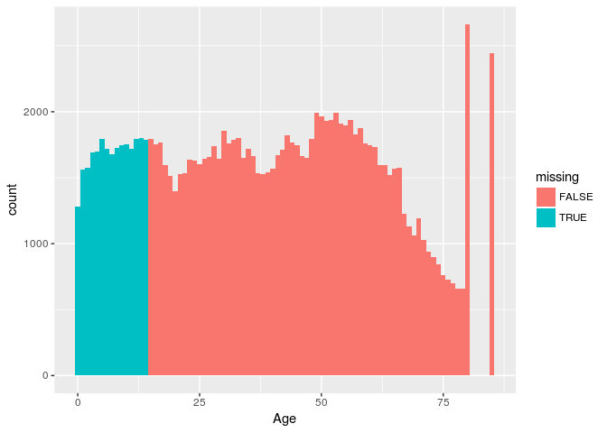

# Demographics and Employment in the United States

Problem 1.1 - Loading and Summarizing the Dataset
1 point possible (graded)
Load the dataset from CPSData.csv into a data frame called CPS, and view the dataset with the summary() and str() commands.

How many interviewees are in the dataset?


```r
library(dplyr)
```

```
## 
## Attaching package: 'dplyr'
```

```
## The following objects are masked from 'package:stats':
## 
##     filter, lag
```

```
## The following objects are masked from 'package:base':
## 
##     intersect, setdiff, setequal, union
```

```r
library(tidyr)
library(ggplot2)
df_CPS <- tbl_df(read.csv('CPSData.csv'))
df_Metro <- read.csv('MetroAreaCodes.csv')
df_Country <- read.csv('CountryCodes.csv')

dim(df_CPS)
```

```
## [1] 131302     14
```
Problem 1.2 - Loading and Summarizing the Dataset
1 point possible (graded)
Among the interviewees with a value reported for the Industry variable, what is the most common industry of employment? Please enter the name exactly how you see it.


```r
groupy_industry <- df_CPS %>% group_by(Industry) %>% summarise(counto = n()) %>% na.omit() %>% arrange(desc(counto))
head(groupy_industry)
```

```
## # A tibble: 6 × 2
##                             Industry counto
##                               <fctr>  <int>
## 1    Educational and health services  15017
## 2                              Trade   8933
## 3 Professional and business services   7519
## 4                      Manufacturing   6791
## 5            Leisure and hospitality   6364
## 6                       Construction   4387
```
Problem 1.3 - Loading and Summarizing the Dataset
2 points possible (graded)
Recall from the homework assignment "The Analytical Detective" that you can call the sort() function on the output of the table() function to obtain a sorted breakdown of a variable. For instance, sort(table(CPS$Region)) sorts the regions by the number of interviewees from that region.

Which state has the fewest interviewees?


  unanswered  
Which state has the largest number of interviewees?


```r
groupy_state <- df_CPS %>% group_by(State) %>% summarise(n_interview=n()) %>% arrange(desc(n_interview))
tail(groupy_state,1)
```

```
## # A tibble: 1 × 2
##        State n_interview
##       <fctr>       <int>
## 1 New Mexico        1102
```

```r
head(groupy_state,1)
```

```
## # A tibble: 1 × 2
##        State n_interview
##       <fctr>       <int>
## 1 California       11570
```

Problem 1.4 - Loading and Summarizing the Dataset
1 point possible (graded)
What proportion of interviewees are citizens of the United States?

```r
df_CPS %>% group_by(Citizenship) %>% summarise(counto=n()) %>% mutate(ratio = counto /sum(counto)*100)
```

```
## # A tibble: 3 × 3
##            Citizenship counto     ratio
##                 <fctr>  <int>     <dbl>
## 1      Citizen, Native 116639 88.832615
## 2 Citizen, Naturalized   7073  5.386818
## 3          Non-Citizen   7590  5.780567
```
Problem 1.5 - Loading and Summarizing the Dataset
1 point possible (graded)
The CPS differentiates between race (with possible values American Indian, Asian, Black, Pacific Islander, White, or Multiracial) and ethnicity. A number of interviewees are of Hispanic ethnicity, as captured by the Hispanic variable. For which races are there at least 250 interviewees in the CPS dataset of Hispanic ethnicity? (Select all that apply.)

```r
groupy_race<-df_CPS %>% group_by(Race,Hispanic) %>% summarise(counto=n()) %>% spread(Hispanic,counto)
colnames(groupy_race) <- c('Race','no_spanic','spanic')
groupy_race %>% mutate(ratio = spanic /(no_spanic+spanic)*100) %>% arrange(desc(ratio)) %>% filter(spanic>250)
```

```
## Source: local data frame [4 x 4]
## Groups: Race [4]
## 
##              Race no_spanic spanic     ratio
##            <fctr>     <int>  <int>     <dbl>
## 1 American Indian      1129    304 21.214236
## 2           White     89190  16731 15.795735
## 3     Multiracial      2449    448 15.464273
## 4           Black     13292    621  4.463451
```
Problem 2.1 - Evaluating Missing Values
1 point possible (graded)
Which variables have at least one interviewee with a missing (NA) value? (Select all that apply.)


```r
df_CPS %>% summarise_each(funs(sum(is.na(.)))) %>% gather() %>% filter(value>0)
```

```
## # A tibble: 5 × 2
##                key value
##              <chr> <int>
## 1    MetroAreaCode 34238
## 2          Married 25338
## 3        Education 25338
## 4 EmploymentStatus 25789
## 5         Industry 65060
```
Problem 2.2 - Evaluating Missing Values
1 point possible (graded)
Often when evaluating a new dataset, we try to identify if there is a pattern in the missing values in the dataset. We will try to determine if there is a pattern in the missing values of the Married variable. The function is.na(CPS$Married) returns a vector of TRUE/FALSE values for whether the Married variable is missing. We can see the breakdown of whether Married is missing based on the reported value of the Region variable with the function table(CPS$Region, is.na(CPS$Married)). Which is the most accurate:

```r
df_CPS$missing <- is.na(df_CPS$Married)
groupy_missing <- df_CPS %>% group_by(missing,Age) %>% summarise(counto=n())
groupy_missing
```

```
## Source: local data frame [82 x 3]
## Groups: missing [?]
## 
##    missing   Age counto
##      <lgl> <int>  <int>
## 1    FALSE    15   1795
## 2    FALSE    16   1751
## 3    FALSE    17   1764
## 4    FALSE    18   1596
## 5    FALSE    19   1517
## 6    FALSE    20   1398
## 7    FALSE    21   1525
## 8    FALSE    22   1536
## 9    FALSE    23   1638
## 10   FALSE    24   1627
## # ... with 72 more rows
```

```r
ggplot(df_CPS, aes(x=Age,fill=missing)) + geom_histogram(binwidth=1) 
```

<!-- -->
Problem 2.3 - Evaluating Missing Values
2 points possible (graded)
As mentioned in the variable descriptions, MetroAreaCode is missing if an interviewee does not live in a metropolitan area. Using the same technique as in the previous question, answer the following questions about people who live in non-metropolitan areas.

How many states had all interviewees living in a non-metropolitan area (aka they have a missing MetroAreaCode value)? For this question, treat the District of Columbia as a state (even though it is not technically a state).


  unanswered  
How many states had all interviewees living in a metropolitan area? Again, treat the District of Columbia as a state.

```r
groupy_Metro<- df_CPS %>% group_by(State) %>% summarise(no_metro_area = all(is.na(MetroAreaCode))) 
print (groupy_Metro%>% filter(no_metro_area))
```

```
## # A tibble: 2 × 2
##     State no_metro_area
##    <fctr>         <lgl>
## 1  Alaska          TRUE
## 2 Wyoming          TRUE
```

```r
groupy_Metro<- df_CPS %>% group_by(State) %>% summarise(only_metro_area = all(!is.na(MetroAreaCode))) 
groupy_Metro%>% filter(only_metro_area)
```

```
## # A tibble: 3 × 2
##                  State only_metro_area
##                 <fctr>           <lgl>
## 1 District of Columbia            TRUE
## 2           New Jersey            TRUE
## 3         Rhode Island            TRUE
```
Problem 2.4 - Evaluating Missing Values
1 point possible (graded)
Which region of the United States has the largest proportion of interviewees living in a non-metropolitan area?


Midwest
Northeast
South
West

```r
df_CPS %>% group_by(Region) %>% summarise(ratio_non_metro = sum(is.na(MetroAreaCode))/n()*100)
```

```
## # A tibble: 4 × 2
##      Region ratio_non_metro
##      <fctr>           <dbl>
## 1   Midwest        34.78686
## 2 Northeast        21.62381
## 3     South        23.78440
## 4      West        24.36628
```
Problem 2.5 - Evaluating Missing Values
4.0 points possible (graded)
While we were able to use the table() command to compute the proportion of interviewees from each region not living in a metropolitan area, it was somewhat tedious (it involved manually computing the proportion for each region) and isn't something you would want to do if there were a larger number of options. It turns out there is a less tedious way to compute the proportion of values that are TRUE. The mean() function, which takes the average of the values passed to it, will treat TRUE as 1 and FALSE as 0, meaning it returns the proportion of values that are true. For instance, mean(c(TRUE, FALSE, TRUE, TRUE)) returns 0.75. Knowing this, use tapply() with the mean function to answer the following questions:

Which state has a proportion of interviewees living in a non-metropolitan area closest to 30%?


  unanswered  
Which state has the largest proportion of non-metropolitan interviewees, ignoring states where all interviewees were non-metropolitan?

```r
groupy_state_metro <-df_CPS %>% group_by(State) %>% summarise(ratio_non_metro = sum(is.na(MetroAreaCode))/n()) %>% arrange(desc(ratio_non_metro))
groupy_state_metro
```

```
## # A tibble: 51 × 2
##            State ratio_non_metro
##           <fctr>           <dbl>
## 1         Alaska       1.0000000
## 2        Wyoming       1.0000000
## 3        Montana       0.8360791
## 4  West Virginia       0.7558552
## 5   North Dakota       0.7373860
## 6   South Dakota       0.7025000
## 7    Mississippi       0.6943089
## 8        Vermont       0.6523810
## 9          Maine       0.5983208
## 10      Nebraska       0.5813238
## # ... with 41 more rows
```

Problem 3.1 - Integrating Metropolitan Area Data
2 points possible (graded)
Codes like MetroAreaCode and CountryOfBirthCode are a compact way to encode factor variables with text as their possible values, and they are therefore quite common in survey datasets. In fact, all but one of the variables in this dataset were actually stored by a numeric code in the original CPS datafile.

When analyzing a variable stored by a numeric code, we will often want to convert it into the values the codes represent. To do this, we will use a dictionary, which maps the the code to the actual value of the variable. We have provided dictionaries MetroAreaCodes.csv and CountryCodes.csv, which respectively map MetroAreaCode and CountryOfBirthCode into their true values. Read these two dictionaries into data frames MetroAreaMap and CountryMap.

How many observations (codes for metropolitan areas) are there in MetroAreaMap?


  unanswered  
How many observations (codes for countries) are there in CountryMap?


```r
dim(df_Metro)
```

```
## [1] 271   2
```

```r
dim(df_Country)
```

```
## [1] 149   2
```

Problem 3.2 - Integrating Metropolitan Area Data
2 points possible (graded)
To merge in the metropolitan areas, we want to connect the field MetroAreaCode from the CPS data frame with the field Code in MetroAreaMap. The following command merges the two data frames on these columns, overwriting the CPS data frame with the result:

CPS = merge(CPS, MetroAreaMap, by.x="MetroAreaCode", by.y="Code", all.x=TRUE)

The first two arguments determine the data frames to be merged (they are called "x" and "y", respectively, in the subsequent parameters to the merge function). by.x="MetroAreaCode" means we're matching on the MetroAreaCode variable from the "x" data frame (CPS), while by.y="Code" means we're matching on the Code variable from the "y" data frame (MetroAreaMap). Finally, all.x=TRUE means we want to keep all rows from the "x" data frame (CPS), even if some of the rows' MetroAreaCode doesn't match any codes in MetroAreaMap (for those familiar with database terminology, this parameter makes the operation a left outer join instead of an inner join).

Review the new version of the CPS data frame with the summary() and str() functions. What is the name of the variable that was added to the data frame by the merge() operation?


  unanswered  
How many interviewees have a missing value for the new metropolitan area variable? Note that all of these interviewees would have been removed from the merged data frame if we did not include the all.x=TRUE parameter.

```r
df_CPS_M <- left_join(df_CPS,df_Metro, by=c('MetroAreaCode'='Code'))
setdiff(colnames(df_CPS_M),colnames(df_CPS))
```

```
## [1] "MetroArea"
```

```r
sum(is.na(df_CPS_M$MetroArea))
```

```
## [1] 34238
```
Problem 3.3 - Integrating Metropolitan Area Data
1 point possible (graded)
Which of the following metropolitan areas has the largest number of interviewees?


Atlanta-Sandy Springs-Marietta, GA
Baltimore-Towson, MD
Boston-Cambridge-Quincy, MA-NH
San Francisco-Oakland-Fremont, CA

```r
df_CPS_M %>% group_by(MetroArea) %>% summarise(counto=n())%>% na.omit() %>% arrange(desc(counto))
```

```
## # A tibble: 264 × 2
##                                             MetroArea counto
##                                                <fctr>  <int>
## 1  New York-Northern New Jersey-Long Island, NY-NJ-PA   5409
## 2        Washington-Arlington-Alexandria, DC-VA-MD-WV   4177
## 3                Los Angeles-Long Beach-Santa Ana, CA   4102
## 4            Philadelphia-Camden-Wilmington, PA-NJ-DE   2855
## 5                 Chicago-Naperville-Joliet, IN-IN-WI   2772
## 6                Providence-Fall River-Warwick, MA-RI   2284
## 7                      Boston-Cambridge-Quincy, MA-NH   2229
## 8              Minneapolis-St Paul-Bloomington, MN-WI   1942
## 9                     Dallas-Fort Worth-Arlington, TX   1863
## 10                     Houston-Baytown-Sugar Land, TX   1649
## # ... with 254 more rows
```
Problem 3.4 - Integrating Metropolitan Area Data
2.0 points possible (graded)
Which metropolitan area has the highest proportion of interviewees of Hispanic ethnicity? Hint: Use tapply() with mean, as in the previous subproblem. Calling sort() on the output of tapply() could also be helpful here.


```r
df_CPS_M %>% group_by(MetroArea) %>% summarise(ratio_sp= sum(Hispanic)/n()) %>% arrange(desc(ratio_sp))
```

```
## # A tibble: 265 × 2
##                     MetroArea  ratio_sp
##                        <fctr>     <dbl>
## 1                  Laredo, TX 0.9662921
## 2  McAllen-Edinburg-Pharr, TX 0.9487179
## 3   Brownsville-Harlingen, TX 0.7974684
## 4                 El Paso, TX 0.7909836
## 5               El Centro, CA 0.6868687
## 6             San Antonio, TX 0.6441516
## 7                  Madera, CA 0.6140351
## 8          Corpus Christi, TX 0.6060606
## 9                  Merced, CA 0.5660377
## 10                Salinas, CA 0.5576923
## # ... with 255 more rows
```
Problem 3.5 - Integrating Metropolitan Area Data
2.0 points possible (graded)
Remembering that CPS$Race == "Asian" returns a TRUE/FALSE vector of whether an interviewee is Asian, determine the number of metropolitan areas in the United States from which at least 20% of interviewees are Asian.

```r
df_CPS_M %>% group_by(MetroArea) %>% summarise(asia_ratio=sum(Race=='Asian')/n()*100) %>% filter(asia_ratio>=20) 
```

```
## # A tibble: 4 × 2
##                            MetroArea asia_ratio
##                               <fctr>      <dbl>
## 1                       Honolulu, HI   50.19036
## 2  San Francisco-Oakland-Fremont, CA   24.67532
## 3 San Jose-Sunnyvale-Santa Clara, CA   24.17910
## 4              Vallejo-Fairfield, CA   20.30075
```
Problem 3.6 - Integrating Metropolitan Area Data
1 point possible (graded)
Normally, we would look at the sorted proportion of interviewees from each metropolitan area who have not received a high school diploma with the command:

sort(tapply(CPS$Education == "No high school diploma", CPS$MetroArea, mean))

However, none of the interviewees aged 14 and younger have an education value reported, so the mean value is reported as NA for each metropolitan area. To get mean (and related functions, like sum) to ignore missing values, you can pass the parameter na.rm=TRUE. Passing na.rm=TRUE to the tapply function, determine which metropolitan area has the smallest proportion of interviewees who have received no high school diploma.


```r
groupy_education <-df_CPS_M %>% group_by(MetroArea,Education) %>% summarise(counto = n())%>% spread(Education,counto) %>% replace(is.na(.),0) 
```

```
## Warning in `[<-.factor`(`*tmp*`, thisvar, value = 0): invalid factor level,
## NA generated
```

```r
colnames(groupy_education)
```

```
##  [1] "MetroArea"               "Associate degree"       
##  [3] "Bachelor's degree"       "Doctorate degree"       
##  [5] "High school"             "Master's degree"        
##  [7] "No high school diploma"  "Professional degree"    
##  [9] "Some college, no degree" "<NA>"
```

```r
groupy_education$Total <- rowSums(groupy_education[,-1])
groupy_education <- mutate(groupy_education,ratio=`No high school diploma`/Total)
select(groupy_education,ratio)
```

```
## Adding missing grouping variables: `MetroArea`
```

```
## Source: local data frame [265 x 2]
## Groups: MetroArea [265]
## 
##                            MetroArea      ratio
##                               <fctr>      <dbl>
## 1                          Akron, OH 0.06926407
## 2                         Albany, GA 0.11764706
## 3        Albany-Schenectady-Troy, NY 0.06716418
## 4                    Albuquerque, NM 0.12972085
## 5  Allentown-Bethlehem-Easton, PA-NJ 0.10179641
## 6                        Altoona, PA 0.06097561
## 7                       Amarillo, TX 0.13636364
## 8                       Anderson, IN 0.11290323
## 9                       Anderson, SC 0.18750000
## 10                     Ann Arbor, MI 0.07058824
## # ... with 255 more rows
```

```r
df_CPS_M %>% group_by(MetroArea) %>% summarise(ratio_trumpist=sum(Education=='No high school diploma',na.rm=TRUE)/n()*100) %>% arrange(desc(ratio_trumpist)) %>% tail(.,5)
```

```
## # A tibble: 5 × 2
##                  MetroArea ratio_trumpist
##                     <fctr>          <dbl>
## 1 Bremerton-Silverdale, WA       4.597701
## 2     Champaign-Urbana, IL       4.098361
## 3    Kalamazoo-Portage, MI       3.937008
## 4        Bowling Green, KY       3.448276
## 5            Iowa City, IA       2.290076
```

Problem 4.1 - Integrating Country of Birth Data
2 points possible (graded)
Just as we did with the metropolitan area information, merge in the country of birth information from the CountryMap data frame, replacing the CPS data frame with the result. If you accidentally overwrite CPS with the wrong values, remember that you can restore it by re-loading the data frame from CPSData.csv and then merging in the metropolitan area information using the command provided in the previous subproblem.

What is the name of the variable added to the CPS data frame by this merge operation?


  unanswered  
How many interviewees have a missing value for the new country of birth variable?


```r
df_CPS_MC<- left_join(df_CPS_M,df_Country,by=c('CountryOfBirthCode'='Code'))
setdiff(colnames(df_CPS_MC),colnames(df_CPS_M))
```

```
## [1] "Country"
```

```r
sum(is.na(df_CPS_MC$Country))
```

```
## [1] 176
```
Problem 4.2 - Integrating Country of Birth Data
2.0 points possible (graded)
Among all interviewees born outside of North America, which country was the most common place of birth?

```r
groupy_country <-df_CPS_MC %>% filter(!grepl('United States|Canada|Mexico',Country))%>% group_by(Country) %>% summarise(total= n()) %>% arrange(desc(total)) 
groupy_country
```

```
## # A tibble: 142 × 2
##               Country total
##                <fctr> <int>
## 1         Philippines   839
## 2               India   770
## 3               China   581
## 4         Puerto Rico   518
## 5         El Salvador   477
## 6             Vietnam   458
## 7             Germany   438
## 8                Cuba   426
## 9               Korea   334
## 10 Dominican Republic   330
## # ... with 132 more rows
```
Problem 4.3 - Integrating Country of Birth Data
2.0 points possible (graded)
What proportion of the interviewees from the "New York-Northern New Jersey-Long Island, NY-NJ-PA" metropolitan area have a country of birth that is not the United States? For this computation, don't include people from this metropolitan area who have a missing country of birth.


```r
df_CPS_MC %>% filter(MetroArea=='New York-Northern New Jersey-Long Island, NY-NJ-PA')%>% filter(!is.na(Country)) %>% summarise(sum(Country!='United States')/n()*100)
```

```
## # A tibble: 1 × 1
##   `sum(Country != "United States")/n() *...`
##                                        <dbl>
## 1                                   30.86603
```

Problem 4.4 - Integrating Country of Birth Data
3 points possible (graded)
Which metropolitan area has the largest number (note -- not proportion) of interviewees with a country of birth in India? Hint -- remember to include na.rm=TRUE if you are using tapply() to answer this question.

```r
df_CPS_MC %>%filter(Country=='India') %>% group_by(MetroArea) %>% summarise(total=n()) %>% na.omit() %>% arrange(desc(total))
```

```
## # A tibble: 83 × 2
##                                             MetroArea total
##                                                <fctr> <int>
## 1  New York-Northern New Jersey-Long Island, NY-NJ-PA    96
## 2        Washington-Arlington-Alexandria, DC-VA-MD-WV    50
## 3            Philadelphia-Camden-Wilmington, PA-NJ-DE    32
## 4                 Chicago-Naperville-Joliet, IN-IN-WI    31
## 5                          Detroit-Warren-Livonia, MI    30
## 6                  Atlanta-Sandy Springs-Marietta, GA    27
## 7                   San Francisco-Oakland-Fremont, CA    27
## 8            Hartford-West Hartford-East Hartford, CT    26
## 9              Minneapolis-St Paul-Bloomington, MN-WI    23
## 10               Los Angeles-Long Beach-Santa Ana, CA    19
## # ... with 73 more rows
```

