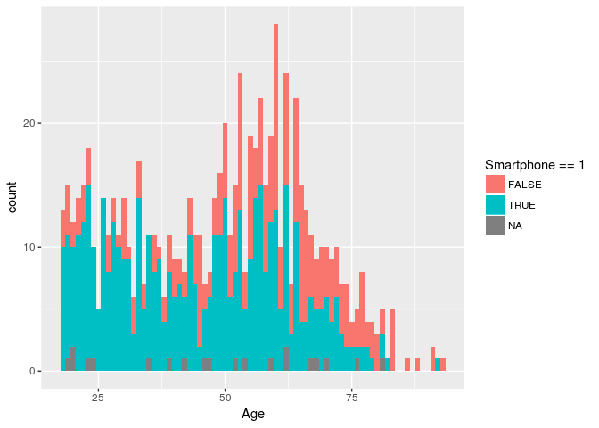
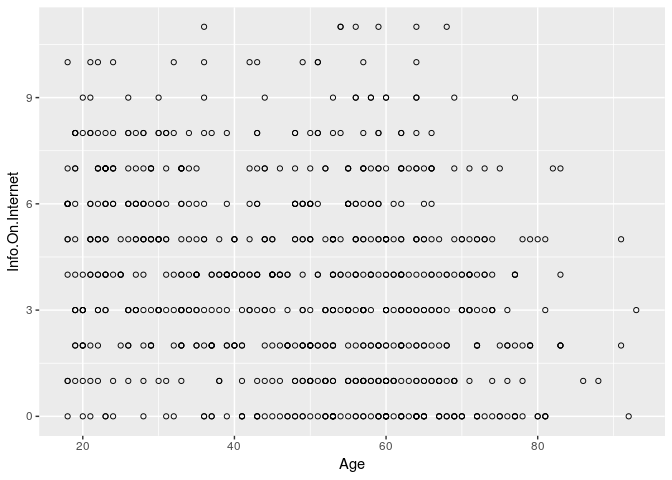
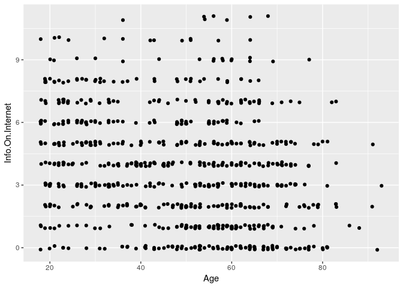

# Internet Privacy Poll

Problem 1.1 - Loading and Summarizing the Dataset
0 points possible (ungraded)
Using read.csv(), load the dataset from AnonymityPoll.csv into a data frame called poll and summarize it with the summary() and str() functions.

How many people participated in the poll?

```r
library(dplyr)
```

```
## 
## Attaching package: 'dplyr'
```

```
## The following objects are masked from 'package:stats':
## 
##     filter, lag
```

```
## The following objects are masked from 'package:base':
## 
##     intersect, setdiff, setequal, union
```

```r
library(tidyr)
library(ggplot2)
```


```r
df<- tbl_df(read.csv('AnonymityPoll.csv'))
str(df)
```

```
## Classes 'tbl_df', 'tbl' and 'data.frame':	1002 obs. of  13 variables:
##  $ Internet.Use          : int  1 1 0 1 0 1 1 0 0 1 ...
##  $ Smartphone            : int  0 0 1 0 NA 1 0 0 NA 0 ...
##  $ Sex                   : Factor w/ 2 levels "Female","Male": 2 2 1 2 1 2 1 1 2 1 ...
##  $ Age                   : int  62 45 70 70 80 49 52 76 75 76 ...
##  $ State                 : Factor w/ 49 levels "Alabama","Arizona",..: 20 39 29 10 10 41 21 31 32 32 ...
##  $ Region                : Factor w/ 4 levels "Midwest","Northeast",..: 2 3 2 3 3 3 1 2 3 3 ...
##  $ Conservativeness      : int  4 1 4 4 4 4 3 3 4 4 ...
##  $ Info.On.Internet      : int  0 1 0 3 NA 6 3 NA NA 0 ...
##  $ Worry.About.Info      : int  1 0 0 1 NA 0 1 NA NA 0 ...
##  $ Privacy.Importance    : num  100 0 NA 88.9 NA ...
##  $ Anonymity.Possible    : int  0 1 0 1 NA 1 0 NA NA 1 ...
##  $ Tried.Masking.Identity: int  0 0 0 0 NA 1 0 NA NA 0 ...
##  $ Privacy.Laws.Effective: int  0 1 NA 0 NA 0 1 NA 0 1 ...
```

Problem 1.2 - Loading and Summarizing the Dataset
0 points possible (ungraded)
Let's look at the breakdown of the number of people with smartphones using the table() and summary() commands on the Smartphone variable. (HINT: These three numbers should sum to 1002.)

How many interviewees responded that they use a smartphone?


  unanswered  
How many interviewees responded that they don't use a smartphone?


  unanswered  
How many interviewees did not respond to the question, resulting in a missing value, or NA, in the summary() output?


```r
print (df %>% filter(Smartphone==1) %>% summarise(n()))
```

```
## # A tibble: 1 × 1
##   `n()`
##   <int>
## 1   487
```

```r
print(df %>% filter(Smartphone==0) %>% summarise(n()))
```

```
## # A tibble: 1 × 1
##   `n()`
##   <int>
## 1   472
```

```r
print(df %>% filter(is.na(Smartphone)) %>% summarise(n()))
```

```
## # A tibble: 1 × 1
##   `n()`
##   <int>
## 1    43
```

Problem 1.3 - Loading and Summarizing the Dataset
0 points possible (ungraded)
By using the table() function on two variables, we can tell how they are related. To use the table() function on two variables, just put the two variable names inside the parentheses, separated by a comma (don't forget to add poll$ before each variable name). In the output, the possible values of the first variable will be listed in the left, and the possible values of the second variable will be listed on the top. Each entry of the table counts the number of observations in the data set that have the value of the first value in that row, and the value of the second variable in that column. For example, suppose we want to create a table of the variables "Sex" and "Region". We would type

table(poll$Sex, poll$Region)

in our R Console, and we would get as output

Midwest Northeast South West

Female 123 90 176 116

Male 116 76 183 122

This table tells us that we have 123 people in our dataset who are female and from the Midwest, 116 people in our dataset who are male and from the Midwest, 90 people in our dataset who are female and from the Northeast, etc.

You might find it helpful to use the table() function to answer the following questions:

Which of the following are states in the Midwest census region? (Select all that apply.)


```r
states<- c('Colorado','Kansas','Kentucky','Missouri','Ohio','Pennsylvania')
states_regions <- df %>% group_by(State,Region) %>% summarise(total = n()) %>% spread(Region,total, fill=0)
filter_states = paste(states,collapse='|')
states_regions %>% filter(grepl(State,filter_states))
```

```
## Source: local data frame [6 x 5]
## Groups: State [6]
## 
##          State Midwest Northeast South  West
##         <fctr>   <dbl>     <dbl> <dbl> <dbl>
## 1     Colorado       0         0     0    19
## 2       Kansas      14         0     0     0
## 3     Kentucky       0         0    25     0
## 4     Missouri      26         0     0     0
## 5         Ohio      38         0     0     0
## 6 Pennsylvania       0        45     0     0
```

```r
head(states_regions)
```

```
## Source: local data frame [6 x 5]
## Groups: State [6]
## 
##         State Midwest Northeast South  West
##        <fctr>   <dbl>     <dbl> <dbl> <dbl>
## 1     Alabama       0         0    11     0
## 2     Arizona       0         0     0    24
## 3    Arkansas       0         0    10     0
## 4  California       0         0     0   103
## 5    Colorado       0         0     0    19
## 6 Connecticut       0         8     0     0
```
Which was the state in the South census region with the largest number of interviewees?

```r
df %>% group_by(Region,State) %>% summarise(total=n()) %>% top_n(n=1,total) %>% filter(Region=='South')
```

```
## Source: local data frame [1 x 3]
## Groups: Region [1]
## 
##   Region  State total
##   <fctr> <fctr> <int>
## 1  South  Texas    72
```
Problem 2.1 - Internet and Smartphone Users
0 points possible (ungraded)
As mentioned in the introduction to this problem, many of the response variables (Info.On.Internet, Worry.About.Info, Privacy.Importance, Anonymity.Possible, and Tried.Masking.Identity) were not collected if an interviewee does not use the Internet or a smartphone, meaning the variables will have missing values for these interviewees.

How many interviewees reported not having used the Internet and not having used a smartphone?


  unanswered  
How many interviewees reported having used the Internet and having used a smartphone?


  unanswered  
How many interviewees reported having used the Internet but not having used a smartphone?


  unanswered  
How many interviewees reported having used a smartphone but not having used the Internet?


  unanswered  
  


```r
df%>% group_by(Internet.Use, Smartphone) %>% summarise(total=n())
```

```
## Source: local data frame [7 x 3]
## Groups: Internet.Use [?]
## 
##   Internet.Use Smartphone total
##          <int>      <int> <int>
## 1            0          0   186
## 2            0          1    17
## 3            0         NA    23
## 4            1          0   285
## 5            1          1   470
## 6            1         NA    20
## 7           NA          0     1
```
Problem 2.2 - Internet and Smartphone Users
0 points possible (ungraded)
How many interviewees have a missing value for their Internet use?


  unanswered  
How many interviewees have a missing value for their smartphone use?

```r
sum(is.na(df$Internet.Use))
```

```
## [1] 1
```

```r
sum(is.na(df$Smartphone))
```

```
## [1] 43
```
Problem 2.3 - Internet and Smartphone Users
0 points possible (ungraded)
Use the subset function to obtain a data frame called "limited", which is limited to interviewees who reported Internet use or who reported smartphone use. In lecture, we used the & symbol to use two criteria to make a subset of the data. To only take observations that have a certain value in one variable or the other, the | character can be used in place of the & symbol. This is also called a logical "or" operation.

How many interviewees are in the new data frame?

```r
df_illimited <- df %>% filter((Internet.Use==1) |(Smartphone==1))
dim(df_illimited)
```

```
## [1] 792  13
```
Problem 3.1 - Summarizing Opinions about Internet Privacy
0 points possible (ungraded)
Which variables have missing values in the limited data frame? (Select all that apply.)

```r
df_illimited %>% summarise_each(funs(sum(is.na(.)))) %>% gather() %>% filter(value>0)
```

```
## # A tibble: 8 × 2
##                      key value
##                    <chr> <int>
## 1             Smartphone    20
## 2                    Age    22
## 3       Conservativeness    45
## 4       Worry.About.Info     2
## 5     Privacy.Importance     5
## 6     Anonymity.Possible    39
## 7 Tried.Masking.Identity     8
## 8 Privacy.Laws.Effective    65
```
Problem 3.2 - Summarizing Opinions about Internet Privacy
0 points possible (ungraded)
What is the average number of pieces of personal information on the Internet, according to the Info.On.Internet variable?

```r
mean(df_illimited$Info.On.Internet,na.rm = TRUE)
```

```
## [1] 3.795455
```
Problem 3.3 - Summarizing Opinions about Internet Privacy
0 points possible (ungraded)
How many interviewees reported a value of 0 for Info.On.Internet?


  unanswered  
How many interviewees reported the maximum value of 11 for Info.On.Internet?


```r
sum(df$Info.On.Internet==0,na.rm=TRUE)
```

```
## [1] 105
```

```r
sum(df$Info.On.Internet==11,na.rm=TRUE)
```

```
## [1] 8
```
Problem 3.4 - Summarizing Opinions about Internet Privacy
0 points possible (ungraded)
What proportion of interviewees who answered the Worry.About.Info question worry about how much information is available about them on the Internet? Note that to compute this proportion you will be dividing by the number of people who answered the Worry.About.Info question, not the total number of people in the data frame.

```r
df_illimited %>% group_by(Worry.About.Info)%>% summarise(total=n()) %>% na.omit() %>% mutate(ratio = total/sum(total)*100)
```

```
## # A tibble: 2 × 3
##   Worry.About.Info total    ratio
##              <int> <int>    <dbl>
## 1                0   404 51.13924
## 2                1   386 48.86076
```
Problem 3.5 - Summarizing Opinions about Internet Privacy
0 points possible (ungraded)
What proportion of interviewees who answered the Anonymity.Possible question think it is possible to be completely anonymous on the Internet?


Problem 3.6 - Summarizing Opinions about Internet Privacy
0 points possible (ungraded)
What proportion of interviewees who answered the Tried.Masking.Identity question have tried masking their identity on the Internet?

```r
df_illimited %>% group_by(Tried.Masking.Identity)%>% summarise(total=n()) %>% na.omit() %>% mutate(ratio = total/sum(total)*100)
```

```
## # A tibble: 2 × 3
##   Tried.Masking.Identity total    ratio
##                    <int> <int>    <dbl>
## 1                      0   656 83.67347
## 2                      1   128 16.32653
```
Problem 3.7 - Summarizing Opinions about Internet Privacy
0 points possible (ungraded)
What proportion of interviewees who answered the Privacy.Laws.Effective question find United States privacy laws effective?

```r
df_illimited %>% group_by(Privacy.Laws.Effective)%>% summarise(total=n()) %>% na.omit()%>% mutate(ratio = total/sum(total)*100)
```

```
## # A tibble: 2 × 3
##   Privacy.Laws.Effective total    ratio
##                    <int> <int>    <dbl>
## 1                      0   541 74.41541
## 2                      1   186 25.58459
```
Problem 4.1 - Relating Demographics to Polling Results
0 points possible (ungraded)
Often, we are interested in whether certain characteristics of interviewees (e.g. their age or political opinions) affect their opinions on the topic of the poll (in this case, opinions on privacy). In this section, we will investigate the relationship between the characteristics Age and Smartphone and outcome variables Info.On.Internet and Tried.Masking.Identity, again using the limited data frame we built in an earlier section of this problem.

Build a histogram of the age of interviewees. What is the best represented age group in the population?

```r
ggplot(df_illimited, aes(x=Age,fill=Smartphone==1)) + geom_histogram(binwidth=1) 
```

```
## Warning: Removed 22 rows containing non-finite values (stat_bin).
```

<!-- -->
Problem 4.2 - Relating Demographics to Polling Results
0 points possible (ungraded)
Both Age and Info.On.Internet are variables that take on many values, so a good way to observe their relationship is through a graph. We learned in lecture that we can plot Age against Info.On.Internet with the command plot(limited$Age, limited$Info.On.Internet). However, because Info.On.Internet takes on a small number of values, multiple points can be plotted in exactly the same location on this graph.

What is the largest number of interviewees that have exactly the same value in their Age variable AND the same value in their Info.On.Internet variable? In other words, what is the largest number of overlapping points in the plot plot(limited$Age, limited$Info.On.Internet)? (HINT: Use the table function to compare the number of observations with different values of Age and Info.On.Internet.)

```r
ggplot(df_illimited, aes(x=Age,y=Info.On.Internet)) + geom_point(shape=1) 
```

```
## Warning: Removed 22 rows containing missing values (geom_point).
```

<!-- -->

```r
df_illimited %>% group_by(Age,Info.On.Internet) %>% summarise(total = n()) %>% ungroup()%>%top_n(n=1,total)
```

```
## # A tibble: 3 × 3
##     Age Info.On.Internet total
##   <int>            <int> <int>
## 1    53                0     6
## 2    60                0     6
## 3    60                1     6
```
Problem 4.4 - Relating Demographics to Polling Results
0 points possible (ungraded)
Now, plot Age against Info.On.Internet with plot(jitter(limited$Age), jitter(limited$Info.On.Internet)). What relationship to you observe between Age and Info.On.Internet?

```r
ggplot(df_illimited, aes(x=Age,y=Info.On.Internet)) +  geom_jitter(width = 0.1, height = 0.1)
```

```
## Warning: Removed 22 rows containing missing values (geom_point).
```

<!-- -->
Problem 4.5 - Relating Demographics to Polling Results
0 points possible (ungraded)
Use the tapply() function to obtain the summary of the Info.On.Internet value, broken down by whether an interviewee is a smartphone user.

What is the average Info.On.Internet value for smartphone users?


  unanswered  
What is the average Info.On.Internet value for non-smartphone users?

```r
df_illimited %>% filter(Smartphone==1)%>%  summarise(moyenne = mean(Info.On.Internet,na.rm=TRUE))
```

```
## # A tibble: 1 × 1
##    moyenne
##      <dbl>
## 1 4.367556
```

```r
df_illimited %>% filter(Smartphone==0)%>%  summarise(moyenne = mean(Info.On.Internet,na.rm=TRUE))
```

```
## # A tibble: 1 × 1
##    moyenne
##      <dbl>
## 1 2.922807
```
Problem 4.6 - Relating Demographics to Polling Results
0 points possible (ungraded)
Similarly use tapply to break down the Tried.Masking.Identity variable for smartphone and non-smartphone users.

What proportion of smartphone users who answered the Tried.Masking.Identity question have tried masking their identity when using the Internet?


  unanswered  
What proportion of non-smartphone users who answered the Tried.Masking.Identity question have tried masking their identity when using the Internet?


  unanswered   
  

```r
df_illimited %>% filter((Smartphone==1) & (Tried.Masking.Identity==1)) %>% summarise(n()/sum(df_illimited$Smartphone==1,na.rm=TRUE))
```

```
## # A tibble: 1 × 1
##   `n()/sum(df_illimited$Smartphone == 1,...`
##                                        <dbl>
## 1                                  0.1909651
```

```r
df_illimited %>% filter((Smartphone==0) & (Tried.Masking.Identity==1)) %>% summarise(n()/sum(df_illimited$Smartphone==0,na.rm=TRUE))
```

```
## # A tibble: 1 × 1
##   `n()/sum(df_illimited$Smartphone == 0,...`
##                                        <dbl>
## 1                                  0.1157895
```

