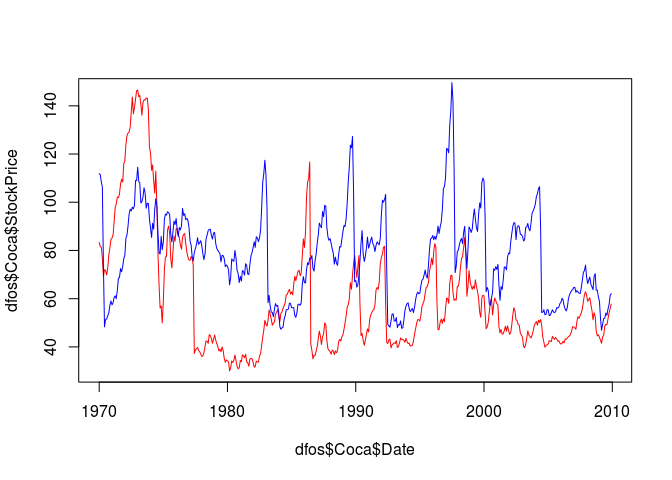

# R Notebook

This is an [R Markdown](http://rmarkdown.rstudio.com) Notebook. When you execute code within the notebook, the results appear beneath the code. 

Try executing this chunk by clicking the *Run* button within the chunk or by placing your cursor inside it and pressing *Ctrl+Shift+Enter*. 

```r
require(dplyr)
```

```
## Loading required package: dplyr
```

```
## 
## Attaching package: 'dplyr'
```

```
## The following objects are masked from 'package:stats':
## 
##     filter, lag
```

```
## The following objects are masked from 'package:base':
## 
##     intersect, setdiff, setequal, union
```

```r
require(plyr)
```

```
## Loading required package: plyr
```

```
## -------------------------------------------------------------------------
```

```
## You have loaded plyr after dplyr - this is likely to cause problems.
## If you need functions from both plyr and dplyr, please load plyr first, then dplyr:
## library(plyr); library(dplyr)
```

```
## -------------------------------------------------------------------------
```

```
## 
## Attaching package: 'plyr'
```

```
## The following objects are masked from 'package:dplyr':
## 
##     arrange, count, desc, failwith, id, mutate, rename, summarise,
##     summarize
```

```r
require(tidyr)
```

```
## Loading required package: tidyr
```

```r
require(ggplot2)
```

```
## Loading required package: ggplot2
```

```r
require(lubridate)
```

```
## Loading required package: lubridate
```

```
## 
## Attaching package: 'lubridate'
```

```
## The following object is masked from 'package:plyr':
## 
##     here
```

```
## The following object is masked from 'package:base':
## 
##     date
```
**Problem 1.1 - Summary Statistics**
1 point possible (graded)
Before working with these data sets, we need to convert the dates into a format that R can understand. Take a look at the structure of one of the datasets using the str function. Right now, the date variable is stored as a factor. We can convert this to a "Date" object in R by using the following five commands (one for each data set):

IBM$Date = as.Date(IBM$Date, "%m/%d/%y")

GE$Date = as.Date(GE$Date, "%m/%d/%y")

CocaCola$Date = as.Date(CocaCola$Date, "%m/%d/%y")

ProcterGamble$Date = as.Date(ProcterGamble$Date, "%m/%d/%y")

Boeing$Date = as.Date(Boeing$Date, "%m/%d/%y")

The first argument to the as.Date function is the variable we want to convert, and the second argument is the format of the Date variable. We can just overwrite the original Date variable values with the output of this function. Now, answer the following questions using the str and summary functions.

Our five datasets all have the same number of observations. How many observations are there in each data set?


```r
df_Boeing = read.csv('BoeingStock.csv')
df_Coca = read.csv('CocaColaStock.csv')
df_Procter = read.csv('ProcterGambleStock.csv')
df_GE = read.csv('GEStock.csv')
df_IBM = read.csv('IBMStock.csv')
dfos <- list(Boeing=df_Boeing,Coca=df_Coca,Procter = df_Procter,GE = df_GE,IBM =df_IBM)


for (namo in names(dfos)){
  dfos[[namo]]<- tbl_df(dfos[[namo]])
  dfos[[namo]]$Date = as.Date(strptime(dfos[[namo]]$Date,"%m/%d/%y"))
  print(dim(dfos[[namo]]))
}
```

```
## [1] 480   2
## [1] 480   2
## [1] 480   2
## [1] 480   2
## [1] 480   2
```

**Problem 1.2 - Summary Statistics**
1 point possible (graded)
What is the earliest year in our datasets?


```r
min(dfos$Boeing$Date)
```

```
## [1] "1970-01-01"
```

Problem 1.3 - Summary Statistics
1 point possible (graded)
What is the latest year in our datasets?


```r
max(dfos$Boeing$Date)
```

```
## [1] "2009-12-01"
```

Problem 1.4 - Summary Statistics
1 point possible (graded)
What is the mean stock price of IBM over this time period?

```r
mean(dfos$Boeing$StockPrice)
```

```
## [1] 46.59293
```
roblem 1.5 - Summary Statistics
1 point possible (graded)
What is the minimum stock price of General Electric (GE) over this time period?


```r
min(dfos$GE$StockPrice)
```

```
## [1] 9.293636
```

Problem 1.6 - Summary Statistics
1 point possible (graded)
What is the maximum stock price of Coca-Cola over this time period?

```r
max(dfos$Coca$StockPrice)
```

```
## [1] 146.5843
```
Problem 1.7 - Summary Statistics
1 point possible (graded)
What is the median stock price of Boeing over this time period?

```r
median(dfos$Boeing$StockPrice)
```

```
## [1] 44.8834
```
Problem 1.8 - Summary Statistics
1 point possible (graded)
What is the standard deviation of the stock price of Procter & Gamble over this time period?

```r
sd(dfos$Boeing$StockPrice)
```

```
## [1] 19.89184
```
Problem 2.1 - Visualizing Stock Dynamics
2 points possible (graded)
Let's plot the stock prices to see if we can visualize trends in stock prices during this time period. Using the plot function, plot the Date on the x-axis and the StockPrice on the y-axis, for Coca-Cola.

This plots our observations as points, but we would really like to see a line instead, since this is a continuous time period. To do this, add the argument type="l" to your plot command, and re-generate the plot (the character is quotes is the letter l, for line). You should now see a line plot of the Coca-Cola stock price.

Around what year did Coca-Cola has its highest stock price in this time period?

```r
mergerFun <- function(x, y){
 
  df <- inner_join(x, y, by= "Date")
    return(df)
}
df.all<-Reduce(mergerFun,dfos)
colnames(df.all)<- c('Date',names(dfos))
head(df.all)
```

```
## # A tibble: 6 × 6
##         Date   Boeing     Coca   Procter       GE      IBM
##       <date>    <dbl>    <dbl>     <dbl>    <dbl>    <dbl>
## 1 1970-01-01 27.85381 83.36810 111.87429 74.25333 360.3190
## 2 1970-02-01 22.38105 81.59105 111.45368 69.97684 346.7237
## 3 1970-03-01 23.10524 81.33810 108.45143 72.15857 327.3457
## 4 1970-04-01 21.57136 76.80591 106.28864 74.25273 319.8527
## 5 1970-05-01 18.93286 69.27857  73.33286 66.66524 270.3752
## 6 1970-06-01 15.44318 72.01545  48.31864 67.59318 267.2050
```

```r
df.all.gathered <- gather(df.all,company,price, -Date)

ggplot(df.all.gathered, aes(x = Date, y = price, color = company)) +
  
  geom_line()
```

<!-- -->

Problem 2.2 - Visualizing Stock Dynamics
1 point possible (graded)
Now, let's add the line for Procter & Gamble too. You can add a line to a plot in R by using the lines function instead of the plot function. Keeping the plot for Coca-Cola open, type in your R console:

lines(ProcterGamble$Date, ProcterGamble$StockPrice)

Unfortunately, it's hard to tell which line is which. Let's fix this by giving each line a color. First, re-run the plot command for Coca-Cola, but add the argument col="red". You should see the plot for Coca-Cola show up again, but this time in red. Now, let's add the Procter & Gamble line (using the lines function like we did before), adding the argument col="blue". You should now see in your plot the Coca-Cola stock price in red, and the Procter & Gamble stock price in blue.

As an alternative choice to changing the colors, you could instead change the line type of the Procter & Gamble line by adding the argument lty=2. This will make the Procter & Gamble line dashed.

Using this plot, answer the following questions.

In March of 2000, the technology bubble burst, and a stock market crash occurred. According to this plot, which company's stock dropped more?

```r
ggplot(filter(df.all.gathered, (df.all.gathered$Date>as.Date('1999-01-01')&
df.all.gathered$Date<as.Date('2001-01-01'))), aes(x = Date, y = price, color = company)) + geom_line()+ geom_vline(xintercept = as.numeric(ymd(20000301)),linetype="dotted")
```

<!-- -->


```r
plot(dfos$Coca$Date,dfos$Coca$StockPrice,type='l',col='red')
lines(dfos$Procter$Date,dfos$Procter$StockPrice,type='l',col='blue')
```

<!-- -->

```r
# compute the max price between 1995 and 2005 :
max <- df.all.gathered %>% filter(Date>as.Date('1995-01-01') & Date<as.Date('2005-01-01'))%>% slice(which.max(price))
max<-max$price

ggplot(filter(df.all.gathered, (df.all.gathered$Date>as.Date('1995-01-01')&
df.all.gathered$Date<as.Date('2005-01-01'))), aes(x = Date, y = price, color = company)) + geom_line()+ geom_hline(yintercept=max,linetype='dotted')
```

<!-- -->

 Problem 3.2 - Visualizing Stock Dynamics 1995-2005
1 point possible (graded)
Which stock reaches the highest value in the time period 1995-2005?

Problem 4.1 - Monthly Trends
1 point possible (graded)
Lastly, let's see if stocks tend to be higher or lower during certain months. Use the tapply command to calculate the mean stock price of IBM, sorted by months. To sort by months, use

months(IBM$Date)

as the second argument of the tapply function.

For IBM, compare the monthly averages to the overall average stock price. In which months has IBM historically had a higher stock price (on average)? Select all that apply.


