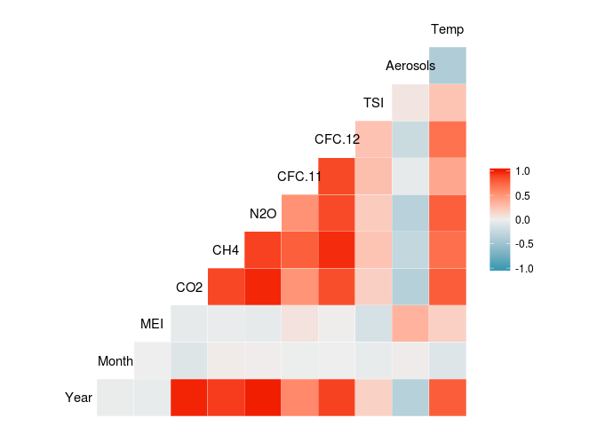

# Climate Change


```r
library(dplyr)
```

```
## 
## Attaching package: 'dplyr'
```

```
## The following objects are masked from 'package:stats':
## 
##     filter, lag
```

```
## The following objects are masked from 'package:base':
## 
##     intersect, setdiff, setequal, union
```

```r
library(tidyr)
library(ggplot2)
library(GGally)
```

```
## 
## Attaching package: 'GGally'
```

```
## The following object is masked from 'package:dplyr':
## 
##     nasa
```
Problem 1.1 - Creating Our First Model
2.0 points possible (graded)
We are interested in how changes in these variables affect future temperatures, as well as how well these variables explain temperature changes so far. To do this, first read the dataset climate_change.csv into R.

Then, split the data into a training set, consisting of all the observations up to and including 2006, and a testing set consisting of the remaining years (hint: use subset). A training set refers to the data that will be used to build the model (this is the data we give to the lm() function), and a testing set refers to the data we will use to test our predictive ability.

Next, build a linear regression model to predict the dependent variable Temp, using MEI, CO2, CH4, N2O, CFC.11, CFC.12, TSI, and Aerosols as independent variables (Year and Month should NOT be used in the model). Use the training set to build the model.

Enter the model R2 (the "Multiple R-squared" value):

```r
df<- read.csv('climate_change.csv')

df_train <- df %>% filter(Year<=2006)
df_test <- df %>% filter(Year>2006)

ggcorr(df_train)
```

<!-- -->

```r
model1<-lm(Temp~. -Year-Month,df_train)
summary(model1)
```

```
## 
## Call:
## lm(formula = Temp ~ . - Year - Month, data = df_train)
## 
## Residuals:
##      Min       1Q   Median       3Q      Max 
## -0.25888 -0.05913 -0.00082  0.05649  0.32433 
## 
## Coefficients:
##               Estimate Std. Error t value Pr(>|t|)    
## (Intercept) -1.246e+02  1.989e+01  -6.265 1.43e-09 ***
## MEI          6.421e-02  6.470e-03   9.923  < 2e-16 ***
## CO2          6.457e-03  2.285e-03   2.826  0.00505 ** 
## CH4          1.240e-04  5.158e-04   0.240  0.81015    
## N2O         -1.653e-02  8.565e-03  -1.930  0.05467 .  
## CFC.11      -6.631e-03  1.626e-03  -4.078 5.96e-05 ***
## CFC.12       3.808e-03  1.014e-03   3.757  0.00021 ***
## TSI          9.314e-02  1.475e-02   6.313 1.10e-09 ***
## Aerosols    -1.538e+00  2.133e-01  -7.210 5.41e-12 ***
## ---
## Signif. codes:  0 '***' 0.001 '**' 0.01 '*' 0.05 '.' 0.1 ' ' 1
## 
## Residual standard error: 0.09171 on 275 degrees of freedom
## Multiple R-squared:  0.7509,	Adjusted R-squared:  0.7436 
## F-statistic: 103.6 on 8 and 275 DF,  p-value: < 2.2e-16
```

```r
corriaquino<-data.frame(cor(df_train))
corriaquino <-tibble::rownames_to_column(data.frame(corriaquino),'indexo')
corriaquino  %>% dplyr::select(indexo,CFC.11) %>% filter(CFC.11>0.7)
```

```
##   indexo    CFC.11
## 1    CH4 0.7799040
## 2 CFC.11 1.0000000
## 3 CFC.12 0.8689852
```
Problem 3 - Simplifying the Model
2.0 points possible (graded)
Given that the correlations are so high, let us focus on the N2O variable and build a model with only MEI, TSI, Aerosols and N2O as independent variables. Remember to use the training set to build the model.

Enter the coefficient of N2O in this reduced model:


  unanswered  
(How does this compare to the coefficient in the previous model with all of the variables?)

Enter the model R2:


```r
model2<- lm(Temp~ MEI+TSI+Aerosols+N2O,df_train)
summary(model2)
```

```
## 
## Call:
## lm(formula = Temp ~ MEI + TSI + Aerosols + N2O, data = df_train)
## 
## Residuals:
##      Min       1Q   Median       3Q      Max 
## -0.27916 -0.05975 -0.00595  0.05672  0.34195 
## 
## Coefficients:
##               Estimate Std. Error t value Pr(>|t|)    
## (Intercept) -1.162e+02  2.022e+01  -5.747 2.37e-08 ***
## MEI          6.419e-02  6.652e-03   9.649  < 2e-16 ***
## TSI          7.949e-02  1.487e-02   5.344 1.89e-07 ***
## Aerosols    -1.702e+00  2.180e-01  -7.806 1.19e-13 ***
## N2O          2.532e-02  1.311e-03  19.307  < 2e-16 ***
## ---
## Signif. codes:  0 '***' 0.001 '**' 0.01 '*' 0.05 '.' 0.1 ' ' 1
## 
## Residual standard error: 0.09547 on 279 degrees of freedom
## Multiple R-squared:  0.7261,	Adjusted R-squared:  0.7222 
## F-statistic: 184.9 on 4 and 279 DF,  p-value: < 2.2e-16
```


```r
model1_stepped<-step(model1)
```

```
## Start:  AIC=-1348.16
## Temp ~ (Year + Month + MEI + CO2 + CH4 + N2O + CFC.11 + CFC.12 + 
##     TSI + Aerosols) - Year - Month
## 
##            Df Sum of Sq    RSS     AIC
## - CH4       1   0.00049 2.3135 -1350.1
## <none>                  2.3130 -1348.2
## - N2O       1   0.03132 2.3443 -1346.3
## - CO2       1   0.06719 2.3802 -1342.0
## - CFC.12    1   0.11874 2.4318 -1335.9
## - CFC.11    1   0.13986 2.4529 -1333.5
## - TSI       1   0.33516 2.6482 -1311.7
## - Aerosols  1   0.43727 2.7503 -1301.0
## - MEI       1   0.82823 3.1412 -1263.2
## 
## Step:  AIC=-1350.1
## Temp ~ MEI + CO2 + N2O + CFC.11 + CFC.12 + TSI + Aerosols
## 
##            Df Sum of Sq    RSS     AIC
## <none>                  2.3135 -1350.1
## - N2O       1   0.03133 2.3448 -1348.3
## - CO2       1   0.06672 2.3802 -1344.0
## - CFC.12    1   0.13023 2.4437 -1336.5
## - CFC.11    1   0.13938 2.4529 -1335.5
## - TSI       1   0.33500 2.6485 -1313.7
## - Aerosols  1   0.43987 2.7534 -1302.7
## - MEI       1   0.83118 3.1447 -1264.9
```

```r
summary(model1_stepped)
```

```
## 
## Call:
## lm(formula = Temp ~ MEI + CO2 + N2O + CFC.11 + CFC.12 + TSI + 
##     Aerosols, data = df_train)
## 
## Residuals:
##      Min       1Q   Median       3Q      Max 
## -0.25770 -0.05994 -0.00104  0.05588  0.32203 
## 
## Coefficients:
##               Estimate Std. Error t value Pr(>|t|)    
## (Intercept) -1.245e+02  1.985e+01  -6.273 1.37e-09 ***
## MEI          6.407e-02  6.434e-03   9.958  < 2e-16 ***
## CO2          6.402e-03  2.269e-03   2.821 0.005129 ** 
## N2O         -1.602e-02  8.287e-03  -1.933 0.054234 .  
## CFC.11      -6.609e-03  1.621e-03  -4.078 5.95e-05 ***
## CFC.12       3.868e-03  9.812e-04   3.942 0.000103 ***
## TSI          9.312e-02  1.473e-02   6.322 1.04e-09 ***
## Aerosols    -1.540e+00  2.126e-01  -7.244 4.36e-12 ***
## ---
## Signif. codes:  0 '***' 0.001 '**' 0.01 '*' 0.05 '.' 0.1 ' ' 1
## 
## Residual standard error: 0.09155 on 276 degrees of freedom
## Multiple R-squared:  0.7508,	Adjusted R-squared:  0.7445 
## F-statistic: 118.8 on 7 and 276 DF,  p-value: < 2.2e-16
```
Problem 5 - Testing on Unseen Data
2.0 points possible (graded)
We have developed an understanding of how well we can fit a linear regression to the training data, but does the model quality hold when applied to unseen data?

Using the model produced from the step function, calculate temperature predictions for the testing data set, using the predict function.

Enter the testing set R2:

```r
prediction <-predict(model1_stepped,df_test)

SSE<- sum((prediction-df_test$Temp)^2)
SST<-sum((df_test$Temp-mean(df_train$Temp))^2)
1-SSE/SST
```

```
## [1] 0.6286051
```
### Take good note that the r2 = rho (Pearson correlation) is not valid for multiple regression!!!
