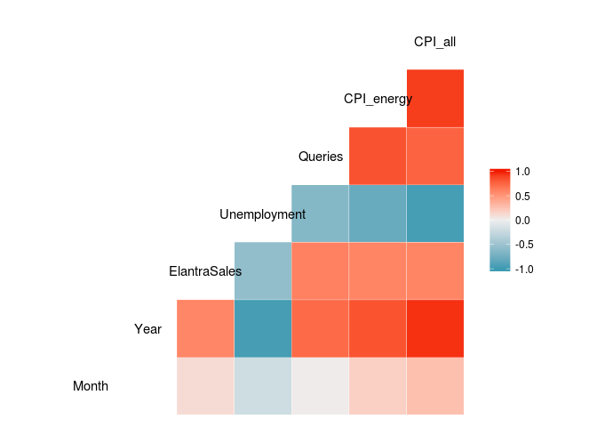

# Forecasting Elantra Sales


```r
library(dplyr)
```

```
## 
## Attaching package: 'dplyr'
```

```
## The following objects are masked from 'package:stats':
## 
##     filter, lag
```

```
## The following objects are masked from 'package:base':
## 
##     intersect, setdiff, setequal, union
```

```r
library(tidyr)
library(ggplot2)
library(GGally)
```

```
## 
## Attaching package: 'GGally'
```

```
## The following object is masked from 'package:dplyr':
## 
##     nasa
```

Problem 1 - Loading the Data
0 points possible (ungraded)
Load the data set. Split the data set into training and testing sets as follows: place all observations for 2012 and earlier in the training set, and all observations for 2013 and 2014 into the testing set.

How many observations are in the training set?

```r
df<-read.csv('elantra.csv')
df_train<- df %>% filter(Year<2013)
df_test<- df %>% filter(Year>=2013)
str(df_train)
```

```
## 'data.frame':	36 obs. of  7 variables:
##  $ Month       : int  1 1 1 2 2 2 3 3 3 4 ...
##  $ Year        : int  2010 2011 2012 2010 2011 2012 2010 2011 2012 2010 ...
##  $ ElantraSales: int  7690 9659 10900 7966 12289 13820 8225 19255 19681 9657 ...
##  $ Unemployment: num  9.7 9.1 8.2 9.8 9 8.3 9.9 9 8.2 9.9 ...
##  $ Queries     : int  153 259 354 130 266 296 138 281 303 132 ...
##  $ CPI_energy  : num  213 229 244 210 232 ...
##  $ CPI_all     : num  217 221 228 217 222 ...
```
Problem 2.1 - A Linear Regression Model
0 points possible (ungraded)
Build a linear regression model to predict monthly Elantra sales using Unemployment, CPI_all, CPI_energy and Queries as the independent variables. Use all of the training set data to do this.

What is the model R-squared? Note: In this problem, we will always be asking for the "Multiple R-Squared" of the model.

```r
lm1<-lm(ElantraSales ~ Unemployment+ CPI_all+ CPI_energy + Queries ,data=df_train)
summary(lm1)
```

```
## 
## Call:
## lm(formula = ElantraSales ~ Unemployment + CPI_all + CPI_energy + 
##     Queries, data = df_train)
## 
## Residuals:
##     Min      1Q  Median      3Q     Max 
## -6785.2 -2101.8  -562.5  2901.7  7021.0 
## 
## Coefficients:
##               Estimate Std. Error t value Pr(>|t|)
## (Intercept)   95385.36  170663.81   0.559    0.580
## Unemployment  -3179.90    3610.26  -0.881    0.385
## CPI_all        -297.65     704.84  -0.422    0.676
## CPI_energy       38.51     109.60   0.351    0.728
## Queries          19.03      11.26   1.690    0.101
## 
## Residual standard error: 3295 on 31 degrees of freedom
## Multiple R-squared:  0.4282,	Adjusted R-squared:  0.3544 
## F-statistic: 5.803 on 4 and 31 DF,  p-value: 0.00132
```
Problem 3.1 - Modeling Seasonality
0 points possible (ungraded)
Our model R-Squared is relatively low, so we would now like to improve our model. In modeling demand and sales, it is often useful to model seasonality. Seasonality refers to the fact that demand is often cyclical/periodic in time. For example, in countries with different seasons, demand for warm outerwear (like jackets and coats) is higher in fall/autumn and winter (due to the colder weather) than in spring and summer. (In contrast, demand for swimsuits and sunscreen is higher in the summer than in the other seasons.) Another example is the "back to school" period in North America: demand for stationary (pencils, notebooks and so on) in late July and all of August is higher than the rest of the year due to the start of the school year in September.

In our problem, since our data includes the month of the year in which the units were sold, it is feasible for us to incorporate monthly seasonality. From a modeling point of view, it may be reasonable that the month plays an effect in how many Elantra units are sold.

To incorporate the seasonal effect due to the month, build a new linear regression model that predicts monthly Elantra sales using Month as well as Unemployment, CPI_all, CPI_energy and Queries. Do not modify the training and testing data frames before building the model.


```r
lm2<-lm(ElantraSales~ Month + Unemployment + CPI_all + CPI_energy  + Queries,data=df_train)
summary(lm2)
```

```
## 
## Call:
## lm(formula = ElantraSales ~ Month + Unemployment + CPI_all + 
##     CPI_energy + Queries, data = df_train)
## 
## Residuals:
##     Min      1Q  Median      3Q     Max 
## -6416.6 -2068.7  -597.1  2616.3  7183.2 
## 
## Coefficients:
##               Estimate Std. Error t value Pr(>|t|)  
## (Intercept)  148330.49  195373.51   0.759   0.4536  
## Month           110.69     191.66   0.578   0.5679  
## Unemployment  -4137.28    4008.56  -1.032   0.3103  
## CPI_all        -517.99     808.26  -0.641   0.5265  
## CPI_energy       54.18     114.08   0.475   0.6382  
## Queries          21.19      11.98   1.769   0.0871 .
## ---
## Signif. codes:  0 '***' 0.001 '**' 0.01 '*' 0.05 '.' 0.1 ' ' 1
## 
## Residual standard error: 3331 on 30 degrees of freedom
## Multiple R-squared:  0.4344,	Adjusted R-squared:  0.3402 
## F-statistic: 4.609 on 5 and 30 DF,  p-value: 0.003078
```
Problem 4.1 - A New Model
0 points possible (ungraded)
Re-run the regression with the Month variable modeled as a factor variable. (Create a new variable that models the Month as a factor (using the as.factor function) instead of overwriting the current Month variable. We'll still use the numeric version of Month later in the problem.)

What is the model R-Squared?

```r
df_train$Month<-as.factor(df_train$Month)
lm2<-lm(ElantraSales~ Month + Unemployment + CPI_all + CPI_energy  + Queries,data=df_train)
summary(lm2)
```

```
## 
## Call:
## lm(formula = ElantraSales ~ Month + Unemployment + CPI_all + 
##     CPI_energy + Queries, data = df_train)
## 
## Residuals:
##     Min      1Q  Median      3Q     Max 
## -3865.1 -1211.7   -77.1  1207.5  3562.2 
## 
## Coefficients:
##                Estimate Std. Error t value Pr(>|t|)    
## (Intercept)  312509.280 144061.867   2.169 0.042288 *  
## Month2         2254.998   1943.249   1.160 0.259540    
## Month3         6696.557   1991.635   3.362 0.003099 ** 
## Month4         7556.607   2038.022   3.708 0.001392 ** 
## Month5         7420.249   1950.139   3.805 0.001110 ** 
## Month6         9215.833   1995.230   4.619 0.000166 ***
## Month7         9929.464   2238.800   4.435 0.000254 ***
## Month8         7939.447   2064.629   3.845 0.001010 ** 
## Month9         5013.287   2010.745   2.493 0.021542 *  
## Month10        2500.184   2084.057   1.200 0.244286    
## Month11        3238.932   2397.231   1.351 0.191747    
## Month12        5293.911   2228.310   2.376 0.027621 *  
## Unemployment  -7739.381   2968.747  -2.607 0.016871 *  
## CPI_all       -1343.307    592.919  -2.266 0.034732 *  
## CPI_energy      288.631     97.974   2.946 0.007988 ** 
## Queries          -4.764     12.938  -0.368 0.716598    
## ---
## Signif. codes:  0 '***' 0.001 '**' 0.01 '*' 0.05 '.' 0.1 ' ' 1
## 
## Residual standard error: 2306 on 20 degrees of freedom
## Multiple R-squared:  0.8193,	Adjusted R-squared:  0.6837 
## F-statistic: 6.044 on 15 and 20 DF,  p-value: 0.0001469
```
Problem 5.1 - Multicolinearity
0 points possible (ungraded)
Another peculiar observation about the regression is that the sign of the Queries variable has changed. In particular, when we naively modeled Month as a numeric variable, Queries had a positive coefficient. Now, Queries has a negative coefficient. Furthermore, CPI_energy has a positive coefficient -- as the overall price of energy increases, we expect Elantra sales to increase, which seems counter-intuitive (if the price of energy increases, we'd expect consumers to have less funds to purchase automobiles, leading to lower Elantra sales).

As we have seen before, changes in coefficient signs and signs that are counter to our intuition may be due to a multicolinearity problem. To check, compute the correlations of the variables in the training set.

Which of the following variables is CPI_energy highly correlated with? Select all that apply. (Include only variables where the absolute value of the correlation exceeds 0.6. For the purpose of this question, treat Month as a numeric variable, not a factor variable.)

```r
df_train$Month<-as.integer(df_train$Month)
cor(df_train)
```

```
##                   Month       Year ElantraSales Unemployment    Queries
## Month         1.0000000  0.0000000    0.1097945   -0.2036029  0.0158443
## Year          0.0000000  1.0000000    0.5872737   -0.9587459  0.7265310
## ElantraSales  0.1097945  0.5872737    1.0000000   -0.5671458  0.6100645
## Unemployment -0.2036029 -0.9587459   -0.5671458    1.0000000 -0.6411093
## Queries       0.0158443  0.7265310    0.6100645   -0.6411093  1.0000000
## CPI_energy    0.1760198  0.8316052    0.5916491   -0.8007188  0.8328381
## CPI_all       0.2667883  0.9485847    0.5936217   -0.9562123  0.7536732
##              CPI_energy    CPI_all
## Month         0.1760198  0.2667883
## Year          0.8316052  0.9485847
## ElantraSales  0.5916491  0.5936217
## Unemployment -0.8007188 -0.9562123
## Queries       0.8328381  0.7536732
## CPI_energy    1.0000000  0.9132259
## CPI_all       0.9132259  1.0000000
```

```r
ggcorr(df_train)
```

<!-- -->

