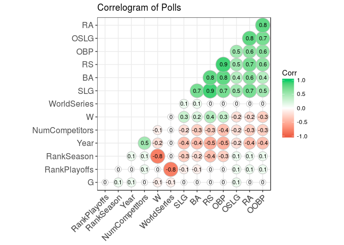

# Predicting the Baseball World Series Champion (OPTIONAL)


```r
library(dplyr)
```

```
## 
## Attaching package: 'dplyr'
```

```
## The following objects are masked from 'package:stats':
## 
##     filter, lag
```

```
## The following objects are masked from 'package:base':
## 
##     intersect, setdiff, setequal, union
```

```r
library(tidyr)
library(caret)
```

```
## Loading required package: lattice
```

```
## Loading required package: ggplot2
```

```r
library(ROCR)
```

```
## Loading required package: gplots
```

```
## 
## Attaching package: 'gplots'
```

```
## The following object is masked from 'package:stats':
## 
##     lowess
```

```r
library(mice)
```

```
## 
## Attaching package: 'mice'
```

```
## The following object is masked from 'package:tidyr':
## 
##     complete
```

```r
library(broom)
library(ggcorrplot)
df<- read.csv('baseball.csv')

str(df)
```

```
## 'data.frame':	1232 obs. of  15 variables:
##  $ Team        : Factor w/ 39 levels "ANA","ARI","ATL",..: 2 3 4 5 7 8 9 10 11 12 ...
##  $ League      : Factor w/ 2 levels "AL","NL": 2 2 1 1 2 1 2 1 2 1 ...
##  $ Year        : int  2012 2012 2012 2012 2012 2012 2012 2012 2012 2012 ...
##  $ RS          : int  734 700 712 734 613 748 669 667 758 726 ...
##  $ RA          : int  688 600 705 806 759 676 588 845 890 670 ...
##  $ W           : int  81 94 93 69 61 85 97 68 64 88 ...
##  $ OBP         : num  0.328 0.32 0.311 0.315 0.302 0.318 0.315 0.324 0.33 0.335 ...
##  $ SLG         : num  0.418 0.389 0.417 0.415 0.378 0.422 0.411 0.381 0.436 0.422 ...
##  $ BA          : num  0.259 0.247 0.247 0.26 0.24 0.255 0.251 0.251 0.274 0.268 ...
##  $ Playoffs    : int  0 1 1 0 0 0 1 0 0 1 ...
##  $ RankSeason  : int  NA 4 5 NA NA NA 2 NA NA 6 ...
##  $ RankPlayoffs: int  NA 5 4 NA NA NA 4 NA NA 2 ...
##  $ G           : int  162 162 162 162 162 162 162 162 162 162 ...
##  $ OOBP        : num  0.317 0.306 0.315 0.331 0.335 0.319 0.305 0.336 0.357 0.314 ...
##  $ OSLG        : num  0.415 0.378 0.403 0.428 0.424 0.405 0.39 0.43 0.47 0.402 ...
```
Problem 1.1 - Limiting to Teams Making the Playoffs
0 points possible (ungraded)
Each row in the baseball dataset represents a team in a particular year.

How many team/year pairs are there in the whole dataset?

```r
df %>% group_by(Team,Year) %>% summarise(n()) %>% nrow()
```

```
## [1] 1232
```
Problem 1.2 - Limiting to Teams Making the Playoffs
0 points possible (ungraded)
Though the dataset contains data from 1962 until 2012, we removed several years with shorter-than-usual seasons. Using the table() function, identify the total number of years included in this dataset.


```r
df %>% group_by(Year) %>% summarise(n()) %>% nrow()
```

```
## [1] 47
```
Problem 1.3 - Limiting to Teams Making the Playoffs
0 points possible (ungraded)
Because we're only analyzing teams that made the playoffs, use the subset() function to replace baseball with a data frame limited to teams that made the playoffs (so your subsetted data frame should still be called "baseball"). How many team/year pairs are included in the new dataset?

```r
df_playoff <- df %>% filter(Playoffs==1)
PlayoffTable <- df_playoff %>% group_by(Year) %>% summarise(NumCompetitors=n()) %>% arrange(desc(NumCompetitors)) 
PlayoffTable
```

```
## # A tibble: 47 × 2
##     Year NumCompetitors
##    <int>          <int>
## 1   2012             10
## 2   1996              8
## 3   1997              8
## 4   1998              8
## 5   1999              8
## 6   2000              8
## 7   2001              8
## 8   2002              8
## 9   2003              8
## 10  2004              8
## # ... with 37 more rows
```

```r
PlayoffTable %>% group_by(NumCompetitors) %>% summarise(n())
```

```
## # A tibble: 4 × 2
##   NumCompetitors `n()`
##            <int> <int>
## 1              2     7
## 2              4    23
## 3              8    16
## 4             10     1
```
Problem 2.1 - Adding an Important Predictor
0 points possible (ungraded)
It's much harder to win the World Series if there are 10 teams competing for the championship versus just two. Therefore, we will add the predictor variable NumCompetitors to the baseball data frame. NumCompetitors will contain the number of total teams making the playoffs in the year of a particular team/year pair. For instance, NumCompetitors should be 2 for the 1962 New York Yankees, but it should be 8 for the 1998 Boston Red Sox.

We start by storing the output of the table() function that counts the number of playoff teams from each year:

PlayoffTable = table(baseball$Year)

You can output the table with the following command:

PlayoffTable

We will use this stored table to look up the number of teams in the playoffs in the year of each team/year pair.

Just as we can use the names() function to get the names of a data frame's columns, we can use it to get the names of the entries in a table. What best describes the output of names(PlayoffTable)?

```r
names(PlayoffTable)
```

```
## [1] "Year"           "NumCompetitors"
```

```r
df_playoff <- merge(PlayoffTable,df_playoff, by=c('Year'='Year'))

str(df_playoff)
```

```
## 'data.frame':	244 obs. of  16 variables:
##  $ Year          : int  1962 1962 1963 1963 1964 1964 1965 1965 1966 1966 ...
##  $ NumCompetitors: int  2 2 2 2 2 2 2 2 2 2 ...
##  $ Team          : Factor w/ 39 levels "ANA","ARI","ATL",..: 32 25 18 25 33 25 18 21 18 4 ...
##  $ League        : Factor w/ 2 levels "AL","NL": 2 1 2 1 2 1 2 1 2 1 ...
##  $ RS            : int  878 817 640 714 715 730 608 774 606 755 ...
##  $ RA            : int  690 680 550 547 652 577 521 600 490 601 ...
##  $ W             : int  103 96 99 104 93 99 97 102 95 97 ...
##  $ OBP           : num  0.341 0.337 0.309 0.309 0.324 0.317 0.312 0.324 0.314 0.324 ...
##  $ SLG           : num  0.441 0.426 0.357 0.403 0.392 0.387 0.335 0.399 0.362 0.409 ...
##  $ BA            : num  0.278 0.267 0.251 0.252 0.272 0.253 0.245 0.254 0.256 0.258 ...
##  $ Playoffs      : int  1 1 1 1 1 1 1 1 1 1 ...
##  $ RankSeason    : int  1 2 2 1 2 1 2 1 2 1 ...
##  $ RankPlayoffs  : int  2 1 1 2 1 2 1 2 2 1 ...
##  $ G             : int  165 162 163 161 162 164 162 162 162 160 ...
##  $ OOBP          : num  NA NA NA NA NA NA NA NA NA NA ...
##  $ OSLG          : num  NA NA NA NA NA NA NA NA NA NA ...
```

Problem 2.4 - Adding an Important Predictor
0 points possible (ungraded)
Add the NumCompetitors variable to your baseball data frame. How many playoff team/year pairs are there in our dataset from years where 8 teams were invited to the playoffs?

```r
df_playoff %>% filter(NumCompetitors==8) %>% nrow()
```

```
## [1] 128
```
Problem 3.1 - Bivariate Models for Predicting World Series Winner
0 points possible (ungraded)
In this problem, we seek to predict whether a team won the World Series; in our dataset this is denoted with a RankPlayoffs value of 1. Add a variable named WorldSeries to the baseball data frame, by typing the following command in your R console:

baseball$WorldSeries = as.numeric(baseball$RankPlayoffs == 1)

WorldSeries takes value 1 if a team won the World Series in the indicated year and a 0 otherwise. How many observations do we have in our dataset where a team did NOT win the World Series?

```r
df_playoff<-df_playoff %>% mutate(WorldSeries = ifelse(RankPlayoffs==1,1,0) )
table(df_playoff$WorldSeries)
```

```
## 
##   0   1 
## 197  47
```
Problem 3.2 - Bivariate Models for Predicting World Series Winner
0 points possible (ungraded)
When we're not sure which of our variables are useful in predicting a particular outcome, it's often helpful to build bivariate models, which are models that predict the outcome using a single independent variable. Which of the following variables is a significant predictor of the WorldSeries variable in a bivariate logistic regression model? To determine significance, remember to look at the stars in the summary output of the model. We'll define an independent variable as significant if there is at least one star at the end of the coefficients row for that variable (this is equivalent to the probability column having a value smaller than 0.05). Note that you have to build 12 models to answer this question! Use the entire dataset baseball to build the models. (Select all that apply.)

```r
colo <- setdiff(colnames(df_playoff),c('Team','League','Playoffs','RankPlayoffs','G','WorldSeries' ))

for (c in colo){
  
  formula <- as.formula(paste("WorldSeries ~ ", c))
  
  model1<-glm(formula,data=df_playoff,family=binomial)
  print(summary(model1)$coef[,'Pr(>|z|)'])
}
```

```
## (Intercept)        Year 
## 0.001422431 0.001154469 
##    (Intercept) NumCompetitors 
##   0.9295592141   0.0006784323 
## (Intercept)          RS 
##   0.6861757   0.2013364 
## (Intercept)          RA 
##  0.20319577  0.02621378 
## (Intercept)           W 
##  0.01714458  0.05772603 
## (Intercept)         OBP 
##   0.4918963   0.2959201 
## (Intercept)         SLG 
##  0.17482884  0.05042566 
## (Intercept)          BA 
##   0.8697621   0.8385901 
## (Intercept)  RankSeason 
##  0.01151641  0.04383136 
## (Intercept)        OOBP 
##   0.9115024   0.9015582 
## (Intercept)        OSLG 
##   0.9885371   0.7571369
```
Problem 4.1 - Multivariate Models for Predicting World Series Winner
0 points possible (ungraded)
In this section, we'll consider multivariate models that combine the variables we found to be significant in bivariate models. Build a model using all of the variables that you found to be significant in the bivariate models. How many variables are significant in the combined model?

```r
model1<- glm(WorldSeries~Year+NumCompetitors + RankSeason + RA,data=df_playoff,family=binomial)
summary(model1)
```

```
## 
## Call:
## glm(formula = WorldSeries ~ Year + NumCompetitors + RankSeason + 
##     RA, family = binomial, data = df_playoff)
## 
## Deviance Residuals: 
##     Min       1Q   Median       3Q      Max  
## -1.0336  -0.7689  -0.5139  -0.4583   2.2195  
## 
## Coefficients:
##                  Estimate Std. Error z value Pr(>|z|)
## (Intercept)    12.5874376 53.6474210   0.235    0.814
## Year           -0.0061425  0.0274665  -0.224    0.823
## NumCompetitors -0.1794264  0.1815933  -0.988    0.323
## RankSeason     -0.0685046  0.1203459  -0.569    0.569
## RA             -0.0008238  0.0027391  -0.301    0.764
## 
## (Dispersion parameter for binomial family taken to be 1)
## 
##     Null deviance: 239.12  on 243  degrees of freedom
## Residual deviance: 226.37  on 239  degrees of freedom
## AIC: 236.37
## 
## Number of Fisher Scoring iterations: 4
```

```r
df_playoff_no_na <- df_playoff %>% na.omit()

str(df_playoff_no_na)
```

```
## 'data.frame':	114 obs. of  17 variables:
##  $ Year          : int  1999 1999 1999 1999 1999 1999 1999 1999 2000 2000 ...
##  $ NumCompetitors: int  8 8 8 8 8 8 8 8 8 8 ...
##  $ Team          : Factor w/ 39 levels "ANA","ARI","ATL",..: 36 24 25 5 10 2 3 14 32 33 ...
##  $ League        : Factor w/ 2 levels "AL","NL": 1 2 1 1 1 2 2 2 2 2 ...
##  $ RS            : int  945 853 900 836 1009 908 840 823 925 887 ...
##  $ RA            : int  859 711 731 718 860 676 661 675 747 771 ...
##  $ W             : int  95 97 98 94 97 100 103 97 97 95 ...
##  $ OBP           : num  0.361 0.363 0.366 0.35 0.373 0.347 0.341 0.355 0.362 0.356 ...
##  $ SLG           : num  0.479 0.434 0.453 0.448 0.467 0.459 0.436 0.42 0.472 0.455 ...
##  $ BA            : num  0.293 0.279 0.282 0.278 0.289 0.277 0.266 0.267 0.278 0.27 ...
##  $ Playoffs      : int  1 1 1 1 1 1 1 1 1 1 ...
##  $ RankSeason    : int  5 4 3 6 4 2 1 4 1 2 ...
##  $ RankPlayoffs  : int  4 3 1 3 4 4 2 4 4 3 ...
##  $ G             : int  162 163 162 162 162 162 162 162 162 162 ...
##  $ OOBP          : num  0.346 0.331 0.329 0.315 0.347 0.32 0.314 0.326 0.342 0.338 ...
##  $ OSLG          : num  0.459 0.418 0.4 0.398 0.439 0.402 0.377 0.397 0.412 0.434 ...
##  $ WorldSeries   : num  0 0 1 0 0 0 0 0 0 0 ...
##  - attr(*, "na.action")=Class 'omit'  Named int [1:130] 1 2 3 4 5 6 7 8 9 10 ...
##   .. ..- attr(*, "names")= chr [1:130] "1" "2" "3" "4" ...
```

```r
model0<- glm(WorldSeries~.-Team-League - Playoffs - RankPlayoffs- G ,data=df_playoff_no_na,family=binomial)
stepped_model <-step(model0,trace = FALSE)
summary(stepped_model)
```

```
## 
## Call:
## glm(formula = WorldSeries ~ 1, family = binomial, data = df_playoff_no_na)
## 
## Deviance Residuals: 
##     Min       1Q   Median       3Q      Max  
## -0.5119  -0.5119  -0.5119  -0.5119   2.0480  
## 
## Coefficients:
##             Estimate Std. Error z value Pr(>|z|)    
## (Intercept)  -1.9661     0.2854   -6.89 5.58e-12 ***
## ---
## Signif. codes:  0 '***' 0.001 '**' 0.01 '*' 0.05 '.' 0.1 ' ' 1
## 
## (Dispersion parameter for binomial family taken to be 1)
## 
##     Null deviance: 84.926  on 113  degrees of freedom
## Residual deviance: 84.926  on 113  degrees of freedom
## AIC: 86.926
## 
## Number of Fisher Scoring iterations: 4
```

```r
df_playoff_no_string<- df_playoff %>% select(-one_of(c("Team","League","Playoffs"))) %>% na.omit()
str(df_playoff_no_string)
```

```
## 'data.frame':	114 obs. of  14 variables:
##  $ Year          : int  1999 1999 1999 1999 1999 1999 1999 1999 2000 2000 ...
##  $ NumCompetitors: int  8 8 8 8 8 8 8 8 8 8 ...
##  $ RS            : int  945 853 900 836 1009 908 840 823 925 887 ...
##  $ RA            : int  859 711 731 718 860 676 661 675 747 771 ...
##  $ W             : int  95 97 98 94 97 100 103 97 97 95 ...
##  $ OBP           : num  0.361 0.363 0.366 0.35 0.373 0.347 0.341 0.355 0.362 0.356 ...
##  $ SLG           : num  0.479 0.434 0.453 0.448 0.467 0.459 0.436 0.42 0.472 0.455 ...
##  $ BA            : num  0.293 0.279 0.282 0.278 0.289 0.277 0.266 0.267 0.278 0.27 ...
##  $ RankSeason    : int  5 4 3 6 4 2 1 4 1 2 ...
##  $ RankPlayoffs  : int  4 3 1 3 4 4 2 4 4 3 ...
##  $ G             : int  162 163 162 162 162 162 162 162 162 162 ...
##  $ OOBP          : num  0.346 0.331 0.329 0.315 0.347 0.32 0.314 0.326 0.342 0.338 ...
##  $ OSLG          : num  0.459 0.418 0.4 0.398 0.439 0.402 0.377 0.397 0.412 0.434 ...
##  $ WorldSeries   : num  0 0 1 0 0 0 0 0 0 0 ...
##  - attr(*, "na.action")=Class 'omit'  Named int [1:130] 1 2 3 4 5 6 7 8 9 10 ...
##   .. ..- attr(*, "names")= chr [1:130] "1" "2" "3" "4" ...
```

```r
corr <- round(cor(df_playoff_no_string),1)
corr
```

```
##                Year NumCompetitors   RS   RA    W  OBP  SLG   BA
## Year            1.0            0.5 -0.5 -0.4 -0.2 -0.5 -0.4 -0.4
## NumCompetitors  0.5            1.0 -0.3 -0.3 -0.1 -0.4 -0.2 -0.3
## RS             -0.5           -0.3  1.0  0.7  0.4  0.9  0.9  0.8
## RA             -0.4           -0.3  0.7  1.0 -0.2  0.6  0.7  0.6
## W              -0.2           -0.1  0.4 -0.2  1.0  0.3  0.3  0.2
## OBP            -0.5           -0.4  0.9  0.6  0.3  1.0  0.7  0.8
## SLG            -0.4           -0.2  0.9  0.7  0.3  0.7  1.0  0.7
## BA             -0.4           -0.3  0.8  0.6  0.2  0.8  0.7  1.0
## RankSeason      0.1            0.1 -0.4  0.1 -0.8 -0.3 -0.3 -0.2
## RankPlayoffs    0.0            0.1  0.0  0.1  0.0  0.0 -0.1 -0.1
## G               0.1            0.0  0.0  0.0 -0.1  0.0  0.0  0.0
## OOBP           -0.4           -0.3  0.6  0.8 -0.3  0.6  0.5  0.4
## OSLG           -0.2           -0.2  0.5  0.8 -0.2  0.5  0.5  0.4
## WorldSeries     0.0            0.0  0.0  0.0  0.0  0.0  0.1  0.1
##                RankSeason RankPlayoffs    G OOBP OSLG WorldSeries
## Year                  0.1          0.0  0.1 -0.4 -0.2         0.0
## NumCompetitors        0.1          0.1  0.0 -0.3 -0.2         0.0
## RS                   -0.4          0.0  0.0  0.6  0.5         0.0
## RA                    0.1          0.1  0.0  0.8  0.8         0.0
## W                    -0.8          0.0 -0.1 -0.3 -0.2         0.0
## OBP                  -0.3          0.0  0.0  0.6  0.5         0.0
## SLG                  -0.3         -0.1  0.0  0.5  0.5         0.1
## BA                   -0.2         -0.1  0.0  0.4  0.4         0.1
## RankSeason            1.0          0.0  0.1  0.1  0.1         0.0
## RankPlayoffs          0.0          1.0  0.0  0.1  0.1        -0.8
## G                     0.1          0.0  1.0  0.0  0.1        -0.1
## OOBP                  0.1          0.1  0.0  1.0  0.7         0.0
## OSLG                  0.1          0.1  0.1  0.7  1.0         0.0
## WorldSeries           0.0         -0.8 -0.1  0.0  0.0         1.0
```

```r
# Plot
ggcorrplot(corr, hc.order = TRUE, 
           type = "lower", 
           lab = TRUE, 
           lab_size = 3, 
           method="circle", 
           colors = c("tomato2", "white", "springgreen3"), 
           title="Correlogram of Polls", 
           ggtheme=theme_bw)
```

<!-- -->

