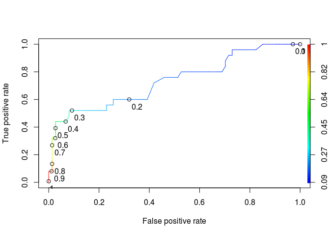

# PoorCare


```r
library(dplyr)
```

```
## 
## Attaching package: 'dplyr'
```

```
## The following objects are masked from 'package:stats':
## 
##     filter, lag
```

```
## The following objects are masked from 'package:base':
## 
##     intersect, setdiff, setequal, union
```

```r
library(tidyr)
library(caret)
```

```
## Loading required package: lattice
```

```
## Loading required package: ggplot2
```

```r
library(ROCR)
```

```
## Loading required package: gplots
```

```
## 
## Attaching package: 'gplots'
```

```
## The following object is masked from 'package:stats':
## 
##     lowess
```

```r
set.seed(88)
```


```r
df<-read.csv('quality.csv')
index<-createDataPartition(df$PoorCare,p=0.75,list=FALSE )
df_train<-df[index,]
df_test<-df[-index,]
```


```r
model1<-glm(PoorCare~ OfficeVisits+Narcotics,data=df_train,family = "binomial")
summary(model1)
```

```
## 
## Call:
## glm(formula = PoorCare ~ OfficeVisits + Narcotics, family = "binomial", 
##     data = df_train)
## 
## Deviance Residuals: 
##     Min       1Q   Median       3Q      Max  
## -2.0984  -0.6523  -0.5490  -0.1422   2.0666  
## 
## Coefficients:
##              Estimate Std. Error z value Pr(>|z|)    
## (Intercept)  -2.34647    0.49174  -4.772 1.83e-06 ***
## OfficeVisits  0.04985    0.02492   2.000  0.04545 *  
## Narcotics     0.09366    0.03165   2.959  0.00309 ** 
## ---
## Signif. codes:  0 '***' 0.001 '**' 0.01 '*' 0.05 '.' 0.1 ' ' 1
## 
## (Dispersion parameter for binomial family taken to be 1)
## 
##     Null deviance: 111.888  on 98  degrees of freedom
## Residual deviance:  91.924  on 96  degrees of freedom
## AIC: 97.924
## 
## Number of Fisher Scoring iterations: 4
```

```r
df_train$prediction1<-predict(model1,df_train,type = 'response')
df_train$prediction_discrete <- (df_train$prediction1>0.5)*1
df_train %>% group_by(PoorCare) %>% summarise(mean(prediction1))
```

```
## # A tibble: 2 × 2
##   PoorCare `mean(prediction1)`
##      <int>               <dbl>
## 1        0           0.1956144
## 2        1           0.4209813
```

```r
df_train %>% group_by(PoorCare) %>% summarise(n(),n()/nrow(.))
```

```
## # A tibble: 2 × 3
##   PoorCare `n()` `n()/nrow(.)`
##      <int> <int>         <dbl>
## 1        0    74     0.7474747
## 2        1    25     0.2525253
```

```r
head(df_train[,c('PoorCare','prediction1','prediction_discrete')],30)
```

```
##    PoorCare prediction1 prediction_discrete
## 2         0  0.12415215                   0
## 3         0  0.13988901                   0
## 4         0  0.19793501                   0
## 8         0  0.12481088                   0
## 9         1  0.13399761                   0
## 10        0  0.10347992                   0
## 11        0  0.23829113                   0
## 12        0  0.16481331                   0
## 14        0  0.25570591                   0
## 15        0  0.37284785                   0
## 16        0  0.12481088                   0
## 18        1  0.22170909                   0
## 19        0  0.16130923                   0
## 20        0  0.20596893                   0
## 21        1  0.17438604                   0
## 24        1  0.13470054                   0
## 25        0  0.17438604                   0
## 26        0  0.11946629                   0
## 27        0  0.14827109                   0
## 28        1  0.11820051                   0
## 29        1  0.82464087                   1
## 30        1  0.32353671                   0
## 31        0  0.09562914                   0
## 32        0  0.47425840                   0
## 33        0  0.11432067                   0
## 34        0  0.14449502                   0
## 35        1  0.53348035                   1
## 36        0  0.42200203                   0
## 37        0  0.13035917                   0
## 39        0  0.18168064                   0
```

```r
# Prediction function
ROCRpred = prediction(df_train$prediction1, df_train$PoorCare)

auc.tmp <- performance(ROCRpred,"auc"); auc <- as.numeric(auc.tmp@y.values)
auc
```

```
## [1] 0.7337838
```

```r
# Performance function
ROCRperf = performance(ROCRpred, "tpr", "fpr")


# Add threshold labels 
plot(ROCRperf, colorize=TRUE, print.cutoffs.at=seq(0,1,by=0.1), text.adj=c(-0.2,1.7))
```

<!-- -->

