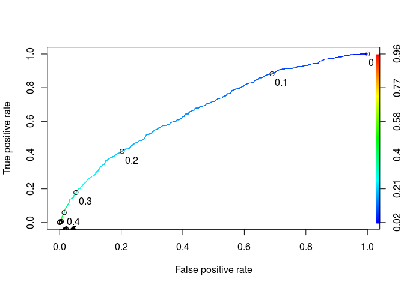
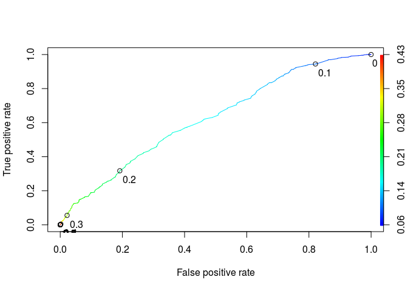

# Predicting Loan repayment


```r
library(dplyr)
```

```
## 
## Attaching package: 'dplyr'
```

```
## The following objects are masked from 'package:stats':
## 
##     filter, lag
```

```
## The following objects are masked from 'package:base':
## 
##     intersect, setdiff, setequal, union
```

```r
library(tidyr)
library(caret)
```

```
## Loading required package: lattice
```

```
## Loading required package: ggplot2
```

```r
library(ROCR)
```

```
## Loading required package: gplots
```

```
## 
## Attaching package: 'gplots'
```

```
## The following object is masked from 'package:stats':
## 
##     lowess
```

```r
library(mice)
```

```
## 
## Attaching package: 'mice'
```

```
## The following object is masked from 'package:tidyr':
## 
##     complete
```

```r
library(broom)
df<- read.csv('loans.csv')

summary(df)
```

```
##  credit.policy                 purpose        int.rate     
##  Min.   :0.000   all_other         :2331   Min.   :0.0600  
##  1st Qu.:1.000   credit_card       :1262   1st Qu.:0.1039  
##  Median :1.000   debt_consolidation:3957   Median :0.1221  
##  Mean   :0.805   educational       : 343   Mean   :0.1226  
##  3rd Qu.:1.000   home_improvement  : 629   3rd Qu.:0.1407  
##  Max.   :1.000   major_purchase    : 437   Max.   :0.2164  
##                  small_business    : 619                   
##   installment     log.annual.inc        dti              fico      
##  Min.   : 15.67   Min.   : 7.548   Min.   : 0.000   Min.   :612.0  
##  1st Qu.:163.77   1st Qu.:10.558   1st Qu.: 7.213   1st Qu.:682.0  
##  Median :268.95   Median :10.928   Median :12.665   Median :707.0  
##  Mean   :319.09   Mean   :10.932   Mean   :12.607   Mean   :710.8  
##  3rd Qu.:432.76   3rd Qu.:11.290   3rd Qu.:17.950   3rd Qu.:737.0  
##  Max.   :940.14   Max.   :14.528   Max.   :29.960   Max.   :827.0  
##                   NA's   :4                                        
##  days.with.cr.line   revol.bal         revol.util     inq.last.6mths  
##  Min.   :  179     Min.   :      0   Min.   :  0.00   Min.   : 0.000  
##  1st Qu.: 2820     1st Qu.:   3187   1st Qu.: 22.70   1st Qu.: 0.000  
##  Median : 4140     Median :   8596   Median : 46.40   Median : 1.000  
##  Mean   : 4562     Mean   :  16914   Mean   : 46.87   Mean   : 1.572  
##  3rd Qu.: 5730     3rd Qu.:  18250   3rd Qu.: 71.00   3rd Qu.: 2.000  
##  Max.   :17640     Max.   :1207359   Max.   :119.00   Max.   :33.000  
##  NA's   :29                          NA's   :62       NA's   :29      
##   delinq.2yrs         pub.rec       not.fully.paid  
##  Min.   : 0.0000   Min.   :0.0000   Min.   :0.0000  
##  1st Qu.: 0.0000   1st Qu.:0.0000   1st Qu.:0.0000  
##  Median : 0.0000   Median :0.0000   Median :0.0000  
##  Mean   : 0.1638   Mean   :0.0621   Mean   :0.1601  
##  3rd Qu.: 0.0000   3rd Qu.:0.0000   3rd Qu.:0.0000  
##  Max.   :13.0000   Max.   :5.0000   Max.   :1.0000  
##  NA's   :29        NA's   :29
```
Problem 1.1 - Preparing the Dataset
1 point possible (graded)
Load the dataset loans.csv into a data frame called loans, and explore it using the str() and summary() functions.

What proportion of the loans in the dataset were not paid in full? Please input a number between 0 and 1.

```r
df %>% group_by(not.fully.paid) %>% summarise(total = n( )) %>% mutate(ratio= total*100/sum(total))
```

```
## # A tibble: 2 × 3
##   not.fully.paid total    ratio
##            <int> <int>    <dbl>
## 1              0  8045 83.99457
## 2              1  1533 16.00543
```
Problem 1.2 - Preparing the Dataset
1 point possible (graded)
Which of the following variables has at least one missing observation? Select all that apply.

```r
df%>% summarise_each(funs(sum(is.na(.)))) %>% gather() %>% filter(value>0)
```

```
##                 key value
## 1    log.annual.inc     4
## 2 days.with.cr.line    29
## 3        revol.util    62
## 4    inq.last.6mths    29
## 5       delinq.2yrs    29
## 6           pub.rec    29
```
Problem 1.3 - Preparing the Dataset
1 point possible (graded)
Which of the following is the best reason to fill in the missing values for these variables instead of removing observations with missing data? (Hint: you can use the subset() function to build a data frame with the observations missing at least one value. To test if a variable, for example pub.rec, is missing a value, use is.na(pub.rec).)

```r
not_fully_paid_ratio_only_no_NA <-df %>% na.omit() %>% summarise(mean(not.fully.paid))
not_fully_paid_ratio_only_with_NA <- df %>% mutate(has_NA = rowSums(is.na(.))) %>% filter(has_NA>0) %>% summarise(mean(not.fully.paid))

print(not_fully_paid_ratio_only_no_NA)
```

```
##   mean(not.fully.paid)
## 1            0.1598361
```

```r
print(not_fully_paid_ratio_only_with_NA)
```

```
##   mean(not.fully.paid)
## 1            0.1935484
```

```r
df %>% mutate(has_NA = rowSums(is.na(.))) %>% filter(has_NA>0) %>% nrow()
```

```
## [1] 62
```


Problem 1.4 - Preparing the Dataset
1 point possible (graded)
For the rest of this problem, we'll be using a revised version of the dataset that has the missing values filled in with multiple imputation (which was discussed in the Recitation of this Unit). To ensure everybody has the same data frame going forward, you can either run the commands below in your R console (if you haven't already, run the command install.packages("mice") first), or you can download and load into R the dataset we created after running the imputation: loans_imputed.csv.

IMPORTANT NOTE: On certain operating systems, the imputation results are not the same even if you set the random seed. If you decide to do the imputation yourself, please still read the provided imputed dataset (loans_imputed.csv) into R and compare your results, using the summary function. If the results are different, please make sure to use the data in loans_imputed.csv for the rest of the problem.

```r
df2<- complete(mice(select(df,-not.fully.paid)))
```

```
## 
##  iter imp variable
##   1   1  log.annual.inc  days.with.cr.line  revol.util  inq.last.6mths  delinq.2yrs  pub.rec
##   1   2  log.annual.inc  days.with.cr.line  revol.util  inq.last.6mths  delinq.2yrs  pub.rec
##   1   3  log.annual.inc  days.with.cr.line  revol.util  inq.last.6mths  delinq.2yrs  pub.rec
##   1   4  log.annual.inc  days.with.cr.line  revol.util  inq.last.6mths  delinq.2yrs  pub.rec
##   1   5  log.annual.inc  days.with.cr.line  revol.util  inq.last.6mths  delinq.2yrs  pub.rec
##   2   1  log.annual.inc  days.with.cr.line  revol.util  inq.last.6mths  delinq.2yrs  pub.rec
##   2   2  log.annual.inc  days.with.cr.line  revol.util  inq.last.6mths  delinq.2yrs  pub.rec
##   2   3  log.annual.inc  days.with.cr.line  revol.util  inq.last.6mths  delinq.2yrs  pub.rec
##   2   4  log.annual.inc  days.with.cr.line  revol.util  inq.last.6mths  delinq.2yrs  pub.rec
##   2   5  log.annual.inc  days.with.cr.line  revol.util  inq.last.6mths  delinq.2yrs  pub.rec
##   3   1  log.annual.inc  days.with.cr.line  revol.util  inq.last.6mths  delinq.2yrs  pub.rec
##   3   2  log.annual.inc  days.with.cr.line  revol.util  inq.last.6mths  delinq.2yrs  pub.rec
##   3   3  log.annual.inc  days.with.cr.line  revol.util  inq.last.6mths  delinq.2yrs  pub.rec
##   3   4  log.annual.inc  days.with.cr.line  revol.util  inq.last.6mths  delinq.2yrs  pub.rec
##   3   5  log.annual.inc  days.with.cr.line  revol.util  inq.last.6mths  delinq.2yrs  pub.rec
##   4   1  log.annual.inc  days.with.cr.line  revol.util  inq.last.6mths  delinq.2yrs  pub.rec
##   4   2  log.annual.inc  days.with.cr.line  revol.util  inq.last.6mths  delinq.2yrs  pub.rec
##   4   3  log.annual.inc  days.with.cr.line  revol.util  inq.last.6mths  delinq.2yrs  pub.rec
##   4   4  log.annual.inc  days.with.cr.line  revol.util  inq.last.6mths  delinq.2yrs  pub.rec
##   4   5  log.annual.inc  days.with.cr.line  revol.util  inq.last.6mths  delinq.2yrs  pub.rec
##   5   1  log.annual.inc  days.with.cr.line  revol.util  inq.last.6mths  delinq.2yrs  pub.rec
##   5   2  log.annual.inc  days.with.cr.line  revol.util  inq.last.6mths  delinq.2yrs  pub.rec
##   5   3  log.annual.inc  days.with.cr.line  revol.util  inq.last.6mths  delinq.2yrs  pub.rec
##   5   4  log.annual.inc  days.with.cr.line  revol.util  inq.last.6mths  delinq.2yrs  pub.rec
##   5   5  log.annual.inc  days.with.cr.line  revol.util  inq.last.6mths  delinq.2yrs  pub.rec
```

```r
summary(df2)
```

```
##  credit.policy                 purpose        int.rate     
##  Min.   :0.000   all_other         :2331   Min.   :0.0600  
##  1st Qu.:1.000   credit_card       :1262   1st Qu.:0.1039  
##  Median :1.000   debt_consolidation:3957   Median :0.1221  
##  Mean   :0.805   educational       : 343   Mean   :0.1226  
##  3rd Qu.:1.000   home_improvement  : 629   3rd Qu.:0.1407  
##  Max.   :1.000   major_purchase    : 437   Max.   :0.2164  
##                  small_business    : 619                   
##   installment     log.annual.inc        dti              fico      
##  Min.   : 15.67   Min.   : 7.548   Min.   : 0.000   Min.   :612.0  
##  1st Qu.:163.77   1st Qu.:10.558   1st Qu.: 7.213   1st Qu.:682.0  
##  Median :268.95   Median :10.927   Median :12.665   Median :707.0  
##  Mean   :319.09   Mean   :10.932   Mean   :12.607   Mean   :710.8  
##  3rd Qu.:432.76   3rd Qu.:11.290   3rd Qu.:17.950   3rd Qu.:737.0  
##  Max.   :940.14   Max.   :14.528   Max.   :29.960   Max.   :827.0  
##                                                                    
##  days.with.cr.line   revol.bal         revol.util     inq.last.6mths  
##  Min.   :  179     Min.   :      0   Min.   :  0.00   Min.   : 0.000  
##  1st Qu.: 2820     1st Qu.:   3187   1st Qu.: 22.60   1st Qu.: 0.000  
##  Median : 4139     Median :   8596   Median : 46.30   Median : 1.000  
##  Mean   : 4561     Mean   :  16914   Mean   : 46.82   Mean   : 1.577  
##  3rd Qu.: 5730     3rd Qu.:  18250   3rd Qu.: 70.90   3rd Qu.: 2.000  
##  Max.   :17640     Max.   :1207359   Max.   :119.00   Max.   :33.000  
##                                                                       
##   delinq.2yrs         pub.rec       
##  Min.   : 0.0000   Min.   :0.00000  
##  1st Qu.: 0.0000   1st Qu.:0.00000  
##  Median : 0.0000   Median :0.00000  
##  Mean   : 0.1637   Mean   :0.06191  
##  3rd Qu.: 0.0000   3rd Qu.:0.00000  
##  Max.   :13.0000   Max.   :5.00000  
## 
```

```r
df2$not.fully.paid<-df$not.fully.paid
str(df2)
```

```
## 'data.frame':	9578 obs. of  14 variables:
##  $ credit.policy    : int  1 1 1 1 1 1 1 1 1 1 ...
##  $ purpose          : Factor w/ 7 levels "all_other","credit_card",..: 3 2 3 3 2 2 3 1 5 3 ...
##   ..- attr(*, "contrasts")= num [1:7, 1:6] 0 1 0 0 0 0 0 0 0 1 ...
##   .. ..- attr(*, "dimnames")=List of 2
##   .. .. ..$ : chr  "all_other" "credit_card" "debt_consolidation" "educational" ...
##   .. .. ..$ : chr  "2" "3" "4" "5" ...
##  $ int.rate         : num  0.119 0.107 0.136 0.101 0.143 ...
##  $ installment      : num  829 228 367 162 103 ...
##  $ log.annual.inc   : num  11.4 11.1 10.4 11.4 11.3 ...
##  $ dti              : num  19.5 14.3 11.6 8.1 15 ...
##  $ fico             : int  737 707 682 712 667 727 667 722 682 707 ...
##  $ days.with.cr.line: num  5640 2760 4710 2700 4066 ...
##  $ revol.bal        : int  28854 33623 3511 33667 4740 50807 3839 24220 69909 5630 ...
##  $ revol.util       : num  52.1 76.7 25.6 73.2 39.5 51 76.8 68.6 51.1 23 ...
##  $ inq.last.6mths   : int  0 0 1 1 0 0 0 0 1 1 ...
##  $ delinq.2yrs      : int  0 0 0 0 1 0 0 0 0 0 ...
##  $ pub.rec          : int  0 0 0 0 0 0 1 0 0 0 ...
##  $ not.fully.paid   : int  0 0 0 0 0 0 1 1 0 0 ...
```

```r
set.seed(144)
library(caTools)

split = sample.split(df2$not.fully.paid, SplitRatio = 0.7)

df_train = subset(df, split == TRUE)

df_test= subset(df, split == FALSE)
```


```r
#df_train$purpose = relevel(df_train$purpose,'debt_consolidation')
model1 <- glm(not.fully.paid~.,data=df_train,family = binomial)
summary(model1)
```

```
## 
## Call:
## glm(formula = not.fully.paid ~ ., family = binomial, data = df_train)
## 
## Deviance Residuals: 
##     Min       1Q   Median       3Q      Max  
## -2.2176  -0.6190  -0.4946  -0.3617   2.6436  
## 
## Coefficients:
##                             Estimate Std. Error z value Pr(>|z|)    
## (Intercept)                9.052e+00  1.569e+00   5.770 7.93e-09 ***
## credit.policy             -3.488e-01  1.020e-01  -3.421 0.000624 ***
## purposecredit_card        -6.289e-01  1.352e-01  -4.651 3.30e-06 ***
## purposedebt_consolidation -3.249e-01  9.232e-02  -3.519 0.000433 ***
## purposeeducational         1.471e-01  1.757e-01   0.837 0.402400    
## purposehome_improvement    1.531e-01  1.488e-01   1.029 0.303470    
## purposemajor_purchase     -4.667e-01  2.013e-01  -2.318 0.020443 *  
## purposesmall_business      4.125e-01  1.422e-01   2.901 0.003724 ** 
## int.rate                   2.915e-01  2.103e+00   0.139 0.889759    
## installment                1.279e-03  2.101e-04   6.087 1.15e-09 ***
## log.annual.inc            -4.174e-01  7.242e-02  -5.764 8.21e-09 ***
## dti                        5.042e-03  5.529e-03   0.912 0.361771    
## fico                      -9.308e-03  1.720e-03  -5.411 6.27e-08 ***
## days.with.cr.line          1.214e-06  1.593e-05   0.076 0.939289    
## revol.bal                  3.092e-06  1.178e-06   2.625 0.008659 ** 
## revol.util                 1.865e-03  1.539e-03   1.212 0.225635    
## inq.last.6mths             8.423e-02  1.603e-02   5.254 1.49e-07 ***
## delinq.2yrs               -8.577e-02  6.611e-02  -1.298 0.194455    
## pub.rec                    3.357e-01  1.140e-01   2.946 0.003223 ** 
## ---
## Signif. codes:  0 '***' 0.001 '**' 0.01 '*' 0.05 '.' 0.1 ' ' 1
## 
## (Dispersion parameter for binomial family taken to be 1)
## 
##     Null deviance: 5847.4  on 6658  degrees of freedom
## Residual deviance: 5441.0  on 6640  degrees of freedom
##   (46 observations deleted due to missingness)
## AIC: 5479
## 
## Number of Fisher Scoring iterations: 5
```

```r
sumo<-tidy(model1)
rownames(sumo)<- sumo$term
str(sumo)
```

```
## 'data.frame':	19 obs. of  5 variables:
##  $ term     : chr  "(Intercept)" "credit.policy" "purposecredit_card" "purposedebt_consolidation" ...
##  $ estimate : num  9.052 -0.349 -0.629 -0.325 0.147 ...
##  $ std.error: num  1.5688 0.102 0.1352 0.0923 0.1757 ...
##  $ statistic: num  5.77 -3.421 -4.651 -3.519 0.837 ...
##  $ p.value  : num  7.93e-09 6.24e-04 3.30e-06 4.33e-04 4.02e-01 ...
```

```r
sumo %>% select(term,p.value) %>% filter(p.value<.05) %>% arrange(p.value)
```

```
##                         term      p.value
## 1                installment 1.147550e-09
## 2                (Intercept) 7.931518e-09
## 3             log.annual.inc 8.211956e-09
## 4                       fico 6.270022e-08
## 5             inq.last.6mths 1.490117e-07
## 6         purposecredit_card 3.297477e-06
## 7  purposedebt_consolidation 4.333261e-04
## 8              credit.policy 6.243568e-04
## 9                    pub.rec 3.222742e-03
## 10     purposesmall_business 3.724164e-03
## 11                 revol.bal 8.659074e-03
## 12     purposemajor_purchase 2.044341e-02
```
Problem 2.2 - Prediction Models
4.0 points possible (graded)
Consider two loan applications, which are identical other than the fact that the borrower in Application A has FICO credit score 700 while the borrower in Application B has FICO credit score 710.

Let Logit(A) be the log odds of loan A not being paid back in full, according to our logistic regression model, and define Logit(B) similarly for loan B. What is the value of Logit(A) - Logit(B)?


  unanswered  
Now, let O(A) be the odds of loan A not being paid back in full, according to our logistic regression model, and define O(B) similarly for loan B. What is the value of O(A)/O(B)? (HINT: Use the mathematical rule that exp(A + B + C) = exp(A)*exp(B)*exp(C). Also, remember that exp() is the exponential function in R.)


```r
A<-700
B<-710
sumo['fico','estimate']*(A-B)
```

```
## [1] 0.09307806
```
$$\begin{aligned}
Logit(A) =& log(Odds(A))\\\\
Logit(B) =& log(Odds(B)) \\\\
\frac{Odds(A)}{Odds(B)} =& \frac{e^{log(Odds(A))}}{e^{log(Odds(B))}}\\\\
\frac{Odds(A)}{Odds(B)} =& e^{log(Odds(A) - log(Odds(B)}\\\\
\frac{Odds(A)}{Odds(B)} =& e^{Logit(A)- Logit(B)}
\end{aligned}$$

Problem 2.3 - Prediction Models
4.0 points possible (graded)
Predict the probability of the test set loans not being paid back in full (remember type="response" for the predict function). Store these predicted probabilities in a variable named predicted.risk and add it to your test set (we will use this variable in later parts of the problem). Compute the confusion matrix using a threshold of 0.5.

What is the accuracy of the logistic regression model? Input the accuracy as a number between 0 and 1.


  unanswered  
What is the accuracy of the baseline model? Input the accuracy as a number between 0 and 1.

```r
df_test$prediction <- predict(model1,newdata = df_test,type="response")
table(df_test$not.fully.paid,df_test$prediction>0.5)
```

```
##    
##     FALSE TRUE
##   0  2387   12
##   1   455    3
```

```r
accuracy<- (2387+3)/(2387+12+455+3)
accuracy
```

```
## [1] 0.8365418
```

```r
accuracy_baseline<- (2387+12)/(2387+12+455+3)
accuracy_baseline
```

```
## [1] 0.839692
```
Problem 2.4 - Prediction Models
2.0 points possible (graded)
Use the ROCR package to compute the test set AUC.


  unanswered  
The model has poor accuracy at the threshold 0.5. But despite the poor accuracy, we will see later how an investor can still leverage this logistic regression model to make profitable investments.

```r
# Prediction function
ROCRpred = prediction(df_test$prediction, df_test$not.fully.paid)

auc.tmp <- performance(ROCRpred,"auc"); auc <- as.numeric(auc.tmp@y.values)
auc
```

```
## [1] 0.6728841
```

```r
# Performance function
ROCRperf = performance(ROCRpred, "tpr", "fpr")


# Add threshold labels 
plot(ROCRperf, colorize=TRUE, print.cutoffs.at=seq(0,1,by=0.1), text.adj=c(-0.2,1.7))
```

<!-- -->
Problem 3.1 - A "Smart Baseline"
1 point possible (graded)
In the previous problem, we built a logistic regression model that has an AUC significantly higher than the AUC of 0.5 that would be obtained by randomly ordering observations.

However, LendingClub.com assigns the interest rate to a loan based on their estimate of that loan's risk. This variable, int.rate, is an independent variable in our dataset. In this part, we will investigate using the loan's interest rate as a "smart baseline" to order the loans according to risk.

Using the training set, build a bivariate logistic regression model (aka a logistic regression model with a single independent variable) that predicts the dependent variable not.fully.paid using only the variable int.rate.

The variable int.rate is highly significant in the bivariate model, but it is not significant at the 0.05 level in the model trained with all the independent variables. What is the most likely explanation for this difference?

Problem 3.2 - A "Smart Baseline"
2 points possible (graded)
Make test set predictions for the bivariate model. What is the highest predicted probability of a loan not being paid in full on the testing set?


  unanswered  
With a logistic regression cutoff of 0.5, how many loans would be predicted as not being paid in full on the testing set?

```r
model2<-glm(not.fully.paid~ int.rate,data=df_train,family=binomial)
summary(model2)
```

```
## 
## Call:
## glm(formula = not.fully.paid ~ int.rate, family = binomial, data = df_train)
## 
## Deviance Residuals: 
##     Min       1Q   Median       3Q      Max  
## -1.0547  -0.6271  -0.5442  -0.4361   2.2914  
## 
## Coefficients:
##             Estimate Std. Error z value Pr(>|z|)    
## (Intercept)  -3.6726     0.1688  -21.76   <2e-16 ***
## int.rate     15.9214     1.2702   12.54   <2e-16 ***
## ---
## Signif. codes:  0 '***' 0.001 '**' 0.01 '*' 0.05 '.' 0.1 ' ' 1
## 
## (Dispersion parameter for binomial family taken to be 1)
## 
##     Null deviance: 5896.6  on 6704  degrees of freedom
## Residual deviance: 5734.8  on 6703  degrees of freedom
## AIC: 5738.8
## 
## Number of Fisher Scoring iterations: 4
```

```r
df_test$prediction2<-predict(model2,df_test,type='response')
table(df_test$not.fully.paid,df_test$prediction2>0.5)
```

```
##    
##     FALSE
##   0  2413
##   1   460
```

```r
max(df_test$prediction2)
```

```
## [1] 0.426624
```

```r
# Prediction function
ROCRpred = prediction(df_test$prediction2, df_test$not.fully.paid)

auc.tmp <- performance(ROCRpred,"auc"); auc <- as.numeric(auc.tmp@y.values)
auc
```

```
## [1] 0.6239081
```

```r
# Performance function
ROCRperf = performance(ROCRpred, "tpr", "fpr")


# Add threshold labels 
plot(ROCRperf, colorize=TRUE, print.cutoffs.at=seq(0,1,by=0.1), text.adj=c(-0.2,1.7))
```

<!-- -->
Problem 4.1 - Computing the Profitability of an Investment
1 point possible (graded)
While thus far we have predicted if a loan will be paid back or not, an investor needs to identify loans that are expected to be profitable. If the loan is paid back in full, then the investor makes interest on the loan. However, if the loan is not paid back, the investor loses the money invested. Therefore, the investor should seek loans that best balance this risk and reward.

To compute interest revenue, consider a $c investment in a loan that has an annual interest rate r over a period of t years. Using continuous compounding of interest, this investment pays back c * exp(rt) dollars by the end of the t years, where exp(rt) is e raised to the r*t power.

How much does a $10 investment with an annual interest rate of 6% pay back after 3 years, using continuous compounding of interest? Hint: remember to convert the percentage to a proportion before doing the math. Enter the number of dollars, without the $ sign.


```r
A<-10*exp(3*.06)
A
```

```
## [1] 11.97217
```

Problem 5.1 - A Simple Investment Strategy
2.0 points possible (graded)
In the previous subproblem, we concluded that an investor who invested c dollars in a loan with interest rate r for t years makes c * (exp(rt) - 1) dollars of profit if the loan is paid back in full and -c dollars of profit if the loan is not paid back in full (pessimistically).

In order to evaluate the quality of an investment strategy, we need to compute this profit for each loan in the test set. For this variable, we will assume a $1 investment (aka c=1). To create the variable, we first assign to the profit for a fully paid loan, exp(rt)-1, to every observation, and we then replace this value with -1 in the cases where the loan was not paid in full. All the loans in our dataset are 3-year loans, meaning t=3 in our calculations. Enter the following commands in your R console to create this new variable:

test$profit = exp(test$int.rate*3) - 1

test$profit[test$not.fully.paid == 1] = -1

What is the maximum profit of a $10 investment in any loan in the testing set (do not include the $ sign in your answer)?

```r
df_test$profit= exp(df_test$int.rate*3)-1
df_test<- df_test %>% mutate(profit = ifelse(not.fully.paid==1,-1,profit))
max(df_test$profit)
```

```
## [1] 0.8894769
```
Problem 6.1 - An Investment Strategy Based on Risk
4.0 points possible (graded)
A simple investment strategy of equally investing in all the loans would yield profit $20.94 for a $100 investment. But this simple investment strategy does not leverage the prediction model we built earlier in this problem. As stated earlier, investors seek loans that balance reward with risk, in that they simultaneously have high interest rates and a low risk of not being paid back.

To meet this objective, we will analyze an investment strategy in which the investor only purchases loans with a high interest rate (a rate of at least 15%), but amongst these loans selects the ones with the lowest predicted risk of not being paid back in full. We will model an investor who invests $1 in each of the most promising 100 loans.

First, use the subset() function to build a data frame called highInterest consisting of the test set loans with an interest rate of at least 15%.

What is the average profit of a $1 investment in one of these high-interest loans (do not include the $ sign in your answer)?


  unanswered  
What proportion of the high-interest loans were not paid back in full?

```r
df_high_rate <- filter(df_test,int.rate>0.15) 
mean(df_high_rate$profit)
```

```
## [1] 0.2251015
```

```r
df_high_rate %>% group_by(not.fully.paid) %>% summarise(total = n(), ratio= total/nrow(.))
```

```
## # A tibble: 2 × 3
##   not.fully.paid total     ratio
##            <int> <int>     <dbl>
## 1              0   327 0.7482838
## 2              1   110 0.2517162
```
Problem 6.2 - An Investment Strategy Based on Risk
4.0 points possible (graded)
Next, we will determine the 100th smallest predicted probability of not paying in full by sorting the predicted risks in increasing order and selecting the 100th element of this sorted list. Find the highest predicted risk that we will include by typing the following command into your R console:

cutoff = sort(highInterest$predicted.risk, decreasing=FALSE)[100]

Use the subset() function to build a data frame called selectedLoans consisting of the high-interest loans with predicted risk not exceeding the cutoff we just computed. Check to make sure you have selected 100 loans for investment.

What is the profit of the investor, who invested $1 in each of these 100 loans (do not include the $ sign in your answer)?


```r
df_high_rate_top_100 <- df_high_rate %>% arrange(prediction) %>% head(100)
summary(df_high_rate_top_100)
```

```
##  credit.policy                purpose      int.rate       installment    
##  Min.   :0.00   all_other         : 8   Min.   :0.1501   Min.   : 69.78  
##  1st Qu.:1.00   credit_card       :18   1st Qu.:0.1537   1st Qu.:176.65  
##  Median :1.00   debt_consolidation:59   Median :0.1570   Median :309.37  
##  Mean   :0.93   educational       : 1   Mean   :0.1613   Mean   :360.43  
##  3rd Qu.:1.00   home_improvement  : 2   3rd Qu.:0.1650   3rd Qu.:473.10  
##  Max.   :1.00   major_purchase    : 7   Max.   :0.2052   Max.   :907.60  
##                 small_business    : 5                                    
##  log.annual.inc        dti              fico       days.with.cr.line
##  Min.   : 9.575   Min.   : 0.000   Min.   :642.0   Min.   : 1140    
##  1st Qu.:10.776   1st Qu.: 6.015   1st Qu.:662.0   1st Qu.: 2184    
##  Median :11.156   Median :12.565   Median :672.0   Median : 3692    
##  Mean   :11.198   Mean   :12.311   Mean   :679.4   Mean   : 3982    
##  3rd Qu.:11.670   3rd Qu.:18.595   3rd Qu.:692.0   3rd Qu.: 5025    
##  Max.   :13.305   Max.   :28.150   Max.   :782.0   Max.   :13170    
##                                                                     
##    revol.bal        revol.util    inq.last.6mths   delinq.2yrs  
##  Min.   :     0   Min.   : 0.00   Min.   : 0.00   Min.   :0.00  
##  1st Qu.:  4248   1st Qu.:46.70   1st Qu.: 0.00   1st Qu.:0.00  
##  Median : 10122   Median :73.45   Median : 0.00   Median :0.00  
##  Mean   : 19509   Mean   :66.88   Mean   : 0.87   Mean   :0.33  
##  3rd Qu.: 24534   3rd Qu.:94.35   3rd Qu.: 1.00   3rd Qu.:0.00  
##  Max.   :168496   Max.   :99.70   Max.   :10.00   Max.   :4.00  
##                                                                 
##     pub.rec     not.fully.paid   prediction      prediction2    
##  Min.   :0.00   Min.   :0.00   Min.   :0.0689   Min.   :0.2171  
##  1st Qu.:0.00   1st Qu.:0.00   1st Qu.:0.1352   1st Qu.:0.2270  
##  Median :0.00   Median :0.00   Median :0.1524   Median :0.2363  
##  Mean   :0.03   Mean   :0.18   Mean   :0.1476   Mean   :0.2501  
##  3rd Qu.:0.00   3rd Qu.:0.00   3rd Qu.:0.1645   3rd Qu.:0.2599  
##  Max.   :1.00   Max.   :1.00   Max.   :0.1757   Max.   :0.4000  
##                                                                 
##      profit       
##  Min.   :-1.0000  
##  1st Qu.: 0.5830  
##  Median : 0.5999  
##  Mean   : 0.3303  
##  3rd Qu.: 0.6320  
##  Max.   : 0.8508  
## 
```

```r
sum(df_high_rate_top_100$profit)
```

```
## [1] 33.0288
```

```r
df_high_rate_top_100 %>% filter(not.fully.paid==1) %>% nrow(.)
```

```
## [1] 18
```

