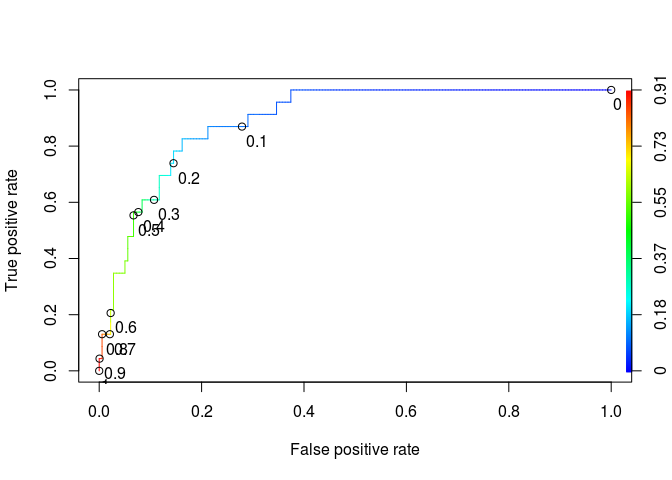

# Predicting Parole Violators


```r
library(dplyr)
```

```
## 
## Attaching package: 'dplyr'
```

```
## The following objects are masked from 'package:stats':
## 
##     filter, lag
```

```
## The following objects are masked from 'package:base':
## 
##     intersect, setdiff, setequal, union
```

```r
library(tidyr)
library(caret)
```

```
## Loading required package: lattice
```

```
## Loading required package: ggplot2
```

```r
library(ROCR)
```

```
## Loading required package: gplots
```

```
## 
## Attaching package: 'gplots'
```

```
## The following object is masked from 'package:stats':
## 
##     lowess
```

```r
df<- read.csv('parole.csv')

summary(df)
```

```
##       male             race            age            state      
##  Min.   :0.0000   Min.   :1.000   Min.   :18.40   Min.   :1.000  
##  1st Qu.:1.0000   1st Qu.:1.000   1st Qu.:25.35   1st Qu.:2.000  
##  Median :1.0000   Median :1.000   Median :33.70   Median :3.000  
##  Mean   :0.8074   Mean   :1.424   Mean   :34.51   Mean   :2.887  
##  3rd Qu.:1.0000   3rd Qu.:2.000   3rd Qu.:42.55   3rd Qu.:4.000  
##  Max.   :1.0000   Max.   :2.000   Max.   :67.00   Max.   :4.000  
##   time.served     max.sentence   multiple.offenses     crime      
##  Min.   :0.000   Min.   : 1.00   Min.   :0.0000    Min.   :1.000  
##  1st Qu.:3.250   1st Qu.:12.00   1st Qu.:0.0000    1st Qu.:1.000  
##  Median :4.400   Median :12.00   Median :1.0000    Median :2.000  
##  Mean   :4.198   Mean   :13.06   Mean   :0.5363    Mean   :2.059  
##  3rd Qu.:5.200   3rd Qu.:15.00   3rd Qu.:1.0000    3rd Qu.:3.000  
##  Max.   :6.000   Max.   :18.00   Max.   :1.0000    Max.   :4.000  
##     violator     
##  Min.   :0.0000  
##  1st Qu.:0.0000  
##  Median :0.0000  
##  Mean   :0.1156  
##  3rd Qu.:0.0000  
##  Max.   :1.0000
```

```r
table(df$violator)
```

```
## 
##   0   1 
## 597  78
```
Problem 2.1 - Preparing the Dataset
1 point possible (graded)
You should be familiar with unordered factors (if not, review the Week 2 homework problem "Reading Test Scores"). Which variables in this dataset are unordered factors with at least three levels? Select all that apply.


male
race
age
state
time.served
max.sentence
multiple.offenses
crime
violator
unanswered

```r
str(df)
```

```
## 'data.frame':	675 obs. of  9 variables:
##  $ male             : int  1 0 1 1 1 1 1 0 0 1 ...
##  $ race             : int  1 1 2 1 2 2 1 1 1 2 ...
##  $ age              : num  33.2 39.7 29.5 22.4 21.6 46.7 31 24.6 32.6 29.1 ...
##  $ state            : int  1 1 1 1 1 1 1 1 1 1 ...
##  $ time.served      : num  5.5 5.4 5.6 5.7 5.4 6 6 4.8 4.5 4.7 ...
##  $ max.sentence     : int  18 12 12 18 12 18 18 12 13 12 ...
##  $ multiple.offenses: int  0 0 0 0 0 0 0 0 0 0 ...
##  $ crime            : int  4 3 3 1 1 4 3 1 3 2 ...
##  $ violator         : int  0 0 0 0 0 0 0 0 0 0 ...
```

```r
table(df$race)
```

```
## 
##   1   2 
## 389 286
```

```r
summary(df)
```

```
##       male             race            age            state      
##  Min.   :0.0000   Min.   :1.000   Min.   :18.40   Min.   :1.000  
##  1st Qu.:1.0000   1st Qu.:1.000   1st Qu.:25.35   1st Qu.:2.000  
##  Median :1.0000   Median :1.000   Median :33.70   Median :3.000  
##  Mean   :0.8074   Mean   :1.424   Mean   :34.51   Mean   :2.887  
##  3rd Qu.:1.0000   3rd Qu.:2.000   3rd Qu.:42.55   3rd Qu.:4.000  
##  Max.   :1.0000   Max.   :2.000   Max.   :67.00   Max.   :4.000  
##   time.served     max.sentence   multiple.offenses     crime      
##  Min.   :0.000   Min.   : 1.00   Min.   :0.0000    Min.   :1.000  
##  1st Qu.:3.250   1st Qu.:12.00   1st Qu.:0.0000    1st Qu.:1.000  
##  Median :4.400   Median :12.00   Median :1.0000    Median :2.000  
##  Mean   :4.198   Mean   :13.06   Mean   :0.5363    Mean   :2.059  
##  3rd Qu.:5.200   3rd Qu.:15.00   3rd Qu.:1.0000    3rd Qu.:3.000  
##  Max.   :6.000   Max.   :18.00   Max.   :1.0000    Max.   :4.000  
##     violator     
##  Min.   :0.0000  
##  1st Qu.:0.0000  
##  Median :0.0000  
##  Mean   :0.1156  
##  3rd Qu.:0.0000  
##  Max.   :1.0000
```
Problem 2.2 - Preparing the Dataset
1 point possible (graded)
In the last subproblem, we identified variables that are unordered factors with at least 3 levels, so we need to convert them to factors for our prediction problem (we introduced this idea in the "Reading Test Scores" problem last week). Using the as.factor() function, convert these variables to factors. Keep in mind that we are not changing the values, just the way R understands them (the values are still numbers).

How does the output of summary() change for a factor variable as compared to a numerical variable?

```r
df$state<-as.factor(df$state)
df$crime<-as.factor(df$crime)
summary(df$state)
```

```
##   1   2   3   4 
## 143 120  82 330
```
Problem 3.1 - Splitting into a Training and Testing Set
1 point possible (graded)
To ensure consistent training/testing set splits, run the following 5 lines of code (do not include the line numbers at the beginning):

1) set.seed(144)

2) library(caTools)

3) split = sample.split(parole$violator, SplitRatio = 0.7)

4) train = subset(parole, split == TRUE)

5) test = subset(parole, split == FALSE)

Roughly what proportion of parolees have been allocated to the training and testing sets?

```r
set.seed(144)
library(caTools)

split = sample.split(df$violator, SplitRatio = 0.7)

df_train = subset(df, split == TRUE)

df_test= subset(df, split == FALSE)
# index<-createDataPartition(df$violator,p=.7,list=FALSE)
# df_train<-df[index,]
# df_test<-df[-index,]
# str(df_train)
```
Problem 4.1 - Building a Logistic Regression Model
1 point possible (graded)
If you tested other training/testing set splits in the previous section, please re-run the original 5 lines of code to obtain the original split.

Using glm (and remembering the parameter family="binomial"), train a logistic regression model on the training set. Your dependent variable is "violator", and you should use all of the other variables as independent variables.

What variables are significant in this model? Significant variables should have a least one star, or should have a probability less than 0.05 (the column Pr(>|z|) in the summary output). Select all that apply.

```r
model1<-glm(violator~.,data=df_train,family = binomial)
summary(model1)
```

```
## 
## Call:
## glm(formula = violator ~ ., family = binomial, data = df_train)
## 
## Deviance Residuals: 
##     Min       1Q   Median       3Q      Max  
## -1.7041  -0.4236  -0.2719  -0.1690   2.8375  
## 
## Coefficients:
##                     Estimate Std. Error z value Pr(>|z|)    
## (Intercept)       -4.2411574  1.2938852  -3.278  0.00105 ** 
## male               0.3869904  0.4379613   0.884  0.37690    
## race               0.8867192  0.3950660   2.244  0.02480 *  
## age               -0.0001756  0.0160852  -0.011  0.99129    
## state2             0.4433007  0.4816619   0.920  0.35739    
## state3             0.8349797  0.5562704   1.501  0.13335    
## state4            -3.3967878  0.6115860  -5.554 2.79e-08 ***
## time.served       -0.1238867  0.1204230  -1.029  0.30359    
## max.sentence       0.0802954  0.0553747   1.450  0.14705    
## multiple.offenses  1.6119919  0.3853050   4.184 2.87e-05 ***
## crime2             0.6837143  0.5003550   1.366  0.17180    
## crime3            -0.2781054  0.4328356  -0.643  0.52054    
## crime4            -0.0117627  0.5713035  -0.021  0.98357    
## ---
## Signif. codes:  0 '***' 0.001 '**' 0.01 '*' 0.05 '.' 0.1 ' ' 1
## 
## (Dispersion parameter for binomial family taken to be 1)
## 
##     Null deviance: 340.04  on 472  degrees of freedom
## Residual deviance: 251.48  on 460  degrees of freedom
## AIC: 277.48
## 
## Number of Fisher Scoring iterations: 6
```
Problem 4.2 - Building a Logistic Regression Model
1 point possible (graded)
What can we say based on the coefficient of the multiple.offenses variable?

The following two properties might be useful to you when answering this question:

1) If we have a coefficient c for a variable, then that means the log odds (or Logit) are increased by c for a unit increase in the variable.

2) If we have a coefficient c for a variable, then that means the odds are multiplied by e^c for a unit increase in the variable.

Problem 4.3 - Building a Logistic Regression Model
4.0 points possible (graded)
Consider a parolee who is male, of white race, aged 50 years at prison release, from the state of Maryland, served 3 months, had a maximum sentence of 12 months, did not commit multiple offenses, and committed a larceny. Answer the following questions based on the model's predictions for this individual. (HINT: You should use the coefficients of your model, the Logistic Response Function, and the Odds equation to solve this problem.)

According to the model, what are the odds this individual is a violator?


  unanswered  
According to the model, what is the probability this individual is a violator?
$$\begin{aligned}
Logit =& log(\frac{p}{1-p}) = log(odds) = -1.700629 \\
\frac{p}{1-p} =& e^{(Logit)} \\\\ 
(nb : e^{log(x)} =& x)\\\\

p =& (1-p)\times e^{Logit}\\
p \times (1+e^{Logit}) =& e^{Logit}\\
p =& \frac{e^{Logit}}{1+ e^{Logit}}\\
p =& \frac{e^{Logit}}{e^{Logit} \times ( 1+ \frac{1}{e^{Logit}})}\\
p =& \frac{e^{Logit}}{e^{Logit} \times ( 1+ e^{-Logit})}\\\\
(nb : 1/e^{x}=& e^{-x})\\\\
p =& \frac{1}{1 + e^{-Logit}}\\\\
Logit =& -1.700629 \\therefore: -Logit =& 1.700629\\\\
p =& \frac{1}{1 + e^{1.700629}}\\\\
\end{aligned}$$


  


```r
male=1
race=0
age=50
state=1
time.served = 3
max.sentence=12
multiple.offenses = 0
larceny=2

logit <-0
```
Problem 5.1 - Evaluating the Model on the Testing Set
1 point possible (graded)
Use the predict() function to obtain the model's predicted probabilities for parolees in the testing set, remembering to pass type="response".

What is the maximum predicted probability of a violation?

```r
prediction_test<-predict(model1,newdata = df_test,type='response')
max(prediction_test)
```

```
## [1] 0.9072791
```
Problem 5.2 - Evaluating the Model on the Testing Set
3 points possible (graded)
In the following questions, evaluate the model's predictions on the test set using a threshold of 0.5.

What is the model's sensitivity?


  unanswered  
What is the model's specificity?


  unanswered  
What is the model's accuracy?


  unanswered  
  

```r
table(df_test$violator,prediction_test>0.5)
```

```
##    
##     FALSE TRUE
##   0   167   12
##   1    11   12
```

```r
print(paste0("accuracy : ", (167+12)/(167+12+12+11)))
```

```
## [1] "accuracy : 0.886138613861386"
```

```r
print(paste0("sensitivity : ", (12)/(12+11)))
```

```
## [1] "sensitivity : 0.521739130434783"
```

```r
print(paste0("specificity : ", (167)/(167+12)))
```

```
## [1] "specificity : 0.932960893854749"
```
Problem 5.3 - Evaluating the Model on the Testing Set
1 point possible (graded)
What is the accuracy of a simple model that predicts that every parolee is a non-violator?

```r
print(paste0('Baseline accuracy : ', (167+12)/(167+12+11+12)))
```

```
## [1] "Baseline accuracy : 0.886138613861386"
```
Problem 5.4 - Evaluating the Model on the Testing Set
1 point possible (graded)
Consider a parole board using the model to predict whether parolees will be violators or not. The job of a parole board is to make sure that a prisoner is ready to be released into free society, and therefore parole boards tend to be particularily concerned about releasing prisoners who will violate their parole. Which of the following most likely describes their preferences and best course of action?


```r
# Prediction function
ROCRpred = prediction(prediction_test, df_test$violator)

auc.tmp <- performance(ROCRpred,"auc"); auc <- as.numeric(auc.tmp@y.values)
auc
```

```
## [1] 0.8945834
```

```r
# Performance function
ROCRperf = performance(ROCRpred, "tpr", "fpr")


# Add threshold labels 
plot(ROCRperf, colorize=TRUE, print.cutoffs.at=seq(0,1,by=0.1), text.adj=c(-0.2,1.7))
```

<!-- -->

