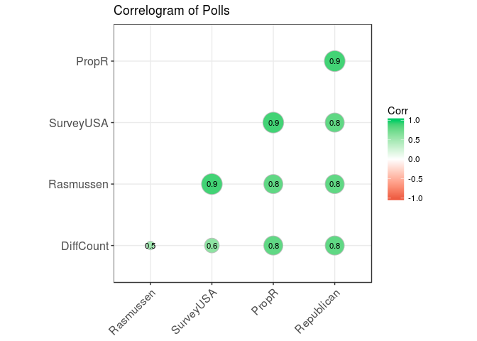
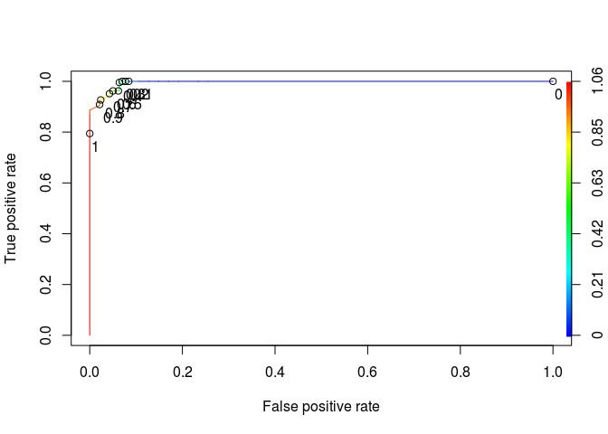
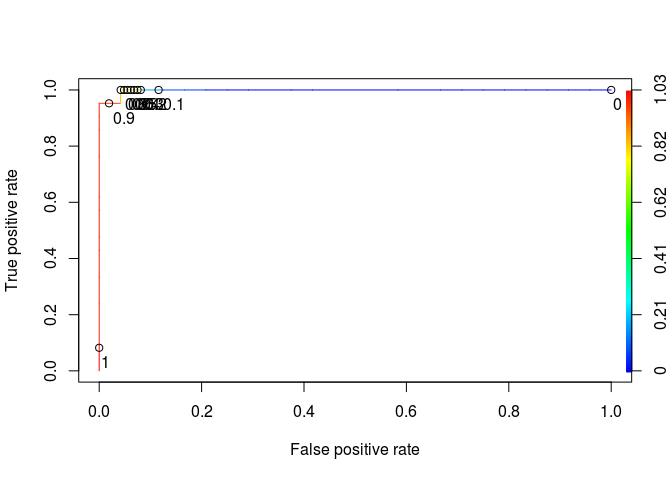

# US Elections


```r
library(ggplot2)
library(dplyr)
```

```
## 
## Attaching package: 'dplyr'
```

```
## The following objects are masked from 'package:stats':
## 
##     filter, lag
```

```
## The following objects are masked from 'package:base':
## 
##     intersect, setdiff, setequal, union
```

```r
library(tidyr)
library(caret)
```

```
## Loading required package: lattice
```

```r
library(ggcorrplot)
library(ROCR)
```

```
## Loading required package: gplots
```

```
## 
## Attaching package: 'gplots'
```

```
## The following object is masked from 'package:stats':
## 
##     lowess
```


```r
polling<-read.csv('PollingData.csv')
str(polling)
```

```
## 'data.frame':	145 obs. of  7 variables:
##  $ State     : Factor w/ 50 levels "Alabama","Alaska",..: 1 1 2 2 3 3 3 4 4 4 ...
##  $ Year      : int  2004 2008 2004 2008 2004 2008 2012 2004 2008 2012 ...
##  $ Rasmussen : int  11 21 NA 16 5 5 8 7 10 NA ...
##  $ SurveyUSA : int  18 25 NA NA 15 NA NA 5 NA NA ...
##  $ DiffCount : int  5 5 1 6 8 9 4 8 5 2 ...
##  $ PropR     : num  1 1 1 1 1 ...
##  $ Republican: int  1 1 1 1 1 1 1 1 1 1 ...
```

```r
library(mice)
```

```
## 
## Attaching package: 'mice'
```

```
## The following object is masked from 'package:tidyr':
## 
##     complete
```

```r
simple<-polling[c('Rasmussen','SurveyUSA','DiffCount','PropR')]
set.seed(144)
imputed<-mice::complete(mice(simple))
```

```
## 
##  iter imp variable
##   1   1  Rasmussen  SurveyUSA
##   1   2  Rasmussen  SurveyUSA
##   1   3  Rasmussen  SurveyUSA
##   1   4  Rasmussen  SurveyUSA
##   1   5  Rasmussen  SurveyUSA
##   2   1  Rasmussen  SurveyUSA
##   2   2  Rasmussen  SurveyUSA
##   2   3  Rasmussen  SurveyUSA
##   2   4  Rasmussen  SurveyUSA
##   2   5  Rasmussen  SurveyUSA
##   3   1  Rasmussen  SurveyUSA
##   3   2  Rasmussen  SurveyUSA
##   3   3  Rasmussen  SurveyUSA
##   3   4  Rasmussen  SurveyUSA
##   3   5  Rasmussen  SurveyUSA
##   4   1  Rasmussen  SurveyUSA
##   4   2  Rasmussen  SurveyUSA
##   4   3  Rasmussen  SurveyUSA
##   4   4  Rasmussen  SurveyUSA
##   4   5  Rasmussen  SurveyUSA
##   5   1  Rasmussen  SurveyUSA
##   5   2  Rasmussen  SurveyUSA
##   5   3  Rasmussen  SurveyUSA
##   5   4  Rasmussen  SurveyUSA
##   5   5  Rasmussen  SurveyUSA
```

```r
polling$Rasmussen<-imputed$Rasmussen
polling$SurveyUSA<-imputed$SurveyUSA

head(polling)
```

```
##     State Year Rasmussen SurveyUSA DiffCount PropR Republican
## 1 Alabama 2004        11        18         5     1          1
## 2 Alabama 2008        21        25         5     1          1
## 3  Alaska 2004        19        21         1     1          1
## 4  Alaska 2008        16        12         6     1          1
## 5 Arizona 2004         5        15         8     1          1
## 6 Arizona 2008         5         8         9     1          1
```

```r
str(polling)
```

```
## 'data.frame':	145 obs. of  7 variables:
##  $ State     : Factor w/ 50 levels "Alabama","Alaska",..: 1 1 2 2 3 3 3 4 4 4 ...
##  $ Year      : int  2004 2008 2004 2008 2004 2008 2012 2004 2008 2012 ...
##  $ Rasmussen : int  11 21 19 16 5 5 8 7 10 16 ...
##  $ SurveyUSA : int  18 25 21 12 15 8 8 5 7 21 ...
##  $ DiffCount : int  5 5 1 6 8 9 4 8 5 2 ...
##  $ PropR     : num  1 1 1 1 1 ...
##  $ Republican: int  1 1 1 1 1 1 1 1 1 1 ...
```

```r
df_train<- polling %>% filter(Year<2012)
df_test<- polling %>% filter(Year==2012)
```

Basic Baseline : always predict republican wins :

```r
table(df_train$Republican,rep(1,nrow(df_train)))
```

```
##    
##      1
##   0 47
##   1 53
```

Better baseline : use the sign of Rasmussen poll:

```r
table(df_train$Republican,sign(df_train$Rasmussen))
```

```
##    
##     -1  0  1
##   0 42  1  4
##   1  0  1 52
```
Correlation Matrix

```r
filtered_train<-select(df_train,-one_of(c('Year','State')))
corr <- round(cor(filtered_train), 1)

# Plot
ggcorrplot(corr, hc.order = TRUE, 
           type = "lower", 
           lab = TRUE, 
           lab_size = 3, 
           method="circle", 
           colors = c("tomato2", "white", "springgreen3"), 
           title="Correlogram of Polls", 
           ggtheme=theme_bw)
```

<!-- -->

```r
model1<-glm(Republican~PropR,data=df_train,family = binomial)
summary(model1)
```

```
## 
## Call:
## glm(formula = Republican ~ PropR, family = binomial, data = df_train)
## 
## Deviance Residuals: 
##      Min        1Q    Median        3Q       Max  
## -2.22880  -0.06541   0.10260   0.10260   1.37392  
## 
## Coefficients:
##             Estimate Std. Error z value Pr(>|z|)    
## (Intercept)   -6.146      1.977  -3.108 0.001882 ** 
## PropR         11.390      3.153   3.613 0.000303 ***
## ---
## Signif. codes:  0 '***' 0.001 '**' 0.01 '*' 0.05 '.' 0.1 ' ' 1
## 
## (Dispersion parameter for binomial family taken to be 1)
## 
##     Null deviance: 138.269  on 99  degrees of freedom
## Residual deviance:  15.772  on 98  degrees of freedom
## AIC: 19.772
## 
## Number of Fisher Scoring iterations: 8
```

```r
predict1<-predict(model1,newdata=df_train,type = 'response')
str(predict1)
```

```
##  Named num [1:100] 0.995 0.995 0.995 0.995 0.995 ...
##  - attr(*, "names")= chr [1:100] "1" "2" "3" "4" ...
```

```r
# Prediction function
ROCRpred = prediction(predict1, df_train$Republican)

auc.tmp <- performance(ROCRpred,"auc"); auc <- as.numeric(auc.tmp@y.values)
auc
```

```
## [1] 0.9955841
```

```r
# Performance function
ROCRperf = performance(ROCRpred, "tpr", "fpr")


# Add threshold labels 
plot(ROCRperf, colorize=TRUE, print.cutoffs.at=seq(0,1,by=0.1), text.adj=c(-0.2,1.7))
```

<!-- -->


```r
model2<-glm(Republican~PropR+SurveyUSA,data=df_train,family = binomial)
summary(model2)
```

```
## 
## Call:
## glm(formula = Republican ~ PropR + SurveyUSA, family = binomial, 
##     data = df_train)
## 
## Deviance Residuals: 
##      Min        1Q    Median        3Q       Max  
## -2.20920  -0.06689   0.09313   0.10924   1.39194  
## 
## Coefficients:
##             Estimate Std. Error z value Pr(>|z|)  
## (Intercept) -6.48069    2.98556  -2.171   0.0300 *
## PropR       12.02594    5.27618   2.279   0.0226 *
## SurveyUSA   -0.02371    0.14998  -0.158   0.8744  
## ---
## Signif. codes:  0 '***' 0.001 '**' 0.01 '*' 0.05 '.' 0.1 ' ' 1
## 
## (Dispersion parameter for binomial family taken to be 1)
## 
##     Null deviance: 138.269  on 99  degrees of freedom
## Residual deviance:  15.748  on 97  degrees of freedom
## AIC: 21.748
## 
## Number of Fisher Scoring iterations: 8
```

```r
predict2<-predict(model2,newdata=df_test,type = 'response')
str(predict2)
```

```
##  Named num [1:45] 0.96615 0.99362 0.00213 0.06105 0.00208 ...
##  - attr(*, "names")= chr [1:45] "1" "2" "3" "4" ...
```

```r
# Prediction function
ROCRpred = prediction(predict2, df_test$Republican)

auc.tmp <- performance(ROCRpred,"auc"); auc <- as.numeric(auc.tmp@y.values)
auc
```

```
## [1] 0.9980159
```

```r
# Performance function
ROCRperf = performance(ROCRpred, "tpr", "fpr")


# Add threshold labels 
plot(ROCRperf, colorize=TRUE, print.cutoffs.at=seq(0,1,by=0.1), text.adj=c(-0.2,1.7))
```

<!-- -->

