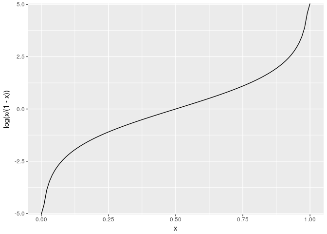
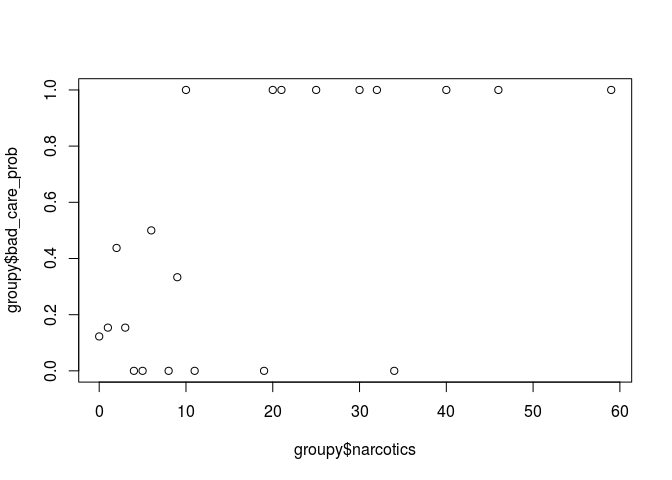
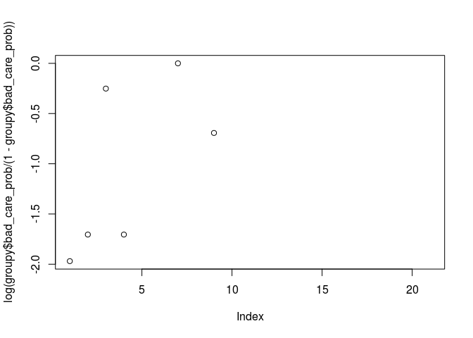
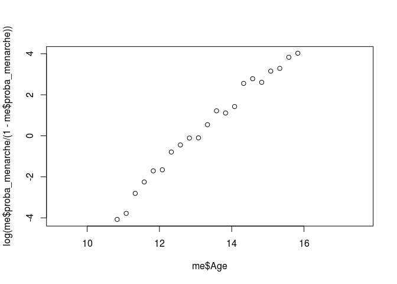

# Logit

This is an [R Markdown](http://rmarkdown.rstudio.com) Notebook. When you execute code within the notebook, the results appear beneath the code. 

Try executing this chunk by clicking the *Run* button within the chunk or by placing your cursor inside it and pressing *Ctrl+Shift+Enter*. 


```r
library(ggplot2)
library(dplyr)
```

```
## 
## Attaching package: 'dplyr'
```

```
## The following objects are masked from 'package:stats':
## 
##     filter, lag
```

```
## The following objects are masked from 'package:base':
## 
##     intersect, setdiff, setequal, union
```

```r
library(tidyr)
library(caret)
```

```
## Loading required package: lattice
```

```r
x<- seq(0,1,length.out = 100)
df<-data.frame(x)
ggplot(df,aes(x=x,y=log(x/(1-x))))+geom_line()
```

<!-- -->


```r
df<-read.csv('quality.csv')
index<-createDataPartition(df$PoorCare,p=.75,list=FALSE)
df_train<-df[index,]
df_test<-df[-index,]
```


```r
groupy <- df %>% group_by(Narcotics,PoorCare) %>%summarise(total=n())
groupy <- groupy %>% spread(PoorCare,total,fill = 0) %>% setNames( c("narcotics", "good_care", "bad_care") )
groupy<- groupy %>% mutate(bad_care_prob = bad_care /(bad_care+good_care))
plot(groupy$bad_care_prob~groupy$narcotics)
```

<!-- -->

```r
plot(log(groupy$bad_care_prob/(1-groupy$bad_care_prob)))
```

<!-- -->


```r
library(MASS)
```

```
## 
## Attaching package: 'MASS'
```

```
## The following object is masked from 'package:dplyr':
## 
##     select
```

```r
data("menarche")
me<-menarche
me$menarche<-me$Menarche
me$no_mearche<-me$Total -me$Menarche
me$proba_menarche<- me$menarche/me$Total
plot(me$Age,log(me$proba_menarche/(1-me$proba_menarche)))
```

<!-- -->
**Framingham Study**

```r
fram<-read.csv('framingham.csv')
set.seed(1000)
index<- createDataPartition(fram$TenYearCHD,p=0.65,list=FALSE)
fram_train<-fram[index,]
fram_test<-fram[-index,]
```


```r
model1<-glm(TenYearCHD ~.,data=fram_train,family='binomial')
summary(model1)
```

```
## 
## Call:
## glm(formula = TenYearCHD ~ ., family = "binomial", data = fram_train)
## 
## Deviance Residuals: 
##     Min       1Q   Median       3Q      Max  
## -1.8629  -0.5856  -0.4235  -0.2846   2.8356  
## 
## Coefficients:
##                  Estimate Std. Error z value Pr(>|z|)    
## (Intercept)     -8.300944   0.903780  -9.185  < 2e-16 ***
## male             0.596294   0.136374   4.373 1.23e-05 ***
## age              0.057939   0.008391   6.905 5.01e-12 ***
## education       -0.021378   0.060903  -0.351  0.72558    
## currentSmoker    0.270428   0.191566   1.412  0.15805    
## cigsPerDay       0.012646   0.007592   1.666  0.09580 .  
## BPMeds           0.356956   0.286262   1.247  0.21241    
## prevalentStroke -0.108829   0.702749  -0.155  0.87693    
## prevalentHyp     0.334698   0.175419   1.908  0.05639 .  
## diabetes        -0.329429   0.439925  -0.749  0.45396    
## totChol          0.002226   0.001461   1.524  0.12741    
## sysBP            0.013802   0.004973   2.775  0.00551 ** 
## diaBP           -0.004165   0.008174  -0.510  0.61037    
## BMI              0.017454   0.016156   1.080  0.27998    
## heartRate       -0.003907   0.005302  -0.737  0.46122    
## glucose          0.008094   0.002845   2.845  0.00444 ** 
## ---
## Signif. codes:  0 '***' 0.001 '**' 0.01 '*' 0.05 '.' 0.1 ' ' 1
## 
## (Dispersion parameter for binomial family taken to be 1)
## 
##     Null deviance: 1980.9  on 2380  degrees of freedom
## Residual deviance: 1762.9  on 2365  degrees of freedom
##   (375 observations deleted due to missingness)
## AIC: 1794.9
## 
## Number of Fisher Scoring iterations: 5
```

```r
prediction1<-predict(model1,newdata = fram_test,type = 'response')
str(prediction1)
```

```
##  Named num [1:1484] 0.0413 0.1241 0.0612 0.0405 0.0961 ...
##  - attr(*, "names")= chr [1:1484] "1" "6" "8" "12" ...
```

```r
table(fram_test$TenYearCHD,prediction1>0.5)
```

```
##    
##     FALSE TRUE
##   0  1066    2
##   1   194   15
```
Compare with Baseline


