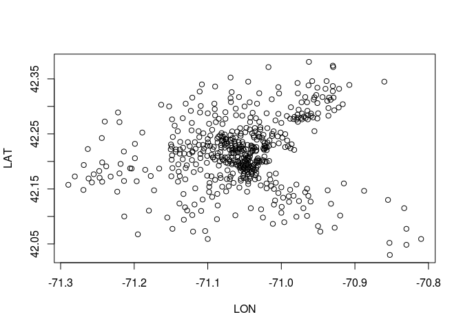
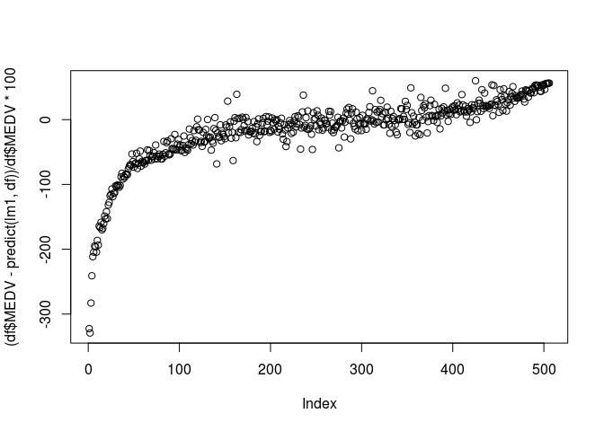
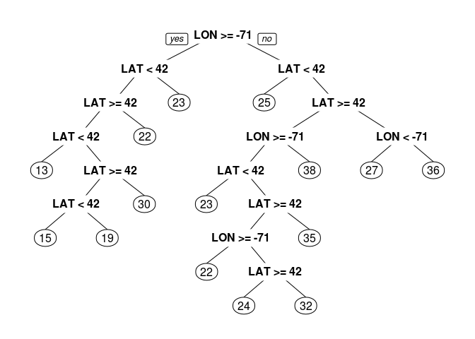
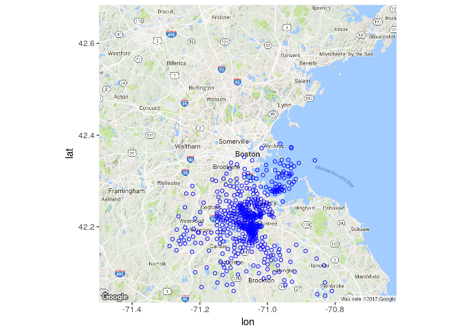

# Boston Housing


```r
library(dplyr)
```

```
## 
## Attaching package: 'dplyr'
```

```
## The following objects are masked from 'package:stats':
## 
##     filter, lag
```

```
## The following objects are masked from 'package:base':
## 
##     intersect, setdiff, setequal, union
```

```r
library(tidyr)
library(caret)
```

```
## Loading required package: lattice
```

```
## Loading required package: ggplot2
```

```r
library(ROCR)
```

```
## Loading required package: gplots
```

```
## 
## Attaching package: 'gplots'
```

```
## The following object is masked from 'package:stats':
## 
##     lowess
```

```r
library(caTools)
library(rpart)
library(rpart.plot)
library(randomForest)
```

```
## randomForest 4.6-12
```

```
## Type rfNews() to see new features/changes/bug fixes.
```

```
## 
## Attaching package: 'randomForest'
```

```
## The following object is masked from 'package:ggplot2':
## 
##     margin
```

```
## The following object is masked from 'package:dplyr':
## 
##     combine
```

```r
library(e1071)
library(ggmap)
library(proj4)
```


```r
df<-read.csv('boston.csv')
str(df)
```

```
## 'data.frame':	506 obs. of  16 variables:
##  $ TOWN   : Factor w/ 92 levels "Arlington","Ashland",..: 54 77 77 46 46 46 69 69 69 69 ...
##  $ TRACT  : int  2011 2021 2022 2031 2032 2033 2041 2042 2043 2044 ...
##  $ LON    : num  -71 -71 -70.9 -70.9 -70.9 ...
##  $ LAT    : num  42.3 42.3 42.3 42.3 42.3 ...
##  $ MEDV   : num  24 21.6 34.7 33.4 36.2 28.7 22.9 22.1 16.5 18.9 ...
##  $ CRIM   : num  0.00632 0.02731 0.02729 0.03237 0.06905 ...
##  $ ZN     : num  18 0 0 0 0 0 12.5 12.5 12.5 12.5 ...
##  $ INDUS  : num  2.31 7.07 7.07 2.18 2.18 2.18 7.87 7.87 7.87 7.87 ...
##  $ CHAS   : int  0 0 0 0 0 0 0 0 0 0 ...
##  $ NOX    : num  0.538 0.469 0.469 0.458 0.458 0.458 0.524 0.524 0.524 0.524 ...
##  $ RM     : num  6.58 6.42 7.18 7 7.15 ...
##  $ AGE    : num  65.2 78.9 61.1 45.8 54.2 58.7 66.6 96.1 100 85.9 ...
##  $ DIS    : num  4.09 4.97 4.97 6.06 6.06 ...
##  $ RAD    : int  1 2 2 3 3 3 5 5 5 5 ...
##  $ TAX    : int  296 242 242 222 222 222 311 311 311 311 ...
##  $ PTRATIO: num  15.3 17.8 17.8 18.7 18.7 18.7 15.2 15.2 15.2 15.2 ...
```

```r
plot(LAT~LON,df)
```

<!-- -->
Use LAT and LON for Linear regression

```r
lm1<-lm(MEDV ~LAT+LON, data=df)
df<-df %>% arrange(MEDV)
df<- df %>% mutate(prediction_lm1= predict(lm1,df))
plot((df$MEDV-predict(lm1,df))/df$MEDV*100)
```

<!-- -->

```r
summary(lm1)
```

```
## 
## Call:
## lm(formula = MEDV ~ LAT + LON, data = df)
## 
## Residuals:
##     Min      1Q  Median      3Q     Max 
## -16.460  -5.590  -1.299   3.695  28.129 
## 
## Coefficients:
##              Estimate Std. Error t value Pr(>|t|)    
## (Intercept) -3178.472    484.937  -6.554 1.39e-10 ***
## LAT             8.046      6.327   1.272    0.204    
## LON           -40.268      5.184  -7.768 4.50e-14 ***
## ---
## Signif. codes:  0 '***' 0.001 '**' 0.01 '*' 0.05 '.' 0.1 ' ' 1
## 
## Residual standard error: 8.693 on 503 degrees of freedom
## Multiple R-squared:  0.1072,	Adjusted R-squared:  0.1036 
## F-statistic: 30.19 on 2 and 503 DF,  p-value: 4.159e-13
```
Using Regression Tree

```r
treeLatLon <- rpart(MEDV ~ LAT+LON, data=df)
prp(treeLatLon)
```

<!-- -->

```r
df_MEDV_median_over<- df%>% filter(MEDV > median(MEDV))
df_MEDV_median_under<- df%>% filter(MEDV < median(MEDV))
dim(df_MEDV_median_over)
```

```
## [1] 250  17
```

```r
str(df_MEDV_median_over)
```

```
## 'data.frame':	250 obs. of  17 variables:
##  $ TOWN          : Factor w/ 92 levels "Arlington","Ashland",..: 92 90 33 10 13 24 82 77 64 69 ...
##  $ TRACT         : int  3332 3382 3426 1009 1207 3529 3703 2021 4176 2047 ...
##  $ LON           : num  -71.1 -71.1 -71 -71 -71.1 ...
##  $ LAT           : num  42.3 42.3 42.2 42.2 42.2 ...
##  $ MEDV          : num  21.4 21.4 21.4 21.4 21.4 21.5 21.5 21.6 21.6 21.7 ...
##  $ CRIM          : num  0.0951 0.115 0.169 7.8393 14.3337 ...
##  $ ZN            : num  0 0 0 0 0 0 0 0 0 12.5 ...
##  $ INDUS         : num  12.83 2.89 25.65 18.1 18.1 ...
##  $ CHAS          : int  0 0 0 0 0 0 1 0 0 0 ...
##  $ NOX           : num  0.437 0.445 0.581 0.655 0.614 0.871 0.55 0.469 0.544 0.524 ...
##  $ RM            : num  6.29 6.16 5.99 6.21 6.23 ...
##  $ AGE           : num  45 69.6 88.4 65.4 88 97.3 93.8 78.9 82.8 39 ...
##  $ DIS           : num  4.5 3.5 1.99 2.96 1.95 ...
##  $ RAD           : int  5 2 2 24 24 5 5 2 4 5 ...
##  $ TAX           : int  398 276 188 666 666 403 276 242 304 311 ...
##  $ PTRATIO       : num  18.7 18 19.1 20.2 20.2 14.7 16.4 17.8 18.4 15.2 ...
##  $ prediction_lm1: num  24.9 24.2 21.5 21.6 22.8 ...
```


```r
sqmap <- get_map(location = 'Boston', source = "google")
```

```
## Map from URL : http://maps.googleapis.com/maps/api/staticmap?center=Boston&zoom=10&size=640x640&scale=2&maptype=terrain&language=en-EN&sensor=false
```

```
## Information from URL : http://maps.googleapis.com/maps/api/geocode/json?address=Boston&sensor=false
```

```r
ggmap(sqmap) +geom_point(data = df,  aes(x =LON, y= LAT),shape=1,color='blue') 
```

```
## Warning: Removed 1 rows containing missing values (geom_point).
```

<!-- -->
Wonderful ! The projection used in the dataset seems to be UTM19N instead of WGS84 used by Google.
See :http://gis.stackexchange.com/questions/148048/projection-of-boston-housing-data
use proj4 to convert coordinates. 
Tried it, did not work, does not seem to be UTM 19N coordinates.


Compare Linear Regression with Regression Tree:

```r
set.seed(123)
split = sample.split(df$MEDV, SplitRatio = 0.7)
train = subset(df, split==TRUE)
test = subset(df, split==FALSE)

# Create linear regression
linreg = lm(MEDV ~ LAT + LON + CRIM + ZN + INDUS + CHAS + NOX + RM + AGE + DIS + RAD + TAX + PTRATIO, data=train)
summary(linreg)
```

```
## 
## Call:
## lm(formula = MEDV ~ LAT + LON + CRIM + ZN + INDUS + CHAS + NOX + 
##     RM + AGE + DIS + RAD + TAX + PTRATIO, data = train)
## 
## Residuals:
##     Min      1Q  Median      3Q     Max 
## -15.456  -3.121  -0.650   2.079  35.926 
## 
## Coefficients:
##               Estimate Std. Error t value Pr(>|t|)    
## (Intercept) -338.65779  437.29189  -0.774 0.439191    
## LAT            0.49046    5.44877   0.090 0.928329    
## LON           -4.92268    4.74501  -1.037 0.300245    
## CRIM          -0.23739    0.06496  -3.655 0.000297 ***
## ZN             0.04605    0.01938   2.376 0.018022 *  
## INDUS         -0.12676    0.08679  -1.460 0.145058    
## CHAS           4.37741    1.18274   3.701 0.000249 ***
## NOX          -22.21029    5.85645  -3.792 0.000176 ***
## RM             5.41206    0.49384  10.959  < 2e-16 ***
## AGE           -0.05312    0.01774  -2.995 0.002944 ** 
## DIS           -1.89310    0.29827  -6.347 6.80e-10 ***
## RAD            0.32274    0.10064   3.207 0.001466 ** 
## TAX           -0.01425    0.00549  -2.595 0.009870 ** 
## PTRATIO       -0.86969    0.19948  -4.360 1.71e-05 ***
## ---
## Signif. codes:  0 '***' 0.001 '**' 0.01 '*' 0.05 '.' 0.1 ' ' 1
## 
## Residual standard error: 5.699 on 350 degrees of freedom
## Multiple R-squared:  0.6524,	Adjusted R-squared:  0.6395 
## F-statistic: 50.53 on 13 and 350 DF,  p-value: < 2.2e-16
```

```r
# Make predictions
linreg.pred = predict(linreg, newdata=test)
linreg.sse = sum((linreg.pred - test$MEDV)^2)
linreg.sse
```

```
## [1] 2844.351
```


