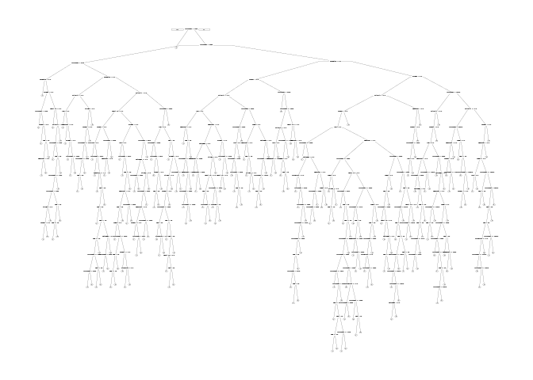

# Claims


```r
library(dplyr)
```

```
## 
## Attaching package: 'dplyr'
```

```
## The following objects are masked from 'package:stats':
## 
##     filter, lag
```

```
## The following objects are masked from 'package:base':
## 
##     intersect, setdiff, setequal, union
```

```r
library(tidyr)
library(caret)
```

```
## Loading required package: lattice
```

```
## Loading required package: ggplot2
```

```r
library(ROCR)
```

```
## Loading required package: gplots
```

```
## 
## Attaching package: 'gplots'
```

```
## The following object is masked from 'package:stats':
## 
##     lowess
```

```r
library(caTools)
library(rpart)
library(rpart.plot)
library(randomForest)
```

```
## randomForest 4.6-12
```

```
## Type rfNews() to see new features/changes/bug fixes.
```

```
## 
## Attaching package: 'randomForest'
```

```
## The following object is masked from 'package:ggplot2':
## 
##     margin
```

```
## The following object is masked from 'package:dplyr':
## 
##     combine
```

```r
library(e1071)
```


```r
df<-read.csv('ClaimsData.csv')
```


```r
set.seed(88)

splt = sample.split(df$bucket2009,SplitRatio = 0.6)
df_train <- df[splt,]
df_test <- df[!splt,]

mean(df_train$age)
```

```
## [1] 72.63773
```

```r
unique(df_train$diabetes)
```

```
## [1] 0 1
```

```r
sum(df_train$diabetes)/nrow(df_train)
```

```
## [1] 0.3808983
```
Compute Smart Baseline (bucket2009 == bucket2008)

```r
baseline <- df_test$bucket2008==df_test$bucket2009
sum(baseline)/nrow(df_test)
```

```
## [1] 0.6838135
```

```r
table(df_test$bucket2009,df_test$bucket2008)
```

```
##    
##          1      2      3      4      5
##   1 110138   7787   3427   1452    174
##   2  16000  10721   4629   2931    559
##   3   7006   4629   2774   1621    360
##   4   2688   1943   1415   1539    352
##   5    293    191    160    309    104
```
Create Penalty matrix

```r
# Penalty Matrix
PenaltyMatrix <- matrix(c(0,1,2,3,4,2,0,1,2,3,4,2,0,1,2,6,4,2,0,1,8,6,4,2,0), byrow=TRUE, nrow=5)
PenaltyMatrix 
```

```
##      [,1] [,2] [,3] [,4] [,5]
## [1,]    0    1    2    3    4
## [2,]    2    0    1    2    3
## [3,]    4    2    0    1    2
## [4,]    6    4    2    0    1
## [5,]    8    6    4    2    0
```

Multiply Classification Matrix * Penalty Matrix

```r
CM <-as.matrix(table(df_test$bucket2009,df_test$bucket2008))
product1<-CM * PenaltyMatrix
product2<- PenaltyMatrix *CM

product1
```

```
##    
##         1     2     3     4     5
##   1     0  7787  6854  4356   696
##   2 32000     0  4629  5862  1677
##   3 28024  9258     0  1621   720
##   4 16128  7772  2830     0   352
##   5  2344  1146   640   618     0
```

```r
product2
```

```
##    
##         1     2     3     4     5
##   1     0  7787  6854  4356   696
##   2 32000     0  4629  5862  1677
##   3 28024  9258     0  1621   720
##   4 16128  7772  2830     0   352
##   5  2344  1146   640   618     0
```

```r
sum(product1)/nrow(df_test)
```

```
## [1] 0.7386055
```
With most frequent bucket as Baseline

```r
df_test$simple_baseline<-1
CM_simple_baseline <-table(df_test$bucket2009,df_test$simple_baseline)
122978/ nrow(df_test)
```

```
## [1] 0.67127
```

```r
CM_simple_baseline<- cbind(CM_simple_baseline,cbind(matrix(0, nrow = 5, ncol = 4)))
CM_simple_baseline
```

```
##        1        
## 1 122978 0 0 0 0
## 2  34840 0 0 0 0
## 3  16390 0 0 0 0
## 4   7937 0 0 0 0
## 5   1057 0 0 0 0
```

```r
sum(CM_simple_baseline * PenaltyMatrix) / nrow(df_test)
```

```
## [1] 1.044301
```

```r
ClaimsTree = rpart(bucket2009 ~ age + alzheimers + arthritis + cancer + copd + depression + diabetes + heart.failure + ihd + kidney + osteoporosis + stroke + bucket2008 + reimbursement2008, data=df_train, method="class", cp=0.00005)
prp(ClaimsTree)
```

```
## Warning: labs do not fit even at cex 0.15, there may be some overplotting
```

<!-- -->


```r
prediction<- predict(ClaimsTree,newdata = df_test,type='class')
CM<-table(df_test$bucket2009,prediction)
CM
```

```
##    prediction
##          1      2      3      4      5
##   1 114141   8610    124    103      0
##   2  18409  16102    187    142      0
##   3   8027   8146    118     99      0
##   4   3099   4584     53    201      0
##   5    351    657      4     45      0
```

```r
sum(diag(CM))/sum(CM)
```

```
## [1] 0.7126669
```

```r
sum(CM*PenaltyMatrix)/nrow(df_test)
```

```
## [1] 0.7578902
```


Add Loss

```r
model_loss<-rpart(bucket2009 ~ age + alzheimers + arthritis + cancer + copd + depression + diabetes + heart.failure + ihd + kidney + osteoporosis + stroke + bucket2008 + reimbursement2008, data =df_train, method = 'class', cp=0.00005, parms = list(loss=PenaltyMatrix) )
```
Compute accuracy and Penalty

```r
prediction_loss <- predict(model_loss, newdata=df_test, type = 'class')
CM_loss <- table(df_test$bucket2009,prediction_loss)
CM_loss
```

```
##    prediction_loss
##         1     2     3     4     5
##   1 94310 25295  3087   286     0
##   2  7176 18942  8079   643     0
##   3  3590  7706  4692   401     1
##   4  1304  3193  2803   636     1
##   5   135   356   408   156     2
```

```r
PenaltyMatrix
```

```
##      [,1] [,2] [,3] [,4] [,5]
## [1,]    0    1    2    3    4
## [2,]    2    0    1    2    3
## [3,]    4    2    0    1    2
## [4,]    6    4    2    0    1
## [5,]    8    6    4    2    0
```

```r
sum(diag(CM_loss))/nrow(df_test)
```

```
## [1] 0.6472746
```

```r
sum(CM_loss*PenaltyMatrix)/nrow(df_test)
```

```
## [1] 0.6418161
```

