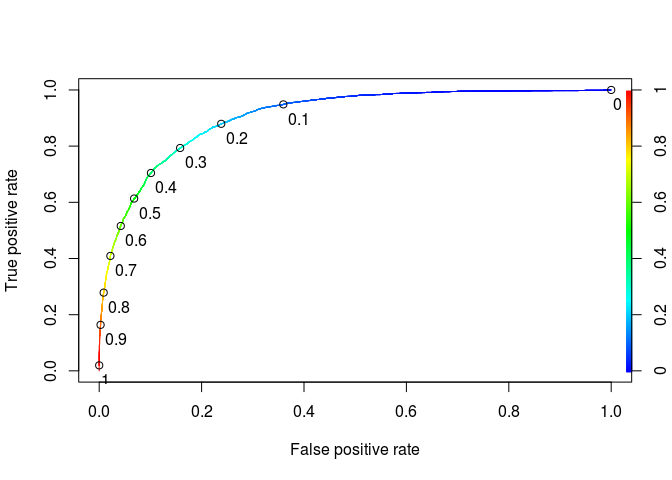
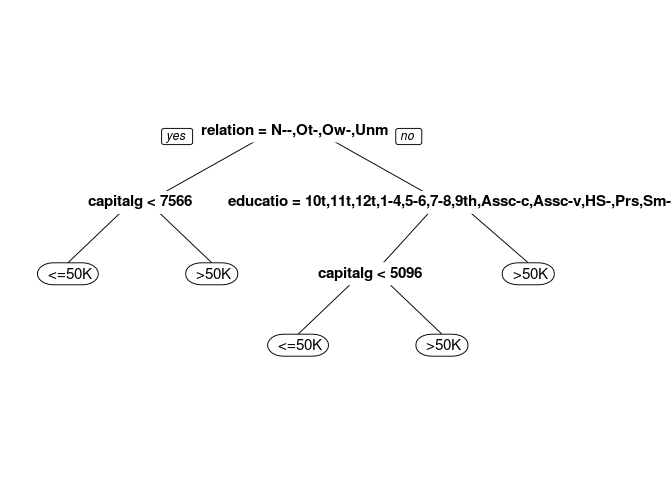
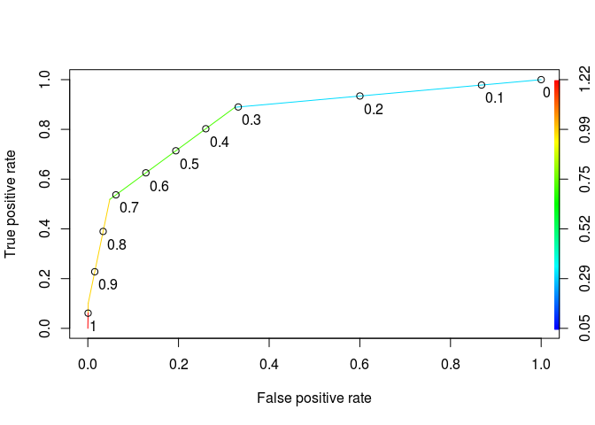
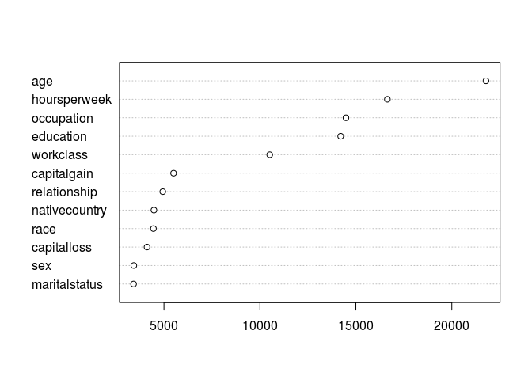
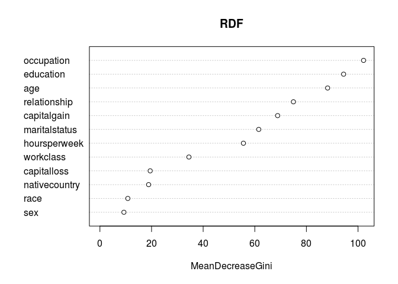
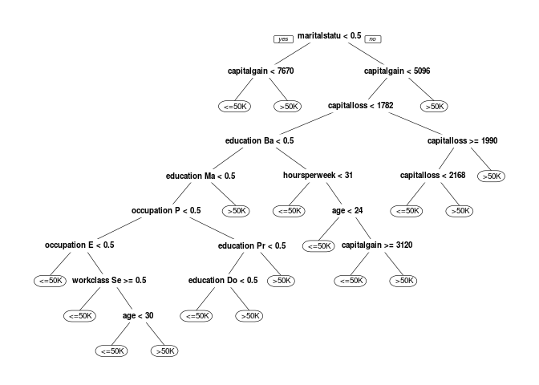
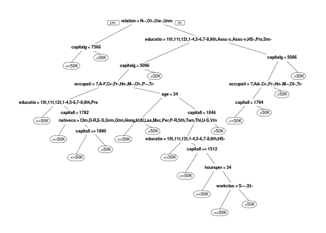

# Predicting Earnings from Census Data


```r
library(dplyr)
```

```
## 
## Attaching package: 'dplyr'
```

```
## The following objects are masked from 'package:stats':
## 
##     filter, lag
```

```
## The following objects are masked from 'package:base':
## 
##     intersect, setdiff, setequal, union
```

```r
library(tidyr)
library(caret)
```

```
## Loading required package: lattice
```

```
## Loading required package: ggplot2
```

```r
library(ROCR)
```

```
## Loading required package: gplots
```

```
## 
## Attaching package: 'gplots'
```

```
## The following object is masked from 'package:stats':
## 
##     lowess
```

```r
library(caTools)
library(rpart)
library(rpart.plot)
library(e1071)
```

```r
df<-read.csv('census.csv')
str(df)
```

```
## 'data.frame':	31978 obs. of  13 variables:
##  $ age          : int  39 50 38 53 28 37 49 52 31 42 ...
##  $ workclass    : Factor w/ 9 levels " ?"," Federal-gov",..: 8 7 5 5 5 5 5 7 5 5 ...
##  $ education    : Factor w/ 16 levels " 10th"," 11th",..: 10 10 12 2 10 13 7 12 13 10 ...
##  $ maritalstatus: Factor w/ 7 levels " Divorced"," Married-AF-spouse",..: 5 3 1 3 3 3 4 3 5 3 ...
##  $ occupation   : Factor w/ 15 levels " ?"," Adm-clerical",..: 2 5 7 7 11 5 9 5 11 5 ...
##  $ relationship : Factor w/ 6 levels " Husband"," Not-in-family",..: 2 1 2 1 6 6 2 1 2 1 ...
##  $ race         : Factor w/ 5 levels " Amer-Indian-Eskimo",..: 5 5 5 3 3 5 3 5 5 5 ...
##  $ sex          : Factor w/ 2 levels " Female"," Male": 2 2 2 2 1 1 1 2 1 2 ...
##  $ capitalgain  : int  2174 0 0 0 0 0 0 0 14084 5178 ...
##  $ capitalloss  : int  0 0 0 0 0 0 0 0 0 0 ...
##  $ hoursperweek : int  40 13 40 40 40 40 16 45 50 40 ...
##  $ nativecountry: Factor w/ 41 levels " Cambodia"," Canada",..: 39 39 39 39 5 39 23 39 39 39 ...
##  $ over50k      : Factor w/ 2 levels " <=50K"," >50K": 1 1 1 1 1 1 1 2 2 2 ...
```
Problem 1.1 - A Logistic Regression Model
1 point possible (graded)
Let's begin by building a logistic regression model to predict whether an individual's earnings are above $50,000 (the variable "over50k") using all of the other variables as independent variables. First, read the dataset census.csv into R.

Then, split the data randomly into a training set and a testing set, setting the seed to 2000 before creating the split. Split the data so that the training set contains 60% of the observations, while the testing set contains 40% of the observations.

Next, build a logistic regression model to predict the dependent variable "over50k", using all of the other variables in the dataset as independent variables. Use the training set to build the model.

Which variables are significant, or have factors that are significant? (Use 0.1 as your significance threshold, so variables with a period or dot in the stars column should be counted too. You might see a warning message here - you can ignore it and proceed. This message is a warning that we might be overfitting our model to the training set.) Select all that apply.


```r
set.seed(2000)


splt = sample.split(df$over50k,SplitRatio = 0.6)
df_train <- df[splt,]
df_test <- df[!splt,]

lm1<-glm(over50k~.,data=df_train,family=binomial)
```

```
## Warning: glm.fit: fitted probabilities numerically 0 or 1 occurred
```

```r
summary(lm1)
```

```
## 
## Call:
## glm(formula = over50k ~ ., family = binomial, data = df_train)
## 
## Deviance Residuals: 
##     Min       1Q   Median       3Q      Max  
## -5.1065  -0.5037  -0.1804  -0.0008   3.3383  
## 
## Coefficients: (1 not defined because of singularities)
##                                            Estimate Std. Error z value
## (Intercept)                              -8.658e+00  1.379e+00  -6.279
## age                                       2.548e-02  2.139e-03  11.916
## workclass Federal-gov                     1.105e+00  2.014e-01   5.489
## workclass Local-gov                       3.675e-01  1.821e-01   2.018
## workclass Never-worked                   -1.283e+01  8.453e+02  -0.015
## workclass Private                         6.012e-01  1.626e-01   3.698
## workclass Self-emp-inc                    7.575e-01  1.950e-01   3.884
## workclass Self-emp-not-inc                1.855e-01  1.774e-01   1.046
## workclass State-gov                       4.012e-01  1.961e-01   2.046
## workclass Without-pay                    -1.395e+01  6.597e+02  -0.021
## education 11th                            2.225e-01  2.867e-01   0.776
## education 12th                            6.380e-01  3.597e-01   1.774
## education 1st-4th                        -7.075e-01  7.760e-01  -0.912
## education 5th-6th                        -3.170e-01  4.880e-01  -0.650
## education 7th-8th                        -3.498e-01  3.126e-01  -1.119
## education 9th                            -1.258e-01  3.539e-01  -0.355
## education Assoc-acdm                      1.602e+00  2.427e-01   6.601
## education Assoc-voc                       1.541e+00  2.368e-01   6.506
## education Bachelors                       2.177e+00  2.218e-01   9.817
## education Doctorate                       2.761e+00  2.893e-01   9.544
## education HS-grad                         1.006e+00  2.169e-01   4.638
## education Masters                         2.421e+00  2.353e-01  10.289
## education Preschool                      -2.237e+01  6.864e+02  -0.033
## education Prof-school                     2.938e+00  2.753e-01  10.672
## education Some-college                    1.365e+00  2.195e-01   6.219
## maritalstatus Married-AF-spouse           2.540e+00  7.145e-01   3.555
## maritalstatus Married-civ-spouse          2.458e+00  3.573e-01   6.880
## maritalstatus Married-spouse-absent      -9.486e-02  3.204e-01  -0.296
## maritalstatus Never-married              -4.515e-01  1.139e-01  -3.962
## maritalstatus Separated                   3.609e-02  1.984e-01   0.182
## maritalstatus Widowed                     1.858e-01  1.962e-01   0.947
## occupation Adm-clerical                   9.470e-02  1.288e-01   0.735
## occupation Armed-Forces                  -1.008e+00  1.487e+00  -0.677
## occupation Craft-repair                   2.174e-01  1.109e-01   1.960
## occupation Exec-managerial                9.400e-01  1.138e-01   8.257
## occupation Farming-fishing               -1.068e+00  1.908e-01  -5.599
## occupation Handlers-cleaners             -6.237e-01  1.946e-01  -3.204
## occupation Machine-op-inspct             -1.862e-01  1.376e-01  -1.353
## occupation Other-service                 -8.183e-01  1.641e-01  -4.987
## occupation Priv-house-serv               -1.297e+01  2.267e+02  -0.057
## occupation Prof-specialty                 6.331e-01  1.222e-01   5.180
## occupation Protective-serv                6.267e-01  1.710e-01   3.664
## occupation Sales                          3.276e-01  1.175e-01   2.789
## occupation Tech-support                   6.173e-01  1.533e-01   4.028
## occupation Transport-moving                      NA         NA      NA
## relationship Not-in-family                7.881e-01  3.530e-01   2.233
## relationship Other-relative              -2.194e-01  3.137e-01  -0.699
## relationship Own-child                   -7.489e-01  3.507e-01  -2.136
## relationship Unmarried                    7.041e-01  3.720e-01   1.893
## relationship Wife                         1.324e+00  1.331e-01   9.942
## race Asian-Pac-Islander                   4.830e-01  3.548e-01   1.361
## race Black                                3.644e-01  2.882e-01   1.265
## race Other                                2.204e-01  4.513e-01   0.488
## race White                                4.108e-01  2.737e-01   1.501
## sex Male                                  7.729e-01  1.024e-01   7.545
## capitalgain                               3.280e-04  1.372e-05  23.904
## capitalloss                               6.445e-04  4.854e-05  13.277
## hoursperweek                              2.897e-02  2.101e-03  13.791
## nativecountry Canada                      2.593e-01  1.308e+00   0.198
## nativecountry China                      -9.695e-01  1.327e+00  -0.730
## nativecountry Columbia                   -1.954e+00  1.526e+00  -1.280
## nativecountry Cuba                        5.735e-02  1.323e+00   0.043
## nativecountry Dominican-Republic         -1.435e+01  3.092e+02  -0.046
## nativecountry Ecuador                    -3.550e-02  1.477e+00  -0.024
## nativecountry El-Salvador                -6.095e-01  1.395e+00  -0.437
## nativecountry England                    -6.707e-02  1.327e+00  -0.051
## nativecountry France                      5.301e-01  1.419e+00   0.374
## nativecountry Germany                     5.474e-02  1.306e+00   0.042
## nativecountry Greece                     -2.646e+00  1.714e+00  -1.544
## nativecountry Guatemala                  -1.293e+01  3.345e+02  -0.039
## nativecountry Haiti                      -9.221e-01  1.615e+00  -0.571
## nativecountry Holand-Netherlands         -1.282e+01  2.400e+03  -0.005
## nativecountry Honduras                   -9.584e-01  3.412e+00  -0.281
## nativecountry Hong                       -2.362e-01  1.492e+00  -0.158
## nativecountry Hungary                     1.412e-01  1.555e+00   0.091
## nativecountry India                      -8.218e-01  1.314e+00  -0.625
## nativecountry Iran                       -3.299e-02  1.366e+00  -0.024
## nativecountry Ireland                     1.579e-01  1.473e+00   0.107
## nativecountry Italy                       6.100e-01  1.333e+00   0.458
## nativecountry Jamaica                    -2.279e-01  1.387e+00  -0.164
## nativecountry Japan                       5.072e-01  1.375e+00   0.369
## nativecountry Laos                       -6.831e-01  1.661e+00  -0.411
## nativecountry Mexico                     -9.182e-01  1.303e+00  -0.705
## nativecountry Nicaragua                  -1.987e-01  1.507e+00  -0.132
## nativecountry Outlying-US(Guam-USVI-etc) -1.373e+01  8.502e+02  -0.016
## nativecountry Peru                       -9.660e-01  1.678e+00  -0.576
## nativecountry Philippines                 4.393e-02  1.281e+00   0.034
## nativecountry Poland                      2.410e-01  1.383e+00   0.174
## nativecountry Portugal                    7.276e-01  1.477e+00   0.493
## nativecountry Puerto-Rico                -5.769e-01  1.357e+00  -0.425
## nativecountry Scotland                   -1.188e+00  1.719e+00  -0.691
## nativecountry South                      -8.183e-01  1.341e+00  -0.610
## nativecountry Taiwan                     -2.590e-01  1.350e+00  -0.192
## nativecountry Thailand                   -1.693e+00  1.737e+00  -0.975
## nativecountry Trinadad&Tobago            -1.346e+00  1.721e+00  -0.782
## nativecountry United-States              -8.594e-02  1.269e+00  -0.068
## nativecountry Vietnam                    -1.008e+00  1.523e+00  -0.662
## nativecountry Yugoslavia                  1.402e+00  1.648e+00   0.851
##                                          Pr(>|z|)    
## (Intercept)                              3.41e-10 ***
## age                                       < 2e-16 ***
## workclass Federal-gov                    4.03e-08 ***
## workclass Local-gov                      0.043641 *  
## workclass Never-worked                   0.987885    
## workclass Private                        0.000218 ***
## workclass Self-emp-inc                   0.000103 ***
## workclass Self-emp-not-inc               0.295646    
## workclass State-gov                      0.040728 *  
## workclass Without-pay                    0.983134    
## education 11th                           0.437738    
## education 12th                           0.076064 .  
## education 1st-4th                        0.361897    
## education 5th-6th                        0.516008    
## education 7th-8th                        0.263152    
## education 9th                            0.722228    
## education Assoc-acdm                     4.10e-11 ***
## education Assoc-voc                      7.74e-11 ***
## education Bachelors                       < 2e-16 ***
## education Doctorate                       < 2e-16 ***
## education HS-grad                        3.52e-06 ***
## education Masters                         < 2e-16 ***
## education Preschool                      0.973996    
## education Prof-school                     < 2e-16 ***
## education Some-college                   5.00e-10 ***
## maritalstatus Married-AF-spouse          0.000378 ***
## maritalstatus Married-civ-spouse         6.00e-12 ***
## maritalstatus Married-spouse-absent      0.767155    
## maritalstatus Never-married              7.42e-05 ***
## maritalstatus Separated                  0.855672    
## maritalstatus Widowed                    0.343449    
## occupation Adm-clerical                  0.462064    
## occupation Armed-Forces                  0.498170    
## occupation Craft-repair                  0.049972 *  
## occupation Exec-managerial                < 2e-16 ***
## occupation Farming-fishing               2.15e-08 ***
## occupation Handlers-cleaners             0.001353 ** 
## occupation Machine-op-inspct             0.176061    
## occupation Other-service                 6.14e-07 ***
## occupation Priv-house-serv               0.954385    
## occupation Prof-specialty                2.22e-07 ***
## occupation Protective-serv               0.000248 ***
## occupation Sales                         0.005282 ** 
## occupation Tech-support                  5.63e-05 ***
## occupation Transport-moving                    NA    
## relationship Not-in-family               0.025562 *  
## relationship Other-relative              0.484263    
## relationship Own-child                   0.032716 *  
## relationship Unmarried                   0.058392 .  
## relationship Wife                         < 2e-16 ***
## race Asian-Pac-Islander                  0.173504    
## race Black                               0.206001    
## race Other                               0.625263    
## race White                               0.133356    
## sex Male                                 4.52e-14 ***
## capitalgain                               < 2e-16 ***
## capitalloss                               < 2e-16 ***
## hoursperweek                              < 2e-16 ***
## nativecountry Canada                     0.842879    
## nativecountry China                      0.465157    
## nativecountry Columbia                   0.200470    
## nativecountry Cuba                       0.965432    
## nativecountry Dominican-Republic         0.962972    
## nativecountry Ecuador                    0.980829    
## nativecountry El-Salvador                0.662181    
## nativecountry England                    0.959686    
## nativecountry France                     0.708642    
## nativecountry Germany                    0.966572    
## nativecountry Greece                     0.122527    
## nativecountry Guatemala                  0.969180    
## nativecountry Haiti                      0.568105    
## nativecountry Holand-Netherlands         0.995736    
## nativecountry Honduras                   0.778775    
## nativecountry Hong                       0.874155    
## nativecountry Hungary                    0.927653    
## nativecountry India                      0.531661    
## nativecountry Iran                       0.980736    
## nativecountry Ireland                    0.914628    
## nativecountry Italy                      0.647194    
## nativecountry Jamaica                    0.869467    
## nativecountry Japan                      0.712179    
## nativecountry Laos                       0.680866    
## nativecountry Mexico                     0.481103    
## nativecountry Nicaragua                  0.895132    
## nativecountry Outlying-US(Guam-USVI-etc) 0.987115    
## nativecountry Peru                       0.564797    
## nativecountry Philippines                0.972640    
## nativecountry Poland                     0.861624    
## nativecountry Portugal                   0.622327    
## nativecountry Puerto-Rico                0.670837    
## nativecountry Scotland                   0.489616    
## nativecountry South                      0.541809    
## nativecountry Taiwan                     0.847878    
## nativecountry Thailand                   0.329678    
## nativecountry Trinadad&Tobago            0.434105    
## nativecountry United-States              0.946020    
## nativecountry Vietnam                    0.507799    
## nativecountry Yugoslavia                 0.394874    
## ---
## Signif. codes:  0 '***' 0.001 '**' 0.01 '*' 0.05 '.' 0.1 ' ' 1
## 
## (Dispersion parameter for binomial family taken to be 1)
## 
##     Null deviance: 21175  on 19186  degrees of freedom
## Residual deviance: 12104  on 19090  degrees of freedom
## AIC: 12298
## 
## Number of Fisher Scoring iterations: 15
```
Problem 1.2 - A Logistic Regression Model
2.0 points possible (graded)
What is the accuracy of the model on the testing set? Use a threshold of 0.5. (You might see a warning message when you make predictions on the test set - you can safely ignore it.

```r
prediction_lm_test<- predict(lm1,newdata = df_test,type='response')
```

```
## Warning in predict.lm(object, newdata, se.fit, scale = 1, type =
## ifelse(type == : prediction from a rank-deficient fit may be misleading
```

```r
head(prediction_lm_test)
```

```
##           2           5           7           8          11          12 
## 0.462786477 0.696071773 0.001563759 0.415246953 0.734537245 0.347161309
```

```r
CM<-table(df_test$over50k,prediction_lm_test>0.5)
print('Confusion Matrix')
```

```
## [1] "Confusion Matrix"
```

```r
CM
```

```
##         
##          FALSE TRUE
##    <=50K  9051  662
##    >50K   1190 1888
```

```r
print('Accuracy')
```

```
## [1] "Accuracy"
```

```r
sum(diag(CM))/sum(CM)
```

```
## [1] 0.8552107
```
Problem 1.3 - A Logistic Regression Model
1 point possible (graded)
What is the baseline accuracy for the testing set?


```r
table(df_test$over50k)
```

```
## 
##  <=50K   >50K 
##   9713   3078
```

```r
9713/sum(table(df_test$over50k))
```

```
## [1] 0.7593621
```
Problem 1.4 - A Logistic Regression Model
2.0 points possible (graded)
What is the area-under-the-curve (AUC) for this model on the test set?

```r
# Prediction function
ROCRpred = prediction(prediction_lm_test, df_test$over50k)

auc.tmp <- performance(ROCRpred,"auc"); auc <- as.numeric(auc.tmp@y.values)
auc
```

```
## [1] 0.9061598
```

```r
# Performance function
ROCRperf = performance(ROCRpred, "tpr", "fpr")


# Add threshold labels 
plot(ROCRperf, colorize=TRUE, print.cutoffs.at=seq(0,1,by=0.1), text.adj=c(-0.2,1.7))
```

<!-- -->
Problem 2.1 - A CART Model
2.0 points possible (graded)
We have just seen how the logistic regression model for this data achieves a high accuracy. Moreover, the significances of the variables give us a way to gauge which variables are relevant for this prediction task. However, it is not immediately clear which variables are more important than the others, especially due to the large number of factor variables in this problem.

Let us now build a classification tree to predict "over50k". Use the training set to build the model, and all of the other variables as independent variables. Use the default parameters, so don't set a value for minbucket or cp. Remember to specify method="class" as an argument to rpart, since this is a classification problem. After you are done building the model, plot the resulting tree.

How many splits does the tree have in total?

```r
CART_model<- rpart(over50k ~.,data=df_train,method='class')
prp(CART_model)
```

<!-- -->
Problem 2.4 - A CART Model
2.0 points possible (graded)
What is the accuracy of the model on the testing set? Use a threshold of 0.5. (You can either add the argument type="class", or generate probabilities and use a threshold of 0.5 like in logistic regression.)


```r
prediction_CART<- predict(CART_model,newdata = df_test,type='class')
head(prediction_CART)
```

```
##      2      5      7      8     11     12 
##   >50K   >50K  <=50K  <=50K  <=50K   >50K 
## Levels:  <=50K  >50K
```

```r
CM<-table(df_test$over50k,prediction_CART)
print('Confusion Matrix')
```

```
## [1] "Confusion Matrix"
```

```r
CM
```

```
##         prediction_CART
##           <=50K  >50K
##    <=50K   9243   470
##    >50K    1482  1596
```

```r
print('Accuracy')
```

```
## [1] "Accuracy"
```

```r
sum(diag(CM))/sum(CM)
```

```
## [1] 0.8473927
```

Problem 2.5 - A CART Model
1 point possible (graded)
Let us now consider the ROC curve and AUC for the CART model on the test set. You will need to get predicted probabilities for the observations in the test set to build the ROC curve and compute the AUC. Remember that you can do this by removing the type="class" argument when making predictions, and taking the second column of the resulting object.

Plot the ROC curve for the CART model you have estimated. Observe that compared to the logistic regression ROC curve, the CART ROC curve is less smooth than the logistic regression ROC curve. Which of the following explanations for this behavior is most correct? (HINT: Think about what the ROC curve is plotting and what changing the threshold does.)

```r
prediction_CART_prob<- predict(CART_model,newdata = df_test,type='prob')

# Prediction function
ROCRpred = prediction(prediction_CART_prob[,2], df_test$over50k)

auc.tmp <- performance(ROCRpred,"auc"); auc <- as.numeric(auc.tmp@y.values)
auc
```

```
## [1] 0.8470256
```

```r
# Performance function
ROCRperf = performance(ROCRpred, "tpr", "fpr")


# Add threshold labels 
plot(ROCRperf, colorize=TRUE, print.cutoffs.at=seq(0,1,by=0.1), text.adj=c(-0.2,1.7))
```

<!-- -->
Problem 3.1 - A Random Forest Model
2.0 points possible (graded)
Before building a random forest model, we'll down-sample our training set. While some modern personal computers can build a random forest model on the entire training set, others might run out of memory when trying to train the model since random forests is much more computationally intensive than CART or Logistic Regression. For this reason, before continuing we will define a new training set to be used when building our random forest model, that contains 2000 randomly selected obervations from the original training set. Do this by running the following commands in your R console (assuming your training set is called "train"):

set.seed(1)

trainSmall = train[sample(nrow(train), 2000), ]

Let us now build a random forest model to predict "over50k", using the dataset "trainSmall" as the data used to build the model. Set the seed to 1 again right before building the model, and use all of the other variables in the dataset as independent variables. (If you get an error that random forest "can not handle categorical predictors with more than 32 categories", re-build the model without the nativecountry variable as one of the independent variables.)

Then, make predictions using this model on the entire test set. What is the accuracy of the model on the test set, using a threshold of 0.5? (Remember that you don't need a "type" argument when making predictions with a random forest model if you want to use a threshold of 0.5. Also, note that your accuracy might be different from the one reported here, since random forest models can still differ depending on your operating system, even when the random seed is set. )


```r
set.seed(1)
trainSmall = df_train[sample(nrow(df_train), 2000), ]
set.seed(1)
RDF<-randomForest::randomForest(over50k ~.,data=trainSmall)
prediction_RDF_test<-predict(RDF,newdata = df_test,type='prob')
head(prediction_RDF_test)
```

```
##     <=50K  >50K
## 2   0.678 0.322
## 5   0.550 0.450
## 7   0.992 0.008
## 8   0.628 0.372
## 11  0.662 0.338
## 12  0.628 0.372
```

```r
CM<-table(df_test$over50k,prediction_RDF_test[,2]>.5)
print('Confusion Matrix')
```

```
## [1] "Confusion Matrix"
```

```r
CM
```

```
##         
##          FALSE TRUE
##    <=50K  9586  127
##    >50K   1992 1086
```

```r
print('Accuracy')
```

```
## [1] "Accuracy"
```

```r
sum(diag(CM))/sum(CM)
```

```
## [1] 0.8343366
```

Problem 3.2 - A Random Forest Model
1 point possible (graded)
As we discussed in lecture, random forest models work by building a large collection of trees. As a result, we lose some of the interpretability that comes with CART in terms of seeing how predictions are made and which variables are important. However, we can still compute metrics that give us insight into which variables are important.

One metric that we can look at is the number of times, aggregated over all of the trees in the random forest model, that a certain variable is selected for a split. To view this metric, run the following lines of R code (replace "MODEL" with the name of your random forest model):

vu = varUsed(MODEL, count=TRUE)

vusorted = sort(vu, decreasing = FALSE, index.return = TRUE)

dotchart(vusorted$x, names(MODEL$forest$xlevels[vusorted$ix]))

This code produces a chart that for each variable measures the number of times that variable was selected for splitting (the value on the x-axis). Which of the following variables is the most important in terms of the number of splits?

```r
vu = randomForest::varUsed(RDF, count=TRUE)
vusorted = sort(vu, decreasing = FALSE, index.return = TRUE)

dotchart(vusorted$x, names(RDF$forest$xlevels[vusorted$ix]))
```

<!-- -->
Problem 3.3 - A Random Forest Model
1 point possible (graded)
A different metric we can look at is related to "impurity", which measures how homogenous each bucket or leaf of the tree is. In each tree in the forest, whenever we select a variable and perform a split, the impurity is decreased. Therefore, one way to measure the importance of a variable is to average the reduction in impurity, taken over all the times that variable is selected for splitting in all of the trees in the forest. To compute this metric, run the following command in R (replace "MODEL" with the name of your random forest model):

varImpPlot(MODEL)

Which one of the following variables is the most important in terms of mean reduction in impurity?


```r
randomForest::varImpPlot(RDF)
```

<!-- -->
Problem 4.1 - Selecting cp by Cross-Validation
1 point possible (graded)
We now conclude our study of this data set by looking at how CART behaves with different choices of its parameters.

Let us select the cp parameter for our CART model using k-fold cross validation, with k = 10 folds. Do this by using the train function. Set the seed beforehand to 2. Test cp values from 0.002 to 0.1 in 0.002 increments, by using the following command:

cartGrid = expand.grid( .cp = seq(0.002,0.1,0.002))

Also, remember to use the entire training set "train" when building this model. The train function might take some time to run.

Which value of cp does the train function recommend?

```r
set.seed(2)
# Number of folds
tr.control = trainControl(method = "cv", number = 10)

# cp values
cartGrid = expand.grid( .cp = seq(.002,0.1,.002))


# Cross-validation
tr = train(over50k ~.,data=df_train, method = "rpart", trControl = tr.control, tuneGrid = cartGrid)
# Extract tree
best.tree = tr$finalModel
prp(best.tree)
```

<!-- -->
Problem 4.2 - Selecting cp by Cross-Validation
2.0 points possible (graded)
Fit a CART model to the training data using this value of cp. What is the prediction accuracy on the test set?

```r
CART_MODEL_CV<- rpart(over50k~.,data=df_train,cp=0.002)
prediction_CART_CV<-predict(CART_MODEL_CV,newdata = df_test,type='class')
head(prediction_CART_CV)
```

```
##      2      5      7      8     11     12 
##   >50K   >50K  <=50K  <=50K   >50K   >50K 
## Levels:  <=50K  >50K
```

```r
CM<-table(df_test$over50k,prediction_CART_CV)
print('Confusion Matrix')
```

```
## [1] "Confusion Matrix"
```

```r
CM
```

```
##         prediction_CART_CV
##           <=50K  >50K
##    <=50K   9178   535
##    >50K    1240  1838
```

```r
print('Accuracy')
```

```
## [1] "Accuracy"
```

```r
sum(diag(CM))/sum(CM)
```

```
## [1] 0.8612306
```

```r
prp(CART_MODEL_CV)
```

<!-- -->
