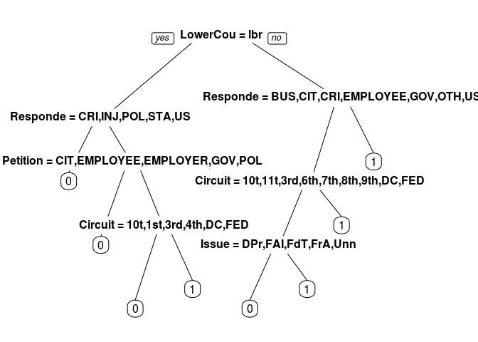
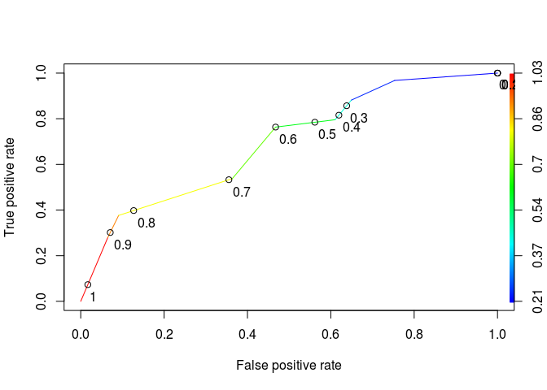
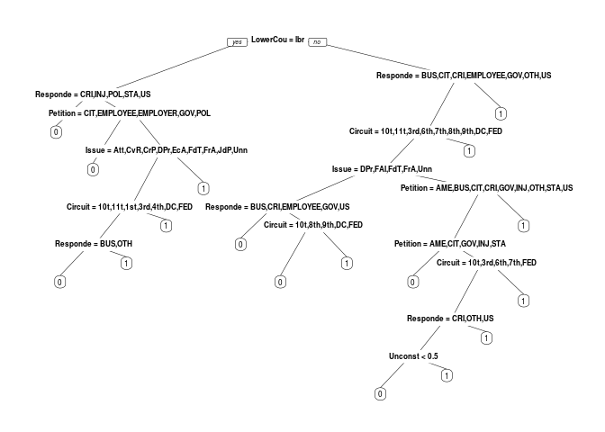
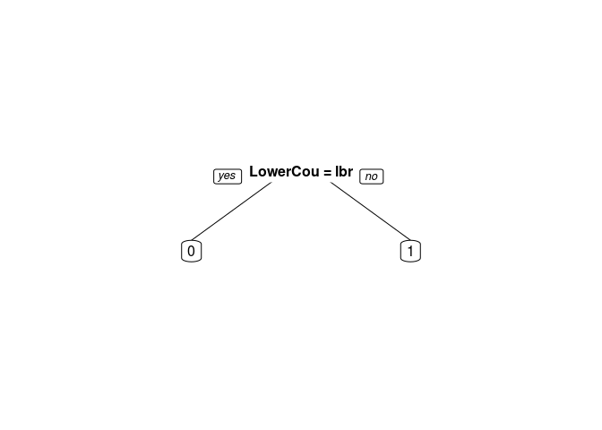

# Supreme Court


```r
library(dplyr)
```

```
## 
## Attaching package: 'dplyr'
```

```
## The following objects are masked from 'package:stats':
## 
##     filter, lag
```

```
## The following objects are masked from 'package:base':
## 
##     intersect, setdiff, setequal, union
```

```r
library(tidyr)
library(caret)
```

```
## Loading required package: lattice
```

```
## Loading required package: ggplot2
```

```r
library(ROCR)
```

```
## Loading required package: gplots
```

```
## 
## Attaching package: 'gplots'
```

```
## The following object is masked from 'package:stats':
## 
##     lowess
```

```r
library(caTools)
library(rpart)
library(rpart.plot)
library(randomForest)
```

```
## randomForest 4.6-12
```

```
## Type rfNews() to see new features/changes/bug fixes.
```

```
## 
## Attaching package: 'randomForest'
```

```
## The following object is masked from 'package:ggplot2':
## 
##     margin
```

```
## The following object is masked from 'package:dplyr':
## 
##     combine
```

```r
library(e1071)
```

```r
df<-read.csv('stevens.csv')
dim(df)
```

```
## [1] 566   9
```

```r
set.seed(3000)

splt = sample.split(df$Reverse,SplitRatio = 0.7)
df_train <- df[splt,]
df_test <- df[!splt,]

str(df_train)
```

```
## 'data.frame':	396 obs. of  9 variables:
##  $ Docket    : Factor w/ 566 levels "00-1011","00-1045",..: 69 97 242 334 436 504 507 526 155 426 ...
##  $ Term      : int  1994 1995 1996 1997 1999 1999 2000 2000 1994 1999 ...
##  $ Circuit   : Factor w/ 13 levels "10th","11th",..: 11 9 13 12 2 4 8 11 9 5 ...
##  $ Issue     : Factor w/ 11 levels "Attorneys","CivilRights",..: 5 9 5 5 3 5 5 4 5 6 ...
##  $ Petitioner: Factor w/ 12 levels "AMERICAN.INDIAN",..: 2 2 2 2 2 2 2 2 3 3 ...
##  $ Respondent: Factor w/ 12 levels "AMERICAN.INDIAN",..: 2 2 2 2 2 2 2 2 2 2 ...
##  $ LowerCourt: Factor w/ 2 levels "conser","liberal": 2 1 1 1 1 1 1 2 2 2 ...
##  $ Unconst   : int  0 0 0 0 0 0 1 1 0 0 ...
##  $ Reverse   : int  1 1 1 1 1 1 1 1 0 0 ...
```

```r
dim(df_test)
```

```
## [1] 170   9
```

```r
StevensTree<- rpart(Reverse~Circuit+Issue+Petitioner+Respondent+LowerCourt+Unconst,data=df_train,method='class',minbucket=25)
summary(StevensTree)
```

```
## Call:
## rpart(formula = Reverse ~ Circuit + Issue + Petitioner + Respondent + 
##     LowerCourt + Unconst, data = df_train, method = "class", 
##     minbucket = 25)
##   n= 396 
## 
##           CP nsplit rel error    xerror       xstd
## 1 0.21666667      0 1.0000000 1.0000000 0.05504819
## 2 0.05277778      1 0.7833333 0.8833333 0.05419418
## 3 0.02407407      3 0.6777778 0.8444444 0.05376462
## 4 0.01666667      6 0.6055556 0.8611111 0.05395780
## 5 0.01000000      7 0.5888889 0.8388889 0.05369717
## 
## Variable importance
## Respondent Petitioner LowerCourt    Circuit      Issue    Unconst 
##         29         20         20         15         14          1 
## 
## Node number 1: 396 observations,    complexity param=0.2166667
##   predicted class=1  expected loss=0.4545455  P(node) =1
##     class counts:   180   216
##    probabilities: 0.455 0.545 
##   left son=2 (185 obs) right son=3 (211 obs)
##   Primary splits:
##       LowerCourt splits as  RL, improve=15.803830, (0 missing)
##       Respondent splits as  RRLLLRLLLLRL, improve=12.595160, (0 missing)
##       Petitioner splits as  LLLRRLLRRRLL, improve=12.309770, (0 missing)
##       Circuit    splits as  LLLRLRRRLLLLL, improve= 8.967202, (0 missing)
##       Issue      splits as  RRRRRRLLRRR, improve= 4.103407, (0 missing)
##   Surrogate splits:
##       Petitioner splits as  RLLRRLLRRRLL, agree=0.722, adj=0.405, (0 split)
##       Respondent splits as  LRRLLRRLLRRR, agree=0.720, adj=0.400, (0 split)
##       Circuit    splits as  LRLLRRRRRRLRL, agree=0.644, adj=0.238, (0 split)
##       Issue      splits as  RLRLRLRLRLR, agree=0.578, adj=0.097, (0 split)
##       Unconst    < 0.5 to the left,  agree=0.566, adj=0.070, (0 split)
## 
## Node number 2: 185 observations,    complexity param=0.05277778
##   predicted class=0  expected loss=0.3945946  P(node) =0.4671717
##     class counts:   112    73
##    probabilities: 0.605 0.395 
##   left son=4 (67 obs) right son=5 (118 obs)
##   Primary splits:
##       Respondent splits as  RRRLR-RLRLLL, improve=7.23993500, (0 missing)
##       Circuit    splits as  LLLRLLLRLLRLR, improve=6.53187900, (0 missing)
##       Petitioner splits as  -RL-LLLRRLLR, improve=5.15027200, (0 missing)
##       Issue      splits as  LRLRRRLLLRL, improve=3.57553500, (0 missing)
##       Unconst    < 0.5 to the right, improve=0.06918919, (0 missing)
##   Surrogate splits:
##       Issue      splits as  RRLLRRRRRRR, agree=0.757, adj=0.328, (0 split)
##       Petitioner splits as  -RR-RRRRRLLL, agree=0.724, adj=0.239, (0 split)
##       Circuit    splits as  RRRRRRRRRLRRR, agree=0.654, adj=0.045, (0 split)
## 
## Node number 3: 211 observations,    complexity param=0.02407407
##   predicted class=1  expected loss=0.3222749  P(node) =0.5328283
##     class counts:    68   143
##    probabilities: 0.322 0.678 
##   left son=6 (158 obs) right son=7 (53 obs)
##   Primary splits:
##       Respondent splits as  RLLLLRLRLRRL, improve=8.6224910, (0 missing)
##       Circuit    splits as  LLRLLRRLLLLLL, improve=7.6570520, (0 missing)
##       Issue      splits as  RRLLRLLLLRR, improve=3.6748010, (0 missing)
##       Petitioner splits as  LLLRRLLLLRLL, improve=2.5768780, (0 missing)
##       Unconst    < 0.5 to the left,  improve=0.1185328, (0 missing)
##   Surrogate splits:
##       Issue   splits as  LRLLLLLLLLL, agree=0.768, adj=0.075, (0 split)
##       Circuit splits as  LLRLLRLLLLLLL, agree=0.763, adj=0.057, (0 split)
## 
## Node number 4: 67 observations
##   predicted class=0  expected loss=0.2089552  P(node) =0.1691919
##     class counts:    53    14
##    probabilities: 0.791 0.209 
## 
## Node number 5: 118 observations,    complexity param=0.05277778
##   predicted class=0  expected loss=0.5  P(node) =0.2979798
##     class counts:    59    59
##    probabilities: 0.500 0.500 
##   left son=10 (33 obs) right son=11 (85 obs)
##   Primary splits:
##       Petitioner splits as  -RL-LLLRRLRR, improve=7.593226, (0 missing)
##       Circuit    splits as  LLLRLLRRLRRLR, improve=3.491546, (0 missing)
##       Issue      splits as  LRLRRRRLRRL, improve=2.466555, (0 missing)
##       Respondent splits as  RRR-L-L-L---, improve=1.645095, (0 missing)
##   Surrogate splits:
##       Issue   splits as  RRRRRRRRRRL, agree=0.754, adj=0.121, (0 split)
##       Circuit splits as  RRLRLRRRRRRRR, agree=0.737, adj=0.061, (0 split)
## 
## Node number 6: 158 observations,    complexity param=0.02407407
##   predicted class=1  expected loss=0.4050633  P(node) =0.3989899
##     class counts:    64    94
##    probabilities: 0.405 0.595 
##   left son=12 (120 obs) right son=13 (38 obs)
##   Primary splits:
##       Circuit    splits as  LL-RLRRLLLLLL, improve=4.880846000, (0 missing)
##       Issue      splits as  RRLLRLLLRRR, improve=2.811689000, (0 missing)
##       Petitioner splits as  LLLRRLLRRRLL, improve=1.991333000, (0 missing)
##       Respondent splits as  -RLLR-L-R--L, improve=1.681096000, (0 missing)
##       Unconst    < 0.5 to the right, improve=0.001978479, (0 missing)
##   Surrogate splits:
##       Issue splits as  LLLLLLLLLLR, agree=0.766, adj=0.026, (0 split)
## 
## Node number 7: 53 observations
##   predicted class=1  expected loss=0.0754717  P(node) =0.1338384
##     class counts:     4    49
##    probabilities: 0.075 0.925 
## 
## Node number 10: 33 observations
##   predicted class=0  expected loss=0.2121212  P(node) =0.08333333
##     class counts:    26     7
##    probabilities: 0.788 0.212 
## 
## Node number 11: 85 observations,    complexity param=0.01666667
##   predicted class=1  expected loss=0.3882353  P(node) =0.2146465
##     class counts:    33    52
##    probabilities: 0.388 0.612 
##   left son=22 (29 obs) right son=23 (56 obs)
##   Primary splits:
##       Circuit    splits as  LRLRLLRRRRRLL, improve=2.35307200, (0 missing)
##       Issue      splits as  LRLLLRLLLRL, improve=1.59576900, (0 missing)
##       Respondent splits as  RRR-R-R-L---, improve=0.93499900, (0 missing)
##       Petitioner splits as  -L-----RR-RL, improve=0.09451121, (0 missing)
##   Surrogate splits:
##       Issue      splits as  RRRLRRRRRRL,  agree=0.706, adj=0.138, (0 split)
##       Petitioner splits as  -R-----LR-RL, agree=0.682, adj=0.069, (0 split)
## 
## Node number 12: 120 observations,    complexity param=0.02407407
##   predicted class=1  expected loss=0.475  P(node) =0.3030303
##     class counts:    57    63
##    probabilities: 0.475 0.525 
##   left son=24 (25 obs) right son=25 (95 obs)
##   Primary splits:
##       Issue      splits as  RRRLRLLLRRL, improve=5.1300000, (0 missing)
##       Respondent splits as  -RLLR-L-L--L, improve=1.5034090, (0 missing)
##       Petitioner splits as  LLLRRLLLRRLL, improve=1.2016480, (0 missing)
##       Circuit    splits as  LR--L--RLRRRL, improve=1.2000000, (0 missing)
##       Unconst    < 0.5 to the right, improve=0.1467607, (0 missing)
##   Surrogate splits:
##       Respondent splits as  -RLRR-L-R--R, agree=0.850, adj=0.28, (0 split)
##       Petitioner splits as  RRLRRLRRRRRR, agree=0.808, adj=0.08, (0 split)
## 
## Node number 13: 38 observations
##   predicted class=1  expected loss=0.1842105  P(node) =0.0959596
##     class counts:     7    31
##    probabilities: 0.184 0.816 
## 
## Node number 22: 29 observations
##   predicted class=0  expected loss=0.4482759  P(node) =0.07323232
##     class counts:    16    13
##    probabilities: 0.552 0.448 
## 
## Node number 23: 56 observations
##   predicted class=1  expected loss=0.3035714  P(node) =0.1414141
##     class counts:    17    39
##    probabilities: 0.304 0.696 
## 
## Node number 24: 25 observations
##   predicted class=0  expected loss=0.24  P(node) =0.06313131
##     class counts:    19     6
##    probabilities: 0.760 0.240 
## 
## Node number 25: 95 observations
##   predicted class=1  expected loss=0.4  P(node) =0.239899
##     class counts:    38    57
##    probabilities: 0.400 0.600
```


```r
prp(StevensTree)
```

<!-- -->

```r
Prediction1<- predict(StevensTree,newdata=df_test,type='class')
PredictionROC <- predict(StevensTree,newdata=df_test)
dim(df_test)
```

```
## [1] 170   9
```

```r
dim(PredictionROC)
```

```
## [1] 170   2
```

```r
table(df_test$Reverse,Prediction1)
```

```
##    Prediction1
##      0  1
##   0 41 36
##   1 22 71
```

```r
# Prediction function
ROCRpred = prediction(PredictionROC[,2], df_test$Reverse)

auc.tmp <- performance(ROCRpred,"auc"); auc <- as.numeric(auc.tmp@y.values)
auc
```

```
## [1] 0.6927105
```

```r
# Performance function
ROCRperf = performance(ROCRpred, "tpr", "fpr")


# Add threshold labels 
plot(ROCRperf, colorize=TRUE, print.cutoffs.at=seq(0,1,by=0.1), text.adj=c(-0.2,1.7))
```

<!-- -->

```r
StevensTree2<- rpart(Reverse~Circuit+Issue+Petitioner+Respondent+LowerCourt+Unconst,data=df_train,method='class',minbucket=5)
summary(StevensTree2)
```

```
## Call:
## rpart(formula = Reverse ~ Circuit + Issue + Petitioner + Respondent + 
##     LowerCourt + Unconst, data = df_train, method = "class", 
##     minbucket = 5)
##   n= 396 
## 
##           CP nsplit rel error    xerror       xstd
## 1 0.21666667      0 1.0000000 1.0000000 0.05504819
## 2 0.05277778      1 0.7833333 0.7833333 0.05293703
## 3 0.02407407      3 0.6777778 0.7166667 0.05181200
## 4 0.01666667      6 0.6055556 0.7444444 0.05230979
## 5 0.01388889      9 0.5500000 0.7611111 0.05258841
## 6 0.01111111     13 0.4833333 0.7888889 0.05302015
## 7 0.01000000     16 0.4500000 0.7944444 0.05310167
## 
## Variable importance
## Respondent Petitioner    Circuit      Issue LowerCourt    Unconst 
##         30         21         17         16         14          3 
## 
## Node number 1: 396 observations,    complexity param=0.2166667
##   predicted class=1  expected loss=0.4545455  P(node) =1
##     class counts:   180   216
##    probabilities: 0.455 0.545 
##   left son=2 (185 obs) right son=3 (211 obs)
##   Primary splits:
##       LowerCourt splits as  RL, improve=15.803830, (0 missing)
##       Respondent splits as  RRLLLRLLLLRL, improve=12.595160, (0 missing)
##       Petitioner splits as  LLLRRLLRRRLL, improve=12.309770, (0 missing)
##       Circuit    splits as  LLLRLRRRLLLLL, improve= 8.967202, (0 missing)
##       Issue      splits as  RRRRRRLLRRR, improve= 4.103407, (0 missing)
##   Surrogate splits:
##       Petitioner splits as  RLLRRLLRRRLL, agree=0.722, adj=0.405, (0 split)
##       Respondent splits as  LRRLLRRLLRRR, agree=0.720, adj=0.400, (0 split)
##       Circuit    splits as  LRLLRRRRRRLRL, agree=0.644, adj=0.238, (0 split)
##       Issue      splits as  RLRLRLRLRLR, agree=0.578, adj=0.097, (0 split)
##       Unconst    < 0.5 to the left,  agree=0.566, adj=0.070, (0 split)
## 
## Node number 2: 185 observations,    complexity param=0.05277778
##   predicted class=0  expected loss=0.3945946  P(node) =0.4671717
##     class counts:   112    73
##    probabilities: 0.605 0.395 
##   left son=4 (67 obs) right son=5 (118 obs)
##   Primary splits:
##       Respondent splits as  RRRLR-RLRLLL, improve=7.23993500, (0 missing)
##       Circuit    splits as  LLLRLLLRLLRLR, improve=6.53187900, (0 missing)
##       Petitioner splits as  -RL-LLLRRLLR, improve=5.15027200, (0 missing)
##       Issue      splits as  LRLRRRLLLRL, improve=3.57553500, (0 missing)
##       Unconst    < 0.5 to the right, improve=0.06918919, (0 missing)
##   Surrogate splits:
##       Issue      splits as  RRLLRRRRRRR, agree=0.757, adj=0.328, (0 split)
##       Petitioner splits as  -RR-RRRRRLLL, agree=0.724, adj=0.239, (0 split)
##       Circuit    splits as  RRRRRRRRRLRRR, agree=0.654, adj=0.045, (0 split)
## 
## Node number 3: 211 observations,    complexity param=0.02407407
##   predicted class=1  expected loss=0.3222749  P(node) =0.5328283
##     class counts:    68   143
##    probabilities: 0.322 0.678 
##   left son=6 (158 obs) right son=7 (53 obs)
##   Primary splits:
##       Respondent splits as  RLLLLRLRLRRL, improve=8.6224910, (0 missing)
##       Circuit    splits as  LLRLLRRLLLLLL, improve=7.6570520, (0 missing)
##       Issue      splits as  RRLLRLLLLRR, improve=3.6748010, (0 missing)
##       Petitioner splits as  LLLRRLLLLRLL, improve=2.5768780, (0 missing)
##       Unconst    < 0.5 to the left,  improve=0.1185328, (0 missing)
##   Surrogate splits:
##       Issue   splits as  LRLLLLLLLLL, agree=0.768, adj=0.075, (0 split)
##       Circuit splits as  LLRLLRLLLLLLL, agree=0.763, adj=0.057, (0 split)
## 
## Node number 4: 67 observations
##   predicted class=0  expected loss=0.2089552  P(node) =0.1691919
##     class counts:    53    14
##    probabilities: 0.791 0.209 
## 
## Node number 5: 118 observations,    complexity param=0.05277778
##   predicted class=0  expected loss=0.5  P(node) =0.2979798
##     class counts:    59    59
##    probabilities: 0.500 0.500 
##   left son=10 (33 obs) right son=11 (85 obs)
##   Primary splits:
##       Petitioner splits as  -RL-LLLRRLRR, improve=7.5932260, (0 missing)
##       Circuit    splits as  LLLRLLRRLRRLR, improve=3.4915460, (0 missing)
##       Issue      splits as  LRLRRRRLRRL, improve=2.4665550, (0 missing)
##       Respondent splits as  RLR-L-L-L---, improve=2.4562450, (0 missing)
##       Unconst    < 0.5 to the right, improve=0.0381877, (0 missing)
##   Surrogate splits:
##       Issue   splits as  RRRRRRRRRRL, agree=0.754, adj=0.121, (0 split)
##       Circuit splits as  RRLRLRRRRRRRR, agree=0.737, adj=0.061, (0 split)
## 
## Node number 6: 158 observations,    complexity param=0.02407407
##   predicted class=1  expected loss=0.4050633  P(node) =0.3989899
##     class counts:    64    94
##    probabilities: 0.405 0.595 
##   left son=12 (120 obs) right son=13 (38 obs)
##   Primary splits:
##       Circuit    splits as  LL-RLRRLLLLLL, improve=4.880846000, (0 missing)
##       Issue      splits as  RRRLRRLLRRR, improve=3.287486000, (0 missing)
##       Petitioner splits as  LRLRRLLRRRLR, improve=2.337575000, (0 missing)
##       Respondent splits as  -RLLR-L-R--R, improve=1.740305000, (0 missing)
##       Unconst    < 0.5 to the right, improve=0.001978479, (0 missing)
##   Surrogate splits:
##       Issue splits as  LLLLLLLLLLR, agree=0.766, adj=0.026, (0 split)
## 
## Node number 7: 53 observations
##   predicted class=1  expected loss=0.0754717  P(node) =0.1338384
##     class counts:     4    49
##    probabilities: 0.075 0.925 
## 
## Node number 10: 33 observations
##   predicted class=0  expected loss=0.2121212  P(node) =0.08333333
##     class counts:    26     7
##    probabilities: 0.788 0.212 
## 
## Node number 11: 85 observations,    complexity param=0.01666667
##   predicted class=1  expected loss=0.3882353  P(node) =0.2146465
##     class counts:    33    52
##    probabilities: 0.388 0.612 
##   left son=22 (76 obs) right son=23 (9 obs)
##   Primary splits:
##       Issue      splits as  LLLLLRLLLRL, improve=3.0343650, (0 missing)
##       Circuit    splits as  LRLRLLRRRRRLL, improve=2.3530720, (0 missing)
##       Respondent splits as  RLR-L-L-L---, improve=1.0767160, (0 missing)
##       Unconst    < 0.5 to the right, improve=0.3490733, (0 missing)
##       Petitioner splits as  -R-----RR-RL, improve=0.1111143, (0 missing)
##   Surrogate splits:
##       Petitioner splits as  -L-----RL-LL, agree=0.906, adj=0.111, (0 split)
## 
## Node number 12: 120 observations,    complexity param=0.02407407
##   predicted class=1  expected loss=0.475  P(node) =0.3030303
##     class counts:    57    63
##    probabilities: 0.475 0.525 
##   left son=24 (25 obs) right son=25 (95 obs)
##   Primary splits:
##       Issue      splits as  RRRLRLLLRRL, improve=5.1300000, (0 missing)
##       Petitioner splits as  LRLRRLRRRRLL, improve=1.6673080, (0 missing)
##       Respondent splits as  -RLLR-L-R--R, improve=1.6673080, (0 missing)
##       Circuit    splits as  LR--L--RLRRRL, improve=1.2000000, (0 missing)
##       Unconst    < 0.5 to the right, improve=0.1467607, (0 missing)
##   Surrogate splits:
##       Respondent splits as  -RLRR-L-R--R, agree=0.850, adj=0.28, (0 split)
##       Petitioner splits as  RRLRRLRRRRRR, agree=0.808, adj=0.08, (0 split)
## 
## Node number 13: 38 observations
##   predicted class=1  expected loss=0.1842105  P(node) =0.0959596
##     class counts:     7    31
##    probabilities: 0.184 0.816 
## 
## Node number 22: 76 observations,    complexity param=0.01666667
##   predicted class=1  expected loss=0.4342105  P(node) =0.1919192
##     class counts:    33    43
##    probabilities: 0.434 0.566 
##   left son=44 (30 obs) right son=45 (46 obs)
##   Primary splits:
##       Circuit    splits as  LLLRLLRRRRRLL, improve=2.72471400, (0 missing)
##       Respondent splits as  RLR-R-L-L---, improve=1.73293300, (0 missing)
##       Unconst    < 0.5 to the right, improve=1.10329900, (0 missing)
##       Issue      splits as  LRLRR-LLR-L, improve=0.69459570, (0 missing)
##       Petitioner splits as  -R------R-RL, improve=0.09968102, (0 missing)
##   Surrogate splits:
##       Issue splits as  LRRLR-RRR-L, agree=0.671, adj=0.167, (0 split)
## 
## Node number 23: 9 observations
##   predicted class=1  expected loss=0  P(node) =0.02272727
##     class counts:     0     9
##    probabilities: 0.000 1.000 
## 
## Node number 24: 25 observations,    complexity param=0.01111111
##   predicted class=0  expected loss=0.24  P(node) =0.06313131
##     class counts:    19     6
##    probabilities: 0.760 0.240 
##   left son=48 (10 obs) right son=49 (15 obs)
##   Primary splits:
##       Respondent splits as  -LRLL-L-R--L, improve=1.9200000, (0 missing)
##       Petitioner splits as  -RRLLLRRLL-L, improve=1.5905880, (0 missing)
##       Circuit    splits as  LR--L--RRLLLL, improve=1.4405130, (0 missing)
##       Unconst    < 0.5 to the left,  improve=1.1328210, (0 missing)
##       Issue      splits as  ---R-RLR--L, improve=0.9094737, (0 missing)
##   Surrogate splits:
##       Petitioner splits as  -RRRRLRRLR-L, agree=0.80, adj=0.5, (0 split)
##       Circuit    splits as  RL--L--RRRRRR, agree=0.76, adj=0.4, (0 split)
##       Issue      splits as  ---R-RLR--R, agree=0.76, adj=0.4, (0 split)
##       Unconst    < 0.5 to the left,  agree=0.76, adj=0.4, (0 split)
## 
## Node number 25: 95 observations,    complexity param=0.01388889
##   predicted class=1  expected loss=0.4  P(node) =0.239899
##     class counts:    38    57
##    probabilities: 0.400 0.600 
##   left son=50 (87 obs) right son=51 (8 obs)
##   Primary splits:
##       Petitioner splits as  LLLLR-LLLRLL, improve=2.7954020, (0 missing)
##       Respondent splits as  -RLLR-R-L--L, improve=1.8540320, (0 missing)
##       Issue      splits as  RRL-R---LR-, improve=1.7318270, (0 missing)
##       Circuit    splits as  LR--L--LLLRRL, improve=1.2325250, (0 missing)
##       Unconst    < 0.5 to the right, improve=0.1266667, (0 missing)
##   Surrogate splits:
##       Respondent splits as  -LLLL-R-L--L, agree=0.937, adj=0.250, (0 split)
##       Issue      splits as  LLL-L---LR-,  agree=0.926, adj=0.125, (0 split)
## 
## Node number 44: 30 observations,    complexity param=0.01666667
##   predicted class=0  expected loss=0.4  P(node) =0.07575758
##     class counts:    18    12
##    probabilities: 0.600 0.400 
##   left son=88 (24 obs) right son=89 (6 obs)
##   Primary splits:
##       Respondent splits as  RL--R---L---, improve=2.816667, (0 missing)
##       Issue      splits as  LRLRR-LLR-L, improve=1.207453, (0 missing)
##       Petitioner splits as  -R------R-LL, improve=1.207453, (0 missing)
##       Circuit    splits as  RRL-LR-----LR, improve=0.480000, (0 missing)
## 
## Node number 45: 46 observations
##   predicted class=1  expected loss=0.326087  P(node) =0.1161616
##     class counts:    15    31
##    probabilities: 0.326 0.674 
## 
## Node number 48: 10 observations
##   predicted class=0  expected loss=0  P(node) =0.02525253
##     class counts:    10     0
##    probabilities: 1.000 0.000 
## 
## Node number 49: 15 observations,    complexity param=0.01111111
##   predicted class=0  expected loss=0.4  P(node) =0.03787879
##     class counts:     9     6
##    probabilities: 0.600 0.400 
##   left son=98 (9 obs) right son=99 (6 obs)
##   Primary splits:
##       Circuit    splits as  LR-----RRLLLL, improve=3.7555560, (0 missing)
##       Petitioner splits as  -LRLL-RRRL--, improve=1.7357140, (0 missing)
##       Issue      splits as  ---R-R-L--L, improve=0.3428571, (0 missing)
##   Surrogate splits:
##       Petitioner splits as  -LLLL-RRLL--, agree=0.733, adj=0.333, (0 split)
##       Respondent splits as  --R-----L---, agree=0.667, adj=0.167, (0 split)
## 
## Node number 50: 87 observations,    complexity param=0.01388889
##   predicted class=1  expected loss=0.4367816  P(node) =0.219697
##     class counts:    38    49
##    probabilities: 0.437 0.563 
##   left son=100 (11 obs) right son=101 (76 obs)
##   Primary splits:
##       Petitioner splits as  LRLR--LLR-LR, improve=2.1251720, (0 missing)
##       Respondent splits as  -RLLR---L--L, improve=1.2358710, (0 missing)
##       Circuit    splits as  LR--L--LLRRRL, improve=0.8820102, (0 missing)
##       Issue      splits as  RLL-R---L--, improve=0.8283739, (0 missing)
##       Unconst    < 0.5 to the right, improve=0.1814093, (0 missing)
##   Surrogate splits:
##       Respondent splits as  -RLRR---R--R, agree=0.885, adj=0.091, (0 split)
## 
## Node number 51: 8 observations
##   predicted class=1  expected loss=0  P(node) =0.02020202
##     class counts:     0     8
##    probabilities: 0.000 1.000 
## 
## Node number 88: 24 observations
##   predicted class=0  expected loss=0.2916667  P(node) =0.06060606
##     class counts:    17     7
##    probabilities: 0.708 0.292 
## 
## Node number 89: 6 observations
##   predicted class=1  expected loss=0.1666667  P(node) =0.01515152
##     class counts:     1     5
##    probabilities: 0.167 0.833 
## 
## Node number 98: 9 observations
##   predicted class=0  expected loss=0.1111111  P(node) =0.02272727
##     class counts:     8     1
##    probabilities: 0.889 0.111 
## 
## Node number 99: 6 observations
##   predicted class=1  expected loss=0.1666667  P(node) =0.01515152
##     class counts:     1     5
##    probabilities: 0.167 0.833 
## 
## Node number 100: 11 observations
##   predicted class=0  expected loss=0.2727273  P(node) =0.02777778
##     class counts:     8     3
##    probabilities: 0.727 0.273 
## 
## Node number 101: 76 observations,    complexity param=0.01388889
##   predicted class=1  expected loss=0.3947368  P(node) =0.1919192
##     class counts:    30    46
##    probabilities: 0.395 0.605 
##   left son=202 (38 obs) right son=203 (38 obs)
##   Primary splits:
##       Circuit    splits as  LR--L--LLRRRL, improve=1.68421100, (0 missing)
##       Respondent splits as  -R-LR---L--L, improve=1.42401500, (0 missing)
##       Issue      splits as  RRL-R---L--, improve=0.98088750, (0 missing)
##       Unconst    < 0.5 to the right, improve=0.07412281, (0 missing)
##       Petitioner splits as  -L-R----R--R, improve=0.03929178, (0 missing)
##   Surrogate splits:
##       Respondent splits as  -R-LR---R--L, agree=0.618, adj=0.237, (0 split)
##       Petitioner splits as  -L-L----R--R, agree=0.592, adj=0.184, (0 split)
##       Issue      splits as  LRL-R---L--,  agree=0.579, adj=0.158, (0 split)
## 
## Node number 202: 38 observations,    complexity param=0.01388889
##   predicted class=0  expected loss=0.5  P(node) =0.0959596
##     class counts:    19    19
##    probabilities: 0.500 0.500 
##   left son=404 (29 obs) right son=405 (9 obs)
##   Primary splits:
##       Respondent splits as  -R-LR---L--L, improve=3.5670500, (0 missing)
##       Issue      splits as  RLL-R---L--, improve=1.2666670, (0 missing)
##       Unconst    < 0.5 to the left,  improve=0.3166667, (0 missing)
##       Circuit    splits as  L---R--RR---L, improve=0.2714286, (0 missing)
##   Surrogate splits:
##       Issue splits as  LLL-R---L--, agree=0.895, adj=0.556, (0 split)
## 
## Node number 203: 38 observations
##   predicted class=1  expected loss=0.2894737  P(node) =0.0959596
##     class counts:    11    27
##    probabilities: 0.289 0.711 
## 
## Node number 404: 29 observations,    complexity param=0.01111111
##   predicted class=0  expected loss=0.3793103  P(node) =0.07323232
##     class counts:    18    11
##    probabilities: 0.621 0.379 
##   left son=808 (23 obs) right son=809 (6 obs)
##   Primary splits:
##       Unconst    < 0.5 to the left,  improve=1.2493750, (0 missing)
##       Issue      splits as  RLR-L---L--, improve=1.0397880, (0 missing)
##       Respondent splits as  ---L----L--R, improve=0.9814882, (0 missing)
##       Petitioner splits as  -L-R----L--L, improve=0.7885057, (0 missing)
##       Circuit    splits as  L---R--LL---L, improve=0.2203898, (0 missing)
## 
## Node number 405: 9 observations
##   predicted class=1  expected loss=0.1111111  P(node) =0.02272727
##     class counts:     1     8
##    probabilities: 0.111 0.889 
## 
## Node number 808: 23 observations
##   predicted class=0  expected loss=0.3043478  P(node) =0.05808081
##     class counts:    16     7
##    probabilities: 0.696 0.304 
## 
## Node number 809: 6 observations
##   predicted class=1  expected loss=0.3333333  P(node) =0.01515152
##     class counts:     2     4
##    probabilities: 0.333 0.667
```

```r
prp(StevensTree2)
```

<!-- -->

```r
StevensTree3<- rpart(Reverse~Circuit+Issue+Petitioner+Respondent+LowerCourt+Unconst,data=df_train,method='class',minbucket=100)
summary(StevensTree3)
```

```
## Call:
## rpart(formula = Reverse ~ Circuit + Issue + Petitioner + Respondent + 
##     LowerCourt + Unconst, data = df_train, method = "class", 
##     minbucket = 100)
##   n= 396 
## 
##          CP nsplit rel error    xerror       xstd
## 1 0.2166667      0 1.0000000 1.0000000 0.05504819
## 2 0.0100000      1 0.7833333 0.8666667 0.05401916
## 
## Variable importance
## LowerCourt Petitioner Respondent    Circuit      Issue    Unconst 
##         45         18         18         11          4          3 
## 
## Node number 1: 396 observations,    complexity param=0.2166667
##   predicted class=1  expected loss=0.4545455  P(node) =1
##     class counts:   180   216
##    probabilities: 0.455 0.545 
##   left son=2 (185 obs) right son=3 (211 obs)
##   Primary splits:
##       LowerCourt splits as  RL, improve=15.803830, (0 missing)
##       Respondent splits as  RRLLLRLLLLRL, improve=12.595160, (0 missing)
##       Petitioner splits as  LLLRRLLRRRLL, improve=12.309770, (0 missing)
##       Circuit    splits as  LLLRLRRRLLLLL, improve= 8.967202, (0 missing)
##       Issue      splits as  RRLRRLLLLRL, improve= 4.021545, (0 missing)
##   Surrogate splits:
##       Petitioner splits as  RLLRRLLRRRLL, agree=0.722, adj=0.405, (0 split)
##       Respondent splits as  LRRLLRRLLRRR, agree=0.720, adj=0.400, (0 split)
##       Circuit    splits as  LRLLRRRRRRLRL, agree=0.644, adj=0.238, (0 split)
##       Issue      splits as  RLRLRLRLRLR, agree=0.578, adj=0.097, (0 split)
##       Unconst    < 0.5 to the left,  agree=0.566, adj=0.070, (0 split)
## 
## Node number 2: 185 observations
##   predicted class=0  expected loss=0.3945946  P(node) =0.4671717
##     class counts:   112    73
##    probabilities: 0.605 0.395 
## 
## Node number 3: 211 observations
##   predicted class=1  expected loss=0.3222749  P(node) =0.5328283
##     class counts:    68   143
##    probabilities: 0.322 0.678
```

```r
prp(StevensTree3)
```

<!-- -->


```r
df_train$Reverse = as.factor(df_train$Reverse)
df_test$Reverse = as.factor(df_test$Reverse)
RDF<- randomForest::randomForest(Reverse~Circuit+Issue+Petitioner+Respondent+LowerCourt+Unconst,data=df_train,nodesize=25, ntree=200)
summary(RDF)
```

```
##                 Length Class  Mode     
## call              5    -none- call     
## type              1    -none- character
## predicted       396    factor numeric  
## err.rate        600    -none- numeric  
## confusion         6    -none- numeric  
## votes           792    matrix numeric  
## oob.times       396    -none- numeric  
## classes           2    -none- character
## importance        6    -none- numeric  
## importanceSD      0    -none- NULL     
## localImportance   0    -none- NULL     
## proximity         0    -none- NULL     
## ntree             1    -none- numeric  
## mtry              1    -none- numeric  
## forest           14    -none- list     
## y               396    factor numeric  
## test              0    -none- NULL     
## inbag             0    -none- NULL     
## terms             3    terms  call
```

```r
predictionRDF<- predict(RDF,newdata = df_test)
table(df_test$Reverse,predictionRDF)
```

```
##    predictionRDF
##      0  1
##   0 43 34
##   1 19 74
```

```r
set.seed(100)
RDF_100<- randomForest::randomForest(Reverse~Circuit+Issue+Petitioner+Respondent+LowerCourt+Unconst, data=df_train,nodesize=25,ntrees=200)
prediction<-predict(RDF_100,newdata= df_test)
c_m<-data.frame(table(df_test$Reverse,prediction))

c_m <- c_m %>% spread(prediction,Freq) 
total <- c_m %>% select(2:3) %>% sum(.)
TP <- c_m[2,3]
TN<-c_m[1,2]
FP<-c_m[2,2]
FN<-c_m[1,3]
accuracy <- (TP+TN)/total
accuracy
```

```
## [1] 0.6882353
```


 

```r
set.seed(200)
RDF_100<- randomForest::randomForest(Reverse~Circuit+Issue+Petitioner+Respondent+LowerCourt+Unconst, data=df_train,nodesize=25,ntrees=200)
prediction<-predict(RDF_100,newdata= df_test)

c_m<-data.frame(table(df_test$Reverse,prediction))
table(df_test$Reverse,prediction)
```

```
##    prediction
##      0  1
##   0 43 34
##   1 18 75
```

```r
c_m <- c_m %>% spread(prediction,Freq) 
total <- c_m %>% select(2:3) %>% sum(.)
TP <- c_m[2,3]
TN<-c_m[1,2]
FP<-c_m[2,2]
FN<-c_m[1,3]
accuracy <- (TP+TN)/total
accuracy
```

```
## [1] 0.6941176
```


```r
numFolds = trainControl(method='CV',number=10)
cpGrid = expand.grid(.cp=seq(.01,.5,.01))
model1<-train(Reverse~Circuit+Issue+Petitioner+Respondent+LowerCourt+Unconst, data=df_train,method="rpart",trControl=numFolds,tuneGrid=cpGrid)
model1
```

```
## CART 
## 
## 396 samples
##   6 predictors
##   2 classes: '0', '1' 
## 
## No pre-processing
## Resampling: Cross-Validated (10 fold) 
## Summary of sample sizes: 356, 356, 357, 356, 357, 356, ... 
## Resampling results across tuning parameters:
## 
##   cp    Accuracy   Kappa     
##   0.01  0.6161538  0.21539781
##   0.02  0.6413462  0.26357354
##   0.03  0.6312179  0.24982995
##   0.04  0.6387821  0.27314286
##   0.05  0.6437821  0.28410236
##   0.06  0.6437821  0.28410236
##   0.07  0.6437821  0.28410236
##   0.08  0.6437821  0.28410236
##   0.09  0.6437821  0.28410236
##   0.10  0.6437821  0.28410236
##   0.11  0.6437821  0.28410236
##   0.12  0.6437821  0.28410236
##   0.13  0.6437821  0.28410236
##   0.14  0.6437821  0.28410236
##   0.15  0.6437821  0.28410236
##   0.16  0.6437821  0.28410236
##   0.17  0.6437821  0.28410236
##   0.18  0.6437821  0.28410236
##   0.19  0.6212821  0.23073448
##   0.20  0.6033333  0.18770659
##   0.21  0.5658333  0.08174925
##   0.22  0.5658333  0.08174925
##   0.23  0.5429487  0.01052632
##   0.24  0.5403846  0.00000000
##   0.25  0.5403846  0.00000000
##   0.26  0.5453846  0.00000000
##   0.27  0.5453846  0.00000000
##   0.28  0.5453846  0.00000000
##   0.29  0.5453846  0.00000000
##   0.30  0.5453846  0.00000000
##   0.31  0.5453846  0.00000000
##   0.32  0.5453846  0.00000000
##   0.33  0.5453846  0.00000000
##   0.34  0.5453846  0.00000000
##   0.35  0.5453846  0.00000000
##   0.36  0.5453846  0.00000000
##   0.37  0.5453846  0.00000000
##   0.38  0.5453846  0.00000000
##   0.39  0.5453846  0.00000000
##   0.40  0.5453846  0.00000000
##   0.41  0.5453846  0.00000000
##   0.42  0.5453846  0.00000000
##   0.43  0.5453846  0.00000000
##   0.44  0.5453846  0.00000000
##   0.45  0.5453846  0.00000000
##   0.46  0.5453846  0.00000000
##   0.47  0.5453846  0.00000000
##   0.48  0.5453846  0.00000000
##   0.49  0.5453846  0.00000000
##   0.50  0.5453846  0.00000000
## 
## Accuracy was used to select the optimal model using  the largest value.
## The final value used for the model was cp = 0.18.
```

```r
modelCV <- rpart(Reverse~Circuit+Issue+Petitioner+Respondent+LowerCourt+Unconst, data=df_train, method='class',cp=.18)
predictionCV <- predict(modelCV, newdata=df_test,type='class')
table(df_test$Reverse,predictionCV)
```

```
##    predictionCV
##      0  1
##   0 59 18
##   1 29 64
```

```r
(59+64)/(sum(table(df_test$Reverse,predictionCV)))
```

```
## [1] 0.7235294
```

```r
prp(modelCV)
```

<!-- -->

