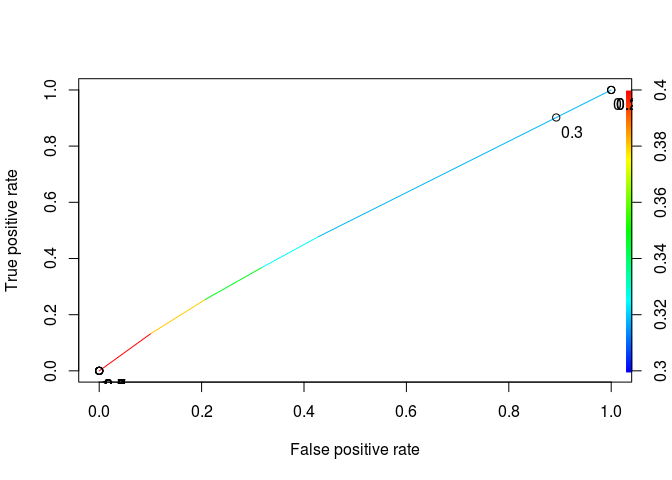
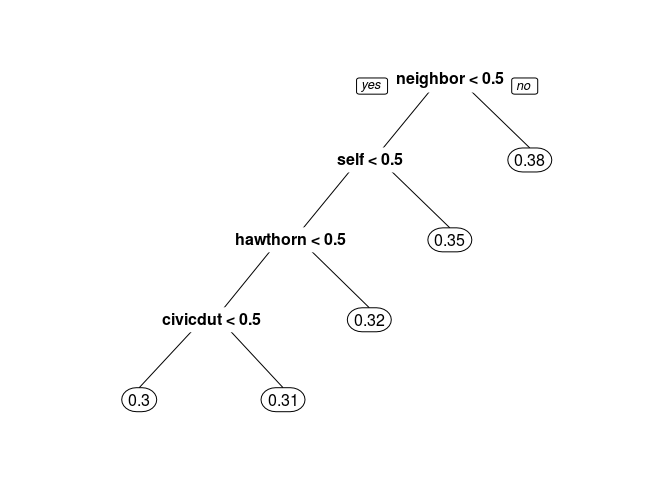
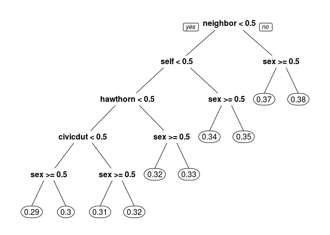
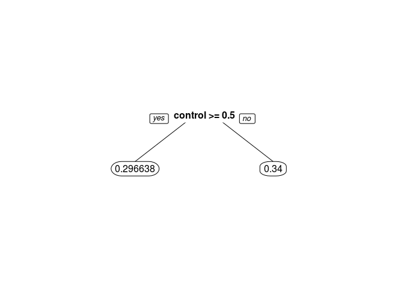
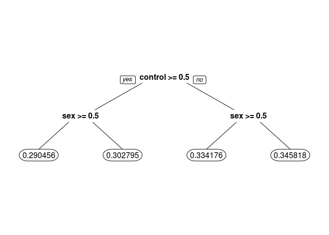

# Understanding why people vote


```r
library(dplyr)
```

```
## 
## Attaching package: 'dplyr'
```

```
## The following objects are masked from 'package:stats':
## 
##     filter, lag
```

```
## The following objects are masked from 'package:base':
## 
##     intersect, setdiff, setequal, union
```

```r
library(tidyr)
library(caret)
```

```
## Loading required package: lattice
```

```
## Loading required package: ggplot2
```

```r
library(ROCR)
```

```
## Loading required package: gplots
```

```
## 
## Attaching package: 'gplots'
```

```
## The following object is masked from 'package:stats':
## 
##     lowess
```

```r
library(caTools)
library(rpart)
library(rpart.plot)
```
Problem 1.1 - Exploration and Logistic Regression
1 point possible (graded)
We will first get familiar with the data. Load the CSV file gerber.csv into R. What proportion of people in this dataset voted in this election?

```r
df<-read.csv('gerber.csv')
df<-tibble::rownames_to_column(data.frame(df),'indexo')
df$indexo <- as.integer(df$indexo)
head(df)
```

```
##   indexo sex  yob voting hawthorne civicduty neighbors self control
## 1      1   0 1941      0         0         1         0    0       0
## 2      2   1 1947      0         0         1         0    0       0
## 3      3   1 1982      1         1         0         0    0       0
## 4      4   1 1950      1         1         0         0    0       0
## 5      5   0 1951      1         1         0         0    0       0
## 6      6   1 1959      1         0         0         0    0       1
```

```r
sum(df$voting==1)/nrow(df)
```

```
## [1] 0.3158996
```
Problem 1.2 - Exploration and Logistic Regression
1 point possible (graded)
Which of the four "treatment groups" had the largest percentage of people who actually voted (voting = 1)?


Civic Duty
Hawthorne Effect
Self
Neighbors

```r
per_group <-df %>% gather("group","is_group",5:9) %>% filter(is_group>0)
per_group  %>% arrange(indexo) %>% group_by(group,voting) %>% summarise(total = n()) %>% spread(voting,total) %>% setNames(c('group',"did_not_vote", "voted")) %>% mutate(ratio = voted/(did_not_vote+voted)*100) %>% arrange(ratio)
```

```
## Source: local data frame [5 x 4]
## Groups: group [5]
## 
##       group did_not_vote voted    ratio
##       <chr>        <int> <int>    <dbl>
## 1   control       134513 56730 29.66383
## 2 civicduty        26197 12021 31.45377
## 3 hawthorne        25888 12316 32.23746
## 4      self        25027 13191 34.51515
## 5 neighbors        23763 14438 37.79482
```
Problem 1.3 - Exploration and Logistic Regression
1 point possible (graded)
Build a logistic regression model for voting using the four treatment group variables as the independent variables (civicduty, hawthorne, self, and neighbors). Use all the data to build the model (DO NOT split the data into a training set and testing set). Which of the following coefficients are significant in the logistic regression model? Select all that apply.


Civic Duty
Hawthorne Effect
Self
Neighbors

```r
logModel1 <- glm(voting~civicduty+hawthorne+self+neighbors, data=df, family = binomial)
summary(logModel1)
```

```
## 
## Call:
## glm(formula = voting ~ civicduty + hawthorne + self + neighbors, 
##     family = binomial, data = df)
## 
## Deviance Residuals: 
##     Min       1Q   Median       3Q      Max  
## -0.9744  -0.8691  -0.8389   1.4586   1.5590  
## 
## Coefficients:
##              Estimate Std. Error  z value Pr(>|z|)    
## (Intercept) -0.863358   0.005006 -172.459  < 2e-16 ***
## civicduty    0.084368   0.012100    6.972 3.12e-12 ***
## hawthorne    0.120477   0.012037   10.009  < 2e-16 ***
## self         0.222937   0.011867   18.786  < 2e-16 ***
## neighbors    0.365092   0.011679   31.260  < 2e-16 ***
## ---
## Signif. codes:  0 '***' 0.001 '**' 0.01 '*' 0.05 '.' 0.1 ' ' 1
## 
## (Dispersion parameter for binomial family taken to be 1)
## 
##     Null deviance: 429238  on 344083  degrees of freedom
## Residual deviance: 428090  on 344079  degrees of freedom
## AIC: 428100
## 
## Number of Fisher Scoring iterations: 4
```

```r
CM<-table(df$voting,predict(logModel1,df,type='response')>0.3)
sum(diag(CM))/sum(CM)
```

```
## [1] 0.5419578
```

```r
CM<-table(df$voting,predict(logModel1,df,type='response')>0.5)
sum(diag(CM))/sum(CM)
```

```
## [1] 0.6841004
```
Compute Baselin

```r
ROCRpred = prediction(predict(logModel1,df,type='response'), df$voting)
as.numeric(performance(ROCRpred, "auc")@y.values)
```

```
## [1] 0.5308461
```

```r
# Performance function
ROCRperf = performance(ROCRpred, "tpr", "fpr")


# Add threshold labels 
plot(ROCRperf, colorize=TRUE, print.cutoffs.at=seq(0,1,by=0.1), text.adj=c(-0.2,1.7))
```

<!-- -->
Problem 2.1 - Trees
1 point possible (graded)
We will now try out trees. Build a CART tree for voting using all data and the same four treatment variables we used before. Don't set the option method="class" - we are actually going to create a regression tree here. We are interested in building a tree to explore the fraction of people who vote, or the probability of voting. We’d like CART to split our groups if they have different probabilities of voting. If we used method=‘class’, CART would only split if one of the groups had a probability of voting above 50% and the other had a probability of voting less than 50% (since the predicted outcomes would be different). However, with regression trees, CART will split even if both groups have probability less than 50%.

Leave all the parameters at their default values. You can use the following command in R to build the tree:

CARTmodel = rpart(voting ~ civicduty + hawthorne + self + neighbors, data=gerber)
Plot the tree. What happens, and if relevant, why?


```r
CARTmodel = rpart(voting ~ civicduty + hawthorne + self + neighbors, data=df)
prp(CARTmodel)
```

<!-- -->
Problem 2.2 - Trees
1 point possible (graded)
Now build the tree using the command:

CARTmodel2 = rpart(voting ~ civicduty + hawthorne + self + neighbors, data=gerber, cp=0.0)
to force the complete tree to be built. Then plot the tree. What do you observe about the order of the splits?

```r
CARTmodel2 = rpart(voting ~ civicduty + hawthorne + self + neighbors, data=df, cp=0.0)
prp(CARTmodel2)
```

<!-- -->
Problem 2.4 - Trees
2 points possible (graded)
Make a new tree that includes the "sex" variable, again with cp = 0.0. Notice that sex appears as a split that is of secondary importance to the treatment group.

In the control group, which gender is more likely to vote?


Men (0)
Women (1)
unanswered
In the "Civic Duty" group, which gender is more likely to vote?


Men (0)
Women (1)

```r
TreeWithSex<- rpart(voting ~civicduty + hawthorne + self + neighbors + sex, data=df, cp=0.0)
prp(TreeWithSex)
```

<!-- -->


```r
df %>% filter(control==1) %>% group_by(voting,sex) %>% summarise(total=n()) %>% mutate(ratio = total/sum(total))
```

```
## Source: local data frame [4 x 4]
## Groups: voting [2]
## 
##   voting   sex total     ratio
##    <int> <int> <int>     <dbl>
## 1      0     0 66809 0.4966732
## 2      0     1 67704 0.5033268
## 3      1     0 29015 0.5114578
## 4      1     1 27715 0.4885422
```
Problem 3.1 - Interaction Terms
2.0 points possible (graded)
We know trees can handle "nonlinear" relationships, e.g. "in the 'Civic Duty' group and female", but as we will see in the next few questions, it is possible to do the same for logistic regression. First, let's explore what trees can tell us some more.

Let's just focus on the "Control" treatment group. Create a regression tree using just the "control" variable, then create another tree with the "control" and "sex" variables, both with cp=0.0.

In the "control" only tree, what is the absolute value of the difference in the predicted probability of voting between being in the control group versus being in a different group? You can use the absolute value function to get answer, i.e. abs(Control Prediction - Non-Control Prediction). Add the argument "digits = 6" to the prp command to get a more accurate estimate.


```r
TreeWithControl<- rpart(voting ~control, data=df, cp=0.0)
prp(TreeWithControl, digits = 6)
```

<!-- -->

```r
TreeWithControlSex<- rpart(voting ~control+ sex, data=df, cp=0.0)
prp(TreeWithControlSex,digits = 6)
```

<!-- -->
Problem 3.2 - Interaction Terms
1 point possible (graded)
Now, using the second tree (with control and sex), determine who is affected more by NOT being in the control group (being in any of the four treatment groups):

```r
female_delta = (.290456-0.334176)
male_delta = .302795-.345818
female_delta
```

```
## [1] -0.04372
```

```r
male_delta
```

```
## [1] -0.043023
```
Problem 3.3 - Interaction Terms
1 point possible (graded)
Going back to logistic regression now, create a model using "sex" and "control". Interpret the coefficient for "sex":

```r
logModelSex <- glm(voting~sex+control, data=df, family = binomial)
summary(logModelSex)
```

```
## 
## Call:
## glm(formula = voting ~ sex + control, family = binomial, data = df)
## 
## Deviance Residuals: 
##     Min       1Q   Median       3Q      Max  
## -0.9220  -0.9012  -0.8290   1.4564   1.5717  
## 
## Coefficients:
##              Estimate Std. Error z value Pr(>|z|)    
## (Intercept) -0.635538   0.006511 -97.616  < 2e-16 ***
## sex         -0.055791   0.007343  -7.597 3.02e-14 ***
## control     -0.200142   0.007364 -27.179  < 2e-16 ***
## ---
## Signif. codes:  0 '***' 0.001 '**' 0.01 '*' 0.05 '.' 0.1 ' ' 1
## 
## (Dispersion parameter for binomial family taken to be 1)
## 
##     Null deviance: 429238  on 344083  degrees of freedom
## Residual deviance: 428443  on 344081  degrees of freedom
## AIC: 428449
## 
## Number of Fisher Scoring iterations: 4
```
Problem 3.4 - Interaction Terms
1 point possible (graded)
The regression tree calculated the percentage voting exactly for every one of the four possibilities (Man, Not Control), (Man, Control), (Woman, Not Control), (Woman, Control). Logistic regression has attempted to do the same, although it wasn't able to do as well because it can't consider exactly the joint possibility of being a women and in the control group.

We can quantify this precisely. Create the following dataframe (this contains all of the possible values of sex and control), and evaluate your logistic regression using the predict function (where "LogModelSex" is the name of your logistic regression model that uses both control and sex):

    
Possibilities = data.frame(sex=c(0,0,1,1),control=c(0,1,0,1))
predict(LogModelSex, newdata=Possibilities, type="response")

  
The four values in the results correspond to the four possibilities in the order they are stated above ( (Man, Not Control), (Man, Control), (Woman, Not Control), (Woman, Control) ). What is the absolute difference between the tree and the logistic regression for the (Woman, Control) case? Give an answer with five numbers after the decimal point.

```r
Possibilities = data.frame(sex=c(0,0,1,1),control=c(0,1,0,1))
Possibilities
```

```
##   sex control
## 1   0       0
## 2   0       1
## 3   1       0
## 4   1       1
```

```r
predict(logModelSex, newdata=Possibilities, type="response")
```

```
##         1         2         3         4 
## 0.3462559 0.3024455 0.3337375 0.2908065
```

```r
abs(0.2908065-.2904569)
```

```
## [1] 0.0003496
```
Problem 3.5 - Interaction Terms
1 point possible (graded)
So the difference is not too big for this dataset, but it is there. We're going to add a new term to our logistic regression now, that is the combination of the "sex" and "control" variables - so if this new variable is 1, that means the person is a woman AND in the control group. We can do that with the following command:

    
LogModel2 = glm(voting ~ sex + control + sex:control, data=gerber, family="binomial")

  
How do you interpret the coefficient for the new variable in isolation? That is, how does it relate to the dependent variable?


```r
LogModel2 = glm(voting ~ sex + control + sex:control, data=df, family="binomial")
summary(LogModel2)
```

```
## 
## Call:
## glm(formula = voting ~ sex + control + sex:control, family = "binomial", 
##     data = df)
## 
## Deviance Residuals: 
##     Min       1Q   Median       3Q      Max  
## -0.9213  -0.9019  -0.8284   1.4573   1.5724  
## 
## Coefficients:
##              Estimate Std. Error z value Pr(>|z|)    
## (Intercept) -0.637471   0.007603 -83.843  < 2e-16 ***
## sex         -0.051888   0.010801  -4.804 1.55e-06 ***
## control     -0.196553   0.010356 -18.980  < 2e-16 ***
## sex:control -0.007259   0.014729  -0.493    0.622    
## ---
## Signif. codes:  0 '***' 0.001 '**' 0.01 '*' 0.05 '.' 0.1 ' ' 1
## 
## (Dispersion parameter for binomial family taken to be 1)
## 
##     Null deviance: 429238  on 344083  degrees of freedom
## Residual deviance: 428442  on 344080  degrees of freedom
## AIC: 428450
## 
## Number of Fisher Scoring iterations: 4
```
Problem 3.6 - Interaction Terms
1 point possible (graded)
Run the same code as before to calculate the average for each group:

predict(LogModel2, newdata=Possibilities, type="response")

Now what is the difference between the logistic regression model and the CART model for the (Woman, Control) case? Again, give your answer with five numbers after the decimal point.

```r
Possibilities
```

```
##   sex control
## 1   0       0
## 2   0       1
## 3   1       0
## 4   1       1
```

```r
predict(LogModel2, newdata=Possibilities, type="response")
```

```
##         1         2         3         4 
## 0.3458183 0.3027947 0.3341757 0.2904558
```

```r
abs(0.2904558 -.2904569)
```

```
## [1] 1.1e-06
```


