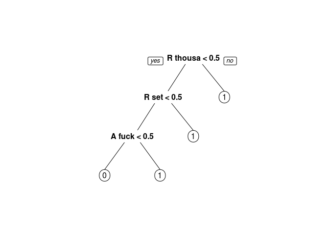
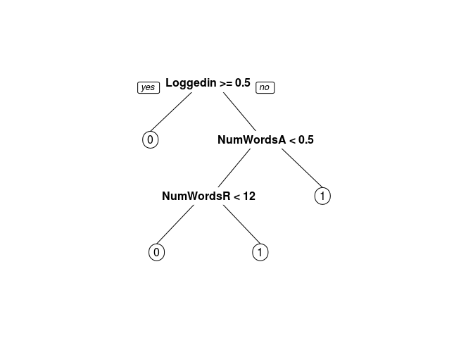

# Detecting Vandalism on Wikipedia


```r
library(dplyr)
```

```
## 
## Attaching package: 'dplyr'
```

```
## The following objects are masked from 'package:stats':
## 
##     filter, lag
```

```
## The following objects are masked from 'package:base':
## 
##     intersect, setdiff, setequal, union
```

```r
library(tidyr)
library(caret)
```

```
## Loading required package: lattice
```

```
## Loading required package: ggplot2
```

```r
library(tm)
```

```
## Loading required package: NLP
```

```
## 
## Attaching package: 'NLP'
```

```
## The following object is masked from 'package:ggplot2':
## 
##     annotate
```

```r
library(SnowballC)
library(caTools)
library(rpart)
library(rpart.plot)
Sys.setlocale("LC_ALL", "C")
```

```
## [1] "LC_CTYPE=C;LC_NUMERIC=C;LC_TIME=C;LC_COLLATE=C;LC_MONETARY=C;LC_MESSAGES=en_US.UTF-8;LC_PAPER=de_DE.UTF-8;LC_NAME=C;LC_ADDRESS=C;LC_TELEPHONE=C;LC_MEASUREMENT=de_DE.UTF-8;LC_IDENTIFICATION=C"
```


```r
df<-read.csv('Unit5_1/wiki.csv', stringsAsFactors=FALSE)
df$Vandal<-as.factor(df$Vandal)
table(df$Vandal)
```

```
## 
##    0    1 
## 2061 1815
```

Problem 1.2 - Bags of Words
2.0 points possible (graded)
We will now use the bag of words approach to build a model. We have two columns of textual data, with different meanings. For example, adding rude words has a different meaning to removing rude words. We'll start like we did in class by building a document term matrix from the Added column. The text already is lowercase and stripped of punctuation. So to pre-process the data, just complete the following four steps:

1) Create the corpus for the Added column, and call it "corpusAdded".

2) Remove the English-language stopwords.

3) Stem the words.

4) Build the DocumentTermMatrix, and call it dtmAdded.

If the code length(stopwords("english")) does not return 174 for you, then please run the line of code in this file, which will store the standard stop words in a variable called sw. When removing stop words, use tm_map(corpusAdded, removeWords, sw) instead of tm_map(corpusAdded, removeWords, stopwords("english")).

How many terms appear in dtmAdded?

```r
corpusAdded <- Corpus(VectorSource(df$Added))
corpusAdded[[1]]$content
```

```
## [1] "  represent psycholinguisticspsycholinguistics orthographyorthography help text all actions through human ethnologue relationships linguistics regarded writing languages to other listing xmlspacepreservelanguages metaverse formal term philology common each including phonologyphonology often ten list humans affiliation see computer are speechpathologyspeech our what for ways dialects please artificial written body be of quite hypothesis found alone refers by about language profanity study programming priorities rosenfelders technologytechnologies makes or first among useful languagephilosophy one sounds use area create phrases mark their genetic basic families complete but sapirwhorfhypothesissapirwhorf with talklanguagetalk population animals this science up vocal can concepts called at and topics locations as numbers have in pathology different develop 4000 things ideas grouped complex animal mathematics fairly literature httpwwwzompistcom philosophy most important meaningful a historicallinguisticsorphilologyhistorical semanticssemantics patterns the oral"
```

```r
# Remove stopwords and apple
corpusAdded = tm_map(corpusAdded, removeWords, stopwords("english"))

corpusAdded[[1]]$content
```

```
## [1] "  represent psycholinguisticspsycholinguistics orthographyorthography help text  actions  human ethnologue relationships linguistics regarded writing languages   listing xmlspacepreservelanguages metaverse formal term philology common  including phonologyphonology often ten list humans affiliation see computer  speechpathologyspeech    ways dialects please artificial written body   quite hypothesis found alone refers   language profanity study programming priorities rosenfelders technologytechnologies makes  first among useful languagephilosophy one sounds use area create phrases mark  genetic basic families complete  sapirwhorfhypothesissapirwhorf  talklanguagetalk population animals  science  vocal can concepts called   topics locations  numbers   pathology different develop 4000 things ideas grouped complex animal mathematics fairly literature httpwwwzompistcom philosophy  important meaningful  historicallinguisticsorphilologyhistorical semanticssemantics patterns  oral"
```

```r
# Stem document 

corpusAdded = tm_map(corpusAdded, stemDocument)

dtmAdded <- DocumentTermMatrix(corpusAdded)
dtmAdded
```

```
## <<DocumentTermMatrix (documents: 3876, terms: 6675)>>
## Non-/sparse entries: 15368/25856932
## Sparsity           : 100%
## Maximal term length: 784
## Weighting          : term frequency (tf)
```
Problem 1.3 - Bags of Words
1 point possible (graded)
Filter out sparse terms by keeping only terms that appear in 0.3% or more of the revisions, and call the new matrix sparseAdded. How many terms appear in sparseAdded?

```r
findFreqTerms(dtmAdded,lowfreq =1000)
```

```
## character(0)
```

```r
sparseAdded<-removeSparseTerms(dtmAdded,0.997)
sparseAdded
```

```
## <<DocumentTermMatrix (documents: 3876, terms: 166)>>
## Non-/sparse entries: 2681/640735
## Sparsity           : 100%
## Maximal term length: 28
## Weighting          : term frequency (tf)
```

```r
#clean column names (always do when using text as dataframe columns)

colnames(sparseAdded)<- make.names(colnames(sparseAdded))


wordsAdded<-as.data.frame(as.matrix(sparseAdded))

colnames(wordsAdded) = paste("A", colnames(wordsAdded))

head(wordsAdded)
```

```
##   A bodi A call A complet A concept A creat A develop A differ A famili
## 1      1      1         1         1       1         1        1        1
## 2      0      0         0         0       0         0        0        0
## 3      0      0         0         0       0         0        0        0
## 4      0      0         0         0       0         0        0        0
## 5      1      1         1         1       1         1        1        1
## 6      0      0         0         0       0         0        0        0
##   A first A group A help A idea A import A includ A linguist A make
## 1       1       1      1      1        1        1          1      1
## 2       0       0      0      0        0        0          0      0
## 3       0       0      0      0        0        0          0      0
## 4       0       0      0      0        0        0          0      0
## 5       0       1      1      1        1        1          1      1
## 6       0       0      0      0        0        0          0      0
##   A number A pattern A popul A refer A relationship A repres A sound
## 1        1         1       1       1              1        1       1
## 2        0         0       0       0              0        0       0
## 3        0         0       0       0              0        0       0
## 4        0         0       0       0              0        0       0
## 5        1         1       1       1              1        1       1
## 6        0         0       0       0              0        0       0
##   A studi A ten A use A write A part A name A communic A defin A express
## 1       1     1     2       1      0      0          0       0         0
## 2       0     0     0       0      0      0          0       0         0
## 3       0     0     0       0      0      0          0       0         0
## 4       0     0     1       0      1      0          0       0         0
## 5       1     1     2       1      0      0          0       0         0
## 6       0     0     0       0      0      0          0       0         0
##   A mean A must A set A featur A form A symbol A talk A type A learn
## 1      0      0     0        0      0        0      0      0       0
## 2      0      0     0        0      0        0      0      0       0
## 3      0      0     0        0      0        0      0      0       0
## 4      0      0     0        0      0        0      0      0       0
## 5      0      0     0        0      0        0      0      0       0
## 6      0      0     0        0      0        0      0      0       0
##   A general A exampl A provid A speak A thought A cours A german A onlin
## 1         0        0        0       0         0       0        0       0
## 2         0        0        0       0         0       0        0       0
## 3         0        0        0       0         0       0        0       0
## 4         0        0        0       0         0       0        0       0
## 5         0        0        0       0         0       0        0       0
## 6         0        0        0       0         0       0        0       0
##   A biolog A close A communiti A distinct A dutch A intellig A least
## 1        0       0           0          0       0          0       0
## 2        0       0           0          0       0          0       0
## 3        0       0           0          0       0          0       0
## 4        0       0           0          0       0          0       0
## 5        0       0           0          0       0          0       0
## 6        0       0           0          0       0          0       0
##   A note A parallel A possibl A principl A sentenc A standard A stem
## 1      0          0         0          0         0          0      0
## 2      0          0         0          0         0          0      0
## 3      0          0         0          0         0          0      0
## 4      0          0         0          0         0          0      0
## 5      0          0         0          0         0          0      0
## 6      0          0         0          0         0          0      0
##   A understood A utter A arbitrari A combin A cultur A discuss A invent
## 1            0       0           0        0        0         0        0
## 2            0       0           0        0        0         0        0
## 3            0       0           0        0        0         0        0
## 4            0       0           0        0        0         0        0
## 5            0       0           0        0        0         0        0
## 6            0       0           0        0        0         0        0
##   A properti A research A unit A work A direct A relat A agre A exist
## 1          0          0      0      0        0       0      0       0
## 2          0          0      0      0        0       0      0       0
## 3          0          0      0      0        0       0      0       0
## 4          0          0      0      0        0       0      0       0
## 5          0          0      0      0        0       0      0       0
## 6          0          0      0      0        0       0      0       0
##   A wide A describ A literari A purpos A fantasi A promin A manipul
## 1      0         0          0        0         0        0         0
## 2      0         0          0        0         0        0         0
## 3      0         0          0        0         0        0         0
## 4      0         0          0        0         0        0         0
## 5      0         0          0        0         0        0         0
## 6      0         0          0        0         0        0         0
##   A tolkien A follow A regular A gestur A similar A imposs A interact
## 1         0        0         0        0         0        0          0
## 2         0        0         0        0         0        0          0
## 3         0        0         0        0         0        0          0
## 4         0        0         0        0         0        0          0
## 5         0        0         0        0         0        0          0
## 6         0        0         0        0         0        0          0
##   A person A reason A writer A phenomenon A accord A individu A object
## 1        0        0        0            0        0          0        0
## 2        0        0        0            0        0          0        0
## 3        0        0        0            0        0          0        0
## 4        0        0        0            0        0          0        0
## 5        0        0        0            0        0          0        0
## 6        0        0        0            0        0          0        0
##   A ago A estim A mainorigin A million A origin A recent A thousand A year
## 1     0       0            0         0        0        0          0      0
## 2     0       0            0         0        0        0          0      0
## 3     0       0            0         0        0        0          0      0
## 4     0       0            0         0        0        0          0      0
## 5     0       0            0         0        0        0          0      0
## 6     0       0            0         0        0        0          0      0
##   A analog A appar A biologyanalog A converg A govern A mainlinguist
## 1        0       0               0         0        0              0
## 2        0       0               0         0        0              0
## 3        0       0               0         0        0              0
## 4        0       0               0         0        0              0
## 5        0       0               0         0        0              0
## 6        0       0               0         0        0              0
##   A univers A verb A forc A compar A consid A correl A experiment
## 1         0      0      0        0        0        0            0
## 2         0      0      0        0        0        0            0
## 3         0      0      0        0        0        0            0
## 4         0      0      0        0        0        0            0
## 5         0      0      0        0        0        0            0
## 6         0      0      0        0        0        0            0
##   A geograph A ideolog A languageenglish A logic A notion A perform
## 1          0         0                 0       0        0         0
## 2          0         0                 0       0        0         0
## 3          0         0                 0       0        0         0
## 4          0         0                 0       0        0         0
## 5          0         0                 0       0        0         0
## 6          0         0                 0       0        0         0
##   A present A quotloglangsquot A respect A result A strive A structur
## 1         0                  0         0        0        0          0
## 2         0                  0         0        0        0          0
## 3         0                  0         0        0        0          0
## 4         0                  0         0        0        0          0
## 5         0                  0         0        0        0          0
## 6         0                  0         0        0        0          0
##   A subject A practic A say A think A clear A croatian A icon A just
## 1         0         0     0       0       0          0      0      0
## 2         0         0     0       0       0          0      0      0
## 3         0         0     0       0       0          0      0      0
## 4         0         0     0       0       0          0      0      0
## 5         0         0     0       0       0          0      0      0
## 6         0         0     0       0       0          0      0      0
##   A know A langesnada A languagecroatian A languageserbian
## 1      0            0                  0                 0
## 2      0            0                  0                 0
## 3      0            0                  0                 0
## 4      0            0                  0                 0
## 5      0            0                  0                 0
## 6      0            0                  0                 0
##   A languagespanish A map A noth A onto A process A quothopequot
## 1                 0     0      0      0         0              0
## 2                 0     0      0      0         0              0
## 3                 0     0      0      0         0              0
## 4                 0     0      0      0         0              0
## 5                 0     0      0      0         0              0
## 6                 0     0      0      0         0              0
##   A quotnothingquot A serbian A spanish A stand A want A believ A identifi
## 1                 0         0         0       0      0        0          0
## 2                 0         0         0       0      0        0          0
## 3                 0         0         0       0      0        0          0
## 4                 0         0         0       0      0        0          0
## 5                 0         0         0       0      0        0          0
## 6                 0         0         0       0      0        0          0
##   A actual A will A contain A xmlspacepreserveotheruses4th A deriv A quot
## 1        0      0         0                              0       0      0
## 2        0      0         0                              0       0      0
## 3        0      0         0                              0       0      0
## 4        0      0         0                              0       0      0
## 5        0      0         0                              0       0      0
## 6        0      0         0                              0       0      0
##   A tri A fuck A get
## 1     0      0     0
## 2     0      0     0
## 3     0      0     0
## 4     0      0     0
## 5     0      0     0
## 6     0      0     0
```


```r
corpusRemoved <- Corpus(VectorSource(df$Removed))
corpusRemoved[[1]]$content
```

```
## [1] " "
```

```r
# Remove stopwords and apple
corpusRemoved = tm_map(corpusRemoved, removeWords, stopwords("english"))

corpusRemoved[[1]]$content
```

```
## [1] " "
```

```r
# Stem document 

corpusRemoved = tm_map(corpusRemoved, stemDocument)

dtmRemoved <- DocumentTermMatrix(corpusRemoved)
corpusRemoved
```

```
## <<SimpleCorpus>>
## Metadata:  corpus specific: 1, document level (indexed): 0
## Content:  documents: 3876
```


```r
sparseRemoved<-removeSparseTerms(dtmRemoved,0.997)
sparseRemoved
```

```
## <<DocumentTermMatrix (documents: 3876, terms: 162)>>
## Non-/sparse entries: 2552/625360
## Sparsity           : 100%
## Maximal term length: 28
## Weighting          : term frequency (tf)
```

```r
#clean column names (always do when using text as dataframe columns)

colnames(sparseRemoved)<- make.names(colnames(sparseRemoved))


wordsRemoved<-as.data.frame(as.matrix(sparseRemoved))

colnames(wordsRemoved) = paste("R", colnames(wordsRemoved))

str(wordsRemoved)
```

```
## 'data.frame':	3876 obs. of  162 variables:
##  $ R first                       : num  0 0 1 0 0 0 0 0 0 0 ...
##  $ R bodi                        : num  0 0 0 1 0 0 0 0 0 0 ...
##  $ R call                        : num  0 0 0 1 0 0 0 0 0 0 ...
##  $ R complet                     : num  0 0 0 1 0 0 0 0 0 0 ...
##  $ R concept                     : num  0 0 0 1 0 0 0 0 0 0 ...
##  $ R creat                       : num  0 0 0 1 0 0 0 0 0 0 ...
##  $ R develop                     : num  0 0 0 1 0 0 0 0 0 0 ...
##  $ R differ                      : num  0 0 0 1 0 0 0 0 0 0 ...
##  $ R famili                      : num  0 0 0 1 0 0 0 0 0 0 ...
##  $ R group                       : num  0 0 0 1 0 0 0 0 0 0 ...
##  $ R idea                        : num  0 0 0 1 0 0 0 0 0 0 ...
##  $ R includ                      : num  0 0 0 1 0 0 0 0 0 0 ...
##  $ R linguist                    : num  0 0 0 1 0 0 0 0 0 0 ...
##  $ R make                        : num  0 0 0 1 0 0 0 0 0 0 ...
##  $ R pattern                     : num  0 0 0 1 0 0 0 0 0 0 ...
##  $ R popul                       : num  0 0 0 1 0 0 0 0 0 0 ...
##  $ R quit                        : num  0 0 0 1 0 0 0 0 0 0 ...
##  $ R refer                       : num  0 0 0 1 0 0 0 0 0 0 ...
##  $ R relationship                : num  0 0 0 1 0 0 0 0 0 0 ...
##  $ R repres                      : num  0 0 0 1 0 0 0 0 0 0 ...
##  $ R sound                       : num  0 0 0 1 0 0 0 0 0 0 ...
##  $ R studi                       : num  0 0 0 1 0 0 0 0 0 0 ...
##  $ R use                         : num  0 0 0 2 1 0 0 0 0 0 ...
##  $ R part                        : num  0 0 0 0 1 0 0 0 0 0 ...
##  $ R communic                    : num  0 0 0 0 0 0 0 0 0 0 ...
##  $ R defin                       : num  0 0 0 0 0 0 0 0 0 0 ...
##  $ R express                     : num  0 0 0 0 0 0 0 0 0 0 ...
##  $ R mean                        : num  0 0 0 0 0 0 0 0 0 0 ...
##  $ R must                        : num  0 0 0 0 0 0 0 0 0 0 ...
##  $ R name                        : num  0 0 0 0 0 0 0 0 0 0 ...
##  $ R featur                      : num  0 0 0 0 0 0 0 0 0 0 ...
##  $ R set                         : num  0 0 0 0 0 0 0 0 0 0 ...
##  $ R symbol                      : num  0 0 0 0 0 0 0 0 0 0 ...
##  $ R type                        : num  0 0 0 0 0 0 0 0 0 0 ...
##  $ R know                        : num  0 0 0 0 0 0 0 0 0 0 ...
##  $ R method                      : num  0 0 0 0 0 0 0 0 0 0 ...
##  $ R quot                        : num  0 0 0 0 0 0 0 0 0 0 ...
##  $ R suggest                     : num  0 0 0 0 0 0 0 0 0 0 ...
##  $ R want                        : num  0 0 0 0 0 0 0 0 0 0 ...
##  $ R speak                       : num  0 0 0 0 0 0 0 0 0 0 ...
##  $ R agre                        : num  0 0 0 0 0 0 0 0 0 0 ...
##  $ R regular                     : num  0 0 0 0 0 0 0 0 0 0 ...
##  $ R actual                      : num  0 0 0 0 0 0 0 0 0 0 ...
##  $ R spanish                     : num  0 0 0 0 0 0 0 0 0 0 ...
##  $ R cours                       : num  0 0 0 0 0 0 0 0 0 0 ...
##  $ R onlin                       : num  0 0 0 0 0 0 0 0 0 0 ...
##  $ R fuck                        : num  0 0 0 0 0 0 0 0 0 0 ...
##  $ R person                      : num  0 0 0 0 0 0 0 0 0 0 ...
##  $ R believ                      : num  0 0 0 0 0 0 0 0 0 0 ...
##  $ R direct                      : num  0 0 0 0 0 0 0 0 0 0 ...
##  $ R experiment                  : num  0 0 0 0 0 0 0 0 0 0 ...
##  $ R will                        : num  0 0 0 0 0 0 0 0 0 0 ...
##  $ R deriv                       : num  0 0 0 0 0 0 0 0 0 0 ...
##  $ R gestur                      : num  0 0 0 0 0 0 0 0 0 0 ...
##  $ R least                       : num  0 0 0 0 0 0 0 0 0 0 ...
##  $ R logic                       : num  0 0 0 0 0 0 0 0 0 0 ...
##  $ R mainlinguist                : num  0 0 0 0 0 0 0 0 0 0 ...
##  $ R possibl                     : num  0 0 0 0 0 0 0 0 0 0 ...
##  $ R reason                      : num  0 0 0 0 0 0 0 0 0 0 ...
##  $ R result                      : num  0 0 0 0 0 0 0 0 0 0 ...
##  $ R standard                    : num  0 0 0 0 0 0 0 0 0 0 ...
##  $ R thought                     : num  0 0 0 0 0 0 0 0 0 0 ...
##  $ R tri                         : num  0 0 0 0 0 0 0 0 0 0 ...
##  $ R say                         : num  0 0 0 0 0 0 0 0 0 0 ...
##  $ R origin                      : num  0 0 0 0 0 0 0 0 0 0 ...
##  $ R process                     : num  0 0 0 0 0 0 0 0 0 0 ...
##  $ R languageenglish             : num  0 0 0 0 0 0 0 0 0 0 ...
##  $ R analog                      : num  0 0 0 0 0 0 0 0 0 0 ...
##  $ R subject                     : num  0 0 0 0 0 0 0 0 0 0 ...
##  $ R learn                       : num  0 0 0 0 0 0 0 0 0 0 ...
##  $ R peopl                       : num  0 0 0 0 0 0 0 0 0 0 ...
##  $ R discuss                     : num  0 0 0 0 0 0 0 0 0 0 ...
##  $ R biologyanalog               : num  0 0 0 0 0 0 0 0 0 0 ...
##  $ R govern                      : num  0 0 0 0 0 0 0 0 0 0 ...
##  $ R linguisticssent             : num  0 0 0 0 0 0 0 0 0 0 ...
##  $ R object                      : num  0 0 0 0 0 0 0 0 0 0 ...
##  $ R sentenc                     : num  0 0 0 0 0 0 0 0 0 0 ...
##  $ R verb                        : num  0 0 0 0 0 0 0 0 0 0 ...
##  $ R compar                      : num  0 0 0 0 0 0 0 0 0 0 ...
##  $ R get                         : num  0 0 0 0 0 0 0 0 0 0 ...
##  $ R provid                      : num  0 0 0 0 0 0 0 0 0 0 ...
##  $ R serv                        : num  0 0 0 0 0 0 0 0 0 0 ...
##  $ R clear                       : num  0 0 0 0 0 0 0 0 0 0 ...
##  $ R intern                      : num  0 0 0 0 0 0 0 0 0 0 ...
##  $ R combin                      : num  0 0 0 0 0 0 0 0 0 0 ...
##  $ R distinct                    : num  0 0 0 0 0 0 0 0 0 0 ...
##  $ R relat                       : num  0 0 0 0 0 0 0 0 0 0 ...
##  $ R map                         : num  0 0 0 0 0 0 0 0 0 0 ...
##  $ R nation                      : num  0 0 0 0 0 0 0 0 0 0 ...
##  $ R care                        : num  0 0 0 0 0 0 0 0 0 0 ...
##  $ R geograph                    : num  0 0 0 0 0 0 0 0 0 0 ...
##  $ R notion                      : num  0 0 0 0 0 0 0 0 0 0 ...
##  $ R present                     : num  0 0 0 0 0 0 0 0 0 0 ...
##  $ R appar                       : num  0 0 0 0 0 0 0 0 0 0 ...
##  $ R close                       : num  0 0 0 0 0 0 0 0 0 0 ...
##  $ R wide                        : num  0 0 0 0 0 0 0 0 0 0 ...
##  $ R bigger                      : num  0 0 0 0 0 0 0 0 0 0 ...
##  $ R follow                      : num  0 0 0 0 0 0 0 0 0 0 ...
##  $ R recent                      : num  0 0 0 0 0 0 0 0 0 0 ...
##   [list output truncated]
```
Problem 1.5 - Bags of Words
2.0 points possible (graded)
Combine the two data frames into a data frame called wikiWords with the following line of code:

wikiWords = cbind(wordsAdded, wordsRemoved)

The cbind function combines two sets of variables for the same observations into one data frame. Then add the Vandal column (HINT: remember how we added the dependent variable back into our data frame in the Twitter lecture). Set the random seed to 123 and then split the data set using sample.split from the "caTools" package to put 70% in the training set.

What is the accuracy on the test set of a baseline method that always predicts "not vandalism" (the most frequent outcome)?

```r
wikiWords = cbind(wordsAdded, wordsRemoved)
wikiWords$Vandal <- df$Vandal

set.seed(123)

splt = sample.split(wikiWords$Vandal,SplitRatio = 0.7)
df_train <- wikiWords[splt,]
df_test <- wikiWords[!splt,]

table(df_test$Vandal)
```

```
## 
##   0   1 
## 618 545
```

```r
618/(618+545)
```

```
## [1] 0.5313844
```
 Problem 1.6 - Bags of Words
2.0 points possible (graded)
Build a CART model to predict Vandal, using all of the other variables as independent variables. Use the training set to build the model and the default parameters (don't set values for minbucket or cp).

What is the accuracy of the model on the test set, using a threshold of 0.5? (Remember that if you add the argument type="class" when making predictions, the output of predict will automatically use a threshold of 0.5.)


```r
CART_Model <- rpart(Vandal~.,data=df_train)
prediction_CART <- predict(CART_Model,newdata=df_test)
CM<- table(df_test$Vandal,prediction_CART[,2]>0.5)
CM
```

```
##    
##     FALSE TRUE
##   0   614    4
##   1   526   19
```

```r
sum(diag(CM))/sum(CM)
```

```
## [1] 0.544282
```

Problem 1.7 - Bags of Words
1 point possible (graded)
Plot the CART tree. How many word stems does the CART model use?

```r
prp(CART_Model)
```

<!-- -->
Problem 2.1 - Problem-specific Knowledge
1 point possible (graded)
We weren't able to improve on the baseline using the raw textual information. More specifically, the words themselves were not useful. There are other options though, and in this section we will try two techniques - identifying a key class of words, and counting words.

The key class of words we will use are website addresses. "Website addresses" (also known as URLs - Uniform Resource Locators) are comprised of two main parts. An example would be "http://www.google.com". The first part is the protocol, which is usually "http" (HyperText Transfer Protocol). The second part is the address of the site, e.g. "www.google.com". We have stripped all punctuation so links to websites appear in the data as one word, e.g. "httpwwwgooglecom". We hypothesize that given that a lot of vandalism seems to be adding links to promotional or irrelevant websites, the presence of a web address is a sign of vandalism.

We can search for the presence of a web address in the words added by searching for "http" in the Added column. The grepl function returns TRUE if a string is found in another string, e.g.

grepl("cat","dogs and cats",fixed=TRUE) # TRUE

grepl("cat","dogs and rats",fixed=TRUE) # FALSE

Create a copy of your dataframe from the previous question:

wikiWords2 = wikiWords

Make a new column in wikiWords2 that is 1 if "http" was in Added:

wikiWords2$HTTP = ifelse(grepl("http",wiki$Added,fixed=TRUE), 1, 0)

Based on this new column, how many revisions added a link?

```r
wikiWords2<-wikiWords
wikiWords2$HTTP <- ifelse(grepl("http",df$Added,fixed=TRUE), 1, 0)
sum(wikiWords2$HTTP)
```

```
## [1] 217
```
Problem 2.2 - Problem-Specific Knowledge
2.0 points possible (graded)
In problem 1.5, you computed a vector called "spl" that identified the observations to put in the training and testing sets. Use that variable (do not recompute it with sample.split) to make new training and testing sets:

wikiTrain2 = subset(wikiWords2, spl==TRUE)

wikiTest2 = subset(wikiWords2, spl==FALSE)

Then create a new CART model using this new variable as one of the independent variables.

What is the new accuracy of the CART model on the test set, using a threshold of 0.5?

```r
wikiTrain2 = subset(wikiWords2, splt==TRUE)

wikiTest2 = subset(wikiWords2, splt==FALSE)

CART_Model <- rpart(Vandal~.,data=wikiTrain2)
prediction_CART <- predict(CART_Model,newdata=wikiTest2)
CM<- table(wikiTest2$Vandal,prediction_CART[,2]>0.5)
CM
```

```
##    
##     FALSE TRUE
##   0   605   13
##   1   481   64
```

```r
sum(diag(CM))/sum(CM)
```

```
## [1] 0.5752365
```
Problem 2.3 - Problem-Specific Knowledge
1 point possible (graded)
Another possibility is that the number of words added and removed is predictive, perhaps more so than the actual words themselves. We already have a word count available in the form of the document-term matrices (DTMs).

Sum the rows of dtmAdded and dtmRemoved and add them as new variables in your data frame wikiWords2 (called NumWordsAdded and NumWordsRemoved) by using the following commands:

wikiWords2$NumWordsAdded = rowSums(as.matrix(dtmAdded))

wikiWords2$NumWordsRemoved = rowSums(as.matrix(dtmRemoved))

What is the average number of words added?

```r
wikiWords2$NumWordsAdded = rowSums(as.matrix(dtmAdded))
wikiWords2$NumWordsRemoved = rowSums(as.matrix(dtmRemoved))

mean(wikiWords2$NumWordsAdded)
```

```
## [1] 4.050052
```
Problem 2.4 - Problem-Specific Knowledge
2.0 points possible (graded)
In problem 1.5, you computed a vector called "spl" that identified the observations to put in the training and testing sets. Use that variable (do not recompute it with sample.split) to make new training and testing sets with wikiWords2. Create the CART model again (using the training set and the default parameters).

What is the new accuracy of the CART model on the test set?

```r
wikiTrain2 = subset(wikiWords2, splt==TRUE)

wikiTest2 = subset(wikiWords2, splt==FALSE)

CART_Model <- rpart(Vandal~.,data=wikiTrain2)
prediction_CART <- predict(CART_Model,newdata=wikiTest2)
CM<- table(wikiTest2$Vandal,prediction_CART[,2]>0.5)
CM
```

```
##    
##     FALSE TRUE
##   0   514  104
##   1   297  248
```

```r
sum(diag(CM))/sum(CM)
```

```
## [1] 0.6552021
```
Problem 3.1 - Using Non-Textual Data
2.0 points possible (graded)
We have two pieces of "metadata" (data about data) that we haven't yet used. Make a copy of wikiWords2, and call it wikiWords3:

wikiWords3 = wikiWords2

Then add the two original variables Minor and Loggedin to this new data frame:

wikiWords3$Minor = wiki$Minor

wikiWords3$Loggedin = wiki$Loggedin

In problem 1.5, you computed a vector called "spl" that identified the observations to put in the training and testing sets. Use that variable (do not recompute it with sample.split) to make new training and testing sets with wikiWords3.

Build a CART model using all the training data. What is the accuracy of the model on the test set?


```r
wikiWords3 = wikiWords2
wikiWords3$Minor = df$Minor
wikiWords3$Loggedin = df$Loggedin

wikiTrain3 = subset(wikiWords3, splt==TRUE)

wikiTest3 = subset(wikiWords3, splt==FALSE)

CART_Model <- rpart(Vandal~.,data=wikiTrain3)
prediction_CART <- predict(CART_Model,newdata=wikiTest3)
CM<- table(wikiTest3$Vandal,prediction_CART[,2]>0.5)
CM
```

```
##    
##     FALSE TRUE
##   0   595   23
##   1   304  241
```

```r
sum(diag(CM))/sum(CM)
```

```
## [1] 0.7188306
```
Problem 3.2 - Using Non-Textual Data
1 point possible (graded)
There is a substantial difference in the accuracy of the model using the meta data. Is this because we made a more complicated model?

Plot the CART tree. How many splits are there in the tree?


```r
prp(CART_Model)
```

<!-- -->

