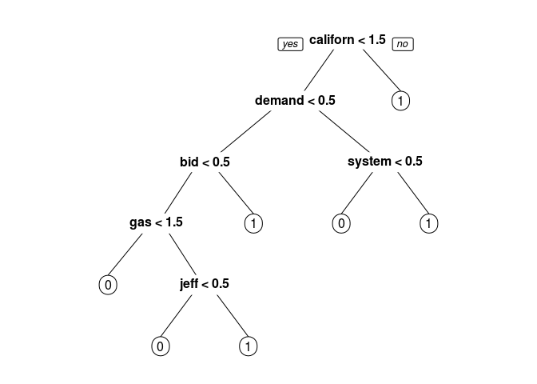
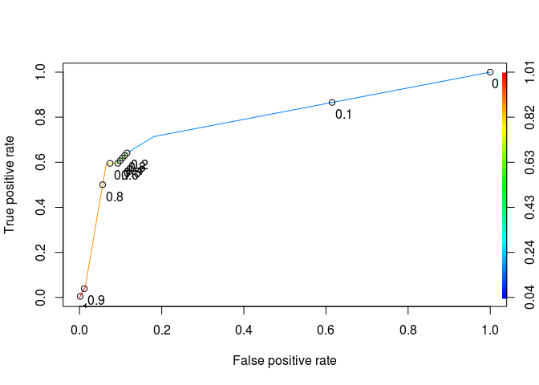

# Enron


```r
library(dplyr)
```

```
## 
## Attaching package: 'dplyr'
```

```
## The following objects are masked from 'package:stats':
## 
##     filter, lag
```

```
## The following objects are masked from 'package:base':
## 
##     intersect, setdiff, setequal, union
```

```r
library(tidyr)
library(caret)
```

```
## Loading required package: lattice
```

```
## Loading required package: ggplot2
```

```r
library(tm)
```

```
## Loading required package: NLP
```

```
## 
## Attaching package: 'NLP'
```

```
## The following object is masked from 'package:ggplot2':
## 
##     annotate
```

```r
library(SnowballC)
library(caTools)
library(rpart)
library(rpart.plot)
library(ROCR)
```

```
## Loading required package: gplots
```

```
## 
## Attaching package: 'gplots'
```

```
## The following object is masked from 'package:stats':
## 
##     lowess
```


```r
df<-read.csv('Unit5_1/energy_bids.csv')
colnames(df)
```

```
## [1] "email"      "responsive"
```


```r
strwrap(df$email[1])
```

```
##  [1] "North America's integrated electricity market requires cooperation"                         
##  [2] "on environmental policies Commission for Environmental Cooperation"                         
##  [3] "releases working paper on North America's electricity market"                               
##  [4] "Montreal, 27 November 2001 -- The North American Commission for"                            
##  [5] "Environmental Cooperation (CEC) is releasing a working paper"                               
##  [6] "highlighting the trend towards increasing trade, competition and"                           
##  [7] "cross-border investment in electricity between Canada, Mexico and"                          
##  [8] "the United States. It is hoped that the working paper,"                                     
##  [9] "Environmental Challenges and Opportunities in the Evolving North"                           
## [10] "American Electricity Market, will stimulate public discussion"                              
## [11] "around a CEC symposium of the same title about the need to"                                 
## [12] "coordinate environmental policies trinationally as a North"                                 
## [13] "America-wide electricity market develops. The CEC symposium will"                           
## [14] "take place in San Diego on 29-30 November, and will bring together"                         
## [15] "leading experts from industry, academia, NGOs and the governments"                          
## [16] "of Canada, Mexico and the United States to consider the impact of"                          
## [17] "the evolving continental electricity market on human health and"                            
## [18] "the environment. \"Our goal [with the working paper and the"                                
## [19] "symposium] is to highlight key environmental issues that must be"                           
## [20] "addressed as the electricity markets in North America become more"                          
## [21] "and more integrated,\" said Janine Ferretti, executive director of"                         
## [22] "the CEC. \"We want to stimulate discussion around the important"                            
## [23] "policy questions being raised so that countries can cooperate in"                           
## [24] "their approach to energy and the environment.\" The CEC, an"                                
## [25] "international organization created under an environmental side"                             
## [26] "agreement to NAFTA known as the North American Agreement on"                                
## [27] "Environmental Cooperation, was established to address regional"                             
## [28] "environmental concerns, help prevent potential trade and"                                   
## [29] "environmental conflicts, and promote the effective enforcement of"                          
## [30] "environmental law. The CEC Secretariat believes that greater North"                         
## [31] "American cooperation on environmental policies regarding the"                               
## [32] "continental electricity market is necessary to: * protect air"                              
## [33] "quality and mitigate climate change, * minimize the possibility of"                         
## [34] "environment-based trade disputes, * ensure a dependable supply of"                          
## [35] "reasonably priced electricity across North America * avoid"                                 
## [36] "creation of pollution havens, and * ensure local and national"                              
## [37] "environmental measures remain effective. The Changing Market The"                           
## [38] "working paper profiles the rapid changing North American"                                   
## [39] "electricity market. For example, in 2001, the US is projected to"                           
## [40] "export 13.1 thousand gigawatt-hours (GWh) of electricity to Canada"                         
## [41] "and Mexico. By 2007, this number is projected to grow to 16.9"                              
## [42] "thousand GWh of electricity. \"Over the past few decades, the North"                        
## [43] "American electricity market has developed into a complex array of"                          
## [44] "cross-border transactions and relationships,\" said Phil Sharp,"                            
## [45] "former US congressman and chairman of the CEC's Electricity"                                
## [46] "Advisory Board. \"We need to achieve this new level of cooperation"                         
## [47] "in our environmental approaches as well.\" The Environmental"                               
## [48] "Profile of the Electricity Sector The electricity sector is the"                            
## [49] "single largest source of nationally reported toxins in the United"                          
## [50] "States and Canada and a large source in Mexico. In the US, the"                             
## [51] "electricity sector emits approximately 25 percent of all NOx"                               
## [52] "emissions, roughly 35 percent of all CO2 emissions, 25 percent of"                          
## [53] "all mercury emissions and almost 70 percent of SO2 emissions."                              
## [54] "These emissions have a large impact on airsheds, watersheds and"                            
## [55] "migratory species corridors that are often shared between the"                              
## [56] "three North American countries. \"We want to discuss the possible"                          
## [57] "outcomes from greater efforts to coordinate federal, state or"                              
## [58] "provincial environmental laws and policies that relate to the"                              
## [59] "electricity sector,\" said Ferretti. \"How can we develop more"                             
## [60] "compatible environmental approaches to help make domestic"                                  
## [61] "environmental policies more effective?\" The Effects of an"                                 
## [62] "Integrated Electricity Market One key issue raised in the paper is"                         
## [63] "the effect of market integration on the competitiveness of"                                 
## [64] "particular fuels such as coal, natural gas or renewables. Fuel"                             
## [65] "choice largely determines environmental impacts from a specific"                            
## [66] "facility, along with pollution control technologies, performance"                           
## [67] "standards and regulations. The paper highlights other impacts of a"                         
## [68] "highly competitive market as well. For example, concerns about so"                          
## [69] "called \"pollution havens\" arise when significant differences in"                          
## [70] "environmental laws or enforcement practices induce power companies"                         
## [71] "to locate their operations in jurisdictions with lower standards."                          
## [72] "\"The CEC Secretariat is exploring what additional environmental"                           
## [73] "policies will work in this restructured market and how these"                               
## [74] "policies can be adapted to ensure that they enhance"                                        
## [75] "competitiveness and benefit the entire region,\" said Sharp."                               
## [76] "Because trade rules and policy measures directly influence the"                             
## [77] "variables that drive a successfully integrated North American"                              
## [78] "electricity market, the working paper also addresses fuel choice,"                          
## [79] "technology, pollution control strategies and subsidies. The CEC"                            
## [80] "will use the information gathered during the discussion period to"                          
## [81] "develop a final report that will be submitted to the Council in"                            
## [82] "early 2002. For more information or to view the live video webcast"                         
## [83] "of the symposium, please go to: http://www.cec.org/electricity."                            
## [84] "You may download the working paper and other supporting documents"                          
## [85] "from:"                                                                                      
## [86] "http://www.cec.org/programs_projects/other_initiatives/electricity/docs.cfm?varlan=english."
## [87] "Commission for Environmental Cooperation 393, rue St-Jacques"                               
## [88] "Ouest, Bureau 200 Montréal (Québec) Canada H2Y 1N9 Tel: (514)"                              
## [89] "350-4300; Fax: (514) 350-4314 E-mail: info@ccemtl.org ***********"
```

```r
table(df$responsive)
```

```
## 
##   0   1 
## 716 139
```

## Preprocess corpus ##

```r
corpus <- Corpus(VectorSource(df$email))
corpus[[1]]$content
```

```
## [1] "North America's integrated electricity market requires cooperation on environmental policies Commission for Environmental Cooperation releases working paper on North America's electricity market Montreal, 27 November 2001 -- The North American Commission for Environmental Cooperation (CEC) is releasing a working paper highlighting the trend towards increasing trade, competition and cross-border investment in electricity between Canada, Mexico and the United States. It is hoped that the working paper, Environmental Challenges and Opportunities in the Evolving North American Electricity Market, will stimulate public discussion around a CEC symposium of the same title about the need to coordinate environmental policies trinationally as a North America-wide electricity market develops. The CEC symposium will take place in San Diego on 29-30 November, and will bring together leading experts from industry, academia, NGOs and the governments of Canada, Mexico and the United States to consider the impact of the evolving continental electricity market on human health and the environment. \"Our goal [with the working paper and the symposium] is to highlight key environmental issues that must be addressed as the electricity markets in North America become more and more integrated,\" said Janine Ferretti, executive director of the CEC. \"We want to stimulate discussion around the important policy questions being raised so that countries can cooperate in their approach to energy and the environment.\" The CEC, an international organization created under an environmental side agreement to NAFTA known as the North American Agreement on Environmental Cooperation, was established to address regional environmental concerns, help prevent potential trade and environmental conflicts, and promote the effective enforcement of environmental law. The CEC Secretariat believes that greater North American cooperation on environmental policies regarding the continental electricity market is necessary to: *  protect air quality and mitigate climate change, *  minimize the possibility of environment-based trade disputes, *  ensure a dependable supply of reasonably priced electricity across North America *  avoid creation of pollution havens, and *  ensure local and national environmental measures remain effective. The Changing Market The working paper profiles the rapid changing North American electricity market. For example, in 2001, the US is projected to export 13.1 thousand gigawatt-hours (GWh) of electricity to Canada and Mexico. By 2007, this number is projected to grow to 16.9 thousand GWh of electricity. \"Over the past few decades, the North American electricity market has developed into a complex array of cross-border transactions and relationships,\" said Phil Sharp, former US congressman and chairman of the CEC's Electricity Advisory Board. \"We need to achieve this new level of cooperation in our environmental approaches as well.\" The Environmental Profile of the Electricity Sector The electricity sector is the single largest source of nationally reported toxins in the United States and Canada and a large source in Mexico. In the US, the electricity sector emits approximately 25 percent of all NOx emissions, roughly 35 percent of all CO2 emissions, 25 percent of all mercury emissions and almost 70 percent of SO2 emissions. These emissions have a large impact on airsheds, watersheds and migratory species corridors that are often shared between the three North American countries. \"We want to discuss the possible outcomes from greater efforts to coordinate federal, state or provincial environmental laws and policies that relate to the electricity sector,\" said Ferretti. \"How can we develop more compatible environmental approaches to help make domestic environmental policies more effective?\" The Effects of an Integrated Electricity Market One key issue raised in the paper is the effect of market integration on the competitiveness of particular fuels such as coal, natural gas or renewables. Fuel choice largely determines environmental impacts from a specific facility, along with pollution control technologies, performance standards and regulations. The paper highlights other impacts of a highly competitive market as well. For example, concerns about so called \"pollution havens\" arise when significant differences in environmental laws or enforcement practices induce power companies to locate their operations in jurisdictions with lower standards. \"The CEC Secretariat is exploring what additional environmental policies will work in this restructured market and how these policies can be adapted to ensure that they enhance competitiveness and benefit the entire region,\" said Sharp. Because trade rules and policy measures directly influence the variables that drive a successfully integrated North American electricity market, the working paper also addresses fuel choice, technology, pollution control strategies and subsidies. The CEC will use the information gathered during the discussion period to develop a final report that will be submitted to the Council in early 2002. For more information or to view the live video webcast of the symposium, please go to: http://www.cec.org/electricity. You may download the working paper and other supporting documents from: http://www.cec.org/programs_projects/other_initiatives/electricity/docs.cfm?varlan=english. Commission for Environmental Cooperation 393, rue St-Jacques Ouest, Bureau 200 Montréal (Québec) Canada H2Y 1N9 Tel: (514) 350-4300; Fax: (514) 350-4314 E-mail: info@ccemtl.org ***********"
```

```r
# Convert to lower-case

corpus = tm_map(corpus, content_transformer(tolower))

corpus[[1]]$content
```

```
## [1] "north america's integrated electricity market requires cooperation on environmental policies commission for environmental cooperation releases working paper on north america's electricity market montreal, 27 november 2001 -- the north american commission for environmental cooperation (cec) is releasing a working paper highlighting the trend towards increasing trade, competition and cross-border investment in electricity between canada, mexico and the united states. it is hoped that the working paper, environmental challenges and opportunities in the evolving north american electricity market, will stimulate public discussion around a cec symposium of the same title about the need to coordinate environmental policies trinationally as a north america-wide electricity market develops. the cec symposium will take place in san diego on 29-30 november, and will bring together leading experts from industry, academia, ngos and the governments of canada, mexico and the united states to consider the impact of the evolving continental electricity market on human health and the environment. \"our goal [with the working paper and the symposium] is to highlight key environmental issues that must be addressed as the electricity markets in north america become more and more integrated,\" said janine ferretti, executive director of the cec. \"we want to stimulate discussion around the important policy questions being raised so that countries can cooperate in their approach to energy and the environment.\" the cec, an international organization created under an environmental side agreement to nafta known as the north american agreement on environmental cooperation, was established to address regional environmental concerns, help prevent potential trade and environmental conflicts, and promote the effective enforcement of environmental law. the cec secretariat believes that greater north american cooperation on environmental policies regarding the continental electricity market is necessary to: *  protect air quality and mitigate climate change, *  minimize the possibility of environment-based trade disputes, *  ensure a dependable supply of reasonably priced electricity across north america *  avoid creation of pollution havens, and *  ensure local and national environmental measures remain effective. the changing market the working paper profiles the rapid changing north american electricity market. for example, in 2001, the us is projected to export 13.1 thousand gigawatt-hours (gwh) of electricity to canada and mexico. by 2007, this number is projected to grow to 16.9 thousand gwh of electricity. \"over the past few decades, the north american electricity market has developed into a complex array of cross-border transactions and relationships,\" said phil sharp, former us congressman and chairman of the cec's electricity advisory board. \"we need to achieve this new level of cooperation in our environmental approaches as well.\" the environmental profile of the electricity sector the electricity sector is the single largest source of nationally reported toxins in the united states and canada and a large source in mexico. in the us, the electricity sector emits approximately 25 percent of all nox emissions, roughly 35 percent of all co2 emissions, 25 percent of all mercury emissions and almost 70 percent of so2 emissions. these emissions have a large impact on airsheds, watersheds and migratory species corridors that are often shared between the three north american countries. \"we want to discuss the possible outcomes from greater efforts to coordinate federal, state or provincial environmental laws and policies that relate to the electricity sector,\" said ferretti. \"how can we develop more compatible environmental approaches to help make domestic environmental policies more effective?\" the effects of an integrated electricity market one key issue raised in the paper is the effect of market integration on the competitiveness of particular fuels such as coal, natural gas or renewables. fuel choice largely determines environmental impacts from a specific facility, along with pollution control technologies, performance standards and regulations. the paper highlights other impacts of a highly competitive market as well. for example, concerns about so called \"pollution havens\" arise when significant differences in environmental laws or enforcement practices induce power companies to locate their operations in jurisdictions with lower standards. \"the cec secretariat is exploring what additional environmental policies will work in this restructured market and how these policies can be adapted to ensure that they enhance competitiveness and benefit the entire region,\" said sharp. because trade rules and policy measures directly influence the variables that drive a successfully integrated north american electricity market, the working paper also addresses fuel choice, technology, pollution control strategies and subsidies. the cec will use the information gathered during the discussion period to develop a final report that will be submitted to the council in early 2002. for more information or to view the live video webcast of the symposium, please go to: http://www.cec.org/electricity. you may download the working paper and other supporting documents from: http://www.cec.org/programs_projects/other_initiatives/electricity/docs.cfm?varlan=english. commission for environmental cooperation 393, rue st-jacques ouest, bureau 200 montréal (québec) canada h2y 1n9 tel: (514) 350-4300; fax: (514) 350-4314 e-mail: info@ccemtl.org ***********"
```

```r
# Remove punctuation

corpus = tm_map(corpus, removePunctuation)

corpus[[1]]$content
```

```
## [1] "north americas integrated electricity market requires cooperation on environmental policies commission for environmental cooperation releases working paper on north americas electricity market montreal 27 november 2001  the north american commission for environmental cooperation cec is releasing a working paper highlighting the trend towards increasing trade competition and crossborder investment in electricity between canada mexico and the united states it is hoped that the working paper environmental challenges and opportunities in the evolving north american electricity market will stimulate public discussion around a cec symposium of the same title about the need to coordinate environmental policies trinationally as a north americawide electricity market develops the cec symposium will take place in san diego on 2930 november and will bring together leading experts from industry academia ngos and the governments of canada mexico and the united states to consider the impact of the evolving continental electricity market on human health and the environment our goal with the working paper and the symposium is to highlight key environmental issues that must be addressed as the electricity markets in north america become more and more integrated said janine ferretti executive director of the cec we want to stimulate discussion around the important policy questions being raised so that countries can cooperate in their approach to energy and the environment the cec an international organization created under an environmental side agreement to nafta known as the north american agreement on environmental cooperation was established to address regional environmental concerns help prevent potential trade and environmental conflicts and promote the effective enforcement of environmental law the cec secretariat believes that greater north american cooperation on environmental policies regarding the continental electricity market is necessary to   protect air quality and mitigate climate change   minimize the possibility of environmentbased trade disputes   ensure a dependable supply of reasonably priced electricity across north america   avoid creation of pollution havens and   ensure local and national environmental measures remain effective the changing market the working paper profiles the rapid changing north american electricity market for example in 2001 the us is projected to export 131 thousand gigawatthours gwh of electricity to canada and mexico by 2007 this number is projected to grow to 169 thousand gwh of electricity over the past few decades the north american electricity market has developed into a complex array of crossborder transactions and relationships said phil sharp former us congressman and chairman of the cecs electricity advisory board we need to achieve this new level of cooperation in our environmental approaches as well the environmental profile of the electricity sector the electricity sector is the single largest source of nationally reported toxins in the united states and canada and a large source in mexico in the us the electricity sector emits approximately 25 percent of all nox emissions roughly 35 percent of all co2 emissions 25 percent of all mercury emissions and almost 70 percent of so2 emissions these emissions have a large impact on airsheds watersheds and migratory species corridors that are often shared between the three north american countries we want to discuss the possible outcomes from greater efforts to coordinate federal state or provincial environmental laws and policies that relate to the electricity sector said ferretti how can we develop more compatible environmental approaches to help make domestic environmental policies more effective the effects of an integrated electricity market one key issue raised in the paper is the effect of market integration on the competitiveness of particular fuels such as coal natural gas or renewables fuel choice largely determines environmental impacts from a specific facility along with pollution control technologies performance standards and regulations the paper highlights other impacts of a highly competitive market as well for example concerns about so called pollution havens arise when significant differences in environmental laws or enforcement practices induce power companies to locate their operations in jurisdictions with lower standards the cec secretariat is exploring what additional environmental policies will work in this restructured market and how these policies can be adapted to ensure that they enhance competitiveness and benefit the entire region said sharp because trade rules and policy measures directly influence the variables that drive a successfully integrated north american electricity market the working paper also addresses fuel choice technology pollution control strategies and subsidies the cec will use the information gathered during the discussion period to develop a final report that will be submitted to the council in early 2002 for more information or to view the live video webcast of the symposium please go to httpwwwcecorgelectricity you may download the working paper and other supporting documents from httpwwwcecorgprogramsprojectsotherinitiativeselectricitydocscfmvarlanenglish commission for environmental cooperation 393 rue stjacques ouest bureau 200 montréal québec canada h2y 1n9 tel 514 3504300 fax 514 3504314 email infoccemtlorg "
```

```r
# Look at stop words 
stopwords("english")[1:10]
```

```
##  [1] "i"         "me"        "my"        "myself"    "we"       
##  [6] "our"       "ours"      "ourselves" "you"       "your"
```

```r
# Remove stopwords and apple

corpus = tm_map(corpus, removeWords, c("apple", stopwords("english")))

corpus[[1]]$content
```

```
## [1] "north americas integrated electricity market requires cooperation  environmental policies commission  environmental cooperation releases working paper  north americas electricity market montreal 27 november 2001   north american commission  environmental cooperation cec  releasing  working paper highlighting  trend towards increasing trade competition  crossborder investment  electricity  canada mexico   united states   hoped   working paper environmental challenges  opportunities   evolving north american electricity market will stimulate public discussion around  cec symposium    title   need  coordinate environmental policies trinationally   north americawide electricity market develops  cec symposium will take place  san diego  2930 november  will bring together leading experts  industry academia ngos   governments  canada mexico   united states  consider  impact   evolving continental electricity market  human health   environment  goal   working paper   symposium   highlight key environmental issues  must  addressed   electricity markets  north america become    integrated said janine ferretti executive director   cec  want  stimulate discussion around  important policy questions  raised   countries can cooperate   approach  energy   environment  cec  international organization created   environmental side agreement  nafta known   north american agreement  environmental cooperation  established  address regional environmental concerns help prevent potential trade  environmental conflicts  promote  effective enforcement  environmental law  cec secretariat believes  greater north american cooperation  environmental policies regarding  continental electricity market  necessary    protect air quality  mitigate climate change   minimize  possibility  environmentbased trade disputes   ensure  dependable supply  reasonably priced electricity across north america   avoid creation  pollution havens    ensure local  national environmental measures remain effective  changing market  working paper profiles  rapid changing north american electricity market  example  2001  us  projected  export 131 thousand gigawatthours gwh  electricity  canada  mexico  2007  number  projected  grow  169 thousand gwh  electricity   past  decades  north american electricity market  developed   complex array  crossborder transactions  relationships said phil sharp former us congressman  chairman   cecs electricity advisory board  need  achieve  new level  cooperation   environmental approaches  well  environmental profile   electricity sector  electricity sector   single largest source  nationally reported toxins   united states  canada   large source  mexico   us  electricity sector emits approximately 25 percent   nox emissions roughly 35 percent   co2 emissions 25 percent   mercury emissions  almost 70 percent  so2 emissions  emissions   large impact  airsheds watersheds  migratory species corridors   often shared   three north american countries  want  discuss  possible outcomes  greater efforts  coordinate federal state  provincial environmental laws  policies  relate   electricity sector said ferretti  can  develop  compatible environmental approaches  help make domestic environmental policies  effective  effects   integrated electricity market one key issue raised   paper   effect  market integration   competitiveness  particular fuels   coal natural gas  renewables fuel choice largely determines environmental impacts   specific facility along  pollution control technologies performance standards  regulations  paper highlights  impacts   highly competitive market  well  example concerns   called pollution havens arise  significant differences  environmental laws  enforcement practices induce power companies  locate  operations  jurisdictions  lower standards  cec secretariat  exploring  additional environmental policies will work   restructured market    policies can  adapted  ensure   enhance competitiveness  benefit  entire region said sharp  trade rules  policy measures directly influence  variables  drive  successfully integrated north american electricity market  working paper also addresses fuel choice technology pollution control strategies  subsidies  cec will use  information gathered   discussion period  develop  final report  will  submitted   council  early 2002   information   view  live video webcast   symposium please go  httpwwwcecorgelectricity  may download  working paper   supporting documents  httpwwwcecorgprogramsprojectsotherinitiativeselectricitydocscfmvarlanenglish commission  environmental cooperation 393 rue stjacques ouest bureau 200 montréal québec canada h2y 1n9 tel 514 3504300 fax 514 3504314 email infoccemtlorg "
```

```r
# Stem document 

corpus = tm_map(corpus, stemDocument)

corpus[[1]]$content
```

```
## [1] "north america integr electr market requir cooper environment polici commiss environment cooper releas work paper north america electr market montreal 27 novemb 2001 north american commiss environment cooper cec releas work paper highlight trend toward increas trade competit crossbord invest electr canada mexico unit state hope work paper environment challeng opportun evolv north american electr market will stimul public discuss around cec symposium titl need coordin environment polici trinat north americawid electr market develop cec symposium will take place san diego 2930 novemb will bring togeth lead expert industri academia ngos govern canada mexico unit state consid impact evolv continent electr market human health environ goal work paper symposium highlight key environment issu must address electr market north america becom integr said janin ferretti execut director cec want stimul discuss around import polici question rais countri can cooper approach energi environ cec intern organ creat environment side agreement nafta known north american agreement environment cooper establish address region environment concern help prevent potenti trade environment conflict promot effect enforc environment law cec secretariat believ greater north american cooper environment polici regard continent electr market necessari protect air qualiti mitig climat chang minim possibl environmentbas trade disput ensur depend suppli reason price electr across north america avoid creation pollut haven ensur local nation environment measur remain effect chang market work paper profil rapid chang north american electr market exampl 2001 us project export 131 thousand gigawatthour gwh electr canada mexico 2007 number project grow 169 thousand gwh electr past decad north american electr market develop complex array crossbord transact relationship said phil sharp former us congressman chairman cec electr advisori board need achiev new level cooper environment approach well environment profil electr sector electr sector singl largest sourc nation report toxin unit state canada larg sourc mexico us electr sector emit approxim 25 percent nox emiss rough 35 percent co2 emiss 25 percent mercuri emiss almost 70 percent so2 emiss emiss larg impact airsh watersh migratori speci corridor often share three north american countri want discuss possibl outcom greater effort coordin feder state provinci environment law polici relat electr sector said ferretti can develop compat environment approach help make domest environment polici effect effect integr electr market one key issu rais paper effect market integr competit particular fuel coal natur gas renew fuel choic larg determin environment impact specif facil along pollut control technolog perform standard regul paper highlight impact high competit market well exampl concern call pollut haven aris signific differ environment law enforc practic induc power compani locat oper jurisdict lower standard cec secretariat explor addit environment polici will work restructur market polici can adapt ensur enhanc competit benefit entir region said sharp trade rule polici measur direct influenc variabl drive success integr north american electr market work paper also address fuel choic technolog pollut control strategi subsidi cec will use inform gather discuss period develop final report will submit council earli 2002 inform view live video webcast symposium pleas go httpwwwcecorgelectr may download work paper support document httpwwwcecorgprogramsprojectsotherinitiativeselectricitydocscfmvarlanenglish commiss environment cooper 393 rue stjacqu ouest bureau 200 montréal québec canada h2i 1n9 tel 514 3504300 fax 514 3504314 email infoccemtlorg"
```

## SparseMatrix ##

```r
dtm <- DocumentTermMatrix(corpus)
dtm
```

```
## <<DocumentTermMatrix (documents: 855, terms: 21734)>>
## Non-/sparse entries: 102510/18480060
## Sparsity           : 99%
## Maximal term length: 113
## Weighting          : term frequency (tf)
```

```r
findFreqTerms(dtm,lowfreq =1000)
```

```
## [1] "email"  "market" "power"  "will"   "enron"
```

```r
dtm<-removeSparseTerms(dtm,sparse = 0.97)
dtm
```

```
## <<DocumentTermMatrix (documents: 855, terms: 788)>>
## Non-/sparse entries: 51644/622096
## Sparsity           : 92%
## Maximal term length: 19
## Weighting          : term frequency (tf)
```

```r
labeledTerms<-as.data.frame(as.matrix(dtm))
labeledTerms$responsive <- df$responsive
str(labeledTerms)
```

```
## 'data.frame':	855 obs. of  789 variables:
##  $ 2001               : num  2 1 0 0 0 0 7 0 0 0 ...
##  $ addit              : num  1 0 0 0 0 0 1 0 0 0 ...
##  $ address            : num  3 0 0 0 2 0 0 0 0 1 ...
##  $ agreement          : num  2 0 0 0 2 0 1 0 0 1 ...
##  $ along              : num  1 0 0 0 1 0 1 0 0 0 ...
##  $ also               : num  1 0 0 0 0 0 8 0 0 0 ...
##  $ america            : num  4 0 0 0 0 0 0 0 1 0 ...
##  $ approach           : num  3 0 0 0 0 0 1 0 0 0 ...
##  $ approxim           : num  1 0 0 0 0 0 1 0 0 0 ...
##  $ around             : num  2 0 0 0 0 0 1 0 0 0 ...
##  $ avoid              : num  1 0 0 0 1 0 2 0 0 0 ...
##  $ becom              : num  1 0 0 0 0 0 4 0 0 0 ...
##  $ believ             : num  1 0 0 0 0 0 0 0 0 0 ...
##  $ benefit            : num  1 0 0 0 0 0 5 0 0 0 ...
##  $ board              : num  1 0 0 0 0 0 0 0 0 0 ...
##  $ bring              : num  1 0 0 0 0 0 2 0 0 0 ...
##  $ call               : num  1 0 0 0 0 0 7 0 0 0 ...
##  $ can                : num  3 0 0 0 0 0 11 0 0 0 ...
##  $ chairman           : num  1 0 0 0 0 0 1 0 1 0 ...
##  $ chang              : num  3 0 1 0 2 0 0 0 0 0 ...
##  $ commiss            : num  3 0 0 0 1 0 1 0 0 0 ...
##  $ compani            : num  1 0 0 0 0 1 22 0 1 0 ...
##  $ competit           : num  4 0 0 0 0 0 4 0 0 0 ...
##  $ concern            : num  2 0 0 0 0 0 3 0 0 0 ...
##  $ consid             : num  1 0 0 0 0 0 2 0 0 0 ...
##  $ control            : num  2 0 0 0 1 0 2 0 0 0 ...
##  $ coordin            : num  2 0 0 0 0 0 0 0 0 0 ...
##  $ creat              : num  1 0 0 0 0 0 1 0 0 0 ...
##  $ depend             : num  1 0 0 0 0 0 0 0 0 0 ...
##  $ determin           : num  1 0 0 0 0 0 0 0 0 0 ...
##  $ develop            : num  4 0 0 0 0 0 3 0 0 0 ...
##  $ differ             : num  1 0 0 0 1 1 1 0 0 0 ...
##  $ direct             : num  1 0 0 0 1 0 0 0 1 0 ...
##  $ director           : num  1 0 0 0 0 0 2 0 1 0 ...
##  $ discuss            : num  4 0 0 0 2 0 1 0 1 0 ...
##  $ document           : num  1 0 0 0 0 0 0 0 0 1 ...
##  $ drive              : num  1 0 0 0 0 0 2 0 0 0 ...
##  $ earli              : num  1 0 0 0 0 0 4 0 0 0 ...
##  $ effect             : num  5 0 0 0 0 0 2 0 0 0 ...
##  $ effort             : num  1 0 0 0 0 0 2 0 0 0 ...
##  $ electr             : num  20 0 0 0 1 0 6 0 0 0 ...
##  $ email              : num  1 0 0 0 2 7 0 0 1 0 ...
##  $ energi             : num  1 2 0 0 2 0 15 0 0 0 ...
##  $ ensur              : num  3 0 0 0 0 0 1 0 0 0 ...
##  $ entir              : num  1 0 0 0 0 0 2 0 0 0 ...
##  $ establish          : num  1 0 0 0 0 0 0 0 0 0 ...
##  $ exampl             : num  2 0 0 0 0 0 0 0 0 0 ...
##  $ execut             : num  1 0 0 0 0 0 4 0 0 0 ...
##  $ facil              : num  1 0 1 0 0 0 1 0 0 0 ...
##  $ fax                : num  1 0 0 0 2 0 1 0 2 0 ...
##  $ feder              : num  1 0 1 0 0 0 2 0 0 0 ...
##  $ final              : num  1 0 0 0 0 0 0 0 0 0 ...
##  $ fuel               : num  3 0 0 0 0 0 8 0 0 0 ...
##  $ gas                : num  1 0 1 0 0 0 30 0 0 0 ...
##  $ govern             : num  1 0 0 0 1 0 0 0 0 0 ...
##  $ grow               : num  1 0 0 0 0 0 0 0 0 0 ...
##  $ help               : num  2 0 0 1 0 0 2 0 0 2 ...
##  $ high               : num  1 0 0 0 0 1 8 0 0 0 ...
##  $ hope               : num  1 0 0 0 2 0 1 0 0 1 ...
##  $ impact             : num  4 0 0 0 0 0 1 0 0 0 ...
##  $ import             : num  1 0 0 0 0 0 2 0 0 0 ...
##  $ increas            : num  1 0 0 0 0 0 5 0 0 0 ...
##  $ industri           : num  1 0 0 0 0 0 20 0 0 0 ...
##  $ inform             : num  2 0 0 0 1 0 0 0 0 0 ...
##  $ intern             : num  1 0 1 0 0 0 1 0 0 0 ...
##  $ invest             : num  1 0 0 0 0 0 4 0 0 0 ...
##  $ issu               : num  2 0 3 0 7 0 5 0 0 1 ...
##  $ key                : num  2 0 0 0 0 0 1 0 0 0 ...
##  $ larg               : num  3 0 0 0 0 0 4 0 0 0 ...
##  $ law                : num  3 0 0 0 0 0 0 0 0 0 ...
##  $ lead               : num  1 0 0 0 0 0 3 0 0 0 ...
##  $ level              : num  1 0 0 0 0 0 4 0 0 0 ...
##  $ local              : num  1 0 0 0 0 0 2 0 0 0 ...
##  $ locat              : num  1 0 0 0 0 0 4 0 0 0 ...
##  $ lower              : num  1 0 0 0 0 0 4 0 0 0 ...
##  $ make               : num  1 0 0 0 1 1 10 0 0 0 ...
##  $ market             : num  15 0 3 1 0 0 48 0 0 0 ...
##  $ may                : num  1 0 0 1 0 0 4 0 8 0 ...
##  $ measur             : num  2 0 0 0 0 0 1 0 0 0 ...
##  $ must               : num  1 0 0 0 0 1 0 0 0 0 ...
##  $ nation             : num  2 0 0 0 0 0 3 0 0 0 ...
##  $ natur              : num  1 0 0 0 0 0 19 0 0 0 ...
##  $ necessari          : num  1 0 0 0 0 0 0 0 0 0 ...
##  $ need               : num  2 0 0 0 0 0 5 0 0 2 ...
##  $ new                : num  1 0 0 0 2 0 17 0 0 0 ...
##  $ north              : num  13 0 0 0 0 0 0 0 0 0 ...
##  $ novemb             : num  2 0 0 0 0 0 3 0 0 0 ...
##  $ number             : num  1 0 0 0 0 0 0 0 0 0 ...
##  $ one                : num  1 0 0 0 0 1 13 0 0 0 ...
##  $ oper               : num  1 0 0 0 2 0 1 0 0 0 ...
##  $ opportun           : num  1 0 0 0 0 0 2 0 0 0 ...
##  $ organ              : num  1 0 3 0 1 0 0 0 0 0 ...
##  $ paper              : num  9 0 0 0 0 0 0 0 0 0 ...
##  $ particular         : num  1 0 0 0 0 0 1 0 0 0 ...
##  $ past               : num  1 0 0 0 0 0 5 0 0 0 ...
##  $ percent            : num  4 0 0 0 0 0 25 0 0 0 ...
##  $ perform            : num  1 0 1 0 0 0 1 0 0 0 ...
##  $ period             : num  1 0 0 0 0 0 1 0 0 0 ...
##  $ place              : num  1 0 0 0 0 0 1 0 0 0 ...
##   [list output truncated]
```
## Create an CART Model ##

```r
set.seed(144)

splt = sample.split(labeledTerms$responsive,SplitRatio = 0.7)
df_train <- labeledTerms[splt,]
df_test <- labeledTerms[!splt,]

CART_model <- rpart(responsive~ .,data=df_train, method='class')
prp(CART_model)
```

<!-- -->

```r
prediction_CART<-predict(CART_model,newdata=df_test)

CM<-table(df_test$responsive,prediction_CART[,2]>0.5)
CM
```

```
##    
##     FALSE TRUE
##   0   195   20
##   1    17   25
```

```r
sum(diag(CM))/sum(CM)
```

```
## [1] 0.8560311
```

```r
# Prediction function
ROCRpred = prediction(prediction_CART[,2], df_test$responsive)

auc.tmp <- performance(ROCRpred,"auc"); auc <- as.numeric(auc.tmp@y.values)
auc
```

```
## [1] 0.7936323
```

```r
# Performance function
ROCRperf = performance(ROCRpred, "tpr", "fpr")


# Add threshold labels 
plot(ROCRperf, colorize=TRUE, print.cutoffs.at=seq(0,1,by=0.1), text.adj=c(-0.2,1.7))
```

<!-- -->

