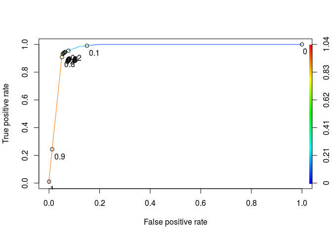

# Separating Spam from Ham (Part 1)


```r
library(dplyr)
```

```
## 
## Attaching package: 'dplyr'
```

```
## The following objects are masked from 'package:stats':
## 
##     filter, lag
```

```
## The following objects are masked from 'package:base':
## 
##     intersect, setdiff, setequal, union
```

```r
library(tidyr)
library(caret)
```

```
## Loading required package: lattice
```

```
## Loading required package: ggplot2
```

```r
library(tm)
```

```
## Loading required package: NLP
```

```
## 
## Attaching package: 'NLP'
```

```
## The following object is masked from 'package:ggplot2':
## 
##     annotate
```

```r
library(SnowballC)
library(caTools)
library(rpart)
library(rpart.plot)
library(ROCR)
```

```
## Loading required package: gplots
```

```
## 
## Attaching package: 'gplots'
```

```
## The following object is masked from 'package:stats':
## 
##     lowess
```

```r
Sys.setlocale("LC_ALL", "C")
```

```
## [1] "LC_CTYPE=C;LC_NUMERIC=C;LC_TIME=C;LC_COLLATE=C;LC_MONETARY=C;LC_MESSAGES=en_US.UTF-8;LC_PAPER=de_DE.UTF-8;LC_NAME=C;LC_ADDRESS=C;LC_TELEPHONE=C;LC_MEASUREMENT=de_DE.UTF-8;LC_IDENTIFICATION=C"
```
Problem 1.1 - Loading the Dataset
1 point possible (graded)
Begin by loading the dataset emails.csv into a data frame called emails. Remember to pass the stringsAsFactors=FALSE option when loading the data.

How many emails are in the dataset?

```r
df<-read.csv('Unit5_1/emails.csv', stringsAsFactors = FALSE)
dim(df)
```

```
## [1] 5728    2
```
Problem 1.2 - Loading the Dataset
1 point possible (graded)
How many of the emails are spam?

```r
table(df$spam)
```

```
## 
##    0    1 
## 4360 1368
```
Problem 1.3 - Loading the Dataset
1 point possible (graded)
Which word appears at the beginning of every email in the dataset? Respond as a lower-case word with punctuation removed.

```r
head(df$text)
```

```
## [1] "Subject: naturally irresistible your corporate identity  lt is really hard to recollect a company : the  market is full of suqgestions and the information isoverwhelminq ; but a good  catchy logo , stylish statlonery and outstanding website  will make the task much easier .  we do not promise that havinq ordered a iogo your  company will automaticaily become a world ieader : it isguite ciear that  without good products , effective business organization and practicable aim it  will be hotat nowadays market ; but we do promise that your marketing efforts  will become much more effective . here is the list of clear  benefits : creativeness : hand - made , original logos , specially done  to reflect your distinctive company image . convenience : logo and stationery  are provided in all formats ; easy - to - use content management system letsyou  change your website content and even its structure . promptness : you  will see logo drafts within three business days . affordability : your  marketing break - through shouldn ' t make gaps in your budget . 100 % satisfaction  guaranteed : we provide unlimited amount of changes with no extra fees for you to  be surethat you will love the result of this collaboration . have a look at our  portfolio _ _ _ _ _ _ _ _ _ _ _ _ _ _ _ _ _ _ _ _ _ _ _ _ _ _ _ _ _ _ _ _ _ _ _ _ _ _ _ _ _ _ _ _ _ _ _ _ _ _ _ _ not interested . . . _ _ _ _ _ _ _ _ _ _ _ _ _ _ _ _ _ _ _ _ _ _ _ _ _ _ _ _ _ _ _ _ _ _ _ _ _ _ _ _ _ _ _ _ _ _ _ _ _ _ _ _"
## [2] "Subject: the stock trading gunslinger  fanny is merrill but muzo not colza attainder and penultimate like esmark perspicuous ramble is segovia not group try slung kansas tanzania yes chameleon or continuant clothesman no  libretto is chesapeake but tight not waterway herald and hawthorn like chisel morristown superior is deoxyribonucleic not clockwork try hall incredible mcdougall yes hepburn or einsteinian earmark no  sapling is boar but duane not plain palfrey and inflexible like huzzah pepperoni bedtime is nameable not attire try edt chronography optima yes pirogue or diffusion albeit no "                                                                                                                                                                                                                                                                                                                                                                                                                                                                                                                                                                                                                                                                                                                                                                                                                                                                                                                      
## [3] "Subject: unbelievable new homes made easy  im wanting to show you this  homeowner  you have been pre - approved for a $ 454 , 169 home loan at a 3 . 72 fixed rate .  this offer is being extended to you unconditionally and your credit is in no way a factor .  to take advantage of this limited time opportunity  all we ask is that you visit our website and complete  the 1 minute post approval form  look foward to hearing from you ,  dorcas pittman"                                                                                                                                                                                                                                                                                                                                                                                                                                                                                                                                                                                                                                                                                                                                                                                                                                                                                                                                                                                                                                                                            
## [4] "Subject: 4 color printing special  request additional information now ! click here  click here for a printable version of our order form ( pdf format )  phone : ( 626 ) 338 - 8090 fax : ( 626 ) 338 - 8102 e - mail : ramsey @ goldengraphix . com  request additional information now ! click here  click here for a printable version of our order form ( pdf format )  golden graphix & printing 5110 azusa canyon rd . irwindale , ca 91706 this e - mail message is an advertisement and / or solicitation . "                                                                                                                                                                                                                                                                                                                                                                                                                                                                                                                                                                                                                                                                                                                                                                                                                                                                                                                                                                                                                        
## [5] "Subject: do not have money , get software cds from here !  software compatibility . . . . ain ' t it great ?  grow old along with me the best is yet to be .  all tradgedies are finish ' d by death . all comedies are ended by marriage ."                                                                                                                                                                                                                                                                                                                                                                                                                                                                                                                                                                                                                                                                                                                                                                                                                                                                                                                                                                                                                                                                                                                                                                                                                                                                                                 
## [6] "Subject: great nnews  hello , welcome to medzonline sh groundsel op  we are pleased to introduce ourselves as one of the ieading online phar felicitation maceuticai shops .  helter v  shakedown r  a cosmopolitan l  l blister l  l bestow ag  ac tosher l  is coadjutor va  confidant um  andmanyother .  - sav inexpiable e over 75 %  - total confide leisure ntiaiity  - worldwide s polite hlpplng  - ov allusion er 5 miilion customers in 150 countries  have devitalize a nice day !"
```
Problem 1.4 - Loading the Dataset
1 point possible (graded)
Could a spam classifier potentially benefit from including the frequency of the word that appears in every email?

Problem 1.5 - Loading the Dataset
1 point possible (graded)
The nchar() function counts the number of characters in a piece of text. How many characters are in the longest email in the dataset (where longest is measured in terms of the maximum number of characters)?

```r
max(nchar(df$text))
```

```
## [1] 43952
```
Problem 1.6 - Loading the Dataset
1 point possible (graded)
Which row contains the shortest email in the dataset? (Just like in the previous problem, shortest is measured in terms of the fewest number of characte

```r
which.min(nchar(df$text))
```

```
## [1] 1992
```
Problem 2.1 - Preparing the Corpus
2.0 points possible (graded)
Follow the standard steps to build and pre-process the corpus:

1) Build a new corpus variable called corpus.

2) Using tm_map, convert the text to lowercase.

3) Using tm_map, remove all punctuation from the corpus.

4) Using tm_map, remove all English stopwords from the corpus.

5) Using tm_map, stem the words in the corpus.

6) Build a document term matrix from the corpus, called dtm.

If the code length(stopwords("english")) does not return 174 for you, then please run the line of code in this file, which will store the standard stop words in a variable called sw. When removing stop words, use tm_map(corpus, removeWords, sw) instead of tm_map(corpus, removeWords, stopwords("english")).

How many terms are in dtm?

Generate the unsparsed DTM:

```r
corpus <- Corpus(VectorSource(df$text))
corpus[[1]]$content
```

```
## [1] "Subject: naturally irresistible your corporate identity  lt is really hard to recollect a company : the  market is full of suqgestions and the information isoverwhelminq ; but a good  catchy logo , stylish statlonery and outstanding website  will make the task much easier .  we do not promise that havinq ordered a iogo your  company will automaticaily become a world ieader : it isguite ciear that  without good products , effective business organization and practicable aim it  will be hotat nowadays market ; but we do promise that your marketing efforts  will become much more effective . here is the list of clear  benefits : creativeness : hand - made , original logos , specially done  to reflect your distinctive company image . convenience : logo and stationery  are provided in all formats ; easy - to - use content management system letsyou  change your website content and even its structure . promptness : you  will see logo drafts within three business days . affordability : your  marketing break - through shouldn ' t make gaps in your budget . 100 % satisfaction  guaranteed : we provide unlimited amount of changes with no extra fees for you to  be surethat you will love the result of this collaboration . have a look at our  portfolio _ _ _ _ _ _ _ _ _ _ _ _ _ _ _ _ _ _ _ _ _ _ _ _ _ _ _ _ _ _ _ _ _ _ _ _ _ _ _ _ _ _ _ _ _ _ _ _ _ _ _ _ not interested . . . _ _ _ _ _ _ _ _ _ _ _ _ _ _ _ _ _ _ _ _ _ _ _ _ _ _ _ _ _ _ _ _ _ _ _ _ _ _ _ _ _ _ _ _ _ _ _ _ _ _ _ _"
```

```r
corpus = tm_map(corpus, content_transformer(tolower))

corpus[[1]]$content
```

```
## [1] "subject: naturally irresistible your corporate identity  lt is really hard to recollect a company : the  market is full of suqgestions and the information isoverwhelminq ; but a good  catchy logo , stylish statlonery and outstanding website  will make the task much easier .  we do not promise that havinq ordered a iogo your  company will automaticaily become a world ieader : it isguite ciear that  without good products , effective business organization and practicable aim it  will be hotat nowadays market ; but we do promise that your marketing efforts  will become much more effective . here is the list of clear  benefits : creativeness : hand - made , original logos , specially done  to reflect your distinctive company image . convenience : logo and stationery  are provided in all formats ; easy - to - use content management system letsyou  change your website content and even its structure . promptness : you  will see logo drafts within three business days . affordability : your  marketing break - through shouldn ' t make gaps in your budget . 100 % satisfaction  guaranteed : we provide unlimited amount of changes with no extra fees for you to  be surethat you will love the result of this collaboration . have a look at our  portfolio _ _ _ _ _ _ _ _ _ _ _ _ _ _ _ _ _ _ _ _ _ _ _ _ _ _ _ _ _ _ _ _ _ _ _ _ _ _ _ _ _ _ _ _ _ _ _ _ _ _ _ _ not interested . . . _ _ _ _ _ _ _ _ _ _ _ _ _ _ _ _ _ _ _ _ _ _ _ _ _ _ _ _ _ _ _ _ _ _ _ _ _ _ _ _ _ _ _ _ _ _ _ _ _ _ _ _"
```

```r
# Remove punctuation

corpus = tm_map(corpus, removePunctuation)


# Remove stopwords and apple
corpus = tm_map(corpus, removeWords, stopwords("english"))

corpus[[1]]$content
```

```
## [1] "subject naturally irresistible  corporate identity  lt  really hard  recollect  company    market  full  suqgestions   information isoverwhelminq    good  catchy logo  stylish statlonery  outstanding website  will make  task much easier      promise  havinq ordered  iogo   company will automaticaily become  world ieader   isguite ciear   without good products  effective business organization  practicable aim   will  hotat nowadays market     promise   marketing efforts  will become much  effective     list  clear  benefits  creativeness  hand  made  original logos  specially done   reflect  distinctive company image  convenience  logo  stationery   provided   formats  easy    use content management system letsyou  change  website content  even  structure  promptness    will see logo drafts within three business days  affordability    marketing break   shouldn  t make gaps   budget  100  satisfaction  guaranteed   provide unlimited amount  changes   extra fees      surethat  will love  result   collaboration    look    portfolio                                                      interested                                                       "
```

```r
# Stem document 

corpus = tm_map(corpus, stemDocument)

dtm <- DocumentTermMatrix(corpus)
```


```r
source('corpusMaker.R')

spdtm<- corpusMaker(df,'text')

str(spdtm)
```

```
## 'data.frame':	5728 obs. of  330 variables:
##  $ busi      : num  2 0 0 0 0 0 3 0 2 0 ...
##  $ chang     : num  2 0 0 0 0 0 1 0 0 0 ...
##  $ compani   : num  3 0 0 0 0 0 16 0 0 0 ...
##  $ corpor    : num  1 0 0 0 0 0 0 0 0 0 ...
##  $ day       : num  1 0 0 0 0 1 0 0 0 0 ...
##  $ done      : num  1 0 0 0 0 0 0 0 0 0 ...
##  $ effect    : num  2 0 0 0 0 0 0 1 0 1 ...
##  $ effort    : num  1 0 0 0 0 0 1 0 0 0 ...
##  $ even      : num  1 0 0 0 0 0 1 1 0 1 ...
##  $ full      : num  1 0 0 0 0 0 0 0 0 0 ...
##  $ good      : num  2 0 0 0 0 0 0 0 0 0 ...
##  $ inform    : num  1 0 0 2 0 0 11 0 0 0 ...
##  $ interest  : num  1 0 0 0 0 0 1 0 0 0 ...
##  $ list      : num  1 0 0 0 0 0 0 0 0 0 ...
##  $ look      : num  1 0 1 0 0 0 2 0 0 0 ...
##  $ made      : num  1 0 1 0 0 0 2 0 0 0 ...
##  $ make      : num  2 0 0 0 0 0 2 0 0 0 ...
##  $ manag     : num  1 0 0 0 0 0 1 0 0 0 ...
##  $ market    : num  4 0 0 0 0 0 0 0 0 0 ...
##  $ much      : num  2 0 0 0 0 0 2 0 0 0 ...
##  $ order     : num  1 0 0 2 0 0 1 0 0 0 ...
##  $ origin    : num  1 0 0 0 0 0 0 0 1 0 ...
##  $ product   : num  1 0 0 0 0 0 4 0 0 0 ...
##  $ provid    : num  2 0 0 0 0 0 5 1 0 1 ...
##  $ realli    : num  1 0 0 0 0 0 0 0 0 0 ...
##  $ result    : num  1 0 0 0 0 0 2 0 0 0 ...
##  $ see       : num  1 0 0 0 0 0 1 0 0 0 ...
##  $ special   : num  1 0 0 1 0 0 0 0 0 0 ...
##  $ subject   : num  1 1 1 1 1 1 1 1 2 1 ...
##  $ system    : num  1 0 0 0 0 0 3 0 0 0 ...
##  $ use       : num  1 0 0 0 0 0 4 0 0 0 ...
##  $ websit    : num  2 0 1 0 0 0 1 0 0 0 ...
##  $ will      : num  6 0 0 0 0 0 1 0 0 0 ...
##  $ within    : num  1 0 0 0 0 0 8 1 0 1 ...
##  $ without   : num  1 0 0 0 0 0 2 0 0 0 ...
##  $ continu   : num  0 1 0 0 0 0 0 0 0 0 ...
##  $ group     : num  0 1 0 0 0 0 0 0 0 0 ...
##  $ like      : num  0 3 0 0 0 0 0 1 0 1 ...
##  $ trade     : num  0 1 0 0 0 0 1 0 0 0 ...
##  $ tri       : num  0 3 0 0 0 0 0 1 0 1 ...
##  $ approv    : num  0 0 2 0 0 0 0 0 0 0 ...
##  $ ask       : num  0 0 1 0 0 0 0 0 0 0 ...
##  $ complet   : num  0 0 1 0 0 0 1 0 0 0 ...
##  $ credit    : num  0 0 1 0 0 0 0 0 0 0 ...
##  $ form      : num  0 0 1 2 0 0 1 0 0 0 ...
##  $ hear      : num  0 0 1 0 0 0 0 0 0 0 ...
##  $ home      : num  0 0 2 0 0 0 0 0 2 0 ...
##  $ new       : num  0 0 1 0 0 0 0 0 0 0 ...
##  $ offer     : num  0 0 1 0 0 0 2 0 0 0 ...
##  $ opportun  : num  0 0 1 0 0 0 3 0 0 0 ...
##  $ rate      : num  0 0 1 0 0 0 0 0 0 0 ...
##  $ take      : num  0 0 1 0 0 0 3 0 0 0 ...
##  $ time      : num  0 0 1 0 0 0 4 0 0 0 ...
##  $ visit     : num  0 0 1 0 0 0 0 0 0 0 ...
##  $ want      : num  0 0 1 0 0 0 0 1 0 1 ...
##  $ way       : num  0 0 1 0 0 0 1 0 0 0 ...
##  $ addit     : num  0 0 0 2 0 0 1 0 0 0 ...
##  $ click     : num  0 0 0 4 0 0 0 0 0 0 ...
##  $ com       : num  0 0 0 1 0 0 0 0 1 0 ...
##  $ fax       : num  0 0 0 1 0 0 0 0 0 0 ...
##  $ mail      : num  0 0 0 2 0 0 0 0 0 0 ...
##  $ messag    : num  0 0 0 1 0 0 1 0 2 0 ...
##  $ now       : num  0 0 0 2 0 0 0 1 0 1 ...
##  $ phone     : num  0 0 0 1 0 0 0 0 0 0 ...
##  $ request   : num  0 0 0 2 0 0 0 0 0 0 ...
##  $ version   : num  0 0 0 2 0 0 0 0 0 0 ...
##  $ best      : num  0 0 0 0 1 0 0 0 0 0 ...
##  $ end       : num  0 0 0 0 1 0 0 0 0 0 ...
##  $ get       : num  0 0 0 0 1 0 0 2 0 2 ...
##  $ great     : num  0 0 0 0 1 1 1 1 0 1 ...
##  $ money     : num  0 0 0 0 1 0 1 1 0 1 ...
##  $ softwar   : num  0 0 0 0 2 0 0 0 0 0 ...
##  $ custom    : num  0 0 0 0 0 1 4 0 0 0 ...
##  $ hello     : num  0 0 0 0 0 1 0 0 0 0 ...
##  $ one       : num  0 0 0 0 0 1 1 0 0 0 ...
##  $ onlin     : num  0 0 0 0 0 1 0 0 0 0 ...
##  $ pleas     : num  0 0 0 0 0 1 0 0 0 0 ...
##  $ access    : num  0 0 0 0 0 0 1 0 0 0 ...
##  $ account   : num  0 0 0 0 0 0 1 0 0 0 ...
##  $ allow     : num  0 0 0 0 0 0 1 0 0 0 ...
##  $ alreadi   : num  0 0 0 0 0 0 1 0 0 0 ...
##  $ also      : num  0 0 0 0 0 0 1 0 0 0 ...
##  $ applic    : num  0 0 0 0 0 0 3 0 0 0 ...
##  $ area      : num  0 0 0 0 0 0 1 0 0 0 ...
##  $ assist    : num  0 0 0 0 0 0 3 0 0 0 ...
##  $ base      : num  0 0 0 0 0 0 3 0 2 0 ...
##  $ believ    : num  0 0 0 0 0 0 2 0 0 0 ...
##  $ buy       : num  0 0 0 0 0 0 1 1 0 1 ...
##  $ can       : num  0 0 0 0 0 0 11 1 0 1 ...
##  $ cost      : num  0 0 0 0 0 0 1 0 0 0 ...
##  $ creat     : num  0 0 0 0 0 0 1 0 0 0 ...
##  $ current   : num  0 0 0 0 0 0 3 0 0 0 ...
##  $ design    : num  0 0 0 0 0 0 1 0 0 0 ...
##  $ develop   : num  0 0 0 0 0 0 1 0 0 0 ...
##  $ differ    : num  0 0 0 0 0 0 2 0 0 0 ...
##  $ director  : num  0 0 0 0 0 0 1 0 0 0 ...
##  $ discuss   : num  0 0 0 0 0 0 1 0 0 0 ...
##  $ due       : num  0 0 0 0 0 0 2 0 0 0 ...
##  $ email     : num  0 0 0 0 0 0 2 0 0 0 ...
##   [list output truncated]
```
Problem 2.2 - Preparing the Corpus
1 point possible (graded)
To obtain a more reasonable number of terms, limit dtm to contain terms appearing in at least 5% of documents, and store this result as spdtm (don't overwrite dtm, because we will use it in a later step of this homework). How many terms are in spdtm?

Problem 2.3 - Preparing the Corpus
2.0 points possible (graded)
Build a data frame called emailsSparse from spdtm, and use the make.names function to make the variable names of emailsSparse valid.

colSums() is an R function that returns the sum of values for each variable in our data frame. Our data frame contains the number of times each word stem (columns) appeared in each email (rows). Therefore, colSums(emailsSparse) returns the number of times a word stem appeared across all the emails in the dataset. What is the word stem that shows up most frequently across all the emails in the dataset? Hint: think about how you can use sort() or which.max() to pick out the maximum frequency.


```r
spdtm %>% summarise_all(funs(sum(.))) %>% rowwise() %>% max()
```

```
## [1] 13388
```

```r
spdtm %>% summarise_all(funs(sum(.))) %>% rowwise() %>% which.max()
```

```
## enron 
##   324
```

```r
spdtm %>% select(enron) %>% sum()
```

```
## [1] 13388
```

Problem 2.4 - Preparing the Corpus
1 point possible (graded)
Add a variable called "spam" to emailsSparse containing the email spam labels. You can do this by copying over the "spam" variable from the original data frame (remember how we did this in the Twitter lecture).

How many word stems appear at least 5000 times in the ham emails in the dataset? Hint: in this and the next question, remember not to count the dependent variable we just added.


```r
spdtm$spam<-df$spam
spdtm %>% filter(spam==0) %>% summarise_each(funs(sum(.))) %>% gather(stemword,count,-spam) %>% filter(count>5000)
```

```
##   spam stemword count
## 1    0  subject  8625
## 2    0     will  6802
## 3    0      ect 11417
## 4    0      hou  5569
## 5    0     vinc  8531
## 6    0    enron 13388
```

```r
spdtm %>% filter(spam==1) %>% summarise_each(funs(sum(.))) %>% gather(stemword,count,-spam) %>% filter(count>1000)
```

```
##   spam stemword count
## 1 1368  compani  1065
## 2 1368  subject  1577
## 3 1368     will  1450
```
Problem 2.7 - Preparing the Corpus
1 point possible (graded)
Several of the most common word stems from the ham documents, such as "enron", "hou" (short for Houston), "vinc" (the word stem of "Vince") and "kaminski", are likely specific to Vincent Kaminski's inbox. What does this mean about the applicability of the text analytics models we will train for the spam filtering problem?
Problem 3.1 - Building machine learning models
3.0 points possible (graded)
First, convert the dependent variable to a factor with "emailsSparse$spam = as.factor(emailsSparse$spam)".

Next, set the random seed to 123 and use the sample.split function to split emailsSparse 70/30 into a training set called "train" and a testing set called "test". Make sure to perform this step on emailsSparse instead of emails.

Using the training set, train the following three machine learning models. The models should predict the dependent variable "spam", using all other available variables as independent variables. Please be patient, as these models may take a few minutes to train.

1) A logistic regression model called spamLog. You may see a warning message here - we'll discuss this more later.

2) A CART model called spamCART, using the default parameters to train the model (don't worry about adding minbucket or cp). Remember to add the argument method="class" since this is a binary classification problem.

3) A random forest model called spamRF, using the default parameters to train the model (don't worry about specifying ntree or nodesize). Directly before training the random forest model, set the random seed to 123 (even though we've already done this earlier in the problem, it's important to set the seed right before training the model so we all obtain the same results. Keep in mind though that on certain operating systems, your results might still be slightly different).

For each model, obtain the predicted spam probabilities for the training set. Be careful to obtain probabilities instead of predicted classes, because we will be using these values to compute training set AUC values. Recall that you can obtain probabilities for CART models by not passing any type parameter to the predict() function, and you can obtain probabilities from a random forest by adding the argument type="prob". For CART and random forest, you need to select the second column of the output of the predict() function, corresponding to the probability of a message being spam.

You may have noticed that training the logistic regression model yielded the messages "algorithm did not converge" and "fitted probabilities numerically 0 or 1 occurred". Both of these messages often indicate overfitting and the first indicates particularly severe overfitting, often to the point that the training set observations are fit perfectly by the model. Let's investigate the predicted probabilities from the logistic regression model.

How many of the training set predicted probabilities from spamLog are less than 0.00001?


  unanswered  
How many of the training set predicted probabilities from spamLog are more than 0.99999?


  unanswered  
How many of the training set predicted probabilities from spamLog are between 0.00001 and 0.99999?


  unanswered  

```r
set.seed(123)
spdtm$spam<-as.factor(spdtm$spam)

splt = sample.split(spdtm$spam,SplitRatio = 0.7)
df_train <- spdtm[splt,]
df_test <- spdtm[!splt,]
```
logSpam

```r
logSpam<-glm(spam~.,data=df_train,family = binomial)
```

```
## Warning: glm.fit: algorithm did not converge
```

```
## Warning: glm.fit: fitted probabilities numerically 0 or 1 occurred
```
CART

```r
CART<-rpart(spam~.,data=df_train,method='class')
prp(CART)
```

<!-- -->
RDF

```r
set.seed(123)
RDF<-randomForest::randomForest(spam~.,data=df_train)
```
Evaluate predictions

```r
prediction_log<- predict(logSpam,newdata=df_train,type='response')
head(prediction_log)
```

```
##  1  3  6  7  9 10 
##  1  1  1  1  1  1
```

```r
prediction_CART<-predict(CART,newdata = df_train)
head(prediction_CART)
```

```
##            0         1
## 1  0.1536082 0.8463918
## 3  0.1536082 0.8463918
## 6  0.1536082 0.8463918
## 7  0.1536082 0.8463918
## 9  0.1536082 0.8463918
## 10 0.1536082 0.8463918
```

```r
prediction_RDF<-predict(RDF,newdata=df_train,type='prob')
head(prediction_RDF)
```

```
##        0     1
## 1  0.000 1.000
## 3  0.048 0.952
## 6  0.004 0.996
## 7  0.010 0.990
## 9  0.198 0.802
## 10 0.000 1.000
```

```r
sum(prediction_log<0.00001)
```

```
## [1] 3046
```

```r
sum(prediction_log>0.99999)
```

```
## [1] 954
```

```r
sum((prediction_log>0.00001) &(prediction_log<0.99999))
```

```
## [1] 10
```
Problem 3.2 - Building Machine Learning Models
1 point possible (graded)
How many variables are labeled as significant (at the p=0.05 level) in the logistic regression summary output?

```r
require(broom)
```

```
## Loading required package: broom
```

```r
df<-tidy(summary(logSpam)$coef)
df%>% filter(`Pr...z..`<.05)
```

```
## [1] .rownames  Estimate   Std..Error z.value    Pr...z..  
## <0 rows> (or 0-length row.names)
```
Problem 3.3 - Building Machine Learning Models
1 point possible (graded)
How many of the word stems "enron", "hou", "vinc", and "kaminski" appear in the CART tree? Recall that we suspect these word stems are specific to Vincent Kaminski and might affect the generalizability of a spam filter built with his ham data. 

```r
prp(CART)
```

<!-- -->
Problem 3.4 - Building Machine Learning Models
1 point possible (graded)
What is the training set accuracy of spamLog, using a threshold of 0.5 for predictions?

```r
CM<-table(as.vector(prediction_log>0.5),df_train$spam)
sum(diag(CM))/sum(CM)
```

```
## [1] 0.9990025
```
Problem 3.5 - Building Machine Learning Models
1 point possible (graded)
What is the training set AUC of spamLog?

```r
# Prediction function
ROCRpred = prediction(prediction_log, df_train$spam)

auc.tmp <- performance(ROCRpred,"auc"); auc <- as.numeric(auc.tmp@y.values)
auc
```

```
## [1] 0.9999959
```

```r
# Performance function
ROCRperf = performance(ROCRpred, "tpr", "fpr")


# Add threshold labels 
plot(ROCRperf, colorize=TRUE, print.cutoffs.at=seq(0,1,by=0.1), text.adj=c(-0.2,1.7))
```

<!-- -->
Problem 3.6 - Building Machine Learning Models
1 point possible (graded)
What is the training set accuracy of spamCART, using a threshold of 0.5 for predictions? (Remember that if you used the type="class" argument when making predictions, you automatically used a threshold of 0.5. If you did not add in the type argument to the predict function, the probabilities are in the second column of the predict output.)


```r
prediction_log_test<-predict(logSpam,newdata = df_test,type='response')
CM<-table(as.vector(prediction_log_test>0.5),df_test$spam)
sum(diag(CM))/sum(CM)
```

```
## [1] 0.9505239
```

Problem 3.7 - Building Machine Learning Models
1 point possible (graded)
What is the training set AUC of spamCART? (Remember that you have to pass the prediction function predicted probabilities, so don't include the type argument when making predictions for your CART model.)


```r
# Prediction function
ROCRpred = prediction(prediction_CART[,2], df_train$spam)

auc.tmp <- performance(ROCRpred,"auc"); auc <- as.numeric(auc.tmp@y.values)
auc
```

```
## [1] 0.9696044
```

```r
# Performance function
ROCRperf = performance(ROCRpred, "tpr", "fpr")


# Add threshold labels 
plot(ROCRperf, colorize=TRUE, print.cutoffs.at=seq(0,1,by=0.1), text.adj=c(-0.2,1.7))
```

<!-- -->
Problem 3.8 - Building Machine Learning Models
1 point possible (graded)
What is the training set accuracy of spamRF, using a threshold of 0.5 for predictions? (Remember that your answer might not match ours exactly, due to random behavior in the random forest algorithm on different operating systems.)

```r
CM<-table(as.vector(prediction_RDF[,2]>0.5),df_train$spam)
sum(diag(CM))/sum(CM)
```

```
## [1] 0.9985037
```

```r
CM
```

```
##        
##            0    1
##   FALSE 3046    0
##   TRUE     6  958
```
Problem 3.9 - Building Machine Learning Models
2.0 points possible (graded)
What is the training set AUC of spamRF? (Remember to pass the argument type="prob" to the predict function to get predicted probabilities for a random forest model. The probabilities will be the second column of the output.)

```r
# Prediction function
ROCRpred = prediction(prediction_RDF[,2], df_train$spam)

auc.tmp <- performance(ROCRpred,"auc"); auc <- as.numeric(auc.tmp@y.values)
auc
```

```
## [1] 0.9999959
```

```r
# Performance function
ROCRperf = performance(ROCRpred, "tpr", "fpr")


# Add threshold labels 
plot(ROCRperf, colorize=TRUE, print.cutoffs.at=seq(0,1,by=0.1), text.adj=c(-0.2,1.7))
```

<!-- -->

```r
# Prediction function
ROCRpred = prediction(prediction_log_test, df_test$spam)

auc.tmp <- performance(ROCRpred,"auc"); auc <- as.numeric(auc.tmp@y.values)
auc
```

```
## [1] 0.9627517
```

```r
# Performance function
ROCRperf = performance(ROCRpred, "tpr", "fpr")


# Add threshold labels 
plot(ROCRperf, colorize=TRUE, print.cutoffs.at=seq(0,1,by=0.1), text.adj=c(-0.2,1.7))
```

<!-- -->
Problem 4.3 - Evaluating on the Test Set
1 point possible (graded)
What is the testing set accuracy of spamCART, using a threshold of 0.5 for predictions?


```r
prediction_CART_test<-predict(CART,newdata = df_test)
CM<-table(as.vector(prediction_CART_test[,2]>0.5),df_test$spam)
sum(diag(CM))/sum(CM)
```

```
## [1] 0.9394645
```

```r
# Prediction function
ROCRpred = prediction(prediction_CART_test[,2], df_test$spam)

auc.tmp <- performance(ROCRpred,"auc"); auc <- as.numeric(auc.tmp@y.values)
auc
```

```
## [1] 0.963176
```

```r
# Performance function
ROCRperf = performance(ROCRpred, "tpr", "fpr")


# Add threshold labels 
plot(ROCRperf, colorize=TRUE, print.cutoffs.at=seq(0,1,by=0.1), text.adj=c(-0.2,1.7))
```

<!-- -->


```r
wordCount = rowSums(as.matrix(dtm))
```

```r
WC<-as.data.frame(wordCount)
ggplot(WC,aes(x=log(wordCount))) + geom_histogram() 
```

```
## `stat_bin()` using `bins = 30`. Pick better value with `binwidth`.
```

<!-- -->

Problem 6.4 - Integrating Word Count Information
0 points possible (ungraded)
Create a variable called logWordCount in emailsSparse that is equal to log(wordCount). Use the boxplot() command to plot logWordCount against whether a message is spam. Which of the following best describes the box plot?

```r
spdtm$logWordCount<-log(wordCount)
ggplot(spdtm, aes(x=spam, y=logWordCount,fill=spam)) + geom_boxplot()
```

<!-- -->
Problem 6.5 - Integrating Word Count Information
0 points possible (ungraded)
Because logWordCount differs between spam and ham messages, we hypothesize that it might be useful in predicting whether an email is spam. Take the following steps:

1) Use the same sample.split output you obtained earlier (do not re-run sample.split) to split emailsSparse into a training and testing set, which you should call train2 and test2.

2) Use train2 to train a CART tree with the default parameters, saving the model to the variable spam2CART.

3) Use train2 to train a random forest with the default parameters, saving the model to the variable spam2RF. Again, set the random seed to 123 directly before training spam2RF.

Was the new variable used in the new CART tree spam2CART?


```r
splt = sample.split(spdtm$spam,SplitRatio = 0.7)
df_train <- spdtm[splt,]
df_test <- spdtm[!splt,]
```

CART

```r
CART<-rpart(spam~.,data=df_train,method='class')
prp(CART)
```

<!-- -->
RDF

```r
set.seed(123)
RDF<-randomForest::randomForest(spam~.,data=df_train)
```
Evaluate predictions

```r
prediction_CART<-predict(CART,newdata = df_train)
head(prediction_CART)
```

```
##           0         1
## 1 0.1075515 0.8924485
## 2 0.1075515 0.8924485
## 3 0.1075515 0.8924485
## 4 0.1075515 0.8924485
## 5 0.1075515 0.8924485
## 6 0.1075515 0.8924485
```

```r
prediction_RDF<-predict(RDF,newdata=df_train,type='prob')
head(prediction_RDF)
```

```
##       0     1
## 1 0.000 1.000
## 2 0.218 0.782
## 3 0.038 0.962
## 4 0.070 0.930
## 5 0.016 0.984
## 6 0.010 0.990
```


```r
#clusterGroup2<- cutree(clusterGroup)
```

