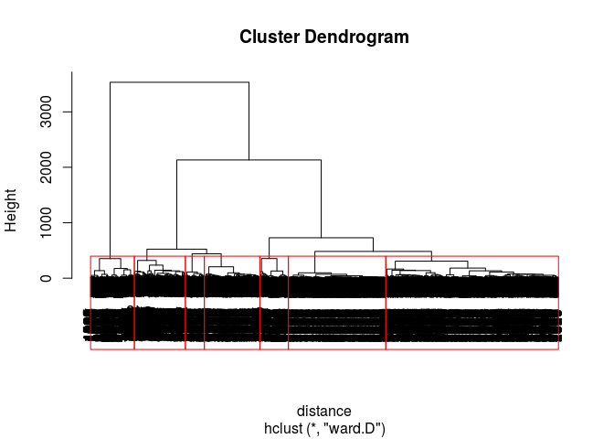

# Daily KOS


```r
library(dplyr)
```

```
## 
## Attaching package: 'dplyr'
```

```
## The following objects are masked from 'package:stats':
## 
##     filter, lag
```

```
## The following objects are masked from 'package:base':
## 
##     intersect, setdiff, setequal, union
```

```r
library(tidyr)
library(flexclust)
```

```
## Loading required package: grid
```

```
## Loading required package: lattice
```

```
## Loading required package: modeltools
```

```
## Loading required package: stats4
```

Problem 1.1 - Hierarchical Clustering
1 point possible (graded)
Let's start by building a hierarchical clustering model. First, read the data set into R. Then, compute the distances (using method="euclidean"), and use hclust to build the model (using method="ward.D"). You should cluster on all of the variables.

Running the dist function will probably take you a while. Why? Select all that apply.


We have a lot of observations, so it takes a long time to compute the distance between each pair of observations.
We have a lot of variables, so the distance computation is long.
Our variables have a wide range of values, so the distances are more complicated.
The euclidean distance is known to take a long time to compute, regardless of the size of the data.
unanswered
Submit

```r
df<-read.csv('Unit6/dailykos.csv')
head(df)
```

```
##   abandon abc ability abortion absolute abstain abu abuse accept access
## 1       0   0       0        0        0       0   0     0      0      0
## 2       0   0       0        0        0       0   0     0      0      0
## 3       0   0       0        0        0       1   0     0      0      0
## 4       0   0       0        0        0       0   0     0      0      0
## 5       0   0       0        0        0       0   0     0      0      0
## 6       0   0       0        0        0       0   0     0      0      0
##   accomplish account accurate accusations achieve acknowledge act action
## 1          0       0        0           0       0           0   0      2
## 2          0       0        0           0       0           0   0      0
## 3          0       2        0           0       0           0   0      0
## 4          0       0        0           2       0           0   0      0
## 5          0       0        0           0       0           0   0      0
## 6          0       0        0           0       0           0   0      0
##   active activist actual add added addition address admin administration
## 1      0        0      0   0     1        0       0     0              1
## 2      0        0      0   0     0        0       0     0              0
## 3      0        0      0   0     0        0       0     1              0
## 4      0        0      0   0     0        0       0     0              0
## 5      0        0      0   0     1        0       0     0              0
## 6      0        0      0   0     0        0       0     0              0
##   admit advance advantage advertise advised affair affect affiliate
## 1     0       0         0         0       0      0      0         0
## 2     0       0         0         0       0      0      0         0
## 3     0       0         0         1       0      0      0         0
## 4     0       0         1         0       0      0      0         0
## 5     1       0         0         0       0      0      0         0
## 6     0       0         0         0       0      0      0         0
##   afghanistan afraid afternoon age agencies agenda agree ahead aid aim air
## 1           0      0         0   0        0      0     0     0   0   0   0
## 2           0      0         0   0        0      0     0     0   0   0   0
## 3           0      0         0   0        0      0     0     0   0   0   0
## 4           0      0         0   0        0      0     0     0   1   0   0
## 5           0      0         0   0        0      0     0     0   1   0   0
## 6           0      0         0   0        0      0     0     0   0   0   0
##   alaska allegation allegory allied allowed alternative altsite amazing
## 1      0          0        0      0       0           0       0       0
## 2      0          0        0      0       0           0       0       0
## 3      0          0        0      0       0           0       1       0
## 4      0          0        0      0       0           0       0       0
## 5      0          0        0      0       0           0       0       0
## 6      0          0        0      0       0           0       0       0
##   amendment america american amount amp analysis analyst anecdotal anger
## 1         0       0        0      0   0        0       0         0     0
## 2         0       0        0      0   0        0       0         0     0
## 3         0       0        0      0   0        0       0         1     0
## 4         0       0        0      0   0        0       0         0     0
## 5         0       0        1      0   0        1       0         0     0
## 6         0       0        0      0   0        0       0         0     0
##   angry announce annual answer apologies apparent appeal appearance
## 1     0        0      0      0         0        0      0          0
## 2     0        0      0      0         0        0      0          0
## 3     0        0      0      0         0        0      0          0
## 4     0        0      0      1         0        0      0          0
## 5     0        0      0      0         0        0      0          0
## 6     0        0      0      0         0        0      0          0
##   applied appointed approach approval apr april arab area arent arg argue
## 1       0         0        0        1   0     0    0    0     0   0     0
## 2       0         0        0        0   0     0    0    0     0   0     0
## 3       0         0        0        0   0     0    0    0     0   0     0
## 4       0         0        0        0   0     0    0    0     0   0     0
## 5       0         0        0        1   0     0    0    0     0   0     0
## 6       0         0        0        0   0     0    0    0     0   0     0
##   argument arizona arm armstrong army arrest arrive article asap asked ass
## 1        0       0   0         0    0      0      0       0    0     0   0
## 2        0       0   0         0    0      0      0       0    0     0   0
## 3        0       0   0         0    0      0      0       0    1     0   0
## 4        0       0   0         0    0      0      0       0    0     0   0
## 5        0       0   0         0    0      0      0       0    0     0   0
## 6        0       0   0         0    0      0      0       0    0     0   0
##   assess assist associate assume atlanta atrios attack attempt attend
## 1      0      0         0      0       0      0      1       0      0
## 2      0      0         0      0       0      0      0       0      0
## 3      0      0         0      0       1      0      0       1      0
## 4      0      0         0      0       0      0      2       0      0
## 5      0      0         0      0       0      0      4       0      0
## 6      0      0         0      0       0      0      0       0      0
##   attention attorney audience aug august author average avoid backed
## 1         0        0        0   1      0      0       0     0      0
## 2         0        0        0   1      0      0       0     0      0
## 3         0        0        0   1      0      0       0     0      0
## 4         0        0        0   1      0      0       0     0      0
## 5         0        0        0   1      0      0       0     0      0
## 6         0        0        0   1      0      0       0     0      0
##   background bad baghdad balance bald ballot ban bank bar barbero base
## 1          0   0       0       0    0      0   0    0   0       0    0
## 2          0   0       0       0    0      0   0    0   0       0    0
## 3          0   0       0       0    1      0   0    0   0       0    0
## 4          0   0       0       0    0      0   0    0   0       0    0
## 5          0   0       0       0    0      0   0    0   0       0    0
## 6          0   1       0       0    0      0   0    0   0       0    0
##   basic battle battleground bear beat began begin behalf behavior believed
## 1     0      1            0    0    0     0     0      0        0        1
## 2     0      0            0    0    0     0     0      0        0        0
## 3     0      0            0    0    0     0     0      0        0        0
## 4     0      0            0    0    0     0     0      0        0        0
## 5     0      0            0    0    0     0     0      0        0        0
## 6     0      0            0    0    0     0     0      0        0        0
##   ben benefit bet bid bigger biggest bill billion bin bit black blades
## 1   0       0   0   0      0       0    0       0   0   0     0      0
## 2   0       0   0   0      0       0    0       0   0   0     0      0
## 3   0       0   0   0      0       0    0       0   0   0     0      0
## 4   0       0   0   0      0       0    0       0   0   0     0      0
## 5   0       0   0   0      0       0    0       0   0   0     0      0
## 6   0       0   0   0      0       0    0       0   0   0     0      0
##   blame blast block blog blogger blogosphere bloomfield blow blue board
## 1     0     0     0    0       0           0          0    0    0     0
## 2     0     0     0    0       0           0          0    0    0     0
## 3     0     0     0    0       0           0          0    0    0     0
## 4     0     0     0    0       0           0          0    0    0     0
## 5     0     0     0    0       0           0          0    0    0     0
## 6     0     0     0    0       0           0          0    0    0     0
##   boat bob bodies bomb book boost boston bottom bounce boxblogroll
## 1    0   0      0    0    0     0      0      0      0           0
## 2    1   0      0    0    1     0      0      0      0           0
## 3    0   1      0    0    0     0      0      0      0           1
## 4    0   0      0    0    0     0      0      0      0           0
## 5    0   0      0    0    0     0      0      0      0           0
## 6    0   0      0    0    0     0      0      0      0           0
##   boxfeed_listing boxrdf_feeds boy brad bradnickel braun break. bring
## 1               0            0   0    0          0     0      0     0
## 2               0            0   0    0          0     0      0     0
## 3               1            1   0    0          1     0      0     0
## 4               0            0   0    0          0     0      0     0
## 5               0            0   0    0          0     0      0     0
## 6               0            0   0    0          0     0      0     0
##   broadcast broke brought btw budget build built bunch burn bush
## 1         0     0       0   0      0     0     0     0    0    2
## 2         0     0       0   0      0     0     0     0    0    1
## 3         0     0       0   0      0     0     0     0    0    2
## 4         0     0       0   0      0     0     0     0    0    0
## 5         0     0       0   0      0     0     0     0    0   12
## 6         0     0       0   0      0     0     0     0    0    4
##   bushcheney bushsux business buy calculate california calistan call camp
## 1          0       0        0   0         0          0        0    0    0
## 2          0       0        0   0         0          0        0    1    0
## 3          0       1        0   0         1          0        1    0    0
## 4          0       0        0   0         0          0        0    0    0
## 5          0       0        0   1         0          0        0    0    0
## 6          0       0        0   0         0          0        0    0    0
##   campaign candidacy candidate capabilities capture car card care career
## 1        0         0         0            0       0   0    0    0      1
## 2        1         0         0            0       0   0    0    0      0
## 3        0         0         0            0       0   0    0    0      0
## 4        5         0         0            0       0   0    0    0      0
## 5        2         0         1            0       0   0    0    0      0
## 6        0         0         0            0       0   0    0    0      0
##   carolina carried carson cases cash cast casualties catch caucus caught
## 1        0       0      0     0    0    0          0     0      0      0
## 2        0       0      0     0    0    0          0     0      0      0
## 3        0       0      0     0    0    1          0     0      0      0
## 4        0       0      0     0    0    0          0     0      0      1
## 5        0       0      0     0    0    0          0     0      0      0
## 6        0       0      0     0    0    0          0     0      0      0
##   caused cbs cell center central cfr chair chairman challenge chance
## 1      0   0    0      0       0   0     0        1         0      0
## 2      0   0    0      0       0   0     0        0         0      0
## 3      0   0    0      0       0   0     0        0         4      0
## 4      0   0    0      0       0   0     0        0         0      0
## 5      0   0    0      0       0   0     0        0         0      0
## 6      0   0    0      0       0   0     0        0         0      0
##   chandler change charge check chedrcheez chemical cheney chicago chief
## 1        0      0      0     0          0        0      0       0     0
## 2        0      0      0     0          0        0      0       0     0
## 3        0      0      0     0          0        0      0       0     0
## 4        0      1      0     0          0        0      0       0     0
## 5        0      0      0     0          0        0      0       0     0
## 6        0      0      0     0          0        0      0       0     0
##   children choice choose chose chris christopher cia cited cities citizen
## 1        0      0      0     0     0           0   0     0      0       0
## 2        0      0      0     0     0           0   0     0      0       0
## 3        0      0      0     0     0           1   0     0      1       1
## 4        0      0      0     0     0           0   0     0      0       0
## 5        0      2      0     0     0           0   0     0      0       0
## 6        0      0      0     0     0           0   0     0      0       0
##   civil civilian claim clark class clean clear click clinton clock close
## 1     0        0     0     0     0     0     0     1       0     0     0
## 2     0        0     0     0     0     0     0     1       0     0     0
## 3     0        0     0     0     0     0     0     0       0     0     0
## 4     0        0     0     0     0     1     0     0       0     0     0
## 5     0        0     0     0     0     0     0     0       0     0     0
## 6     0        0     0     0     0     0     0     0       0     0     0
##   closer club cnn coalition coburn cole collect college colorado column
## 1      0    0   0         1      0    0       0       0        0      0
## 2      0    0   0         0      0    0       0       0        0      0
## 3      0    0   0         0      0    0       0       0        0      0
## 4      0    0   0         0      0    0       0       0        0      0
## 5      0    0   0         0      0    0       0       0        0      0
## 6      0    0   0         0      0    0       0       0        1      0
##   combat combination coming command commercial commission commit committee
## 1      0           0      0       0          0          0      0         2
## 2      0           0      0       1          0          0      0         0
## 3      0           0      0       0          0          0      0         0
## 4      0           0      0       0          0          0      0         0
## 5      0           0      0       0          0          0      0         0
## 6      0           0      0       0          0          0      0         0
##   common communicate communities companies compare comparison compete
## 1      0           0           0         0       2          0       0
## 2      0           0           0         0       0          0       0
## 3      0           0           0         0       0          0       0
## 4      0           0           0         0       0          0       0
## 5      0           0           0         0       1          0       0
## 6      0           0           0         0       0          0       0
##   competition complain complaint complete computer con concern conclude
## 1           0        0         0        0        0   0       0        1
## 2           0        0         0        0        0   0       0        0
## 3           0        0         0        0        0   0       0        0
## 4           0        0         0        0        0   0       0        0
## 5           0        0         0        0        0   0       0        0
## 6           0        0         0        0        0   0       0        0
##   conclusion condition conduct conference confidence confirm conflict
## 1          2         0       0          0          0       0        0
## 2          0         0       0          0          0       0        0
## 3          0         0       0          0          0       0        0
## 4          0         0       0          0          0       0        0
## 5          0         0       0          0          0       0        0
## 6          0         0       0          0          0       0        0
##   congress congressional congressman connect consequence conservation
## 1        0             2           2       0           0            0
## 2        0             0           0       0           0            0
## 3        0             0           0       0           0            0
## 4        1             0           1       0           0            0
## 5        1             0           1       0           0            0
## 6        0             0           0       0           0            0
##   considerable considered consistent constitution consultant contact
## 1            0          1          0            0          0       0
## 2            0          0          0            0          0       0
## 3            0          0          0            0          0       1
## 4            0          0          0            0          0       0
## 5            0          0          0            0          0       0
## 6            0          0          0            0          0       0
##   content contest continue contrast contribute control controversial
## 1       0       0        0        0          0       0             0
## 2       0       0        0        0          0       0             0
## 3       0       0        0        0          0       0             0
## 4       0       0        0        0          0       0             1
## 5       0       0        0        0          0       0             0
## 6       0       0        0        0          0       0             0
##   convention conversation converted convince cool coordinated corner corp
## 1          0            0         0        0    0           0      0    0
## 2          0            0         0        0    0           0      0    0
## 3          0            0         0        0    0           0      0    0
## 4          0            0         0        0    0           0      0    0
## 5          1            0         0        1    0           0      0    0
## 6          0            0         0        0    0           0      0    0
##   corporate correct corrupt cost couldnt council count countdown counties
## 1         0       0       0    0       0       0     0         0        0
## 2         0       0       0    0       0       0     0         0        0
## 3         0       0       0    0       0       0     0         0        0
## 4         0       0       0    0       1       0     0         0        0
## 5         0       0       0    0       0       0     0         0        0
## 6         0       0       0    0       0       0     0         0        0
##   countries couple court courtesy cover coverage crazy create credibility
## 1         1      0     0        0     0        0     0      0           0
## 2         0      0     0        0     0        0     0      0           0
## 3         0      0     0        0     0        0     0      1           0
## 4         0      0     0        0     1        0     0      0           0
## 5         0      0     0        0     0        0     0      0           1
## 6         0      0     0        0     0        0     0      0           0
##   credit crime criminal crisis critic crooks cross crowd cultural current
## 1      0     0        0      0      0      0     0     0        0       0
## 2      0     0        0      0      0      0     1     0        0       0
## 3      0     0        0      0      0      0     0     0        1       0
## 4      0     0        0      0      0      0     0     0        0       0
## 5      0     0        0      1      0      0     0     0        0       0
## 6      0     0        0      0      0      0     0     0        0       0
##   cut cycle dakota damage damn dan danger danielua daschle data date david
## 1   0     0      0      1    1   0      0        0       0    0    0     0
## 2   0     0      0      0    1   0      0        0       0    0    0     0
## 3   0     0      0      0    0   0      0        0       0    0    0     0
## 4   0     1      0      0    0   0      0        0       0    0    0     0
## 5   0     0      0      0    1   0      0        0       0    0    0     0
## 6   0     0      0      0    0   0      0        0       0    0    0     0
##   dccc dday dead deadline deal dean death debate dec decade december
## 1    0    0    0        0    0    0     0      0   0      0        0
## 2    0    0    0        0    0    0     0      1   0      0        0
## 3    0    0    0        0    0    0     0      1   0      0        0
## 4    0    0    0        0    0    0     0      0   0      0        0
## 5    0    0    0        0    0    0     0      0   0      0        0
## 6    0    0    0        0    0    0     0      0   0      0        0
##   decide decision declaration decline deep defeat defend defense deficit
## 1      0        0           0       0    0      0      0       0       0
## 2      0        0           0       0    0      0      0       0       0
## 3      0        0           0       0    0      0      0       0       0
## 4      0        0           0       0    0      0      0       0       0
## 5      0        0           0       0    0      0      1       0       0
## 6      0        0           0       0    0      0      0       0       0
##   define delay delegate deliver dem demand democracy democrat demonstrate
## 1      0     0        0       0   0      0         0        0           0
## 2      0     0        0       0   0      0         0        0           0
## 3      0     0        0       0   1      0         0        2           0
## 4      0     1        0       0   0      0         0        0           0
## 5      0     0        0       0   0      0         0        0           0
## 6      0     0        0       0   0      0         0        0           0
##   denied department depend describe deserve design desperate destroy
## 1      0          0      0        0       0      0         0       0
## 2      0          0      0        0       0      0         0       0
## 3      0          0      0        0       0      0         0       0
## 4      0          0      0        0       0      0         0       0
## 5      0          0      0        0       0      0         0       0
## 6      0          0      0        0       0      0         0       0
##   destruction detail determination develop dhinmi dick die differ
## 1           1      0             0       0      0    0   0      0
## 2           0      0             0       0      0    0   0      0
## 3           0      0             0       0      0    0   0      0
## 4           0      0             0       0      0    0   0      0
## 5           0      0             0       0      0    0   0      0
## 6           0      0             0       0      0    0   0      0
##   difficult diplomatic direct director direwolf disaster discussed dismiss
## 1         0          0      0        0        0        0         0       0
## 2         0          0      0        0        0        0         0       0
## 3         0          1      0        0        0        0         0       0
## 4         0          0      0        0        0        0         1       0
## 5         0          0      1        0        0        0         1       0
## 6         0          0      0        0        0        0         0       0
##   dispute district divide division dkos dkosopedia dnc document dollar
## 1       0        2      0        0    0          0   0        0      0
## 2       0        0      0        0    0          0   0        0      0
## 3       0        0      0        0    0          1   0        0      0
## 4       0        1      0        0    0          0   0        0      0
## 5       0        0      0        0    0          0   0        0      0
## 6       0        0      0        0    0          0   0        0      0
##   domestic dominance donald donate donor door doubt dozen draft draw dream
## 1        0         0      0      0     0    0     0     0     0    0     0
## 2        0         0      0      0     0    0     0     0     0    0     0
## 3        0         0      0      0     0    0     0     0     0    0     0
## 4        0         0      0      0     0    0     0     0     0    0     0
## 5        0         0      0      0     0    0     0     0     0    0     0
## 6        0         0      0      0     0    0     0     0     0    0     0
##   drfranklives drive drop drug dryfly dscc duderino due duties earlier
## 1            0     0    0    0      0    0        0   0      0       0
## 2            0     0    1    0      0    0        0   0      0       0
## 3            0     0    0    0      1    0        0   0      0       0
## 4            0     0    1    0      0    0        0   0      0       0
## 5            0     1    0    0      0    0        0   0      0       0
## 6            0     0    0    0      0    0        0   0      0       0
##   early earn easier easily east easy economic economy edge edit editor
## 1     0    0      0      0    0    0        0       0    0    0      0
## 2     0    0      0      0    0    0        0       0    0    0      0
## 3     0    0      0      0    0    0        0       1    0    0      0
## 4     0    0      0      1    0    0        0       0    0    0      0
## 5     0    0      0      0    0    0        1       0    0    0      0
## 6     0    0      0      0    0    0        0       0    0    0      0
##   educated edward effect effort egon elect electoral email emerge employ
## 1        0      0      0      0    0     0         1     0      0      0
## 2        0      0      0      0    0     0         0     0      0      0
## 3        0      0      0      0    0     1         2     0      0      0
## 4        0      0      0      0    0     2         0     0      0      0
## 5        0      0      0      0    0     3         1     0      0      0
## 6        0      0      0      0    0     0         0     0      0      0
##   employee encourage end endorse endspan enemies energy engage enjoy
## 1        0         0   0       0       0       0      0      1     0
## 2        0         0   0       0       0       0      0      0     0
## 3        0         0   0       0       1       0      0      0     0
## 4        0         0   0       0       0       0      0      0     0
## 5        0         0   1       0       0       0      1      0     0
## 6        0         0   0       0       0       0      0      0     0
##   ensure enter entire entries environment equal error essential establish
## 1      0     0      0       0           0     0     0         0         0
## 2      0     0      0       0           0     0     0         0         0
## 3      0     0      0       0           0     0     0         0         0
## 4      0     0      0       0           0     0     0         0         0
## 5      0     0      0       0           0     0     0         0         0
## 6      0     0      0       0           0     0     0         0         0
##   estimate ethic evening event eventual evidence excellent excited
## 1        0     0       0     0        0        0         0       0
## 2        0     0       0     0        0        0         0       0
## 3        0     0       0     0        0        0         0       0
## 4        0     0       0     0        0        0         0       0
## 5        0     0       0     0        0        0         0       0
## 6        0     0       0     0        0        0         0       0
##   executed exist exit expect expense experience expert explain explosion
## 1        0     0    0      0       0          0      0       0         0
## 2        0     0    0      0       0          0      0       0         0
## 3        0     0    1      0       0          1      0       0         0
## 4        0     0    0      1       1          0      0       0         0
## 5        0     0    0      2       0          0      0       0         0
## 6        0     0    0      0       0          0      0       0         0
##   expose express extend extra extreme eye face fact factor fail failure
## 1      0       0      0     0       0   0    0    1      0    0       0
## 2      0       0      0     0       0   0    0    0      0    0       0
## 3      0       0      0     0       0   0    0    0      0    0       0
## 4      0       0      0     0       0   0    0    1      0    0       0
## 5      0       0      0     0       0   0    2    1      0    2       0
## 6      0       0      0     0       0   0    0    0      0    0       0
##   fair faith fall fallujah familiar families faq farmer fast father favor
## 1    0     0    0        0        0        0   0      0    0      0     0
## 2    0     0    0        0        0        0   0      0    0      0     0
## 3    0     0    0        0        0        0   1      0    0      0     0
## 4    0     0    0        0        0        0   0      0    0      0     0
## 5    0     0    0        0        0        0   0      0    0      0     0
## 6    0     0    0        0        0        0   0      1    0      0     0
##   favorite fbi fear feature feb february federal feel fellow felt fewer
## 1        0   0    0       0   0        0       0    0      0    0     0
## 2        0   0    0       0   0        0       0    0      0    0     0
## 3        0   0    0       0   0        0       0    0      0    0     0
## 4        0   0    0       0   0        0       0    0      0    0     0
## 5        0   0    0       0   0        0       0    0      0    0     0
## 6        0   0    0       0   0        0       0    0      0    0     0
##   field fight figure file fill final finance financial find finish fire
## 1     0     0      0    0    0     1       0         0    0      0    0
## 2     0     0      0    0    0     0       0         0    0      0    0
## 3     0     0      0    0    0     0       0         0    0      0    0
## 4     0     0      0    0    0     0       0         0    0      0    0
## 5     0     1      0    0    0     0       0         0    0      0    0
## 6     0     0      1    0    0     0       0         0    0      0    0
##   firm fit fix flip floor florida fly focus folks follow force foreign
## 1    0   0   0    0     0       0   0     0     0      0     0       0
## 2    0   0   0    0     0       0   0     0     0      0     1       0
## 3    0   0   0    0     0       0   0     0     0      0     0       0
## 4    0   0   0    0     0       0   0     0     0      0     0       0
## 5    0   0   0    0     0       0   0     1     0      0     0       0
## 6    0   0   0    0     0       0   0     0     0      0     0       0
##   forget form forward fought found foundation fox francisco frank free
## 1      0    0       0      0     0          0   0         0     0    0
## 2      0    0       0      0     0          0   0         0     0    0
## 3      0    0       0      0     0          0   0         0     0    0
## 4      0    0       0      0     0          0   0         0     0    0
## 5      0    0       0      0     1          0   0         0     0    0
## 6      0    0       0      0     0          0   0         0     0    0
##   freedom fresh friday friend front full fully fun function. fund
## 1       0     0      0      0     0    0     0   0         0    0
## 2       0     0      0      0     0    0     0   0         0    0
## 3       0     0      0      1     0    0     0   0         1    0
## 4       0     0      0      0     0    0     0   0         0    0
## 5       0     0      0      0     0    0     0   0         0    0
## 6       0     0      0      0     0    0     0   0         0    0
##   fundamental fundraise funny future gain gallup game garner gatana gather
## 1           0         0     0      0    0      0    0      0      0      0
## 2           0         0     0      0    0      0    0      0      0      0
## 3           0         0     0      0    0      0    0      0      0      0
## 4           0         0     0      0    0      0    0      0      0      0
## 5           0         0     0      0    0      0    0      0      0      0
## 6           0         0     0      0    0      0    0      0      0      0
##   gave gay gen general generate george georgia gephardt ghraib giving
## 1    0   0   0       2        0      0       0        0      0      0
## 2    0   0   0       1        0      0       0        0      0      0
## 3    0   0   0       2        0      0       0        0      0      0
## 4    1   0   0       0        0      0       0        0      0      0
## 5    0   0   0       1        1      0       0        0      0      0
## 6    0   0   0       1        0      0       0        0      0      0
##   global goal god gooper gop gore gotv gov govern governor grand grant
## 1      0    0   0      1   0    0    0   0      0        0     0     0
## 2      0    0   0      0   0    0    0   0      0        0     0     0
## 3      0    0   0      0   0    0    0   0      0        2     0     0
## 4      0    0   0      0   0    0    0   0      0        0     0     0
## 5      0    0   0      0   0    0    0   0      0        0     0     1
## 6      0    0   0      0   0    0    0   0      0        1     0     0
##   greater greatest green ground group grow growth guard guess guest gun
## 1       1        0     0      0     0    0      0     0     0     0   0
## 2       0        0     0      0     2    0      0     0     0     0   0
## 3       0        0     0      0     0    0      0     0     0     0   0
## 4       0        0     0      0     0    0      0     0     0     0   0
## 5       0        0     0      0     0    0      0     0     0     0   0
## 6       0        0     0      0     0    0      0     0     0     0   0
##   guy hadnt half hall hampshire hand handle hang happen happy hard harris
## 1   0     0    0    0         0    0      0    0      0     0    0      0
## 2   0     0    0    0         0    0      0    0      0     0    0      0
## 3   0     0    0    0         0    0      0    0      0     0    0      0
## 4   0     0    0    0         0    0      0    0      0     0    0      0
## 5   0     0    0    0         0    0      0    0      0     0    0      0
## 6   2     0    0    0         0    0      0    0      0     0    0      0
##   hasnt hate havent head headline health hear heard heart heat heavily
## 1     0    0      0    0        0      0    0     0     0    0       0
## 2     0    0      0    0        0      0    0     0     0    0       0
## 3     0    0      0    0        0      0    0     0     0    0       0
## 4     0    0      0    0        0      0    0     0     0    0       0
## 5     0    0      0    0        0      0    0     0     0    0       0
## 6     0    0      0    0        0      0    0     0     0    0       0
##   heavy heck held hell helped heres herseth hey hide high higher highest
## 1     0    0    0    0      0     0       0   0    0    0      0       0
## 2     0    0    0    0      0     0       0   0    0    0      0       0
## 3     0    0    0    0      0     0       0   0    0    0      0       0
## 4     0    0    0    0      0     0       0   0    0    0      0       0
## 5     0    0    0    0      0     0       0   0    0    0      0       0
## 6     0    0    0    0      0     0       0   0    0    0      0       0
##   highlight hire historic history hit hold homepage honest honor hoodies
## 1         0    0        0       0   0    1        0      0     0       0
## 2         0    0        0       0   0    0        0      0     0       0
## 3         0    0        0       0   0    0        1      0     0       0
## 4         0    0        0       0   0    0        0      0     0       0
## 5         0    1        0       0   0    0        0      0     0       0
## 6         0    0        0       0   0    0        0      0     0       0
##   hope host hostile hot hotshotxi hour house howard hstewart huge human
## 1    0    0       0   0         0    0     2      0        0    0     0
## 2    0    0       0   0         0    0     0      0        0    0     0
## 3    0    0       0   0         0    0     2      0        0    0     0
## 4    0    0       0   0         0    0     2      0        0    0     0
## 5    1    0       0   0         0    0     1      0        0    0     0
## 6    0    0       0   0         0    0     0      0        0    0     0
##   hundred hurt husband hussein idea identified ideological idetestthispres
## 1       0    0       0       0    0          0           0               0
## 2       0    0       0       0    0          0           0               0
## 3       0    0       0       0    0          0           0               0
## 4       0    0       0       0    0          0           0               0
## 5       0    0       0       0    0          0           0               0
## 6       0    0       0       0    0          0           0               0
##   ignorance ill illinois image imagination immediately impact importance
## 1         0   0        0     0           0           0      0          0
## 2         0   1        0     0           0           0      0          0
## 3         0   1        0     0           0           0      0          0
## 4         0   0        0     0           0           0      0          0
## 5         0   0        0     0           0           0      0          0
## 6         0   0        0     0           0           0      0          0
##   impossible impressed improve incident incidentally include income
## 1          0         0       0        0            1       0      0
## 2          0         0       0        0            0       0      0
## 3          0         0       0        0            0       0      0
## 4          0         0       0        0            0       0      0
## 5          0         0       0        0            0       0      0
## 6          0         0       0        0            0       0      0
##   increase incumbency independence indicating indicted individual
## 1        0          0            1          0        0          0
## 2        0          0            0          0        0          0
## 3        0          0            0          0        0          0
## 4        0          1            0          0        0          0
## 5        0          4            0          0        0          0
## 6        0          0            0          0        0          0
##   industrial inevitable influence info inform initial inside insist
## 1          0          0         0    0      0       0      0      0
## 2          0          0         0    0      0       0      2      0
## 3          0          0         0    0      0       0      0      0
## 4          0          0         0    0      0       0      0      0
## 5          0          0         0    0      0       0      0      0
## 6          0          0         0    0      0       0      0      0
##   instance institute insurgency intelligence intent interest internal
## 1        0         0          0            3      0        0        2
## 2        0         0          0            0      0        0        0
## 3        0         0          0            0      0        0        0
## 4        0         0          0            0      0        0        0
## 5        0         0          0            0      0        0        0
## 6        0         0          0            0      0        0        0
##   internet interview invasion investigate involve iowa iraq iraqi isnt
## 1        0         0        0           0       0    0    2     0    0
## 2        0         0        0           0       0    0    0     0    0
## 3        0         0        0           0       0    0    0     0    0
## 4        0         2        0           0       0    0    0     0    0
## 5        0         0        0           0       0    0    1     0    0
## 6        0         0        0           0       0    0    0     0    0
##   issue itll ive james jan january jeff jerome jersey jiacinto jim job joe
## 1     0    0   1     0   0       0    0      0      0        0   0   0   0
## 2     0    0   0     0   0       0    0      0      0        0   0   0   0
## 3     0    0   0     0   0       0    0      0      0        1   0   0   0
## 4     0    0   0     0   0       0    0      0      0        0   0   0   0
## 5     0    0   0     0   0       0    0      0      0        0   0   2   0
## 6     0    0   0     0   0       0    0      0      0        0   0   0   0
##   john join josh journal journalist juan judge jul july jump jun june
## 1    1    0    0       0          0    0     0   0    0    0   0    0
## 2    2    0    0       0          0    0     0   0    0    0   0    0
## 3    0    0    0       0          0    0     0   0    0    0   0    0
## 4    0    0    0       0          0    0     0   0    0    0   0    0
## 5    0    0    0       0          0    0     0   0    0    0   0    1
## 6    0    0    0       0          0    0     0   0    0    0   0    0
##   juppon justice karl katerina keeping ken kennedy kentucky kerry
## 1      0       0    0        0       0   0       0        0     3
## 2      0       0    0        0       0   0       0        0     7
## 3      0       0    0        0       0   0       0        0     2
## 4      0       0    0        0       1   0       0        0     0
## 5      0       0    0        0       0   0       0        0     5
## 6      0       0    0        0       0   0       0        0     4
##   kerryedwards key kick kid kill kind king kingelection kitty knew knowles
## 1            0   0    0   0    0    0    0            0     0    0       0
## 2            0   0    0   0    0    0    0            0     0    0       0
## 3            0   0    0   1    0    0    0            0     1    0       0
## 4            0   0    0   0    0    0    0            0     0    0       0
## 5            0   0    0   0    0    0    0            0     0    0       0
## 6            0   0    0   0    0    0    0            0     0    0       0
##   kossacks kucinich labor lack laden land language large larger largest
## 1        0        0     0    0     0    0        0     0      0       0
## 2        0        0     0    0     0    0        0     0      0       0
## 3        1        0     1    0     0    0        0     0      0       0
## 4        0        0     0    0     0    0        0     0      0       0
## 5        0        0     0    0     0    0        0     0      0       0
## 6        0        0     0    0     0    0        0     0      0       0
##   larry late latest launch law lawnorder lawyer lay lead leader leadership
## 1     0    0      0      1   0         0      0   0    1      0          0
## 2     0    0      0      0   0         0      0   0    0      0          0
## 3     0    0      0      0   0         0      0   0    0      0          0
## 4     0    1      0      0   0         0      0   0    0      0          0
## 5     0    0      0      0   0         0      0   0    0      0          0
## 6     0    0      0      0   0         0      0   0    0      0          0
##   leak lean learn leave led left legal legislation legislature legitimate
## 1    0    0     0     0   0    0     0           0           0          0
## 2    0    0     0     0   0    0     0           0           0          0
## 3    0    0     0     0   0    0     0           0           0          0
## 4    0    0     0     0   0    0     0           0           0          0
## 5    0    0     0     0   0    0     0           0           0          0
## 6    0    0     0     0   0    0     0           0           0          0
##   lets letter level liar liberal liberalrakkasan lie lieberman life light
## 1    0      1     0    0       0               0   0         0    0     0
## 2    0      0     0    0       0               0   0         0    0     0
## 3    0      0     0    0       0               1   0         0    0     0
## 4    0      0     1    0       0               0   0         0    0     0
## 5    0      0     0    0       0               0   0         0    0     0
## 6    0      0     0    0       0               0   0         0    0     0
##   limit line linked listed listen literally live local located login long
## 1     0    0      0      0      0         0    0     0       0     0    0
## 2     0    0      0      0      0         0    0     0       0     0    0
## 3     0    0      0      0      0         0    0     0       1     1    0
## 4     0    0      0      0      0         0    0     1       0     0    0
## 5     0    0      0      0      0         0    0     1       0     0    0
## 6     0    1      0      0      0         0    0     0       0     0    0
##   longer looked lose loss lost lot louisiana love low lower lud lzmd
## 1      0      0    0    0    0   0         0    0   0     1   0    0
## 2      0      0    0    0    0   0         0    0   0     0   0    0
## 3      0      0    0    0    0   0         0    0   0     0   1    0
## 4      0      0    0    0    0   0         0    0   0     0   0    0
## 5      0      0    0    1    0   0         0    0   0     0   0    0
## 6      0      0    0    0    0   0         0    0   0     0   0    0
##   machinations magazine main mainstream maintain major makes man manage
## 1            0        0    0          0        1     0     0   0      0
## 2            0        0    0          0        0     0     0   0      0
## 3            0        0    0          0        0     0     0   0      0
## 4            0        0    0          0        0     0     0   0      1
## 5            0        0    0          0        0     0     0   0      0
## 6            0        0    0          0        0     0     0   0      0
##   mar march margin marine mark market marriage married mass massachusetts
## 1   0     0      0      0    0      0        0       0    1             0
## 2   0     0      0      0    0      0        0       0    0             0
## 3   0     0      0      0    0      0        0       0    0             0
## 4   0     0      0      0    0      0        0       0    0             0
## 5   0     0      0      0    0      1        0       0    0             0
## 6   0     0      0      0    0      0        0       0    0             0
##   massive match material materiel matter mccain meaning meant measure
## 1       0     0        0        0      0      0       0     0       0
## 2       0     0        0        0      0      0       0     0       0
## 3       0     0        0        0      0      0       0     0       0
## 4       0     0        0        0      0      0       1     0       0
## 5       0     0        0        0      0      0       0     0       0
## 6       0     0        0        0      0      0       0     0       0
##   media medical meet melanie member memo memorial men mention menu mess
## 1     0       0    0       0      1    0        0   0       0    0    0
## 2     0       0    0       0      1    0        0   0       0    0    0
## 3     1       0    0       0      0    0        0   0       0    1    0
## 4     1       0    0       0      1    0        0   0       0    0    0
## 5     3       0    0       0      1    0        0   0       1    0    0
## 6     0       0    0       0      0    0        0   0       0    0    0
##   message met meteor meter mexico mich michael michigan midday middle mike
## 1       0   0      0     0      0    0       0        0      0      0    0
## 2       0   0      0     0      0    0       1        0      0      0    0
## 3       0   0      0     1      0    0       0        0      1      0    0
## 4       0   0      0     0      0    0       0        0      0      0    0
## 5       0   0      0     0      0    0       0        0      0      0    0
## 6       0   0      0     0      0    0       0        0      0      0    0
##   miles military miller million mind mine minister minnesota minor minute
## 1     0        5      0       0    0    0        0         0     0      0
## 2     0        0      0       0    0    0        0         0     0      0
## 3     0        0      0       0    0    0        0         0     0      0
## 4     0        0      0       0    0    0        0         0     0      0
## 5     0        0      0       0    0    0        0         0     0      0
## 6     0        0      0       0    0    0        0         0     0      0
##   miss mission missouri mistake misterajc mix model moderate mom moment
## 1    0       0        0       1         0   0     0        0   0      0
## 2    0       2        0       0         0   0     0        0   0      1
## 3    0       0        0       0         0   0     0        0   0      1
## 4    0       0        0       0         0   0     0        0   0      0
## 5    0       0        0       0         0   0     0        0   0      0
## 6    0       0        1       0         0   0     0        0   0      0
##   momentum monday money montclair month moore morning morrison mosh mother
## 1        0      0     0         0     0     0       0        0    0      0
## 2        0      0     0         0     0     0       0        0    0      0
## 3        0      0     0         1     0     0       0        0    0      0
## 4        0      0     0         0     0     0       1        0    0      0
## 5        0      0     0         0     1     0       0        0    0      0
## 6        0      0     0         0     0     0       0        0    0      0
##   motivated move movement mrliberal mydd nader nag named nancy narrow
## 1         0    0        0         0    0     0   0     0     0      0
## 2         0    0        0         0    0     0   0     0     0      0
## 3         0    0        0         0    0     1   0     0     0      0
## 4         0    0        0         0    0     0   0     0     0      0
## 5         0    0        0         0    0     0   0     0     0      0
## 6         0    0        0         0    0     0   0     0     0      0
##   nation nationwide natural nbc needed negative neighbor net network
## 1      0          0       0   0      0        0        0   0       0
## 2      0          0       0   0      0        0        0   0       0
## 3      0          0       0   0      1        0        0   0       0
## 4      0          0       0   0      0        0        0   0       0
## 5      0          0       0   0      0        4        0   0       0
## 6      0          0       0   0      0        0        0   0       0
##   nevada news newspaper newsweek newwindow nice night nominate nominee
## 1      0    1         0        0         0    0     0        0       0
## 2      0    0         0        0         0    0     0        0       0
## 3      0    0         0        0         1    0     0        0       0
## 4      0    1         0        0         0    0     0        0       0
## 5      0    0         0        1         0    0     0        0       0
## 6      1    1         0        0         0    0     0        0       0
##   north note notice nov november nprigo nro nuclear number obama object
## 1     0    0      0   0        1      0   0       0      0     0      0
## 2     0    0      0   0        0      0   0       0      0     0      0
## 3     0    0      0   1       10      0   0       0      0     0      0
## 4     0    0      0   0        0      0   0       0      0     0      0
## 5     0    0      0   0        0      0   0       0      0     0      0
## 6     0    0      0   0        0      0   0       0      0     0      0
##   observation obtain obvious occupation occur oct october offense offer
## 1           0      0       0          0     0   0       0       0     0
## 2           0      0       0          0     0   0       0       0     0
## 3           0      0       0          0     0   0       0       0     0
## 4           0      0       0          0     0   0       0       0     0
## 5           0      0       0          0     0   0       0       0     0
## 6           0      0       0          0     0   0       0       0     0
##   office official ohio oil oklahoma online opened
## 1      0        0    0   0        0      0      0
## 2      0        0    0   0        0      1      0
## 3      0        0    1   0        0      1      0
## 4      0        0    0   0        0      0      0
## 5      1        0    1   0        0      0      0
## 6      0        0    0   0        0      0      0
##   openhttpwwwedwardsforprezcomdailykoshtml operate opinion opponent
## 1                                        0       0       0        0
## 2                                        0       2       0        0
## 3                                        1       0       0        0
## 4                                        0       0       0        2
## 5                                        0       0       0        2
## 6                                        0       0       0        0
##   opportunities oppose opposite optimist option order oregon organization
## 1             2      0        0        0      0     0      0            0
## 2             0      0        0        0      0     0      0            0
## 3             0      0        0        0      0     0      0            0
## 4             0      0        0        0      0     0      0            0
## 5             0      0        0        0      0     0      0            0
## 6             0      0        0        0      0     0      0            0
##   original osama ourcongressorg outrage overwhelming page paid panel paper
## 1        0     0              0       0            0    0    0     0     0
## 2        0     0              0       0            0    0    0     0     0
## 3        0     0              1       0            0    0    0     0     0
## 4        0     0              0       0            0    2    0     0     0
## 5        0     0              0       0            0    0    0     0     0
## 6        0     0              0       0            0    0    0     0     0
##   parecommend parenthesis participants parties partisan partly partner
## 1           0           0            0       0        0      0       0
## 2           0           0            0       0        0      0       0
## 3           0           0            0       0        0      0       0
## 4           0           0            0       0        0      0       0
## 5           0           0            0       0        0      0       0
## 6           0           0            0       0        0      0       0
##   pass password past pat patriot paul pay pdf peace peanut pennsylvania
## 1    0        0    0   0       0    0   0   0     0      0            1
## 2    0        0    0   0       0    0   0   0     0      0            0
## 3    0        1    0   0       0    0   0   0     0      1            0
## 4    0        0    1   0       0    0   0   0     0      0            0
## 5    0        0    0   0       0    0   0   0     0      0            0
## 6    0        0    0   0       0    0   0   4     0      0            0
##   pentagon people percent percentage perfect perform period person
## 1        0      0       4          0       0       0      0      0
## 2        0      0       0          0       0       0      0      0
## 3        0      0       0          0       0       0      0      0
## 4        0      0       0          0       0       0      0      0
## 5        0      1       4          0       0       0      0      0
## 6        0      0       0          0       0       0      0      0
##   personnel perspective philly phone photo pick pickup picture piece place
## 1         0           0      0     0     0    1      1       0     0     0
## 2         0           0      0     0     0    0      0       0     0     1
## 3         0           0      1     0     0    0      0       0     0     0
## 4         0           0      0     0     0    0      0       0     0     0
## 5         0           0      0     0     0    0      0       0     0     0
## 6         0           0      0     0     0    0      0       0     0     0
##   plan plane play plenty pointed police policies political politician poll
## 1    0     0    0      0       0      0        0         0          0    0
## 2    0     0    2      0       0      0        0         0          0    0
## 3    1     0    0      0       0      0        0         0          0    4
## 4    0     0    0      0       0      3        0         0          0    0
## 5    0     0    0      0       0      0        0         0          0    2
## 6    0     0    0      0       0      0        0         0          0    0
##   pollster poor popular population position possibilities posted potential
## 1        0    0       0          0        0             0      0         0
## 2        0    0       0          0        0             0      0         0
## 3        0    0       0          0        1             0      0         0
## 4        0    0       0          0        0             0      0         0
## 5        0    0       0          0        2             0      0         0
## 6        0    0       0          0        0             0      0         0
##   powell power practical predict prefer preparation presence present
## 1      0     0         0       0      0           0        0       0
## 2      0     0         0       0      0           0        0       0
## 3      0     1         0       0      0           0        0       0
## 4      0     1         0       0      0           0        0       0
## 5      0     0         0       0      0           0        0       0
## 6      0     0         0       0      0           0        0       0
##   presided presidential press pressure pretend pretty prevent previous
## 1        1            0     0        0       0      0       0        0
## 2        0            0     0        0       0      0       0        0
## 3        0            0     0        0       0      0       0        0
## 4        0            0     1        1       0      1       0        0
## 5        7            1     0        0       0      1       0        0
## 6        0            0     0        0       0      0       0        0
##   price pride primaries prime prior priorities prison private problem
## 1     0     0         0     0     0          0      0       0       0
## 2     0     0         0     0     0          0      0       0       0
## 3     0     0         1     0     0          0      0       0       0
## 4     0     0         0     0     0          0      0       2       0
## 5     0     0         0     0     0          0      0       0       0
## 6     0     0         0     0     0          0      0       0       0
##   process produce product profile program progress project promise promote
## 1       0       0       0       0       0        0       0       0       0
## 2       0       0       0       0       0        0       0       0       0
## 3       0       0       0       0       0        0       0       0       0
## 4       0       0       0       0       0        0       0       0       0
## 5       0       0       0       0       0        0       0       0       0
## 6       0       0       0       0       0        0       0       0       0
##   proof proper proposal prospect protect protest proud prove provide
## 1     0      0        0        0       0       0     0     1       0
## 2     0      0        0        0       0       0     0     0       0
## 3     0      0        0        0       0       1     1     0       0
## 4     0      0        0        0       0       0     0     1       0
## 5     0      0        0        0       0       0     0     0       0
## 6     0      0        0        0       0       0     0     0       0
##   public publish pull pundit punkmonk purpose push put qaeda qaqaa quarter
## 1      0       0    0      0        0       0    0   0     0     0       0
## 2      0       0    0      0        0       0    0   0     0     0       0
## 3      0       0    0      0        0       0    0   0     0     0       0
## 4      3       0    3      0        0       0    0   0     0     0       0
## 5      0       0    1      0        0       0    0   0     0     0       0
## 6      0       0    0      0        0       0    0   0     0     0       0
##   question quick quiet quote race racine rad radio raise rallies ralph ran
## 1        0     0     0     0    0      0   0     0     0       0     0   0
## 2        0     0     0     0    0      0   0     0     0       0     0   0
## 3        0     0     0     0    2      1   1     0     0       0     0   0
## 4        1     0     0     0    2      0   0     0     0       0     0   0
## 5        0     0     0     0    1      0   0     0     0       0     0   0
## 6        0     0     0     0    0      0   0     0     0       0     0   0
##   range rank rapid rare rasmussen rate reach reaction read reader ready
## 1     0    0     0    0         0    0     1        0    0      0     0
## 2     0    0     0    0         0    0     0        0    0      0     0
## 3     0    0     0    0         0    0     0        0    0      0     0
## 4     0    0     0    0         0    0     0        0    0      0     0
## 5     0    0     0    0         0    1     0        0    0      0     0
## 6     0    0     0    0         0    0     0        0    0      0     0
##   reagan real realities realization reason receive recently recognize
## 1      0    1         0           0      0       0        0         0
## 2      0    0         0           0      0       0        0         0
## 3      0    0         0           0      0       0        0         0
## 4      0    0         0           0      0       0        0         0
## 5      0    0         0           0      0       0        0         0
## 6      0    0         0           0      0       0        0         0
##   recommend record recruit red reduce reelect refer reflect reform refusal
## 1         0      0       0   0      0       0     0       0      0       0
## 2         0      0       0   0      0       0     0       0      0       0
## 3         1      0       0   0      0       0     0       0      0       0
## 4         0      0       0   0      0       0     0       0      0       0
## 5         0      0       0   0      0       1     0       0      0       0
## 6         0      0       0   0      0       0     0       0      0       0
##   regime region register registrants regular reject related release
## 1      0      0        0           0       0      0       1       0
## 2      0      0        0           0       0      0       0       0
## 3      0      0        0           0       0      0       0       0
## 4      0      0        0           0       0      0       0       0
## 5      0      0        1           0       0      0       0       0
## 6      0      0        0           0       0      0       0       0
##   relevance religious remain remark remember remind remove rep repeat.
## 1         0         0      0      0        0      0      0   1       0
## 2         0         0      0      0        0      0      0   0       0
## 3         0         0      0      0        0      0      0   0       0
## 4         0         0      1      0        0      0      1   0       0
## 5         0         0      1      0        0      0      0   0       0
## 6         0         0      0      0        0      0      0   0       0
##   replace report represent repub republican republicansforkerry request
## 1       0      0         0     0          2                   0       0
## 2       0      0         0     0          0                   0       1
## 3       0      1         0     1          2                   1       0
## 4       0      3         0     0          0                   0       0
## 5       0      0         0     0          1                   0       0
## 6       0      0         0     0          0                   0       0
##   require research reserve resign resist resource respect respond response
## 1       0        0       0      0      0        0       0       0        0
## 2       0        0       0      0      0        0       0       1        0
## 3       0        0       0      0      0        0       0       0        0
## 4       0        0       0      0      0        0       0       0        0
## 5       0        0       0      0      0        0       0       0        0
## 6       0        0       0      0      0        0       0       0        0
##   rest result retire return reuters reveal reverse review rhetoric rice
## 1    0      1      0      0       0      1       0      0        0    0
## 2    0      0      0      0       0      0       0      0        0    0
## 3    0      0      0      0       0      0       0      0        0    0
## 4    0      0      0      0       0      0       0      0        0    0
## 5    0      0      0      0       0      0       0      0        0    0
## 6    0      3      0      0       0      0       0      0        0    0
##   richard ridiculous rightly rightwing rise risk rival rnc road robert
## 1       1          0       0         0    0    0     0   0    0      0
## 2       0          0       0         0    0    0     0   0    0      0
## 3       0          0       0         0    0    0     0   0    0      0
## 4       0          0       0         0    0    0     0   0    0      0
## 5       0          0       0         0    0    0     0   0    0      0
## 6       0          0       0         0    0    0     0   0    0      0
##   role roll room root rough round rove rule rumor rumsfeld running saddam
## 1    0    0    0    0     0     0    0    0     0        0       0      1
## 2    0    0    0    0     0     0    0    0     0        0       0      0
## 3    0    0    0    0     0     0    0    0     0        0       0      0
## 4    0    0    0    0     0     0    0    0     0        0       0      0
## 5    0    0    0    0     0     0    0    0     0        0       0      0
## 6    0    0    0    0     0     0    0    0     0        0       0      0
##   safe salazar sample san sappy saturday save scandal scare scene schaller
## 1    0       0      0   0     0        0    0       0     0     0        0
## 2    0       0      0   0     0        0    0       0     0     0        0
## 3    0       0      0   0     0        0    0       0     0     0        0
## 4    0       0      0   0     0        0    0       0     0     0        0
## 5    0       0      0   0     0        0    0       0     0     0        0
## 6    0       1      0   0     0        0    0       0     0     0        0
##   schedule school science scientist scoop score scott screen seamus search
## 1        0      0       0         0     0     0     0      0      0      0
## 2        0      0       0         0     0     0     0      0      0      0
## 3        0      0       0         0     1     0     0      0      1      0
## 4        0      0       0         0     0     0     0      0      0      0
## 5        0      0       0         0     0     0     0      0      0      0
## 6        0      0       0         0     0     0     0      0      0      0
##   season seat secret secretaries section secure seek select sen senate
## 1      0    1      0           0       0      0    0      0   0      0
## 2      0    0      0           2       0      0    0      0   0      0
## 3      0    0      0           0       1      0    0      1   0      2
## 4      0    0      0           0       0      0    0      0   0      0
## 5      0    0      0           0       0      0    0      0   0      0
## 6      0    0      0           0       0      0    0      0   0      3
##   senategovernors send senior sense sep sept september series serve server
## 1               0    0      1     0   0    0         0      0     0      0
## 2               0    0      0     0   0    0         0      0     0      0
## 3               1    0      0     0   0    0         0      0     0      0
## 4               0    0      0     0   0    0         0      0     0      0
## 5               0    0      0     0   0    0         0      0     0      0
## 6               0    0      0     0   0    0         0      0     0      0
##   service session set shape share sharpton shes shift shit shock short
## 1       0       0   0     0     0        0    0     0    0     0     0
## 2       1       0   0     0     0        0    0     0    0     0     0
## 3       0       0   0     0     0        0    0     0    0     0     0
## 4       0      15   0     0     0        0    0     0    0     0     0
## 5       0       0   0     0     0        0    0     1    0     0     0
## 6       0       0   0     0     0        0    0     0    0     0     0
##   shot shouldnt showed shown side sign signature significance similar
## 1    0        0      0     0    0    0         0            0       0
## 2    0        0      0     0    0    0         0            0       0
## 3    0        0      0     0    0    0         0            0       0
## 4    0        0      1     0    0   16         0            0       0
## 5    0        0      0     0    0    2         0            0       0
## 6    0        0      0     0    0    0         0            0       0
##   simple simply single sit sites situation slate slight slip slow small
## 1      0      0      0   0     0         0     0      0    0    0     0
## 2      0      0      0   0     0         0     0      0    0    0     0
## 3      0      0      0   0     0         0     0      0    0    0     0
## 4      0      0      0   1     0         0     0      0    0    0     0
## 5      0      0      0   1     0         1     0      0    0    0     0
## 6      0      0      0   0     0         0     0      0    0    0     0
##   smear social soldier solid son sort sound source south southern space
## 1     0      0       0     0   0    0     0      0     0        0     0
## 2     0      0       0     0   0    0     0      0     0        0     0
## 3     0      0       1     0   0    0     0      0     0        0     0
## 4     0      0       0     0   0    0     1      0     0        0     0
## 5     0      0       0     0   0    0     1      0     0        0     0
## 6     0      0       0     0   0    0     0      0     0        0     0
##   speak speaker special specific specter speculate speech spend spent spin
## 1     0       0       0        0       0         0      0     0     0    0
## 2     0       0       2        0       0         0      0     0     0    0
## 3     0       0       0        0       0         0      0     0     0    0
## 4     0       0       0        0       0         0      0     0     0    0
## 5     0       0       0        0       0         0      0     0     0    0
## 6     0       0       0        0       0         0      0     0     0    0
##   split spoke spokesman spot spread staff staffer stage stand standard
## 1     0     0         0    0      0     0       0     0     0        0
## 2     0     0         1    0      0     0       0     0     0        0
## 3     1     0         0    0      0     0       0     0     0        0
## 4     0     0         0    0      0     0       0     0     0        0
## 5     0     0         0    0      0     0       0     0     0        0
## 6     0     0         0    0      0     0       0     0     0        0
##   star stark start startspan state statement statewide station statistical
## 1    0     0     0         0     0         0         0       0           0
## 2    0     0     0         0     0         2         0       0           0
## 3    0     0     0         1     0         0         0       0           0
## 4    0     0     0         0     0         0         0       0           0
## 5    0     0     1         0     0         0         0       0           0
## 6    0     0     0         0     0         0         0       0           0
##   status stay steal step steve stick stock stolen stop store stories
## 1      0    0     0    0     0     0     0      0    0     0       0
## 2      0    0     0    0     0     0     0      0    0     0       0
## 3      0    1     1    0     0     0     0      1    0     1       0
## 4      0    0     2    0     0     1     0      1    0     0       0
## 5      0    1     0    1     0     1     0      1    0     0       0
## 6      0    0     0    0     0     0     0      0    0     0       0
##   straight strategic strategies strategist street strength strike strong
## 1        0         0          0          0      0        0      0      0
## 2        0         0          0          0      0        0      0      0
## 3        1         0          0          0      0        0      0      0
## 4        1         0          0          0      1        0      0      0
## 5        0         0          1          0      1        0      0      0
## 6        0         0          0          0      0        0      0      0
##   stronger struck student studies stuff stupid subject success sudden
## 1        0      0       0       0     0      0       0       0      0
## 2        0      0       0       0     0      0       0       0      0
## 3        0      0       0       0     0      0       0       0      0
## 4        0      0       0       0     0      0       0       0      0
## 5        1      0       0       0     0      0       0       0      0
## 6        0      0       0       0     0      0       0       0      0
##   suffer suggest suit summer sun sunday sunzoo support suppose suppress
## 1      0       0    0      0   0      0      0       0       0        0
## 2      0       0    0      0   0      0      0       0       0        0
## 3      0       0    0      0   0      0      2       0       0        1
## 4      0       0    0      0   0      0      0       0       0        0
## 5      0       0    0      0   0      0      0       0       0        0
## 6      0       0    0      0   0      0      0       0       0        0
##   supreme surely surge surprise survey surveyusa survival susa suspect
## 1       0      0     0        0      0         0        0    0       0
## 2       0      0     0        0      0         0        0    0       0
## 3       0      0     0        0      0         0        0    0       0
## 4       0      0     0        0      0         0        0    0       0
## 5       0      0     0        0      0         0        0    0       0
## 6       0      0     0        0      0         4        0    1       0
##   swift swing switch system table tactic takes talked tank target task tax
## 1     0     0      0      0     0      0     0      0    0      0    0   0
## 2     1     0      0      0     0      0     0      0    0      0    0   0
## 3     0     0      0      0     0      0     0      0    0      0    0   0
## 4     0     0      0      0     0      0     0      0    0      0    0   0
## 5     0     0      0      0     0      0     0      0    0      0    0   0
## 6     0     0      0      0     0      0     0      0    0      0    0   0
##   team televised telling ten term territory terror terrorist test
## 1    0         0       0   0    0         0      0         0    0
## 2    0         0       0   0    0         0      0         0    0
## 3    0         0       0   0    0         0      0         0    0
## 4    0         0       0   0    0         0      0         0    0
## 5    0         0       0   0    0         0      1         0    0
## 6    0         0       0   0    0         0      0         0    0
##   testimony texas theme theories theyll theyre theyve thinking thought
## 1         0     0     0        0      0      0      0        0       0
## 2         0     0     0        0      0      0      0        0       0
## 3         0     0     0        0      0      0      0        0       0
## 4         0     0     0        0      0      0      0        0       0
## 5         0     0     1        0      0      0      0        0       0
## 6         0     0     0        0      0      0      0        0       0
##   thousand threat threaten throw thursday ticket tie tight time tip todays
## 1        0      0        0     0        0      0   0     0    0   0      0
## 2        0      0        0     0        0      0   0     0    1   0      0
## 3        0      0        0     0        0      1   0     0    0   0      0
## 4        0      0        0     0        0      0   0     0    3   0      0
## 5        0      0        0     0        0      0   0     0    0   0      0
## 6        0      0        0     0        0      0   0     0    0   0      0
##   tom tomorrow tonight tony tool top topic total tough town track trade
## 1   0        0       0    0    0   0     0     0     0    0     0     0
## 2   0        0       0    0    0   0     0     0     0    0     0     0
## 3   0        0       0    0    0   0     0     0     0    0     0     0
## 4   0        0       0    0    0   0     0     0     0    0     0     0
## 5   0        0       0    0    0   1     0     2     0    0     0     0
## 6   0        0       0    0    0   0     0     0     0    0     0     0
##   tradesports tradition traffic trail train transfer trapper travel treat
## 1           0         0       0     0     0        0       0      0     0
## 2           0         0       0     0     0        0       0      0     0
## 3           0         0       0     0     0        0       0      0     0
## 4           0         0       0     0     0        0       0      0     0
## 5           0         0       0     0     0        0       0      0     0
## 6           0         0       0     0     0        0       0      0     0
##   treatment trend trial trip troop trouble TRUE. trust truth tuesday
## 1         0     0     0    0     0       0     1     0     0       0
## 2         0     0     0    0     0       0     0     0     1       0
## 3         0     0     0    0     0       0     0     0     0       0
## 4         0     0     0    0     0       1     0     0     0       0
## 5         0     0     0    0     0       1     0     0     0       0
## 6         0     1     0    0     0       0     0     0     0       0
##   tunesmith turn turnout type typical ultimate undecided understand union
## 1         0    0       0    0       0        0         0          0     0
## 2         0    0       0    0       0        0         0          0     0
## 3         0    0       0    0       0        0         0          0     0
## 4         0    0       0    1       0        0         0          0     0
## 5         0    0       0    1       0        0         0          0     0
## 6         0    0       0    0       0        0         0          0     0
##   unit universal unlike updated upenn urge usa username usual
## 1    0         0      0       0     0    0   0        0     0
## 2    0         0      0       0     0    0   0        0     0
## 3    0         0      0       1     1    0   0        1     0
## 4    0         0      0       0     0    0   0        0     0
## 5    0         0      0       0     0    0   0        0     0
## 6    0         0      0       0     0    0   0        0     0
##   vaantirepublican values var vast verification version veteran vice
## 1                0      0   0    0            0       0       0    1
## 2                0      0   0    0            0       0       2    0
## 3                0      0   1    0            0       0       0    0
## 4                0      0   0    0            0       0       0    0
## 5                0      0   0    0            0       0       0    0
## 6                0      0   0    0            0       0       0    0
##   victim victories video vietnam view violate violence virginia
## 1      0         0     0       0    1       0        0        0
## 2      0         0     0       2    0       0        0        0
## 3      0         1     0       0    0       0        0        0
## 4      0         0     0       0    0       0        0        0
## 5      0         0     0       0    0       0        0        0
## 6      0         0     0       0    0       0        0        0
##   virginiadem virtual visit voice volunteer vote voter vulnerable wage
## 1           0       0     0     0         0    1     2          0    0
## 2           0       0     0     0         0    0     0          0    0
## 3           0       0     0     0         0    8     2          0    0
## 4           0       0     0     0         0    0     0          0    0
## 5           0       0     0     0         0    0     1          0    1
## 6           0       0     0     0         0    0     0          0    0
##   wait walk wall wanted wapo war warn washington wasnt waste watch
## 1    0    0    0      0    0   4    0          0     0     0     0
## 2    0    0    0      0    0   2    0          0     1     0     2
## 3    1    0    0      0    0   1    0          0     0     0     2
## 4    0    0    0      0    0   0    0          0     1     0     0
## 5    0    0    0      1    0   1    0          1     0     0     1
## 6    0    0    0      0    0   0    0          1     0     0     0
##   watchers water ways wclathe weak weapon web website wednesday weekend
## 1        0     0    0       0    0      1   0       0         0       0
## 2        0     0    0       0    0      0   0       0         0       0
## 3        1     0    0       0    0      0   0       0         0       0
## 4        0     0    0       0    0      0   0       0         0       0
## 5        0     0    0       0    0      0   0       0         0       0
## 6        0     0    0       0    0      0   0       0         0       0
##   weekly werent west weve whats white whos wide wife william win wingnut
## 1      0      0    0    0     0     0    0    0    0       0   0       0
## 2      0      0    0    0     0     0    0    0    0       0   0       0
## 3      0      0    0    0     0     0    0    0    0       0   1       0
## 4      0      0    0    0     0     0    0    0    0       0   0       0
## 5      1      0    0    0     0     0    0    0    0       0   0       0
## 6      0      0    0    0     0     0    0    0    0       0   0       0
##   winner wisconsin witness woes woman women won wonderful wont word worked
## 1      0         0       0    0     0     0   0         0    0    0      0
## 2      0         0       0    0     0     0   0         0    0    0      0
## 3      0         0       0    0     0     0   0         0    0    0      0
## 4      0         0       0    0     0     0   0         0    0    0      0
## 5      0         0       0    0     0     0   0         0    0    0      0
## 6      0         0       0    0     0     0   0         0    0    0      0
##   worker worried worse worst worth wouldnt wouldve wound write writer
## 1      0       0     0     0     0       0       0     0     0      0
## 2      0       0     0     0     0       0       0     0     0      0
## 3      0       0     0     0     0       0       0     0     0      0
## 4      0       0     0     0     0       0       0     0     0      0
## 5      0       0     0     0     0       0       0     0     0      0
## 6      0       0     0     0     0       0       0     0     0      0
##   written wrong wrote yahoo yeah year yesterday york youll young youre
## 1       0     2     1     0    0    0         0    0     0     0     0
## 2       0     1     0     0    0    0         0    0     0     0     0
## 3       0     0     0     0    0    0         0    0     0     0     0
## 4       0     0     0     0    0    0         2    0     0     1     0
## 5       0     0     0     0    0    1         1    0     0     1     0
## 6       0     0     0     0    0    0         0    0     0     0     0
##   youve zogby zone
## 1     0     0    1
## 2     0     0    0
## 3     0     0    0
## 4     0     0    0
## 5     0     0    0
## 6     0     0    0
```

```r
distance<- dist(df, method='euclidian')
```

```r
clusterKOS<- hclust(distance,method='ward.D')
plot(clusterKOS)
rect.hclust(clusterKOS, k = 7)
```

<!-- -->
Problem 1.4 - Hierarchical Clustering
3 points possible (graded)
Let's pick 7 clusters. This number is reasonable according to the dendrogram, and also seems reasonable for the application. Use the cutree function to split your data into 7 clusters.

Now, we don't really want to run tapply on every single variable when we have over 1,000 different variables. Let's instead use the subset function to subset our data by cluster. Create 7 new datasets, each containing the observations from one of the clusters.

How many observations are in cluster 3?

```r
clusterTree<- cutree(clusterKOS,k=7)
clusterTree
```

```
##    [1] 1 1 2 3 4 1 5 6 1 6 6 2 2 6 1 3 1 1 1 1 6 6 7 2 6 5 5 1 6 1 1 3 6 6
##   [35] 2 1 6 5 3 1 5 1 1 6 2 1 6 1 1 4 4 6 6 3 1 1 1 2 3 1 1 5 6 6 1 5 6 5
##   [69] 2 1 1 1 1 6 1 4 4 3 1 2 1 1 1 1 5 3 1 5 6 2 6 1 4 1 1 6 1 6 1 2 1 6
##  [103] 1 4 4 5 1 1 6 6 6 6 2 1 1 1 1 1 1 1 1 1 1 6 6 2 1 1 2 1 1 3 1 1 1 1
##  [137] 5 1 1 6 2 5 6 1 4 1 1 2 6 6 2 1 1 1 1 5 5 6 1 4 1 1 2 1 1 5 1 6 6 4
##  [171] 3 1 5 1 2 1 6 6 1 1 1 1 3 1 4 5 2 6 6 3 6 5 1 2 3 6 3 3 6 5 3 3 2 3
##  [205] 6 5 4 6 6 1 6 2 6 1 6 6 6 6 6 2 1 3 6 6 5 5 5 1 6 3 2 3 2 1 1 1 1 1
##  [239] 4 1 1 2 6 6 3 5 1 5 6 6 3 2 3 6 6 5 6 1 6 1 4 2 1 3 4 6 4 6 3 5 6 2
##  [273] 3 1 1 1 1 6 6 1 2 1 3 1 1 4 1 3 6 6 5 2 4 1 3 1 6 6 6 1 1 2 6 3 6 1
##  [307] 6 6 6 1 2 6 6 6 1 5 1 6 1 1 2 6 6 1 3 6 1 1 6 4 2 5 1 2 6 3 1 1 1 1
##  [341] 1 6 2 1 1 3 1 6 6 6 5 1 2 1 1 1 1 6 1 1 6 4 3 1 2 3 1 6 1 1 1 6 1 3
##  [375] 7 1 2 3 1 4 1 1 1 1 1 1 6 2 1 3 1 1 3 6 3 1 1 2 5 1 3 1 6 1 4 5 5 1
##  [409] 2 1 3 3 1 4 1 6 1 5 6 6 6 2 1 5 1 6 1 1 1 1 1 1 1 3 1 2 6 5 5 6 6 6
##  [443] 3 4 6 2 6 6 2 1 1 6 7 6 7 1 5 2 6 6 1 7 1 6 1 5 1 1 2 1 1 1 6 1 1 6
##  [477] 1 1 1 4 2 4 6 1 1 1 5 4 1 1 6 1 2 3 3 1 5 1 4 3 5 6 1 1 2 1 4 3 1 5
##  [511] 1 1 1 6 6 2 1 6 1 1 4 1 6 1 6 1 6 5 2 4 4 1 1 5 5 6 6 1 1 2 6 3 6 1
##  [545] 5 1 6 1 4 1 6 1 2 4 1 3 3 1 1 4 5 1 1 1 1 2 1 5 2 6 1 1 1 1 3 6 3 1
##  [579] 6 2 7 1 1 6 3 1 6 6 6 1 1 1 2 6 3 1 3 3 6 1 3 1 1 4 1 2 1 5 1 1 1 4
##  [613] 1 1 1 6 1 5 2 3 1 5 5 6 1 1 1 1 2 5 5 4 6 1 1 1 1 5 1 1 6 2 1 1 5 1
##  [647] 1 6 6 1 2 6 7 6 3 1 3 1 6 1 1 2 6 6 3 5 5 1 5 3 1 1 4 2 5 1 6 6 3 1
##  [681] 1 6 3 6 2 3 2 1 6 1 1 6 1 1 6 5 3 1 2 3 6 6 1 1 1 3 1 1 1 2 6 6 6 4
##  [715] 6 1 3 1 4 3 2 3 5 3 1 6 6 6 6 6 6 6 2 1 3 6 6 5 1 5 1 1 6 2 1 6 1 1
##  [749] 1 4 1 1 5 6 3 2 1 1 4 6 1 1 4 1 1 1 2 1 3 6 3 1 1 6 3 1 1 2 1 1 1 5
##  [783] 1 3 1 6 1 1 1 1 4 2 6 6 6 1 1 1 1 1 2 6 3 2 3 1 6 6 1 3 1 3 1 2 6 1
##  [817] 1 6 6 6 5 1 1 1 2 1 1 1 1 6 1 5 6 1 2 1 3 5 6 6 6 1 6 6 5 4 2 1 1 5
##  [851] 1 6 5 1 3 1 6 2 6 6 4 3 1 4 1 1 1 2 1 6 1 6 6 6 3 3 1 1 5 2 3 6 1 1
##  [885] 6 1 1 1 6 2 6 3 3 5 6 5 3 1 1 5 1 2 1 1 6 6 6 3 5 1 1 1 2 5 1 2 1 6
##  [919] 1 6 6 1 1 1 1 3 2 1 6 3 5 1 3 1 1 1 2 1 3 3 6 5 6 6 1 2 1 6 6 1 6 5
##  [953] 6 6 1 1 2 1 1 1 1 5 1 1 1 4 6 1 5 2 1 1 3 1 1 6 5 6 5 2 5 1 6 5 5 1
##  [987] 1 5 6 1 5 1 6 5 1 4 1 5 5 1 1 2 1 1 1 1 3 5 5 3 1 2 1 1 4 6 1 1 1 6
## [1021] 1 4 1 2 1 5 2 5 6 1 1 1 6 5 6 6 3 6 3 5 6 6 5 1 1 5 3 1 1 2 5 1 1 1
## [1055] 5 3 1 1 1 1 2 1 1 6 1 1 5 5 6 1 1 5 2 6 6 1 1 3 1 5 1 4 6 6 2 3 3 1
## [1089] 1 1 1 1 1 1 6 2 6 1 1 1 1 5 1 1 4 1 3 1 2 6 5 6 6 6 5 5 1 1 1 3 2 5
## [1123] 5 5 5 5 4 5 5 1 1 1 2 5 5 1 1 1 4 6 5 1 2 6 1 2 6 4 4 3 6 1 1 1 6 6
## [1157] 2 6 5 6 1 5 5 4 1 4 1 5 1 2 1 6 1 5 5 6 3 4 5 1 3 2 1 5 1 3 1 5 1 1
## [1191] 1 1 1 5 2 6 3 1 6 1 5 4 5 6 1 5 2 5 5 1 5 3 1 1 4 1 6 1 2 1 5 3 5 1
## [1225] 5 1 1 5 2 3 1 6 1 3 5 5 1 1 6 4 2 5 1 5 1 5 6 1 1 1 5 2 1 1 1 5 3 1
## [1259] 3 1 3 3 1 2 6 3 2 5 1 6 5 3 5 1 1 6 5 1 2 6 6 5 5 5 6 1 1 4 2 1 5 2
## [1293] 1 5 5 1 1 6 5 1 1 5 5 2 1 5 4 1 5 1 5 1 6 5 6 3 6 1 5 5 1 6 5 6 1 3
## [1327] 2 5 6 1 3 4 5 6 3 3 1 6 2 1 3 3 1 6 1 1 1 1 1 1 6 2 1 6 6 1 6 5 5 5
## [1361] 1 6 6 2 1 1 1 6 3 1 1 5 6 6 1 2 5 3 3 1 6 5 1 3 3 1 1 2 1 2 1 3 1 5
## [1395] 1 3 1 6 3 1 2 1 1 5 5 3 1 3 1 1 5 2 5 3 3 1 3 6 5 1 5 2 6 6 5 5 3 5
## [1429] 1 1 1 2 1 4 6 1 6 3 1 5 3 6 1 1 2 1 1 1 5 4 1 6 1 1 6 6 6 2 1 1 5 1
## [1463] 1 1 6 6 4 6 5 4 2 1 1 4 4 1 1 4 1 1 1 5 2 1 1 6 5 5 3 5 3 1 1 1 2 3
## [1497] 5 6 5 1 5 4 3 1 1 2 5 1 2 1 1 6 6 6 4 1 3 3 4 1 2 1 1 4 7 4 5 6 3 1
## [1531] 1 3 2 3 3 5 6 5 1 1 3 3 5 1 6 2 6 5 3 1 6 1 1 1 6 1 2 1 1 1 1 1 1 7
## [1565] 3 2 1 7 1 5 1 3 1 1 3 6 7 1 1 1 3 4 6 6 2 3 3 3 3 3 1 1 2 3 1 3 6 1
## [1599] 1 5 6 3 3 2 5 6 4 7 1 6 3 1 1 2 2 1 1 6 4 1 3 6 7 4 1 6 2 3 6 3 3 3
## [1633] 6 3 6 6 2 5 3 7 5 3 3 7 1 2 7 7 6 6 6 7 7 6 7 3 2 6 6 3 7 3 6 6 5 3
## [1667] 7 6 2 1 6 4 5 5 6 3 1 5 3 2 6 3 3 6 1 1 6 6 6 6 6 6 2 7 1 1 1 7 1 6
## [1701] 4 6 2 1 3 3 6 3 3 3 1 1 1 6 3 3 2 7 1 6 6 1 1 6 3 1 1 6 2 1 2 7 1 6
## [1735] 1 5 5 1 3 2 6 6 5 1 1 5 6 3 5 6 1 2 7 6 7 6 5 1 1 6 6 5 2 1 7 1 1 3
## [1769] 6 3 7 2 5 3 1 1 3 5 7 6 2 7 3 7 7 6 6 1 6 7 6 1 7 3 6 3 7 3 7 5 6 6
## [1803] 2 4 3 6 7 7 7 5 5 3 2 3 1 1 3 7 6 7 5 1 6 7 2 1 7 7 7 7 6 3 7 1 6 7
## [1837] 2 1 7 2 6 6 6 3 7 1 7 1 6 2 6 6 6 6 6 1 1 1 3 6 7 1 2 6 7 1 6 7 6 6
## [1871] 6 5 2 6 1 1 7 7 7 7 7 1 7 1 2 5 5 6 6 6 6 1 6 7 2 4 6 7 1 6 6 7 3 6
## [1905] 7 1 2 1 1 6 5 1 6 7 6 7 7 2 1 6 7 3 5 5 5 3 7 6 2 1 7 6 7 1 7 1 1 7
## [1939] 1 1 3 7 2 6 6 7 6 3 7 6 1 1 7 7 3 6 6 2 7 1 1 7 1 1 1 1 6 7 2 1 4 7
## [1973] 7 7 6 6 1 1 6 6 2 7 3 6 1 7 7 1 7 7 1 1 3 2 1 3 6 7 7 7 3 6 1 3 7 2
## [2007] 1 7 5 6 3 7 7 7 2 3 1 7 1 6 7 7 1 7 1 2 7 7 6 6 1 7 1 6 7 7 2 3 3 1
## [2041] 1 7 7 7 6 1 2 5 5 5 5 7 6 7 7 1 7 7 2 1 3 1 1 7 1 1 1 3 5 2 1 3 2 7
## [2075] 1 5 3 1 1 3 6 5 7 1 2 7 7 6 6 3 6 6 1 1 5 1 2 6 1 7 1 1 1 6 1 1 2 7
## [2109] 3 5 5 1 5 1 1 6 5 5 2 7 5 3 7 7 7 7 3 1 1 1 2 1 3 1 5 6 1 1 1 2 6 1
## [2143] 3 7 7 5 7 1 3 2 1 1 1 1 3 5 6 7 5 2 1 1 6 3 1 1 7 1 7 4 1 3 6 2 1 1
## [2177] 6 6 1 6 4 3 1 5 1 2 1 2 1 7 1 1 7 3 5 1 7 7 2 1 7 6 7 1 3 7 4 1 3 6
## [2211] 2 7 1 7 6 6 1 1 4 1 2 1 3 7 1 6 5 1 1 7 6 1 6 2 5 1 5 7 1 1 7 7 5 3
## [2245] 1 2 7 3 7 1 6 5 5 4 6 1 2 5 7 3 7 7 6 1 3 7 2 7 3 7 1 3 5 7 7 1 2 1
## [2279] 3 6 1 1 3 5 6 1 6 3 2 7 6 5 3 7 5 3 7 6 5 5 6 2 3 6 2 1 1 1 1 1 6 6
## [2313] 1 1 2 1 1 5 6 1 3 7 1 3 6 3 2 1 3 1 7 5 6 1 1 6 3 1 2 7 5 3 1 6 1 7
## [2347] 3 6 6 2 5 1 7 3 3 3 6 1 5 3 6 2 7 3 3 6 1 7 1 6 5 1 1 1 2 1 3 5 5 6
## [2381] 7 1 1 1 7 2 1 1 1 7 7 7 1 1 3 1 6 2 1 5 3 7 1 1 3 1 1 1 6 2 4 5 1 1
## [2415] 7 1 1 3 1 1 6 2 6 7 2 5 1 1 6 6 3 3 1 6 7 2 1 1 6 6 1 1 6 1 1 3 1 5
## [2449] 1 2 7 1 6 5 7 3 3 1 1 6 1 2 1 1 6 6 1 1 5 5 5 3 7 1 2 6 1 1 7 7 7 3
## [2483] 7 1 3 2 5 5 3 6 1 6 1 5 1 5 6 2 5 1 6 5 6 5 6 6 1 5 2 1 3 5 3 6 5 1
## [2517] 6 1 1 2 6 1 5 3 5 6 6 6 6 1 1 2 7 1 1 1 1 6 3 7 7 6 3 6 2 6 2 1 7 7
## [2551] 1 5 6 6 1 7 5 2 5 6 3 1 7 5 1 5 3 2 3 1 5 1 7 5 1 6 1 5 2 1 6 1 1 1
## [2585] 1 7 1 3 1 2 6 6 1 1 1 6 5 1 3 7 7 2 7 7 6 6 3 7 1 1 3 3 2 1 5 6 3 1
## [2619] 6 5 6 1 1 1 2 1 3 7 6 6 7 7 7 5 7 2 3 5 3 3 5 1 7 1 1 2 1 4 6 3 1 5
## [2653] 1 7 5 3 7 6 2 6 1 2 6 5 1 1 3 7 6 3 6 1 2 6 5 7 1 6 7 1 6 6 6 2 1 6
## [2687] 6 1 5 6 3 5 6 2 6 1 6 5 1 6 6 6 3 1 1 2 1 6 1 3 3 6 6 1 1 5 6 1 2 1
## [2721] 6 5 3 4 1 1 6 1 2 1 4 1 5 6 1 5 3 4 1 1 2 6 1 1 1 4 4 6 5 4 1 6 2 6
## [2755] 4 1 6 1 1 1 1 6 2 6 6 1 1 4 1 1 1 6 2 1 6 2 3 6 1 6 6 1 1 1 6 1 2 6
## [2789] 6 1 6 1 1 1 1 4 4 5 6 2 1 3 6 6 6 6 4 1 6 2 6 1 1 2 6 6 1 6 5 2 1 6
## [2823] 6 6 5 6 1 1 2 1 3 6 1 1 1 1 1 6 5 1 6 2 1 1 1 1 1 1 1 5 3 3 6 1 5 1
## [2857] 4 1 6 3 1 2 5 5 5 1 1 4 4 4 4 5 2 1 6 6 6 1 6 1 1 1 2 5 2 4 1 1 1 5
## [2891] 5 5 3 5 2 1 6 6 1 1 1 1 2 6 4 1 1 5 5 1 4 1 3 2 1 1 5 3 1 1 4 1 1 6
## [2925] 6 2 1 6 1 5 6 6 1 1 6 1 2 6 6 1 1 5 1 3 1 3 6 2 1 3 1 1 6 6 1 6 6 1
## [2959] 6 1 2 1 1 3 3 5 6 5 1 1 4 2 1 3 1 1 1 1 1 1 5 2 4 1 5 1 3 1 6 3 1 1
## [2993] 5 2 3 2 1 1 1 6 3 1 1 5 6 2 3 6 6 1 1 1 1 5 1 1 2 6 6 3 6 5 5 1 1 5
## [3027] 6 1 2 3 5 5 1 3 6 6 3 6 1 1 2 4 1 1 1 1 6 5 1 3 6 2 6 3 1 5 1 6 6 6
## [3061] 1 1 1 1 2 1 6 1 5 1 1 1 1 2 1 1 5 5 1 1 1 1 3 6 2 6 3 1 1 1 1 6 4 1
## [3095] 4 2 1 1 6 5 1 1 6 5 5 6 1 2 6 1 2 1 4 4 1 1 6 1 6 3 1 2 6 1 4 6 1 1
## [3129] 3 5 1 5 2 5 5 5 3 6 6 3 5 3 1 2 1 1 6 1 1 3 5 1 4 4 2 4 6 1 5 5 1 6
## [3163] 1 6 6 1 2 6 3 6 1 5 6 1 1 1 2 1 1 3 1 1 1 6 6 1 1 1 3 3 1 6 6 1 6 4
## [3197] 1 1 6 1 3 3 6 1 1 1 6 1 5 1 2 1 1 1 1 5 4 1 6 3 6 3 3 2 1 4 2 3 6 6
## [3231] 1 6 1 6 4 1 1 5 2 1 4 1 1 3 1 1 1 5 1 2 5 1 1 1 1 1 1 5 1 5 2 1 6 6
## [3265] 5 6 6 5 2 6 1 1 1 6 1 1 1 6 2 6 6 5 5 1 1 5 1 2 1 1 6 6 6 1 1 6 2 1
## [3299] 1 1 3 5 1 1 6 2 6 6 6 5 1 6 1 1 6 2 6 1 6 1 5 1 3 6 1 1 2 5 1 2 4 1
## [3333] 1 5 6 1 5 1 4 1 1 3 1 4 1 1 1 4 6 1 6 6 2 6 1 5 5 6 1 5 4 1 6 5 2 3
## [3367] 1 1 1 1 5 4 5 5 1 1 2 6 1 5 1 6 1 1 6 6 1 3 6 6 1 1 1 5 6 3 5 5 2 1
## [3401] 6 3 6 5 1 5 1 1 6 5 3 6 1 1 1 1 5 1 1 1 1 2 4 1 1 1 6 1 1 5
```

```r
df$h_cluster<-clusterTree

head(df[ncol(df)])
```

```
##   h_cluster
## 1         1
## 2         1
## 3         2
## 4         3
## 5         4
## 6         1
```

```r
cluster_list = list()
for (cluster in (1:7)){
  head(df)
  sub_df<- df %>% filter(h_cluster==cluster)
  cluster_name <- paste(c('group',cluster),collapse = '_')
  head(sub_df)
  cluster_list[[cluster_name]]<-sub_df
}
```


```r
for (cluster in cluster_list){
  print(dim(cluster))
}
```

```
## [1] 1266 1546
## [1]  321 1546
## [1]  374 1546
## [1]  139 1546
## [1]  407 1546
## [1]  714 1546
## [1]  209 1546
```
Problem 1.5 - Hierarchical Clustering
1 point possible (graded)
Instead of looking at the average value in each variable individually, we'll just look at the top 6 words in each cluster. To do this for cluster 1, type the following in your R console (where "HierCluster1" should be replaced with the name of your first cluster subset):

tail(sort(colMeans(HierCluster1)))

This computes the mean frequency values of each of the words in cluster 1, and then outputs the 6 words that occur the most frequently. The colMeans function computes the column (word) means, the sort function orders the words in increasing order of the mean values, and the tail function outputs the last 6 words listed, which are the ones with the largest column means.

What is the most frequent word in this cluster, in terms of average value? Enter the word exactly how you see it in the output:


```r
for (cluster in (1:7)){
 
  cluster_name <- paste(c('group',cluster),collapse = '_')
  
  wordCount <-cluster_list[[cluster_name]] %>% summarise_each(funs(sum)) %>% gather(noum,sum,-h_cluster)
  
  wordCount <-wordCount %>% arrange(desc(sum))
  print(wordCount[1:6,])
}
```

```
##   h_cluster       noum  sum
## 1      1266       bush 2159
## 2      1266      kerry 1345
## 3      1266   democrat 1164
## 4      1266       poll 1144
## 5      1266 republican  961
## 6      1266      state  959
##   h_cluster      noum  sum
## 1       642  november 3319
## 2       642      poll 1556
## 3       642      vote 1412
## 4       642 challenge 1315
## 5       642  democrat  915
## 6       642      bush  914
##   h_cluster       noum  sum
## 1      1122       bush 1648
## 2      1122   democrat 1430
## 3      1122 republican  944
## 4      1122      state  868
## 5      1122    parties  623
## 6      1122      elect  616
##   h_cluster     noum  sum
## 1       556    kerry 1173
## 2       556     bush 1089
## 3       556     poll  499
## 4       556 presided  226
## 5       556    voter  214
## 6       556 campaign  199
##   h_cluster           noum  sum
## 1      2035           bush 1604
## 2      2035           iraq  988
## 3      2035            war  723
## 4      2035 administration  501
## 5      2035       presided  456
## 6      2035       american  444
##   h_cluster     noum sum
## 1      4284     poll 415
## 2      4284 democrat 403
## 3      4284    elect 382
## 4      4284    kerry 369
## 5      4284     bush 349
## 6      4284     race 327
##   h_cluster     noum  sum
## 1      1463     dean 1213
## 2      1463    kerry  826
## 3      1463     poll  578
## 4      1463   edward  545
## 5      1463    clark  522
## 6      1463 democrat  449
```

Problem 2.1 - K-Means Clustering
3 points possible (graded)
Now, run k-means clustering, setting the seed to 1000 right before you run the kmeans function. Again, pick the number of clusters equal to 7. You don't need to add the iters.max argument.

Subset your data into the 7 clusters (7 new datasets) by using the "cluster" variable of your kmeans output.

How many observations are in Cluster 3?


```r
set.seed(1000)
KCM = kmeans(df,centers = 7)
```


```r
KCM$centers[1:7,1:3]
```

```
##       abandon         abc    ability
## 1 0.038356164 0.073972603 0.05205479
## 2 0.056338028 0.021126761 0.08450704
## 3 0.037174721 0.026022305 0.07806691
## 4 0.006528836 0.009793254 0.01849837
## 5 0.052980132 0.006622517 0.05960265
## 6 0.015105740 0.039274924 0.01812689
## 7 0.015163607 0.047086991 0.02154828
```

```r
dim(KCM$centers)
```

```
## [1]    7 1546
```


```r
table(KCM$cluster)
```

```
## 
##    1    2    3    4    5    6    7 
##  365  142  269  919  151  331 1253
```

```r
str(clusterTree)
```

```
##  int [1:3430] 1 1 2 3 4 1 5 6 1 6 ...
```

```r
str(KCM$cluster)
```

```
##  int [1:3430] 7 7 6 7 1 7 1 4 7 4 ...
```

```r
table(clusterTree,KCM$cluster)
```

```
##            
## clusterTree    1    2    3    4    5    6    7
##           1   57    5   20    0   21    0 1163
##           2    0    0    0    0    0  320    1
##           3   83    9   62    1  127   10   82
##           4  127    8    0    2    1    0    1
##           5   96    0  187  115    2    1    6
##           6    0    1    0  713    0    0    0
##           7    2  119    0   88    0    0    0
```

