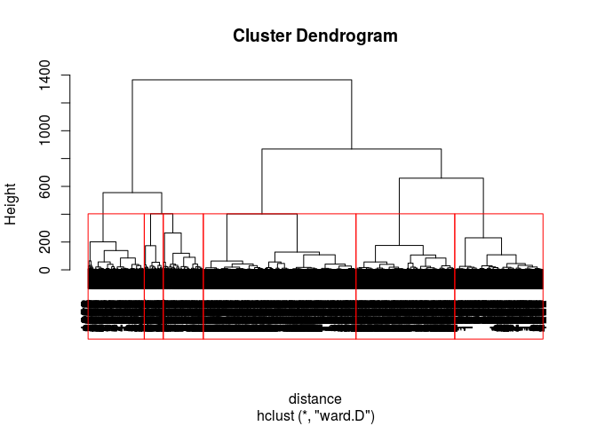

# Market Segmentation for Airlines


```r
library(dplyr)
```

```
## 
## Attaching package: 'dplyr'
```

```
## The following objects are masked from 'package:stats':
## 
##     filter, lag
```

```
## The following objects are masked from 'package:base':
## 
##     intersect, setdiff, setequal, union
```

```r
library(tidyr)
library(flexclust)
```

```
## Loading required package: grid
```

```
## Loading required package: lattice
```

```
## Loading required package: modeltools
```

```
## Loading required package: stats4
```

```r
library(caret)
```

```
## Loading required package: ggplot2
```


```r
airlines<-read.csv('Unit6/AirlinesCluster.csv')
summary(airlines)
```

```
##     Balance          QualMiles         BonusMiles       BonusTrans  
##  Min.   :      0   Min.   :    0.0   Min.   :     0   Min.   : 0.0  
##  1st Qu.:  18528   1st Qu.:    0.0   1st Qu.:  1250   1st Qu.: 3.0  
##  Median :  43097   Median :    0.0   Median :  7171   Median :12.0  
##  Mean   :  73601   Mean   :  144.1   Mean   : 17145   Mean   :11.6  
##  3rd Qu.:  92404   3rd Qu.:    0.0   3rd Qu.: 23800   3rd Qu.:17.0  
##  Max.   :1704838   Max.   :11148.0   Max.   :263685   Max.   :86.0  
##   FlightMiles       FlightTrans     DaysSinceEnroll
##  Min.   :    0.0   Min.   : 0.000   Min.   :   2   
##  1st Qu.:    0.0   1st Qu.: 0.000   1st Qu.:2330   
##  Median :    0.0   Median : 0.000   Median :4096   
##  Mean   :  460.1   Mean   : 1.374   Mean   :4119   
##  3rd Qu.:  311.0   3rd Qu.: 1.000   3rd Qu.:5790   
##  Max.   :30817.0   Max.   :53.000   Max.   :8296
```

Problem 1.3 - Normalizing the Data
2 points possible (graded)
Let's go ahead and normalize our data. You can normalize the variables in a data frame by using the preProcess function in the "caret" package. You should already have this package installed from Week 4, but if not, go ahead and install it with install.packages("caret"). Then load the package with library(caret).

Now, create a normalized data frame called "airlinesNorm" by running the following commands:

preproc = preProcess(airlines)

airlinesNorm = predict(preproc, airlines)

The first command pre-processes the data, and the second command performs the normalization. If you look at the summary of airlinesNorm, you should see that all of the variables now have mean zero. You can also see that each of the variables has standard deviation 1 by using the sd() function.

In the normalized data, which variable has the largest maximum value?


```r
preprocess<- preProcess(airlines)
airlines_norm<-predict(preprocess,airlines)
airlines_norm %>% summarise_all(funs(max(.))) %>% gather() %>% top_n(1)
```

```
## Selecting by value
```

```
##           key    value
## 1 FlightMiles 21.68029
```

```r
airlines_norm %>% summarise_all(funs(min(.))) %>% gather() %>% top_n(-1)
```

```
## Selecting by value
```

```
##               key     value
## 1 DaysSinceEnroll -1.993361
```

Problem 2.1 - Hierarchical Clustering
1 point possible (graded)
Compute the distances between data points (using euclidean distance) and then run the Hierarchical clustering algorithm (using method="ward.D") on the normalized data. It may take a few minutes for the commands to finish since the dataset has a large number of observations for hierarchical clustering.

Then, plot the dendrogram of the hierarchical clustering process. Suppose the airline is looking for somewhere between 2 and 10 clusters. According to the dendrogram, which of the following is NOT a good choice for the number of clusters?

```r
distance <- dist(airlines_norm, method='euclidian')
clusterAir<- hclust(distance,method='ward.D')
plot(clusterAir)
rect.hclust(clusterAir, k = 6)
```

<!-- -->
Problem 2.2 - Hierarchical Clustering
1 point possible (graded)
Suppose that after looking at the dendrogram and discussing with the marketing department, the airline decides to proceed with 5 clusters. Divide the data points into 5 clusters by using the cutree function. How many data points are in Cluster 1?


```r
clusterTree<- cutree(clusterAir,k=7)
table(clusterTree)
```

```
## clusterTree
##   1   2   3   4   5   6   7 
## 776 352 494 868 167 802 540
```
Problem 2.3 - Hierarchical Clustering
2 points possible (graded)
Now, use tapply to compare the average values in each of the variables for the 5 clusters (the centroids of the clusters). You may want to compute the average values of the unnormalized data so that it is easier to interpret. You can do this for the variable "Balance" with the following command:

tapply(airlines$Balance, clusterGroups, mean)

Compared to the other clusters, Cluster 1 has the largest average values in which variables (if any)? Select all that apply.

```r
airlines$group<- clusterTree
head(airlines)
```

```
##   Balance QualMiles BonusMiles BonusTrans FlightMiles FlightTrans
## 1   28143         0        174          1           0           0
## 2   19244         0        215          2           0           0
## 3   41354         0       4123          4           0           0
## 4   14776         0        500          1           0           0
## 5   97752         0      43300         26        2077           4
## 6   16420         0          0          0           0           0
##   DaysSinceEnroll group
## 1            7000     1
## 2            6968     1
## 3            7034     1
## 4            6952     1
## 5            6935     2
## 6            6942     1
```

```r
airlines %>% group_by(group) %>% summarise_each(funs(mean(.)))
```

```
## # A tibble: 7 × 8
##   group   Balance    QualMiles BonusMiles BonusTrans FlightMiles
##   <int>     <dbl>        <dbl>      <dbl>      <dbl>       <dbl>
## 1     1  57866.90    0.6443299  10360.124  10.823454    83.18428
## 2     2 115944.96  128.2045455  24378.207  21.173295  3470.88068
## 3     3 198191.57   30.3461538  55795.860  19.663968   327.67611
## 4     4  52335.91    4.8479263  20788.766  17.087558   111.57373
## 5     5  99549.25 3042.6167665  19727.581  12.023952   806.07186
## 6     6  47198.12    3.5785536   2270.966   3.041147   145.27556
## 7     7  20004.71    0.9259259   2255.611   2.872222    80.77593
## # ... with 2 more variables: FlightTrans <dbl>, DaysSinceEnroll <dbl>
```
Problem 3.1 - K-Means Clustering
1 point possible (graded)
Now run the k-means clustering algorithm on the normalized data, again creating 5 clusters. Set the seed to 88 right before running the clustering algorithm, and set the argument iter.max to 1000.

How many clusters have more than 1,000 observations?


```r
set.seed(88)
KMC<- kmeans(airlines_norm,centers=5)
table(KMC$cluster)
```

```
## 
##    1    2    3    4    5 
##  408  141  993 1182 1275
```

