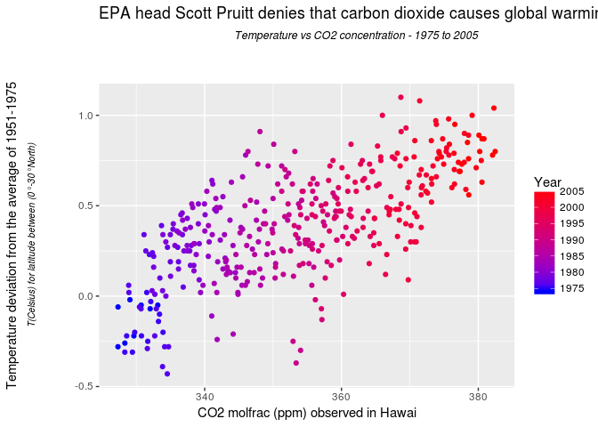

# EPA head Scott Pruitt denies that carbon dioxide causes global warming


This is an [R Markdown](http://rmarkdown.rstudio.com) Notebook. When you execute code within the notebook, the results appear beneath the code. 

Try executing this chunk by clicking the *Run* button within the chunk or by placing your cursor inside it and pressing *Ctrl+Shift+Enter*. 


```r
library(dplyr)
```

```
## 
## Attaching package: 'dplyr'
```

```
## The following objects are masked from 'package:stats':
## 
##     filter, lag
```

```
## The following objects are masked from 'package:base':
## 
##     intersect, setdiff, setequal, union
```

```r
library(tidyr)
library(ggplot2)
library(gridExtra)
```

```
## 
## Attaching package: 'gridExtra'
```

```
## The following object is masked from 'package:dplyr':
## 
##     combine
```

```r
library(grid)


source('multiplot.r')

df<-read.csv('co2_temp.csv')
df$X<-NULL

ggplot(df,aes(y=Temperature,x=co2,color=Year))+geom_point()+scale_color_gradient(low="blue", high="red") +   ggtitle(expression(atop("EPA head Scott Pruitt denies that carbon dioxide causes global warming", atop(italic("Temperature vs CO2 concentration - 1975 to 2005"), ""))))+ xlab("CO2 molfrac (ppm) observed in Hawai") +
  
  ylab(expression(atop("Temperature deviation from the average of 1951-1975", atop(italic("T(Celsius) for latitude between (0°-30°North)"), ""))))
```

<!-- -->

Add a new chunk by clicking the *Insert Chunk* button on the toolbar or by pressing *Ctrl+Alt+I*.

When you save the notebook, an HTML file containing the code and output will be saved alongside it (click the *Preview* button or press *Ctrl+Shift+K* to preview the HTML file).

The preview shows you a rendered HTML copy of the contents of the editor. Consequently, unlike *Knit*, *Preview* does not run any R code chunks. Instead, the output of the chunk when it was last run in the editor is displayed.
